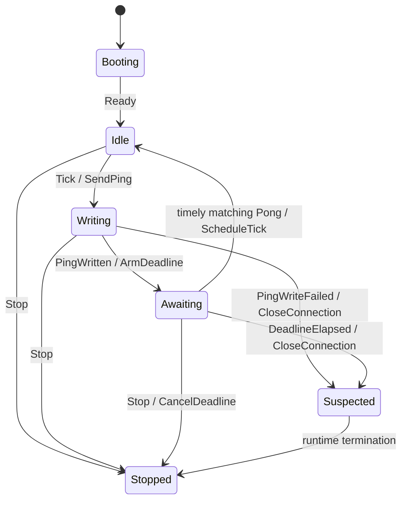
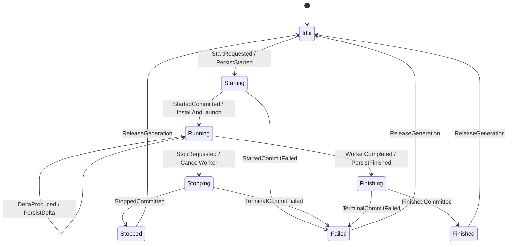
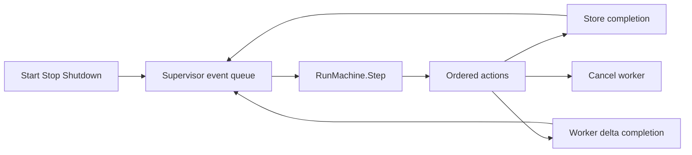

# Effect-Acknowledged State Machines and Runtime Refinement

The WebSocket heartbeat supervisor and the chat inference lifecycle solve different domain problems, but they have the same underlying computational structure. Both accept commands or signals, initiate effects, wait for effect outcomes, reject stale completions, and eventually reach a terminal or reusable state. The common model is an effect-acknowledged state machine supervised by one runtime owner.

Heartbeat already implements this structure directly. Its pure reducer receives typed events and returns ordered actions. The WebSocket supervisor executes those actions and feeds write results, timer events, pong events, and shutdown back into the reducer. Chat inference currently distributes equivalent responsibilities across a command handler, an `activeRun` map, goroutine launch, context cancellation, event publication, cleanup defers, and `WaitIdle`. That distribution allowed an immediate stop to cancel the worker before its first started event reached the store.

This report explains how to close that proof gap. The objective is not to prove only a pure kernel. It is to specify an abstract lifecycle, identify concrete linearization points, define a refinement map from Go runtime state to abstract state, and test that every concrete execution produces a trace permitted by the specification. The resulting method applies to heartbeat, chat startup, background jobs, streaming model calls, request workers, and any Sessionstream subsystem in which concurrency begins before a durable lifecycle boundary is established.

> [!summary]
> - Heartbeat and chat share the model `State × Event → State × Action*` followed by effect execution and completion events.
> - The decisive rule is **effect acknowledgment before state advancement**: queued work is not completed work, and launched work is not durably started work.
> - Heartbeat already has a pure machine and serialized supervisor. Chat currently has equivalent state spread across handlers, goroutines, contexts, and stores.
> - Pure reducer proofs must be complemented by runtime-refinement obligations: linearization, trace inclusion, generation isolation, safety, and conditional liveness.
> - The strongest chat boundary is commit-before-concurrency: persist `InferenceStarted`, install the active generation, then expose success and launch cancellable work.
> - Deterministic barriers, `testing/synctest`, state-aware runtime fuzzing, race tests, and failure injection replace sleep-based schedule assumptions.
> - Share the architecture and test laws first. Do not build a universal supervisor package until multiple retained runtimes require the same concrete policy.

## 1. The common model and the current asymmetry

Both systems can be written as a transition function:

$$
\delta:S\times E\to S\times A^*+Error.
$$

Here:

- $S$ is lifecycle state;
- $E$ is an admitted event, including effect completions;
- $A^*$ is an ordered finite sequence of effect requests;
- the runtime interprets actions and returns outcomes as later events.

The execution loop is:

```text
external input
    -> reducer event
    -> next state and ordered actions
    -> runtime executes actions
    -> effect completion becomes reducer event
```

The systems differ in current implementation maturity:

| Concern | Heartbeat | Chat inference |
|---|---|---|
| Explicit state enum | `heartbeat.Phase` | Implicit in presence of `activeRun`, context status, goroutine progress, and emitted events |
| Typed input events | `heartbeat.EventKind` | Start/stop commands plus implicit goroutine and context events |
| Typed actions | `heartbeat.ActionKind` | Direct calls to publish, launch, cancel, wait, and clear |
| Pure transition function | `Machine.Step` | None |
| Single runtime owner | `runHeartbeatSupervisor` per connection | Mutex-protected map plus independently executing worker goroutines |
| Generation identity | Explicit generation on state, events, and actions | Message ID partially acts as generation |
| Effect completion feedback | `PingWritten`, `PingWriteFailed`, deadline and pong events | Publication return values handled locally; worker completion closes `done` |
| Deterministic reducer tests | Transition tests and state-aware fuzzing | End-to-end example tests |
| Runtime arbitration tests | Seeded deadline/pong fuzzer | Sleep-based test until immediate-stop hardening |

The same logical model is present in both. Only heartbeat has made it explicit enough to test in layers.

## 2. Effect acknowledgment is the central law

An action request is not evidence that its effect occurred.

### 2.1 Heartbeat

The heartbeat machine does not start the pong deadline when `ActionSendPing` is returned. The runtime first calls `sendFrameTracked`. Only the sole writer can report the actual write result. The supervisor converts that result into:

```go
heartbeat.Event{
    Kind:       heartbeat.EventPingWritten,
    At:         result.at,
    Generation: writeGeneration,
    Nonce:      writeNonce,
}
```

The reducer then enters `Awaiting` and returns `ActionArmDeadline`.

The legal sequence is:

```text
Tick
  -> SendPing
  -> frame queued
  -> writer attempts socket write
  -> PingWritten(actual timestamp)
  -> Awaiting
  -> ArmDeadline(actual timestamp + timeout)
```

Starting the deadline at queue admission would charge local queue delay to the remote client and would violate the failure-detector model.

### 2.2 Chat startup

The corresponding lifecycle should be:

```text
StartRequested
  -> PersistStarted
  -> store commits canonical started event
  -> StartedCommitted
  -> install active generation
  -> LaunchWorker
  -> Running
```

The current implementation instead does:

```text
publish user event
  -> install activeRun
  -> launch worker goroutine
  -> return Start success
  -> worker eventually publishes InferenceStarted
```

An immediate stop can occur after `Start` returns but before the worker's first store operation. Before the current local fix, cancellation of the worker context could cause started publication to fail, leaving no assistant entity for the stopped event to update.

The local fix uses `context.WithoutCancel(ctx)` for started publication. This establishes a useful guarantee: accepted cancellation no longer suppresses the started event. The stronger architecture is to move started publication before goroutine launch so no schedule is required to establish the lifecycle root.

### 2.3 General law

For an action $a$ with completion event $c(a)$:

$$
Requested(a)\not\Rightarrow Completed(a).
$$

State that depends on completion may advance only after the completion event:

$$
StateAfter(a)\Rightarrow Observed(c(a)).
$$

Examples across Sessionstream include:

```text
queued ping       != written ping
queued frame      != written frame
launched worker   != durable started run
canceled context  != durable stopped event
store call begun  != committed materialization
observer accepted != callback completed
```

## 3. Abstract lifecycle specifications

### 3.1 Heartbeat phases

Heartbeat uses:

```text
Booting
Idle
Writing
Awaiting
Suspected
Stopped
```

Its primary path is:



### 3.2 Proposed chat phases

Chat requires at least:

```text
Idle
Starting
Running
Stopping
Finishing
Stopped
Finished
Failed
```

A smaller implementation may collapse `Stopping` and `Finishing` into a terminal-commit phase, but it should not collapse durable and requested transitions.



If start and stop commands can execute concurrently, the per-session supervisor serializes them. A stop admitted while `Starting` can set `stopPending`; after `StartedCommitted`, the machine launches and immediately cancels, or skips work and persists `Stopped`, according to the declared contract. There is no unmodeled interval.

## 4. Lifecycle laws

The abstract model is useful only when it states properties that runtime and tests must preserve.

Let $g$ identify one run generation.

### 4.1 Successful start establishes durable lifecycle state

Choose one public contract and make it explicit. The strongest is:

$$
StartReturnedNil(g)\Rightarrow DurableStarted(g)\land Active(g).
$$

A weaker contract such as “start was queued” would require an explicit acceptance event and a separate eventual-start API. The current synchronous `Hub.Submit` shape supports the stronger contract better.

### 4.2 Started precedes all run output

For every delta or terminal event $x$:

$$
RunEvent(x,g)\land x\ne Started(g)
\Rightarrow Started(g)<x.
$$

### 4.3 Terminal uniqueness

Exactly one terminal outcome is committed:

$$
\left|\{Stopped(g),Finished(g),Failed(g)\}\right|=1.
$$

If failure is represented as returned error rather than canonical event, adjust the set but retain uniqueness.

### 4.4 No output after terminal

$$
Terminal(g)<e\Rightarrow e\notin Delta(g).
$$

A stale worker may still attempt output. Generation checking prevents admission.

### 4.5 Generation isolation

$$
generation(e)\ne activeGeneration(sid)
\Rightarrow state'=state.
$$

Heartbeat uses generation and nonce. Chat currently uses message ID in `clearRun`, preventing an old worker from deleting a newer active run, but worker publication itself is not yet admitted through a generation-checking supervisor.

### 4.6 Stop liveness under assumptions

Under fair goroutine scheduling, terminating cancellation-aware work, and an available event store:

$$
StopAccepted(g)\Rightarrow\Diamond TerminalCommitted(g).
$$

The assumptions matter. Go cannot force arbitrary worker code to return, and a permanently failing store prevents durable terminal commitment.

### 4.7 Failed startup leaves no active run

$$
StartedCommitFailed(g)\Rightarrow\neg Active(g).
$$

Install-after-commit makes this property direct.

### 4.8 Replacement is generation-safe

For replacement $g_2$ after $g_1$:

$$
Active(g_2)\Rightarrow
\forall e\in Future(g_1):Reject(e).
$$

Waiting for the prior worker may be one implementation. Generation rejection is still required when completions can race with replacement.

## 5. Commit-before-concurrency

The simplest way to prevent startup races is to establish durable lifecycle state before launching independently scheduled work.

### 5.1 Recommended start flow

```go
func (e *Engine) handleStartInference(
    ctx context.Context,
    cmd sessionstream.Command,
    _ *sessionstream.Session,
    pub sessionstream.EventPublisher,
) error {
    spec, err := e.prepareRun(cmd)
    if err != nil {
        return err
    }

    if previous := e.detachPrevious(cmd.SessionId); previous != nil {
        previous.cancel()
        <-previous.done
    }

    if err := e.publish(ctx, cmd.SessionId, pub,
        EventUserMessageAccepted, spec.userEvent); err != nil {
        return err
    }
    if err := e.publish(ctx, cmd.SessionId, pub,
        EventInferenceStarted, spec.startedEvent); err != nil {
        return err
    }

    run := e.installRun(cmd.SessionId, spec)
    go e.executeRun(run, pub)
    return nil
}
```

The exact placement of user-event publication and replacement cancellation is a product decision. The invariant is that success is not returned before the promised durable prefix and active generation exist.

### 5.2 Linearization point

A concurrent operation should appear to take effect at one point between invocation and return. For start, choose:

```text
Started event committed
and active generation installed
```

If those are separate operations, define their ordering and failure compensation. A supervisor can hold the lifecycle lock while installing state after commit, or model `StartedCommitted` as an event whose reducer action installs and launches before replying to the command.

### 5.3 Why launching first is harder

Launch-before-commit creates states such as:

```text
worker running, no durable started event
worker canceled, no durable started event
worker completed, started publication pending
replacement installed, old started publication pending
```

Every state needs recovery and ordering rules. Commit-before-concurrency removes them.

### 5.4 Limits

A durable started event does not make worker launch atomic with persistence. The process can crash after commit and before launch. The system must choose one policy:

- started runs are resumable after restart;
- a recovery loop marks abandoned starts failed;
- start and work intent are stored in a durable job queue;
- the example documents process-local execution and no crash recovery.

The correct choice depends on whether chatdemo remains an example or becomes production infrastructure.

## 6. Supervisor structure

A supervisor is the concrete runtime owner that serializes inputs, executes reducer actions, and returns effect completions.

### 6.1 Heartbeat supervisor

`runHeartbeatSupervisor` owns:

```text
tick timer
deadline timer
write acknowledgment channel
write generation and nonce
deadline generation
stopped state
reducer application
```

The only reducer entry is the local `apply` function. Timers, pongs, writes, and shutdown all pass through it.

### 6.2 Proposed run supervisor

```go
type runSupervisor struct {
    machine *RunMachine
    events  chan RunEvent

    publisher sessionstream.EventPublisher
    sessionID sessionstream.SessionId

    workerCancel context.CancelFunc
    done         chan struct{}
}

func (s *runSupervisor) run(ctx context.Context) {
    defer close(s.done)
    for {
        select {
        case <-ctx.Done():
            s.apply(RunEvent{Kind: RunEventShutdown})
        case event := <-s.events:
            s.apply(event)
        }
        if s.machine.State().Phase == RunPhaseClosed {
            return
        }
    }
}
```

Action execution feeds completions back rather than mutating reducer state:

```go
func (s *runSupervisor) execute(action RunAction) {
    switch action.Kind {
    case ActionPersistStarted:
        err := s.publishStarted(action)
        s.offer(eventFromStartedResult(action.Generation, err))

    case ActionLaunchWorker:
        s.launchWorker(action.Generation)

    case ActionCancelWorker:
        if s.workerCancel != nil {
            s.workerCancel()
        }

    case ActionPersistStopped:
        err := s.publishStopped(action)
        s.offer(eventFromStoppedResult(action.Generation, err))
    }
}
```

### 6.3 One owner, many effect producers

Persistence calls and worker execution may run outside the supervisor when they can block. Their results must return as generation-tagged events. They do not update lifecycle state directly.



### 6.4 Queue policy must match correctness

Unlike diagnostic dispatch, supervisor events are correctness-critical. A full event queue cannot silently drop stop, persistence completion, or worker terminal events.

Valid policies include:

```text
block a noncritical producer with cancellation
return an explicit error
fail the run
close the session
use a mailbox with reserved control capacity
persist the event before admission
```

The best-effort observer dispatcher is not reusable for this queue.

## 7. Runtime refinement

A pure reducer proof covers only events that reach `Step` in the order presented. Runtime refinement proves that the concrete Go machinery presents legal events and implements actions faithfully.

### 7.1 Abstract and concrete states

Let:

- $C$ be concrete Go runtime state;
- $S$ be abstract machine state;
- $\alpha:C\to S$ be an abstraction function.

For chat, concrete state may include:

```text
active map entry
message ID
context cancellation status
done-channel status
goroutine program counter
store records
pending publish call
```

The abstraction map derives one phase:

```text
no active run and no pending commit -> Idle
started commit pending              -> Starting
active uncanceled worker            -> Running
active canceled worker              -> Stopping
terminal commit pending             -> Stopping or Finishing
terminal durable and no active run  -> Stopped or Finished
```

### 7.2 Concrete-step obligation

For every concrete transition:

$$
C_i\to C_{i+1}
$$

either it is a stuttering step:

$$
\alpha(C_i)=\alpha(C_{i+1}),
$$

or it corresponds to one legal abstract step:

$$
\alpha(C_i)\to_S\alpha(C_{i+1}).
$$

Mutex acquisition, channel polling, and local allocation commonly stutter. Durable commit, stop admission, and generation replacement advance abstract state.

### 7.3 Trace inclusion

Project concrete execution onto public lifecycle observations with $P$:

$$
P:Trace_C\to Trace_S.
$$

The refinement criterion is:

$$
P(Traces(ConcreteRuntime))\subseteq Traces(AbstractMachine).
$$

The immediate-stop failure produced a concrete trace absent from the intended abstract lifecycle:

```text
StartSucceeded(g)
StopSucceeded(g)
NoStarted(g)
NoTerminal(g)
```

That counterexample reveals a missing transition or a runtime violation. The desired specification rejects it.

### 7.4 Action-refinement obligation

For each action, define its concrete implementation and completion evidence:

| Abstract action | Concrete implementation | Completion event |
|---|---|---|
| `SendPing` | queue tracked frame to sole writer | `PingWritten` or `PingWriteFailed` |
| `ArmDeadline` | create generation-tagged timer | `DeadlineElapsed` |
| `PersistStarted` | `EventPublisher.Publish` | `StartedCommitted` or `StartedCommitFailed` |
| `LaunchWorker` | create context and goroutine | `WorkerStarted` if needed |
| `CancelWorker` | invoke generation-owned cancel function | `WorkerCanceled` |
| `PersistTerminal` | publish stopped/finished event | terminal commit success/failure |

The table is part of the design contract. It prevents “action executed” from meaning only “function called.”

## 8. Linearization points

Herlihy and Wing's linearizability criterion is useful for public runtime operations.

| Operation | Candidate linearization point |
|---|---|
| Heartbeat pong admission | Successful send to heartbeat event queue |
| Heartbeat write | Sole writer's successful `WriteMessage` completion timestamp |
| Heartbeat suspicion | Reducer accepts current-generation deadline at or after deadline |
| Chat start | Started event durable and active generation installed |
| Chat stop | Supervisor marks current generation stopping and owns cancellation |
| Chat delta | Supervisor accepts matching-generation delta for persistence |
| Chat terminal | Terminal event durable |
| Run replacement | New generation becomes active under supervisor ownership |
| Wait idle | Supervisor reaches an idle/closed phase after terminal handling |

A method that returns before its linearization point needs a future, acknowledgment channel, or explicitly asynchronous API name. A synchronous method returning `nil` should not leave its core promise pending without saying so.

## 9. Safety and liveness are separate

### 9.1 Safety

Safety says forbidden behavior never occurs:

```text
no delta before started
no more than one terminal event
no stale generation mutates current state
no deadline for generation g expires generation g+1
no stopped run remains active
no start failure leaves a worker installed
```

Safety can usually be checked on finite traces.

### 9.2 Liveness

Liveness says desired progress eventually occurs:

```text
accepted start eventually becomes running or failed
accepted stop eventually becomes terminal
accepted heartbeat challenge eventually receives pong or becomes suspected
shutdown eventually releases owned workers
```

Liveness depends on assumptions:

```text
goroutines are fairly scheduled
callbacks and stores eventually return
timers eventually deliver
workers honor cancellation
queues admit control events
```

The report and tests should state those assumptions. A pure reducer cannot guarantee them.

### 9.3 Bounded waiting

Where liveness cannot be guaranteed, expose a bounded wait:

```go
func (s *runSupervisor) Wait(ctx context.Context) error
```

A timeout reports incomplete shutdown; it does not terminate arbitrary Go code.

## 10. Deterministic schedule testing

Sleep-based tests select one likely schedule and introduce wall-clock delay. They do not establish a boundary.

### 10.1 Barrier-controlled effects

Inject controllable effect implementations:

```go
type controlledPublisher struct {
    startedEntered chan struct{}
    releaseStarted chan struct{}
    inner          sessionstream.EventPublisher
}

func (p *controlledPublisher) Publish(ctx context.Context, ev sessionstream.Event) error {
    if ev.Name == EventInferenceStarted {
        close(p.startedEntered)
        select {
        case <-p.releaseStarted:
        case <-ctx.Done():
            return ctx.Err()
        }
    }
    return p.inner.Publish(ctx, ev)
}
```

The test chooses the schedule:

```text
start requested
started publication enters barrier
stop requested
release publication
observe terminal trace
```

### 10.2 Schedule matrix

Test at least:

| Boundary | Forced ordering |
|---|---|
| Startup commit | stop before, during, and after started commit |
| Worker launch | stop before first worker instruction |
| Delta persistence | stop while delta commit is blocked |
| Natural completion | stop concurrent with final worker completion |
| Replacement | new start while prior terminal commit is blocked |
| Store failure | started, delta, and terminal commit failures |
| Shutdown | shutdown during starting, running, and stopping |
| Stale output | old generation emits after replacement |

### 10.3 Assertions use authoritative state

Prefer:

```text
canonical event history
hydration snapshot
supervisor state
returned command result
worker ownership
```

over diagnostic observer timing. Asynchronous observers require eventual assertions and are not the state-machine authority.

## 11. `testing/synctest`

Go's `testing/synctest` package supports concurrent tests in an isolated bubble. Goroutines created in the bubble share a fake clock, and `synctest.Wait` waits until goroutines are durably blocked.

```go
func TestImmediateStop(t *testing.T) {
    synctest.Test(t, func(t *testing.T) {
        engine := newEngineForTest()

        require.NoError(t, engine.Start(ctx, sid, prompt))
        require.NoError(t, engine.Stop(ctx, sid))
        synctest.Wait()

        assertLifecycle(t, engine.Trace(sid))
    })
}
```

This is useful for:

- `time.After` in chunk loops;
- timer reset and stop behavior;
- context deadlines;
- waiting until participating goroutines block;
- removing real sleeps from tests.

It does not automatically control external sockets, databases, subprocesses, or goroutines created outside the bubble. Use in-memory stores, `net.Pipe`, or explicit barriers for those boundaries.

The archived Go sources are:

- [Testing concurrent code with testing/synctest](sources/14-go-blog-testing-concurrent-code-with-synctest.md)
- [`testing/synctest` package documentation](sources/15-go-testing-synctest-package.md)

## 12. Runtime state-machine fuzzing

Reducer fuzzing and runtime fuzzing answer different questions.

### 12.1 Reducer fuzzing

Generate valid and stale event sequences and assert state invariants:

```text
phase transitions are legal
generation never decreases
one terminal phase
stale events do not alter current generation
actions are legal for the resulting transition
```

### 12.2 Runtime fuzzing

Generate schedules of external inputs and effect completions:

```go
type ScheduleStep struct {
    Kind       StepKind
    Generation uint8
    Result     ResultKind
    DelayClass DelayClass
}
```

Possible steps:

```text
request start
complete started persistence
fail started persistence
request stop
release worker
produce delta
complete delta persistence
complete worker naturally
complete cancellation
complete terminal persistence
request replacement
shutdown
```

The harness uses fake effects and barriers. After every step it computes $\alpha(C)$ and checks that the projected concrete trace is accepted by the abstract machine.

### 12.3 Seed counterexamples

Every discovered failure becomes a named seed. Heartbeat retained the deadline/pong counterexample in `FuzzHeartbeatDeadlineArbitration`. Chat should retain seeds for:

```text
immediate stop before worker first instruction
stop versus final completion
replacement versus stale terminal
terminal store failure
shutdown versus pending started commit
```

### 12.4 Bounded schedule exploration

For a small number of effect completions, enumerate all permutations consistent with explicit happens-before constraints. This is often more effective than random sleeps.

For example, with:

```text
StartedCommitted
StopRequested
WorkerCanceled
StoppedCommitted
```

enumerate legal and illegal orderings and compare the runtime's accepted traces with the abstract specification.

## 13. Formal methods without production formal infrastructure

The abstract machine can be reviewed and tested without introducing TLA+ or Quint into production builds.

A lightweight specification package can provide:

```text
state enum
event enum
action enum
transition table
invariant functions
trace checker
```

Optional design-time model checking can explore bounded interleavings, but checked-in Go tests remain the executable repository contract. The useful formal artifacts are:

- an explicit state space;
- total event handling by phase;
- safety invariants;
- liveness assumptions;
- refinement mapping;
- trace inclusion checks;
- counterexample seeds.

The I/O-automata source in [Lynch and Tuttle](sources/07-lynch-tuttle-io-automata.pdf) supplies the hierarchical refinement foundation. [Lamport](sources/01-lamport-time-clocks-ordering.pdf) supplies partial-order reasoning, and [Herlihy and Wing](sources/02-herlihy-wing-linearizability.pdf) supplies operation linearization.

## 14. Proposed Go design

### 14.1 Domain-specific reducer

```go
type RunPhase uint8

const (
    RunIdle RunPhase = iota
    RunStarting
    RunRunning
    RunStopping
    RunFinishing
    RunStopped
    RunFinished
    RunFailed
    RunClosed
)

type RunState struct {
    Phase      RunPhase
    Generation uint64
    MessageID  string
    Prompt     string
    Text       string
    StopPending bool
}

type RunMachine struct {
    state RunState
}

func (m *RunMachine) Step(event RunEvent) ([]RunAction, error)
func (m *RunMachine) State() RunState
```

Keep it in the chat example or application package. Do not add chat semantics to core Sessionstream.

### 14.2 Typed events

```go
type RunEventKind uint8

const (
    RunEventStartRequested RunEventKind = iota
    RunEventStartedCommitted
    RunEventStartedCommitFailed
    RunEventStopRequested
    RunEventDeltaProduced
    RunEventWorkerCompleted
    RunEventWorkerCanceled
    RunEventTerminalCommitted
    RunEventTerminalCommitFailed
    RunEventShutdown
)

type RunEvent struct {
    Kind       RunEventKind
    Generation uint64
    MessageID  string
    Prompt     string
    Delta      string
    Err        error
}
```

### 14.3 Typed actions

```go
type RunActionKind uint8

const (
    ActionPersistStarted RunActionKind = iota
    ActionInstallRun
    ActionLaunchWorker
    ActionPersistDelta
    ActionCancelWorker
    ActionPersistStopped
    ActionPersistFinished
    ActionReleaseRun
    ActionStopSupervisor
)
```

Actions remain domain-specific because persistence and terminal policy differ from heartbeat.

### 14.4 Command acknowledgment

A command request to the supervisor needs a reply:

```go
type commandEnvelope struct {
    event RunEvent
    reply chan error
}
```

The reducer returns or triggers the reply only at the declared linearization point. `Start` returns after durable started commitment and run installation. `Stop` returns after the generation is marked stopping and cancellation ownership is established, unless the API explicitly promises terminal commitment before return.

### 14.5 Avoid reentrant action recursion where possible

Heartbeat's local `apply` function recursively feeds immediate action failures back into the reducer. This is bounded by the transition structure. A general run supervisor can instead enqueue completion events to avoid deep reentrancy and make ordering visible. If immediate recursion remains, prove a strict measure decreases on every recursive path.

## 15. Migration from current chatdemo

### Phase 1: State the existing contract

Document:

```text
what Start success guarantees
what Stop success guarantees
whether replacement waits
whether Started is durable before success
whether terminal persistence may fail silently
whether runs survive process restart
```

### Phase 2: Move started commitment into the handler

Before introducing a full supervisor:

1. Prepare message identity and typed events.
2. Stop and join a replaced run according to current behavior.
3. Publish user and started events synchronously.
4. Install the run.
5. Launch the worker.
6. Return success.

This removes the immediate-start gap with a small change.

### Phase 3: Add generation to `activeRun`

```go
type activeRun struct {
    generation uint64
    messageID  string
    cancel     context.CancelFunc
    done       chan struct{}
}
```

Reject stale worker completion and output after replacement.

### Phase 4: Centralize terminalization

Use one function or supervisor transition for stopped, finished, and failed outcomes. It must enforce exactly-once terminal admission.

### Phase 5: Introduce the pure `RunMachine`

Move phase and generation decisions into `Step`. Keep store, goroutine, and context operations in the adapter.

### Phase 6: Introduce one per-session supervisor only if needed

If production code needs concurrent start, stop, replace, shutdown, retries, and recovery, make the supervisor explicit. For a small example with synchronous command serialization, commit-before-concurrency plus generation checks may be sufficient.

## 16. What should and should not be generalized

### Share these concepts

```text
State × Event -> State × ordered Actions
effect requests receive completion events
generations reject stale completion
one owner serializes lifecycle events
public methods have linearization points
runtime traces refine an abstract machine
tests force schedules rather than sleep
```

### Share these test patterns

```text
transition-table tests
state-aware event fuzzing
runtime schedule fuzzing
barrier-controlled effects
trace inclusion assertions
race-enabled repetitions
counterexample seeds
```

### Do not immediately share these production types

```text
one universal Event
one universal Action
one generic supervisor with policy switches
one best-effort queue for correctness events
one lifecycle enum for unrelated domains
```

Heartbeat and chat have different failure meaning, persistence, timing, replacement, and terminal behavior. A generic supervisor with callbacks for every distinction would hide the very contracts the refactor is intended to expose.

## 17. Relationship to observer dispatch

The bounded observer dispatcher and lifecycle supervisors both use queues and workers, but their contracts are different.

| Property | Observer dispatcher | Heartbeat/run supervisor |
|---|---|---|
| Work may be dropped | Yes, at explicit overflow admission | No for correctness-critical events |
| Producer blocks for queue space | No | Policy-specific; must not silently lose control events |
| Output meaning | Diagnostic callback | Protocol or product state transition |
| Close behavior | Close admission, drain accepted callbacks | Reach legal terminal state, cancel effects, release ownership |
| Panic policy | Recover callback panic and continue | Invariant failure normally fails connection/run |
| Ordering | FIFO admission order | Domain event order plus effect-completion rules |

Sharing the queue implementation would import the wrong loss policy. Sharing the transition-and-refinement vocabulary is appropriate.

## 18. Review and verification checklist

### Abstract machine

- [ ] Every phase lists behavior for every event kind.
- [ ] Stale generations are explicit.
- [ ] Ordered actions are documented.
- [ ] Terminal uniqueness is an invariant.
- [ ] Liveness assumptions are stated.

### Runtime adapter

- [ ] Every action has a concrete implementation and completion event.
- [ ] Public operations have linearization points.
- [ ] One owner serializes lifecycle decisions.
- [ ] Blocking effects run outside lifecycle locks.
- [ ] Effect results retain generation and identity.
- [ ] Queue overload cannot silently drop correctness events.

### Persistence

- [ ] Successful start has a declared durable boundary.
- [ ] Failed start leaves no active run.
- [ ] Terminal persistence failure is observable.
- [ ] Restart policy for started but incomplete work is documented.

### Tests

- [ ] No correctness test depends only on `time.Sleep`.
- [ ] Immediate stop is deterministic.
- [ ] Stop versus finish is forced in both orders.
- [ ] Replacement rejects stale output.
- [ ] Store failures are injected at every lifecycle boundary.
- [ ] Runtime trace is checked against the abstract machine.
- [ ] Tests run under `-race` and repeated schedules.
- [ ] Counterexamples remain checked-in seeds.

## 19. Decision records

### Decision: Treat heartbeat as the structural reference

- **Context:** Heartbeat already separates pure state transition from runtime effects and completion events.
- **Options considered:** Leave chat lifecycle ad hoc; copy heartbeat's exact code; adopt the same reducer-supervisor structure with chat-specific types.
- **Decision:** Use heartbeat as the architectural reference while keeping chat state, events, actions, and persistence policy domain-specific.
- **Rationale:** The structure addresses the same concurrency problem without forcing unrelated semantics into one type hierarchy.
- **Consequences:** Some code shape is repeated intentionally. Shared helpers should emerge only from repeated stable mechanics.
- **Status:** proposed

### Decision: Commit started state before launching cancellable work

- **Context:** A worker can observe cancellation before its first durable event.
- **Options considered:** Sleep in tests; detach first publication; launch then compensate; commit before launch.
- **Decision:** Use commit-before-concurrency as the target contract. The current `WithoutCancel` fix is an interim hardening step.
- **Rationale:** It removes invalid intermediate states and gives `Start` a precise linearization point.
- **Consequences:** Startup includes store latency. Crash-after-commit policy must be documented.
- **Status:** proposed

### Decision: Verify runtime refinement as a separate layer

- **Context:** Pure reducer correctness does not prove channel arbitration, goroutine launch, effect ordering, or persistence acknowledgment.
- **Options considered:** Rely on reducer tests; rely on end-to-end stress; add explicit refinement tests and controlled schedules.
- **Decision:** Maintain separate reducer, adapter, arbitration, persistence, and end-to-end proof obligations.
- **Rationale:** Each layer has distinct failure modes and evidence.
- **Consequences:** Test infrastructure becomes more deliberate but failures localize better.
- **Status:** accepted

### Decision: Do not reuse best-effort dispatch for supervisor events

- **Context:** Both systems involve queued events.
- **Options considered:** Reuse bounded `Dispatcher[T]`; create correctness-specific mailbox semantics; direct serialized calls.
- **Decision:** Never use overflow-dropping observer dispatch for start, stop, completion, persistence, or heartbeat events.
- **Rationale:** Loss changes protocol and product state.
- **Consequences:** Supervisor queue overload needs explicit blocking, error, persistence, or failure policy.
- **Status:** accepted

## 20. Open questions

1. Does chat `Start` need to return after `Started` durability, or should it expose an asynchronous acknowledgment explicitly?
2. Should `Stop` return after cancellation admission or after durable stopped commitment?
3. Should replacement publish `Stopped` for the previous generation before committing the next start?
4. Is chatdemo process-local by design, or should started work be recoverable after restart?
5. Can Hub submissions for one session execute concurrently, and if so, should run supervision own per-session command serialization?
6. Should terminal publication failures retry, become durable errors, or fail the supervisor?
7. Is `testing/synctest` suitable for the retained Go version and all in-memory effects used by chatdemo?
8. Which trace fields are sufficient to check runtime refinement without restoring broad production observer APIs?

## 21. Working rules

- Do not advance state based only on effect initiation.
- Convert effect outcomes into typed completion events.
- Establish durable lifecycle roots before launching cancellable work.
- Give every public concurrent operation a linearization point.
- Tag every asynchronous completion with generation and domain identity.
- Serialize lifecycle decisions through one owner.
- Keep blocking effects outside lifecycle locks.
- Distinguish safety properties from liveness assumptions.
- Replace sleep-based schedules with barriers, fake time, or bounded schedule exploration.
- Check concrete traces against an abstract state machine.
- Preserve every discovered counterexample as a deterministic test or fuzz seed.
- Do not use best-effort observer queues for correctness-critical events.
- Generalize stable mechanics only after a second retained implementation demonstrates the same policy.

## 22. Sources and repository evidence

Primary formal and testing sources are archived under [sources/README.md](sources/README.md), particularly:

- [Lamport — Time, Clocks, and the Ordering of Events](sources/01-lamport-time-clocks-ordering.pdf)
- [Herlihy and Wing — Linearizability](sources/02-herlihy-wing-linearizability.pdf)
- [Lynch and Tuttle — I/O Automata and Hierarchical Correctness](sources/07-lynch-tuttle-io-automata.pdf)
- [Chandra and Toueg — Unreliable Failure Detectors](sources/06-chandra-toueg-unreliable-failure-detectors.pdf)
- [Go Blog — Testing concurrent code with `testing/synctest`](sources/14-go-blog-testing-concurrent-code-with-synctest.md)
- [Go package documentation — `testing/synctest`](sources/15-go-testing-synctest-package.md)

Repository evidence:

- `pkg/sessionstream/transport/ws/internal/heartbeat/machine.go`
- `pkg/sessionstream/transport/ws/heartbeat.go`
- `pkg/sessionstream/transport/ws/heartbeat_arbitration_test.go`
- `pkg/sessionstream/transport/ws/heartbeat_runtime_fuzz_test.go`
- `examples/chatdemo/chat.go`
- `examples/chatdemo/chat_test.go`
- `pkg/sessionstream/hub.go`
- `ttmp/2026/08/10/SESSIONSTREAM-005--timed-failure-detector-and-websocket-heartbeat-state-machine/`
- `ttmp/2026/08/11/SESSIONSTREAM-006--remove-systemlab-and-downstream-diagnostic-complexity/`

## Closing conclusion

Heartbeat and chat startup share the same underlying model: a lifecycle machine receives events, requests ordered effects, and advances only when those effects produce explicit completion evidence. Heartbeat already expresses that model in code. Chat currently expresses it indirectly through goroutine and context behavior.

The next improvement is not merely another reducer. It is a complete refinement boundary:

```text
abstract lifecycle
    -> pure transition machine
    -> runtime supervisor
    -> effect acknowledgment
    -> concrete trace projection
    -> refinement checks
```

That structure makes runtime machinery part of the correctness argument. It addresses the class of failures that remain invisible when proofs stop at the logical kernel.
