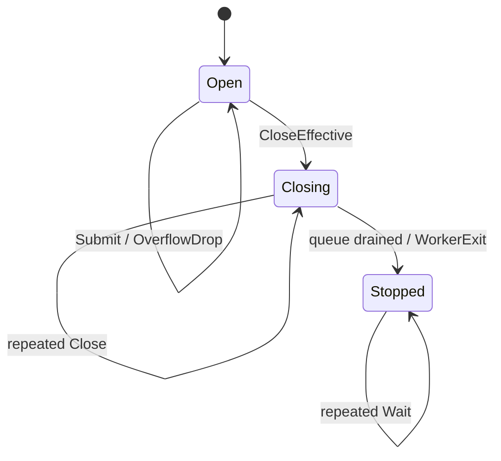

# Observer as Diagnostic Projection and Refinement Boundary

Sessionstream's WebSocket observer is not a second event store and it is not a generic replacement for the canonical session event path. It is a diagnostic projection of transport execution, delivered through a deliberately weaker asynchronous contract. Producers prepare an immutable `TransportRecord`, attempt bounded admission, and continue without waiting for user callback code. A single worker offers accepted records in FIFO admission order, recovers from observer panics, drains accepted work during graceful shutdown, and exposes an explicit completion boundary.

The observer trace added around this mechanism makes the boundary inspectable. It records abstract model transitions such as `submit_accepted`, `receive`, `offered`, `submit_dropped`, `close_effective`, and `worker_exit`, while a second interval stream records invocation, linearization, cancellation, and return bounds. The two streams are useful together: the model stream says what abstract transition occurred; the interval stream says where that transition sits inside a concurrent operation. Go's `runtime/trace` task and region events provide an execution-level companion rather than a replacement for the domain trace.

> [!summary]
> - An observer is a **trace projection**, not authority: it reports execution evidence and must not be required for product correctness.
> - A bounded single-worker dispatcher provides FIFO admission order, nonblocking best-effort delivery, explicit overflow accounting, panic isolation, drain-on-close, and wait-for-completion.
> - The implementation is a composition of the Observer, Producer–Consumer, Mailbox, Bulkhead, Single-Writer, and Flight Recorder patterns, constrained by a lossy delivery policy.
> - The mathematical core is a labeled transition system whose attempted submission word is mapped to the accepted subsequence, then to a callback trace; linearization points and happens-before edges make the concurrent implementation reviewable.
> - Refinement tracing is most valuable when it records both abstract transitions and operation intervals, because one global sequence cannot represent all concurrent order relations honestly.
> - This is a candidate ecosystem pattern for diagnostics only. It must not be reused for canonical events, commands, authorization decisions, persistence, or correctness-critical control messages. The idea is tracked as [sessionstream issue #14](https://github.com/go-go-golems/sessionstream/issues/14) in the [Architecture & Pattern Catalog project](https://github.com/orgs/go-go-golems/projects/3), currently in `Documented` status.

## 1. Why this note exists

The immediate implementation question was how to observe a WebSocket transport without putting arbitrary diagnostic code on socket, request, heartbeat, or connection-lifecycle critical paths. The deeper architecture question is how an observer should relate to the system it observes.

A direct callback looks simple:

```go
observer.OnTransport(ctx, record)
```

but it imports callback latency, callback allocation, callback panic, callback cancellation, callback memory ownership, and callback shutdown behavior into the caller's critical path. A goroutine removes only the direct latency. It does not answer queue bounds, overflow, ordering, close races, callback isolation, ownership transfer, or completion.

The observer therefore needs two explicit contracts:

1. **Observation meaning:** what occurrence a `TransportRecord` represents, what its fields mean, and what order it claims.
2. **Delivery policy:** how a prepared record is admitted, retained, offered, dropped, isolated, and retired.

Keeping these contracts separate is the central design decision. The domain observer knows about transport stages; the dispatcher knows about bounded asynchronous delivery. The refinement trace then makes the delivery policy testable without pretending that runtime scheduling is one total order.

## 2. The general pattern

### 2.1 Observer as a trace projection

Let an executing system produce an internal history of occurrences:

$$
H \in T^*
$$

where $T$ is a typed alphabet of internal transitions: frame reads, snapshot sends, queue admissions, heartbeat writes, callback attempts, and lifecycle changes. An observer is a projection and encoding:

$$
\pi : T^* \rightarrow O^*
$$

where $O$ is the observation alphabet. It may select only some occurrences, add diagnostic fields, redact payloads, or translate internal types into a stable public record. It should not become the source of truth for the transition it describes.

For the WebSocket transport, the projection is intentionally broad enough to explain client-visible behavior but not so broad that it captures arbitrary application state. `TransportStage` names the point in the adapter lifecycle; `FrameDirection`, connection/session IDs, ordinals, queue metrics, snapshot summaries, fanout targets, and errors provide evidence around that point.

The observer therefore answers questions such as:

```text
Was a subscription received?
Was the snapshot loaded and sent?
Was a UI event buffered, sent, or dropped?
Was a server frame queued, written, or rejected?
Did fanout have zero targets?
Did a heartbeat timeout close the connection?
```

It does not answer, by itself:

```text
Did the client render the frame?
Was the domain event durably appended?
Was the client authorized?
Did a callback's side effect succeed transactionally?
```

### 2.2 Delivery as a separate policy

The delivery layer receives a prepared observation:

```go
type TransportObserver interface {
    OnTransport(context.Context, TransportRecord)
}
```

and implements the following policy:

```text
prepare immutable item
    -> lock admission state
    -> reject if closing
    -> try FIFO enqueue
    -> count overflow if full
    -> unlock
    -> continue producer

worker receives accepted item
    -> recover one observer panic
    -> offer item
    -> continue

close
    -> serialize with submission
    -> close admission
    -> drain accepted items
    -> publish worker completion
```

This is not guaranteed delivery. It is **ordered best-effort delivery with graceful draining**. The distinction must be visible in names, documentation, metrics, tests, and issue discussions.

### 2.3 The pattern boundary

The reusable boundary is:

```text
Domain producer              Delivery mechanism
---------------------------  -----------------------------
What happened?               How is it offered?
What fields are stable?      What is bounded?
What must be cloned?         What is the order?
What does a stage mean?      What happens when full?
What does context mean?      What happens on panic?
                             When is shutdown complete?
```

A generic implementation may use a type parameter:

```go
type Dispatcher[T any] struct {
    queue   chan T
    deliver func(T)
    mu      sync.Mutex
    closing bool
    dropped uint64
}
```

but genericization should follow repeated consumers. The pattern is not improved by making a framework package before at least two domains need the same loss, ordering, and lifecycle semantics.

## 3. Sessionstream's concrete architecture

### 3.1 Components and ownership

```mermaid
flowchart LR
    subgraph Critical[WebSocket critical paths]
        SOCKET[Socket / heartbeat / request / lifecycle code]
        PREP[cloneTransportRecord + context detachment]
        SOCKET --> PREP
    end

    subgraph Admission[Bounded observer boundary]
        MU[observerMu]
        Q[buffered observerQueue]
        DROP[observerDropped]
        CLOSE[observerClosing + observerStop]
        PREP --> MU
        MU --> Q
        MU --> DROP
        CLOSE --> MU
    end

    subgraph Delivery[Single delivery worker]
        WORKER[runObserverDispatcher]
        PANIC[per-callback recover]
        CALLBACK[TransportObserver.OnTransport]
        Q --> WORKER --> PANIC --> CALLBACK
        CLOSE --> WORKER
    end

    subgraph Evidence[Optional refinement evidence]
        MODEL[ObserverModelEvent JSONL]
        INTERVAL[ObserverIntervalEvent JSONL]
        RUNTIME[runtime/trace task + regions]
        PREP -. submit / drop .-> MODEL
        WORKER -. receive / offer / exit .-> MODEL
        MU -. invoke / linearize / return .-> INTERVAL
        WORKER -. trace.Logf .-> RUNTIME
    end
```

The `Server` owns both the observer integration and the WebSocket lifecycle. `startObserverDispatcher` allocates the bounded queue, stop channel, and completion channel, then starts the worker. `stopObserverDispatcher` closes admission exactly once. `waitObserverDispatcher` joins worker completion and, when tracing is enabled, closes the runtime trace task only after active trace operations have ended.

The implementation is intentionally local to `pkg/sessionstream/transport/ws`. It is not part of the canonical `pkg/sessionstream` event kernel because transport observations have different reliability and retention semantics from canonical events.

### 3.2 Record preparation and ownership transfer

`observe` normalizes a nil context to `context.Background`, detaches cancellation and deadlines with `context.WithoutCancel`, clones the `TransportRecord`, allocates a monotone item ID when tracing is enabled, and only then attempts admission.

The ownership rule is:

```text
Before successful admission:
    producer owns the input record.

After successful admission:
    dispatcher owns the prepared record.

After callback return or panic:
    worker releases its ownership.
```

The clone is necessary because asynchronous delivery extends the lifetime of slices and nested payloads beyond the emitting operation. The context is detached because an accepted diagnostic record remains meaningful after the request or heartbeat operation that produced it has returned or been canceled. Values are retained; cancellation and deadline are not.

The clone is intentionally not an arbitrary deep copy of every possible value. It clones the mutable slices and UI payload structures that the transport adapter owns. This is an adapter-specific ownership policy and should be reviewed whenever `TransportRecord` gains a field.

### 3.3 Bounded admission

The queue capacity is currently `defaultObserverQueueSize`, set to 1024. Admission uses the same `observerMu` as close and drop accounting:

```go
s.observerMu.Lock()
defer s.observerMu.Unlock()

if s.observerClosing || s.observerQueue == nil {
    // lifecycle rejection
    return
}

select {
case s.observerQueue <- item:
    // accepted
 default:
    s.observerDropped++
    // overflow rejection
}
```

The critical property is not that the mutex makes a send fast. The property is that submission and close have a single serialization point. Either a producer enqueues before close takes effect, or it sees the closing state and rejects without sending to a closed channel.

The queue gives a memory bound only for queued records:

$$
\text{retained observer records} \leq C + 1
$$

where $C$ is queue capacity and the extra one is the currently executing callback. The actual byte bound depends on cloned record size and callback retention, so capacity is a count bound, not a precise heap budget.

Overflow is observable through `ObserverDroppedRecords` and, with refinement tracing, through `submit_dropped` model events. A record rejected after close is a lifecycle rejection, not an overflow drop. This distinction protects operational interpretation: a quiet trace may be healthy, full, or already shutting down.

### 3.4 FIFO worker and panic isolation

`runObserverDispatcher` has one callback worker. One worker means that callback invocation order follows channel receive order, which follows admission order. The worker's callback path is:

```go
func (s *Server) deliverObservation(operation observerTraceOperation, item observedTransportRecord) {
    defer operation.end()
    defer func() {
        if recover() != nil && operation.state != nil {
            operation.linearize("panic_recovered", item.itemID, ...)
        }
    }()

    s.observer.OnTransport(item.ctx, item.rec)
    operation.linearize("offered", item.itemID, ...)
}
```

Recovery is scoped to one callback invocation. It does not claim that the callback was transactional or that its side effects were undone. It guarantees only that a panic in one observer does not terminate the worker before later accepted records are offered.

One worker is also a deliberate concurrency limit. It prevents callbacks from overlapping and preserves one callback stream without introducing a second ordering relation. The cost is head-of-line blocking: one slow observer delays every later diagnostic record. This is acceptable only because the observer is best effort and diagnostics are explicitly secondary to transport progress.

### 3.5 Graceful close, drain, and wait

Close has three conceptual states:

```text
Open      admission allowed
Closing   admission rejected; accepted queue still drains
Stopped   worker exited; all accepted items have been offered
```

`stopObserverDispatcher` marks `observerClosing`, closes `observerStop`, and emits `close_effective`. The worker stops accepting new work, drains the buffered queue, emits `worker_exit`, and closes `observerStopped`. `waitObserverDispatcher` waits for that completion channel.

A close does not interrupt a callback already running. Therefore `Wait` may block for an arbitrarily slow or permanently blocked observer. The dispatcher can expose a context-bounded wait in a future generic extraction, but it cannot safely terminate arbitrary Go callback code. A bounded wait changes the caller's knowledge, not the worker's actual liveness.

Repeated close is idempotent through `observerStopOnce`. Concurrent waiters are legal. The trace implementation counts active operations and ends the `runtime/trace` task only after the wait operation that requested finish and all other already-active traced operations have completed. This avoids task completion preceding a concurrent waiter's return interval.

### 3.6 Optional refinement trace

Tracing is opt-in through:

```go
func WithObserverTrace(config ObserverTraceConfig) Option
```

A non-nil sink requires both `RunID` and `DispatcherID`. These identities partition harvested executions:

- `RunID` identifies one workload or trace harvest.
- `DispatcherID` identifies one dispatcher within that run.
- `OperationID` identifies one invocation interval.
- `ItemID` identifies one admitted or rejected observation item.
- model and interval sequence numbers order events within their own stream.

The two sequence spaces are intentionally separate. A model event sequence cannot honestly order all interval events, and an interval sequence cannot replace abstract state transitions. `OperationID` is the join key.

`ObserverModelEvent` records an abstract transition and partial state update:

```text
submit_accepted
submit_rejected
submit_dropped
receive
offered
panic_recovered
close_effective
worker_exit
wait_returned
```

`ObserverIntervalEvent` records operation phases:

```text
invoke
linearize
cancel
return
```

The term “linearize” is used carefully. It identifies the implementation point at which the model transition is recorded, not a proof that every concurrent operation has one globally agreed total order. A model checker can use operation intervals, per-stream sequences, item identity, and additional evidence to reconstruct admissible executions.

`runtime/trace` adds task and region annotations. The task brackets dispatcher lifetime; regions bracket individual operations; `trace.Logf` records human-readable identity and transition context. Runtime trace events reveal scheduler behavior and goroutine relationships, while JSONL model/interval streams provide a stable domain-level artifact suitable for harvesting and replay.

### 3.7 JSONL sink

`ObserverJSONLTraceSink` writes model and interval streams independently through two `io.Writer` values. A mutex serializes writes, and the first encoder error is retained by `Err`. The sink does not close caller-owned writers.

This is a useful custody boundary:

```text
runtime execution
    -> typed trace event
    -> serialized JSON object
    -> one line per observation
    -> external TLC / parser / archival workflow
```

The JSONL format is not itself a formal specification. It is a transport representation for evidence. The schema version, run identity, dispatcher identity, operation identity, and separate sequence spaces are what make future readers able to interpret it.

## 4. Behavioral contract and invariants

### 4.1 Delivery contract

For a dispatcher with capacity $C$, attempted submissions $a_1, a_2, \ldots$, accepted items $q_1, q_2, \ldots$, and callback offers $o_1, o_2, \ldots$:

```text
D1. The queue contains at most C waiting items.
D2. Submission never waits for callback completion or queue space.
D3. Accepted items are offered in admission order.
D4. Overflow rejection increments a monotone drop counter.
D5. A callback panic does not terminate later accepted delivery.
D6. Close is idempotent.
D7. Submission after close is rejected without send-after-close panic.
D8. Every accepted item is offered before worker exit.
D9. Wait returns only after worker exit.
D10. One dispatcher has one callback worker.
```

The contract says “offered,” not “processed successfully.” If a callback panics after performing a side effect, the dispatcher cannot roll that side effect back. Observers should therefore be idempotent or explicitly best effort themselves.

### 4.2 State machine



The implementation uses a mutex-protected closing flag plus channels rather than a public enum, but this abstract machine is the review vocabulary. It exposes the key law: close changes admission before worker termination; `Stopped` is not the same moment as `Closing`.

### 4.3 Safety properties

Safety properties say that something bad never happens:

$$
\Box\,\neg Bad
$$

Relevant observer safety laws include:

```text
No send occurs after channel close.
No callback runs concurrently with another callback for one dispatcher.
No delivered item was rejected before admission.
No submitted item exceeds the queue bound.
No callback panic kills later accepted delivery.
No trace event has an identity from another run/dispatcher partition.
No trace task ends while an already-retained traced operation is active.
```

The close mutex establishes the first law. The one-worker loop establishes callback non-overlap. The queue send result establishes accepted-item provenance. The active-operation barrier establishes the final trace-lifecycle law.

### 4.4 Liveness properties

Liveness properties say that something good eventually happens, under assumptions:

$$
\Diamond Good
$$

The dispatcher can promise only conditional liveness:

```text
If the callback returns or panics, the worker eventually proceeds.
If close is effective and callbacks terminate, accepted work eventually drains.
If the worker exits, a waiter eventually observes completion.
```

It cannot promise callback completion when callback code blocks forever. It cannot promise no overflow under arbitrary producer rate. It cannot promise observation of every occurrence when the queue is bounded and lossy.

## 5. Mathematical and theoretical underpinnings

### 5.1 Free monoids and accepted subsequences

Finite histories over an alphabet $A$ form the free monoid $(A^*, \cdot, \epsilon)$. Producer attempts form a word:

$$
P = p_1p_2\cdots p_n.
$$

The admission policy chooses a subsequence of attempts:

$$
\operatorname{accept}(P)=p_{i_1}p_{i_2}\cdots p_{i_k}
$$

with $i_1 < i_2 < \cdots < i_k$. FIFO delivery preserves the order of this accepted subsequence:

$$
\operatorname{deliver}(P)=\operatorname{accept}(P)
$$

assuming every accepted callback terminates and the worker drains.

This formulation is more honest than claiming that the observer produces a complete trace. It produces a **prefix-preserving lossy projection** of attempted observations. It preserves order among accepted items but can omit arbitrary overflowed attempts.

The drop counter adds a minimal completeness signal:

```text
Dropped == 0  -> no overflow rejection was observed
Dropped > 0   -> delivered trace is known to be incomplete
```

`Dropped == 0` does not prove that the producer emitted every occurrence one might have expected, because observation itself is a projection and a record may have been omitted before the dispatcher.

### 5.2 Labeled transition systems

The observer dispatcher can be modeled as a labeled transition system:

$$
M=(S,\Sigma,\rightarrow,s_0)
$$

where:

- $S$ contains admission state, queue contents, drop count, worker state, and completion state;
- $\Sigma$ contains `Submit`, `Accept`, `Drop`, `Close`, `Receive`, `Offer`, `Panic`, `Exit`, and `WaitReturn` labels;
- $\rightarrow$ is the transition relation;
- $s_0$ is an open empty dispatcher.

A simplified transition relation is:

```text
(Open, Submit(x), q, d) where len(q) < C
    -> (Open, Accept(x), q ++ [x], d)

(Open, Submit(x), q, d) where len(q) = C
    -> (Open, Drop(x), q, d + 1)

(Open, Close, q, d)
    -> (Closing, CloseEffective, q, d)

(Closing, Receive, x :: q, d)
    -> (Closing, Offer(x), q, d)

(Closing, Receive, [], d)
    -> (Stopped, Exit, [], d)
```

Callback panic is modeled as an `Offer` followed by `PanicRecovered` rather than as worker termination. This is the abstract meaning of per-callback recovery.

### 5.3 Linearizability and admission order

A concurrent operation is linearizable when it can be assigned one point between invocation and response such that the resulting sequential history is legal. In this implementation:

- `Submit` linearizes while holding `observerMu`, at the successful channel send or rejection decision.
- `Close` linearizes while holding `observerMu`, at `observerClosing = true` plus stop-channel close.
- `Dropped` reads under the same mutex.

Therefore concurrent producer/close races have a legal sequential interpretation:

```text
Submit before Close -> accepted or overflow-dropped before close
Close before Submit  -> lifecycle-rejected after close
```

The order is mutex acquisition order, not timestamp order, goroutine creation order, or causal order inferred from logs. If callers need domain order, they must put a domain sequence or ordinal in the record.

### 5.4 Happens-before and the Go memory model

The mutex unlock after admission happens-before a later lock by another goroutine. Channel send happens-before the corresponding receive. Closing a channel happens-before a receive that returns the zero/closed indication. `WaitGroup`/completion synchronization establishes the worker-join relation.

These edges explain why the implementation does not need a second global event clock for correctness:

```text
producer unlock -> worker receive -> callback
close unlock     -> worker observes stop -> drain -> stopped close -> waiter receive
```

The refinement sink introduces another serialization mutex so model and interval stream sequence numbers are monotone within their stream. The sink callback must return promptly and must not call back into `Server`; otherwise the evidence mechanism can deadlock or distort the system it observes.

### 5.5 Partial orders, not one total chronology

Concurrent operations produce a partial order. Let $a \prec b$ mean that $a$ happens-before $b$. Independent operations may be incomparable:

$$
\neg(a\prec b)\land\neg(b\prec a).
$$

A single sequence number forces an arbitrary total order and can falsely suggest causality. The trace design keeps:

- per-stream sequence order;
- operation invocation and return bounds;
- item identity;
- model transition identity;
- runtime scheduler evidence;

as separate relations. A harvester can then ask whether a candidate total order is consistent with the partial order rather than treating serialization as truth.

This is why `ObserverModelEvent.Sequence` and `ObserverIntervalEvent.Sequence` are separate, and why `OperationID` joins rather than merges the streams.

### 5.6 Refinement mapping

The abstract dispatcher state is smaller than the Go implementation. A refinement map $R$ relates concrete state $c$ to abstract state $a$:

$$
R(c)=a.
$$

A useful mapping is:

| Concrete state | Abstract state |
|---|---|
| `observerClosing == false`, worker live | `Open` |
| `observerClosing == true`, queue or callback active | `Closing` |
| stop observed, queue empty, worker return path | `Stopped` transition |
| `observerDropped` | abstract drop counter |
| channel contents | abstract FIFO queue |
| `OnTransport` invocation | `Offer` transition |
| recovered callback panic | `PanicRecovered` transition |

A correct implementation should satisfy a simulation obligation:

$$
R(c) = a \land c \xrightarrow{\ell} c'
\Rightarrow
\exists a'.\; a \xrightarrow{\ell'} a' \land R(c')=a'
$$

where concrete labels may refine one abstract label or a short sequence of abstract labels. The trace sink is an executable witness for selected labels; it is not a proof by itself.

### 5.7 Safety versus liveness

The bounded observer has a deliberate tradeoff:

```text
Safety / resource law:
    memory is bounded and producers do not wait for callbacks.

Liveness / completeness law sacrificed:
    every attempted observation is not guaranteed to arrive.
```

This is a standard lossy-channel choice. It is correct for diagnostic evidence when the primary system must not be held hostage by diagnostics. It is incorrect for commands, canonical events, persistence acknowledgments, authorization, or lifecycle control.

## 6. Design-pattern vocabulary

The implementation combines several established patterns, but no single name is sufficient.

### Observer

The domain object publishes observations to a callback interface without knowing the concrete consumer. The classic Observer pattern explains decoupling of producer and consumer, but says little about queue bounds, lifecycle, or failure policy.

### Producer–Consumer

Producers enqueue prepared values; one worker consumes them. The channel is the bounded buffer and the worker is the consumer. This explains scheduling separation and buffering.

### Mailbox / Actor-adjacent serialization

A single worker processes one mailbox in order. The observer worker is actor-like because it serializes callback delivery, but it is not a full actor: it has no owned mutable domain state or message protocol beyond delivery, and producers synchronize admission through an external mutex.

### Bulkhead

The dispatcher isolates diagnostic callback latency and panic from the critical transport path. This is a bulkhead, but only for callback execution. Cloning, bounded capacity, and panic recovery are the walls; a callback that consumes unbounded memory outside the dispatcher can still harm the process.

### Single Writer / serialized side effect

One callback worker prevents concurrent observer side effects and makes callback order legible. It is a single-writer discipline for the observation sink, not a claim that the broader WebSocket system has one writer everywhere.

### Circuit breaker-like loss boundary

Overflow and lifecycle rejection are explicit admission failures. The observer does not retry endlessly or grow without bound. This resembles a circuit-breaker or load-shedding boundary, but there is no open/half-open health state and no automatic recovery policy.

### Flight recorder

The optional model/interval JSONL sink is a flight recorder: it emits low-level evidence for later analysis rather than being the production control path. Run and dispatcher identities support multi-run harvesting. Runtime trace regions augment rather than replace the stable domain evidence.

### Anti-corruption / translation layer

`TransportRecord` translates internal transport occurrences into a diagnostic vocabulary. The observer should prevent diagnostic consumers from reaching into transport internals. It is an anti-corruption boundary when the record is deliberately stable and payload-safe.

## 7. Why the obvious alternatives are wrong

### Direct synchronous callbacks

They make diagnostic latency part of socket or request latency. A slow metrics exporter can delay heartbeat progress. A panic can escape through unrelated code. Synchronous delivery is appropriate only when the callback is part of the operation's correctness contract and its latency/failure policy is explicitly accepted.

### Unbounded asynchronous queue

It removes immediate overflow but converts diagnostic rate spikes into heap growth. A high-cardinality or slow observer can become a memory denial-of-service against the observed process. A bounded queue makes loss visible and resource usage reviewable.

### Blocking backpressure

Blocking the producer preserves completeness at the cost of critical-path latency. This is appropriate for correctness-critical data only when the owner has an explicit cancellation and overload policy. It is the wrong default for best-effort transport diagnostics.

### Multiple callback workers

Multiple workers improve throughput but destroy one global callback order and permit overlapping observer side effects. Partitioned workers can be correct if the contract says order is per session/connection and the partition key is stable. That is a different pattern and must be named separately.

### Closing the queue without serialized admission

A producer can race with close and panic on send-after-close. The `observerMu` critical section is not incidental bookkeeping; it is the close/admission linearization mechanism.

### Recovering once at worker exit

A worker-level recovery that surrounds the whole loop loses all later records after one panic or exits with ambiguous queue state. Recovery must surround each callback invocation.

### Finishing trace task in the first waiter

A concurrent waiter can still have an active operation interval when the runtime task is ended. The trace then claims task completion before all intended operation evidence has closed. The active-operation barrier and defer ordering solve this lifecycle mismatch.

### One sequence number for all trace evidence

It fabricates a total order across concurrent model and interval streams. Separate sequence spaces plus operation/item identities preserve the relations the implementation actually establishes.

## 8. Review-critical failure modes

### 8.1 Drop semantics are easy to misread

A missing observer record can mean the event was never projected, the queue was full, the dispatcher was closing, or the sink failed. `submit_dropped`, lifecycle rejection, model/interval errors, and `ObserverDroppedRecords` should remain distinguishable.

### 8.2 FIFO is admission FIFO

The observer guarantees order after the mutex/channel admission point. It does not guarantee source timestamp order, WebSocket wire order across unrelated paths, causal order across goroutines, or client render order.

### 8.3 Callback panic is not rollback

A recovered panic is a diagnostic fact, not a transaction boundary. Consumers that mutate external systems must be idempotent, or they need a stronger delivery protocol than this observer.

### 8.4 A slow observer creates head-of-line blocking

The queue is bounded, but the callback worker can still stall. Monitoring should expose callback duration or queue high-water marks if operationally important. The observer contract should tell consumers to return promptly.

### 8.5 Clone policy must evolve with the record

Adding a mutable slice, map, protobuf message, or pointer to `TransportRecord` without updating `cloneTransportRecord` creates asynchronous data races or post-admission mutation. Clone tests should be updated with every ownership-bearing field.

### 8.6 Trace sinks can perturb execution

The trace sink runs synchronously inside trace emission and serializes model/interval callbacks. It must be fast, non-reentrant, and failure-aware. A sink that performs blocking I/O in the critical path changes the traced execution. A sink that calls back into `Server` can deadlock against `observerMu` or application locks.

### 8.7 Runtime traces do not prove domain truth

`runtime/trace` shows scheduling and regions; JSONL shows emitted model evidence. Neither proves that a client received or rendered a frame, nor that a domain event was durably appended. Evidence must be labeled by semantic plane.

### 8.8 Shutdown cannot cancel arbitrary callback code

`Wait` is a join, not a kill switch. If callback code blocks forever, graceful close cannot complete. A production owner should set a policy for observer implementations: bounded callback work, independent worker isolation, or process-level containment.

## 9. Testing and verification strategy

### 9.1 Unit-level contract tests

The focused tests in `observer_synctest_test.go` cover:

- wait blocks while an accepted callback is blocked;
- accepted work drains after stop;
- a callback panic does not prevent later callbacks;
- post-stop observations are rejected.

`observer_trace_test.go` covers:

- required `RunID` and `DispatcherID` validation;
- production lifecycle event emission;
- model-to-interval `OperationID` linkage;
- monotone per-stream sequences;
- panic recovery evidence;
- worker exit and wait-return evidence;
- trace sink model-callback panic releasing the trace mutex.

`observer_trace_harvest_test.go` runs a concurrent workload when `SESSIONSTREAM_OBSERVER_TRACE_DIR` is set. It emits model and interval JSONL files for external analysis, races producers against close, and uses multiple waiters.

### 9.2 Deterministic synchronization

`testing/synctest` is important because sleep-based tests do not establish that a callback is actually blocked or that a worker has reached a lifecycle point. The test should create a durable synchronization condition:

```text
callback entered
    -> submit additional records
    -> close admission
    -> assert wait is blocked
    -> release callback
    -> assert drain and completion
```

The test proves a state relation rather than hoping a scheduler delay creates one.

### 9.3 Model-based testing

A small abstract oracle can replay model events:

```text
state := Open
queue := []
dropped := 0

for event in trace:
    state = oracleStep(state, event)
    assert invariants(state)
```

The oracle should check:

```text
accepted item appears before receive
receive appears before offered/panic_recovered
no item is offered twice
queue bound is respected
close precedes lifecycle rejection
worker_exit follows drained queue
wait_returned follows worker_exit
```

For concurrent traces, the oracle should accept a partial-order-consistent set of histories rather than require one unjustified total order.

### 9.4 Race and failure tests

The validation matrix should include:

```text
single producer, no overflow
many producers, overflow
producer racing close
repeated close
repeated wait
multiple concurrent waiters
callback panic on first/middle/last item
trace model sink panic
trace interval sink error
callback blocks forever
nil observer / nil context
mutable record after admission
sink reentrancy attempt
```

`go test -race ./pkg/sessionstream/transport/ws` is required for changes to ownership, mutexes, channels, or callback execution. The worker and sink tests should also be run under multiple `GOMAXPROCS` values for harvested traces.

### 9.5 Formal refinement artifacts

The trace schema is designed to support external refinement work:

```text
Go runtime execution
    -> model.jsonl + intervals.jsonl
    -> parser/harvester
    -> abstract transition sequence / partial order
    -> TLC or other model checker
```

The formal model must state what it abstracts away. It should not silently treat the JSONL sequence as a complete history, and it should model overflow and callback panic explicitly. A proof of the abstract dispatcher does not prove the Go runtime unless the concrete-to-abstract mapping and synchronization assumptions are checked.

## 10. Applicability

Use this pattern when all of the following are true:

- the consumer is diagnostic, telemetry, audit-helper, or teaching instrumentation rather than the product authority;
- occasional loss is acceptable and must be visible;
- producer progress is more important than callback completeness;
- callback execution should not block critical paths;
- one FIFO callback stream is sufficient;
- callbacks can be required to return promptly;
- accepted work should drain on graceful shutdown;
- ownership can be transferred through cloning or immutability.

Do not use it for:

- canonical domain events;
- commands or authorization decisions;
- persistence acknowledgments;
- transaction coordination;
- heartbeats or connection control;
- work queues whose loss changes product correctness;
- security or compliance records without an explicit durable custody layer.

For those domains, use durable append, explicit backpressure, retries with identity, transactional outboxes, partitioned ordered logs, or a protocol whose loss semantics are part of the business contract.

## 11. Candidate ecosystem guidance

The current candidate rules are:

1. **Name observation separately from authority.** A diagnostic record should never be mistaken for canonical product state.
2. **Specify delivery semantics in the interface documentation.** State whether callbacks are synchronous, ordered, bounded, lossy, panic-isolated, and drain-on-close.
3. **Make overload visible.** Count overflow and distinguish it from lifecycle rejection.
4. **Transfer ownership explicitly.** Clone mutable values or require immutable ownership after admission.
5. **Serialize close and admission.** Do not rely on channel close alone when producers may race shutdown.
6. **Recover per callback.** A diagnostic extension must not kill later diagnostic delivery.
7. **Keep one worker unless weaker order is explicit.** Parallelism is a new ordering contract, not an implementation detail.
8. **Treat completion as a lifecycle boundary.** End trace tasks and close artifacts only after active operation intervals are complete.
9. **Represent concurrency as partial order evidence.** Do not manufacture one global timestamp sequence.
10. **Model-check the policy, not only the code.** Bounded loss, drain, panic, close, and wait are small enough to specify and mutate-test.
11. **Do not extract generic infrastructure prematurely.** First preserve the laws and compare at least two real consumers.

The maturity is **Candidate ecosystem pattern**. Sessionstream supplies a strong concrete implementation and focused tests. Cross-project validation is still needed before calling the exact bounded diagnostic dispatcher a go-go-golems-wide standard.

## 12. Open questions and future work

- Should `TransportRecord` expose an explicit admission/item identity to non-tracing observers, or should that remain an internal diagnostic concern?
- Should callback duration, queue high-water mark, lifecycle rejections, and panic counts be first-class metrics?
- Should a future generic dispatcher expose `TrySubmit`, `Close`, `Wait`, `Dropped`, and a context-bounded wait as separate APIs?
- Does any retained consumer need per-session or per-connection parallelism with order preserved within a partition?
- Should trace sink errors become model events, a terminal harvest error, or an out-of-band result only?
- Can a bounded ring buffer or sampling policy provide better diagnostic coverage than drop-on-full without changing the critical-path contract?
- What artifact format should formal harvesting consume: the current two JSONL streams, one event envelope, or a versioned trace bundle with manifest and checksums?
- Should callback panic values and stack traces be recorded, and under what redaction policy?
- Which other go-go-golems repositories have an observer that currently blocks a critical path or lacks explicit overflow semantics?

## 13. Evidence and references

### Sessionstream implementation

- `pkg/sessionstream/transport/ws/observer.go`: observer record ownership, bounded admission, worker loop, panic isolation, close/drain/wait lifecycle.
- `pkg/sessionstream/transport/ws/observer_trace.go`: model and interval trace contracts, operation identity, runtime trace task/regions, lifecycle barrier, sink serialization.
- `pkg/sessionstream/transport/ws/observer_trace_jsonl.go`: independent JSONL model/interval sinks and error custody.
- `pkg/sessionstream/transport/ws/observer_synctest_test.go`: deterministic shutdown, drain, panic, and post-stop tests.
- `pkg/sessionstream/transport/ws/observer_trace_test.go`: schema identity, lifecycle trace linkage, sink-panic regression, and production lifecycle coverage.
- `pkg/sessionstream/transport/ws/observer_trace_harvest_test.go`: concurrent multi-producer/multi-waiter trace harvest.
- `pkg/sessionstream/transport/ws/server.go`: `Server` ownership of observer fields and lifecycle integration.
- Pull request [#13](https://github.com/go-go-golems/sessionstream/pull/13): refinement tracing implementation and review-driven lifecycle fixes.

### Related Garden entries

- [[Research/Software Architecture Garden/sessionstream/designs/01 - Bounded Asynchronous Observer Dispatcher|Bounded Asynchronous Observer Dispatcher]] — generic bounded dispatcher contract and reference implementation.
- [[Research/Software Architecture Garden/sessionstream/designs/02 - Typed Transition Systems and Trace Algebra|Typed Transition Systems and Trace Algebra]] — observers as typed trace projections and dispatchers as queue transducers.
- [[Research/Software Architecture Garden/sessionstream/designs/03 - Effect-Acknowledged State Machines and Runtime Refinement|Effect-Acknowledged State Machines and Runtime Refinement]] — runtime refinement, linearization, effect acknowledgment, and deterministic concurrency evidence.
- [[Research/Software Architecture Garden/sessionstream/README|Architecture Garden — sessionstream]] — broader event, projection, snapshot, and transport architecture.

### Theory vocabulary

- **Observer pattern:** decouples occurrence producers from notification consumers; this entry adds explicit delivery policy rather than treating the classic pattern as sufficient.
- **Producer–Consumer / bounded buffer:** explains queue admission and worker scheduling.
- **Mailbox / actor-like serialization:** explains one-worker callback order without claiming full actor ownership semantics.
- **Linearizability:** gives the close/admission race a legal sequential interpretation.
- **Happens-before:** explains mutex, channel, and completion synchronization.
- **Labeled transition systems:** model dispatcher lifecycle and callback events.
- **Free monoids / trace words:** model histories and accepted subsequence delivery.
- **Refinement mapping:** relates concrete Go state to an abstract dispatcher machine.
- **Safety and liveness:** distinguish no-send-after-close/resource/order laws from conditional drain/completion guarantees.
- **Partial-order concurrency reasoning:** prevents one global sequence from fabricating causality.
