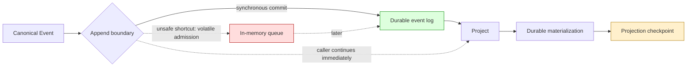

# Volatile Admission Is Not Durable Append

An asynchronous queue can make a persistence API return quickly, but queue admission and durable append are different events with different failure semantics. If a caller advances durable projections after volatile admission, a crash can leave the projection cursor ahead of the replay log that is supposed to justify it.

> [!summary]
> - Name **acceptance** separately from **durability**; do not hide both behind one `AppendEvent` postcondition.
> - A durable projection cursor must never exceed the durable contiguous event prefix it represents.
> - The safe default is event-first persistence: the event may durably lead its projection because replay can catch up; the projection must not durably lead its event without another authoritative recovery protocol.
> - Queue synchronization alone cannot repair this law. The queue must encompass the whole unit of work, or the database must commit event, materialization, and cursor atomically.

## Why this note exists

Sessionstream PR #15 adds `AsyncEventStore`, a decorator around the synchronous MySQL `EventStore`. The synchronous SQLite and MySQL adapters return nil from `AppendEvent` after the database operation finishes. The decorator returns nil after placing the event into an in-memory channel.

`Hub.projectAndApply` immediately continues after `AppendEvent`:

```go
AppendEvent(ctx, ev)
entities := project(ev)
Apply(ctx, ev.SessionId, ev.Ordinal, entities)
AdvanceProjectionCursor(ctx, projector, ev.SessionId, ev.Ordinal)
```

The interface does not tell the Hub whether nil means “durable” or merely “accepted.” That semantic substitution changes the crash-recovery proof even if every method has the same Go signature.

## Pattern statement

> **Volatile admission and durable append are separate capabilities. A read-model checkpoint may advance only through the durable contiguous event prefix that justifies it.** If asynchronous admission is useful, expose it as an acceptance-oriented port and either queue the complete event/projection unit of work or commit event, materialization, and checkpoint in one transaction.

The law for session $s$ is:

$$
C_P(s) \le P_E(s)
$$

where $C_P(s)$ is the durable projection checkpoint and $P_E(s)$ is the greatest **contiguous durable event prefix**, not merely `MAX(ordinal)`.

## Concrete architecture



The synchronous order is asymmetrically recoverable:

```text
event durable, projection missing
    -> replay event
    -> rebuild projection
```

The reversed order is not locally recoverable:

```text
projection/cursor durable, event only queued
    -> process dies
    -> event absent from replay log
    -> cursor claims progress with no local evidence to replay
```

An external Redis stream may make recovery possible, but only if retention, consumer offsets, replay identity, and reconciliation are explicit parts of the contract. “Redis is the source of truth” is a design claim until those mechanisms are wired and tested.

## Behavioral contract

### Synchronous durable append

```text
AppendEvent returns nil
    => event is durable according to the configured database contract
```

### Volatile enqueue

```text
EnqueueEvent returns nil
    => event is owned by a process-local queue
    != event is durable
```

### Flush barrier

```text
Flush returns nil
    => events admitted before the barrier are durable
```

A `Flush` extension can establish a boundary, but calling `Flush` before every projection would restore synchronous latency. It is not a substitute for choosing the correct unit of asynchronous work.

## Mathematical and CS foundations

### Histories and prefixes

For one session, let the admitted event history be a word:

$$
A_s = e_1e_2\ldots e_n.
$$

Let $D_s$ be the durable event subsequence. Replay cursors require more than order; they require prefix closure:

$$
D_s = e_1e_2\ldots e_k
$$

for some $k$. A set containing $e_1,e_3$ is ordered when read, but it is not a prefix because $e_2$ is missing. Therefore `MAX(ordinal)=3` is not a proof that the durable prefix ends at 3.

### Refinement and behavioral subtyping

A synchronous `EventStore` has an abstract durable append operation. An async decorator that returns at admission refines a different object. Method-shape compatibility does not establish behavioral subtyping:

```text
same methods + weaker postcondition != substitutable implementation
```

The correct abstraction should preserve the postcondition or use a different port such as `BufferedEventSink`.

### CQRS and event sourcing

In event-sourced/CQRS systems, read models are derived and therefore allowed to lag the event log. The event log is the recovery witness. Permitting the read model to lead reverses authority: derived state exists without its local derivation evidence.

## Design-pattern vocabulary

- **Event Sourcing:** canonical event history is the replay witness.
- **CQRS / materialized projection:** query state is derived and rebuildable.
- **Transactional Outbox / Unit of Work:** event and related durable consequences cross one commit boundary.
- **Decorator:** `AsyncEventStore` wraps `EventStore`, but must preserve or explicitly change its contract.
- **Barrier:** a queued marker proves durability for a prefix of admitted commands.
- **Refinement mapping:** concrete queue/database state maps to abstract accepted/durable histories.

## Recommended implementation shapes

### Shape A: retain synchronous EventStore

Use the synchronous MySQL adapter first. This is the smallest sound release and unblocks consumers.

### Shape B: explicit buffered sink

```go
type BufferedEventSink interface {
    EnqueueEvent(context.Context, Event) error
    Flush(context.Context) error
    Close(context.Context) error
}
```

Callers now know that nil means volatile acceptance.

### Shape C: queue the complete projection workflow

```text
admit EventCommand
worker:
    append event durably
    compute/apply materialization
    advance checkpoint
    publish completion/fanout
```

One worker preserves event-before-projection ordering, although projection latency and fanout semantics become asynchronous too.

### Shape D: atomic projected-event commit

```go
type ProjectedEventStore interface {
    CommitProjectedEvent(ctx context.Context, c ProjectedEventCommit) error
}
```

```text
BEGIN
  append event with retry/conflict law
  upsert entity versions and current entities
  advance snapshot ordinal
  advance projector checkpoint
COMMIT
```

This gives one database linearization point. Projection computation occurs before the transaction and must be deterministic with respect to declared inputs.

## Why tempting alternatives are wrong

### “The queue is FIFO, so the projection is safe”

FIFO concerns admitted command order. It says nothing about whether a queued event is durable before another database write commits.

### “Redis can replay it”

Only if Redis identity, retention, offsets, and automatic reconciliation are established. An unnamed external recovery source does not repair a local invariant.

### “Flush at turn boundaries is enough”

It bounds eventual durability but does not prevent intermediate durable projection checkpoints from outrunning the event log.

### “The interface comment never said durable”

The existing implementations and call order establish a de facto postcondition. If the abstraction intends acceptance instead, rename and document it before substituting a weaker adapter.

## Failure modes and evidence

PR #15’s full-buffer synchronous fallback creates one concrete prefix violation: a later producer can call the inner store while earlier events remain queued. The review comment documents how `MAX(ordinal)` can then move beyond missing rows.

Even after removing that fallback, the Hub-level issue remains: queue admission returns before the durable append, yet `Apply` and `AdvanceProjectionCursor` continue. This is an open correctness obligation, not merely a theoretical style concern.

The async wrapper is not currently constructed by a production composition root in the reviewed workspace. Therefore the failure is a demonstrated code-level counterexample and architecture risk, not a reported production incident.

## Testing and verification

1. **Crash-cut tests:** stop after event commit, after apply, after cursor, and before queued event commit; verify rebuild outcome.
2. **Prefix property:** for every durable checkpoint $c$, all required event ordinals through $c$ exist and match.
3. **Failure injection:** fail the queue worker after acceptance while allowing materialization writes; prove the architecture prevents cursor advance.
4. **Differential test:** live fold and rebuild from durable log produce equivalent materialization.
5. **Model check:** represent accepted, durable, materialized, and checkpoint histories as separate state variables and assert checkpoint-prefix safety.

## Applicability

Use this pattern whenever an asynchronous boundary sits between canonical evidence and derived durable state: event sourcing, outboxes, search indexing, caches with watermarks, CDC consumers, workflow journals, and audit projections.

Do not force atomic event/projection storage when the projection is intentionally remote and independently checkpointed. In that case, preserve event-first durability and a consumer offset whose recovery semantics are explicit.

## Candidate ecosystem guidance

1. Name acceptance and durability as separate outcomes.
2. Preserve durable source-before-derived-state ordering.
3. Treat `MAX(sequence)` as a cursor only when prefix closure is established.
4. Make a checkpoint a claim about completed durable work, not attempted work.
5. If one database owns both source and projection, consider one transactional unit of work.
6. If another system is authoritative, specify replay identity, retention, and reconciliation rather than citing it informally.

## Open questions

- Should sessionstream keep `EventStore.AppendEvent` explicitly durable and add a new buffered sink?
- Can event append, entity versions/current state, and projection cursor share one MySQL transaction without overcoupling projectors to storage?
- What exactly guarantees per-session ordinal admission order before persistence?
- Is Redis replay automatic and retention-bounded in every intended consumer?
- Which cross-project implementation can validate this pattern independently?

## Evidence and references

- PR #15: https://github.com/go-go-golems/sessionstream/pull/15
- `pkg/sessionstream/hydration.go`: public `EventStore` port.
- `pkg/sessionstream/hub.go`: append → project → apply → cursor flow.
- `pkg/sessionstream/hydration/mysql/async_event_store.go`: volatile admission and sync fallback.
- `pkg/sessionstream/hydration/mysql/store.go`: durable event and projection storage.
- [[Research/Software Architecture Garden/sessionstream/README#Atomic projection progress|Atomic projection progress]]
- [[Research/Software Architecture Garden/sessionstream/designs/02 - Typed Transition Systems and Trace Algebra|Typed Transition Systems and Trace Algebra]]
