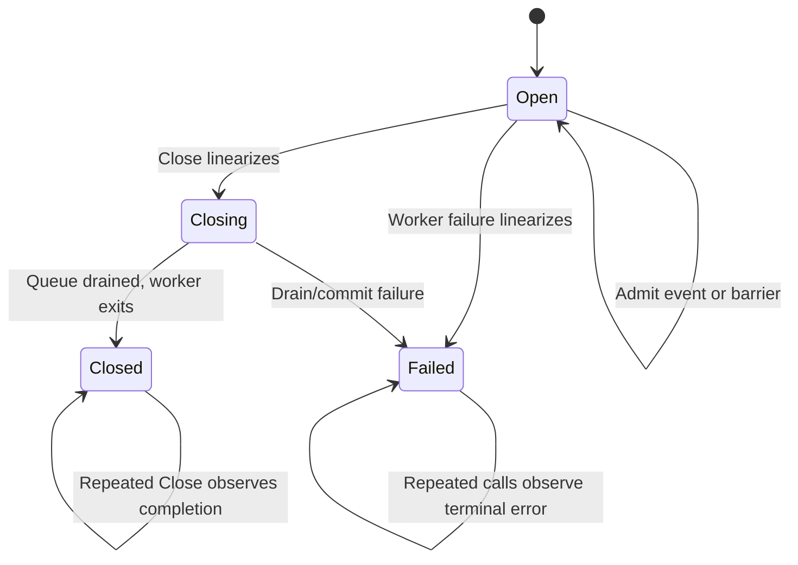

# Admission and Shutdown Share One Linearization Boundary

A bounded asynchronous writer is not correct merely because it has a channel, an atomic `closed` flag, and a worker. Admission, backpressure, failure, barriers, and shutdown form one concurrent protocol. The load-bearing law is that successful admission and the transition away from `Open` are serialized by the same ownership boundary.

> [!summary]
> - Every operation racing shutdown must have exactly one outcome: admitted before close and owned by the drain, or rejected after close. There is no third state.
> - The bounded work queue should be the source of truth for capacity; a second `notFull` notification protocol creates lost-wake obligations.
> - Barriers belong in the same private command stream as events, but control commands must not be encoded as valid user data.
> - One worker gives a simple committed-prefix law. It does not automatically give business-ordinal order among concurrent producers.
> - This pattern is for correctness-critical lossless admission. It is distinct from the lossy nonblocking diagnostic dispatcher in design 01.

## Why this note exists

Sessionstream PR #15’s published `AsyncEventStore` uses a bounded channel and one writer, but a full queue bypasses the writer and commits synchronously. `Close` checks an atomic flag and closes the channel without coordinating active senders. Review correctly identified out-of-order commit and send-on-closed-channel hazards.

The local uncommitted fix removed the synchronous fallback and introduced `sendMu` plus a rotating `notFull` channel. Focused tests then hung. A captured terminal state had the worker waiting on an empty queue while a producer waited for a future `notFull` notification: a lost wake-up.

The reusable lesson is not “close `notFull` in one more branch.” It is to define one concurrent object before choosing synchronization primitives.

## Pattern statement

> **Successful admission, failure transition, and graceful-close initiation share one context-aware ownership gate.** A command admitted before the `Open → Closing/Failed` transition is owned by the worker and must be drained or covered by the terminal error; an operation linearized afterward is rejected. The bounded command channel itself supplies capacity backpressure.

## Abstract object

```text
Phase = Open | Closing | Closed | Failed
Command = EventCommand(Event) | BarrierCommand(Reply)
```

State:

```text
phase
bounded FIFO queue
optional in-flight event
terminal error
admitted command history      // ghost/model variable
committed event history       // ghost/model variable
```



## Core law

For any append racing close:

```text
append linearizes first
    => command is in admitted history
    => close owns its drain/completion result

close linearizes first
    => append observes non-Open
    => append is rejected without channel send
```

There is no outcome “Append returned nil but Close does not own the command,” and no outcome “Append sends after channel closure.”

## Concrete protocol

Use a capacity-one channel as a context-aware admission token:

```go
type AsyncWriter struct {
    commands chan command
    gate     chan struct{} // one token
    phase    phase         // accessed while holding gate
    terminal error
    done     chan struct{}
}
```

Admission:

```go
func (w *AsyncWriter) admit(ctx context.Context, cmd command) error {
    select {
    case <-w.gate:
    case <-ctx.Done():
        return ctx.Err()
    }
    defer func() { w.gate <- struct{}{} }()

    if w.phase != phaseOpen {
        return w.terminalResult()
    }

    select {
    case w.commands <- cmd:
        return nil // linearization point
    case <-ctx.Done():
        return ctx.Err()
    }
}
```

Close:

```go
func (w *AsyncWriter) Close(ctx context.Context) error {
    acquire gate or return ctx.Err()
    if phase == Open {
        phase = Closing       // close linearization point
        close(commands)       // no sender can own gate simultaneously
    }
    release gate

    select {
    case <-done:
        return terminalResult()
    case <-ctx.Done():
        return ctx.Err()      // shutdown continues
    }
}
```

Worker:

```go
for cmd := range commands {
    switch cmd.kind {
    case eventCommand:
        if err := inner.AppendEvent(background, cmd.event); err != nil {
            transitionFailed(err)
            return
        }
    case barrierCommand:
        cmd.reply <- nil // capacity one; safe after caller timeout
    }
}
transitionClosed()
```

## Why the gate is held during bounded send

Holding admission ownership while waiting for queue capacity deliberately serializes admitted order. The worker does not need the gate to receive, so it can free capacity. Later producers wait behind the current producer rather than leapfrogging it.

This trades some admission concurrency for a short proof:

- one admission order;
- one close boundary;
- no send/close race;
- no custom condition variable;
- no lost wake-up.

If admission contention later matters, optimize by refining the same abstract object—perhaps with a dispatcher actor or partitioned queues—not by weakening its laws implicitly.

## Barriers

A `Flush` is a barrier command in the same FIFO:

```text
event 1, event 2, barrier B, event 3
```

When the worker acknowledges B, events 1 and 2 are durable; event 3 need not be. The exact contract is:

> Successful Flush covers commands whose admission linearized before the barrier’s admission.

It does not cover every concurrent append that happened to return before `Flush` returned.

Attach a buffered result channel directly to the barrier. Do not store IDs in a global `sync.Map`, and do not encode the barrier as a user event name.

## Mathematical and CS foundations

### Linearizability

Operations appear to take effect at points between invocation and response. The gate defines successful admission and close transition points. Non-overlapping real-time order is preserved; overlapping producers may be ordered by gate acquisition.

### Committed-prefix invariant

Let $A$ be the admitted command word and $E(A)$ remove barriers. Let $C$ be successfully committed events. Before terminal failure:

$$
C \preceq E(A)
$$

where $\preceq$ is the prefix relation.

This says every commit follows admitted order. It does not say event ordinals are increasing. Business ordinal order needs a producer precondition or separate sequencer.

### Happens-before

- gate token send/receive serializes lifecycle state;
- command send happens-before worker receive;
- channel close happens-before worker observes end-of-stream;
- closing `done` publishes terminal state to waiting callers.

### Safety and liveness

Safety:

```text
no post-close admission
no send on closed queue
one inner append in flight
commits are an admitted prefix
barrier ack follows prior commits
```

Liveness, assuming inner calls terminate and scheduling is fair:

```text
admitted event eventually commits or store becomes Failed
blocked admission eventually admits, cancels, or sees terminal state
Close eventually reaches Closed or Failed
```

No protocol can guarantee graceful-close completion if the inner database call blocks forever. A forced abort is a separate API and failure policy.

## Pattern vocabulary

- **Monitor / critical section:** the gate serializes abstract state transitions.
- **Mailbox / Actor:** one FIFO and one worker serialize effects.
- **Producer–Consumer:** producers admit work; worker commits it.
- **Backpressure:** bounded capacity slows producers rather than dropping correctness-critical work.
- **Barrier / Fence:** a command establishes a prefix-completion point.
- **Single Writer:** one durable side-effect stream supplies commit order.
- **Linearizable concurrent object:** operations have reviewable effect points.

## Distinction from the diagnostic dispatcher

[[Research/Software Architecture Garden/sessionstream/designs/01 - Bounded Asynchronous Observer Dispatcher|Design 01]] intentionally uses nonblocking `TrySubmit` and may drop diagnostics. It holds a mutex over a nonblocking channel send and close. That policy is correct because diagnostics are secondary and loss is counted.

A persistence writer cannot reuse that policy:

| Diagnostic observer | Durable writer |
|---|---|
| full queue may reject/drop | full queue must block/cancel/fail explicitly |
| accepted item is best-effort callback work | accepted item creates durability custody |
| drop counter can describe incompleteness | silent drop corrupts product history |
| callback panic may be isolated | database failure becomes terminal protocol state |

Similar channel shapes do not make the reliability contracts equivalent.

## Why tempting alternatives fail

### Atomic flag plus channel close

A flag check and later send are not atomic. Close can occur between them.

### `select { queue <- cmd; <-done }` alone

If queue and done are both ready, Go may choose the send. A done channel wakes waiters but does not prioritize shutdown or serialize admission with it.

### Rotating `notFull` channels

They duplicate channel capacity as another condition state. Checking “full” and joining a future signal are not atomic, creating classic missed notifications.

### `sync.Cond`

A correct condition-variable loop can work, but context cancellation and lifecycle wakeups require additional machinery. The bounded channel already implements the predicate and wait queue.

### Synchronous fallback

It bypasses the serialized worker and destroys committed-prefix order.

## Failure evidence

- Published PR: full-buffer direct commit permits later ordinal to commit first.
- Published PR: Close may close while Append/Flush sends, causing panic.
- WIP: `TestAsyncEventStoreBackpressurePreservesFIFOOrder` times out.
- WIP: `TestAsyncEventStoreConcurrentCloseNoPanic` times out under `-race`.
- Captured state: worker blocked receiving from empty queue; producer blocked on `notFull`.

These are observed code/test failures, not only theoretical risks.

## Verification

1. Model capacity 1–2, two producers, one worker, one closer, barrier, cancellation, and injected failure in TLA+/PlusCal.
2. Check boundedness, no post-close admission, committed prefix, barrier safety, and graceful-close safety.
3. Use a controlled fake store with `started`/`permit` channels instead of sleeps.
4. Record operation histories and check linearizability against the abstract state machine.
5. Run `-race -count=100` after deterministic tests pass; race freedom is necessary but not sufficient.
6. Mutation-test direct fallback, unsynchronized close, unbuffered barrier replies, and post-close sends.

## Applicability

Use for bounded lossless asynchronous writers, persistence queues, ordered side-effect interpreters, and lifecycle-owned workers where accepted work must be drained or explicitly failed.

Do not use the exact single-global-worker form when independent partitions require parallel throughput. Shard by a stable key and define global barrier/close as a composition over shard barriers—but model that as a new protocol.

## Candidate ecosystem guidance

1. Define the concurrent object before selecting primitives.
2. Serialize admission and shutdown under one ownership boundary.
3. Use the bounded queue itself as capacity truth.
4. Put control barriers in a private tagged command stream.
5. Make terminal failure monotone and visible to all callers.
6. Keep Close repeatable and context-bounded for each waiter.
7. Distinguish admission order from business order.
8. Prove safety first; benchmark only after liveness tests pass.

## Open questions

- Should sessionstream expose this as a generic internal writer only after a second matching consumer exists?
- What component guarantees per-session ordinal admission order?
- Should shutdown continue after a caller timeout, and is an explicit `Abort` needed?
- When should one global worker become per-session sharding?
- Can the existing observer verification artifacts be adapted as a refinement scaffold without conflating lossy and lossless policy?

## Evidence and references

- PR #15: https://github.com/go-go-golems/sessionstream/pull/15
- `pkg/sessionstream/hydration/mysql/async_event_store.go`
- `pkg/sessionstream/hydration/mysql/async_event_store_test.go`
- [[Research/Software Architecture Garden/sessionstream/designs/01 - Bounded Asynchronous Observer Dispatcher|Bounded Asynchronous Observer Dispatcher]]
- [[Research/Software Architecture Garden/sessionstream/designs/research/01 - Proving the Bounded Asynchronous Observer Dispatcher|Proving the Bounded Asynchronous Observer Dispatcher]]
- Go specification: https://go.dev/ref/spec
- Go memory model: https://go.dev/ref/mem
- Herlihy and Wing, “Linearizability”: https://cs.brown.edu/people/mph/HerlihyW90/p463-herlihy.pdf
