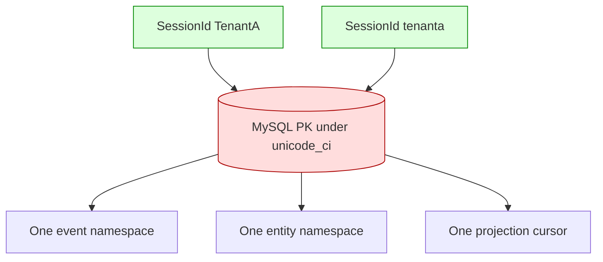

# Storage Equality Is a Domain Identity Contract

A persistence adapter does not merely store strings. Its column types, collations, normalization, padding, and indexes decide when two identifiers are equal. If that equality differs from the domain’s equality, the adapter silently changes identity and is not a behavioral substitute for the in-memory or reference store.

> [!summary]
> - Database collation is part of the public identity contract, not a presentation detail.
> - Opaque identifiers should normally compare by exact bytes or by one explicit canonicalization shared by every backend.
> - If the domain distinguishes `TenantA` from `tenanta`, a case-insensitive primary key can merge sessions, entities, events, and checkpoints.
> - A DDL correction is incomplete without a migration that audits existing collisions.
> - Identifier length is also part of the contract: backend-only truncation/failure violates substitutability.

## Why this note exists

Sessionstream represents `SessionId` as a Go string. The in-memory and SQLite paths use exact string identity for session, entity, kind, event name, and projector keys. PR #15 creates every MySQL table with `utf8mb4_unicode_ci`, a human-language case- and accent-insensitive collation.

Consequently, values distinct under Go can be equal under MySQL. The problem reaches every SQL operation that relies on equality:

- primary-key uniqueness;
- `ON DUPLICATE KEY UPDATE`;
- joins;
- filters;
- projection cursor lookup;
- event conflict identity;
- error-record session filtering.

This can become a tenant/session isolation failure, not only a surprising query result.

## Pattern statement

> **A persistence adapter must preserve the domain’s identity equivalence relation.** For opaque routing and entity keys, use exact byte equality unless all producers, stores, and consumers share one explicit canonicalization function. Validate representation and length before persistence, and migrate existing data with collision detection.

## Equality as an equivalence relation

Let $X$ be identifiers. The domain defines an equivalence relation $\sim_D$ and the database defines $\sim_S$.

Behavioral substitution requires:

$$
\forall a,b\in X:\quad a\sim_D b \iff a\sim_S b.
$$

For exact Go strings:

```text
"TenantA" != "tenanta"
"café"    != "cafe"
```

Under a Unicode case-insensitive collation, some of these pairs may be equivalent. Then $\sim_D \ne \sim_S$.

The most dangerous direction is:

$$
a \not\sim_D b \land a\sim_S b,
$$

because distinct domain principals/scopes share one storage row.

## Concrete failure shape



A save for the second session may update a row created for the first. A query for either spelling can return the same events or entities. The storage system has changed the partition function of the application.

## Opaque identity versus human text

Not every string should use the same comparison policy.

| Value | Typical semantics | Suitable representation |
|---|---|---|
| `SessionId` | opaque scope/routing key | exact bytes (`VARBINARY`) |
| entity ID | opaque identity | exact bytes |
| projector name | registered symbolic identity | exact bytes or canonical symbol grammar |
| event/entity kind | registered symbol | exact bytes or explicit ASCII canonicalization |
| human title/message | language text | locale/case-aware collation if desired |
| error text | diagnostic prose | text collation usually irrelevant |

A table-wide collation applies one policy to categories with different laws. Prefer column-specific semantics.

## Representation choices

### Binary columns

```sql
session_id VARBINARY(255) NOT NULL
```

Advantages:

- exact byte equality;
- index bytes match encoded bytes rather than worst-case utf8mb4 weights;
- no locale or case folding;
- trailing bytes remain significant.

Tradeoff: SQL consoles may need explicit conversion for display.

### Binary/no-pad collation

```sql
session_id VARCHAR(255) COLLATE <binary-no-pad> NOT NULL
```

This keeps textual display, but behavior depends on the exact MySQL/Aurora collation and padding rules. Test case, accent, normalization, and trailing spaces against the deployed server version.

### Canonicalization

```go
func CanonicalSessionID(raw string) (SessionId, error)
```

Canonicalization is valid only if it is a domain decision applied before every backend and every boundary. Lowercasing only in MySQL is not canonicalization; it is backend-specific aliasing.

## Length is identity policy too

PR #15 uses `VARCHAR(191)` for session IDs because utf8mb4 composite indexes have byte limits. The public type accepts any Go string. A 192-character ID can succeed in memory/SQLite and fail only on MySQL.

Options:

1. declare `MaxSessionIDBytes` and validate in shared constructors;
2. use binary fixed-format UUID/ULID representations;
3. use a digest/surrogate internal key while storing the full external identity under a unique exact index;
4. widen columns where index geometry permits.

A database error deep in `Apply` or `AppendEvent` is too late to discover an invalid scope identity.

## Adapter and refinement perspective

The MySQL store is an Adapter behind `HydrationStore`/`EventStore`. Liskov substitution is behavioral:

```text
same operation history
    -> equivalent observations
```

Method signatures are insufficient. Equality, ordering, limits, duplicate behavior, and error classes are part of the adapter contract.

A useful differential property is:

$$
\operatorname{observe}(Memory,H)
\approx
\operatorname{observe}(SQLite,H)
\approx
\operatorname{observe}(MySQL,H).
$$

Identity parity is one component of $\approx$.

## Migrations and collision audits

Changing `CREATE TABLE IF NOT EXISTS` affects only fresh tables. Existing databases retain the old collation. A versioned migration must:

1. detect groups of rows equal under the old collation but distinct under target exact equality;
2. stop and report conflicts rather than choosing one silently;
3. alter/rebuild primary and secondary indexes safely;
4. verify row counts and foreign/logical references;
5. record the applied schema version;
6. run differential identity tests after migration.

A collision query may need binary casts or a staging table because the current collation cannot group by exact identity honestly.

## Why tempting alternatives fail

### “Use `_bin` everywhere”

It is directionally better but may still have server/version-specific padding and Unicode semantics. It also applies binary semantics to human text that may not need it.

### “IDs are UUIDs, so case does not matter”

The type and interface do not enforce UUIDs. Future consumers will trust the public contract, not an informal current convention.

### “Applications should lowercase IDs”

Only if lowercase canonical identity is an accepted domain law and every adapter applies it before storage and lookup.

### “No collision exists in current data”

That does not make the schema correct. It only lowers migration risk. The schema must prevent future aliasing.

## Failure evidence

The PR review’s P1 finding supplies a direct counterexample: `TenantA` and `tenanta` share rows under the table collation. Local uncommitted changes switch fresh DDL to `utf8mb4_bin`, but they do not migrate already-created tables.

The same issue appears in Pinocchio PR #197’s MySQL turn store, providing a second adapter in the same ecosystem with the same failure class. That is comparison evidence for the pattern, although both implementations arose in one migration effort rather than independent mature adoptions.

## Testing and verification

Shared contract cases should include:

```text
TenantA vs tenanta
café vs cafe
é (NFC) vs e + combining accent (NFD)
"id" vs "id "
maximum permitted byte length
one byte beyond maximum
non-ASCII valid UTF-8
invalid UTF-8 if the API permits arbitrary bytes
```

For each pair, test:

- independent event append and replay;
- independent entity apply/snapshot;
- independent projection cursors;
- joins and filters;
- duplicate/conflict behavior;
- migration from old collation.

Run the same suite against memory, SQLite, and MySQL.

## Applicability

Use this pattern for tenant IDs, session IDs, object keys, idempotency keys, registered symbols, correlation IDs, cache keys, and any identifier crossing multiple storage engines.

Human search, sorting, and display may deliberately use a different collation—but that should be a derived search/index projection, not the primary identity relation.

## Candidate ecosystem guidance

1. Define identifier equality before choosing SQL types.
2. Treat opaque identity as bytes unless canonicalization is explicit.
3. Keep human-language comparison separate from primary identity.
4. Validate byte length at the domain boundary.
5. Run one identity contract suite against every adapter.
6. Make collation changes versioned migrations with collision detection.
7. Never infer tenant/session noninterference from a string type alone.

## Open questions

- Should sessionstream define constructors/validators for `SessionId` and registered symbols?
- Should schema names be ASCII-only canonical symbols while session/entity IDs remain arbitrary opaque bytes?
- Which binary/no-pad collation is guaranteed by the deployed Aurora MySQL version?
- Should IDs be displayed through generated/virtual text columns for operator ergonomics?
- Can an independent project validate the same equality-preservation rule?

## Evidence and references

- PR #15: https://github.com/go-go-golems/sessionstream/pull/15
- PR #15 identity review: https://github.com/go-go-golems/sessionstream/pull/15#discussion_r3780152201
- Pinocchio PR #197: https://github.com/go-go-golems/pinocchio/pull/197
- `pkg/sessionstream/types.go`: `SessionId`.
- `pkg/sessionstream/hydration/mysql/store.go`: MySQL DDL and key operations.
- `pkg/sessionstream/hydration/sqlite/store.go`: exact-text reference behavior.
- [[Research/Software Architecture Garden/zitadel-go-test/05 - Defense in Depth Tenant Isolation|Defense in Depth Tenant Isolation]]
