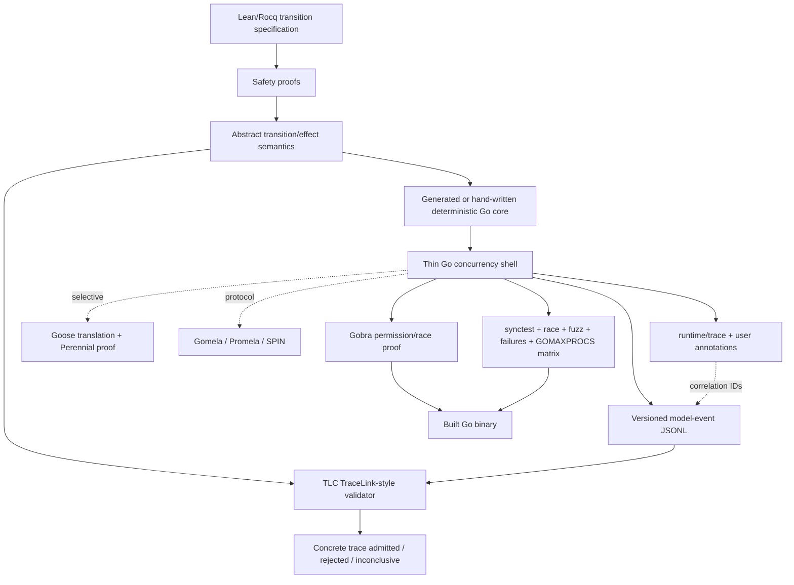

# Constraining the Go Binary — Layered Refinement from Proved Kernels to Executables

A proof of an abstract dispatcher does not prove the Go dispatcher. It does not by itself rule out a misplaced `close(ch)`, an unjoined goroutine, a forgotten cancellation branch, an unsynchronized read, a bad `select` arbitration, a callback executed while holding the lifecycle mutex, or a trace event emitted after the operation it claims to linearize. Those are not minor implementation details. They are failures of the refinement relation between the abstract machine and the executable.

The companion study, [[Research/Software Architecture Garden/sessionstream/designs/research/01 - Proving the Bounded Asynchronous Observer Dispatcher|Proving the Bounded Asynchronous Observer Dispatcher]], already demonstrated both sides of this gap. Coq and Lean prove the transition kernel for arbitrary capacities and traces. TLA+ checks the bounded concurrent protocol. The Go scaffold then found an instrumentation race that none of those proofs could find: a worker popped a channel item before logging the abstract `Receive`, so a later submit appeared in the log before the receive that made it possible. The algorithm was correct; the claimed refinement trace was not.

This design turns that lesson into a reusable architecture for concurrent Go systems. The objective is not merely:

```text
abstract algorithm has a proof
```

but:

```text
actual Go binary is constrained by several independently checked links
back to a proved abstract semantics
```

> [!summary]
> - The primary risk is the **refinement boundary**, not the pure kernel. Proof, trace refinement, concurrency verification, race detection, and runtime tracing establish different claims and must remain distinct.
> - Do not generate an entire concurrent Go application from Rocq or Lean. Prove a deterministic transition/effect kernel; keep goroutines, channels, timers, contexts, I/O, retry, and cancellation in a deliberately thin Go shell.
> - Direct Rocq/Lean-to-Go is not a standard supported extraction path. Rocq extracts to ML-family targets; CertiRocq targets Clight/C and WebAssembly; Lean exposes a C ABI. A custom Go generator enlarges the trusted computing base unless it is itself verified.
> - **Adopt now:** PGo/TraceLink's architecture — explicit model events, JSON traces, partial abstract-state updates, constrained TLC checking — plus `testing/synctest`, `-race`, fuzzing, failure injection, multiple `GOMAXPROCS`, and runtime trace correlation.
> - **Prototype next:** Gobra on the dispatcher shell. Its mutex/channel permission model directly matches admission closure, ownership transfer, and race freedom. Prove safety and data-race freedom; do not expect mutex liveness automatically.
> - **Evaluate selectively:** Goose + Perennial when proving the actual restricted-Go implementation is worth Iris-level proof effort, particularly for persistence/crash recovery. Goose shrinks but does not eliminate the trusted boundary: translator and Go semantics are trusted.
> - **Use for protocol bugs:** Gomela/SPIN over-approximates Go message passing and is suited to deadlock/interleaving exploration, not arbitrary functional correctness.
> - Do not model the current Go scheduler. Model synchronization edges and arbitrary allowed interleavings under the Go memory model. DRF-SC is the justification for sequential-interleaving reasoning; racy Go invalidates that justification.

## 1. The exact gap

Let the abstract system be:

$$
A=(S_A, I_A, O_A, Init_A, Step_A),
$$

and let the concrete Go program produce executions over runtime states $S_G$. A proof assistant establishes something like:

$$
\forall \tau_A \in \operatorname{Behaviors}(A),\quad P(\tau_A).
$$

That theorem says nothing about the executable until we establish an abstraction map and trace relation:

$$
\alpha:S_G\to S_A
$$

and

$$
\operatorname{erase}:Trace_G\to Trace_A,
$$

such that every concrete execution projects to an admitted abstract behavior:

$$
\forall \tau_G \in \operatorname{Behaviors}(G),\quad
\operatorname{erase}(\tau_G)\in\operatorname{Behaviors}(A).
$$

If that refinement obligation holds, the abstract safety theorem transfers:

$$
P(\operatorname{erase}(\tau_G)).
$$

The difficult phrase is **"for every concrete execution."** A finite runtime trace checker establishes membership for one observed trace. A Goose/Perennial or Gobra proof can establish stronger source-level properties for all executions described by its semantics. `-race` establishes no proof, but invalidates DRF-SC assumptions when it finds a race. `synctest` makes selected schedules and timer boundaries deterministic. Gomela explores a bounded over-approximation of channel behavior. Runtime tracing explains what the scheduler and runtime actually did during one execution.

These results compose only if their claims are kept precise.

## 2. Guarantee taxonomy

| Evidence | Establishes | Does not establish |
|---|---|---|
| Coq/Lean kernel proof | Every execution of the stated transition relation preserves proved invariants. | Go implements the relation; shell race freedom; goroutine cleanup; I/O behavior. |
| TLA+/Alloy model check | All states in one bounded concurrent model satisfy assertions; counterexamples within bounds. | Unbounded proof; source correspondence; real binary behavior. |
| Goose + Perennial | The Goose-translated Go subset satisfies proved Iris/Perennial specifications, including concurrency and optionally crash safety. | Semantics of unsupported Go; correctness of trusted translator/semantics; arbitrary external libraries. |
| Gobra | Annotated Go-like source satisfies permissions/contracts; verified program is data-race-free; partial correctness. | General liveness; correctness of Viper/toolchain/stubs; unsupported code. |
| TraceLink-style validation | One concrete finite trace is compatible with the abstract TLA+ next-state relation, possibly reconstructing omitted state. | All executions; liveness from finite traces; absence of unobserved bugs. |
| Gomela/SPIN | No bounded counterexample in extracted message-passing over-approximation; useful deadlock/protocol findings. | Full functional correctness; unbounded behavior; exact Go memory semantics. |
| `go test -race` | No observed dynamic race in the exercised execution; reported races are strong evidence of invalid synchronization assumptions. | Absence of races in unexecuted schedules. |
| `testing/synctest` | Deterministic bubble-local time and durable-blocking observations for selected tests; deadlocked bubble failure. | Network/kernel scheduling; arbitrary external goroutines; production timing. |
| `runtime/trace` | Concrete goroutine/runtime events and user tasks/regions/logs for one run. | Abstract trace legality; safety proof. |
| Mutation testing | The harness detects selected known contract violations. | Unknown defect classes; soundness of every oracle. |

A mature verification report should state every conclusion in one row's vocabulary. "Verified" without a row is too vague to review.

## 3. Direct extraction is not the default architecture

### 3.1 Rocq/Coq

Rocq's standard extraction machinery targets OCaml, Haskell, Scheme, and related representations. It performs proof erasure and maps Gallina constructs into the target language. It does not supply a standard Go backend. [[sources/01-rocq-program-extraction|Archived Rocq extraction documentation]] records that boundary.

CertiRocq/CertiCoq is the stronger compiler route: Gallina toward Clight (a C subset suitable for CompCert) and WebAssembly. This makes a verified deterministic core behind a C ABI realistic. It does not make Go's concurrency runtime disappear; Go-to-C calls, memory ownership, error translation, panics, and callback re-entry remain a shell boundary. See [[sources/02-certirocq-verified-compiler|CertiRocq source snapshot]].

### 3.2 Lean 4

Lean's compiler pipeline exposes a platform-native ABI based on the C calling convention. `extern` imports C symbols and `export` exposes Lean declarations to C. The current FFI documentation also names representation limits, including compound C structs by value. See [[sources/03-lean-foreign-function-interface|Lean FFI snapshot]].

A Go package can call a C-exported Lean kernel via cgo, but that creates a multi-runtime system:

```text
Go scheduler and heap
    ↕ cgo / C ABI
Lean runtime and object representation
```

That is reasonable for a compact deterministic function with explicit serialized inputs and outputs. It is not attractive for channel ownership, callbacks into Go, or fine-grained per-message transitions where cgo overhead and ownership reasoning dominate the algorithm.

### 3.3 Why a custom Lean/Rocq-to-Go generator is not a free win

A generated Go kernel is feasible. Its trust ledger is:

```text
proof assistant kernel
formal source semantics
custom Go generator
mapping of source values to Go values
Go compiler/runtime
runtime shell
```

Unless the generator is verified or its output is validated against the source semantics, it is another unproved compiler. For a 100-line dispatcher kernel, a hand-written Go kernel plus trace validation may have a smaller effective risk than a bespoke generator. For a large stable pure core, verified C/Wasm plus a narrow FFI may be preferable.

**Decision:** generation is optional for the deterministic kernel, never the sole bridge. The runtime trace checker remains even when code is generated.

## 4. Reverse direction: actual Go source into proof

### 4.1 Goose + Perennial

Goose defines a deliberately restricted but runnable Go subset, translates it to Rocq/Coq through GooseLang, and plugs it into Perennial. Its README explicitly says the translator and semantics are trusted. That is not a defect hidden by marketing; it is an honest trusted-computing-base statement. See [[sources/04-goose-go-to-rocq|Goose]], [[sources/05-perennial-concurrent-crash-safe-verification|Perennial]], the primary [[sources/18-goose-verifying-concurrent-go-code-coqpl20.pdf|Goose CoqPL paper]], [[sources/19-tej-chajed-phd-thesis.pdf|Chajed thesis]], and [[sources/20-waddle-proven-go-semantics-meng-thesis.pdf|Waddle thesis]].

The important improvement over a separate handwritten model is:

```text
actual restricted Go source
    → trusted translation
    → formal program term
    → concurrent separation-logic proof
```

The proof subject is derived from the implementation. The refinement gap shrinks from "whole program manually corresponds to model" to "translator and semantics correctly represent this Go subset, and external calls satisfy their specs."

Goose's own validation strategy is relevant even if Goose is not adopted: generated Rocq terms have gold-file tests requiring human review, plus semantic tests that execute source and translated interpretations. That is another independent-link pattern.

#### Fit for the dispatcher

The dispatcher's essential mechanisms — struct state, mutex, channel, one goroutine, bounded queue, callback invocation — are conceptually within Goose's concurrent subset, but fit must be tested against the *current* translator, not assumed from a README example. Generic Go types, `context`, `sync.WaitGroup`, panic/recover, and callback interfaces may require a specialized verification copy or specification stubs.

A Perennial proof would likely use Iris resources roughly as follows:

```text
mutex invariant owns:
    closing flag
    drop counter
    send permission / channel-open authority

channel invariant transfers:
    ownership of each admitted immutable item

worker invariant owns:
    exclusive receive authority
    offered-prefix ghost history

Wait/exit token establishes:
    closed ∧ queue drained ∧ worker terminated
```

This is strong but expensive. Perennial is most compelling when the system also needs crash-consistency or durable-state reasoning; its advantage is less decisive for an in-memory best-effort observer queue.

**Adoption tier:** selective, after a feasibility spike. Do not make Goose/Perennial a prerequisite for the dispatcher extraction.

### 4.2 Gobra

Gobra verifies annotated Go-like programs by translation to Viper and SMT solving. It supports a large subset of Go, goroutines, shared memory, mutexes, and channels. Its permissions are transferred through goroutine starts and channel operations; a verified program is data-race-free. See [[sources/06-gobra-tutorial|tutorial]] and [[sources/07-gobra-mutex-reasoning|mutex reasoning]].

Gobra is particularly well matched to the dispatcher's shell because the key claims are ownership claims:

```text
only holders of mutex permission inspect or mutate closing/dropped
only the worker owns receive authority
accepted item ownership transfers through the channel
Close consumes channel-open authority once
post-close TrySubmit has no send authority
callback runs without ownership of dispatcher lifecycle state
```

A sketch of the mutex predicate:

```gobra
pred dispatcherInv(d *Dispatcher) {
    acc(&d.closing) &&
    acc(&d.dropped) &&
    acc(&d.queue) &&
    d.dropped >= 0 &&
    (d.closing ==> channelClosed(d.queue))
}

pred (d *Dispatcher) Mem() {
    acc(d.mu.LockP(), _) &&
    d.mu.LockInv() == dispatcherInv!<d!>
}
```

Channel predicates should transfer a ghost `ItemOwned(x)` resource from successful submit to the worker. A ghost sequence records accepted and offered values, with invariant:

```text
accepted = offered ++ inFlight ++ queued
```

The exact syntax depends on Gobra's current channel stubs. The archived tutorial notes that buffered channels cannot use the rendezvous-style reverse permission predicate except as `PredTrue`; that constraint must shape the specification.

#### What Gobra should prove first

1. Every read/write of `closing`, `dropped`, and queue-close authority is permission-safe.
2. `Close` consumes close authority at most once.
3. No verified path sends after `closing` becomes true.
4. The callback is invoked without holding the admission mutex.
5. Only one goroutine receives from the queue.
6. Item ownership is not duplicated or lost between accept and offer.
7. Data-race freedom for the annotated shell.

#### What it should not promise

The Gobra mutex documentation explicitly notes that lock acquisition lacks a decreases clause; deadlock/termination does not follow automatically. A Gobra proof can show partial correctness and race freedom while a callback blocks forever or a goroutine waits indefinitely. Liveness remains in TLA+, `synctest`, watchdog tests, and operational budgets.

**Adoption tier:** first verifier prototype. It attacks exactly the unproved mutex/channel shell with lower proof-engineering overhead than Iris.

> [!success] Initial Gobra experiments — 2026-08-11
> Gobra v26.02 was built from its pinned Viper submodule and run with the CI-pinned Z3 4.8.7 backend. [[Research/Software Architecture Garden/sessionstream/designs/research/specs/gobra/DispatcherKernel.gobra|DispatcherKernel.gobra]] verifies the deterministic admission/close kernel with zero errors: queue boundedness, stable capacity, monotone drops, sticky close, exact accept/drop/reject transitions, and abstract idempotence of Close. A mutation from `queueLen + 1` to `queueLen + 2` is rejected with `Postcondition might not hold`.
>
> [[Research/Software Architecture Garden/sessionstream/designs/research/specs/gobra/DispatcherShellPrimitives.gobra|DispatcherShellPrimitives.gobra]] goes one layer further: it verifies that a `sync.Mutex` invariant exclusively owns lifecycle state and that a buffered channel transfers exclusive item ownership from producer to worker. Removing `Lock()` before unfolding the invariant is rejected (`Unfold might fail`); writing an item after sending away its permission is rejected (`Assignment might fail`). This validates both required permission mechanisms independently. See [[Research/Software Architecture Garden/sessionstream/designs/research/specs/gobra/results/build.txt|captured results and scope]].
>
> [!failure] Combined production-shaped Gobra shell blocked by v26.02
> Reproducible probes now establish that the installed current Gobra cannot express two required source constructs. [[Research/Software Architecture Garden/sessionstream/designs/research/specs/gobra/probes/SelectDefault.gobra|SelectDefault.gobra]] reaches desugaring and throws `scala.NotImplementedError`; Gobra's source contains an explicit select-support TODO. [[Research/Software Architecture Garden/sessionstream/designs/research/specs/gobra/probes/Recover.gobra|Recover.gobra]] is rejected with `unknown identifier recover`. Therefore an honest Gobra proof cannot currently cover the actual guarded `select/default` admission or callback panic isolation. Replacing either with a trusted helper contract would be exactly the hidden assumption this design forbids. [[Research/Software Architecture Garden/sessionstream/designs/research/specs/gobra/probe_unsupported.sh|probe_unsupported.sh]] pins both limitations and intentionally fails when a future Gobra release gains support.

## 5. Trace refinement: the primary bridge

### 5.1 Why PGo/TraceLink is the architecture to steal

PGo compiles Modular PlusCal into model-checkable PlusCal/TLA+ and executable Go. Its tool suite includes `tracegen` and trace harvesting; TraceLink validates model behavior against implementation traces. See [[sources/08-pgo-modular-pluscal-to-go|PGo]].

The broader TraceLink work reduces trace validation to constrained TLC model checking. Crucial properties from [[sources/09-tracelink-validating-program-traces|the archived paper]]:

- instrumentation records **abstract variable updates**, not full implementation state;
- traces may be partial — not every abstract value must be logged;
- suitable **linearization points** are the main design problem;
- TLC reconstructs missing abstract state, trading trace precision for search cost;
- validation checks finite safety traces, not liveness;
- a successful result means "this trace is compatible," not "the implementation is correct for all executions."

That is a stronger and more flexible bridge than the strict Go oracle built in research doc 01. The strict oracle requires a fully ordered, complete abstract event stream. TLC can tolerate:

```text
implementation event provides:
    action name
    changed variables only
    correlation/generation identity
    selected observable result

TLC reconstructs:
    hidden queue contents
    unlogged stuttering steps
    nondeterministic choices compatible with observations
```

### 5.2 Model-event schema

Model events are not logs for humans. They are proof-link artifacts with a versioned contract:

```go
type ModelEvent struct {
    SchemaVersion int               `json:"schema_version"`
    RunID         string            `json:"run_id"`
    Seq           uint64            `json:"seq"`
    DispatcherID  string            `json:"dispatcher_id"`
    Action        string            `json:"action"`
    OperationID   string            `json:"operation_id,omitempty"`
    ItemID        string            `json:"item_id,omitempty"`
    Updates       map[string]any    `json:"updates,omitempty"`
    Evidence      map[string]any    `json:"evidence,omitempty"`
}
```

Dispatcher actions:

```text
TrySubmitAccept   Updates: admitted += item; queue_len = n
TrySubmitDrop     Updates: dropped += 1; queue_len = cap
TrySubmitReject   Evidence: closing = true
CloseEffective    Updates: closing = true
CloseNoop         Evidence: closing = true
WorkerReceive     Updates: in_flight = item; queue_len = n-1
CallbackOffered   Updates: offered += item; in_flight = none
CallbackPanic     Same abstract offer; evidence: panic = true
WorkerExit        Evidence: closing = true; queue_len = 0; in_flight = none
WaitReturn        Evidence: worker_done = true
```

Every event includes stable operation/item identity. Values submitted concurrently must not be identified only by payload equality; duplicate integer or record values are legal.

### 5.3 Linearization points

| Abstract action | Concrete point |
|---|---|
| accept/drop/reject | decision inside the admission mutex, after select branch is known and before unlock |
| effective/no-op close | closing check + state transition + channel close inside the same mutex section |
| worker receive | channel receive completion; instrumentation must preserve its order relative to sends that depend on the freed slot |
| offered/panic | immediately before callback invocation for "offered" semantics, with a separate completion/panic diagnostic if needed |
| worker exit | closed-and-drained receive/range termination, before completion signal |
| wait return | after worker completion synchronization returns |

The receive row is the sharp edge. Research doc 01 found that logging after a range-loop receive under a different mutex can reorder the abstract trace. Options:

1. use the checked two-phase worker that pops and emits under the lifecycle mutex;
2. instrument the channel abstraction itself;
3. log enough partial evidence for TLC to reconstruct receive-before-submit rather than claiming a strict total order;
4. use operation intervals (`invoke_seq`, `return_seq`) and a linearizability search rather than one event timestamp.

TraceLink-style partial traces make option 3 attractive. The checker, not the logger, should decide among abstract interleavings compatible with observed synchronization.

### 5.4 Constrained TLC specification

Conceptually, trace validation adds a trace-position variable and constraints to `Dispatcher.tla`:

```tla
TraceConstraint(event, state, nextState) ==
    /\ event.action = ActionName
    /\ \A update \in DOMAIN event.updates:
          nextState[update] = event.updates[update]
    /\ \A evidence \in DOMAIN event.evidence:
          stateOrNextMatches(evidence)

TraceNext ==
    \/ \E action \in AbstractActions:
         action /\ TraceConstraint(Trace[tracePos], vars, vars')
         /\ tracePos' = tracePos + 1
    \/ Stutter /\ UNCHANGED tracePos
```

The real implementation should follow PGo's generated-validation-file pattern rather than manually editing the core spec: one stable dispatcher spec, one generated trace module/config per trace schema version.

### 5.5 Verdict interpretation

```text
VALID trace:
    there exists an abstract behavior compatible with all recorded constraints

INVALID trace:
    no abstract behavior can explain the observations
    → implementation bug, instrumentation bug, stale spec, or invalid abstraction map

INCONCLUSIVE / search exhausted:
    trace underconstrained or state space too large
    → add evidence, reduce abstraction, partition by dispatcher/run
```

A valid trace never upgrades to a universal proof. It is one finite witness of refinement.

> [!success] Partial Go → JSONL → TLC prototype — 2026-08-11
> The checked Go dispatcher exposes a versioned `ModelEvent` projection and [[Research/Software Architecture Garden/sessionstream/designs/research/specs/go/cmd/tracegen/main.go|cmd/tracegen]] emits a comprehensive 15-event lifecycle from the actual executable: accept/receive, overflow drop, effective/no-op close, post-close reject, callback return/panic, worker exit, and Wait return. [[Research/Software Architecture Garden/sessionstream/designs/research/specs/tracelink/generate_trace.py|generate_trace.py]] validates schema/sequence metadata and generates a constrained TLA+ instance of [[Research/Software Architecture Garden/sessionstream/designs/research/specs/tracelink/DispatcherTraceValidator.tla|DispatcherTraceValidator.tla]].
>
> The strict trace is consumed in 16 distinct states to depth 16 with no TLC error. [[Research/Software Architecture Garden/sessionstream/designs/research/specs/tracelink/project_partial.py|project_partial.py]] then removes every queue/drop observation and hides receive-versus-offer behind a `worker` action class; TLC explores 31 generated transitions and reconstructs the same 16-state legal behavior. A post-close `submit_accepted` mutation remains impossible at event two. A second fixture recreates the instrumentation bug from research 01: at capacity one, a worker frees a slot but delays logging `receive`, so a second accepted submit appears while the abstract queue remains full; TLC rejects that claimed order. [[Research/Software Architecture Garden/sessionstream/designs/research/specs/tracelink/mutate_tracegen.sh|mutate_tracegen.sh]] additionally requires M1–M5 source mutations to fail at the executable trace boundary, and all five are caught.
>
> Every model and interval event now carries stable run/dispatcher partition keys and operation identity. Mixed JSONL is rejected unless one exact partition is selected. [[Research/Software Architecture Garden/sessionstream/designs/research/specs/tracelink/generate_interval_trace.py|generate_interval_trace.py]] derives intra-operation and return-before-invoke precedence and [[Research/Software Architecture Garden/sessionstream/designs/research/specs/tracelink/DispatcherIntervalValidator.tla|DispatcherIntervalValidator.tla]] searches compatible linearizations while reusing the strict kernel's `Apply`. Valid intervals reach a complete depth-16 witness (48 generated/23 distinct states); a real-time-forced post-close acceptance has no completion witness (36 generated/15 distinct states, depth 9).
>
> [!success] Actual Sessionstream integration — commits `ed50601`, `957c906`, `229a47e`
> The production `ws.Server` now exposes nil-gated `WithObserverTrace`, stable run/dispatcher IDs, sparse abstract `updates`, operation intervals, concurrency-safe JSONL sinks, and correlated `runtime/trace` tasks/regions/logs for submit, close, callback, drain, and wait. [[Research/Software Architecture Garden/sessionstream/designs/research/specs/tracelink/run_production.sh|run_production.sh]] harvests the real dispatcher at `GOMAXPROCS=1,2,4`, parses runtime traces, and validates all three interval traces through TLC. Repeated campaigns all found complete witnesses; event/state counts vary with the concurrent schedule (P1 938 generated/190 distinct/depth 190; observed P2 up to 12,966/1,001/190; observed P4 up to 99,138/6,246/depth 238). The acceptance criterion is a complete witness plus contiguous partitioned streams and runtime correlation, not exact counts. The P2 campaign caught an unsound instrumentation claim: queue length sampled after native channel send/receive is not atomic. Commit `229a47e` removes that update and lets TLC reconstruct queue state. Failure artifacts are automatically bundled; operation-ID, real-time-boundary, and contradictory-update mutations are all rejected. See [[Research/Software Architecture Garden/sessionstream/designs/research/specs/tracelink/results/production-summary.txt|production summary]]. This remains finite-run evidence, not universal refinement.

## 6. Channel-protocol extraction: Gomela and SPIN

Gomela extracts an over-approximation of Go message-passing behavior into Promela and uses SPIN for bounded verification. See [[sources/10-gomela-go-to-promela-spin|archived paper abstract]]. Its niche is narrower and useful:

```text
deadlock
send on closed channel / close protocol
orphaned goroutine protocol
channel capacity interactions
select branches and blocked operations
bounded communication topology
```

It is not the place to prove `admitted = offered ++ queue`; Promela can encode that, but the value-level state explosion defeats the tool's comparative advantage.

For the dispatcher, a Gomela experiment should abstract item values to identities and callback behavior to three outcomes:

```text
returns
panics then recovers
blocks forever
```

Properties:

```text
never send after effective close
close at most once
at most one receiver
worker exit implies channel closed and empty
if callback always returns and Close occurs, worker eventually exits
no goroutine waits forever except the modeled blocking-callback case
```

**Adoption tier:** optional bounded-protocol check, especially if the shell gains abort/drain modes or multiple select paths. Today TLA+ already covers the protocol more directly.

> [!success] Initial SPIN experiment — 2026-08-11
> [[Research/Software Architecture Garden/sessionstream/designs/research/specs/spin/Dispatcher.pml|Dispatcher.pml]] models two producers, a mutex-serialized closer, a capacity-two queue, and one draining worker. The guarded model exhaustively explores 16,865 stored states and 40,687 transitions to depth 73 with zero errors. The unguarded mutation finds a depth-27 `sendsAfterClose == 0` violation: the worker has already exited before a producer enqueues after close. The [[Research/Software Architecture Garden/sessionstream/designs/research/specs/spin/results/unguarded-trail.txt|replayed trail]] therefore reproduces the same lifecycle defect independently of TLC. The runner also records a CI sharp edge: SPIN's generated `pan` returned status 0 despite `errors: 1`, so [[Research/Software Architecture Garden/sessionstream/designs/research/specs/spin/run_all.sh|run_all.sh]] parses the reported error count rather than trusting process status.

## 7. `testing/synctest`: deterministic shell tests

The Go blog introduced `Run`/`Wait`; current standard-library documentation uses `synctest.Test(t, fn)` and `synctest.Wait()`. Use the current API, not copied blog-era syntax. See [[sources/11-go-blog-testing-concurrent-code-with-synctest|blog snapshot]] and [[sources/12-go-testing-synctest-package|current package snapshot]].

A synctest bubble provides:

- goroutine isolation: goroutines started in the bubble remain associated with it;
- fake time: time advances only when every bubble goroutine is durably blocked;
- `Wait`: returns when all other bubble goroutines are durably blocked;
- synchronization recognized by the race detector;
- cleanup discipline: `Test` waits for all bubble goroutines to exit and fails on deadlock.

### 7.1 Dispatcher tests to rewrite with synctest

#### Wait blocks on callback

```go
func TestWaitBlocksUntilCallbackRelease(t *testing.T) {
    synctest.Test(t, func(t *testing.T) {
        release := make(chan struct{})
        waitReturned := false
        d := mustNewDispatcher(1, func(Item) { <-release })

        require.True(t, d.TrySubmit(item(1)))
        d.Close()
        go func() { d.Wait(); waitReturned = true }()

        synctest.Wait()
        require.False(t, waitReturned)

        close(release)
        synctest.Wait()
        require.True(t, waitReturned)
    })
}
```

No 100 ms negative assertion. `synctest.Wait` supplies the happens-before edge needed to read `waitReturned` safely under `-race`.

#### Close/submit mutex turnstile

Use explicit barriers for lock acquisition order, then `synctest.Wait()` to prove Close is durably blocked before releasing the submitter. This replaces wall-clock sleeps in the linearization test.

#### Goroutine leak check

Allow the test function to return only after Close/Wait. `synctest.Test` itself fails if dispatcher-owned goroutines remain deadlocked in the bubble. A deliberately blocked external callback must be released during test cleanup.

### 7.2 Boundaries

A goroutine blocked on an event outside the bubble is not durably blocked. Real network reads are specifically unsuitable because the runtime cannot know whether the kernel is about to deliver bytes. Use in-memory channel/fake I/O boundaries inside the bubble; keep real WebSocket tests as separate integration/race tests.

## 8. Runtime trace correlation

`runtime/trace` captures goroutine create/block/unblock, syscalls, GC, processor activity, timestamps, and stacks. It also provides user tasks, regions, logs, test tracing (`go test -trace=trace.out`), and a moving-window flight recorder. See [[sources/13-go-runtime-trace-package|runtime trace snapshot]].

Runtime trace is not the refinement trace. Keep two streams linked by IDs:

```text
model-events.jsonl
    run_id, dispatcher_id, operation_id, abstract action, updates/evidence

runtime trace
    task(run_id/operation_id)
    region(TrySubmit / Close / Callback / Wait)
    trace.Log("model-action", seq/action)
```

Correlation lets a failed abstract trace answer runtime questions:

```text
Which goroutine emitted event 117?
Was it descheduled between channel receive and event emission?
Was Close waiting on the mutex or callback completion?
Did GC or a syscall explain latency without changing correctness?
Was a goroutine created but never joined?
```

A flight recorder can retain a short rolling runtime window and dump it when trace validation, watchdogs, or drop thresholds fail. Do not feed raw runtime scheduler events into the TLA+ model; they are diagnostic evidence, not language semantics.

## 9. Memory model, not scheduler folklore

The Go memory model is the semantic foundation for the shell. [[sources/14-go-memory-model|The archived model]] states:

- channel send synchronizes before completion of the corresponding receive;
- channel close synchronizes before a receive that returns because the channel is closed;
- buffered-channel receive/send synchronization depends on capacity and sequence number;
- mutex unlock synchronizes before a later lock return;
- goroutine creation synchronizes before the started goroutine begins;
- goroutine exit has no automatic synchronization edge;
- atomics are sequentially consistent;
- data-race-free programs have DRF-SC: outcomes are explainable by a sequentially consistent interleaving.

This is why the TLA+/Coq/Lean transition-interleaving model is a defensible abstraction *only after race freedom*. If the Go program has a race on `closing`, `dropped`, a slice header, interface value, or context-owned field, a simple sequential-interleaving model is unsound. Multiword races can produce inconsistent pointer/length or pointer/type pairs.

The scheduler is intentionally excluded. Go 1.5 changed scheduling order and explicitly called scheduling-dependent programs erroneous; scheduler properties were never language-defined. See [[sources/15-go-1-5-scheduler-change-guidance|archived release guidance]]. Therefore:

```text
model:
    arbitrary allowed interleavings
    happens-before / synchronized-before edges
    mutex ownership
    channel send/receive/close semantics
    atomic order
    cancellation and I/O contracts
    explicit fairness assumptions

never model as correctness assumptions:
    newly started goroutine runs immediately
    local run-queue placement
    work-stealing order
    P/M/G details
    preemption timing
    current default GOMAXPROCS
```

Testing several `GOMAXPROCS` values is still useful as schedule diversity, not as a semantic proof.

## 10. Reference architecture



The diagram is a dependency graph of confidence, not a pipeline in which every project must use every tool.

## 11. Concrete application to the observer dispatcher

### 11.1 Kernel boundary

Keep the proved kernel free of Go concurrency objects:

```go
type AbstractState struct {
    Closing    bool
    Dropped    uint64
    Queue      []ItemID
    InFlight   *ItemID
    Admitted   []ItemID
    Offered    []ItemID
    WorkerDone bool
}

type Input interface {
    Submit(ItemID)
    Close
    Receive
    CallbackReturned
    CallbackPanicked
    WorkerExited
    WaitReturned
}

type Effect interface {
    Enqueue(ItemID)
    RejectClosed
    CountDrop
    CloseQueue
    InvokeCallback(ItemID)
    SignalDone
}

func Step(s AbstractState, in Input) (AbstractState, []Effect, error)
```

The current Coq/Lean relation is nondeterministic (`Step : State → State → Prop`). For executable use, factor it into a deterministic decision function plus a theorem connecting the function to the relation:

```text
stepFn(s, input) = (s', effects)
                 ⇒ StepRelation(s, s')
```

### 11.2 Shell boundary

The Go shell owns:

```text
mutex and synchronization edges
channel allocation/send/receive/close
worker goroutine creation and join
callback execution and panic recovery
context/owner shutdown composition
model-event emission
runtime trace annotations
```

It must not independently decide business semantics already in the kernel. A common failure shape is duplicating the closing/full decision in both kernel and shell. Prefer:

```go
s.mu.Lock()
decision := kernel.DecideSubmit(s.abstract, itemID, len(s.queue), cap(s.queue))
s.applyDecisionLocked(decision) // send/drop/reject and model event
s.mu.Unlock()
```

The shell still must prove that `applyDecisionLocked` faithfully implements each effect. That is the Gobra/Goose/refinement obligation.

### 11.3 Verification matrix

| Obligation | Primary technique | Secondary evidence |
|---|---|---|
| abstract queue/order/drop/close invariants | Coq + Lean | TLA+/Alloy bounded checks |
| mutex owns closing/drop/close authority | Gobra prototype | `-race`, code review |
| channel ownership transfer | Gobra channel predicates | TraceLink event constraints |
| no send after close | Gobra + TLA+ | M1 mutation, race stress |
| worker drains accepted items | kernel proof + trace validation | fuzz/mutation M4 |
| callback panic isolation | shell test + TraceLink action | M2 mutation |
| callback runs outside mutex | Gobra permission/lock invariant + turnstile test | runtime trace regions |
| Wait joins worker | synctest + trace validation | watchdog, runtime trace |
| no goroutine leak | synctest bubble completion | runtime trace/flight recorder |
| finite trace belongs to model | TLC constrained checking | strict Go oracle |
| race freedom | Gobra if adopted | `go test -race` across schedule matrix |
| blocked callback liveness caveat | explicit fairness assumption | synctest negative/cleanup test |

## 12. Trusted computing base ledger

Every deliverable should publish this ledger, not merely say "proved":

| Component | Trust status |
|---|---|
| Rocq/Lean kernel | trusted proof checker/compiler kernel according to chosen theorem-prover assumptions |
| Coq/Lean specification | reviewed artifact; proof says exactly what it states |
| TLA+/Alloy model | manually written abstraction; checked only within configured semantics/bounds |
| custom deterministic Go core | trusted unless generated/verified; trace-checked dynamically |
| Rocq/Lean extraction/generation | standard extractor/compiler or custom generator; custom generator is TCB unless verified |
| Goose translator + Go semantics | explicitly trusted by Goose |
| Perennial/Iris logic implementation | proof framework/kernel assumptions |
| Gobra frontend + Viper + SMT solver + library stubs | trusted verification toolchain/contracts |
| PGo/TraceLink instrumentation and generated constraints | trusted bridge; mutation tests and cross-checks reduce risk |
| Go compiler/runtime | language implementation trusted to obey Go spec/memory model |
| cgo/C ABI | trusted boundary if used |
| external callbacks/I/O | specified assumptions; cannot be proved without models/stubs |
| model-event logger | trusted instrumentation; must be sensitivity-tested |

The ledger prevents a common failure: moving a claim from "unproved Go shell" to "unverified generator" while continuing to call the result verified.

## 13. Phased implementation plan

### Phase A — TraceLink-style checker for the existing dispatcher

Files (research/prototype first, production package later):

```text
internal/asyncdispatch/model/Dispatcher.tla
internal/asyncdispatch/model/TraceValidation.tla
internal/asyncdispatch/model/TraceValidation.cfg
internal/asyncdispatch/model/schema.json
internal/asyncdispatch/model/generate_trace_module.go
internal/asyncdispatch/model/checktrace/main.go
```

Tasks:

1. ~~Version `ModelEvent` JSON schema and stable action names.~~ **Production schema complete.**
2. ~~Add nil-gated event sink at concrete linearization points.~~ **Actual `ws.Server` integration complete.**
3. ~~Emit per-run JSONL with stable dispatcher/operation/item IDs.~~ **Production JSONL and partition checks complete.**
4. ~~Generate constrained TLC module/config from JSONL.~~ **Strict, sparse-update, and interval validators complete.**
5. ~~Check strict known-good traces and every mutation M1–M5.~~ **Comprehensive trace plus M1–M5 executable-boundary sensitivity complete.**
6. ~~Add invalid-instrumentation mutation (log receive after dependent submit) to ensure TraceLink catches/refines the ordering issue.~~ **Capacity-one delayed-receive trace is rejected.**
7. Generalize from action-class/evidence omission to arbitrary partial variable-update constraints and existential reconstruction.
8. ~~Add operation intervals for traces whose synchronization cannot provide one total linearization order.~~ **Invoke/linearize/return stream and TLC precedence search complete.**
9. ~~Partition traces by dispatcher instance.~~ **Stable run/dispatcher IDs, mixed-input rejection, and explicit selection complete.** Cap length for CI and archive failures remain.

Acceptance:

```text
known-good deterministic and fuzz traces validate
M1/M3/M4/M5 produce invalid traces or runtime failures
underconstrained trace yields explicit inconclusive/search-bound result
validator reports first incompatible model-event position and TLC counterexample
```

### Phase B — Replace sleep-based shell tests with `synctest`

1. Port blocked callback / Wait test.
2. Port submit-vs-Close turnstile.
3. Add double-Close concurrent test.
4. Add callback panic + later-delivery test.
5. Add goroutine cleanup test; ensure every dispatcher-owned goroutine exits.
6. Keep real WebSocket/network integration tests outside bubbles.

Run under `-race`.

### Phase C — Runtime trace correlation

1. ~~One `runtime/trace.Task` per dispatcher lifecycle or server shutdown.~~ **Implemented.**
2. ~~Regions for `TrySubmit`, `Close`, callback invocation, worker drain, Wait.~~ **Implemented for submit/close/callback/drain/wait.**
3. ~~`trace.Log` containing operation ID and model action.~~ **Implemented and parsed in harvest checks.**
4. ~~Capture `go test -trace` on failed stress/replay jobs.~~ **Production harness captures every run and bundles failures automatically.**
5. Optional flight recorder in long-running soak tests; dump on invalid trace, drop burst, or close watchdog.

### Phase D — Gobra feasibility spike

The deterministic non-generic kernel and independent mutex/channel permission experiments are complete and mutation-sensitive. A combined production-shaped shell was attempted but is blocked in Gobra v26.02 before proof obligations: `select/default` throws `scala.NotImplementedError` during desugaring and `recover` is an unknown identifier. The exact probes are retained under `specs/gobra/probes/`; no trusted helper contract is substituted.

Prove:

```text
mutex invariant owns closing/dropped/close authority
TrySubmit never accesses owned fields without lock
Close consumes close authority once
successful channel send transfers item token
single worker receives item token
callback invoked without lifecycle lock
verified source is data-race-free
```

Exit criteria:

```text
PASS: annotations remain close to production source; stubs cover used sync/channel operations;
      proof catches M1/M3/M5 equivalents.
FAIL: unsupported select/close/recover/WaitGroup/generic behavior requires a verification fork
      too different from production.
```

A failed spike is still evidence: keep TraceLink/synctest and do not maintain a divergent verified copy.

### Phase E — Goose/Perennial evaluation

Only after Phase D, or when a retained subsystem needs crash consistency:

1. Run Goose translator over a minimal non-generic dispatcher shell.
2. Inventory unsupported constructs and required trusted stubs.
3. Prove one lemma: close/submit mutual exclusion prevents send-after-close.
4. Estimate full proof cost for FIFO/drain/panic/Wait.
5. Decide whether translator-level proof value exceeds annotation and maintenance cost.

### Phase F — Gomela/SPIN optional protocol check

Run if the dispatcher grows separate graceful-close and abort modes, multiple workers, partitioning, or more `select` sources. Current TLA+ coverage is likely sufficient.

## 14. CI confidence ladder

```text
per commit:
    go test ./...
    go test -race ./...
    synctest deterministic shell suite
    deterministic model-event traces → TLC validation

per merge/main:
    state-aware fuzz campaign
    GOMAXPROCS=1,2,available matrix
    failure injection (panic, blocked callback, close races)
    bounded harvested traces → TLC validation

nightly/pre-release:
    mutation suite
    longer fuzz/soak with runtime flight recorder
    Gomela/SPIN if protocol topology changed
    Gobra verification if adopted
```

Do not let a trace-check job silently skip because TLC or the source schema is missing. Missing validator = failed job, not "not applicable."

## 15. Decision records

### DR-1: Trace refinement is the primary executable bridge

- **Context:** Pure kernel proofs do not constrain misplaced synchronization in Go.
- **Options:** trust manual correspondence; generate all Go; Goose proof; Gobra proof; TraceLink-style validation; combine.
- **Decision:** implement PGo/TraceLink-style finite trace validation first, retain the strict Go oracle as a fast inner check, and layer static shell verification separately.
- **Rationale:** It directly tests the missing relation on the actual executable, tolerates partial abstraction, reuses the existing TLA+ spec, and has lower adoption cost than a full Iris proof.
- **Consequence:** Every valid verdict is execution-specific; universal claims remain with proof/static verification.
- **Status:** accepted.

### DR-2: Gobra before Goose for the dispatcher shell

- **Context:** The dispatcher is an in-memory mutex/channel object, not a durable storage system.
- **Decision:** prototype Gobra first for race freedom, permissions, close authority, and ownership transfer. Evaluate Goose/Perennial only if Gobra cannot express the required behavior or a crash-safe subsystem needs stronger proof.
- **Consequence:** Faster feasibility feedback; no claim of liveness from the Gobra proof.
- **Status:** proposed.

### DR-3: No scheduler-specific correctness assumptions

- **Context:** Go scheduler order is intentionally unspecified and has changed historically.
- **Decision:** specifications quantify over arbitrary interleavings consistent with Go memory-model synchronization. Scheduler and runtime traces are diagnostic only.
- **Consequence:** Tests vary `GOMAXPROCS` for diversity, not correctness semantics.
- **Status:** accepted.

### DR-4: `synctest` replaces negative sleep assertions where the boundary is bubble-local

- **Context:** "did not happen within 100 ms" is slow and scheduler-sensitive.
- **Decision:** use current `synctest.Test`/`Wait` for channel/mutex/timer/context shell tests; keep real network tests separate.
- **Consequence:** Deterministic fake time and durable-blocking assertions; tests must cleanly terminate every bubble goroutine.
- **Status:** accepted.

### DR-5: Generated core is optional and never sufficient

- **Context:** Rocq/Lean lack an official Go backend; custom generation creates a trusted compiler boundary.
- **Decision:** allow generated C/Wasm/Go only for deterministic kernels with narrow interfaces; still trace-check the shell-to-kernel relation.
- **Status:** accepted.

### DR-6: Runtime trace and model trace remain separate, correlated streams

- **Context:** Scheduler events are too detailed and implementation-specific for the abstract spec, while model events omit diagnostic scheduling information.
- **Decision:** correlate via run/operation/event IDs; never derive correctness directly from scheduler ordering.
- **Status:** accepted.

## 16. Open questions

1. Can TraceLink/TLC consume the existing TLA+ model with partial action/update constraints directly, or should a small generator emit a dedicated validation module?
2. What is the minimum event evidence that avoids state explosion while still distinguishing the receive-before-dependent-submit race?
3. Should `CallbackOffered` linearize immediately before invocation (matching D8's wording) and record completion/panic separately?
4. Can Gobra's current channel stubs represent close authority and buffered-channel drain exactly enough, including `select/default` nonblocking sends?
5. Does Goose currently support the exact combination of channel close, select/default, WaitGroup, panic/recover, and generics used by the production dispatcher?
6. Is a non-generic verified shell acceptable if the production generic implementation is generated from or mechanically compared to it?
7. Can runtime trace flight-recorder snapshots be automatically attached to invalid TLC-trace artifacts in CI?
8. Which owner-level liveness assumption is acceptable for callbacks: prompt return, explicit deadline, or context-bounded waiting without worker termination?

## 17. Working rules

- Prove the deterministic kernel; verify the concurrency shell; validate their link at runtime.
- State the trusted computing base for every "verified" claim.
- Emit abstract model events at true linearization points, not convenient log sites.
- Give every operation/item/generation stable identity; payload equality is not operation identity.
- Let TLC reconstruct omitted state rather than lying with a premature total order.
- Treat invalid trace as one of: implementation bug, instrumentation bug, stale spec, or wrong abstraction map — investigate all four.
- Trace validity is finite safety evidence, not liveness proof.
- Race freedom is a precondition for DRF-SC interleaving reasoning.
- Model memory-model synchronization, not the Go scheduler.
- Use `synctest` for bubble-local concurrency and virtual time; use real integration tests for sockets/kernel I/O.
- Run mutation sensitivity tests for the bridge itself.
- Delete or decline a static verifier integration if it requires a verification fork that no longer resembles production source.

## 18. Source archive

Primary documentation snapshots are retained under:

```text
Research/Software Architecture Garden/sessionstream/designs/research/sources/
```

See [[Research/Software Architecture Garden/sessionstream/designs/research/sources/README|sources/README]] for original URLs, retrieval method, repository revisions, relevance, and scope. Integrity:

```bash
cd "Research/Software Architecture Garden/sessionstream/designs/research/sources"
sha256sum --check SHA256SUMS
```

The archive contains fifteen Defuddle Markdown snapshots plus twelve linked primary PDFs/theses (27 numbered sources; `README.md` is checksummed as well). The PDFs include all eight papers/theses linked from the Perennial project page (Grove, vMVCC, Goose, Chajed thesis, Waddle thesis, GoJournal, GoTxn thesis, and Perennial), plus the PGo ASPLOS paper, TraceLink PDF, Gomela PDF, and the CertiCoq CPS-to-C compiler paper linked from the CertiRocq project page.

## Related notes

- [[Research/Software Architecture Garden/sessionstream/designs/research/01 - Proving the Bounded Asynchronous Observer Dispatcher|The formal models, proofs, Go oracle, fuzzer, and mutation evidence this design extends]]
- [[Research/Software Architecture Garden/sessionstream/designs/01 - Bounded Asynchronous Observer Dispatcher|The dispatcher contract]]
- [[Research/Software Architecture Garden/sessionstream/designs/02 - Typed Transition Systems and Trace Algebra|The queue-transducer and trace-algebra framing]]
- [[Research/Software Architecture Garden/sessionstream/designs/03 - Effect-Acknowledged State Machines and Runtime Refinement|The general runtime-refinement architecture]]
- [[PROJECT REPORT - Proving WebSocket Heartbeat Arbitration - From Review Counterexample to Seeded Runtime Fuzzing|Counterexample-to-seed and oracle discipline]]
- [[Research/Software Architecture Garden/sessionstream/README|Architecture Garden — sessionstream]]
