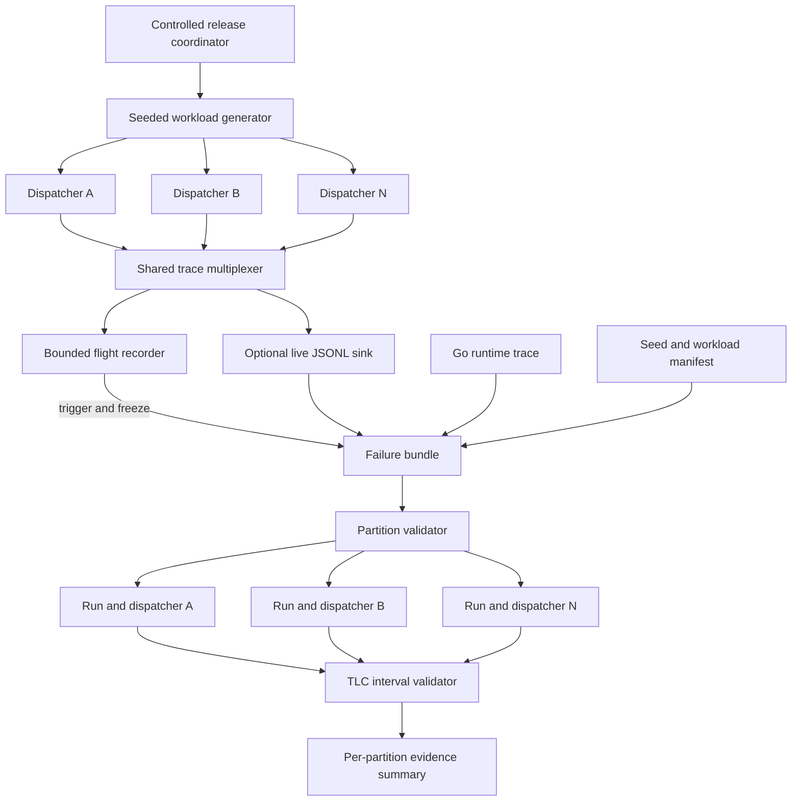

# Continuous and Reproducible Refinement Evidence — Flight Recorders, Multi-Dispatcher Harvests, and Seeded Schedules

The existing Sessionstream verification pipeline can harvest one production observer dispatcher during a focused Go test, correlate model and interval events with `runtime/trace`, and ask TLC for a complete legal abstract linearization. This research project extends that finite campaign in three directions: retaining evidence around rare failures, exercising many dispatchers in one process, and generating reproducible concurrent workloads from explicit seeds.

These workstreams solve different problems. A flight recorder addresses temporal availability: evidence must already exist when a rare failure occurs. Multi-dispatcher harvesting addresses spatial composition: event identity and validation must remain correct when many independent protocol instances share one process and sink. Seeded schedule generation addresses experimental reproducibility: a failed workload must be reconstructible without claiming control over Go scheduler decisions that were never controlled.

> [!summary]
> - **Flight recorder:** retain a bounded recent history and freeze it when a watchdog, panic, invariant failure, or operator trigger occurs.
> - **Multi-dispatcher harvest:** collect interleaved events from many dispatchers, partition them by stable identity, and validate each protocol instance independently while checking shared-sink integrity.
> - **Seeded schedule generation:** derive workload choices and controlled release order from a recorded seed; distinguish reproducible inputs from uncontrolled runtime scheduling.
> - The three workstreams share one trace schema and failure-bundle format, but they must have separate acceptance tests because retention, partitioning, and reproducibility are different correctness properties.

## 1. Research question

The current production-shaped campaign answers:

```text
Does this deliberately executed dispatcher run admit a legal abstract
linearization under the observed operation intervals and partial updates?
```

The proposed project asks three additional questions:

1. Can the system preserve enough bounded evidence to diagnose a rare failure that occurs before tracing is manually enabled?
2. Can the trace/refinement boundary remain sound when one process hosts many concurrently active dispatchers?
3. Can randomized workload generation produce durable, replayable experiments without confusing workload reproducibility with scheduler determinism?

The combined objective is:

```text
continuous evidence availability
+ compositional identity and validation
+ reproducible experimental inputs
= stronger production-shaped refinement evidence
```

The project does not attempt to turn finite traces into a universal proof. It improves when traces are available, how representative they are, and how reliably a failed campaign can be repeated.

## 2. Baseline and retained invariants

The baseline implementation is the observer dispatcher in:

```text
/home/manuel/code/wesen/go-go-golems/sessionstream/
  pkg/sessionstream/transport/ws/observer.go
  pkg/sessionstream/transport/ws/observer_trace.go
  pkg/sessionstream/transport/ws/observer_trace_jsonl.go
  pkg/sessionstream/transport/ws/observer_trace_harvest_test.go
```

The baseline verifier is in:

```text
/home/manuel/code/wesen/go-go-golems/go-go-parc/
  Research/Software Architecture Garden/sessionstream/designs/research/specs/tracelink/
```

Every extension must preserve these invariants:

- tracing remains nil-gated when disabled;
- observer delivery remains bounded and best-effort;
- no trace sink runs while holding a callback-facing lock unless explicitly designed and measured;
- event identity includes schema version, run ID, dispatcher ID, sequence, and operation ID;
- model events constrain only abstract state known at the claimed transition;
- operation intervals preserve real-time precedence without inventing a total order;
- runtime traces are diagnostic evidence, not the source of abstract correctness semantics;
- TLC validates one explicit run/dispatcher partition at a time unless a new composed model is deliberately introduced;
- every failed validation preserves its inputs and diagnostic outputs;
- mutation sensitivity is required before a workstream is considered complete.

The existing campaign has found complete witnesses at `GOMAXPROCS=1,2,4`. It also exposed an unsound instrumentation claim: `queue_len` sampled after native channel send or receive was data-race-free but not atomic at the claimed abstract transition. This project must not reintroduce complete-looking state snapshots where sparse action evidence is the sound representation.

## 3. Architecture



The shared trace multiplexer is the central integration point. It receives typed model and interval events, assigns or preserves stream metadata, and sends them to one or more sinks. A flight recorder is one sink. A JSONL writer is another. Neither changes dispatcher semantics.

The workload generator is outside the dispatcher. It decides operations, parameters, and controlled synchronization points from a seed. It does not replace the Go scheduler. The manifest records what it controlled.

The partition validator operates before TLC generation. It checks global stream integrity, groups events by `(run_id, dispatcher_id)`, verifies operation joins within each group, and invokes the existing interval validator independently for each dispatcher.

## 4. Workstream A — bounded flight-recorder integration

### 4.1 Purpose

Focused trace harvesting begins before the operation under study. Rare failures in soak tests or long-lived services may occur hours after startup and may not recur after tracing is enabled. A flight recorder continuously retains a bounded recent history so the failure trigger can freeze evidence that precedes the symptom.

The flight recorder is not an unbounded application log. It has a fixed memory budget, explicit overwrite behavior, and a defined snapshot protocol.

### 4.2 Proposed API

A first API should stay internal to the observer tracing package:

```go
type ObserverFlightRecorderConfig struct {
    ModelCapacity    int
    IntervalCapacity int
    MaxEncodedBytes  int
    Redactor         ObserverTraceRedactor
}

type ObserverFlightRecorder struct {
    // bounded rings, trigger state, and snapshot generation
}

func NewObserverFlightRecorder(
    cfg ObserverFlightRecorderConfig,
) *ObserverFlightRecorder

func (r *ObserverFlightRecorder) OnObserverModelEvent(
    event ObserverModelEvent,
)

func (r *ObserverFlightRecorder) OnObserverIntervalEvent(
    event ObserverIntervalEvent,
)

func (r *ObserverFlightRecorder) Freeze(
    ctx context.Context,
    reason string,
) (ObserverFlightSnapshot, error)
```

The capacities for model and interval events should be independent because one operation can emit several interval phases per model action. A byte ceiling prevents unexpectedly large evidence fields from defeating count-based bounds.

### 4.3 Ring-buffer behavior

The recorder should use a bounded ring for each typed stream. Each slot contains a copied event value and its generation number.

```text
on event:
    if frozen:
        record post-trigger event only if configured
        otherwise return
    encode or size-check bounded fields
    redact configured evidence
    reserve next ring slot
    copy event into slot
    publish slot generation
```

The implementation must define whether `Freeze` captures only pre-trigger history or also a short post-trigger tail. The first version should freeze immediately. A post-trigger tail adds a second lifecycle and should be introduced only when a concrete diagnostic requires it.

A snapshot must provide internally ordered streams even while writers are concurrent. Viable designs include:

1. One recorder mutex around insertion and snapshot copying.
2. Per-stream mutexes plus an outer freeze state.
3. A lock-free sequence-stamped ring with snapshot retry.

The first implementation should prefer the mutex design. Trace instrumentation is optional, and correctness is more important than reducing nanoseconds in a diagnostic path. Benchmark data should determine whether a more complex design is justified.

### 4.4 Trigger sources

The recorder should support explicit triggers rather than infer failures from scheduler behavior:

- observer dispatcher shutdown watchdog expiration;
- callback panic threshold, if policy defines one;
- test assertion or refinement-validation failure;
- process panic hook where integration is safe;
- administrative diagnostic endpoint or signal;
- context deadline while waiting for worker completion;
- operator call from a soak-test controller.

Every trigger records:

```json
{
  "trigger_reason": "observer wait deadline",
  "trigger_time": "2026-08-11T18:42:07Z",
  "run_id": "soak-20260811-01",
  "process_id": 4217,
  "build_commit": "...",
  "gomaxprocs": 4
}
```

The trigger metadata is diagnostic context, not an abstract model event.

### 4.5 Runtime-trace integration

Go `runtime/trace` is not naturally a permanent ring buffer exposed through the public API. The initial design should not claim to retain an indefinite bounded runtime trace in memory. Two supported modes are more defensible:

1. **Soak-test mode:** start a file-backed runtime trace for a bounded test window and pair it with the flight-recorder snapshot.
2. **Rotating diagnostic mode:** run explicitly bounded trace windows under an external controller, preserving the current window when a trigger occurs.

The model/interval flight recorder can run continuously because its schema and storage are controlled. Runtime-trace retention must respect the capabilities and overhead of the active Go version.

### 4.6 Data sensitivity

Observer evidence can contain session identifiers, method names, errors, or record metadata. Production integration requires a redaction contract before persistence:

```go
type ObserverTraceRedactor interface {
    RedactModelEvent(ObserverModelEvent) ObserverModelEvent
    RedactIntervalEvent(ObserverIntervalEvent) ObserverIntervalEvent
}
```

The default production recorder should retain abstract action and numeric item identity while omitting payloads. Any reversible session identifier should be treated as potentially sensitive.

### 4.7 Flight-recorder acceptance criteria

- Resident memory remains below the configured byte ceiling under continuous writes.
- Old events are overwritten in documented order without corrupting surviving sequence metadata.
- `Freeze` produces immutable, contiguous snapshots or an explicit truncation marker.
- Concurrent writers and freeze pass `go test -race`.
- Disabled tracing retains the existing nil-gated behavior.
- Trigger metadata and recorder truncation metadata are preserved in the failure bundle.
- A mutation that removes the freeze barrier produces a race or inconsistent-snapshot test failure.
- A mutation that disables overwrite bounds exceeds a memory-budget test.
- A mutation that bypasses redaction is caught by a fixture containing prohibited fields.

## 5. Workstream B — multi-dispatcher production harvesting

### 5.1 Purpose

A server process may host many WebSocket connections, each with its own observer dispatcher. Their events can interleave at one shared sink. Single-dispatcher tests do not establish that partition identity, sink serialization, or result attribution remains correct under that composition.

The abstract dispatcher contract is intentionally local. If dispatchers do not share queue or lifecycle state, their global abstract state is a product:

$$
S = \prod_{d \in Dispatchers} S_d.
$$

An action for dispatcher $d$ changes only $S_d$. Therefore traces can be validated by projection:

$$
\pi_d(\tau) \in Behaviors(Dispatcher_d)
$$

for every observed dispatcher $d$.

This compositional argument is valid only if the trace system preserves identity and shared infrastructure does not corrupt events.

### 5.2 Harness shape

The production test should create several servers or dispatcher instances in one process:

```text
run
├── dispatcher-0001
│   ├── submitters
│   ├── closer
│   └── waiters
├── dispatcher-0002
│   ├── submitters
│   ├── closer
│   └── waiters
└── dispatcher-00NN
    ├── submitters
    ├── closer
    └── waiters
```

All instances write to one multiplexer and one pair of JSONL files. The test should deliberately overlap lifecycle phases: one dispatcher may close while another is accepting, and a third may be draining callbacks.

The output should contain one run ID and multiple dispatcher IDs:

```json
{"run_id":"multi-seed-42","dispatcher_id":"dispatcher-0001",...}
{"run_id":"multi-seed-42","dispatcher_id":"dispatcher-0007",...}
```

Operation IDs need only be unique within one dispatcher if the join key is the full tuple `(run_id, dispatcher_id, operation_id)`. Making operation IDs globally unique is convenient for runtime-trace search, but validators must still use the full identity tuple.

### 5.3 Global validation before projection

Before splitting the streams, the harness checks:

- one declared run ID matches the manifest;
- the observed dispatcher set matches the created set;
- every dispatcher has model and interval events;
- no event changes dispatcher identity within one operation;
- each model event joins exactly one operation interval in the same partition;
- sink-level serialization has not duplicated or lost records;
- per-partition sequence rules match the schema definition;
- each dispatcher contains required lifecycle coverage or an explicit expected variant.

After projection, the existing generator and TLC validator run once per dispatcher. Results should be summarized as:

```text
run_id: multi-seed-42
dispatchers_created: 32
dispatchers_observed: 32
partitions_valid: 32
complete_linearization_witnesses: 32
structural_failures: 0
refinement_failures: 0
```

### 5.4 Sequence-number decision

The current tracer serializes sequence allocation and sink emission. Multi-dispatcher integration must choose one of two schema contracts:

1. **Per-dispatcher sequence:** every partition begins at one and is contiguous after projection.
2. **Sink-global sequence:** the shared sink assigns one total emission sequence, while events also carry a per-dispatcher sequence.

The recommended design is to retain the existing per-dispatcher sequence and optionally add a sink-global `emission_sequence` at the multiplexer. The two fields answer different questions:

- per-dispatcher sequence detects loss and reordering within one protocol stream;
- global emission sequence reconstructs the order in which the shared sink persisted interleaved records.

Neither sequence is automatically a linearization order for overlapping native operations.

### 5.5 Cross-dispatcher noninterference tests

A multi-dispatcher campaign should test more than successful individual witnesses. It should verify that one dispatcher cannot affect another's abstract evidence.

Required mutations:

- rewrite one event's dispatcher ID to another valid dispatcher;
- duplicate an operation ID across dispatchers and validate that full tuple joins remain unambiguous;
- drop one dispatcher's close event;
- splice interval events from dispatcher A into dispatcher B;
- make one sink callback stall while other dispatchers continue;
- trigger one callback panic and verify unrelated workers remain active;
- close a subset while the remaining dispatchers continue accepting.

Expected outcomes must distinguish structural corruption from a legal independent failure. For example, a callback panic may be legal within one dispatcher, while cross-partition interval splicing must be rejected before TLC.

### 5.6 Multi-dispatcher acceptance criteria

- At least 32 concurrent dispatchers can share one sink under `GOMAXPROCS=1,2,4`.
- Every created dispatcher appears exactly once in the manifest and result set.
- Every valid partition produces a complete TLC witness.
- Cross-partition mutations are rejected structurally.
- One dispatcher's panic, close, wait, or capacity drops do not alter another's counters or lifecycle evidence.
- Race-enabled repeated campaigns pass.
- Result summaries retain per-dispatcher counts rather than only an aggregate pass flag.
- Failed partitions preserve both their projected trace and the original interleaved stream.

## 6. Workstream C — seeded concurrent schedule generation

### 6.1 Purpose

The existing harness has a fixed production-shaped workload and relies on repeated executions plus different `GOMAXPROCS` values for schedule diversity. A seeded generator expands workload diversity while preserving enough information to rerun a failure.

The seed controls generated choices. It does not, by itself, control Go's scheduler.

This distinction should appear in every result:

```text
reproducible:
  operation plan
  dispatcher count
  queue capacities
  callback behavior
  barrier release decisions
  chosen delays or fake-time advances

not necessarily reproducible:
  operating-system thread timing
  runtime scheduler decisions between uncontrolled points
  exact native channel arbitration outside controlled barriers
```

### 6.2 Manifest

Every campaign writes a manifest before starting goroutines:

```json
{
  "schema_version": 1,
  "seed": 48291,
  "generator_version": "seeded-observer-v1",
  "run_id": "seed-48291-p4",
  "gomaxprocs": 4,
  "dispatcher_count": 8,
  "operations_per_dispatcher": 160,
  "queue_capacities": [1,2,4,8],
  "controlled_release_plan_sha256": "...",
  "source_commit": "..."
}
```

The generator version is required. The same integer seed under a changed random-call order does not imply the same workload. Exact replay requires seed, generator version, configuration, and preferably the serialized plan itself.

### 6.3 Generate a plan before execution

The generator should first build an immutable operation plan:

```go
type WorkloadPlan struct {
    Version     string
    Seed        int64
    Dispatchers []DispatcherPlan
    Releases    []ReleaseStep
}

type DispatcherPlan struct {
    ID            string
    QueueCapacity int
    Operations    []PlannedOperation
}

type PlannedOperation struct {
    Actor      string
    Kind       string // submit, close, wait, callback gate
    ItemID     uint64
    Panic      bool
    Gate       string
}
```

Execution consumes the plan; it does not call the random generator again. This separation makes the plan inspectable, hashable, shrinkable, and reusable across runtime settings.

### 6.4 Controlled release points

Exact scheduler control is neither available nor desirable. The harness can control semantically relevant boundaries:

- release a batch of submitters;
- permit one close caller to proceed;
- unblock a callback gate;
- allow waiters to enter;
- advance fake time inside a `testing/synctest` bubble;
- wait until a documented state predicate is observed before the next release.

A release plan might say:

```text
1. release submitters A0, A1, B0
2. wait until dispatcher A has one accepted operation
3. release close caller A-close
4. release submitters A2, A3 and waiter A-wait
5. unblock callback gate A-callback-1
6. release all dispatcher B actors
```

The actual interleaving between releases remains available to the runtime. The seed determines the controlled constraints, not every instruction order.

### 6.5 Deterministic prefix and randomized suffix

Every generated plan should retain a deterministic coverage prefix. For each dispatcher, the prefix establishes at least one accepted submit, receive, callback, effective close, worker exit, and wait return. The randomized suffix then explores capacity drops, rejected post-close submissions, callback panic, multiple closers, and multiple waiters.

This avoids campaigns that are random but diagnostically weak because they never exercised the target lifecycle.

### 6.6 Replay and shrinking

Failure bundles should contain:

```text
manifest.json
workload-plan.json
model.jsonl
intervals.jsonl
runtime.trace when enabled
generated TLA+
TLC output
REASON.txt
```

Replay accepts the serialized plan directly:

```bash
go test ./pkg/sessionstream/transport/ws \
  -run '^TestObserverTraceReplayPlan$' \
  -count=1 \
  -args -observer-plan /path/to/workload-plan.json
```

A later shrinker can remove operations or release steps while preserving the failure predicate. Shrinking should be a separate phase, because it repeatedly invokes an expensive Go-to-TLC oracle.

Potential shrink order:

1. remove whole unrelated dispatchers;
2. remove actors that emit no relevant operation;
3. remove operation chunks;
4. simplify queue capacities and panic placement;
5. remove release constraints;
6. minimize remaining item domain.

A shrunk plan must retain the original plan hash and mutation history for provenance.

### 6.7 Seeded-generation acceptance criteria

- The same seed, generator version, and configuration produce byte-identical plans.
- Executing a saved plan does not invoke the random generator.
- Every plan includes the deterministic lifecycle prefix.
- Failure bundles always include seed and serialized plan.
- Replay reproduces structural generator failures deterministically.
- For concurrency failures, the report states whether replay is deterministic, intermittent, or no longer observed.
- Campaign summaries report seeds attempted, plans executed, witnesses found, and failures preserved.
- Generator mutations that omit close, wait, or accepted-prefix coverage fail plan validation.
- Changing generator internals requires a version change or causes golden-plan tests to fail.

## 7. Shared failure-bundle contract

All workstreams should converge on one directory schema:

```text
failure-bundle/
├── manifest.json
├── trigger.json                 # flight-recorder failures
├── workload-plan.json           # seeded campaigns
├── interleaved-model.jsonl      # multi-dispatcher source
├── interleaved-intervals.jsonl
├── partitions/
│   └── dispatcher-0001/
│       ├── model.jsonl
│       ├── intervals.jsonl
│       ├── GeneratedIntervalTrace.tla
│       ├── GeneratedIntervalTrace.cfg
│       └── tlc.txt
├── runtime.trace
├── runtime-parsed.txt
├── REASON.txt
└── SHA256SUMS
```

Not every bundle contains every optional file. `manifest.json`, `REASON.txt`, and `SHA256SUMS` are mandatory. The manifest records which artifacts are absent and why.

Bundles must be written through a temporary directory and atomically renamed after checksums are complete. A process crash during bundling should leave an explicitly incomplete temporary directory rather than a bundle that appears valid.

## 8. Experimental matrix

The initial campaign should cover:

| Dimension | Values |
|---|---|
| `GOMAXPROCS` | 1, 2, 4, 8 |
| Dispatchers | 1, 2, 8, 32 |
| Queue capacity | 1, 2, 4, 16 |
| Workload mode | fixed baseline, seeded plan, replayed plan |
| Trace sink | JSONL, flight recorder, multiplexed both |
| Callback behavior | normal, gated, periodic panic |
| Lifecycle contention | one closer, multiple closers, multiple waiters |
| Validation | structural, per-partition TLC, runtime correlation |

The matrix need not be a full Cartesian product on every commit. CI can run a stable subset; nightly or manual research campaigns can run broader seed ranges.

A result record should include denominators:

```text
plans generated: 500
plans executed: 500
partitions harvested: 4,000
structurally valid partitions: 4,000
complete TLC witnesses: 4,000
runtime traces parsed: 64 of 64 requested
mutations rejected: 12 of 12
```

## 9. Implementation phases

### Phase 1 — plan schema and deterministic generator

Create the versioned manifest and workload-plan types. Generate plans before execution, hash them, and add golden determinism tests. Retain the current fixed harness as the baseline oracle.

Deliverables:

```text
seeded_plan.go
seeded_plan_test.go
seeded_harvest_test.go
JSON schema or documented wire contract
```

### Phase 2 — multi-dispatcher multiplexer and partitioner

Introduce a sink multiplexer and explicitly define per-dispatcher versus sink-global sequencing. Add a multi-dispatcher harvest test and a partition command/script that retains the original interleaved files.

Deliverables:

```text
observer_trace_multiplexer.go
observer_trace_multiplexer_test.go
multi_dispatcher_harvest_test.go
partition_production_trace.py
run_multi_dispatcher.sh
```

### Phase 3 — bounded model/interval flight recorder

Implement bounded in-memory rings, redaction, freeze, immutable snapshots, and bundle serialization. Validate memory ceilings and concurrent freezing under the race detector.

Deliverables:

```text
observer_trace_flight_recorder.go
observer_trace_flight_recorder_test.go
observer_trace_redaction.go
failure_bundle.go
```

### Phase 4 — trigger integration and runtime windows

Connect explicit test/watchdog/operator triggers. Add bounded runtime-trace windows only where the Go API and measured overhead support them. Keep runtime tracing optional and independently configurable.

### Phase 5 — mutation campaign and TLC scaling

Add cross-partition, freeze, redaction, generator, and replay mutations. Measure TLC state growth as dispatcher workloads and interval overlap increase. Since validation is per partition, dispatcher multiplicity should primarily increase total campaign time rather than one model's state space.

### Phase 6 — CI and soak-test policy

Run a small deterministic seed set in CI. Run a wider rotating seed set in nightly jobs. Preserve failing bundles as CI artifacts. Maintain a ledger of seeds already explored so nightly jobs expand coverage instead of repeating only a fixed list.

## 10. Risks and decisions

### Decision: validate dispatchers independently

**Context:** A process contains multiple independent bounded observer dispatchers.

**Decision:** Project the interleaved trace by full partition identity and run the existing interval validator per dispatcher.

**Rationale:** The abstract state is a product when dispatchers share no protocol state. Independent validation avoids an unnecessary product-state explosion.

**Consequence:** Shared-sink correctness requires separate structural tests; per-dispatcher TLC cannot detect every multiplexer defect by itself.

**Status:** proposed.

### Decision: serialize plans, not only seeds

**Context:** Seeded pseudorandom generation can change when generator code changes.

**Decision:** Save the complete generated plan and its hash in every campaign bundle.

**Rationale:** A seed is an input to one generator version, not a durable workload specification.

**Consequence:** Bundles are larger but exact workload intent survives refactoring.

**Status:** proposed.

### Decision: use a locked ring first

**Context:** The flight recorder must support concurrent writers and freezing.

**Decision:** Begin with a mutex-protected bounded ring.

**Rationale:** Snapshot correctness and race freedom are easier to review. Tracing is optional, and no measured requirement currently justifies lock-free complexity.

**Consequence:** Sink contention must be benchmarked with 32 or more dispatchers.

**Status:** proposed.

### Risk: tracing changes the schedule

Any instrumentation perturbs timing. The system must compare tracing-disabled and tracing-enabled behavior, but it cannot eliminate probe effects. Seeded release plans and multiple trace modes can determine whether failures depend on heavy instrumentation.

### Risk: failure bundle contains sensitive data

Production snapshots may expose identifiers or error text. Redaction must occur before durable persistence, and tests must use sentinel secrets to verify removal.

### Risk: TLC campaign cost

Highly overlapping intervals increase candidate orders. Per-dispatcher partitioning bounds individual searches, but large randomized plans may still be expensive. Campaigns need event-count ceilings, TLC timeouts, and preserved timeout bundles.

### Risk: exact replay is overstated

A saved plan reproduces operations and controlled gates. It does not reproduce every scheduler choice. Reports must classify replay strength accurately.

## 11. Success criteria for the research project

The project is complete when all of the following have fresh evidence:

1. A bounded flight recorder freezes valid model and interval snapshots under concurrent writes and configured memory limits.
2. A shared sink harvests at least 32 dispatchers without identity collision, event loss, or race reports.
3. Every valid dispatcher partition produces a complete TLC witness under `GOMAXPROCS=1,2,4`; `8` is included where supported by the test environment.
4. The same seed and generator version produce a byte-identical serialized plan.
5. Saved plans can be replayed without consulting randomness.
6. Failure bundles contain manifests, source traces, projected traces, TLC diagnostics, reasons, and checksums.
7. Redaction tests prove configured sensitive fields do not reach durable bundles.
8. Mutations to freeze behavior, partition identity, lifecycle boundaries, partial updates, generator coverage, and replay metadata are rejected.
9. Disabled-path benchmarks confirm the production server remains nil-gated when no trace sink is configured.
10. Documentation reports both successful witnesses and the finite-execution boundary; it does not describe the campaign as a universal proof.

## 12. Open questions

- Should the recorder freeze immediately or retain a bounded post-trigger tail?
- Is a sink-global emission sequence useful enough to justify a schema addition?
- Which watchdogs have sufficiently precise semantics to trigger evidence capture without excessive noise?
- Should bundle redaction happen before ring insertion, before serialization, or at both boundaries?
- What plan size gives useful schedule diversity without causing routine TLC timeouts?
- Can `testing/synctest` host the seeded release coordinator for the full dispatcher harness, or should it remain a separate deterministic layer?
- Should nightly seed allocation be monotone, randomly sampled, or coverage-guided by observed action/interval shapes?
- What retention and encryption policy applies if failure bundles are produced outside CI?

## 13. Working rules

- Treat a flight recorder as bounded evidence storage, not an unbounded logger.
- Freeze immutable snapshots before beginning bundle serialization.
- Partition by `(run_id, dispatcher_id)` and join operations with the full identity tuple.
- Preserve the original interleaved stream when validating projected partitions.
- Save generated plans; do not rely on seed values alone.
- State which execution decisions are controlled and which remain scheduler-dependent.
- Require deterministic lifecycle coverage before adding randomized suffixes.
- Keep model/interval traces and runtime traces semantically separate but identity-correlated.
- Redact before durable persistence and test redaction with prohibited sentinel values.
- Preserve failed inputs, verifier outputs, and checksums automatically.
- Use mutation sensitivity as an acceptance gate for each workstream.
- Report finite witnesses as finite witnesses.

## Related notes

- [[Research/Software Architecture Garden/sessionstream/designs/01 - Bounded Asynchronous Observer Dispatcher|Bounded Asynchronous Observer Dispatcher]]
- [[Research/Software Architecture Garden/sessionstream/designs/research/01 - Proving the Bounded Asynchronous Observer Dispatcher|Proving the Bounded Asynchronous Observer Dispatcher]]
- [[Research/Software Architecture Garden/sessionstream/designs/research/02 - Constraining the Go Binary - Layered Refinement from Proved Kernels to Executables|Constraining the Go Binary — Layered Refinement from Proved Kernels to Executables]]
- [[PROJECT REPORT - Refinement Tracing for a Concurrent Go Dispatcher - From Runtime Intervals to TLC Witnesses|Refinement Tracing for a Concurrent Go Dispatcher]]
- [[Research/Software Architecture Garden/sessionstream/designs/03 - Effect-Acknowledged State Machines and Runtime Refinement|Effect-Acknowledged State Machines and Runtime Refinement]]
