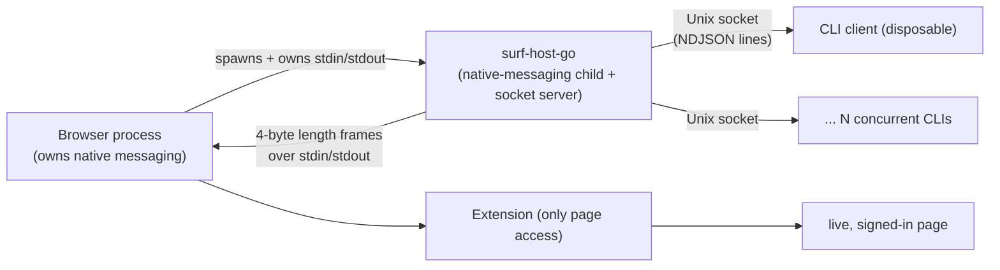

# Browser-Launched Host Broker

## 1. Why this note exists

`surf` scripts a live, logged-in browser from a normal CLI. The CLI cannot talk to the browser directly — only a browser extension can — and only the browser can launch a process on its side of the native-messaging boundary. The central structural decision that makes the whole system work is that the host is **not a daemon the user starts**: the **browser** launches the host as a native-messaging subprocess, and that same host **adds a local socket** so disposable CLI clients can request work.

This entry exists because that decision is non-obvious and load-bearing. It is the difference between a fragile "start a server and discover a browser" design and a robust "the browser owns the host; the host serves the CLI" design. It is the part of surf most worth lifting into cross-project vocabulary for any "script my browser from a CLI" tool, and the part a future engineer must understand before safely modifying the broker. The five-fundamentals overview ([[Research/Software Architecture Garden/surf-cli/01 - Project Architecture Overview|§Project Architecture Overview]]) sketches this as Pattern B; this entry goes deep on the law, the concrete contract, the failure modes, and the math.

## 2. Pattern statement

> **Law.** A process that brokers a browser for ephemeral external clients is launched *by the browser* as a native-messaging subprocess; its stdin/stdout belong to the browser's framing protocol, and it *adds* a second, local IPC surface (a Unix socket) for the clients. Browser authority flows from being browser-launched; client access is a deliberately separate, layered channel. The host is a bridge between two worlds, owned by the browser on one side and serving clients on the other.

The non-obvious half is the **direction of authority**: the host does not acquire the browser; the browser acquires the host. The host is the browser's child. Everything else (the socket, the CLI, the framing) is a consequence of that one inversion.

## 3. Concrete architecture

The broker is one binary, `surf-host-go`, with three external boundaries:

- **Native boundary (browser ↔ host).** `go/internal/installer/native_host.go` writes a per-browser native-messaging manifest under the stable host name `HostName = "surf.browser.host"` for Chrome, Chromium, Brave, and Edge (a `browserConfig` map gives the OS-specific manifest directory for each). The browser discovers and launches the binary by that name. The host's stdin/stdout are then the native-messaging channel, framed by `go/internal/host/nativeio/codec.go`: each message is a **4-byte little-endian length prefix followed by exactly that many bytes**, capped at `DefaultMaxFrameSize = 16 * 1024 * 1024` (16 MiB).
- **Client boundary (CLI ↔ host).** The host *also* listens on a local socket. `go/internal/host/socketbridge/listener.go` defines a `Listener` interface (`Accept`, `Close`, `Endpoint`, `Cleanup`) with a platform split — `listener_unix.go` opens a Unix-domain socket; `listener_windows.go` is the Windows stub. The endpoint is resolved once in `go/internal/host/config/socket_path.go` (`/tmp/surf.sock` on Unix, `//./pipe/surf` on Windows, overridable by `SURF_SOCKET_PATH`). Clients (`go/internal/cli/transport/client.go`) speak NDJSON lines over it.
- **Concurrency inside the host.** `go/cmd/surf-host-go/main.go` `run()` starts two loops concurrently: `acceptLoop` (per CLI session → `handleSession`) and `readNativeLoop` (extension replies → `handleNativeMessage`). Both feed exactly one native writer, `writeNative`, guarded by `nativeWriteMu`. On startup the host sends `HOST_READY` (carrying the socket endpoint) to the extension before accepting clients.

The key shape: the browser owns the host's lifetime and the native channel; the host owns the socket and the client multiplexing. The host never opens the browser; the browser opened the host.

## 4. Implementation details

### 4.1 The framing codec

`nativeio/codec.go` is small and exact. `ReadFrame` reads a 4-byte header, interprets it as a little-endian `uint32`, rejects anything over `maxSize` as `ErrFrameTooLarge`, then reads exactly `n` bytes. `WriteFrame` checks the outbound size against `DefaultMaxFrameSize`, prepends the header, and writes once. `ReadJSON`/`WriteJSON` wrap frame I/O with `json.Unmarshal`/`Marshal`, surfacing decode failures as `ErrInvalidJSON`. This is the entire byte contract the host and extension share.

The 16 MiB cap is a security boundary as much as a sanity one: it bounds untrusted input *before* JSON parsing, so an oversized or hostile frame is rejected by the frame layer, not by the JSON decoder or the allocator.

### 4.2 The startup handshake

`run()` opens the socket listener first, then sends `HOST_READY` (`{type: HOST_READY, runtime: go-host, socketPath: endpoint}`) to the extension on stdout, *then* begins accepting CLI sessions. The order matters: the extension learns the socket endpoint from the host, not from a shared config file, so a socket-path override is communicated at runtime rather than assumed.

### 4.3 The single serialized write

`writeNative` takes `nativeWriteMu` and calls `nativeio.WriteJSON(os.Stdout, msg)`. No other code path writes to `os.Stdout`. This makes the host the **sole** author of native frames and turns the one stdout stream into a single linearization point for all browser effects (see [[#5. Behavioral contract]] and the wider Pattern E in the overview).

### 4.4 Identity rewrite at the boundary

Because the host multiplexes many CLI sessions over one native stream, it rewrites identity at the boundary: `pending.IDAllocator` (an atomic counter, `id_allocator.go`) mints a fresh `hostID` for each outbound native message; `pending.Store` (`store.go`) maps `hostID → {Session, Kind, OriginalID}`. On reply, `handleNativeMessage` does `pending.Pop(id)`, restores the client's original id, and routes to `req.Session`. The extension never sees a client id; a client never sees a host id.

### 4.5 The platform listener split

`socketbridge` keeps the host OS-agnostic through the `Listener` interface. `listener_unix.go` is the real Unix implementation; `listener_windows.go` is a stub. The client side mirrors this split: `transport/client.go` `Send`/`Stream` return an explicit error on Windows ("windows named pipe transport is not implemented yet") rather than silently failing. The Windows path is *acknowledged*, not hidden.

## 5. Behavioral contract

The host guarantees:

- **It is the only writer to the native channel.** Concurrent CLI clients never interleave bytes on the native stream; the host sequences their effects even if the browser itself could not.
- **It outlives no browser.** When the extension reloads or the browser closes the native channel, stdin hits EOF; `readNativeLoop` returns `errNativeDisconnected`; `run()` then calls `sessions.NotifyExtensionDisconnected("Surf extension was reloaded. Restart your command.")` — which writes an `extension_disconnected` frame to every session and closes them — and exits. The host does not attempt to outlive the browser.
- **It rejects malformed frames without dying.** `ErrInvalidJSON` and `ErrFrameTooLarge` from the native loop are logged and the loop continues; one bad frame does not tear down the host.
- **It bounds frames.** Oversized payloads are rejected at the frame boundary before JSON parsing.

The host does *not* guarantee:

- ordering of *effects in the browser* (only of dispatch onto the native stream);
- that a reply will arrive for every dispatched id (the pending store has no TTL; an unanswered native request is reclaimed only when its owning session disconnects, via `pending.DeleteForSession`);
- that an unknown-id reply is observable (it is silently dropped — a documented debugging blind spot).

## 6. Mathematical and computer-science foundations

### 6.1 The host as a process owned by a parent

The host's lifetime is a happens-before relation under process ownership: the browser's spawn of the host *happens-before* the host's first read of stdin, which *happens-before* `HOST_READY`, which *happens-before* the first accepted CLI session. There is no "connect to the browser" operation in the host; the connection is the spawn. Formally, the host process is a *child* whose termination is governed by its parent (the browser), and whose stdin EOF is the parent's disconnect signal.

This is why "the user does not start the host" is a law and not a convenience: a user-started daemon would have to *initiate* a connection to the browser, which it cannot make (only the browser can open a native-messaging channel to a host it launched). The direction of the spawn is the direction of authority.

### 6.2 One writer ⇒ one linearization point

Let the set of outbound native effects be a sequence $N = n_1, n_2, \dots$. Because exactly one goroutine at a time holds `nativeWriteMu` while calling `WriteFrame`, the observed native stream is a total order consistent with the mutex acquisitions:

$$\text{observed}(N) = \text{serialize}(\text{dispatches})$$

The host therefore offers a **linearization point**: any set of concurrent client dispatches has a single equivalent serial execution as seen by the extension. This is the property that makes concurrent CLIs safe by construction (Pattern E in the overview). It is *linearization of dispatch*, not of completion — once dispatched, the browser's own execution ordering is outside this law.

### 6.3 Multiplexing as id rewriting

Let client $c$ send a request with id $i_c$ and receive a reply for id $i_c$. The host implements a bijection at the boundary:

$$\phi : i_c \mapsto h \quad\text{on dispatch},\qquad \phi^{-1} : h \mapsto i_c \quad\text{on reply},$$

where $h$ is a fresh host id from a monotone allocator and the pending store $P$ holds the pair $(h \to (c, i_c))$ for the duration of the in-flight request. The extension's id space and the clients' id spaces are disjoint by construction; the host is the only component that sees both. A reply with an $h$ not in $P$ is unattributable and dropped.

### 6.4 Disconnect as a cascade

Let $S$ be the set of live sessions and $P$ the pending map. An extension disconnect is a single event $d$ that must transitively invalidate every session and every pending entry, because no reply can ever come back. The host implements $d$ as a cascade: $\text{notify}(S) \circ \text{close}(S)$, with per-session pending/stream reclamation on disconnect. This is a safety (never-bad) property: a client must not block forever on a reply that can never arrive.

## 7. Design-pattern vocabulary

- **Native-messaging host** — the browser-defined role: a process the browser launches by stable name, communicating over length-prefixed stdin/stdout frames. Surf's instance is `surf.browser.host`.
- **Host broker** (this pattern) — a native-messaging host that *additionally* serves a local IPC surface for external clients, multiplexing them onto the single native stream. The broker is owned by the browser on one side and serves clients on the other.
- **Effect channel** — the single serialized native write path (`writeNative` + `nativeWriteMu`); the linearization point for all browser effects.
- **Identity rewrite** — the id bijection at the boundary that lets many clients share one stream without leaking identity into the extension.
- **Cascade disconnect** — the propagation of a single native disconnect to all sessions and all pending state.
- **Implicit authority** — the live, signed-in browser session *is* the authority; the host brokers it, it does not acquire it (Pattern D). The broker is meaningless without this: a user-launched host that had to log in would re-implement the browser's hardest problems.

> [!important] Vocabulary discipline
> A native-messaging host is not automatically a broker (it could serve one in-process client only). A broker is not a daemon (the browser, not the user, owns its lifetime). A socket is not the native channel (the socket is the *added* second surface). The escape hatch (`js`) is not a sandbox. Implicit authority is not a credential the host holds.

## 8. Why alternatives are wrong

- **A user-started daemon.** The daemon would have to discover or re-establish the browser connection itself, which it cannot do: only the browser can open a native-messaging channel to a host *it* launched. A user-started host has no path to browser authority. This alternative breaks the law (the spawn is the authority) and is the single most important thing to refuse.
- **The CLI speaks native messaging directly.** This pushes Chrome's framing protocol and process model into every caller and couples CLI lifetime to browser lifetime — exactly what the CLI/host split (Pattern A) exists to prevent. It also forces every CLI invocation to either hold the browser connection open or re-launch it.
- **Host = the extension (no socket).** Removing the socket removes the second surface that makes external scripting possible. The extension alone can serve its own UI, not arbitrary external processes.
- **The host outlives the browser (auto-reconnect).** Tempting for "robustness", but it would require the host to re-acquire a native channel it cannot open — the browser must re-spawn it. Surf instead makes disconnect graceful and terminal, and tells the CLI to restart its command. Pretending to outlive the browser would hide the one signal (extension reload) the CLI most needs to see.

## 9. Failure modes and tricky details

### 9.1 Extension reload kills all in-flight CLI work

This is the most operationally surprising behavior and the one most likely to be mis-filed as a bug. When the extension reloads, stdin EOFs; the host sends `extension_disconnected` to every session, closes them, and exits. In-flight requests fail. This is correct (the host is the browser's child and the browser just closed the channel) but it means surf is unavailable across extension reloads, and a long-running bulk export can be interrupted by a developer reload. The mitigation is not to hide it — the `NotifyExtensionDisconnected` message is deliberately explicit ("Surf extension was reloaded. Restart your command.").

### 9.2 The socket is not a security boundary

The Unix socket is a *structuring* boundary, not a *trust* boundary: any local process can connect and request any tool. The broker is meaningful on a single-user workstation and wrong on a shared host. This is not a bug in the broker; it is a deliberate scope (see [[#11. Applicability and non-applicability]]) that an adopter must state explicitly.

### 9.3 One native stream is the throughput ceiling

Because there is exactly one serialized native write path, the host cannot parallelize effects onto the extension. The linearization that makes concurrent CLIs safe is also the bottleneck for high-throughput use. This is a known trade, not debt.

### 9.4 Unknown-id replies are silently dropped

`handleNativeMessage` does `pending.Pop(id)` and, if `!ok`, returns without logging. A reply for an id no longer in the store (already popped, or from a stale/duplicate extension message) vanishes. This is a debugging blind spot worth a future log line, but it is not a correctness bug: there is no session to route it to.

### 9.5 No TTL on the pending store

A dispatched id whose reply never arrives occupies a pending slot until the owning session disconnects. Under a misbehaving extension this can leak slots for the life of a long session. There is no timeout on the host side of a single tool request; the client's `--timeout-ms` governs the *client's* wait, not the host's bookkeeping.

### 9.6 The host cannot start itself

A direct corollary of the law, and a frequent source of confusion: `surf <command>` does not launch the host. If the browser/extension is not running, the CLI's socket dial fails fast with a clear error. Surf never silently starts the host because it cannot — only the browser can. This is correct, but user-facing error wording should make the cause obvious.

## 10. Testing and verification

- `go/internal/host/nativeio/codec_test.go` exercises the framing contract: well-formed frames, `ErrFrameTooLarge` on oversized headers, `ErrInvalidJSON` on bad payloads, partial reads.
- `go/cmd/surf-host-go/main_test.go` exercises session dispatch, the ChatGPT provider path, disconnect semantics, and the pure-error classification that strips extension bookkeeping keys (`_resolvedTabId`, `_hint`) from user-facing output.
- `go/internal/host/pending/store_test.go` exercises the id-rewrite correlation store and per-session reclamation.
- `go/internal/host/socketbridge/session_test.go` and `listener_unix_test.go` exercise session write serialization and the Unix listener.
- `go/cmd/surf-go/integration_test.go` builds the full root and drives commands against a mock host, asserting the socket round-trip end to end.

The contract most directly under-tested by these is the **browser spawn itself** — the tests mock the native side. The spawn/lifecycle contract (browser → host → `HOST_READY` → socket) is verified by integration, not by a focused test of `run()` against a real browser. This is the obvious validation gap (see [[#13. Open questions]]).

## 11. Applicability and non-applicability

### 11.1 Apply when

- Scripting a browser that exposes a native-messaging host API, from ephemeral external processes.
- The browser session is the human's live, signed-in session (so implicit authority is acceptable and credential management is out of scope).
- Many short-lived CLI invocations should share one persistent browser authority without coupling their process lifetime to it.

### 11.2 Do not apply when

- There is no native-messaging/extension channel — the broker has no foothold; a plain local library or HTTP server is simpler.
- A single long-lived owner is also the UI — then a host broker is unnecessary indirection; let the owner talk to the browser directly.
- Credential acquisition is actually the requirement — implicit authority (Pattern D) would fight you; you need an auth-handling component, not a broker.
- The deployment is a shared/multi-user host — the socket is not a trust boundary; add a local-credential gate or do not deploy the broker there.

## 12. Candidate ecosystem guidance

1. **Browser-launched host broker.** A native-messaging subprocess the browser owns, which *adds* a local socket for ephemeral clients. Authority comes from being browser-launched; client access is a deliberately separate, layered channel. State explicitly that the host does not — and cannot — start itself.
2. **One serialized effect channel per browser authority.** Concurrent clients are made safe by a single mutex-guarded native write, not by client-side coordination. State that this serializes *dispatch*, not browser *execution*.
3. **Disconnect is a graceful cascade, not a silent failure.** An extension reload is the one signal a CLI most needs; propagate it as an explicit, actionable message rather than hiding it behind a generic timeout.

These remain candidates until at least one other "script the browser" project implements the same law. The comparison targets are any browser-automation host that mediates external callers; the invariant to match is the **direction of the spawn**, not the framing bytes or the socket type.

## 13. Open questions

1. **Trust model of the socket.** Document the single-user-workstation assumption explicitly, or add a local-credential/peer-cred gate so the structuring boundary is also a trust boundary.
2. **Spawn/lifecycle focused test.** Add a test of `run()` against a fake native stdin/stdout pair (a framed pipe) asserting the `HOST_READY` → accept ordering and the EOF → cascade-disconnect behavior, independent of a real browser.
3. **Effect ordering in the browser.** Characterize, for tools that assume sequence, what the host *does* and *does not* guarantee once a dispatch leaves the serialized write.
4. **Unknown-id reply logging.** Decide whether a dropped unknown-id reply should be logged at debug level (it is a blind spot today).
5. **Pending-store TTL.** Decide whether the host should reap in-flight ids after a bounded time even when the session stays connected.
6. **Reuse in a second project.** Implement the browser-launched-host-broker shape in another tool to move this from `Candidate` toward `Validated` ecosystem guidance.

## 14. Evidence and references

### 14.1 Source paths (all under the repository root)

- `go/cmd/surf-host-go/main.go` — `run()`, `acceptLoop`, `readNativeLoop`, `writeNative` (`nativeWriteMu`), `errNativeDisconnected`, `NotifyExtensionDisconnected`, `HOST_READY`.
- `go/internal/host/nativeio/codec.go` — 4-byte LE framing, `DefaultMaxFrameSize = 16 * 1024 * 1024`, `ReadFrame`/`WriteFrame`, `ErrFrameTooLarge`, `ErrInvalidJSON`.
- `go/internal/host/socketbridge/listener.go` — `Listener` interface (`Accept`/`Close`/`Endpoint`/`Cleanup`).
- `go/internal/host/socketbridge/listener_unix.go`, `listener_windows.go` — platform split.
- `go/internal/host/socketbridge/session.go` — `SessionManager`, `NotifyExtensionDisconnected`.
- `go/internal/host/pending/store.go`, `id_allocator.go` — id-rewrite correlation.
- `go/internal/host/config/socket_path.go` — `/tmp/surf.sock`, `//./pipe/surf`, `SURF_SOCKET_PATH`.
- `go/internal/installer/native_host.go` — `HostName = "surf.browser.host"`, per-browser manifest dirs (Chrome/Chromium/Brave/Edge).
- `go/internal/cli/transport/client.go` — `Send`/`Stream`; the Windows named-pipe-not-implemented error.

### 14.2 Tests asserting behavior

- `go/internal/host/nativeio/codec_test.go` — framing, `ErrFrameTooLarge`, `ErrInvalidJSON`.
- `go/internal/host/pending/store_test.go` — correlation and per-session reclamation.
- `go/internal/host/socketbridge/session_test.go`, `listener_unix_test.go` — session write serialization, Unix listener.
- `go/cmd/surf-host-go/main_test.go` — dispatch, disconnect, provider, error classification.
- `go/cmd/surf-go/integration_test.go` — full root build and socket round-trip against a mock host.

### 14.3 Related Garden notes

- [[Research/Software Architecture Garden/surf-cli/README|Architecture Garden — surf-cli]] — project study index; this entry is the deep treatment of its Pattern B.
- [[Research/Software Architecture Garden/surf-cli/01 - Project Architecture Overview|Project Architecture Overview]] — the five fundamentals, of which this is the deep version of B.
- [[Research/Software Architecture Garden/README|Software Architecture Garden]] — maturity vocabulary and evidence hierarchy.
- [[Research/Software Architecture Garden/devctl/README|devctl]] — host-owned intent/effect; a different domain (local process reconciliation) but the same "host interprets intent and owns effects" shape.
- [[Research/Software Architecture Garden/rag-evaluation-system/README|rag-evaluation-system]] — typed values across Go/JS/browser boundaries; a host-owned effect interpreter in a different domain.
