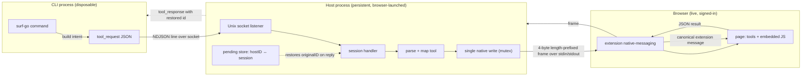

# Architecture Garden — surf-cli

`surf` is a tool for driving a live, logged-in browser from scripts and the command line. Its architecture is defined by how it bridges a normal CLI to a browser it cannot touch directly — only a browser extension can. This study concerns the foundational shape of that bridge, not the internals of any one site extractor.

The repository is interesting because it solves a deceptively hard problem with a small, deliberate set of structural decisions: how do you make a *scriptable*, *logged-in*, *live* browser usable from a disposable CLI without the CLI managing credentials, speaking Chrome's native-messaging protocol, or coupling to the browser's process lifetime?

> [!summary]
> - The system is **three cooperating processes**, never one: a disposable CLI client (`surf-go`), a persistent broker host (`surf-host-go`), and a browser extension. They communicate by JSON messages, never by shared state.
> - The host is **not a daemon you start** — the *browser* starts it as a native-messaging subprocess, and the host *adds* a local Unix socket so CLI clients can request work. Browser authority comes from being browser-launched; CLI access is a second channel layered on top.
> - Page interaction is **JavaScript behind a tooling facade**: a closed set of named, versioned tools plus ~60 per-site embedded scripts, with raw `js`/`eval` kept as an explicit escape hatch rather than the primary surface.
> - **Authentication is not surf's job.** The live, signed-in browser session *is* the authority; surf drives it, it does not acquire it.
> - Everything the browser must do is **declarative JSON intent over one serialized effect channel**, which is what lets many concurrent CLI clients share one browser safely.
> - All five fundamentals are **Established** at the project level — they are the load-bearing shape of surf, not experiments. The most novel and transferable is the **host as a browser-launched native-messaging subprocess that also serves a local socket**.
> - Full pattern detail, evidence, negative space, and failure modes are in [[Research/Software Architecture Garden/surf-cli/01 - Project Architecture Overview|Project Architecture Overview]].

## Snapshot identity and evidence

| Field | Value |
|---|---|
| Repository | `/home/manuel/workspaces/2026-08-07/add-3d-model-verbs/surf-cli` |
| Remote | `git@github.com:wesen/surf-cli.git` |
| Branch | `task/add-3d-model-verbs` |
| Commit | `c029d4c65741e1a26d15af2974046244e02aebd5` |
| Worktree | Dirty (merge-conflict fix + glazed v1.4 migration in flight; analysis is of the architecture, not those changes) |
| Go module | `github.com/nicobailon/surf-cli/gohost` |
| Primary implementation | `go/cmd/surf-go`, `go/cmd/surf-host-go`, `go/internal/cli/*`, `go/internal/host/*` |

The analysis used the two binaries, the socket transport, the host router and pending store, the socketbridge sessions, the native IO codec, the native-host installer, the chatgpt provider, the command base/format/tab-ready helpers, and the marketplace-capture envelope. It did not audit the browser extension's TypeScript implementation in depth (that is a separate codebase); it treats the extension as the owner of page access and the counterparty of the native-messaging contract.

## The architecture in one diagram

The diagram contains the central separations. The CLI never touches the browser. The host never runs user code in the page by itself — it only rewrites intent onto the one native channel. The extension is the only component with page access. The pending store is what lets N concurrent CLI sessions share one extension stream.

## The five fundamental patterns

| Pattern | Law (one line) | Maturity |
|---|---|---|
| **A — CLI client / host broker split** | The process that presents a UI never holds browser authority; they talk only JSON over a local socket. | Established |
| **B — Host as native-messaging subprocess + socket** | The browser starts the host; the host *adds* a socket for CLIs. Authority flows from being browser-launched; CLI access is a second channel. | Established |
| **C — JavaScript behind a tooling facade** | Callers use named, versioned tools + per-site embedded scripts; raw `js` is an explicit escape hatch, not the primary surface. | Established |
| **D — Live browser session as implicit authority** | Auth is not surf's job; the signed-in browser session *is* the authority. | Established |
| **E — Declarative intent over a serialized effect channel** | Everything is self-describing JSON intent; one mutex-guarded native write linearizes all browser effects. | Established |

> [!important] Vocabulary discipline
> The CLI is not the host. The host is not the extension. A tool name is not the page effect it maps to. An embedded site script is not a generic tool. The live session is not a credential. Declarative intent is not "no code" — the `js` escape hatch sends code as data, so the boundary is JSON, not data-vs-code.

## How the fundamentals combine

The five patterns are not independent choices; they form one coherent answer to "script a live, logged-in browser from a CLI."

- **A** lets the CLI be disposable while the browser stays up.
- **B** is the mechanism that makes the host a trusted, browser-launched broker rather than something you start by hand — and the mechanism by which the host *gets* browser authority at all.
- **D** removes auth from the problem, which is what makes **B** acceptable (the browser is *your* browser, already signed in).
- **C** turns raw browser power into stable, scriptable verbs + per-site extractors, with an escape hatch.
- **E** is the contract that makes **A** and **C** composable across process boundaries.

Drop any one and the design breaks: without **B** you'd have to start/manage the browser connection yourself; without **D** you'd be managing credentials; without **C** every caller would write fragile page JS; without **E** concurrent CLIs would corrupt the browser; without **A** a CLI crash would tear down your browser session.

## Candidate common vocabulary

| Proposed term | surf name | Invariant it should mean | Nearby names elsewhere |
|---|---|---|---|
| **Intent value** | `tool_request` / `params` | Serializable typed request for browser work; not authority and not the effect itself. | PBUI command/verb; go-go-datadrop verb; rag-evaluation `ActionSpec`; sessionstream `Command`. |
| **Effect channel** | `writeNative` + `nativeWriteMu` | The single serialized path onto which all browser effects are linearized. | sessionstream hub apply; devctl effect boundary. |
| **Tool facade** | `MapToolToMessage` | A closed, versioned mapping from named tools to canonical browser messages, with alias normalization and rejection. | go-go-goja catalog→registration; devctl plugin catalog. |
| **Escape hatch** | `js` / `eval` tool | An intentionally-present raw surface that runs caller code in the page; documented, not hidden. | Goja VM/loop bypass (documented as debt); raw query paths. |
| **Host broker** | `surf-host-go` | A process that mediates many clients over one browser authority without owning the client UI or the page. | devctl host; rag-evaluation host-owned effects. |
| **Native framing** | 4-byte LE length prefix, 16 MiB cap | The byte contract that lets the browser and host share a stdin/stdout stream safely. | Chrome native messaging spec. |
| **Implicit authority** | live browser session | The credentials are the live, signed-in session; the tool drives it, never acquires it. | (no direct Garden kin — surf-distinctive) |

## Cross-project comparison

| Project | Shared invariant | Important difference |
|---|---|---|
| [[Research/Software Architecture Garden/devctl/README|devctl]] | A host interprets serializable intent and owns effects; durable evidence and reconciliation. | devctl reconciles local process truth; surf brokers a remote browser. devctl's effects are local; surf's effects are in a page it cannot touch directly. |
| [[Research/Software Architecture Garden/rag-evaluation-system/README|rag-evaluation-system]] | Typed semantic values cross Go/JS/browser boundaries; trusted hosts interpret effects. | rag-eval renders widgets in-page; surf drives a live browser for arbitrary sites. Both keep host-owned effect interpretation. |
| [[Research/Software Architecture Garden/go-go-datadrop/README|go-go-datadrop]] | Visible operations are serializable data interpreted at one trusted effect seam. | DataDrop verbs are presentation affordances in one app; surf tools are cross-site browser verbs behind a facade. |
| [[Research/Software Architecture Garden/go-go-goja/README|go-go-goja]] | A catalog is projected to runtime before `require()`; an escape hatch exists. | go-go-goja sandboxes JS in a VM; surf runs JS in a real browser page. go-go-goja's bypasses are debt; surf's `js` is an intentional escape hatch. |
| [[Research/Software Architecture Garden/upwork-tracker/README|Upwork Tracker]] | Immutable capture envelopes with explicit completeness. | Upwork captures marketplace evidence durably; surf's `marketplacecapture` envelope (same lineage) is emitted by surf extractors that drive the live session. |
| [[Research/Software Architecture Garden/zitadel-go-test/README|zitadel-go-test]] | A trust boundary enforced by convention alone is not a security boundary. | zitadel enforces tenant authority across infra; surf's socket is a structuring boundary, explicitly not a security one (any local process can connect). |

## Maturity assessment

| Pattern | Maturity | Evidence or limitation |
|---|---|---|
| A — CLI/host split | Established | Two binaries, clean import split, NDJSON socket protocol, tested. |
| B — native-messaging host + socket | Established | Installer manifests for Chrome/Chromium/Brave/Edge; `HostName="surf.browser.host"`; 4-byte framing; `HOST_READY`. Windows named-pipe transport on the client side is not yet implemented. |
| C — JS facade + escape hatch | Established | 103-arm tool router; ~63 embedded site scripts; `SURF_OPTIONS` injection across ~20 commands; `js`/`eval` present as named tools. |
| D — live session as authority | Established | `GET_CHATGPT_COOKIES` → "login required"; readiness probes on real page, not `about:blank`. No surf-level retry can fix a missing login (by design). |
| E — declarative intent / serialized channel | Established | `BuildToolRequest` (data); `writeNative`+`nativeWriteMu` (sole writer); `pending.Store` identity rewrite. One serialized stream is the throughput ceiling. |

## Candidate ecosystem patterns

The comparison suggests the following are worth developing across projects:

1. **Browser-launched host broker** — a native-messaging subprocess the browser owns, which *adds* a local socket for ephemeral clients. The non-obvious part is that authority comes from being browser-launched, while CLI access is a deliberately separate, layered channel. (Strongest candidate; most transferable to any "script my browser from a CLI" tool.)
2. **Tool facade over a raw escape hatch** — a closed, versioned, alias-normalizing verb set in front of a page, with raw execution kept as a documented, intentional escape hatch rather than the primary surface.
3. **Implicit authority by reuse** — do not acquire credentials; drive the human's existing signed-in session. State explicitly that auth is out of scope by design.

These remain candidates until compared with consumers and additional repositories.

## Open questions and recommended next investigations

1. **Security boundary of the socket.** The Unix socket is a structuring boundary, not a security one. Document the trust model explicitly (single-user workstation assumption) or add a local-credential/peer-cred gate.
2. **Extension-side contract.** This study treats the extension as a black box counterparty. A follow-up should map the extension's message handling, its `initNativeMessaging` bookkeeping (`_resolvedTabId`, `_hint`), and how it owns page access.
3. **Effect ordering in the browser.** The host serializes *dispatch*; once dispatched, the browser's own execution ordering is outside surf's control. Worth characterizing for tools that assume ordering.
4. **Facade vs drift.** Embedded per-site scripts can drift from the host's expectations. Is there a contract test layer between the Go options and the JS scripts?
5. **Reuse of the native-messaging-host shape** in another project, to move "Browser-launched host broker" from candidate to validated ecosystem guidance.

## Design entries

### Project Architecture Overview

[[Research/Software Architecture Garden/surf-cli/01 - Project Architecture Overview|Project Architecture Overview]] documents the five fundamental patterns (A–E) in full: law, concrete architecture, implementation details, behavioral contract, why alternatives are wrong, failure modes, testing and verification, applicability, and candidate ecosystem guidance. It is the entry to read first; finer-grained sub-patterns (correlation, error classification, retry idempotency, capture envelopes) can be broken out into their own design entries later if cross-project comparison demands it.

## Related studies

- [[Research/Software Architecture Garden/README|Software Architecture Garden]]
- [[Research/Software Architecture Garden/devctl/README|devctl architecture study]]
- [[Research/Software Architecture Garden/rag-evaluation-system/README|rag-evaluation-system architecture study]]
- [[Research/Software Architecture Garden/go-go-datadrop/README|go-go-datadrop architecture study]]
- [[Research/Software Architecture Garden/go-go-goja/README|go-go-goja architecture study]]
- [[Research/Software Architecture Garden/upwork-tracker/README|Upwork Tracker architecture study]]
- [[Research/Software Architecture Garden/zitadel-go-test/README|zitadel-go-test architecture study]]
