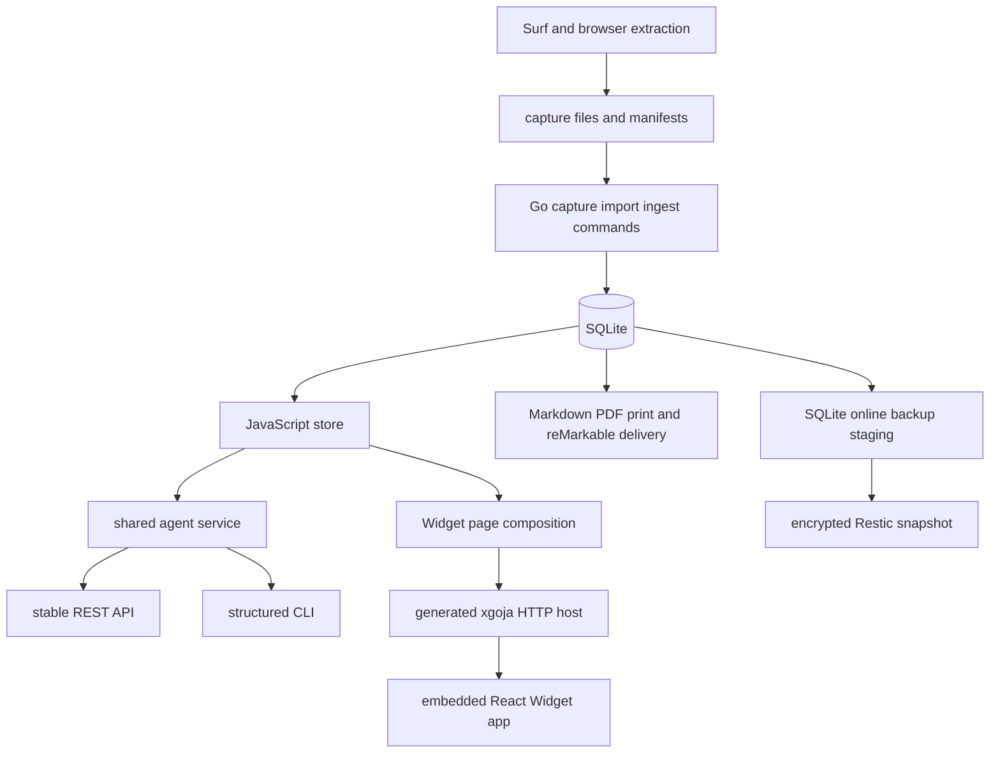

# Upwork Tracker — Project Architecture Overview

Upwork Tracker is a local-first application with three responsibilities: preserve marketplace evidence, support deliberate human workflow decisions, and expose bounded interfaces for browser and agent-assisted operation. The architecture crosses Go, JavaScript, SQLite, HTTP, React, browser automation inputs, and local operational tooling. Its coherence comes from ownership boundaries rather than language boundaries.

> [!summary]
> - Remote evidence, rebuildable projection, and local decisions have different durability and ownership.
> - One SQLite database coordinates human UI, CLI, REST, and delivery workflows.
> - The generated host makes JavaScript policy and React pages part of one Go binary.
> - Safety claims are trustworthy only when enforced beneath every adapter.

## The product layers

### Marketplace boundary

Surf and browser tools observe remote marketplace pages. Capture commands produce machine-readable artifacts. Capture is evidence acquisition, not a workflow decision and not an implicit database mutation.

### Native Go boundary

Go owns command composition, capture orchestration, canonical ingestion, projection, reconciliation, importer migrations, delivery commands, configuration loading, and generated xgoja runtime integration.

### SQLite boundary

SQLite stores several classes of data:

- immutable remote observations and capture runs;
- rebuildable remote projections and normalized search data;
- local job decisions, tags, notes, and application lifecycle;
- private operator facts and provenance;
- proposal forms, immutable draft versions, verified receipts, terms, submissions, and events;
- CAS revisions, idempotency records, and agent audit logs.

### JavaScript domain/application boundary

JavaScript under `verbs/` owns application query policy, resource serialization, agent service behavior, REST and CLI adaptation, Widget page composition, and many mutations.

### Browser boundary

The published `rag-evaluation-site` package renders Widget IR. The Tracker's React entrypoint is intentionally thin. Search, filters, sort, pagination, selection, commands, and action definitions come from server-authored Widget pages.

### Operational boundary

The source checkout should remain replaceable. Private databases, captures, proposals, receipts, exports, and backup staging belong to operator-owned state paths and encrypted backup.

## End-to-end architecture



The arrows indicate representation changes:

| Transition | Representation | Key invariant |
|---|---|---|
| Marketplace → capture | YAML/JSON evidence | Failed or unauthenticated extraction never replaces accepted evidence. |
| Capture → ingestion plan | validated envelope and fingerprint | The write set is reviewable before apply. |
| Plan → observation | immutable row in a transaction | Canonical identity and evidence lineage are preserved. |
| Observation → projection | deterministic SQLite rows | Rebuild does not erase local decisions. |
| SQLite → service | domain resource and mutation result | Private fields are opt-in and errors are stable. |
| Service → REST/CLI | JSON envelopes or Glazed output | Adapters share policy rather than reimplementing it. |
| SQLite → Widget page | Widget IR | Browser state and actions remain data. |
| Live SQLite → backup | SQLite `.backup` snapshot | WAL state is included consistently before Restic reads files. |

## Composition root

`cmd/tracker/main.go` loads layered configuration, injects the selected SQLite DSN into the generated runtime plan, attaches xgoja commands, and adds native command trees. It is the process composition root.

```pseudo
load tracker configuration
export allowlisted runtime identity values
construct generated xgoja bundle
replace embedded db module DSN with configured database
attach generated serve and jsverbs commands
attach native capture/import/ingest/projection/reconcile/deliver/audit commands
execute Cobra root
```

This is a useful pattern: generated infrastructure remains declarative, while the application composition root applies runtime configuration through a supported plan hook rather than editing generated code.

## Human and agent surfaces

The Tracker intentionally has three interface classes:

```text
/api/widget/*
    human browser pages and UI actions

/api/v1/*
    stable resource-oriented local agent API

upwork-tracker verbs upwork ...
    structured direct-database CLI for coding agents
```

The REST and CLI surfaces share `agent-service.js`. Widget actions currently use a mixture of store calls and separate guards. This difference is central to the debt analysis: an invariant enforced only in one adapter does not protect the domain.

## Local-first does not mean single-layer

Local-first describes deployment and custody, not simplicity. The application runs on one operator machine and uses one SQLite database, but it still has process boundaries, protocol contracts, concurrency, privacy requirements, schema migrations, and recovery needs.

The trusted-local model permits public-local HTTP routes only while loopback binding and filesystem permissions are enforced. It is not a substitute for authentication on an untrusted network.

## Strong architecture properties

### Evidence is not a decision

A captured job description and a shortlist decision have different owners. Projection can be replayed; shortlist state must survive replay.

### Human confirmation is a durable event

A draft, a verified filled form, and a remotely submitted proposal are separate facts. The dedicated path records submission, events, revision, and replay response atomically around a verified receipt and explicit confirmation. At the audited commit, its eligibility checks remain incomplete, and a generic service path can bypass it entirely.

### Agents receive stable resources

The stable API exposes capabilities, OpenAPI, opaque cursors, versioned resources, action affordances, redacted defaults, and structured errors. Agents do not need to scrape Widget IR.

### Tests do not touch private state

The full smoke suite creates synthetic data, uses SQLite `.backup`, starts the generated host on a dedicated loopback port, and checks CLI, REST, Widget IR, and browser DOM.

## Transitional architecture

Several ownership transitions remain incomplete:

```text
legacy direct import      ↔ canonical immutable ingestion
jobs workflow columns     ↔ job_local_state
Go schema owner           ↔ JavaScript startup DDL
atomic but under-validated confirmation ↔ generic submitted transition
stable API                ↔ direct Widget mutations and legacy GET/POST routes
XDG target                ↔ CWD-relative defaults
```

These are not minor cleanup details. They create competing authorities. The architecture should be judged by actual writers and callable paths, not by the desired diagram alone.

## A compact target model

```text
one canonical capture envelope
one ingestion plan and apply path
one immutable observation history
one rebuildable remote projection
one local workflow owner
one schema owner
one transactional mutation service
three thin adapters: REST CLI Widget
one corrected evidence-gated human-confirmation submission command
one XDG-resolved live database
one WAL-safe backup path
```

## Key points

- Ownership categories are more important than implementation languages.
- Rebuildable projection must never own local workflow decisions.
- Adapter separation is useful only when all adapters call the same invariant-enforcing service.
- Local HTTP remains a trust boundary and must stay loopback or gain authentication.
- Backup architecture is part of product architecture because SQLite state is authoritative.

## Related studies

- [[Research/Software Architecture Garden/upwork-tracker/02 - Capture Ingestion Projection and Local State]]
- [[Research/Software Architecture Garden/upwork-tracker/04 - Shared Service Across CLI REST and Widget Adapters]]
- [[Research/Software Architecture Garden/upwork-tracker/05 - Proposal Lifecycle and Human Submission Boundary]]
- [[Research/Software Architecture Garden/upwork-tracker/08 - Source State Separation XDG and WAL Safe Backup]]
