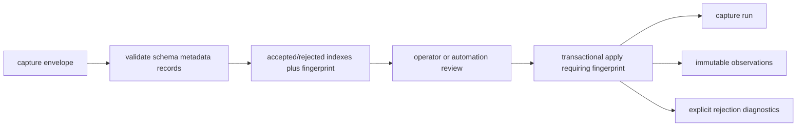

# Capture, Ingestion, Projection, and Local State

The Tracker separates facts observed remotely from decisions made locally. A marketplace page can change, disappear, or return incomplete data. A shortlist decision, operator note, or proposal lifecycle state belongs to the operator and must not be overwritten by a later capture. The architecture addresses this through capture artifacts, immutable observations, rebuildable projection, and local workflow state.

> [!summary]
> - Capture produces evidence; ingestion validates and records it; projection derives queryable remote state.
> - Local workflow survives projection because it has a different owner.
> - The pattern is strong, but the audited commit still supports a second direct-import path and a stale local-state mirror.

## Four ownership classes

### Capture artifacts

A capture is the output of marketplace-facing extraction. It records what a tool observed and enough metadata to assess the observation. Capture commands validate output before replacing the destination file.

### Immutable observations

An observation is a durable occurrence within a capture run. It preserves canonical identity, capture time, raw evidence, normalized fields, and a content fingerprint.

### Rebuildable projection

The projection is a current, queryable view selected from observations. It can be deleted and reconstructed. It supports search, sorting, skills, and application queries.

### Local state

Local state records operator intent: status, tags, notes, star, proposal lifecycle, comments, private facts, and audit history. It is not derived from marketplace evidence.

## Capture is an explicit boundary

`internal/capturecmd` treats capture as evidence production rather than an implicit database operation. Search output is written to a temporary location, checked, and atomically renamed only after acceptance.

```pseudo
run marketplace extraction into temporary file
require command success
require expected structured records
require authentication assertion when configured
require non-empty canonical IDs
write capture manifest
rename temporary output to requested destination
```

If extraction fails, the previous accepted capture remains intact. This is an atomic-file replacement pattern applied to remote evidence.

Detail capture is sequential intentionally. Browser session state and remote page behavior are not assumed to be safe under uncontrolled parallelism.

### Audited default incompatibility

The Upwork search command defaults to requiring authenticated capture validation while asking Surf for `marketplace-capture/v1`. At commit `460b005`, that envelope cannot carry the required authentication assertion and is rejected whenever authenticated evidence is required. The tracked help documents the limitation, but the default path therefore needs an explicit safety downgrade or a different capture format.

This does not invalidate atomic file replacement. It shows that capture format and validation policy are one contract: a command cannot require evidence its selected envelope is unable to represent. See canonical finding `UT-P1-011` in [[Research/Software Architecture Garden/upwork-tracker/10 - Architecture Debt and Patterns Not to Repeat#UT-P1-011 — authenticated capture defaults conflict with the envelope]].

## Reviewed ingestion

Canonical ingestion has two commands:

```text
ingest plan
    validate envelope
    classify accepted and rejected records
    compute deterministic fingerprint
    report exact write intent

ingest apply
    require expected plan fingerprint
    open transaction
    persist run observations and diagnostics
    commit
```

The plan is a review artifact. Apply can require its fingerprint, preventing an operator from reviewing one input and applying another.



This is stronger than an importer that logs malformed rows and continues silently. Rejected evidence remains explainable.

## Canonical identity

The system uses:

```text
<marketplace>:<remoteId>
```

Examples:

```text
upwork:022080229205727145
freelancer:40587446
```

Namespacing prevents remote ID collision and prevents an adapter from changing identity based on input format. Mixed prefixed/unprefixed database states are rejected during migration because guessing identity is unsafe.

## Projection rebuild

The projection algorithm can be summarized as:

```pseudo
begin transaction
seed local state for every observed identity
clear rebuildable remote projection
clear rebuildable normalized skills
clear rebuildable search index

for each canonical identity:
    load observations
    choose source observation
    write remote projection and provenance
    write normalized skills
    update only compatibility fields classified as remote-owned

rebuild full-text search
commit
```

The provenance link back to the winning observation is important. A projection is not an unexplained current value; it records which evidence produced it.

## Local state preservation

Projection must not overwrite:

- shortlist/reject/archive decisions;
- tags and notes;
- application status;
- private facts;
- comments and authored proposal versions;
- audit events.

This is a general local-first rule: replay of remote evidence repairs remote state without erasing local intent.

## Three defects that expose the real invariant

### Occurrence identity is confused with content identity

`capture_observations` globally uniques a record fingerprint computed from payload content. If the same job content is observed in a later run, the observation can be ignored. The application then loses evidence that the unchanged listing was still present at a later time.

A correct model separates:

```text
occurrence identity: capture run + record identity
content identity: hash of normalized record payload
```

The content hash supports deduplication and comparison. It should not erase a later occurrence.

### One envelope has two ingestion semantics

The canonical path stores immutable runs and observations. The legacy import path recognizes the same versioned envelope and adapts it into mutable `jobs` and legacy observations. One wire format therefore has two ownership behaviors.

Compatibility importers should translate old formats into the canonical ingestion plan. They should not bypass immutable staging.

### `job_local_state` is not maintained

Projection seeds `job_local_state` once and reads it for search notes, but normal mutations continue writing local fields on `jobs`. The mirror becomes stale. A table described as the local owner is not the owner unless every mutation writes it.

The migration must choose:

1. make `job_local_state` authoritative and route all mutations through it; or
2. keep local fields on `jobs` until a coordinated cutover, then remove the unused shadow.

## Whole-record winner versus field provenance

Projection chooses one observation by completeness and recency, then projects the full record. This can preserve a complete old description while replacing newer title, compensation, or skill facts with older values.

Field-level projection can choose independently:

```pseudo
project.description = newest non-empty full description
project.title = newest valid title
project.compensation = newest valid compensation
project.skills = newest normalized skills
project.availability = newest availability observation
record provenance for each field group
```

Field-level provenance costs more schema and query complexity. It is justified where capture types have systematically different completeness and freshness.

## The strangler migration pattern

The repository is midway through a strangler migration:

```text
legacy mutable jobs model
       alongside
immutable observations + rebuildable projection + local state
```

This can be a sound migration technique if it has:

- a declared authority at each phase;
- synchronized compatibility writes where necessary;
- metrics or checks for divergence;
- a final cutover and deletion plan.

Without those controls, the strangler becomes permanent dual ownership.

## When to use this pattern

Use capture/observation/projection/local-state separation when:

- remote facts change independently of local decisions;
- source evidence must remain auditable;
- data can be reprocessed as parsing improves;
- several capture types provide different detail levels;
- the current view must be rebuildable.

A simple CRUD application with one authoritative local writer may not need immutable capture history.

## Candidate ecosystem rules

- Capture commands produce evidence and never hide database mutation.
- Reviewable plans contain the exact write set and are fingerprint-bound to apply.
- Occurrence identity and content identity are distinct.
- One wire format has one canonical ingestion path.
- Projection ownership is enforced by actual writers.
- Rebuildable remote state never overwrites local decisions.
- Use field-level provenance when completeness and recency vary by field.
- A strangler migration records authority, divergence checks, and a deletion milestone.

## Related notes

- [[Research/Software Architecture Garden/upwork-tracker/01 - Project Architecture Overview]]
- [[Research/Software Architecture Garden/upwork-tracker/03 - SQLite Evidence and Workflow Ledger]]
- [[Research/Software Architecture Garden/upwork-tracker/10 - Architecture Debt and Patterns Not to Repeat]]
