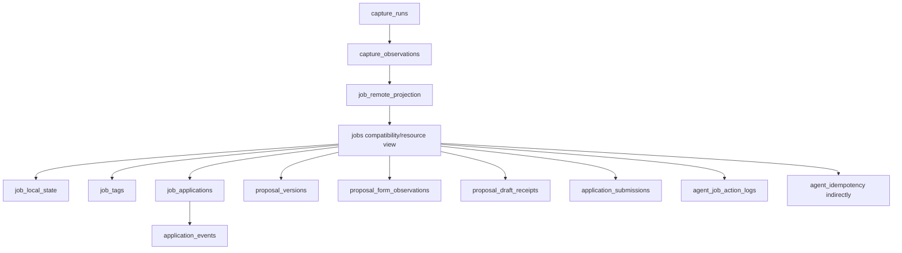

# SQLite Evidence and Workflow Ledger

SQLite is not merely a persistence convenience in Upwork Tracker. It is the coordination boundary between capture, projection, human workflow, agent mutation, proposal evidence, audit history, and recovery. The schema combines immutable facts, mutable decisions, append-only events, rebuildable indexes, and compatibility mirrors. That combination works only when each table and column has one declared writer.

> [!summary]
> - SQLite provides one local transactional authority for human and agent workflows.
> - Evidence, projections, decisions, and events require different mutation rules even when they share one database.
> - The audited commit weakens the model through duplicated Go/JavaScript schema ownership and incomplete transactional grouping.

## Data classes

The schema contains four principal classes.

### Immutable evidence

Examples include capture runs, observations, proposal form observations, proposal versions, draft receipts, submissions, and application events. New evidence is appended; historical evidence is not silently rewritten.

### Rebuildable derived data

Remote projections, normalized skills, and full-text search indexes can be reconstructed from evidence. Their provenance should identify source observations.

### Mutable local decisions

Status, star, tags, notes, priority, triage decisions, and current application state change as the operator works. They require concurrency control and activity/audit records.

### Operational control records

Schema migrations, revisions, idempotency responses, reconciliation plans, and agent action logs support safe operation rather than product display.

## Table relationship model



The actual schema contains more tables, but this graph shows why migration and ownership require care. A canonical job identity has many foreign-key children.

## Namespaced identity

The database rejects raw marketplace IDs in canonical paths. The prefix belongs in the primary key rather than a separate assumption in every query.

```go
func canonicalJobID(marketplace, remoteID string) string {
    return marketplace + ":" + remoteID
}
```

This pattern supports several marketplaces in one store and prevents ID collisions. Migration from unprefixed IDs must update every foreign-key child atomically.

The audited migration uses a hard-coded child table list and omits proposal history tables. This demonstrates a general migration rule: tests and migration logic must follow the complete foreign-key graph, not the tables a maintainer remembers.

## Schema ownership

`internal/importer/schema.go` is documented as schema owner. It creates initial tables, performs additive compatibility probes, and records versioned migrations.

At runtime, `verbs/lib/store.js` also creates tables, adds columns, backfills, creates FTS structures, and prunes records. Starting the UI can therefore mutate schema independently of Go migrations.

Two schema owners produce order-dependent behavior:

```text
new database opened by importer then server
    may differ from
new database opened by server then importer
```

The target rule is:

```text
Go migration owner:
    creates and upgrades schema

JavaScript store:
    checks supported schema version
    fails closed with migration instructions
    executes data queries and transactions only
```

Runtime adapters should not repair schema opportunistically.

## Revision-based compare-and-swap

Mutable resources expose an integer revision. A caller reads the resource, then submits the expected revision with a patch.

```sql
UPDATE jobs
SET notes = ?, revision = revision + 1
WHERE job_id = ? AND revision = ?;
```

If the row count is zero, another writer changed the resource or the ID does not exist. The service returns a stable version conflict rather than overwriting silently.

CAS is valuable because the browser, CLI, REST clients, importers, and agents can share one local database. Local deployment does not eliminate concurrent writers.

## Durable idempotency

A mutation also requires an idempotency key. The service hashes method, path, and request body and records the response. A retry with the same key and input returns the stored result. Reusing the key for different input fails.

The correct transaction is:

```pseudo
begin immediate transaction
check idempotency key
if matching response exists:
    return replay
if key exists with different request:
    fail conflict
claim expected resource revision
apply domain mutation
append domain event and audit record
record idempotent response
commit
```

The dedicated submission-confirmation path approximates this shape. The general mutation helper does not: it performs domain writes and records idempotency afterward. A crash between those operations leaves changed state without replay evidence.

## Append-only proposal evidence

Proposal data is deliberately decomposed:

- proposal form observation records what the remote form showed;
- proposal version records authored draft content immutably;
- draft receipt records a verified fill-only browser state;
- terms record rate, payment mode, connects, and milestones;
- submission records explicit human-confirmed remote completion;
- events record lifecycle history.

This is a strong evidence-ledger pattern. It prevents one status column from standing in for several distinct claims.

A receipt import uses content addressing and a transaction. Duplicate evidence is recognized without creating conflicting rows. Binding a receipt to a proposal version requires matching evidence rather than positional assumptions.

## Reconciliation plans

Identity repair uses a plan/apply model. Planning records intended changes and a drift fingerprint. Apply reinspects conflicts and performs one transaction.

The raw main-file checksum used at the audited commit is unsafe for an active WAL database because committed state may reside in `-wal`. The stronger pattern computes drift from a SQLite read transaction, logical rows, or a `.backup` snapshot.

## Migration testing

A schema migration suite should construct the full condition it claims to support:

```pseudo
create old-version database
insert parent job
insert rows in every foreign-key child
run migrations in order
assert foreign_key_check is empty
assert every child points to canonical prefixed ID
run migration again and assert idempotency
```

Testing only jobs, observations, and tags does not protect proposal-history migrations.

## Privacy at serialization

The database contains private proposal bodies, comments, operator facts, and receipts. Resource serializers omit private fields by default and require explicit opt-in. This is a good boundary even in a local application because stable agent APIs should minimize accidental disclosure.

Filesystem permissions and loopback reachability remain separate controls. Redaction is not authorization.

## What goes wrong

### A mirror is called authoritative but is not written

`job_local_state` is seeded and later used for search notes, while mutations write `jobs`. The mirror becomes stale and projection can rebuild search with obsolete notes.

### Schema repair occurs at server startup

Two implementations evolve separately and tests may cover only one creation order.

### Mutation, audit, and replay records use separate commits

A partial failure creates state that cannot be retried safely or explained completely.

### Migration lists omit foreign-key children

Real databases with proposal history fail where sparse fixtures pass.

### WAL state is treated as a normal file

Hashing or copying only `upwork.db` does not represent the complete committed logical database.

## Candidate ecosystem rules

- Classify every table as immutable evidence, rebuildable projection, mutable local state, or operational control.
- Give every table and compatibility column one writer.
- CAS, domain mutation, audit event, and idempotency response belong in one transaction.
- Follow SQLite's foreign-key graph during identity migrations.
- Validate migrations with populated historical fixtures, not empty schemas.
- Keep private serialization opt-in and separate from network authorization.
- Use SQLite backup or read-transaction semantics for live-database drift and backup operations.

## Related notes

- [[Research/Software Architecture Garden/upwork-tracker/02 - Capture Ingestion Projection and Local State]]
- [[Research/Software Architecture Garden/upwork-tracker/04 - Shared Service Across CLI REST and Widget Adapters]]
- [[Research/Software Architecture Garden/upwork-tracker/05 - Proposal Lifecycle and Human Submission Boundary]]
- [[Research/Software Architecture Garden/upwork-tracker/08 - Source State Separation XDG and WAL Safe Backup]]
