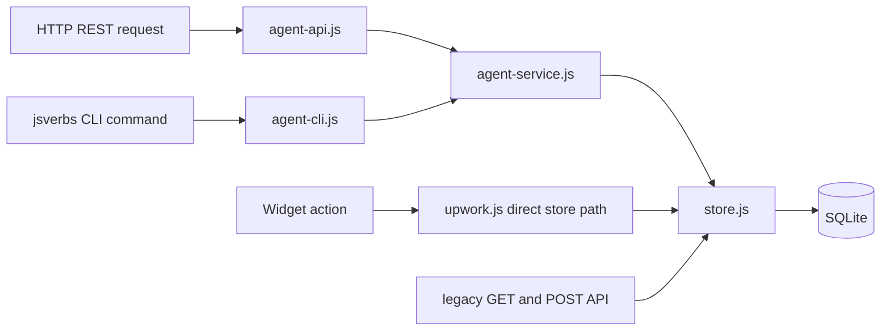

# Shared Service Across CLI, REST, and Widget Adapters

The Tracker exposes human and agent workflows through several adapters. The stable REST API and structured CLI share a JavaScript service that owns resource serialization, validation, cursor semantics, optimistic concurrency, idempotency, and workflow operations. Widget actions often call the store more directly. The architecture demonstrates both the value of a shared service and the danger of leaving invariant-enforcing policy in adapters.

> [!summary]
> - REST and CLI should be protocol adapters over one transaction-capable domain service.
> - Stable agent resources need explicit discovery, errors, cursors, revisions, and redaction.
> - Widget and legacy routes must not bypass the same safety and concurrency policies.

## Interface classes

### Stable REST API

`/api/v1` exposes resources, capabilities, OpenAPI, opaque cursors, structured errors, action affordances, private-data opt-in, and mutation preconditions.

### Structured CLI

`upwork-tracker verbs upwork` calls the same service directly against an explicit database path. Glazed provides JSON, YAML, CSV, table, template, selected-field, and jq output.

### Widget APIs

`/api/widget/pages` and `/api/widget/actions` serve the human browser. They are UI contracts, not the stable agent automation API.

### Legacy routes

The audited host also exposes GET and POST `/api/jobs/:id` outside both stable namespaces. GET bypasses stable resource serialization. POST calls `store.update(...)` directly without expected-version or idempotency enforcement. The route is both an undocumented compatibility contract and a direct mutation bypass; separate Widget action routes also bypass parts of stable service policy.

## Shared service flow



The top path is the desired adapter pattern. The bottom paths show why shared service policy is not yet universal.

## Resource contracts

A stable job resource separates identity, attributes, relationships, actions, links, and metadata. Private proposal content is omitted unless requested explicitly.

List responses use:

```json
{
  "data": [],
  "meta": {
    "count": 20,
    "nextCursor": "opaque-token",
    "sort": "posted-desc"
  },
  "links": {
    "next": "/api/v1/jobs?..."
  }
}
```

Opaque keyset cursors preserve sort position without exposing internal SQL offsets. A cursor is valid only with the same sort and filters.

## Discovery before mutation

Agents start with:

```text
GET /api/v1/capabilities
GET /api/v1/openapi.json
```

Capabilities describe filters, sorts, retention, safety statements, and supported workflows. This is preferable to prompt-only API knowledge or scraping browser pages.

The CLI mirrors discovery through `capabilities` and `api-schema` commands.

## Structured errors

Errors carry stable fields:

```json
{
  "error": {
    "code": "version_conflict",
    "message": "The job changed after it was read.",
    "retryable": true,
    "details": {}
  },
  "meta": {
    "requestId": "..."
  }
}
```

A coding agent can branch on `error.code`. Human prose remains explanatory rather than being the machine contract.

## Optimistic concurrency

Most stable job mutations require `expectedVersion`. The service or store performs compare-and-swap, increments revision, and returns the new resource. Stale callers receive `version_conflict` and re-read before retrying.

Draft-receipt import is an important exception at the audited commit. The service pre-reads the expected version, but the store transaction neither atomically claims nor increments the job revision. A concurrent proposal edit can therefore race receipt binding. Revision claim, proposal-version lookup, receipt binding, terms update, and revision increment must become one transaction before the blanket CAS contract is accurate.

Where correctly implemented, CAS prevents a coding agent from overwriting a human change merely because both operate locally.

## Idempotency

Every stable mutation requires a unique key. The service hashes request identity and input. Matching retries return the recorded response; different input under the same key returns an idempotency conflict.

The intended atomic sequence is:

```pseudo
begin transaction
check or claim idempotency key
claim resource revision
perform domain write
append domain event and audit record
record response
commit
```

At the audited commit, the general `mutate()` helper executes the store operation and records idempotency afterward. Store updates and activity logs can also commit separately. This makes the service contract stronger than its transaction boundary.

## Adapter parity

REST and CLI share serializers and policy, which is a strong pattern. The same input should produce the same domain result and stable error regardless of transport.

Parity tests should be table-driven:

```text
operation: add tag
REST adapter request → service call
CLI adapter args → same service call
assert same normalized result
assert same version change
assert same idempotent replay behavior
assert same invalid-input code
```

The full smoke suite exercises many parity cases, but focused service tests would localize failures better.

## Draft-receipt revision race

A version precheck is not compare-and-swap. Receipt import should atomically claim the job revision before it looks up the proposal version and writes receipt-associated terms. This path is a concrete exception to the intended shared mutation policy.

## Widget paths and policy bypass

Widget actions use the same database but not consistently the same service. Bulk status mutation:

- accepts selected existing IDs;
- performs sequential updates;
- has no revision preconditions;
- has no idempotency key;
- is not one transaction;
- can overwrite terminal or concurrently changed state.

The stable API intentionally defers generic batch mutation because per-resource versions are safer. The Widget path should not weaken that reasoning merely because a human clicked a bulk toolbar.

A UI batch action can remain convenient while still using a reviewed domain transaction:

```pseudo
begin transaction
load selected jobs and revisions
require all source states permit target transition
require selected set remains within bound
apply all updates or none
append one batch event plus per-job audit references
commit
```

## Safety policy belongs below adapters

The Widget lifecycle route explicitly rejects `submitted` and directs users to human confirmation. The generic service transition path can invoke `setApplicationStatus` with `submitted` when the legal transition graph permits it. This records submission fields without the dedicated receipt-bound transaction.

The lesson is general:

```text
adapter guard = user-experience guidance
service/store invariant = actual safety boundary
```

Every adapter may add stricter presentation policy. None may be the only place a critical invariant exists.

## Trusted-local deployment

REST routes are public in the xgoja route model because the application is designed for loopback use. This is acceptable only while:

- binding remains loopback;
- operational files use restrictive permissions;
- private fields remain redacted by default;
- network exposure is not widened accidentally.

Authentication and authorization are required before non-loopback or multi-user deployment. “Local” is an operational constraint that must be enforced, not a descriptive label.

## When to use this pattern

Use a shared service behind REST and CLI when human operators and agents need the same workflows with different transports. Keep Widget adapters on the same service when actions mutate the same domain.

Do not build a stable REST API by wrapping arbitrary UI handlers. Define service operations and resource contracts first.

## Candidate ecosystem rules

- Stable APIs begin with capabilities and schemas rather than prompt-only knowledge.
- REST and CLI adapters share one domain service and serializers.
- CAS, mutation, audit, and idempotency are one transaction.
- Safety invariants live below every adapter.
- UI batch actions preserve domain transition and concurrency rules.
- Legacy store-shaped read and mutation routes are deleted after stable resource APIs exist.
- Trusted-local public routes require enforced loopback reachability.
- Widget IR is not a stable agent automation contract.

## Related notes

- [[Projects/2026/07/17/ARTICLE - Upwork Tracker Agent Interfaces - Safe REST and jsverbs Automation]]
- [[Research/Software Architecture Garden/upwork-tracker/03 - SQLite Evidence and Workflow Ledger]]
- [[Research/Software Architecture Garden/upwork-tracker/05 - Proposal Lifecycle and Human Submission Boundary]]
- [[Research/Software Architecture Garden/upwork-tracker/10 - Architecture Debt and Patterns Not to Repeat]]
