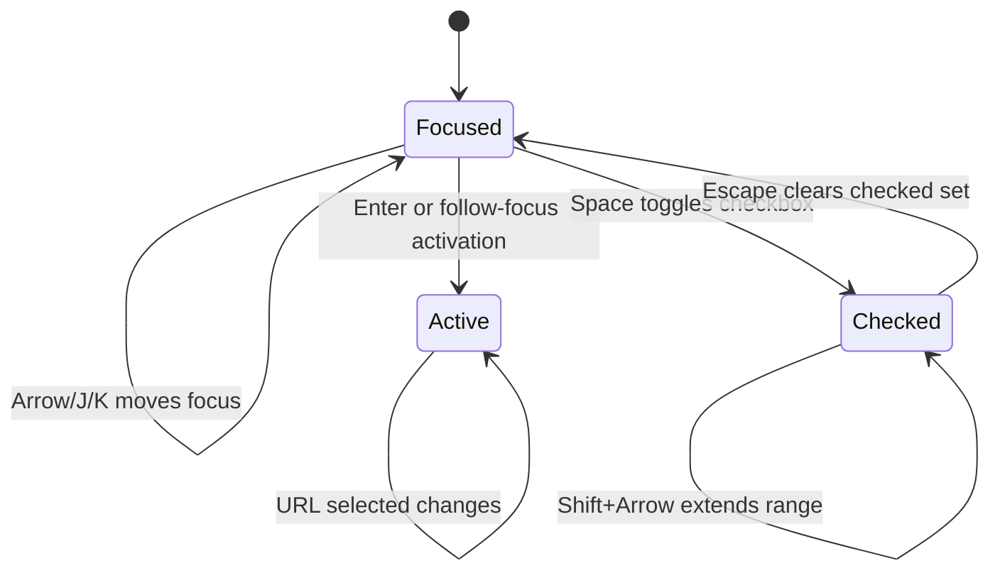

# Keyboard-First Workspace and URL State

The Tracker is designed for repeated high-volume review. Search, sort, filters, pagination, and active row selection are represented in the URL so browser history restores a workspace. Keyboard focus and row activation are coordinated so an operator can inspect and decide without leaving the table. Multi-selection adds checked-row state for bounded bulk actions while preserving the independent active row.

> [!summary]
> - Durable workspace state belongs in the URL when Back/Forward and shareable views matter.
> - Focus, active row, and checked rows are separate interaction concepts.
> - Page shortcuts and component shortcuts require explicit precedence and editable-control suppression.
> - Process-global multi-selection is an implementation defect; ephemeral state must be browser- or session-owned.

## URL as workspace state

A jobs URL can contain:

```text
/pages/jobs?q=golang&page=2&pageSize=20&sort=posted-desc&selected=upwork:...
```

The server uses these parameters to query SQLite and emit only the active page into Widget IR. Browser Back/Forward restores the submitted search, page, page size, sort, filters, and selected item.

This pattern has three benefits:

1. Reload does not erase the operator's place.
2. A filtered view can be copied or bookmarked.
3. Server-side pagination prevents a large database from becoming a large browser payload.

Transient draft text and checked-row selection do not necessarily belong in the URL. The architecture should classify state by durability and sharing needs.

## Three row concepts

### Focused row

The row receiving keyboard events. Arrow keys or `J/K` move focus.

### Active row

The row whose details appear in the inspector. It is usually encoded by `?selected=`.

### Checked rows

The set used for a bulk action. Checkboxes, Space, select-all, and Shift+Arrow change this set without changing the meaning of the active detail row.



The pinned upstream renderer initially disabled active-row behavior when multi-selection was enabled. Upstream commit `7164b02` preserved both state machines. The Upwork commit records the exact npm pin and emits the required Widget specification; the key handling and shortcut suppression implementation belongs to that external renderer dependency, recorded in this document's `external_evidence`. This is a reusable UI lesson: checked selection should not replace inspection selection automatically.

## Server-side collections

The Widget page builder composes:

- field schema;
- SQLite query result;
- URL-backed singular selection;
- submitted search;
- page size and total count;
- sortable columns;
- keyboard mode;
- row commands;
- multi-selection and bulk actions.

The database performs deterministic ordering, count, limit, and offset. Only one page is serialized.

```pseudo
query = parse URL state
result = store.listPage(query)
rows = decorate(result.rows)
collection = data.collection(rows)
collection.search(query.q)
collection.paginate(result.page, result.total)
collection.table(
    rowSelect=navigateWithSelected,
    keyboard=followFocus,
    multiSelect=checkedKeys,
    commands=rowCommands
)
```

## Shortcut ownership

The application has row commands and page-level shortcuts. Table commands take precedence while a row has focus. Page shortcuts are suppressed when:

- focus is inside editable controls;
- a dialog owns focus;
- IME composition is active;
- another keyboard scope is nested;
- a key is held for repeat-sensitive mutation.

This prevents typing `n` into a text field from rejecting a job.

The pinned renderer generates shortcut help from active page bindings and stores the operator's enabled preference in browser local storage. Upwork supplies the page bindings; the persistence and suppression behavior are dependency contracts verified at the recorded renderer commit rather than implemented in this repository.

## Triage as a split workspace

The Triage page combines a keyboard-navigable queue and a selected-job inspector. The same selected identity persists when toggling between split and full-detail views.

This is a strong interaction pattern for review systems:

```text
left: bounded sortable queue
right: detailed evidence and decisions
URL: active identity and query state
keyboard: movement and common decisions
visible controls: discoverable equivalents of shortcuts
```

Keyboard actions invoke the same ActionSpecs as visible buttons. Separate implementations would drift.

## Bounded bulk actions

Bulk shortlist, reject, and archive are limited to at most 100 rows on the visible page. Reject and archive require confirmation. The bound protects accidental whole-database changes and limits request size.

The audited mutation implementation remains weak because it performs per-row updates without revision checks or one transaction. The interaction pattern is good; the domain mutation needs stronger semantics.

## Process-global selection defect

The xgoja site closure stores `selectedJobId` and `selectedJobIds` in process memory. Page renders mutate those arrays. Two browser sessions can therefore influence each other's default selection and checked rows.

Singular selection is mostly protected when the URL supplies `selected`. Multi-selection is not URL-backed or session-scoped.

The correct owner is one of:

- React component state for purely ephemeral checked rows;
- browser session storage if reload persistence is desired;
- a server session keyed to a client identifier if server control is necessary.

A process-global array is not user/session state.

## Sorting contract defect

The Marketplace column advertises sorting, but the store's sort whitelist lacks marketplace sort modes. Activating the header updates URL and indicator while query policy falls back to default ordering.

A sortable column is a cross-layer contract:

```text
column declares sort key
URL accepts key
store validates key
SQL implements deterministic ordering
smoke test proves first/last order
```

Generating sort definitions from one shared descriptor or testing every advertised key can prevent drift.

## When to use this pattern

Use URL-backed workspace state for queryable review tools where users navigate, reload, bookmark, or share views. Use separate active and checked selection when inspection and bulk operation coexist.

Do not put sensitive drafts, large selected sets, or rapidly changing pointer state in URLs.

## Candidate ecosystem rules

- Classify UI state as URL-durable, browser-ephemeral, session, or persisted domain state.
- Keep focus, active inspection, and checked bulk selection separate.
- Component shortcuts take precedence within component scope.
- Suppress application shortcuts in editable and composing contexts.
- Visible controls and keyboard shortcuts dispatch the same action objects.
- Bound bulk operations and confirm destructive intent.
- Never store browser/session state in one process-global variable.
- Test every advertised sort/filter key through the store and rendered UI.

## Related notes

- [[Research/Software Architecture Garden/rag-evaluation-system/03 - React Components Adapters and Rendering]]
- [[Research/Software Architecture Garden/upwork-tracker/04 - Shared Service Across CLI REST and Widget Adapters]]
- [[Research/Software Architecture Garden/upwork-tracker/09 - Synthetic Full Stack Validation and Privacy Gates]]
