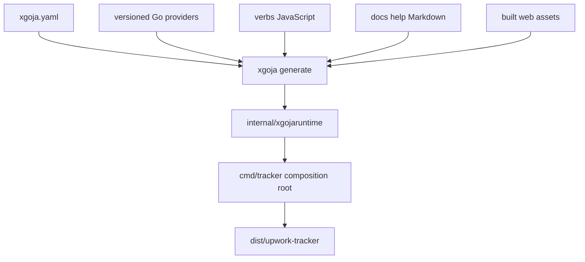

# Generated xgoja Host and Single-Binary Delivery

The Tracker combines native Go commands, Go-backed JavaScript modules, JavaScript application policy, embedded help, a React SPA, and SQLite access in one generated host. `xgoja.yaml` is the declarative assembly plan. `cmd/tracker/main.go` injects application configuration and adds native command trees. Generated source remains an artifact rather than a second design authority.

> [!summary]
> - Generated-host configuration makes runtime capabilities and exact provider versions reviewable.
> - JavaScript is used for application policy and presentation composition; Go owns native operational workflows and process composition.
> - The React application is a thin host over a published Widget runtime and is embedded into the final binary.

## Provider graph

`xgoja.yaml` selects:

- go-go-goja core;
- host filesystem/database capabilities;
- HTTP/Express-like server support;
- `rag-widget-site` and `widget.dsl`;
- a repository-owned runtime identity provider.

It configures runtime aliases:

```text
crypto
express
fs:assets
fs:host
db
db:agent
widget.dsl
runtime.identity
```

It also declares JavaScript verbs, embedded help, web assets, built-in commands, and generated artifacts.



## Composition root responsibilities

`cmd/tracker/main.go`:

1. resolves layered configuration;
2. exports allowlisted runtime identity values;
3. constructs the generated bundle;
4. replaces the embedded database module DSN with the configured database;
5. attaches generated serve/jsverbs commands;
6. adds native command trees for capture, import, ingestion, projection, reconciliation, delivery, audit, and agent operation.

This division is useful. Generated code defines available runtime capabilities. The composition root selects runtime configuration and application-native commands.

## JavaScript application layering

The application source follows a recognizable dependency direction:

```text
store.js
    persistence and low-level domain writes

agent-service.js
    resource contracts, validation, cursors, mutation policy

agent-api.js / agent-cli.js
    REST and CLI adaptation

pages.js
    Widget page composition

upwork.js
    site assembly, routes, and action endpoints
```

This is an emergent application architecture inside a generated host. It should be made more explicit through focused modules and tests, but the direction is sound.

## Thin React host

`web/src/main.tsx` imports `RagEvaluationSiteApp`, mounts it, and loads styles. It does not duplicate application pages or database policy. The published package is pinned exactly in `web/package.json` and lockfile.

```text
server JavaScript emits Widget Page IR
    → embedded SPA fetches page
    → published React package renders it
```

This allows the browser implementation to remain generic while the Tracker owns its domain-specific page definitions.

## Exact version and generation policy

The provider graph pins go-go-goja and Widget DSL versions. The npm renderer is pinned separately. Consumer upgrades must update:

- `go.mod` and `go.sum`;
- `xgoja.yaml` provider version;
- `web/package.json` and `pnpm-lock.yaml`;
- generated runtime package;
- built frontend assets during validation.

The runtime and renderer share a protocol even though Go and npm package managers cannot enforce the relationship.

## Embedded help as product documentation

Help Markdown under `docs/help` is embedded into the binary and exposed through the host. This replaced a stale root playbook. The pattern keeps operational guidance versioned with the executable that implements it.

Embedded help is especially valuable for agent safety because it can describe:

- allowed and forbidden marketplace actions;
- stable agent API usage;
- explicit database-path requirements;
- submission confirmation boundaries;
- schema and developer architecture.

A binary should not depend on a private external repository merely to explain safe operation.

## Runtime identity provider

The repository-owned provider exposes a small allowlisted projection of runtime configuration. This is preferable to dumping arbitrary process environment into JavaScript.

A generic rule emerges:

```text
host environment
    → allowlisted typed provider values
    → application JavaScript
```

Secrets and unrelated environment variables remain inaccessible unless deliberately modeled.

## Build flow

```text
pnpm frozen install
    → TypeScript check and Vite build
    → assets/public
xgoja generate
    → internal/xgojaruntime
Go build
    → dist/upwork-tracker
```

Generated and built artifacts are ignored. CI regenerates and validates them. Source authority remains `xgoja.yaml`, providers, verbs, help, and web source.

## Hot reload

The dev target builds once and starts the generated host with JavaScript watch roots and a health smoke path. This gives JavaScript page/policy work a faster loop without changing production artifact structure.

## What goes wrong

### Generated source is edited directly

The next generation overwrites the change, and configuration no longer explains runtime behavior.

### Provider and npm pins drift

JavaScript emits Widget props unsupported by the embedded renderer.

### Runtime JavaScript becomes a monolith

`store.js`, `pages.js`, and `agent-service.js` contain thousands of lines. Layer names exist, but broad files make policy coupling and test isolation difficult.

### Schema changes occur in JavaScript startup

Generated-host convenience becomes a second migration system and violates Go schema ownership.

### Environment access is broad

A host filesystem or environment provider can accidentally expose private machine state. Capabilities should be allowlisted and documented.

## When to use this pattern

Use a generated host when several Go-backed JavaScript capabilities, embedded source/help/assets, and native commands must ship together reproducibly. A simple Go server with no scripting extension surface does not need xgoja generation.

## Candidate ecosystem rules

- Generated host configuration is the capability authority; generated code is output.
- Composition roots inject application configuration through supported plan hooks.
- JavaScript module layers follow an explicit dependency direction.
- Published renderer and Go producer versions are upgraded and tested together.
- Thin frontend hosts consume reusable packages rather than duplicating domain pages.
- Embedded help ships safety and operational contracts with the binary.
- Runtime identity providers expose allowlisted values, not arbitrary environment state.

## Related notes

- [[Research/Software Architecture Garden/rag-evaluation-system/05 - XGoja Provider and Runtime Packaging]]
- [[Research/Software Architecture Garden/rag-evaluation-system/06 - Frontend Packaging Embedding and Release]]
- [[Research/Software Architecture Garden/upwork-tracker/04 - Shared Service Across CLI REST and Widget Adapters]]
- [[Research/KB/On-Ramp/go-cli-with-embedded-spa]]
