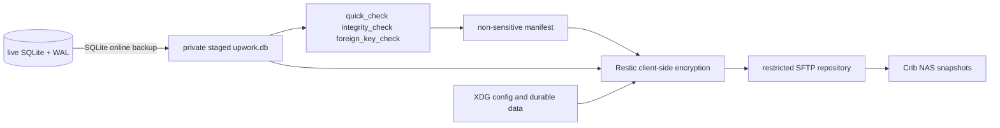

# Source/State Separation, XDG, and WAL-Safe Backup

A private local-first application has two products: replaceable source code and irreplaceable operator state. Upwork Tracker's self-containment design places code, documentation, tests, build metadata, and fictional fixtures in Git while moving databases, captures, proposal material, receipts, reports, logs, and backups into operator-owned XDG directories. Restic protects that state only after SQLite creates a transactionally consistent logical snapshot.

> [!summary]
> - Deleting or recloning the source checkout must not delete or select live operational state.
> - Tests and builds use fictional fixtures and explicit temporary databases.
> - Live SQLite WAL files are excluded from file-level backup; `.backup` produces the supported artifact.
> - The design is partially implemented: backup exists, while product defaults still select `upwork.db` relative to the working directory.

## Source versus operational state

### Git owns

- Go, JavaScript, and React source;
- xgoja configuration;
- embedded help;
- tests and fictional fixtures;
- build and CI metadata;
- architecture and migration documentation.

### The operator owns

- authoritative SQLite database;
- marketplace captures and details;
- proposal drafts and form receipts;
- private facts and evidence;
- generated reports and exports;
- logs and run manifests;
- backup staging and snapshots.

The boundary is a privacy rule, a recovery rule, and a reproducibility rule.

## Target XDG layout

```text
~/.config/upwork-tracker/
    config.yaml

~/.local/share/upwork-tracker/
    upwork.db
    captures/
    proposals/
    evidence/
    exports/

~/.local/state/upwork-tracker/
    run-manifests/
    migration-plans/
    restic-staging/

~/.cache/upwork-tracker/
    regenerable caches

$XDG_RUNTIME_DIR/upwork-tracker/
    locks sockets PIDs
```

Permissions should default to `0700` for private directories and `0600` for private files.

## Replaceable checkout invariant

The design target can be tested directly:

```text
clone repository into a new directory
build and test with no private state present
run help and synthetic smoke successfully
delete clone
confirm live database and captures remain untouched
```

A source checkout is not replaceable if the current working directory selects a live database implicitly.

## Current configuration gap

`internal/trackerconfig/config.go` supports layered system, home, XDG, working-directory, and explicit configuration files. The layering mechanism is useful. Packaged defaults remain non-portable:

- database defaults to `upwork.db`;
- Almanach path is developer-specific;
- Pi extension path is tied to one installed Node version.

The Makefile and several commands also default to repository-relative `upwork.db`.

The target resolver should produce absolute paths from one configuration object. Mutation tools should require explicit database paths or use the same resolved XDG authority. They should not invent local fallbacks independently.

## SQLite WAL consistency

In WAL mode, committed transactions may exist in:

```text
upwork.db-wal
```

before checkpointing into `upwork.db`. Restic reads files independently and does not provide an application-consistent freeze. It may observe the main file and sidecars at different moments.

Therefore these files are not backed up directly:

```text
upwork.db
upwork.db-wal
upwork.db-shm
```

The supported snapshot is:

```bash
sqlite3 "$LIVE_DB" ".backup '$SNAPSHOT_DB'"
```

SQLite's online backup sees one committed logical state, including committed WAL content, and emits one ordinary database file.

## Backup pipeline



The manifest can contain time, snapshot hash, integrity outcome, migration version, and path class. It must not contain proposal bodies, job descriptions, operator facts, secrets, or environment dumps.

## Fail-closed backup algorithm

```pseudo
set umask 077
resolve XDG paths through product resolver
require live database is absolute and outside Git checkout
acquire non-blocking overlap lock
create fresh 0700 staging directory
run SQLite online backup
chmod snapshot 0600
require quick_check == ok
require integrity_check == ok
require foreign_key_check empty
write non-sensitive manifest
run encrypted Restic backup with Tracker and machine tags
remove staging and release lock
```

There is no fallback that copies live database files when `.backup` fails.

## Operational implementation evidence

The source ticket records an implemented MVP:

- private filesystem modes;
- logical SQLite snapshot and validation;
- live DB/WAL/SHM exclusion from general home backup;
- encrypted Restic backup to the existing Crib repository;
- tags identifying Tracker and machine;
- nightly user-systemd timer;
- retry on the next invocation after failure.

The initial supervised snapshot was `a84b98e9`. The repository stores this non-sensitive operational fact, not backup credentials or database contents.

## Restore is a separate operation

A backup snapshot is useful only if it can be restored into an isolated path and validated before promotion.

```pseudo
restore snapshot into new private directory
verify file permissions
run SQLite quick_check and integrity_check
run foreign_key_check
inspect schema migration version
start Tracker against restored copy on isolated port
run read-only smoke
stop restored instance
promote only through explicit operator cutover
```

The MVP intentionally deferred automated restore drills because current use is low. The stronger procedure remains the standard when data value or operational dependence increases.

## Single writable authority

Backup staging and restored databases must never become accidental second authorities. The product should not discover them through directory scans or relative defaults.

At every moment:

```text
one configured SQLite path is writable and live
all snapshots and restores are read-only evidence until explicit promotion
```

## Distribution policy

The repository is private and distributes through private GitHub Releases. Public Homebrew, registries, containers, and credentials are deferred. The absence of a public license is part of distribution architecture, not a release-script omission.

## What goes wrong

### Database path follows CWD

Running from another directory creates or selects another `upwork.db`. The operator can unknowingly split state.

### Restic reads live SQLite files

The snapshot can contain an inconsistent main/WAL/SHM combination.

### Backup staging is left discoverable

The application may open a staged copy and create a second writable authority.

### Secrets are included in manifests or Git

Recovery metadata becomes another disclosure path.

### Source-only policy is documented but not checked

Captures, receipts, databases, and generated artifacts can enter commits without repository gates.

## Candidate ecosystem rules

- A replaceable checkout never owns live operator state.
- Resolve XDG and explicit paths once at the composition root.
- Mutation commands never create/select databases through CWD ambiguity.
- Back up WAL databases through application-aware snapshot APIs.
- Validate staged snapshots before encryption and upload.
- Keep backup credentials outside both source and protected data.
- Maintain one writable authority and promote restores explicitly.
- Distribution destinations and license state are deliberate policy.

## Related notes

- [[Projects/2026/07/26/PROJECT REPORT - Upwork Tracker Self-Containment - XDG State and WAL-Safe Restic Backups]]
- [[Research/playbooks/infra/PLAYBOOK - Restic Backups to the Crib NAS]]
- [[Research/Software Architecture Garden/upwork-tracker/03 - SQLite Evidence and Workflow Ledger]]
- [[Research/KB/On-Ramp/go-cli-with-embedded-spa]]
