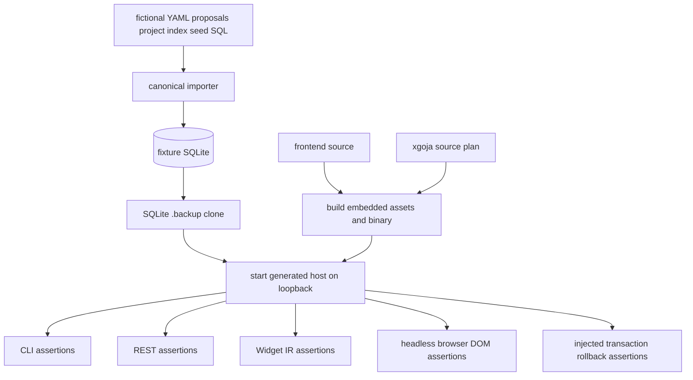

# Synthetic Full-Stack Validation and Privacy Gates

The Tracker cannot safely test against the operator's live database or real proposals. Its validation architecture creates fictional inputs, imports them into a temporary SQLite database, clones that database with SQLite `.backup`, builds the generated host and frontend, exercises CLI and REST mutations, inspects Widget IR, and renders browser DOM. CI runs the same source-owned path.

> [!summary]
> - Synthetic fixtures make private local-first workflows testable in CI and by contributors.
> - The smoke suite validates cross-language integration that unit tests cannot cover.
> - Broad shell coverage should be split into focused suites without losing one end-to-end path.
> - Repository privacy requires both fixture discipline and automated scanning.

## Why synthetic fixtures are architectural

A private-data application needs reproducible tests that contain no operator facts. The fixture must still exercise realistic relationships:

- several jobs and marketplaces;
- application forms and guidance;
- proposal versions and comments;
- hourly and fixed-milestone receipts;
- application lifecycle transitions;
- tags, search, pagination, and evidence completeness;
- private-data redaction and opt-in;
- CAS conflicts and idempotent replay.

Wholly fictional fixtures allow public CI infrastructure to test private-domain logic without carrying private data.

## Full smoke flow



The target refuses to run if its dedicated port is already in use, avoiding tests against an unrelated process.

## SQLite-safe fixture cloning

The suite uses:

```bash
sqlite3 "$FIXTURE_DB" ".backup '$WORK_DB'"
```

rather than copying database and WAL files. This is the same consistency pattern as production backup, applied to tests.

## What the smoke suite proves

The Makefile suite checks, among other behaviors:

- ingestion plan fingerprints and projection rebuild;
- FTS search across marketplace identity;
- exact fixture receipt shape and milestone totals;
- explicit CLI database-path requirement;
- API capabilities and OpenAPI;
- opaque cursor pagination;
- private proposal redaction and opt-in;
- proposal version history;
- ambiguous receipt binding rejection;
- lifecycle planning and invalid transitions;
- CAS conflict and idempotent replay;
- stale-archive preview/execute confirmation;
- REST and CLI workflow parity;
- Widget page components and actions;
- DataTable multi-selection and rendered checkboxes;
- human submission confirmation rollback at injected transaction stages;
- server restart persistence;
- browser shell rendering.

This is valuable because the product crosses Go, JavaScript, SQL, JSON, HTTP, React, browser behavior, and generated assets.

## CI composition

The primary push workflow runs:

```text
make test
make generate
make build-web
make doctor
make list-modules
make serve-smoke
```

Separate workflows run pinned golangci-lint, dependency scanning, CodeQL, and TruffleHog secret scanning.

The pipeline installs only required smoke tools such as `jq` and `sqlite3`; the frontend uses frozen pnpm lockfiles.

## Privacy gates

Repository policy forbids:

- operational databases and WAL sidecars;
- live captures and details;
- proposal bodies and receipts;
- screenshots and PDFs;
- private project indexes;
- generated assets and runtime work directories.

`.gitignore` covers common forms. Secret scanning detects credential patterns. These are necessary but not sufficient: a proposal body may be private without looking like a secret.

A stronger privacy gate should inspect staged/tracked paths and known structured formats:

```pseudo
for each tracked file:
    reject database signatures and DB sidecars
    reject known live capture directory patterns
    reject non-fixture proposal/receipt paths
    reject generated asset/work directories
    require testdata records declare fictional fixture schema
```

Human review remains necessary for prose and renamed files.

## Test layering

The broad smoke should not be the only JavaScript test. A balanced suite has:

### Go unit and integration tests

Capture validation, ingestion plans, migrations, projection ownership, reconciliation, and command configuration.

### JavaScript domain tests

Store transactions, service validation, transition policy, cursor semantics, idempotency, serializers, and page query policy against temporary in-memory/file databases.

### Adapter contract tests

REST and CLI parity, Widget action context, error mapping, and private opt-in.

### Widget IR tests

Page structure, sort keys, action definitions, selection semantics, and URL preservation.

### Browser tests

Keyboard focus, dialog restoration, selection, shortcut suppression, and critical visible flows.

### One complete end-to-end smoke

Build and execute the final binary with fictional data.

## Monolithic smoke debt

The Makefile recipe is large and linear. A failure can be hard to localize. Repeated process setup and shell quoting increase maintenance cost.

A reusable harness could create one fixture environment and expose focused suites:

```text
smoke-fixture
smoke-cli
smoke-rest
smoke-widget-ir
smoke-browser
smoke-submission-transaction
smoke-all
```

The final `smoke-all` remains important because interactions between generated host, embedded assets, and database startup are part of the product.

## Failure injection as architecture evidence

The confirmation transaction supports injected failure after submission, event, application, activity, and idempotency stages. Each test asserts no partial row, event, revision, or replay record survives.

This is stronger than a success-only test. It proves transaction boundaries by attempting to break them.

General mutation paths need similar transaction-focused tests once made atomic.

## What goes wrong

### Tests accidentally discover live state

A default `upwork.db` in CWD can make tests target or create unintended files. Smoke uses explicit temporary paths; all mutation tests should do the same.

### Fictional fixtures omit historical complexity

Identity migrations passed sparse fixtures but can fail when proposal-history child tables are populated. Fixtures must grow to reflect schema graphs, not private content.

### Smoke is broad but domain defects remain untested

The suite rejects direct drafting-to-submitted transitions, but it does not test the service-level `ready → submitted` bypass. Its dedicated-confirmation tests prove rollback and success, but do not reject non-ready state, a receipt bound to an obsolete proposal version, missing/mismatched receipt terms, invalid totals, or repeated confirmation under a new key. Test selection must follow safety invariants, not only common UI paths.

### Generated artifacts contaminate Git

Build outputs are required for validation but must remain ignored and unstaged.

## Candidate ecosystem rules

- Private-domain repositories ship wholly fictional relational fixtures.
- Tests require explicit temporary databases and never discover live state.
- Clone WAL databases with SQLite backup APIs.
- Keep one full generated-binary smoke and several focused suites.
- Test failure rollback at every stage of high-consequence transactions.
- Privacy gates inspect artifact classes, not only secrets.
- Migration fixtures populate every relevant foreign-key child.
- CI validates source plans, generated hosts, frontend assets, APIs, Widget IR, and browser output.

## Related notes

- [[Research/Software Architecture Garden/upwork-tracker/03 - SQLite Evidence and Workflow Ledger]]
- [[Research/Software Architecture Garden/upwork-tracker/05 - Proposal Lifecycle and Human Submission Boundary]]
- [[Research/Software Architecture Garden/upwork-tracker/08 - Source State Separation XDG and WAL Safe Backup]]
- [[Research/Software Architecture Garden/rag-evaluation-system/07 - Storybook Tests and Golden Contracts]]
