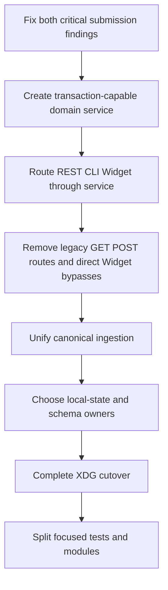

# Architecture Debt and Patterns Not to Repeat

The Tracker's desired boundaries are clearer than several runtime paths at the audited commit. This document records failures and competing authorities that should be removed rather than generalized. The most important issue is a safety invariant enforced in the Widget adapter but bypassable through the shared service.

> [!danger] Critical audited findings
> At commit `460b005`, the generic application transition path can record `ready → submitted` without the dedicated confirmation transaction. The dedicated transaction itself does not require ready state, current-proposal receipt binding, or receipt-associated terms. Future readers must verify both findings before relying on the advertised submission boundary.

## Canonical finding register

Other Garden documents summarize these findings and link here. This register owns the audited IDs.

| ID | Severity | Finding |
|---|---|---|
| `UT-P0-001` | Critical | Generic application transition can record `submitted` without confirmation evidence. |
| `UT-P0-002` | Critical | Dedicated confirmation transaction has incomplete eligibility and terms validation. |
| `UT-P1-001` | High | General mutation and durable idempotency are not one transaction. |
| `UT-P1-002` | High | Widget bulk mutation bypasses CAS, idempotency, and all-or-nothing transition policy. |
| `UT-P1-003` | High | Legacy GET exposes store-shaped serialization and legacy POST mutates without CAS/idempotency. |
| `UT-P1-004` | High | One canonical envelope has incompatible ingest and direct-import semantics. |
| `UT-P1-005` | High | Global content uniqueness erases later unchanged observation occurrences. |
| `UT-P1-006` | High | `job_local_state` is a stale shadow rather than the actual local-state owner. |
| `UT-P1-007` | High | Go migrations and JavaScript startup DDL duplicate schema ownership. |
| `UT-P1-008` | High | Identity migration omits proposal-history foreign-key children. |
| `UT-P1-009` | Medium | Apply revalidates with a weaker predicate instead of using the reviewed write set. |
| `UT-P1-010` | High | Draft-receipt import prechecks revision but does not atomically claim or increment it. |
| `UT-P1-011` | High | Default authenticated Upwork capture requests an envelope unable to carry the required assertion. |
| `UT-P2-001` | Medium | Whole-record projection conflates field completeness and freshness. |
| `UT-P2-002` | Medium | Reconciliation hashes the live SQLite main file without WAL state. |
| `UT-P2-003` | Medium | Browser selection is process-global rather than client/session-owned. |
| `UT-P2-004` | Medium | Marketplace sorting is advertised but not implemented by store policy. |
| `UT-P2-005` | Medium | XDG source/state target is not enforced by current defaults. |

## UT-P0-001 — safety policy lives in an adapter

The Widget action handler rejects `submitted` and directs the operator to explicit confirmation. The lifecycle graph itself permits `ready → submitted`. The shared service calls a generic status writer that can set submission timestamps and job status without a verified receipt or `application_submissions` row.

### Why this is architecture debt

The user-facing adapter has a stricter policy than the domain service. Another adapter can bypass it without violating types or the transition graph.

### Required correction

```text
ordinary transition service:
    rejects target submitted universally

dedicated confirm-submitted service:
    validates verified receipt and current proposal
    records submission transaction atomically
```

Safety invariants belong at the deepest shared layer.

## UT-P0-002 — dedicated confirmation validation is incomplete

`confirmSubmitted` has a strong atomic write boundary but insufficient eligibility checks. It accepts a verified receipt bound to any proposal version, computes a path to `ready` instead of requiring current ready state, loads terms by job rather than selected receipt, and permits null Connects totals. Workspace readiness computes several missing blockers for display but is not invoked by the transaction.

The corrected command must require ready state, bind the selected receipt to the current proposal version, require `application_terms.source_receipt_id` to match, validate contract and Connects totals, and define repeat-confirmation behavior inside the transaction.

## UT-P1-001 — general mutation idempotency is not atomic

The service executes a store mutation and then records the idempotency response. Activity/audit writes can also occur separately.

A crash can produce:

```text
domain state changed
idempotency response missing
client retries
operation executes again or conflicts unpredictably
```

The dedicated submission transaction already demonstrates the correct grouping. General mutations should use the same transaction pattern.

## UT-P1-002 — Widget bulk mutation bypasses CAS and transition policy

Bulk shortlist/reject/archive validates IDs and bounds the count, then updates rows sequentially. It lacks:

- expected revisions;
- idempotency;
- one transaction;
- allowed-source-state policy;
- all-or-nothing rollback.

It can overwrite a concurrently changed or terminal job. The stable agent API defers general batch mutation for exactly these reasons.

A convenient human UI does not justify a weaker domain contract.

## UT-P1-003 — undocumented legacy read and mutation routes remain

GET `/api/jobs/:id` exposes store-shaped data outside `/api/v1` and `/api/widget`. POST on the same path calls `store.update(...)` directly without expected revision or idempotency enforcement. Together they weaken resource serialization and provide a high-severity mutation bypass outside the stable service.

Once a stable resource API exists, both legacy routes need consumer inventory and removal. Until removal, POST must use the same transaction and mutation policy as `/api/v1`.

## UT-P1-004 — one envelope has two ingestion meanings

Canonical ingestion writes capture runs and immutable observations. The import path detects the same envelope format and directly upserts mutable jobs/legacy observations. Capture time handling also differs.

The same file should not mean “append evidence” in one command and “mutate current projection” in another. Legacy formats may be translated into the canonical ingestion plan, but the write semantics remain singular.

## UT-P1-005 — global content uniqueness erases later observations

A global unique fingerprint treats unchanged content as the same occurrence. A listing observed unchanged next week is still new recency evidence.

Do not use content identity as occurrence identity:

```text
unique occurrence = capture run + canonical remote identity
content hash = comparison/index metadata
```

## UT-P1-006 — local state has two apparent owners

`job_local_state` is seeded and read for projection search notes. Normal mutations continue writing local columns on `jobs`. The mirror becomes stale.

An ownership table that no writer maintains is worse than no ownership table because documentation and runtime disagree.

## UT-P1-007 — schema ownership is duplicated

Go importer migrations and JavaScript store startup both perform DDL and backfill. Their table definitions can differ. Startup order changes database shape.

One schema owner should create and migrate. Runtime stores verify version and fail with an actionable migration error.

## UT-P1-008 — identity migration uses an incomplete child list

The prefix migration rewrites a hard-coded set of foreign-key child tables and omits proposal history tables. Sparse migration fixtures do not reveal the defect.

Migration logic should derive or exhaustively test the complete foreign-key graph.

## UT-P1-009 — validation and apply disagree

Planning validates duplicate IDs and compensation kinds. Apply re-evaluates records with a weaker predicate instead of applying the exact accepted record set from the reviewed plan.

A reviewed plan must be the authoritative write set. Apply should not reinterpret input with different rules.

## UT-P1-010 — draft-receipt import does not claim revision atomically

The stable service pre-reads `expectedVersion`, then calls a receipt import transaction that neither claims nor increments the job revision. A concurrent proposal edit can race the proposal-version hash lookup and receipt binding. The revision claim, version lookup, receipt insert, terms update, milestones, audit, and idempotent response need one transaction.

## UT-P1-011 — authenticated capture defaults conflict with the envelope

The Upwork search command defaults to requiring authenticated capture validation while requesting `marketplace-capture/v1`. That envelope cannot carry the required authentication assertion and is rejected when authentication is required. Operators must currently pass an explicit downgrade or use another capture shape, so the documented default boundary is not operationally satisfiable.

A capture format and its default validation policy must agree. Either the envelope carries verifiable authentication evidence or the command must label the capture honestly as public evidence without pretending the stronger assertion exists.

## UT-P2-001 — projection chooses one winner for all fields

An old detailed capture can outrank a newer sparse capture and project every field from the old record. Description completeness and compensation freshness are not the same dimension.

Where capture types differ systematically, field-group provenance is safer than whole-record winner selection.

## UT-P2-002 — reconciliation hashes the live main SQLite file

Reading `upwork.db` bytes ignores committed WAL state. Drift detection can compare incomplete snapshots.

Use a SQLite read transaction, logical digest, or `.backup` snapshot.

## UT-P2-003 — browser selection is process-global

The server closure stores selected IDs for all clients. Two browser sessions can influence each other. URL selection mitigates some singular state; multi-selection remains shared.

Ephemeral browser state belongs to the browser or a real session, not a process singleton.

## UT-P2-004 — UI advertises unsupported sorting

The Marketplace column emits sort keys absent from the store whitelist. URL and indicator change while SQL falls back.

Every advertised filter and sort option needs an end-to-end contract test.

## UT-P2-005 — source/state separation is only partially implemented

The design, file permissions, and backup move toward XDG custody. Product defaults still use CWD-relative `upwork.db` and developer-specific executable paths.

A target architecture is not complete until every command resolves paths through it and neutral-CWD tests pass.

## Additional deployment risk — trusted-local routes are public-local

Private data and mutations are reachable through routes marked public in the host. This is coherent on enforced loopback. It becomes a security defect if binding expands without authentication and authorization.

Deployment assumptions must be machine-enforced.

## Additional maintainability debt — large JavaScript modules concentrate policy

`store.js`, `pages.js`, and `agent-service.js` total thousands of lines. Layering exists, but transaction policy, schema compatibility, resource serialization, UI composition, and workflow rules remain broad.

Split by stable responsibility only after central invariants are fixed. File splitting alone does not repair dual authority.

## Debt-removal order



Correctness precedes cosmetic modularization.

## Rules not to repeat

- Do not enforce high-consequence policy only in a UI or transport adapter.
- Do not promise durable idempotency outside the domain transaction.
- Do not give human bulk actions weaker concurrency semantics than agent mutations.
- Do not support two write meanings for one evidence format.
- Do not confuse content hash with observation occurrence.
- Do not declare a new owner while old writers remain active.
- Do not let runtime startup become a second migration system.
- Do not checksum live SQLite main files in WAL mode.
- Do not store client/session state in process-global variables.
- Do not describe trusted-local deployment without enforcing loopback.

## Related notes

- [[Research/Software Architecture Garden/upwork-tracker/02 - Capture Ingestion Projection and Local State]]
- [[Research/Software Architecture Garden/upwork-tracker/04 - Shared Service Across CLI REST and Widget Adapters]]
- [[Research/Software Architecture Garden/upwork-tracker/05 - Proposal Lifecycle and Human Submission Boundary]]
- [[Research/Software Architecture Garden/upwork-tracker/11 - Candidate Ecosystem Guidelines]]
