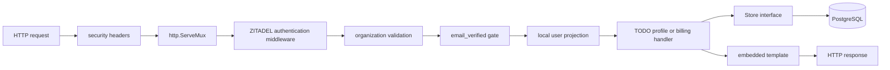

# Project Architecture Overview

The simplest accurate model of `zitadel-go-test` is a server-rendered Go process surrounded by systems that retain authority over identity, payment, secrets, and deployment. The process is intentionally not an identity provider, payment ledger, secret manager, or orchestrator. Its job is to validate the facts those systems provide and turn them into TODO application behavior.

> [!summary]
> - The executable is a composition root: configuration, PostgreSQL, OIDC, handlers, and process lifecycle meet in `cmd/todo-demo/serve.go`.
> - Domain HTTP behavior lives in `internal/app`, persistence in `internal/store/postgres`, and rendering in `internal/web`.
> - The deployed architecture is larger than the Go package graph; GitOps and identity boundaries are part of correctness.

## The application boundary

A request reaches a single Go binary. The binary uses the standard library router, embedded templates, PostgreSQL, and hosted ZITADEL Login V2. This shape keeps request control explicit.



The ordering is architectural. Tenant validation before local projection prevents a valid user from the wrong organization from creating local state. Email verification before domain access prevents an unverified address from entering flows that assume recoverable identity. CSRF validation wraps mutation after authentication, not public GET routes.

## Package responsibilities

| Area | Responsibility | Evidence |
|---|---|---|
| `cmd/todo-demo` | CLI schema, configuration validation, dependency construction, OIDC initialization, routing, shutdown | `main.go`, `serve.go`, `healthcheck.go` |
| `internal/app` | HTTP use cases, CSRF, profile, TODO, billing orchestration | `app.go`, `todos.go`, `profile.go`, `billing.go` |
| `internal/store` | Domain models and persistence contract | `store.go`, `models.go` |
| `internal/store/postgres` | SQL implementation, migrations, webhook ownership and billing projection | `store.go`, `todos.go`, `billing.go`, `migrations/` |
| `internal/billing` | Stripe adapter and webhook verification | `stripe.go` |
| `internal/web` | Embedded templates and static assets | `templates.go`, `templates/`, `static/` |

The package graph is not a formal hexagonal architecture, but it has a useful direction. HTTP use cases depend on a `Store` contract. PostgreSQL implements it. Stripe operations sit behind a billing service. Templates do not perform database work. The composition root chooses concrete implementations.

## Startup as an ordered proof

The `serve` command validates configuration before opening network listeners. It then opens PostgreSQL, applies migrations, initializes billing, constructs application handlers, discovers the OIDC provider, and finally starts the HTTP server.

```pseudo
settings = parseGlazedCommand()
validateRequiredSettings(settings)

db = postgres.Open(settings.databaseURL)
db.Migrate()

billing = stripe.New(settings.stripeConfiguration)
application = app.New(db, billing, templates)
authenticator = zitadel.NewOIDC(settings)
router = composeRoutes(application, authenticator)

listenUntilSignal(router)
shutdownWithDeadline()
```

This sequence prevents partial startup. An application with an unreachable database or invalid OIDC discovery document never reports itself as ready merely because a socket opened.

## Two kinds of state

The system separates authoritative state by owner.

| State | Authority |
|---|---|
| Passwords, factors, recovery, verification | ZITADEL |
| TODOs, local profile, quotas, Stripe projection | TODO PostgreSQL database |
| Subscription and invoice lifecycle | Stripe, projected from signed webhooks |
| Runtime credentials | Vault |
| Desired deployment | Git and Argo CD |
| TLS certificate | cert-manager and ACME issuer |

This table explains why “put everything in the application database” would be a regression. Each external system has stronger semantics for its domain. The TODO service stores only what it must query and enforce locally.

## Deployment topology

The production topology repeats a conventional path used by several go-go-golems services:

```text
source commit
  → reusable GitHub Actions image workflow
  → private GHCR image
  → immutable sha256 digest in Git
  → Argo CD Application
  → Kustomize resources
  → VSO materialized Secrets
  → Deployment and bootstrap hook
  → Traefik Ingress plus cert-manager Certificate
```

Readiness is native. The binary exposes health endpoints and ships a `healthcheck` subcommand, so distroless runtime images do not need `curl`, a shell, or a package manager.

## Why this shape works

The architecture keeps the business process in one executable while moving specialized authority outward. That makes the code easy to trace without making security depend on local inventions. The application can be small because it integrates mature systems through narrow contracts.

The cost is operational breadth. A change to tenant identity may require Terraform, Vault, GitOps, database, browser, and application evidence. The Garden treats that breadth as part of the architecture rather than pretending the repository alone is the system.

## Reuse guidance

Reuse this shape when a product has modest interactive complexity, benefits from server-rendered pages, and can delegate authentication to OIDC. Do not copy it when the frontend requires independent deployment, offline behavior, or a large client-side state machine. Do not copy the current stateless OIDC cookie choice; it is recorded as debt in [[Research/Software Architecture Garden/zitadel-go-test/08 - Architecture Debt and Patterns Not to Repeat]].
