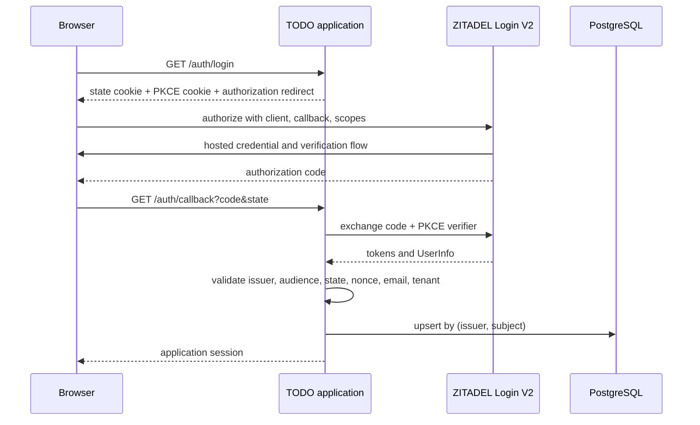

# External Identity and Local Projection

An OIDC application receives identity from an issuer, but it still needs a local user row to own TODOs, preferences, billing state, and quotas. The critical design question is not whether to create that row. It is which external fact should identify it.

`zitadel-go-test` uses the pair `(issuer, subject)`. Email remains a mutable attribute. This distinction is the foundation for every identity-related pattern in the project.

> [!summary]
> - A subject is unique only within its issuer, so the stable key is `(issuer, subject)`.
> - Email is verified profile data, not a primary identity key.
> - Tenant authorization is an additional validated claim, not a replacement for the stable human key.

## Why email is not identity

Email appears convenient because humans recognize it and OIDC exposes it. It fails as a durable key for three reasons:

1. A person may change their address.
2. An address may be recycled to another person.
3. Two identity providers may assert the same textual address under different trust and verification policies.

The database therefore stores external identity separately from profile fields. Conceptually:

```sql
UNIQUE (issuer, subject)
```

The local projection algorithm is idempotent:

```pseudo
function projectIdentity(claims):
    require claims.email_verified == true
    require allowedTenant(claims.resource_owner_id)

    identity = (claims.issuer, claims.subject)
    user = upsert user by identity
    update mutable email and display name
    return user
```

A repeated login finds the same row. A changed email updates profile state without moving ownership of existing TODOs.

## The OIDC flow and its invariants

The application uses authorization code flow with PKCE, state, and nonce validation. Hosted ZITADEL Login V2 owns credential collection.



Each check answers a different question:

| Check | Question |
|---|---|
| Issuer | Which authority asserted this identity? |
| Audience/client | Was the token intended for this application? |
| State | Is this callback paired with the browser flow we started? |
| Nonce | Is the ID token paired with this authorization request? |
| PKCE | Can an intercepted code be redeemed by another process? |
| `email_verified` | Has the issuer verified control of the address? |
| Resource-owner organization | Is this identity authorized for this tenant deployment? |

Removing one check does not make another check stronger. A valid audience does not prove the correct browser initiated the flow. A verified email does not prove tenant membership.

## Tenant context as a separate dimension

For Alpha and Beta, the application requests a reserved scope:

```text
urn:zitadel:iam:org:id:<expected-organization-id>
```

It then validates the trusted UserInfo claim:

```text
urn:zitadel:iam:user:resourceowner:id
```

The callback validates this claim before `UpsertUser`. Authenticated middleware validates it again before serving protected routes. The first check prevents unauthorized local state creation. The second ensures every protected request continues to enforce the configured boundary.

```go
func validateZitadelOrganization(claims map[string]any, expected string) error
```

The helper has an explicit disabled mode for the original non-tenant deployment. Tests cover disabled, matching, missing, malformed, and mismatched claims. This makes the compatibility boundary visible rather than silently guessing tenant behavior.

## Identity projection is not authorization

The pair `(issuer, subject)` tells us which person this is within the trust domain. It does not tell us which tenant, project, or product the person may use. This leads to a useful ecosystem rule:

```text
identity key answers “who?”
trusted tenant claim answers “where?”
product roles answer “what may they do?”
```

Collapsing these questions into email domains or client IDs creates brittle authorization. The project keeps them separate even though the toy application has few product roles.

## Failure found during acceptance

Tenant test users authenticated successfully in ZITADEL only after receiving a project assignment because the tenant projects enable project checks. That behavior was not visible from application unit tests. It emerged from a real hosted-login flow and ZITADEL logged `Errors.User.GrantRequired`.

After the assignment, ZITADEL completed the callback, but the application's stateless encrypted session cookie exceeded browser limits. The identity validation itself worked; the chosen session representation did not. This distinction matters. A good identity contract can be undermined by an operationally invalid transport.

## Reuse guidance

Use this pattern for any application that delegates authentication to OIDC while retaining application-owned data. Require a compound external key, explicit verified-email policy, and separate authorization context. Compare this implementation with other ecosystem OIDC applications before promoting the exact middleware API, but promote the identity invariant now: **email must not own domain data**.
