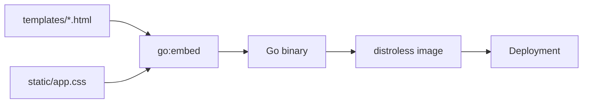

# Standard-Library HTTP Composition

The application does not need a web framework to express its request pipeline. Go's method-aware `http.ServeMux`, typed closures, and small middleware functions are sufficient because the application has a limited number of routes and one rendering model.

> [!summary]
> - Middleware enriches the handler contract: protected handlers receive a verified local user rather than rediscovering identity.
> - CSRF wraps mutations after authentication; security headers wrap the complete router.
> - Embedded templates and assets make the HTTP binary the complete presentation artifact.

## Handler contracts become stronger inward

A raw `http.Handler` receives only a request and response writer. The application builds stronger internal contracts through closure composition:

```go
func(next func(http.ResponseWriter, *http.Request, store.User)) http.Handler
```

The resulting path is:

```pseudo
authenticated(next):
    require OIDC session
    require expected organization claim
    require verified email
    user = upsert external identity
    next(response, request, user)

csrfProtected(next):
    authenticated(function(response, request, user):
        require valid CSRF token
        next(response, request, user)
    )
```

A TODO mutation handler does not need to know how ZITADEL sessions work. It receives the local owner required by its domain operation. This is dependency reduction achieved with ordinary functions rather than a framework container.

## Route declarations expose policy

Method-aware route declarations make the security surface readable:

```text
GET  /todos              authenticated
POST /todos              authenticated + CSRF
POST /todos/{id}/toggle  authenticated + CSRF
POST /todos/{id}/delete  authenticated + CSRF
GET  /profile            authenticated
POST /profile            authenticated + CSRF
POST /webhooks/stripe    Stripe signature verification, not browser session
GET  /healthz            public
GET  /readyz             public with dependency check
```

The webhook is deliberately not behind browser authentication or CSRF. Its caller is Stripe, and its trust proof is a valid signature over the unmodified request body. Applying browser middleware would not improve webhook security; it would make legitimate delivery impossible.

## Ownership remains in SQL

Authentication does not replace data ownership predicates. Handlers pass the local user ID into store operations, and SQL constrains updates or deletes by both object and owner. The system does not load a TODO by ID and then rely on a separate in-memory ownership check.

```sql
DELETE FROM todos
WHERE id = $1 AND user_id = $2
```

This pattern reduces the distance between authorization and mutation. A missed condition produces no affected row rather than exposing another user's object.

## Embedded presentation

`internal/web/templates.go` embeds HTML templates and static assets into the binary. This creates one versioned artifact for handlers, layouts, CSS, and executable code.



This pattern works because the UI is server-rendered. There is no independent frontend build graph, package manager, or runtime API version to coordinate. The cost is that visual changes require a new image, which is acceptable for this service.

## Security headers at the outer boundary

`application.WithSecurity(router)` wraps the router rather than selected pages. This placement protects landing pages, authenticated pages, error responses, and static assets consistently. CSP and related headers are therefore defaults, not conventions every handler must remember.

CSRF uses an independent key rather than reusing the OIDC/session encryption key. Separate keys prevent an implementation change in one protocol from silently affecting another and permit independent rotation.

## Process lifecycle

The server configures finite header, read, write, and idle timeouts. Shutdown begins from a signal-aware context and receives its own deadline. This is a small but important production pattern: server lifecycle is code, not a property inferred from Kubernetes termination alone.

The dedicated healthcheck command allows a distroless image to perform native probes without shipping a shell or HTTP client. It keeps the runtime image smaller and avoids turning debugging utilities into production attack surface.

## Limits of the pattern

`serve.go` is a composition root, but it also carries configuration validation, OIDC construction, middleware definitions, routes, and server lifecycle. That concentration remains manageable at the current size. If route families or authentication modes multiply, the correct next move is to extract coherent constructors—not to introduce a framework preemptively.

The current session strategy is not a solid part of this pattern. Full OIDC contexts stored in encrypted cookies exceed practical cookie size. The handler composition can remain unchanged while the session store moves to PostgreSQL, which is evidence that the middleware boundary is useful.

## Reuse guidance

Use this approach for compact Go applications with one process, one rendering model, and a modest route graph. Require explicit method patterns, typed inner-handler contracts, SQL ownership predicates, independent CSRF keys, outer security headers, and finite server timeouts. Move to a larger routing abstraction only when concrete route composition pressure appears.
