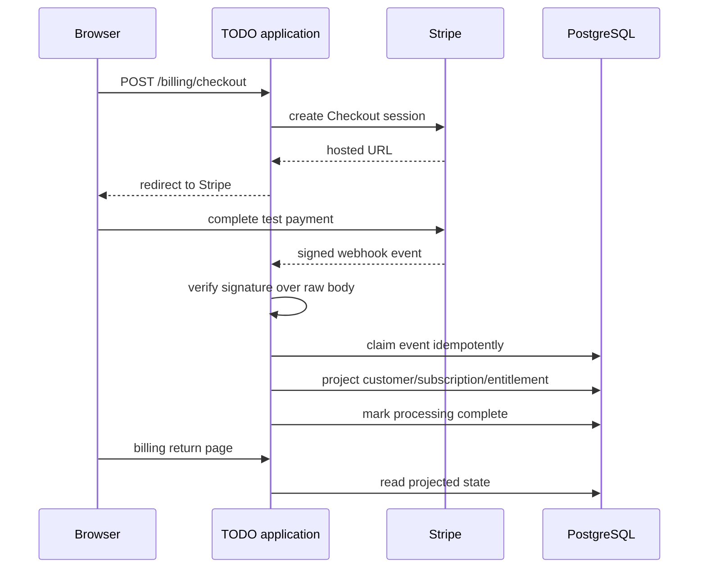

# PostgreSQL State and Webhook Projection

PostgreSQL stores application truth: local identity projections, TODO ownership, profile data, quota state, and the locally enforceable view of a Stripe subscription. Stripe remains authoritative for payment lifecycle. The application reconciles those two facts through a signed, idempotent webhook inbox.

> [!summary]
> - Embedded ordered migrations make schema evolution part of binary startup.
> - SQL predicates enforce ownership and atomic quota limits close to mutation.
> - Stripe webhook IDs become idempotency keys; processing ownership prevents concurrent duplicate projection.

## Migrations are executable history

Migration files are embedded and loaded in lexical order. `Migrate` uses a transaction-scoped advisory lock and records checksums. This creates three useful guarantees:

1. Two starting replicas cannot apply the same migration concurrently.
2. A previously applied file cannot change silently without a checksum mismatch.
3. The binary contains the exact schema history it expects.

```pseudo
begin transaction
acquire advisory transaction lock
ensure schema_migrations table

for migration in lexicalOrder(embeddedFiles):
    if applied:
        require storedChecksum == currentChecksum
    else:
        execute migration
        record name and checksum

commit
```

This is appropriate for a small service with one schema owner. A larger fleet may separate migration execution from application startup, but it should preserve locking, checksums, and immutable migration history.

## Domain ownership in the query

TODO operations constrain every read and mutation by local user ownership. This pattern is more robust than fetching by object ID and checking ownership in application code because the database performs selection and authorization as one operation.

Quota enforcement also belongs near mutation. The application cannot safely perform “count, compare, insert” as independent statements under concurrency. A correct implementation makes the limit decision and insertion atomic through a transaction or a guarded SQL operation.

```pseudo
begin
current = count todos for user under lock/transaction rule
if current >= effective_limit:
    rollback with quota error
insert todo owned by user
commit
```

The effective limit comes from a local subscription projection. The TODO path does not call Stripe synchronously. Payment-system latency therefore does not sit inside ordinary domain requests.

## Why the browser return is not billing truth

Checkout redirects the browser back to the application, but that return proves only that a browser visited a URL. It does not prove that the subscription is active, paid, uncanceled, or associated with the expected customer. Signed Stripe webhooks carry the authoritative lifecycle events.



## The webhook inbox

The Stripe event ID is stable. The database records it before projection and tracks processing status. A worker request must claim ownership so two deliveries cannot both apply the same state transition.

The implementation distinguishes these outcomes:

- **new event:** insert and process;
- **already completed:** acknowledge without reapplying;
- **currently claimed:** avoid concurrent processing;
- **failed but retryable:** reclaim according to the processing contract;
- **terminal malformed event:** retain evidence without corrupting domain state.

Migration `004_reclaim_legacy_stripe_events.sql` is instructive because it repairs old event rows into the newer processing contract. Architecture evolves through data as well as code.

## Subscription state is a projection

The local row answers application questions: plan, quota, status, cancellation timing, and current entitlement. Stripe owns the original event stream. Projection means the local representation may lag briefly and must be updated idempotently.

The production sandbox acceptance demonstrated several semantics worth preserving:

- Checkout selected the expected product and price.
- Automatic Tax completed.
- Signed events produced the Pro quota projection.
- Period-end cancellation retained current entitlement.
- Terminal cancellation projected the Free quota.
- Existing TODO data survived downgrade; only future creation was limited.

The last rule separates storage ownership from entitlement. A quota controls new work. It does not silently delete user data.

## Tenant experiment boundary

Stripe is deliberately disabled for Alpha and Beta. The toy experiment studies identity and infrastructure isolation, so adding billing would multiply state and external identifiers without testing a new hypothesis. This is an architecture discipline: exclude subsystems that do not contribute to the experiment's question.

## Reuse guidance

Promote the following candidate: external event systems should feed an idempotent database inbox, and domain requests should read a local projection rather than synchronously querying the external system. Compare event-claim semantics with other webhook consumers before standardizing an exact schema, but preserve signature verification, stable event IDs, processing ownership, and explicit retry states.
