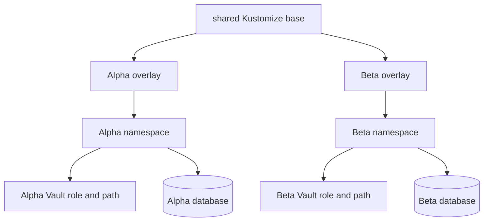

# Defense-in-Depth Tenant Isolation

A tenant is not a label on a Deployment. It is a boundary that must survive mistakes in identity configuration, secret policy, database permissions, and cluster routing. The Alpha/Beta experiment repeats the same boundary across these systems so that one misconfiguration does not automatically become cross-tenant access.

> [!summary]
> - Alpha and Beta have separate organizations, tenant-owned projects, OIDC clients, hosts, namespaces, service accounts, Vault paths, database roles, and databases.
> - The application validates a trusted ZITADEL resource-owner claim before local identity projection.
> - Direct negative tests found and fixed PostgreSQL's default `PUBLIC CONNECT` grant.

## The isolation matrix

| Layer | Alpha | Beta | Boundary mechanism |
|---|---|---|---|
| ZITADEL organization | TODO Tenant Alpha | TODO Tenant Beta | resource ownership |
| ZITADEL project | `todo-tenant-alpha` | `todo-tenant-beta` | tenant-owned project |
| OIDC client | Alpha public PKCE client | Beta public PKCE client | callback and audience |
| Public host | `todo-alpha...` | `todo-beta...` | Ingress and TLS |
| Namespace | `todo-tenant-alpha` | `todo-tenant-beta` | Kubernetes tenancy |
| Service account | tenant runtime in Alpha namespace | tenant runtime in Beta namespace | workload identity |
| Vault path | Alpha runtime/image pull | Beta runtime/image pull | policy path |
| PostgreSQL role | Alpha login role | Beta login role | database authentication |
| PostgreSQL database | `todo_tenant_alpha` | `todo_tenant_beta` | ACL and ownership |
| Session/CSRF keys | independent | independent | cryptographic separation |

The repeated names are not the security mechanism. The independent credentials, claims, policies, and ACLs are.

## Identity boundary

The authorization request names the expected organization. ZITADEL returns the resource-owner organization claim. The application compares that claim with immutable deployment configuration before writing a local user row.

```pseudo
expected = configuredOrganizationID
observed = userInfo[resourceOwnerClaim]

if observed is missing or malformed or observed != expected:
    reject before UpsertUser
```

Separate OIDC clients prevent callback confusion and make client revocation tenant-specific. Tenant-owned projects intentionally test delegated customer control rather than a platform-owned shared-project model.

## Secret boundary

Each workload authenticates to Vault using a Kubernetes service-account token. The Vault role binds two exact facts:

```text
service account name + Kubernetes namespace
```

The policy then permits only the tenant's runtime and image-pull paths. Database bootstrap uses a different service account and policy because it needs access to the shared PostgreSQL administrator record. The long-running app cannot read that record.

The acceptance test did not infer isolation from HCL. It minted a short-lived token for each real service account, logged into Vault, read the own path, attempted the peer path, confirmed denial, and revoked the test token.

## Database boundary and the default that broke it

Creating separate databases and owners looked sufficient. It was not. PostgreSQL grants `CONNECT` on a new database to `PUBLIC` by default. Alpha's role could establish a session against Beta's database even though it could not own Beta's tables.

The corrected bootstrap contract is:

```sql
ALTER DATABASE tenant_database OWNER TO tenant_role;
REVOKE CONNECT ON DATABASE tenant_database FROM PUBLIC;
GRANT CONNECT, TEMPORARY ON DATABASE tenant_database TO tenant_role;
```

Direct client pods then proved both directions:

```text
Alpha → Alpha database: allowed
Alpha → Beta database: denied
Beta  → Beta database: allowed
Beta  → Alpha database: denied
```

This incident is the strongest argument for defense in depth. The design named database isolation, but only a credential-level negative test revealed the ambient grant.

## Namespace and delivery boundary

Two explicit Argo Applications target two explicit namespaces. The `prod-apps` AppProject allowlists those namespaces rather than accepting a wildcard. Each overlay selects its own Vault roles, paths, host, and TLS secret while inheriting one hardened base.



NetworkPolicy constrains application egress to DNS, PostgreSQL, and the in-cluster Traefik path used to reach the public OIDC issuer. Namespace isolation does not replace policy, but it gives policy selectors a stable boundary.

## Administrator boundary

The intended customer model gives each tenant one organization-scoped administrator and no instance-wide role. The handoff sequence is deliberately outside Terraform's ordinary lifecycle:

```text
stable organization exists
  → approved external address is invited
  → recipient verifies email and establishes factors
  → operator grants organization manager role
  → cross-organization and instance operations are denied
```

At the analyzed snapshot, this acceptance remained open because approved recipient addresses had not been supplied. Synthetic users are suitable for OIDC tests but not for proving a real administrative handoff.

## Reuse guidance

Promote the principle, not the exact number of resources: a tenant boundary should be asserted independently at identity, secret, data, and deployment layers. Every boundary needs a positive test and a peer-negative test using the real runtime identity. Shared infrastructure remains appropriate when these controls satisfy risk requirements; contractual residency, customer-owned infrastructure, or blast-radius requirements may still require separate instances.
