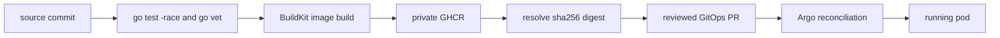

# Vault, GitOps, and Immutable Delivery

Production configuration has two categories. Nonsecret desired state belongs in Git where review and reconciliation can see it. Credential values belong in Vault where access policy, rotation, and audit can govern them. Vault Secrets Operator joins these categories inside the target namespace.

> [!summary]
> - A source commit becomes a private immutable image digest, then a reviewed GitOps revision.
> - VSO turns a namespace-bound workload identity into a runtime Secret without storing values in Git.
> - Privileged database bootstrap is an idempotent Argo hook; the application runs with a smaller identity.

## Image promotion

The source workflow delegates to a reusable organization workflow. Pull requests run tests without publishing. Main pushes publish a private GHCR image. GitOps pins the resulting digest rather than relying on a mutable tag.



The tenant image at the analyzed deployment was tied to source commit `76bfd2210b874bbce57dfbd183ce9884a1c066f4` and digest `sha256:6bb51652b73b95e60be1f29bb179e3b5cd620d65e5d06e8022fce6a8fac5225d`. The digest is the deployment identity; the source commit explains its contents.

The runtime image is distroless and non-root. Native Go health checks avoid adding a shell or `curl`. SecurityContext settings drop capabilities, forbid privilege escalation, and use a read-only root filesystem where the workload permits it.

## Secret delivery

The runtime flow is:

```text
Vault KV record
  → Vault policy
  → Kubernetes auth role
  → service account token
  → VaultAuth
  → VaultStaticSecret
  → namespaced Kubernetes Secret
  → Deployment environment
```

The Git repository contains path names, role names, refresh intervals, and transformation templates. It does not contain database passwords, OIDC credentials, session keys, CSRF keys, Stripe secrets, or registry tokens.

Image pull credentials use a VSO transformation to construct `kubernetes.io/dockerconfigjson`. Runtime values use an opaque Secret. Separating these records narrows the effect of rotation and makes required fields explicit.

## Privileged bootstrap

The database bootstrap Job uses a dedicated service account and Vault role. It reads the shared PostgreSQL administrator record and the tenant runtime record, then creates or repairs the tenant role and database.

Argo sync waves order the dependencies:

```text
-2  Vault connection and auth
-1  materialized Secrets
 0  bootstrap script and workload prerequisites
 1  database bootstrap hook
 2+ application and ingress readiness
```

The Job is idempotent. It creates missing resources and alters existing ownership/password/ACL state into the desired form. Hook deletion after success means a healthy final namespace may not contain the Job. Reviewers must use Argo operation evidence and direct database probes rather than interpreting absence as failure.

## Kustomize proportional to scale

The tenant deployment uses one base and two explicit overlays. The base owns security-sensitive mechanics. Each overlay declares tenant-specific values.

This is a useful middle point:

- Copying the full package twice would allow security behavior to drift.
- An ApplicationSet and generalized tenant inventory would introduce machinery before onboarding frequency justifies it.
- One base plus two overlays retains explicit review while sharing invariants.

An early attempt used `namePrefix`. Native Kubernetes references changed, but fields inside VSO custom resources did not automatically follow. Because namespaces already isolate names, the implementation removed the unnecessary prefix instead of adding fragile name-reference customization.

## Argo ownership has a bootstrap edge

Merging new files under `gitops/applications` did not create Applications because no parent Application watched that directory. The two Application resources required explicit first application. The `prod-apps` AppProject then rejected the new namespaces until two exact destinations were added.

This teaches an important distinction:

```text
resource described in Git ≠ resource reconciled from Git
```

A complete GitOps system must identify the reconciler that owns every desired object, including top-level Applications and AppProjects. Manual bootstrap can be legitimate, but it must be named and repeatable.

## TLS and public routing

Traefik serves each host. cert-manager observes the Ingress annotation, solves ACME challenges, and writes the TLS Secret. Initial public checks correctly failed against Traefik's temporary self-signed certificate while issuance was pending. Final checks required `ssl_verify_result=0` and HTTP 200 from readiness.

This is another ordering lesson: Ingress existence is not evidence of trusted TLS. Certificate Ready status and a public trust-chain check are separate evidence.

## Reuse guidance

Use this delivery model for small services on the shared K3s platform. Require immutable digests, reviewed GitOps promotion, Vault-backed runtime secrets, exact workload bindings, separate privileged bootstrap identities, native probes, and public TLS verification. Before calling a resource GitOps-managed, identify the Application that reconciles it.
