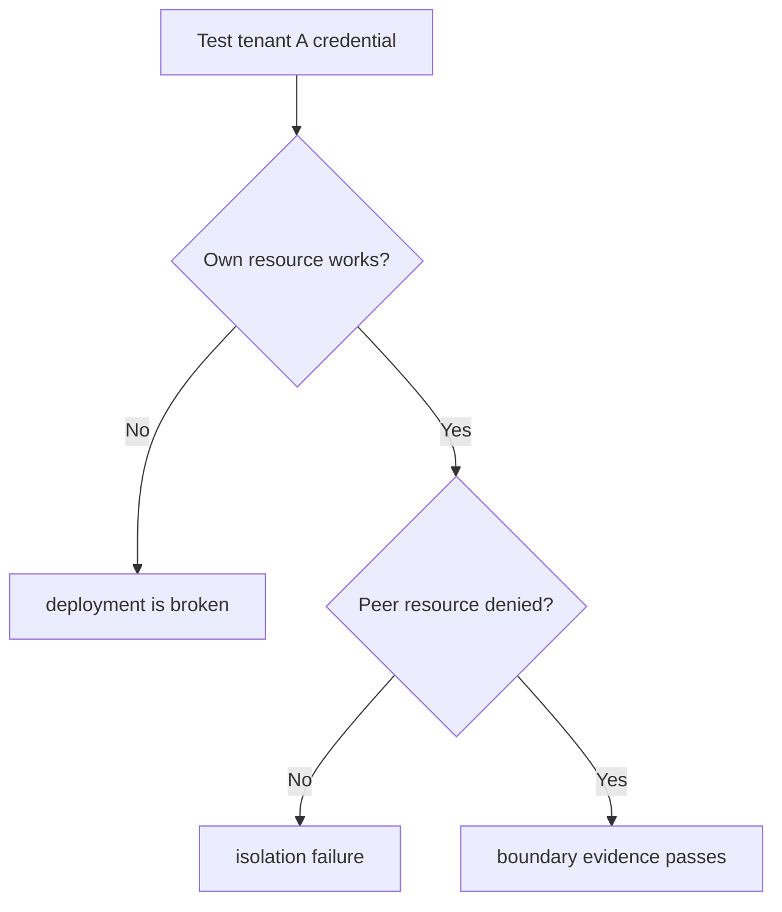

# Acceptance as Architecture Evidence

Architecture claims concern runtime behavior: a tenant cannot read another tenant's secret, a role cannot connect to another database, a callback rejects the wrong organization, and a subscription event changes quota exactly once. Source inspection can show intent. Acceptance must show that the deployed systems produce the claimed behavior together.

> [!summary]
> - Tests are selected by boundary: unit tests for claim logic, rendered manifests for desired state, and real credentials for policy denial.
> - Negative tests are first-class because healthy positive paths do not reveal ambient grants or unintended authority.
> - Evidence records immutable references and sanitized outcomes, never credentials, cookies, invitation links, or PII.

## An evidence ladder

The project uses several forms of evidence, each answering a different question.

| Evidence | Question |
|---|---|
| Go unit tests | Does a local rule behave across edge cases? |
| Go integration tests | Do SQL ownership and mutation rules hold against PostgreSQL? |
| Terraform plan after apply | Does stable identity infrastructure converge without drift? |
| Kustomize render and client dry-run | Is desired Kubernetes state structurally valid? |
| Argo status | Did the controller reconcile the desired revision? |
| Pod and VSO readiness | Are workload and secret resources operational? |
| Public HTTPS probe | Does trusted routing work outside the cluster? |
| Browser OIDC flow | Do hosted login, cookies, redirects, claims, and application middleware interoperate? |
| Real service-account Vault login | Does workload identity receive only intended paths? |
| Real tenant database credential | Does database ACL deny the peer tenant? |
| Signed Stripe webhook | Does external event authority produce the local projection? |

No row subsumes the others. `Synced / Healthy` does not prove a browser accepts the session cookie. A unit test for an organization helper does not prove ZITADEL emits the claim in UserInfo.

## Positive and negative matrices

A tenant boundary requires four identity paths, not two:

```text
Alpha user → Alpha app: allow
Beta user  → Beta app:  allow
Alpha user → Beta app:  deny before local projection
Beta user  → Alpha app: deny before local projection
```

Vault and PostgreSQL use the same matrix. The test actor must be the real workload identity or credential. An administrator checking policy text is not equivalent to a service account attempting the read.



The own-resource step matters because a denial test with an invalid credential proves nothing about path-specific authorization.

## Failures that changed the architecture

The acceptance loop found several gaps:

1. **Argo destination rejection.** Both Applications were invalid because `prod-apps` did not allow their namespaces. The fix added two exact destinations rather than a wildcard.
2. **Temporary TLS failure.** Public HTTPS initially presented a self-signed certificate while ACME issuance was active. Waiting for Certificate Ready produced trusted TLS without bypassing verification.
3. **Cross-database connection succeeded.** The first negative pod reported `cross_database_denied=false`. PostgreSQL's default `PUBLIC CONNECT` grant was then revoked in the idempotent bootstrap.
4. **Project grant required.** Synthetic tenant users authenticated but ZITADEL denied callback creation until they had a project assignment.
5. **Browser rejected the application session.** The callback set an encrypted cookie containing the full OIDC context, but its size exceeded browser limits. This requires a server-side session design.

These failures show why acceptance is architecture work. Each failure identified authority or representation that source-level reasoning had missed.

## Sanitized evidence

Evidence files store booleans, status values, workflow IDs, commits, image digests, PR numbers, and merge hashes. They omit:

- passwords and API tokens;
- OIDC codes, state, nonce, and PKCE verifiers;
- cookies and session payloads;
- email addresses and user subjects;
- invitation and recovery links;
- raw Terraform sensitive values.

One debugging step accidentally printed an encrypted Alpha session cookie while inspecting `Set-Cookie` attributes. The response was immediate: rotate Alpha's session encryption key in Vault, wait for VSO propagation, restart the pod, and close the browser context. The incident belongs in the diary because evidence collection itself must be designed not to expose credentials.

## The diary as a reproducible argument

A useful implementation diary records:

- the prompt and interpreted goal;
- commands and exact failures;
- what changed and why;
- commits, PRs, merges, and deployed revisions;
- what remains unproved;
- review and repetition instructions.

The diary is not a polished success narrative. The failed cross-database test and oversized-cookie diagnosis are more educational than a list of green checks because they explain why the final rules exist.

## Reuse guidance

For ecosystem projects, design acceptance when designing the boundary. Name a positive and negative actor, the exact credential used, the expected observable result, and the sanitization rule. Preserve the result with a source commit and deployment revision. A boundary without a direct negative test remains a design claim.
