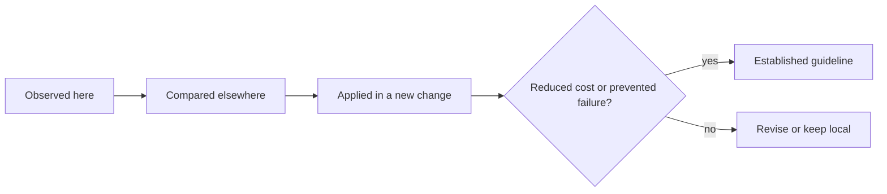

# Candidate Ecosystem Guidelines

A single project can reveal a useful invariant, but it cannot establish an ecosystem standard by itself. These guidelines are candidates extracted from `zitadel-go-test`. Each should be compared with at least one other deployed application before it becomes a default scaffold or policy.

> [!summary]
> - Promote invariants first: identity keys, authority boundaries, least privilege, immutable delivery, and direct negative tests.
> - Standardize concrete implementation only after another project demonstrates the same constraints.
> - Preserve exceptions explicitly; a guideline should reduce mistakes without hiding product-specific decisions.

## 1. Key external identities by issuer and subject

**Candidate rule:** Every OIDC-backed application stores external identity under `(issuer, subject)`. Email is mutable, verified profile data and must not own domain records.

```text
stable identity: issuer + subject
mutable profile: email + display name
```

Why this should generalize: the invariant comes from OIDC semantics rather than this application's UI or database schema. Future comparison targets include other ZITADEL, Keycloak, and tiny-idp applications.

## 2. Separate authentication, tenant authorization, and product roles

**Candidate rule:** Treat these as three distinct decisions:

| Decision | Evidence |
|---|---|
| Who is the user? | validated issuer and subject |
| Which tenant context is active? | trusted organization/resource-owner claim |
| Which operations are permitted? | product or project roles |

A valid login is not tenant authorization. A tenant claim is not a product role. Middleware should enforce each decision before the state transition that depends on it.

## 3. Reject tenant mismatch before local projection

**Candidate rule:** Validate the trusted tenant claim before inserting or updating a local user row. Validate it again for protected requests.

The first check prevents unauthorized residue. The second keeps authorization adjacent to use. Tests must include missing, malformed, matching, and mismatching claims.

## 4. Keep rich authentication sessions server-side

**Candidate rule:** Browser cookies carry only a protected random session identifier. Token sets and rich identity context live in a revocable server-side store with expiry.

```text
cookie = encrypt(random_session_id)
database[session_id] = OIDC context + expiry + revocation state
```

Do not infer cookie suitability from encryption. Browsers enforce size limits independently. Do not use an in-memory store for production services that restart or may scale horizontally.

This candidate became visible through a failure and should be compared with session handling in other Go services before choosing one shared package.

## 5. Place ownership in the data mutation

**Candidate rule:** SQL reads, updates, and deletes include owner or tenant predicates. Avoid loading an object by public ID and authorizing it in a distant layer when one guarded statement can express both selection and ownership.

```sql
UPDATE object
SET ...
WHERE id = $object_id
  AND owner_id = $authenticated_owner;
```

Return “not found or not owned” without exposing peer existence unless the product requires a distinction.

## 6. Treat external webhooks as an idempotent inbox

**Candidate rule:** Verify the signature over the raw body, persist the provider event ID, claim processing ownership, project local state transactionally, and record retryable or terminal outcome.

Browser return URLs never establish payment truth. Ordinary domain requests read the local projection rather than calling the provider synchronously.

## 7. Repeat tenant boundaries across independent systems

**Candidate rule:** A customer tenant must have independent controls at identity, secret, data, and deployment layers. The exact resource count may vary, but no single claim, namespace, or database convention is sufficient.

A shared-platform baseline should examine:

- identity organization and client;
- workload service account;
- Vault role and path;
- database role and ACL;
- namespace and network policy;
- host and TLS identity;
- session and CSRF keys.

## 8. Test boundaries with the real credential

**Candidate rule:** Every isolation control has an own-resource positive test and a peer-resource negative test using the same identity the workload uses in production.

```pseudo
assert ownCredential can access ownResource
assert ownCredential cannot access peerResource
```

Policy text, successful reconciliation, and administrator access are supporting evidence. They are not substitutes for the negative probe.

## 9. Revoke ambient database privileges explicitly

**Candidate rule:** Database bootstrap declares ACLs rather than relying on database-owner defaults. For isolated PostgreSQL databases, inspect and usually revoke `PUBLIC CONNECT`, then grant only intended roles.

This rule should become a shared bootstrap primitive because PostgreSQL's default is stable and easy to forget.

## 10. Separate privileged bootstrap from runtime

**Candidate rule:** A short-lived, idempotent bootstrap identity may create or repair databases and roles. The long-running application must not receive administrator credentials.

The distinction should appear in all layers:

```text
separate service account
separate Vault role and policy
separate Secret
short-lived Job
runtime Deployment with tenant role only
```

## 11. Store nonsecret desired state in Git and credentials in Vault

**Candidate rule:** Git owns paths, policy definitions, resource declarations, schedules, immutable image digests, and nonsecret assets. Vault owns passwords, API keys, signing/encryption keys, pull credentials, and other bearer material.

VSO is the delivery bridge, not a reason to mirror Vault values into Git. Evidence reports structural booleans and immutable references, never values.

## 12. Identify the reconciler for every desired resource

**Candidate rule:** A file is GitOps-managed only when a named controller watches and reconciles it. Top-level Argo Applications and AppProjects need an explicit parent or documented bootstrap path.

Every deployment guide should answer:

```text
Which repository contains this object?
Which Application or bootstrap process creates it?
Which controller corrects drift?
How is deletion handled?
```

## 13. Promote immutable image digests

**Candidate rule:** Build from a tested source commit, publish to a private registry, resolve an immutable digest, and promote that digest through a reviewed GitOps change. Runtime verification compares the pod image ID and desired digest.

Tags remain useful for humans and retention policy. They are not deployment identity.

## 14. Use the smallest deployment abstraction justified by repetition

**Candidate rule:** Begin with a shared Kustomize base and explicit overlays when there are only a few deployments. Introduce ApplicationSet, tenant inventories, or generated onboarding only after repeated operations provide concrete requirements.

Abstraction should remove duplicated authority, not merely reduce line count.

## 15. Treat acceptance evidence as an architectural deliverable

**Candidate rule:** A substantial architecture change is incomplete until its claimed boundaries have fresh runtime evidence. Store:

- source commit;
- image digest;
- GitOps revision;
- controller sync and health;
- positive and negative outcomes;
- sanitization statement;
- known unproved requirements.

A chronological diary preserves failures and the reason for corrective design. A sanitized machine-readable record supports future comparison.

## 16. Delegate specialized lifecycle to specialized systems

**Candidate rule:** Applications should not own credential verification, payment settlement, secret storage, certificate issuance, or cluster reconciliation when a dedicated system already owns that lifecycle. The application validates the resulting facts and owns only its domain projection.

This rule is not “use more services.” Each delegation must produce a narrow contract and reduce local authority. The Alpha/Beta deployments correctly omitted Stripe because billing did not contribute to the experiment.

## Comparison program

These candidates need comparison rather than immediate standardization.

| Candidate area | Suggested comparison target | Question |
|---|---|---|
| OIDC identity and sessions | another ZITADEL or Keycloak Go application | Can one session-store adapter serve both without coupling domain models? |
| Server-rendered HTTP composition | `hair-booking`, `go-go-host`, or another compact Go service | Which handler and middleware conventions recur? |
| Vault/VSO delivery | other K3s production applications | Can path, auth, and bootstrap roles share one documented scaffold? |
| Database isolation | other per-application PostgreSQL databases | Are `PUBLIC CONNECT` and schema ACLs consistently controlled? |
| Webhook inbox | another Stripe or external-event consumer | Which processing state machine is reusable? |
| Kustomize tenant overlays | another repeated deployment family | When does explicit overlay count justify ApplicationSet? |
| Acceptance evidence | recent production ticket reports | Which evidence fields should become a common schema? |

## Promotion rule

A candidate becomes ecosystem guidance only after four steps:



The goal is not to make every application identical. The goal is to stop rediscovering identity invariants, database defaults, secret boundaries, and delivery proofs that are already understood.

## Related Garden studies

- [[Research/Software Architecture Garden/zitadel-go-test/README|zitadel-go-test project study]]
- [[Research/Software Architecture Garden/zitadel-go-test/02 - External Identity and Local Projection|External Identity and Local Projection]]
- [[Research/Software Architecture Garden/zitadel-go-test/05 - Defense in Depth Tenant Isolation|Defense-in-Depth Tenant Isolation]]
- [[Research/Software Architecture Garden/zitadel-go-test/07 - Acceptance as Architecture Evidence|Acceptance as Architecture Evidence]]
- [[Research/Software Architecture Garden/zitadel-go-test/08 - Architecture Debt and Patterns Not to Repeat|Architecture Debt and Patterns Not to Repeat]]
