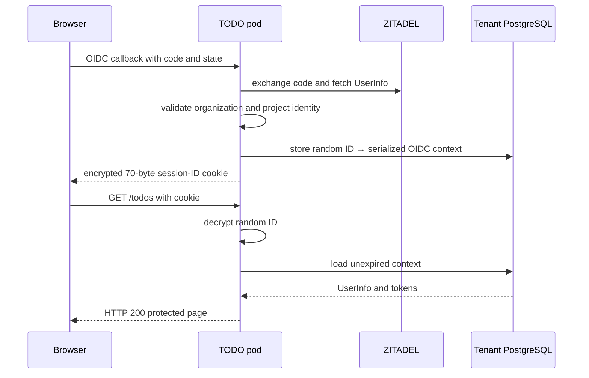

# PostgreSQL-Backed OIDC Session Follow-up

The original study recorded an architecture failure: the TODO application encrypted the complete OIDC context into `zitadel.session`, and real ZITADEL tokens made that cookie too large for browsers to retain. This follow-up records the replacement and the evidence that changed the pattern from proposed to established locally.

> [!summary]
> - The browser now stores a 70-byte encrypted random session identifier.
> - PostgreSQL stores the serialized OIDC context and a 24-hour expiry.
> - Alpha and Beta sessions survived pod replacement, proving that authentication state no longer depends on process memory.

## Why the representation changed

The application needs rich identity context after the callback. That context contains UserInfo, custom organization claims, and OIDC tokens. It is valid server state but invalid cookie state once encryption and encoding push it beyond browser limits.

The corrected representation separates lookup capability from session content:

```text
browser
  zitadel.session = encrypt(random session ID)

PostgreSQL
  session ID → OIDC context JSON + created_at + expires_at
```

The browser receives enough information to refer to a session, not enough to carry the session itself. The random identifier is encrypted by the ZITADEL SDK before entering the cookie.

## Concrete implementation

Migration `005_oidc_sessions.sql` creates the durable store:

```sql
CREATE TABLE oidc_sessions (
    id text PRIMARY KEY,
    context_json jsonb NOT NULL,
    created_at timestamptz NOT NULL DEFAULT now(),
    expires_at timestamptz NOT NULL
);
```

`internal/store/postgres/sessions.go` owns persistence and expiry checks. `cmd/todo-demo/session_store.go` adapts those methods to the SDK's `Sessions[*openid.DefaultContext]` interface. The composition root changed from stateless cookie sessions to the explicit store:

```go
authentication.WithSessionStore[*openid.DefaultContext](
    newOIDCSessionStore(db),
)
```

The adapter depends on a narrow persistence interface rather than the entire TODO store. This keeps the session protocol independent of TODO and billing operations.

## Runtime sequence



A pod replacement changes the Go process but not the PostgreSQL row or browser cookie. The replacement pod decrypts the same identifier and loads the same context.

## Evidence

The deployed image was built from application commit `251c46c` and pinned by digest. Infrastructure PR #220 merged as `cb1eceaac98b0a699ee053b4e139064beb40ff76`.

Acceptance established:

| Check | Alpha | Beta |
|---|---:|---:|
| Browser retained `zitadel.session` | yes | yes |
| Encrypted cookie value length | 70 bytes | 70 bytes |
| Protected `/todos` | HTTP 200 | HTTP 200 |
| Session survived pod replacement | yes | yes |
| Own TODO creation | yes | yes |
| Peer-tenant target session created | no | no |
| Peer-tenant local user created | no | no |

The test deleted synthetic ZITADEL users, local users, cascaded TODO fixtures, server session rows, temporary passwords, and isolated browser contexts afterward.

## What remains imperfect

The upstream session interface exposes `Set` and `Get`, not explicit deletion. Logout deletes the browser cookie, while server rows remain inaccessible after expiry and are removed opportunistically during later writes. At current volume this is bounded and operationally acceptable. A shared ecosystem session package should consider explicit revocation, periodic cleanup, user-deactivation behavior, and configurable lifetime.

The 24-hour lifetime is currently code, not deployment configuration. Standardizing that value would be premature until another application supplies comparison evidence.

## Updated candidate guideline

The original Garden entry classified the stateless full-context cookie as architecture debt. This follow-up establishes the replacement locally:

> [!success] Established local pattern
> Keep rich OIDC context in a durable server-side store. Put only a protected random session identifier in the browser. Prove cookie size, protected access, pod-restart persistence, expiry behavior, and tenant denial with the deployed system.

This is now ready for comparison with other Go OIDC applications before becoming an ecosystem-wide session package.

## Related studies

- [[Research/Software Architecture Garden/zitadel-go-test/02 - External Identity and Local Projection|External Identity and Local Projection]]
- [[Research/Software Architecture Garden/zitadel-go-test/07 - Acceptance as Architecture Evidence|Acceptance as Architecture Evidence]]
- [[Research/Software Architecture Garden/zitadel-go-test/08 - Architecture Debt and Patterns Not to Repeat|Architecture Debt and Patterns Not to Repeat]]
- [[Research/Software Architecture Garden/zitadel-go-test/09 - Candidate Ecosystem Guidelines|Candidate Ecosystem Guidelines]]
