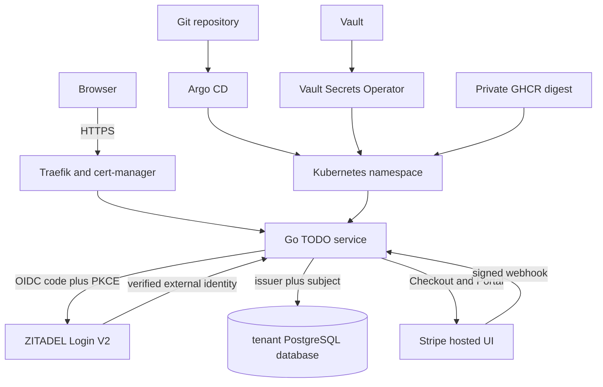

# Architecture Garden — zitadel-go-test

`zitadel-go-test` is a small server-rendered TODO application whose most instructive architecture lives at its boundaries. The Go package graph is compact. The deployed system is not. A browser session crosses ZITADEL, the TODO service, PostgreSQL, Vault Secrets Operator, Kubernetes, Traefik, cert-manager, Argo CD, GHCR, and—on the original production deployment—Stripe. This study explains how those parts divide authority and how several independent controls combine into a trustworthy application.

> [!summary]
> - The strongest local pattern is external identity projected into application-owned state under the stable key `(issuer, subject)`.
> - The tenant experiment repeats one organization boundary across OIDC, Vault, PostgreSQL, Kubernetes, and Argo CD instead of trusting one control.
> - The deployment and acceptance work exposed important defaults: PostgreSQL grants `CONNECT` to `PUBLIC`, top-level Argo resources need explicit bootstrap ownership, and a full OIDC context is too large for a browser cookie.

## Snapshot identity

This study describes a precise repository snapshot. Future readers should compare the current repository head with the hash below before treating implementation details as current.

| Field | Value |
|---|---|
| Repository | `/home/manuel/code/wesen/2026-07-25--zitadel-go-test` |
| Repository URL | `https://github.com/wesen/2026-07-25--zitadel-go-test` |
| Code snapshot | `6b64c4c2974349760e52016f153c807c44be54dc` |
| Snapshot date | 2026-07-26 |
| Vault base commit | `dbb76bf21c6d3293629a36603be9feee88ac8b5b` |
| Production GitOps repository | `/home/manuel/code/wesen/2026-03-27--hetzner-k3s` |
| Production Terraform repository | `/home/manuel/code/wesen/terraform` |

The source commit includes the organization-bound OIDC implementation and the implementation diary through infrastructure isolation acceptance. PostgreSQL-backed OIDC sessions were not yet implemented at this snapshot. The oversized stateless-cookie finding is therefore recorded as architecture debt, not as a completed pattern.

## Why this project belongs in the Garden

The application was not produced from a comprehensive architecture program. It grew from an OIDC experiment into a production service with email verification, recovery, profile management, quota enforcement, Stripe subscription projection, custom hosted-login branding, and two isolated toy tenants. That growth makes the repository useful for architectural study. The code shows which boundaries survived new requirements and which local choices failed when the surrounding system became more demanding.

The central lesson is that a small executable can participate in a sophisticated architecture without becoming a large framework. The executable keeps a narrow job:

```text
validate request
  → establish external identity
  → project identity locally
  → execute TODO/profile/billing use case
  → persist application state
  → render HTML
```

Infrastructure supplies TLS, secret delivery, database provisioning, immutable image promotion, and reconciliation. ZITADEL supplies credential and authentication lifecycle. Stripe supplies payment lifecycle. The application integrates these systems but does not attempt to replace them.

## Reading path

1. [[Research/Software Architecture Garden/zitadel-go-test/01 - Project Architecture Overview|Project Architecture Overview]] develops the complete request, identity, data, and deployment topology.
2. [[Research/Software Architecture Garden/zitadel-go-test/02 - External Identity and Local Projection|External Identity and Local Projection]] studies `(issuer, subject)`, verified-email enforcement, PKCE, and tenant claims.
3. [[Research/Software Architecture Garden/zitadel-go-test/03 - Standard Library HTTP Composition|Standard-Library HTTP Composition]] explains handler layering, CSRF placement, templates, and process lifecycle.
4. [[Research/Software Architecture Garden/zitadel-go-test/04 - PostgreSQL State and Webhook Projection|PostgreSQL State and Webhook Projection]] covers migrations, ownership queries, Stripe's event inbox, and quota projection.
5. [[Research/Software Architecture Garden/zitadel-go-test/05 - Defense in Depth Tenant Isolation|Defense-in-Depth Tenant Isolation]] follows one tenant boundary through identity, secrets, data, and deployment.
6. [[Research/Software Architecture Garden/zitadel-go-test/06 - Vault GitOps and Immutable Delivery|Vault, GitOps, and Immutable Delivery]] studies secret delivery, privileged bootstrap, Kustomize overlays, images, TLS, and reconciliation.
7. [[Research/Software Architecture Garden/zitadel-go-test/07 - Acceptance as Architecture Evidence|Acceptance as Architecture Evidence]] explains why direct positive and negative probes are part of architecture work.
8. [[Research/Software Architecture Garden/zitadel-go-test/08 - Architecture Debt and Patterns Not to Repeat|Architecture Debt and Patterns Not to Repeat]] preserves limits and failed assumptions.
9. [[Research/Software Architecture Garden/zitadel-go-test/09 - Candidate Ecosystem Guidelines|Candidate Ecosystem Guidelines]] extracts rules to compare with future projects.
10. [[Research/Software Architecture Garden/zitadel-go-test/10 - PostgreSQL Backed OIDC Session Follow-up|PostgreSQL-Backed OIDC Session Follow-up]] records the implemented replacement for the oversized stateless session and its deployed restart evidence.

## Pattern map



The diagram is intentionally split into two paths. The upper path is the user and domain runtime. The lower path is the delivery and operational runtime. Both are part of the application architecture because a correct handler running with the wrong secret, image, database role, or namespace is not a correct deployed system.

## Pattern maturity summary

| Pattern | Maturity | Assessment |
|---|---|---|
| External identity projected by `(issuer, subject)` | Established locally | Used throughout profile, TODO, and billing state; avoids email identity errors. |
| Organization scope plus trusted resource-owner claim | Candidate ecosystem pattern | Implemented and unit tested; full cross-tenant browser acceptance was still in progress at the snapshot. |
| Standard-library handler composition | Established locally | Small, explicit, and testable; command wiring remains concentrated in one file. |
| Embedded templates and static assets | Established locally | Appropriate for this interaction model and deployment size. |
| Ordered embedded PostgreSQL migrations | Established locally | Production and tenant databases apply the same schema path. |
| Signed-webhook inbox and subscription projection | Candidate ecosystem pattern | Strong idempotency and concurrency behavior proven in sandbox acceptance. |
| Repeated tenant boundary across systems | Candidate ecosystem pattern | Vault and database negative tests passed in both directions. |
| Privileged bootstrap job separated from runtime | Candidate ecosystem pattern | Runtime never receives PostgreSQL administration credentials. |
| Base plus two explicit tenant overlays | Established locally | Reuse without premature ApplicationSet machinery. |
| Sanitized evidence-backed acceptance | Candidate ecosystem pattern | Failures found real architecture gaps rather than merely confirming health. |
| Full OIDC context in an encrypted cookie | Architecture debt | The encrypted cookie exceeds browser limits once real token and claim sets are present. |

## What is solid

Three separations hold the system together.

First, ZITADEL owns authentication facts while the TODO service owns domain state. The TODO service does not store password hashes, verification codes, recovery links, MFA factors, or passkeys. It accepts a cryptographically validated subject and then creates the application row it needs.

Second, stable infrastructure and volatile human lifecycle are managed differently. Terraform creates organizations, projects, clients, and policies. Human invitations, passwords, factors, recovery, and ordinary membership do not belong in Terraform state.

Third, privileged setup and unprivileged runtime use different identities. A short-lived database bootstrap hook may create a role and database. The long-running application receives only that role. Vault policy, Kubernetes service account, and namespace bindings reinforce the distinction.

## What remains unresolved at this snapshot

The tenant deployments reached `Synced / Healthy`, trusted TLS, independent Vault paths, and direct cross-database denial. At the original snapshot, identity acceptance had uncovered a production defect in session representation: `authentication.WithCookieSession` serialized the complete OIDC context, including tokens, and the encrypted result was larger than browsers accept. This defect was subsequently corrected and accepted in [[Research/Software Architecture Garden/zitadel-go-test/10 - PostgreSQL Backed OIDC Session Follow-up|PostgreSQL-Backed OIDC Session Follow-up]].

The initial customer-administrator handoff still remains incomplete because it requires approved external email addresses and real verification. Synthetic acceptance users can test application authorization, but they cannot substitute for the administrator invitation and handoff contract.

## Source tickets and evidence

The detailed implementation record remains in the source repository:

- `ttmp/2026/07/25/ZITADEL-001-WEBAPP-MVP--plan-a-go-webapp-mvp-with-zitadel-authentication-on-k3s`
- `ttmp/2026/07/25/ZITADEL-002-IDENTITY-BILLING--plan-email-verification-recovery-stripe-subscriptions-and-profile-management-for-the-zitadel-go-webapp`
- `ttmp/2026/07/26/ZITADEL-004-CUSTOM-LOGIN-UI--design-and-implement-custom-zitadel-login-v2-ui`
- `ttmp/2026/07/26/ZITADEL-006-MULTITENANT-TODO--deploy-two-tenant-owned-todo-applications-with-zitadel-organizations`

These ticket documents preserve commands, failures, production evidence, and decision chronology. The Garden does something different: it names the structures that should be compared across projects.
