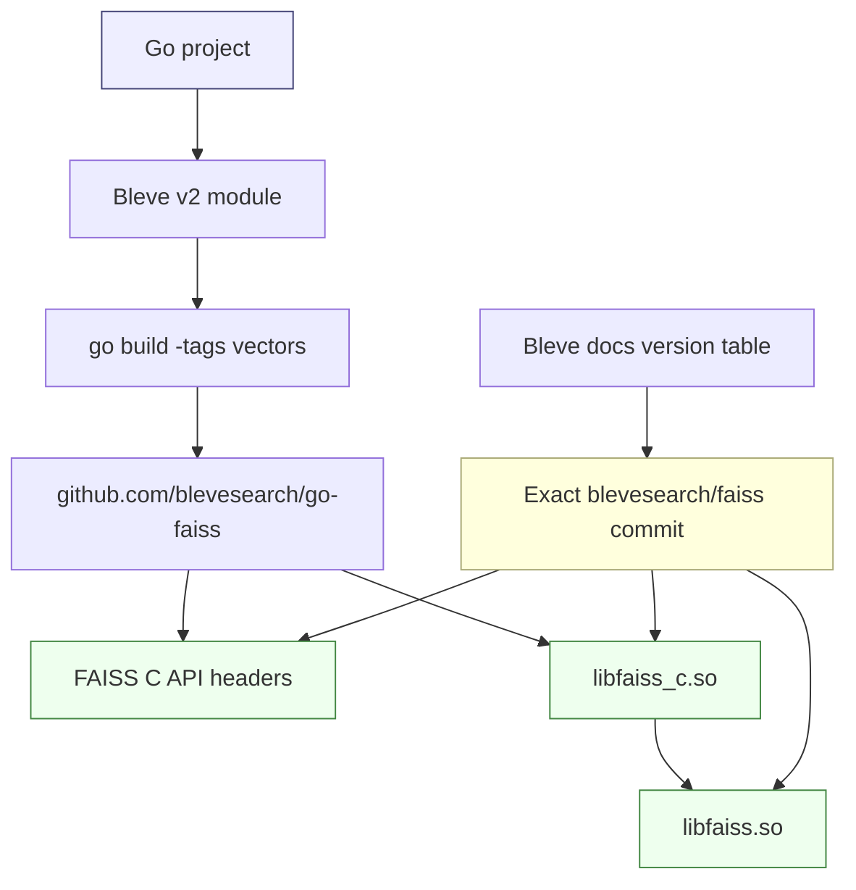

# Playbook - Building Bleve-compatible FAISS for vector search

This playbook explains how to build the FAISS native library that Bleve needs for Go vector search. It captures the working setup from the `readwise-viewer` RWVEC-001 embedding/vector-search work, where `github.com/blevesearch/bleve/v2 v2.6.0` was paired with the correct `blevesearch/faiss` fork and validated with `go test -tags vectors`.

> [!summary]
> - Bleve vector search is not pure Go: it requires the `vectors` Go build tag plus Bleve's compatible FAISS fork.
> - Use the version-specific Bleve vector docs to choose the FAISS commit; do not rely on arbitrary distro/system FAISS.
> - For Bleve `v2.6.0`, use `blevesearch/faiss@ffd910a91f1acf49b9898a7e514e462db89ee7b3`.
> - A user-local install prefix plus explicit `CGO_*` and `LD_LIBRARY_PATH` variables avoids corrupting older system FAISS installs.

## When to use this playbook

Use this when a Go project imports Bleve vector support and `go test -tags vectors` fails with errors like:

```text
fatal error: faiss/c_api/IndexBinaryIVF_c.h: No such file or directory
```

or when linking fails with many unresolved C++ symbols such as:

```text
undefined reference to `faiss::Index...'
```

This playbook is specifically for Bleve's FAISS-backed vector support, not for standalone Python FAISS, not for upstream `facebookresearch/faiss` package installs, and not for GPU FAISS. GPU support has additional CUDA requirements and the extra `gpu` Go build tag.

## Core mental model

Bleve vector search has three layers that must line up:



The `vectors` tag enables Bleve code that imports `github.com/blevesearch/go-faiss`. That Go package uses CGO and expects FAISS C API headers under an include path such as:

```text
$FAISS_PREFIX/include/faiss/c_api/*.h
```

It also links to:

```text
libfaiss_c.so
```

In practice, `libfaiss_c.so` depends on C++ symbols from:

```text
libfaiss.so
```

so the final Go link may also need an explicit `-lfaiss` in `CGO_LDFLAGS`.

## Step 1: Find the exact FAISS commit for your Bleve version

Read the version-specific Bleve vector docs for the Bleve version in your `go.mod`.

For `readwise-viewer`, `go.mod` used:

```text
github.com/blevesearch/bleve/v2 v2.6.0
```

The Bleve `v2.6.0` vector docs say:

```text
bleve v2.6.0 -> blevesearch/faiss@ffd910a91f1acf49b9898a7e514e462db89ee7b3
```

Useful source URLs:

```text
https://github.com/blevesearch/bleve/blob/v2.6.0/docs/vectors.md
https://github.com/blevesearch/go-faiss/blob/master/README.md
```

The general rule is:

```text
Bleve version determines FAISS fork commit.
FAISS fork commit determines C headers and shared library ABI.
Go build tag determines whether vector code is compiled.
```

## Step 2: Check whether an existing FAISS install is actually compatible

Do not stop at `ldconfig`; also check headers.

```bash
ldconfig -p | grep -i faiss || true
find /usr/local/include /usr/include -path '*faiss*' -maxdepth 5 -type f 2>/dev/null | head -50
ls -la /usr/local/include/faiss/c_api 2>/dev/null || true
```

For Bleve `v2.6.0` and `go-faiss v1.1.0`, this header must exist somewhere on your include path:

```text
faiss/c_api/IndexBinaryIVF_c.h
```

If the libraries exist but that header is missing, the system FAISS install is not sufficient for current Bleve vector support.

## Step 3: Clone the Bleve FAISS fork at the required commit

This example uses a user-owned source checkout and a detached commit. Adjust the directory if you keep third-party source somewhere else.

```bash
mkdir -p ~/code/others
cd ~/code/others

if [ ! -d bleve-faiss-ffd910a ]; then
  git clone https://github.com/blevesearch/faiss.git bleve-faiss-ffd910a
fi

cd bleve-faiss-ffd910a
git fetch origin
git checkout ffd910a91f1acf49b9898a7e514e462db89ee7b3
```

Verify the required C API header exists in the checkout:

```bash
test -f c_api/IndexBinaryIVF_c.h && echo "required C API header exists"
```

## Step 4: Configure a CPU-only FAISS build

Use a local install prefix. This avoids overwriting older `/usr/local` FAISS files.

```bash
export FAISS_SRC="$HOME/code/others/bleve-faiss-ffd910a"
export FAISS_PREFIX="$HOME/.local/bleve-faiss-ffd910a"

cd "$FAISS_SRC"
rm -rf build

cmake -B build \
  -DFAISS_ENABLE_GPU=OFF \
  -DFAISS_ENABLE_C_API=ON \
  -DBUILD_SHARED_LIBS=ON \
  -DFAISS_ENABLE_PYTHON=OFF \
  -DCMAKE_CXX_FLAGS="-I$PWD" \
  -DCMAKE_C_FLAGS="-I$PWD" \
  .
```

The `-I$PWD` flags are important for this known build quirk: the C API target may include in-tree headers as `<faiss/...>` before the CMake target include path covers the source root.

The observed failure without this workaround was:

```text
fatal error: faiss/IndexIVFRaBitQ.h: No such file or directory
```

## Step 5: Build and install the libraries

```bash
cmake --build build -j$(nproc)
cmake --install build --prefix "$FAISS_PREFIX"
```

The full build may continue into FAISS tests/perf tests and fail after the core libraries are already produced. The important artifacts are:

```text
build/c_api/libfaiss_c.so
build/faiss/libfaiss.so
```

If `cmake --install` installs `libfaiss_c.so` but not `libfaiss.so`, copy `libfaiss.so` manually:

```bash
cp build/faiss/libfaiss.so "$FAISS_PREFIX/lib/"
```

After installation, confirm:

```bash
ls "$FAISS_PREFIX/include/faiss/c_api/IndexBinaryIVF_c.h"
ls "$FAISS_PREFIX/lib/libfaiss_c.so"
ls "$FAISS_PREFIX/lib/libfaiss.so"
```

## Step 6: Export the Go/CGO environment

For a project that uses Bleve vectors, use:

```bash
export FAISS_PREFIX="$HOME/.local/bleve-faiss-ffd910a"
export CGO_CFLAGS="-I$FAISS_PREFIX/include"
export CGO_CXXFLAGS="-I$FAISS_PREFIX/include"
export CGO_LDFLAGS="-L$FAISS_PREFIX/lib -Wl,-rpath,$FAISS_PREFIX/lib -Wl,--no-as-needed -lfaiss"
export LD_LIBRARY_PATH="$FAISS_PREFIX/lib:${LD_LIBRARY_PATH:-}"
```

The explicit `-lfaiss` is required when the final Go link only receives `-lfaiss_c` from `go-faiss`. Without it, the link can fail with many unresolved `faiss::...` C++ symbols from `libfaiss_c.so`.

The `-Wl,-rpath,$FAISS_PREFIX/lib` part embeds the local prefix as a runtime search path into the test binary. `LD_LIBRARY_PATH` is still useful for direct command execution and tools that do not preserve rpath as expected.

## Step 7: Validate the Go vector build

From the Go project:

```bash
cd /path/to/your/go/project

go test -tags vectors ./pkg/searchindex
```

For `readwise-viewer`, the validated command was:

```bash
cd /home/manuel/code/wesen/2026-05-21--readwise-viewer

export FAISS_PREFIX="$HOME/.local/bleve-faiss-ffd910a"
export CGO_CFLAGS="-I$FAISS_PREFIX/include"
export CGO_CXXFLAGS="-I$FAISS_PREFIX/include"
export CGO_LDFLAGS="-L$FAISS_PREFIX/lib -Wl,-rpath,$FAISS_PREFIX/lib -Wl,--no-as-needed -lfaiss"
export LD_LIBRARY_PATH="$FAISS_PREFIX/lib:${LD_LIBRARY_PATH:-}"

go test -tags vectors ./pkg/searchindex
```

Expected result:

```text
ok  github.com/go-go-golems/readwise-viewer/pkg/searchindex
```

Also keep the normal non-vector build green:

```bash
go test ./...
```

## Troubleshooting

### Missing `IndexBinaryIVF_c.h`

Symptom:

```text
fatal error: faiss/c_api/IndexBinaryIVF_c.h: No such file or directory
```

Cause:

- wrong FAISS version
- old system FAISS install
- C API headers not installed
- `CGO_CFLAGS` does not include the correct `$FAISS_PREFIX/include`

Fix:

```bash
export CGO_CFLAGS="-I$FAISS_PREFIX/include"
ls "$FAISS_PREFIX/include/faiss/c_api/IndexBinaryIVF_c.h"
```

If the file does not exist, rebuild/install the correct Bleve FAISS fork commit.

### Missing `faiss/IndexIVFRaBitQ.h` while building FAISS

Symptom during `cmake --build`:

```text
fatal error: faiss/IndexIVFRaBitQ.h: No such file or directory
```

Fix: configure with source-root include flags:

```bash
-DCMAKE_CXX_FLAGS="-I$PWD" -DCMAKE_C_FLAGS="-I$PWD"
```

### Link fails with unresolved `faiss::...` C++ symbols

Symptom:

```text
/usr/bin/ld: libfaiss_c.so: undefined reference to `faiss::Index...'
```

Cause:

`go-faiss` contributes `-lfaiss_c`, but the final link also needs the C++ FAISS shared library.

Fix:

```bash
export CGO_LDFLAGS="-L$FAISS_PREFIX/lib -Wl,-rpath,$FAISS_PREFIX/lib -Wl,--no-as-needed -lfaiss"
```

### Runtime cannot find `libfaiss_c.so`

Symptom:

```text
error while loading shared libraries: libfaiss_c.so: cannot open shared object file
```

Fix:

```bash
export LD_LIBRARY_PATH="$FAISS_PREFIX/lib:${LD_LIBRARY_PATH:-}"
```

or install system-wide and run `sudo ldconfig`, if you intentionally want a system install.

## Optional Makefile target

For a project-local convenience target:

```makefile
FAISS_PREFIX ?= $(HOME)/.local/bleve-faiss-ffd910a

.PHONY: test-vectors
test-vectors:
	CGO_CFLAGS="-I$(FAISS_PREFIX)/include" \
	CGO_CXXFLAGS="-I$(FAISS_PREFIX)/include" \
	CGO_LDFLAGS="-L$(FAISS_PREFIX)/lib -Wl,-rpath,$(FAISS_PREFIX)/lib -Wl,--no-as-needed -lfaiss" \
	LD_LIBRARY_PATH="$(FAISS_PREFIX)/lib:$${LD_LIBRARY_PATH}" \
	go test -tags vectors ./pkg/searchindex
```

This makes the required environment explicit and avoids relying on shell history.

## Working rules

- Always choose the FAISS commit from the Bleve docs for the exact Bleve version in `go.mod`.
- Prefer user-local prefixes for experiments; avoid overwriting `/usr/local` unless you intentionally own the system FAISS install.
- Validate both paths:
  - normal `go test ./...`
  - vector `go test -tags vectors ...`
- Keep vector-dependent Go files behind `//go:build vectors` and provide normal-build stubs with clear error messages.
- Record the exact FAISS commit, install prefix, and CGO flags in the project ticket or README.

## Source incident

This playbook comes from RWVEC-001 in:

```text
/home/manuel/code/wesen/2026-05-21--readwise-viewer
```

The project ticket stored the raw sources and working notes at:

```text
ttmp/2026/05/21/RWVEC-001--readwise-viewer-embeddings-and-bleve-hybrid-search/sources/
```
