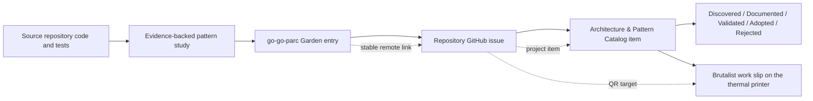

# Playbook: Creating GitHub Issues and Software Design Garden Entries

An interesting architecture pattern should not disappear into an agent transcript or become an issue that says only “consider refactoring this.” The durable workflow has three linked artifacts:

1. an evidence-backed design entry in the go-go-parc Software Architecture Garden;
2. a stable public link to that entry, normally through the published vault at `https://parc.yolo.scapegoat.dev/`;
3. a repository issue that makes the idea visible to maintainers of the source project;
4. a GitHub Projects item in the Architecture & Pattern Catalog so the idea can be compared with patterns from other repositories.

This playbook is for agents that discover a reusable structure while inspecting a repository: a bounded dispatcher, a snapshot fence, a host-owned effect boundary, a durable evidence protocol, a state-machine supervisor, or another design whose value extends beyond one function.

> [!summary]
> - Document the invariant before naming the pattern.
> - Ground every important claim in source code, tests, history, or operational artifacts.
> - Publish the Garden note before creating the issue so the issue can link to a stable remote document; prefer the public PARC URL when available.
> - Add the issue to the Architecture & Pattern Catalog and set its maturity status explicitly.
> - Verify the note, public link, issue, and project item independently; GitHub issue creation does not automatically create a project item or set its fields.

## 1. What this workflow is for

Use this workflow when the discovery is primarily architectural knowledge rather than an immediate implementation task. The output should help a future engineer answer:

```text
What problem does this structure solve?
What is the concrete shape in the source repository?
Which invariant makes it valuable?
What are the costs and failure modes?
Where else might the pattern apply?
What evidence would make the pattern more mature?
```

Examples of suitable discoveries:

- a bounded asynchronous observer that intentionally trades completeness for producer isolation;
- a snapshot-before-live protocol that uses a prefix cut and a buffered suffix;
- a controller that reconciles desired state against durable process evidence;
- a host-owned effect interpreter that keeps serialized intent separate from runtime authority;
- a state machine whose effect acknowledgments define legal lifecycle transitions;
- a transaction that combines a human confirmation boundary with revision and evidence checks.

Do not use this workflow merely because a source file is large, because a TODO exists, or because a refactor would be convenient. A Garden entry must explain a reusable design and the law it protects. If the work is only “fix this bug,” create a normal implementation issue instead, and add a Garden entry only if the bug reveals a broader pattern.

## 2. The artifact model

The artifacts have different jobs and lifecycles.



The thermal work slip is optional but recommended: a small, physical concept
card that distills the pattern (law, names, math, fix) and carries a QR code
linking to the repository issue, which in turn links onward to the Garden
note. It is a blackboard/index-card artifact for reasoning about the pattern
away from a screen, not a status log of the work that produced it.

| Artifact | Purpose | Owner | Typical content |
|---|---|---|---|
| Garden entry | Durable explanation and cross-project vocabulary | go-go-parc vault | architecture, theory, implementation details, invariants, risks, references |
| Public note URL | Stable reader-facing link to the vault document | PARC publication site | `/note/<slugified vault path>`; preferred issue link |
| Repository issue | Maintainer-visible research/design proposal | source repository | concise statement, evidence paths, questions, next steps, Garden link |
| Project item | Cross-repository catalog and maturity tracking | GitHub Project | status, labels, provenance, future comparison |
| Work slip | Physical concept card for offline reasoning | thermal printer + archived YAML | task/label header, h1 pattern title, one-line law, phase checklist, facts, QR to the issue |

A repository issue is not a Garden entry. A project item is not an issue. The same idea is represented three times because each location answers a different organizational question.

### 2.1 The Architecture & Pattern Catalog

The current catalog is [Go-Go-Golems Architecture & Pattern Catalog](https://github.com/orgs/go-go-golems/projects/3). Its intended status values are:

| Status | Meaning |
|---|---|
| **Discovered** | A pattern has been observed, but the design entry or evidence is incomplete. |
| **Documented** | A Garden entry and repository issue explain the pattern with concrete evidence. |
| **Validated** | Multiple consumers, tests, formal analysis, or operational evidence support the stated invariant. |
| **Adopted** | The pattern is intentionally used as ecosystem guidance in another project or shared component. |
| **Rejected** | Comparison or implementation evidence shows that the proposed generalization should not be adopted. |

Do not skip directly to `Adopted`. A well-written candidate can remain `Documented` for a long time. Maturity is an evidence claim, not a reward for writing a long note.

## 3. Agent prerequisites and safety checks

Before inspecting or mutating anything, establish the repositories and identities involved.

### 3.1 Inspect the current session and checkout

```bash
env | sort | grep '^PI_AGENT_' || true
pwd
git status --short --branch
git remote -v
```

Record:

- source repository path and remote;
- current branch and commit;
- whether the source worktree is clean;
- Garden repository path and branch;
- the session ID if the project catalog records provenance.

Do not mix source-code changes with the documentation workflow unless the user explicitly asks for both. If source changes are already present, preserve them and mention the state in the note; do not stage them accidentally with Garden files.

### 3.2 Verify GitHub authentication

```bash
gh auth status
gh api user --jq '{login, id}'
```

Project operations require Project permissions in addition to repository access. If needed:

```bash
gh auth refresh -h github.com -s repo,project,read:org
```

Never put a token, cookie, private key, or credential-bearing URL in a Garden entry or issue body.

### 3.3 Define explicit coordinates

Use variables instead of relying on the current directory or an implicit project:

```bash
SOURCE_OWNER=go-go-golems
SOURCE_REPO=sessionstream
SOURCE_REPOSITORY="$SOURCE_OWNER/$SOURCE_REPO"
GARDEN_ROOT=/home/manuel/code/wesen/go-go-golems/go-go-parc
GARDEN_PROJECT_DIR="$GARDEN_ROOT/Research/Software Architecture Garden/$SOURCE_REPO"
CATALOG_OWNER=go-go-golems
CATALOG_PROJECT=3
PUBLISHED_VAULT_BASE=https://parc.yolo.scapegoat.dev
```

The exact source repository and Garden project directory may differ. Explicit variables make the commands auditable and prevent publishing an issue to the wrong repository.

## 4. Decide whether the discovery is a pattern

Use this test before writing:

```text
Can I name the problem without naming the implementation file?
Can I state one invariant or separation of responsibility?
Can I describe when the pattern does and does not apply?
Can I point to at least two concrete implementation details?
Can I identify one failure mode or tradeoff?
Can another repository plausibly implement the same law differently?
```

If most answers are no, keep the material as a code review note, implementation diary, or project report. If the answers are yes, it is a Garden candidate.

### 4.1 Separate pattern from mechanism

Do not name a pattern after a package or class when the reusable idea is broader.

```text
Weak:  “observer.go has a channel”
Better: “bounded asynchronous diagnostic delivery isolates callback latency”

Weak:  “the WebSocket sends a snapshot first”
Better: “a prefix cut and live suffix fence reconnect delivery”

Weak:  “this method has a mutex”
Better: “admission and close share one linearization boundary”
```

The mechanism belongs in the implementation section. The title and pattern statement should name the protected invariant.

### 4.2 Do not overgeneralize

A pattern is not automatically ecosystem guidance. Record the maturity honestly:

- one implementation with strong evidence: `Candidate` in the Garden and `Documented` in the catalog;
- multiple independent implementations with the same invariant: consider `Validated`;
- deliberate reuse with reduced cost or prevented failure: consider `Adopted`.

Document why a superficially similar implementation is *not* the same pattern. Distinguishing “same code shape” from “same invariant” is one of the most valuable parts of the Garden.

## 5. Gather evidence before writing

The Garden workflow is evidence-first. Do not write conclusions from filenames or comments alone.

### 5.1 Map the source repository

```bash
cd /path/to/source/repository
rg --files pkg internal cmd test tests examples | sort | head -300
rg -n "Observer|Dispatcher|snapshot|replay|cursor|projection|reconcile|state machine|trace" . -S
```

Then inspect the relevant implementation and tests completely enough to understand ownership and lifecycle:

```bash
wc -l path/to/key/file.go path/to/key_test.go
nl -ba path/to/key/file.go | sed -n '1,260p'
nl -ba path/to/key_test.go | sed -n '1,260p'
```

Use the `read` tool for file contents when working as a Pi agent; use `rg` and `nl` for discovery and line-oriented evidence. Do not cite a symbol you have not read.

### 5.2 Prefer evidence in this order

1. Runtime code and public interfaces.
2. Tests that assert behavior.
3. Active consumers and integration wiring.
4. Build, release, and deployment artifacts.
5. Design documents and implementation diaries.
6. Git history explaining a migration or failure.
7. Comments and names, only when stronger evidence is unavailable.

A comment saying “temporary” is evidence of intent, not proof that the code is unused. Search call sites and inspect tests before classifying something as dead or transitional.

### 5.3 Build an evidence ledger

Before drafting, keep a small table like this in your working notes:

| Claim | Evidence | Confidence | Caveat |
|---|---|---|---|
| Producers do not wait for callback execution | `observer.go`, bounded `select` | High | Producers still briefly contend on admission mutex |
| Accepted values drain on close | worker loop plus shutdown test | High | Callback must return |
| Snapshot represents one database prefix | separate cursor/row reads | Low/partial | Transport fence is strong; DB cut may not be atomic |
| Pattern is reusable | comparison with another repository | Medium | Same shape may protect a different invariant |

This prevents the note from quietly turning hypotheses into facts.

### 5.4 Inspect existing Garden material

```bash
find "$GARDEN_PROJECT_DIR" -maxdepth 2 -type f -print | sort
```

Read:

- the project `README.md`;
- two or three nearby design entries;
- any existing entry with the same pattern vocabulary;
- the Architecture Garden index when adding a new project or design family.

The goal is not to copy old conclusions. It is to preserve naming, frontmatter, link shape, and maturity vocabulary, and to avoid creating a duplicate note when a focused follow-up or update is more appropriate.

### 5.5 Choose a new entry or an update

Use append-only behavior by default:

- create a new dated/follow-up design when the new material is a distinct pattern or materially extends the design;
- update the existing entry only when the user explicitly asks for an update or when the existing note is clearly the canonical living entry;
- do not overwrite historical analysis merely to add a new issue link.

For a project with numbered design entries, inspect the highest existing number and use the next number only after confirming it is not already present:

```bash
find "$GARDEN_PROJECT_DIR/designs" -maxdepth 1 -type f -printf '%f\n' | sort -V
```

A title should name the invariant, not the task. Examples:

```text
04 - Observer as Diagnostic Projection and Refinement Boundary.md
05 - Snapshot Cuts and Live Suffixes.md
06 - Reconciliation from Durable Process Evidence.md
```

## 6. Write the Garden entry

Use the Garden's Obsidian Markdown conventions:

- YAML frontmatter first;
- stable `title`, `aliases`, `status`, `type`, `created`, repository metadata, tags, and related links;
- a short opening statement;
- a `> [!summary]` callout;
- prose-first sections;
- fenced code and Mermaid diagrams where they clarify the design;
- Obsidian wikilinks for notes inside the vault;
- ordinary Markdown links for GitHub and other external URLs.

### 6.1 Recommended frontmatter

```yaml
---
title: Observer as Diagnostic Projection and Refinement Boundary
aliases:
  - Sessionstream observer architecture
  - Diagnostic observer dispatcher pattern
status: candidate
type: architecture-garden-design
created: 2026-08-13
analyzed: 2026-08-13
repository: /absolute/path/to/source/repository
repository_remote: https://github.com/org/repository
source_pull_request: https://github.com/org/repository/pull/123
published_note_url: https://parc.yolo.scapegoat.dev/note/research/software-architecture-garden/repository/designs/04-pattern-name
repository_note_url: https://github.com/go-go-golems/go-go-parc/blob/main/Research/Software%20Architecture%20Garden/repository/designs/04%20-%20Pattern%20Name.md
tags:
  - architecture-garden
  - observer-pattern
  - concurrency
  - go
related_files:
  - /absolute/path/to/source/file.go
related_notes:
  - "[[Research/Software Architecture Garden/repository/README|Repository architecture study]]"
---
```

Add `published_note_url`, `repository_note_url`, `tracking_issue`, and `architecture_catalog` after those URLs exist. Prefer the published PARC URL for external links; retain the GitHub URL as source provenance. It is acceptable to write the first version, publish it, create the issue, and then make a small metadata follow-up commit.

### 6.2 Recommended content structure

A detailed pattern entry should normally contain:

1. **Why this note exists** — the triggering discovery and the question it preserves.
2. **Pattern statement** — one paragraph naming the reusable structure and its boundary.
3. **Concrete architecture** — packages, interfaces, data flow, ownership, and lifecycle.
4. **Implementation details** — real symbols, pseudocode, diagrams, and ordering points.
5. **Behavioral contract** — explicit guarantees and non-guarantees.
6. **Mathematical/CS foundations** — only the theory that illuminates the implementation.
7. **Design-pattern vocabulary** — names such as Observer, Mailbox, Bulkhead, Reducer, or Refinement Mapping, with careful boundaries.
8. **Why alternatives are wrong** — direct callbacks, unbounded queues, hidden retries, implicit ordering, or other tempting substitutions.
9. **Failure modes and tricky details** — concrete bugs, review findings, race conditions, ownership hazards, or evidence gaps.
10. **Testing and verification** — existing tests and future validation strategy.
11. **Applicability and non-applicability** — when to reuse and when not to.
12. **Candidate ecosystem guidance** — short rules that can be compared with other projects.
13. **Open questions** — unresolved design and validation work.
14. **Evidence and references** — source paths, tests, PRs, related Garden notes, and theory references.

The note should teach a future engineer how to rebuild or safely modify the design, not merely report that an agent found it.

### 6.3 Include the invariant

Every pattern statement should be reducible to a law. Examples:

```text
Accepted diagnostic items are delivered in admission order, but overflow may drop items.

A snapshot describes a prefix cut; live delivery begins strictly after that cut.

A reducer changes state only through typed inputs and returns ordered effect requests.

A repository's desired state is changed only after durable evidence identifies the owned current process.
```

If the note has no law, it is probably a component description rather than a design pattern.

### 6.4 Include the negative space

A good design entry says what it does **not** guarantee:

```text
FIFO admission is not timestamp order.
A callback panic recovery is not rollback.
A runtime trace is not proof of client rendering.
A project item is not a repository issue.
A schema registry is not authorization.
A snapshot fence is not automatically a database-consistent cut.
```

Negative claims prevent future readers from extending the pattern past its evidence.

### 6.5 Use theory as explanation, not decoration

Mathematics is useful when it names a real property of the implementation. Good choices include:

- free-monoid words for append-only histories and accepted subsequences;
- labeled transition systems for lifecycle states and actions;
- linearizability for a concurrent operation's effect point;
- happens-before for mutex/channel/completion synchronization;
- safety and liveness for “never bad” versus “eventually good under assumptions”;
- refinement mappings for concrete runtime state versus abstract model state;
- partial orders for concurrent traces that do not have one honest total chronology.

Do not add equations merely to make a note look formal. Define the symbols, connect them to code, and state what the model abstracts away.

## 7. Publish the Garden note safely

The issue should link to a stable remote note. Therefore publish the intended Garden document before creating the issue. There are two valid publication targets:

1. **Preferred:** the public PARC vault site, `https://parc.yolo.scapegoat.dev/`.
2. **Fallback:** the `go-go-parc` GitHub repository's `main` branch.

The public PARC URL is the reader-facing link and does not require exposing the vault's repository path in the issue. A GitHub URL is useful as source provenance and fallback when the publication site is unavailable or the note has not yet been published.

### 7.1 Review the exact diff

```bash
cd "$GARDEN_ROOT"
git diff --check
git status --short --branch
git diff -- "Research/Software Architecture Garden/$SOURCE_REPO"
```

If the vault worktree contains unrelated generated artifacts, do not clean or delete them without permission. Stage only the intended note and any deliberate index update:

```bash
git add -- \
  "Research/Software Architecture Garden/$SOURCE_REPO/designs/04 - Pattern Name.md" \
  "Research/Software Architecture Garden/$SOURCE_REPO/README.md"

git diff --cached --stat
git diff --cached --name-only
```

The staged file list is a safety gate. It must not include `.obsidian/`, transcripts, generated PDFs, source-repository files, or unrelated local changes.

### 7.2 Commit and push

```bash
git commit -m "Document <pattern> architecture"
git push origin main
git log -1 --format='%H %s'
```

If the vault uses a different branch or protected push workflow, follow that repository's established process. The issue must not link to a local filesystem path as its only reference.

### 7.3 Construct the remote note URL

GitHub URLs must encode spaces and punctuation in the path. For example:

```text
https://github.com/go-go-golems/go-go-parc/blob/main/Research/Software%20Architecture%20Garden/sessionstream/designs/04%20-%20Observer%20as%20Diagnostic%20Projection%20and%20Refinement%20Boundary.md
```

Prefer the published PARC URL in the issue. If the note is not yet visible there, use the pushed GitHub URL or wait for publication; do not claim that a local-only note is public.

### 7.4 Construct a published PARC vault URL

The published vault uses a simple slugification of the vault-relative Markdown path:

```text
vault path:
Research/Software Architecture Garden/sessionstream/designs/04 - Observer as Diagnostic Projection and Refinement Boundary.md

published URL:
https://parc.yolo.scapegoat.dev/note/research/software-architecture-garden/sessionstream/designs/04-observer-as-diagnostic-projection-and-refinement-boundary
```

Slugification rules:

1. remove the `.md` extension;
2. preserve `/` path separators;
3. lowercase each path segment;
4. replace spaces and underscores with `-`;
5. collapse repeated hyphens;
6. remove punctuation that is not part of a safe slug.

A shell sketch for the common filename/path shape is:

```bash
VAULT_RELATIVE='Research/Software Architecture Garden/sessionstream/designs/04 - Observer as Diagnostic Projection and Refinement Boundary.md'

PARC_SLUG=$(printf '%s' "$VAULT_RELATIVE" \
  | sed -E 's/\\.md$//; s/[^A-Za-z0-9/]+/-/g; s/-+/-/g; s#/-#/#g; s#-/#/#g' \
  | tr '[:upper:]' '[:lower:]')

PUBLIC_NOTE_URL="https://parc.yolo.scapegoat.dev/note/$PARC_SLUG"
printf '%s\\n' "$PUBLIC_NOTE_URL"
```

The exact published path is part of the issue's evidence. Verify it before using it:

```bash
curl --fail --silent --show-error --location "$PUBLIC_NOTE_URL" >/tmp/garden-note.html
```

If publication is asynchronous, wait for the site to expose the note or use the GitHub fallback temporarily and update the issue after publication. Do not guess a URL and leave an unverified link in a repository issue.

### 7.5 Choose the issue link

Use one stable public link in the issue body:

```bash
# Preferred when the note is published:
GARDEN_NOTE_URL="$PUBLIC_NOTE_URL"

# Fallback when only the repository copy is available:
GARDEN_NOTE_URL='https://github.com/go-go-golems/go-go-parc/blob/main/Research/Software%20Architecture%20Garden/...md'
```

The Garden frontmatter may contain both `published_note_url` and `repository_note_url` so readers can move between the public rendering and source Markdown. The issue normally needs only the public URL plus the source PR/commit.

## 8. Create the repository issue

Create one issue in the repository that owns the implementation or the design question. The issue should be readable without opening the full note, but it should not duplicate all 900 lines of a detailed study.

### 8.1 Write the issue body to a file

Using a body file avoids shell quoting problems with Markdown backticks, dollar signs, Mermaid syntax, and multiline prose.

```bash
cat > /tmp/pattern-issue.md <<'EOF'
## Architecture Garden entry

Detailed design entry: [Pattern Name](GARDEN_NOTE_URL)

This issue records a reusable architecture idea discovered in this repository and proposes tracking it in the Architecture & Pattern Catalog.

## Pattern

One concise paragraph: what problem is solved, what invariant is protected, and what the pattern deliberately does not promise.

## Concrete evidence

- `path/to/implementation.go`: symbols and ownership boundary.
- `path/to/implementation_test.go`: behavior asserted by tests.
- `path/to/related.go`: integration or lifecycle evidence.

## Design questions

- What should be standardized, if anything?
- Which parts are repository-specific?
- What evidence would move the idea from Documented to Validated?

## Applicability boundary

State where this pattern is appropriate and explicitly list correctness-critical paths where it must not be used.

## Related work

- Source PR or implementation commit.
- Related Garden notes.
EOF
```

Replace `GARDEN_NOTE_URL` before submission. Do not leave placeholder URLs in a created issue.

### 8.2 Issue title and labels

A useful title says what is being studied:

```text
[Architecture] Observer as diagnostic projection and refinement boundary
[Architecture] Snapshot cuts and live suffixes
[Architecture] Durable evidence for process ownership
```

Use an existing repository label when possible. For Garden studies, `documentation` is usually appropriate when the issue's primary purpose is recording and comparing a design. Use `enhancement` only when the issue requests implementation work. Do not create a new label for every pattern.

### 8.3 Create the issue and capture the URL

```bash
ISSUE_URL=$(gh issue create \
  --repo "$SOURCE_REPOSITORY" \
  --title "[Architecture] <pattern title>" \
  --body-file /tmp/pattern-issue.md \
  --label documentation)

printf '%s\n' "$ISSUE_URL"
```

If `gh issue create` returns an error, do not retry blindly. Check whether GitHub created the issue despite a client-side failure:

```bash
gh issue list --repo "$SOURCE_REPOSITORY" --state open --limit 20 \
  --json number,title,url
```

Avoid duplicate issues. If a prior issue exists, update or comment on it rather than creating another one unless the design scope is genuinely different.

### 8.4 Verify the issue

```bash
gh issue view "$ISSUE_URL" \
  --repo "$SOURCE_REPOSITORY" \
  --json number,title,url,state,labels,body
```

Check:

- the Garden URL resolves to the published note or verified GitHub source copy;
- source paths are correct;
- no local secrets or private data leaked into the body;
- the title and label reflect research/design rather than a falsely committed implementation;
- the issue states open questions instead of pretending that every design decision is settled.

## 9. Add the issue to the Architecture & Pattern Catalog

Adding an issue to a repository does not add it to a project. Perform the project operation explicitly.

### 9.1 Inspect project metadata first

```bash
CATALOG_PROJECT_ID=$(gh project view "$CATALOG_PROJECT" \
  --owner "$CATALOG_OWNER" \
  --format json --jq .id)

gh project view "$CATALOG_PROJECT" \
  --owner "$CATALOG_OWNER" \
  --format json

gh project field-list "$CATALOG_PROJECT" \
  --owner "$CATALOG_OWNER" \
  --format json
```

Do not assume project number, owner, field ID, or status option IDs are stable across projects. Field IDs and option IDs are installation-specific.

For the current Architecture & Pattern Catalog, the status field has these options:

```text
Discovered  0ea75e44
Documented  1924619e
Validated   7feb7248
Adopted     d9390b5b
Rejected    9826202e
```

Resolve them from `gh project field-list` when possible, and use the literal IDs only after verifying that the target project is still the same.

### 9.2 Add the issue

```bash
ITEM_JSON=$(gh project item-add "$CATALOG_PROJECT" \
  --owner "$CATALOG_OWNER" \
  --url "$ISSUE_URL" \
  --format json)

ITEM_ID=$(printf '%s' "$ITEM_JSON" | jq -r .id)
: "${ITEM_ID:?project item ID was not returned}"
```

The following IDs are different objects:

| ID | Meaning |
|---|---|
| Issue number, such as `14` | Human-facing repository issue number. |
| Issue node ID | GitHub's issue object identity. |
| Project item ID, such as `PVTI_...` | This issue's occurrence on one project. |
| Project ID, such as `PVT_...` | The project container. |
| Field ID, such as `PVTSSF_...` | A field definition in that project. |
| Option ID, such as `1924619e` | One single-select value in a field. |

Do not pass an issue number where `gh project item-edit` expects a project item ID.

### 9.3 Set maturity status

Resolve the status field and the desired option. For a complete Garden note and issue, use `Documented`; for an incomplete discovery, use `Discovered`.

```bash
FIELDS_JSON=$(gh project field-list "$CATALOG_PROJECT" \
  --owner "$CATALOG_OWNER" \
  --format json)

STATUS_FIELD_ID=$(printf '%s' "$FIELDS_JSON" | jq -r \
  '.fields[] | select(.name == "Status") | .id')
DOCUMENTED_OPTION_ID=$(printf '%s' "$FIELDS_JSON" | jq -r \
  '.fields[] | select(.name == "Status")
   | .options[] | select(.name == "Documented") | .id')

: "${STATUS_FIELD_ID:?Status field not found}"
: "${DOCUMENTED_OPTION_ID:?Documented option not found}"

gh project item-edit \
  --id "$ITEM_ID" \
  --project-id "$CATALOG_PROJECT_ID" \
  --field-id "$STATUS_FIELD_ID" \
  --single-select-option-id "$DOCUMENTED_OPTION_ID" \
  --format json
```

If the project has custom provenance fields, populate them using the same `item-edit` operation and explicit field IDs. The [GitHub Project Provenance Tracking playbook](github-project-provenance-tracking) documents that workflow.

### 9.4 Decide whether to add provenance

For a research issue, useful catalog fields can include:

- Garden note URL or commit;
- docmgr ticket, if one exists;
- Pi session ID;
- source repository and working directory;
- source commit or pull request;
- implementation/validation issue.

Do not invent a docmgr ticket. Use `N/A` only when the absence is intentional and the project convention allows it. Do not put a local path in a public issue if it reveals sensitive information; a private project field may be safer.

## 10. Verify all artifacts

Run independent checks for the note, its public URL, the repository issue, and the project item. A successful mutation command is not evidence that the final state is correct.

### 10.1 Verify the Garden publication

```bash
GARDEN_NOTE='Research/Software Architecture Garden/sessionstream/designs/04 - Observer as Diagnostic Projection and Refinement Boundary.md'

git -C "$GARDEN_ROOT" status --short --branch
git -C "$GARDEN_ROOT" log -1 --format='%H %s'
git -C "$GARDEN_ROOT" show "HEAD:$GARDEN_NOTE" | sed -n '1,45p'
```

When using the GitHub fallback, confirm the pushed source URL in a browser or through GitHub's contents API:

```bash
gh api "repos/go-go-golems/go-go-parc/contents/$GARDEN_NOTE" \
  --jq '{path, html_url, sha}'
```

When using the preferred PARC publication, verify the reader-facing page too:

```bash
PUBLIC_NOTE_URL='https://parc.yolo.scapegoat.dev/note/research/software-architecture-garden/sessionstream/designs/04-observer-as-diagnostic-projection-and-refinement-boundary'
curl --fail --silent --show-error --location "$PUBLIC_NOTE_URL" >/tmp/garden-note.html
```

Check the rendered page title or note text when a successful HTTP response could still be a generic site shell.

### 10.2 Verify the issue

```bash
gh issue view "$ISSUE_URL" \
  --repo "$SOURCE_REPOSITORY" \
  --json number,title,url,state,labels
```

### 10.3 Verify the project item and status

```bash
gh project item-list "$CATALOG_PROJECT" \
  --owner "$CATALOG_OWNER" \
  --format json \
  --limit 1000 \
  --jq '.items[]
    | select(.content.url == "'"$ISSUE_URL"'")
    | {id, title, status, repository, labels}'
```

The expected result has:

```text
one matching project item
repository = source repository
status = Documented (or the deliberately selected maturity)
issue label present when applicable
```

If the project item is missing, add it. If it is duplicated, delete only the unintended project item after confirming the underlying issue should remain open.

## 10.5 Print a concept work slip (optional but recommended)

Once the issue and catalog item exist, print a brutalist work slip so the
pattern can be reasoned about on a blackboard. Use the `plan` mode of the
`brutalist-work-slip` skill: its phase-checklist shape reads as a concept
card, and its `--url` carries a QR to the repository issue (which links
onward to the Garden note). Do **not** use `status` mode for a pattern card —
`status` is a work-progress log (what I did / tricky / next + a commit QR);
`plan` is a concept index card (law / names / math / fix + an issue QR).

Load the skill for the exact flag reference; the shape is:

```bash
python3 ~/.pi/agent/skills/brutalist-work-slip/scripts/work_slip.py plan \
  --task SENTINEL \
  --label CONCEPT \
  --title "Sentinel-Delimited Command Completion" \
  --summary "Inject an echo marker into a line queue you can't reframe; split output on it. A constant sentinel is a delimiter, not a correlation id." \
  --phase "LAW: delimiter, not correlation id" \
  --phase "names: sentinel / flag-byte / echo marker" \
  --phase "math: FIFO + monoid split; pos vs value" \
  --phase "fix: per-command nonce OR quarantine timeout" \
  --phase "motion: at-most-once; timeout = unknown" \
  --phase "use: unreframable line queue, no prompt" \
  --next "full Garden note (see QR)" \
  --fact NAMES="in-band sentinel signaling" \
  --fact MATH="1 - e^(-n*p_t*p_l) desync" \
  --fact FIX="nonce | quarantine + resync" \
  --url https://github.com/<owner>/<repo>/issues/<n> \
  --dry-run-remote
```

Rules specific to a *concept* card (vs. a status slip):

- `--task`: a short pattern tag (≤ ~14 chars), e.g. `SENTINEL`, `LATCH`, `DEADMAN`.
- `--label`: `CONCEPT` (distinguish it from the `STATUS`/`STEP N` of a work slip).
- `--phase`: the reusable idea's load-bearing points — the law, the names it
  travels under, the math, the fix, the applicability — not what the agent did.
- `--url`: the **repository issue** URL, not the commit. The issue links
  onward to the Garden note; the QR is the bridge from the physical card to
  the full writeup.
- `--fact`: short `KEY=VALUE` rows for the facts a reader manipulates at a
  glance (`NAMES`, `MATH`, `FIX`).

Workflow:

1. `--dry-run-remote` to validate without wasting paper.
2. Print for real (the default, drop `--dry-run-remote`).
3. Archive the generated YAML with `--out` into the *source repository's*
  docmgr ticket `scripts/` dir (e.g. `ttmp/.../scripts/NN-work-slip-<pattern>-concept.yaml`), so the card is reproducible from the repo that owns the pattern. Do not archive it into the Garden vault — the vault is for the note, the slip is for the source project.
4. Optionally `docmgr changelog update` the ticket noting the slip was printed.

A successful print reports `printed: yes`. Verify the QR resolves to the issue.

## 11. A complete worked example

This is the sequence used for the Sessionstream observer study. It is an example, not a set of IDs to copy into another project.

### 11.1 Garden entry

```text
Research/Software Architecture Garden/sessionstream/designs/
  04 - Observer as Diagnostic Projection and Refinement Boundary.md
```

The entry documented bounded FIFO admission, ownership transfer, panic isolation, close/drain/wait lifecycle, model and interval trace streams, labeled transition systems, free-monoid histories, linearizability, happens-before, partial orders, safety/liveness, and refinement mappings.

The note is published at:

```text
https://parc.yolo.scapegoat.dev/note/research/software-architecture-garden/sessionstream/designs/04-observer-as-diagnostic-projection-and-refinement-boundary
```

The GitHub source copy was also committed and pushed before issue creation:

```text
8e3df5f Link observer architecture catalog issue
```

### 11.2 Repository issue

```text
https://github.com/go-go-golems/sessionstream/issues/14
```

The issue links to the pushed Garden note, references PR #13, summarizes the concrete files and invariants, and lists open questions. It carries the `documentation` label.

### 11.3 Catalog item

The issue was added to project #3 and set to `Documented`. The final verification selected the project item by issue URL rather than assuming that issue number and item ID were interchangeable.

This example demonstrates the complete relationship:

```text
Garden note in vault
  → published PARC URL
  → repository issue #14
  → project item PVTI_...
  → Status: Documented
```

The GitHub `go-go-parc` URL remains useful as source provenance, but the public PARC URL is the preferred issue link.

### 11.4 Work slip

A `CONCEPT` work slip was printed for each pattern: `SENTINEL`, `LATCH`,
`DEADMAN` — one card per reusable idea, QR to the repository issue, layout
archived to the source repo's docmgr `scripts/` dir. The cards are the
blackboard artifacts; the issue/Garden note is the depth behind each QR.

## 12. Common failure modes

### 12.1 Writing only a local path into the issue

A path such as `/home/manuel/code/.../note.md` is useful to the local agent but not to a repository maintainer. Publish the note and link the PARC URL. Use the GitHub source URL as a fallback, and keep the absolute path in Garden metadata if it is useful locally.

### 12.2 Creating the issue before the note is published

The issue then contains a placeholder or broken URL. Publish the note to PARC first, or push the `go-go-parc` source copy and use its URL as a fallback. If publication is asynchronous, create the issue only after either stable URL is available, or update the issue immediately after publication.

### 12.3 Guessing the PARC slug

The published URL is simple but must be verified. Lowercase the vault-relative path, remove `.md`, preserve path separators, and normalize punctuation. Do not assume a URL exists merely because the local note exists; verify the rendered page with `curl` and inspect the response content.

### 12.4 Assuming issue creation adds the issue to the project

It does not. Run `gh project item-add` and verify the project list.

### 12.5 Assuming project status is automatic

A new item may have a default status or no status useful to the catalog. Set the status explicitly and verify it through `gh project item-list`.

### 12.6 Using stale field or option IDs

Project field IDs and single-select option IDs belong to a specific project. Always inspect `gh project field-list` before using IDs from another project or an old transcript.

### 12.7 Staging the entire vault

Vaults often contain unrelated transcript exports, generated artifacts, workspace settings, or another agent's changes. Stage only the intended Garden note and deliberate index files. The staged name list is mandatory before commit.

### 12.8 Treating a local directory as a file

`read` cannot read a directory as a file. Use `find` to discover files, then read the specific `README.md` or design entry. This is a small operational detail, but it commonly interrupts otherwise correct documentation work.

### 12.9 Creating a duplicate design entry

Search the project directory and related links before creating `01`, `02`, or `04`. If the existing entry already documents the pattern, add a dated follow-up or update the canonical entry rather than creating two competing definitions.

### 12.10 Marking an unvalidated idea as adopted

A beautiful explanation is not cross-project validation. Use `Documented` until another implementation, test suite, formal model, or operational result supports the same invariant.

### 12.11 Turning a design issue into an accidental implementation promise

Use language such as “study,” “candidate,” “proposed,” and “open question” when the issue is exploratory. Separate accepted design decisions from possible follow-up work. A catalog issue should not make maintainers believe that a generic package or refactor is already approved.

### 12.12 Putting secrets or sensitive local details in a public issue

Review the issue body as if it were public. Remove tokens, cookies, private URLs, personal data, raw environment dumps, and credential-bearing command output. Use a private project field or a local note for sensitive provenance.

### 12.13 Declaring a theoretical concern as a historical failure

Say "risk" or "open correctness obligation" when no concrete failure was observed. Say "failure" only when you can name the repository, code path, test, review comment, or command that demonstrates it.

### 12.14 Printing a status slip for a concept

A concept card uses `plan` mode (law/names/math/fix + an issue QR); a work
log uses `status` mode (did/tricky/next + a commit QR). Printing `status` for
a pattern produces a card about *the agent's work*, not about *the pattern* —
the wrong artifact for a blackboard. The two modes share the printer and the
script but answer different questions; choose by what the card is for, not
by which flags are familiar.

### 12.15 Archiving the slip into the Garden vault

The slip layout belongs in the **source repository's** docmgr `scripts/`
dir (the repo that owns the pattern), not in the Garden vault. The vault is
the durable explanation; the slip is a physical artifact whose reproducible
YAML is a courtesy kept with the pattern's source. Mixing slip YAML into the
vault clutters the staged-file safety gate of §7.1.

Say “risk” or “open correctness obligation” when no concrete failure was observed. Say “failure” only when you can name the repository, code path, test, review comment, or command that demonstrates it.

## 13. Agent checklist

Copy this checklist into a task plan or implementation diary:

```text
[ ] Confirm this is a reusable pattern, not only a local bug or TODO.
[ ] Inspect source code, tests, consumers, and relevant history.
[ ] Write an evidence ledger for major claims and caveats.
[ ] Inspect existing Garden README and nearby design entries.
[ ] Choose a non-duplicate title and maturity classification.
[ ] Write frontmatter, summary, invariant, concrete implementation, theory, failure modes, applicability, and references.
[ ] Stage only the intended Garden note/index files.
[ ] Review git diff --check and the staged file list.
[ ] Publish the Garden note to PARC, or commit/push the `go-go-parc` source copy as fallback.
[ ] Confirm the public PARC URL or verified GitHub source URL.
[ ] Write an issue body that links to the stable note URL and summarizes the design.
[ ] Create one labeled issue in the source repository.
[ ] Verify issue title, body, label, and Garden link.
[ ] Inspect target project ID, fields, and status options.
[ ] Add the issue URL to the Architecture & Pattern Catalog.
[ ] Set status explicitly: Discovered, Documented, Validated, Adopted, or Rejected.
[ ] Populate provenance fields only from explicit evidence.
[ ] Verify the project item by issue URL.
[ ] (Optional) Print a CONCEPT work slip: plan mode, --url = issue URL, --dry-run-remote then print.
[ ] Archive the slip YAML to the source repo's docmgr scripts/ dir, not the Garden vault.
[ ] Add published-note, source-note, tracking-issue, and catalog links back to the Garden note if desired.
[ ] Commit and push the metadata follow-up only when the vault source copy is the chosen publication/provenance path.
[ ] Report note path, public note URL, optional source commit, issue URL, project URL/status, slip status, and unresolved questions.
```

## 14. Final handoff format

A concise handoff should include:

```text
Garden entry:
  local path: ...
  public PARC URL: ...
  source repository URL (optional): ...
  commit (if source copy was pushed): ...

Repository issue:
  URL: ...
  label: ...

Architecture catalog:
  project: ...
  item: ...
  status: ...

Work slip (if printed):
  mode: plan (CONCEPT) | status (STATUS)
  QR target: <issue or commit URL>
  layout: <source repo scripts/ path>
  printed: yes/no

Evidence:
  source repository/commit: ...
  tests or validation run: ...

Open questions:
  - ...
```

This gives the next agent enough information to continue without reopening the entire session transcript.

## 15. Relationship to other playbooks

- [[github-project-provenance-tracking]] — populate project fields with docmgr, Pi session, and working-directory provenance.
- [[building-knowledge-base]] — classify and write reusable knowledge entries with evidence, prose-first style, and concrete gotchas.
- [[Research/Software Architecture Garden/README|Software Architecture Garden]] — the Garden's maturity vocabulary, evidence hierarchy, and comparison rules.
- [[Research/Software Architecture Garden/sessionstream/README|Architecture Garden — sessionstream]] — a concrete project study and design-entry index.
