# Playbook: GitHub Project Provenance Tracking for Agent Work

A GitHub issue records the requested work, but it does not automatically record where the request originated, which agent session investigated it, or which local checkout supplied the evidence. This playbook adds those facts to an organization-level GitHub Project using three text fields:

- `Docmgr ticket`
- `Agent Pi session`
- `Working directory`

The procedure also explains how to reset a project safely, enroll repository issues, populate fields through `gh`, and verify the resulting state. The reference board is [go-go-golems Project 1](https://github.com/orgs/go-go-golems/projects/1).

> [!summary]
> - Repository issues and project items are separate objects with separate lifecycles.
> - Provenance belongs in project fields because it describes the work item in an operational planning context.
> - Populate fields from explicit evidence: a docmgr ticket ID, `PI_AGENT_SESSION_ID`, and `PI_AGENT_CWD`.
> - Verify the final project state through structured JSON rather than relying on command success alone.

## 1. The data model

GitHub Projects v2 stores a project item that refers to issue content. A project may also contain draft issues, which exist only inside the project. Custom fields belong to the project item, not to the underlying repository issue.

```mermaid
flowchart LR
    ISSUE[Repository issue] --> ITEM[Project item]
    DRAFT[Draft issue] --> ITEM2[Project item]
    ITEM --> STATUS[Status]
    ITEM --> DOC[Docmgr ticket]
    ITEM --> SESSION[Agent Pi session]
    ITEM --> CWD[Working directory]

    style ISSUE fill:#243447,stroke:#5c88b0
    style ITEM fill:#263f2f,stroke:#61a273
    style DOC fill:#4a3822,stroke:#b48a50
    style SESSION fill:#4a3822,stroke:#b48a50
    style CWD fill:#4a3822,stroke:#b48a50
```



This distinction determines the correct operation:

| Intent | Operation |
|---|---|
| Finish real repository work | Close the repository issue. |
| Remove an issue from a planning board | Delete the project item. |
| Retire a project-only draft | Delete the draft's project item. |
| Preserve source context | Set custom fields on the project item. |

Deleting a project item does not close its repository issue. Closing a repository issue does not necessarily remove it from a project. A draft issue has no independent repository issue to close.

## 2. Prerequisites

The procedure requires GitHub CLI access with repository and Projects permissions:

```bash
gh auth status
```

If project commands report missing scopes, refresh authentication:

```bash
gh auth refresh -h github.com -s read:project,project
```

GitHub may request device authorization. Complete it before continuing.

For Pi provenance, inspect the environment:

```bash
env | sort | grep '^PI_AGENT_'
```

The required values are:

```text
PI_AGENT_SESSION_ID   stable identifier of the Pi session
PI_AGENT_CWD          working directory associated with the session
```

`PI_AGENT_SESSION_FILE` is useful for audit and transcript recovery, but the board field should normally store the shorter session ID.

### 2.1 Claude Code sessions

Claude Code does not export a session ID in the environment (only `CLAUDE_CODE_ENTRYPOINT` and `CLAUDE_CODE_MESSAGING_SOCKET` are set). The session ID is the UUID that names the transcript file under the per-project directory:

```bash
ls -t ~/.claude/projects/$(pwd | sed 's#/#-#g')/*.jsonl | head -1
# e.g. ~/.claude/projects/-home-manuel-code-wesen-go-go-golems-esp32-s3-m5/6356eb91-e077-4a86-a666-db446c46efc0.jsonl
```

The same UUID appears in the session's scratchpad path (`/tmp/claude-1000/<slugged-cwd>/<uuid>/scratchpad`), which is what the agent itself can see. Record it in the `Agent Pi session` field with an explicit prefix so it is not mistaken for a Pi ID:

```text
claude-code:6356eb91-e077-4a86-a666-db446c46efc0
```

The working directory is the session's primary working directory (the directory whose slug names the transcript folder). If the field is renamed to a neutral `Agent session`, keep the prefix convention (`pi:` / `claude-code:`).

## 3. Inspect before mutating

Set the project coordinates explicitly:

```bash
OWNER=go-go-golems
PROJECT=1
```

Read the project, fields, and items:

```bash
gh project view "$PROJECT" --owner "$OWNER" --format json
gh project field-list "$PROJECT" --owner "$OWNER" --format json
gh project item-list "$PROJECT" --owner "$OWNER" --limit 1000 --format json
```

Save the item inventory before a destructive reset:

```bash
gh project item-list "$PROJECT" \
  --owner "$OWNER" \
  --limit 1000 \
  --format json > /tmp/project-items-before-reset.json
```

Review content types and issue locations:

```bash
jq -r '.items[] |
  [.id, .content.type, .content.repository,
   (.content.number // "-"), .title] | @tsv' \
  /tmp/project-items-before-reset.json
```

The inventory is the evidence needed to distinguish repository issues from draft tasks and to recover the intended scope if a command is constructed incorrectly.

## 4. Reset a project to a clean slate

A clean slate can mean two different things:

1. **Clear the board only.** Remove all project items but leave repository issues unchanged.
2. **Close the tracked work and clear the board.** Close underlying repository issues, then remove all project items.

Choose explicitly. The second operation changes repository state across potentially many repositories.

### 4.1 Close repository issues

For each item whose content type is `Issue`, close the underlying issue:

```bash
gh issue close ISSUE_NUMBER \
  --repo OWNER/REPOSITORY \
  --reason completed
```

A safe generated command list is:

```bash
jq -r '.items[] |
  select(.content.type == "Issue") |
  "gh issue close \(.content.number) --repo \(.content.repository) --reason completed"' \
  /tmp/project-items-before-reset.json
```

Review the generated commands before executing them. Do not close pull requests or unrelated linked content merely because it appears on a project.

### 4.2 Remove project items

Remove every item using its project item ID:

```bash
gh project item-delete "$PROJECT" \
  --owner "$OWNER" \
  --id PROJECT_ITEM_ID
```

For drafts, deletion is the complete retirement operation because there is no repository issue behind them.

### 4.3 Verify the reset

```bash
gh project item-list "$PROJECT" \
  --owner "$OWNER" \
  --limit 1000 \
  --format json \
  --jq '{totalCount, items}'
```

The expected clean state is:

```json
{"totalCount":0,"items":[]}
```

If repository issues were also closed, verify each one independently:

```bash
gh issue view ISSUE_NUMBER \
  --repo OWNER/REPOSITORY \
  --json state,url
```

## 5. Create provenance fields

Create the three fields as text fields:

```bash
gh project field-create "$PROJECT" \
  --owner "$OWNER" \
  --name 'Docmgr ticket' \
  --data-type TEXT

gh project field-create "$PROJECT" \
  --owner "$OWNER" \
  --name 'Agent Pi session' \
  --data-type TEXT

gh project field-create "$PROJECT" \
  --owner "$OWNER" \
  --name 'Working directory' \
  --data-type TEXT
```

Text is appropriate because:

- docmgr ticket identifiers are symbolic strings;
- Pi session IDs are UUID-like strings;
- local paths are arbitrary strings;
- none of the values belong to a small, centrally controlled option set.

Confirm names and IDs:

```bash
gh project field-list "$PROJECT" \
  --owner "$OWNER" \
  --format json
```

Field IDs are required when setting values. Names are used only to discover those IDs.

## 6. Add issues and populate provenance

The complete operation has four stages:

```text
issue URL
  → project item
  → resolve field IDs
  → set three text values
```

### 6.1 Resolve project and field IDs

```bash
PROJECT_ID=$(gh project view "$PROJECT" \
  --owner "$OWNER" \
  --format json \
  --jq .id)

FIELDS=$(gh project field-list "$PROJECT" \
  --owner "$OWNER" \
  --format json)

DOC_FIELD=$(printf '%s' "$FIELDS" | jq -r \
  '.fields[] | select(.name == "Docmgr ticket") | .id')
SESSION_FIELD=$(printf '%s' "$FIELDS" | jq -r \
  '.fields[] | select(.name == "Agent Pi session") | .id')
CWD_FIELD=$(printf '%s' "$FIELDS" | jq -r \
  '.fields[] | select(.name == "Working directory") | .id')
```

Fail before mutation if any field is absent:

```bash
: "${PROJECT_ID:?missing project ID}"
: "${DOC_FIELD:?missing Docmgr ticket field}"
: "${SESSION_FIELD:?missing Agent Pi session field}"
: "${CWD_FIELD:?missing Working directory field}"
: "${PI_AGENT_SESSION_ID:?missing PI_AGENT_SESSION_ID}"
: "${PI_AGENT_CWD:?missing PI_AGENT_CWD}"
```

### 6.2 Add an issue

```bash
ISSUE_URL=https://github.com/go-go-golems/ragkit/issues/7

ITEM_ID=$(gh project item-add "$PROJECT" \
  --owner "$OWNER" \
  --url "$ISSUE_URL" \
  --format json \
  --jq .id)
```

The returned `ITEM_ID` identifies the issue's occurrence on this project. It is not the issue node ID and not the issue number.

### 6.3 Set field values

```bash
DOCMGR_TICKET=RAGKIT-ARCH-001

# Use N/A only when no ticket exists and that absence is intentional.

gh project item-edit \
  --id "$ITEM_ID" \
  --project-id "$PROJECT_ID" \
  --field-id "$DOC_FIELD" \
  --text "$DOCMGR_TICKET"

gh project item-edit \
  --id "$ITEM_ID" \
  --project-id "$PROJECT_ID" \
  --field-id "$SESSION_FIELD" \
  --text "$PI_AGENT_SESSION_ID"

gh project item-edit \
  --id "$ITEM_ID" \
  --project-id "$PROJECT_ID" \
  --field-id "$CWD_FIELD" \
  --text "$PI_AGENT_CWD"
```

If no docmgr ticket exists, set the field to `N/A`. An explicit absence is distinguishable from a failed or forgotten field update.

## 7. Populate several issues in one session

Use one resolved project schema for the batch:

```bash
set -euo pipefail

OWNER=go-go-golems
PROJECT=1
REPOSITORY=go-go-golems/ragkit
DOCMGR_TICKET=N/A

PROJECT_ID=$(gh project view "$PROJECT" --owner "$OWNER" \
  --format json --jq .id)
FIELDS=$(gh project field-list "$PROJECT" --owner "$OWNER" --format json)
DOC_FIELD=$(printf '%s' "$FIELDS" | jq -r \
  '.fields[] | select(.name=="Docmgr ticket") | .id')
SESSION_FIELD=$(printf '%s' "$FIELDS" | jq -r \
  '.fields[] | select(.name=="Agent Pi session") | .id')
CWD_FIELD=$(printf '%s' "$FIELDS" | jq -r \
  '.fields[] | select(.name=="Working directory") | .id')

for NUMBER in 7 8 9; do
  URL="https://github.com/$REPOSITORY/issues/$NUMBER"
  ITEM_ID=$(gh project item-add "$PROJECT" \
    --owner "$OWNER" --url "$URL" --format json --jq .id)

  gh project item-edit --id "$ITEM_ID" --project-id "$PROJECT_ID" \
    --field-id "$DOC_FIELD" --text "$DOCMGR_TICKET"
  gh project item-edit --id "$ITEM_ID" --project-id "$PROJECT_ID" \
    --field-id "$SESSION_FIELD" --text "$PI_AGENT_SESSION_ID"
  gh project item-edit --id "$ITEM_ID" --project-id "$PROJECT_ID" \
    --field-id "$CWD_FIELD" --text "$PI_AGENT_CWD"
done
```

`set -euo pipefail` matters here. Without it, a missing field ID or failed item addition can allow later commands to continue with empty or stale values.

## 8. Verification

Read the project through the same API used to mutate it:

```bash
gh project item-list "$PROJECT" \
  --owner "$OWNER" \
  --limit 1000 \
  --format json
```

Select the fields relevant to provenance:

```bash
gh project item-list "$PROJECT" \
  --owner "$OWNER" \
  --limit 1000 \
  --format json |
jq '.items[] | {
  title,
  url: .content.url,
  docmgr_ticket: .["docmgr ticket"],
  pi_session: .["agent Pi session"],
  working_directory: .["working directory"]
}'
```

GitHub's JSON keys may reflect display-name capitalization inconsistently. Inspect one raw item before depending on an exact `jq` key spelling.

A completed verification proves:

- the intended issues are present;
- no unintended issues are present;
- every item has all three provenance values;
- the session and directory match the environment that created the issue;
- `N/A` appears only where no docmgr ticket exists.

## 9. Provenance semantics

Each field answers a different audit question.

### Docmgr ticket

This identifies the durable documentation workspace associated with the work. Store the ticket ID, not a transient document path:

```text
RAGKIT-ARCH-001
```

A ticket can contain design documents, diaries, tasks, changelog entries, and file relations. The project field provides the entry point into that record.

### Agent Pi session

This identifies the agent transcript that performed the investigation or created the issue:

```text
019ff829-68a3-7fea-8a3d-43c5209b3ddf            # Pi (PI_AGENT_SESSION_ID)
claude-code:6356eb91-e077-4a86-a666-db446c46efc0 # Claude Code (transcript UUID, see §2.1)
```

The session ID remains useful if session files move or are indexed into another transcript system.

### Working directory

This records the local workspace context:

```text
/home/manuel/workspaces/2026-08-12/deploy-dev-indexer
```

The value is machine-local by design. It distinguishes repositories, worktrees, dated workspaces, and concurrent extraction efforts that may share the same remote repository.

These fields record origin, not current ownership. If a later session implements the issue, preserve the creation provenance unless the project adopts a documented multi-session convention.

## 10. Failure modes

### Missing Projects scopes

Error:

```text
error: your authentication token is missing required scopes [read:project]
```

Fix:

```bash
gh auth refresh -h github.com -s read:project,project
```

### Confusing issue IDs and project item IDs

`gh project item-edit` requires the project item ID returned by `item-add`. An issue number such as `7` is not valid in its place.

### Closing issues when only board cleanup was intended

Project cleanup and repository closure are independent operations. Inventory content types, state the intended policy, and generate the close commands for review before executing them.

### Assuming drafts can be closed

Draft issues have no repository lifecycle. Remove their project items to retire them.

### Leaving missing provenance blank

A blank field is ambiguous. It can mean unavailable, not applicable, forgotten, or failed. Use `N/A` only after confirming that no value exists.

### Committing unrelated local files

The working directory is descriptive metadata, not permission to commit every local change. When documenting this workflow, stage only the intended note:

```bash
git add -- 'Research/playbooks/github-project-provenance-tracking.md'
```

## 11. Recommended operating procedure

For each agent-created issue:

1. Create or identify the docmgr ticket when the work has a ticketed documentation lifecycle.
2. Create the GitHub issue with evidence, scope, and acceptance criteria.
3. Add the issue to the organization project.
4. Populate the docmgr ticket, Pi session, and working-directory fields immediately.
5. Verify the project item through JSON output.
6. Preserve creation provenance when another session takes over implementation.
7. Close the repository issue only when its acceptance criteria are complete.
8. Remove or retain completed project items according to the board's explicit archival policy.

Immediate population is preferable to later backfilling. At issue-creation time, the agent already has authoritative access to `PI_AGENT_SESSION_ID`, `PI_AGENT_CWD`, and the current ticket context.

## 12. Completion checklist

- [ ] `gh auth status` shows Projects access.
- [ ] The project owner and number were confirmed.
- [ ] Existing items were inventoried before destructive cleanup.
- [ ] Repository issues were closed only when explicitly requested.
- [ ] Draft items were removed rather than treated as repository issues.
- [ ] `Docmgr ticket`, `Agent Pi session`, and `Working directory` exist as text fields.
- [ ] Every enrolled issue has all three values populated.
- [ ] Missing docmgr context is recorded explicitly as `N/A`.
- [ ] The final item list was verified through JSON.
- [ ] Scripts use project item IDs for field mutation.
- [ ] No unrelated repository or vault files were staged.

## 13. Add architecture and pattern catalog entries

Task tracking and pattern cataloging serve different lifecycles. Project 1 records work that should be completed. [Project 3](https://github.com/orgs/go-go-golems/projects/3) records reusable technical findings that should remain discoverable after any implementation issue is closed.

A catalog item should state a technical claim:

```text
Canonical logical records decouple artifact identity from physical storage
```

Do not phrase it as an implementation task:

```text
Refactor the index digest code
```

The task can live in Project 1 and reference the catalog item in its issue body. The catalog entry describes the abstraction, evidence, constraints, and known applications.

### Catalog schema

Project 3 uses:

| Field | Type | Values or meaning |
|---|---|---|
| `Status` | Single select | `Discovered`, `Documented`, `Validated`, `Adopted`, `Rejected` |
| `Pattern type` | Multi-select | `Abstraction`, `Data Structure`, `Algorithm`, `Invariant`, `Operational Pattern` |
| `Domain` | Multi-select | `RAG`, `Execution`, `Storage`, `CLI`, `UI`, `Agents`, `Infrastructure` |
| `Docmgr ticket` | Text | Associated research workspace or `N/A` |
| `Agent Pi session` | Text | Discovery session ID |
| `Working directory` | Text | Local checkout used for the study |

GitHub's GraphQL API supports `MULTI_SELECT`, including the `multiSelectOptionIds` update value. The installed `gh project field-create` command may not list this type, so multi-select creation and updates require `gh api graphql`.

### Write the catalog issue

Create a repository issue in the repository that owns the strongest evidence. Its body should contain:

1. a precise statement of the pattern;
2. the problem it solves;
3. concrete source files and symbols;
4. invariants and failure modes;
5. other occurrences or likely reuse sites;
6. limits and counterexamples;
7. related implementation issues and documents.

Then add it to Project 3:

```bash
OWNER=go-go-golems
CATALOG_PROJECT=3
ISSUE_URL=https://github.com/go-go-golems/ragkit/issues/10

ITEM_ID=$(gh project item-add "$CATALOG_PROJECT" \
  --owner "$OWNER" \
  --url "$ISSUE_URL" \
  --format json \
  --jq .id)
```

### Resolve the catalog field schema through GraphQL

The current `gh project field-list` renderer does not expose names and IDs for multi-select fields correctly. Resolve all fields directly from the Project node:

```bash
PROJECT_ID=$(gh project view "$CATALOG_PROJECT" \
  --owner "$OWNER" --format json --jq .id)

QUERY='query($id:ID!){
  node(id:$id){
    ... on ProjectV2 {
      fields(first:100){
        nodes {
          ... on ProjectV2Field { id name }
          ... on ProjectV2SingleSelectField {
            id name options { id name }
          }
          ... on ProjectV2MultiSelectField {
            id name multiSelectOptions { id name }
          }
        }
      }
    }
  }
}'

gh api graphql -f query="$QUERY" -F id="$PROJECT_ID" \
  > /tmp/pattern-catalog-fields.json
```

Extract IDs by name:

```bash
STATUS_FIELD=$(jq -r '.data.node.fields.nodes[] |
  select(.name=="Status") | .id' /tmp/pattern-catalog-fields.json)
TYPE_FIELD=$(jq -r '.data.node.fields.nodes[] |
  select(.name=="Pattern type") | .id' /tmp/pattern-catalog-fields.json)
DOMAIN_FIELD=$(jq -r '.data.node.fields.nodes[] |
  select(.name=="Domain") | .id' /tmp/pattern-catalog-fields.json)
DOC_FIELD=$(jq -r '.data.node.fields.nodes[] |
  select(.name=="Docmgr ticket") | .id' /tmp/pattern-catalog-fields.json)
SESSION_FIELD=$(jq -r '.data.node.fields.nodes[] |
  select(.name=="Agent Pi session") | .id' /tmp/pattern-catalog-fields.json)
CWD_FIELD=$(jq -r '.data.node.fields.nodes[] |
  select(.name=="Working directory") | .id' /tmp/pattern-catalog-fields.json)
```

Resolve option IDs rather than embedding them permanently in scripts. Option IDs change if an option is deleted and recreated.

```bash
STATUS_OPTION=$(jq -r '.data.node.fields.nodes[] |
  select(.name=="Status") | .options[] |
  select(.name=="Discovered") | .id' /tmp/pattern-catalog-fields.json)

TYPE_OPTIONS=$(jq -c '[.data.node.fields.nodes[] |
  select(.name=="Pattern type") | .multiSelectOptions[] |
  select(.name=="Abstraction" or .name=="Invariant") | .id]' \
  /tmp/pattern-catalog-fields.json)

DOMAIN_OPTIONS=$(jq -c '[.data.node.fields.nodes[] |
  select(.name=="Domain") | .multiSelectOptions[] |
  select(.name=="RAG" or .name=="Storage") | .id]' \
  /tmp/pattern-catalog-fields.json)
```

### Populate status and multi-select fields

Use the standard CLI for the single-select status:

```bash
gh project item-edit \
  --id "$ITEM_ID" \
  --project-id "$PROJECT_ID" \
  --field-id "$STATUS_FIELD" \
  --single-select-option-id "$STATUS_OPTION"
```

Use GraphQL for multi-select values:

```bash
MUTATION='mutation(
  $project:ID!, $item:ID!, $field:ID!, $options:[String!]!
){
  updateProjectV2ItemFieldValue(input:{
    projectId:$project,
    itemId:$item,
    fieldId:$field,
    value:{multiSelectOptionIds:$options}
  }){
    projectV2Item { id }
  }
}'

gh api graphql -f query="$MUTATION" \
  -F project="$PROJECT_ID" \
  -F item="$ITEM_ID" \
  -F field="$TYPE_FIELD" \
  -F options[]="$(printf '%s' "$TYPE_OPTIONS" | jq -r '.[0]')" \
  -F options[]="$(printf '%s' "$TYPE_OPTIONS" | jq -r '.[1]')"

gh api graphql -f query="$MUTATION" \
  -F project="$PROJECT_ID" \
  -F item="$ITEM_ID" \
  -F field="$DOMAIN_FIELD" \
  -F options[]="$(printf '%s' "$DOMAIN_OPTIONS" | jq -r '.[0]')" \
  -F options[]="$(printf '%s' "$DOMAIN_OPTIONS" | jq -r '.[1]')"
```

For automation, construct the GraphQL variables as JSON instead of assuming exactly two selected options. The important contract is that the update receives the complete desired option-ID set.

### Populate provenance fields

```bash
DOCMGR_TICKET=N/A

gh project item-edit --id "$ITEM_ID" --project-id "$PROJECT_ID" \
  --field-id "$DOC_FIELD" --text "$DOCMGR_TICKET"
gh project item-edit --id "$ITEM_ID" --project-id "$PROJECT_ID" \
  --field-id "$SESSION_FIELD" --text "$PI_AGENT_SESSION_ID"
gh project item-edit --id "$ITEM_ID" --project-id "$PROJECT_ID" \
  --field-id "$CWD_FIELD" --text "$PI_AGENT_CWD"
```

### Maturity rules

Use status consistently:

- **Discovered** means the pattern has a name and initial code evidence.
- **Documented** means the issue body explains the structure, constraints, and evidence sufficiently for another engineer to evaluate it.
- **Validated** means tests, multiple implementations, or a focused study support the claim.
- **Adopted** means the organization intentionally reuses or standardizes the pattern.
- **Rejected** means the pattern was evaluated and should not be reused; preserve the entry and rationale.

A status transition is a claim about evidence, not progress toward closing the issue. Catalog issues normally remain open because they are durable records. Use comments, linked issues, or the body to record new occurrences.

### Catalog verification

Verify the item and fields through GraphQL, especially the multi-select values. Check that:

- the title states a pattern rather than a task;
- status reflects evidence maturity;
- every applicable pattern type and domain is selected;
- the body contains concrete source evidence;
- provenance fields identify the discovery context;
- implementation tasks remain on the task project rather than replacing the catalog entry.

## 14. Cross-organization project limitations

GitHub permits a project owned by one organization to contain an issue from another organization, provided the acting user has sufficient access. This produces a project item, but it does **not** produce a fully reciprocal issue-page association.

The observed case was:

```text
Issue:   goldeneagle/coinvault#5
Project: go-go-golems/projects/3
```

`gh project item-add` succeeded, and Project 3 contained the issue with all custom field values. The issue's own `projectItems` GraphQL connection nevertheless returned zero items:

```graphql
query {
  repository(owner: "goldeneagle", name: "coinvault") {
    issue(number: 5) {
      projectItems(first: 20) {
        totalCount
        nodes { id }
      }
    }
  }
}
```

Observed result:

```json
{"totalCount":0,"nodes":[]}
```

### Why the issue sidebar does not show the project

For a project to be discoverable as a repository-linked project, GitHub requires the project and repository to have the same owner. The explicit mutation:

```graphql
mutation($project: ID!, $repo: ID!) {
  linkProjectV2ToRepository(input: {
    projectId: $project
    repositoryId: $repo
  }) {
    repository { nameWithOwner }
  }
}
```

failed with:

```text
Only projects owned by the same owner as the repository can be linked.
```

Therefore, cross-organization membership is asymmetric:

```text
central project → contains foreign issue
foreign issue   ↛ reports central project membership
```

The board is not corrupt, and the item was not added incorrectly. The limitation is GitHub's project/repository ownership rule.

### Diagnose a missing issue-page project link

First verify the project side:

```bash
gh project item-list 3 \
  --owner go-go-golems \
  --limit 1000 \
  --format json
```

Then verify the issue side:

```bash
gh api graphql -f query='query {
  repository(owner:"goldeneagle",name:"coinvault") {
    issue(number:5) {
      url
      projectItems(first:20) {
        totalCount
        nodes {
          id
          project { id number title url }
        }
      }
    }
  }
}'
```

If the board contains the item but the issue reports zero project items, compare owners. Do not repeatedly add the item; that does not repair the reciprocal association.

### Cross-organization policy options

Choose one policy deliberately:

1. **Central catalog with manual issue links.** Keep Project 3 as the organization-wide catalog. Add the catalog URL to the foreign issue body. This preserves one catalog but accepts that the issue sidebar will not show it.
2. **Owner-local catalogs.** Create a corresponding catalog under each organization. Issue-page integration works, but cross-organization discovery requires a separate aggregation process.
3. **Mirrored catalog issue.** Create the durable pattern issue in a `go-go-golems` repository and link its body to the foreign implementation evidence. This provides native Project 3 integration but separates the catalog record from the evidence-owning repository.
4. **Repository transfer.** If organizational ownership is changing for independent reasons, moving the repository under the project owner resolves the limitation. Do not transfer repositories merely to fix project UI metadata.

For the current setup, the recommended default is the **central catalog with an explicit Markdown link in cross-organization issue bodies**. The project remains authoritative for classification, while the issue body makes membership visible to readers.

Example:

```markdown
## Architecture catalog

Tracked in the [Go-Go-Golems Architecture & Pattern Catalog](
https://github.com/orgs/go-go-golems/projects/3).
```

### Update the completion checklist

For cross-organization entries, verification must distinguish two conditions:

- [ ] The central project contains the item and all field values.
- [ ] The issue body contains an explicit catalog link because sidebar association is unavailable.

Do not require `issue.projectItems` to report the cross-owner project; GitHub currently cannot establish that reciprocal association.

## Reference

- Task project: [go-go-golems Project 1](https://github.com/orgs/go-go-golems/projects/1)
- Pattern catalog: [Go-Go-Golems Architecture & Pattern Catalog](https://github.com/orgs/go-go-golems/projects/3)
- GitHub CLI project commands: `gh project --help`
- Pi environment: `env | sort | grep '^PI_AGENT_'`
- Claude Code session: newest `~/.claude/projects/<slugged-cwd>/*.jsonl` (see §2.1)
- Worked example (Claude Code): [go-go-golems/remarquee#23](https://github.com/go-go-golems/remarquee/issues/23) on Project 1
- Docmgr workflow: [[docmgr]]
