# Playbook: GitHub Project Provenance Tracking for Agent Work

A GitHub issue records the requested work, but it does not automatically record where the request originated, which agent session investigated it, or which local checkout supplied the evidence. This playbook adds those facts to an organization-level GitHub Project using three text fields:

- `Docmgr ticket`
- `Agent Pi session`
- `Working directory`

The procedure also explains how to reset a project safely, enroll repository issues, populate fields through `gh`, and verify the resulting state. The reference board is [go-go-golems Project 1](https://github.com/orgs/go-go-golems/projects/1).

> [!summary]
> - Repository issues and project items are separate objects with separate lifecycles.
> - Provenance belongs in project fields because it describes the work item in an operational planning context.
> - Populate fields from explicit evidence: a docmgr ticket ID, `PI_AGENT_SESSION_ID`, and `PI_AGENT_CWD`.
> - Verify the final project state through structured JSON rather than relying on command success alone.

## 1. The data model

GitHub Projects v2 stores a project item that refers to issue content. A project may also contain draft issues, which exist only inside the project. Custom fields belong to the project item, not to the underlying repository issue.

```mermaid
flowchart LR
    ISSUE[Repository issue] --> ITEM[Project item]
    DRAFT[Draft issue] --> ITEM2[Project item]
    ITEM --> STATUS[Status]
    ITEM --> DOC[Docmgr ticket]
    ITEM --> SESSION[Agent Pi session]
    ITEM --> CWD[Working directory]

    style ISSUE fill:#243447,stroke:#5c88b0
    style ITEM fill:#263f2f,stroke:#61a273
    style DOC fill:#4a3822,stroke:#b48a50
    style SESSION fill:#4a3822,stroke:#b48a50
    style CWD fill:#4a3822,stroke:#b48a50
```



This distinction determines the correct operation:

| Intent | Operation |
|---|---|
| Finish real repository work | Close the repository issue. |
| Remove an issue from a planning board | Delete the project item. |
| Retire a project-only draft | Delete the draft's project item. |
| Preserve source context | Set custom fields on the project item. |

Deleting a project item does not close its repository issue. Closing a repository issue does not necessarily remove it from a project. A draft issue has no independent repository issue to close.

## 2. Prerequisites

The procedure requires GitHub CLI access with repository and Projects permissions:

```bash
gh auth status
```

If project commands report missing scopes, refresh authentication:

```bash
gh auth refresh -h github.com -s read:project,project
```

GitHub may request device authorization. Complete it before continuing.

For Pi provenance, inspect the environment:

```bash
env | sort | grep '^PI_AGENT_'
```

The required values are:

```text
PI_AGENT_SESSION_ID   stable identifier of the Pi session
PI_AGENT_CWD          working directory associated with the session
```

`PI_AGENT_SESSION_FILE` is useful for audit and transcript recovery, but the board field should normally store the shorter session ID.

## 3. Inspect before mutating

Set the project coordinates explicitly:

```bash
OWNER=go-go-golems
PROJECT=1
```

Read the project, fields, and items:

```bash
gh project view "$PROJECT" --owner "$OWNER" --format json
gh project field-list "$PROJECT" --owner "$OWNER" --format json
gh project item-list "$PROJECT" --owner "$OWNER" --limit 1000 --format json
```

Save the item inventory before a destructive reset:

```bash
gh project item-list "$PROJECT" \
  --owner "$OWNER" \
  --limit 1000 \
  --format json > /tmp/project-items-before-reset.json
```

Review content types and issue locations:

```bash
jq -r '.items[] |
  [.id, .content.type, .content.repository,
   (.content.number // "-"), .title] | @tsv' \
  /tmp/project-items-before-reset.json
```

The inventory is the evidence needed to distinguish repository issues from draft tasks and to recover the intended scope if a command is constructed incorrectly.

## 4. Reset a project to a clean slate

A clean slate can mean two different things:

1. **Clear the board only.** Remove all project items but leave repository issues unchanged.
2. **Close the tracked work and clear the board.** Close underlying repository issues, then remove all project items.

Choose explicitly. The second operation changes repository state across potentially many repositories.

### 4.1 Close repository issues

For each item whose content type is `Issue`, close the underlying issue:

```bash
gh issue close ISSUE_NUMBER \
  --repo OWNER/REPOSITORY \
  --reason completed
```

A safe generated command list is:

```bash
jq -r '.items[] |
  select(.content.type == "Issue") |
  "gh issue close \(.content.number) --repo \(.content.repository) --reason completed"' \
  /tmp/project-items-before-reset.json
```

Review the generated commands before executing them. Do not close pull requests or unrelated linked content merely because it appears on a project.

### 4.2 Remove project items

Remove every item using its project item ID:

```bash
gh project item-delete "$PROJECT" \
  --owner "$OWNER" \
  --id PROJECT_ITEM_ID
```

For drafts, deletion is the complete retirement operation because there is no repository issue behind them.

### 4.3 Verify the reset

```bash
gh project item-list "$PROJECT" \
  --owner "$OWNER" \
  --limit 1000 \
  --format json \
  --jq '{totalCount, items}'
```

The expected clean state is:

```json
{"totalCount":0,"items":[]}
```

If repository issues were also closed, verify each one independently:

```bash
gh issue view ISSUE_NUMBER \
  --repo OWNER/REPOSITORY \
  --json state,url
```

## 5. Create provenance fields

Create the three fields as text fields:

```bash
gh project field-create "$PROJECT" \
  --owner "$OWNER" \
  --name 'Docmgr ticket' \
  --data-type TEXT

gh project field-create "$PROJECT" \
  --owner "$OWNER" \
  --name 'Agent Pi session' \
  --data-type TEXT

gh project field-create "$PROJECT" \
  --owner "$OWNER" \
  --name 'Working directory' \
  --data-type TEXT
```

Text is appropriate because:

- docmgr ticket identifiers are symbolic strings;
- Pi session IDs are UUID-like strings;
- local paths are arbitrary strings;
- none of the values belong to a small, centrally controlled option set.

Confirm names and IDs:

```bash
gh project field-list "$PROJECT" \
  --owner "$OWNER" \
  --format json
```

Field IDs are required when setting values. Names are used only to discover those IDs.

## 6. Add issues and populate provenance

The complete operation has four stages:

```text
issue URL
  → project item
  → resolve field IDs
  → set three text values
```

### 6.1 Resolve project and field IDs

```bash
PROJECT_ID=$(gh project view "$PROJECT" \
  --owner "$OWNER" \
  --format json \
  --jq .id)

FIELDS=$(gh project field-list "$PROJECT" \
  --owner "$OWNER" \
  --format json)

DOC_FIELD=$(printf '%s' "$FIELDS" | jq -r \
  '.fields[] | select(.name == "Docmgr ticket") | .id')
SESSION_FIELD=$(printf '%s' "$FIELDS" | jq -r \
  '.fields[] | select(.name == "Agent Pi session") | .id')
CWD_FIELD=$(printf '%s' "$FIELDS" | jq -r \
  '.fields[] | select(.name == "Working directory") | .id')
```

Fail before mutation if any field is absent:

```bash
: "${PROJECT_ID:?missing project ID}"
: "${DOC_FIELD:?missing Docmgr ticket field}"
: "${SESSION_FIELD:?missing Agent Pi session field}"
: "${CWD_FIELD:?missing Working directory field}"
: "${PI_AGENT_SESSION_ID:?missing PI_AGENT_SESSION_ID}"
: "${PI_AGENT_CWD:?missing PI_AGENT_CWD}"
```

### 6.2 Add an issue

```bash
ISSUE_URL=https://github.com/go-go-golems/ragkit/issues/7

ITEM_ID=$(gh project item-add "$PROJECT" \
  --owner "$OWNER" \
  --url "$ISSUE_URL" \
  --format json \
  --jq .id)
```

The returned `ITEM_ID` identifies the issue's occurrence on this project. It is not the issue node ID and not the issue number.

### 6.3 Set field values

```bash
DOCMGR_TICKET=RAGKIT-ARCH-001

# Use N/A only when no ticket exists and that absence is intentional.

gh project item-edit \
  --id "$ITEM_ID" \
  --project-id "$PROJECT_ID" \
  --field-id "$DOC_FIELD" \
  --text "$DOCMGR_TICKET"

gh project item-edit \
  --id "$ITEM_ID" \
  --project-id "$PROJECT_ID" \
  --field-id "$SESSION_FIELD" \
  --text "$PI_AGENT_SESSION_ID"

gh project item-edit \
  --id "$ITEM_ID" \
  --project-id "$PROJECT_ID" \
  --field-id "$CWD_FIELD" \
  --text "$PI_AGENT_CWD"
```

If no docmgr ticket exists, set the field to `N/A`. An explicit absence is distinguishable from a failed or forgotten field update.

## 7. Populate several issues in one session

Use one resolved project schema for the batch:

```bash
set -euo pipefail

OWNER=go-go-golems
PROJECT=1
REPOSITORY=go-go-golems/ragkit
DOCMGR_TICKET=N/A

PROJECT_ID=$(gh project view "$PROJECT" --owner "$OWNER" \
  --format json --jq .id)
FIELDS=$(gh project field-list "$PROJECT" --owner "$OWNER" --format json)
DOC_FIELD=$(printf '%s' "$FIELDS" | jq -r \
  '.fields[] | select(.name=="Docmgr ticket") | .id')
SESSION_FIELD=$(printf '%s' "$FIELDS" | jq -r \
  '.fields[] | select(.name=="Agent Pi session") | .id')
CWD_FIELD=$(printf '%s' "$FIELDS" | jq -r \
  '.fields[] | select(.name=="Working directory") | .id')

for NUMBER in 7 8 9; do
  URL="https://github.com/$REPOSITORY/issues/$NUMBER"
  ITEM_ID=$(gh project item-add "$PROJECT" \
    --owner "$OWNER" --url "$URL" --format json --jq .id)

  gh project item-edit --id "$ITEM_ID" --project-id "$PROJECT_ID" \
    --field-id "$DOC_FIELD" --text "$DOCMGR_TICKET"
  gh project item-edit --id "$ITEM_ID" --project-id "$PROJECT_ID" \
    --field-id "$SESSION_FIELD" --text "$PI_AGENT_SESSION_ID"
  gh project item-edit --id "$ITEM_ID" --project-id "$PROJECT_ID" \
    --field-id "$CWD_FIELD" --text "$PI_AGENT_CWD"
done
```

`set -euo pipefail` matters here. Without it, a missing field ID or failed item addition can allow later commands to continue with empty or stale values.

## 8. Verification

Read the project through the same API used to mutate it:

```bash
gh project item-list "$PROJECT" \
  --owner "$OWNER" \
  --limit 1000 \
  --format json
```

Select the fields relevant to provenance:

```bash
gh project item-list "$PROJECT" \
  --owner "$OWNER" \
  --limit 1000 \
  --format json |
jq '.items[] | {
  title,
  url: .content.url,
  docmgr_ticket: .["docmgr ticket"],
  pi_session: .["agent Pi session"],
  working_directory: .["working directory"]
}'
```

GitHub's JSON keys may reflect display-name capitalization inconsistently. Inspect one raw item before depending on an exact `jq` key spelling.

A completed verification proves:

- the intended issues are present;
- no unintended issues are present;
- every item has all three provenance values;
- the session and directory match the environment that created the issue;
- `N/A` appears only where no docmgr ticket exists.

## 9. Provenance semantics

Each field answers a different audit question.

### Docmgr ticket

This identifies the durable documentation workspace associated with the work. Store the ticket ID, not a transient document path:

```text
RAGKIT-ARCH-001
```

A ticket can contain design documents, diaries, tasks, changelog entries, and file relations. The project field provides the entry point into that record.

### Agent Pi session

This identifies the agent transcript that performed the investigation or created the issue:

```text
019ff829-68a3-7fea-8a3d-43c5209b3ddf
```

The session ID remains useful if session files move or are indexed into another transcript system.

### Working directory

This records the local workspace context:

```text
/home/manuel/workspaces/2026-08-12/deploy-dev-indexer
```

The value is machine-local by design. It distinguishes repositories, worktrees, dated workspaces, and concurrent extraction efforts that may share the same remote repository.

These fields record origin, not current ownership. If a later session implements the issue, preserve the creation provenance unless the project adopts a documented multi-session convention.

## 10. Failure modes

### Missing Projects scopes

Error:

```text
error: your authentication token is missing required scopes [read:project]
```

Fix:

```bash
gh auth refresh -h github.com -s read:project,project
```

### Confusing issue IDs and project item IDs

`gh project item-edit` requires the project item ID returned by `item-add`. An issue number such as `7` is not valid in its place.

### Closing issues when only board cleanup was intended

Project cleanup and repository closure are independent operations. Inventory content types, state the intended policy, and generate the close commands for review before executing them.

### Assuming drafts can be closed

Draft issues have no repository lifecycle. Remove their project items to retire them.

### Leaving missing provenance blank

A blank field is ambiguous. It can mean unavailable, not applicable, forgotten, or failed. Use `N/A` only after confirming that no value exists.

### Committing unrelated local files

The working directory is descriptive metadata, not permission to commit every local change. When documenting this workflow, stage only the intended note:

```bash
git add -- 'Research/playbooks/github-project-provenance-tracking.md'
```

## 11. Recommended operating procedure

For each agent-created issue:

1. Create or identify the docmgr ticket when the work has a ticketed documentation lifecycle.
2. Create the GitHub issue with evidence, scope, and acceptance criteria.
3. Add the issue to the organization project.
4. Populate the docmgr ticket, Pi session, and working-directory fields immediately.
5. Verify the project item through JSON output.
6. Preserve creation provenance when another session takes over implementation.
7. Close the repository issue only when its acceptance criteria are complete.
8. Remove or retain completed project items according to the board's explicit archival policy.

Immediate population is preferable to later backfilling. At issue-creation time, the agent already has authoritative access to `PI_AGENT_SESSION_ID`, `PI_AGENT_CWD`, and the current ticket context.

## 12. Completion checklist

- [ ] `gh auth status` shows Projects access.
- [ ] The project owner and number were confirmed.
- [ ] Existing items were inventoried before destructive cleanup.
- [ ] Repository issues were closed only when explicitly requested.
- [ ] Draft items were removed rather than treated as repository issues.
- [ ] `Docmgr ticket`, `Agent Pi session`, and `Working directory` exist as text fields.
- [ ] Every enrolled issue has all three values populated.
- [ ] Missing docmgr context is recorded explicitly as `N/A`.
- [ ] The final item list was verified through JSON.
- [ ] Scripts use project item IDs for field mutation.
- [ ] No unrelated repository or vault files were staged.

## Reference

- Project: [go-go-golems Project 1](https://github.com/orgs/go-go-golems/projects/1)
- GitHub CLI project commands: `gh project --help`
- Pi environment: `env | sort | grep '^PI_AGENT_'`
- Docmgr workflow: [[docmgr]]
