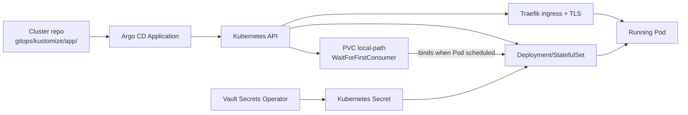
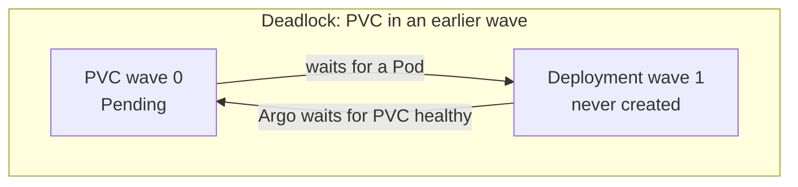
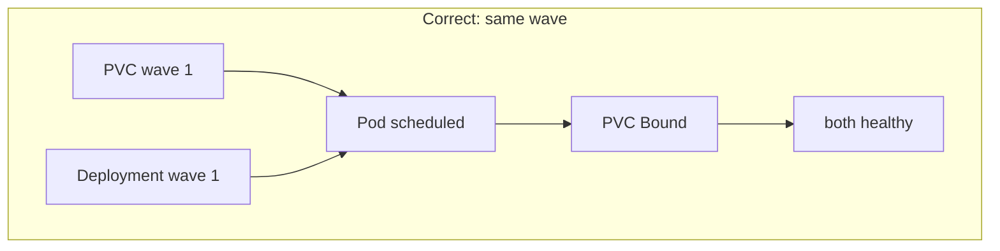

# Playbook: Argo CD Application with a local-path PVC on k3s

This playbook defines the procedure for deploying an application to the Go-Go-Golems k3s cluster through Argo CD when that application needs a persistent volume. It covers the file layout, the sync-wave ordering that prevents a `WaitForFirstConsumer` deadlock, the secret and ingress contracts, and the validation that runs before merge. The intended reader is an engineer or coding agent adding a new application package to `gitops/kustomize/` in the cluster repository.

The single load-bearing rule this playbook exists to enforce is this: a `local-path` persistent volume claim and the workload that mounts it must share the same Argo CD sync wave. The rest of the procedure exists to make that rule easy to follow and impossible to violate silently.

> [!warning] Storage deadlock rule
>
> K3s ships with the `local-path` storage class, which binds with the `WaitForFirstConsumer` volume binding mode. A PVC in this class stays `Pending` until a Pod that consumes it is scheduled. Argo CD will not advance to the next sync wave until the current wave is healthy, and a PVC is healthy only when it is `Bound`. If the PVC is in an earlier wave than its consuming Deployment, the PVC waits for a Pod that Argo will not create, and Argo waits for a PVC that cannot bind. The deployment deadlocks. Put the PVC and its consuming workload in the same `argocd.argoproj.io/sync-wave`.

## 1. Decide whether this playbook applies

Use this playbook when an application deployed through Argo CD needs durable storage on the k3s cluster. The signal is a `PersistentVolumeClaim` with `storageClassName: local-path`, or a PVC that omits `storageClassName` entirely (the cluster default is `local-path`).

Do not use this playbook when the application is stateless. A Deployment with no PVC, or one that uses an `emptyDir` for scratch space, does not need the wave invariant. Stateful workloads that use `volumeClaimTemplates` inside a `StatefulSet` follow a related but distinct pattern; the wave rule still applies, but the claim is generated by the StatefulSet rather than authored as a separate `pvc.yaml`.

This playbook assumes the cluster repository at `/home/manuel/code/wesen/2026-03-27--hetzner-k3s` is the source of truth, that Argo CD reconciles it, and that Vault Secrets Operator delivers runtime secrets. It does not cover Terraform, cluster bring-up, or Vault policy authoring.

## 2. The system you are deploying into

The cluster is a single-node k3s instance on Hetzner. Four subsystems cooperate to turn a git commit into a running workload.

- **k3s** provides the Kubernetes API and the `local-path` storage provisioner.
- **Argo CD** reads manifests from the cluster repository and applies them in sync-wave order.
- **Vault and the Vault Secrets Operator (VSO)** hold secret bytes and materialize them as Kubernetes `Secret` objects in the target namespace.
- **Traefik and cert-manager** terminate public TLS and issue certificates.



The arrow that matters most is the one between the PVC and the Deployment. The PVC does not bind until the Deployment's Pod is scheduled. If Argo orders the PVC before the Deployment, neither progresses.

## 3. The sync-wave ordering

Argo CD groups objects into ordered waves using the annotation `argocd.argoproj.io/sync-wave: "<int>"`. Lower waves are applied first, and Argo will not begin wave *N+1* until every object in wave *N* is healthy. The cluster repository uses a fixed wave convention, documented in its `AGENTS.md`.

| Wave | Objects |
| --- | --- |
| `-3` | Namespace |
| `-2` | ServiceAccount |
| `-1` | Vault connection and auth, VSO `VaultStaticSecret`, image-pull secrets |
| `0` | reserved for platform |
| `1` | PVC and its consuming Deployment or StatefulSet, in the same wave |
| `2` | Services, Ingress, NetworkPolicy |

The PVC and its consuming workload share wave `1`. This is not a suggestion. A PVC at wave `0` with a Deployment at wave `1` deadlocks, because Argo waits for the PVC to bind before it will create the Deployment, and the PVC cannot bind until the Deployment's Pod exists.

A PVC with no `sync-wave` annotation is treated by Argo as wave `0`. The cluster validator normalizes a missing annotation to `0` and compares it against the consumer, so an unannotated PVC with a wave-`1` Deployment is caught as a violation rather than silently passing.

## 4. The deadlock, stated precisely

The failure mode is a scheduling deadlock between two independent mechanisms.

The first mechanism is `local-path` binding. A `PersistentVolumeClaim` that uses `local-path` does not bind to a real disk immediately. It binds with `WaitForFirstConsumer`, which means Kubernetes delays binding until a Pod that consumes the claim is scheduled onto a node. The claim sits in `Pending` state until its consumer exists. This is deliberate: it prevents Kubernetes from binding a volume on a node the Pod will never be scheduled onto.

The second mechanism is Argo wave health. Argo will not begin wave *N+1* until every object in wave *N* is healthy. A PVC is healthy when it reaches `Bound`.

The deadlock appears when these two mechanisms disagree about ordering. If the PVC is in an earlier wave than its consuming Deployment, Argo waits for the PVC to become `Bound` before it creates the Deployment. But the PVC cannot bind until the Deployment's Pod is scheduled. Neither progresses.



The fix is to place the PVC and its consuming Deployment in the same wave. Argo creates both in wave `1`. Kubernetes schedules the Pod, the Pod's existence satisfies `WaitForFirstConsumer`, the PVC binds, and both objects become healthy together.



## 5. File layout

Each application is a Kustomize package under `gitops/kustomize/<app>/`. The canonical file set for a stateful application is:

```text
gitops/kustomize/<app>/
  namespace.yaml
  serviceaccount.yaml        # if the app needs an identity or image-pull secret
  vault-connection.yaml      # if the app uses VSO secrets
  vault-auth.yaml            # if the app uses VSO secrets
  runtime-secret.yaml        # VaultStaticSecret, wave -1
  pvc.yaml                   # wave 1
  deployment.yaml            # wave 1, mounts the PVC by claimName
  service.yaml               # wave 2
  ingress.yaml               # wave 2 (or 3)
  kustomization.yaml
```

The Argo CD Application that points at this package lives separately:

```text
gitops/applications/<app>.yaml
```

The Application references the cluster repository, a target revision (usually `main`), and the `path: gitops/kustomize/<app>`. It does not duplicate the manifests.

## 6. The manifests

This section gives the concrete manifests for a stateful application, using `goja-kanban` as the worked example. Copy the closest existing package as a template rather than writing from scratch.

### 6.1 The PVC

The PVC declares `storageClassName: local-path`, an access mode, a size, and the wave annotation. The wave is `1`.

```yaml
apiVersion: v1
kind: PersistentVolumeClaim
metadata:
  name: goja-kanban-data
  annotations:
    # local-path uses WaitForFirstConsumer. Keep the PVC in the same wave as
    # the consuming Deployment so Argo does not wait on a Pending claim.
    argocd.argoproj.io/sync-wave: "1"
  labels:
    app.kubernetes.io/name: goja-kanban
    app.kubernetes.io/component: storage
spec:
  accessModes:
    - ReadWriteOnce
  storageClassName: local-path
  resources:
    requests:
      storage: 10Gi
```

The comment is not decoration. It states the invariant at the point of change so a future reader understands why the wave is `1` and not `0`. The validator does not require the comment, but the cluster convention is to include it.

### 6.2 The Deployment

The Deployment mounts the PVC by `claimName` and carries the same wave annotation as the PVC. For a single-writer local database, set `replicas: 1` and `strategy: Recreate` so two Pods never write the same mounted database during a rollout.

```yaml
apiVersion: apps/v1
kind: Deployment
metadata:
  name: goja-kanban
  annotations:
    argocd.argoproj.io/sync-wave: "1"
  labels:
    app.kubernetes.io/name: goja-kanban
spec:
  replicas: 1
  strategy:
    type: Recreate
  selector:
    matchLabels:
      app.kubernetes.io/name: goja-kanban
  template:
    metadata:
      labels:
        app.kubernetes.io/name: goja-kanban
    spec:
      containers:
        - name: goja-kanban
          image: ghcr.io/wesen/2026-05-03--goja-hosting-site:sha-b52aecc
          ports:
            - containerPort: 8080
              name: http
          readinessProbe:
            httpGet: { path: /readyz, port: http }
          volumeMounts:
            - name: data
              mountPath: /data
      volumes:
        - name: data
          persistentVolumeClaim:
            claimName: goja-kanban-data
```

The `claimName` must match the PVC's `metadata.name` exactly. The validator matches each PVC to its consumer by this field, not by wave alone. A package with two PVCs and two workloads is checked per-consumer: a PVC assigned to the wrong consumer's wave fails even if some other workload happens to share the wave.

### 6.3 The Service and Ingress

The Service and Ingress go in a later wave so they are created after the workload is healthy. The Ingress references the cert-manager cluster issuer and the Traefik ingress class.

```yaml
# service.yaml
apiVersion: v1
kind: Service
metadata:
  name: goja-kanban
  annotations:
    argocd.argoproj.io/sync-wave: "2"
spec:
  type: ClusterIP
  selector:
    app.kubernetes.io/name: goja-kanban
  ports:
    - name: http
      port: 80
      targetPort: http
```

```yaml
# ingress.yaml
apiVersion: networking.k8s.io/v1
kind: Ingress
metadata:
  name: goja-kanban
  annotations:
    argocd.argoproj.io/sync-wave: "3"
    cert-manager.io/cluster-issuer: letsencrypt-prod
spec:
  ingressClassName: traefik
  tls:
    - hosts: [kanban.yolo.scapegoat.dev]
      secretName: goja-kanban-tls
  rules:
    - host: kanban.yolo.scapegoat.dev
      http:
        paths:
          - path: /
            pathType: Prefix
            backend:
              service:
                name: goja-kanban
                port:
                  number: 80
```

### 6.4 The Kustomization

The `kustomization.yaml` lists the resources in the order they should be applied. Kustomize does not enforce Argo wave ordering — the annotations do — but listing resources in wave order makes the package readable.

```yaml
apiVersion: kustomize.config.k8s.io/v1beta1
kind: Kustomization
namespace: goja-kanban
resources:
  - namespace.yaml
  - pvc.yaml
  - deployment.yaml
  - service.yaml
  - ingress.yaml
labels:
  - pairs:
      app.kubernetes.io/name: goja-kanban
      app.kubernetes.io/part-of: goja-site
```

### 6.5 The Argo CD Application

The Application lives in `gitops/applications/<app>.yaml`. It points at the cluster repository and the package path. The `syncPolicy.automated` block enables pruning and self-healing; `CreateNamespace=true` lets Argo create the namespace from the package.

```yaml
apiVersion: argoproj.io/v1alpha1
kind: Application
metadata:
  name: goja-kanban
  namespace: argocd
  finalizers:
    - resources-finalizer.argocd.argoproj.io
spec:
  project: demo-apps
  destination:
    server: https://kubernetes.default.svc
    namespace: goja-kanban
  source:
    repoURL: https://github.com/wesen/2026-03-27--hetzner-k3s.git
    targetRevision: main
    path: gitops/kustomize/goja-kanban
  syncPolicy:
    automated:
      prune: true
      selfHeal: true
    syncOptions:
      - CreateNamespace=true
      - ServerSideApply=true
```

The `project` must be one that authorizes the destination namespace. Check `gitops/projects/` for the AppProject that lists allowed namespaces before adding a new application.

## 7. Secrets through Vault

If the application needs a runtime secret, do not put the bytes in the repository. Use a `VaultStaticSecret` in wave `-1`. VSO reads the secret from Vault and creates a Kubernetes `Secret` in the target namespace. The Deployment mounts that Secret by name.

The pattern has three files: `vault-connection.yaml` (the Vault address), `vault-auth.yaml` (the auth method, usually Kubernetes service-account JWT), and `runtime-secret.yaml` (the `VaultStaticSecret` itself). The `VaultStaticSecret` carries `argocd.argoproj.io/sync-wave: "-1"` so the Secret exists before the workload in wave `1` starts.

For applications that require owner-private secret files — for example, a server that validates its token file is mode `0400` and owned by its UID — do not mount the projected Secret directly. Kubernetes Secret projection controls mode bits but not file owner, and `fsGroup` can make a projected source group-readable. The correct pattern is a one-way handoff: a root init container copies the projected Secret into a memory-backed `emptyDir`, changes ownership and mode, and the main container mounts only the prepared copy. The TinyIDP Jitsi deployment in `deploy/kubernetes/tinyidp-jitsi/` is the worked example of this pattern.

## 8. Validation before merge

The cluster repository ships a validator that renders every Kustomize package and checks the invariants. Run it before opening a pull request.

```bash
bash scripts/validate_gitops.sh
```

The validator enforces three invariants.

1. Every `local-path` PVC (including one with no explicit `storageClassName`, which defaults to `local-path`) must share its `argocd.argoproj.io/sync-wave` with the Deployment or StatefulSet that mounts it, matched by `claimName`. A PVC with no wave annotation is treated as wave `0`.
2. No rendered manifest may contain inline private-key material.
3. Every package must render. A render failure — for example, a missing `configMapGenerator` file — is a violation, not a skip.

The validator performs no cluster access. It renders manifests locally with `kubectl kustomize` and inspects them with `yq`. A passing run reports the package count and zero violations.

```text
Packages checked: 40
Violations:       0
RESULT: PASS — all rendered packages satisfy the GitOps invariants.
```

The validator also runs in continuous integration. The `validate-gitops` GitHub Actions workflow runs on every pull request and push that touches `gitops/`, the validator script, or the workflow file. A pull request that fails the check cannot merge.

## 9. Verifying the deployment after merge

After the pull request merges, Argo CD reconciles the package. Verify the result against the cluster, not against the repository alone. The repository proves desired state; the cluster proves applied state.

```bash
# Use the Tailscale kubeconfig, not the public IP.
export KUBECONFIG=/home/manuel/code/wesen/2026-03-27--hetzner-k3s/kubeconfig-k3s-demo-1.tail879302.ts.net.yaml

# The PVC must be Bound.
kubectl get pvc -n <namespace>

# The Pod must be Running and Ready.
kubectl get pods -n <namespace>

# The Application must be Synced and Healthy.
kubectl -n argocd get application <app> -o jsonpath='{.status.sync.status}{"\t"}{.status.health.status}{"\n"}'
```

If the PVC is `Pending` and the Pod is not scheduled, suspect a wave mismatch even if the validator passed locally. Check the rendered wave on both objects:

```bash
kubectl kustomize gitops/kustomize/<app> | grep -A1 'kind: PersistentVolumeClaim'
kubectl kustomize gitops/kustomize/<app> | grep -B1 'sync-wave'
```

If Argo shows `OutOfSync` after a source pin change but no new ReplicaSet appears, the active operation may be retrying an old revision. Clear the stale operation and request a hard refresh:

```bash
kubectl -n argocd annotate application <app> argocd.argoproj.io/refresh=hard --overwrite
```

Checking only the source pin is weak evidence. It proves desired state, not the manifest currently applied to the cluster.

## 10. Common failure modes

| Symptom | Cause | Fix |
| --- | --- | --- |
| PVC stays `Pending`, Pod never scheduled | PVC in an earlier wave than its consumer | Put PVC and Deployment in the same `sync-wave` (wave `1`) |
| PVC stays `Pending` with no wave mismatch | `WaitForFirstConsumer` waiting for a consumer that does not exist | Confirm the Deployment mounts the PVC by the correct `claimName` |
| `chmod: /state: Operation not permitted` in an init container | `CAP_CHOWN` does not authorize mode changes | Add narrowly scoped `CAP_FOWNER` to the init container only |
| Token file rejected as not owner-private | Projected Secret UID/group does not satisfy a strict file contract | Copy into a prepared `emptyDir` owned by the app UID, mode `0400` |
| Source pin changed but old ReplicaSet persists | Argo active operation retrying old revision | Clear the stale operation and hard-refresh |
| Validator reports `PASS` but checks nothing | Wrong `yq` implementation (kislyuk jq wrapper emits quoted scalars) | Install Mike Farah Go `yq`; the validator verifies this on startup |

## 11. Working rules

- A `local-path` PVC and its consuming workload share the same `argocd.argoproj.io/sync-wave`. This is the rule the rest of the playbook exists to support.
- A PVC with no wave annotation is wave `0`, not exempt. Annotate it explicitly.
- Match the PVC to its consumer by `claimName`, not by wave alone. A package with several PVCs is checked per-consumer.
- For single-writer local data, use `replicas: 1` and `strategy: Recreate`.
- Never commit secret bytes. Use VSO `VaultStaticSecret` in wave `-1`.
- Run `bash scripts/validate_gitops.sh` before opening a pull request. The CI workflow runs the same check on merge.
- Verify against the cluster after merge, not against the repository alone. The repository is desired state; the cluster is applied state.
- Use the Tailscale kubeconfig, never the public IP, for `kubectl` access.

## 12. Where this playbook comes from

The wave invariant and the validator were produced by a `go-minitrace` audit of a Codex session that deployed TinyIDP twice on this cluster and hit the same PVC deadlock both times. The invariant was already encoded in seven of eight existing `pvc.yaml` files and already documented in `docs/app-deployment-pipeline.md`, but there was no `AGENTS.md` entry point and no validator, so the deadlock recurred. The audit, the `AGENTS.md`, the validator, and the two latent violations it uncovered are recorded in `PROJECT REPORT - tiny-idp - From Transcript Audit to an Enforced GitOps Invariant` and in the `TINYIDP-PLUGIN-001` ticket workspace.

The canonical references in the cluster repository are:

- `AGENTS.md` — the agent entry point and the wave convention table.
- `docs/app-deployment-pipeline.md` — the standardized layout and the critical sync-wave rule (around line 327).
- `docs/operator-troubleshooting-faq.md` — the `local-path` / `WaitForFirstConsumer` deadlock recovery.
- `scripts/validate_gitops.sh` — the render-time enforcer.
- `.github/workflows/validate-gitops.yml` — the CI check.

## Related notes

- [[Research/KB/Projects/infrastructure-and-release]]
- [[PROJECT REPORT - tiny-idp - From Transcript Audit to an Enforced GitOps Invariant]]
- [[PROJECT REPORT - tiny-idp - Jitsi Production Rollout and Least-Privilege Startup]]
