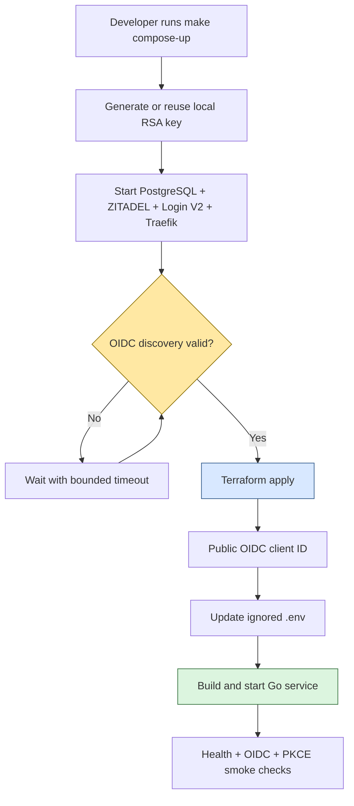
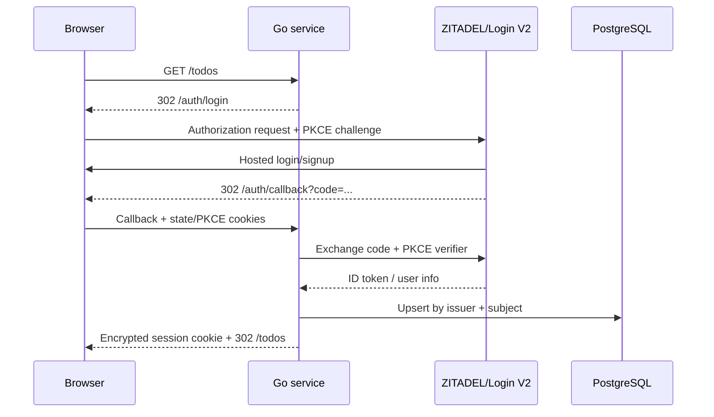

# Playbook: Local ZITADEL, Docker Compose, Terraform, and Go Web Services

This playbook describes how to build a repeatable local identity constellation consisting of PostgreSQL, ZITADEL, ZITADEL Login V2, Traefik, Terraform, and a Go web service using OpenID Connect Authorization Code flow with PKCE. It is intended for applications that need realistic hosted signup and login locally without implementing or storing passwords themselves.

The tested reference is `/home/manuel/code/wesen/2026-07-25--zitadel-go-test`. Its application is a server-rendered todo service, but the identity, bootstrap, routing, security, and startup patterns generalize to other Go services.

> [!summary]
> - Compose owns local processes and networks; Terraform owns ZITADEL organizations, projects, applications, and policies.
> - Startup must be ordered: identity runtime → valid OIDC discovery → Terraform apply → Go application.
> - A Traefik instance that reads the Docker socket must constrain discovery to its own stack, or similarly named services in another project can silently become backends.
> - Application identity is `(issuer, subject)`, never email; public browser clients use Authorization Code + PKCE and no client secret.

> [!warning] Local development only
> Plain HTTP, bootstrap administrators, generated System API credentials, known development passwords, and locally persisted Terraform state are acceptable only on a developer workstation. Do not expose this stack to an untrusted network or copy its secret handling directly into production. Production should use TLS, a real secret manager, narrowly scoped automation identities, audited bootstrap procedures, and externally managed persistent data.

## 1. When to use this constellation

Use this pattern when a Go application needs to exercise the complete browser identity lifecycle locally:

- hosted signup and login;
- Authorization Code flow with PKCE;
- callback and session-cookie behavior;
- logout and post-logout redirect handling;
- local user projection from OIDC claims;
- per-user database ownership;
- declarative identity configuration that can be reproduced after a reset;
- enough parity to discover issuer, cookie, proxy, and redirect problems before deployment.

Do not use this pattern merely to unit-test authorization logic. Unit tests should use explicit identities and isolated stores. The full constellation is an integration environment and is correspondingly heavier.

## 2. Ownership boundaries

The first design decision is to assign every resource to one owner.

| Concern | Owner | Examples |
| --- | --- | --- |
| Runtime processes | Docker Compose | PostgreSQL, ZITADEL, Login V2, Traefik, Go service |
| Runtime wiring | Docker Compose | Ports, volumes, network aliases, health checks, dependencies |
| Identity resources | Terraform | Organization, project, OIDC application, login policy |
| First automation credential | Local bootstrap script + ZITADEL startup config | Generated RSA System API user |
| Application schema | Go binary | Embedded, checksum-protected migrations |
| User identity | ZITADEL | Credentials, recovery, verification, hosted registration |
| Application authorization | Go service + PostgreSQL | Local user projection and owner-filtered queries |
| Local secret material | Ignored files | `.env`, `.local/`, Terraform state |

Compose should not manually create the OIDC application, and Terraform should not be expected to start ZITADEL. Terraform cannot configure an API that does not exist, so an explicit bootstrap boundary remains necessary.



## 3. Recommended repository layout

A small but complete project can use this shape:

```text
project/
├── cmd/my-service/
│   ├── main.go
│   ├── serve.go
│   └── healthcheck.go
├── internal/
│   ├── app/
│   ├── store/
│   └── web/
├── docker/postgres/
│   └── 01-create-app-db.sql
├── infra/zitadel/local/
│   ├── main.tf
│   ├── variables.tf
│   ├── outputs.tf
│   ├── versions.tf
│   └── .terraform.lock.hcl
├── scripts/
│   ├── bootstrap-local-system-api.sh
│   ├── wait-local-zitadel.sh
│   ├── configure-local-zitadel.sh
│   └── smoke-local.sh
├── compose.yaml
├── Dockerfile
├── Makefile
├── .env.example
├── .dockerignore
└── .gitignore
```

Commit reproducible configuration and public metadata. Ignore at least:

```gitignore
.env
.local/
infra/zitadel/local/.terraform/
infra/zitadel/local/*.tfstate
infra/zitadel/local/*.tfstate.*
```

Commit `.terraform.lock.hcl`; it pins provider checksums and version selection. Never commit generated private keys, Terraform state, session keys, CSRF keys, database passwords, PATs, or machine credentials.

## 4. Network and issuer design

OIDC requires a stable issuer identity. The browser and the Go application container must agree on the exact issuer string, including scheme, hostname, and port. `http://localhost:18080` is unsuitable inside a container because `localhost` refers to that container.

Use a hostname such as:

```text
http://zitadel.localhost:18080
```

The browser resolves `*.localhost` to loopback. Inside the Compose network, give Traefik the same hostname as a network alias:

```yaml
services:
  proxy:
    networks:
      identity:
        aliases:
          - zitadel.localhost

networks:
  identity:
    name: my-service-zitadel
```

The Go container can then request `http://zitadel.localhost:18080/.well-known/openid-configuration`, while the browser uses the identical URL. Do not give the Go SDK one issuer for discovery and advertise another issuer to the browser; OIDC issuer validation is intentionally exact.

For the ZITADEL Go client, distinguish a full issuer URL from the SDK's host-oriented constructor. Parse the URL first and configure insecure local HTTP explicitly:

```go
parsed, err := url.Parse(issuer)
if err != nil || parsed.Hostname() == "" {
    return nil, fmt.Errorf("invalid issuer %q", issuer)
}

if parsed.Scheme == "http" {
    return zitadel.New(parsed.Hostname(), zitadel.WithInsecure(parsed.Port()))
}
```

Passing `http://...` where a hostname is expected can produce malformed discovery URLs such as `https://http//...`.

## 5. Isolate Traefik from other Docker projects

### The non-obvious Docker socket hazard

A Traefik container with this configuration watches the entire Docker daemon, not merely its Compose project:

```yaml
- --providers.docker=true
- --providers.docker.exposedbydefault=false
```

Compose networks do not scope Docker provider discovery. If two active projects advertise a service named `zitadel-api`, Traefik may merge both server addresses into one dynamic service. A request for the first project can then be sent to the second project's container, even when the hostnames and networks differ.

The observed symptom in the reference incident was:

```text
POST /zitadel.org.v2.OrganizationService/ListOrganizations -> 504
selected backend: h2c://10.77.0.4:8080
expected backend: h2c://10.10.44.3:8080
```

Ordinary OIDC discovery sometimes succeeded while Terraform RPCs timed out, making the failure look like ZITADEL instability. The foreign IP was the decisive evidence.

### Required fix: constrain provider discovery

Add a unique stack label to every container that this Traefik instance is allowed to discover:

```yaml
services:
  zitadel-api:
    labels:
      - local-idp.stack=my-go-service
      - traefik.enable=true
      - traefik.docker.network=my-go-service-zitadel
      # routers and services...

  zitadel-login:
    labels:
      - local-idp.stack=my-go-service
      - traefik.enable=true
      - traefik.docker.network=my-go-service-zitadel
      # routers and services...
```

Constrain the provider itself:

```yaml
services:
  proxy:
    command:
      - --providers.docker=true
      - --providers.docker.exposedbydefault=false
      - --providers.docker.constraints=Label(`local-idp.stack`,`my-go-service`)
      - --providers.docker.network=my-go-service-zitadel
```

The label key and value are arbitrary, but the pair must be unique enough not to collide with another local project. A project-specific constraint is stronger than merely giving routers unique names: it prevents the proxy from ingesting unrelated dynamic configuration at all.

Also give the Compose network an explicit unique name and use that exact name in `traefik.docker.network`. A mismatch causes Traefik to fall back to an arbitrary network and emits warnings such as:

```text
Could not find network named "...". Defaulting to first available network.
```

> [!important]
> Never fix this by stopping or deleting a colleague's containers. Scope your own proxy. Multiple ZITADEL development stacks should coexist safely on one Docker daemon.

### Verify isolation

Inspect all active containers advertising ZITADEL labels:

```bash
docker ps --format '{{.ID}}\t{{.Names}}\t{{.Networks}}'
for id in $(docker ps -q); do
  docker inspect "$id" --format '{{json .Config.Labels}}' | grep -E 'zitadel-api|zitadel-login' || true
done
```

Then inspect proxy access logs. The selected backend must belong to the intended project network:

```bash
docker compose logs --no-color proxy | grep -E 'h2c://|504'
docker inspect my-project-zitadel-api-1 \
  --format '{{range .NetworkSettings.Networks}}{{.IPAddress}}{{end}}'
```

## 6. Compose the identity runtime

### PostgreSQL

Use one PostgreSQL process with separate databases for ZITADEL and the application. A first-start script can create the application database:

```sql
CREATE DATABASE my_app;
```

Mount it under `/docker-entrypoint-initdb.d/`. Remember that these scripts run only when the PostgreSQL data directory is empty. Editing the script does not modify an existing volume.

The ZITADEL database DSN and application database DSN should be separate configuration values. For a production-like setup, use separate roles as well; a disposable local stack may use one administrator for simplicity.

### ZITADEL API

The central local settings are conceptually:

```yaml
environment:
  ZITADEL_EXTERNALDOMAIN: zitadel.localhost
  ZITADEL_EXTERNALPORT: 18080
  ZITADEL_EXTERNALSECURE: "false"
  ZITADEL_TLS_ENABLED: "false"
  ZITADEL_DATABASE_POSTGRES_DSN: postgresql://.../zitadel?sslmode=disable
  ZITADEL_DEFAULTINSTANCE_FEATURES_LOGINV2_REQUIRED: "true"
  ZITADEL_DEFAULTINSTANCE_FEATURES_LOGINV2_BASEURI: http://zitadel.localhost:18080/ui/v2/login/
```

ZITADEL persists instance and external-domain configuration. If the issuer hostname, port, or secure flag changes during local experimentation, a container restart may be insufficient. Reset the disposable volume and recreate the instance:

```bash
docker compose --env-file .env down -v
```

Only do this when local identity and application data may be destroyed.

### Login V2

Run the official Login V2 image separately and point it at the internal API address:

```yaml
environment:
  ZITADEL_API_URL: http://zitadel-api:8080
  NEXT_PUBLIC_BASE_PATH: /ui/v2/login
  ZITADEL_SERVICE_USER_TOKEN_FILE: /zitadel/bootstrap/login-client.pat
  CUSTOM_REQUEST_HEADERS: Host:zitadel.localhost,X-Forwarded-Proto:http
```

ZITADEL and Login V2 share a bootstrap volume containing the login-client PAT created by first-instance initialization. Keep this volume private to the stack.

### Traefik routing

Route Login V2 paths to the Login service and protocol/API/OIDC paths to ZITADEL. ZITADEL's backend supports HTTP/2 cleartext, so use `h2c` where required:

```yaml
- traefik.http.services.my-zitadel-api.loadbalancer.server.port=8080
- traefik.http.services.my-zitadel-api.loadbalancer.server.scheme=h2c
```

Use unique router, middleware, and service names even when provider constraints are present. Constraints provide isolation; unique names make logs and debugging intelligible.

## 7. Bootstrap Terraform authentication safely

Terraform needs an authorized credential before it can create an organization or OIDC client. This is the unavoidable first-credential boundary.

For disposable local development, generate an RSA key pair under an ignored directory:

```text
.local/zitadel-system-api/terraform-local-private.pem
.local/zitadel-system-api/terraform-local-public.pem
```

Recommended permissions:

```bash
chmod 700 .local .local/zitadel-system-api
chmod 600 .local/zitadel-system-api/terraform-local-private.pem
chmod 644 .local/zitadel-system-api/terraform-local-public.pem
```

Configure only the public key in ZITADEL's startup `SystemAPIUsers` data. Keep the private key out of `.env`; Terraform reads it from the ignored file. The local identity can have `IAM_OWNER` because it is confined to a disposable workstation instance, but this is too broad for normal production automation.

The provider boundary is:

```hcl
provider "zitadel" {
  domain   = var.zitadel_domain
  port     = var.zitadel_port
  insecure = var.zitadel_insecure

  system_api {
    user     = var.system_api_user
    key_file = var.system_api_key_file
  }
}
```

> [!warning] Credential lifecycle
> Preserve `.local/` when resetting only Compose volumes, or ensure startup receives the newly generated public key before ZITADEL initializes. A private key and an old persisted public key do not authenticate. Never print the private key, Terraform access token, session key, or CSRF key in logs.

In production, replace this local mechanism with an explicitly approved bootstrap machine credential delivered through Vault or another secret manager. Terraform should receive a short-lived or rotated credential at runtime; Git must contain only declarations.

## 8. Declare ZITADEL resources with Terraform

The Terraform root should own at least:

1. organization;
2. project;
3. OIDC application;
4. organization login policy;
5. outputs for issuer and public client ID.

A browser-facing Go service should use a public Web client:

```hcl
resource "zitadel_application_v2" "web" {
  org_id     = zitadel_organization.app.id
  project_id = zitadel_project_v2.app.id
  name       = "my-go-service-web"

  oidc {
    redirect_uris             = ["${var.public_url}/auth/callback"]
    post_logout_redirect_uris = ["${var.public_url}/"]
    response_types            = ["OIDC_RESPONSE_TYPE_CODE"]
    grant_types               = ["OIDC_GRANT_TYPE_AUTHORIZATION_CODE"]
    app_type                  = "OIDC_APP_TYPE_WEB"
    auth_method_type          = "OIDC_AUTH_METHOD_TYPE_NONE"
    version                   = "OIDC_VERSION_1_0"
    dev_mode                  = var.zitadel_insecure
    access_token_type         = "OIDC_TOKEN_TYPE_BEARER"
  }
}
```

`OIDC_AUTH_METHOD_TYPE_NONE` is intentional: PKCE protects the authorization-code exchange, and a browser-facing application must not depend on a distributable client secret. Request only required scopes, normally:

```text
openid profile email
```

Enable registration in the login policy if the application exposes signup. Direct signup should use the same OIDC flow with `prompt=create`, not an application-owned registration form.

After `terraform apply`, read the public client ID and update only that value in ignored `.env`:

```bash
client_id="$(terraform -chdir=infra/zitadel/local output -raw oidc_client_id)"
# Replace TODO_DEMO_ZITADEL_CLIENT_ID in ignored .env.
```

A client ID is public metadata. The System API private key is not and must never be copied into `.env` by this handoff.

Run an immediate drift check:

```bash
terraform -chdir=infra/zitadel/local plan -detailed-exitcode
```

Exit code `0` means no drift, `2` means a non-empty plan, and `1` means an error. Some provider fields may not round-trip cleanly across provider/API versions. Do not tolerate perpetual drift casually: verify whether the field is globally configured, remove redundant declarations if justified, pin the provider, and document the decision.

## 9. Enforce startup ordering

A fresh checkout contains no real OIDC client ID. Starting the Go service before Terraform succeeds creates an avoidable restart loop and hides the real bootstrap dependency.

Use this order:

```text
1. Generate/reuse local System API key.
2. Start PostgreSQL, ZITADEL API, Login V2, and Traefik.
3. Wait for valid OIDC discovery through the public issuer URL.
4. Apply Terraform.
5. Write the public client ID to ignored .env.
6. Build and start the Go service.
7. Run smoke checks.
```

A Makefile can encode the dependency graph:

```make
compose-up: configure-local-zitadel
	docker compose --env-file .env up --build --wait my-service

identity-up: bootstrap-local-system-api
	docker compose --env-file .env up -d --wait \
		postgres zitadel-api zitadel-login proxy

wait-local-zitadel: identity-up
	./scripts/wait-local-zitadel.sh

configure-local-zitadel: wait-local-zitadel
	./scripts/configure-local-zitadel.sh
```

Do not list `identity-up` and `configure-local-zitadel` as independent prerequisites of one target if parallel Make execution could run them concurrently. Encode the chain.

### Discovery readiness check

A Traefik `/ping` healthcheck proves only that Traefik's process and entrypoint are alive. It does not prove Docker dynamic configuration has loaded or that ZITADEL is reachable. Before Terraform, request discovery through the exact browser-visible issuer and verify the returned `issuer` field:

```bash
for attempt in $(seq 1 60); do
  if curl -fsS --max-time 3 \
      http://zitadel.localhost:18080/.well-known/openid-configuration \
      > /tmp/discovery.json &&
     python3 - <<'PY'
import json
with open('/tmp/discovery.json') as f:
    data = json.load(f)
assert data['issuer'] == 'http://zitadel.localhost:18080'
PY
  then
    exit 0
  fi
  sleep 2
done
exit 1
```

Keep the wait bounded and fail with the URL and timeout. Do not retry forever, and do not move this orchestration concern into the application as a long generic retry loop. Permanent issuer, DNS, or client-ID mistakes should fail clearly.

## 10. Integrate the Go service

### Authentication flow

Use ZITADEL's Go authentication SDK or a standards-compliant OIDC relying party. The runtime flow is:



Required invariants:

- Authorization Code flow only;
- PKCE challenge method `S256`;
- encrypted and integrity-protected state;
- callback URI exactly matches Terraform configuration;
- issuer validation is exact;
- session cookies are `HttpOnly`, `SameSite`, and `Secure` under HTTPS;
- direct signup adds `prompt=create` to the same PKCE flow;
- logout uses an allowlisted post-logout URI.

Local HTTP may require non-`Secure` state, PKCE, session, and CSRF cookies. Derive this from the configured public URL; never make production HTTPS cookies non-secure merely to simplify local development.

### Identity projection

Use `(issuer, subject)` as the durable external identity key:

```sql
UNIQUE (oidc_issuer, oidc_subject)
```

Email is profile data, not identity. It may change, be absent, be unverified, or overlap across issuers. Upsert profile fields on successful authentication while retaining the stable identity pair.

### Ownership in SQL

Every user-owned query must include the local user ID. Do not fetch an object by ID and perform ownership checks later in application code:

```sql
SELECT ... FROM todos
WHERE user_id = $1;

UPDATE todos
SET completed = NOT completed
WHERE id = $1 AND user_id = $2;

DELETE FROM todos
WHERE id = $1 AND user_id = $2;
```

Return the same not-found result for a nonexistent object and another user's object. This avoids leaking object existence and makes the database operation itself enforce ownership.

### CSRF and browser security

Cookie authentication requires CSRF protection on state-changing requests. Use an independent CSRF key rather than reusing the session key. A compact signed-token design is:

```text
cookie = random_token + "." + HMAC-SHA256(csrf_key, random_token)
form   = random_token
```

Validate the cookie signature and compare the form token in constant time. Protect all POST routes. Also apply security headers on the outer router so authentication and signup routes receive them too:

```text
Content-Security-Policy: default-src 'self'; base-uri 'none'; frame-ancestors 'none'; form-action 'self'
Referrer-Policy: no-referrer
X-Content-Type-Options: nosniff
X-Frame-Options: DENY
```

### Database migrations

Embed application migrations into the Go binary. Apply them before serving under a PostgreSQL transaction-scoped advisory lock. Maintain a migration ledger containing filename, checksum, and application timestamp. If an applied migration's checksum changes, fail startup; create a new migration instead of rewriting history.

## 11. Container and health-check design

Build a static Go binary and use a non-root distroless runtime:

```dockerfile
FROM golang:1.26-alpine AS build
WORKDIR /src
COPY go.mod go.sum* ./
RUN go mod download
COPY . .
RUN CGO_ENABLED=0 go build -trimpath -ldflags='-s -w' \
    -o /out/my-service ./cmd/my-service

FROM gcr.io/distroless/static-debian12:nonroot
COPY --from=build /out/my-service /my-service
ENTRYPOINT ["/my-service"]
CMD ["serve"]
```

A distroless image has no shell, curl, or wget. Implement a native healthcheck subcommand in the same binary:

```go
client := &http.Client{Timeout: 2 * time.Second}
response, err := client.Get("http://127.0.0.1:8080/healthz")
if err != nil || response.StatusCode != http.StatusOK {
    return errors.New("service is not healthy")
}
```

Then configure Compose:

```yaml
healthcheck:
  test: ["CMD", "/my-service", "healthcheck"]
  interval: 10s
  timeout: 3s
  retries: 6
  start_period: 5s
```

Separate liveness from readiness:

- `/healthz`: process can serve HTTP;
- `/readyz`: required dependencies such as PostgreSQL are reachable.

Do not make the application liveness endpoint depend on ZITADEL remaining online after startup unless loss of the identity provider truly makes the process irrecoverable.

## 12. Validation procedure

Run checks from cheap/static to expensive/integrated.

### Static and unit checks

```bash
gofmt -w cmd internal
go test -race ./...
go vet ./...
shellcheck scripts/*.sh
docker compose --env-file .env config
terraform -chdir=infra/zitadel/local fmt -check
terraform -chdir=infra/zitadel/local validate
git diff --check
```

### Ordered local startup

```bash
cp .env.example .env
make compose-up
docker compose --env-file .env ps
```

All required services should be healthy. Then verify Terraform is stable:

```bash
terraform -chdir=infra/zitadel/local plan -detailed-exitcode
```

### Non-secret smoke checks

A smoke script should verify:

1. `/healthz` returns success;
2. `/readyz` confirms PostgreSQL readiness;
3. discovery returns the exact expected issuer;
4. login redirects with `response_type=code`;
5. login and signup use `code_challenge_method=S256`;
6. state and PKCE cookies are present;
7. signup includes `prompt=create`;
8. security headers are present on authentication routes.

Do not follow the browser callback in a curl-only smoke test unless the test securely owns a real user identity. Browser E2E is a separate gate.

### Browser acceptance test

Use two disposable users and complete:

- [ ] landing page → signup → hosted registration → callback → protected page;
- [ ] logout → login → callback;
- [ ] create, toggle, delete, and reload application data;
- [ ] persistence across application restart;
- [ ] second user cannot list the first user's objects;
- [ ] forged mutation against the first user's object returns not found;
- [ ] missing or invalid CSRF token returns `403`;
- [ ] session cookie remains below practical browser limits;
- [ ] logout returns only to an allowlisted URI.

## 13. Reset and recovery operations

### Restart while preserving data

```bash
docker compose --env-file .env down
make compose-up
```

### Reapply identity declarations

```bash
make configure-local-zitadel
docker compose --env-file .env up --build --wait my-service
```

### Reset all local databases and identity state

```bash
docker compose --env-file .env down -v
make compose-up
```

Preserve `.local/` if the same System API key should be reused. For an entirely fresh bootstrap identity:

```bash
docker compose --env-file .env down -v
rm -rf .local
make compose-up
```

Terraform state may refer to resources from the deleted ZITADEL instance. A refresh/apply should recreate missing resources, but inspect the plan rather than deleting state reflexively.

## 14. Troubleshooting guide

| Symptom | Likely cause | Investigation | Fix |
| --- | --- | --- | --- |
| Terraform gets intermittent `504 Gateway Timeout` while discovery works | Traefik merged a same-named service from another Docker project | Inspect proxy access-log backend IPs and all containers' Traefik labels | Add provider constraints and stack labels; recreate proxy and labeled services |
| Traefik says network not found and chooses first available network | `traefik.docker.network` does not exactly match the actual network name | Compare `docker compose config` with `docker inspect` | Give the network an explicit unique name and use that exact label/flag value |
| Go app times out during OIDC discovery at startup | Proxy process is healthy but dynamic routes are not ready | Request discovery through the public issuer before starting app | Add bounded discovery wait between identity startup and Terraform/app startup |
| Discovery URL resembles `https://http//...` | Full URL passed to a constructor expecting a hostname | Inspect SDK constructor contract and generated URL | Parse issuer; pass hostname, explicit port, and insecure-local option separately |
| Issuer mismatch inside container | Browser and container use different issuer names | Compare configured issuer and discovery document | Use one hostname and a Compose network alias such as `zitadel.localhost` |
| Redirect URI rejected | Terraform application URI differs by scheme, host, port, or path | Compare authorization request and Terraform resource | Make callback URI byte-for-byte identical and reapply Terraform |
| Login works but direct signup does not open registration | Missing `prompt=create` or registration disabled | Inspect authorization redirect query and login policy | Add prompt to signup flow and enable registration declaratively |
| Cookies disappear during local HTTP flow | `Secure` set on HTTP cookies | Inspect `Set-Cookie` in browser devtools or curl headers | Allow non-secure cookies only when canonical public URL is HTTP |
| POST unexpectedly returns `403` | CSRF cookie/form token absent or mismatched | Inspect rendered form and cookie scope | Issue signed token, include hidden field, retain `SameSite=Lax` cookie |
| New PostgreSQL init SQL did not run | Existing data volume bypasses `/docker-entrypoint-initdb.d` | Inspect volumes and database list | Apply explicit SQL migration or reset disposable volume |
| Terraform always proposes the same optional field | Provider does not round-trip field from API | Compare provider version, state, API response, and global config | Pin provider; remove redundant field only with documented justification |
| Another app stops working after local cleanup | Someone deleted shared/foreign networks or containers | Inspect Compose project ownership before mutation | Never clean globally; use project-scoped `docker compose down` and unique resources |

## 15. Anti-patterns

Avoid these shortcuts:

- **Application-owned passwords.** Hosted ZITADEL flows exist specifically so the application does not handle credential storage or recovery.
- **Email as a primary identity key.** Use `(issuer, subject)`.
- **A browser client secret.** Use a public client with Authorization Code + PKCE.
- **Manual Console configuration as the normal setup.** Declare application and policy resources in Terraform.
- **Terraform before ZITADEL exists.** Preserve the explicit bootstrap phase.
- **Starting the app with a placeholder client ID.** Apply Terraform first.
- **Treating Traefik `/ping` as route readiness.** Verify actual OIDC discovery.
- **Assuming Compose project boundaries constrain the Docker provider.** Add provider constraints.
- **Deleting another project's containers to fix routing.** Isolate your own discovery.
- **Putting private key material in `.env`.** Store private keys in ignored permission-restricted files or a secret manager.
- **Adding long application retries for deterministic configuration errors.** Fix orchestration and fail clearly.
- **Using shell-based health checks in distroless images.** Add a native subcommand.
- **Checking ownership only after fetching a row by object ID.** Include the owner in SQL predicates.
- **Reusing the session encryption key for CSRF.** Keep independent keys and rotation domains.

## 16. Production translation

The local constellation proves application behavior, not production architecture. A production deployment should change the mechanics while preserving the boundaries:

| Local | Production counterpart |
| --- | --- |
| Docker Compose | Kubernetes/k3s resources managed through GitOps |
| Traefik Docker provider labels | Kubernetes Ingress/IngressRoute resources with namespace and RBAC boundaries |
| `.env` secrets | Vault plus a secret operator such as VSO |
| Generated local IAM owner key | Approved, rotated bootstrap or machine credential |
| Local PostgreSQL container | Managed/shared PostgreSQL with backup, scoped roles, and bootstrap jobs |
| Terraform local state | Protected remote state and reviewed plans |
| HTTP and non-secure cookies | TLS and `Secure` cookies |
| One application replica with cookie session | Explicit session strategy suitable for replica count and availability requirements |
| Developer-run apply | CI/operations workflow with audit trail and least privilege |

Keep ZITADEL runtime ownership separate from ZITADEL API-resource ownership in production as well. A common sequence is:

```text
Vault/database prerequisites
  → GitOps deploys PostgreSQL dependencies, ZITADEL, and ingress
  → readiness and issuer verification
  → Terraform configures ZITADEL resources
  → GitOps deploys application with public client ID and runtime secrets
```

## 17. Closure checklist

A reusable local stack is ready only when all of these are true:

- [ ] One command performs the full ordered startup from a stopped stack.
- [ ] A fresh checkout does not start the app with a placeholder client ID.
- [ ] Browser and containers use the exact same issuer URL.
- [ ] Traefik provider discovery is constrained to this stack.
- [ ] Router, middleware, service, network, and volume names are project-specific.
- [ ] Terraform applies and immediately produces a zero-drift plan.
- [ ] No private key, token, state file, session key, CSRF key, or password is tracked by Git.
- [ ] The Go runtime image is non-root and does not require shell utilities.
- [ ] Health and readiness endpoints have distinct meanings.
- [ ] OIDC uses Authorization Code + PKCE S256 and no client secret.
- [ ] Signup uses the hosted flow with `prompt=create`.
- [ ] Users are keyed by `(issuer, subject)`.
- [ ] Every user-owned SQL mutation includes the owner predicate.
- [ ] Every state-changing browser route validates CSRF.
- [ ] Static, smoke, Terraform drift, and two-user browser tests pass.
- [ ] Reset instructions distinguish preserved state from destructive reset.
- [ ] Production differences are explicit and local shortcuts are not mistaken for deployment guidance.

## 18. Tested reference files

The pattern was derived from and validated against these files:

- `/home/manuel/code/wesen/2026-07-25--zitadel-go-test/compose.yaml`
- `/home/manuel/code/wesen/2026-07-25--zitadel-go-test/Makefile`
- `/home/manuel/code/wesen/2026-07-25--zitadel-go-test/Dockerfile`
- `/home/manuel/code/wesen/2026-07-25--zitadel-go-test/cmd/todo-demo/serve.go`
- `/home/manuel/code/wesen/2026-07-25--zitadel-go-test/cmd/todo-demo/healthcheck.go`
- `/home/manuel/code/wesen/2026-07-25--zitadel-go-test/internal/app/csrf.go`
- `/home/manuel/code/wesen/2026-07-25--zitadel-go-test/internal/store/postgres/migrations.go`
- `/home/manuel/code/wesen/2026-07-25--zitadel-go-test/internal/store/postgres/todos.go`
- `/home/manuel/code/wesen/2026-07-25--zitadel-go-test/infra/zitadel/local/main.tf`
- `/home/manuel/code/wesen/2026-07-25--zitadel-go-test/scripts/bootstrap-local-system-api.sh`
- `/home/manuel/code/wesen/2026-07-25--zitadel-go-test/scripts/wait-local-zitadel.sh`
- `/home/manuel/code/wesen/2026-07-25--zitadel-go-test/scripts/configure-local-zitadel.sh`
- `/home/manuel/code/wesen/2026-07-25--zitadel-go-test/scripts/smoke-local.sh`
