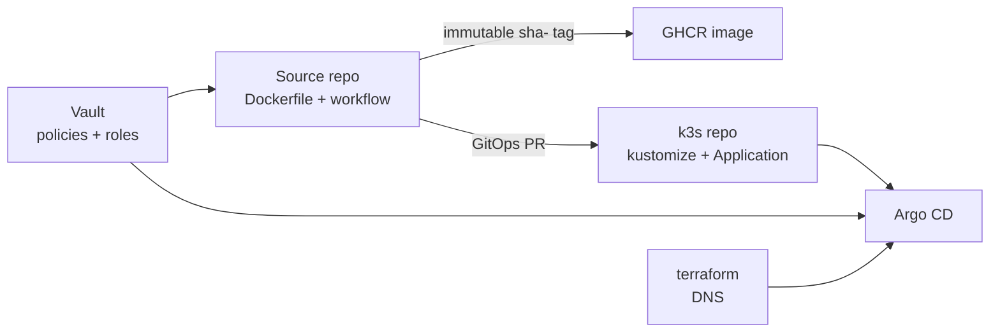

# Playbook: Onboarding a Source Repository to the GitOps Image Pipeline

This is the **orchestration** playbook for putting a new application on the Hetzner k3s
platform: what has to happen, in which repository, and in what order. Thirteen repositories
now follow it, and the detailed procedure for each step lives in the repository that owns it.
This note exists because those steps are spread across three repositories with no single
entry point, and because the ordering constraints between them are the part that actually
goes wrong.

Read the linked document at each step rather than working from this page alone.

## The shape



Three repositories, three owners: the source repo owns the build and the handoff metadata,
`wesen/2026-03-27--hetzner-k3s` owns desired cluster state, `wesen/terraform` owns DNS.

## Order of operations

The steps are ordered by their dependencies, not by convenience. Several fail with errors
that name neither the cause nor the missing piece.

### 1. DNS first

The hostname must resolve to the cluster ingress **before** Argo syncs, or cert-manager
cannot solve the HTTP-01 challenge. A single hostname uses HTTP-01 and needs no DNS
credential in the cluster; only a **wildcard** certificate requires DNS-01 and a provider
token — see
[[Projects/2026/06/17/PROJECT REPORT - Workshops Wildcard DNS and TLS - DigitalOcean Delegation Deep Dive]].

Zones live in `terraform/dns/zones/`. Check the provider before copying any record map:
`hyperslop.systems` is Cloudflare (`content`, separate `priority`, no `tags`, no trailing
dot), the others are DigitalOcean (`value`).

### 2. Vault paths, policy and role

Runtime secrets at `kv/apps/<app>/<env>/...`, plus `kv/apps/<app>/<env>/image-pull` if the
GHCR package is private. Commit the policy and role to `vault/policies/kubernetes/` and
`vault/roles/kubernetes/` in the k3s repo, then apply:

```bash
bash scripts/bootstrap-vault-kubernetes-auth.sh
```

The files are the durable artifact; the script only applies them. A Vault object with no
file in git is drift — `datalab-gitops-pr` and `datalab-private-dependencies` both reached
that state.

Detail: `2026-03-27--hetzner-k3s/docs/app-runtime-secrets-and-identity-provisioning-playbook.md`.
For mail specifically, [[Research/playbooks/infra/PLAYBOOK - Per-Application SES Sending Identity]].

#### 2a. Private GHCR image-pull credential: create, seed, and prove it

A private GHCR image needs a **third** credential boundary, separate from both CI credentials in
§3. The Pod uses a Docker-compatible `imagePullSecret`; Vault Secrets Operator (VSO) renders it
from `kv/apps/<app>/<env>/image-pull`. It is a runtime credential, not a GitOps PR credential
and not a GitHub Actions credential.

GitHub Container Registry currently requires a **classic personal access token (PAT)** for this
non-Actions registry pull. Create it from an account that has read access to the package:

1. In a browser, open `https://github.com/settings/tokens/new` and complete GitHub's sudo
   authentication. Passkey/security-key approval is human-in-the-loop; the operator completes it
   in the browser before the agent continues.
2. Give the token an app- and environment-specific note, for example
   `hair-booking-k3s-ghcr-pull (rotate YYYY-MM-DD)`.
3. Keep GitHub's deliberately short expiration (30 days unless an operator chooses otherwise) and
   record the rotation date in the note. Select **only** `read:packages`; do not select
   `write:packages`, `delete:packages`, `repo`, or any unrelated scope.
4. If the `wesen` organization enforces SSO, authorize the token for that organization.
5. GitHub displays the token only once. The agent must **never** read it aloud, return it in a
   tool result, put it in a prompt, commit it, or attempt to scrape it from the browser. Ask the
   operator to copy it to a restrictive temporary file such as `/tmp/ghcr-token-<app>.txt`.

Use a dedicated machine-user credential per app where possible. Do not copy a working app's
Vault record to a new app: shared readers make revocation and incident scope needlessly broad.
GitHub Apps and their installation tokens are suitable for GitOps PR automation, but cannot
currently authenticate a Kubernetes pull from private GHCR; `GITHUB_TOKEN` is likewise
short-lived and only exists inside an Actions run.

After the operator has created the temporary file, validate the credential and write it directly
to Vault without printing it. The following pattern removes the file even when an intermediate
step fails:

```bash
set -euo pipefail
secret_file=/tmp/ghcr-token-<app>.txt
app=<app>
env=prod
ghcr_username=<github-machine-user>

[[ -s "$secret_file" ]] || { echo "missing GHCR token file" >&2; exit 1; }
chmod 600 "$secret_file"
trap 'rm -f "$secret_file"' EXIT

ghcr_token="$(tr -d '\r\n' < "$secret_file")"
[[ "$ghcr_token" =~ ^(ghp_|github_pat_) ]] || {
  echo "unexpected GHCR token format" >&2
  exit 1
}

# Test package access without emitting the PAT or the registry bearer token.
status="$(printf 'user = "%s:%s"\n' "$ghcr_username" "$ghcr_token" |
  curl --silent --show-error --output /dev/null --write-out '%{http_code}' --config - \
    "https://ghcr.io/token?service=ghcr.io&scope=repository%3Awesen%2F${app}%3Apull")"
[[ "$status" == 200 ]] || { echo "GHCR authorization failed: HTTP $status" >&2; exit 1; }

auth_b64="$(printf '%s:%s' "$ghcr_username" "$ghcr_token" | base64 | tr -d '\n')"
vault kv put "kv/apps/${app}/${env}/image-pull" \
  server=ghcr.io \
  username="$ghcr_username" \
  password="$ghcr_token" \
  auth="$auth_b64" \
  source="dedicated ${app} GHCR pull PAT" >/dev/null
unset ghcr_token auth_b64
```

The destination `VaultStaticSecret` must transform the four fields into a
`kubernetes.io/dockerconfigjson` Secret and its ServiceAccount must reference that Secret in
`imagePullSecrets`. Confirm VSO has refreshed it, then inspect the new Pod:

```bash
kubectl -n <app> get vaultstaticsecret <app>-ghcr-pull
kubectl -n <app> get pods
kubectl -n <app> describe pod <new-pod-name>
```

VSO refreshes the Secret according to `refreshAfter` (normally 30 seconds). A Pod already in
`ImagePullBackOff` may retain its retry backoff after the secret update; delete **only that failed
Pod** and let its Deployment recreate it. Do not delete the Deployment, PVC, or VSO resources.
A successful `Pulled` event proves registry access only; wait for `Ready` and check application
logs before declaring rollout health.

### 3. CI credentials

Two separate credentials, routinely confused:

| Credential | Purpose | Where |
|---|---|---|
| GitOps PR App credential at `kv/ci/github/<repo>/gitops-pr-app` | open the deployment PR | `docs/github-actions-vault-oidc-playbook.md` (k3s) |
| Private-dependency App credential | resolve private Go modules at build time | `infra-tooling/docs/go-go-golems/playbooks/private-go-module-authentication-playbook.md` |

Use `gitops_pr_token_source: github_app`. The `vault` and `secret` modes read long-lived
PATs and are deprecated; a PAT that expires fails at `git clone`, far from its cause.

Each source repository gets its **own** `gitops-pr-app` path. Borrowing another repo's
re-creates the shared credential that `TF-012` removed.

> [!warning] The two roles need different bound claims
> A GitOps PR role binds `ref: refs/heads/main` and `event_name: push`, because opening a
> deployment PR is only legitimate from a trusted `main` push. A private-dependency role
> must **not**: it is used by `test` and `lint` on pull requests, and those claims make every
> PR build fail at the Vault step with what looks like a misconfigured role.
>
> The same `event_name: push` binding means a `workflow_dispatch` re-run of a failed publish
> cannot authenticate. That is deliberate, not a bug.

### 4. Source repository

`Dockerfile`, `deploy/gitops-targets.json`, and a workflow calling the shared
`go-go-golems/infra-tooling/.github/workflows/publish-ghcr-image.yml@main`. Grant
`id-token: write`.

Prefer `paths-ignore` for `.github/**`, `docs/**`, `ttmp/**` and `*.md` so documentation
changes do not publish an image and open a deployment PR.

Detail: `2026-03-27--hetzner-k3s/docs/app-deployment-pipeline.md` and
`infra-tooling/docs/platform/source-repo-to-gitops-pr.md`.

> [!warning] If the module set is private, budget a session for CI, not a step
> Onboarding turboproof and agentlogic — both importing the private
> `hyperslop-systems/pbui` — cost far more than the deployment itself, in three ways
> that all present as something other than what they are. The detail is in
> `infra-tooling/docs/go-go-golems/playbooks/private-go-module-authentication-playbook.md`;
> the orchestration-level warnings are:
>
> - **Every job that typechecks needs the credential**, not just build and test:
>   `golangci-lint`, `govulncheck`, `gosec` and CodeQL each fail differently and only
>   `go build` names the cause. Add `setup-private-go` to all of them at once.
> - **A green CI run does not prove the job is configured right.** `setup-go`'s module
>   cache is shared across jobs in a run, so a job with no credential passes while a
>   sibling job warms the cache — until the first push to a branch with a cold cache.
> - **A new profile in the shared workflow does not reach an old run.** The `@main` ref
>   resolves when a run starts, so re-running the failure after merging the profile
>   reproduces it exactly. Trigger a new run instead.

### 4a. Advanced Security jobs on a private repository

A generated repository usually arrives with `dependency-review` and CodeQL jobs. Both need
**GitHub Advanced Security**, which private repositories here do not have, so both fail from
the first pull request with messages that sound like configuration errors — "Dependency
review is not supported on this repository", "Advanced Security must be enabled".

Guard them on visibility rather than deleting them, so they return by themselves if the
repository is ever made public:

```yaml
if: github.event.repository.visibility == 'public'
```

Use that rather than `!= 'private'`: an *internal* repository is not private and still has no
Advanced Security, so the negative form re-enables a job that cannot pass. TruffleHog,
`govulncheck` and `gosec` need no Advanced Security and should keep running.

### 5. The kustomize package

Namespace, ServiceAccount, VaultConnection/VaultAuth/VaultStaticSecret, Deployment, Service,
Ingress, NetworkPolicy.

If the application needs storage, the PVC and the workload that mounts it **must share the
same Argo sync wave** — `local-path` is `WaitForFirstConsumer`, so a PVC in an earlier wave
deadlocks. This is now enforced by a render-time validator; see
[[Research/playbooks/infra/PLAYBOOK - Argo CD Application with a local-path PVC on k3s]].

If the application makes outbound connections other than DNS and HTTPS, the NetworkPolicy
needs an explicit egress rule. SMTP on TCP 587 is the case that has bitten.

### 6. Register the Application — merging is not enough

This cluster has no app-of-apps or ApplicationSet layer. A new `Application` does not appear
because its file reached `main`, and the AppProject allowlist has the same property: the file
gains a namespace, the live object does not.

```bash
kubectl apply -f gitops/projects/<project>.yaml     # or the Application is rejected
kubectl apply -f gitops/applications/<app>.yaml
```

Skipping the first produces a genuinely confusing failure — the Application appears, sits at
`Unknown/Unknown`, and only `.status.conditions` explains why:

```text
InvalidSpecError: application destination server '...' and namespace '<ns>'
do not match any of the allowed destinations in project '<project>'
```

### 7. Prove it end to end

Push to `main`, then confirm in order: the image published; a GitOps PR opened, authored by
`app/wesen-gitops-pr-bot` (a PR authored by a **user** means the caller is still in PAT
mode — the commit author is hardcoded to `github-actions[bot]` in every mode and
distinguishes nothing); Argo reaches `Synced/Healthy`; the service answers over HTTPS with a
valid certificate.

Do not treat an HTTP 200 as proof that an endpoint exists. Caddy's
`try_files {path} {path}/ /index.html` answers **any** unrouted path, including a POST, with
`index.html` and status 200. Check the content type.

Do not treat quiet logs as proof of success unless you have confirmed the service writes
logs at all.

## Common failure modes

| Symptom | Cause |
|---|---|
| Application `Unknown/Unknown` | AppProject allowlist not applied — §6 |
| Lint green on pull requests, red on the first push to `main` | the job has no private-module credential and was passing on a sibling job's warm module cache — §4 |
| `Unsupported private_dependencies_profile` persists after merging the profile | the run predates the merge; `@main` resolves at run start, so re-running cannot fix it — §4 |
| `role "<repo>-private-dependencies" could not be found` | the Vault role was never created; a declaration file alone does not create it — §2 |
| `claim "repository" does not match any associated bound claim values` | the repository was renamed or moved owners after the role was written — §2 |
| `Dependency review is not supported on this repository` | Advanced Security, not a workflow error — §4a |
| Vault step fails on a `workflow_dispatch` re-run | role binds `event_name: push` — §3 |
| Every PR build fails at the Vault step | private-dependency role copied GitOps PR bound claims — §3 |
| PVC `Pending`, sync never advances | PVC in an earlier wave than its workload — §5 |
| Sends hang until timeout | NetworkPolicy has no egress rule for the port — §5 |
| Certificate never issues | DNS not resolving before sync — §1 |
| GitOps PR never opens, image published fine | CI credential: path not seeded, or policy not applied — §3 |
| New Pod reports `ErrImagePull` / GHCR HTTP 403 | The app's `kv/apps/<app>/<env>/image-pull` credential is expired, unauthorized for that package, or has malformed Docker config — §2a |
| New image pulls but the container CrashLoops | Registry access is fixed; read `kubectl logs --previous` and treat the startup failure as a separate application/image defect |

## Related

- `2026-03-27--hetzner-k3s/docs/app-deployment-pipeline.md` — the canonical per-file detail.
- `2026-03-27--hetzner-k3s/docs/github-actions-vault-oidc-playbook.md` — CI to Vault.
- `infra-tooling/docs/go-go-golems/playbooks/github-app-gitops-pr-migration-playbook.md` —
  moving an existing repo off PAT mode.
- `infra-tooling/docs/go-go-golems/playbooks/private-go-module-authentication-playbook.md` —
  private Go module access in CI.
- [[Projects/2026/07/29/ARTICLE - Static Site Delivery Through GHCR GitOps Argo CD and Cloudflare]]
  — the static-site variant, where a publisher Job replaces the Deployment.
- [[Projects/2026/07/31/PROJECT REPORT - Hyperslop Mailing List - Double Opt-In Service from Zero to Production]]
  — a worked example of every step above, including what went wrong.
