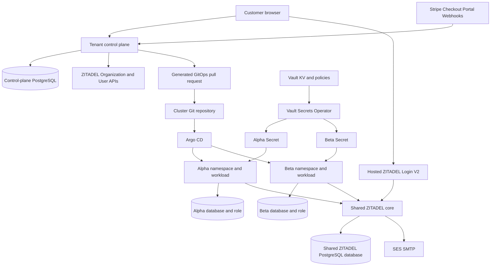
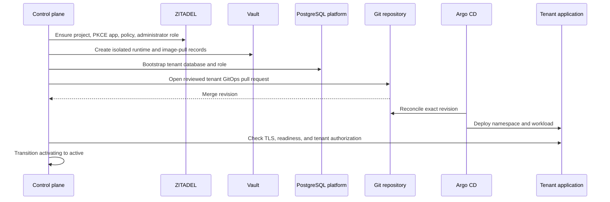

# Playbook: Production Multi-Tenant ZITADEL SaaS Platform on k3s

This playbook expands a working single-application ZITADEL deployment into a SaaS platform with customer-owned ZITADEL organizations, organization-scoped OIDC applications, isolated Kubernetes namespaces, Vault paths, PostgreSQL databases and roles, delegated customer administration, subscription projection, and a self-service onboarding control plane. It is based on the accepted Alpha/Beta production tenant experiment and the completed Phase 1/2 tenant-control-plane implementation in `zitadel-go-test`.

The playbook treats multitenancy as a set of independently enforced boundaries. A ZITADEL organization claim does not replace SQL ownership. A namespace does not replace a Vault policy. A unique hostname does not replace a unique OIDC client. Every layer receives explicit tenant context, and acceptance attempts to cross each boundary.

> [!summary]
> - One shared ZITADEL instance owns many customer organizations. Each organization owns its project, public PKCE application, login policy, users, and delegated `ORG_OWNER` administrators.
> - Each runtime tenant receives a namespace, service accounts, Vault roles and paths, PostgreSQL database and role, hostname, session key, CSRF key, and immutable deployment declaration.
> - Applications request `urn:zitadel:iam:org:id:<organization-id>` and reject identities whose `urn:zitadel:iam:user:resourceowner:id` differs from the configured tenant organization.
> - Terraform owns stable platform and pilot resources. The onboarding control plane owns customer organization creation and verified initial administrator flow. Git remains the nonsecret desired-state authority; Vault remains the credential authority.
> - Activation requires identity, subscription, Git merge, Argo health, TLS, readiness, and negative isolation evidence. A successful API call or green controller alone is insufficient.

> [!warning] Scope of current evidence
> The shared ZITADEL instance, SES verification/recovery, Stripe sandbox billing, branding reconciliation, and static Alpha/Beta tenants have production acceptance evidence. The self-service control plane has complete local/live-provider Phase 1/2 acceptance but still requires its own production GitOps package before public exposure. Stripe live-money rollout remains gated by approved live credentials, legal/Tax decisions, live catalog ownership, and endpoint acceptance. Do not represent those gates as complete.

## 1. Start from the single-application production baseline

Complete [[Research/playbooks/infra/PLAYBOOK - Production ZITADEL for a Single Go Web Application on k3s]] first. The following must already work:

- shared ZITADEL and Login V2 are healthy behind trusted TLS;
- PostgreSQL is backed up and restore-tested;
- Vault and VSO deliver namespace-scoped Secrets;
- external email verification and password recovery work;
- a Go application completes Code + S256 PKCE callbacks;
- identity is keyed by `(issuer, subject)`;
- session and CSRF security is accepted;
- Argo CD owns Kubernetes desired state;
- Terraform can create stable ZITADEL resources without drift.

Do not introduce customer organizations while the base issuer, SMTP, or recovery path is unstable. Tenant isolation increases the number of resources that depend on those shared services.

## 2. Define the tenant model

A tenant is one directly subscribed customer business. Its identity and runtime resources are isolated from every peer tenant.

A tenant receives:

```text
ZITADEL organization
ZITADEL project owned by that organization
public PKCE web application
organization login policy
initial verified administrator
organization-scoped administrator role
Kubernetes namespace
runtime and database-bootstrap service accounts
Vault runtime and image-pull paths
Vault Kubernetes auth roles and policies
PostgreSQL database and login role
public hostname and certificate
session and CSRF keys
Argo CD Application
```

A tenant user is a person owned by the customer organization. An independently subscribed downstream business is not merely another user; it needs another tenant boundary and billing relationship.

Keep these lifecycle axes separate:

| Axis | Example states | Authority |
|---|---|---|
| Onboarding | draft, organization created, administrator verified, provisioning, active, expired | Tenant control plane |
| Subscription | none, trialing, active, past due, canceled, unpaid | Signed Stripe events projected locally |
| Access | pending, enabled, grace, suspended, archived | Product policy derived from verified state |
| Deployment | proposed, merged, syncing, healthy, degraded | Git and Argo CD |

Do not compress them into one status. Payment failure does not erase the identity organization. Deployment failure does not invalidate Stripe evidence. Cleanup of an abandoned pre-subscription organization does not imply a canceled subscription.

## 3. Establish invariants before generating resources

The platform must enforce these invariants:

1. Identity is `(issuer, subject)`, never email.
2. Every tenant authorization request includes its organization scope.
3. Every callback validates the resource-owner organization claim.
4. A customer administrator receives `ORG_OWNER` or another approved organization role, never `IAM_OWNER`.
5. The onboarding provisioner receives only the narrow instance authority needed to create organizations, currently `IAM_ORG_MANAGER`.
6. Tenant applications have no organization-creation authority.
7. Terraform does not manage passwords, sessions, factors, recovery codes, invitation links, or ordinary users.
8. Git contains no secret values.
9. Vault roles bind exact service accounts and namespaces.
10. Every tenant database uses a distinct login role.
11. Every user-owned application query includes a local owner predicate.
12. Browser sessions remain opaque and server-side.
13. Provisioning and cleanup are idempotent and leased.
14. Activation requires observed health and isolation, not desired state alone.

Put these rules in repository `AGENTS.md`, validation scripts, tests, and review checklists. Documentation without enforcement will drift.

## 4. Full architecture



The shared services are ZITADEL, Login V2, PostgreSQL infrastructure, Vault, VSO, Traefik, cert-manager, Argo CD, SES, Stripe, and observability. Customer data paths are explicit and isolated.

## 5. Choose static pilot or dynamic customer provisioning

There are two valid provisioning modes.

### 5.1 Static pilot tenants

Use Terraform for a small, operator-managed set such as Alpha and Beta. The reference root is:

```text
/home/manuel/code/wesen/terraform/zitadel/toy-tenants/envs/prod
```

It declares organizations, tenant-owned projects, PKCE applications, and login policies. This mode is useful for proving boundaries before opening self-service onboarding.

### 5.2 Dynamic customer tenants

Use the control plane for ordinary customer organization lifecycle. Do not run Terraform once per signup. Concurrent mutable Terraform state, secret-bearing user lifecycle, and partially reversible onboarding do not fit the request path.

Terraform still owns:

- the shared ZITADEL deployment and stable platform organization;
- dedicated control-plane PKCE application;
- the `tenant_provisioner` machine user;
- `IAM_ORG_MANAGER` membership;
- machine credential creation and approved delivery;
- stable policies and platform configuration.

The control plane owns:

- pending organization creation;
- initial administrator verification;
- expiry and cleanup;
- runtime tenant provisioning requests;
- correlation between identity, subscription, and GitOps state.

Use the static pilot first. Promote the templates and tests into dynamic provisioning only after cross-tenant denial is proven.

## 6. Declare static tenant identity resources

A Terraform map can define pilot tenants:

```hcl
variable "tenants" {
  type = map(object({
    organization_name = string
    project_name      = string
    application_name  = string
    public_url        = string
  }))
}

resource "zitadel_organization" "tenant" {
  for_each = var.tenants
  name     = each.value.organization_name
}

resource "zitadel_project_v2" "tenant" {
  for_each               = var.tenants
  org_id                 = zitadel_organization.tenant[each.key].id
  name                   = each.value.project_name
  project_role_check     = true
  has_project_check      = true
  project_role_assertion = false
}
```

Each OIDC application belongs to the tenant organization and project:

```hcl
resource "zitadel_application_v2" "web" {
  for_each   = var.tenants
  org_id     = zitadel_organization.tenant[each.key].id
  project_id = zitadel_project_v2.tenant[each.key].id
  name       = each.value.application_name

  oidc {
    redirect_uris             = ["${each.value.public_url}/auth/callback"]
    post_logout_redirect_uris = ["${each.value.public_url}/"]
    response_types            = ["OIDC_RESPONSE_TYPE_CODE"]
    grant_types               = ["OIDC_GRANT_TYPE_AUTHORIZATION_CODE"]
    app_type                  = "OIDC_APP_TYPE_WEB"
    auth_method_type          = "OIDC_AUTH_METHOD_TYPE_NONE"
    version                   = "OIDC_VERSION_1_0"
    dev_mode                  = false
    access_token_type         = "OIDC_TOKEN_TYPE_BEARER"
    id_token_userinfo_assertion = true
  }
}
```

Use exact tenant HTTPS callback URLs. Do not reuse one client across tenant hosts. A unique client gives each tenant an independent callback allowlist and auditable project boundary.

The login policy should allow approved local methods and registration behavior. Keep external IdPs disabled until each provider and domain policy is designed.

Supply the production PAT only at the process boundary:

```bash
export TF_VAR_zitadel_access_token="$(<approved-token-file)"
AWS_PROFILE=production terraform init
AWS_PROFILE=production terraform plan
```

Do not store PATs, machine keys, generated user credentials, or invitation links in tfvars, plans, logs, or shell history.

After apply:

```bash
terraform plan -detailed-exitcode
```

Require exit `0`. Export a sanitized tenant inventory containing only organization IDs, client IDs, and public URLs for the provisioning handoff.

## 7. Organization-scoped OIDC in every tenant application

Each tenant application adds this scope to authorization:

```text
urn:zitadel:iam:org:id:<tenant-organization-id>
```

After token and UserInfo validation, enforce this claim:

```text
urn:zitadel:iam:user:resourceowner:id
```

The accepted resource owner must equal the configured tenant organization ID.

```pseudo
identity = exchangeAuthorizationCode(code, state, pkceVerifier)

require identity.issuer == configuredIssuer
require identity.audience contains configuredClientId
require identity.resourceOwner == configuredTenantOrganizationId
require identity.emailVerified == true

localUser = upsertByIssuerAndSubject(identity.issuer, identity.subject)
createOpaqueSession(localUser)
```

The organization scope influences hosted login. The resource-owner check enforces application admission. Do not assume the requested scope guarantees the returned user's organization.

Negative acceptance must attempt:

- Alpha identity against Beta application;
- Beta identity against Alpha application;
- default/platform organization identity against either tenant;
- valid identity with a peer callback client;
- replayed state or callback code.

The application must create no local user or session for any denied attempt.

## 8. Use generated numeric organization IDs for Login V2

Organization Service v2 accepts caller-selected UUID organization IDs, but Login V2 v4.16.1 interprets the hosted organization parameter numerically. A UUID beginning with `48...` was reduced to `48`, and registration landed in the default organization.

For dynamic tenants:

1. Generate an internal correlation UUID.
2. Construct an exact unique name such as `Customer Name [2d0ee95b]`.
3. Store both before the external call.
4. Call `AddOrganization` without `organization_id`.
5. Persist ZITADEL's generated numeric ID.
6. Search by exact correlated name on retry.
7. Resolve by exact name during cleanup if no numeric ID was committed.

```pseudo
correlationKey = randomUUID()
correlatedName = boundedName(displayName, firstEight(correlationKey))
insertDraft(correlationKey, correlatedName)

existing = findOrganizationByExactName(correlatedName)
if existing absent:
    existing = addOrganization(name = correlatedName)

persistGeneratedOrganizationId(existing.id)
```

Do not expose the organization ID as browser input. Store it as opaque text and use it in the OIDC organization scope and resource-owner comparison.

## 9. Provision each tenant's Vault boundary

Use one runtime path and optional image-pull path per tenant:

```text
kv/apps/todo-tenant-alpha/prod/runtime
kv/apps/todo-tenant-alpha/prod/image-pull
kv/apps/todo-tenant-beta/prod/runtime
kv/apps/todo-tenant-beta/prod/image-pull
```

The runtime record contains:

```text
TODO_DEMO_DATABASE_URL
TODO_DEMO_OIDC_CLIENT_ID
TODO_DEMO_ZITADEL_ORGANIZATION_ID
TODO_DEMO_SESSION_KEY
TODO_DEMO_CSRF_KEY
```

Generate independent session and CSRF keys for every tenant. Reusing keys increases blast radius and makes accidental cross-host cookie acceptance harder to diagnose.

Each policy reads only its tenant paths:

```hcl
path "kv/data/apps/todo-tenant-alpha/prod/runtime" {
  capabilities = ["read"]
}
path "kv/data/apps/todo-tenant-alpha/prod/image-pull" {
  capabilities = ["read"]
}
```

Each Kubernetes role binds exact namespace and service account:

```json
{
  "bound_service_account_names": ["todo-tenant"],
  "bound_service_account_namespaces": ["todo-tenant-alpha"],
  "policies": ["k8s-todo-tenant-alpha"],
  "ttl": "1h"
}
```

Create a separate database-bootstrap policy and service account. It may read the shared PostgreSQL administrator record plus that tenant's desired database credential. The runtime service account may not.

Acceptance should request peer Vault paths with each tenant identity and require permission denial. Checking only that the intended path succeeds is incomplete.

## 10. Provision separate PostgreSQL databases and roles

The shared PostgreSQL service may host tenant databases, but each tenant receives:

```text
database: todo_tenant_alpha
role:     todo_alpha
```

and a separate pair for Beta. Never reuse the platform administrator, ZITADEL role, or another tenant role.

The idempotent bootstrap Job:

1. validates database and role identifiers;
2. creates or rotates the login role;
3. creates the database when absent;
4. assigns ownership to the tenant role;
5. grants only required database privileges;
6. exits without printing credentials.

The runtime DSN points only to the tenant database as the tenant role.

Cross-database acceptance should execute from each tenant pod or with its runtime credential:

```text
Alpha role → Alpha database: allowed
Alpha role → Beta database: denied
Beta role  → Beta database: allowed
Beta role  → Alpha database: denied
```

Also verify the role cannot create databases, create roles, or access the PostgreSQL administrator database beyond what the platform permits.

Application SQL still includes local user ownership predicates. Database-per-tenant isolation and row ownership solve different boundaries.

## 11. Build one Kustomize base and explicit overlays

The reference shape is:

```text
gitops/kustomize/todo-tenant/
  base/
    namespace.yaml
    serviceaccount.yaml
    db-bootstrap-serviceaccount.yaml
    vault-connection.yaml
    vault-auth.yaml
    db-bootstrap-vault-auth.yaml
    runtime-secret.yaml
    image-pull-secret.yaml
    postgres-admin-secret.yaml
    db-bootstrap-script-configmap.yaml
    db-bootstrap-job.yaml
    deployment.yaml
    service.yaml
    ingress.yaml
    network-policy.yaml
    kustomization.yaml
  overlays/prod/alpha/
    kustomization.yaml
    tenant-patch.yaml
  overlays/prod/beta/
    kustomization.yaml
    tenant-patch.yaml
```

The base defines structure and security. Each overlay changes only tenant-specific values:

- namespace;
- Vault Kubernetes role names;
- Vault paths;
- public hostname and TLS Secret;
- tenant label;
- references to tenant runtime data.

Do not place organization ID, OIDC client ID, DSN, session key, or CSRF key directly in the overlay. VSO renders them from the tenant Vault path.

Use one explicit Argo Application per pilot tenant:

```text
gitops/applications/todo-tenant-alpha.yaml
gitops/applications/todo-tenant-beta.yaml
```

The AppProject must allow both destination namespaces. An application fails before rendering if its destination is not permitted; this is a useful policy gate.

Do not introduce an ApplicationSet solely to reduce two small manifests. Add generation only when tenant count and repeated operational work justify it, and preserve reviewable per-tenant desired state.

## 12. Harden the tenant Deployment

The base Deployment should use:

- immutable image digest;
- one replica until capacity and rollout semantics are understood;
- `runAsNonRoot` and explicit UID/GID;
- `RuntimeDefault` seccomp;
- read-only root filesystem;
- all Linux capabilities dropped;
- CPU and memory requests/limits;
- liveness and readiness probes;
- disabled service links;
- no unnecessary service-account token;
- PostgreSQL-backed sessions.

The reference environment injects:

```text
TODO_DEMO_PUBLIC_URL
TODO_DEMO_ZITADEL_ISSUER
TODO_DEMO_DATABASE_URL
TODO_DEMO_ZITADEL_CLIENT_ID
TODO_DEMO_ZITADEL_ORGANIZATION_ID
TODO_DEMO_SESSION_KEY
TODO_DEMO_CSRF_KEY
```

Each host gets a distinct Ingress and TLS Secret. Cookies should be host-only unless a product requirement and threat review explicitly justify a parent domain.

PostgreSQL-backed sessions store only a SHA-256 hash of the random browser session identifier. This permits pod replacement and later replication without putting token claims or profiles into cookies.

## 13. Tenant NetworkPolicy

Start with default-deny semantics for selected tenant pods. Allow:

- ingress from Traefik to the HTTP port;
- DNS to kube-dns;
- PostgreSQL to the shared PostgreSQL pods on 5432;
- OIDC backchannel traffic through the approved Traefik/internal issuer route;
- approved external HTTPS services;
- required telemetry.

Do not permit direct access to another tenant namespace. Namespace separation alone does not block network traffic unless policy selects and denies it.

The public issuer hairpin problem remains: the pod must validate `https://zitadel...` while reaching an in-cluster route. The reference uses a Traefik ClusterIP host alias. Prefer a stable cluster DNS or internal load-balancer solution that retains the public hostname and certificate. If using a fixed ClusterIP, validate it as part of GitOps checks and upgrade procedures.

## 14. Delegate customer administration safely

The first customer administrator eventually receives an organization-scoped role, typically `ORG_OWNER`, in the customer organization.

Never grant:

```text
IAM_OWNER
instance administrator roles
roles in the platform organization
roles in another customer organization
```

Grant only after:

- the identity is verified;
- the identity's resource owner matches the tenant organization;
- subscription policy permits activation;
- the role assignment operation carries explicit organization context;
- the resulting session is tested against peer and instance administration APIs.

Acceptance for an organization owner includes:

- list and manage users in its own organization;
- inability to list or modify peer organization users;
- inability to access instance settings;
- inability to assign broader roles than the approved allowlist;
- inability to change the platform organization's policies.

Terraform should not manage ordinary customer users or their factors. Use supported ZITADEL APIs and hosted flows.

## 15. Deploy the tenant control plane

The control plane is a separate Go binary, `cmd/tenant-control-plane`. It needs its own namespace, database, runtime Secret, public hostname, PKCE client, and service identity.

Its deployment should include:

```text
Deployment and Service
HTTPS Ingress
NetworkPolicy
VaultConnection and VaultAuth
VaultStaticSecret for database URL and browser key
VaultStaticSecret or VSO-delivered file for provisioner machine key
separate PostgreSQL database and role
liveness and readiness probes
non-root distroless image
```

Do not embed the provisioner credential in the image or Git. In local Compose the mode-0600 key is mounted through a host ownership bridge; production must use Vault/VSO.

The service identity has `IAM_ORG_MANAGER`, not `IAM_OWNER`. The public browser client is a separate PKCE application.

The control plane persists:

- explicit onboarding/subscription/access states;
- stable organization correlation key and name;
- generated ZITADEL organization ID;
- pending and verified administrator identity;
- one-time OIDC state hash, nonce, and PKCE verifier;
- opaque session hashes;
- provisioning and cleanup leases;
- sanitized audit events;
- rate-limit buckets.

It does not persist passwords, factors, verification codes, invitation links, access tokens, ID tokens, raw cookies, or webhook bodies.

Before public production exposure, repeat the completed local/live-provider acceptance through the production issuer and mail provider. Do not infer production completion from local acceptance.

## 16. Initial administrator verification

Dynamic onboarding uses a two-callback protocol.

The first organization-scoped callback may return `email_verified=false`. It must still satisfy issuer, audience, resource-owner organization, requested email, state, nonce, and PKCE checks. The control plane reserves the candidate `(issuer, subject)` but does not advance to administrator verified and does not create a session.

It then atomically claims a ten-minute delivery slot in PostgreSQL and calls User Service v2 `SendEmailCode` using the `send_code` oneof. It never asks ZITADEL to return the code.

After hosted verification, the user begins a fresh organization-scoped OIDC flow. The callback binds only when:

```text
issuer == pending issuer
subject == pending subject
resource owner == generated tenant organization ID
normalized email == requested administrator email
email_verified == true
```

A combined PostgreSQL unique index spans pending and verified identity columns, preventing one subject from being pending for one tenant while already verified for another under the current product rule.

See [[ARTICLE - Deep Dive - Completing the ZITADEL SaaS Tenant Control Plane]] for the complete persistence and callback design.

## 17. Public rate limits and request idempotency

A signed request token and unique request hash make one browser form idempotent. They do not prevent a client from requesting many fresh forms.

The control plane applies PostgreSQL-backed fixed windows before organization creation:

```text
global: 50 starts per 10 minutes
requested email: 5 starts per hour
```

The email dimension is an HMAC-SHA-256 digest under the browser key. PostgreSQL never receives the raw email as a rate-limit key.

The rate-limit upsert increments only while `attempts < limit`; `pgx.ErrNoRows` means denial. HTTP returns 429 with `Retry-After`. The worker removes expired buckets.

Tune limits from production traffic and abuse telemetry, but preserve the durable database decision. Do not replace it with per-pod memory counters.

## 18. Stripe subscription boundary

The tenant control plane should advance provisioning only from signed Stripe webhook evidence. A Checkout success redirect is a user-experience signal, not billing authority.

Terraform owns stable Stripe catalog resources such as Product, Price, and approved Tax behavior. It does not own runtime Customers, Checkout Sessions, subscriptions, invoices, Portal Sessions, or Test Clocks.

The application or control plane owns:

- server-selected Price authorization;
- Checkout idempotency;
- signed webhook inbox;
- atomic webhook claiming;
- subscription projection;
- access policy derived from projection;
- Customer Portal creation.

Keep webhook signing secrets in Vault. If security policy forbids them in Terraform state, create/rotate endpoints operationally and stream the one-time secret directly to Vault. Support overlapping current/previous signing secrets during rotation.

Live-money activation remains a separate gate. Require approved live credentials, legal entity and Tax decisions, catalog inventory/import, endpoint deployment, signed delivery acceptance, refund/cancellation behavior, and monitoring. Sandbox acceptance does not authorize live charging.

See [[PROJECT REPORT - Stripe Billing - End to End Subscription Infrastructure and Acceptance]].

## 19. GitOps activation sequence

Do not let the control plane mutate Kubernetes directly. It should generate a reviewable Git change for initial runtime activation.

A provisioning operation should produce:

```text
tenant namespace and labels
Vault policy and Kubernetes role declarations
Kustomize overlay
Argo CD Application
nonsecret tenant inventory
```

Secret values are written through an approved Vault operation, not placed in the pull request.

The activation sequence is:



Use PostgreSQL leases around each resumable provisioning step. Persist every external ID immediately. A stale worker cannot complete a transition after its lease expires.

Activation requires the expected merged revision, not merely any healthy Argo state. Record the PR and merge commit. Verify the live Deployment image digest and configuration against that revision.

## 20. Branding and hosted identity UX

Use supported ZITADEL extension points:

- Label Policy;
- Assets API;
- Hosted Login translations.

Do not fork Login V2 solely for visual parity unless supported customization cannot meet an approved product requirement and the maintenance cost is accepted.

The reference GitOps package contains a scheduled branding reconciler. It uses pinned assets and configuration, a non-root container, read-only filesystem, bounded runtime, `concurrencyPolicy: Forbid`, and a controlled PAT file. It emits sanitized state and runs periodically to correct drift.

Branding reconciliation is not identity authorization. A failed logo upload must not disable resource-owner validation or broaden roles. Keep presentation and security policy operationally separate.

## 21. Multi-tenant validation before merge

Render every overlay:

```bash
kubectl kustomize gitops/kustomize/todo-tenant/overlays/prod/alpha >/tmp/alpha.yaml
kubectl kustomize gitops/kustomize/todo-tenant/overlays/prod/beta >/tmp/beta.yaml
kubectl apply --dry-run=client -f /tmp/alpha.yaml
kubectl apply --dry-run=client -f /tmp/beta.yaml
bash scripts/validate_gitops.sh
```

Automate comparisons that should differ:

```text
namespace
hostname
TLS Secret name
Vault role
Vault path
database name
database role
OIDC client ID
ZITADEL organization ID
session key
CSRF key
```

Automate comparisons that should match:

```text
issuer
immutable image digest
security context
health probe paths
resource policy baseline
base network-policy structure
```

Run application and control-plane tests:

```bash
go test -race ./... -count=1
go vet ./...
CGO_ENABLED=0 go build ./...
```

Run Terraform validation and zero-drift plans for stable roots. Run a secret scan across generated manifests and Git diff. Generated output must contain no Secret bytes, credentials, invitation links, or user PII.

## 22. Production acceptance matrix

### 22.1 Shared platform

- [ ] ZITADEL and Login V2 are healthy at pinned versions.
- [ ] Discovery issuer is exact through trusted TLS.
- [ ] Verification and recovery reach an external mailbox.
- [ ] PostgreSQL backup and scratch restore pass.
- [ ] Vault/VSO auth and refresh pass.
- [ ] Branding reconciler converges without credential output.

### 22.2 Tenant identity

For Alpha and Beta:

- [ ] Authorization includes the correct organization scope.
- [ ] User resource owner equals the tenant organization.
- [ ] Wrong-organization login creates no local user or session.
- [ ] Unverified email creates no application session.
- [ ] Callback replay fails.
- [ ] Logout returns only to the tenant hostname.
- [ ] Customer administrator has only approved organization authority.

### 22.3 Runtime isolation

- [ ] Argo Applications are Synced and Healthy.
- [ ] Tenant hostnames have trusted certificates.
- [ ] Runtime pods are non-root and use immutable image digests.
- [ ] Alpha Vault identity cannot read Beta paths.
- [ ] Beta Vault identity cannot read Alpha paths.
- [ ] Alpha database role cannot connect to Beta database.
- [ ] Beta database role cannot connect to Alpha database.
- [ ] NetworkPolicy blocks unapproved namespace paths.
- [ ] Sessions survive an application pod replacement.

### 22.4 Application ownership

Use two users per tenant where practical:

- [ ] A user cannot list or mutate another user's records inside the same tenant.
- [ ] Cross-tenant object identifiers produce no existence leak.
- [ ] Missing and invalid CSRF fail.
- [ ] Session cookies contain opaque identifiers only.

### 22.5 Subscription

- [ ] Browser cannot choose an unapproved Price ID.
- [ ] Checkout redirect alone does not enable paid access.
- [ ] Signed webhook projection enables the approved plan.
- [ ] Replayed and concurrent webhooks are idempotent.
- [ ] Customer Portal cancellation updates projection.
- [ ] Downgrade preserves data and applies documented quota behavior.
- [ ] Sandbox and live account roots cannot be confused.

### 22.6 Onboarding control plane

- [ ] Organization create retry produces no duplicate.
- [ ] Hosted registration uses the generated numeric organization ID.
- [ ] Unverified first callback stores only a pending candidate.
- [ ] ZITADEL owns the challenge.
- [ ] Verified resume requires the same subject.
- [ ] Public rate limits persist across restart and replicas.
- [ ] Expiry cleanup deletes the external organization.
- [ ] Direct API read confirms the organization is absent.
- [ ] Local sessions, flows, mail, and temporary credentials are removed.

## 23. Tenant lifecycle operations

### Add a static pilot tenant

1. Add the tenant to the Terraform map.
2. Apply and obtain organization/client identifiers through sanitized outputs.
3. Create independent runtime and image-pull secrets in Vault.
4. Add Vault policy and Kubernetes role files.
5. Create database role/database through bootstrap workflow.
6. Add a Kustomize overlay and explicit Argo Application.
7. Update AppProject destination allowlist.
8. Validate, review, merge, and sync.
9. Run the complete tenant identity and isolation acceptance.

### Rotate a tenant OIDC client

Public PKCE clients do not have a client secret, but client replacement still affects callback identity:

1. create the replacement application with exact URLs;
2. deliver its client ID through Vault/runtime config;
3. roll out the tenant application;
4. complete login/signup/logout acceptance;
5. revoke the old application only after active sessions and rollback policy are understood.

### Rotate tenant session and CSRF keys

A direct replacement invalidates sessions and forms. If forced logout is acceptable, rotate the Vault values and restart. If not, implement explicit key-ring overlap before rotation. Do not reuse one tenant's keys for another.

### Suspend access

Subscription state and access state are independent. A past-due or canceled subscription may transition access to grace or suspended according to product policy. Do not delete the organization or database immediately. Preserve recovery and export periods.

### Offboard a tenant

Use an explicit retention sequence:

```text
1. Stop new subscriptions and invitations.
2. Mark access suspended.
3. Export required customer and audit data.
4. Revoke organization administrator grants.
5. Disable OIDC application and tenant workload.
6. Back up tenant database under retention policy.
7. Remove Argo Application and namespace after approval.
8. Revoke Vault Kubernetes roles and delete runtime values.
9. Drop database and role after retention expires.
10. Delete ZITADEL organization through supported API.
11. Confirm direct reads return absent and Git/Vault contain no residue.
```

Do not use Argo pruning as the only offboarding workflow. It does not remove ZITADEL, Vault, PostgreSQL, Stripe, or retained customer data automatically.

## 24. Failure modes

| Symptom | Likely cause | Correct response |
|---|---|---|
| Hosted registration lands in default organization | Caller-selected UUID ID parsed numerically by Login V2 | Let ZITADEL generate numeric IDs; correlate by exact unique name |
| `Errors.User.GrantRequired` during tenant login | Project checks or user grant policy does not match application design | Inspect project role checks and grant workflow; do not disable all checks without review |
| Wrong tenant user reaches callback but is denied | Resource-owner validation working | Preserve denial; investigate scope/user selection rather than removing check |
| `failed to get state: state does not compare` | Different browser flow or replay | Restart authorization in the same browser context |
| `http: named cookie not present` | Cookie origin mismatch or new browser context | Use canonical hostname and preserve flow context |
| Tenant app cannot resolve shared PostgreSQL | Wrong service DNS or NetworkPolicy | Validate cluster service name and DNS/egress policy |
| Argo rejects destination namespace | AppProject allowlist missing tenant namespace | Add reviewed destination before sync |
| VSO Secret never appears | Role binding, policy path, or VaultAuth mismatch | Compare exact namespace, service account, KV v2 policy path, and CR status |
| Cross-tenant DB connection succeeds | Role/database privileges too broad | Stop rollout, revoke grants, recreate least-privilege roles, rerun denial tests |
| Sessions disappear after pod replacement | In-memory or cookie-only session mismatch | Use PostgreSQL-backed opaque sessions and stable Vault key |
| Verification banner appears but no mail | Notification provider failure | Inspect sanitized worker/provider state and external receipt |
| Healthy Argo app serves old image | Mutable tag or stale operation | Pin digest, inspect ReplicaSet, hard refresh, compare merged revision |
| Control-plane cleanup leaves organization | Lost correlation or provider delete failure | Reclaim lease; resolve by generated ID or exact correlated name; verify direct absence |

## 25. Observability and audit

Use stable internal onboarding UUIDs and bounded error codes. Do not log:

- requested or verified email;
- ZITADEL subject;
- session cookie or hash;
- OIDC state, nonce, code, or PKCE verifier;
- verification or recovery challenge;
- invitation link;
- Stripe raw webhook body or signing secret;
- Vault values;
- machine keys or PATs.

Useful metrics include:

```text
onboarding starts, denials, expiries, and completions
organization API latency and error classes
verification delivery claims and provider failures
OIDC callback result codes by non-PII category
worker lease acquisition, reclaim, and stale completion
Argo activation duration and failure phase
Vault/VSO sync readiness
PostgreSQL connection and storage pressure
subscription projection lag
cross-tenant denial test status
```

Tenant identifiers in metrics require a cardinality and privacy decision. Prefer bounded internal labels or aggregate counts.

## 26. Upgrade procedure

Upgrade the shared platform before tenant applications when protocol compatibility requires it.

1. Read ZITADEL core, Login V2, Helm chart, Terraform provider, and OIDC SDK release notes.
2. Back up ZITADEL PostgreSQL and verify scratch restore.
3. Render chart and GitOps diffs.
4. Test Login V2 organization scope, registration, verification, recovery, and resource-owner claims in non-production.
5. Upgrade core and Login V2 with compatible pins.
6. Verify all tenant discovery and callback URLs.
7. Run one positive and one wrong-organization login per tenant class.
8. Upgrade application images by digest.
9. Rerun session-persistence, Vault, database, TLS, and Argo checks.
10. Preserve migration-aware rollback constraints.

A shared identity upgrade affects every tenant. Do not rely on one platform-organization login as the only canary.

## 27. Completion checklist

- [ ] Single-application production baseline is healthy and restore-tested.
- [ ] Tenant model and lifecycle axes are documented.
- [ ] Terraform stable roots are isolated and zero-drift.
- [ ] Every tenant owns its organization, project, and PKCE application.
- [ ] Applications request organization scope and validate resource owner.
- [ ] ZITADEL-generated numeric IDs are used for dynamic organizations.
- [ ] Customer administrators receive organization roles only.
- [ ] Provisioner has `IAM_ORG_MANAGER`, not `IAM_OWNER`.
- [ ] Every tenant has a unique namespace, Vault path, policy, role, database, DB role, host, session key, and CSRF key.
- [ ] Runtime identities cannot read peer Vault paths.
- [ ] Runtime database roles cannot connect to peer databases.
- [ ] Kustomize overlays render and contain no secret values.
- [ ] Argo AppProject permits only intended destinations.
- [ ] Images are immutable and pods are non-root/read-only.
- [ ] Sessions are PostgreSQL-backed and survive pod replacement.
- [ ] SMTP verification/recovery is externally accepted.
- [ ] Branding uses supported APIs and an idempotent reconciler.
- [ ] Billing advances from signed webhooks, not redirects.
- [ ] Live-money gates are explicitly approved before charging.
- [ ] Control-plane state, one-time OIDC flows, leases, cleanup, and rate limits pass race tests.
- [ ] Positive and negative cross-tenant browser tests pass.
- [ ] Expiry and offboarding remove every owned external resource according to retention policy.
- [ ] Acceptance fixtures and credentials are removed.
- [ ] Final evidence contains no PII, tokens, cookies, links, codes, or raw webhook bodies.

## 28. Reference implementation

```text
/home/manuel/code/wesen/2026-03-27--hetzner-k3s
  gitops/applications/zitadel.yaml
  gitops/applications/zitadel-prereqs.yaml
  gitops/applications/todo-demo.yaml
  gitops/applications/todo-tenant-alpha.yaml
  gitops/applications/todo-tenant-beta.yaml
  gitops/kustomize/zitadel/
  gitops/kustomize/todo-demo/
  gitops/kustomize/todo-tenant/base/
  gitops/kustomize/todo-tenant/overlays/prod/alpha/
  gitops/kustomize/todo-tenant/overlays/prod/beta/
  vault/policies/kubernetes/todo-tenant-*.hcl
  vault/roles/kubernetes/todo-tenant-*.json

/home/manuel/code/wesen/terraform/zitadel/toy-tenants/envs/prod

/home/manuel/code/wesen/2026-07-25--zitadel-go-test
  cmd/todo-demo/
  cmd/tenant-control-plane/
  internal/onboarding/
  internal/store/postgres/sessions.go
```

## Related notes

- [[Research/KB/Projects/infrastructure-and-release]]
- [[Research/playbooks/infra/PLAYBOOK - Production ZITADEL for a Single Go Web Application on k3s]]
- [[ARTICLE - Deep Dive - Completing the ZITADEL SaaS Tenant Control Plane]]
- [[PROJECT REPORT - Stripe Billing - End to End Subscription Infrastructure and Acceptance]]
- [[PROJECT REPORT - ZITADEL SES SMTP - Vault Backed Verification and Recovery]]
- [[05 - Defense in Depth Tenant Isolation]]
- [[06 - Vault GitOps and Immutable Delivery]]
- [[07 - Acceptance as Architecture Evidence]]
