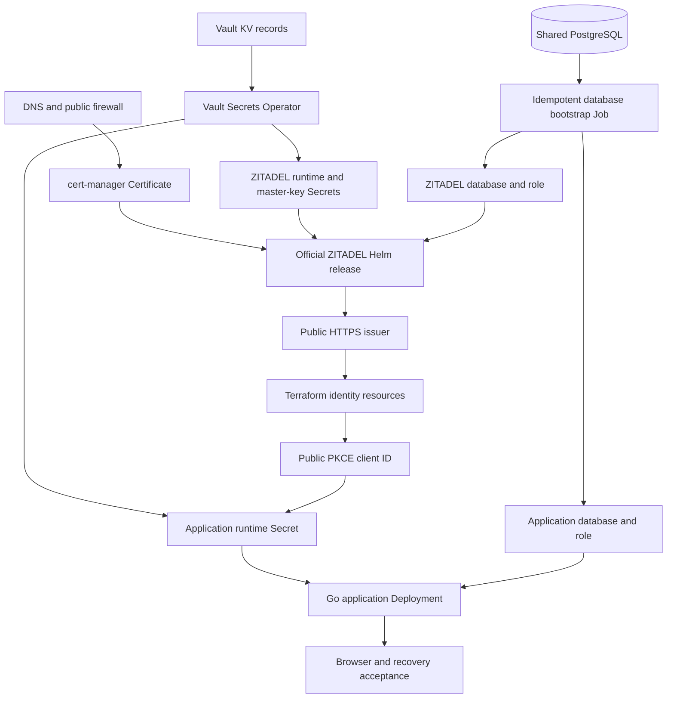

# Playbook: Production ZITADEL for a Single Go Web Application on k3s

This playbook deploys one production ZITADEL instance and one Go web application on an existing k3s platform. It begins after local OIDC behavior has already been proven with [[Research/playbooks/infra/PLAYBOOK - Local ZITADEL Docker Compose Go Web Service]]. The objective is not to reproduce Docker Compose in Kubernetes. The objective is to preserve the identity and security contracts while replacing local process management, local files, and plain HTTP with GitOps, Vault, PostgreSQL, trusted TLS, least-privilege service identities, and operational acceptance.

The tested reference uses ZITADEL chart `10.0.4`, ZITADEL and Login V2 `v4.16.1`, Argo CD, Vault Secrets Operator, cert-manager, Traefik, a shared PostgreSQL service, and a distroless Go application. Substitute hostnames and repository paths for another environment, but do not weaken the ownership boundaries or validation sequence.

> [!summary]
> - Argo CD owns Kubernetes desired state; Vault owns secret values; Terraform owns stable ZITADEL organizations, projects, applications, and policies; ZITADEL owns users and credentials.
> - Deploy prerequisites before the Helm release: namespace identities, Vault synchronization, database bootstrap, master key, and TLS certificate must exist before ZITADEL starts.
> - A browser application uses Authorization Code with S256 PKCE and no client secret. Its durable identity key is `(issuer, subject)`, never email.
> - Production acceptance is incomplete until signup verification, recovery, callback validation, application authorization, restart persistence, and fixture cleanup all pass through the public TLS endpoints.

> [!warning] Destructive operations
> ZITADEL's master key and PostgreSQL state are coupled to the deployed instance. Do not rotate the master key, delete the database, prune the namespace, or replace Terraform state as routine troubleshooting. Back up PostgreSQL and Vault, inspect the plan, and document a recovery procedure before making a destructive change.

## 1. Decide whether this playbook applies

Use this playbook when one product application needs one production identity provider and all product users may live in one ZITADEL organization. The application may have ordinary application roles, but it does not need a separate ZITADEL organization, database, namespace, or OIDC application per customer.

Use the multi-tenant playbook instead when customer organizations are independent identity boundaries, administrators must be scoped to their own organization, or each customer receives isolated runtime credentials and data.

This playbook assumes these platform services already exist:

- a reachable k3s API;
- Argo CD and an AppProject that permits the target namespaces;
- Traefik or an equivalent ingress controller;
- cert-manager with a production issuer;
- Vault with Kubernetes authentication;
- Vault Secrets Operator;
- a PostgreSQL service with tested backup and restore;
- DNS records for the identity and application hostnames;
- an image registry and immutable application image.

Do not begin with ZITADEL manifests if these prerequisites are not healthy. Identity bootstrap compounds failures from DNS, TLS, secrets, storage, and database connectivity.

## 2. Define the production contract

Choose canonical URLs before creating resources:

```text
Identity issuer: https://id.example.com
Application:     https://app.example.com
Callback:        https://app.example.com/auth/callback
Logout return:   https://app.example.com/
```

Every participant must use the exact issuer string. Scheme, hostname, port, and path are security-sensitive. The browser, Go relying party, ZITADEL external configuration, discovery document, Terraform provider, and Login V2 base URI must agree.

The reference deployment uses:

```text
Identity issuer: https://zitadel.yolo.scapegoat.dev
Application:     https://todo.yolo.scapegoat.dev
```

Record the ownership model before implementation:

| Resource | Owner | Secret-bearing state allowed? |
|---|---|---|
| DNS, node, firewall | Infrastructure Terraform | Provider credentials only through approved inputs |
| Kubernetes manifests and Argo Applications | Git repository | No secret values |
| ZITADEL Helm release | Argo CD Helm source | No secret values |
| ZITADEL master key and DSN | Vault | Yes |
| PostgreSQL database and role | Bootstrap Job plus Vault | Password only in Vault/Kubernetes Secret |
| ZITADEL organization, project, OIDC client, login policy | Terraform | Avoid private keys and write-only credentials in state |
| Users, passwords, factors, verification, recovery | ZITADEL | ZITADEL database only |
| Application users and domain data | Application PostgreSQL database | Application data |
| Application session and CSRF keys | Vault | Yes |
| SMTP credentials | Vault plus explicit reconciler | Yes; not Terraform state |
| Application image | CI and registry | No runtime secrets |

The working rule is **intent in Git, values in Vault, user lifecycle in ZITADEL**.

## 3. Architecture and deployment order

The deployment uses two Argo CD Applications for ZITADEL:

1. `zitadel-prereqs` points to a Kustomize package containing namespace objects, service accounts, VSO resources, database bootstrap, certificate, and optional reconcilers.
2. `zitadel` points to the official Helm chart.

The split is deliberate. Helm consumes Kubernetes Secrets and a certificate that are produced by another control path. Keeping prerequisites separate makes ownership and failure diagnosis explicit.



Use this deployment order:

```text
1. Verify platform, DNS, PostgreSQL backup, Vault, VSO, and cert-manager.
2. Create Vault policies and Kubernetes auth roles.
3. Seed secret values into Vault without printing them.
4. Merge and sync ZITADEL prerequisites.
5. Verify generated Secrets, database bootstrap, and certificate readiness.
6. Sync the official ZITADEL Helm release.
7. Verify discovery and Login V2 through trusted public TLS.
8. Configure production SMTP and test external delivery.
9. Apply Terraform for organization, project, PKCE application, and login policy.
10. Publish the public client ID into the application runtime record or nonsecret config.
11. Merge and sync the Go application.
12. Run protocol, browser, authorization, persistence, and recovery acceptance.
13. Remove acceptance users, sessions, and temporary records.
```

Do not start the application with a placeholder client ID. Do not apply ZITADEL Terraform before discovery works through the canonical issuer.

## 4. Prepare DNS and trusted TLS

Create or verify A/AAAA records for both hostnames. A wildcard record is sufficient only if it resolves to the intended ingress address and no explicit record overrides it.

```bash
dig +short id.example.com
dig +short app.example.com
```

Both should return the production ingress address. Verify inbound TCP 80 and 443 reach Traefik. Port 80 remains useful for ACME HTTP challenge and HTTP-to-HTTPS redirection; application authentication must use HTTPS.

Create a cert-manager `Certificate` for the ZITADEL hostname in the `zitadel` namespace:

```yaml
apiVersion: cert-manager.io/v1
kind: Certificate
metadata:
  name: zitadel-tls
  namespace: zitadel
  annotations:
    argocd.argoproj.io/sync-wave: "1"
spec:
  secretName: zitadel-tls
  issuerRef:
    name: letsencrypt-prod
    kind: ClusterIssuer
  dnsNames:
    - id.example.com
```

The application Ingress should request a separate certificate in the application namespace. TLS Secrets are namespace-scoped; do not copy the ZITADEL private key into the application namespace.

Validate the certificate chain from outside the cluster:

```bash
curl -fsS https://id.example.com/.well-known/openid-configuration >/tmp/discovery.json
openssl s_client -connect id.example.com:443 -servername id.example.com </dev/null 2>/dev/null \
  | openssl x509 -noout -subject -issuer -dates
```

A temporary `curl -k` proves only routing. It is not production TLS acceptance.

## 5. Create Vault paths, policies, and service accounts

Use separate runtime and bootstrap identities. The ZITADEL pod needs its DSN and master key. The database bootstrap Job temporarily needs PostgreSQL administrator access plus the desired ZITADEL database credential. Those are different permissions.

Recommended Vault records:

```text
kv/apps/zitadel/prod/runtime
kv/apps/zitadel/prod/smtp
kv/apps/app/prod/runtime
kv/apps/app/prod/image-pull      # only for a private image
kv/infra/postgres/cluster        # existing platform administrator record
```

A practical ZITADEL runtime record contains:

```text
database
username
password
ZITADEL_DATABASE_POSTGRES_DSN
ZITADEL_MASTERKEY
ZITADEL_FIRSTINSTANCE_ORG_HUMAN_PASSWORD
```

The master key must satisfy the ZITADEL release's exact length and format requirements. Generate it with a cryptographically secure source and place it directly into Vault. Never render it into a shell trace, Terraform output, Git patch, or ticket evidence.

Separate Vault policies:

```hcl
# Runtime policy
path "kv/data/apps/zitadel/prod/runtime" {
  capabilities = ["read"]
}

# Bootstrap policy
path "kv/data/apps/zitadel/prod/runtime" {
  capabilities = ["read"]
}
path "kv/data/infra/postgres/cluster" {
  capabilities = ["read"]
}
```

Bind each policy to its exact namespace and service account:

```json
{
  "bound_service_account_names": ["zitadel-vault"],
  "bound_service_account_namespaces": ["zitadel"],
  "policies": ["k8s-zitadel"],
  "ttl": "1h"
}
```

Use another role for `zitadel-db-bootstrap`. A compromised runtime pod must not inherit the PostgreSQL administrator credential.

After installing policies and roles, validate Kubernetes auth before deploying ZITADEL:

```bash
vault policy read k8s-zitadel
vault read auth/kubernetes/role/zitadel
kubectl -n zitadel get serviceaccount
kubectl -n zitadel get vaultauth,vaultstaticsecret
```

## Bootstrap a private GHCR image-pull credential for a new project

Skip this section when the GHCR package is public: k3s can pull a public package anonymously, and an unnecessary registry token increases secret exposure. Use this procedure when a clean unauthenticated pull returns `401 Unauthorized` or the approved package visibility is private.

Publishing and pulling use different credentials. GitHub Actions normally publishes with its repository-scoped `GITHUB_TOKEN` and `packages: write`. The cluster needs a long-lived or renewable deployment credential with read access to the private package. Prefer a dedicated machine identity and the narrowest GitHub credential supported by the package owner. For a classic GitHub PAT, grant `read:packages`, not `write:packages` or repository administration. Confirm that the identity is authorized for the organization and package.

### Create the Vault record without putting the token in Git or shell history

The reusable Vault record contract is:

```text
server   = ghcr.io
username = <GitHub deployment identity>
password = <token with package read access>
auth     = base64("<username>:<token>")
```

Use one application-owned path:

```text
kv/apps/<application>/<environment>/image-pull
```

The following bootstrap prompts without echo, uses a mode-`0600` temporary JSON file instead of placing the token in a `vault kv put key=value` command argument, and removes local material on exit:

```bash
set -euo pipefail
umask 077

: "${VAULT_ADDR:?set VAULT_ADDR}"
: "${VAULT_TOKEN:?authenticate to Vault without printing the token}"

app='example-app'
environment='prod'
secret_path="kv/apps/${app}/${environment}/image-pull"
github_username="$(gh api user --jq '.login')"

read -rsp 'GHCR read token: ' ghcr_token
printf '\n' >&2

tmpdir="$(mktemp -d)"
cleanup() {
  unset ghcr_token auth_b64
  rm -rf "$tmpdir"
}
trap cleanup EXIT INT TERM

auth_b64="$(printf '%s:%s' "$github_username" "$ghcr_token" | base64 | tr -d '\n')"

GHCR_SERVER=ghcr.io \
GHCR_USERNAME="$github_username" \
GHCR_PASSWORD="$ghcr_token" \
GHCR_AUTH="$auth_b64" \
python3 - <<'PY' >"$tmpdir/image-pull.json"
import json
import os

json.dump(
    {
        "server": os.environ["GHCR_SERVER"],
        "username": os.environ["GHCR_USERNAME"],
        "password": os.environ["GHCR_PASSWORD"],
        "auth": os.environ["GHCR_AUTH"],
    },
    fp=__import__("sys").stdout,
)
PY

vault kv put "$secret_path" @"$tmpdir/image-pull.json" >/dev/null
printf 'Seeded %s for %s; no credential value was printed.\n' \
  "$secret_path" "$github_username"
```

The temporary file is still sensitive while the command runs. Keep it on a trusted local filesystem, retain `umask 077`, and do not run the script with shell tracing. Do not attach command output, environment dumps, or the JSON file to a ticket.

If a previously approved pull credential should be reused, copy it inside a private temporary directory without rendering fields to the terminal:

```bash
set -euo pipefail
umask 077
source_path='kv/apps/existing-app/prod/image-pull'
destination_path='kv/apps/example-app/prod/image-pull'
tmpdir="$(mktemp -d)"
trap 'rm -rf "$tmpdir"' EXIT INT TERM

vault kv get -format=json "$source_path" \
  | jq '.data.data | {server, username, password, auth}' \
  >"$tmpdir/image-pull.json"

jq -e '
  (.server == "ghcr.io") and
  (.username | type == "string" and length > 0) and
  (.password | type == "string" and length > 0) and
  (.auth | type == "string" and length > 0)
' "$tmpdir/image-pull.json" >/dev/null

vault kv put "$destination_path" @"$tmpdir/image-pull.json" >/dev/null
printf 'Copied approved pull credential to %s; values were not printed.\n' \
  "$destination_path"
```

Reusing a credential in multiple Vault paths isolates Kubernetes access to those records; it does **not** isolate the underlying GitHub token. Track every destination path so one token rotation updates all copies. Prefer independent credentials when GitHub package permissions and operational overhead allow it.

### Let VSO render the Docker registry Secret

Grant the application's Vault policy read access only to its path. KV v2 policy paths include `data/`:

```hcl
path "kv/data/apps/example-app/prod/image-pull" {
  capabilities = ["read"]
}
```

Bind the policy to the application's exact Kubernetes namespace and service account through its Vault Kubernetes auth role. Then render the record as the Secret type Kubernetes expects:

```yaml
apiVersion: secrets.hashicorp.com/v1beta1
kind: VaultStaticSecret
metadata:
  name: example-app-ghcr-pull
  namespace: example-app
  annotations:
    argocd.argoproj.io/sync-wave: "-1"
spec:
  vaultAuthRef: example-app
  mount: kv
  type: kv-v2
  path: apps/example-app/prod/image-pull
  refreshAfter: 30s
  destination:
    name: example-app-ghcr-pull
    create: true
    overwrite: true
    type: kubernetes.io/dockerconfigjson
    transformation:
      excludes:
        - ".*"
      templates:
        .dockerconfigjson:
          text: |
            {"auths":{"{{ .Secrets.server }}":{"username":"{{ .Secrets.username }}","password":"{{ .Secrets.password }}","auth":"{{ .Secrets.auth }}"}}}
```

Attach the generated Secret to the workload's ServiceAccount so Deployments and hook Jobs inherit it consistently:

```yaml
apiVersion: v1
kind: ServiceAccount
metadata:
  name: example-app
  namespace: example-app
imagePullSecrets:
  - name: example-app-ghcr-pull
```

Do not commit a handcrafted `kubernetes.io/dockerconfigjson` Secret. Git should contain only the Vault path and transformation template.

### Validate bootstrap without displaying the Secret

Check object status and key presence, not decoded values:

```bash
kubectl -n example-app wait \
  --for=jsonpath='{.status.conditions[?(@.type=="Ready")].status}'=True \
  vaultstaticsecret/example-app-ghcr-pull \
  --timeout=120s

kubectl -n example-app get secret example-app-ghcr-pull \
  -o jsonpath='{.type}{"\n"}'

kubectl -n example-app get secret example-app-ghcr-pull \
  -o jsonpath='{.data\.dockerconfigjson}' \
  | awk 'length($0)>0 {print "dockerconfigjson_present=true"}'
```

The expected type is `kubernetes.io/dockerconfigjson`. Do not pipe the field through `base64 --decode` in logs or evidence.

Prove a real private pull with a disposable pod using an image tag or digest that exists:

```yaml
apiVersion: v1
kind: Pod
metadata:
  name: ghcr-pull-check
  namespace: example-app
spec:
  restartPolicy: Never
  serviceAccountName: example-app
  containers:
    - name: check
      image: ghcr.io/example/example-app@sha256:<approved-digest>
      command: ["/app", "healthcheck"]
```

Apply it, require successful image pull and process completion, then delete it. If the production image has no suitable one-shot command, validate through the real Deployment rollout rather than changing its entrypoint speculatively.

### Rotate and revoke

1. Create or approve the replacement read-only credential.
2. Update every Vault path that contains the old credential.
3. Wait for each `VaultStaticSecret` generation and destination Secret resource version to change.
4. Force a controlled pull from GHCR on a node that does not already have the image, or use a new immutable digest.
5. Confirm all affected workloads can pull.
6. Revoke the old GitHub credential.
7. Run another controlled pull to prove the new credential remains sufficient.
8. Record only path names, object readiness, image digest, and success/failure booleans.

An existing running pod and a node-cached image do not prove that the rotated credential works.

## 6. Build the ZITADEL prerequisite package

The reference package is `gitops/kustomize/zitadel/` in the k3s repository. It contains:

```text
namespace.yaml
serviceaccounts.yaml
vault-connection.yaml
vault-auth.yaml
runtime-secret.yaml
database-secret.yaml
masterkey-secret.yaml
postgres-admin-secret.yaml
db-bootstrap-script.yaml
db-bootstrap-job.yaml
certificate.yaml
kustomization.yaml
```

### 6.1 VSO objects

Create one namespace-local `VaultConnection` to the in-cluster Vault address and separate `VaultAuth` objects for runtime and bootstrap service accounts.

Render destination Secrets with explicit transformations. Avoid copying every Vault field into Kubernetes when a pod needs only a subset:

```yaml
apiVersion: secrets.hashicorp.com/v1beta1
kind: VaultStaticSecret
metadata:
  name: zitadel-masterkey
  annotations:
    argocd.argoproj.io/sync-wave: "-1"
spec:
  vaultAuthRef: zitadel
  mount: kv
  type: kv-v2
  path: apps/zitadel/prod/runtime
  refreshAfter: 30s
  destination:
    name: zitadel-masterkey
    create: true
    overwrite: true
    transformation:
      excludes: [".*"]
      templates:
        masterkey:
          text: '{{ .Secrets.ZITADEL_MASTERKEY }}'
```

Create a separate `zitadel-env` Secret containing the DSN and first-instance bootstrap password. The Helm release consumes it through `envVarsSecret`.

### 6.2 Idempotent PostgreSQL bootstrap

Use an Argo Sync hook Job. It may read the platform administrator Secret, but the resulting ZITADEL deployment receives only the runtime DSN.

The bootstrap algorithm is:

```pseudo
validate database and role identifiers
connect to postgres as platform administrator
if role absent:
    create login role with desired password
else:
    alter role password to desired Vault value
if database absent:
    create database owned by runtime role
set database owner to runtime role
grant database privileges to runtime role
```

Validate identifiers before interpolating them into SQL. Keep password values in `psql` inputs and environment, not command output. Use `ON_ERROR_STOP=1` and a bounded Job retry count.

The reference Job uses:

```yaml
metadata:
  annotations:
    argocd.argoproj.io/sync-wave: "0"
    argocd.argoproj.io/hook: Sync
    argocd.argoproj.io/hook-delete-policy: BeforeHookCreation,HookSucceeded
spec:
  backoffLimit: 6
```

A Sync hook reruns when needed and is deleted after success. The script must therefore be idempotent.

### 6.3 Argo Application

Create `gitops/applications/zitadel-prereqs.yaml` pointing at the Kustomize package. Use automated prune/self-heal only after confirming that pruning the package cannot delete persistent database state. The package itself contains no database PVC; PostgreSQL owns persistence separately.

```yaml
spec:
  project: platform-infra
  destination:
    server: https://kubernetes.default.svc
    namespace: zitadel
  source:
    repoURL: https://github.com/example/cluster.git
    targetRevision: main
    path: gitops/kustomize/zitadel
  syncPolicy:
    automated: {prune: true, selfHeal: true}
    syncOptions: [CreateNamespace=true, ServerSideApply=true]
```

Verify the AppProject permits the `zitadel` namespace before merge.

## 7. Deploy the official ZITADEL chart

Use the official chart rather than maintaining handwritten API and Login V2 Deployments. Pin both chart and image versions. The tested baseline is:

```text
Chart:      zitadel 10.0.4
Core image: v4.16.1
Login V2:   v4.16.1
```

A minimal Argo CD Helm source contains these essential values:

```yaml
replicaCount: 1
image:
  tag: v4.16.1
postgresql:
  enabled: false
envVarsSecret: zitadel-env
zitadel:
  masterkeySecretName: zitadel-masterkey
  configmapConfig:
    ExternalDomain: id.example.com
    ExternalPort: 443
    ExternalSecure: true
    TLS:
      Enabled: false
    DefaultInstance:
      Features:
        LoginV2:
          Required: true
          BaseURI: https://id.example.com/ui/v2/login/
    OIDC:
      DefaultLoginURLV2: https://id.example.com/ui/v2/login/login?authRequest=
      DefaultLogoutURLV2: https://id.example.com/ui/v2/login/logout?post_logout_redirect=
login:
  image:
    tag: v4.16.1
  env:
    - name: EMAIL_VERIFICATION
      value: "true"
```

`ExternalSecure: true` is required behind TLS-terminating Traefik even when the pod receives cleartext traffic internally. ZITADEL must advertise HTTPS and issue secure browser state.

Configure two Ingress rules on the same hostname:

- `/ui/v2/login` routes to Login V2;
- `/` routes to the ZITADEL core service.

Use the same `zitadel-tls` Secret. Verify the generated chart resources before merge:

```bash
helm repo add zitadel https://charts.zitadel.com
helm template zitadel zitadel/zitadel --version 10.0.4 -f values.yaml >/tmp/zitadel-rendered.yaml
kubectl apply --dry-run=client -f /tmp/zitadel-rendered.yaml
```

Argo CD can store the values inline or in a reviewed values file. Do not use an unpinned chart range.

## 8. Verify ZITADEL before configuring the application

Wait for both core and Login V2 workloads:

```bash
kubectl -n zitadel get pods,svc,ingress,certificate
kubectl -n argocd get application zitadel-prereqs zitadel \
  -o custom-columns=NAME:.metadata.name,SYNC:.status.sync.status,HEALTH:.status.health.status
```

Then validate public protocol surfaces:

```bash
curl -fsS https://id.example.com/.well-known/openid-configuration | jq '{issuer,authorization_endpoint,token_endpoint,jwks_uri}'
curl -fsSI https://id.example.com/ui/v2/login/
```

Required observations:

- discovery issuer equals `https://id.example.com` exactly;
- all advertised endpoints use trusted HTTPS;
- Login V2 responds under `/ui/v2/login`;
- certificate is trusted and unexpired;
- no redirect points to a service DNS name or internal port;
- restart of the ZITADEL pod preserves the instance and discovery output.

Inspect sanitized logs for schema migration or notification failures. Never copy tokens, action URLs, rendered email arguments, or user attributes into evidence.

## 9. Configure production email delivery

A production identity provider requires external email for verification and recovery. A visible Login V2 message that says a code was sent proves only challenge initiation. Delivery occurs asynchronously through the notification worker.

Keep the SMTP credential in `kv/apps/zitadel/prod/smtp`. For AWS SES, Terraform may own domain identity, DKIM, MAIL FROM, configuration sets, alarms, and IAM policy intent. Do not place SMTP username/password in ordinary Terraform state.

Use an explicit idempotent reconciler that:

1. reads the approved Vault record;
2. validates host, port, STARTTLS, and sender domain;
3. obtains a narrowly controlled ZITADEL administration credential;
4. searches existing email providers;
5. creates or updates exactly one managed provider;
6. activates it after first creation;
7. reads back active state;
8. emits only changed/active booleans.

For ZITADEL v4.16.1, use the current SMTP `plain` authentication oneof and include `host:port`. Do not activate an already active provider blindly; the API may reject that transition.

Acceptance requires all of these:

- a fresh user remains unverified before redemption;
- the verification message reaches a controlled external mailbox;
- the challenge is one-time;
- a fresh OIDC transaction returns `email_verified=true` after redemption;
- password recovery delivers externally;
- wrong, expired, and replayed recovery challenges fail;
- SES bounce/complaint telemetry is visible;
- no raw mail body, challenge, or action URL enters evidence.

See [[PROJECT REPORT - ZITADEL SES SMTP - Vault Backed Verification and Recovery]] for the tested SES reconciliation boundary.

## 10. Declare one organization, project, and public application

Once discovery works, apply a dedicated production Terraform root. The root should use a remote backend with locking and restricted readers. Store the administrative PAT at `kv/apps/zitadel/prod/terraform` under the `access_token` field. This is a separate operator credential from the chart-generated `zitadel/iam-admin-pat` Kubernetes Secret used by the branding reconciler; do not copy either credential into the ZITADEL runtime record.

Terraform binds environment variables named `TF_VAR_<variable>` to input variables. Therefore `TF_VAR_zitadel_access_token` is the process-boundary input name, not a storage location. Scope it to one command and source it directly from Vault:

```bash
TF_VAR_zitadel_access_token="$(
  vault kv get -field=access_token kv/apps/zitadel/prod/terraform
)" AWS_PROFILE=manuel terraform plan
```

Do not export it for the lifetime of an interactive shell, write it to an `approved-token-file`, place it in tfvars, or render it into a saved plan. Grant approved operators or protected automation only `read` on `kv/data/apps/zitadel/prod/terraform`; do not grant access to runtime, SMTP, application, or PostgreSQL records merely to run this root.

Create:

```hcl
resource "zitadel_organization" "app" {
  name = "Example Application"
}

resource "zitadel_project_v2" "app" {
  org_id                 = zitadel_organization.app.id
  name                   = "example-app"
  project_role_check     = true
  has_project_check      = true
  project_role_assertion = false
}

resource "zitadel_application_v2" "web" {
  org_id     = zitadel_organization.app.id
  project_id = zitadel_project_v2.app.id
  name       = "example-app-web"

  oidc {
    redirect_uris             = ["https://app.example.com/auth/callback"]
    post_logout_redirect_uris = ["https://app.example.com/"]
    response_types            = ["OIDC_RESPONSE_TYPE_CODE"]
    grant_types               = ["OIDC_GRANT_TYPE_AUTHORIZATION_CODE"]
    app_type                  = "OIDC_APP_TYPE_WEB"
    auth_method_type          = "OIDC_AUTH_METHOD_TYPE_NONE"
    version                   = "OIDC_VERSION_1_0"
    dev_mode                  = false
    access_token_type         = "OIDC_TOKEN_TYPE_BEARER"
    id_token_userinfo_assertion = true
  }
}
```

The lack of a client secret is intentional. The server-rendered web application is treated as a public client and uses S256 PKCE.

Create an organization login policy that enables only approved methods. For a first rollout:

```text
user login:                 enabled
self registration:         enabled when product requires it
password reset:            visible
disable login with email:  false
disable login with phone:  true
external IdPs:             disabled until configured
forced MFA:                policy decision, not an accidental default
```

Run initialization and static checks without the provider credential, then source the PAT from Vault for provider operations:

```bash
terraform init
terraform fmt -check
terraform validate

TF_VAR_zitadel_access_token="$(vault kv get -field=access_token kv/apps/zitadel/prod/terraform)" \
  AWS_PROFILE=manuel terraform plan
TF_VAR_zitadel_access_token="$(vault kv get -field=access_token kv/apps/zitadel/prod/terraform)" \
  AWS_PROFILE=manuel terraform apply
TF_VAR_zitadel_access_token="$(vault kv get -field=access_token kv/apps/zitadel/prod/terraform)" \
  AWS_PROFILE=manuel terraform plan -detailed-exitcode
```

The final detailed plan must exit `0`. Publish only the client ID and organization/project identifiers required by deployment. Do not output administrative PATs, machine private keys, invitation links, or user credentials.

## 11. Deploy the Go application

Use a separate namespace, service account, Vault role, database, and runtime Secret. The reference package is `gitops/kustomize/todo-demo/`.

The application runtime record contains:

```text
DATABASE_URL
OIDC_CLIENT_ID
SESSION_KEY
CSRF_KEY
```

Add billing keys only if billing is part of this application. Keep the public URL and issuer in Git-visible environment values:

```yaml
- name: APP_PUBLIC_URL
  value: https://app.example.com
- name: APP_ZITADEL_ISSUER
  value: https://id.example.com
```

The Deployment should enforce:

```yaml
securityContext:
  runAsNonRoot: true
  runAsUser: 65532
  runAsGroup: 65532
  seccompProfile: {type: RuntimeDefault}
containers:
  - securityContext:
      allowPrivilegeEscalation: false
      readOnlyRootFilesystem: true
      capabilities: {drop: ["ALL"]}
```

Use an immutable image digest. Configure HTTP liveness and PostgreSQL-aware readiness separately. Set requests and limits. Disable service links. Do not mount a service-account token unless the application calls Kubernetes.

### 11.1 OIDC backchannel routing

The application must reach the public issuer hostname from inside the cluster because discovery and issuer validation are exact. If the node or load balancer does not support hairpin access to the public IP, route the hostname to Traefik's in-cluster address through a supported DNS or networking mechanism.

The reference currently uses a `hostAliases` entry for the Traefik service IP. Treat that as environment-specific and fragile: a changed ClusterIP requires a manifest update. Prefer a stable internal routing design that preserves the public Host and TLS identity, then test it from the pod:

```bash
kubectl -n app exec deploy/app -- /app healthcheck   # native command in distroless image
kubectl -n app run oidc-check --rm -it --image=curlimages/curl -- \
  curl -fsS https://id.example.com/.well-known/openid-configuration
```

Do not disable issuer or TLS validation to avoid hairpin routing work.

### 11.2 Network policy

Allow only:

- ingress from Traefik to the application port;
- egress to cluster DNS;
- egress to PostgreSQL on 5432;
- egress to the public ZITADEL route through Traefik;
- required public HTTPS APIs;
- explicitly configured telemetry.

A broad `0.0.0.0/0:443` rule may be necessary for a third-party API but should be documented as such. It does not replace application-layer allowlists.

## 12. Application identity and browser security

The application must validate:

- exact issuer;
- expected audience/client ID;
- state;
- nonce when present in the chosen SDK flow;
- S256 PKCE;
- token expiry and signature;
- `email_verified=true` when verified email is required.

Persist users by:

```text
(issuer, subject)
```

Email is mutable profile data. Never use it as the primary key or ownership relation.

Use opaque or authenticated encrypted sessions with stable keys shared across replicas. Keep CSRF keys separate from session keys. Production cookies must be `Secure`, `HttpOnly`, and appropriately `SameSite`. Apply CSP, frame denial, `nosniff`, referrer policy, and no-store headers at the outer router so redirects and callbacks receive the same policy.

Every user-owned SQL mutation must include the local user owner predicate. A foreign object and missing object should produce the same result.

## 13. Sync-wave and rollout design

A useful ordering for each namespace is:

| Wave | Objects |
|---:|---|
| `-3` | Namespace |
| `-2` | ServiceAccount, VaultConnection, VaultAuth |
| `-1` | VaultStaticSecret and generated Kubernetes Secrets |
| `0` | Database bootstrap hook/configuration |
| `1` | Certificate or other external readiness prerequisite |
| `2` | Application Deployment and Service |
| `3` | Ingress, NetworkPolicy, optional reconcilers |

Argo Applications do not have a guaranteed ordering relationship merely because one is named `prereqs`. Verify prerequisite health before syncing the Helm release on first installation. If recurring cross-Application ordering becomes a problem, encode it through a parent app, sync waves at the Application level, or a different package boundary. Do not assume naming creates dependency semantics.

If any workload uses a `local-path` PVC, follow [[Research/playbooks/infra/PLAYBOOK - Argo CD Application with a local-path PVC on k3s]]: the PVC and its first consumer must share a wave.

## 14. Pre-merge validation

Run the checks from the repository that owns each layer.

Kubernetes/GitOps:

```bash
kubectl kustomize gitops/kustomize/zitadel >/tmp/zitadel-prereqs.yaml
kubectl kustomize gitops/kustomize/app >/tmp/app.yaml
kubectl apply --dry-run=client -f /tmp/zitadel-prereqs.yaml
kubectl apply --dry-run=client -f /tmp/app.yaml
bash scripts/validate_gitops.sh
```

Terraform:

```bash
terraform fmt -check -recursive
terraform validate
terraform plan -detailed-exitcode
```

Application:

```bash
go test -race ./... -count=1
go vet ./...
CGO_ENABLED=0 go build ./...
```

Secret audit:

```bash
git diff --check
git diff --cached --name-only
# Run the repository's pinned secret scanner when available.
```

Inspect rendered manifests, not only source fragments:

- no `Secret.stringData` contains real values;
- no private key or PAT appears in ConfigMaps;
- image references are immutable;
- callback and logout URLs are HTTPS and exact;
- Vault roles bind exact service accounts and namespaces;
- application pods do not receive PostgreSQL administrator credentials;
- chart and image versions are pinned.

## 15. First production acceptance

Use disposable, approved test identities. Keep credentials and action links out of terminal history and evidence.

### 15.1 Platform and identity

```bash
kubectl -n argocd get application zitadel-prereqs zitadel app
kubectl -n zitadel get pods,svc,ingress,certificate
kubectl -n app get pods,svc,ingress
curl -fsS https://id.example.com/.well-known/openid-configuration | jq -r .issuer
curl -fsS https://app.example.com/healthz
curl -fsS https://app.example.com/readyz
```

Require all Argo Applications to be `Synced` and `Healthy` and all certificates `Ready`.

### 15.2 Browser protocol

Complete this sequence:

- [ ] Public page loads with no console errors.
- [ ] Signup authorization uses Code flow, S256 PKCE, and `prompt=create`.
- [ ] Hosted registration creates an unverified user when verification is required.
- [ ] The application denies the user before verification.
- [ ] Verification message arrives through the production provider.
- [ ] One-time verification succeeds.
- [ ] A fresh login returns `email_verified=true`.
- [ ] Callback creates an application session.
- [ ] Logout returns only to an allowlisted URI.
- [ ] Password recovery and reset succeed once.
- [ ] Replayed state, callback code, verification challenge, and recovery challenge fail.

### 15.3 Application authorization

Use two users:

- [ ] Each receives a different local user row keyed by `(issuer, subject)`.
- [ ] User B cannot list user A's data.
- [ ] User B cannot mutate user A's object with valid CSRF.
- [ ] Missing and invalid CSRF return 403.
- [ ] Foreign and nonexistent object IDs have the same HTTP outcome.
- [ ] Data and sessions behave as designed across a pod restart.

### 15.4 Cleanup

Delete disposable users and application rows through supported operations. Revoke temporary invitations and credentials. Remove temporary browser contexts. Confirm no test mail or secrets remain in local files or ticket artifacts.

## 16. Day-two operations

### Backups

Back up the PostgreSQL database on a tested schedule. A successful upload is not restore evidence. Restore the backup into a scratch database and verify ZITADEL can read the restored schema under a controlled procedure.

Back up Vault separately according to its storage model. Preserve the ZITADEL master key under the approved secret-recovery procedure. PostgreSQL without the matching key is not a complete identity recovery set.

### Upgrades

For every chart or image upgrade:

1. read ZITADEL and chart release notes;
2. check database migration and Login V2 compatibility;
3. back up and test restore;
4. render the chart diff;
5. deploy to a non-production environment;
6. test discovery, login, signup, verification, recovery, logout, and application callback;
7. update chart and both image pins together when required;
8. observe rollout and notification worker logs;
9. preserve rollback constraints after any irreversible database migration.

Do not roll back an application binary across an incompatible database migration without explicit vendor guidance.

### Secret rotation

Rotate one class at a time:

- session/CSRF keys require a deliberate session invalidation or overlap design;
- PostgreSQL password rotation requires coordinated Vault update, bootstrap reconciliation, and pod rollout;
- SMTP rotation requires provider update, canary delivery, then old credential revocation;
- Terraform/ZITADEL administrative credentials should be short-lived or tightly scoped and never copied into runtime Secrets;
- master-key rotation requires a ZITADEL-supported procedure and recovery plan, not a direct Vault edit.

### Monitoring

Alert on:

- ZITADEL and Login V2 pod restarts;
- readiness failures;
- PostgreSQL connection saturation and storage pressure;
- certificate expiry;
- notification worker failures;
- SES bounces and complaints;
- repeated OIDC callback failures;
- Argo drift;
- failed backup and failed restore-validation jobs.

Do not log raw OIDC query strings, tokens, cookies, mail bodies, verification material, or user PII as diagnostic context.

## 17. Troubleshooting

| Symptom | Likely boundary | Investigation | Correct response |
|---|---|---|---|
| Discovery advertises HTTP or an internal hostname | ZITADEL external configuration | Inspect `ExternalDomain`, `ExternalPort`, `ExternalSecure` and proxy headers | Correct chart values; do not weaken issuer validation |
| Login page 404 while discovery works | Login V2 ingress path | Inspect generated Ingress and `/ui/v2/login` route | Correct path routing and BaseURI |
| Application discovery fails only inside cluster | Hairpin/backchannel routing | Resolve issuer from pod; inspect route and TLS | Preserve public issuer and establish stable internal route |
| ZITADEL starts before Secrets exist | Cross-Application ordering | Inspect VSO destination Secrets and Argo operation history | Sync prerequisites first; encode dependency if recurring |
| Database bootstrap loops | Vault key shape, identifier, or PostgreSQL privilege | Inspect sanitized Job error and Secret key names | Correct record or idempotent SQL; never inject admin DSN into runtime |
| Verification UI says sent but no mail arrives | Async notification path | Inspect active provider and sanitized notification-worker errors | Reconcile SMTP and prove external receipt |
| Callback reports state mismatch | Browser flow continuity | Confirm same browser context and cookie origin | Restart login; do not bypass state |
| Redirect URI rejected | Terraform/application mismatch | Compare exact scheme, host, port, and path | Correct Terraform and reapply |
| Argo is healthy but old image runs | Image pin or stale operation | Inspect rendered Deployment and ReplicaSet digest | Update immutable digest and hard-refresh stale operation |
| Pod runs as root or needs writable root | Image/workload security | Inspect pod security context and filesystem writes | Fix image paths and securityContext before acceptance |

## 18. Rollback and uninstall

Application rollback is normally an immutable image-digest reversion in Git. Verify that the previous image is compatible with the current application schema.

ZITADEL rollback requires more caution. A chart rollback does not reverse PostgreSQL migrations. Use release notes and backup restore criteria before changing the chart or core image backward.

Uninstall order for a deliberate environment retirement:

```text
1. Disable new application login and user creation.
2. Export required audit and user data under policy.
3. Revoke application and automation credentials.
4. Remove the application Argo resource and runtime secrets.
5. Confirm no other application uses the ZITADEL instance.
6. Back up and verify the final database and Vault records.
7. Remove the ZITADEL Helm Application.
8. Remove prerequisite resources only after confirming retention requirements.
9. Remove DNS and certificates.
10. Destroy or archive Terraform state through the approved procedure.
```

Never prune a shared ZITADEL instance because one application is being retired.

## 19. Completion checklist

- [ ] Canonical issuer and application URLs are approved and use HTTPS.
- [ ] DNS resolves to the intended ingress.
- [ ] Trusted certificates are Ready.
- [ ] Vault runtime and bootstrap policies are namespace/service-account scoped.
- [ ] Secret values exist only in Vault and rendered Kubernetes Secrets.
- [ ] ZITADEL database and role are separate from PostgreSQL administrator credentials.
- [ ] ZITADEL chart and images are pinned.
- [ ] ExternalDomain, ExternalPort, ExternalSecure, Login V2 BaseURI, and default URLs agree.
- [ ] `EMAIL_VERIFICATION=true` is explicit.
- [ ] Discovery issuer is exact through public TLS and from the application pod.
- [ ] SMTP verification and recovery delivery pass externally.
- [ ] Terraform creates one organization, project, public PKCE client, and reviewed login policy.
- [ ] Terraform immediately converges to a zero-change plan.
- [ ] Application image is immutable, distroless/non-root, read-only, and health-checked.
- [ ] Session and CSRF keys are independent and delivered through Vault.
- [ ] Identity uses `(issuer, subject)` and user-owned SQL includes owner predicates.
- [ ] Network policy permits only required paths.
- [ ] Two-user browser isolation and CSRF acceptance pass.
- [ ] PostgreSQL backup and scratch restore pass.
- [ ] Acceptance users, sessions, mail, and temporary credentials are removed.
- [ ] Argo Applications remain Synced and Healthy after restart.

## 20. Reference implementation

The production pattern is grounded in:

```text
/home/manuel/code/wesen/2026-03-27--hetzner-k3s
  gitops/applications/zitadel-prereqs.yaml
  gitops/applications/zitadel.yaml
  gitops/applications/todo-demo.yaml
  gitops/kustomize/zitadel/
  gitops/kustomize/todo-demo/
  vault/policies/kubernetes/zitadel.hcl
  vault/policies/kubernetes/todo-demo.hcl
  vault/roles/kubernetes/zitadel.json
  vault/roles/kubernetes/todo-demo.json

/home/manuel/code/wesen/2026-07-25--zitadel-go-test
  cmd/todo-demo/
  internal/app/
  internal/store/postgres/
  scripts/13-configure-zitadel-smtp.py

/home/manuel/code/wesen/terraform
  zitadel/
  ses/
```

## Related notes

- [[Research/KB/Projects/infrastructure-and-release]]
- [[Research/playbooks/infra/PLAYBOOK - Local ZITADEL Docker Compose Go Web Service]]
- [[PROJECT REPORT - ZITADEL Go Webapp MVP - From Identity Design to Deterministic Local Deployment]]
- [[PROJECT REPORT - ZITADEL SES SMTP - Vault Backed Verification and Recovery]]
- [[ARTICLE - Deep Dive - Completing the ZITADEL SaaS Tenant Control Plane]]
