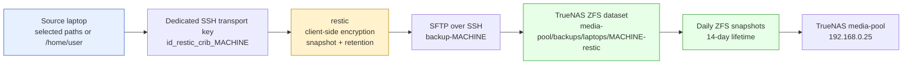

# Playbook: Restic Backups to the Crib NAS

This playbook defines the procedure for setting up an encrypted, deduplicated, scheduled restic backup from a laptop to the crib TrueNAS NAS at `192.168.0.25` (`crib.scapegoat.dev`). It covers both Linux (systemd) and macOS (launchd) sources, and it generalizes two production implementations: an Ubuntu laptop (`f`) whole-home backup and a macOS (`mimimi-2`) selected-photo/Lightroom backup.

Use this playbook alongside the implementation reports [[ARTICLE - Crib Backup - From Design to Operational Restic Baseline]] and [[ARTICLE - Recoverable Mac Photo Backups with Restic TrueNAS and launchd]], and the scope investigation [[PROJECT REPORT - Restic Backup Scope Design - From 1.7T Home to a 247G Recovery Unit]]. Parameterized scripts for every step live at `Research/playbooks/infra/scripts/restic-crib-backup/`. For exact historical commands and session evidence, consult docmgr tickets `CRIB-BACKUP-01` (Ubuntu), `CRIB-OPS-20260711` (macOS), and `BACKUP-SCOPE-2026-07-25` (scope investigation) rather than copying their machine-specific IDs or paths.

> [!warning] Security rule
>
> Never put a restic repository password, TrueNAS API key, SSH private key, or Vault token in a ticket, issue, repository file, terminal transcript, shell history, or chat message. Record non-secret evidence only: path names, field names, dataset names, account names, and expected permission boundaries. The restic password must have an independent recovery-safe copy (Vault or a password manager) outside the source machine and outside the NAS.

## 1. Decide whether this playbook applies

Use this design when you need to back up a laptop's user data to the crib TrueNAS with these properties:

- encrypted at rest (client-side restic encryption);
- deduplicated and incremental (repeated backups of large trees avoid re-uploading unchanged content);
- versioned snapshots with bounded retention and pruning;
- scheduled and unattended, with a tested restore path;
- fail-closed transport (no silent fallback to a wrong destination).

Do not use this playbook for:

- ZFS-to-ZFS replication (use `zfs send/receive` when the source is also ZFS);
- full disk images (use a block-level tool);
- backing up data that lives only as cloud placeholders (restic reads local files; a Dropbox cloud-only file with no local copy cannot be protected).

## 2. Architecture and trust boundaries

The system separates three concerns that must not be collapsed:

1. **Provisioning** storage and users on TrueNAS (high-power TrueNAS admin/API credentials).
2. **Running** the recurring encrypted backup (low-power SFTP-only runtime credentials).
3. **Recovering** data from a specific snapshot (the restic password + SFTP key).



The runtime backup path is intentionally short and fail-closed:

```text
scheduler -> ~/.local/bin/restic-MACHINE-backup -> SFTP backup-MACHINE@192.168.0.25 -> restic repository
```

An SFTP connection either authenticates to TrueNAS and opens the remote repository, or it fails. There is no ordinary local directory that can accidentally receive the backup. This is a deliberate design response to a prior TrueNAS/Jellyfin outage where a missing NFS mount was silently replaced by an empty local directory — a backup that writes to the wrong place while reporting success is worse than no backup.

### 2.1 Transport authentication and repository encryption are distinct

Two secrets serve different functions:

| Material | Location | Function | Exposure if lost or copied |
|---|---|---|---|
| `~/.ssh/id_restic_crib_MACHINE` | Source machine, mode 0600 | Authenticates the source to the restricted TrueNAS SFTP account | An attacker could access this one repository path, but not administer TrueNAS or decrypt repository content without the restic password. |
| `~/.config/restic/MACHINE/password` | Source machine, mode 0600 | Decrypts and modifies the restic repository | Losing it makes the encrypted backup unrecoverable. Copying it must be controlled. |

The restic password must have a recovery-safe copy outside the source machine and outside the NAS. On Linux, escrow it in Vault at `kv/infra/truenas/restic/laptop-MACHINE`. On macOS, store it in a password manager. Never store it next to the repository on TrueNAS.

## 3. Prerequisites and inventory

Before starting, confirm the environment:

| Component | Address / identity | Role |
|---|---|---|
| TrueNAS SCALE | VM 106, `192.168.0.25` | Backup repository host and SFTP endpoint |
| TrueNAS admin SSH | `admin@192.168.0.25` | Provisioning (dataset, user, quota, snapshots) |
| Proxmox host | `192.168.0.227` | Hypervisor hosting TrueNAS |
| Vault | `https://vault.yolo.scapegoat.dev` | Optional: TrueNAS API key + restic password escrow |
| Source laptop | the machine to back up | restic client |

On the source machine:

```bash
restic version    # must be installed; on macOS use the official restic binary in ~/.local/bin
ssh -V            # OpenSSH client required for SFTP
jq --version      # for provisioning JSON payloads
```

On macOS, if `restic` is not installed, download the official binary:

```bash
mkdir -p ~/.local/bin ~/.cache/restic-install
# Fetch the latest restic release for darwin_arm64 (or darwin_amd64)
# See https://github.com/restic/restic/releases
# Extract and place at ~/.local/bin/restic, chmod +x
restic version
```

## 4. Provision the TrueNAS dataset and SFTP-only account

Create one dedicated ZFS dataset and one SSH-only account per source machine. This limits each account's repository scope and keeps machines isolated from each other and from live Jellyfin media.

### 4.1 Choose names and capacity

Define the machine-specific parameters:

```bash
MACHINE="f"                       # short machine identifier, e.g. f, mimimi-2
DATASET="media-pool/backups/laptops/${MACHINE}-restic"
BACKUP_USER="backup-${MACHINE}"
BACKUP_HOME="/mnt/${DATASET}"
# TrueNAS middleware requires a byte integer for refquota.
# 1.5 TiB = 1649267441664 bytes. Adjust to your source size + history headroom.
REFQUOTA_BYTES="1649267441664"
```

> [!important] Capacity planning
>
> Before creating the dataset, measure the source size and compare it to available NAS capacity. A first full copy might succeed while creating a system that cannot safely retain incremental history or perform pruning. The first protected unit should be the data that needs a tested recovery path, not necessarily the entire machine. Adding directories later requires a fresh capacity calculation that accounts for source size, changed data, restic pruning space, ZFS snapshots, and unrelated pool consumers.

### 4.2 Generate the dedicated SSH key on the source machine

```bash
KEY="$HOME/.ssh/id_restic_crib_${MACHINE}"
mkdir -p "$HOME/.ssh"
chmod 700 "$HOME/.ssh"
if [[ ! -f "$KEY" ]]; then
  ssh-keygen -q -t ed25519 -N "" -f "$KEY" -C "restic backup from ${MACHINE} to TrueNAS"
fi
chmod 600 "$KEY"
chmod 644 "$KEY.pub"
ssh-keygen -lf "$KEY.pub"
```

### 4.3 Create the dataset and SSH-only account on TrueNAS

Run this from an operator workstation with `admin@192.168.0.25` SSH access. It is idempotent.

```bash
PUB_B64="$(base64 < "$KEY.pub" | tr -d '\n')"
ssh -o BatchMode=yes -o ConnectTimeout=10 admin@192.168.0.25 \
  "PUB_B64='${PUB_B64}' DATASET='${DATASET}' BACKUP_USER='${BACKUP_USER}' BACKUP_HOME='${BACKUP_HOME}' bash -s" <<'REMOTE'
set -euo pipefail
PUBKEY="$(printf '%s' "$PUB_B64" | base64 -d)"

# Create the dataset if absent
if [[ "$(midclt call pool.dataset.query "[[\"id\",\"=\",\"$DATASET\"]]")" == "[]" ]]; then
  midclt call pool.dataset.create \
    "{\"name\":\"$DATASET\",\"type\":\"FILESYSTEM\",\"comments\":\"Encrypted restic repository for ${MACHINE} backup\",\"atime\":\"OFF\",\"compression\":\"LZ4\"}" \
    >/dev/null
  echo "created dataset: $DATASET"
else
  echo "dataset already exists: $DATASET"
fi

# Create the SSH-only backup user if absent
if [[ "$(midclt call user.query "[[\"username\",\"=\",\"$BACKUP_USER\"]]")" == "[]" ]]; then
  payload="$(jq -nc \
    --arg username "$BACKUP_USER" \
    --arg full_name "${MACHINE} restic SFTP backup user" \
    --arg home "$BACKUP_HOME" \
    --arg shell "/usr/bin/bash" \
    --arg sshpubkey "$PUBKEY" \
    '{username:$username,full_name:$full_name,group_create:true,home:$home,home_mode:"700",shell:$shell,password_disabled:true,ssh_password_enabled:false,smb:false,sshpubkey:$sshpubkey}')"
  midclt call user.create "$payload" >/dev/null
  echo "created SSH-only backup user: $BACKUP_USER"
else
  echo "backup user already exists: $BACKUP_USER"
fi

# Verify (non-secret fields only)
midclt call pool.dataset.query "[[\"id\",\"=\",\"$DATASET\"]]" |
  jq -c '.[] | {id,mountpoint,atime,compression,used,available,comments}'
midclt call user.query "[[\"username\",\"=\",\"$BACKUP_USER\"]]" |
  jq -c '.[] | {username,uid,home,shell,password_disabled,ssh_password_enabled,smb,sshpubkey:(.sshpubkey != "")}'
REMOTE
```

The account is deliberately limited: password login disabled, SMB disabled, SSH key restricted to this machine's public key, home set to the repository path. It is not a TrueNAS administrator.

### 4.4 Apply a repository quota and ZFS snapshot protection

The `refquota` limits this machine's repository independently of the pool. ZFS snapshots add a local rollback layer bounded by a short retention window.

```bash
SNAPSHOT_SCHEMA="restic-${MACHINE}-%Y-%m-%d_%H-%M"
ssh -o BatchMode=yes -o ConnectTimeout=10 admin@192.168.0.25 \
  "DATASET='$DATASET' REFQUOTA='$REFQUOTA_BYTES' SNAPSHOT_SCHEMA='$SNAPSHOT_SCHEMA' bash -s" <<'REMOTE'
set -euo pipefail

midclt call pool.dataset.update "$DATASET" "{\"refquota\":\"$REFQUOTA\"}" >/dev/null
tasks="$(midclt call pool.snapshottask.query "[[\"dataset\",\"=\",\"$DATASET\"]]")"
if [[ "$tasks" == "[]" ]]; then
  midclt call pool.snapshottask.create "{\"dataset\":\"$DATASET\",\"recursive\":false,\"lifetime_value\":14,\"lifetime_unit\":\"DAY\",\"naming_schema\":\"$SNAPSHOT_SCHEMA\",\"schedule\":{\"minute\":\"0\",\"hour\":\"10\",\"dom\":\"*\",\"month\":\"*\",\"dow\":\"*\"},\"enabled\":true}" >/dev/null
  echo "created daily 10:00 TrueNAS snapshot task with 14-day retention"
else
  echo "snapshot task already exists for $DATASET"
fi

midclt call pool.dataset.query "[[\"id\",\"=\",\"$DATASET\"]]" |
  jq -c '.[] | {id,refquota,used,available}'
midclt call pool.snapshottask.query "[[\"dataset\",\"=\",\"$DATASET\"]]" |
  jq -c '.[] | {id,dataset,recursive,lifetime_value,lifetime_unit,naming_schema,schedule,enabled}'
REMOTE
```

> [!note] ZFS snapshot and restic prune interaction
>
> Restic `forget --prune` may make old repository data unreachable at the restic layer while a recent ZFS snapshot still retains the underlying blocks. The 14-day ZFS lifetime and the refquota make that interaction bounded, but they do not remove the need to observe growth. Capacity must be monitored before routine growth reaches the quota limit.

## 5. (Optional) Vault-managed TrueNAS provisioning

On Linux, the TrueNAS API key can be stored in Vault and used to provision the dataset and user via the TrueNAS REST API instead of admin SSH. This separates the high-power provisioning credential from the runtime backup credential.

### 5.1 Seed the TrueNAS API key into Vault

```bash
export VAULT_ADDR=https://vault.yolo.scapegoat.dev
vault login -method=oidc role=operators

# Seed the key without printing it
truenas_api_key="$(ssh root@192.168.0.227 'cat /root/.truenas_api_key')"
vault kv put kv/infra/truenas/provisioning \
  api_url="https://192.168.0.25" \
  api_key="${truenas_api_key}" \
  purpose="TrueNAS provisioning" \
  owner="$(whoami)" \
  rotation_note="Rotate after removing old plaintext copies" >/dev/null
unset truenas_api_key
# Verify non-secret fields only
vault kv get -field=api_url kv/infra/truenas/provisioning
```

### 5.2 Create the backup user via the TrueNAS REST API

```bash
export VAULT_ADDR=https://vault.yolo.scapegoat.dev
api_url="$(vault kv get -field=api_url kv/infra/truenas/provisioning)"
api_key="$(vault kv get -field=api_key kv/infra/truenas/provisioning)"
api_url="${api_url%/}"
pubkey="$(cat "$KEY.pub")"

uid="$(curl -fsS -k -H "Authorization: Bearer ${api_key}" "${api_url}/api/v2.0/user/get_next_uid")"
printf 'next uid: %s\n' "$uid"

payload="$(jq -nc \
  --arg username "$BACKUP_USER" \
  --arg full_name "${MACHINE} restic SFTP backup user" \
  --arg home "$BACKUP_HOME" \
  --arg shell "/usr/bin/bash" \
  --arg sshpubkey "$pubkey" \
  '{username:$username,full_name:$full_name,group_create:true,home:$home,home_mode:"700",shell:$shell,password_disabled:true,ssh_password_enabled:false,smb:false,sshpubkey:$sshpubkey}')"
curl -fsS -k -H "Authorization: Bearer ${api_key}" -H "Content-Type: application/json" \
  "${api_url}/api/v2.0/user" -d "$payload" | jq '{id,uid,username,home,shell,password_disabled,smb}'
unset api_key
```

### 5.3 Smoke-test Vault-managed API access (read-only)

```bash
export VAULT_ADDR=https://vault.yolo.scapegoat.dev
api_url="$(vault kv get -field=api_url kv/infra/truenas/provisioning)"
api_key="$(vault kv get -field=api_key kv/infra/truenas/provisioning)"
api_url="${api_url%/}"
curl -fsS -k -H "Authorization: Bearer ${api_key}" "${api_url}/api/v2.0/system/info" | jq '{version,hostname}'
unset api_key
```

> [!important] Vault is a provisioning dependency, not a runtime dependency
>
> Nightly backups do not contact Vault. They use the SFTP key. If Vault is down during the nightly backup window, the backup can still run. The remaining security task after migration is to rotate or delete any old plaintext TrueNAS API key copies (e.g. `/root/.truenas_api_key` on Proxmox).

## 6. Install the restic client on the source machine

### 6.1 Create the directory layout

```bash
mkdir -p -m 0700 "$HOME/.config/restic/${MACHINE}" "$HOME/.local/bin" \
  "$HOME/.local/state/restic" "$HOME/.cache/restic" "$HOME/.ssh"
```

### 6.2 Create the environment file

```bash
cat > "$HOME/.config/restic/${MACHINE}/env" <<EOF
RESTIC_REPOSITORY=sftp:${BACKUP_USER}@192.168.0.25:${BACKUP_HOME}
RESTIC_PASSWORD_FILE=\${HOME}/.config/restic/${MACHINE}/password
RESTIC_CACHE_DIR=\${HOME}/.cache/restic
RESTIC_EXCLUDE_FILE=\${HOME}/.config/restic/${MACHINE}/excludes
RESTIC_SFTP_ARGS="-i \${HOME}/.ssh/id_restic_crib_${MACHINE} -o BatchMode=yes -o IdentitiesOnly=yes"
EOF
chmod 0600 "$HOME/.config/restic/${MACHINE}/env"
```

### 6.3 Generate the restic repository password and escrow it

```bash
PW_FILE="$HOME/.config/restic/${MACHINE}/password"
if [[ ! -s "$PW_FILE" ]]; then
  umask 077
  openssl rand -base64 48 > "$PW_FILE"
  chmod 0600 "$PW_FILE"
  echo "Created restic password file: $PW_FILE"
fi
```

On Linux, escrow the password in Vault:

```bash
export VAULT_ADDR=https://vault.yolo.scapegoat.dev
restic_pw="$(cat "$PW_FILE")"
vault kv put "kv/infra/truenas/restic/laptop-${MACHINE}" \
  repository="sftp:${BACKUP_USER}@192.168.0.25:${BACKUP_HOME}" \
  password="${restic_pw}" \
  purpose="Restic repository password escrow for ${MACHINE}" \
  owner="$(whoami)" >/dev/null
unset restic_pw
```

On macOS, store the password in a password manager. Do not store it next to the repository on TrueNAS.

> [!warning] macOS Keychain limitation
>
> On macOS, storing the restic password in the Keychain initially appears attractive, but headless (non-GUI) restic runs fail with `security: SecKeychainItemCreateFromContent (<default>): User interaction is not allowed.` A LaunchDaemon launched outside a GUI session cannot assume Keychain interaction is possible. The operational solution is a protected local mode-0600 password file. This creates a separate recovery obligation: the password must have a recovery-safe copy outside the Mac.

### 6.4 Create the excludes file (if backing up a home directory)

Excludes are part of the architecture, not cleanup after the fact. They prevent the repository from filling with caches, generated dependency trees, build outputs, and service-owned state. The excludes file below is a baseline. For a real scope investigation including a dry-run, see [[PROJECT REPORT - Restic Backup Scope Design - From 1.7T Home to a 247G Recovery Unit]] and ticket `BACKUP-SCOPE-2026-07-25`, which produced a 99-line excludes file verified by `restic backup --dry-run`.

```bash
cat > "$HOME/.config/restic/${MACHINE}/excludes" <<'EOF'
# Caches and regenerable data
**/.cache
**/.npm/_cacache
**/.pnpm-store
**/.yarn/cache
**/.bun/install/cache
**/.cargo/registry
**/.cargo/git
**/.rustup/toolchains
**/.gradle/caches
**/.m2/repository
**/.pyenv/cache
**/.local/share/Trash
# Dependency trees (reproducible from source manifests)
**/node_modules
**/.venv
**/venv
**/__pycache__
# Build outputs
**/dist
**/build
**/target
**/.next
**/.nuxt
**/.terraform/providers
**/.terraform/modules
# Browser caches
**/.config/chromium/Default/Cache
**/.config/google-chrome/*/Cache
# VMs and containers
**/VirtualBox VMs
**/.docker
EOF
```

For a selected-source backup (e.g. photos only), excludes may be unnecessary because the source paths are already narrow.

## 7. The critical restic SFTP option

A successful OpenSSH `sftp` test does not imply that restic can open the repository. The first restic SFTP configuration using an SSH-command-shaped environment variable fails even though standalone `sftp` works:

```text
Fatal: create repository at sftp:... failed: unable to start the sftp session,
error: error receiving version packet from server: server unexpectedly closed connection: unexpected EOF
```

The working pattern uses restic's backend option for SFTP arguments:

```bash
restic -o "sftp.args=${RESTIC_SFTP_ARGS}" snapshots
```

with:

```text
RESTIC_SFTP_ARGS=-i /home/manuel/.ssh/id_restic_crib_MACHINE -o BatchMode=yes -o IdentitiesOnly=yes
```

The stable rule is:

```text
Use ssh/sftp for preflight. Use restic -o "sftp.args=..." for repository operations.
```

## 8. Verify SFTP preflight (fail-closed)

Before initializing the repository, confirm the restricted SFTP account can reach only the expected repository path. If this fails, stop. Do not configure an NFS or local filesystem fallback.

```bash
ssh -i "$HOME/.ssh/id_restic_crib_${MACHINE}" \
  -o BatchMode=yes -o IdentitiesOnly=yes -o ConnectTimeout=10 \
  "${BACKUP_USER}@192.168.0.25" \
  "test -d ${BACKUP_HOME}"
```

A failed preflight is visible in logs. A successful backup to the wrong place is not. This preflight is the safety property.

## 9. Initialize the repository and run a smoke backup/restore

Initialize the repository and prove the backup/restore path with a tiny smoke snapshot before attempting a large source.

```bash
set -a
. "$HOME/.config/restic/${MACHINE}/env"
set +a
export RESTIC_REPOSITORY RESTIC_PASSWORD_FILE RESTIC_CACHE_DIR RESTIC_SFTP_ARGS

# Initialize the repository (once)
restic -o "sftp.args=${RESTIC_SFTP_ARGS}" init

# Smoke backup
SMOKE_DIR="$HOME/.local/state/restic/smoke-source"
SMOKE_RESTORE="$HOME/.local/state/restic/smoke-restore"
rm -rf "$SMOKE_DIR" "$SMOKE_RESTORE"
mkdir -p "$SMOKE_DIR"
printf 'crib restic smoke test %s\n' "$(date --iso-8601=seconds)" > "$SMOKE_DIR/hello.txt"
restic -o "sftp.args=${RESTIC_SFTP_ARGS}" backup "$SMOKE_DIR" --tag "${MACHINE}" --tag smoke-test

# Verify the snapshot exists
restic -o "sftp.args=${RESTIC_SFTP_ARGS}" snapshots --tag smoke-test

# Restore and verify
mkdir -p "$SMOKE_RESTORE"
restic -o "sftp.args=${RESTIC_SFTP_ARGS}" restore latest --tag smoke-test --target "$SMOKE_RESTORE"
find "$SMOKE_RESTORE" -type f -print -exec sed -n '1p' {} \;
```

This proves four things before the large backup: the source can authenticate to TrueNAS, restic can open the SFTP repository, the password is correct, and a restore can produce the original content.

## 10. Run the first full backup

For a large source, run the first full backup as a supervised process, not an interactive command with a fixed timeout.

### 10.1 Linux: transient systemd unit

```bash
cat > "$HOME/.local/bin/restic-${MACHINE}-manual-full" <<'EOF'
#!/usr/bin/env bash
set -euo pipefail
ENV_FILE="${HOME}/.config/restic/MACHINE/env"
STATE_DIR="${HOME}/.local/state/restic"
LOG_FILE="${STATE_DIR}/${MACHINE}-manual-full.log"
mkdir -p "$STATE_DIR"
set -a
source "$ENV_FILE"
set +a
export RESTIC_REPOSITORY RESTIC_PASSWORD_FILE RESTIC_CACHE_DIR RESTIC_SFTP_ARGS
log() { printf '[%s] %s\n' "$(date --iso-8601=seconds)" "$*" | tee -a "$LOG_FILE"; }
log "manual first full backup starting"
ssh -i "${HOME}/.ssh/id_restic_crib_MACHINE" -o BatchMode=yes -o ConnectTimeout=10 \
  backup-MACHINE@192.168.0.25 'test -d /mnt/media-pool/backups/laptops/MACHINE-restic'
restic -o "sftp.args=${RESTIC_SFTP_ARGS}" backup /home/manuel \
  --one-file-system \
  --exclude-file "$RESTIC_EXCLUDE_FILE" \
  --tag laptop-MACHINE \
  --tag manual-first-full
log "manual first full backup finished"
restic -o "sftp.args=${RESTIC_SFTP_ARGS}" snapshots --tag manual-first-full | tee -a "$LOG_FILE"
EOF
# Replace MACHINE placeholders
sed -i "s/MACHINE/${MACHINE}/g" "$HOME/.local/bin/restic-${MACHINE}-manual-full"
chmod +x "$HOME/.local/bin/restic-${MACHINE}-manual-full"

# Run as a transient user unit (survives tool timeouts)
systemd-run --user --unit="restic-${MACHINE}-manual-full" \
  "$HOME/.local/bin/restic-${MACHINE}-manual-full"
# Monitor:
journalctl --user -u "restic-${MACHINE}-manual-full" -f
```

### 10.2 macOS: nohup background process

```bash
nohup /bin/bash "$HOME/.local/bin/restic-${MACHINE}-backup" </dev/null \
  >>"$HOME/Library/Logs/restic/${MACHINE}-launch.log" 2>&1 &
echo "started-pid=$!"
```

> [!note] A snapshot with warnings is not a clean baseline
>
> If the first full backup exits with status `3` (some files unreadable), the snapshot exists and contains readable data, but it is not a clean operational baseline. Classify the unreadable files before changing privileges: if they are service-owned generated state, exclude or export them deliberately rather than running the whole backup as root. Enable scheduling only after a clean backup (exit status 0) and a restore test.

## 11. Validate: repository check and isolated restore

A completed snapshot is necessary but insufficient. Repository checks and an isolated restore are separate required evidence.

### 11.1 Structural repository check

```bash
restic -o "sftp.args=${RESTIC_SFTP_ARGS}" check
```

### 11.2 Randomized stored-data check

```bash
restic -o "sftp.args=${RESTIC_SFTP_ARGS}" check --read-data-subset=5%
```

This tests a randomly selected portion of stored pack data. Schedule `restic check --read-data` (full scan) during planned maintenance windows.

### 11.3 Isolated restore and byte comparison

Never restore directly over live source paths. Restore into a new directory, inspect, then copy selected data.

```bash
RESTORE_DIR="$HOME/.local/state/restic/restore-test"
mkdir -p "$RESTORE_DIR"
restic -o "sftp.args=${RESTIC_SFTP_ARGS}" restore latest \
  --target "$RESTORE_DIR" \
  --include '/path/to/representative/file'
# Byte-for-byte compare
cmp -s "$RESTORE_DIR/path/to/representative/file" /path/to/representative/file && echo "restore-ok"
```

## 12. Install the recurring scheduler

Enable scheduling only after a clean backup and a restore test, not merely after the first snapshot exists.

### 12.1 Linux: systemd --user timer

Create the backup script:

```bash
cat > "$HOME/.local/bin/restic-${MACHINE}-backup" <<EOF
#!/usr/bin/env bash
set -euo pipefail
ENV_FILE="\${HOME}/.config/restic/${MACHINE}/env"
STATE_DIR="\${HOME}/.local/state/restic"
LOG_FILE="\${STATE_DIR}/${MACHINE}-backup.log"
mkdir -p "\$STATE_DIR"
set -a
source "\$ENV_FILE"
set +a
export RESTIC_REPOSITORY RESTIC_PASSWORD_FILE RESTIC_CACHE_DIR RESTIC_SFTP_ARGS
log() { printf '[%s] %s\n' "\$(date --iso-8601=seconds)" "\$*" | tee -a "\$LOG_FILE"; }
preflight() {
  command -v restic >/dev/null
  test -r "\$RESTIC_PASSWORD_FILE"
  test -r "\$RESTIC_EXCLUDE_FILE"
  ssh -i "\${HOME}/.ssh/id_restic_crib_${MACHINE}" -o BatchMode=yes -o ConnectTimeout=10 \\
    ${BACKUP_USER}@192.168.0.25 'test -d ${BACKUP_HOME}'
}
backup() {
  restic -o "sftp.args=\${RESTIC_SFTP_ARGS}" backup /home/\$(whoami) \\
    --one-file-system \\
    --exclude-file "\$RESTIC_EXCLUDE_FILE" \\
    --tag laptop-${MACHINE} \\
    --tag user-systemd
}
retention() {
  restic -o "sftp.args=\${RESTIC_SFTP_ARGS}" forget --keep-hourly 24 --keep-daily 14 --keep-weekly 8 --keep-monthly 24 --prune
}
check_repo() {
  restic -o "sftp.args=\${RESTIC_SFTP_ARGS}" check --read-data-subset=5%
}
log "starting crib restic backup"
preflight
backup
retention
check_repo
log "finished crib restic backup"
EOF
chmod +x "$HOME/.local/bin/restic-${MACHINE}-backup"
```

Create the systemd units:

```bash
cat > "$HOME/.config/systemd/user/restic-${MACHINE}-backup.service" <<EOF
[Unit]
Description=Restic backup of ${MACHINE} to crib TrueNAS
Wants=network-online.target
After=network-online.target

[Service]
Type=oneshot
ExecStart=%h/.local/bin/restic-${MACHINE}-backup
Nice=10
IOSchedulingClass=best-effort
IOSchedulingPriority=7
EOF

cat > "$HOME/.config/systemd/user/restic-${MACHINE}-backup.timer" <<EOF
[Unit]
Description=Nightly restic backup of ${MACHINE} to crib TrueNAS

[Timer]
OnCalendar=*-*-* 03:30:00
Persistent=true
RandomizedDelaySec=45m

[Install]
WantedBy=timers.target
EOF

systemctl --user daemon-reload
systemctl --user enable --now restic-${MACHINE}-backup.timer
systemctl --user list-timers restic-${MACHINE}-backup.timer --no-pager
```

If the laptop is often asleep at the scheduled time, consider `loginctl enable-linger $(whoami)` so user services can run without an active login session.

### 12.2 macOS: system LaunchDaemon

A system LaunchDaemon runs outside a GUI session while still executing the backup as the user. This avoids the logged-in-GUI requirement of a LaunchAgent.

Create the backup script (with overlap protection):

```bash
cat > "$HOME/.local/bin/restic-${MACHINE}-backup" <<'SCRIPT'
#!/usr/bin/env bash
set -euo pipefail
RESTIC_BIN="${RESTIC_BIN:-$HOME/.local/bin/restic}"
SSH_KEY="${SSH_KEY:-$HOME/.ssh/id_restic_crib_MACHINE}"
REPOSITORY="${RESTIC_REPOSITORY:-sftp:backup-MACHINE@192.168.0.25:/mnt/media-pool/backups/laptops/MACHINE-restic}"
PASSWORD_FILE="${RESTIC_PASSWORD_FILE:-$HOME/.config/restic/MACHINE/password}"
LOG_DIR="${LOG_DIR:-$HOME/Library/Logs/restic}"
LOG_FILE="${LOG_FILE:-$LOG_DIR/MACHINE-backup.log}"
LOCK_DIR="${LOCK_DIR:-$HOME/Library/Caches/restic/MACHINE-backup.lock}"
KEEP_DAILY="${KEEP_DAILY:-14}"
KEEP_WEEKLY="${KEEP_WEEKLY:-8}"
KEEP_MONTHLY="${KEEP_MONTHLY:-12}"

mkdir -p "$LOG_DIR" "$(dirname "$LOCK_DIR")"
exec > >(tee -a "$LOG_FILE") 2>&1
# Overlap protection
if [[ -d "$LOCK_DIR" ]]; then
  previous_pid="$(cat "$LOCK_DIR/pid" 2>/dev/null || true)"
  if [[ "$previous_pid" =~ ^[0-9]+$ ]] && kill -0 "$previous_pid" 2>/dev/null; then
    printf '[%s] Backup already running (pid %s); skipping\n' "$(date '+%Y-%m-%dT%H:%M:%S%z')" "$previous_pid"
    exit 0
  fi
  rm -rf "$LOCK_DIR"
fi
mkdir "$LOCK_DIR"
printf '%s\n' "$$" > "$LOCK_DIR/pid"
trap 'rm -rf "$LOCK_DIR"' EXIT

# Confirm source paths exist
SOURCES=(
  "$HOME/path/to/source1"
  "$HOME/path/to/source2"
)
for source in "${SOURCES[@]}"; do
  [[ -e "$source" ]] || { echo "Configured source missing: $source" >&2; exit 1; }
done

# Ensure password file
mkdir -p "$(dirname "$PASSWORD_FILE")"; chmod 700 "$(dirname "$PASSWORD_FILE")"
if [[ ! -s "$PASSWORD_FILE" ]]; then
  umask 077; openssl rand -base64 48 > "$PASSWORD_FILE"; chmod 600 "$PASSWORD_FILE"
fi

export RESTIC_REPOSITORY="$REPOSITORY"
export RESTIC_PASSWORD_FILE="$PASSWORD_FILE"
export RESTIC_CACHE_DIR="$HOME/Library/Caches/restic/MACHINE"
export RESTIC_SFTP_ARGS="-i $SSH_KEY -o BatchMode=yes -o IdentitiesOnly=yes"
mkdir -p "$RESTIC_CACHE_DIR"

# Fail-closed SFTP preflight
ssh -i "$SSH_KEY" -o BatchMode=yes -o IdentitiesOnly=yes -o ConnectTimeout=10 \
  backup-MACHINE@192.168.0.25 'test -d /mnt/media-pool/backups/laptops/MACHINE-restic'

# Initialize if absent
if ! "$RESTIC_BIN" -o "sftp.args=$RESTIC_SFTP_ARGS" cat config >/dev/null 2>&1; then
  "$RESTIC_BIN" -o "sftp.args=$RESTIC_SFTP_ARGS" init
fi

"$RESTIC_BIN" -o "sftp.args=$RESTIC_SFTP_ARGS" backup --tag laptop-MACHINE "${SOURCES[@]}"
"$RESTIC_BIN" -o "sftp.args=$RESTIC_SFTP_ARGS" snapshots
"$RESTIC_BIN" -o "sftp.args=$RESTIC_SFTP_ARGS" forget --prune \
  --keep-daily "$KEEP_DAILY" --keep-weekly "$KEEP_WEEKLY" --keep-monthly "$KEEP_MONTHLY"
SCRIPT
sed -i '' "s/MACHINE/${MACHINE}/g" "$HOME/.local/bin/restic-${MACHINE}-backup"
chmod 700 "$HOME/.local/bin/restic-${MACHINE}-backup"
```

Install the LaunchDaemon (run with `sudo` on the Mac):

```bash
LABEL="dev.crib.restic-${MACHINE}-daemon"
PLIST="/Library/LaunchDaemons/${LABEL}.plist"
BACKUP_USER="$(whoami)"
HOME_DIR="$HOME"
SCRIPT_PATH="$HOME/.local/bin/restic-${MACHINE}-backup"
RESTIC_BIN="$HOME/.local/bin/restic"
SSH_KEY="$HOME/.ssh/id_restic_crib_${MACHINE}"
PASSWORD_FILE="$HOME/.config/restic/${MACHINE}/password"
REPOSITORY="sftp:${BACKUP_USER}@192.168.0.25:${BACKUP_HOME}"
LOG_DIR="$HOME/Library/Logs/restic"

sudo mkdir -p "$LOG_DIR"
sudo chown "$BACKUP_USER":staff "$LOG_DIR"

# Preflight repository access as the user
sudo -u "$BACKUP_USER" env \
  HOME="$HOME_DIR" PATH="/usr/bin:/bin:/usr/sbin:/sbin" \
  RESTIC_REPOSITORY="$REPOSITORY" \
  RESTIC_PASSWORD_FILE="$PASSWORD_FILE" \
  RESTIC_SFTP_ARGS="-i $SSH_KEY -o BatchMode=yes -o IdentitiesOnly=yes" \
  "$RESTIC_BIN" -o "sftp.args=-i $SSH_KEY -o BatchMode=yes -o IdentitiesOnly=yes" snapshots >/dev/null

sudo tee "$PLIST" > /dev/null <<PLIST
<?xml version="1.0" encoding="UTF-8"?>
<!DOCTYPE plist PUBLIC "-//Apple//DTD PLIST 1.0//EN" "http://www.apple.com/DTDs/PropertyList-1.0.dtd">
<plist version="1.0">
<dict>
  <key>Label</key><string>$LABEL</string>
  <key>UserName</key><string>$BACKUP_USER</string>
  <key>ProgramArguments</key>
  <array><string>/bin/bash</string><string>$SCRIPT_PATH</string></array>
  <key>EnvironmentVariables</key>
  <dict>
    <key>HOME</key><string>$HOME_DIR</string>
    <key>PATH</key><string>/usr/bin:/bin:/usr/sbin:/sbin</string>
  </dict>
  <key>StartCalendarInterval</key>
  <dict><key>Hour</key><integer>1</integer><key>Minute</key><integer>15</integer></dict>
  <key>ProcessType</key><string>Background</string>
  <key>StandardOutPath</key><string>$LOG_DIR/${MACHINE}-daemon.stdout.log</string>
  <key>StandardErrorPath</key><string>$LOG_DIR/${MACHINE}-daemon.stderr.log</string>
</dict>
</plist>
PLIST

sudo plutil -lint "$PLIST"
sudo chown root:wheel "$PLIST"
sudo chmod 644 "$PLIST"
sudo launchctl bootout "system/$LABEL" 2>/dev/null || true
sudo launchctl bootstrap system "$PLIST"
sudo launchctl print "system/$LABEL" >/dev/null
echo "Installed $LABEL: daily 01:15 system schedule running as $BACKUP_USER."
```

> [!note] LaunchDaemon vs LaunchAgent
>
> A per-user LaunchAgent runs only while the GUI login session exists. A system LaunchDaemon runs outside a GUI session while still executing the backup as the user. The daemon explicitly supplies `HOME` and `PATH` because a system scheduler should not depend on a GUI-shell environment being inherited. The root privilege is limited to registering the system job; the backup itself runs as the user and does not need administrative TrueNAS access.

## 13. Operational procedures

### Check scheduler state

Linux:

```bash
systemctl --user list-timers restic-${MACHINE}-backup.timer --no-pager
journalctl --user -u restic-${MACHINE}-backup.service --since 'today' --no-pager
```

macOS:

```bash
sudo launchctl print system/dev.crib.restic-${MACHINE}-daemon
```

### Trigger a real incremental run now

Linux:

```bash
systemctl --user start restic-${MACHINE}-backup.service
```

macOS (expect a potentially long run):

```bash
sudo launchctl kickstart -k system/dev.crib.restic-${MACHINE}-daemon
```

### Inspect snapshots

```bash
set -a
. "$HOME/.config/restic/${MACHINE}/env"
set +a
export RESTIC_REPOSITORY RESTIC_PASSWORD_FILE RESTIC_SFTP_ARGS
restic -o "sftp.args=$RESTIC_SFTP_ARGS" snapshots
```

### Perform a full repository data scan

```bash
restic -o "sftp.args=$RESTIC_SFTP_ARGS" check --read-data
```

### Restore into an isolated target

```bash
mkdir -p /tmp/restic-recovery
restic -o "sftp.args=$RESTIC_SFTP_ARGS" restore latest \
  --target /tmp/restic-recovery \
  --include '/path/to/file'
```

## 14. Failure modes and lessons

| Failure | Symptom | Fix / rule |
|---|---|---|
| NFS/local fallback | Backup writes to wrong place while reporting success | Use SFTP-only with a mandatory preflight; no fallback path. |
| `RESTIC_SFTP_COMMAND` env var | restic SFTP session fails even though `sftp` works | Use `restic -o "sftp.args=..."` with key args, not a command-shaped env var. |
| Inline `systemd-run` shell | `${RESTIC_SFTP_ARGS}` expands too early, becomes empty | Put logic in a real script file with explicit argument handling. |
| Interactive full backup | Tool timeout kills a long backup | Use a supervised user unit (Linux) or `nohup` (macOS). |
| Snapshot with warnings | Exit status 3, unreadable files | Classify files before changing privileges; exclude service-owned state. |
| macOS Keychain headless | `User interaction is not allowed` | Use a mode-0600 local password file; escrow elsewhere. |
| LaunchAgent GUI dependency | Backup only runs while logged in | Use a system LaunchDaemon running as the user. |
| Duplicate schedules | Two 01:15 backups after daemon migration | Unload the old LaunchAgent after successful daemon bootstrap. |

## 15. Working rules to carry forward

- Use SFTP as a fail-closed transport. Do not introduce an NFS or local filesystem fallback for restic repository writes.
- Keep routine backups user-owned. Escalate privileges only for provisioning tasks that require them.
- Treat Vault as the administrative credential control plane, not as a runtime dependency for nightly restic backups.
- Classify unreadable files before changing privileges. If files are service-owned generated state, exclude or export them deliberately rather than making the whole backup run as root.
- Do not enable unattended scheduling until a clean backup and at least one restore test have passed.
- Transport authentication and repository encryption are different controls. The restricted SSH key does not replace the restic password, and the restic password must have an independent recovery-safe copy.
- Capacity policy must account for source size, changed data, restic pruning, ZFS snapshots, and unrelated pool consumers. A repository quota protects the shared storage pool but requires ongoing observation.
- Local ZFS snapshots protect against some repository-level mistakes. They do not provide offsite disaster recovery.

## 16. Remaining work for a complete 3-2-1 design

This playbook produces an operational backup with a tested restore path. It is not a complete 3-2-1 design. The primary remaining gap is the absence of an offsite copy.

1. **Verify the first scheduled run.** Confirm the scheduler fires and the logs show a clean backup.
2. **Create an offsite copy.** Replicate the ZFS dataset/snapshots to a separate system or store an independent restic copy in a separate provider/account. The offsite design must include encryption, retention, capacity, and restore testing.
3. **Define health reporting.** A daily job that fails silently is not operationally sufficient. Alert on absence of recent success, not only on explicit failure.
4. **Run periodic full data validation.** Retain short sampled checks and schedule `restic check --read-data` during planned maintenance windows.
5. **Test application-level restore.** For photo/catalog backups, restore the catalog to a durable isolated location and open it in the application, verifying expected state and references.
6. **Reassess scope deliberately.** Before adding more source paths, measure source size, expected churn, restic retention, ZFS snapshot space, and the quota together.

## Evidence and implementation references

- **This playbook's ticket:** `claw-stuff/ttmp/2026/07/25/PLAYBOOK-EXTRACTION-2026-07-25--extract-playbooks-from-past-work-restic-backup-to-crib-scapegoat-dev-nas/`
- **Parameterized scripts:** `go-go-parc/Research/playbooks/infra/scripts/restic-crib-backup/` — `00-restic-crib-env.sh` (config) through `08-install-launchdaemon.sh` (macOS scheduler). See the `README.md` in that directory for a quick-start sequence.
- **go-minitrace analysis artifacts:** `claw-stuff/scripts/2026/07/25/restic-playbook-extraction/` (queries, results, archives)
- **Ubuntu laptop `f` ticket:** `claw-stuff/ttmp/2026/06/06/CRIB-BACKUP-01--ubuntu-to-proxmox-truenas-backup-design/`
  - Reference scripts: `scripts/01-restic-crib-env.example` through `scripts/07-restic-crib-manual-full`
  - Diary: `reference/01-investigation-diary.md`
  - Design doc: `design-doc/01-ubuntu-to-proxmox-truenas-backup-analysis-and-implementation-guide.md`
- **macOS `mimimi-2` ticket:** `crib-k3s/ttmp/2026/07/11/CRIB-OPS-20260711--check-crib-runtime-and-establish-documented-backup-and-recovery-baseline/`
  - Reference scripts (git commit `89ed55c`): `scripts/01-provision-mimimi-2-restic.sh` through `scripts/06-install-mimimi-2-restic-launchdaemon.sh`
  - Diary: `reference/01-investigation-diary.md`
  - Design doc: `design-doc/01-crib-runtime-health-nfs-recovery-and-backup-baseline.md`
- **KB articles:**
  - [[ARTICLE - Crib Backup - From Design to Operational Restic Baseline]]
  - [[ARTICLE - Recoverable Mac Photo Backups with Restic TrueNAS and launchd]]
  - [[ARTICLE - TrueNAS Backup with Vault - A Systems Integration Case Study]]
  - [[ARTICLE - Backup Architecture - TrueNAS with Vault Credentials]]
- **Source sessions (go-minitrace):**
  - `019e9ebc` (claw-stuff, 2026-06-06) — initial ubuntu backup design
  - `019e9fe5` (claw-stuff, 2026-06-07) — vault provisioning + restic init + smoke test
  - `019ea9ca` (claw-stuff, 2026-06-09) — clean baseline + restore test + timer enable
  - `019f5204` (crib-k3s, 2026-07-11) — mac lightroom backup full implementation
