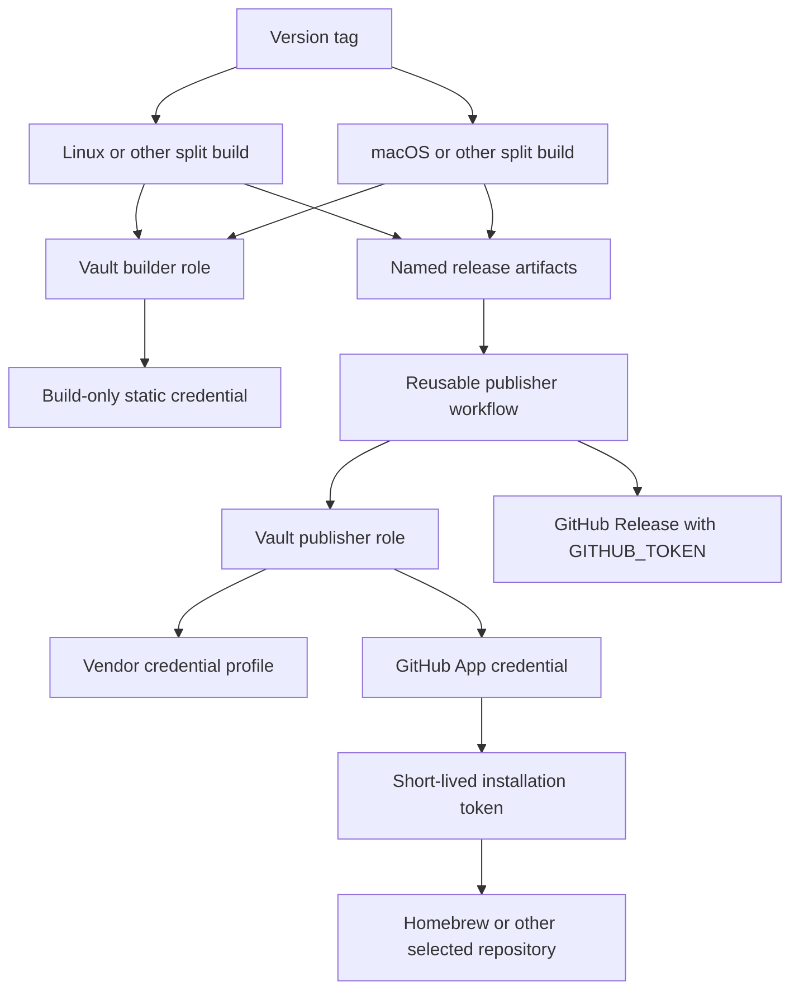

# Playbook: Vault-Backed Go Binary Releases

This playbook defines the Go-Go-Golems procedure for a Go binary repository that releases through GitHub Actions and GoReleaser. It covers both a new repository and an existing repository whose release credentials currently live in GitHub Actions secrets. The intended design uses GitHub Actions OIDC to authenticate to Vault, uses a separate Vault role for platform builds and final publication, and uses a narrow GitHub App installation token for a Homebrew tap or another cross-repository GitHub write.

Use this playbook with the implementation report [[PROJECT REPORT - Vault Backed Binary Releases - Sqleton Pilot and GitHub App Publishing]] and the infrastructure map [[Research/KB/Projects/infrastructure-and-release]]. For the Sqleton pilot’s exact commands and historical evidence, consult `INFRA-007` rather than copying its repository IDs or paths.

> [!warning] Security rule
>
> Never put a private key, GitHub personal access token, vendor token, GoReleaser license, GPG export, passphrase, or Vault token in a ticket, issue, pull request, repository file, workflow input, terminal transcript, shell history, or chat message. Record non-secret evidence only: path names, field names, metadata versions, run URLs, resource addresses, and expected permission boundaries.

## 1. Decide whether this playbook applies

Use this design when a tag workflow builds a Go binary and performs one or more of these release side effects:

- creates a GitHub Release;
- uploads a container image to GHCR;
- updates a Homebrew formula/cask repository;
- publishes to a vendor package registry such as Fury;
- uses a paid GoReleaser distribution or another static build-service license;
- signs checksums with an exportable signing key.

Do not add Vault merely because a workflow has no sensitive external capability. A simple repository that builds an artifact and attaches it to a GitHub Release may only need job-scoped `GITHUB_TOKEN` permissions. The design begins by inventorying operations and credentials, not by migrating a fixed list of variable names.

## 2. Security model

The system has three credential classes.

| Class | Examples | Preferred source | Required boundary |
| --- | --- | --- | --- |
| GitHub repository runtime authority | GitHub Release, GHCR push | `GITHUB_TOKEN` | Job-scoped GitHub permissions. |
| Cross-repository GitHub authority | Homebrew tap update | GitHub App installation token | App installed on exactly the target repository; private key in Vault. |
| Static external authority | GoReleaser license, Fury token, GPG material | Vault KV | Vault policy bound to GitHub OIDC claims. |

The minimum invariants are:

1. A platform build can read only what is needed to build its artifacts.
2. A final publisher receives publication credentials only after all required artifacts exist.
3. A workflow names an approved credential profile; it never supplies a Vault path or arbitrary secret field.
4. Roles bind immutable repository ID, repository, event, tag ref, caller workflow, and reusable publisher workflow.
5. Cross-repository GitHub write uses a short-lived installation token limited by the App installation.
6. Migration and verification capabilities are temporary, exact-path, and removed after proof.
7. Legacy GitHub secrets remain only until a controlled release succeeds, then are deliberately removed.



## 3. Inputs and discovery

Before writing Terraform or YAML, create a release inventory. Use the actual workflow and GoReleaser config as evidence.

| Input | Record | Example question |
| --- | --- | --- |
| Repository identity | Owner/name and immutable numeric repository ID | Which GitHub OIDC subject must Vault accept? |
| Release trigger | Exact tag pattern | Is every tag a release, or only `v*`? |
| Build matrix | OS/architecture, CGO requirements, Docker use | Which jobs need package-write permission? |
| Artifact protocol | Split artifact names and merge layout | Can the final job locate every platform result deterministically? |
| GitHub side effects | Release, package, commit, PR | Can `GITHUB_TOKEN` perform each same-repository action? |
| External destinations | Homebrew tap, Fury package, other registry | Which destination needs a GitHub App or vendor credential? |
| Static values | License, vendor token, signing material | Does the vendor provide a short-lived alternative? |
| Existing credentials | GitHub secret names and owners | Can an exact temporary workflow transfer them without disclosure? |
| GoReleaser version | Installed/action version and config status | Does strict validation report migrations that must be reviewed? |

Run discovery commands without printing secret values:

```bash
rg -n 'secrets\.|GITHUB_TOKEN|goreleaser|homebrew|fury|signs|dockers|brews' \
  .github/workflows .goreleaser.yaml .goreleaser.yml
goreleaser check --config .goreleaser.yaml
goreleaser check --soft --config .goreleaser.yaml
git remote -v
gh repo view --json nameWithOwner,id,url
```

If the strict check fails because of configuration deprecations, create a specific task for the migration. `--soft` means that configuration syntax was accepted; it does not waive the strict release gate.

## 4. New repository procedure

### Phase A — establish the normal Go project and release shape

Use the `go-go-golems-project-setup` skill to scaffold Makefile, lint, tests, GoReleaser baseline, CI, and release workflow conventions. Confirm the repository has one top-level `go.mod`, reproducible `go test ./...`, and a GoReleaser configuration that names the intended binary and targets.

For a release that needs multiple native operating systems or separate CGO environments, use a split/merge arrangement. The build jobs produce artifacts. One publisher job consumes them after all builds finish. Do not run release-side effects independently from every platform job.

```text
tag push
  -> split build per platform
  -> upload named dist artifact per platform
  -> one merge/publish job
```

Use `GITHUB_TOKEN` for GitHub Release operations in the caller repository. Set `contents: write` only on the final publication job. Give build jobs `contents: read` and only the additional package permission actually required for that build.

### Phase B — add Terraform policy declarations

In `/home/manuel/code/wesen/terraform/vault/github-actions/envs/k3s/main.tf`, add a credential profile and a repository release-publisher entry. Follow the existing `release_credential_profiles` and `release_publishers` structure. Do not add a workflow input that passes a Vault path.

Create two permanent roles:

- `release-<repo>-builder`: reads only the build-required secret, typically the GoReleaser Pro license.
- `release-<repo>-publisher`: reads the approved profile, which may contain the license, a vendor token, and the App credential for a fixed external destination.

Each policy should use KV v2 `kv/data/...` paths and omit `list`, `delete`, and broad mount access. Each role should bind:

```text
repository_id    = immutable numeric GitHub repository ID
repository       = owner/repository
event_name       = push
ref              = refs/tags/<approved pattern>
workflow_ref     = owner/repo/.github/workflows/release.yml@refs/tags/<pattern>
job_workflow_ref = go-go-golems/infra-tooling/.github/workflows/publish-goreleaser-release.yml@refs/heads/main
```

Validate Terraform locally, then use a normal remote-state plan. Do not apply a plan that contains unrelated changes. If unrelated drift prevents a safe plan, stop and document it in its own ticket. A targeted saved plan may be used only as an explicit recovery exception with a reviewed list of exact resource addresses and no unrelated mutation.

```bash
terraform -chdir=vault/github-actions/envs/k3s fmt
terraform -chdir=vault/github-actions/envs/k3s init
terraform -chdir=vault/github-actions/envs/k3s validate
terraform -chdir=vault/github-actions/envs/k3s plan -out=/tmp/<repo>-release.plan
```

### Phase C — add the caller workflow and shared publisher

Use the existing infra-tooling reusable workflow rather than copying publisher mechanics into each repository. The caller owns platform selection and artifact production. The shared workflow owns approved-profile verification, publisher Vault authentication, App-token minting, and GoReleaser merge publication.

The conceptual caller workflow is:

```yaml
on:
  push:
    tags: ["v*"]

jobs:
  release-linux:
    permissions: {contents: read, packages: write, id-token: write}
    # OIDC login as release-<repo>-builder
    # goreleaser-pro release --clean --split
    # upload <repo>-dist-linux

  release-darwin:
    permissions: {contents: read, id-token: write}
    # OIDC login as release-<repo>-builder
    # goreleaser-pro release --clean --split
    # upload <repo>-dist-darwin

  publish:
    needs: [release-linux, release-darwin]
    permissions: {contents: write, id-token: write}
    uses: go-go-golems/infra-tooling/.github/workflows/publish-goreleaser-release.yml@main
    with:
      credential-profile: <approved-profile>
      artifacts: <repo>-dist-linux,<repo>-dist-darwin
```

The exact inputs are the shared workflow’s API. Read that file before changing or invoking it. Do not add an unreviewed compatibility layer for old secret names. Migrate the caller to the new fixed interface in one focused change.

### Phase D — establish the cross-repository contract test

Create or extend a repository contract script in the corresponding infra-tooling ticket. It should inspect explicit checkout roots and assert at least:

- the caller tag trigger matches the Vault ref binding;
- each builder job uses only the builder role;
- build jobs do not reference App, tap, vendor, GPG, or other publisher-only secrets;
- artifact names produced by callers match the shared workflow inputs;
- the publisher profile is allowlisted and fixes the external repository;
- the builder policy cannot read publisher-only paths;
- the publisher role binds `job_workflow_ref` to the shared workflow;
- retired GitHub secret references are absent from the permanent release workflow.

Run the harness from clean checkouts before requesting review. Add a deliberate unsafe fixture during development to prove the negative assertion fails understandably.

## 5. Existing repository migration procedure

An existing repository has a second concern: its current GitHub secrets must move without exposing them. Do not ask an operator to recover secret plaintext from GitHub; GitHub does not provide that capability through normal secret APIs.

### Phase A — make permanent infrastructure ready first

Complete the new-repository Terraform and workflow work first. Merge reviewed permanent roles and the shared workflow. Do not change the production release’s credential source until the intended permanent path is reviewable.

### Phase B — create a temporary bootstrap role and workflow

Add a one-time role and a manual workflow only if a current GitHub secret needs to be moved. The temporary role must:

- be bound to the exact repository, immutable ID, `workflow_dispatch`, `main` ref, and exact bootstrap workflow reference;
- have a short TTL;
- grant only `create` and `update` on explicitly enumerated KV v2 paths;
- have no `read`, `list`, or `delete` capability;
- omit the GitHub App private-key path;
- have a documented removal PR prepared before dispatch.

The workflow must:

- require a literal confirmation string;
- check all required source secrets before its first write;
- write exact JSON payloads to exact paths;
- create temporary files with mode `0600` and remove them with an exit trap;
- print neither input values nor JSON payloads;
- require the repository’s release environment when applicable.

Avoid a generic workflow accepting arbitrary source-secret and destination-path inputs. That would be a reusable secret-copy primitive rather than a controlled migration.

### Phase C — create a GitHub App for cross-repository write

For a Homebrew tap, create a private/internal GitHub App with:

- webhooks disabled;
- only Contents read/write permission;
- installation on **Only select repositories**;
- the exact tap repository selected and no other repository;
- a new private key generated once for Vault storage.

Store the numeric App ID and PEM directly from an authorized operator terminal into the fixed Vault path. Validate the format locally and print only KV metadata after the write. Retire the downloaded PEM according to the organization’s secure-storage procedure after metadata verification.

The App installation token is created in the publisher workflow. It must request only the intended target repository. Do not use a GitHub PAT merely because a GoReleaser token field accepts one.

### Phase D — proof and cleanup

Run the bootstrap workflow once. Record its URL and the metadata version for each approved path. Then run a separate verifier that reads the App credential through its own temporary read-only role, mints an installation token, creates a uniquely named temporary branch, deletes it, and verifies no branch remains.

Immediately after proof:

1. Open and merge the repository PR removing the temporary manual workflows.
2. Open and merge the Terraform PR removing the bootstrap and verifier roles/policies.
3. Plan the cleanup and require only the expected temporary-resource destruction.
4. Apply the reviewed cleanup plan.
5. Re-run the permanent contract harness.
6. Schedule a controlled version-tag release.
7. Remove legacy GitHub secrets only after the release proves all destinations.

## 6. GitHub App storage and runtime contract

The standard Vault record contains two fields:

```json
{
  "app_id": "<numeric App ID>",
  "private_key": "<PEM contents>"
}
```

Only Vault, an authorized key-rotation operator, and the publisher role should handle this record. The record is not supplied by a workflow input. The release workflow reads it, signs an App authentication request, creates an installation token, and gives only that token to the tool that writes the external repository.

For a new App key, rotate by creating a replacement GitHub App private key, writing the replacement to the same Vault path, verifying metadata and an actual token operation, then deleting the superseded App key in GitHub. Record the rotation date and owner without recording the private key.

## 7. Validation matrix

Run checks in order. A later check does not replace an earlier one.

| Stage | Required command or action | Pass condition |
| --- | --- | --- |
| Formatting | `terraform fmt`, `go fmt ./...` where applicable | No formatting diff. |
| Local Terraform syntax | `terraform init -backend=false`, `terraform validate` | Valid configuration. |
| Repository quality | `go test ./...`, project lint targets | Project checks pass. |
| Workflow syntax | YAML parser or actionlint if configured | Workflow structure parses. |
| GoReleaser strict status | `goreleaser check` | Passes, or a separately reviewed temporary exception exists. |
| GoReleaser syntax | `goreleaser check --soft` | Configuration syntax accepted. |
| Cross-repository contract | Ticket harness | Positive and negative policy invariants pass. |
| Terraform plan | Normal remote-state plan | Only reviewed release changes occur. |
| Bootstrap proof | Manual exact-path dispatch | OIDC, fixed writes, and metadata proof succeed. |
| App proof | Temporary branch create/delete | Token has exactly intended repository access. |
| Release proof | Controlled version tag | GitHub, artifacts, Homebrew, and vendor publication complete. |

## 8. Failure handling

| Symptom | Response |
| --- | --- |
| Vault OIDC login denied | Compare observed non-secret claims with the role. Correct exact claim mismatch; never replace bindings with repository/ref wildcards. |
| Builder needs a publisher secret | Re-examine the build topology. Move the side effect to the merge job if possible. Do not widen the builder role by default. |
| App token cannot write the external repo | Verify App installation is selected-repository scope and has only the needed Contents permission. Do not install it on the organization’s full repository set. |
| Terraform plan includes unrelated destruction | Stop. Create a separate drift investigation. Use a saved targeted plan only for a tightly reviewed exceptional recovery. |
| Bootstrap failed after one write | Review the run and path metadata. The exact writes are deterministic; repair only the fixed approved path. Do not change the workflow into a generic writer. |
| App private key exposed or lost | Revoke it in GitHub App settings, generate a replacement, update the fixed Vault record, prove token creation, then record the rotation. |
| Strict GoReleaser check reports deprecations | Open a focused configuration/compatibility task. A soft check is not a release-quality waiver. |

## 9. Closure checklist

Do not mark a repository migration complete until all items are true.

- [ ] The persistent builder and publisher roles are applied and their claim bindings match the released workflow.
- [ ] The profile is Terraform-owned and does not permit caller-selected secret paths.
- [ ] The GitHub App is installed only on its intended external repository.
- [ ] The App token completed a reversible write proof.
- [ ] The legacy migration path is removed from both repository workflows and Vault policy.
- [ ] A fresh cleanup plan applied only the intended temporary-resource removal.
- [ ] Strict GoReleaser validation is accepted or its exception is explicitly approved and time-bounded.
- [ ] A controlled version-tag release has published every expected destination.
- [ ] Old GitHub secrets are deleted after that release.
- [ ] The ticket diary records run URLs, plans, resource changes, metadata versions, and remaining work without secret values.

## 10. References

- [[PROJECT REPORT - Vault Backed Binary Releases - Sqleton Pilot and GitHub App Publishing]]
- [[Research/KB/Projects/infrastructure-and-release]]
- [GoReleaser split and merge](https://goreleaser.com/customization/general/partial/)
- [GoReleaser deprecations](https://goreleaser.com/deprecations/)
- [GitHub App installation authentication](https://docs.github.com/en/apps/creating-github-apps/authenticating-with-a-github-app/authenticating-as-a-github-app-installation)
- [GitHub App private keys](https://docs.github.com/en/apps/creating-github-apps/authenticating-with-a-github-app/managing-private-keys-for-github-apps)
- [Vault policy concepts](https://developer.hashicorp.com/vault/docs/concepts/policies)
