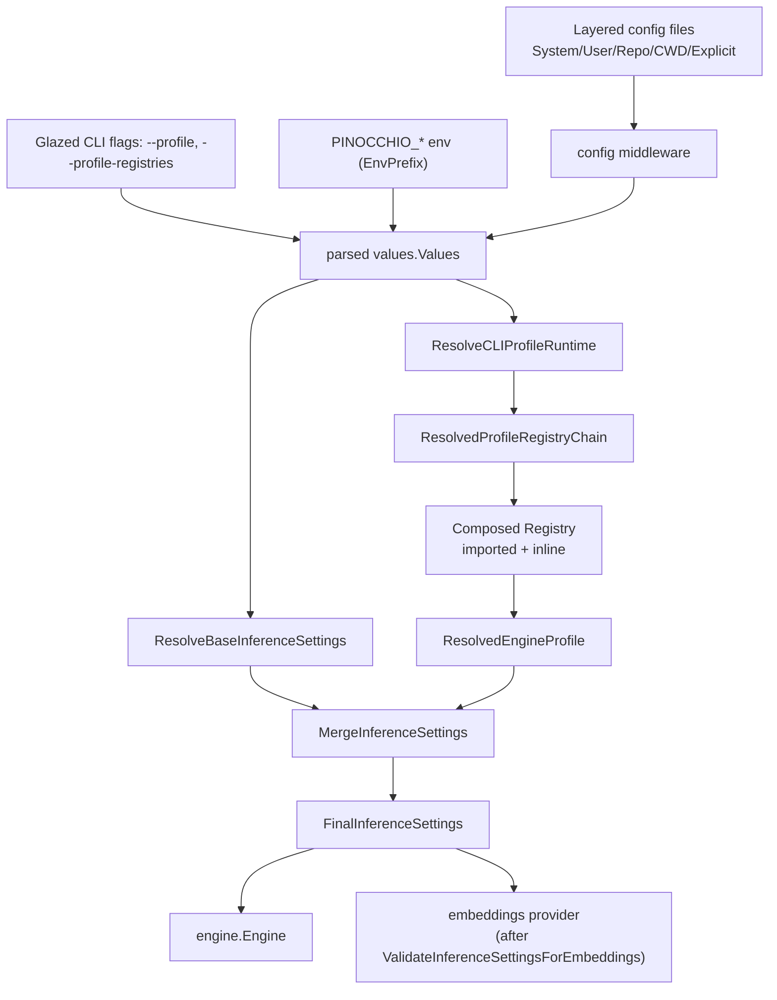

# Loading Pinocchio/Geppetto Profiles for LLM and Embeddings Inference

This playbook describes how to load engine and embedding profiles from Pinocchio/Geppetto to run LLM and embeddings inference in a new host application. It captures the reusable pattern that was built, debugged, and hardened across six implementation sessions between 2026-03-17 and 2026-05-23, and reflects the **current canonical API** in both repositories.

> [!summary]
> - The reusable machinery lives in `geppetto/pkg/cli/bootstrap` (`AppBootstrapConfig`, `ResolveCLIEngineSettings`, `ResolveCLIProfileRuntime`) and `geppetto/pkg/sections` (`NewProfileSettingsSection`). A new host reuses it and only supplies an app name, env prefix, config-file mapper, and a layered config plan.
> - `pinocchio/pkg/cmds/profilebootstrap` is the Pinocchio-specific customization: `pinocchioBootstrapConfig()` sets `AppName: "pinocchio"`, `EnvPrefix: "PINOCCHIO"`, and the layered config plan (System → User → Repo → CWD → Explicit).
> - Credentials are resolved **through the profile stack** (`inference_settings.api.api_keys` / `embeddings.api_keys`), never `os.Getenv("OPENAI_API_KEY")`. `embeddings.ValidateInferenceSettingsForEmbeddings` enforces this and gives profile-oriented diagnostics.
> - Profile registries are layered too: imported YAML/SQLite sources compose with inline profiles from the effective config document, with an explicit default-registry slug.

## When to use this

Use this pattern when a Go application (a CLI, a web-chat host, a TUI, or a JS runner) needs to:

- select a model/provider from a named **profile** instead of hard-coding flags;
- load **profile registries** (YAML files, SQLite DBs, or DSNs) from a layered config;
- resolve **API keys and base URLs through profiles** rather than environment variables;
- run **embeddings** inference (OpenAI or Ollama) from the same profile stack;
- give users a `--profile` / `--profile-registries` CLI surface that composes with config files and `PINOCCHIO_PROFILE`-style env vars.

Do **not** use this when you need a one-off hardcoded engine — reach for `geppetto/pkg/inference/engine` directly. This playbook is for hosts that want config-driven, layered, registry-backed profile selection.

## How profile loading works



### The three-layer resolution

1. **Base inference settings** (`ResolveBaseInferenceSettings`) — runs the *hidden* Geppetto base sections through env + config + defaults. This is the floor: provider-independent settings (API keys, base URLs, timeouts) that every profile stacks on top of.

2. **Profile runtime** (`ResolveCLIProfileRuntime`) — runs the *profile-settings* section (`--profile`, `--profile-registries`) through the same env + config + defaults, then resolves the **profile registry chain**:
   - imported registries (YAML/SQLite/DSN from `--profile-registries` or config), and
   - inline profiles from the effective config document (`profile.active` + `profile.registries` keys in a `profiles.yaml`).
   These are **composed** (`configdoc.ComposeRegistry`) into one registry with an explicit default-registry slug. If a profile is selected but no registries and no inline profiles exist, it returns a `ValidationError` ("requires either inline profiles or configured profile registries") rather than silently failing.

3. **Engine settings** (`ResolveCLIEngineSettings` / `ResolveCLIEngineSettingsFromBase`) — resolves the selected engine profile against the composed registry, **merges** it onto the base inference settings (`gepprofiles.MergeInferenceSettings`), and returns `ResolvedCLIEngineSettings` with both base and final settings, the resolved profile, config files touched, and a `Close` func to release registry handles (e.g. SQLite connections).

### The config layering

The layered config plan (built by `ConfigPlanBuilder`) resolves files in this order, with path dedup:

| Layer | What it provides |
|---|---|
| System | `/etc/pinocchio/` app config |
| User | `~/.config/pinocchio/` app config + `~/.pinocchio/profiles.yaml` |
| XDG | XDG app config |
| Repo (git root) | `profiles.yaml` + `profiles.local.yaml` (profile-overlay) |
| CWD | `profiles.yaml` + `profiles.local.yaml` (profile-overlay) |
| Explicit | `--config-file` flag |

Each profile-overlay layer can set `profile.active` and `profile.registries`; the config-file mapper (`configFileMapper`) normalizes the `profile:` block into the `profile-settings` section that the Glazed schema consumes.

## Wiring a new host: step by step

### 1. Add the profile-bootstrap dependency

```go
import (
    "github.com/go-go-golems/geppetto/pkg/cli/bootstrap"
    geppettosections "github.com/go-go-golems/geppetto/pkg/sections"
    // For a Pinocchio-style host, reuse the customization package directly:
    "github.com/go-go-golems/pinocchio/pkg/cmds/profilebootstrap"
)
```

### 2. Define your `AppBootstrapConfig`

If you are extending Pinocchio, reuse `profilebootstrap.BootstrapConfig()` — it already sets `AppName: "pinocchio"`, `EnvPrefix: "PINOCCHIO"`, the geppetto base sections, and the layered config plan.

For a **new app** (the design intent from session `2803ce85`, user turn t75: *"the fix should be in geppetto if possible so that every tool that uses that logic can use it. The only thing pinocchio should do is provide the app name"*), build your own `bootstrap.AppBootstrapConfig`:

```go
func myAppBootstrapConfig() bootstrap.AppBootstrapConfig {
    return bootstrap.AppBootstrapConfig{
        AppName:          "myapp",
        EnvPrefix:        "MYAPP",
        ConfigFileMapper: myConfigFileMapper,           // map your config shape -> sections
        NewProfileSection: func() (schema.Section, error) {
            return geppettosections.NewProfileSettingsSection() // reuse the shared section
        },
        BuildBaseSections: func() ([]schema.Section, error) {
            return geppettosections.CreateGeppettoSections()   // reuse geppetto's base sections
        },
        ConfigPlanBuilder: myConfigPlanBuilder,               // System/User/Repo/CWD/Explicit layers
    }
}
```

`AppBootstrapConfig.Validate()` requires all six fields (AppName, EnvPrefix, ConfigFileMapper, NewProfileSection, BuildBaseSections, ConfigPlanBuilder).

### 3. Add the `--profile` / `--profile-registries` flags

Attach the reusable profile-settings section to your Glazed command:

```go
profileSection, err := geppettosections.NewProfileSettingsSection(
    geppettosections.WithProfileRegistriesDefault("~/.config/myapp/profiles.yaml"),
)
// ...
cmds.WithSections(profileSection)
```

This gives you `--profile <slug>` and `--profile-registries <yaml|sqlite|sqlite-dsn,...>` flags, plus `MYAPP_PROFILE` env support (via the `EnvPrefix`).

### 4. Resolve the engine and run inference (LLM)

```go
resolved, err := bootstrap.ResolveCLIEngineSettings(ctx, myAppBootstrapConfig(), parsed)
if err != nil {
    return errors.Wrap(err, "resolve engine profile settings")
}
defer resolved.Close() // releases registry handles (SQLite etc.)

eng, err := bootstrap.NewEngineFromResolvedCLIEngineSettings(resolved)
// run the engine...
```

Pinocchio's wrapper (`profilebootstrap.ResolveCLIEngineSettings`) does exactly this. See `pinocchio/cmd/examples/simple-chat/main.go` for a complete example.

### 5. Resolve embeddings inference

Embeddings reuse the **same** resolved settings, but you must validate embedding capability before constructing a provider — otherwise you get a low-level "no API key provided" error instead of a profile-oriented diagnostic:

```go
if err := embeddings.ValidateInferenceSettingsForEmbeddings(resolved.FinalInferenceSettings); err != nil {
    return err
}
provider, err := embeddings.NewSettingsFactoryFromInferenceSettings(resolved.FinalInferenceSettings).NewProvider()
vec, err := provider.GenerateEmbedding(ctx, text)
```

`ValidateInferenceSettingsForEmbeddings` checks that `inference_settings.embeddings.{type,engine}` are present and, for OpenAI, that an `openai-api-key` was resolved through the stack; for Ollama, that `dimensions` is set.

### 6. (Optional) Introspect where settings came from

For debugging, expose `--print-profiles` or a `profiles list` / `profiles show` verb using `profilebootstrap`/`bootstrap` introspection (`profile_introspection.go`). This was added in sessions `019e1fb7` and `019e462b` so users can see how a profile was resolved, merged, and overlaid — the "show how a setting was resolved" feature requested in turn `2803ce85` t294.

## Credential resolution: profiles, not env

A hard rule from the embeddings session (`019e55d6`, user turn t54: *"use ~/.config/pinocchio/profiles.yaml, no os.Getenv(\"OPENAI_API_KEY\"), remove them all from everywhere"*):

- API keys live in the profile stack under `inference_settings.api.api_keys["openai-api-key"]` or `inference_settings.embeddings.api_keys["openai-api-key"]`.
- Base URLs live under `inference_settings.api.base_urls["ollama-base-url"]`.
- Env vars (`PINOCCHIO_PROFILE`, `OPENAI_API_KEY` as a *profile-set* key, not `os.Getenv`) participate only through the Glazed `FromEnv` source keyed by `EnvPrefix`.

A profile that needs OpenAI credentials **stacks** a provider base profile (e.g. `provider-openai/default`) that contributes the API key, then an embedding or chat profile stacks on top.

## Example profile registry

```yaml
# profiles.yaml — an embedding-capable registry
slug: embeddings
display_name: Embedding profiles
profiles:
  openai-embedding-small:
    slug: openai-embedding-small
    stack:
      - registry_slug: provider-openai
        profile_slug: default          # contributes openai-api-key
    inference_settings:
      embeddings:
        type: openai
        engine: text-embedding-3-small
        dimensions: 1536
        cache_type: file
        cache_directory: ./.geppetto/embeddings-cache/openai-text-embedding-3-small
  ollama-nomic-embedding:
    slug: ollama-nomic-embedding
    inference_settings:
      api:
        base_urls:
          ollama-base-url: http://localhost:11434
      embeddings:
        type: ollama
        engine: nomic-embed-text
        dimensions: 768
```

Place this at `~/.config/pinocchio/profiles.yaml`, a repo-root `profiles.yaml`, or pass `--profile-registries ./profiles.yaml`. See `geppetto/examples/js/geppetto/profiles/40-embeddings.yaml` for the full working example and `geppetto/cmd/examples/embedding-profile-smoke/main.go` for the smoke CLI.

## Verification

After wiring:

```bash
# LLM, with a chat profile
myapp chat --profile gpt-5-mini --print-profiles

# Embeddings smoke (Geppetto example)
go run ./cmd/examples/embedding-profile-smoke run \
  --profile-registries ~/.config/pinocchio/profiles.yaml \
  --profile openai-embedding-small \
  --text "hello profile-backed embeddings" --output json

# Inspect resolved layers
myapp profiles list --verbosity detailed
myapp profiles show <slug>
```

The unit tests that pin this behavior:

```bash
go test ./pinocchio/pkg/cmds/profilebootstrap/... -count=1
go test ./geppetto/pkg/cli/bootstrap/... -count=1
go test ./geppetto/pkg/embeddings/... -count=1
go test ./geppetto/pkg/engineprofiles/... -count=1   # stack_merge_embeddings_test.go
```

## Key files

| Concern | Location |
|---|---|
| Host-agnostic bootstrap config + resolution | `geppetto/pkg/cli/bootstrap/{config,engine_settings,profile_runtime,profile_selection,profile_registry,profile_registry_defaults}.go` |
| Reusable profile-settings section | `geppetto/pkg/sections/profile_sections.go` |
| Profile introspection / `--print-profiles` | `geppetto/pkg/cli/bootstrap/profile_introspection.go`, `geppetto/pkg/sections/profile_introspection_section.go` |
| Pinocchio customization (app name + env + layered plan) | `pinocchio/pkg/cmds/profilebootstrap/{profile_selection,engine_settings,parsed_base_settings,repositories}.go` |
| Embeddings validation | `geppetto/pkg/embeddings/settings_validation.go` |
| LLM host example | `pinocchio/cmd/examples/simple-chat/main.go` |
| Embeddings host example | `geppetto/cmd/examples/embedding-profile-smoke/main.go` |
| `profiles list`/`show` verbs | `pinocchio/cmd/pinocchio/cmds/profiles/{list,show}.go` |

## Design history (evidence-backed)

This pattern was built across six implementation sessions, verified against git:

| Date | Session | Repo commits | Contribution |
|---|---|---|---|
| 2026-03-17/19 | `019d05b6` (Codex) | geppetto `c2b5e4a`, `34401d6`; pinocchio `495787d`/`81a17d3`, `d285182`, `dc68594` | Made `ProfileRegistrySettingsSection` public + reusable; wrapped geppetto cli bootstrap in `profilebootstrap`; aligned pinocchio JS profile loading with CLI defaults; removed `ParseEngineProfileRegistrySourceEntries` in favor of `TypeStringList`. |
| 2026-04-10..14 | `a9b7ea4e` (Pi) | pinocchio `56bb1f6`, `703288e` | PinocchioRC: layered local config plan, `profile_registry.go`, `repositories.go`, `local_profile_plan_test.go`. |
| 2026-04-18 | `2803ce85` (Pi) | pinocchio `6d2c944`, `a3e6603`; geppetto `5276b0b0`, `3f5a4bed` | Fixed `PINOCCHIO_PROFILE` env resolution; canonical profile runtime API (removed split selection wrappers); restored implicit profile-registry fallback; moved shared logic to geppetto. |
| 2026-05-13 | `019e1fb7`/`019e2309` (Pi) | geppetto PR #355 | Profile introspection (`profile_introspection.go`) + `--print-profiles` design. |
| 2026-05-20 | `019e462b` (Pi) | pinocchio PRs #153/#155 | `pinocchio profiles list/show` verbs + introspection wiring. |
| 2026-05-23 | `019e55d6`/`019e5652` (Pi) | geppetto `bf38f712`, `b1189660` | Embedding profiles + `ValidateInferenceSettingsForEmbeddings`; credentials-through-profiles (removed `os.Getenv`); glazed embeddings example tool. |

Full per-session evidence (files written, user turns, verified hashes) is in the docmgr ticket `PROFILE-LOADING-PLAYBOOK-2026-07-25` analysis doc.

## Known adopters

These codebases adopted the pattern into their own code (verified against git where the repo is tracked). Use them as reference examples when adopting into a new host.

| Codebase | Adoption shape | Reference files | Session / commit |
|---|---|---|---|
| **readwise-viewer** | Full clean adoption: own `pkg/profilebootstrap` with `AppName`/`EnvPrefix` + embeddings | `pkg/profilebootstrap/bootstrap.go`, `config_mapper.go`; `cmd/readwise-viewer/cmds/embeddings.go` | `019e4d1a`; commits `a1faccf`, `b92867d` |
| **cozodb-editor** | First consumer adoption; dogfooded the migration tutorial | `backend/main.go` | `019d0846`/`019d402e` |
| **wesen-os launcher** | "Load *pinocchio's* config, not my own" + per-app registry chain | `wesen-os/cmd/wesen-os-launcher/profile_bootstrap.go` | `019d174c` |
| **chatbot-overlay-glm** | Web-chat host adoption (chat-overlay server + real_runtime provider) | `cmd/chat-overlay/cmds/serve.go`, `internal/webchat/real_runtime.go` | `019e73cb` |
| **ttc-design-system** | Web-chat host adoption (garden-chat backend) | `backend/cmd/ttc-garden-chat/main.go`, `backend/internal/webchatcmd/run.go` | `019e8622` |
| **css-visual-diff** | Richer `BootstrapResult` wrapper + inference-debug output | `internal/cssvisualdiff/llm/bootstrap.go` | commit `b667bcd` |
| **book-ocr** | OCR pipeline reuse (filesystem-confirmed, session unresolved) | `internal/ocrmvp/geppetto_ocr.go` | — |
| **go-go-agent** | Light adoption (imports profilebootstrap in `main.go`) | `cmd/chat/main.go` | `019dd91a`/`019dd974` |

The **readwise-viewer** adoption is the recommended starting template: it is self-contained, defines its own `AppBootstrapConfig`, uses a simpler config layering (System/User/Explicit), and exercises the embeddings path end-to-end.

## Working rules

- One bootstrap config per app; set `AppName` + `EnvPrefix`, reuse geppetto's sections and resolution.
- Keep base inference settings, profile runtime, and engine resolution as three explicit steps — do not collapse them.
- Resolve credentials through the profile stack, never `os.Getenv`.
- Validate embedding capability with `ValidateInferenceSettingsForEmbeddings` before constructing a provider.
- Always `defer resolved.Close()` to release registry handles (SQLite connections).
- Expose introspection (`profiles list/show`, `--print-profiles`) so users can see how settings were resolved.
- Test the layering explicitly: System → User → Repo → CWD → Explicit precedence (see `local_profile_plan_test.go`).
