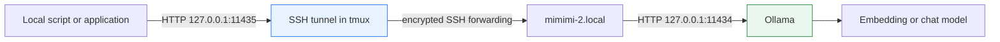

# Accessing Ollama on the mimimi Mac

This playbook describes how to use the Ollama server running on Manuel's Mac
from another development machine without exposing the model API on the LAN. It
uses SSH local-port forwarding: callers use a normal local URL, while Ollama
continues to bind only to the Mac's loopback interface.

> [!summary]
> - Use `mimimi-2.local`, not `mimimi.local`: the short alias was unresolved when this playbook was verified.
> - Start a local-only tunnel to `http://127.0.0.1:11435`; the remote Ollama listener remains `127.0.0.1:11434`.
> - `nomic-embed-text:latest` is installed and returns 768-dimensional embeddings. It is not a chat LLM; install a chat-capable model before using `/api/chat`.

## When to use this

Use this pattern when a local project needs embeddings or inference from the
Mac's Ollama instance. Typical uses are RAG indexing, query embedding,
retrieval experiments, interactive LLM tools, and small scripts that speak
Ollama's native HTTP API.

Do not put this host, port, or a tunnel command into a repository's immutable
experiment specification. They are runtime infrastructure. Record the model
name, dimensions, and experiment configuration separately when reproducibility
matters.

## Topology and safety boundary



Both HTTP listeners are loopback-only. Keep it that way:

- Local callers use `127.0.0.1:11435`.
- Ollama stays on `127.0.0.1:11434` on the Mac.
- Do not add `-g`, `0.0.0.0`, reverse forwarding, or a firewall exception.
- The tunnel carries no API key. SSH authentication is the access boundary.

## Tailscale status and direct-access decision

The Mac's Tailscale daemon was verified active on 2026-07-15:

```text
MagicDNS: mimimi.tail879302.ts.net
IPv4:     100.113.140.75
```

At that time, a direct request to
`http://mimimi.tail879302.ts.net:11434/api/tags` was refused. This is expected:
Tailscale makes the Mac reachable, but Ollama remains bound to
`127.0.0.1:11434`, so it does not accept traffic addressed to the Mac's
Tailscale IP.

The SSH tunnel remains the working default because it preserves this loopback
boundary. There are two deliberate alternatives if direct Tailnet access is
desired:

1. Bind Ollama only to the Mac's Tailscale IPv4 address
   `100.113.140.75:11434` and enforce access with Tailscale ACLs. This exposes
   native Ollama HTTP to permitted tailnet peers, so make the access policy
   explicit first.
2. Configure Tailscale Serve on the Mac to proxy a Tailnet endpoint to
   `http://127.0.0.1:11434`. This keeps Ollama loopback-only and lets Tailscale
   own the network-facing listener, but it is still an infrastructure change
   requiring an explicit service and ACL decision.

### Preferred direct-access setup: Tailscale Serve

Prefer Tailscale Serve over changing `OLLAMA_HOST`. It retains the local
loopback listener and publishes an HTTPS endpoint that is reachable only by
Tailnet members permitted by the Tailnet access policy.

On the Mac, after confirming that the Tailnet policy permits the intended
callers, run:

```bash
tailscale serve --bg http://127.0.0.1:11434
tailscale serve status
```

The first command may require an interactive Tailnet administrator approval to
enable HTTPS certificates. `--bg` makes the mapping persist across shell exits
and Tailscale restarts. The native Ollama API base URL for permitted peers then
becomes:

```text
https://mimimi.tail879302.ts.net
```

Validate it from another Tailnet peer:

```bash
curl -fsS https://mimimi.tail879302.ts.net/api/tags | jq -r '.models[].name'
```

Remove the published mapping when it is no longer wanted:

```bash
tailscale serve off
```

Do not use the raw `--tcp=11434` forwarding mode unless a client cannot use the
HTTPS URL. It has a narrower compatibility benefit while giving up the HTTPS
reverse-proxy boundary. In either mode, restrict access explicitly with
Tailnet ACLs; the Ollama API itself has no built-in authentication.

Do not bind Ollama to `0.0.0.0` merely to make the service reachable through
Tailscale; that also exposes it on ordinary LAN interfaces.

## Verify the remote server

First check SSH reachability and the model inventory. This does not start a
tunnel.

```bash
ssh -o BatchMode=yes -o ConnectTimeout=10 mimimi-2.local \
  'curl -fsS --max-time 5 http://127.0.0.1:11434/api/tags | jq -r "[.models[].name] | join(\",\")"'
```

Expected current output includes:

```text
nomic-embed-text:latest
```

If the Mac shell needs the Ollama CLI, it may not be on `PATH`. Use the app
bundle executable instead:

```bash
ssh mimimi-2.local '/Applications/Ollama.app/Contents/Resources/ollama list'
```

## Start the local tunnel

Use tmux so the tunnel survives the terminal that started it and can be
inspected independently from a long-running experiment.

```bash
tmux new-session -d -s ollama-mimimi \
  'exec ssh -N -o ExitOnForwardFailure=yes -o ServerAliveInterval=30 -o ServerAliveCountMax=3 -L 127.0.0.1:11435:127.0.0.1:11434 mimimi-2.local'
```

Inspect the session and validate the locally reachable endpoint:

```bash
tmux capture-pane -pt ollama-mimimi:0.0 -S -80
curl -fsS --max-time 5 http://127.0.0.1:11435/api/tags \
  | jq -r '[.models[].name] | join(",")'
```

The exact forwarding relation is:

```text
127.0.0.1:11435 on this machine
    -> SSH
    -> 127.0.0.1:11434 on mimimi-2.local
```

## Generate embeddings now

`nomic-embed-text:latest` is installed and produces 768-dimensional vectors.
Use the current native Ollama embedding endpoint for a bounded health check:

```bash
curl -fsS --max-time 30 http://127.0.0.1:11435/api/embed \
  -H 'Content-Type: application/json' \
  -d '{"model":"nomic-embed-text","input":"embedding health check"}' \
  | jq '[.embeddings[0] | length]'
```

Expected output:

```json
[768]
```

Some existing Go integrations, including Geppetto, use the compatibility
endpoint `/api/embeddings` with a `prompt` field:

```bash
curl -fsS --max-time 30 http://127.0.0.1:11435/api/embeddings \
  -H 'Content-Type: application/json' \
  -d '{"model":"nomic-embed-text","prompt":"embedding health check"}' \
  | jq '.embedding | length'
```

For Geppetto/RAG work, configure the provider explicitly as:

```text
type       = ollama
engine     = nomic-embed-text
dimensions = 768
base URL   = http://127.0.0.1:11435
```

## Run an LLM query

The currently verified model, `nomic-embed-text`, is for embeddings only. It
cannot provide meaningful chat responses. First inspect whether the desired
chat model is already installed:

```bash
curl -fsS http://127.0.0.1:11435/api/tags | jq -r '.models[].name'
```

If no chat-capable model is available, ask the Mac owner before downloading
one; model pulls consume disk space and network bandwidth. Two useful current
starting points are:

- `qwen3.5:9b`: the current default Qwen 3.5 tag is about 6.6 GB, supports
  text and image input, tools and thinking, and has a 256K context window.
  This is the recommended first general-purpose local model for chat, coding,
  and agent experiments on this Mac.
- `gemma4:12b`: about 7.6 GB, with text and image input and a 256K context
  window. Use this when testing the current Gemma family or when its
  multimodal and reasoning behaviour is the point of comparison.

Both are current-generation models, not aliases for the older Qwen 3 or Gemma
3 recommendations. Do not pull both by default: choose one, measure the Mac's
responsiveness and memory pressure, then add the other only when comparison is
useful.

The Ollama library names are authoritative at pull time. Confirm free disk
space and available memory first, then pull exactly one model as an explicit
operator action. The Mac's CLI may be absent from `PATH`, so use its verified
app-bundle path:

```bash
ssh mimimi-2.local \
  '/Applications/Ollama.app/Contents/Resources/ollama pull qwen3.5:9b'
```

Or install the smaller multimodal option:

```bash
ssh mimimi-2.local \
  '/Applications/Ollama.app/Contents/Resources/ollama pull gemma4:12b'
```

The command runs the download on the Mac, so it continues to use the Mac's
network and model store. Keep the SSH session open until the pull reports
success. If a colleague needs the pull to survive a disconnected terminal,
start the command in a remote tmux session only after verifying that tmux is
available on the Mac.

After the pull, verify the model and perform one short local request through
the tunnel before handing it to an application:

```bash
curl -fsS http://127.0.0.1:11435/api/tags | jq -r '.models[].name'

curl -fsS --max-time 180 http://127.0.0.1:11435/api/chat \
  -H 'Content-Type: application/json' \
  -d '{
    "model": "qwen3.5:9b",
    "stream": false,
    "messages": [{"role": "user", "content": "Reply with exactly: ready"}]
  }' \
  | jq -r '.message.content'
```

Once a chat model is installed, make a non-streaming query through the tunnel:

```bash
curl -fsS --max-time 180 http://127.0.0.1:11435/api/chat \
  -H 'Content-Type: application/json' \
  -d '{
    "model": "<installed-chat-model>",
    "stream": false,
    "messages": [
      {"role": "user", "content": "Explain reciprocal rank fusion in three sentences."}
    ]
  }' \
  | jq -r '.message.content'
```

Replace `<installed-chat-model>` with a name reported by `/api/tags`. Set a
timeout appropriate to the model and request. `stream: false` is convenient
for scripts; omit it or set `true` when consuming Ollama's streamed JSON
responses.

The model recommendations and reported sizes above are based on the current
[Qwen 3.5 Ollama listing](https://ollama.com/library/qwen3.5) and
[Gemma 4 Ollama listing](https://ollama.com/library/gemma4). Consult the
library immediately before a large pull because available tags and sizes can
change.

## Use from applications

Point a native-Ollama client at the local tunnel URL:

```text
baseURL = http://127.0.0.1:11435
```

For OpenAI-compatible clients, first verify the Ollama version and its exposed
`/v1` endpoints. The commands above use the stable native Ollama endpoints and
are the preferred starting point for diagnostics.

## Troubleshooting

| Symptom | Meaning and next action |
| --- | --- |
| `mimimi.local` does not resolve | Use `mimimi-2.local`. The shorter alias was not resolvable when verified. Repair DNS/mDNS separately if that alias is required. |
| SSH cannot connect | Confirm the Mac is awake and reachable; run the remote `/api/tags` check before changing tunnel options. |
| Local port 11435 refuses connections | Inspect `tmux capture-pane -pt ollama-mimimi:0.0 -S -80`; restart the tunnel only after remote health succeeds. |
| `nomic-embed-text` returns no chat answer | This is expected: it is an embedding model. Select an installed chat model. |
| Long RAG job appears to stop | Inspect tmux and durable run records. Do not start duplicate corpus jobs merely because a foreground shell stopped showing output. |

Stop the local tunnel when finished:

```bash
tmux kill-session -t ollama-mimimi
```

This stops only the SSH forwarding session. It does not stop Ollama on the
Mac.

## Operational status: 2026-07-15 model laboratory set

This is a dated operational snapshot, not an immutable experiment
specification. It records which model families were selected for the RAG
laboratory and the state observed while their downloads were in progress.

The Mac has 64 GB of unified memory and approximately 425 GiB free disk space
at the time of this check. The selected set deliberately contains a larger
primary model, a fast MoE comparison model, and small Gemma variants for
latency- and quality-sensitive experiment matrices.

| Role | Ollama tag | Size reported by Ollama/library | State at check |
| --- | --- | ---: | --- |
| Embedding baseline | `nomic-embed-text:latest` | 274 MB, 768 dimensions | Installed |
| Dense Qwen comparison | `qwen3.6:27b` | 17 GB | Installed |
| Primary Qwen | `qwen3.6:35b` | 23 GB locally (about 24 GB listed) | Installed |
| Primary Gemma | `gemma4:26b` | about 18 GB listed | Download in progress |
| Medium Gemma | `gemma4:12b` | about 7.6 GB listed | Queued |
| Small Gemma | `gemma4:e4b` | about 9.6 GB listed | Queued |
| Smallest Gemma | `gemma4:e2b` | about 7.2 GB listed | Queued |

The primary comparison pair is `qwen3.6:35b` and `gemma4:26b`. Both are
256K-context multimodal MoE models. `qwen3.6:27b` remains installed because it
is a useful dense-model control in coding, summarization, and RAG-answer
experiments. `gemma4:12b`, `gemma4:e4b`, and `gemma4:e2b` make it possible to
measure the quality/latency/memory trade-off within one family.

The downloads are serialized deliberately. A follow-up process pulls, in this
order, `qwen3.6:35b`, `gemma4:26b`, `gemma4:12b`, `gemma4:e4b`, and
`gemma4:e2b`; it waits for the earlier 27B Qwen pull to finish. The Mac did
not have `tmux` installed, so the current operator job is a detached `nohup`
process with logs at:

```text
/tmp/ollama-model-pulls.log
/tmp/ollama-model-pulls-v2.log
```

Inspect status without starting a second pull:

```bash
ssh mimimi-2.local \
  '/Applications/Ollama.app/Contents/Resources/ollama list'

ssh mimimi-2.local \
  'tail -n 20 /tmp/ollama-model-pulls-v2.log'
```

### Tailscale Serve: configured but not yet application-ready

Tailscale Serve is now configured on the Mac as:

```text
https://mimimi.tail879302.ts.net/  ->  http://127.0.0.1:11434
```

This is the desired topology: Ollama still listens only on loopback, while
Tailscale owns the Tailnet-facing HTTPS listener. Confirm the configuration
with:

```bash
ssh mimimi-2.local '/usr/local/bin/tailscale serve status'
```

However, an HTTPS request to `/api/tags` returned `HTTP/2 403` when tested on
2026-07-15. Treat direct Tailnet access as **not yet validated**. The response
occurs before Ollama receives the request, so investigate the Tailnet policy or
Serve authorization path before configuring an application with the HTTPS base
URL. The SSH tunnel remains the verified application endpoint:

```text
http://127.0.0.1:11435
```

## Related material

- RAG experiment operator reference: `/home/manuel/workspaces/2026-07-13/rag-eval-ttc/rag-evaluation-system/ttmp/2026/07/14/RAGEVAL-RAG-DSL-001--typed-fluent-javascript-rag-laboratory-module/reference/03-mimimi-ollama-tunnel-operator-playbook.md`
- Geppetto's Ollama provider: `/home/manuel/workspaces/2026-07-13/rag-eval-ttc/geppetto/pkg/embeddings/ollama.go`
