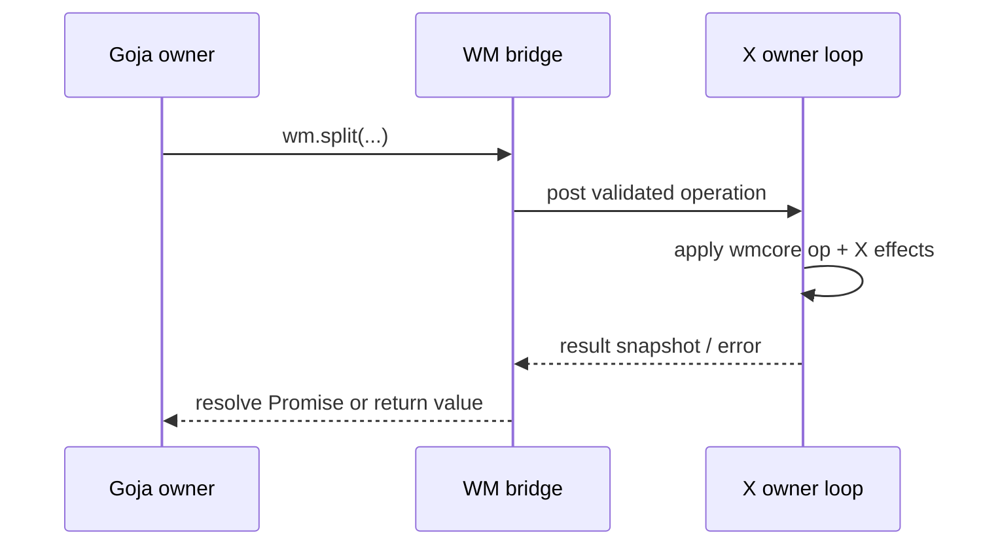
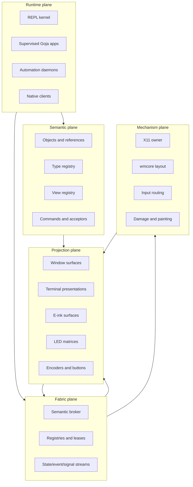
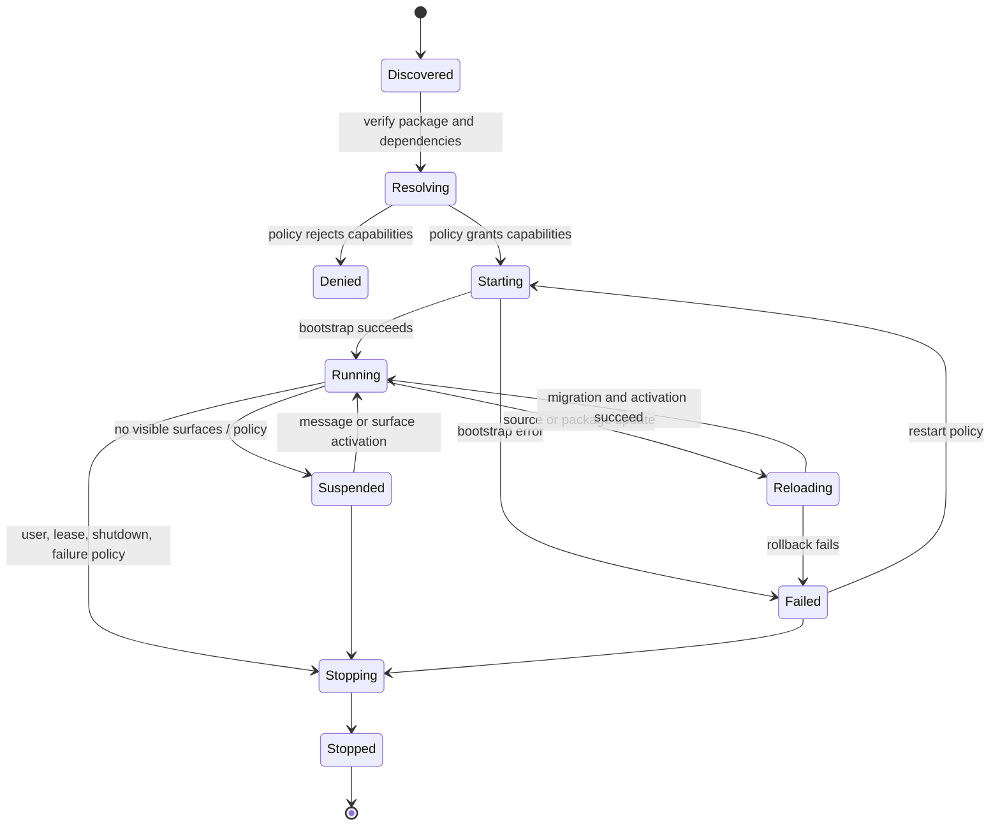
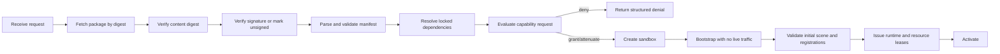
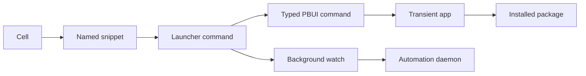

# Lost UI Approaches

- URL: https://chatgpt.com/c/6a6132df-d1d0-83ea-910f-a73449c6752d
- Created: 2026-07-22T21:15:23.116Z

---

> presentation based UIs and other interesting UI approaches that got lost over time, hypercard stuff, xerox parc, grails, alan kay, lidlicker, etc...
>
> Search also for descendants in current HCI research

<details><summary>💭 Thinking</summary>

**Clarifying research request**

It seems like the user wants a research-based overview of UI approaches, possibly touching on historical figures and events in HCI like Alan Kay and Xerox PARC. I'll need to perform a broad search for related info.

**Clarified research request**

</details>

I’ll map the historical systems and ideas, resolve the ambiguous terms, then trace their active descendants in current HCI research and interaction design.

```json
{"system1_search_query":[{"q":"\"presentation-based user interface\" HCI history"},{"q":"HyperCard Xerox PARC Alan Kay GRAIL Licklider history user interface"},{"q":"GRAIL graphical input language RAND tablet user interface"},{"q":"\"Lidlicker\" HCI"}],"image_query":[{"q":"Xerox Alto HyperCard Alan Kay Dynabook GRAIL RAND tablet interface"}],"response_length":"long"}
```

<details><summary>💭 Thinking</summary>

**Searched 26 websites**

**Researching UI evolution**

I’m diving into the history and modern descendants of presentation-based UIs, HyperCard, Xerox PARC, and others. I’ll explore links to current topics like dynamic documents, live programming, and human-AI interaction.

**Researched UI evolution**

</details>

The ambiguous names resolve as **GRAIL** (RAND’s GRAphical Input Language) and almost certainly **J. C. R. Licklider**. I’m treating “presentation-based UI” as Eugene Ciccarelli’s 1984 interface model, not slideware.

```json
{"system1_search_query":[{"q":"site:mit.edu Ciccarelli \"Presentation Based User Interface\" PDF 1984"},{"q":"site:rand.org GRAIL graphical input language Ellis PDF"},{"q":"site:computerhistory.org HyperCard Bill Atkinson oral history"},{"q":"site:archive.org Licklider Man-Computer Symbiosis PDF"}],"response_length":"long"}
```

<details><summary>💭 Thinking</summary>

**Searched 75 websites**

</details>

The key distinction is emerging: many of these systems were not primitive versions of today’s apps. They assumed that users could reshape the medium itself—objects, links, behavior, layout, and notation—rather than merely operate fixed applications.

```json
{"system1_search_query":[{"q":"site:dl.acm.org CHI 2025 malleable software end-user programming"},{"q":"site:dl.acm.org UIST 2024 dynamic documents live programming interface"},{"q":"site:dl.acm.org CHI 2024 spatial hypertext knowledge work"},{"q":"site:dl.acm.org UIST 2025 pen ink sketch interaction programming"}],"response_length":"long"}
```

<details><summary>💭 Thinking</summary>

**Searched 321 websites**

**Researching UI evolution**

The user wants a historical overview of alternative UIs and their modern HCI descendants. I'll focus on significant systems like HyperCard, Xerox PARC, and GRAIL, mapping the evolution of interactive, malleable interfaces.

**Researched UI evolution**

</details>

iturn934742image0turn934742image1turn934742image3turn934742image4

# An alternative history of user interfaces

I interpret **“grails” as GRAIL**, RAND’s GRAphical Input Language, and **“lidlicker” as J. C. R. Licklider**. “Presentation-based UI” here refers to Eugene Ciccarelli’s 1984 interface model, not slideshow-oriented software.

## The common thread

These projects form a coherent alternative to the modern application model. They treated the computer as a **malleable intellectual medium**:

- Visible material retained semantic and computational identity.
- Reading, using, editing, and programming were points on a continuum.
- Users could construct tools rather than merely configure them.
- Space, gesture, language, simulation, and linking could all serve as computational notation.
- The objective was often augmentation of thought, not task automation.

Mainstream GUIs preserved many surface features—windows, icons, menus, pointing, WYSIWYG—but largely dropped end-user programmability, semantic output, persistent spatial organization, and the ability to alter the medium while using it.

## Historical map

| Lineage | Central idea | What survived | What largely disappeared |
|---|---|---|---|
| **Licklider: man–computer symbiosis** | Humans and computers should form a cooperative system, dividing work according to their complementary capabilities rather than automating the human out of the loop. citeturn931592search15turn931592search3 | Interactive computing; conversational systems; decision support | Deep mixed initiative, mutual adaptation and durable human control over computational partners |
| **Engelbart: augmentation and NLS** | The computer should improve a group’s capacity to understand and solve complex problems. NLS integrated structured documents, links, views, commands and collaboration into one environment. citeturn341767search2turn341767search18 | Mouse, hypertext, collaborative editing, outlining | The integrated “augmentation system”; compositional commands; treating methods, language and software as one co-evolving system |
| **Sketchpad** | Drawings were not inert pictures: geometry consisted of objects, instances, relationships and constraints that could be directly manipulated. citeturn341767search3turn341767search7 | CAD, vector graphics, handles, constraints | General-purpose graphical programming based on direct manipulation of semantic structures |
| **GRAIL and the RAND Tablet** | Freehand stylus marks were recognized in real time and used as a language for flowchart programming and graphical editing. The pen was computational notation, not a substitute mouse. citeturn833464search9turn833464search1turn277884view3 | Tablets, handwriting recognition, gesture commands | Fluid transitions among sketching, formal notation, execution and revision |
| **Kay, Goldberg, Smalltalk and the Dynabook** | The personal computer was conceived as a dynamic medium in which people—including children—could build models, simulations and new media. Users were expected to program the system. citeturn931592search0turn931592search10turn931592search18 | Object-oriented programming, overlapping windows, personal computers | The computer as a user-modifiable *metamedium*, rather than a collection of sealed applications |
| **Xerox Alto and Star** | Alto supported experimental Smalltalk environments; Star turned parts of the PARC work into a consistent office-oriented desktop metaphor, refined through substantial human-factors work. citeturn931592search24turn341767search0turn341767search32 | Desktop, icons, property sheets, direct manipulation, consistency | Much of Smalltalk’s liveness and the assumption that users could inspect and reconstruct the environment |
| **Presentation-based UI** | Interface output was a structured presentation of an underlying object—not merely pixels or text—and could therefore be selected and acted upon according to its semantic type. citeturn975910search0turn871320search1 | Context menus, object inspectors, rich text affordances | A systematic semantic connection between every visible output and the live application object that produced it |
| **HyperCard** | Cards combined text, graphics, navigation, buttons and HyperTalk scripts in an approachable authoring environment. A user could gradually turn a document into an application. citeturn833464search21turn833464search25 | Web pages, wikis, low-code tools, interactive documents | The exceptionally low threshold between browsing, authoring, interface construction and programming |
| **NoteCards, Rooms and Pad++** | NoteCards explored typed hypermedia for structuring thought; Rooms provided multiple task-oriented workspaces; Pad++ replaced separate windows with a zoomable information surface. citeturn830616search4turn830616search2turn558006search0turn558006search2turn558006search19 | Canvas tools, tabs, virtual desktops, zoomable maps | Space and scale as stable, first-class means of organizing activity rather than decorative layout |
| **Lifestreams** | Information was organized as one time-ordered stream rather than files placed inside folders. citeturn558006search3turn558006search32 | Activity feeds, histories, timelines | A complete temporal replacement for the desktop and hierarchical filesystem |

## Presentation-based interfaces deserve another look

Ciccarelli’s idea was more radical than “separate presentation from business logic.” A **presentation** was a visible representation of an abstract object that both the user and the system could manipulate. The screen therefore functioned as a shared object space. citeturn975910search0turn871320search1

Symbolics Dynamic Windows and later **CLIM** operationalized this idea through presentation records. When an application displayed an object, the interface could retain:

1. the rendered region;
2. the underlying application object;
3. its presentation type;
4. operations applicable to that type.

A pathname printed in a transcript, for example, could remain a pathname—not merely a sequence of characters. The system could offer operations based on its type and the current interaction context. citeturn871320search7turn610753search15

This approach differs from most DOM, canvas and GUI toolkit output. Modern systems often throw away the relationship between the displayed result and the computation that produced it. Developers then manually rebuild that relationship using event handlers, IDs, state synchronization and accessibility metadata.

A current direct conceptual relative is the extensible UI work around **Lean 4**, which explicitly cites Ciccarelli while allowing formal objects in editor output to carry interactive structure. citeturn610753search19

## Descendants in current HCI research

### 1. Malleable and generative interfaces

Recent HCI work is revisiting interfaces that can be reorganized or generated around the user’s task rather than remaining fixed by an application developer. CHI 2025 work on **generative and malleable UIs**, malleable overview–detail interfaces, and **interaction substrates** explores interfaces assembled from structured task data, adaptable components and predictable manipulable objects. citeturn716334search34turn716334search22turn716334search33

The strongest connection to presentation-based UI is not visual generation. It is the possibility that generated elements retain explicit meaning, provenance and operations rather than becoming disposable pixels.

**Denicek**, presented at UIST 2025, similarly investigates a computational substrate for document-oriented programming: documents can contain computation without forcing users into a conventional application or source-code boundary. citeturn716334search9turn716334search1

### 2. Computational documents and local-first dynamic media

**Webstrates** treats a web page as a shareable, persistent computational material that can be modified collaboratively. **MyWebstrates**, published at UIST 2024, extends this direction toward local-first, distributable and malleable personal software. citeturn677811search3turn677811search29

**Idyll Studio** explores reflective interactive documents whose visual output and underlying structure can be edited together. This is close to the HyperCard and Smalltalk ideal: the artifact being used is also the artifact being authored. citeturn677811search1turn677811search11

These systems are more meaningful HyperCard descendants than ordinary low-code products because they investigate the substrate itself—how documents, interfaces, code and collaboration can occupy the same environment.

### 3. Sketching and speaking as programming notation

GRAIL and Sketchpad have clear contemporary descendants in multimodal creation systems:

- **DrawTalking** lets users construct and control interactive worlds through sketching and speech. citeturn716334search32turn716334search11
- **SketchGPT**, presented at UIST 2025, combines sketches, speech and language models to interpret graphical intent. citeturn716334search7
- CHI 2025 work on free-form AI-interpreted sketching applies marks directly to iterative code editing. citeturn716334search18
- **ImaginationVellum**, from UIST 2025, places multimodal generative interaction on a spatial ideation canvas. citeturn558431search31

The unresolved research problem remains the same as in GRAIL: how to retain the speed and ambiguity of informal marks while gradually introducing formal, inspectable computational structure.

### 4. Spatial hypertext and externalized thought

Spatial hypertext is still an active research lineage. A 2025 paper, **“W(h)ither Spatial Hypertext?”**, explicitly reassesses the tradition in a post-Web setting. Recent systems investigate immersive spatial hypertext, cross-reality spatial media, AI-assisted intent manipulation and spatial video sensemaking. citeturn558431search25turn558431search29turn558431search23turn558431search17turn270264search2

Related augmented-reality research uses physical space to arrange multiple documents, while other work examines spatial context switching in knowledge tasks. These can be understood as contemporary relatives of Rooms, NoteCards and Pad++, although the genealogy is conceptual rather than necessarily direct. citeturn558431search12turn558431search8

### 5. Human–AI symbiosis and mixed initiative

Licklider’s influence is visible in current research on human–AI co-creativity and mixed-initiative interfaces. A central issue is **agency allocation**: when should the system propose, act, wait, expose alternatives or defer to the user? citeturn674492search8turn674492search13

**DuetUI**, appearing at CHI 2026, explores bidirectional human–agent interface generation in which direct user manipulation affects subsequent agent-generated changes. **C-A2Meet**, also from the 2026 CHI program, investigates malleable, role-aware AI components that respond to meeting context. citeturn270264search0turn270264search1

These projects are closer to symbiosis than conventional chatbots because the human and agent act through a shared, manipulable interface rather than taking turns exchanging completed messages.

## The deeper pattern

The most valuable old idea is not any particular visual style. It is **closure between use and construction**:

| Conventional application | Alternative lineage |
|---|---|
| Output is a terminal result | Output remains a live object |
| Interface structure is fixed | Interface structure is user-modifiable |
| Programming occurs elsewhere | Programming grows out of ordinary use |
| Documents contain results | Documents contain models and behavior |
| AI generates replacements | AI edits shared, inspectable structures |
| Spatial layout is transient | Spatial layout records meaning and activity |
| User adapts to applications | Medium and user co-adapt |

This suggests several principles for contemporary AI interfaces:

1. **Generate semantic objects, not screenshots.** Every generated component should expose its meaning, source, state and available operations.
2. **Preserve intermediate representations.** Users should be able to inspect and manipulate the structures through which an AI reached a result.
3. **Make demonstrations durable.** A repeated direct manipulation should be convertible into a rule, script or reusable tool.
4. **Allow progressive formalization.** Sketches, examples and natural language should evolve into precise behavior without being discarded.
5. **Treat documents as computational environments.** Conversation, data, views, code and controls should coexist in one inspectable artifact.
6. **Support appropriation.** Users should be able to bend the environment toward unanticipated practices rather than choose only from predefined workflows.

The historical systems were often limited by hardware, distribution, performance or the difficulty of making programmable environments reliable. Current language models and local-first architectures remove some of those constraints—but they also risk recreating the least interesting model: a system that produces opaque finished artifacts for a passive user.

The strongest research direction is therefore not “AI that makes interfaces.” It is **AI inside a shared, live medium that people can understand, alter and extend**.


---

> Using this data, I am working on a window manager :https://github.com/go-go-golems/go-go-wm
>
> It is a special window manager that uses the presentation based UI pattern from the 80ies (genera dynamic windows, common lisp CLIM) and is fully sriptable by my github.com/go-go-golems/go-go-goja scripting environment, with a lot of DSL research https://parc.yolo.scapegoat.dev/note/research/kb/projects/widget-dsl and https://parc.yolo.scapegoat.dev/note/research/kb/projects/go-go-goja
>
> Read up on all the go-go-wm entries of the last 3 days : https://parc.yolo.scapegoat.dev/note/projects/2026/07/18/proj-go-go-wm-building-a-presentation-based-window-manager-in-go
>
> Read the code carefully.
>
> ---
>
> Research:
>
> - how we can extend this WM with the ability to script / build apps that richly interact / expand the capabilities of what a WM can do, thinking of smalltalk, advanced / experimental / novel UI concepts from Xerox PARC and that time, inspiration from scifi interfaces like diamond age
> - how we can use JS to build apps on demand / transient apps, see hypercard concepts too
> - rich semantic messaging protocols to extend the broker
> - what is possible when one can execute JS sent over the broker / can run it in contained sandboxes that can still access WM primitives / access existing apps also built in JS
> - using event buses to have many different parts of the system interact with each other, including external devices to create something like a OS / window manager UX interface mesh that combines physical devices (like an external eink tablet or rotary encoders or push buttons or LED matrix displays)
>
> See for example experiments at https://github.com/go-go-golems/go-go-os-frontend and its scripting / JS sandboxes and its hypercard surfaces and its DSL creations for widgets. 
>
> Create a detailed document that is very educational as well in purpose, it goes really deep but explains all the necessary concepts for a new developer / intern. I'm attaching some writing guidelines whch can help. We are creating something quite novel here, using UX patterns that have also been forgotten over time (inspired by smalltalk and genera and hypercard and all the cool stuff from the 70 80ies).
>
> I'm attaching my oriignal self contained sketch of what became go-go-wm, and also a textbook writing skill. The basketball one has really interesting widgets and stuff that can be quite useful for a developer wm like the one we are building.
>
> ---
>
> focus also heavily on the custom REPL / JS scriptability as building bloks for the OS
>
> Create a markdown document for the output, no docx/pdf .

I’ll synthesize the recent notes, design material, and codebases into an intern-oriented architecture document with concrete protocols, sandbox models, APIs, and implementation paths.

<details><summary>💭 Thinking</summary>

**Evaluating GitHub access options**

I’m considering different ways to browse code on GitHub, like cloning the repo or fetching files. I need to inspect the repo structure and explore recent commits with available tools.

**Evaluated GitHub access options**

**Retrieved GitHub repository metadata**

</details>

```json
{"open":[{"ref_id":"https://parc.yolo.scapegoat.dev/note/projects/2026/07/18/proj-go-go-wm-building-a-presentation-based-window-manager-in-go"},{"ref_id":"https://parc.yolo.scapegoat.dev/note/research/kb/projects/widget-dsl"},{"ref_id":"https://parc.yolo.scapegoat.dev/note/research/kb/projects/go-go-goja"}],"response_length":"long"}
```

<details><summary>💭 Thinking</summary>

**Searching for project notes on specific domain**

**Searched and inspected files for relevant content and research**

**Materialized files for programmatic analysis and retrieval**

</details>

```unknown
bash -lc set -e
mkdir -p /mnt/data/go-go-wm-research
cd /mnt/data/go-go-wm-research
if [ ! -d go-go-wm/.git ]; then git clone --depth=50 https://github.com/go-go-golems/go-go-wm.git; fi
if [ ! -d go-go-goja/.git ]; then git clone --depth=50 https://github.com/go-go-golems/go-go-goja.git; fi
if [ ! -d go-go-os-frontend/.git ]; then git clone --depth=50 https://github.com/go-go-golems/go-go-os-frontend.git; fi
printf '\nCLONED\n'
for d in go-go-wm go-go-goja go-go-os-frontend; do echo "== $d =="; git -C "$d" rev-parse HEAD; git -C "$d" status --short; done
```

<details><summary>💭 Thinking</summary>

**Cloned repositories and checked status**

**Searched recent commits and GitHub repository files**

</details>

```json
{"open":[{"ref_id":"https://github.com/go-go-golems/go-go-wm"},{"ref_id":"https://github.com/go-go-golems/go-go-goja"},{"ref_id":"https://github.com/go-go-golems/go-go-os-frontend"}],"response_length":"long"}
```

<details><summary>💭 Thinking</summary>

**Searched 4 websites**

**Searched for package names in GitHub repository**

</details>

```json
{"open":[{"ref_id":"https://raw.githubusercontent.com/go-go-golems/go-go-wm/main/pkg/wmcore/layout.go"},{"ref_id":"https://raw.githubusercontent.com/go-go-golems/go-go-wm/main/pkg/jsmod/bridge.go"},{"ref_id":"https://raw.githubusercontent.com/go-go-golems/go-go-wm/main/pkg/repl/session.go"},{"ref_id":"https://raw.githubusercontent.com/go-go-golems/go-go-wm/main/pkg/pbui/object.go"}],"response_length":"long"}
```

<details><summary>💭 Thinking</summary>

**Searched 1 website**

**Fetched file content from GitHub repository**

**Exploring file fetching options**

I’m considering different ways to fetch files for local analysis. I might fetch key files with a connector, or explore options like API tools or manual methods depending on file size.

**Explored file fetching options**

</details>

```json
{"open":[{"ref_id":"https://github.com/go-go-golems/go-go-wm/tree/main/pkg/pbui"},{"ref_id":"https://github.com/go-go-golems/go-go-wm/tree/main/pkg/jsmod"},{"ref_id":"https://github.com/go-go-golems/go-go-wm/tree/main/pkg/repl"},{"ref_id":"https://github.com/go-go-golems/go-go-wm/tree/main/pkg/wmx11"},{"ref_id":"https://github.com/go-go-golems/go-go-wm/tree/main/pkg/apps"}],"response_length":"long"}
```

The eleven July 18–20 workspaces reveal pure split-tree operations, broker presentations, isolated Goja ownership, immutable UI snapshots, and typed REPL results. Prototypes further require cross-view semantic object continuity.

<details><summary>💭 Thinking</summary>

**Searched 5 websites**

**Fetched and analyzed project files and design documentation**

**Materialized files for detailed research and commentary**

</details>

```unknown
bash -lc wc -l /mnt/data/go-go-wm-inputs/*.md /mnt/data/go-go-wm-inputs/*.jsx && printf '\n--- architecture handbook headings ---\n' && grep -n '^#' /mnt/data/go-go-wm-inputs/go-go-wm-architecture-performance-scriptability-handbook.md | head -n 160 && printf '\n--- engineering guide headings ---\n' && grep -n '^#' /mnt/data/go-go-wm-inputs/go-go-wm-engineering-guide.md | head -n 120
```

<details><summary>💭 Thinking</summary>

**Inspected file and architecture document headings and extracted markdown headings**

</details>

```json
{"open":[{"ref_id":"https://codeload.github.com/go-go-golems/go-go-wm/zip/refs/heads/main"}],"response_length":"short"}
```

<details><summary>💭 Thinking</summary>

**Searched 9 websites**

</details>

```json
{"open":[{"ref_id":"turn568748view0"}],"response_length":"long"}
```

<details><summary>💭 Thinking</summary>

**Searched 1 website**

**Fetched commit details and listed changed filenames in pull request**

**Fetched GitHub file content and protocol definitions**

</details>

Durable mutations flow through serializable `wmcore.Op`, separate from typed PBUI wires; scripts should never touch X11 directly. I’ll frame trust and lifecycle as distinct semantic-kernel layers.

The draft now covers broker v2, capabilities, supervised runtimes, transient capsules, and semantic scene IR. I’m finishing the REPL, device mesh, implementation roadmap, references, and Markdown validation.

```json
{"click":[{"ref_id":"turn419503view0","id":78}],"response_length":"long"}
```

<details><summary>💭 Thinking</summary>

**Searching the web**

**Searched protocol file names on GitHub**

</details>

```unknown
bash -lc mkdir -p /mnt/data/go-go-wm-src/pkg/jsmod && curl -L --fail --silent --show-error https://raw.githubusercontent.com/go-go-golems/go-go-wm/main/pkg/jsmod/bridge.go -o /mnt/data/go-go-wm-src/pkg/jsmod/bridge.go && wc -l /mnt/data/go-go-wm-src/pkg/jsmod/bridge.go
```

<details><summary>💭 Thinking</summary>

**Fetched raw GitHub file via curl**

**Fetched file content and module data from GitHub repository**

**Reviewed WM core/tree/ops ownership and fetched related documents**

**Creating focused guide**

I’m outlining a detailed guide on extending `go-go-wm`, emphasizing UI, scripting, and event buses. I’ll synthesize the user’s resources into a clinical, concrete, Markdown document with clear examples and code.

**Inspecting interactions and structure**

I’m reviewing the repository’s key files, interactions, and component names for the basketball prototype, focusing on UI, events, and syntax. I’ll analyze how client actions, verbs, and event streams integrate.

**Refining architecture and security**

I'm refining the system's goal, focusing on how Goja as a runtime fits into the security model. I'll emphasize a secure execution model with object capabilities without direct JS execution from the broker.

**Created a focused guide and refined architecture and security**

**Fetched and updated GitHub files for project documentation**

</details>

```unknown
bash -lc wc -l /mnt/data/go-go-wm-inputs/pbui-shell\(3\).jsx /mnt/data/go-go-wm-inputs/pbui-basketball.jsx /mnt/data/go-go-wm-inputs/SKILL\(6\).md && printf '\n--- shell symbols ---\n' && rg -n "function (P|Pres|accept|actionsFor)|const (P|Pres|APPS|World)|accepting|mouseDoc|trace|Listener|Inspector|Notes|Workspace" /mnt/data/go-go-wm-inputs/pbui-shell\(3\).jsx | head -n 160 && printf '\n--- basketball symbols ---\n' && rg -n "function |const (APPS|World)|ptype|accept\(|actionsFor|scatter|radar|shot|watch|leader|player|team|game|selected" /mnt/data/go-go-wm-inputs/pbui-basketball.jsx | head -n 260
```

<details><summary>💭 Thinking</summary>

**Inspected prototype files and textbook rules**

**Fetched files and inspected architecture details from GitHub repository**

**Fetched and searched files, documentation, and code from GitHub**

</details>

```json
{"open":[{"ref_id":"https://parc.yolo.scapegoat.dev/note/research/kb/projects/widget-dsl"},{"ref_id":"https://parc.yolo.scapegoat.dev/note/research/kb/projects/go-go-goja"},{"ref_id":"https://parc.yolo.scapegoat.dev/note/projects/2026/07/18/proj-go-go-wm-building-a-presentation-based-window-manager-in-go"}],"response_length":"long"}
```

<details><summary>💭 Thinking</summary>

**Searching indexed content for widget DSL and projects**

</details>

```unknown
bash -lc ls -l /tmp/widget-dsl.html || true && head -c 200 /tmp/widget-dsl.html 2>/dev/null || true
```

<details><summary>💭 Thinking</summary>

**Checked file existence and tested internet connection**

</details>

```json
{"open":[{"ref_id":"https://parc.yolo.scapegoat.dev/note/research/kb/projects/widget-dsl.md"},{"ref_id":"https://parc.yolo.scapegoat.dev/note/research/kb/projects/go-go-goja.md"},{"ref_id":"https://parc.yolo.scapegoat.dev/note/projects/2026/07/18/proj-go-go-wm-building-a-presentation-based-window-manager-in-go.md"}],"response_length":"short"}
```

<details><summary>💭 Thinking</summary>

**Searching the web**

**Searched GitHub for knowledge docs and inspected integrations**

</details>

```json
{"open":[{"ref_id":"https://github.com/go-go-golems/go-go-wm"},{"ref_id":"https://github.com/go-go-golems/go-go-os-frontend"},{"ref_id":"https://github.com/go-go-golems/go-go-goja"}],"response_length":"short"}
```

<details><summary>💭 Thinking</summary>

**Searched 3 websites**

</details>

```json
{"search_query":[{"q":"site:dl.acm.org 2025 generative malleable user interfaces HCI paper"},{"q":"site:dl.acm.org interaction substrates malleable interfaces CHI 2025"},{"q":"site:dl.acm.org MyWebstrates local-first malleable software UIST 2024"},{"q":"site:dl.acm.org Denicek document-oriented programming UIST 2025"}],"response_length":"long"}
```

<details><summary>💭 Thinking</summary>

**Searched 14 websites**

**Clarifying architecture dependencies**

I’m working on coordinating various elements, particularly in the way widgets and scripts interact. I'll solidify the connection between runtime bundles, event handling, and isolate the JS processing for security.

**Clarified architecture dependencies**

</details>

```json
{"search_query":[{"q":"site:drops.dagstuhl.de Lean 4 extensible user interfaces presentations Ciccarelli ITP 2023"},{"q":"Webstrates local-first software UIST 2024 official paper"},{"q":"Idyll Studio reflective interactive documents official paper"},{"q":"Dynamicland Realtalk official programming environment"}],"response_length":"long"}
```

<details><summary>💭 Thinking</summary>

**Searched 194 websites**

</details>

```unknown
bash -lc rm -rf /mnt/data/go-go-wm-src && git clone --depth 1 https://github.com/go-go-golems/go-go-wm.git /mnt/data/go-go-wm-src && git -C /mnt/data/go-go-wm-src rev-parse HEAD && find /mnt/data/go-go-wm-src/pkg -maxdepth 2 -type f | sort | sed -n '1,240p'
```

<details><summary>💭 Thinking</summary>

**Cloned GitHub repository and inspected files with grep**

**Searched files and validated content in GitHub repository**

**Refining system architecture**

I’m organizing the system into distinct components: PBUI for semantic structure, Goja runtimes as desktop processes, and a supervisor engine to manage recovery, policy, and event-driven functionality. It'll involve clean resource management and defined interaction paths.

**Refined system architecture**

</details>

```json
{"search_query":[{"q":"site:github.com/go-go-golems/go-go-wm \"2026/07/21\" go-go-wm"},{"q":"site:github.com/go-go-golems/go-go-wm \"2026/07/22\" go-go-wm"},{"q":"site:github.com/go-go-golems/go-go-wm \"GGWM-012\""},{"q":"site:github.com/go-go-golems/go-go-wm \"GGWM-013\""}],"response_length":"long"}
```

<details><summary>💭 Thinking</summary>

**Searched 22 websites**

</details>

```unknown
bash -lc ls -lh /mnt/data/go-go-wm-inputs && sed -n '1,220p' /mnt/data/go-go-wm-inputs/SKILL\(6\).md
```

<details><summary>💭 Thinking</summary>

**Inspected repository and read local files**

</details>

```json
{"search_query":[{"q":"\"Presentation Based User Interfaces\" Ciccarelli 1984 MIT"},{"q":"\"User Interfaces for Theorem Provers\" Lean 4 presentations ITP 2023"},{"q":"\"Generative and Malleable User Interfaces\" CHI 2025"},{"q":"\"Interaction Substrates\" CHI 2025 HCI"}],"response_length":"long"}
```

<details><summary>💭 Thinking</summary>

**Searched 117 websites**

</details>

```unknown
bash -lc cat > /mnt/data/go-go-wm-programmable-presentation-operating-environment.md <<'EOF'
---
title: "go-go-wm as a Programmable Presentation Operating Environment"
subtitle: "A design and implementation guide for REPL-first JavaScript applications, semantic messaging, transient HyperCard-style surfaces, and a physical interface mesh"
date: 2026-07-22
status: design-research
repository_snapshot: 5b73c9f37c97538f6767ecdc3ece4fb599932377
intended_audience:
  - go-go-wm maintainers
  - new developers and interns
  - HCI researchers working on malleable or presentation-based interfaces
---

# go-go-wm as a Programmable Presentation Operating Environment

## A design and implementation guide for REPL-first JavaScript applications, semantic messaging, transient HyperCard-style surfaces, and a physical interface mesh

## Document status and evidence base

This document is a research-backed architecture proposal. It has three kinds of statements, which are deliberately kept distinct:

- **Current implementation** describes behavior found in the reviewed repositories.
- **Recommended design** describes concrete extensions that fit the existing ownership and protocol boundaries.
- **Research hypothesis** describes a promising direction that should be tested with a bounded prototype before it becomes a platform commitment.

The primary implementation snapshot is [`go-go-golems/go-go-wm` at commit `5b73c9f`](https://github.com/go-go-golems/go-go-wm/tree/5b73c9f37c97538f6767ecdc3ece4fb599932377). The review covers the project entries and design documents dated July 18 through July 20, 2026, including the PBUI core, Goja scripting DSL, UI module, themes, rendering performance, MIT-SHM uploads, floating transients, launcher, rich REPL, PR review, and fullscreen/focus state work. The reviewed `main` snapshot did not contain a later July 21 or July 22 `GGWM` ticket.

The proposal also draws from:

- [`go-go-golems/go-go-goja`](https://github.com/go-go-golems/go-go-goja), especially runtime ownership, asynchronous callbacks, event emitters, runtime packages, and lifecycle contexts;
- [`go-go-golems/go-go-os-frontend`](https://github.com/go-go-golems/go-go-os-frontend), especially QuickJS sessions, runtime bundles, runtime packs, HyperCard surfaces, validated UI DSLs, and rich-widget decomposition;
- the original self-contained PBUI shell sketch and the basketball interface prototype supplied with this task;
- historical systems including Genera Dynamic Windows, CLIM, Smalltalk, HyperCard, Sketchpad, GRAIL, NLS, and the Dynabook work;
- current HCI research on presentation-based interfaces, malleable interfaces, interaction substrates, spatial hypertext, cross-device interaction, and bidirectional human-agent interface generation.

The purpose is not to reproduce a historical Lisp machine or to add arbitrary scripting hooks to a tiling window manager. The purpose is to define a coherent next architecture for a **programmable personal operating environment** in which semantic objects, applications, commands, windows, physical controls, and scripts can interact through explicit protocols.

---

# 1. Executive summary

`go-go-wm` already contains the essential mechanisms for a different class of desktop environment:

1. A pure, replayable layout tree separates window arrangement from X11 side effects.
2. A presentation broker moves typed objects and typed commands between otherwise independent applications.
3. A single-owner Goja runtime model prevents JavaScript from racing the X event loop.
4. A declarative UI module lets JavaScript describe renderable state while Go retains control of painting and input.
5. A rich REPL preserves evaluated values, multiple views, and PBUI identity instead of flattening every result to terminal text.
6. Floating transients, a command launcher, script-defined tiles, and performance work already provide the shell primitives needed for richer surfaces.

The next step should not be “expose more window-manager methods to JavaScript.” That would increase API surface while leaving applications, objects, messages, devices, and runtime lifecycles conceptually separate. The next step should be to make the existing pieces instances of a small number of versioned semantic protocols.

The recommended target is:

> **A programmable presentation operating environment in which supervised JavaScript runtimes create semantic surfaces, exchange typed objects and commands through a broker, and project the same state onto windows, terminal views, e-ink displays, buttons, encoders, and other devices.**

The architecture should be organized into five planes:

| Plane | Responsibility | Must not own |
|---|---|---|
| Mechanism plane | X11 ownership, layout, focus, input capture, damage, native surfaces | JavaScript execution or application policy |
| Semantic plane | PBUI types, object identities, views, verbs, accept sessions, provenance | X11 handles or renderer-specific state |
| Runtime plane | Goja sessions, REPL cells, app services, lifecycle, capabilities, state migration | Direct X calls or unsupervised ambient authority |
| Fabric plane | Commands, replies, events, retained state, signals, streams, leases, tracing | Application rendering or WM layout decisions |
| Projection plane | Windows, overlays, cards, charts, terminals, e-ink, LEDs, controls | Canonical application state |

These planes produce several immediate design decisions.

## 1.1 Decisions recommended now

| Decision | Reason |
|---|---|
| Keep the X event loop free of JavaScript. | The current architecture already has the correct ownership boundary. Richer scripting must preserve it. |
| Treat every Goja runtime as a supervised desktop process. | Runtimes need identities, capabilities, budgets, leases, logs, restart policies, and inspectable state. |
| Extend PBUI from “typed JSON value” to “typed value or live reference with identity, version, provenance, and views.” | Cross-application interaction requires stable identity and freshness semantics, not only labels and JSON payloads. |
| Split broker traffic into commands, replies, retained state, durable events, ephemeral signals, telemetry, and streams. | These classes have different ordering, replay, backpressure, and failure requirements. |
| Make effects explicit and capability-checked. | A script should describe an intent such as `wm.focus` or `fs.read`; the host should authorize and execute it. |
| Make the REPL the primary shell and construction environment. | It already preserves semantic results and can become the place where scripts are tested, inspected, promoted, and attached to live desktop state. |
| Let JavaScript return validated scene data, not renderer objects. | This preserves the current VM-free paint path, supports multiple projections, and makes generated applications inspectable. |
| Introduce runtime packs for rich widget families. | A small generic DSL plus explicit packs is more stable than exposing every native widget or building one giant universal node language. |
| Deliver code as signed or content-addressed packages, never as blind `eval` messages. | “JavaScript over the broker” is useful only when identity, requested authority, resource limits, and revocation are part of the protocol. |
| Synchronize semantic state to devices, not pixels. | E-ink displays, encoders, buttons, and LED matrices have different output and input constraints; they should share object and command semantics rather than a framebuffer protocol. |

## 1.2 Non-negotiable invariants

The following invariants should be written into architecture tests, not left as conventions:

1. **The X owner never calls JavaScript.** It consumes immutable snapshots, precompiled render data, and Go closures that do not retain Goja values.
2. **A Goja runtime has exactly one owner.** Every access to `goja.Runtime`, `goja.Value`, JavaScript callbacks, and Promise settlement passes through that owner.
3. **Application rendering is a pure projection of a snapshot.** User actions may schedule JavaScript work, but paint and hit testing do not enter the VM.
4. **Authority is not data.** A serialized object may describe a file, window, process, or device, but it does not automatically grant the right to operate on it.
5. **Every registration has a lease.** Types, verbs, views, commands, subscriptions, timers, surfaces, and devices disappear when their owner disconnects or their lease expires.
6. **Every external effect returns a receipt.** The receipt identifies the operation, result, idempotency key, causation chain, undo or cancellation support, and audit record.
7. **Values and live references are distinct.** A color literal can be copied indefinitely; a reference to a window or running process has an owner, revision, and lifetime.
8. **State and signals are distinct.** “The selected player is P17” is retained state. “The encoder moved +2” is an ephemeral signal. They must not share delivery semantics.
9. **The last known good scene remains visible after script failure.** Render errors produce diagnostics without replacing a working interface with an empty surface.
10. **A recovery path exists without JavaScript.** The user must be able to stop runtimes, inspect permissions, restore a layout, and reach a terminal when all scripts fail.

## 1.3 The central product idea

The strongest product idea is not “applications written in JavaScript.” It is **closure between use and construction**:

- A value printed by the REPL remains a semantic object.
- That object can answer an accept prompt in another application.
- The object can be pinned to a tile or sent to an e-ink display.
- A repeated interaction can be captured as a command or script.
- A REPL cell can become a launcher command, then a transient surface, then a packaged application.
- The same live object can appear as a table row, chart mark, legend entry, button label, terminal presentation, and physical-device status.
- Direct manipulation changes the underlying task or presentation model rather than only changing pixels.

This is the practical intersection of CLIM presentations, Smalltalk liveness, HyperCard’s browse/edit/script continuum, and modern model-driven malleable interfaces.

---

# 2. What the current system already gets right

This chapter explains the current architecture before proposing changes. The distinction matters because the repository already solved several difficult ownership problems. A platform extension that ignores those solutions would regress reliability while appearing more flexible.

## 2.1 The pure layout core

**Current implementation.** `pkg/wmcore` models the tiling layout as a pure binary tree. Leaves identify application slots; branches carry split orientation and ratio. Mutations are represented as operations. The core does not call X11, execute scripts, or paint pixels.

The important property is not merely testability. It is that layout becomes a value that can be:

- inspected;
- diffed;
- replayed;
- previewed;
- serialized;
- transformed transactionally;
- associated with provenance and undo information.

That property should become a general pattern. Window layout is already a semantic document. Future card stacks, device mappings, command palettes, and generated interfaces should adopt the same model: explicit state plus replayable operations.

A simplified path looks like this:

```text
JavaScript or native command
        │
        ▼
validated wmcore.Op
        │
        ▼
pure tree transformation
        │
        ▼
new immutable layout snapshot
        │
        ▼
X owner applies geometry and focus side effects
```

If JavaScript instead received mutable X11 objects, all five useful properties would be lost. Operations would become difficult to preview, audit, retry, or undo.

## 2.2 The X owner and script owner are separate

**Current implementation.** The X backend owns X11 state on one loop. `pkg/wmx11/scripting.go` lets scripts request WM operations by posting work to that loop and waiting for a result. JavaScript runs on a separate Goja owner. The X loop does not enter Goja.

This is the correct shape:



The distinction becomes even more important when the runtime can be entered by a command, timer, file watcher, device button, broker event, HTTP request, or REPL evaluation. `go-go-goja` correctly treats a runtime as a single-owner object with several possible entry contexts. Background goroutines may perform blocking Go work, but JavaScript values and callbacks return to the runtime owner.

**What breaks if this rule is weakened:**

- paint latency becomes dependent on user script latency;
- nested callbacks can deadlock the owner;
- a device event can race a render action;
- runtime shutdown can leave callbacks touching disposed values;
- cancellation semantics become accidental rather than explicit.

## 2.3 PBUI is already more than an event bus

**Current implementation.** `pkg/pbui` defines typed objects and typed verbs. An object contains a presentation type, JSON value, label, and documentation. The broker supports:

- object acceptance;
- answering and cancelling an accept session;
- owner-scoped verb registration;
- querying verbs by presentation type;
- routing verb invocation back to the owner;
- asking the WM to show a menu;
- hover documentation;
- a best-effort event stream.

The current object is intentionally small:

```go
type Object struct {
    Ptype string          `json:"ptype"`
    Value json.RawMessage `json:"value"`
    Label string          `json:"label,omitempty"`
    Doc   string          `json:"doc,omitempty"`
}
```

The design is already presentation-based in the important sense: visible output can retain a typed relation to the application object it represents. The broker test suite confirms a particularly powerful contract: when an accept session requests a `git-commit`, a presentation clicked in another client can answer that request instead of opening its ordinary menu.

That is the seed of cross-application semantic interaction. A terminal-rendered commit, a graphical commit row, a timeline marker, and an e-ink review card can all answer the same acceptor if they preserve the same object identity and type.

## 2.4 The broker has a useful narrow role

**Current implementation.** The broker is display-agnostic. It owns connected clients, owner-scoped verb registrations, one global accept session, subscriptions, and a sequence counter. Slow writers are disconnected. Slow event consumers may lose events. A new accept supersedes the previous one.

The broker’s simplicity is a strength. It should remain a router and coordination fabric, not become a second window manager or a hidden application database.

The extension proposed later preserves that narrow role but gives messages explicit classes and policies. The broker should know that a message is retained state or an ephemeral signal. It should not know how a basketball chart is rendered or how the WM places a tile.

## 2.5 JavaScript UI is already data-driven

**Current implementation.** `pkg/jsmod/uimod` and `pkg/apps/uispec` implement a declarative UI path. JavaScript defines an app and returns a normalized specification. Go renders the specification. Actions are dispatched to the runtime owner, which computes a new snapshot. Paint does not call JavaScript.

The current node vocabulary includes text, hints, semantic objects, buttons, tables, images, and fields. This is intentionally smaller than a general widget toolkit.

The important design property is the boundary:

```text
JavaScript owns semantic state and intent.
Go owns normalization, native rendering, hit testing, focus, and X interactions.
```

The `go-go-os-frontend` runtime work independently reached the same conclusion for QuickJS: the VM should describe structured widget intent and semantic actions; the host should retain DOM-heavy or native concerns such as drag-and-drop, overlays, accessibility, focus, retries, authentication, cancellation, and logging.

## 2.6 Script-defined tiles are VM-free at render time

**Current implementation.** Scripted tiles in `pkg/wmx11/scripttiles.go` expose Go render, action, and key closures that do not call JavaScript during painting. `rc.js` may define trusted in-process behavior, but all state crossing to render code is converted into Go-owned values.

This is the correct precursor to a retained scene graph. A richer scene system should still compile VM values into VM-free render data.

## 2.7 The REPL already preserves semantic values

**Current implementation.** The rich REPL is not a terminal widget wrapped around `eval`. It models cells, states, history, views, folds, and semantic outputs. A `Value` contains:

```go
type Value struct {
    Ptype  string
    Summary string
    Doc     string
    Views   []View
    Input   string
    Raw     any
}
```

The evaluated value can implement a `__pbui__` display protocol. The raw value remains available; the displayed summary is not treated as the value itself. `Out[n]` is a presentation. Commands can insert prior outputs back into input or copy them as script expressions.

This is the right foundation for an operating-system shell. A shell result should be more than bytes on stdout. It should be inspectable, referenceable, displayable through multiple views, usable as command input, and promotable into persistent behavior.

## 2.8 Floating transients and launcher commands are shell state

**Current implementation.** Recent work deliberately keeps transient windows and dialogs outside the pure tiling tree. The launcher has one command registry with several possible surfaces. Commands themselves can be presentations.

These choices suggest an important separation:

- **layout state** describes durable spatial organization;
- **shell state** describes temporary modality, overlays, launchers, focus restoration, drag state, and menus;
- **application state** belongs to application services;
- **semantic desktop state** describes objects, commands, selections, and relationships that outlive one rendered surface.

The proposed architecture keeps these state classes distinct while giving them a common inspection and event vocabulary.

## 2.9 Current limitations are useful boundary markers

The current system is intentionally incomplete in several areas:

| Area | Current shape | Limitation that matters for the next design |
|---|---|---|
| Object typing | Exact type or `any` | No subtype graph, schema version, union, predicate, or translator |
| Object identity | JSON value plus label | No distinction between immutable value and live reference; no freshness or provenance |
| Accept | One global session | No scoped, nested, multi-select, device-participating, or concurrent acceptors |
| Event bus | Best-effort broadcast | No filters, replay, retained state, message classes, backpressure policy, or correlation |
| Runtime lifecycle | Per command or trusted `rc.js` | No unified supervisor, manifest, capability set, budgets, restart policy, or hot reload |
| UI specification | Immediate rows and a small node set | No retained keyed scene tree, layout protocol, semantic chart grammar, or runtime packs |
| Code transport | Local scripts and commands | No package identity, signature, digest, requested capabilities, or safe broker delivery |
| Devices | External modules can emit events | No shared device model, discovery, state synchronization, leases, or projection protocol |
| REPL | Rich values and graphical cells | No jobs, watches, desktop transactions, promotion pipeline, runtime attachment, or package editor |

These limitations do not justify replacing the architecture. They identify where versioned protocols should be added.

---

# 3. The interface traditions worth recovering

Historical systems are useful here because they explored different boundaries between application, document, command, and programming environment. The goal is to recover their structural ideas, not their visual style or hardware assumptions.

## 3.1 Presentation-based interfaces: output retains object identity

Eugene Ciccarelli’s 1984 work on presentation-based user interfaces treated displayed output as a representation of an underlying application object rather than disposable text or pixels. Genera Dynamic Windows and CLIM developed this idea into presentation types, output records, typed command arguments, acceptors, and context-sensitive operations.[^ciccarelli][^clim]

A presentation record conceptually contains:

```text
screen region
+ presentation type
+ application object or object reference
+ rendering metadata
+ available operations in the current command context
```

The user can click previously displayed output to supply a typed command argument. The application need not reverse-parse its own label. This is exactly the behavior that `go-go-wm` already approximates through PBUI accept sessions and menu requests.

The idea should be extended beyond text regions. In the basketball prototype, all of the following should be presentations of the same `<player>` identity:

- the row in a leaderboard;
- the point in an efficiency scatter plot;
- the polygon and legend item in a radar chart;
- the heading in a shot chart;
- the entry in a watchlist;
- the player value printed by the REPL.

The rendering differs. The application object does not.

## 3.2 Smalltalk: the environment is live and self-describing

The Smalltalk lineage contributed more than overlapping windows and object-oriented syntax. It treated the running environment as a system that could be inspected and modified from within itself. Browsers, inspectors, workspaces, debuggers, and applications operated over live objects. Alan Kay and Adele Goldberg described the Dynabook as a personal dynamic medium rather than a terminal for fixed applications.[^kay]

The relevant pattern for `go-go-wm` is not a monolithic image file. It is the continuity among:

- using an object;
- inspecting the object;
- viewing its implementation;
- changing behavior;
- resuming the running system;
- saving the change as part of the environment.

A `go-go-wm` developer should be able to select a tile, presentation, command, device, runtime, or event and ask the REPL to inspect it. The inspected value should provide operations such as:

```text
show state
show registered views
show verbs
show owner runtime
show capability grants
show recent messages
show source package
attach debugger
clone as script
```

This is a direct design requirement for the runtime inspector and REPL, not a historical footnote.

## 3.3 HyperCard: browsing, authoring, and scripting form a continuum

HyperCard let a user begin with cards containing text, graphics, fields, and buttons, then add behavior through scripts. A document could gradually become an application. The critical property was the low threshold between ordinary use and construction.

For `go-go-wm`, a HyperCard descendant should not be a literal pixel card or an emulation of HyperTalk. It should provide:

- named surfaces arranged into a stack or graph;
- reusable backgrounds or templates;
- fields bound to semantic state;
- buttons that dispatch typed commands;
- handlers written in JavaScript or assembled from command blocks;
- inspectable navigation and event history;
- a staged edit/run mode;
- promotion from transient artifact to installed package.

A generated one-off interface should begin as an editable transient stack. It should not immediately become trusted code installed in the user’s environment.

## 3.4 Sketchpad and GRAIL: informal input can become formal structure

Sketchpad represented geometry as structured objects, instances, and constraints. A line was not a streak of pixels. GRAIL used pen gestures and recognized graphical notation as a programming medium.[^sketchpad][^grail]

The useful design principle is **progressive formalization**:

1. Let the user produce a quick, incomplete mark or arrangement.
2. Preserve it without forcing an early schema decision.
3. Offer possible interpretations.
4. Let the user commit to a semantic object, relation, or command.
5. Keep the relation between the informal source and formal result inspectable.

Applied to `go-go-wm`, this could support:

- drawing a split line over a workspace and converting it to a layout operation;
- circling several windows and creating a named workspace group;
- connecting a device control to a command by drawing or dragging a relation;
- sketching a chart and binding its axes to object attributes;
- demonstrating a repeated sequence and converting it into a JavaScript command.

This is a research hypothesis, not an immediate core feature. It becomes feasible only after objects, commands, layouts, and surface nodes have explicit identities and operations.

## 3.5 Engelbart and Licklider: the objective is augmented work

Licklider described human-computer symbiosis as cooperative work in which humans formulate goals and criteria while computers perform routinizable preparation and transformation. Engelbart framed the computer as part of an integrated system for improving a person or group’s ability to understand and solve complex problems.[^licklider][^engelbart]

This gives a useful criterion for evaluating features. A feature belongs in the platform when it improves at least one of these capabilities:

- expressing a problem or intention;
- constructing and revising representations;
- finding and comparing relevant objects;
- preserving context across activities;
- turning an action into a reusable method;
- coordinating people, software, and devices;
- inspecting what the system did and why;
- recovering from a wrong assumption or failed automation.

A feature that only adds another launch gesture or visual effect does not advance this objective.

## 3.6 Spatial hypertext: arrangement can carry meaning

Systems such as NoteCards, VIKI, Rooms, and Pad++ treated space, adjacency, grouping, and scale as ways of organizing information. Current spatial-hypertext research continues to examine premature formalization, sensemaking, XR, and AI-assisted manipulation.[^spatial-hypertext]

`go-go-wm` already has a spatial substrate: workspaces, a binary split tree, floating transients, and movable semantic tiles. The opportunity is to let arrangements become addressable and scriptable without forcing every arrangement into the durable tiling tree.

Examples:

- a temporary cluster of commit, diff, test, and review tiles becomes a named “review context”;
- a spatial arrangement can be saved as a layout recipe with semantic slots rather than window IDs;
- proximity can establish a default relation, such as a chart reading the selection of an adjacent table;
- dropping a semantic object on a tile can create a binding rather than copy text;
- a workspace can publish an object representing its current context.

The structure should remain explicit. Hidden behavior based only on pixel proximity would be difficult to inspect and reproduce.

## 3.7 Science-fiction interfaces as design constraints

*The Diamond Age* is useful here as design fiction, not as a source of implementation details. Its interactive book suggests several constraints for a personal computational medium:

- the medium persists across sessions and contexts;
- it adapts to the user’s activity and level of knowledge;
- explanation is integrated with action;
- physical and computational interaction are continuous;
- the user can construct knowledge, not only consume generated answers.

For `go-go-wm`, every adaptive or generated interface should therefore remain:

- inspectable;
- reversible;
- locally controllable;
- attributable to a source model or script;
- exportable as a durable artifact;
- usable without surrendering the user’s semantic objects to an opaque service.

The system should never silently replace the user’s interface model with a new generated codebase.

## 3.8 What not to recover

Historical systems also carried constraints that should not be reproduced:

- Do not make the whole platform depend on one language runtime.
- Do not require every application to run in the WM process.
- Do not assume a single trusted user and no hostile code.
- Do not make presentation records retain arbitrary in-process pointers across process boundaries.
- Do not couple semantic object identity to screen coordinates.
- Do not depend on monochrome, mouse chording, or one display size.
- Do not force users to understand the entire programming environment before they can use ordinary applications.

The goal is to preserve liveness and semantic closure while using explicit process, protocol, capability, and lifecycle boundaries.

---

# 4. A five-plane architecture

This chapter defines the proposed system model. The plane separation is the most important architectural device in the document because it clarifies what may be extended safely and where authority belongs.



## 4.1 Mechanism plane

The mechanism plane owns resources that require strict serialization or privileged access:

- the X connection;
- managed client windows;
- focus and grabs;
- layout application;
- frame windows and overlays;
- low-level pointer and keyboard events;
- damage tracking and uploads;
- native recovery surfaces.

It exposes operations and snapshots. It does not expose mutable X objects to scripts.

A request such as “focus the terminal in workspace 3” should cross the boundary as a semantic operation:

```json
{
  "op": "wm.focus",
  "selector": {
    "workspace": "3",
    "app": "terminal",
    "strategy": "most-recent"
  }
}
```

The mechanism plane resolves the selector against current state and returns a receipt. The JavaScript caller never needs an X window ID unless it has an explicit diagnostic capability.

## 4.2 Semantic plane

The semantic plane defines what objects mean and how they can be acted upon:

- presentation types and schemas;
- immutable values and live references;
- labels, documentation, provenance, and default views;
- verbs and commands;
- accept sessions;
- conversions and translators;
- selection and collection types;
- owner and lease information.

It is independent of a particular renderer. A `<git-commit>` object can be projected as text, a card, a graph node, a diff header, or an e-ink review item.

## 4.3 Runtime plane

The runtime plane owns computation and application policy:

- Goja runtimes;
- the trusted `rc.js` runtime;
- REPL kernels and cells;
- transient application services;
- background automation;
- runtime package installation;
- state snapshots and migration;
- timers and subscriptions;
- capability grants;
- runtime budgets, interruption, restart, and shutdown.

Every runtime is named, supervised, and inspectable. A runtime may have several surfaces but one service state. Closing a surface does not necessarily destroy the service.

## 4.4 Fabric plane

The fabric plane carries coordination messages among principals:

- command requests and replies;
- retained state updates;
- durable domain events;
- ephemeral input signals;
- telemetry;
- stream chunks;
- registration and lease renewal;
- discovery;
- tracing and audit metadata.

The fabric does not choose application layout, render a view, or mutate app state. It enforces routing, identity, delivery policy, quotas, and lease ownership.

## 4.5 Projection plane

A projection turns semantic state into a particular interactive form. Projections include:

- an X11 tile;
- a floating transient;
- a launcher row;
- a terminal presentation;
- a REPL cell;
- a chart;
- an e-ink page;
- an LED pattern;
- a rotary encoder’s current binding;
- a button label and feedback light.

A projection may emit semantic actions. It does not become the canonical owner of application state. If an e-ink tablet disconnects, the selected commit remains selected in the application service.

## 4.6 Why the plane boundary matters

Consider an external encoder that changes the focused chart’s time range.

A weak design sends a key event to whatever window happens to have focus. The application interprets the key and updates local widget state. Nothing else can explain what happened.

The proposed design sends a signal, resolves it through a binding, invokes a semantic command, updates retained application state, and projects the result onto every active surface:

```text
encoder delta +1
    → device signal
    → active binding resolves to analytics.range.shift
    → command authorized for current context
    → app service updates range revision 42 → 43
    → retained state event published
    → X chart, e-ink summary, and REPL watch all update
```

This sequence is longer because it preserves identity, authority, observability, and cross-device consistency. The implementation can still optimize local paths after the semantics are stable.

---
EOF

```

<details><summary>💭 Thinking</summary>

**Wrote design research document and documented PBUI v2 concepts**

</details>

```unknown
bash -lc cat >> /mnt/data/go-go-wm-programmable-presentation-operating-environment.md <<'EOF'
# 7. Supervised JavaScript runtimes as desktop processes

JavaScript becomes an operating-system building block only when runtime ownership, authority, lifecycle, resource use, and inspection are first-class. Without those elements, scripting remains configuration code with a large implicit trust boundary.

The current system has three useful runtime shapes:

- a trusted, in-process `rc.js` runtime attached to the WM lifetime;
- command or daemon scripts launched through `go-go-wm run` and connected over the broker;
- a persistent REPL runtime with a rich value model.

The recommended design unifies them under a **runtime supervisor** while preserving different trust levels and attachment paths.

## 7.1 Runtime classes

| Runtime class | Typical use | Default trust | Default lifetime |
|---|---|---|---|
| Native recovery shell | Stop scripts, restore layout, inspect broker | Platform trusted | WM lifetime |
| Trusted configuration runtime | Key bindings, layout policy, local integrations | User trusted | WM lifetime |
| Installed application runtime | Packaged PBUI application | Package-specific capabilities | Restartable service |
| Automation daemon | Watch files, react to events, schedule commands | Narrow capabilities | Long-running |
| REPL runtime | Exploration, construction, debugging | User-selected capabilities | Session or persistent workspace |
| Transient generated runtime | One task-specific app or card stack | Minimal capabilities | Lease-bound |
| Device runtime | Adapt a hardware or remote device | Device-specific capabilities | Connection or service lifetime |
| Remote principal | Another host or authenticated user | Explicitly delegated capabilities | Session-bound |

A class supplies defaults. A manifest and policy decision determine the actual authority.

## 7.2 Runtime manifest

Every non-native runtime should have a manifest before code executes.

```yaml
apiVersion: go-go-wm.dev/runtime/v1
kind: RuntimePackage
metadata:
  id: app.basketball
  version: 0.4.0
  digest: sha256:79c8...
  origin: file:///home/user/.local/share/go-go-wm/apps/basketball/
  entrypoint: main.js
runtime:
  engine: goja
  mode: out-of-process
  restart: on-failure
  state:
    policy: durable
    schema: app.basketball.state.v2
  budgets:
    memoryBytes: 67108864
    cpuSliceMs: 50
    eventHandlerMs: 100
    renderMs: 100
    mailboxMessages: 256
    timers: 64
capabilities:
  request:
    - pbui.type.register:basketball.*
    - pbui.view.register:basketball.*
    - pbui.command.register:basketball.*
    - bus.publish:basketball.*
    - bus.subscribe:device.scoreboard.*
    - surface.create:tile,transient,eink
    - state.readwrite:app.basketball
surfaces:
  - id: dashboard
    kind: tile
    scene: basketball.dashboard.v1
  - id: review-card
    kind: eink
    scene: basketball.player.card.v1
```

The manifest is not a grant. It is a request that the policy engine evaluates against package identity, user decisions, runtime class, and current context.

## 7.3 Principal identity

Each runtime receives a stable principal URI:

```text
runtime://trusted/rc
runtime://repl/main
runtime://app/app.basketball/instance/01J2YF
runtime://transient/01J2YG
runtime://device/loupedeck-main
```

Messages, leases, capability checks, logs, objects, and operation receipts refer to this principal. A restarted instance may retain the package principal but receive a new instance identifier and generation.

## 7.4 Capability model

Capabilities should be narrow, name the resource class, and support scope constraints.

Examples:

```text
wm.read
wm.focus(workspaces=["dev", "review"])
wm.layout.mutate(workspaces=["scratch"])
wm.fullscreen(window=self-owned)
pbui.object.publish(types=["basketball.*"])
pbui.type.register(prefix="basketball.")
pbui.command.register(prefix="basketball.")
bus.publish(types=["basketball.*"])
bus.subscribe(types=["device.encoder.*"], sources=["device://desk/*"])
surface.create(kinds=["tile", "transient"])
surface.project(devices=["eink-desk"])
state.readwrite(namespace="app.basketball")
fs.read(paths=["~/stats/**"])
fs.write(paths=["~/.local/share/go-go-wm/apps/basketball/**"])
process.spawn(commands=["git", "rg"])
network.connect(origins=["https://stats.example"])
device.use(ids=["loupedeck-main"])
```

Capabilities should be attenuable. A parent runtime that launches a transient child can give the child a subset of its authority but cannot mint new authority.

## 7.5 Effects are host calls, not ambient APIs

A sandboxed runtime should not receive general Go objects that happen to expose powerful methods. It should receive Promise-based host APIs whose calls map to explicit effects.

```javascript
const wm = require("wm");

const receipt = await wm.apply({
  op: "focus",
  selector: { app: "terminal", workspace: "dev" },
  idempotencyKey: `cell-${repl.cellId}-run-${repl.runId}`
});

pbui.display(receipt);
```

The host path is:

```text
JS call
  → validate arguments
  → construct effect request
  → check capability
  → route command
  → execute on owning service
  → return operation receipt
  → settle Promise on runtime owner
```

This path is more verbose than directly exposing a Go function. It is also inspectable, revocable, testable, and usable from an out-of-process runtime.

## 7.6 One owner per runtime

The supervisor should build on `go-go-goja`’s owner model rather than introduce another event loop abstraction.

Each runtime owns:

- one `goja.Runtime`;
- one owner runner;
- one lifetime context;
- a mailbox with priority lanes;
- registered closers;
- timers and subscriptions;
- a capability set;
- a state store handle;
- logs, metrics, and recent operations.

External sources never call JavaScript directly. They enqueue typed work:

```go
type RuntimeMessage struct {
    Priority Priority
    Context  context.Context
    Kind     MessageKind
    Payload  any // Go-owned data; never a goja.Value
}
```

The owner converts payload data to JavaScript values only inside the owner callback.

## 7.7 Mailbox lanes

A single FIFO queue can make the system unresponsive when telemetry or signals flood a runtime. Use bounded lanes:

| Lane | Examples | Overflow |
|---|---|---|
| Control | stop, interrupt, revoke capability, lease loss | never silently drop |
| Reply | terminal command results, Promise settlement | preserve terminal result |
| State | latest selection, device status, runtime health | coalesce by subject |
| Interaction | click, key, encoder, accept answer | bounded; preserve commit edges |
| Background | file watch, timers, ordinary events | drop/coalesce by subscription policy |
| Telemetry | metrics and traces | sample/drop |

The scheduler should always service control and terminal replies before background work.

## 7.8 Execution budgets

Goja is an embeddable interpreter, not a resource-isolation boundary. The supervisor must enforce budgets around execution:

- wall-clock deadline for each entry;
- interrupt on deadline or cancellation;
- bounded event queue;
- maximum subscriptions and timers;
- maximum rendered scene size;
- maximum broker frame and object size;
- process-level memory and CPU controls for untrusted runtimes;
- rate limits on effects and messages;
- circuit breaker after repeated failures.

The `go-go-os-frontend` QuickJS sessions use explicit memory, stack, load, evaluation, and inspection limits. `go-go-wm` should adopt the same habit even though Goja’s enforcement mechanisms differ.

## 7.9 Lifecycle state machine



Every transition emits retained health state and a durable lifecycle event when appropriate.

## 7.10 State tiers

A runtime needs three different kinds of state:

### 7.10.1 Heap state

Ordinary JavaScript objects. Fast and temporary. Lost on restart unless explicitly snapshotted.

### 7.10.2 Durable application state

Versioned JSON or another schema-controlled format stored under the application namespace. Used for user data, card stacks, preferences, and service state.

```javascript
const state = require("state");

const model = await state.open("app.basketball", {
  schema: "app.basketball.state.v2",
  default: { watchedPlayers: [], selectedPlayer: null }
});

await model.transaction(draft => {
  draft.watchedPlayers.push(player.ref.id);
});
```

The actual transaction callback may need a constrained implementation because arbitrary async JavaScript inside storage transactions is difficult to make deterministic. A simpler patch API may be preferable initially.

### 7.10.3 Authoritative desktop state

State owned by another service, such as layout, focus, device status, or a shared selection. The runtime observes and commands it through the fabric. It must not persist a private copy and treat that copy as canonical.

## 7.11 Hot reload

Hot reload should use a staged protocol:

```text
1. Prepare new runtime with requested capabilities.
2. Load package and bootstrap without receiving live traffic.
3. Ask old runtime for versioned state snapshot.
4. Run migration in the new runtime or trusted host migration layer.
5. Render and validate initial scenes.
6. Atomically transfer leases and subscriptions.
7. Begin live traffic.
8. Stop old runtime.
9. Roll back if any pre-commit step fails.
```

A scene or state failure should not destroy the last working runtime until commit.

## 7.12 Runtime inspection

Every runtime should be represented as a PBUI object of type `runtime.instance.v1`. Its views should show:

- package and instance identity;
- engine and process mode;
- current lifecycle state;
- granted capabilities;
- surfaces;
- subscriptions and leases;
- mailbox depths and drops;
- memory and CPU metrics;
- recent errors;
- recent operation receipts;
- current source digest;
- available actions: stop, restart, suspend, inspect state, attach REPL, revoke capability, export diagnostics.

This is the Smalltalk-style liveness requirement expressed through modern process boundaries.

## 7.13 Recommended supervisor API

```go
type Supervisor interface {
    Start(ctx context.Context, req StartRequest) (InstanceRef, error)
    Stop(ctx context.Context, ref InstanceRef, reason string) (Receipt, error)
    Restart(ctx context.Context, ref InstanceRef) (InstanceRef, error)
    Reload(ctx context.Context, ref InstanceRef, pkg PackageRef) (InstanceRef, error)
    Inspect(ctx context.Context, ref InstanceRef) (InstanceSnapshot, error)
    Grant(ctx context.Context, ref InstanceRef, cap Capability) (Receipt, error)
    Revoke(ctx context.Context, ref InstanceRef, cap Capability) (Receipt, error)
    Attach(ctx context.Context, ref InstanceRef, opts AttachOptions) (AttachSession, error)
}
```

The supervisor should expose these operations through PBUI commands as well as Go APIs.

---

# 8. Executing JavaScript delivered over the broker

Sending executable code over the broker is technically easy and architecturally dangerous. A message containing `eval("...")` collapses identity, dependency resolution, authority, lifecycle, audit, and rollback into one opaque action.

The useful primitive is not remote eval. It is **requesting that a supervised runtime instantiate a content-addressed package under an explicit capability grant**.

## 8.1 Code delivery envelope

```json
{
  "kind": "command",
  "type": "runtime.package.instantiate.v1",
  "id": "msg-install-77",
  "source": "runtime://repl/main",
  "correlation_id": "task-review-418",
  "data": {
    "package": {
      "id": "transient.commit-review",
      "version": "0.0.0+01J2YH",
      "digest": "sha256:03b8...",
      "media_type": "application/vnd.go-go-wm.runtime-package+tar",
      "entrypoint": "main.js",
      "engine": "goja",
      "signature": {
        "key_id": "user-local-ed25519",
        "value": "base64:..."
      }
    },
    "requested_capabilities": [
      "pbui.accept:git.commit.v1",
      "surface.create:transient",
      "bus.subscribe:git.repository.*"
    ],
    "limits": {
      "lifetime_ms": 1800000,
      "memory_bytes": 33554432,
      "event_handler_ms": 100,
      "surfaces": 2
    },
    "promotion_policy": "transient-only"
  }
}
```

The package bytes travel through a content store or stream associated with the digest. The command envelope does not duplicate a large source bundle.

## 8.2 Verification pipeline



Every stage produces an inspectable record. A user should be able to answer:

- Who requested this code?
- What exact bytes ran?
- Which signature or local trust rule accepted them?
- What capabilities were requested, granted, or denied?
- Which dependencies were loaded?
- Which process and sandbox profile are active?
- Which surfaces, types, commands, and subscriptions were created?
- How can the runtime be stopped and its authority revoked?

## 8.3 Sandbox tiers

Different source classes require different isolation.

### Tier 0: Declarative artifact only

The package contains validated scene data, card definitions, command descriptors, and state schema. No executable code runs.

Use for:

- untrusted generated previews;
- imported dashboards;
- remote display templates;
- read-only cards.

### Tier 1: Trusted in-process Goja

Code runs inside the WM process or trusted host runtime.

Use for:

- user-owned `rc.js`;
- development builds;
- small scripts whose failure is acceptable to the current process.

This tier is not appropriate for arbitrary broker-delivered code.

### Tier 2: Out-of-process Goja

Code runs in a separate process with no X socket and no ambient filesystem, network, device, or process authority. It communicates only through capability proxies.

Use for:

- installed third-party apps;
- transient generated apps;
- automation packages;
- remotely supplied scripts accepted by the user.

### Tier 3: WebAssembly Component or WASI runtime

A component receives explicit interfaces and no other host functions. WASI 0.3, ratified in June 2026, adds native async support to the Component Model, making it a plausible future host for asynchronous app packages.[^wasi03]

Use for:

- language-neutral plugins;
- strong interface contracts;
- packages where deterministic host imports are preferable to a JavaScript environment.

A WASI implementation is not automatically secure. The host must still control imports, resource limits, filesystem mappings, sockets, and runtime vulnerabilities.

### Tier 4: Remote runtime

Code runs on another authenticated machine. The local system treats it as a remote principal with delegated capabilities and explicit data-release policy.

Use for:

- a dedicated e-ink controller;
- a companion laptop;
- a home server;
- collaborative sessions.

## 8.4 Out-of-process Goja sandbox profile

A Linux sandbox should combine mechanisms because no single mechanism covers all resources.

A practical profile includes:

- separate Unix user or user namespace where appropriate;
- no inherited X11 or Wayland socket;
- no inherited broker administrator token;
- `no_new_privs`;
- Landlock restrictions for filesystem and supported network or IPC scopes;
- seccomp filtering for the small syscall set actually required;
- cgroup memory, CPU, and process limits;
- private temporary directory;
- read-only package mount;
- explicit writable state directory;
- environment allowlist;
- no arbitrary executable search path;
- broker connection through a capability-authenticated proxy;
- parent-death signal and supervisor-owned lifecycle.

Landlock is useful because an unprivileged process can restrict ambient rights and stack its restrictions with existing access controls. The implementation must query the supported Landlock ABI at runtime and enforce only tested rights rather than assuming a particular kernel version.[^landlock]

## 8.5 Capability proxy

The sandbox should not connect directly to the privileged broker with a reusable broad token. A supervisor-owned proxy can enforce the instance’s grants.

```text
sandboxed runtime
    │ local private socket
    ▼
capability proxy
    ├─ validates method and arguments
    ├─ injects principal identity
    ├─ attaches capability handle
    ├─ rate-limits and meters
    ├─ strips forbidden object fields
    └─ forwards to semantic broker or service
```

This gives the supervisor one place to revoke authority immediately, even if the sandboxed process is hung.

## 8.6 No raw capability objects in JavaScript

JavaScript should receive narrow module APIs:

```javascript
const pbui = require("pbui");
const surfaces = require("surfaces");
const state = require("state");
```

It should not receive a generic `host.call(name, args)` that bypasses module-specific validation. A generic diagnostic call can exist only behind a development capability.

## 8.7 Content-addressed dependencies

A package lock should resolve every dependency to a digest:

```json
{
  "dependencies": [
    {
      "id": "go-go-wm.ui.core",
      "version": "2.1.0",
      "digest": "sha256:9d1a..."
    },
    {
      "id": "go-go-wm.widget.scatterplot",
      "version": "1.0.3",
      "digest": "sha256:1f82..."
    }
  ]
}
```

A transient app should not fetch arbitrary NPM packages at runtime. Dependency acquisition is a supervisor operation subject to policy and caching.

## 8.8 Staged generated applications

Code generated by an AI or received from an external source should pass through stages:

```text
source text
  → static inspection
  → manifest and dependency derivation
  → declarative capability diff
  → sandboxed bootstrap
  → scene/schema validation
  → user-visible preview
  → explicit activation
  → optional promotion and signing
```

The preview must show:

- package source or generated summary;
- requested authority;
- surfaces it will create;
- event subscriptions;
- persistent data it will write;
- external endpoints it will contact;
- resource budgets;
- kill and revoke controls.

## 8.9 Code messages and function messages

There are two distinct useful protocols:

### Package instantiation

“Run this package under these grants.” This creates a runtime with lifecycle and state.

### Function invocation

“Invoke this already installed, content-addressed function with this value.” This is closer to a serverless operation and may use a pooled runtime.

```json
{
  "kind": "command",
  "type": "runtime.function.invoke.v1",
  "data": {
    "function": {
      "package_digest": "sha256:03b8...",
      "export": "summarizeSelection"
    },
    "input": {
      "kind": "ref",
      "ptype": "selection<git.commit.v1>",
      "ref": {"provider": "app://git", "id": "review", "generation": 1, "revision": 8}
    },
    "limits": {"wall_ms": 100, "output_bytes": 65536}
  }
}
```

Function invocation should not silently create durable surfaces, subscriptions, or state unless its manifest declares those effects and the caller authorizes them.

## 8.10 Threats specific to broker-delivered code

| Threat | Example | Required mitigation |
|---|---|---|
| Infinite loop | Event handler never returns | Runtime interrupt plus process-level CPU limit |
| Allocation attack | Script creates huge arrays or scene trees | Process memory limit and scene-size validation |
| Event amplification | One input emits thousands of events | Publish quotas, causation depth, circuit breaker |
| Capability confused deputy | Script passes a window ref to privileged helper | Principal-bound capabilities and target-side checks |
| UI spoofing | Transient app imitates trusted permission dialog | Privileged native chrome and unforgeable origin indicator |
| Package substitution | Digest or dependency changes after approval | Content addressing and locked dependency graph |
| Replay | Old approval command is resent | Message IDs, nonces, deadlines, idempotency records |
| Stale reference | Closed window ID reused | Provider, generation, revision, and stale policy |
| Data exfiltration | App subscribes broadly then sends network traffic | Separate read and network grants; information-flow audit |
| Persistence escalation | Transient app writes startup configuration | Separate durable install/promotion command and explicit grant |
| Device impersonation | Remote client claims to be desk encoder | Device identity, authenticated pairing, and scoped capability |

## 8.11 Initial safe implementation

The first broker-code experiment should be deliberately constrained:

1. Accept only local, content-addressed package bundles.
2. Run them out of process.
3. Give them no filesystem, network, process, or X authority.
4. Expose only PBUI object creation, command registration, event subscription, state namespace, and transient scene surfaces.
5. Enforce a fixed lifetime, memory cap, handler deadline, and surface count.
6. Show a native supervisor panel with stop and revoke controls.
7. Require explicit user promotion before persistence across logout.
8. Record every host call and operation receipt.

Do not begin with arbitrary remote code, dynamic dependency fetching, or ambient access to existing applications.

---

# 9. The custom REPL as the operating-system shell

The REPL should be the primary place where the user examines the running environment, constructs behavior, and turns experiments into durable tools. This is more demanding than adding syntax highlighting or richer charts to a console.

The current REPL already provides the right semantic base:

- persistent cells;
- evaluation states;
- `Out[n]` history;
- multiple views for a value;
- a `__pbui__` display protocol;
- actual PBUI presentations for results;
- terminal and graphical surfaces over the same kernel;
- serialized evaluation through the runtime owner.

The extension should add an **operating model** around those values.

## 9.1 REPL entities

The REPL should expose the following first-class PBUI types:

| Entity | Type | Meaning |
|---|---|---|
| Session | `repl.session.v1` | Runtime, capabilities, history, attached context |
| Cell | `repl.cell.v1` | Source, status, dependencies, result, timestamps |
| Value | Domain-specific ptype | Evaluated semantic value |
| Job | `repl.job.v1` | Long-running or asynchronous operation |
| Watch | `repl.watch.v1` | Reactive evaluation bound to state/events |
| Transaction | `desktop.transaction.v1` | Previewable set of effects |
| Receipt | `pbui.operation-receipt.v1` | Result of an effect or command |
| Error | `repl.error.v1` or domain error | Structured failure with source and causality |
| Promotion | `repl.promotion.v1` | Conversion of exploratory code into durable artifact |
| Attachment | `runtime.attachment.v1` | Debug or inspect relation to another runtime |

A user should be able to select any of these values and invoke type-appropriate commands.

## 9.2 Cell model

```go
type Cell struct {
    ID           string
    Revision     uint64
    Source       string
    Language     string
    State        CellState
    StartedAt    time.Time
    CompletedAt  time.Time
    Dependencies []ObjectRef
    Result       *Object
    Error        *Object
    Job          *ObjectRef
    Effects      []OperationRef
    Provenance   Provenance
}
```

The cell records effects separately from the result. This lets the user ask:

- Which windows did this cell move?
- Which state did it write?
- Which commands did it register?
- Which subscriptions remain active?
- Can the effects be undone or revoked?

## 9.3 Semantic shell primitives

A proposed standard prelude:

```javascript
// Acquire a typed object from any matching presentation.
const commit = await accept("git.commit.v1", {
  prompt: "Select a commit"
});

// Inspect identity, owner, views, commands, and recent changes.
display(await inspect(commit));

// Render a named view in this cell.
display(commit, { view: "git.commit.detail.v1" });

// Find commands applicable to a value.
const commands = await verbs(commit);
display(commands);

// Observe retained state or matching events.
const selected = watch("state://app/git/selection");
display(selected);

// Project an object or scene to a surface.
await pin(commit, { surface: "tile", workspace: "review" });
await send(commit, { device: "eink-desk", view: "git.commit.review-card.v1" });

// Run effects transactionally.
const tx = transaction();
tx.wm.split({ workspace: "review", direction: "horizontal" });
tx.surface.open({ app: "git.diff", slot: "right" });
display(await tx.preview());
const receipt = await tx.commit();
display(receipt);
```

These functions should be thin, well-documented modules over versioned protocols. They should not conceal arbitrary global state.

## 9.4 Jobs

A REPL evaluation may return immediately with a job object when work outlives the cell’s synchronous entry.

```javascript
const job = await run("rg", ["presentation", "."], {
  cwd: project.path,
  stream: true
});

display(job);

job.on("stdout", chunk => repl.append(chunk));
job.on("match", match => pbui.publish(match));
```

The actual process spawn requires a scoped capability and allowlist. The job presentation provides:

- status;
- progress;
- output streams;
- cancellation;
- child process identity;
- resource use;
- exit result;
- produced semantic objects.

Closing the cell does not necessarily cancel the job. The lifecycle relation must be explicit.

## 9.5 Watches and reactive cells

A watch binds an expression to retained state or event inputs.

```javascript
const focused = watch.state("state://wm/focus");

cell.live(async () => {
  const window = await focused.current();
  return ui.card({
    title: "Focused window",
    body: pbui.view(window, "wm.window.compact.v1")
  });
});
```

Reactive cells need controls that ordinary cells do not:

- pause;
- resume;
- show dependencies;
- show last evaluation duration;
- show skipped or coalesced updates;
- change throttling policy;
- detach and promote to a daemon or tile.

The runtime must prevent a reactive cycle from creating an event storm. Causation IDs and maximum reaction depth help diagnose such loops.

## 9.6 Desktop transactions

The pure `wmcore` operation model makes transaction preview especially valuable.

A transaction can collect:

- layout operations;
- surface creation;
- command registrations;
- device bindings;
- state writes;
- application launches.

```javascript
const tx = desktop.transaction({ label: "Open review environment" });

tx.wm.apply(layout.review({ repo }));
tx.runtime.ensure("app.git-diff", { repo });
tx.runtime.ensure("app.test-status", { repo });
tx.device.bind("loupedeck-main.knob1", "git.diff.scroll.v1");

const plan = await tx.preview();
display(plan, { view: "desktop.transaction.diff.v1" });

await tx.commit();
```

A preview should show:

```text
Workspace review
  + split root vertically at 0.62
  + place git-diff in right leaf
  + place test-status below git-diff
Runtime changes
  + start app.git-diff if absent
  + start app.test-status if absent
Device bindings
  ~ knob1: previous=volume.adjust → next=git.diff.scroll
Capabilities
  no new grants required
Undo
  available for layout and device binding
```

Some effects cannot be fully atomic. The transaction protocol must identify compensation behavior and partial-commit risk.

## 9.7 Errors are semantic values

An exception presentation should retain:

- JavaScript error name and message;
- source location;
- cell ID and run revision;
- owner-entry context;
- causation chain;
- operation or message that triggered it;
- relevant object references;
- capability denial details;
- available recovery commands.

```json
{
  "kind": "value",
  "ptype": "runtime.capability-denied.v1",
  "value": {
    "runtime": "runtime://transient/01J2YG",
    "requested": "wm.layout.mutate(workspaces=[\"dev\"])",
    "granted": ["wm.read"],
    "operation": "wm.split",
    "policy": "transient-default"
  },
  "profile": {
    "label": "Capability denied: wm.split",
    "doc": "The transient runtime may read WM state but may not mutate workspace dev."
  }
}
```

The error’s commands might include “request grant,” “open manifest,” “retry in trusted REPL,” and “show policy trace.”

## 9.8 Attaching to a live runtime

A REPL may attach to another runtime in several modes:

| Mode | Authority |
|---|---|
| Observe | Read runtime metadata, logs, state snapshots, scene trees |
| Evaluate read-only | Run inspection expressions with no effects |
| Debug | Pause, inspect frames, step, evaluate under explicit development grant |
| Patch | Load a temporary module or replace a handler |
| Migrate | Run controlled state-export or migration functions |

Attaching must not violate the one-owner rule. Evaluation is scheduled through the target runtime owner. The REPL receives serialized results or remote object references; it does not obtain direct `goja.Value` pointers.

```javascript
const target = await runtime.select({ prompt: "Attach to runtime" });
const session = await attach(target, { mode: "observe" });

display(await session.globals());
display(await session.surfaces());
display(await session.recentMessages({ limit: 50 }));
```

## 9.9 Promotion pipeline

The REPL should make it cheap to convert exploration into durable behavior without copying code through several unrelated tools.



Each promotion is explicit and creates a new artifact with source, dependencies, capabilities, and tests.

### Example: cell to command

```javascript
const command = await promote.cell(repl.currentCell(), {
  kind: "command",
  id: "review.open-current-repo",
  label: "Open review environment",
  arguments: [
    { name: "repo", type: "git.repository.v1", acquire: "accept" }
  ],
  capabilities: [
    "wm.layout.mutate(workspaces=[\"review\"])",
    "runtime.start:app.git-*"
  ]
});

display(command);
```

The promotion UI should show inferred dependencies and require the user to confirm capabilities. It should generate a package skeleton and conformance test.

## 9.10 REPL output as a surface source

Any REPL result with a valid view can be projected elsewhere.

```javascript
const result = Out(42);

await surface.open({
  kind: "tile",
  title: "Out[42]",
  content: pbui.view(result, "dataset.table.v1"),
  lifecycle: "follow-repl-value"
});
```

The resulting tile should reference the value by identity. If `Out[42]` is a live reference, updates can propagate according to its view policy. If it is an immutable value, the tile is stable.

## 9.11 REPL workspace persistence

A persistent REPL workspace should save:

- cell source and revisions;
- result object references or serializable values;
- view selections;
- watch definitions;
- promoted artifact links;
- attached runtime references, marked stale after restart;
- capability grants;
- layout of REPL surfaces;
- environment package lock.

It should not attempt to serialize arbitrary Goja heap state as its only persistence strategy. Durable values and replayable source are easier to migrate and inspect.

## 9.12 REPL documentation as live objects

Help should be generated from type, command, module, and capability registries.

```javascript
help("pbui.accept")
help("basketball.player.v1")
help(commandRef)
help(runtimeRef)
```

The returned documentation object can provide:

- prose explanation;
- signature;
- examples;
- required capabilities;
- related types and views;
- source package;
- version history;
- “insert example” command;
- “open implementation” command when source is available.

This makes the REPL an educational environment for new developers rather than a memorization test.

## 9.13 REPL acceptance criteria

A first REPL-as-shell milestone should prove:

1. A cell can inspect the focused window as a live PBUI reference.
2. A cell can preview and commit a layout transaction.
3. Every committed effect appears as a receipt under the cell.
4. A retained-state watch updates without re-entering paint code.
5. A long-running job can be cancelled from its presentation.
6. A capability denial renders as an inspectable object.
7. A cell can be promoted to a launcher command with a generated manifest.
8. A REPL output can be pinned to a tile and projected to a simulated e-ink surface.
9. The session survives runtime restart through source and durable semantic values.
10. The native recovery shell can terminate the REPL runtime even when its owner is stuck.

---
EOF

```

<details><summary>💭 Thinking</summary>

**Wrote runtime supervisor, documented apps, and inspected file stats**

</details>

```unknown
bash -lc cat >> /mnt/data/go-go-wm-programmable-presentation-operating-environment.md <<'EOF'
# 16. Security and trust architecture

A programmable desktop is only useful if its power is legible and containable. In this system, a script can potentially rearrange windows, observe semantic objects, register commands, create surfaces, listen to events, talk to devices, and spawn processes. Treating all JavaScript as equivalent would make the platform easy to prototype and impossible to trust.

The security model therefore has to be part of the object, broker, runtime, UI, and device protocols. It cannot be a wrapper added after those protocols are stable.

## 16.1 Threat model

The design should assume all of the following can occur:

- a trusted user writes a buggy `rc.js` that loops, floods events, or recursively changes layout;
- a downloaded script package is malicious;
- an LLM-generated transient app requests more authority than its stated task requires;
- a legitimate app is compromised and publishes malformed or misleading semantic objects;
- a device disconnects and reconnects under a different identity;
- a process forges a friendly client name on the local broker socket;
- an app tries to impersonate trusted WM chrome;
- code sent over the broker tries to escape its runtime through an overpowered native module;
- an event subscriber falls behind and acts on stale state;
- a retained reference points at an object that has been deleted or whose authority has changed;
- a high-volume source exhausts memory through objects, events, snapshots, or logs;
- a remote transport replays a previously valid command;
- a script acquires a capability legitimately and retains it beyond its intended scope.

The model does not assume a hostile kernel or malicious window server. Those require a different security boundary. It does assume that any script, external client, or device may be faulty and that sandboxed packages may be adversarial.

## 16.2 Trust zones

Use explicit trust zones rather than a binary trusted/untrusted flag.

| Zone | Examples | Default authority | Isolation expectation |
|---|---|---|---|
| Z0: mechanism core | `wmcore`, broker state machine, X owner, runtime supervisor | internal invariants only | same process where justified, no script callbacks |
| Z1: trusted shell code | user-owned `rc.js`, signed local admin packages | broad WM authority; declared host modules | dedicated Goja owner; faults must not stop X loop |
| Z2: installed app packages | reviewed local packages, project-specific tools | manifest-granted semantic and UI capabilities | supervised runtime; preferably separate process for host access |
| Z3: transient/generated packages | REPL-promoted or LLM-generated apps | data-only UI and narrow command/object access | fresh runtime; no ambient filesystem, network, process, or raw WM access |
| Z4: external peers | terminal adapters, editor plugins, browser extensions, device bridges | protocol-scoped authority | process boundary and authenticated transport |
| Z5: remote peers | LAN device gateway, remote agent | minimal paired capabilities | authenticated encrypted transport, replay protection, revocation |

A package may move to a more trusted zone only through an explicit installation or approval step. Running successfully several times is not an automatic trust promotion.

## 16.3 Principals, identities, and instances

Every actor should have three identifiers:

```text
principal_id   stable authority identity
package_id     code/package identity
instance_id    one running process or runtime
```

Examples:

```text
principal_id = user:manuel
package_id   = local:git-review-tools@sha256:...
instance_id  = runtime:01J4...
```

A device similarly has:

```text
principal_id = device:loupedeck-serial-...
package_id   = firmware:loupedeck-adapter@...
instance_id  = connection:01J4...
```

Do not use a broker client display name as an authority identity. The current `hello.name` field is useful for diagnostics, but any local process can claim a name. On Unix sockets, the broker should record peer credentials where the platform exposes them. The authenticated principal can then be derived from the OS user, installation record, or a per-package launch token.

For out-of-process runtimes, the supervisor should create a one-use bootstrap token and pass it through an inherited file descriptor or protected environment entry. The broker exchanges that token for an instance identity during `hello` and immediately invalidates it.

## 16.4 Capability vocabulary

Capabilities should be semantic and parameterized. Avoid large binary permissions such as `desktop` or `broker`.

A representative vocabulary:

```text
wm.query.tree
wm.query.windows
wm.layout.apply
wm.layout.apply.workspace:<id>
wm.focus.change
wm.window.float
wm.window.fullscreen
wm.process.spawn

pbui.object.publish:<ptype-expression>
pbui.object.resolve:<ptype-expression>
pbui.accept.start:<ptype-expression>
pbui.verb.register:<ptype-expression>
pbui.verb.invoke:<verb-pattern>
pbui.event.publish:<topic-pattern>
pbui.event.subscribe:<topic-pattern>
pbui.state.read:<key-pattern>
pbui.state.write:<key-pattern>

surface.create:tile
surface.create:window
surface.create:overlay
surface.update:<surface-id>
surface.input.keyboard
surface.input.pointer

state.read:<namespace>
state.write:<namespace>

fs.read:<root>
fs.write:<root>
net.connect:<host-pattern>
process.exec:<command-pattern>
secret.use:<secret-id>

device.discover
device.read:<capability-pattern>
device.command:<capability-pattern>
device.route.manage

runtime.package.install
runtime.package.delegate
```

The capability description is both machine-enforced policy and user-facing explanation. A generated app should be able to say:

> This app can read selected `git.commit` objects, create one transient surface, subscribe to `git.repository.changed` for this repository, and write state under `app:review-helper`. It cannot execute processes or read arbitrary files.

That statement is only credible when it maps directly to the manifest and the enforcement points.

## 16.5 Parameterized grants and attenuation

Capabilities need scope. A grant to read one repository should not imply access to all repositories.

```yaml
capabilities:
  - name: pbui.object.resolve
    where:
      ptype: git.commit
      repository: /home/manuel/src/go-go-wm
  - name: pbui.event.subscribe
    where:
      topic: git.repository.changed
      repository: /home/manuel/src/go-go-wm
  - name: surface.create
    where:
      kinds: [transient]
      max_count: 1
  - name: state.write
    where:
      namespace: app:review-helper
      max_bytes: 262144
```

A runtime can attenuate a capability before delegating it to a child runtime. It must never amplify one. If a parent has access to repositories A and B, it can launch a child with access to A only.

Use opaque grant IDs at runtime:

```json
{
  "grant_id": "grant:01J4...",
  "capability": "pbui.object.resolve",
  "constraints": {
    "ptype": "git.commit",
    "repository": "/home/manuel/src/go-go-wm"
  },
  "expires_at": "2026-07-22T18:30:00Z"
}
```

Native modules should receive a grant-checking service, not the raw manifest. Enforcement happens on every sensitive operation because grants may be revoked while a runtime is alive.

## 16.6 Capability enforcement points

Policy must be checked at the component that owns the protected resource.

| Protected resource | Enforcement owner |
|---|---|
| layout tree and window focus | WM loop / WM control service |
| accept session, verbs, retained state, event topics | broker |
| runtime creation, modules, CPU/memory/time budgets | runtime supervisor |
| X surface creation and input capture | surface host / WM |
| filesystem, network, process execution | capability proxy or sandbox helper |
| device commands and routes | device gateway |
| secrets | secret broker |

A JavaScript wrapper check is insufficient. A hostile script can call a lower-level function or exploit a wrapper bug. The host service has to authorize the request from the authenticated instance identity.

## 16.7 No ambient authority

A sandboxed runtime should start with:

- ECMAScript language facilities;
- deterministic data utilities;
- a console routed to structured logs;
- explicitly installed data-only packages;
- a capability client that can call only granted operations.

It should not receive:

- the process environment;
- the current working directory;
- arbitrary `require()` resolution;
- raw filesystem or network access;
- raw Unix socket access;
- raw X11 connection handles;
- `os/exec` wrappers;
- host pointers or Go objects;
- a generic “call host function by name” bridge.

The current `go-go-goja` and `go-go-wm` module registration model is already compatible with this direction: host-access modules are installed explicitly, and data-only helpers can remain available in reduced profiles.

## 16.8 Opaque references instead of privileged payloads

A reference object should carry identity, not authority:

```json
{
  "ptype": "wm.window-ref",
  "value": {
    "id": "window:0x04200007",
    "generation": 3
  }
}
```

Calling `wm.window.close(ref)` requires a separate `wm.window.close` grant. Possessing the reference does not imply permission to act on it.

This distinction prevents accidental authority transfer when a presentation is copied into a notebook, printed into a listener, sent to a device, or stored in an event log.

## 16.9 Consent and interactive authorization

Some operations should require user mediation even when the runtime is otherwise allowed to request them.

Example:

```javascript
const grant = await permissions.request({
  capability: "process.exec",
  where: { command: "git show *" },
  reason: "Open the selected commit in a terminal",
  duration: "session",
});
```

The trusted prompt should show:

- package and principal identity;
- exact capability and constraints;
- reason supplied by the package;
- data or objects involved;
- duration: once, session, fixed time, permanent;
- whether the request was generated by code, a model, or direct user action.

The result is a grant ID. The script does not learn how the user authenticated or where secrets are stored.

## 16.10 Trusted chrome and anti-spoofing

A programmable UI makes spoofing easier because untrusted code can draw convincing controls. Reserve a small set of visual and input surfaces for the WM:

- capability prompts;
- package provenance;
- accept-mode banner;
- emergency runtime stop;
- device pairing confirmation;
- secure input indication;
- surface trust badge;
- global object/command inspector.

Untrusted surfaces must not be able to cover or imitate this chrome perfectly. On X11 without a compositor, this can be enforced with WM-owned override-redirect windows, reserved geometry, distinct non-configurable framing, and input grabs for security prompts. A future Wayland host would use privileged shell surfaces.

Every scripted surface should have inspectable provenance accessible through a trusted chord or frame control:

```text
Surface: Review Helper
Package: local:git-review-tools@sha256:...
Runtime: runtime:01J4...
Trust zone: generated/transient
Capabilities: 4 active, 0 pending
Source: REPL session repl:main, cells 18–23
```

## 16.11 Code provenance and package integrity

A runnable package should be content-addressed. The package record includes:

```yaml
package_id: sha256:...
name: review-helper
version: 0.1.0
entrypoint: main.js
manifest: manifest.yaml
sources:
  - path: main.js
    sha256: ...
  - path: views.js
    sha256: ...
created_by:
  kind: repl-promotion
  session: repl:main
  cells: [18, 19, 20, 21, 22, 23]
model_provenance:
  provider: optional
  model: optional
  prompt_hash: optional
signature:
  key_id: local-user-key
  value: ...
```

Local development packages can be unsigned but visibly marked. Installed packages should be signed by a trusted local key or verified distribution key. A signature attests to exact bytes and manifest, not to safety.

The runtime log should always record the content hash that was executed. “Version 1.2” is insufficient for incident analysis.

## 16.12 Secure broker-delivered code

The code-delivery pipeline from Section 8 should use these checks:

1. **Envelope validation.** Size, schema, content hash, package ID, declared runtime ABI.
2. **Provenance verification.** Signature or explicit local-development status.
3. **Manifest normalization.** Unknown fields rejected; capability names and constraints validated.
4. **Policy decision.** Determine allowed runtime class and required user approvals.
5. **Dependency resolution.** Only content-addressed packages from approved stores.
6. **Static rejection.** Disallow unsupported module forms and oversized literals. Static checks are diagnostics, not the security boundary.
7. **Runtime creation.** Fresh runtime or process, no inherited ambient authority.
8. **Grant installation.** Opaque grants tied to `instance_id`.
9. **Execution deadline.** Load and initialization have bounded time.
10. **Surface review.** Generated/transient packages first render in preview unless explicitly trusted.
11. **Lease.** Instance and surface authority expires unless renewed.
12. **Audit.** Record package hash, grants, approvals, and outcome.

Never make `event.code` or `message.js` directly executable. The broker transports a package reference or package envelope; only the runtime supervisor executes it.

## 16.13 Resource limits

Resource limits are part of authority.

Per-runtime budgets should include:

```yaml
limits:
  memory_bytes: 33554432
  stack_bytes: 1048576
  init_ms: 1000
  handler_ms: 100
  render_ms: 50
  pending_promises: 128
  subscriptions: 64
  surfaces: 4
  scene_nodes_per_surface: 5000
  retained_state_bytes: 1048576
  emitted_events_per_second: 200
  event_payload_bytes: 262144
  log_bytes_per_minute: 1048576
  device_commands_per_second: 30
```

The exact values should be profiled, not copied blindly. The important property is that every unbounded collection in the architecture has an owner, a limit, and an overflow policy.

When a handler exceeds its budget:

- interrupt the current JavaScript execution;
- mark the handler failure in the trace;
- retain the last-good scene;
- apply backoff before invoking that handler again;
- terminate the runtime after a configurable strike count;
- surface the error in trusted diagnostics.

## 16.14 Filesystem, network, and process isolation

For high-risk packages, use a process boundary. A practical Linux profile can combine:

- a dedicated child process;
- restricted inherited file descriptors;
- a clean environment;
- `no_new_privs`;
- seccomp filtering where maintainable;
- namespaces when appropriate;
- cgroup memory/CPU accounting;
- Landlock path restrictions as an additional filesystem control; Landlock is intentionally additive and should not be treated as a complete sandbox by itself.[^landlock]

The child talks to the host through one capability RPC channel. That channel exposes semantic operations, not arbitrary syscalls.

WebAssembly components may eventually offer a second package format with capability-oriented imports. WASI 0.3’s component-oriented direction is relevant, especially for portable deterministic helpers, but it should not delay the Goja-based first implementation.[^wasi03]

## 16.15 Secret handling

Scripts should never receive raw long-lived secrets by default. Use a secret broker:

```javascript
const response = await effects.http({
  url: "https://api.example.com/items",
  auth: { secret: "example-api-token" },
  method: "GET",
});
```

The host:

- verifies `secret.use:example-api-token`;
- injects the credential into the request outside the runtime;
- redacts it from logs and errors;
- returns only the response data allowed by policy.

For commands, prefer purpose-built effects over shell construction. `git.show(commit)` is safer and more inspectable than `process.exec("git show " + commit)`.

## 16.16 Event and retained-state confidentiality

Topic names and retained keys may reveal sensitive activity even when payloads are redacted. Subscription authorization should therefore cover both topic and scope.

Examples:

```text
pbui.event.subscribe:
  topic = editor.selection.changed
  app_instance = editor:work

pbui.state.read:
  key = presence/user:manuel/current-project
```

The broker must filter before delivery. Delivering then asking the client to ignore unauthorized events is not security.

Logs should support field-level redaction based on schema annotations:

```yaml
fields:
  token:
    sensitivity: secret
  file_path:
    sensitivity: private
  commit_id:
    sensitivity: project
```

## 16.17 Replay protection and idempotency

Commands need:

- unique command ID;
- authenticated sender;
- deadline;
- optional idempotency key;
- target resource version;
- nonce or transport sequence on remote links.

Example:

```json
{
  "class": "command",
  "id": "cmd:01J4...",
  "idempotency_key": "review-helper:open:commit:abc123",
  "deadline": "2026-07-22T18:30:05Z",
  "expect": { "resource_version": 17 },
  "op": "surface.open",
  "args": { "surface": "commit:abc123" }
}
```

The result records whether the command was newly executed or deduplicated. This matters when a device reconnects and retries buffered actions.

## 16.18 Device pairing and physical confirmation

A physical device is not trusted merely because it is nearby.

Pairing should establish:

- stable device principal;
- device class and capabilities;
- public key or equivalent shared credential;
- approved routes/capabilities;
- human-readable nickname;
- revocation record.

For devices with displays, show a matching code on both ends. For button-only devices, require a physical gesture while the trusted WM prompt is active. Pairing grants should default to device-specific semantic commands, not arbitrary key injection.

A compromised LED matrix should not gain the right to focus windows because both are “desktop devices.”

## 16.19 Revocation and shutdown

Revocation must be immediate and observable.

When a grant is revoked:

1. the policy store marks it inactive;
2. the broker/runtime/device gateway sends `grant.revoked` to the instance;
3. new requests fail at the resource owner;
4. subscriptions or leases created only by that grant close;
5. in-flight requests are canceled where safe;
6. the runtime receives an ordinary typed error;
7. the audit log records the cause and affected resources.

Emergency stop should be a trusted global action that:

- disables new generated/transient runtime launches;
- terminates selected or all non-core runtimes;
- closes their surfaces;
- revokes ephemeral grants;
- leaves the WM and broker usable for inspection.

## 16.20 Security invariants

The following invariants should become executable tests:

1. No Goja runtime is touched outside its owner.
2. No render path synchronously calls JavaScript.
3. No sandboxed runtime starts with filesystem, network, process, X11, or raw broker socket authority.
4. Every host-access operation is authorized by authenticated `instance_id` at the resource owner.
5. Object references do not carry implicit authority.
6. A child runtime cannot receive a capability broader than its parent’s grant.
7. Revoked grants fail before the protected operation executes.
8. Untrusted surfaces cannot create trusted security chrome.
9. Broker-delivered bytes are never executed without package validation and supervisor policy.
10. Every runtime, subscription, surface, lease, and device route has a bounded lifetime or explicit durable owner.
11. A runtime crash cannot stop the X loop or corrupt the layout tree.
12. An event flood cannot block the broker owner loop.
13. A malformed scene cannot replace the last-good scene.
14. Logs and traces never contain schema fields marked secret.
15. Replayed commands do not duplicate non-idempotent effects.

---

# 17. Observability, testing, conformance, and performance

A live programmable environment is difficult to debug when behavior is distributed across the WM loop, broker, runtime owners, surfaces, external processes, and devices. Traditional log files are necessary but insufficient. The system itself should present its internal objects as inspectable presentations.

## 17.1 The observability model

Every meaningful action should be traceable through a common context:

```text
trace_id       one user or system interaction
span_id        one processing step
causation_id   the message/event that caused this step
correlation_id one logical request across messages
principal_id   authority identity
instance_id    runtime/process/device instance
object_ids     semantic objects involved
surface_ids    rendered projections involved
```

A click on a commit row might produce:

```text
pointer event
  -> region hit
  -> presentation activation
  -> verb lookup
  -> command request
  -> runtime handler
  -> accept session
  -> second presentation answer
  -> git effect
  -> operation result
  -> scene revision
```

All spans should share one `trace_id`. An intern should be able to select the visible result and open “Why is this here?” to see the chain.

## 17.2 First-class inspector surfaces

Build inspectors as ordinary PBUI applications over the same public protocols.

### Object inspector

Shows:

- ptype, schema version, payload, label, doc;
- immutable value or live reference status;
- reference resolution and generation;
- applicable views and verbs;
- provenance and producing instance;
- appearances across surfaces;
- active accepts for which it is eligible;
- sensitivity annotations.

### Type inspector

Shows:

- schema and version history;
- parent traits or protocols;
- registered validators;
- default faces and views;
- commands consuming/producing the type;
- compatibility adapters;
- live counts and source packages.

### Runtime inspector

Shows:

- package hash, provenance, trust zone;
- capabilities and grants;
- owner-loop status;
- memory, handler timing, queue depth;
- subscriptions, timers, pending promises, jobs;
- surfaces and last scene revisions;
- recent errors and restarts;
- source map from handlers to package files or REPL cells.

### Scene inspector

Shows:

- scene tree with stable node keys;
- layout boxes and hit regions;
- presentation index;
- action descriptors;
- focus and accessibility order;
- diff from prior revision;
- normalization warnings;
- render and upload timing.

### Broker inspector

Shows:

- connected principals and instances;
- verb/type/view registries;
- active accept sessions;
- retained keys and leases;
- subscriptions and queue depths;
- event/command rates;
- dropped or coalesced messages;
- durable offsets;
- policy denials.

### Device inspector

Shows:

- paired identity and transport;
- endpoints/capabilities;
- current routes and context resolution;
- last state projection;
- offline buffer and acknowledgment status;
- command rate and errors.

### Capability inspector

Shows a graph:

```text
principal -> package -> instance -> grant -> resource/action
```

Every edge is selectable and revocable where policy allows.

## 17.3 Trace and event distinction

The platform should not overload the semantic event bus with every diagnostic detail.

- **Domain events** are part of the environment’s behavior and may drive apps.
- **Trace spans** explain execution and are not normally application inputs.
- **Metrics** aggregate numeric health data.
- **Audit records** preserve security-relevant decisions.
- **Logs** carry developer-oriented messages.

They may share identifiers but have distinct retention, access, and backpressure policies.

A script should not trigger because the renderer logged a slow frame unless it explicitly subscribes to a diagnostics topic with the corresponding capability.

## 17.4 Deterministic recording and replay

The pure `wmcore` operation stream already demonstrates the value of replay. Extend this idea upward.

Recordable interactions should include:

- normalized WM operations and results;
- broker commands, accepted events, and retained-state revisions;
- runtime package hash and initial state;
- JS-visible input messages;
- capability decisions;
- scene snapshots or scene hashes;
- device input events after transport normalization;
- nondeterministic effect results needed for replay.

A replay bundle can then reconstruct a failure without requiring the original external services.

```yaml
replay:
  version: 1
  packages:
    - sha256:...
  initial_state:
    wm_snapshot: ...
    retained_state: ...
  inputs:
    - at_ms: 0
      message: ...
    - at_ms: 42
      effect_result: ...
  assertions:
    - scene_hash: ...
    - broker_state_hash: ...
```

Do not record raw secrets. Replace them with stable redacted tokens and recorded effect outputs.

## 17.5 Conformance suites

Define protocol conformance independently of the reference implementation.

### PBUI object conformance

Tests:

- schema validation and version negotiation;
- canonical encoding and hashing;
- scalar and structured URI round-trip where supported;
- immutable value/reference distinction;
- generation and stale-reference behavior;
- view selection fallback;
- trait/type-expression matching;
- sensitivity redaction.

### Accept protocol conformance

Tests:

- one or multiple sessions according to scope rules;
- type-expression eligibility;
- cancellation and timeout;
- stale answer rejection;
- disconnect cleanup;
- selection cardinality;
- preview behavior;
- focus/workspace/device transitions;
- authorization of candidate visibility and answer delivery.

### Broker/fabric conformance

Tests:

- command/reply correlation;
- idempotency;
- subscription filters;
- retained-state compare-and-set;
- durable offsets;
- lease expiry and renewal;
- backpressure policies;
- reconnect/resume;
- principal authentication;
- schema negotiation;
- transport equivalence.

### Runtime conformance

Tests:

- owner-thread safety;
- Promise settlement routing;
- handler deadlines and interruption;
- memory limits;
- capability denial;
- teardown of subscriptions, timers, surfaces, and workers;
- last-good scene retention;
- hot-reload migration;
- grant revocation;
- source provenance.

### Scene IR conformance

Tests:

- normalization and unknown-kind rejection;
- stable key uniqueness;
- layout bounds and no illegal overlap;
- presentation index correctness;
- focus order;
- action argument validation;
- table virtualization;
- coordinated-selection identity;
- deterministic rendering under fixed theme/font/input;
- accessibility projection.

### Device conformance

Tests:

- descriptor validation;
- pairing and revocation;
- state convergence after reconnect;
- command acknowledgment and retry;
- route priority and context changes;
- offline buffering limits;
- semantic input mapping;
- device-specific projection degradation.

## 17.6 Model-based and property testing

Several subsystems are state machines and should be tested as such.

### Broker model

Generate sequences of:

```text
connect
register type/view/verb
start accept
answer/cancel
subscribe
publish
set retained state
renew/expire lease
disconnect
reconnect
```

After every step, compare the implementation to a small pure reference model. Assertions include no orphan owner resources, monotonic revisions, and correct delivery sets.

### Runtime supervisor model

Generate:

```text
install package
launch instance
grant/revoke
invoke handler
timeout
crash
restart
hot reload
close surface
terminate instance
```

Check that resource ownership and lifecycle invariants hold.

### Scene model

Generate valid and invalid node trees with random stable keys, event refs, tables, plots, and nested containers. Check normalization, layout bounds, hit-test consistency, and deterministic scene hashes.

### Device route model

Generate changing focus, workspace, accept, and selection contexts plus device connect/disconnect. Check that the resolved bindings match route priority rules and never grant commands beyond device authority.

## 17.7 Fuzzing targets

High-value fuzz targets include:

- NDJSON and future binary frame decoders;
- PBUI object and type-expression decoders;
- canonical JSON/hash functions;
- scene normalization;
- runtime manifest parser;
- package archive extraction;
- retained-state compare-and-set requests;
- subscription filter parser;
- URI parser;
- `.desktop` parser;
- device descriptors;
- state migration functions with bounded input;
- REPL rich-display descriptor normalization.

Fuzz tests should have allocation limits and corpus minimization. A parser that rejects malformed input after allocating gigabytes is not robust.

## 17.8 Chaos and failure injection

Build named failure points rather than relying only on process killing.

Examples:

```text
broker.before-route-command
broker.after-retained-write-before-ack
runtime.before-handler
runtime.after-handler-before-scene-commit
surface.before-paint
surface.after-paint-before-publish
policy.before-grant-check
device.after-send-before-ack
```

A test harness can inject:

- delay;
- cancellation;
- disconnect;
- duplicate delivery;
- dropped delivery;
- process crash;
- disk write failure;
- corrupted persisted state;
- clock jump.

The expected result should be specified: retry, deduplicate, revert, retain last-good state, surface error, or terminate.

## 17.9 Golden interaction traces

Pixel goldens are useful for renderer regressions, but the semantic desktop needs higher-level goldens.

A golden interaction trace contains:

- initial semantic state;
- normalized user inputs;
- expected broker messages;
- expected WM operations;
- expected runtime actions;
- expected scene tree or selected semantic nodes;
- optional screenshot hash.

For the basketball prototype:

```yaml
scenario: select-player-from-scatter-and-compare
steps:
  - click: { surface: scatter, object: player:p1 }
  - assert_state: { selection.player: p1 }
  - assert_highlight:
      - { surface: table, object: player:p1 }
      - { surface: radar, object: player:p1 }
      - { surface: watchlist, object: player:p1 }
  - invoke: { object: player:p1, verb: player.compare }
  - answer_accept: { object: player:p7 }
  - assert_surface: { kind: comparison, objects: [player:p1, player:p7] }
```

This verifies the defining property of the system better than a screenshot alone.

## 17.10 Performance budgets

Performance should be expressed as end-to-end budgets, not isolated microbenchmarks.

Initial targets for local hardware, subject to measurement:

| Operation | Target |
|---|---:|
| pointer/key input to visible update for local WM surface | p95 < 50 ms |
| semantic click to broker command receipt | p95 < 10 ms |
| broker command to JS handler start | p95 < 20 ms |
| ordinary JS handler execution | p95 < 20 ms, hard budget 100 ms |
| scene normalization for 1,000 nodes | p95 < 10 ms |
| scene diff and host commit | p95 < 16 ms for ordinary changes |
| accept-mode propagation to local surfaces | p95 < 50 ms |
| transient app cold launch, warm package cache | p95 < 250 ms |
| REPL cell submission to evaluating state | < 50 ms |
| device button to semantic command receipt on USB/local bridge | p95 < 30 ms |
| e-ink state projection | coalesced; freshness target rather than frame latency |

These are design targets, not claims about the current code. Store hardware and build metadata with benchmark results.

## 17.11 Queue and backpressure metrics

Every queue should expose:

- capacity;
- current depth;
- oldest item age;
- enqueue/dequeue rate;
- drops by policy;
- coalesces;
- blocked producers where allowed;
- consumer identity;
- high-water mark.

This applies to:

- broker connection writers;
- runtime inboxes;
- event fan-out;
- scene revisions;
- paint requests;
- device output;
- logs;
- durable event storage.

A generic “event dropped” counter is inadequate. The system must identify which subscriber, topic, and delivery class failed.

## 17.12 Schema and compatibility testing

For every public schema:

1. preserve example fixtures for each released version;
2. test old-reader/new-writer and new-reader/old-writer combinations;
3. reject unknown required fields cleanly;
4. preserve unknown optional extension data only when explicitly specified;
5. test canonical hashes across implementations;
6. provide migration functions and round-trip tests;
7. publish a compatibility matrix.

The broker should never silently reinterpret a message because a field changed meaning. Add a version or new operation name.

## 17.13 Performance architecture rules

The following rules extend lessons already learned in the paint path:

- rendering consumes immutable or mutex-protected snapshots;
- no render loop waits for JavaScript, the broker, a device, or a network effect;
- scene updates are coalesced by surface revision;
- tables and logs are virtualized;
- high-frequency signals are sampled or latest-value coalesced;
- durable events are batched;
- object payloads larger than a threshold use blob references;
- references are resolved lazily and cached by version;
- layout and scene normalization are pure and benchmarkable;
- hidden surfaces release large paint buffers and suspend optional updates;
- device projections use device-specific rates rather than mirroring screen frames;
- all optimizations retain a correctness fallback and a switch for comparison.

## 17.14 Definition of done for a subsystem

A new subsystem is not complete when its happy path works. It is complete when it has:

- public schema and versioning rule;
- ownership and lifecycle statement;
- capability requirements;
- backpressure behavior;
- inspectable state;
- structured errors;
- unit and model tests;
- fuzz target where input is untrusted;
- replay or deterministic fixture;
- performance budget and benchmark;
- failure-injection case;
- migration/compatibility story;
- intern-facing explanation and example.

---
EOF

```

<details><summary>💭 Thinking</summary>

**Created security architecture section and phased implementation roadmap**

</details>

```unknown
bash -lc cat >> /mnt/data/go-go-wm-programmable-presentation-operating-environment.md <<'EOF'
# 19. Intern onboarding and learning curriculum

This section is a practical path for a developer who knows Go and JavaScript but has not worked on window managers, presentation-based interfaces, or embedded JavaScript runtimes.

The curriculum is organized around one rule: each concept must be connected to a running trace, a small change, and an executable test.

## 19.1 Prerequisites

The intern should be comfortable with:

- Go interfaces, goroutines, channels, contexts, and tests;
- JavaScript objects, Promises, closures, and modules;
- basic JSON and Unix sockets;
- Git and command-line tooling.

They do not need prior X11, CLIM, Smalltalk, or HCI research experience. Those concepts are introduced through the system.

## 19.2 Reading order

Read in this order:

1. `pkg/wmcore/tree.go`, `layout.go`, and `ops.go`.
2. `pkg/pbui/object.go`, `wire.go`, and `broker/broker.go`.
3. `pkg/pbui/client/client.go` and broker tests.
4. `pkg/wmx11/wm.go`, `manage.go`, and `scripting.go`.
5. `pkg/jsmod/bridge.go`, `eventfan.go`, and the `wm`/`pbui` modules.
6. `pkg/apps/uispec/uispec.go` and `pkg/jsmod/uimod/app.go`.
7. `pkg/wmx11/scripttiles.go`.
8. `pkg/repl/session.go`, `value.go`, and `derive.go`.
9. the GGWM-001 through GGWM-011 design documents.
10. the attached PBUI shell and basketball prototypes.
11. selected historical/current references in the bibliography.

Do not begin by reading all of `pkg/wmx11`. First understand the pure model, message model, and ownership boundaries.

## 19.3 Mental model checkpoint

Before changing code, the intern should be able to explain these statements without notes:

1. `wmcore` owns layout meaning; X11 owns mechanism.
2. A presentation is a semantic object plus one visible representation, not merely a clickable rectangle.
3. Verbs are registered by type and routed to their owners.
4. Accept is a desktop-wide typed input operation.
5. The broker owns protocol state, not window geometry.
6. Goja is single-owner; no callback from another goroutine can touch it directly.
7. JS renders by producing data; the render host paints snapshots.
8. A scripted tile is safe for the WM loop because its registered Go closures do not execute JS.
9. A rich REPL result should remain the same semantic type as the underlying value.
10. Floating windows, fullscreen, launchers, and similar mechanisms may be shell state without contaminating the pure tree.

## 19.4 Development environment exercise

### Goal

Run the complete local system and observe all major processes.

### Tasks

1. Build the binary and run unit tests.
2. Start Xvfb or the documented test display.
3. Start the WM with embedded broker and an example `rc.js`.
4. Launch one built-in app, one standalone scripted app, and the REPL.
5. Use the query commands to inspect:
   - tree;
   - windows;
   - verbs;
   - current accept state;
   - theme;
   - launcher registry.
6. Trigger an accept from `palette.js` and answer it from a different surface.
7. Stop the script owner and verify its verbs disappear.

### Evidence to submit

- commands used;
- one diagram of processes and sockets;
- one captured event/trace sequence;
- explanation of which goroutine/process owns each step.

## 19.5 Lab 1 — Pure layout operation

### Learning goal

Understand why state mutation is represented as serializable operations.

### Task

Add a small pure operation to `wmcore`, such as swapping a split’s child order or setting a leaf annotation, only if it has a legitimate model-level meaning. The exact operation can be chosen to avoid colliding with active roadmap work.

### Required work

- define normalized input;
- validate without partial mutation;
- return a structured result;
- serialize and replay it;
- add table-driven tests;
- prove an invalid operation leaves the desktop unchanged.

### Discussion questions

- Why should the X layer not mutate the tree directly?
- Which effects occur after the pure operation?
- Would this operation belong in the tree or in shell state?

### Common error

Adding X window IDs or paint state to `wmcore`. This violates the pure replayable model.

## 19.6 Lab 2 — Trace a PBUI accept end to end

### Learning goal

Understand presentation-based input as a state machine.

### Task

Instrument or use existing structured logs to trace:

```text
script calls pbui.accept("color")
broker enters accept mode
surfaces receive mode
eligible presentations highlight
user clicks color
menu path answers accept
requester Promise settles
broker clears mode
```

### Required output

A sequence diagram containing:

- process/goroutine boundaries;
- message types and sequence IDs;
- session ID;
- object payload;
- cancellation/disconnect paths.

### Extension

Add a test that clicks a nonmatching type first, verifies rejection without clearing the session, then clicks a matching type.

### Common error

Thinking the clicked surface “sends a value directly to the requester.” It answers the broker-owned accept session; the requester is resolved by the broker/client path.

## 19.7 Lab 3 — Add a versioned semantic type

### Learning goal

Distinguish object schema, face, view, and command behavior.

### Task

Add a `git.commit` or equivalent project-domain type to the proposed type registry prototype.

Define:

```yaml
id: git.commit
version: 1
schema:
  repository: string
  oid: string
  subject: string?
identity:
  fields: [repository, oid]
faces:
  compact: subject-or-short-oid
views:
  - git.commit.summary
traits:
  - selectable
  - inspectable
```

### Required tests

- valid/invalid payloads;
- canonical identity;
- compact face;
- v1-to-v2 adapter if represented through current `pbui.Object`;
- command applicability;
- sensitivity/redaction of repository path if configured.

### Discussion questions

- Which fields belong to identity?
- Which are cached labels?
- When should this be an immutable value versus a live reference?
- Why is a face not the object itself?

## 19.8 Lab 4 — Safe Go-to-JS event source

### Learning goal

Internalize runtime ownership and context semantics.

### Task

Create a small connected event source, such as a timer tick or synthetic hardware button, using the `go-go-goja` owner and connected-emitter pattern.

### Requirements

- no `goja.Value` access off owner;
- explicit lifetime context;
- explicit operation/subscription context;
- bounded queue or coalescing policy;
- `close()` behavior;
- runtime shutdown cleanup;
- test under concurrent events;
- test that shutdown cannot deadlock.

### Deliberate failure exercise

Create a test-only broken implementation that calls a JS callback from a worker goroutine. Demonstrate the race/failure or explain why the owner invariant forbids relying on it.

### Common error

Using `context.Background()` for all callbacks. It loses request cancellation and can break owner reentrancy assumptions.

## 19.9 Lab 5 — Scene node and last-good snapshot

### Learning goal

Understand the DSL-to-normalized-IR-to-render pipeline.

### Task

Add a small scene/`uispec` node, such as a disclosure row or semantic badge, following current conventions.

### Required work

1. author-facing JS builder;
2. exported plain data shape;
3. Go normalization with precise path errors;
4. renderer;
5. hit/action/presentation region if interactive;
6. golden render or structural test;
7. malformed input test;
8. last-good snapshot test after a render error.

### Discussion questions

- Why validate before paint?
- Which state belongs in JS, the surface host, and the scene node?
- How is the node projected to keyboard and accessibility behavior?

### Common error

Retaining a JS callback directly in the renderer. Actions should be stable descriptors routed back to the owner.

## 19.10 Lab 6 — Coordinated semantic views using the basketball prototype

### Learning goal

Prove that object identity survives multiple visual representations.

### Task

Implement a reduced basketball explorer with:

- player table;
- scatter plot;
- selected-player inspector;
- watchlist;
- one type-directed command;
- one accept flow for comparison.

Use at least 20 fixture players.

### Non-negotiable rule

Every player appearance refers to the same canonical `player` object ID. Do not synchronize selection by table row index, chart point index, or copied object equality.

### Required scenarios

1. Click a scatter point; row, inspector, and watchlist state update.
2. Click the table row during `accept(player)`; the accept resolves.
3. Invoke a player verb from the scatter point; the registered owner receives the same player identity.
4. Start compare, select a second player from another view, and create a comparison surface.
5. Update one player’s statistics and preserve selection identity.

### Required evidence

- semantic golden trace;
- scene inspector capture showing the same object ID in multiple nodes;
- tests for hover/selection/accept/verb behavior;
- explanation of what would break if IDs were omitted.

This lab is the conformance proof for the novel part of the UI model.

## 19.11 Lab 7 — Retained state and optimistic concurrency

### Learning goal

Understand the difference between events and current state.

### Task

Implement or prototype a retained key with revision and compare-and-set:

```text
selection/player
```

Two clients attempt updates.

### Required behavior

- read returns `{value, revision}`;
- set with matching revision succeeds and increments revision;
- stale set fails with a typed conflict;
- subscribers receive the latest revision;
- reconnecting client can read current state without replaying every prior selection event;
- rapid hover uses a signal path rather than retained durable state.

### Discussion questions

- Why is selection often retained state?
- When is it surface-local instead?
- Why should hover usually be lossy/latest?

## 19.12 Lab 8 — REPL watch and promotion

### Learning goal

Treat the REPL as a live shell whose artifacts can become applications.

### Task

Add a minimal `watch` abstraction over retained state or a typed event subscription. Use it to build a transient status surface, then promote the cells into a package.

### Required behavior

- watch has explicit close/dispose;
- updates are coalesced;
- evaluation never blocks the VM owner waiting for an event;
- surface reads a snapshot;
- package manifest lists subscriptions and surface capability;
- promoted package launches in a fresh runtime;
- source provenance points to cells;
- closing the original REPL does not stop the promoted instance.

### Common error

Capturing a raw JS object from the REPL VM inside the promoted package. Promotion is source/data/package construction, not VM memory sharing.

## 19.13 Lab 9 — Sandbox policy and attack tests

### Learning goal

Learn why module selection, process isolation, and host-side authorization all matter.

### Task

Create a transient runtime profile with only:

```text
pbui.object.publish:color
surface.create:transient
state.read/write:app:test
```

Write attack scripts that attempt:

- filesystem reads;
- process execution;
- raw socket connection;
- unauthorized WM operation;
- event flood;
- infinite loop;
- oversized scene;
- fake trusted prompt surface;
- use of a revoked grant.

### Expected outcomes

Each attempt is denied, interrupted, bounded, or visually distinguished according to policy. The WM remains responsive and the runtime inspector explains the outcome.

### Required report

For each attack:

- attempted path;
- actual enforcement point;
- error type;
- audit record;
- residual risk.

## 19.14 Lab 10 — Device simulator and semantic route

### Learning goal

Understand physical controls as projections of desktop semantics.

### Task

Implement a simulated device with:

- one rotary encoder;
- four labeled buttons;
- a 16×8 LED matrix;
- a small text display.

### Scenario

When a `git.commit` list is focused:

- encoder changes selected commit;
- buttons map to open, compare, copy ID, and mark reviewed;
- text display shows subject and short OID;
- LED matrix shows review status counts.

When focus changes to a color palette, the same controls receive different semantic routes.

### Requirements

- no synthetic keyboard events;
- route resolution is inspectable;
- labels update with context;
- commands carry object IDs;
- retry is idempotent;
- disconnect/reconnect converges to latest state;
- device capabilities are scoped.

## 19.15 Capstone — Build a developer workbench

### Goal

Integrate the architecture into one practical tool.

### Suggested workbench

A project review environment with:

- repository and branch presentations;
- commit table and timeline;
- diff summary;
- terminal/editor integration through adapters;
- rich REPL attached for exploration;
- transient review checklist app;
- command launcher entries;
- device control route;
- e-ink review queue projection;
- capability and trace inspectors.

### Required end-to-end flow

1. Launch a project workspace from a typed `project` command.
2. Select a commit in a timeline.
3. Invoke “Compare with…” and answer from another view.
4. Open the diff in an adapted editor.
5. Use the REPL to derive a risk summary.
6. Promote the summary script into a transient review panel.
7. Send the review queue to e-ink.
8. Mark the commit reviewed from a physical/simulated button.
9. Observe retained state update in all views.
10. Inspect the complete trace and capability chain.

### Evaluation rubric

| Area | Evidence |
|---|---|
| semantic identity | same objects across table, timeline, editor adapter, REPL, and device |
| ownership | no off-owner JS; no render-to-JS calls |
| protocol | typed commands/events/state; explicit delivery policies |
| safety | least privilege, limits, revocation, trusted chrome |
| resilience | disconnect, stale ref, runtime crash, and render error handled |
| observability | trace, inspector, metrics, replay fixture |
| usability | keyboard, pointer, context menu, accept, device, and accessible structure |
| pedagogy | clear design note explaining why each boundary exists |

## 19.16 Code-review checklist for interns

Before requesting review, answer:

### Ownership

- Which goroutine/process owns every mutable field introduced?
- Can any callback run on an unexpected goroutine?
- Does a synchronous call wait for work that needs the same owner?

### Protocol

- Is this a command, event, retained state, signal, or stream?
- What is its schema/version?
- What is its delivery and overflow policy?
- What cleans it up?

### Semantics

- What is the object identity?
- Is it a value or reference?
- Which views and commands apply?
- Does visible output retain presentation identity?

### Runtime

- Which profile and capabilities are required?
- What are the time, memory, queue, and surface limits?
- What happens on timeout, crash, restart, or revocation?

### UI

- Is the render input a validated snapshot?
- Are stable keys present?
- Are hit, focus, keyboard, and accessibility semantics defined?
- Is the last-good scene retained on error?

### Testing

- Is there a pure unit test?
- Is there a state-machine/property test where relevant?
- Is malformed input tested?
- Is failure injection tested?
- Is there an end-to-end semantic assertion?
- Is performance measured if the path is frequent?

## 19.17 Common conceptual mistakes

### “The broker is just an event bus”

It owns interaction state, routing, ownership cleanup, discovery, and eventually retained/durable semantics. Treating every message as an event loses request outcomes and state convergence.

### “A ptype is a UI component name”

A ptype describes a semantic object. Views decide how it appears. One ptype can have many views and appear in many widget families.

### “The sandbox is safe because Goja has no browser DOM”

Host modules define authority. A single generic filesystem, socket, or callback bridge can defeat the intended boundary. In-process isolation also does not protect against all implementation bugs.

### “We can call render() when the WM needs pixels”

That couples the X loop to the VM owner and recreates deadlock and latency risks. JavaScript produces snapshots ahead of paint.

### “Events can carry whatever data is convenient”

Unversioned ad hoc payloads become permanent accidental APIs. Define schemas, identities, sensitivity, delivery, and lifecycle.

### “A device button should emit a key combination”

That hides intent, depends on focus, and prevents meaningful labels, permissions, retries, and cross-device continuity. Emit a semantic command.

### “REPL history is just source strings”

The REPL needs raw values, presentation records, effect history, jobs, source provenance, and package promotion information.

### “Generated code is a special trusted path”

Generated packages go through stricter preview, capability, and sandbox paths, not fewer checks.

### “More widget primitives always make the DSL more powerful”

A large shallow widget list creates drift and host leakage. Add coherent semantic packs with validated structured intent.

## 19.18 Recommended weekly learning cadence

A practical first month:

| Week | Focus | Deliverable |
|---|---|---|
| 1 | current architecture, layout, PBUI accept/verbs | complete environment exercise and accept trace |
| 2 | Goja ownership and snapshot UI | Labs 4 and 5 |
| 3 | semantic identity and coordinated views | Labs 3 and 6 |
| 4 | retained state, REPL promotion, security | Labs 7–9 or a scoped capstone slice |

The intern should present one live trace each week. Static slide presentations are optional; the system should demonstrate its own concepts interactively.

---
EOF

```

<details><summary>💭 Thinking</summary>

**Drafted intern onboarding curriculum and checked files**

</details>

```json
{"search_query":[{"q":"site:drops.dagstuhl.de Lean 4 extensible user interfaces ITP 2023 24"},{"q":"site:dl.acm.org \"Generative and Malleable User Interfaces\" 2025"},{"q":"site:dl.acm.org \"Interaction Substrates\" CHI 2025"},{"q":"site:dl.acm.org \"W(h)ither Spatial Hypertext\" 2025"}],"response_length":"long"}
```

<details><summary>💭 Thinking</summary>

**Searched 51 websites**

</details>

```unknown
bash -lc cat >> /mnt/data/go-go-wm-programmable-presentation-operating-environment.md <<'EOF'
# Appendix A — Proposed JavaScript API sketch

This appendix is an illustrative target API, not a description of the current shipped surface. Names should be reviewed through the RFC process. The important part is the separation among semantic objects, messaging, UI descriptions, WM mechanisms, effects, runtimes, and devices.

## A.1 General conventions

### Promises and cancellation

Operations that may cross an owner/process boundary return Promises and accept optional cancellation/deadline information.

```javascript
const controller = new AbortController();

const result = await bus.command("git.diff", {
  left,
  right,
}, {
  signal: controller.signal,
  timeoutMs: 5000,
});
```

The host translates cancellation into the operation context. Promise settlement returns to the JS owner.

### Typed errors

Errors expose stable codes and structured details.

```javascript
try {
  await pbui.resolve(windowRef);
} catch (error) {
  if (error.code === "reference.stale") {
    console.warn("Window no longer exists", error.details);
  }
}
```

Representative error codes:

```text
validation.failed
protocol.unsupported
permission.denied
reference.stale
reference.not_found
accept.cancelled
accept.timeout
operation.conflict
operation.timeout
runtime.interrupted
runtime.terminated
surface.closed
queue.overflow
resource.limit
transport.disconnected
```

### Disposable resources

Subscriptions, watches, jobs, and surfaces expose explicit disposal.

```javascript
using sub = await bus.subscribe(...); // when supported by runtime syntax/profile
// or
const sub = await bus.subscribe(...);
try {
  // use sub
} finally {
  await sub.close();
}
```

Finalizers are not a lifecycle mechanism.

## A.2 `pbui` — semantic objects and interactions

### Construct values

```javascript
const color = pbui.value("color", "#b0563f", {
  face: { compact: "Brick" },
  doc: "Selected palette color",
});

const commit = pbui.value("git.commit", {
  repository: "/home/manuel/src/go-go-wm",
  oid: "5b73c9f37c97538f6767ecdc3ece4fb599932377",
  subject: "Add rich PBUI REPL",
});
```

The constructor performs local schema validation when the schema is available. The broker or receiving service validates again at its authority boundary.

### Construct references

```javascript
const windowRef = pbui.ref("wm.window-ref", {
  id: "window:0x04200007",
  generation: 3,
});
```

### Collections and selections

```javascript
const players = pbui.collection("player", playerObjects, {
  id: "collection:league-leaders",
  order: { by: "ppg", direction: "desc" },
});

const selected = pbui.selection(players, ["player:p1", "player:p7"], {
  anchor: "player:p1",
});
```

### Resolve a reference

Capability: `pbui.object.resolve:<type>`.

```javascript
const snapshot = await pbui.resolve(windowRef, {
  fields: ["title", "workspace", "state"],
});
```

### Present a value

```javascript
await pbui.present(commit, {
  view: "git.commit.summary",
  target: repl.currentOutput(),
});
```

In a REPL, returning the object may be enough:

```javascript
commit
```

The display protocol selects a view without changing the underlying value.

### Start an accept

Capability: `pbui.accept.start:<type-expression>`.

```javascript
const [left, right] = await pbui.accept({
  type: "git.commit",
  count: 2,
  prompt: "Select two commits to compare",
  scope: "desktop",
  preview: true,
  timeoutMs: 60_000,
});
```

More precise type expressions:

```javascript
await pbui.accept({
  type: pbui.types.collectionOf(
    pbui.types.implements("reviewable")
  ),
  count: { min: 1, max: 20 },
});
```

### Register commands/verbs

Capability: `pbui.verb.register:<type-expression>`.

```javascript
const registration = await pbui.commands.register([
  {
    id: "git.commit.compare",
    label: "Compare with…",
    appliesTo: "git.commit",
    parameters: [
      { name: "other", type: "git.commit", acquire: "accept" },
    ],
    result: "git.diff",
    handler: "compareCommit",
  },
]);
```

Handlers are registered by stable string name in the package, not serialized closures on the wire.

```javascript
export const handlers = {
  async compareCommit(ctx, target, { other }) {
    return await effects.git.diff({ left: target, right: other });
  },
};
```

### Query applicable commands

```javascript
const commands = await pbui.commands.query(commit, {
  includeDisabled: true,
});
```

Disabled entries can include a reason:

```json
{
  "id": "git.commit.push",
  "enabled": false,
  "reason": {
    "code": "permission.missing",
    "capability": "git.remote.push"
  }
}
```

### Inspect semantic data

```javascript
const info = await pbui.inspect(commit);
console.log(info.type.schema, info.views, info.commands, info.provenance);
```

## A.3 `bus` — commands, events, retained state, and signals

### Commands

```javascript
const receipt = await bus.command("wm.workspace.activate", {
  workspace: pbui.ref("workspace", { id: "workspace:code" }),
}, {
  idempotencyKey: "activate-code-workspace",
  timeoutMs: 1000,
});
```

### Domain events

Capability: `pbui.event.publish:<topic>`.

```javascript
await bus.publish("review.commit.marked", {
  commit,
  status: "reviewed",
}, {
  schema: "review.commit.marked@1",
});
```

### Subscriptions

```javascript
const sub = await bus.subscribe({
  topics: ["git.repository.changed"],
  where: {
    repository: "/home/manuel/src/go-go-wm",
  },
  delivery: "latest",
  overflow: "coalesce-by:repository",
});

for await (const event of sub) {
  refreshRepository(event.data.repository);
}
```

The async iterator is driven by the runtime inbox. It does not invoke JS from the broker goroutine.

### Retained state

```javascript
const current = await bus.state.get("selection/player");

const next = await bus.state.set(
  "selection/player",
  pbui.ref("player", { id: "player:p7", generation: 12 }),
  { ifRevision: current.revision }
);
```

Watch retained state:

```javascript
const selection = await bus.state.watch("selection/player", {
  initial: true,
});

for await (const update of selection) {
  console.log(update.value, update.revision);
}
```

### Signals

```javascript
await bus.signal("pointer.hover", {
  surfaceId: "surface:players-scatter",
  objectId: "player:p7",
}, {
  key: "surface:players-scatter:pointer",
  maxHz: 60,
});
```

Signals are not durable and may be coalesced.

### Streams and blobs

```javascript
const blob = await bus.blobs.put(diffBytes, {
  mediaType: "text/x-diff",
  ttl: "10m",
});

await bus.publish("git.diff.ready", {
  left,
  right,
  blob,
});
```

Large payloads should not be repeated inside event envelopes.

## A.4 `ui` — scene construction and surfaces

### Core node constructors

```javascript
ui.text("Hello")
ui.badge("dirty", { tone: "warning" })
ui.button("Apply", { action: ui.action("apply") })
ui.field("Branch", { value: state.branch })
ui.row([...], { gap: "sm" })
ui.column([...], { gap: "md" })
ui.grid([...], { columns: ["1fr", "2fr"] })
ui.scroll(child, { axis: "y" })
```

### Semantic presentation wrapper

```javascript
ui.presentation(commit, {
  view: "git.commit.compact",
  child: ui.row([
    ui.text(commit.value.oid.slice(0, 8)),
    ui.text(commit.value.subject),
  ]),
});
```

The host indexes the presentation independently of the child’s visual implementation.

### Table

```javascript
ui.table({
  key: "commit-table",
  rows: commits,
  rowKey: row => row.id,
  rowObject: row => row,
  columns: [
    ui.columnSpec("oid", {
      label: "Commit",
      cell: row => ui.presentation(row, {
        view: "git.commit.short-oid",
      }),
    }),
    ui.columnSpec("subject", {
      label: "Subject",
      value: row => row.value.subject,
      flex: 1,
    }),
  ],
  selection: state.selection,
  onSelectionChange: ui.action("selectCommit"),
  virtualize: true,
});
```

A future compiler may restrict arbitrary JS functions in scene construction and prefer declarative field paths. The normalized IR never contains executable closures.

### Semantic chart

```javascript
ui.scatter({
  key: "usage-scatter",
  data: players,
  object: row => row,
  x: ui.fieldPath("value.usage"),
  y: ui.fieldPath("value.efficiency"),
  size: ui.fieldPath("value.minutes"),
  selected: state.selection,
  onSelect: ui.action("selectPlayer"),
  axes: {
    x: { label: "Usage %" },
    y: { label: "True shooting %" },
  },
});
```

The host can project the same semantic marks to a screen reader, device summary, or alternate view.

### Stateful app definition

```javascript
export default ui.app({
  id: "review-helper",
  initialState: {
    selected: null,
    filter: "all",
  },

  render(ctx) {
    const commits = ctx.select("repository.commits");
    return ui.column([
      toolbar(ctx.state),
      commitTable(commits, ctx.state),
    ]);
  },

  handlers: {
    selectCommit(ctx, event) {
      ctx.update(state => ({
        ...state,
        selected: event.objectId,
      }));
    },

    async refresh(ctx) {
      const result = await effects.git.listCommits({
        repository: ctx.inputs.repository,
      });
      ctx.dispatch({ type: "repository.commits.replace", payload: result });
    },
  },
});
```

The host calls `render` on the runtime owner, normalizes the returned data, and publishes a snapshot. Paint never re-enters the runtime.

### Create surfaces

```javascript
const surface = await ui.surfaces.create({
  kind: "transient",
  title: "Review helper",
  app: "review-helper",
  lifetime: { kind: "runtime" },
  placement: { near: "focused-window" },
});
```

Other kinds:

```text
tile
window
overlay
panel
card
device-projection
```

The runtime profile and grant constrain which kinds are available.

### Local UI state versus shared state

```javascript
ctx.update(...)              // runtime/surface local
ctx.dispatch(domainAction)   // application/domain state
bus.state.set(...)           // shared retained fabric state
```

A developer should choose deliberately rather than mirror every keystroke globally.

## A.5 `wm` — window-manager operations

The current `wm` module already establishes much of the naming style. A v2 API should return operation receipts and accept references where possible.

```javascript
const tree = await wm.query.tree();
const windows = await wm.query.windows();
const focused = await wm.query.focusedWindow();
```

### Transactions

```javascript
const tx = wm.transaction({ label: "Prepare review workspace" });

tx.workspace("review");
tx.layout("split-horizontal");
tx.launch({ command: "kitty", role: "terminal" });
tx.launch({ command: "code", role: "editor" });
tx.focus({ role: "editor" });

const preview = await tx.preview();
await preview.present();
const receipt = await tx.commit();
```

A transaction includes only operations the WM can validate and stage. External process launch may need compensating behavior rather than strict atomicity; the receipt should state this.

### Window references

```javascript
const window = await pbui.accept({ type: "wm.window-ref" });
await wm.window.float(window, { centered: true });
```

Capability checks occur in the WM service.

### Watch snapshots

```javascript
const focus = await wm.watch.focus();
for await (const update of focus) {
  console.log("focused", update.window);
}
```

This should compile to a retained-state or typed event subscription, not a private callback path.

## A.6 `effects` — host-owned side effects

Effects are semantic, capability-checked host operations. They centralize cancellation, retries, authentication, logging, and audit.

```javascript
const commits = await effects.git.listCommits({ repository, limit: 100 });
const diff = await effects.git.diff({ left, right });
const file = await effects.files.readText({ path });
const response = await effects.http.request({ url, method: "GET" });
const result = await effects.process.run({ command: "make", args: ["test"] });
```

A transient profile might receive `effects.git` but not generic `effects.process`.

Effect results should be typed objects when useful:

```javascript
const diff = await effects.git.diff({ left, right });
// => pbui value of type git.diff with blob reference and metadata
```

## A.7 `runtime` — packages, instances, and capabilities

### Self-inspection

```javascript
const self = runtime.self();
console.log(self.instanceId, self.packageId, self.profile, self.limits);
```

### Capability status

```javascript
const status = await runtime.permissions.check({
  capability: "pbui.event.subscribe",
  where: { topic: "git.repository.changed" },
});
```

### Request interactive grant

```javascript
const grant = await runtime.permissions.request({
  capability: "effects.git.write",
  where: { repository },
  duration: "once",
  reason: "Mark the selected commit reviewed in repository metadata",
});
```

### Launch child package

Capability: `runtime.package.delegate` plus authority to attenuate relevant grants.

```javascript
const child = await runtime.launch({
  package: packageRef,
  profile: "transient-app",
  inputs: { commit },
  capabilities: [
    {
      name: "pbui.object.resolve",
      where: { ptype: "git.commit", repository },
    },
  ],
});
```

### Inspect and stop

```javascript
const snapshot = await runtime.inspect(child.instanceId);
await runtime.stop(child.instanceId, { reason: "user-request" });
```

Sandboxed packages should normally be allowed to inspect only themselves and children they launched.

## A.8 `repl` — live shell primitives

### Values

```javascript
repl.out(18)
repl.view(18, "table")
repl.inspect(18)
```

### Jobs

```javascript
const job = repl.job("test-suite", async ctx => {
  const result = await effects.process.run({
    command: "go",
    args: ["test", "./..."],
    signal: ctx.signal,
    stream: true,
  });

  for await (const line of result.stdout) {
    ctx.progress({ message: line });
  }

  return result.receipt;
});
```

### Watches

```javascript
const selectedCommit = repl.watch(
  bus.state.watch("selection/git.commit", { initial: true })
);

selectedCommit.map(commit => commit?.value.subject)
```

### Transactions

```javascript
await repl.transaction("Open selected commit", async tx => {
  const commit = await pbui.accept({ type: "git.commit" });
  tx.record("selected", commit);
  const surface = await ui.surfaces.create({
    kind: "transient",
    app: "commit-inspector",
    inputs: { commit },
  });
  tx.own(surface);
});
```

This transaction records provenance and cleanup even if it cannot make all effects strictly atomic.

### Promotion

```javascript
const packageRef = await repl.promote({
  name: "commit-risk-panel",
  cells: [42, 43, 44, 45],
  entry: "cell:45",
  profile: "transient-app",
  inferCapabilities: true,
  requireReview: true,
});
```

The inferred manifest is a proposal that must be validated and reviewed.

## A.9 `device` — semantic physical interfaces

### Discover

```javascript
const devices = await device.list({
  capabilities: ["input.rotary", "display.text"],
});
```

### Define a route

```javascript
const route = await device.routes.create({
  device: "device:desk-controls",
  when: {
    focusedType: "git.commit",
  },
  bindings: {
    "encoder:main": {
      action: "selection.move",
      args: { collection: "focus.collection", delta: "input.delta" },
    },
    "button:1": {
      command: "git.commit.open",
      target: "focus.object",
      label: "Open",
    },
    "button:2": {
      command: "git.commit.compare",
      target: "focus.object",
      label: "Compare",
    },
  },
  projections: {
    "display:main": {
      view: "git.commit.device-summary",
      object: "focus.object",
    },
  },
});
```

### Listen to normalized device input

Ordinary apps should usually define routes rather than subscribe to raw input. Specialized tools may subscribe with a capability:

```javascript
const input = await device.subscribe({
  device: "device:desk-controls",
  endpoint: "encoder:main",
});
```

### Project state

```javascript
await device.project({
  device: "device:eink-review",
  surface: "display:main",
  view: "review.queue.eink",
  object: reviewQueue,
  delivery: "latest",
});
```

## A.10 `state` — package-local durable state

```javascript
const value = await state.get("preferences");
await state.set("preferences", next, { ifRevision: value.revision });
```

The namespace is fixed by the package/instance profile. A script cannot escape it by using path-like keys.

### Migration

```javascript
export const migrations = {
  1(oldState) {
    return { ...oldState, schemaVersion: 2, filters: [] };
  },
};
```

Migrations run under a bounded migration profile before the new instance takes ownership.

## A.11 A complete small transient app

```javascript
const { ui, pbui, bus, effects } = runtime.packages();

export default ui.app({
  id: "commit-compare",
  title: "Commit Compare",

  initialState: {
    left: null,
    right: null,
    diff: null,
    loading: false,
    error: null,
  },

  render(ctx) {
    const { left, right, diff, loading, error } = ctx.state;

    return ui.column([
      ui.row([
        ui.button(left ? pbui.face(left) : "Choose left", {
          action: ui.action("choose", { side: "left" }),
        }),
        ui.button(right ? pbui.face(right) : "Choose right", {
          action: ui.action("choose", { side: "right" }),
        }),
        ui.button("Compare", {
          action: ui.action("compare"),
          enabled: Boolean(left && right && !loading),
        }),
      ]),
      loading ? ui.text("Computing diff…") : null,
      error ? ui.error(error) : null,
      diff ? ui.presentation(diff, { view: "git.diff.summary" }) : null,
    ]);
  },

  handlers: {
    async choose(ctx, { side }) {
      const commit = await pbui.accept({
        type: "git.commit",
        prompt: `Choose ${side} commit`,
      });
      ctx.update(state => ({ ...state, [side]: commit }));
    },

    async compare(ctx) {
      const { left, right } = ctx.state;
      ctx.update(state => ({ ...state, loading: true, error: null }));
      try {
        const diff = await effects.git.diff({ left, right });
        ctx.update(state => ({ ...state, diff, loading: false }));
        await bus.publish("git.diff.created", { left, right, diff });
      } catch (error) {
        ctx.update(state => ({ ...state, error, loading: false }));
      }
    },
  },
});
```

Manifest:

```yaml
id: local:commit-compare
runtime_abi: go-go-wm-js@2
profile: transient-app
packages:
  - ui.core.v2
  - ui.devtools.v1
capabilities:
  - name: pbui.accept.start
    where: { type: git.commit }
  - name: effects.git.diff
    where: { repository: input.repository }
  - name: pbui.event.publish
    where: { topic: git.diff.created }
  - name: surface.create
    where: { kinds: [transient], max_count: 1 }
limits:
  memory_bytes: 33554432
  handler_ms: 100
  surfaces: 1
```

---
EOF

```

<details><summary>💭 Thinking</summary>

**Drafted Appendix A API sketch and appended protocol traces**

</details>

```json
{"search_query":[{"q":"RAND GRAIL project experiment man-machine communications RM-5999 authors"},{"q":"RAND tablet graphical communication device M R Davis 1967 DOI"},{"q":"Presentation Based User Interfaces Ciccarelli MIT 1984 handle"},{"q":"CLIM perspective presentation types Dynamic Windows"}],"response_length":"long"}
```

<details><summary>💭 Thinking</summary>

**Searched 17 websites**

**Updated glossary, bibliography, fixed links, and searched GitHub**

</details>

```json
{"search_query":[{"q":"Doug Engelbart Augmenting Human Intellect official 1962 report"},{"q":"JCR Licklider Man Computer Symbiosis DOI 1960"},{"q":"Alan Kay Adele Goldberg Personal Dynamic Media DOI 1977"},{"q":"Ivan Sutherland Sketchpad DOI 10.1145/1461551.1461591"}],"response_length":"long"}
```

<details><summary>💭 Thinking</summary>

**Searched 10 websites**

</details>

```unknown
bash -lc cat >> /mnt/data/go-go-wm-programmable-presentation-operating-environment.md <<'EOF'
# Appendix D — Glossary

**Accept**  
A typed request for one or more semantic objects. Eligible presentations anywhere in the allowed scope can answer it.

**Action descriptor**  
A data record in a scene identifying a runtime handler and serializable arguments. It is not a retained JavaScript closure.

**Adapter**  
A component that exposes semantic objects and commands from an otherwise opaque native application or device.

**App package**  
Content-addressed code, manifest, schemas, assets, and provenance that can create one or more runtime instances and surfaces.

**Authority**  
Permission to perform an operation. Authority is represented by grants and must not be inferred from possession of an object reference.

**Broker / fabric**  
The owner of semantic interaction routing: commands, replies, accepts, registrations, retained state, events, signals, streams, leases, and discovery. It does not own X geometry or execute scripts.

**Capability**  
A named, parameterized permission such as `pbui.event.subscribe` for one topic or `wm.layout.apply` for one workspace.

**Card**  
A navigable surface unit in a HyperCard-style stack. It combines a scene, local/shared state bindings, semantic fields, and actions.

**Command**  
A request to perform an operation with a result, error, deadline, authorization check, and optional idempotency semantics.

**Command registry**  
A discoverable collection of command descriptors and their owners. The launcher and type-directed menus can be views over this registry.

**Delivery class**  
The behavioral contract for a message: lossless-bounded, latest, sampled, best-effort, replayable, or stream-oriented.

**Device projection**  
A semantic or device-specific representation of desktop state sent to a physical display endpoint.

**Effect**  
A host-owned operation that touches external state, such as Git, filesystem, network, process, or native application integration.

**Event**  
A fact that occurred. Domain events are distinct from commands and current retained state.

**Face**  
A concise human-readable representation of an object used in menus, listeners, labels, and compact views. It is not the object’s identity.

**Grant**  
A concrete capability authorization assigned to an instance, with constraints, lifetime, and revocation status.

**Immutable value**  
A self-contained semantic object whose identity/content does not require resolution against a live owner.

**Instance**  
One running runtime, process, service, or device connection. Instances have lifetimes and own registrations/resources.

**Last-good scene**  
The most recent validated scene snapshot. It remains renderable when a later JS render or normalization attempt fails.

**Lease**  
A renewable time-bounded claim on a registration, reference, route, retained value, or other resource. Expiry triggers deterministic cleanup.

**Live reference**  
A semantic object that names state owned elsewhere and may require resolution. A generation/version helps detect staleness.

**Mechanism plane**  
The low-level owner of X events, geometry application, focus, input grabs, paint, and pixel upload.

**Operation receipt**  
A typed result describing what an operation changed, resource versions, partial/compensating behavior, and trace identity.

**Package**  
See app package. A package is static content; an instance is a running occurrence.

**Presentation**  
A visible, audible, tactile, or textual representation that retains an association with a semantic object and presentation type/view.

**Presentation index**  
The host-side mapping from scene regions/nodes to semantic objects, views, actions, and eligibility metadata.

**Presentation type / ptype**  
The semantic type under which an object is presented and accepted. In v2 it should be versioned and registry-backed rather than only an open string.

**Principal**  
A stable authority identity such as a user, installed package, service, or paired device.

**Projection**  
A representation of shared conceptual state on a particular surface or modality: X window, REPL output, screen reader, e-ink display, LED matrix, or control deck.

**Retained state**  
The current value for a named key plus a revision. A new subscriber can read the current state without replaying every past change.

**Runtime owner**  
The single goroutine/thread allowed to touch one Goja runtime, its values, callbacks, and Promise settlement.

**Runtime pack**  
A versioned bundle coupling JS helpers, scene/schema definitions, host renderers, event adapters, capabilities, and documentation for a coherent widget/interaction family.

**Runtime profile**  
A policy template specifying allowed modules, default capabilities, limits, isolation mode, restart policy, and trust class.

**Scene**  
A validated, serializable UI description produced by a runtime and consumed by a host. The scene is data, not executable code.

**Semantic object**  
A typed value or reference with identity and optional face, provenance, sensitivity, views, and commands.

**Signal**  
High-rate, usually lossy/latest information such as hover, pointer position, sensor readings, or transient progress.

**Stack**  
A navigable collection of cards with shared state, backgrounds/templates, history, and scripts/services.

**Surface**  
A host-controlled place where a scene or presentation is projected: tile, window, overlay, card, panel, REPL output area, or device endpoint.

**Task model**  
An inspectable structured representation of entities, relations, constraints, and subtasks that can drive generated/malleable UI composition.

**Trace**  
The causally connected execution record of one interaction across input, broker, runtime, effects, scene commit, paint, and devices.

**Transaction**  
A staged set of operations with preview and commit. Strict atomicity is possible only for operations under one transactional owner; other effects require explicit partial/compensating semantics.

**Transient app**  
A short-lived package instance and its surfaces, often created from the REPL or generated for a task, with narrow authority and explicit lifetime.

**Type expression**  
A predicate over semantic types used for accepts, command applicability, and capabilities, such as exact type, one-of, trait, or collection-of.

**Verb**  
The current PBUI term for a type-directed command. The v2 command model generalizes it with parameters, results, capability requirements, and operation receipts.

**View**  
A named strategy for presenting an object in a context. An object can have compact, detailed, table-cell, chart-mark, REPL, device, and accessibility views.

**Watch**  
A managed reactive binding over retained state, events, or a derived computation. It has explicit lifecycle and backpressure semantics.

---
EOF

```

<details><summary>💭 Thinking</summary>

**Added glossary to document**

</details>

```unknown
bash -lc cat >> /mnt/data/go-go-wm-programmable-presentation-operating-environment.md <<'EOF'
# Appendix E — Bibliography and source notes

## E.1 Historical foundations

The historical references are used for architectural ideas, not for claims that old implementations should be copied unchanged.

- Eugene C. Ciccarelli, *Presentation Based User Interfaces* (MIT, 1984).
- Alan C. Kay and Adele Goldberg, “Personal Dynamic Media” (1977).
- Adele Goldberg, *Smalltalk-80: The Interactive Programming Environment* (1984).
- Ivan E. Sutherland, “Sketchpad: A Man-Machine Graphical Communication System” (1963).
- Thomas O. Ellis, John F. Heafner, and William L. Sibley, *The GRAIL Project: An Experiment in Man-Machine Communications* (RAND, 1969).
- Malcolm R. Davis and Thomas O. Ellis, “The RAND Tablet: A Man-Machine Graphical Communication Device” (1967).
- J. C. R. Licklider, “Man-Computer Symbiosis” (1960).
- Douglas C. Engelbart, *Augmenting Human Intellect: A Conceptual Framework* (1962).
- Neal Stephenson, *The Diamond Age* (1995), used here only as design-fiction inspiration for ubiquitous, adaptive, pedagogical computational media.

## E.2 Related systems and interaction lineages

- Apple HyperCard and HyperTalk: approachable card/stack authoring in which browsing, editing, and scripting occupy adjacent levels.
- Symbolics Dynamic Windows and Common Lisp Interface Manager: presentation types, output records, commands, views, and typed acceptance.
- NoteCards and spatial hypertext: externalized information structure, typed links, and pre-formal spatial organization.
- Rooms and virtual workspaces: task-oriented spatial context rather than one undifferentiated desktop.
- Pad++ and zoomable interfaces: space and scale as navigation and organization mechanisms.
- Webstrates/MyWebstrates: documents as shareable, malleable computational substrates.
- Idyll Studio: reflective interactive documents with a structured authoring surface.
- Denicek: edit histories as a substrate for end-user programming, recomputation, collaboration, and programming by demonstration.

## E.3 Current HCI and systems sources

The current-work section emphasizes papers with direct architectural implications: model-driven malleability, presentation identity, document-oriented computation, structural UI specifications, cross-device cognition, local-first substrates, and bidirectional human-agent UI generation.

## E.4 Standards and security sources

- CloudEvents informs envelope conventions but does not by itself supply command, retained-state, capability, or sandbox semantics.
- W3C Web of Things Thing Description informs device capability descriptors and affordance metadata.
- Linux Landlock is an additional filesystem restriction mechanism, not a complete hostile-code sandbox.
- WASI 0.3 is relevant to future component packaging; the first implementation path in this document remains supervised Goja with a capability proxy.

## E.5 Footnotes

[^ciccarelli]: Eugene C. Ciccarelli, *Presentation Based User Interfaces*, MIT Artificial Intelligence Laboratory / MIT thesis, 1984. [MIT record](https://hdl.handle.net/1721.1/15346); [scanned PDF](https://dspace.mit.edu/bitstreams/eca8fa65-6f05-4973-8ad4-22f15d671935/download).

[^clim]: Ralf Möller, “User Interface Management Systems: The CLIM Perspective,” especially “Presenting and Accepting Values.” [Web version](https://www.chai.uni-hamburg.de/~moeller/uims-clim/clim-intro.html).

[^kay]: Alan C. Kay and Adele Goldberg, “Personal Dynamic Media,” *Computer* 10, no. 3 (1977), 31–41. [DOI: 10.1109/C-M.1977.217672](https://doi.org/10.1109/C-M.1977.217672).

[^sketchpad]: Ivan E. Sutherland, “Sketchpad: A Man-Machine Graphical Communication System,” AFIPS Spring Joint Computer Conference, 1963, 329–346. [DOI: 10.1145/1461551.1461591](https://doi.org/10.1145/1461551.1461591).

[^grail]: Thomas O. Ellis, John F. Heafner, and William L. Sibley, *The GRAIL Project: An Experiment in Man-Machine Communications*, RAND RM-5999-ARPA, 1969. [RAND report PDF](https://www.rand.org/content/dam/rand/pubs/research_memoranda/2005/RM5999.pdf). See also Malcolm R. Davis and Thomas O. Ellis, “The RAND Tablet: A Man-Machine Graphical Communication Device,” *Information Display* 4, no. 4 (1967), 85–90. [DOI: 10.1002/j.2637-496X.1967.tb05240.x](https://doi.org/10.1002/j.2637-496X.1967.tb05240.x).

[^licklider]: J. C. R. Licklider, “Man-Computer Symbiosis,” *IRE Transactions on Human Factors in Electronics* HFE-1, no. 1 (1960), 4–11. [DOI: 10.1109/THFE2.1960.4503259](https://doi.org/10.1109/THFE2.1960.4503259).

[^engelbart]: Douglas C. Engelbart, *Augmenting Human Intellect: A Conceptual Framework*, SRI Summary Report AFOSR-3223, 1962. [Doug Engelbart Institute edition](https://dougengelbart.org/pubs/augment-3906-Framework.html).

[^spatial-hypertext]: Mark Anderson, “W(h)ither Spatial Hypertext?”, *Proceedings of the 36th ACM Conference on Hypertext and Social Media*, 2025, 100–112. [DOI: 10.1145/3720553.3746683](https://doi.org/10.1145/3720553.3746683).

[^cloudevents]: Cloud Native Computing Foundation, *CloudEvents Specification*, version 1.0 family. [Core specification](https://github.com/cloudevents/spec/blob/main/cloudevents/spec.md).

[^wasi03]: Bailey Hayes and Yosh Wuyts, “WASI 0.3 Launched,” Bytecode Alliance, June 11, 2026. [Announcement](https://bytecodealliance.org/articles/WASI-0.3).

[^landlock]: Linux kernel documentation, “Landlock: unprivileged access control.” [Userspace API documentation](https://docs.kernel.org/userspace-api/landlock.html).

[^denicek]: Tomas Petricek and Jonathan Edwards, “Denicek: Computational Substrate for Document-Oriented End-User Programming,” *Proceedings of UIST 2025*, article 32, 1–19. [DOI: 10.1145/3746059.3747646](https://doi.org/10.1145/3746059.3747646).

[^wot]: W3C, *Web of Things (WoT) Thing Description 1.1*, W3C Recommendation. [Specification](https://www.w3.org/TR/wot-thing-description11/).

[^malleable-generative]: Yining Cao, Peiling Jiang, and Haijun Xia, “Generative and Malleable User Interfaces with Generative and Evolving Task-Driven Data Model,” *Proceedings of CHI 2025*, article 686, 1–20. [DOI: 10.1145/3706598.3713285](https://doi.org/10.1145/3706598.3713285).

[^duetui]: Yuan Xu, Shaowen Xiang, Yizhi Song, Ruoting Sun, and Xin Tong, “DuetUI: A Bidirectional Context Loop for Human-Agent Co-Generation of Task-Oriented Interfaces,” arXiv:2509.13444, 2025; also listed in the CHI 2026 program. [arXiv record](https://arxiv.org/abs/2509.13444).

[^belidor]: Michel Beaudouin-Lafon et al., “Belidor: A Specification Language for Operationalizing Structural Analogies Between User Interfaces,” *Proceedings of CHI 2026*, 1–21. [DOI: 10.1145/3772318.3791613](https://doi.org/10.1145/3772318.3791613).

[^mywebstrates]: Clemens Nylandsted Klokmose, James R. Eagan, and Peter van Hardenberg, “MyWebstrates: Webstrates as Local-first Software,” *Proceedings of UIST 2024*, article 42, 1–12. [DOI: 10.1145/3654777.3676445](https://doi.org/10.1145/3654777.3676445).

[^lean-ui]: Wojciech Nawrocki, Edward W. Ayers, and Gabriel Ebner, “An Extensible User Interface for Lean 4,” *14th International Conference on Interactive Theorem Proving*, LIPIcs 268 (2023), 24:1–24:20. [DOI: 10.4230/LIPIcs.ITP.2023.24](https://doi.org/10.4230/LIPIcs.ITP.2023.24).

[^idyll]: Matt Conlen, Megan Vo, Alan Tan, and Jeffrey Heer, “Idyll Studio: A Structured Editor for Authoring Interactive & Data-Driven Articles,” *Proceedings of UIST 2021*, 1–12. [DOI: 10.1145/3472749.3474731](https://doi.org/10.1145/3472749.3474731); [project page](https://idl.uw.edu/papers/idyll-studio).

[^malleable-overview]: Bryan Min, Allen Chen, Yining Cao, and Haijun Xia, “Malleable Overview-Detail Interfaces,” *Proceedings of CHI 2025*, 1–25. [DOI: 10.1145/3706598.3714164](https://doi.org/10.1145/3706598.3714164).

[^interaction-substrates]: Wendy E. Mackay and Michel Beaudouin-Lafon, “Interaction Substrates: Combining Power and Simplicity in Interactive Systems,” *Proceedings of CHI 2025*. [DOI: 10.1145/3706598.3714006](https://doi.org/10.1145/3706598.3714006).

[^channels-substrates]: Niklas Elmqvist, Panagiotis D. Ritsos, and Peter W. S. Butcher, “Channels and Substrates: Distributed Cognition as an Interaction Model for Ubiquitous Analytics,” arXiv:2606.11986, June 2026. [arXiv record](https://arxiv.org/abs/2606.11986).

---

# Closing statement

`go-go-wm` already contains the difficult seed of this architecture: a pure layout model, explicit owners, semantic objects, typed acceptance, owner-scoped commands, VM-free rendering snapshots, script-defined UI, and a REPL that preserves values as presentations. The next step is not to add isolated features around those pieces. It is to make them one coherent programmable environment through versioned semantics, supervised runtimes, explicit capabilities, structured UI models, and a broker that can carry interaction across applications and physical devices without losing meaning.
EOF

```

<details><summary>💭 Thinking</summary>

**Appended bibliography, validated markdown, and inspected file integrity**

</details>

```unknown
from pathlib import Path
import re, json, sys, os, hashlib, textwrap, collections, statistics
p = Path('/mnt/data/go-go-wm-programmable-presentation-operating-environment.md')
text = p.read_text(encoding='utf-8')
lines = text.splitlines()
results = {}

# Basic
results['exists'] = p.exists()
results['size'] = p.stat().st_size
results['lines'] = len(lines)
results['sha256'] = hashlib.sha256(p.read_bytes()).hexdigest()

# Frontmatter
front = None
if lines and lines[0].strip() == '---':
    try:
        end = next(i for i in range(1, len(lines)) if lines[i].strip() == '---')
        front = '\n'.join(lines[1:end])
        results['frontmatter_end_line'] = end+1
    except StopIteration:
        results['front
```

<details><summary>💭 Thinking</summary>

**Validated YAML and parsed markdown structure**

</details>

```unknown
bash -lc python3 - <<'PY'
from pathlib import Path
import re, json, hashlib, collections
p = Path('/mnt/data/go-go-wm-programmable-presentation-operating-environment.md')
text = p.read_text(encoding='utf-8')
lines = text.splitlines()
results = {}
results['exists'] = p.exists()
results['size'] = p.stat().st_size
results['lines'] = len(lines)
results['sha256'] = hashlib.sha256(p.read_bytes()).hexdigest()
front = None
if lines and lines[0].strip() == '---':
    try:
        end = next(i for i in range(1, len(lines)) if lines[i].strip() == '---')
        front = '\n'.join(lines[1:end])
        results['frontmatter_end_line'] = end+1
    except StopIteration:
        results['frontmatter_error'] = 'unterminated'
try:
    import yaml
    results['frontmatter'] = yaml.safe_load(front) if front else None
    results['frontmatter_valid'] = isinstance(results['frontmatter'], dict)
except Exception as e:
    results['frontmatter_valid'] = False
    results['frontmatter_exception'] = repr(e)
inside = False
open_fence = None
fence_blocks = 0
headings=[]
for i,line in enumerate(lines,1):
    m = re.match(r'^\s*(`{3,}|~{3,})(.*)$', line)
    if m:
        marker=m.group(1); char=marker[0]; n=len(marker)
        if not inside:
            inside=True; open_fence=(char,n,i,line); fence_blocks += 1
        else:
            och,on,oi,ol=open_fence
            if char==och and n>=on and re.match(r'^\s*'+re.escape(char)+r'{'+str(on)+r',}\s*$', line):
                inside=False; open_fence=None
        continue
    if not inside:
        hm=re.match(r'^(#{1,6})\s+(.+?)\s*$',line)
        if hm:
            headings.append((i,len(hm.group(1)),hm.group(2)))
results['unclosed_fence'] = open_fence if inside else None
results['fence_blocks'] = fence_blocks
results['heading_count']=len(headings)
skips=[]
prev=None
for h in headings:
    if prev and h[1] > prev[1]+1:
        skips.append((prev,h))
    prev=h
results['heading_skips_count']=len(skips)
results['heading_skips']=skips[:30]
refs = re.findall(r'\[\^([^\]]+)\](?!:)', text)
defs = re.findall(r'(?m)^\[\^([^\]]+)\]:', text)
results['footnote_refs_unique']=len(set(refs))
results['footnote_defs_unique']=len(set(defs))
results['missing_footnote_defs']=sorted(set(refs)-set(defs))
results['unused_footnote_defs']=sorted(set(defs)-set(refs))
results['duplicate_footnote_defs']=[k for k,v in collections.Counter(defs).items() if v>1]
links = re.findall(r'(?<!!)\[([^\]]+)\]\(([^)\s]+(?:\s+"[^"]*")?)\)', text)
results['link_count']=len(links)
results['todo_markers'] = [(i,l) for i,l in enumerate(lines,1) if re.search(r'\b(?:TODO|TBD|FIXME|PLACEHOLDER|Lorem ipsum)\b',l,re.I)]
results['nul_bytes'] = '\x00' in text
results['replacement_chars'] = text.count('\ufffd')
results['trailing_ws_lines']=sum(1 for l in lines if l.rstrip()!=l)
results['very_long_lines']=sum(1 for l in lines if len(l)>300)
results['max_line_length']=max(map(len,lines))
sandbox_links = re.findall(r'\((sandbox:/mnt/data/[^)]+)\)', text)
results['sandbox_links']=sandbox_links
ctr=collections.Counter(h[2] for h in headings)
results['duplicate_headings']={k:v for k,v in ctr.items() if v>1}
print(json.dumps(results, indent=2, ensure_ascii=False, default=str))
PY
```

<details><summary>💭 Thinking</summary>

**Analyzed markdown file and searched filesystem for lost file**

</details>

```unknown
bash -lc for f in /mnt/data/go-go-wm-inputs/*.md; do echo; echo "===== $f ====="; wc -l -w -c "$f"; grep -nE '^#{1,4} ' "$f" | head -120; done
```

<details><summary>💭 Thinking</summary>

**Inspected and updated document with references, sections, and appendices**

</details>

```unknown
bash -lc set -euo pipefail
FILE=/mnt/data/go-go-wm-programmable-presentation-operating-environment.md
python3 - <<'PY'
from pathlib import Path
import re, json, hashlib, collections, sys
p=Path('/mnt/data/go-go-wm-programmable-presentation-operating-environment.md')
text=p.read_text(encoding='utf-8')
lines=text.splitlines()
r={}
r['exists']=p.exists(); r['size_bytes']=p.stat().st_size; r['line_count']=len(lines)
r['word_count_shell_approx']=len(re.findall(r'\S+',text)); r['sha256']=hashlib.sha256(p.read_bytes()).hexdigest()
# YAML front matter
front=None
if lines and lines[0].strip()=='---':
    for i in range(1,len(lines)):
        if lines[i].strip()=='---':
            front='\n'.join(lines[1:i]); r['frontmatter_end_line']=i+1; break
try:
    import yaml
    parsed=yaml.safe_load(front)
    r['frontmatter_valid']=isinstance(parsed,dict)
    r['frontmatter_keys']=list(parsed.keys()) if isinstance(parsed,dict) else None
except Exception as e:
    r['frontmatter_valid']=False; r['frontmatter_error']=repr(e)
# fence and heading parse
inside=False; opener=None; blocks=0; headings=[]
for n,line in enumerate(lines,1):
    m=re.match(r'^\s*(`{3,}|~{3,})(.*)$',line)
    if m:
        mark=m.group(1); ch=mark[0]; ln=len(mark)
        if not inside:
            inside=True; opener=(ch,ln,n,line); blocks+=1
        else:
            och,ol,on,ot=opener
            if ch==och and ln>=ol and re.match(r'^\s*'+re.escape(ch)+r'{'+str(ol)+r',}\s*$',line):
                inside=False; opener=None
        continue
    if not inside:
        hm=re.match(r'^(#{1,6})\s+(.+?)\s*$',line)
        if hm: headings.append((n,len(hm.group(1)),hm.group(2)))
r['fenced_blocks']=blocks; r['unclosed_fence']=opener if inside else None
r['heading_count']=len(headings)
skips=[]; prev=None
for h in headings:
    if prev and h[1]>prev[1]+1: skips.append((prev,h))
    prev=h
r['heading_level_skips']=skips
# footnotes and anchor refs
refs=re.findall(r'\[\^([^\]]+)\](?!:)',text); defs=re.findall(r'(?m)^\[\^([^\]]+)\]:',text)
r['footnote_ref_names']=len(set(refs)); r['footnote_def_names']=len(set(defs)); r['missing_footnote_defs']=sorted(set(refs)-set(defs)); r['unused_footnote_defs']=sorted(set(defs)-set(refs))
# internal [[P]] refs and anchors
p_refs=set(re.findall(r'\[\[([A-Z]\d+)\]\]\(#ref-[a-z]\d+\)',text))
anchors=set(re.findall(r'<a id="ref-([a-z]\d+)"></a>',text))
r['source_refs']=sorted(p_refs); r['source_anchor_count']=len(anchors)
# basics
r['todo_lines']=[(i,l) for i,l in enumerate(lines,1) if re.search(r'\b(?:TODO|TBD|FIXME|PLACEHOLDER|Lorem ipsum)\b',l,re.I)]
r['replacement_char_count']=text.count('\ufffd'); r['nul_bytes']='\x00' in text
r['trailing_whitespace_lines']=sum(1 for l in lines if l.rstrip()!=l)
r['max_line_length']=max(map(len,lines)); r['lines_over_500_chars']=sum(len(l)>500 for l in lines)
# duplicate headings (some expected such as phases? report)
cnt=collections.Counter(t for _,_,t in headings)
r['duplicate_headings']={k:v for k,v in cnt.items() if v>1}
# unmatched inline markdown link brackets rough
r['markdown_link_count']=len(re.findall(r'(?<!!)\[[^\]\n]+\]\([^\n)]+\)',text))
r['raw_http_count']=len(re.findall(r'https?://',text))
print(json.dumps(r,indent=2,ensure_ascii=False,default=str))
if not r.get('frontmatter_valid') or r['unclosed_fence'] or r['missing_footnote_defs'] or r['unused_footnote_defs'] or r['todo_lines'] or r['nul_bytes'] or r['replacement_char_count']:
    sys.exit(1)
PY
printf '\n--- FILE STATS ---\n'
stat --printf='path=%n\nsize=%s bytes\nmodified=%y\n' "$FILE"
wc -l -w -c "$FILE"
sha256sum "$FILE"
printf '\n--- FIRST 28 LINES ---\n'
head -n 28 "$FILE"
printf '\n--- LAST 28 LINES ---\n'
tail -n 28 "$FILE"
```

<details><summary>💭 Thinking</summary>

**Validated file statistics, internal links, anchors, and document integrity**

</details>

