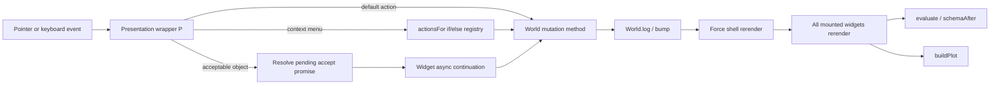
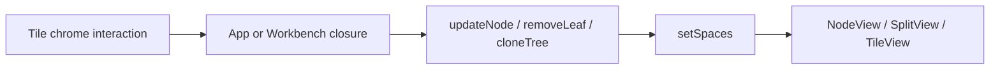
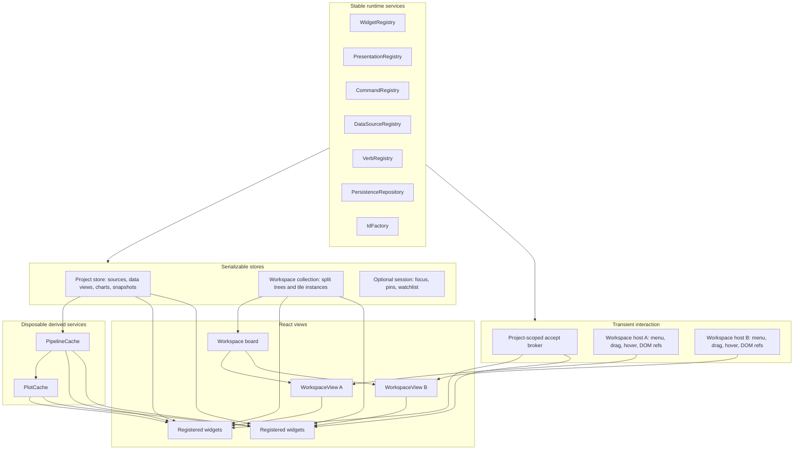

# PBUI React Architecture Review and Reusable Package Plan

## Scope

This review covers the two supplied TypeScript/React sources:

- `pbui-gog.tsx` — a full-screen Grammar of Graphics workbench with one `World`, multiple switchable workspaces, CLIM-like presentations, a split-tree window manager, chart/data widgets, and embedded tutorial applications.
- `pbui-landing.tsx` — a tutorial/landing page that contains the same workbench concepts, plus an embeddable `Workbench`, a `SpecApp`, lesson rails, module documentation, a capstone, and several independently sandboxed `World` instances on one page.

There is no package manifest, test suite, build configuration, or surrounding repository in the supplied material. This document therefore treats the two TSX files as the complete codebase available for review.

The review has five goals:

1. Explain the current code to a developer who has not seen it before.
2. Identify the architectural abstractions already present in the prototype.
3. Define reusable package boundaries for the window manager, presentation/command system, data engine, graphics engine, and widgets.
4. Propose React providers and hooks that preserve isolation without causing broad rerenders.
5. Make workspace layouts, multi-workspace pages, chart/data setups, and complete projects saveable, exportable, importable, and migratable.

---

## Executive assessment

The prototype contains several strong ideas. They are already sufficiently coherent to become reusable packages:

- A **binary split-tree window manager** whose leaves are application tiles.
- A **presentation-based interaction model** in which displayed objects retain a type and value, expose type-specific commands, and can satisfy a command waiting for an argument.
- A **live document/view model** in which several tiles can show the same chart document and remain synchronized.
- A small but real **data transformation engine** and **Grammar of Graphics compiler**.
- A **widget registry** in embryo: `APPS` maps application IDs to titles, colors, and components.
- A pedagogically useful distinction between **live documents** and **frozen snapshots**.
- An embeddable version that demonstrates that several workbenches can coexist on one page.

The main problem is not that the prototype lacks abstractions. It is that those abstractions are implemented inside two monolithic files and tied together through one mutable `World`, one very broad `UICtx`, module-global registries, and a 279–291 line shell component. The two files total 4,705 lines and contain more than 1,100 lines of substantial duplicated blocks. They have already begun to drift: the landing page has a subscriber set, keyboard presentation handling, and a spec widget that the full-screen shell does not; the full-screen shell has its own help/tutorial applications and a different notification mechanism.

The core recommendation is to reorganize around **serializable state stores plus registries**:

- **Project store:** datasets, named data setups, chart documents, snapshots, and project-level objects.
- **Workspace collection store:** workspace definitions and their split trees.
- **Workspace host state:** focus, menu, hover documentation, drag geometry, DOM references, and other transient state for one rendered viewport.
- **Presentation/command runtime:** presentation type registry, command registry, typed argument acceptance, and command execution context.
- **Derived engines:** cached pipeline results and plot geometry, neither of which is persisted.

React contexts should provide stable store and service objects. Components should subscribe through selector hooks based on `useSyncExternalStore`, rather than forcing the entire workbench subtree to render after every mutation.

A practical package layout is:

```text
@pbui/runtime-core          IDs, JSON values, stores, events, registries
@pbui/presentations         presentation types, commands, accept broker
@pbui/workspaces            generic split tree, workspace models, templates
@pbui/workspaces-react      WorkspaceView, TileFrame, drag/resize hooks
@pbui/data                  source registry, data setups, pipeline engine
@pbui/graphics              chart specs and plot compiler
@pbui/react                 project/runtime providers and selector hooks
@pbui/widgets               current built-in React applications and UI primitives
@pbui/persistence           bundle schemas, migrations, storage adapters
apps/workbench              replacement for pbui-gog.tsx
apps/landing                replacement for pbui-landing.tsx
```

For an initial release, these can be fewer npm packages with subpath exports. The important boundary is that the layout, presentation, data, and persistence cores remain React-free.

---

# Part I — Current codebase guide

## 1. The mental model

The application is built around six concepts.

### 1.1 Dataset

A dataset is an in-memory table with an ID, name, note, field schema, and row objects. Field types are encoded as:

- `q` — quantitative
- `n` — nominal
- `t` — temporal

Three deterministic fixture datasets are generated at module load: seabirds, climate, and engines. See `pbui-gog.tsx:92–205` and `pbui-landing.tsx:35–144`.

### 1.2 Chart document

A chart document is a live object with this effective shape:

```ts
interface CurrentChartDocument {
  id: string;
  name: string;
  chart: {
    datasetId: string;
    steps: CurrentPipelineStep[];
    geom: "point" | "line" | "bar" | "area";
    mapping: {
      x: string | null;
      y: string | null;
      color: string | null;
      size: string | null;
      facet: string | null;
    };
    yScale: "linear" | "log";
  };
}
```

The important design choice is that chart, table, pipeline, encoding, and spec tiles are **views of a document**. A tile does not own the chart state. Its layout leaf stores a document ID, and the widget looks the document up in `World`. Several tiles can therefore point at one document and update together. The full-screen source states this explicitly at `pbui-gog.tsx:19–24`; the binding is implemented in `TileView` and `DocBar` at `pbui-gog.tsx:757–797` and `859–873`.

### 1.3 Snapshot

A snapshot is a frozen deep copy of a chart specification. `World.snapshot` copies a chart with `JSON.parse(JSON.stringify(...))`, records a display time, and appends it to `snaps`. A snapshot can be restored into a live document or used to create a new one. See `pbui-gog.tsx:425–442` and `pbui-landing.tsx:383–400`.

This live-document/frozen-snapshot distinction is useful and should be preserved in the package design.

### 1.4 Tile and workspace

A workspace is a name plus a binary split tree. A tree node is either:

```ts
type CurrentLayoutNode =
  | {
      id: string;
      type: "leaf";
      app: string;
      doc: string | null;
    }
  | {
      id: string;
      type: "split";
      dir: "row" | "col";
      ratio: number;
      a: CurrentLayoutNode;
      b: CurrentLayoutNode;
    };
```

`row` means side-by-side children and `col` means vertically stacked children. Pure recursive helpers update, remove, find, count, and clone nodes. See `pbui-gog.tsx:680–712` or `pbui-landing.tsx:768–800`.

A workspace changes only the arrangement of views. The `World` is shared among all workspaces inside one workbench. That is why switching workspaces does not load or save domain state.

### 1.5 Presentation

A presentation is a rendered object carrying:

- a presentation type such as `field`, `dataset`, `doc`, `chart`, `step`, `datum`, `cat`, `geom`, `tile`, or `workspace`;
- a value;
- optional default activation behavior;
- hover documentation;
- a context menu derived from the presentation type.

`P` is the wrapper implementing this behavior. `Pres` is the generic fallback renderer. See `pbui-gog.tsx:45–90`; the landing version adds keyboard behavior at `pbui-landing.tsx:605–660`.

### 1.6 Accept

A command can pause until the user points at a presentation of a requested type. For example, “map x” requests a `field`, while compare requests a `chart`. `accept` creates a promise and stores its resolver in component state. Every `P` checks whether its type matches the pending request; matching objects receive an acceptable visual state and resolve the promise when clicked. See `pbui-gog.tsx:1780–1781` and `P` at `53–75`.

This is the prototype’s closest analogue to CLIM’s presentation type and accepting-values/input-context model.

---

## 2. Current source organization

### 2.1 `pbui-gog.tsx`

The full-screen source is organized in this order:

| Section | Approximate lines | Responsibility |
|---|---:|---|
| Palette and helpers | 27–43 | Theme constants, formatting, type colors |
| Presentation core | 45–90 | `UICtx`, `P`, `Pres`, type matching |
| Fixture datasets | 92–205 | Deterministic generators and `DATASETS` |
| Pipeline engine | 207–309 | Step model, schema inference, evaluation |
| `World` | 311–459 | Documents, chart mutations, snapshots, watchlist, trace |
| Plot engine | 481–674 | Scales, facets, marks, plot geometry |
| Window manager | 676–799 | Split tree, dividers, tile frames, drag/drop surfaces |
| UI primitives | 801–873 | Buttons, selects, chips, document strip |
| Chart renderers | 876–985 | Interactive SVG and inert thumbnails |
| Applications | 987–1436 | Data, table, pipeline, encoding, chart, gallery, compare, inspector, watchlist, trace, documents |
| Help/tutorial apps | 1438–1643 | Workbench-internal documentation and tutorials |
| Application registry | 1658–1676 | `APPS` |
| Workspace templates | 1681–1706 | Initial workspace trees |
| Shell | 1708–1986 | All React state, commands, accept, menus, workspaces, rendering |

The largest individual functions are the root `App` at 279 lines, `buildPlot` at 171 lines, and `World` at 125 lines.

### 2.2 `pbui-landing.tsx`

The landing source begins similarly, then diverges:

| Section | Approximate lines | Responsibility |
|---|---:|---|
| Palette, datasets, pipeline | 17–270 | Duplicate core plus `asGgplot` |
| `World` | 272–403 | Embeddable world with multiple subscribers |
| Plot and presentation core | 425–763 | Duplicate compiler and improved `P` |
| Window manager and widgets | 765–1464 | Duplicate shell/widget implementation plus `SpecApp` |
| Embeddable `Workbench` | 1466–1761 | The shell extracted into a component |
| Lesson and module UI | 1763–2044 | State-observing teaching components |
| Page furniture | 2046–2129 | Sections, responsive wrapper, cheat cards |
| Tutorial fixtures | 2131–2476 | World/workspace builders and lesson predicates |
| Hero and page app | 2481–2719 | Multiple independent workbench instances on one page |

`Workbench` is 291 lines and still owns almost every shell concern. The page demonstrates six independent worlds, but the reusable behavior is copied rather than imported from a package.

---

## 3. Current state ownership

Understanding where state lives is essential before changing the code.

| State | Current owner | Persistent in principle? | Notes |
|---|---|---:|---|
| Fixture dataset definitions and rows | Module-global `DATASETS` | Yes or externally resolvable | Cannot be injected per workbench |
| Documents and chart specs | `World` | Yes | Mutable arrays and nested objects |
| Active document | `World.activeId` | Usually session state | Implicit target for many commands |
| Snapshots and compare pins | `World` | Yes | Pins reference snapshot IDs |
| Watchlist | `World` | Optional | Contains raw presentation values |
| Last inspected value | `World` | Usually session state | Derived description is stored directly |
| Trace | `World` | Optional audit | Event sequence uses a module-global counter |
| Workspace definitions and layout trees | `App`/`Workbench` React state | Yes | Not part of `World` |
| Current workspace | `App`/`Workbench` React state | Session state | One workspace rendered at a time |
| Menu, accept request, hover documentation, drag | `App`/`Workbench` React state | No | Contains functions and DOM-dependent values |
| Tile DOM elements | `leafRefs.current` | No | Required only while a host is mounted |
| Widget-local mode | Component local state | Sometimes | Example: `SpecApp` object/source toggle |
| Evaluated rows and schemas | Recomputed in render | No, derived | Evaluated repeatedly by several widgets |
| Plot geometry | Recomputed in render | No, derived | Depends on chart spec and fixed dimensions |

The persistence design should formalize this matrix. Persisting `World` or the entire React state object directly would include the wrong things and omit some of the right things.

---

## 4. Current data flow

The main interaction loop is:



Workspace changes follow a parallel path:



The important observation is that domain mutation, command dispatch, transient interaction, layout management, and rendering all converge in the shell component. That is the primary extraction target.

---

## 5. The widgets

The current `APPS` registry is a valuable inventory of reusable modules.

### 5.1 Document-bound widgets

These display one live document and have a DOC strip:

- **Chart** — compiles the document’s data and chart spec into interactive SVG marks. Marks are `datum` presentations and legend levels are `cat` presentations.
- **Table** — evaluates the document pipeline and displays the output relation. Headers are `field` presentations; row numbers are `datum` presentations.
- **Pipeline** — edits the ordered transformation steps and displays source/output schemas.
- **Encoding** — edits mapping slots, geometry, and y scale. Mapping buttons enter accept mode for a `field`.
- **Spec** — landing-only widget showing the complete chart as live objects or generated ggplot-like source.

The full-screen code classifies document-bound widgets using the parallel `DOC_APPS` array at `pbui-gog.tsx:681–684`. The landing source adds `spec` at `pbui-landing.tsx:770`.

### 5.2 Project/world widgets

These observe the entire `World`:

- **Data browser** — lists all module-global datasets and fields.
- **Charts** — manages live documents.
- **Snapshots/gallery** — displays frozen chart specs.
- **Compare A/B** — accepts two snapshots.
- **Watchlist** — accepts presentations of many types and re-presents them.
- **Inspector** — displays the last inspected description as JSON.
- **Trace** — displays logged operations.
- **Launcher** — changes the current tile’s application.

`pbui-gog.tsx` also places About and four tutorial applications in the app registry. `pbui-landing.tsx` moves pedagogy outside the workbench and uses lesson rails instead.

### 5.3 Why this distinction matters

The current doc-bound/singleton distinction is encoded by convention and a separate list. In a package, it should be widget metadata:

```ts
interface WidgetDefinition {
  id: string;
  title: string;
  version: number;
  binding:
    | { kind: "none"; scope: "project" | "workspace" | "tile" }
    | { kind: "resource"; resourceType: "chart-document"; required: true };
  component: React.ComponentType<WidgetProps>;
  stateSchema?: RuntimeSchema;
  initialState?: JsonValue;
  migrateState?: WidgetStateMigrator;
}
```

This removes `DOC_APPS`, makes third-party widgets possible, and gives persistence enough information to validate and restore tile instances.

---

# Part II — What should be preserved

## 6. Strong architectural choices

### 6.1 Views are cheap; documents own state

The best decision in the prototype is that tile state and document state are separate. Closing a table tile does not delete the document. Reopening another view restores the same pipeline and chart because the document survived. This is the correct foundation for a reusable workbench.

### 6.2 The layout is a small pure data structure

The split tree is simple, serializable in principle, and manipulated by pure recursive functions. It is not tied to charting. It can become a generic `DockTree<TLeaf>` package with little conceptual change.

### 6.3 Presentation semantics are attached to objects, not pixels

`P` establishes a consistent model: hover documentation, default activation, full menu, and acceptance all derive from the object being presented. That is far more reusable than wiring ad hoc click handlers into every chip.

### 6.4 Commands can acquire arguments from another view

The accept mechanism demonstrates cross-tile composition. “Map x” does not require a dropdown containing every field. It can request a field and let the user choose one wherever it is already visible. This idea should become a command engine feature rather than remain a widget-local promise pattern.

### 6.5 The pipeline and plot compiler are mostly pure

`evaluate`, `schemaAfter`, and `buildPlot` are not React functions. Their current dependency on module globals should be removed, but their basic separation from rendering is sound.

### 6.6 The landing page proves instance isolation is useful

`pbui-landing.tsx` constructs a separate `World` in each section and passes it into an embeddable `Workbench` at `2087–2108`. This is a concrete demonstration that a workbench should not be a global singleton.

### 6.7 Lessons observe state rather than button clicks

Lesson completion predicates inspect world/layout state rather than checking that one prescribed button was used. Although the current `probeRef` mechanism should be replaced, the conceptual approach is excellent for tutorials, tests, automation, and user-defined goals.

---

# Part III — Architectural findings

## 7. Monolithic duplication and drift

The two sources duplicate nearly every foundational subsystem:

- dataset fixtures;
- pipeline evaluation;
- `World`;
- plot compiler;
- presentation wrapper;
- split tree and tile frame;
- primitives and chips;
- all principal widgets;
- context menu construction;
- workspace CRUD;
- drag/drop and accept plumbing.

The files have already diverged in ways that make fixes nonuniform:

- `pbui-gog.tsx` gives `World` one `notify` callback (`335–355`), while the landing source has a subscriber set (`297–316`).
- The landing `P` is keyboard reachable and handles the Menu key (`612–648`); the full-screen `P` does not (`53–75`).
- The landing source has `SpecApp`; the full-screen source has in-workbench help/tutorial apps.
- `setLeafDoc` logs a `tile_repointed` event in the landing source but only calls `world.bump()` in the full-screen source.

Any package extraction should first eliminate these duplicate implementations. The landing `Workbench` is the better shell starting point, while the full-screen file contains useful help content that should become an application built on the package.

---

## 8. TypeScript is not being used as a model boundary

Both files have a `.tsx` extension but declare no TypeScript `type`, `interface`, or `enum`. Props, world fields, action payloads, presentation values, layout nodes, and pipeline steps are all structurally implicit.

This matters because the proposed persistence and plugin APIs require precise discriminated unions and stable JSON contracts. Without explicit types, these errors remain easy to introduce:

- a tile binding references the wrong resource kind;
- a command accepts an unqualified string field name from another dataset;
- a step has the wrong configuration for its `kind`;
- an imported widget state is incompatible with the installed widget version;
- a supposedly serializable state contains a function, `Map`, DOM node, or promise resolver.

The first extraction task should be a model package containing explicit types before behavior is moved.

---

## 9. `World` is a mutable object store coupled to forced rendering

`World` mutates arrays and nested objects in place and calls `bump`. The shell subscribes by incrementing an otherwise unused React state value. Every world change therefore rerenders the shell and every mounted widget, regardless of what changed.

This has several consequences:

1. React cannot subscribe to a stable snapshot or a selected slice.
2. Concurrent rendering can observe mutable objects changing outside React’s state model.
3. Evaluation work is repeated broadly. Table, pipeline, chart, inspector, and lesson logic can all recompute the same pipeline.
4. There is no explicit transaction boundary. Typing into a step editor mutates on every input event.
5. The persistence layer has no canonical immutable snapshot to serialize.
6. Unit tests must instantiate a behavior-heavy class rather than reduce actions over plain state.

The landing subscriber set is an improvement over a single callback, but it is still a custom external store without `getSnapshot` semantics.

### Recommendation

Replace `World` with a store interface whose state is plain serializable data:

```ts
interface Store<S, A> {
  getState(): S;
  getRevision(): number;
  subscribe(listener: () => void): () => void;
  dispatch(action: A): void;
  transaction<T>(fn: () => T): T;
}
```

React adapters should use `useSyncExternalStore`, preferably with selectors. The implementation can use hand-written reducers, Immer, Redux, Zustand, or another library, but the package contract should not require one particular state library.

---

## 10. Canonical, transient, and derived state are mixed

`World` contains canonical document data, user-session choices, audit events, and inspector output. `Workbench` contains persistent workspace trees beside promise resolvers and DOM elements. This is the main obstacle to save/export.

Use four explicit state categories:

### 10.1 Persistent canonical state

- data source descriptors;
- named data setups/pipelines;
- chart documents;
- frozen snapshots;
- workspaces and layout trees;
- widget instance state and resource bindings;
- optional saved boards arranging several workspaces.

### 10.2 Optional session state

- focused/active workspace, tile, and document;
- watchlist;
- compare pins;
- last inspector selection;
- panel preferences.

This may be saved for “resume exactly where I was,” but should be separable from portable templates.

### 10.3 Transient interaction state

- open menu and its screen coordinates;
- pending accept request and promise resolver;
- current pointer drag;
- hover documentation;
- DOM element registry;
- pointer capture and resize mode.

This must never be exported.

### 10.4 Derived state

- evaluated rows;
- schemas after each step;
- statistics;
- plot marks and ticks;
- labels and command menus.

This should be recomputed or cached, not persisted as authoritative state.

---

## 11. Module-global counters weaken isolation and persistence

`stepc`, document/snapshot/note/sequence counters, and node IDs are module globals. The landing source has per-world display-name counters but still uses global IDs and trace sequences. This produces several issues:

- A second independent world does not truly have an independent ID namespace.
- Trace sequence numbers can continue from actions in another workbench.
- Tests depend on construction order.
- Server rendering and hydration can allocate different IDs.
- Imported IDs can collide with future counter-generated IDs.
- Cloning and merging exported workspaces require ad hoc counter repair.

Use an injectable `IdFactory`:

```ts
interface IdFactory {
  next<TKind extends string>(kind: TKind): `${TKind}_${string}`;
}
```

Production can use `crypto.randomUUID`; tests and authored templates can use a deterministic factory. Import should remap IDs through a dedicated reference graph rather than advance global counters.

Also inject a clock. Snapshot display times should not be generated inside the domain store with `new Date().toLocaleTimeString()`.

---

## 12. The active-document fallback is convenient but ambiguous

`World.doc(id)` silently falls back to the active document and then the first document. Many commands pass `null` intentionally to target the active document. This makes demos concise, but it creates hidden coupling:

- A field clicked in a table showing document β can act on active document α.
- Two visible workspaces on one page make “active” harder to infer.
- A tile whose bound document was deleted retains a stale ID; lookup silently displays another document without repairing the binding.
- Export can preserve dangling IDs that only appeared to work because of fallback behavior.

### Recommendation

Commands should receive an explicit `CommandContext` and resource references:

```ts
interface CommandContext {
  projectId: ProjectId;
  hostId?: WorkspaceHostId;
  workspaceId?: WorkspaceId;
  tileId?: TileId;
  focusedDocumentId?: ChartDocumentId;
  presentationOrigin?: PresentationOrigin;
}
```

A command may deliberately choose the focused document, the presentation’s originating document, or a supplied argument, but that choice should be visible in its definition. Resource lookup should return `undefined` for a missing explicit ID. A separate binding-repair policy can choose a fallback and update state atomically.

---

## 13. Presentation types are strings rather than an extensible type system

`typeMatches` supports only exact equality, an array of exact strings, or `any`. This is enough for the demo but omits several useful CLIM-like capabilities:

- subtype relationships, such as `quantitative-field` being a `field`;
- parameterized types, such as “field belonging to this data setup”;
- predicates, such as “nominal or temporal field only”;
- coercion or adapters;
- presentation-specific persistence and resolution;
- plugin registration;
- a default command and documentation supplied by the type itself.

The current group-by prompt asks for a nominal or temporal field, but accept mode highlights every `field`. The command performs validation only indirectly, if at all.

### Recommendation

Create a presentation type registry with ancestry and constraints:

```ts
interface PresentationTypeDefinition<TRef extends JsonValue> {
  id: PresentationTypeId;
  parents?: PresentationTypeId[];
  refSchema: RuntimeSchema<TRef>;
  label(ref: TRef, ctx: PresentationContext): string;
  describe(ref: TRef, ctx: PresentationContext): JsonValue;
  resolve?(ref: TRef, ctx: PresentationContext): unknown;
  persistable?: boolean;
  defaultCommandId?: CommandId;
}
```

A pending argument request should contain accepted types plus an optional predicate:

```ts
interface AcceptSpec {
  types: PresentationTypeId[];
  where?: (presentation: PresentationHandle, ctx: CommandContext) => boolean;
  scope: "host" | "workspace" | "project";
}
```

---

## 14. Presentation values should be references, not arbitrary live objects

`P` currently carries raw values. Some are IDs, but `datum` and `cat` values are objects containing rows, field names, and document IDs. The watchlist stores those raw values.

That causes several problems:

- Field identity is only a string name; the same name in two sources is ambiguous.
- A watched row is a copied row object, not necessarily a live reference.
- Rows can become large and make workspace/project exports unexpectedly huge.
- Imported values may no longer resolve after data changes.
- Plugin types can accidentally place non-JSON values in persistent state.

Use serializable, scoped references:

```ts
type BuiltInPresentationRef =
  | { type: "dataset"; projectId: ProjectId; dataSourceId: DataSourceId }
  | { type: "field"; dataViewId: DataViewId; fieldId: FieldId }
  | { type: "chart-document"; documentId: ChartDocumentId }
  | { type: "chart-snapshot"; snapshotId: SnapshotId }
  | { type: "pipeline-step"; dataViewId: DataViewId; stepId: StepId }
  | { type: "category"; dataViewId: DataViewId; fieldId: FieldId; value: JsonScalar }
  | { type: "datum"; dataViewId: DataViewId; rowId: RowId }
  | { type: "tile"; workspaceId: WorkspaceId; tileId: TileId }
  | { type: "workspace"; workspaceId: WorkspaceId };
```

A `datum` can be persistable only if the data layer provides stable row identity. Aggregated or ephemeral rows may need a lineage ID, a frozen-row snapshot, or `persistable: false`.

---

## 15. `actionsFor` is a hard-coded command registry

The shell’s `actionsFor` function is a large `if` chain covering every presentation type and every domain command. It also closes over `world`, current workspace state, tree operations, accept, and UI setters. See `pbui-gog.tsx:1815–1897` and its landing equivalent.

This prevents:

- adding presentation types or commands from another package;
- testing command applicability independently of React;
- reusing commands in menus, palettes, keyboard shortcuts, or automation;
- declaring typed command arguments;
- automatically entering accept mode for missing arguments;
- serializing/auditing commands consistently.

### Recommendation

Use a command registry:

```ts
interface CommandDefinition<TArgs extends Record<string, unknown>> {
  id: CommandId;
  title(args: Partial<TArgs>, ctx: CommandContext): string;
  presentationTypes?: PresentationTypeId[];
  arguments: CommandArgumentDefinition[];
  isApplicable(args: Partial<TArgs>, ctx: CommandContext): boolean;
  execute(args: TArgs, ctx: CommandContext): void | Promise<void>;
}
```

The same command can be invoked in two ways:

1. From a presentation menu, where the clicked object fills one argument.
2. From a widget button, where the command engine notices a missing argument and starts accept mode.

For example, “map field to x” should be one command, not separate menu and button implementations.

---

## 16. The accept implementation is a useful prototype, not a durable broker

The current implementation stores one promise resolver in React state. Important edge cases follow:

- Starting another accept before resolving the first overwrites the resolver and leaves the first promise pending forever.
- Unmounting a workbench can leave a pending promise unresolved.
- Only one argument is modeled.
- Validation is type-string-only.
- Every workbench installs its own global Escape listener.
- Scope is implicit.
- The resolver is nonserializable and mixed into shell state.

### Recommendation

Create an `AcceptBroker` owned by a project interaction scope:

```ts
interface AcceptBroker {
  getPending(): PendingAccept | null;
  subscribe(listener: () => void): () => void;
  request(spec: AcceptSpec, options?: { signal?: AbortSignal }): Promise<PresentationHandle | null>;
  submit(handle: PresentationHandle, origin: PresentationOrigin): boolean;
  cancel(reason?: string): void;
}
```

Rules should be explicit:

- A new request cancels the old one or is queued; never silently overwrite it.
- Unmount and `AbortSignal` cancel pending requests.
- A command can request several arguments in sequence.
- Scope can be host, workspace, or project.
- All visible workspaces sharing a project broker can light up acceptable presentations simultaneously.
- Independent projects, like the landing page’s separate worlds, use separate brokers.

---

## 17. The window manager core is reusable, but interaction is embedded

The pure split-tree helpers are already close to package quality. The interaction layer is not:

- `WMDivider` installs mouse listeners on `window` and changes `document.body.style.userSelect`.
- Dragging also uses global mouse listeners and body state.
- The code does not use Pointer Events or pointer capture.
- Touch behavior described in the landing copy is not implemented by the window manager or presentation wrapper.
- Keyboard resizing and docking are absent.
- Hit testing and DOM references live in the shell.
- Min sizes are not part of the model.
- `dir: "row" | "col"` is less clear than an explicit axis.
- The layout has no schema version, tile state, or validation.

### Recommendation

Split the implementation into:

1. `workspace-core` — generic tree types, reducer, invariants, templates, import/export.
2. `workspaces-react` — recursive rendering, tile chrome, pointer resize, docking, focus, and accessibility.

Use Pointer Events and `setPointerCapture` so interactions are scoped to the active host. Use a `ResizeObserver` or container dimensions for ratio calculations. Commit resize history/autosave at pointer-up rather than on every move.

---

## 18. `APPS` is a useful registry but is still static and parallel

`APPS` already maps IDs to display metadata and components. It should become a runtime registry. The current design also relies on:

- `DOC_APPS`, a separate list that can drift;
- direct module-level component references;
- colors rather than semantic theme tokens;
- no version or state schema;
- no missing-widget behavior after import;
- no error boundary around a tile component.

A package registry should support registration, lookup, capability metadata, state migration, and an `UnknownWidget` placeholder. Imported data must never contain executable component code—only widget IDs and JSON state resolved against the local registry.

---

## 19. Data source, pipeline, and chart state are too tightly bundled

A current chart document owns both:

- the data setup: `datasetId` plus transformation steps;
- the visual setup: mappings, geometry, and scale.

This is adequate for the demo, but the requested ability to save and manage **data setups** suggests a first-class data document or data view:

```ts
interface DataView {
  id: DataViewId;
  name: string;
  sourceId: DataSourceId;
  pipeline: PipelineSpec;
}

interface ChartDocument {
  id: ChartDocumentId;
  name: string;
  dataViewId: DataViewId;
  visual: ChartVisualSpec;
}
```

Benefits:

- A pipeline/table can be reused by several charts.
- A data setup can be exported without chart styling.
- A chart can switch data views without copying steps.
- Data and visual snapshots can be versioned independently.
- Pipeline widgets bind to `DataView`; chart/encoding widgets bind to `ChartDocument`.

This is a larger semantic change. A lower-risk first release can retain the aggregate chart document and expose `exportDataSetup(documentId)`. The long-term model should make data views first-class because it matches the stated product requirement.

---

## 20. The pipeline engine has duplicated semantics

`schemaAfter` predicts schema changes, while `evaluate` separately implements row transformations. Every new verb must be implemented twice, and the two implementations can diverge. Validation is also partial:

- a missing filter field produces one string error and evaluation continues;
- invalid derive/summarize references are not represented as structured diagnostics;
- an unknown dataset ID would throw;
- field identity is a name, not a stable field reference;
- temporal values are effectively sorted/rendered as strings;
- the engine is synchronous and tied to in-memory rows;
- evaluations are repeated in multiple components during one render cycle.

### Recommendation

Define each verb once:

```ts
interface PipelineVerbDefinition<K extends string, C extends JsonValue> {
  kind: K;
  configSchema: RuntimeSchema<C>;
  inferSchema(input: Schema, config: C): Result<Schema, Diagnostic[]>;
  evaluate(input: Table, config: C, ctx: EvaluationContext): Result<Table, Diagnostic[]>;
  label(config: C, ctx: LabelContext): string;
}
```

The engine should return stage information:

```ts
interface PipelineResult {
  rows: readonly Row[];
  schema: Schema;
  diagnostics: readonly Diagnostic[];
  stages: readonly {
    stepId: StepId;
    schema: Schema;
    rowCount: number;
    diagnostics: readonly Diagnostic[];
  }[];
}
```

Cache results by source revision and pipeline content hash. Large or remote datasets can be evaluated through worker/server adapters while widgets continue to use the same hook.

---

## 21. The plot compiler is promising but coupled to demo globals

`buildPlot` is a pure-looking compiler, but it directly calls the global pipeline evaluator and uses global palette constants. It also contains product decisions that should become diagnostics or options:

- facets are truncated to six values;
- nominal colors are truncated to eight categories;
- log scale silently becomes linear if the minimum is nonpositive;
- temporal fields are treated as nominal strings;
- fixed widget dimensions are passed by callers;
- invalid numeric columns can produce infinities with external data;
- mini and full rendering behavior are mixed into one compiler flag.

Extract two layers:

1. `graphics-core` compiles a chart spec plus evaluated table into theme-neutral geometry and diagnostics.
2. `widgets` or `graphics-react` renders SVG using a theme and presentation wrappers.

The existing `buildPlot` is a good seed for the compiler, but it should receive all dependencies as arguments.

---

## 22. UI styling and responsiveness are not package-ready

All visual styles are inline and tied to the module-global `C` palette. Each workbench injects similar global CSS. Charts use fixed logical sizes such as 520×280 or 560×300. `useNarrow` watches the browser viewport rather than the containing element.

For reusable widgets:

- expose semantic design tokens through CSS variables or a theme object;
- use classes or a styling layer instead of repeated inline objects;
- use container queries or `ResizeObserver`, not global viewport width;
- render charts from the tile’s measured content box;
- keep the distinctive visual design as a default theme, not a hard dependency;
- provide focus, contrast, reduced-motion, and keyboard states centrally.

---

## 23. Multiple embedded workbenches reveal global-interaction risks

The landing page proves that several providers can exist, but each `Workbench` can install global key and mouse listeners and modify the body’s `userSelect`. If two workbenches enter accept mode, Escape can cancel both. Concurrent drags can overwrite body state. Fixed-position menus and drag ghosts are viewport-global.

A reusable host must have an explicit `hostId` and scope all interaction state to that host. Project-wide accept may intentionally span several hosts, but resize, menu, drag, hover, and focus should be host-local.

---

## 24. The tutorial `probeRef` is hidden coupling

The landing `Workbench` writes an API and derived layout state into `probeRef.current` during render (`pbui-landing.tsx:1665–1673`). Lesson components separately subscribe to the mutable world. This works for the demo, but it bypasses React’s dataflow and exposes an unstable imperative API.

After extraction, tutorial code should use the same public selectors and command API as other consumers:

```ts
const layout = useWorkspaceSelector(workspaceId, selectLayoutSummary);
const project = useProjectSelector(selectTutorialFacts);
const commands = useCommandRunner();
```

This makes the tutorial an excellent integration client rather than a privileged observer.

---

# Part IV — Target architecture

## 25. Design principles

The package design should follow these rules.

1. **Core models are React-free.** Layout, commands, presentation types, data specs, evaluation, and persistence should run in tests, workers, Node, or another UI framework.
2. **Persistent state is plain, versioned JSON.** Runtime objects convert to/from DTOs explicitly.
3. **Contexts carry stable services and stores.** Mutable snapshots do not flow through one giant context value.
4. **Hooks subscribe by selector.** A chart document change should not rerender unrelated workspace chrome.
5. **All extension points are registries.** Widgets, presentation types, commands, data sources, pipeline verbs, and migrations can be registered.
6. **Resource identity is explicit and scoped.** No unqualified field names or silent document fallback.
7. **Transient interactions are host-local unless deliberately project-scoped.**
8. **Derived results are cached but disposable.** They are not authoritative export data.
9. **Imported bundles contain no code.** Widget and source IDs are resolved against installed registries.
10. **Exact restore and portable templates are different formats.** Raw project IDs are appropriate for restore, not for reusable layout templates.

---

## 26. Recommended package graph

```mermaid
flowchart TD
  Runtime[@pbui/runtime-core]
  Present[@pbui/presentations]
  WorkCore[@pbui/workspaces]
  Data[@pbui/data]
  Graphics[@pbui/graphics]
  Persist[@pbui/persistence]
  ReactPkg[@pbui/react]
  WorkReact[@pbui/workspaces-react]
  Widgets[@pbui/widgets]
  Workbench[apps/workbench]
  Landing[apps/landing]

  Present --> Runtime
  WorkCore --> Runtime
  Data --> Runtime
  Graphics --> Data
  Graphics --> Runtime
  Persist --> Runtime
  Persist --> WorkCore
  Persist --> Data
  ReactPkg --> Runtime
  ReactPkg --> Present
  ReactPkg --> Data
  WorkReact --> WorkCore
  WorkReact --> ReactPkg
  Widgets --> ReactPkg
  Widgets --> WorkReact
  Widgets --> Graphics
  Widgets --> Data
  Workbench --> Widgets
  Workbench --> Persist
  Landing --> Widgets
```

### 26.1 Initial packaging alternative

To avoid premature package proliferation, publish four packages initially:

- `@pbui/core` with subpath exports for `runtime`, `presentations`, `workspaces`, and persistence schemas;
- `@pbui/data` with pipeline and graphics subpaths;
- `@pbui/react` with providers and the window manager renderer;
- `@pbui/widgets` with the built-ins.

The internal folder boundaries should still match the final graph so packages can split later without redesigning APIs.

---

## 27. Proposed state model

### 27.1 Project state

```ts
type ProjectStateV1 = {
  schemaVersion: 1;
  id: ProjectId;
  name: string;

  dataSources: Record<DataSourceId, DataSourceSpec>;
  dataSourceOrder: DataSourceId[];

  dataViews: Record<DataViewId, DataView>;
  dataViewOrder: DataViewId[];

  chartDocuments: Record<ChartDocumentId, ChartDocument>;
  chartDocumentOrder: ChartDocumentId[];

  snapshots: Record<SnapshotId, ChartSnapshot>;
  snapshotOrder: SnapshotId[];
};
```

The normalized shape simplifies updates, ID remapping, and referential-integrity checks.

### 27.2 Workspace collection state

```ts
type WorkspaceCollectionStateV1 = {
  schemaVersion: 1;
  workspaces: Record<WorkspaceId, WorkspaceState>;
  order: WorkspaceId[];
};

type WorkspaceState = {
  id: WorkspaceId;
  name: string;
  root: DockNode<TilePayload>;
  revision: number;
};

type TilePayload = {
  tileId: TileId;
  widget: {
    id: WidgetId;
    version: number;
    state: JsonValue;
  };
  binding?: ResourceBinding;
};
```

### 27.3 Session state

```ts
type SessionState = {
  focusedHostId?: WorkspaceHostId;
  focusedWorkspaceId?: WorkspaceId;
  focusedTileId?: TileId;
  focusedDocumentId?: ChartDocumentId;
  comparePins: [SnapshotId | null, SnapshotId | null];
  watchlist: PresentationHandle[];
  inspector?: PresentationHandle;
};
```

Persist this only in a resume/session bundle, not a portable workspace template.

### 27.4 Host interaction state

```ts
type WorkspaceHostState = {
  hostId: WorkspaceHostId;
  workspaceId: WorkspaceId;
  menu: ContextMenuState | null;
  drag: TileDragState | null;
  resize: SplitResizeState | null;
  mouseDocumentation: string | null;
};
```

DOM refs remain in an imperative registry keyed by `{hostId, nodeId}` and are never part of store snapshots.

---

## 28. Generic split-tree model

The current tree can be generalized without losing simplicity:

```ts
type DockNode<TLeaf> = DockLeaf<TLeaf> | DockSplit<TLeaf>;

type DockLeaf<TLeaf> = {
  kind: "leaf";
  nodeId: LayoutNodeId;
  value: TLeaf;
};

type DockSplit<TLeaf> = {
  kind: "split";
  nodeId: LayoutNodeId;
  axis: "horizontal" | "vertical";
  ratio: number;
  first: DockNode<TLeaf>;
  second: DockNode<TLeaf>;
};
```

The reducer should expose explicit operations:

```ts
type DockAction<TLeaf> =
  | { type: "split"; leafNodeId: LayoutNodeId; axis: Axis; newLeaf: TLeaf; placement: "before" | "after" }
  | { type: "close"; leafNodeId: LayoutNodeId }
  | { type: "set-ratio"; splitNodeId: LayoutNodeId; ratio: number }
  | { type: "swap-values"; a: LayoutNodeId; b: LayoutNodeId }
  | { type: "move-leaf"; source: LayoutNodeId; target: LayoutNodeId; zone: DropZone }
  | { type: "replace-leaf"; leafNodeId: LayoutNodeId; value: TLeaf };
```

Keep logging and project side effects outside this reducer. A command or middleware can translate a successful layout action into a trace event.

### 28.1 Invariants

Validate after import and in development builds:

- every node ID is unique within a tree;
- ratio is finite and within configured limits;
- at least one leaf exists;
- tile IDs are unique within a workspace;
- widget state validates against the registered widget version;
- resource bindings resolve or are marked unresolved;
- no child is reused in two branches.

---

## 29. Multiple workspaces on one page

The target should support three distinct composition modes.

### 29.1 Several independent projects

This matches the landing page today:

```tsx
<PbuiRoot projectStore={projectA} workspaceStore={workspacesA} />
<PbuiRoot projectStore={projectB} workspaceStore={workspacesB} />
```

Each root has its own presentation/accept scope and shares nothing unless configured.

### 29.2 Several workspaces over one shared project

This is the likely product requirement:

```tsx
<ProjectProvider store={projectStore}>
  <WorkspaceCollectionProvider store={workspaceStore}>
    <PresentationInteractionProvider scope="project">
      <div className="workspace-grid">
        <WorkspaceView hostId="left" workspaceId="analysis" />
        <WorkspaceView hostId="right" workspaceId="evidence" />
      </div>
    </PresentationInteractionProvider>
  </WorkspaceCollectionProvider>
</ProjectProvider>
```

Both workspaces can display the same document or different documents. A project-scoped accept request can highlight valid presentations in both visible hosts.

### 29.3 A saved board of workspace viewports

To save how several workspaces are arranged on a page, reuse the generic dock tree at an outer level:

```ts
type WorkspaceBoard = {
  id: WorkspaceBoardId;
  name: string;
  root: DockNode<{
    viewportId: WorkspaceViewportId;
    workspaceId: WorkspaceId;
    chrome: "full" | "compact" | "none";
  }>;
};
```

A board leaf renders `WorkspaceView`. The inner workspace tree renders widgets. This provides a uniform split/dock model at both levels without conflating “workspace” with “tile.”

### 29.4 Rendering the same workspace twice

This can be supported deliberately. Both hosts subscribe to one workspace tree, so layout edits synchronize. DOM refs and drag state must be keyed by `hostId`, not just node ID. A drag should default to one host; cross-host moves should require an explicit collection-level action.

---

## 30. Workspace templates versus exact workspace snapshots

Two export forms are needed.

### 30.1 Exact workspace snapshot

Used to restore a workspace inside the same project. It contains concrete resource IDs:

```ts
{
  format: "pbui.workspace";
  version: 1;
  workspace: WorkspaceState;
}
```

### 30.2 Portable workspace template

Used to reuse a window setup in another project. It cannot safely embed document IDs. It uses binding slots:

```ts
type WorkspaceTemplateV1 = {
  id: string;
  name: string;
  requiredBindings: Record<string, ResourceType>;
  root: DockNode<{
    widgetId: WidgetId;
    widgetVersion: number;
    widgetState: JsonValue;
    binding:
      | { kind: "slot"; slot: string }
      | { kind: "none" };
  }>;
};
```

Example slots might be `primaryChart`, `comparisonChart`, and `sourceData`. Instantiating the template requires a binding map and generates new workspace, node, and tile IDs.

This distinction is essential. A layout copied from project A should not accidentally bind to unrelated IDs in project B.

---

## 31. Presentation and command runtime

### 31.1 Presentation handle

```ts
type PresentationHandle<TRef extends JsonValue = JsonValue> = {
  type: PresentationTypeId;
  ref: TRef;
  origin: {
    projectId: ProjectId;
    hostId?: WorkspaceHostId;
    workspaceId?: WorkspaceId;
    tileId?: TileId;
    documentId?: string;
  };
};
```

### 31.2 React API

Prefer a hook that supplies behavior to the caller’s own element rather than always adding a `<span>` or `<g>`:

```tsx
function FieldChip({ field }: { field: FieldRef }) {
  const presentation = usePresentation({
    type: "field",
    ref: field,
  });

  return (
    <span {...presentation.domProps} className={presentation.className}>
      {field.name}
    </span>
  );
}
```

Also provide a convenience component:

```tsx
<Presented type="field" ref={field} asChild>
  <FieldChipVisual field={field} />
</Presented>
```

The hook/component should handle:

- pointer and keyboard activation;
- context menu request;
- acceptable-state styling;
- hover/focus documentation;
- ARIA labeling;
- origin metadata;
- SVG-compatible bindings;
- optional long-press support through Pointer Events.

### 31.3 Command argument acquisition

A command definition can say which argument is supplied by a clicked presentation and which arguments may be accepted interactively:

```ts
registerCommand({
  id: "chart.mapping.set",
  presentationTypes: ["field"],
  arguments: [
    { name: "documentId", type: "chart-document", from: "context" },
    { name: "slot", type: "mapping-slot", required: true },
    {
      name: "field",
      type: "field",
      from: "presentation-or-accept",
      where: ({ ref }, ctx) => fieldBelongsToDocumentOutput(ref, ctx),
    },
  ],
  title: ({ slot }, ctx) => `Map to ${slot} in ${ctx.documentLabel}`,
  execute: ({ documentId, slot, field }, ctx) => {
    ctx.project.dispatch({
      type: "chart/set-mapping",
      documentId,
      slot,
      field,
    });
  },
});
```

A widget button can run this command with `{documentId, slot}`. The engine requests the missing field. A context menu on a field can run the same command with the field already supplied.

### 31.4 Type hierarchy

A reasonable built-in hierarchy is:

```text
object
├── data-object
│   ├── dataset
│   ├── data-view
│   ├── field
│   │   ├── quantitative-field
│   │   ├── nominal-field
│   │   └── temporal-field
│   ├── datum
│   ├── category
│   └── pipeline-step
├── graphics-object
│   ├── chart-document
│   ├── chart-snapshot
│   └── geom
└── shell-object
    ├── tile
    ├── workspace
    └── workspace-board
```

The exact hierarchy can remain small. The important feature is that acceptance and command applicability do not depend on string equality alone.

---

## 32. Provider design

Avoid recreating the current all-purpose `UICtx` as several equally broad contexts. Providers should inject stable handles; hooks should subscribe to stores directly.

### 32.1 Recommended provider tree

```tsx
<PbuiRuntimeProvider runtime={runtime}>
  <ThemeProvider theme={theme}>
    <ProjectProvider store={projectStore}>
      <WorkspaceCollectionProvider store={workspaceStore}>
        <PresentationInteractionProvider broker={acceptBroker}>
          <WorkspaceBoardView boardId="main" />
        </PresentationInteractionProvider>
      </WorkspaceCollectionProvider>
    </ProjectProvider>
  </ThemeProvider>
</PbuiRuntimeProvider>
```

Each rendered workspace adds a small host scope:

```tsx
<WorkspaceHostProvider hostId={hostId} workspaceId={workspaceId}>
  <WorkspaceView workspaceId={workspaceId} />
</WorkspaceHostProvider>
```

### 32.2 Provider responsibilities

| Provider | Stable value supplied |
|---|---|
| `PbuiRuntimeProvider` | Registries, ID factory, clock, logger, persistence services |
| `ProjectProvider` | Project store and project-scoped command context |
| `WorkspaceCollectionProvider` | Workspace store |
| `PresentationInteractionProvider` | Accept broker and command-menu service |
| `WorkspaceHostProvider` | Host/workspace identity and host-local interaction store |
| `ThemeProvider` | Semantic tokens or CSS-variable scope |

`PersistenceProvider` can be separate when storage changes at runtime; otherwise the persistence repository can live in the runtime.

### 32.3 Selector hooks

```ts
useProjectSelector(selector, equality?)
useDataSource(dataSourceId)
useDataView(dataViewId)
usePipelineResult(dataViewId)
useChartDocument(documentId)
useWorkspaceSelector(workspaceId, selector, equality?)
useTile(workspaceId, tileId)
useWorkspaceActions(workspaceId)
useWidgetDefinition(widgetId)
usePresentation(handle)
useCommandsFor(handle)
useCommandRunner()
usePendingAccept()
useWorkspaceHost()
useWorkspaceExport()
useProjectPersistence()
```

The project and workspace hooks should use `useSyncExternalStore`. Context values should not include changing arrays such as `docs`, `spaces`, `trace`, or `drag`.

---

## 33. Widget API

A widget should be an installed definition plus one or more tile instances.

```ts
interface WidgetDefinition<TState extends JsonValue = JsonValue> {
  id: WidgetId;
  version: number;
  title: string;
  colorToken?: string;
  binding: WidgetBindingDefinition;
  stateSchema: RuntimeSchema<TState>;
  createInitialState(): TState;
  migrateState?(fromVersion: number, state: JsonValue): TState;
  component: React.ComponentType<WidgetProps<TState>>;
}

interface WidgetProps<TState extends JsonValue> {
  hostId: WorkspaceHostId;
  workspaceId: WorkspaceId;
  tileId: TileId;
  binding?: ResourceBinding;
  state: TState;
  setState(updater: TState | ((previous: TState) => TState)): void;
}
```

### 33.1 Widget state placement

- Per-tile choices belong in `TilePayload.widget.state`.
- Project objects belong in the project store.
- Workspace-wide choices belong in workspace metadata or a workspace service.
- Purely transient open/hover state stays in the component or host interaction store.

For example, the `SpecApp` “as objects/as ggplot” mode can either remain transient or be a persisted tile preference. It should not be hidden from the serialization policy.

### 33.2 Error isolation

`TileFrame` should wrap each widget in an error boundary and display:

- widget ID/version;
- failure message;
- reset-widget-state action;
- change-widget action;
- export diagnostics action.

Unknown imported widget IDs should render a placeholder preserving their state so data is not destroyed by opening and resaving a project without the plugin installed.

---

## 34. Data architecture

### 34.1 Source registry

Replace `DATASETS` with a registry and source descriptors:

```ts
type DataSourceSpec =
  | { kind: "inline"; id: DataSourceId; schema: Schema; assetId: AssetId }
  | { kind: "catalog"; id: DataSourceId; catalogKey: string; revision?: string }
  | { kind: "file"; id: DataSourceId; name: string; format: "csv" | "json" | "parquet"; assetId?: AssetId }
  | { kind: "remote"; id: DataSourceId; connectorId: string; resource: JsonValue }
  | { kind: "generated"; id: DataSourceId; generatorId: string; parameters: JsonValue };
```

Adapters load data and report capabilities. Authentication secrets must remain in connector/storage configuration, never in an export bundle.

### 34.2 Stable schema identity

A field needs an ID and display name:

```ts
interface FieldDefinition {
  id: FieldId;
  name: string;
  type: "quantitative" | "nominal" | "temporal" | "boolean" | "unknown";
  nullable: boolean;
  metadata?: JsonValue;
}
```

Transform steps refer to field IDs. Names can change without breaking mappings or persisted commands.

### 34.3 Pipeline spec

```ts
type PipelineStep =
  | { id: StepId; kind: "filter"; enabled: boolean; fieldId: FieldId; operator: FilterOperator; value: JsonScalar }
  | { id: StepId; kind: "derive"; enabled: boolean; output: FieldDefinition; expression: ExpressionSpec }
  | { id: StepId; kind: "summarize"; enabled: boolean; groupBy: FieldId[]; measures: MeasureSpec[] }
  | { id: StepId; kind: "sort"; enabled: boolean; fields: SortSpec[] }
  | { id: StepId; kind: "limit"; enabled: boolean; count: number };
```

The current linear chain is appropriate. It should remain a value object, with each operation registered for schema inference and evaluation.

### 34.4 Evaluation service

```ts
interface DataEngine {
  evaluate(dataViewId: DataViewId, options?: EvaluationOptions): Promise<PipelineResult>;
  subscribe(dataViewId: DataViewId, listener: () => void): () => void;
  invalidate(sourceIdOrViewId: string): void;
}
```

Small in-memory fixtures can use a synchronous adapter behind this interface. Larger data can use a worker. Widgets should not know where evaluation occurs.

### 34.5 Data setup export

A standalone data setup should be a first-class bundle:

```ts
interface DataSetupBundleV1 {
  format: "pbui.data-setup";
  version: 1;
  dataView: Omit<DataView, "id">;
  source: PortableDataSourceSpec;
  assets?: AssetManifest[];
}
```

Import creates new IDs and optionally prompts the user to resolve a source locator or attach a data asset.

---

## 35. Graphics architecture

Separate data transformation from visual compilation:

```ts
interface ChartVisualSpec {
  mappings: Partial<Record<"x" | "y" | "color" | "size" | "facet", FieldId>>;
  geom: "point" | "line" | "bar" | "area";
  scales: {
    y: { type: "linear" | "log10" };
  };
}

interface PlotCompiler {
  compile(input: {
    table: Table;
    visual: ChartVisualSpec;
    viewport: { width: number; height: number };
    options?: PlotCompileOptions;
  }): PlotCompileResult;
}
```

`PlotCompileResult` should contain structured diagnostics, panels, scales, ticks, legend entries, and marks carrying row/category references. The React renderer wraps those references as presentations.

Generated ggplot source belongs in an adapter such as `@pbui/graphics-ggplot`, not in the core compiler.

---

# Part V — Save, export, import, and migration

## 36. Do not serialize runtime objects directly

`JSON.stringify(world)` or serializing all React state is not a safe implementation because the runtime contains or depends on:

- subscriber functions;
- promise resolvers;
- DOM elements;
- global registries;
- derived rows and geometry;
- implicit fallbacks;
- raw presentation objects;
- timestamps generated in locale-specific display form.

Define explicit DTO builders:

```ts
projectStore.exportSnapshot(): ProjectStateV1
workspaceStore.exportSnapshot(): WorkspaceCollectionStateV1
sessionStore.exportSnapshot(): SessionStateV1
```

Hydration should validate DTOs before creating stores.

---

## 37. Bundle formats

Use several small, explicit formats rather than one overloaded file.

### 37.1 Workspace template

- Portable window/widget layout.
- Uses binding slots, not concrete project IDs.
- Excludes data and project objects.

### 37.2 Workspace snapshot

- Exact workspace restore inside a project.
- Includes concrete bindings and tile state.

### 37.3 Data setup

- Source descriptor plus named pipeline.
- Can omit data rows or include an asset.

### 37.4 Project bundle

- Data sources, data views, chart documents, snapshots, workspaces, and optional boards.
- Default full export.

### 37.5 Session/resume bundle

- Project bundle plus focused workspace/document, compare pins, watchlist, inspector, and user preferences.
- Intended for autosave, not necessarily sharing.

### 37.6 Self-contained archive

- Project JSON plus binary/large assets.
- Suitable for a `.pbui.zip` or equivalent archive.
- Inline JSON should remain available for small fixture projects.

---

## 38. Versioned envelope

Every file should use a recognizable envelope:

```ts
interface BundleEnvelope<TPayload extends JsonValue> {
  format:
    | "pbui.workspace-template"
    | "pbui.workspace"
    | "pbui.data-setup"
    | "pbui.project"
    | "pbui.session";
  version: number;
  createdAt: string; // ISO 8601 UTC
  generator: {
    package: string;
    version: string;
  };
  payload: TPayload;
  assets?: AssetManifest[];
}
```

Do not use the application package version as the data format version. Format migrations should be explicit and independently testable.

---

## 39. Example project bundle

```json
{
  "format": "pbui.project",
  "version": 1,
  "createdAt": "2026-07-26T00:00:00.000Z",
  "generator": {
    "package": "@pbui/persistence",
    "version": "1.0.0"
  },
  "payload": {
    "project": {
      "schemaVersion": 1,
      "id": "project_demo",
      "name": "Seabird analysis",
      "dataSources": {
        "source_seabirds": {
          "kind": "catalog",
          "id": "source_seabirds",
          "catalogKey": "demo/seabirds",
          "revision": "1"
        }
      },
      "dataSourceOrder": ["source_seabirds"],
      "dataViews": {
        "view_heaviest_terns": {
          "id": "view_heaviest_terns",
          "name": "Heaviest terns by island",
          "sourceId": "source_seabirds",
          "pipeline": {
            "steps": []
          }
        }
      },
      "dataViewOrder": ["view_heaviest_terns"],
      "chartDocuments": {},
      "chartDocumentOrder": [],
      "snapshots": {},
      "snapshotOrder": []
    },
    "workspaces": {
      "schemaVersion": 1,
      "workspaces": {},
      "order": []
    },
    "boards": []
  }
}
```

The exact shape can evolve. The critical properties are explicit format/version fields, JSON-only values, normalized records, and resolvable references.

---

## 40. Import pipeline

Import should be transactional:

1. Parse bytes/JSON.
2. Check the envelope and supported format.
3. Validate the current version’s schema.
4. Run migrations to the latest internal version.
5. Inventory required widgets, presentation types, data adapters, and assets.
6. Resolve missing data sources or ask the caller for a resolver.
7. Generate an ID remapping table.
8. Rewrite every internal reference.
9. Validate project, workspace, widget, and binding invariants.
10. Commit the new state in one transaction.
11. Return a report containing warnings, unresolved plugins, source substitutions, and remapped IDs.

The default merge strategy should import as new objects with new IDs. “Replace project” and “merge preserving IDs” should be explicit advanced options.

---

## 41. Widget persistence

Each widget definition owns its state schema and migration. A tile export stores:

```ts
{
  "widget": {
    "id": "pbui.pipeline",
    "version": 2,
    "state": {
      "showDisabled": true
    }
  }
}
```

On import:

- if version matches, validate state;
- if older, call the widget migrator;
- if newer, preserve raw state and render an incompatibility placeholder;
- if widget is missing, preserve raw state and binding without executing anything.

This permits third-party widgets without allowing imported projects to inject code.

---

## 42. Data assets

Do not put large row arrays in normal localStorage or every autosave record. Support an asset manifest:

```ts
interface AssetManifest {
  id: AssetId;
  mediaType: string;
  byteLength: number;
  sha256: string;
  fileName?: string;
  role?: "data" | "thumbnail" | "attachment";
}
```

A bundle can reference assets stored:

- inside a self-contained archive;
- in IndexedDB;
- in a remote project repository;
- through an installed connector;
- or not at all, when a catalog/remote source can be resolved again.

Never export access tokens or connector credentials.

---

## 43. Storage adapters

Persistence should be adapter-based:

```ts
interface ProjectRepository {
  list(): Promise<ProjectSummary[]>;
  load(projectId: ProjectId): Promise<BundleEnvelope<ProjectBundlePayload> | null>;
  save(projectId: ProjectId, bundle: BundleEnvelope<ProjectBundlePayload>): Promise<void>;
  delete(projectId: ProjectId): Promise<void>;
}
```

Useful adapters:

- in-memory adapter for tests;
- IndexedDB adapter for browser autosave;
- file import/export adapter;
- remote HTTP/database adapter supplied by the host application.

The core packages should not assume a browser.

### 43.1 Autosave

Autosave should observe project/workspace revisions and debounce stable transactions. Divider movement is especially important: update visual ratio continuously, but mark a persistence checkpoint on pointer-up. Save failures should not mutate canonical state; they should update a separate persistence status.

---

## 44. Trace and undo

The existing trace is valuable, but it should subscribe to typed actions/events rather than be manually updated inside every method.

```ts
interface RuntimeEvent {
  id: EventId;
  sequence: number;
  at: string;
  type: string;
  projectId: ProjectId;
  context: CommandContextRef;
  payload: JsonValue;
}
```

Use state snapshots as the canonical save format, not event replay. Event replay is version-sensitive and some UI events are not semantically meaningful. The same dispatched actions can, however, support:

- trace display;
- undo/redo;
- analytics;
- tutorial observation;
- automation tests.

Undo history can be transient or optionally persisted in a session bundle.

---

# Part VI — React implementation plan

## 45. Replace the giant context

Current `UICtx` includes world, accept state, setters, labels, descriptions, drag state, spaces, menu functions, and window-manager functions. The object is rebuilt every shell render, so every `useUI()` consumer receives a changed context value.

The replacement should follow this pattern:

```ts
const ProjectStoreContext = createContext<ProjectStore | null>(null);

export function useProjectSelector<T>(selector: (state: ProjectState) => T): T {
  const store = useRequiredContext(ProjectStoreContext, "ProjectProvider");
  return useSyncExternalStore(
    store.subscribe,
    () => selector(store.getState()),
    () => selector(store.getState())
  );
}
```

In production, use a selector-aware helper to avoid returning a new object on each snapshot. The context value—the store object—stays stable.

The same pattern applies to workspace state and the accept broker.

---

## 46. Proposed component decomposition

The current `Workbench` should decompose approximately as follows:

```text
WorkbenchRoot
├── AcceptBanner
├── WorkspaceSwitcher or WorkspaceBoardView
│   └── WorkspaceHost
│       └── DockTreeView
│           ├── SplitView
│           │   └── SplitDivider
│           └── TileFrame
│               ├── TileTitleBar
│               ├── WidgetBoundary
│               │   └── RegisteredWidget
│               └── DropOverlay
├── TraceStrip (optional)
├── MouseDocumentationBar
├── DragPreviewLayer
└── PresentationMenuLayer
```

The root should orchestrate composition, not define every mutation and command inline.

### 46.1 Shell hooks

- `useWorkspaceHostController(hostId, workspaceId)` — host-local menu/drag/focus.
- `useDockActions(workspaceId)` — dispatch layout actions.
- `useTileDrag(hostId)` — pointer interactions and hit testing.
- `useSplitResize(hostId, splitNodeId)` — pointer and keyboard resize.
- `usePresentationMenu()` — open/close and command list.
- `useAcceptBroker()` — pending request and cancellation.
- `useMouseDocumentation()` — host/project documentation channel.

---

## 47. Focus and command targeting

With several workspaces visible, a single global active document is insufficient. Define focus updates whenever a tile or presentation is activated:

```ts
focusStore.set({
  hostId,
  workspaceId,
  tileId,
  documentId: tileBinding?.resourceType === "chart-document"
    ? tileBinding.resourceId
    : undefined,
});
```

A presentation’s origin can override focus when appropriate. Menu labels should continue naming their target, as the prototype does. The command engine should reject ambiguous commands rather than silently choose the first document.

---

## 48. Pointer, keyboard, and accessibility behavior

Use Pointer Events for mouse, pen, and touch. Recommended behavior:

- split divider: pointer capture; arrow keys adjust ratio; Shift modifies increment;
- tile drag handle: pointer capture; visible drop zones; Escape cancels;
- presentation: Enter/Space invokes default; Context Menu/Shift+F10 opens commands;
- long press: optional context-menu gesture with movement threshold;
- chart marks: avoid hundreds of tab stops, but provide an accessible data table or mark-navigation mode;
- menu: roving focus, arrow navigation, Home/End, Escape, focus restoration;
- accept banner: `aria-live` status and explicit cancel button;
- reduced motion: no pulsing requirement.

The landing source’s keyboard improvements are the better starting point, but the behavior belongs in one reusable presentation package.

---

## 49. Responsive rendering

Each tile should know its own content dimensions:

```ts
const size = useElementSize(contentRef);
const plot = usePlot(documentId, size);
```

This removes fixed chart dimensions and permits:

- compact workspace boards;
- multiple workspaces on one page;
- responsive embedded workbenches;
- accurate min-size enforcement;
- server rendering with a documented fallback size.

Use CSS container queries for widget layout where possible.

---

# Part VII — Migration plan

## 50. Phase 0: Freeze behavior with tests

Before extraction, add tests around the supplied behavior:

- pipeline fixtures and schemas after every step kind;
- plot diagnostics and representative geometry;
- split, close, move, swap, clone, and ratio operations;
- document/view synchronization;
- snapshot restore;
- command menu contents by presentation type;
- accept success/cancel;
- two independent workbenches on one page.

These can initially import functions copied from the files if necessary. The purpose is to protect semantics while moving code.

---

## 51. Phase 1: Introduce explicit types and IDs

Create a React-free model folder/package and define:

- branded IDs;
- JSON value type;
- dataset/schema/field types;
- discriminated pipeline steps;
- chart/data document types;
- dock tree and workspace types;
- presentation handles;
- bundle envelopes.

Replace module-global counters with an injected `IdFactory`. This phase should not change visible behavior.

---

## 52. Phase 2: Extract pure engines

Move and test:

- dock-tree operations;
- pipeline operations;
- chart compiler;
- formatting/labels that do not require React.

Change `evaluate` and `buildPlot` to receive registries/data as parameters. Keep compatibility wrapper functions so existing widgets continue to work during migration.

---

## 53. Phase 3: Create serializable stores

Split `World` into:

- `ProjectStore`;
- `SessionStore` or project-session slice;
- event/trace subscriber.

Move workspace arrays and current workspace out of `Workbench` into `WorkspaceCollectionStore`. Add snapshot export/import functions and referential-integrity validation now. This makes early save/export possible before the complete command refactor.

A temporary `LegacyWorldAdapter` can expose methods such as `setMapping` over the new store so widgets do not all change at once.

---

## 54. Phase 4: Extract window manager React components

Move `NodeView`, `SplitView`, divider, tile frame, hit testing, and drag preview into `workspaces-react`. Replace mouse listeners with Pointer Events. Introduce `WidgetRegistry` and eliminate `DOC_APPS` by using binding metadata.

At the end of this phase, render two `WorkspaceView` components over one shared project to verify the new multi-workspace requirement.

---

## 55. Phase 5: Replace presentations and `actionsFor`

Introduce the presentation type registry, command registry, and accept broker. Migrate one type at a time:

1. dataset;
2. field;
3. document and snapshot;
4. pipeline step;
5. datum/category;
6. tile/workspace.

Keep the old menu builder as a compatibility bridge until all commands are registered. Then remove it.

---

## 56. Phase 6: Split data setups from visual documents

Introduce first-class `DataView` objects. Migrate existing chart documents by creating one data view per chart document. Then allow explicit sharing or duplication of data views.

Update widget bindings:

- pipeline and table bind to `data-view`;
- chart, encoding, and spec bind to `chart-document`;
- a chart document references a data view.

Provide an “unlink/copy data setup” command when a user edits a data view shared by several charts, or make shared editing explicit in the UI.

---

## 57. Phase 7: Persistence adapters and templates

Implement:

- project bundle round-trip;
- workspace snapshot;
- portable workspace template with slots;
- data setup bundle;
- migration framework;
- IndexedDB autosave adapter;
- file export/import UI;
- missing-widget/source recovery report.

Only after this should the product promise stable exchange formats.

---

## 58. Phase 8: Rebuild the two applications as clients

- `apps/workbench` composes the full-screen shell, help, and tutorial widgets from packages.
- `apps/landing` composes several independent roots and shared-project multi-workspace examples without copying implementation code.

The landing lesson system should use public selectors and commands. This is a strong test that the package surface is sufficient.

---

# Part VIII — Testing strategy

## 59. Core unit tests

### Workspace core

- split then close returns an equivalent tree;
- move never duplicates or loses a leaf;
- node IDs remain unique;
- ratios normalize and validate;
- cloning remaps all node/tile IDs;
- template instantiation resolves binding slots;
- import rejects cycles, duplicate IDs, and malformed ratios.

Property-based tests are well suited to random operation sequences.

### Presentation/commands

- subtype matching;
- applicability predicates;
- menu ordering;
- default command selection;
- accept request cancellation/replacement;
- host/workspace/project scope;
- multi-argument command acquisition;
- nonpersistable presentation rejection from saved watchlists.

### Data

- schema inference and evaluation agree for every verb;
- diagnostics identify the exact step and field;
- sorting/null/temporal behavior;
- source revision invalidates caches;
- pipeline bundle round-trip;
- stable field and row references.

### Graphics

- diagnostics for missing mappings and incompatible field types;
- log-scale behavior with nonpositive values;
- facet/category truncation policy;
- deterministic geometry for fixture input;
- renderer-independent mark references.

### Persistence

- export → import → export semantic equality;
- ID remapping preserves all references;
- old fixtures migrate to latest format;
- unknown widgets and sources are preserved with warnings;
- merge is atomic on validation failure;
- assets verify content hashes.

---

## 60. React integration tests

Use a browser-level test runner for:

- divider resize with mouse, touch, and keyboard;
- tile center swap and edge dock;
- two workspace hosts sharing one project;
- project-scoped accept highlighting both hosts;
- host-scoped menu and drag isolation;
- same workspace rendered in two hosts;
- command target follows presentation origin/focus policy;
- deleting a document repairs or surfaces tile bindings;
- missing widget error boundary;
- focus restoration after menu/accept cancellation;
- autosave checkpoint after drag completion.

The current landing page is a useful basis for a visual/integration fixture.

---

# Part IX — New developer onboarding

## 61. Reading order for the current prototype

A developer should read the supplied files in this order:

1. **Data model and pipeline:** `pbui-landing.tsx:119–270` or `pbui-gog.tsx:180–333`.
2. **World mutation model:** `pbui-landing.tsx:272–403`.
3. **Plot compiler:** `pbui-landing.tsx:425–603`.
4. **Presentation wrapper:** `pbui-landing.tsx:605–660`.
5. **Split tree and tile renderer:** `pbui-landing.tsx:765–887`.
6. **Document chips and widgets:** `pbui-landing.tsx:915–1464`.
7. **Workbench shell:** `pbui-landing.tsx:1466–1761`.
8. **Landing-specific lesson system:** `pbui-landing.tsx:1763–2476`.
9. **Full-screen-only tutorials/help:** corresponding sections in `pbui-gog.tsx:1438–1643`.

The landing file is the better reference implementation because `Workbench` is already a component and `World` supports multiple subscribers.

---

## 62. How a user action propagates today

Example: map a field to x through the encoding widget.

1. The `⌖` button calls `ui.accept("field", ...)`.
2. `Workbench` stores a pending request containing a promise resolver.
3. Every `P` rerenders and compares its `ptype` to the requested type.
4. The selected `FieldChip` resolves the promise with `{ptype, value}`.
5. The async continuation calls `world.setMapping`.
6. `World.setMapping` mutates the chart document and logs an event.
7. `World.bump` causes the workbench to force a rerender.
8. Chart, table, encoding, pipeline, and lesson components reread world state.
9. `buildPlot` reevaluates the pipeline and returns new SVG geometry.

The target architecture keeps the visible semantics but routes steps 1–6 through a command engine and steps 7–9 through selected store subscriptions and cached derived results.

---

## 63. How to add a feature today

Adding a new presentation-aware feature currently often requires touching several places:

- add or mutate `World` fields and methods;
- update `labelFor`;
- update `describe`;
- update `actionsFor`;
- update `EV_COLOR` and trace rendering;
- add UI in one or more widgets;
- duplicate the change in both TSX files;
- possibly update tutorial predicates and copy.

This explains why the code is difficult to package despite having good conceptual structure.

---

## 64. How to add a feature after the refactor

### New widget

1. Define widget JSON state and binding requirements.
2. Implement a component using selector hooks.
3. Register `WidgetDefinition`.
4. Add state migration tests.
5. Optionally add it to a workspace template.

### New presentation type

1. Define a serializable ref schema.
2. Register label, description, ancestry, and persistence behavior.
3. Register commands that apply to it.
4. Present it with `usePresentation` or `Presented`.

### New command

1. Define arguments and applicability.
2. Implement execution against stores/services.
3. Register it.
4. It automatically becomes available to menus, palettes, shortcuts, or automation as configured.

### New pipeline verb

1. Define a discriminated config schema.
2. Implement schema inference and evaluation in one verb definition.
3. Add a React editor plugin if needed.
4. Add serialization and migration tests.

### New workspace setup

1. Create a `WorkspaceTemplate` with binding slots.
2. Instantiate it with a binding map.
3. No component code changes are needed.

---

# Part X — Concrete recommendations by priority

## 65. Immediate priorities

1. **Create one source of truth.** Stop maintaining independent copies of presentation, data, window-manager, and widget code.
2. **Add explicit types.** The persistence model cannot safely emerge from implicit object shapes.
3. **Extract the split tree and test it.** It is the cleanest reusable subsystem and unlocks workspace export quickly.
4. **Introduce serializable store snapshots.** Do this before adding UI buttons labeled Save or Export.
5. **Replace global counters.** Import/export and multiple roots need scoped IDs.
6. **Create a widget registry with binding metadata.** Remove `DOC_APPS`.
7. **Replace `actionsFor` and the promise resolver with command and accept registries.**
8. **Use selector-based external stores.** Eliminate whole-workbench forced rerenders.
9. **Model data setups explicitly.** At minimum, define a portable data setup DTO; preferably add first-class `DataView` objects.
10. **Add `WorkspaceView` and `WorkspaceBoardView`.** Demonstrate two visible workspaces over one shared project.

---

## 66. Changes not recommended

- Do not put all state into one larger React context.
- Do not make one global singleton runtime or world.
- Do not persist DOM geometry, open menus, promise resolvers, or evaluated rows.
- Do not use the trace log as the sole save format.
- Do not encode plugin components or arbitrary JavaScript in exported files.
- Do not keep document bindings as unvalidated strings with silent fallback.
- Do not couple the core package to one particular state-management library.
- Do not split into many npm packages before the internal module boundaries are tested; use subpath exports first if necessary.

---

## 67. Final target in one diagram



---

## Conclusion

The prototype does not need a conceptual rewrite. Its core ideas are strong and unusually compatible:

- typed presentations make objects composable across views;
- the split tree makes window layouts plain data;
- live documents keep state outside disposable views;
- data and chart specifications are already values;
- the landing page proves multiple isolated roots can coexist.

The reusable architecture emerges by making those ideas explicit and independent:

- generic dock trees instead of shell-local helpers;
- registries instead of module-global lists and `if` chains;
- serializable references instead of arbitrary presentation values;
- project/workspace/host scopes instead of one mutable world/context;
- command argument specifications instead of widget-local accept promises;
- data views and source adapters instead of one global dataset table;
- versioned DTOs and migrations instead of serializing runtime objects.

Once those boundaries exist, saving a workspace is just serializing a validated layout tree and widget instances; saving a data setup is serializing a source descriptor and pipeline; saving a project is composing those resources; and showing several workspaces on one page is simply rendering several host-scoped `WorkspaceView` components over the same project and workspace stores.
