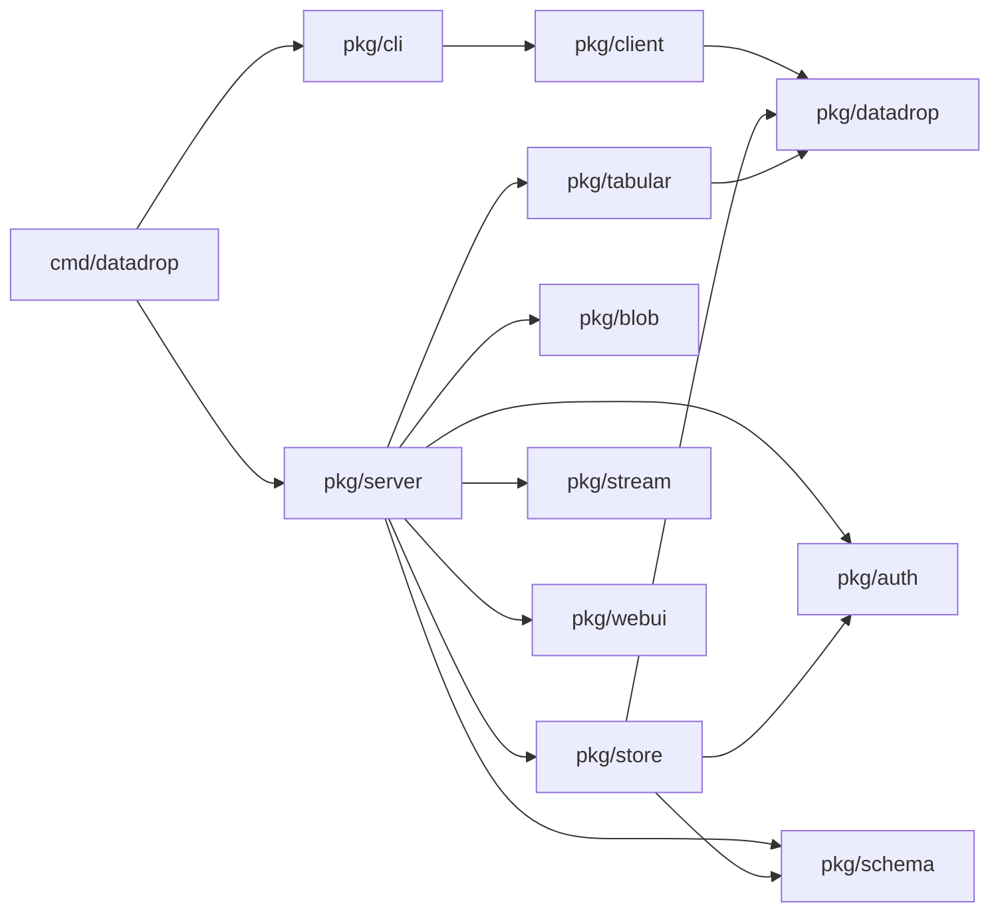
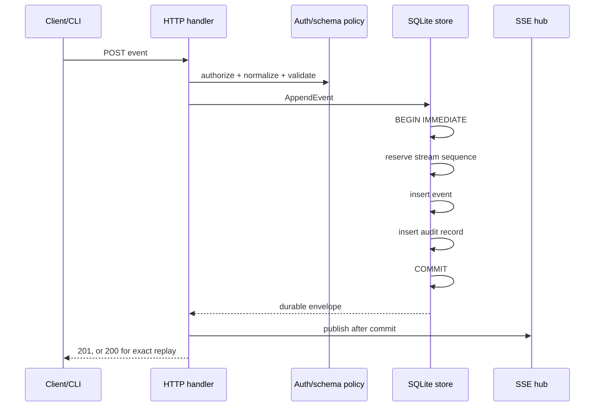
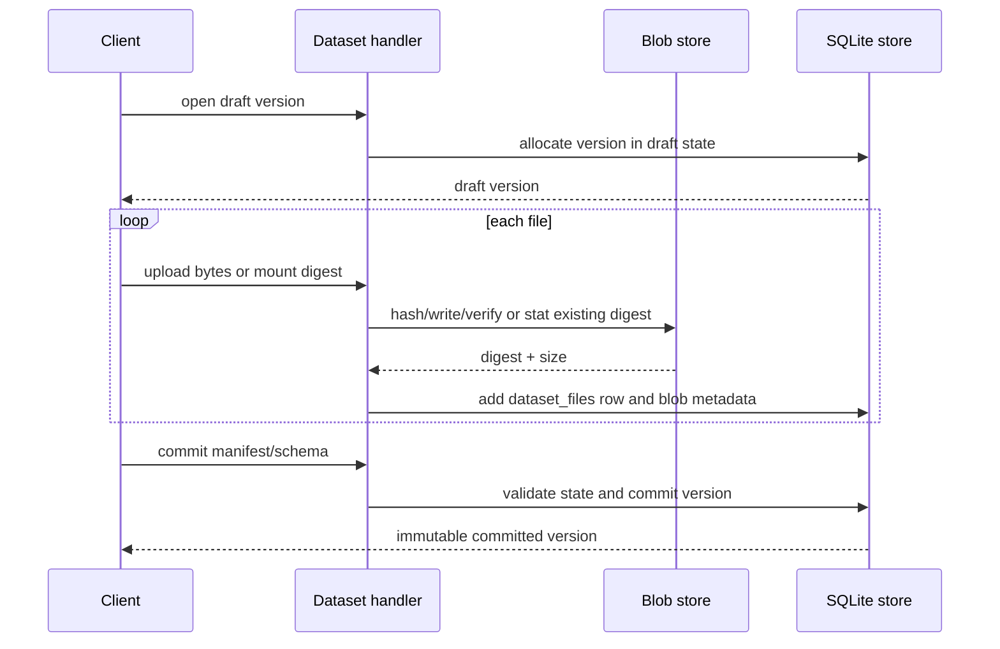
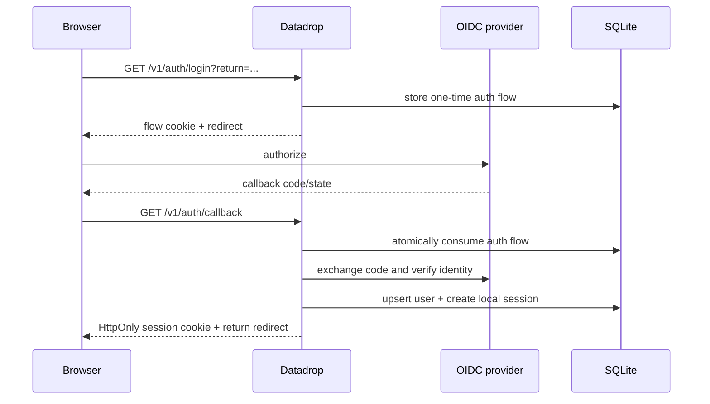
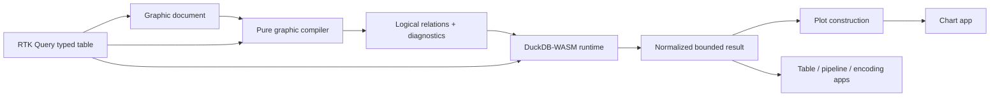
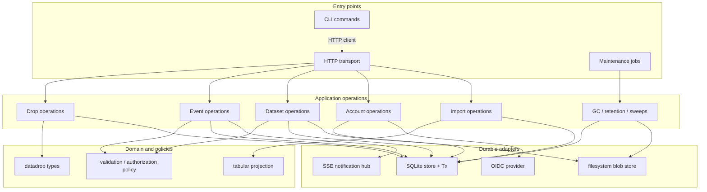
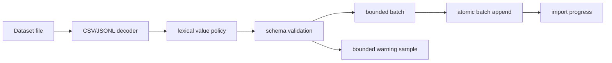
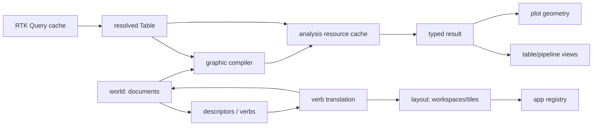

# go-go-datadrop: Architecture, Code Review, and Refactoring Guide

**Review date:** 2026-07-27
**Repository:** `go-go-golems/go-go-datadrop`
**Primary source reviewed:** the attached source archive
**Remote revision checked:** `0073c23e262f2403b3633b0ebeddde4dbc660126`

> This document is written both as a code review and as an onboarding guide. It first explains the product and architecture, then evaluates the implementation, then proposes a staged refactoring plan. Findings are ordered by impact rather than by directory.

## Contents

1. [Executive summary](#1-executive-summary)
2. [Review scope and verification](#2-review-scope-and-verification)
3. [What the system is](#3-what-the-system-is)
4. [Architecture and request flows](#4-architecture-and-request-flows)
5. [What is already strong](#5-what-is-already-strong)
6. [Prioritized findings](#6-prioritized-findings)
7. [Detailed backend findings](#7-detailed-backend-findings)
8. [Detailed frontend findings](#8-detailed-frontend-findings)
9. [Overengineering and modularity assessment](#9-overengineering-and-modularity-assessment)
10. [Recommended target architecture](#10-recommended-target-architecture)
11. [Sequenced implementation plan](#11-sequenced-implementation-plan)
12. [New-developer guide](#12-new-developer-guide)
13. [Appendix: metrics, checks, and limitations](#13-appendix-metrics-checks-and-limitations)

---

## 1. Executive summary

The codebase is a **well-considered modular monolith with several sharp boundary defects**, not a generally overengineered system and not a candidate for a rewrite.

The core ideas are coherent:

- a single Go binary serves both the HTTP API and embedded React application;
- events are append-only and ordered independently per stream;
- datasets are immutable committed versions backed by content-addressed files;
- SQLite is the durable authority;
- the in-memory SSE hub is only an acceleration layer, because clients can replay from SQLite;
- authorization is the intersection of a user's role and the credential's scopes;
- the browser receives typed table data, compiles a graphics document, and executes bounded analysis in DuckDB-WASM;
- Redux state is deliberately split between server-owned cache, user-authored documents, and workspace layout.

Those are strong choices. Most of the code makes the relevant invariants explicit, and the test suite is unusually attentive to subtle behavior such as sequence allocation, stream replay overlap, token existence oracles, schema modes, path safety, and per-instance frontend state.

The most important problems occur where **two independently correct subsystems meet**:

1. **The login return-path validator accepts a browser-interpreted external redirect using a backslash.** This is a concrete open-redirect vulnerability.
2. **Blob garbage collection races with mounting an existing blob into a dataset draft.** The database can end up referencing bytes that GC has just deleted.
3. **Several authoritative mutations and their audit records are not in one transaction.** Credential or access-control changes can succeed while the API returns failure because the audit write failed.
4. **Dataset upload checks that a version exists, not that it is still a draft, before consuming the body.** A large upload to an immutable version can be fully stored before being rejected, leaving an orphan.
5. **Synchronous imports accept an unbounded caller-provided row cap and append one transaction plus one audit record per row.** This creates an avoidable availability and latency risk.
6. **Every request carrying a browser session performs a session write, including static assets and health checks, while the entire database pool is pinned to one connection.** That turns ordinary page loading into serialized write traffic.
7. **An event ID collision inside the same stream is treated as an idempotent success even when the payload is different.** The server silently preserves the first request instead of reporting a conflicting idempotency key.
8. **Several sibling UI panels independently compile and execute the same document analysis.** The runtime serializes those duplicate jobs and cannot cancel obsolete work, so extra views make each other slower.

The dominant structural issue is `pkg/server`. It is currently responsible for routing, authentication resolution, authorization, import orchestration, blob lifecycle coordination, HTTP representation, and some application policy. That package should remain the HTTP adapter and composition layer, while a small set of concrete application services owns cross-resource operations.

The dominant frontend issue is not the number of components. It is the absence of a **document-scoped analysis resource**. The existing worker/runtime abstraction is useful, but work is keyed to React consumers rather than to the logical analysis result they share.

### Overall recommendation

Do not split this into microservices. Do not replace SQLite. Do not introduce a generic repository framework, command bus, internal event bus, or abstract unit-of-work hierarchy.

Instead:

- fix the trust-boundary defects immediately;
- add one narrow transaction helper;
- introduce `EventsService`, `DatasetService`, `ImportService`, and `AccountService` as concrete application-level coordinators;
- make blob attachment and GC share one coordination mechanism;
- route public/static requests outside session resolution and throttle session touches;
- replace component-scoped DuckDB execution with a shared document analysis resource;
- break the two large pure compiler functions into named passes without fragmenting them into dozens of tiny files;
- simplify the Atomic Design policy where it creates ceremony but retain the dependency graph and story coverage where they provide real value;
- repair development and release automation before relying on it as a quality gate.

---

## 2. Review scope and verification

### 2.1 Source reviewed

The attached archive was unpacked and reviewed locally. Its `.git` file points to a worktree metadata directory that is not present in the archive:

```text
gitdir: /home/manuel/code/wesen/go-go-golems/go-go-datadrop/.git/worktrees/go-go-datadrop1
```

That prevents proving the archive's exact commit from local Git metadata. I checked the public repository separately and found current remote head `0073c23e262f2403b3633b0ebeddde4dbc660126`. A representative source file, `pkg/server/handlers_auth.go`, had the same blob hash in the archive and at that remote revision. Code links in this review use that revision for stable navigation; line numbers were taken from the supplied archive.

The archive omitted files that exist in the remote repository, including `go.sum`, `ui/bun.lock`, and the generated `pkg/webui/dist` tree. I treat those as archive limitations, not repository defects.

### 2.2 Checks performed

The following static checks completed successfully:

```text
gofmt -l cmd pkg
# no output: formatting is clean

python3 -m py_compile scripts/devctl-plugin.py
# passed
```

Full Go tests could not run in this environment. The module requires Go 1.26.1 and explicitly selects toolchain 1.26.5. The available local Go is 1.23.2, which cannot parse the `tool` directive in `go.mod`; automatic toolchain download was blocked by the sandbox network policy.

Frontend checks also could not run faithfully because Bun was not installed and the archive omitted `ui/bun.lock`. The available global TypeScript compiler is 5.8.3, while the project declares TypeScript 7, Vite 8, React 19, Bun tests, and project-specific dependencies. Running the project with the global compiler would not be a valid substitute.

I therefore used:

- full source inspection;
- cross-reference searches;
- package and function-size analysis;
- review of tests as executable specifications;
- small standalone reproductions for browser URL parsing and numeric precision;
- remote-file checks for the archive omissions and current repository alignment.

### 2.3 Severity terminology

- **Critical:** immediate compromise or broad irreversible corruption is likely.
- **High:** exploitable security issue, durable inconsistency, or serious availability/data-loss risk.
- **Medium:** correctness, performance, or maintainability defect likely to matter under realistic use.
- **Low:** cleanup, future-proofing, or reduced development friction.

No finding here is labeled Critical. Several High findings should nevertheless be fixed before treating the service as production-hardened.

---

## 3. What the system is

### 3.1 Product model

Datadrop stores two deliberately different forms of data.

#### Streams

A stream is:

- unbounded;
- append-only;
- made of small JSON event envelopes;
- ordered by a server-assigned integer sequence within `(drop, stream)`;
- queryable by sequence and time;
- replayable and tail-able over SSE.

Corrections are represented by appending another event. Existing events are evidence and are not edited.

#### Datasets

A dataset is:

- finite;
- file-oriented;
- versioned;
- mutable only while a version is a draft;
- immutable once committed;
- backed by SHA-256-addressed blobs;
- optionally associated with a manifest and JSON Schema.

Corrections are represented by publishing another version. A committed version is a stable description of a set of exact bytes.

#### Materialization

A dataset file can be materialized into stream events. Each generated event records provenance:

- dataset name;
- dataset version;
- logical file path;
- blob digest;
- source row number.

The generated event ID is deterministic from destination, digest, and row. Re-running an interrupted import is therefore intended to skip rows already appended.

### 3.2 Naming and sharing boundary: the drop

A **drop** is the unit of naming, access control, and export. It contains streams and datasets. A drop can be:

- privately owned;
- shared with users as reader, writer, or admin;
- publicly readable;
- temporarily unowned for legacy/migration compatibility.

The code intentionally avoids per-stream and per-dataset ACLs. That keeps the authorization model comprehensible.

### 3.3 Authentication and authorization

There are three principal kinds:

- anonymous;
- browser session;
- local API token.

Browser sign-in uses OIDC. The server creates its own session after the OIDC callback. API tokens are local credentials whose secret is shown once and stored only as a hash.

Authorization has two independent dimensions:

1. **Role:** what the user may do to a specific drop.
2. **Scope:** what the presented credential may do globally.

A token narrows its owner's rights; it does not carry a separate grant. Removing a member immediately limits all of that user's tokens because membership is checked at request time.

### 3.4 Browser workbench

The web UI is more than a thin CRUD console. It is a bounded data-analysis workbench:

1. RTK Query fetches a typed table projection from the server.
2. A user-authored graphics document describes source, transforms, views, marks, and encodings.
3. A pure compiler converts that document to a logical graphic/relational representation and diagnostics.
4. DuckDB-WASM executes the relational plan against the authorized table in the browser.
5. The result is normalized and converted into plot geometry.
6. Multiple tiled applications inspect or edit different aspects of the same document.

This distinction matters when evaluating complexity: the frontend is implementing a small declarative visualization environment, not only pages and forms.

---

## 4. Architecture and request flows

### 4.1 Top-level package map

| Area | Responsibility | Review assessment |
|---|---|---|
| `cmd/datadrop` | Composition root and CLI group registration | Small and correctly placed |
| `pkg/cli` | Cobra/Glazed commands and terminal presentation | Generally clean; framework footprint is large |
| `pkg/client` | Typed public HTTP client used by CLI | Good boundary; needs transport and filesystem hardening |
| `pkg/datadrop` | Domain DTOs, names, queries, schemas, dataset types | Mostly cohesive; still imports some auth concepts indirectly |
| `pkg/auth` | Principals, scopes, roles, OIDC and token primitives | Strong, testable policy layer |
| `pkg/server` | Routes, middleware, handlers, orchestration | Main concentration of mixed responsibilities |
| `pkg/store` | SQLite migrations and persistence operations | Strong core; transaction policy is inconsistent outside core writes |
| `pkg/blob` | Filesystem content-addressed storage | Narrow and reusable; cross-resource lifecycle belongs above it |
| `pkg/schema` | JSON Schema compilation/cache/validation | Appropriately isolated |
| `pkg/tabular` | CSV/NDJSON/JSON row reading, flattening and table projection | Valuable shared extraction; CSV coercion has data-loss edges |
| `pkg/stream` | In-process publish/subscribe hub | Small and conceptually correct |
| `pkg/webui` | Embedded/development frontend serving | Appropriate adapter |
| `ui/src/api` | RTK Query and API DTOs | Clear but hand-maintained against Go DTOs |
| `ui/src/model` | Pure graphics, table and plot model | Strong isolation; a few functions have become compiler monoliths |
| `ui/src/analysis` | DuckDB adapter/runtime/compiler/normalization | Useful architecture; runtime cache and cancellation are limited |
| `ui/src/store` | User world, workspace layout, verbs, persistence | Deliberate state model; some broad subscriptions and large reducers |
| `ui/src/pbui` | Presentation descriptors and serializable verbs | Real seam, but needs tighter scope/documentation |
| `ui/src/components` | Atomic Design component hierarchy | Consistent; policy creates avoidable file/story ceremony in trivial cases |
| `ui/src/apps` | Workbench tile applications | Appropriate feature boundary |
| `ui/src/appkit` | Cross-app runtime/provider contracts | Correct home for shared analysis; currently duplicates work by consumer |

### 4.2 Runtime dependency direction

The broad dependency direction is sensible:



The important architectural fact is that the CLI's client commands call the HTTP API rather than opening SQLite. That prevents an accidental second application implementation.

### 4.3 Persistence model

The migrations define the following groups:

- `drops`, `events`, `stream_heads`, `schemas`, `audit_log`;
- `blobs`, `datasets`, `dataset_versions`, `dataset_files`;
- `users`, `sessions`, `auth_flows`, `api_tokens`, `drop_members`;
- `device_authorizations`.

SQLite is configured with WAL, foreign keys, `synchronous(FULL)`, an immediate transaction mode, and a one-connection pool. The one-connection decision makes write serialization and stream sequence allocation simple, but it also means every avoidable write directly affects all request throughput.

### 4.4 Event append flow



The sequence reservation, event insertion, and audit row are correctly one transaction. Publishing happens after commit, so no subscriber sees an event that failed to persist.

### 4.5 SSE flow

The live endpoint subscribes to the hub **before** replaying SQLite history. This avoids a gap in which a committed event could be missed. Subscription-first can cause overlap, but the handler deduplicates by sequence. Slow consumers are evicted, receive a reset cursor, and can reconnect against the durable log.

This means the hub is intentionally lossy and replaceable. It does not require a durable outbox: if a process dies after commit and before publish, a reconnecting client can still replay from SQLite.

### 4.6 Dataset publication flow



The filesystem blob write and SQLite metadata transaction cannot be one native transaction. That is acceptable, but it makes the application layer responsible for compensation, orphan handling, and GC coordination.

### 4.7 Browser authentication flow



For subsequent requests, middleware resolves a bearer token first and a browser session second. Handlers then apply the required scope and, for drop-bound operations, the required role. Cookie-authenticated unsafe requests also undergo Origin-based CSRF checking.

### 4.8 Frontend state and analysis flow

The frontend has three main state authorities:

- **RTK Query (`state.datadrop`)**: data the server returned;
- **world slice**: documents, transforms, snapshots, pins, watchlists, and user decisions;
- **layout slice**: workspaces, stages, split trees, tile placement and selected applications.



The store is a factory, not a module-level singleton. That is a good and important property: tour instances and Storybook examples can own isolated worlds, layouts, fixture maps, and clipboard ports.

---

## 5. What is already strong

This section matters because several refactorings would be harmful if they discarded the properties below.

### 5.1 Append ordering and durability are explicit

[`pkg/store/events.go:14-137`](https://github.com/go-go-golems/go-go-datadrop/blob/0073c23e262f2403b3633b0ebeddde4dbc660126/pkg/store/events.go#L14-L137) reserves the stream sequence, inserts the event, and writes its audit record in one immediate transaction. Failed inserts do not burn sequence numbers. That is the central storage invariant and it is implemented directly rather than hidden behind a generic persistence abstraction.

Preserve this design.

### 5.2 The SSE replay algorithm is correct and well explained

[`pkg/server/handlers_stream.go:18-123`](https://github.com/go-go-golems/go-go-datadrop/blob/0073c23e262f2403b3633b0ebeddde4dbc660126/pkg/server/handlers_stream.go#L18-L123) subscribes before replay, deduplicates overlap, flushes frames, emits heartbeats, and gives slow consumers a durable resume cursor. [`pkg/stream/hub.go`](https://github.com/go-go-golems/go-go-datadrop/blob/0073c23e262f2403b3633b0ebeddde4dbc660126/pkg/stream/hub.go) never lets a slow subscriber block an append.

Do not replace this with a blocking fan-out channel or make the hub the source of truth.

### 5.3 Authorization is modeled as an intersection

The separation between `EffectiveRole` and credential scopes in [`pkg/auth/role.go`](https://github.com/go-go-golems/go-go-datadrop/blob/0073c23e262f2403b3633b0ebeddde4dbc660126/pkg/auth/role.go) is precise. Tokens narrow current membership instead of freezing a grant at creation time. Public reads, legacy unowned drops, owners, members, and anonymous users are represented without a privileged fallback principal.

The code also avoids token-existence oracles by performing secret verification before exposing revoked/expired state and returning one failure shape.

### 5.4 CSRF checks are attached to authorization, not left to handlers

Unsafe cookie-authenticated operations pass through the Origin check inside authorization helpers. That is much safer than relying on every new mutating handler to remember separate CSRF middleware.

### 5.5 Blob storage has a narrow, useful boundary

[`pkg/blob/store.go`](https://github.com/go-go-golems/go-go-datadrop/blob/0073c23e262f2403b3633b0ebeddde4dbc660126/pkg/blob/store.go) knows only digests and bytes. It streams into a same-filesystem temporary file, computes the digest itself, verifies any caller assertion, fsyncs the file, and atomically publishes by rename. This package could be reused with a different metadata/application layer.

The cross-resource lifecycle problems identified later belong above this package; they are not reasons to make `blob.Store` understand datasets.

### 5.6 Tabular behavior is shared rather than duplicated

CSV export, table projection, and import use common flattening and row-reading rules. JSON flattening uses `json.Number`, preserving large numeric lexemes rather than silently routing them through `float64`. This is exactly the type of extraction that improves modularity: one behavioral rule, multiple adapters.

### 5.7 The public client keeps the CLI honest

The CLI talks to `pkg/client`, not SQLite. This keeps HTTP semantics, authorization, problem documents, and server-side invariants on the real path. It also makes the client package a natural home for device-flow transport and common problem decoding.

### 5.8 Frontend state ownership is unusually explicit

[`ui/src/store/index.ts`](https://github.com/go-go-golems/go-go-datadrop/blob/0073c23e262f2403b3633b0ebeddde4dbc660126/ui/src/store/index.ts) documents and enforces the distinction between server data, user decisions, and layout. It exports a store factory only. Fixture data and clipboard behavior are passed per store through thunk extras instead of module-level globals.

This is not overengineering; it prevents cross-instance state leakage and makes the tour architecture possible.

### 5.9 PBUI's verb seam has real value

Descriptors emit serializable verbs and do not import Redux reducers. A single adapter maps verbs into actions/thunks. That keeps presentation and intent testable without a DOM or store and allows the same presentation machinery to drive multiple workbench instances.

The abstraction should be constrained and documented, not removed wholesale.

### 5.10 Tests often describe the real invariant

The source contains focused tests for stream overlap, slow consumers, path safety, token privacy, session behavior, dataset immutability, strict import preflight, fixture isolation, layer imports, stories, raw controls, multiple stores, compiler diagnostics, and coordinator generations.

The main testing gap is not quantity. It is that a few tests assert the wrong browser/security contract or deliberately preserve questionable semantics, such as accepting `/\\evil.example` and treating changed idempotent event payloads as success.

---

## 6. Prioritized findings

### 6.1 Priority matrix

| Priority | Finding | Main consequence | Recommended first action |
|---|---|---|---|
| P0 | Login return-path open redirect | Phishing and trust-boundary bypass after real sign-in | Reject backslashes/control characters and resolve against the configured origin using browser-compatible rules |
| P0 | Blob GC races with mounting an existing digest | Dataset metadata can reference deleted bytes | Coordinate attachment and sweep; recheck reachability immediately before deletion |
| P0 | Mutation and audit are not consistently atomic | Credentials/ACL state may change while API reports failure | Add a narrow `withTx` helper and move authoritative mutation plus audit into one transaction |
| P0 | Upload preflight does not enforce draft state | Large rejected uploads and orphaned blobs | Inspect `Version.State` before consuming any request body |
| P1 | Import row limit is caller-expandable and each row is a transaction | Easy CPU/DB exhaustion and very poor throughput | Add a hard server cap, bounded diagnostics, and chunked append |
| P1 | Session is touched on every cookie-bearing request | Static page loads become serialized SQLite writes | Bypass resolution for public/static routes and throttle session touches |
| P1 | Reused event ID with changed content is silently accepted | Producer bugs are hidden and changed data is discarded | Store/compare an idempotency fingerprint and return 409 on mismatch |
| P1 | Recovery writes a second response after streaming begins | Corrupted SSE/CSV/tar responses and misleading logs | Track committed response state and only write a problem before commitment |
| P1 | CSV duplicate headers and `float64` coercion lose data | Silent column overwrite and rounded identifiers | Reject duplicate headers; preserve valid numeric lexemes as `json.Number` |
| P1 | Same UI document is analyzed once per mounted consumer | Duplicate serialized DuckDB work and stale latency | Introduce a shared document-scoped analysis resource |
| P2 | Configuration, server timeout, client transport, and migration validation gaps | Misconfiguration and operational stalls are detected late | Add validation, bounded transports, idle/header limits, and migration checksums |
| P2 | Dataset download writes final paths before verification | Partial/corrupt files remain and symlinks can redirect writes | Verify into a temporary file under a no-follow root, then atomically rename |
| P2 | `pkg/server` owns too many application responsibilities | Cross-resource invariants are hard to test and reuse | Extract a few concrete services; keep handlers thin |
| P3 | Compiler/layout functions and component policy create change friction | Slower feature work and broad reviews | Split pure passes and relax story/folder requirements for trivial wrappers |
| P3 | Release/dev automation and README have drifted | “Green” workflows may not build or start the product | Establish one pinned `check` path and update canonical docs |

### 6.2 Immediate release gate

Before treating the current service as externally hardened, I would require fixes and regression tests for:

1. the return-path redirect;
2. GC versus blob attachment;
3. draft-state upload preflight;
4. audit atomicity for credential and access-control mutations;
5. a non-overridable import ceiling;
6. streaming-aware panic recovery.

The duplicate frontend analysis, session-write load, and CSV coercion are important, but they do not need to block a security-only patch release if the P0/P1 server boundary issues are isolated first.

---

## 7. Detailed backend findings

### F1 — High security: `safeReturnPath` accepts a browser-external redirect

**Evidence**

[`pkg/server/handlers_auth.go:222-242`](https://github.com/go-go-golems/go-go-datadrop/blob/0073c23e262f2403b3633b0ebeddde4dbc660126/pkg/server/handlers_auth.go#L222-L242) accepts any value that starts with one slash, does not start with two slashes, and has no scheme or host according to Go's `net/url` parser.

That accepts:

```text
/\evil.example
```

The existing test at [`pkg/server/auth_flow_test.go:337-349`](https://github.com/go-go-golems/go-go-datadrop/blob/0073c23e262f2403b3633b0ebeddde4dbc660126/pkg/server/auth_flow_test.go#L337-L349) explicitly expects this value to survive validation.

A standalone reproduction shows the mismatch:

```go
// Go emits the backslash-bearing Location value.
returnPath := "/\\evil.example"
w.Header().Set("Location", returnPath)
```

```js
new URL('/\\evil.example', 'https://data.example.com/v1/auth/callback').href
// => 'https://evil.example/'
```

Browsers normalize the backslash as a URL separator. The result is a protocol-relative external redirect after the user has authenticated on the real Datadrop origin.

**Impact**

An attacker can send a user through the legitimate Datadrop login page and then land them on an attacker-controlled site. This is a standard phishing primitive and can be chained with convincing post-login prompts.

**Recommendation**

Use a stricter contract than “Go parses it as a path.” The simplest safe policy is:

- permit only an application-relative path beginning with `/ui/`;
- reject `\\`, control characters, CR/LF, and any encoded form that normalizes to them;
- parse and resolve the value against the configured external origin;
- verify the final scheme and host exactly match that origin;
- emit a normalized path/query rather than the original raw string.

A narrow implementation can be:

```go
func safeReturnPath(raw string) string {
    if raw == "" {
        return webuiPath
    }
    if strings.Contains(raw, "\\") || strings.ContainsAny(raw, "\r\n\x00") {
        return webuiPath
    }
    ref, err := url.Parse(raw)
    if err != nil || ref.IsAbs() || ref.Host != "" || !strings.HasPrefix(ref.Path, "/ui/") {
        return webuiPath
    }
    return ref.EscapedPath() + querySuffix(ref.RawQuery)
}
```

Resolving against `ExternalURL` and comparing origins is more general if non-UI return paths are required.

**Tests to add/change**

- `/\\evil.example`, `/%5Cevil.example`, `/%5c%5cevil.example` fall back to `/ui/`.
- control characters and encoded CR/LF fall back.
- a valid `/ui/path?x=1#fragment` follows the intended fragment policy.
- most importantly, resolve the emitted `Location` with a WHATWG-compatible URL implementation or a browser test and assert the final origin is unchanged.

Do not keep a test whose only oracle is Go's `url.Parse`; that is exactly the parser mismatch causing the defect.

---

### F2 — High correctness: garbage collection can delete a blob while it is being mounted

**Evidence**

The GC handler takes a point-in-time reference snapshot and then delegates deletion:

- [`pkg/server/handlers_gc.go:45-56`](https://github.com/go-go-golems/go-go-datadrop/blob/0073c23e262f2403b3633b0ebeddde4dbc660126/pkg/server/handlers_gc.go#L45-L56)
- [`pkg/store/datasets.go:543-562`](https://github.com/go-go-golems/go-go-datadrop/blob/0073c23e262f2403b3633b0ebeddde4dbc660126/pkg/store/datasets.go#L543-L562)
- [`pkg/blob/store.go:254-333`](https://github.com/go-go-golems/go-go-datadrop/blob/0073c23e262f2403b3633b0ebeddde4dbc660126/pkg/blob/store.go#L254-L333)

The bodyless mount path separately checks that bytes exist, obtains their size, and only afterwards inserts the dataset metadata:

- [`pkg/server/handlers_blobs.go:107-127`](https://github.com/go-go-golems/go-go-datadrop/blob/0073c23e262f2403b3633b0ebeddde4dbc660126/pkg/server/handlers_blobs.go#L107-L127)
- [`pkg/server/handlers_blobs.go:82-90`](https://github.com/go-go-golems/go-go-datadrop/blob/0073c23e262f2403b3633b0ebeddde4dbc660126/pkg/server/handlers_blobs.go#L82-L90)

A valid interleaving is:

1. Blob `D` is old and currently unreferenced.
2. GC snapshots references; `D` is absent.
3. A mount request confirms `D` exists and reads its size.
4. The mount inserts `dataset_files(... digest=D ...)` and commits.
5. GC, still using its old snapshot, deletes `D`.
6. The committed dataset row now references missing bytes.

The one-hour grace period only protects newly written blobs. It does not protect an old orphan that becomes referenced during the sweep.

**Impact**

A committed or draft dataset can contain a file that passes metadata checks but cannot be opened. This is durable cross-store inconsistency.

**Recommendation**

The application layer needs one blob-lifecycle coordination mechanism. Options, in increasing multi-process strength:

1. **Current single-process deployment:** a `sync.RWMutex` or dedicated coordinator around “attach existing/write-and-attach” and GC. Attachments take a read/shared or exclusive lock according to implementation; GC takes the opposing lock for snapshot plus sweep.
2. **Final reachability check:** immediately before deleting each digest, ask the metadata store again whether it is referenced. This narrows the race but still needs careful ordering between the final check and deletion.
3. **Lease/tombstone protocol:** GC marks a candidate as deleting in SQLite, attachment refuses or clears the mark, and deletion occurs only for a still-unreferenced tombstone. This is the correct path for future multi-instance servers or external object storage.

For the current architecture, a small `BlobLifecycle`/`DatasetService` coordinator plus a final reference recheck is sufficient. Do not make `pkg/blob` import `pkg/store`; the narrow blob abstraction is worth preserving.

**Tests to add**

Create a deterministic concurrency test with barriers:

- seed an old unreferenced blob;
- pause GC after reference enumeration;
- mount the digest into a draft and commit metadata;
- resume GC;
- assert the blob still exists and can be downloaded.

A sleep-based test is not adequate.

---

### F3 — High consistency: mutation and audit are often separate transactions

**Evidence**

The store helper itself says audit should normally share the authoritative transaction:

[`pkg/store/helpers.go:44-68`](https://github.com/go-go-golems/go-go-datadrop/blob/0073c23e262f2403b3633b0ebeddde4dbc660126/pkg/store/helpers.go#L44-L68)

Core event and dataset operations follow that rule. Several account and ACL operations do not. Examples include:

- drop creation: [`pkg/store/drops.go:13-47`](https://github.com/go-go-golems/go-go-datadrop/blob/0073c23e262f2403b3633b0ebeddde4dbc660126/pkg/store/drops.go#L13-L47);
- API token creation and revocation: [`pkg/store/tokens.go:21-76`](https://github.com/go-go-golems/go-go-datadrop/blob/0073c23e262f2403b3633b0ebeddde4dbc660126/pkg/store/tokens.go#L21-L76), [`pkg/store/tokens.go:167-185`](https://github.com/go-go-golems/go-go-datadrop/blob/0073c23e262f2403b3633b0ebeddde4dbc660126/pkg/store/tokens.go#L167-L185);
- session creation/deletion: [`pkg/store/sessions.go:31-62`](https://github.com/go-go-golems/go-go-datadrop/blob/0073c23e262f2403b3633b0ebeddde4dbc660126/pkg/store/sessions.go#L31-L62), [`pkg/store/sessions.go:142-160`](https://github.com/go-go-golems/go-go-datadrop/blob/0073c23e262f2403b3633b0ebeddde4dbc660126/pkg/store/sessions.go#L142-L160);
- user upsert: [`pkg/store/users.go:28-79`](https://github.com/go-go-golems/go-go-datadrop/blob/0073c23e262f2403b3633b0ebeddde4dbc660126/pkg/store/users.go#L28-L79);
- member changes and claims: [`pkg/store/members.go:115-193`](https://github.com/go-go-golems/go-go-datadrop/blob/0073c23e262f2403b3633b0ebeddde4dbc660126/pkg/store/members.go#L115-L193);
- device authorization creation: [`pkg/store/device_authorizations.go:44-86`](https://github.com/go-go-golems/go-go-datadrop/blob/0073c23e262f2403b3633b0ebeddde4dbc660126/pkg/store/device_authorizations.go#L44-L86).

These methods execute the authoritative mutation through `s.db`, then execute the audit insert through `s.db`. If the second statement fails, the first is already committed.

The token/session cases are particularly important. A credential may become live even though the API returns an error and the caller never receives the one-time secret or cookie.

**Impact**

- audit no longer reliably describes authoritative state;
- clients may retry operations that already succeeded;
- a token can exist without its creator receiving it;
- ACL state can change despite a reported failure;
- incident reconstruction becomes unreliable precisely for security-sensitive mutations.

**Recommendation**

Add one narrow transaction helper, not a repository framework:

```go
func (s *Store) withTx(ctx context.Context, fn func(*sql.Tx) error) error {
    tx, err := s.beginImmediate(ctx)
    if err != nil { return err }
    defer tx.Rollback()
    if err := fn(tx); err != nil { return err }
    return errors.Wrap(tx.Commit(), "store: commit transaction")
}
```

Then have the internal mutation helpers accept the existing `execer` or a slightly broader `queryExecer` when they need reads. The public operation calls `withTx`, performs the mutation, writes the audit row through the same `*sql.Tx`, and returns only after commit.

Keep `Store.Audit` for genuinely aggregate operations whose component writes are already individually durable, such as an explicitly non-atomic bulk import summary. Its use should be rare and documented at the call site.

**Tests to add**

Inject an audit failure and assert rollback for:

- token creation;
- session creation;
- member set/remove;
- drop claim;
- drop creation.

A practical test hook is an internal audit writer interface or a temporary trigger that rejects inserts into `audit_log`. Avoid production-facing dependency injection solely for this test.

---

### F4 — High correctness/resource use: upload preflight checks existence, not draft state

**Evidence**

The upload handler says the version must “still be open before any bytes are accepted,” but it only calls:

[`pkg/server/handlers_blobs.go:69-75`](https://github.com/go-go-golems/go-go-datadrop/blob/0073c23e262f2403b3633b0ebeddde4dbc660126/pkg/server/handlers_blobs.go#L69-L75)

```go
s.store.GetDatasetVersion(..., includeDrafts=true)
```

`includeDrafts=true` means “do not filter out drafts”; it does not mean “require draft”:

[`pkg/store/datasets.go:272-303`](https://github.com/go-go-golems/go-go-datadrop/blob/0073c23e262f2403b3633b0ebeddde4dbc660126/pkg/store/datasets.go#L272-L303)

The actual state check occurs in `AddDatasetFile`, after the entire body has been streamed to the blob store:

[`pkg/store/datasets.go:113-139`](https://github.com/go-go-golems/go-go-datadrop/blob/0073c23e262f2403b3633b0ebeddde4dbc660126/pkg/store/datasets.go#L113-L139)

**Impact**

A client can upload up to the configured limit—5 GiB by default—to a committed version. The bytes are stored and then metadata insertion returns an immutable conflict. The resulting blob is orphaned until GC. This wastes bandwidth, disk, hashing CPU, and request time.

There is still an unavoidable race between a precheck and the later metadata transaction: another request can commit the draft while bytes are being uploaded. The precheck nevertheless prevents the common stale-client case and avoids consuming obviously invalid bodies.

**Recommendation**

Immediately inspect the returned state:

```go
versionInfo, err := s.store.GetDatasetVersion(..., true)
if err != nil { ... }
if versionInfo.State != datadrop.StateDraft {
    s.writeDatasetError(... ErrImmutable ...)
    return
}
```

For stronger coordination, move “accept bytes for this draft” behind `DatasetService`. Possible approaches:

- an in-process per-version lease while upload is active;
- an optimistic draft generation checked during attach;
- allowing the filesystem write but explicitly treating the result as a recoverable orphan when the final attach loses a race.

Do not hold a SQLite write transaction open while a multi-gigabyte body arrives.

**Tests to add**

- Upload to a committed version returns conflict without reading the supplied body. Use a reader that fails the test if `Read` is called.
- A commit racing an active upload yields a documented result and leaves an orphan eligible for GC.
- Bodyless mount to a committed version is rejected before blob `Stat`.

---

### F5 — High availability: synchronous import has no hard row ceiling and performs one transaction per row

**Evidence**

The default is 100,000 rows, but any positive `max_rows` query value replaces it:

[`pkg/server/handlers_import.go:22-28`](https://github.com/go-go-golems/go-go-datadrop/blob/0073c23e262f2403b3633b0ebeddde4dbc660126/pkg/server/handlers_import.go#L22-L28), [`pkg/server/handlers_import.go:64-73`](https://github.com/go-go-golems/go-go-datadrop/blob/0073c23e262f2403b3633b0ebeddde4dbc660126/pkg/server/handlers_import.go#L64-L73)

A caller can request millions or billions of rows. Each row calls `AppendEvent`, which starts and commits a transaction and writes an audit row:

[`pkg/server/handlers_import.go:251-306`](https://github.com/go-go-golems/go-go-datadrop/blob/0073c23e262f2403b3633b0ebeddde4dbc660126/pkg/server/handlers_import.go#L251-L306)

Permissive validation appends every violation to `result.Warnings`, so response memory can grow with the entire input:

[`pkg/server/handlers_import.go:254-264`](https://github.com/go-go-golems/go-go-datadrop/blob/0073c23e262f2403b3633b0ebeddde4dbc660126/pkg/server/handlers_import.go#L254-L264)

Strict mode performs a valuable schema preflight, but the mutation pass is still a sequence of independent commits. A database/I/O failure midway leaves a partial import. Deterministic event IDs make retry safe, but the API does not return a durable checkpoint when the request fails. The summary audit is also written only after all row appends; if that audit fails, the handler returns 500 after the import has completed.

**Impact**

- authenticated writers can monopolize the single SQLite connection for a long period;
- one request can generate extreme transaction and audit volume;
- warnings can consume excessive memory and produce huge responses;
- request cancellation or failure leaves a partial operation with weak observability;
- strict mode's comment “rejection has no side effects” is true for schema rejection, not for every failure mode.

**Recommendation**

1. Add a server configuration such as `MaxImportRows`, with a safe hard upper bound. A request may lower it but never raise it:

   ```go
   maxRows := min(requestedOrDefault, s.cfg.MaxImportRows)
   ```

2. Bound diagnostics:

   ```json
   {
     "warning_count": 18342,
     "warnings": [/* first 100 */],
     "warnings_truncated": true
   }
   ```

3. Add a store-level `AppendEvents` operation that processes chunks in one transaction, reserves a sequence range, inserts rows, and commits. Publish to the hub only after each chunk commits.

4. Define atomicity honestly:

   - **Schema-atomic:** strict preflight guarantees no schema-invalid prefix is committed.
   - **Failure-resumable:** deterministic IDs allow retry after database/network interruption.
   - **Fully atomic:** only claim this if all rows are inserted in one transaction.

5. Return an import identifier and progress summary. If imports will exceed request-scale work, move them to a durable job model later—but do not introduce a job framework until the hard cap and chunked append prove insufficient.

6. Reconsider per-row audit records. The event row itself already records append history. A single import summary audit plus event provenance may be sufficient and dramatically cheaper. This is a product/audit-policy decision, not only a performance optimization.

**Tests to add**

- `max_rows` above server policy is clamped or rejected.
- warning samples are capped while total count remains accurate.
- a failure in chunk two leaves chunk one resumable and a retry does not duplicate rows.
- hub publication occurs only after chunk commit.
- strict validation failure writes zero events.

---

### F6 — High performance/availability: every browser-session request writes `last_seen_at`

**Evidence**

The store pins all access to one database connection:

[`pkg/store/store.go:99-104`](https://github.com/go-go-golems/go-go-datadrop/blob/0073c23e262f2403b3633b0ebeddde4dbc660126/pkg/store/store.go#L99-L104)

`principalMiddleware` wraps the entire mux, including `/healthz`, `/ui`, and `/static`:

[`pkg/server/server.go:313-328`](https://github.com/go-go-golems/go-go-datadrop/blob/0073c23e262f2403b3633b0ebeddde4dbc660126/pkg/server/server.go#L313-L328)

A cookie session is resolved by reading the session and user, then writing `last_seen_at` unconditionally:

[`pkg/server/middleware.go:176-201`](https://github.com/go-go-golems/go-go-datadrop/blob/0073c23e262f2403b3633b0ebeddde4dbc660126/pkg/server/middleware.go#L176-L201)

The token path already recognizes this issue and throttles `last_used_at` to once per minute:

[`pkg/store/tokens.go:188-209`](https://github.com/go-go-golems/go-go-datadrop/blob/0073c23e262f2403b3633b0ebeddde4dbc660126/pkg/store/tokens.go#L188-L209)

**Impact**

A single page load with many static assets and API reads generates serialized writes. Multiple browser tabs amplify this. Because SQLite access is one connection, these bookkeeping writes compete directly with event append, import, auth flow, and every read.

The comment that one indexed update is acceptable considers the cost of one request in isolation, not the system's one-connection topology or the fact that public routes do not need principal resolution.

**Recommendation**

Apply both of these changes:

1. **Route-scoped/lazy resolution.** Keep `/healthz`, static assets, and the SPA shell outside principal resolution. Resolve only for API handlers that inspect the principal. A small `withPrincipal` wrapper around API subtrees or a lazy principal accessor is enough.
2. **Throttle session touches.** Update only when the stored value is older than a threshold, for example five minutes:

   ```sql
   UPDATE sessions
      SET last_seen_at = ?
    WHERE id = ? AND last_seen_at < ?
   ```

   An in-memory cache can avoid issuing even that conditional statement on every request, but the SQL condition is still required for correctness across processes.

After removing avoidable writes, benchmark before changing the one-connection pool. If read concurrency is still a problem, use a dedicated writer connection and a small WAL reader pool. Do not raise the pool cap without retesting sequence reservation and transaction assumptions.

**Tests/benchmarks**

- `/healthz`, `/ui`, and static requests do not call session resolution.
- repeated session API reads within the touch interval perform no update.
- idle expiry still uses a conservative timestamp and remains correct.
- benchmark authenticated table reads while appending events.

---

### F7 — Medium/high data integrity: event idempotency accepts a different request under the same ID

**Evidence**

On a uniqueness collision, `AppendEvent` loads the original event and checks only drop and stream:

[`pkg/store/events.go:91-106`](https://github.com/go-go-golems/go-go-datadrop/blob/0073c23e262f2403b3633b0ebeddde4dbc660126/pkg/store/events.go#L91-L106)

The test deliberately reuses the ID with `21.7` changed to `99.9` and expects an idempotent replay:

[`pkg/store/events_test.go:222-259`](https://github.com/go-go-golems/go-go-datadrop/blob/0073c23e262f2403b3633b0ebeddde4dbc660126/pkg/store/events_test.go#L222-L259)

The handler maps `ErrAlreadyExists` to success and returns the original event.

**Impact**

A producer that accidentally reuses an idempotency key for a different event sees success while its changed payload is discarded. This is worse than a visible 409 because it converts a producer bug into silent data loss.

**Recommendation**

Define the idempotency contract as **same ID, same client-controlled request**. Compare a canonical fingerprint of:

- drop;
- normalized stream;
- source;
- type;
- subject;
- client event time, under a clearly documented defaulting rule;
- compacted data;
- compacted meta.

Exclude server-generated `seq`, `received_at`, and `specversion` normalization. Store the fingerprint in the event row or compute it from the loaded event. A stored hash makes the rule explicit and avoids repeated canonicalization drift.

Return:

- `200 OK` with the original event for an exact replay;
- `409 Conflict` with a stable code such as `IdempotencyConflict` for the same ID and different content;
- `409` without leaking the original event when the ID belongs to another drop/stream, as the current code already does.

**Tests to add/change**

- semantically exact compacted replay succeeds;
- changed data, meta, subject, source, or type conflicts;
- omitted/defaulted type and explicit default type are treated consistently;
- cross-drop collision still leaks no original data.

---

### F8 — Medium data integrity: CSV header collisions and `float64` coercion silently transform input

**Evidence**

Blank headers are replaced with `column_N`, but duplicate headers are not detected:

[`pkg/tabular/rows.go:120-129`](https://github.com/go-go-golems/go-go-datadrop/blob/0073c23e262f2403b3633b0ebeddde4dbc660126/pkg/tabular/rows.go#L120-L129)

Rows are accumulated into a map, so a duplicate name overwrites the previous value:

[`pkg/tabular/rows.go:145-155`](https://github.com/go-go-golems/go-go-datadrop/blob/0073c23e262f2403b3633b0ebeddde4dbc660126/pkg/tabular/rows.go#L145-L155)

A generated blank name can also collide with a real header named `column_2`, and a long row's generated extra-field name can collide with a header.

Numeric-looking values are parsed through `float64`:

[`pkg/tabular/rows.go:168-190`](https://github.com/go-go-golems/go-go-datadrop/blob/0073c23e262f2403b3633b0ebeddde4dbc660126/pkg/tabular/rows.go#L168-L190)

For example, `12345678901234567` becomes `12345678901234568` when marshaled. This contradicts the exact-number care in JSON flattening at [`pkg/tabular/flatten.go:37-42`](https://github.com/go-go-golems/go-go-datadrop/blob/0073c23e262f2403b3633b0ebeddde4dbc660126/pkg/tabular/flatten.go#L37-L42).

**Impact**

- duplicate columns disappear without an error;
- identifiers and high-precision measurements can be rounded;
- a schema may validate the rounded value rather than the source lexeme;
- materialized event provenance identifies the source row but not the lost original column/value semantics.

**Recommendation**

The safest default is to reject ambiguous headers before reading rows:

- trim/normalize according to a documented rule;
- generate unique names for blanks;
- reject duplicate effective names with positions in the error;
- reject or explicitly model records longer than the header rather than inventing names that may collide.

For numbers, validate the lexeme using JSON-number grammar and return `json.Number(trimmed)`, not `float64`. Boolean coercion can remain. `TextColumns` should continue to override all coercion for schema-declared strings.

Whether values such as `001` should become a number without a schema is a product decision. It is not a valid JSON number, so preserving it as text is the least destructive behavior.

**Tests to add**

- duplicate literal headers;
- blank-generated name colliding with a real name;
- long record beyond header width;
- 64-bit integers, decimal precision, exponent form, `001`, `+1`, `NaN`, and hexadecimal-looking text;
- schema-declared string preserving exact cells.

---

### F9 — Medium HTTP correctness: panic recovery can corrupt an already-started response

**Evidence**

`recoverMiddleware` always writes a JSON problem document after a panic:

[`pkg/server/middleware.go:47-64`](https://github.com/go-go-golems/go-go-datadrop/blob/0073c23e262f2403b3633b0ebeddde4dbc660126/pkg/server/middleware.go#L47-L64)

`statusRecorder.WriteHeader` records only the first status but forwards every call to the underlying writer:

[`pkg/server/middleware.go:106-132`](https://github.com/go-go-golems/go-go-datadrop/blob/0073c23e262f2403b3633b0ebeddde4dbc660126/pkg/server/middleware.go#L106-L132)

If an SSE, tar, CSV, or file download handler panics after sending headers or bytes, recovery attempts to append a JSON 500 to that stream. The client receives a partial successful response with unrelated JSON appended. The server log may retain the original status even though recovery attempted another one.

**Impact**

Streaming clients can consume corrupted output, and observability does not clearly distinguish “panic before response” from “connection aborted after partial response.”

**Recommendation**

Make response commitment explicit:

```go
type statusRecorder struct {
    http.ResponseWriter
    status    int
    committed bool
}

func (r *statusRecorder) WriteHeader(code int) {
    if r.committed { return }
    r.status = code
    r.committed = true
    r.ResponseWriter.WriteHeader(code)
}

func (r *statusRecorder) Write(p []byte) (int, error) {
    if !r.committed { r.WriteHeader(http.StatusOK) }
    return r.ResponseWriter.Write(p)
}
```

Recovery should:

- write a problem document only when nothing has been committed;
- otherwise log `response_committed=true`, optionally mark the connection for close where possible, and return;
- preserve `Flusher`, `Hijacker`, `Pusher`, and `io.ReaderFrom` capabilities as needed, preferably using `http.ResponseController` rather than ad hoc assertions where supported.

**Tests to add**

- panic before headers produces one 500 problem document;
- panic after `WriteHeader(200)` produces no appended JSON and no second header;
- panic after an SSE flush terminates the stream cleanly;
- repeated `WriteHeader` is not forwarded.

---

### F10 — Medium operational hardening: HTTP timeout policy is incomplete

**Evidence**

The server configures only `ReadHeaderTimeout` and deliberately omits global `WriteTimeout` because SSE is long-lived:

[`pkg/server/server.go:235-241`](https://github.com/go-go-golems/go-go-datadrop/blob/0073c23e262f2403b3633b0ebeddde4dbc660126/pkg/server/server.go#L235-L241)

The reason for omitting a global write deadline is sound. It does not require omitting all other limits.

**Impact**

- idle keep-alive connections are not bounded by an explicit `IdleTimeout`;
- header size relies on the standard library default rather than deployment policy;
- bounded JSON/export/download responses have no per-response write deadline;
- slow upload clients can occupy resources for long periods unless an upstream proxy supplies limits.

**Recommendation**

- Set `IdleTimeout` and `MaxHeaderBytes`.
- Keep global `WriteTimeout` disabled for SSE.
- Use per-handler deadlines through `http.NewResponseController(w).SetWriteDeadline(...)` for bounded responses.
- Apply upload read/throughput policy at the reverse proxy or with a carefully designed body deadline. A naive short `ReadTimeout` would break legitimate multi-gigabyte uploads.
- Document which layer—Datadrop or ingress—owns TLS handshake, request-rate, connection, and body-throughput limits.

Add startup logging for effective limits so operators can audit the policy actually in force.

---

### F11 — Medium configuration design: validation is split and server state is mutable after construction

**Evidence**

`server.New` validates required store/blob pointers and the auth enum, fills duration defaults, and trims `ExternalURL`, but it does not validate that:

- `ExternalURL` is an absolute HTTP(S) origin without path/query/fragment;
- OIDC issuer and client ID are present;
- device-code pepper is present;
- redirect URI construction is valid.

See [`pkg/server/server.go:181-242`](https://github.com/go-go-golems/go-go-datadrop/blob/0073c23e262f2403b3633b0ebeddde4dbc660126/pkg/server/server.go#L181-L242).

The CLI performs some required-field checks in `resolveAuth`, but callers embedding `server.New` can bypass them. `SetOIDCProvider` mutates the server after construction without synchronization:

[`pkg/server/server.go:142-161`](https://github.com/go-go-golems/go-go-datadrop/blob/0073c23e262f2403b3633b0ebeddde4dbc660126/pkg/server/server.go#L142-L161)

The paired `RequireVerifiedEmail`/`AllowUnverifiedEmail` booleans are a workaround for zero-value ambiguity and permit contradictory configurations.

**Impact**

Misconfiguration can fail at callback time rather than startup. An embedding can construct a nominally valid server that cannot authenticate. Mutable provider state creates a race if changed after serving begins.

**Recommendation**

Add `Config.Validate()` and call it from both the CLI and `server.New`. Validate a canonical origin:

- scheme `http` or `https`;
- non-empty host;
- no userinfo;
- path empty or `/`;
- no query/fragment;
- normalized trailing slash.

Make the OIDC provider a constructor option or dependency:

```go
func New(cfg Config, st *store.Store, blobs *blob.Store, opts ...Option) (*Server, error)
```

A simple direct fourth argument is even clearer if tests can pass a fake. The important property is immutability before `Serve`, not use of an option pattern.

Replace the dual email booleans with an enum or pointer-backed policy such as `EmailVerificationRequired *bool` at the configuration decoding boundary, then store one unambiguous internal value.

---

### F12 — Medium API semantics: the `after` cursor changes meaning with sort order

**Evidence**

`EventQuery.After` is documented as a sequence lower bound, but descending queries implement it as `seq < after`:

[`pkg/store/events.go:203-209`](https://github.com/go-go-golems/go-go-datadrop/blob/0073c23e262f2403b3633b0ebeddde4dbc660126/pkg/store/events.go#L203-L209)

That behavior is useful for directional pagination and appears to have fixed an earlier pagination defect. The problem is the name and contract, not necessarily the SQL.

**Impact**

A caller reading “after sequence 100” reasonably expects `seq > 100`, independent of display order. Client implementations can skip or repeat pages if they treat it as an absolute filter instead of an opaque directional cursor.

**Recommendation**

Choose one explicit model:

- use `after` only for ascending and `before` only for descending; or
- rename the field and response to `cursor`/`next_cursor` and document that it is directional; or
- make it an opaque encoded cursor carrying order and sequence.

For this local API, separate `after` and `before` integers are probably enough. Reject incompatible combinations rather than silently interpreting them.

---

### F13 — Medium migration integrity: applied migrations are identified only by the highest version

**Evidence**

The migration table stores `version`, `name`, and `applied_at`. Startup reads only `MAX(version)` and skips every embedded migration at or below that number:

[`pkg/store/store.go:183-215`](https://github.com/go-go-golems/go-go-datadrop/blob/0073c23e262f2403b3633b0ebeddde4dbc660126/pkg/store/store.go#L183-L215)

Each new migration is transactional, which is good. What is not checked is whether an already-applied migration still has the same name and body as the embedded file.

**Impact**

An edited historical migration, a missing migration below the current maximum, or a database created by a divergent branch can be accepted silently. The process starts with a schema whose provenance no longer matches the binary.

This is not a theoretical concern once a project has more than one deployment or branch. Forward-only migrations work only if old files are immutable and that immutability is mechanically checked.

**Recommendation**

Add a content checksum to `schema_migrations` and validate all known applied versions on startup:

```sql
CREATE TABLE schema_migrations (
    version     INTEGER PRIMARY KEY,
    name        TEXT NOT NULL,
    checksum    TEXT NOT NULL,
    applied_at  TEXT NOT NULL
);
```

For an existing database, add the column in a one-time compatibility migration and backfill known checksums deliberately. At startup:

1. load every embedded migration;
2. reject duplicate or non-contiguous versions;
3. compare the recorded name and checksum for every applied version;
4. apply only new versions.

Also add a CI test that fails when an existing migration file changes. This is simpler and more reliable than adopting a large migration framework solely for checksum support.

---

### F14 — Medium durability/cancellation: blob publication overstates some guarantees

**Evidence**

`blob.Store.Put` has several strong properties: it streams to a temporary file, hashes while writing, checks an asserted digest, calls `Sync`, and renames into a content-addressed destination:

[`pkg/blob/store.go:111-182`](https://github.com/go-go-golems/go-go-datadrop/blob/0073c23e262f2403b3633b0ebeddde4dbc660126/pkg/blob/store.go#L111-L182)

Three edges remain:

1. `ctx.Err()` is checked only before `io.Copy`; cancellation during a long upload does not stop the copy unless the request body independently returns an error.
2. The file is synced, but the containing directory is not. A successful rename is atomically visible, but crash durability of the directory entry is filesystem-dependent until the directory is synced.
3. The code performs `Stat` and then `Rename`. On platforms where rename does not replace an existing destination, a concurrent identical writer can receive an error rather than a deduplicated success. On platforms where replacement is allowed, the operation works but the exact collision policy is implicit.

The constructor also trusts the configured root without an explicit policy about symlinks, ownership, or permissions.

**Impact**

The implementation is likely correct for ordinary Linux deployments, but comments such as “durable” and “correct on collision” are stronger than the cross-platform behavior. Cancellation can continue consuming disk and network after the caller has gone away.

**Recommendation**

- Wrap the reader in a context-aware reader that checks cancellation between reads.
- If crash durability is a stated product guarantee, sync the destination directory after creating its shard and after publishing the file. If it is not, soften the comment to “data is synced before publication.”
- On rename failure, re-stat the destination. If it now exists and has the expected content-addressed name, treat the operation as deduplicated and remove the temporary file.
- Validate the blob root at startup: absolute path, directory rather than file, expected permissions, and a documented symlink policy.
- Add a concurrency test with many writers of identical bytes and a cancellation test using a blocking reader.

Do not replace this code with an abstract “object storage provider” interface until a second storage backend exists. The current narrow filesystem boundary is an asset.

---

### F15 — Medium client and filesystem safety: long-lived streams have distorted all HTTP defaults, and downloads are published before verification

#### Client construction

`client.New` accepts any string that `url.Parse` accepts, including relative URLs, and creates a completely default `http.Client` because SSE must remain connected indefinitely:

[`pkg/client/client.go:32-50`](https://github.com/go-go-golems/go-go-datadrop/blob/0073c23e262f2403b3633b0ebeddde4dbc660126/pkg/client/client.go#L32-L50)

The comment still refers to a server “started without `--token`,” which no longer describes the OIDC-only server configuration.

A zero-timeout client avoids terminating SSE, but it also leaves ordinary requests dependent entirely on every caller remembering a context deadline. It does not configure response-header, TLS-handshake, idle-connection, or expect-continue timeouts.

**Recommendation**

- Require an absolute `http` or `https` URL with a host, and store a parsed `*url.URL` rather than concatenating strings.
- Use one transport with bounded connection-level timeouts.
- Expose separate ordinary and streaming execution paths. Ordinary API operations can have a default request timeout; SSE should rely on the caller's context and heartbeat/reconnect policy.
- Centralize problem-document decoding and retry metadata in the public client.

The device-auth CLI currently implements its own `apiProblem`, JSON POST helper, and `Retry-After` decoder:

[`pkg/cli/authcmd/device.go:213-257`](https://github.com/go-go-golems/go-go-datadrop/blob/0073c23e262f2403b3633b0ebeddde4dbc660126/pkg/cli/authcmd/device.go#L213-L257)

Move those endpoints into `pkg/client`. That is a useful extraction because it removes duplicated protocol behavior and makes device login available to other consumers. It does not require a generic request-builder framework.

#### Partial push results

`PushDataset` opens the draft before transferring files, but initializes an empty `PushResult` and assigns `Version` only after commit succeeds:

[`pkg/client/datasets.go:222-269`](https://github.com/go-go-golems/go-go-datadrop/blob/0073c23e262f2403b3633b0ebeddde4dbc660126/pkg/client/datasets.go#L222-L269)

If the third upload fails, the caller receives useful byte/file counts but no identifier for the draft that now exists on the server.

Set the opened draft in the result immediately. Consider making the distinction explicit:

```go
type PushResult struct {
    Draft     datadrop.DatasetVersion
    Committed *datadrop.DatasetVersion
    // transfer counters...
}
```

Then the CLI can report a resumable/inspectable draft instead of making it look as though nothing was created.

#### Download publication and symlinks

Dataset download validates each logical path, joins it under the output directory, writes directly to the final filename, and only then verifies the digest:

[`pkg/cli/dataset/get.go:133-188`](https://github.com/go-go-golems/go-go-datadrop/blob/0073c23e262f2403b3633b0ebeddde4dbc660126/pkg/cli/dataset/get.go#L133-L188)

Path validation prevents `../` traversal in the logical string, but an existing symlink in the output tree can redirect `os.Create` outside the destination. A truncated, failed, or digest-mismatched response also replaces the final file before verification.

**Recommendation**

- Open the output root once with an API that constrains traversal beneath it (`os.OpenRoot` on the required Go version is appropriate).
- Refuse symlinks in path components and final targets.
- Stream into a temporary file in the destination directory.
- Hash while writing, sync/close, compare the digest, then atomically rename to the final path.
- Decide and document overwrite behavior. A safe default is no overwrite unless `--force` is present.
- Apply the same temporary-file discipline to credential-file replacement so an interrupted write does not erase a working credential.

---

### F16 — Low/medium boundary cleanup: a few small APIs weaken otherwise clear ownership

These items are not individually urgent, but they are good first contributions because each has a narrow testable outcome.

#### Reject trailing JSON values

`decodeJSON` calls `Decode` once and returns success without requiring EOF:

[`pkg/server/handlers_drops.go:123-140`](https://github.com/go-go-golems/go-go-datadrop/blob/0073c23e262f2403b3633b0ebeddde4dbc660126/pkg/server/handlers_drops.go#L123-L140)

A body such as `{"name":"a"}{"name":"b"}` is accepted as the first object. Decode a second value and require `io.EOF`. Keep `DisallowUnknownFields` and the size cap.

#### Narrow raw database exposure

`Store.DB()` exposes the `*sql.DB` “for packages in this module,” but production packages do not appear to need it; tests do. `SetClock` is exported mutable state explicitly marked “Tests only”:

[`pkg/store/store.go:129-150`](https://github.com/go-go-golems/go-go-datadrop/blob/0073c23e262f2403b3633b0ebeddde4dbc660126/pkg/store/store.go#L129-L150)

Prefer a constructor clock dependency and package-internal test helpers. This preserves the store as the owner of SQL and prevents clocks changing while requests execute.

#### Isolate driver-message matching

SQLite constraint classification matches strings because the selected driver does not expose a convenient public error type:

[`pkg/store/errors.go:37-62`](https://github.com/go-go-golems/go-go-datadrop/blob/0073c23e262f2403b3633b0ebeddde4dbc660126/pkg/store/errors.go#L37-L62)

The code is candid and narrow, which is acceptable. Add table-driven tests using actual driver errors, pin the driver version deliberately, and keep every message-dependent match in this one file. Do not spread string matching into repositories.

#### Either enforce retention or remove it from the main model

Retention is parsed, stored, displayed, and repeatedly documented as not enforced. That creates a configuration value that looks operational but is inert. Either implement a scheduled/manual retention service with audit and SSE semantics, or move it behind an explicit experimental flag until it exists. Silent non-enforcement is riskier than absence.

#### Reconsider optional browser bearer-token storage

The UI can keep a bearer token in `sessionStorage`. That is better than `localStorage`, but any same-origin script execution can read it. Keep this only as an explicit developer/API-user mode, label the threat model, and prefer the HttpOnly session cookie for normal browser use.

---

## 8. Detailed frontend findings

The frontend is not a thin admin screen. It is an analytical workbench with its own domain model, compiler, execution runtime, presentation protocol, window manager, persisted state, fixtures, and component system. Review standards appropriate to a CRUD application would misdiagnose much of this as gratuitous complexity.

The useful question is not “why are there many layers?” It is “which layers preserve an invariant, and which merely make every change touch more files?”

### F17 — Medium/high performance: sibling views repeat the same DuckDB work and stale requests still consume the queue

**Evidence**

`AnalysisRuntime` owns one DuckDB connection, one registered source table, and one serial promise queue:

[`ui/src/analysis/runtime.ts:50-76`](https://github.com/go-go-golems/go-go-datadrop/blob/0073c23e262f2403b3633b0ebeddde4dbc660126/ui/src/analysis/runtime.ts#L50-L76)

[`ui/src/analysis/runtime.ts:97-154`](https://github.com/go-go-golems/go-go-datadrop/blob/0073c23e262f2403b3633b0ebeddde4dbc660126/ui/src/analysis/runtime.ts#L97-L154)

`useDocAnalysis` gives each hook instance a React `useId` and uses `${document.id}:${consumerId}` as the coordinator namespace:

[`ui/src/appkit/AnalysisProvider.tsx:123-162`](https://github.com/go-go-golems/go-go-datadrop/blob/0073c23e262f2403b3633b0ebeddde4dbc660126/ui/src/appkit/AnalysisProvider.tsx#L123-L162)

That intentionally keeps sibling generations independent. The test explicitly expects a chart and table for the same document to produce two executor requests:

[`ui/test/analysis-coordinator.test.ts:75-85`](https://github.com/go-go-golems/go-go-datadrop/blob/0073c23e262f2403b3633b0ebeddde4dbc660126/ui/test/analysis-coordinator.test.ts#L75-L85)

The coordinator marks an execution stale only after the executor finishes:

[`ui/src/appkit/analysisCoordinator.ts:56-76`](https://github.com/go-go-golems/go-go-datadrop/blob/0073c23e262f2403b3633b0ebeddde4dbc660126/ui/src/appkit/analysisCoordinator.ts#L56-L76)

Because the runtime serializes operations, rapid edits can enqueue work that is already obsolete, and multiple panels can run the same source/logical-plan query independently.

**Impact**

This is likely the frontend's main scaling limit. With several tiles on one document, CPU, serialization, DuckDB registration, and result allocation multiply. Stale work delays the current request because it remains ahead in the single queue. The application already sets explicit row budgets, but duplication defeats part of that protection.

**Recommendation**

Introduce a document-scoped analysis resource above individual consumers:

```text
source table identity
  + canonical logical plan hash
  + result-row limit
        ↓
shared execution entry
  ├─ promise / status
  ├─ execution result
  ├─ subscribers
  └─ cancellation generation
```

The key should represent semantic work, not a component instance. Multiple chart/table/encoding consumers subscribe to the same promise/result. Keep view-specific plot geometry outside this cache.

For pending work:

- coalesce identical requests;
- retain at most the newest pending generation per semantic key;
- where DuckDB-WASM supports it reliably, interrupt current obsolete work;
- otherwise let the current query finish but discard superseded queued requests before they start;
- cache registered source relations with a small LRU rather than unconditionally dropping the prior source;
- add counters for executions, cache hits, source registrations, queue delay, and stale drops.

Do not jump directly to a general reactive query engine. A small ref-counted resource map in `appkit` is enough to validate the benefit.

#### Cleanup errors are currently detached

`AnalysisProvider` invokes `coordinator.purge()` and `dispose()` with `void`:

[`ui/src/appkit/AnalysisProvider.tsx:78-86`](https://github.com/go-go-golems/go-go-datadrop/blob/0073c23e262f2403b3633b0ebeddde4dbc660126/ui/src/appkit/AnalysisProvider.tsx#L78-L86)

If either rejects, it can become an unhandled promise rejection. Cleanup should be explicitly non-throwing inside the coordinator, or the provider should catch and report through the application's diagnostics channel.

---

### F18 — Medium rendering/reliability: broad subscriptions defeat the selector-based state model, and failure containment is thin

**Evidence**

The `world` slice correctly explains why immutable Redux state and selector subscriptions matter for a many-tile workbench. However, `useFieldsFor` subscribes to the entire `world` slice and the entire RTK Query API state merely to return a callback that later reads `store.getState()`:

[`ui/src/apps/useTable.ts:122-137`](https://github.com/go-go-golems/go-go-datadrop/blob/0073c23e262f2403b3633b0ebeddde4dbc660126/ui/src/apps/useTable.ts#L122-L137)

`WorkbenchProviders` also subscribes to the entire world and rebuilds the descriptor environment on every world change:

[`ui/src/components/pages/Workbench/WorkbenchProviders.tsx:27-45`](https://github.com/go-go-golems/go-go-datadrop/blob/0073c23e262f2403b3633b0ebeddde4dbc660126/ui/src/components/pages/Workbench/WorkbenchProviders.tsx#L27-L45)

This makes the environment current, but it causes high-level provider identity churn—the exact failure mode the slice's architecture is intended to avoid.

I did not find a React error boundary around the entire workbench or individual tile applications. Analysis failures are modeled as data, which is good; render exceptions and unexpected application errors are not similarly isolated.

**Impact**

A document edit can rerender providers and consumers unrelated to that document. A render-time exception in one application can take down more of the workbench than necessary. This matters because applications are extensible and several contain nontrivial derived computation.

**Recommendation**

- Replace broad subscriptions with selector factories keyed by `docId`, source reference, active stage, or the smallest required map entry.
- For imperative descriptor callbacks, create a stable environment object whose methods read the current store state when invoked. Subscribe only to values that actually affect rendered descriptor labels.
- Use `useSelector` equality functions and memoized selectors for maps/arrays returned by derivation.
- Add an outer error boundary with reset/recovery UI and a tile-level boundary that identifies the failing app/document without destroying sibling tiles.
- Add React Profiler scenarios for 10–20 tiles and budget commits per document edit. Optimize from measurements rather than memoizing every component.

The goal is not to remove Redux or RTK Query. Their ownership split is sound; the implementation should use their fine-grained subscription model consistently.

---

### F19 — Medium maintainability: compiler, plot builder, and reducers have reached “named-pass” size

**Evidence**

`compileGraphicDocument` begins at line 502 after a large expression compiler and performs source resolution, transform traversal, relation typing, diagnostics, view/encoding validation, and logical-plan construction in one module:

[`ui/src/model/graphic.ts:356-494`](https://github.com/go-go-golems/go-go-datadrop/blob/0073c23e262f2403b3633b0ebeddde4dbc660126/ui/src/model/graphic.ts#L356-L494)

[`ui/src/model/graphic.ts:502-700`](https://github.com/go-go-golems/go-go-datadrop/blob/0073c23e262f2403b3633b0ebeddde4dbc660126/ui/src/model/graphic.ts#L502-L700)

`buildPlotFromResult` owns validation, domains, scales, faceting, marks, axes, legend geometry, and layout in another large pure function:

[`ui/src/model/plot.ts:191-480`](https://github.com/go-go-golems/go-go-datadrop/blob/0073c23e262f2403b3633b0ebeddde4dbc660126/ui/src/model/plot.ts#L191-L480)

The layout slice is about 700 lines; `world`, stages, bundles, and verb dispatch are also sizable coordination modules.

**Assessment**

File size alone is not a defect. These modules are pure, have explicit inputs/outputs, and are testable without a DOM. Splitting every switch branch into a file would make the compiler harder to follow.

The threshold has nevertheless been crossed where a new developer cannot identify compiler phases or reducer algebras from the directory structure. Several logically independent changes conflict in the same files.

**Recommendation**

Split by semantic pass, preserving one public facade:

```text
model/graphic/
  types.ts
  diagnostics.ts
  expressions.ts       # expression validation and value typing
  resolve.ts           # source and transform graph resolution
  transforms.ts        # transform-specific relation typing
  views.ts             # view and encoding validation
  logical.ts           # typed IR construction
  compile.ts            # orchestration; exports compileGraphicDocument
```

For plotting:

```text
model/plot/
  validate.ts
  domains.ts
  scales.ts
  facets.ts
  marks.ts
  axes.ts
  layout.ts
  build.ts
```

Use typed intermediate values between passes. A pass either returns a value plus diagnostics or explicitly blocks downstream compilation. Keep diagnostic codes stable.

For Redux, extract pure tree/document operations from slice registration:

- `layoutTree.ts`: split, remove, clone, find, normalize;
- `layoutCommands.ts`: higher-level workspace/stage commands;
- `layoutSlice.ts`: reducers and exported actions;
- equivalent command modules for world import/snapshot operations.

Avoid one-file-per-action and avoid generic visitor frameworks until at least two passes actually need the same traversal semantics.

---

### F20 — Medium process cost: Atomic Design rules protect real boundaries but apply ceremony uniformly

**Evidence**

The UI guidelines enforce a one-way layer graph, prohibit raw form controls outside atoms, require every component directory to have a component, barrel, and Storybook story, and use a detailed Atomic Design placement policy:

[`ui/GUIDELINES.md:13-84`](https://github.com/go-go-golems/go-go-datadrop/blob/0073c23e262f2403b3633b0ebeddde4dbc660126/ui/GUIDELINES.md#L13-L84)

The story test mechanically requires a story for every component directory and a barrel file:

[`ui/test/stories.test.ts:84-99`](https://github.com/go-go-golems/go-go-datadrop/blob/0073c23e262f2403b3633b0ebeddde4dbc660126/ui/test/stories.test.ts#L84-L99)

The story-title parser is intentionally a regular expression and therefore requires a literal title.

**What pays for itself**

- The one-way dependency graph prevents cycles in a sophisticated frontend.
- Keeping `model` free of React enables fast, deterministic compiler tests.
- Central form controls improve accessibility and behavioral consistency.
- Storybook is valuable for interactive, edge, empty, loading, and failure states that are otherwise hard to reach.
- Bounded design tokens prevent the common “generic Box plus arbitrary style props” failure.

**Where it becomes ceremony**

- A trivial pass-through wrapper needs a directory, implementation, `index.ts`, and story even when it has no independent behavior or visual state.
- Atomic labels can trigger debates about noun classification that do not change dependency direction.
- Barrel-per-component files increase file count and can obscure direct dependency/search paths.
- Regex-based architecture/story tests are fast but fragile around syntax and aliases.
- Requiring a visual story for pure composition can produce low-information stories maintained only to satisfy the test.

**Recommendation**

Keep the dependency graph and design-system constraints. Relax the packaging rule:

- reusable or interactive components with meaningful states require stories;
- trivial local wrappers may be co-located with their only consumer;
- pure pass-through components do not require a story unless they establish styling/accessibility behavior;
- a layer can contain simple `.tsx` files without a directory/barrel until the component grows supporting assets;
- placement should be decided primarily by allowed dependencies and ownership, secondarily by Atomic Design vocabulary.

Replace regex import enforcement over time with a TypeScript-AST or dependency-graph tool, while keeping checks fast enough for ordinary development. The aim is lower ceremony without flattening the architecture.

---

### F21 — Medium contract drift: TypeScript DTOs and fixture routing duplicate server knowledge

**Evidence**

The frontend hand-defines the server's principal, drop, stream, dataset, token, member, and session DTOs:

[`ui/src/api/client.ts:56-183`](https://github.com/go-go-golems/go-go-datadrop/blob/0073c23e262f2403b3633b0ebeddde4dbc660126/ui/src/api/client.ts#L56-L183)

That is readable today, but the types are not mechanically tied to the Go JSON contracts.

The fixture base query openly documents that it reverse-parses URL paths and parameters built elsewhere in `client.ts`; a route rename can silently break fixtures unless the round-trip test catches it:

[`ui/src/api/fixtureBaseQuery.ts:23-34`](https://github.com/go-go-golems/go-go-datadrop/blob/0073c23e262f2403b3633b0ebeddde4dbc660126/ui/src/api/fixtureBaseQuery.ts#L23-L34)

[`ui/src/api/fixtureBaseQuery.ts:55-82`](https://github.com/go-go-golems/go-go-datadrop/blob/0073c23e262f2403b3633b0ebeddde4dbc660126/ui/src/api/fixtureBaseQuery.ts#L55-L82)

**Impact**

Backend fields can change without a frontend compile failure. Fixture behavior depends on string agreement between two modules. Comments and round-trip tests reduce risk, but they do not make the contract single-source.

**Recommendation**

Use the smallest contract-generation mechanism that the team will maintain:

1. Define a focused OpenAPI or JSON Schema document for public HTTP request/response shapes, problem documents, enums, and path parameters.
2. Generate TypeScript types only; keep the existing hand-written RTK Query endpoint layer if it remains clearer.
3. Alternatively, if introducing OpenAPI is too expensive now, serialize representative Go DTOs as golden JSON and validate them in TypeScript contract tests, plus compile a small generated `.d.ts` from Go tags.

For fixtures, attach typed endpoint metadata before the base query rather than reconstructing it from the URL. For example, endpoint `queryFn`/extra options can carry `{ fixtureSource: SourceRef }`, or a shared request-builder can return both `FetchArgs` and source metadata. Keep `sourceFromRequest` only as a compatibility path during migration.

This is a good general extraction: it removes duplicated protocol knowledge. Generating the whole API client, Redux endpoints, validators, mocks, and UI forms from one schema would be overreach at the current scale.

---

## 9. Overengineering and modularity assessment

### 9.1 The system is complex because the product is complex

The repository combines five products that are often separate:

1. a durable event-ingestion service;
2. an immutable dataset registry and content-addressed file store;
3. an identity, token, session, device-auth, and ACL subsystem;
4. a CLI with structured output and streaming behavior;
5. a browser analytical workbench with its own compiler and execution engine.

A large file count is therefore not enough to diagnose overengineering. Several apparently elaborate pieces encode necessary invariants:

- per-stream sequence allocation is a transactional concurrency problem;
- SSE subscribe-before-replay prevents a real event-loss race;
- API scopes intersecting ACL roles prevents confused-deputy behavior;
- content-addressed storage makes deduplication and immutable publication straightforward;
- pure frontend model code makes the grammar-of-graphics compiler independently testable;
- serializable PBUI verbs decouple presentation choices from Redux actions;
- separate server data, analytical documents, and window layout prevent one giant mutable UI state tree.

Removing those distinctions would reduce the number of concepts only by making behavior implicit and harder to verify.

### 9.2 Where complexity is currently concentrated

#### `pkg/server` is the backend coordination monolith

The package contains approximately 8.5K Go lines including about 4K test lines. It currently owns:

- route registration and HTTP protocol details;
- request identity and logging;
- session/token principal resolution;
- CSRF and authorization policy application;
- OIDC callback orchestration;
- account/token/session/device mutations;
- drop and ACL orchestration;
- event append/query/export/SSE handling;
- dataset draft/upload/mount/commit/delete/archive/table behavior;
- synchronous import orchestration;
- blob garbage collection;
- DTO conversion and problem responses.

The problem is not the number of handlers. It is that important business operations exist only as a sequence of calls inside transport handlers. That is why mutation/audit atomicity varies, why GC coordination is difficult to place, and why import behavior is difficult to invoke or test without HTTP.

#### The frontend has two coordination centers

The workbench's complexity concentrates in:

- the compiler/plot path, which turns persisted documents into typed logical operations and geometry;
- the provider/store layer, which resolves descriptors, data sources, analysis execution, layout, and persistence for many tiles.

The component library itself is broad but mostly shallow. Refactoring should target duplicated computation and broad ownership, not simply merge component directories.

### 9.3 Useful abstractions to extract now

#### 1. Transaction-scoped application operations

Extract named operations such as:

```go
CreateDrop
CreateToken
RevokeToken
CreateSession
DeleteSession
SetMember
RemoveMember
ClaimDrop
OpenDatasetVersion
CommitDatasetVersion
DeleteDatasetVersion
AppendImportedBatch
```

Each operation should own its mutation, audit record, and returned domain value. HTTP handlers should authenticate, decode, call one operation, and encode.

This is a generalizable modularity pattern: **extract around consistency boundaries, not around database tables**.

#### 2. Blob lifecycle coordination

Mount, upload publication, version deletion, and GC share one invariant: a referenced digest must not disappear. That deserves one coordinator or store-level lease protocol. It is not merely another handler helper.

#### 3. Bounded ingestion pipeline

CSV/JSONL parsing, schema projection, validation, warning sampling, batching, checkpointing, and provenance are reusable across dataset import and any future bulk ingestion route. Extract an `ingest` pipeline with explicit policies rather than a generic stream-processing framework.

#### 4. Shared analytical execution resources

A semantic query should be computed once and observed by several panels. The useful abstraction is a keyed execution resource with lifecycle and cancellation, not a generic frontend service locator.

#### 5. Public API contracts

Problem documents, enums, and DTOs are protocol concepts shared by Go clients and TypeScript. A small generated contract surface removes drift. Internal store rows and UI view models should remain hand-written.

#### 6. Pure state algebras

Layout tree operations and graphic compiler passes are already pure. Giving their semantic groups names and modules improves navigation and reduces merge conflicts without changing the model.

### 9.4 Abstractions that would be premature

The following changes would likely increase indirection without solving a demonstrated problem:

- **Generic repository interfaces for every table.** SQLite is the only database, and cross-table transactions are central. Table-shaped interfaces make atomic operations harder, not easier.
- **A universal unit-of-work/domain-event framework.** A focused `Store.WithTx` and named application operations are sufficient.
- **Microservices for auth, events, datasets, and blobs.** They share one consistency boundary and one operational footprint. Splitting them would turn local transactions and filesystem coordination into distributed protocols.
- **A message broker behind SSE.** SQLite replay plus the in-memory notification hub is appropriate for a single-process deployment. Introduce a broker only if multiple active server replicas become a product requirement.
- **A pluggable blob-provider interface.** There is one filesystem implementation and its same-filesystem rename semantics matter. Wait for a concrete second backend.
- **CQRS/event sourcing as an architecture label.** Events are append-only domain data; the rest of the system is ordinary state. Treating every account/dataset mutation as an event-sourced aggregate would add machinery without a user need.
- **Replacing Redux/RTK Query with a custom reactive store.** The current split is sound. Narrow subscriptions and shared resources first.
- **A generated “everything client.”** Generate DTOs/contracts, not necessarily endpoint hooks, forms, fixtures, reducers, and validation all at once.
- **A generic compiler-pass framework.** First split the existing compiler into named functions with typed results. Generalize only repeated traversal/error patterns.
- **A plugin system for workbench apps.** The registry already supplies a controlled extension seam. Runtime third-party loading would add security, versioning, and contract problems not currently needed.

### 9.5 PBUI: unusual, but not gratuitous

PBUI separates a serializable presentation descriptor from React rendering and emits serializable verbs that are translated centrally into Redux actions. This has three concrete benefits:

- menus and presentations can be derived without importing application reducers;
- the presentation layer remains inspectable/serializable;
- a single dispatch seam controls mutations.

That is enough evidence to retain it. The risk is scope creep: PBUI should describe presentations and user intents, not become a second domain model or a general command bus. Apply these constraints:

- each verb maps to a named domain/layout action with a documented owner;
- no network access or hidden mutable service inside descriptors;
- no opaque callbacks stored in persisted state;
- avoid generic “execute arbitrary command” payloads;
- delete presentation types that have no active producer/consumer rather than preserving speculative extensibility.

### 9.6 Glazed and dependency weight

The CLI's use of Glazed supplies structured rows, field selection, output formats, schema-printing, and command construction. It also accounts for much of the large indirect dependency graph, including terminal UI and rendering packages that the server itself may not conceptually need.

This is a tradeoff, not automatically a defect. Before replacing it:

1. measure release-binary size by package and symbol;
2. measure cold build and dependency-download cost;
3. inspect the SBOM/vulnerability surface attributable to CLI-only features;
4. list the output and command behavior that would need to be reimplemented;
5. determine whether build tags or package separation can keep CLI-heavy dependencies out of an embeddable server library.

Keep Glazed at the CLI boundary. Do not allow its command/value types into `pkg/datadrop`, `pkg/store`, `pkg/client`, or future application operations. A replacement is justified only by measured operational cost or maintenance friction.

### 9.7 Documentation history has leaked into the primary code-reading path

Comments frequently cite `DATADROP-*` decisions and prototype line numbers; the `ttmp` tree contains hundreds of ticket/design artifacts. This preserves valuable reasoning, but the source often reads like an implementation diary. New developers must chase historical documents to determine whether a statement is still current.

A better hierarchy is:

- source comments: the invariant and local reason;
- current architecture docs: present-tense system behavior;
- ADRs: durable decisions and alternatives;
- `ttmp`: historical investigation and implementation records.

For example, “browser UI never mutates” is still present in route comments and README text even though account/member/dataset UI mutations exist. Historical ticket IDs can remain in commit history or an ADR footnote; the immediate comment should describe current behavior.

The existing backend review under `ttmp/.../DATADROP-10...` is useful architectural history. Several recommendations from it appear to have been implemented. It should not be the only map of the current system, and stale findings should not be copied forward as current defects.

### 9.8 Tooling is duplicated and partially stale

There is no single authoritative check graph. Relevant paths include Make targets, Lefthook, GoReleaser hooks, Docker builds, smoke tests, frontend scripts, and a Python devctl plugin. Several have diverged:

- `scripts/devctl-plugin.py` launches `./cmd/datadrop serve --auth none`, but that option no longer exists.
- `.goreleaser.yaml` builds `./cmd/go-go-datadrop` and names the binary `go-go-datadrop`, while the current command is `./cmd/datadrop` and Docker emits `datadrop`.
- `make install` uses the same obsolete command path/name.
- the Makefile version says `v0.1.14`, while other documentation describes later behavior;
- GoReleaser runs `go mod tidy`, mutating the source tree during release;
- GoReleaser sets `CGO_ENABLED=1`, while Docker deliberately builds pure-Go SQLite with `CGO_ENABLED=0`;
- security tools are installed with `@latest`, making checks non-reproducible;
- Lefthook's pre-push hook runs a release build, lint, and all tests in parallel, which is expensive and can contend for resources;
- frontend lint/build tests are absent from the hooks;
- the production Docker `CMD` supplies no mandatory OIDC configuration, so the image cannot become ready by itself without environment/secret arguments from an orchestrator.

Create one canonical `make check` or task script used by local development and CI. It should call pinned, smaller commands rather than embedding unique logic in each environment.

---

## 10. Recommended target architecture

### 10.1 Preserve the modular monolith

The target should remain one deployable binary, one SQLite database, one blob root, and one browser bundle. The change is to make consistency and ownership visible inside that deployment.



### 10.2 Backend package responsibilities

A practical layout is:

```text
cmd/datadrop/               composition root only

pkg/datadrop/               public domain types and validation
pkg/client/                 public HTTP client, including device auth
pkg/tabular/                source-to-table projection and lexical value policy
pkg/blob/                   content-addressed filesystem adapter
pkg/store/                  SQLite adapter, migrations, Tx implementation
pkg/stream/                 in-process SSE notification hub
pkg/webui/                  embedded/static UI serving

internal/app/               named application operations
  drops.go
  events.go
  datasets.go
  accounts.go
  imports.go
  maintenance.go
  authorization.go

internal/httpapi/           routes, middleware, codecs, DTO mapping
  router.go
  middleware.go
  problems.go
  auth_handlers.go
  event_handlers.go
  dataset_handlers.go
  account_handlers.go
```

Using `internal` prevents accidental promises to external consumers while the operation API stabilizes. Keeping the existing `pkg/server` name and moving application code to `internal/app` incrementally is also valid; a large path rename is not required for the functional improvements.

#### Transport rule

An HTTP handler should generally do only this:

```go
func (h *Handler) createToken(w http.ResponseWriter, r *http.Request) {
    principal := PrincipalFromContext(r.Context())
    var request createTokenRequest
    if !h.decodeJSON(w, r, &request) { return }

    result, err := h.accounts.CreateToken(r.Context(), principal, request.toCommand())
    if err != nil {
        h.writeError(w, r, err)
        return
    }
    h.writeJSON(w, r, http.StatusCreated, tokenDTO(result))
}
```

Authorization can be enforced by route middleware or the operation, but security-sensitive invariants should not depend solely on a caller remembering the correct wrapper. The operation should receive a principal/actor and validate the required policy or a precomputed capability.

### 10.3 Transaction model

Add a focused transaction API:

```go
type Store struct { /* ... */ }
type Tx struct { tx *sql.Tx; now time.Time }

func (s *Store) WithTx(ctx context.Context, fn func(*Tx) error) error
```

Expose only transaction-aware methods needed by application operations. Avoid both extremes:

- do not expose raw `*sql.Tx` throughout the application layer;
- do not create one repository interface per table.

A named operation can then be atomic:

```go
func (a *Accounts) RevokeToken(ctx context.Context, actor Principal, id string) error {
    return a.store.WithTx(ctx, func(tx *store.Tx) error {
        token, err := tx.GetTokenForUpdate(ctx, id)
        if err != nil { return err }
        if err := a.policy.CanRevokeToken(actor, token); err != nil { return err }
        if err := tx.RevokeToken(ctx, id); err != nil { return err }
        return tx.AppendAudit(ctx, audit.TokenRevoked(actor, token))
    })
}
```

Define which audit failures must fail the user operation. For security/account/ACL mutations, the correct default is atomic failure. For access logging or metrics, use a separate best-effort channel and do not call it audit.

### 10.4 Filesystem/database consistency model

SQLite and the filesystem cannot share a true transaction. Make the protocol explicit.

#### Upload

1. stream and hash into an unpublished temporary blob;
2. publish the content-addressed blob;
3. transactionally attach its digest to a draft and audit;
4. if step 3 fails, the blob remains an orphan eligible for later GC.

This is acceptable because unreferenced content is harmless and recoverable.

#### Mount

1. acquire a blob lifecycle read lease or coordinator lock;
2. verify the blob exists;
3. transactionally add the draft reference and audit;
4. release the lease.

#### GC

1. acquire the lifecycle write/exclusive phase or mark candidates with a generation;
2. identify unreferenced blobs older than a grace period;
3. immediately before each delete, recheck references under the same coordination protocol;
4. delete or tombstone;
5. audit summary and failures.

A process-local `sync.RWMutex` is adequate while one server process owns the data directory. If multiple active processes are introduced, move the lease/generation into SQLite and make single-writer filesystem ownership explicit.

### 10.5 Route and principal resolution design

Build route groups by authentication need rather than resolving a principal for the entire mux:

```text
public, no principal:
  /healthz
  /static/*
  /ui/*
  OIDC login/callback bootstrap routes where appropriate

optional principal:
  /v1/me
  public-readable drop queries

required principal/scope:
  mutations and private reads
```

The optional resolver should authenticate only when a cookie or bearer header is present. Session activity updates should be throttled with a conditional SQL update, analogous to token last-use updates. This reduces lock contention without weakening idle expiry materially.

### 10.6 Import architecture

Separate parsing from application:



Define an import policy object with hard server maxima:

```go
type ImportPolicy struct {
    MaxRows          int
    BatchRows        int
    MaxWarnings      int
    MaxDecodedBytes  int64
    FailureMode      FailureMode
}
```

The request may lower limits but cannot raise the server hard maximum. Return an import ID/checkpoint so a partial operational failure is visible. Distinguish:

- **schema-atomic preflight:** no events are appended if any row is invalid;
- **failure atomicity:** whether I/O/DB failure can leave committed batches;
- **idempotent retry:** how source row identity prevents duplicate events.

Do not imply all-or-nothing behavior unless the implementation provides it.

### 10.7 Frontend target

Retain the existing broad layer direction while clarifying the execution path:



Recommended ownership:

```text
model/                  pure persisted types, compiler passes, plot geometry
api/                    generated contracts + RTK Query endpoint definitions
analysis/               DuckDB adapter and execution implementation
appkit/resources/       shared semantic analysis resources and app contracts
store/                  world/layout/stage state and pure commands
pbui/                   presentation descriptors and serializable intents
components/             reusable rendering, with dependency rules
apps/                   app-specific composition
pages/                  shell/routing/provider composition
```

The shared resource should not live in Redux unless persistence/devtools/time-travel are useful for it. Runtime promises, workers, and DuckDB handles belong in an external resource owned by a provider; serializable analytical documents and user decisions remain in Redux.

### 10.8 Observability to add before major optimization

Add metrics or structured counters for:

- HTTP request duration/status by route pattern, not raw path;
- SQLite transaction duration and busy/lock errors;
- session/token touch writes and rows actually changed;
- event append latency and conflicts;
- SSE connections, replay rows, reset cursors, slow-consumer drops;
- blob upload bytes/dedup hits/orphan age/GC candidates/deletes/recheck skips;
- import decode/validation/append rows, warning count, checkpoint, batch latency;
- frontend analysis executions, semantic cache hits, source registrations, queue time, query time, stale work, result bytes;
- React tile render/commit counts in development profiling scenarios.

Instrumentation should answer whether a proposed abstraction solves a measured bottleneck. Avoid adding an observability framework that requires a separate control plane; structured logs plus a small Prometheus-compatible endpoint would be enough if metrics are needed.

---

## 11. Sequenced implementation plan

The safest approach is a series of behavior-preserving or narrowly behavior-changing pull requests with explicit acceptance tests.

### Phase 0 — Establish a trustworthy baseline

1. Repair command names and paths in the Makefile, GoReleaser, devctl plugin, Docker documentation, and release metadata.
2. Add a canonical `check` target used by CI:

   ```text
   gofmt check
   go vet / static analysis
   go test ./...
   logcopter generated check
   frontend typecheck
   frontend unit tests
   frontend lint
   frontend production build check
   Docker/startup smoke
   ```

3. Pin tool versions instead of installing `@latest` during checks.
4. Make release jobs verify `go.mod`/`go.sum` cleanliness rather than running `go mod tidy` as a mutating hook.
5. Add a smoke configuration that supplies a fake/test OIDC provider or starts the documented Zitadel stack.
6. Record the Go and Bun versions in one tool-version file or mise/asdf configuration.

**Acceptance criterion:** a fresh checkout has one documented command whose result matches CI, and the release configuration builds the actual binary path.

### Phase 1 — Close trust-boundary defects

Use separate, reviewable changes:

1. Harden return-path validation against backslashes, controls, encoded variants, and paths outside the allowed UI prefix. Add browser-compatible normalization tests.
2. Coordinate GC with mount/upload/reference creation and add a deterministic race test with barriers.
3. Reject differing event payloads under an existing event ID with `409 conflict`; retain exact replay idempotency.
4. Check dataset draft state before reading an upload body. Test that a committed-version request does not consume the body.
5. Add a hard import row cap, warning sample cap, and clear server-versus-request limit semantics.
6. Reject duplicate CSV headers/effective generated names and preserve numeric lexemes.
7. Require EOF after one JSON request value.
8. Make panic recovery committed-response aware.

**Acceptance criterion:** each defect has a failing regression test first, including the redirect browser-normalization and GC interleaving cases.

### Phase 2 — Make mutation and audit one operation

1. Add `Store.WithTx`/`Tx` with timestamp capture and rollback discipline.
2. Migrate token creation/revocation first because losing a created secret is particularly harmful.
3. Migrate sessions, users, members, drop claim/create, and device authorization mutations.
4. Make handlers call named application operations.
5. Add fault-injection tests that force audit insertion failure and verify the mutation did not persist.
6. Classify best-effort telemetry separately from durable audit.

**Acceptance criterion:** every security-, ACL-, and account-relevant state change either persists with its audit record or does not persist.

### Phase 3 — Bound resource use and improve HTTP operation

1. Route public/static/health requests outside principal resolution.
2. Throttle session activity writes with conditional SQL.
3. Add `IdleTimeout`, `MaxHeaderBytes`, and route-specific bounded-response deadlines without breaking SSE.
4. Split normal and streaming HTTP-client behavior; validate absolute base URLs.
5. Change dataset downloads to temporary-file, hash-while-write, no-follow, atomic publication.
6. Make context cancellation stop blob copies.
7. Add migration checksums.
8. Add import batching/checkpoints and explicit partial-failure semantics.

**Acceptance criterion:** browser polling/static requests do not create a write transaction per request; interrupted downloads do not replace valid files; imports cannot exceed operator-set hard limits.

### Phase 4 — Share frontend work and contain failures

1. Instrument analysis execution and tile rendering before changes.
2. Add a semantic analysis-resource cache keyed by source identity, logical-plan hash, and result limit.
3. Coalesce identical work and discard superseded queued requests.
4. Add app-wide and tile-level error boundaries.
5. Catch/report analysis purge/dispose failures.
6. Replace the broad `world`/API subscriptions in `useFieldsFor` and `WorkbenchProviders` with narrow selectors or stable store-reading methods.
7. Add multi-tile performance tests/profiling fixtures.

**Acceptance criterion:** chart and table panels over the same semantic query cause one analysis execution; editing one document does not rerender unrelated tiles beyond documented shell changes.

### Phase 5 — Decompose large pure modules without changing contracts

1. Characterize compiler diagnostics and logical plans with golden/property tests.
2. Split expression typing, transform resolution, view validation, and logical-plan construction into named passes.
3. Split plot validation/domains/scales/facets/marks/axes/layout behind the current `buildPlotFromResult` facade.
4. Extract layout tree algebra and higher-level commands from Redux slice registration.
5. Preserve public function names initially so call sites do not churn in the same pull request.

**Acceptance criterion:** generated plans, diagnostics, and plot geometry are unchanged for the existing fixture corpus, while each pass can be tested directly.

### Phase 6 — Reduce frontend ceremony and protocol duplication

1. Write an architecture test policy based on dependency direction rather than compulsory directory shape.
2. Allow co-located trivial components and story exemptions with explicit criteria.
3. Move import checking to a TypeScript-aware dependency analyzer.
4. Generate public API TypeScript contracts or add cross-language golden contract tests.
5. Pass typed fixture metadata rather than reverse-parsing URLs.

**Acceptance criterion:** adding a trivial local component does not require boilerplate files, while illegal dependency edges and accessibility-critical control bypasses still fail immediately.

### Phase 7 — Consolidate current documentation

1. Add `docs/architecture.md`, `docs/data-model.md`, `docs/auth.md`, `docs/frontend.md`, and a short ADR index.
2. Update README claims about UI mutation/cookies, Bootstrap, current version, retention, and development commands.
3. Replace source comments that describe old phases with present-tense invariants.
4. Link historical `ttmp` records from the ADR index rather than relying on them as the primary guide.
5. Document backup/restore consistency for both SQLite and the blob directory.

**Acceptance criterion:** a new developer can understand and run the current product without reading a historical ticket tree, and an operator can back up/restore a consistent instance.

### Suggested PR slicing

Keep each behavioral change small enough that the invariant is obvious in review. Examples:

- `security: reject browser-external login return paths`
- `blob: serialize reference creation against garbage collection`
- `events: conflict on event-id payload mismatch`
- `store: make token creation and audit atomic`
- `server: throttle browser-session activity updates`
- `ui: share analysis execution across sibling document views`
- `ui: split graphic compiler into named passes without output changes`
- `build: make one reproducible backend/frontend check target`

Avoid a single “reorganize packages” pull request. Move code only when a tested ownership change accompanies the move.

---

## 12. New-developer guide

### 12.1 Five invariants to learn first

A contributor can understand most implementation choices by keeping these invariants in view.

#### 1. Event order is server order

Each `(drop, stream)` has an independent sequence. Producer timestamps are data; `received_at` and `seq` establish durable server order. A sequence remains a high-water mark even if old event rows are later removed.

#### 2. Dataset versions are immutable after commit

Files may be added to a draft. Commit freezes the version. A new publication creates another version rather than mutating a committed one.

#### 3. Blob identity is content identity

A digest names bytes. Dataset file rows map logical paths to digests; the blob filesystem is not the dataset hierarchy. Orphan blobs are allowed temporarily and are reclaimed by GC.

#### 4. Effective authority is role intersected with credential scope

A user may be an admin of a drop, but a token scoped to reads cannot write. A credential must never amplify the underlying user membership.

#### 5. Frontend server data, analytical intent, and workspace layout have different owners

- RTK Query owns fetched/cached server data.
- `world` owns serializable analytical documents, snapshots, and user decisions.
- `layout`/stages own tiles, splits, workspaces, and shell arrangement.
- DuckDB workers/promises are runtime resources, not persisted Redux state.

When a proposed change violates one of these separations, stop and define the new invariant before editing code.

### 12.2 Suggested reading order

#### Backend

1. `README.md`, especially “What the server holds,” events, datasets, authentication, table projection, and development. Read it as orientation, then check current code where the review notes stale statements.
2. `cmd/datadrop/main.go` to see the composition root and command registrars.
3. `pkg/cli/root.go`, `pkg/cli/build.go`, and `pkg/cli/serve.go` for process startup and command conventions.
4. `pkg/server/server.go` for configuration, route registration, middleware order, and lifecycle.
5. `pkg/server/middleware.go` and `pkg/server/authz.go` for principal resolution, CSRF, scopes, and roles.
6. `pkg/datadrop/*.go` for public domain vocabulary and validation.
7. `pkg/store/store.go` and `pkg/store/migrations` for SQLite configuration and schema.
8. `pkg/store/events.go` plus `pkg/server/handlers_events.go` for the best example of a carefully specified write/read/SSE flow.
9. `pkg/store/datasets.go`, `pkg/server/handlers_datasets.go`, and `pkg/server/handlers_blobs.go` for the database/filesystem split.
10. `pkg/blob/store.go` for content-addressed publication.
11. `pkg/tabular` for the shared projection/type policy.
12. `pkg/client` and one CLI command package to see how the public HTTP boundary is exercised.

#### Frontend

1. `ui/src/main.tsx` for store/provider/shell composition.
2. `ui/src/store/index.ts`, `world.ts`, `layout.ts`, and `stages.ts` for state ownership.
3. `ui/src/components/pages/Workbench/Workbench.tsx`, `WorkbenchProviders.tsx`, and `WorkbenchShell.tsx` for the runtime shell.
4. `ui/src/model/table.ts`, `graphic.ts`, and `graphicAuthoring.ts` for persisted analytical intent and compilation.
5. `ui/src/analysis/runtime.ts`, `compile.ts`, and `ui/src/appkit/AnalysisProvider.tsx` for DuckDB execution.
6. `ui/src/model/plot.ts` and chart components for result-to-geometry rendering.
7. `ui/src/pbui/types.ts`, `registry.ts`, `verbs.ts`, and `ui/src/store/applyVerb.ts` for presentation-to-action translation.
8. `ui/src/apps` for application composition.
9. `ui/GUIDELINES.md` and architecture tests for current component constraints, interpreted with the ceremony recommendations in F20.
10. Storybook and tour modules for reachable UI states and product teaching flows.

### 12.3 Trace these representative flows

#### Append one event

```text
CLI/client POST
  → request middleware and principal resolution
  → drop/scope authorization
  → request decode and domain validation
  → Store.AppendEvent transaction
      → reserve next stream sequence
      → insert event
      → append audit
  → commit
  → publish sequence to in-memory hub
  → JSON response
```

Read the duplicate-ID path and tests as well as the success path. It demonstrates why an API-level idempotency contract must say what counts as the same request.

#### Subscribe to SSE

```text
client sends cursor
  → authorize read
  → subscribe to hub first
  → replay durable rows after cursor
  → deduplicate hub notifications already covered by replay
  → fetch newly notified durable rows
  → heartbeat / reset behavior for slow consumers
```

The “subscribe before replay” ordering is deliberate. Reversing it creates an event-loss window.

#### Publish a dataset

```text
open draft
  → hash local file
  → HEAD digest
     ├─ exists: mount digest into draft
     └─ absent: upload bytes, verify digest, attach to draft
  → commit draft
  → immutable version
```

Remember that blob bytes may exist without metadata after a failed attach; GC is therefore part of the consistency protocol.

#### Render a chart

```text
RTK Query source table
  + persisted GraphicDocument
  → compile environment
  → typed logical plan + diagnostics
  → DuckDB SQL execution
  → typed result relation
  → plot geometry
  → React/SVG rendering
```

A layout change should not rewrite the analytical document. A chart styling/rendering change should not alter server data. A source ref change may invalidate both compilation and execution.

### 12.4 Local setup

#### Required tools

The checked source declares:

- Go language version `1.26.1` and toolchain `go1.26.5`;
- Bun for frontend installation, tests, scripts, and Vite;
- Docker Compose for the documented local OIDC stack;
- optional Go lint/security/release tools, which should be pinned by the project as recommended above.

The attached archive is not a normal Git checkout:

- `.git` is a worktree pointer to a path on the archive creator's machine;
- timestamps are normalized to 1979;
- `go.sum`, `ui/bun.lock`, and `pkg/webui/dist` were absent from the archive, although they exist on the checked remote `main` revision.

For an actual development checkout, restore those files from the repository revision or use a valid Git checkout. Do not regenerate lockfiles casually merely to make the archive build; that can introduce an unrelated dependency update.

#### Recommended full-stack path

The intended self-contained development environment is the Compose stack:

```bash
make compose-up
```

It starts Datadrop and a local Zitadel configuration. This is currently more reliable than the devctl launcher, whose server command still uses removed `--auth none` configuration.

Inspect:

```bash
make compose-logs
```

Reset the identity database only when intended:

```bash
make compose-nuke
```

That command destroys volumes.

#### Backend loop

Once the repository has the declared Go toolchain and module sums:

```bash
make test
make lint
make logcopter-check
make build
```

For a focused package:

```bash
go test ./pkg/store -run TestName -count=1
go test ./pkg/server -run TestName -count=1
go test ./cmd/datadrop -run Smoke -count=1
```

Use `-race` for in-process concurrency changes where the selected SQLite driver/toolchain supports it:

```bash
go test -race ./pkg/server ./pkg/store ./pkg/stream
```

Tests generally use temporary SQLite files and fake providers, so most backend work should not require a live OIDC service.

#### Frontend loop

With the checked-in Bun lockfile restored:

```bash
bun install --cwd ui --frozen-lockfile
make ui-test
bun run --cwd=ui lint
bun run --cwd=ui build:check
```

Development servers:

```bash
make ui-dev       # Vite on :5173, API proxied to :8080
make storybook    # component states on :6006
```

`make ui` writes the production bundle that is embedded under `pkg/webui/dist`. Treat changes to generated distribution files as build outputs derived from `ui/`; review source changes first.

### 12.5 How to add a backend operation

Use this checklist.

1. **Define the contract.** Add or reuse request/domain/response types in `pkg/datadrop`. Keep store-only columns out of public DTOs.
2. **State the invariant.** Identify ownership, authorization, idempotency, transaction, audit, and resource-limit behavior before implementation.
3. **Implement one application operation.** It should own all durable changes and audit in one transaction where possible.
4. **Add store primitives.** Prefer named queries/mutations that support the operation; do not expose raw SQL upward.
5. **Wire HTTP.** Select required/optional/public principal resolution, role, scope, CSRF behavior, body cap, and content type.
6. **Map errors once.** Return typed/sentinel domain errors and map them to stable problem codes centrally.
7. **Update the public client.** This is how non-CLI consumers get the feature and how the CLI remains an honest API client.
8. **Add the CLI only if useful.** Follow existing row/output conventions rather than printing ad hoc JSON.
9. **Test layers deliberately.** Store/application invariant tests, handler protocol/auth tests, client tests, and one smoke path are more useful than duplicating every case at every layer.
10. **Update the current docs/contract.** Avoid leaving the implementation described only in a ticket record.

Questions that should have explicit answers in review:

- What is the retry/idempotency key?
- What changes if audit insertion fails?
- Can the body be rejected before it is read?
- What is the operator-enforced maximum?
- Can a credential with broad scopes exceed the user's role?
- Does a returned DTO contain secrets or provider-only information?
- What happens after cancellation or partial I/O?

### 12.6 How to modify datasets or blobs

Treat database rows and bytes as a protocol, not as two independent repositories.

Before changing code, draw the interleaving with:

- upload of new bytes;
- mount of existing bytes;
- commit;
- draft deletion;
- version deletion;
- GC candidate snapshot;
- GC deletion;
- process crash between every pair of steps.

Tests should use barriers/channels to force dangerous interleavings rather than relying on probabilistic goroutine timing. Verify both safety—referenced bytes are never deleted—and liveness—orphan bytes eventually become collectable.

For filesystem writes, default to:

```text
constrained root
  → temporary file in destination filesystem
  → stream + hash
  → sync + close
  → verify
  → atomic publish
```

### 12.7 How to add or change a frontend feature

First assign state ownership:

| Kind of state | Owner |
|---|---|
| fetched server response/cache | RTK Query |
| persisted analytical document/user decision | `world` |
| workspace/tile/split/stage arrangement | layout/stages |
| worker, promise, DuckDB relation, execution cache | analysis resource/provider |
| transient control state used by one component | local React state |
| shareable URL/permalink state | explicit portable model/serializer |

Then:

1. put domain calculations in pure `model` or store command modules;
2. use a narrow selector rather than subscribing to a whole slice;
3. keep network access in API/organism/application boundaries;
4. reuse a semantic analysis execution rather than invoking DuckDB independently from each view;
5. represent expected failures as diagnostics/state and isolate unexpected render failures with a boundary;
6. use design tokens and central controls for accessibility/consistency;
7. add a story when the component has meaningful visual/interactive states—not merely to create a placeholder;
8. add pure tests for compiler/state operations, integration tests for provider/store behavior, and browser tests for high-value flows;
9. check serialized state compatibility when changing persisted document/layout formats;
10. profile multi-tile behavior for changes in providers, selectors, analysis, or chart rendering.

### 12.8 Test strategy by subsystem

#### Store and application operations

- table-driven validation and conflict cases;
- actual SQLite constraint behavior;
- rollback on injected failure;
- concurrent sequence/reference operations with deterministic coordination;
- migration-from-each-supported-version tests;
- property tests where useful for path/retention/cursor validation.

#### HTTP

- status, problem code, and relevant headers;
- auth kind, role, scope, CSRF origin, and ownership combinations;
- body-size and “body not read” behavior;
- committed-response panic behavior;
- streaming disconnect, heartbeat, replay, and slow-consumer cases;
- browser URL normalization for redirect security, not just `net/url` parsing.

#### CLI/client

- request path/query/body construction;
- problem decoding and exit classification;
- context cancellation and transport timeout behavior;
- partial result reporting;
- filesystem no-follow/atomic-publication behavior;
- smoke tests through an in-process server.

#### Frontend model and store

- pure compiler diagnostics and logical-plan snapshots;
- relation/type properties across transforms;
- layout tree invariants: every node reachable once, ratios bounded, removal promotes correctly;
- persistence migrations/round trips;
- verb-to-action mapping.

#### Frontend runtime and components

- semantic analysis request coalescing and cancellation;
- cleanup error handling;
- narrow-render assertions/profiling fixtures;
- error-boundary recovery;
- accessibility and keyboard interaction;
- Storybook for valuable visual states rather than raw coverage alone.

### 12.9 Good starter changes

The following are bounded enough for someone learning the codebase, though security-sensitive changes still require careful review:

- require EOF after request JSON and add malformed-body tests;
- repair stale command paths/names in Makefile, GoReleaser, and devctl;
- add migration-name/checksum validation tests;
- initialize `PushResult` with the opened draft;
- add catch/report behavior for analysis `purge` and `dispose`;
- replace one broad frontend subscription with a narrow selector and a render-count test;
- update stale README statements and create a current architecture index;
- add actual-driver tests around SQLite constraint classification.

The GC race, redirect validation, audit transactions, and analysis resource cache are higher-value but require deeper subsystem understanding.

### 12.10 Review heuristics specific to this repository

A proposed abstraction is probably useful when it does at least one of these:

- makes a transaction/audit boundary enforceable;
- makes a database/filesystem concurrency protocol explicit;
- removes duplicated protocol knowledge across client/server or Go/TypeScript;
- lets several UI consumers share one expensive computation;
- gives a pure compiler/state phase a name and direct tests;
- narrows dependency direction or state subscriptions.

It is probably ceremony when it:

- adds an interface with one implementation and no testing/ownership benefit;
- splits a coherent pure algorithm into many navigation hops;
- creates a generic framework before two concrete uses exist;
- mirrors tables rather than user-visible operations;
- requires boilerplate files without a distinct behavior or state;
- moves code without changing an invariant or dependency direction.

---

## 13. Appendix: metrics, checks, and limitations

### 13.1 Repository size at the reviewed revision

The attached tree, excluding the bytecode file created while checking the Python script, contains approximately 920 files.

| Area | Files | Lines |
|---|---:|---:|
| `cmd/**/*.go` | 7 | 1,395 |
| `pkg/**/*.go` | 142 | 26,450 |
| `ui/src/**/*.{ts,tsx}` | 424 | 35,374 |
| `ui/test/**/*.{ts,tsx}` | 37 | 7,938 |

Go package concentration:

| Package area | Go files | Lines including tests |
|---|---:|---:|
| `pkg/server` | 31 | 8,493 |
| `pkg/store` | 18 | 5,399 |
| `pkg/cli` | 44 | 4,984 |
| `pkg/tabular` | 9 | 1,849 |
| `pkg/auth` | 8 | 1,241 |
| `pkg/datadrop` | 9 | 1,229 |
| `pkg/client` | 5 | 1,136 |
| `pkg/blob` | 4 | 899 |

Frontend source concentration:

| Area | Files | Lines |
|---|---:|---:|
| `components` | 306 | 19,298 |
| `model` | 12 | 3,525 |
| `store` | 11 | 3,174 |
| `apps` | 35 | 2,758 |
| `pbui` | 28 | 2,482 |
| `tour` | 7 | 1,217 |
| `analysis` | 9 | 1,043 |
| `appkit` | 7 | 782 |
| `api` | 4 | 753 |

The component file count reflects the enforced directory/story/barrel convention; it should not be interpreted directly as 306 independently complex components.

Largest notable frontend modules include:

- `model/graphic.ts`: 892 lines;
- `store/layout.ts`: 710;
- `model/plot.ts`: 679;
- `model/portable.ts`: 570;
- `store/world.ts`: 409;
- `api/client.ts`: 376;
- `store/stages.ts`: 373;
- `model/graphicAuthoring.ts`: 366;
- `store/bundles.ts`: 348;
- `analysis/runtime.ts`: 319.

Again, several are pure and well tested; the refactoring case is semantic separation and change locality, not a line-count rule.

### 13.2 Verification performed

#### Source and remote comparison

- Unpacked and reviewed the attached archive.
- Checked the current GitHub repository metadata and `main` revision.
- Verified representative source content against remote `main`; for example, `pkg/server/handlers_auth.go` matched the remote blob at the reviewed revision.
- Confirmed that `go.sum`, `ui/bun.lock`, and `pkg/webui/dist` exist remotely even though the attached archive omitted them.

The review links use commit `0073c23e262f2403b3633b0ebeddde4dbc660126` so line references remain stable.

#### Static checks that completed

- `gofmt -l cmd pkg` returned no files.
- `python3 -m py_compile scripts/devctl-plugin.py` succeeded.
- Source/file metrics and dependency/import structure were inspected programmatically.
- Representative behavior was reproduced independently:
  - Go accepts `/\evil.example` as the `Location` value emitted by the current validator;
  - WHATWG/browser URL resolution treats that value as an external `https://evil.example/` redirect relative to an HTTPS application origin;
  - parsing the CSV lexeme `12345678901234567` through `float64` produces `12345678901234568`, confirming silent integer rounding.

#### Checks that could not be completed from the archive environment

- The installed Go version was 1.23.2. The module requires Go 1.26.1 with toolchain 1.26.5. Automatic toolchain download was blocked by the execution environment's network restrictions.
- `GOTOOLCHAIN=local go test ./...` could not parse the newer `tool` directive.
- The attached archive lacked `go.sum`.
- Bun was not installed, and the archive lacked `ui/bun.lock`; therefore frontend typecheck/tests/build were not run.
- The archive's `.git` worktree pointer was invalid in this environment, so Git history/diff commands against the archive were not available. Remote GitHub metadata was used only to pin and spot-check the current source.

These limitations mean the findings are based on a thorough static review, targeted reproductions, and existing tests, but not on a completed full test suite in this environment. Findings are phrased accordingly where runtime confirmation would materially change confidence.

### 13.3 Existing test posture

The repository has substantial tests, especially around:

- authorization combinations;
- event sequence/idempotency/SSE behavior;
- dataset and blob operations;
- tabular projection;
- CLI smoke paths;
- frontend compiler, stores, architecture rules, analysis coordination, and stories.

The highest-value missing categories are not raw test count but adversarial boundaries:

- browser-compatible redirect normalization;
- deterministic GC/reference interleavings;
- audit failure injection;
- body-not-read preflight tests;
- long-import resource/failure behavior;
- response-committed panic behavior;
- symlink/no-follow download tests;
- shared frontend analysis and multi-tile render budgets;
- migration checksum/divergent-history tests;
- end-to-end release/startup configuration tests.

### 13.4 Documentation inconsistencies observed

At the reviewed revision:

- README describes the UI as read-only and cookie-free, while current routes/UI support authenticated mutations and browser sessions.
- README's layout line mentions Bootstrap, while the UI guidelines explicitly prohibit a CSS framework.
- server route comments still say table/UI reads only.
- the command package comment points to a historical ticket guide as the full current reference.
- retention is first-class configuration but explicitly unenforced.
- devctl uses a removed auth option.
- release/install configuration uses the old command path and binary name.
- the Makefile's version marker does not represent the current documented feature set.

Treat documentation correction as functional maintenance: auth, retention, startup, and release statements influence operator security decisions.

### 13.5 Final assessment by quality dimension

| Dimension | Assessment |
|---|---|
| Product/domain model | Strong and coherent |
| Core event persistence | Strong; idempotency contract needs tightening |
| SSE design | Strong |
| Dataset/blob model | Strong concept; GC/reference protocol needs correction |
| Authentication/authorization | Thoughtful; redirect/config/session-write defects are material |
| Audit consistency | Inconsistent outside event append; should be centralized in operations |
| HTTP hardening | Reasonable base, incomplete timeout/committed-response handling |
| Bulk import | Useful but under-bounded and operationally expensive |
| Go package direction | Mostly sound; `pkg/server` owns too much orchestration |
| Public client/CLI | Good boundary; transport/filesystem and duplicate protocol code need cleanup |
| Frontend state model | Strong conceptual ownership |
| Frontend analysis | Sophisticated and testable; repeats expensive work |
| Frontend component architecture | Valuable dependency rules with excessive uniform packaging ceremony |
| Build/release reproducibility | Currently weak because several paths/configurations are stale |
| Documentation | Rich historical rationale, insufficient current canonical map |
| Rewrite risk | A rewrite would discard more value than it creates |

### 13.6 Bottom line

The project has a sound center. Its best code makes invariants explicit, keeps durable authority in SQLite, uses immutable/content-addressed data effectively, and treats frontend analytical state as a real domain rather than incidental component state.

The most important work is not adding more architecture. It is making existing architectural promises executable:

- same-origin really means browser-same-origin;
- referenced really means protected from GC;
- audited mutation really means one transaction;
- draft-only really means reject before consuming bytes;
- bounded import really means an operator-controlled hard bound;
- idempotent replay really means the same request;
- shared analytical document really means shared expensive execution;
- one-way frontend layers do not need one packaging ritual for every trivial component.

Address those boundaries, consolidate the tooling and current documentation, then split the largest pure modules by semantic pass. That path improves correctness and newcomer comprehension without losing the deliberate simplicity of a single deployable system.
