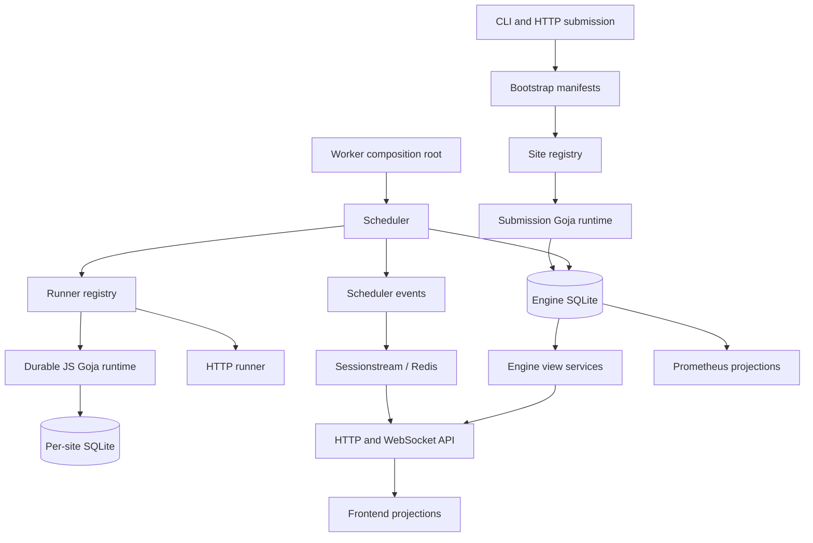
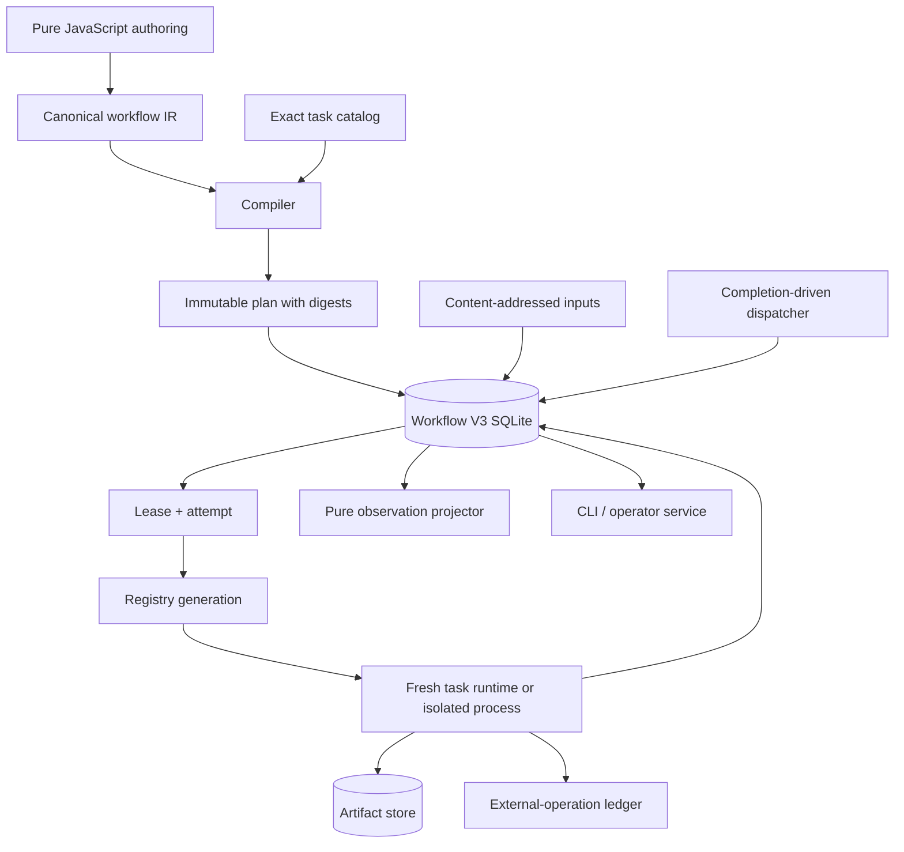
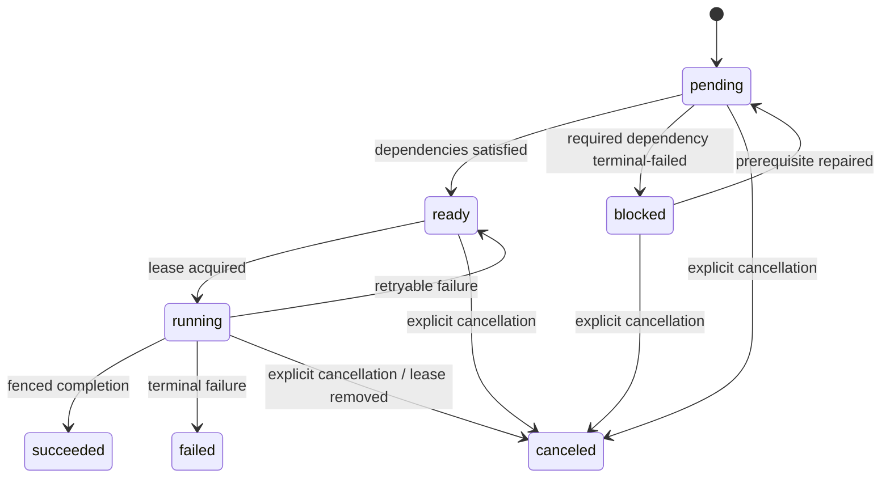
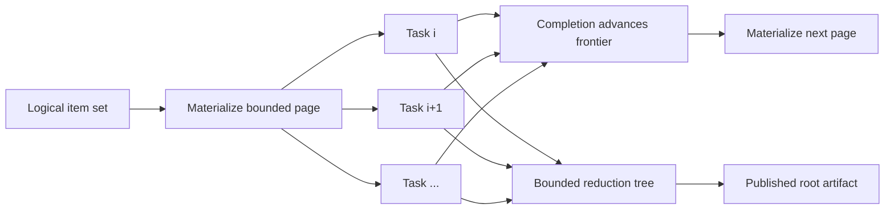

# LLM Codebase Analysis

- URL: https://chatgpt.com/c/6a686ef9-5a88-83ea-a20e-dbd6ed53b7d0
- Created: 2026-07-28T08:57:30.095Z

---

> Look at github.com/go-go-golems/scraper  and https://parc.yolo.scapegoat.dev/note/research/kb/projects/scraper (and links) and do a deep dive analysis of the codebase, which I think might be a bit overengineered and hsa tons of fractal LLM generated patterns, but I want to learn from those patterns and I think they can be analyzed and patterns and architectural concepts and design axes can be extracted from it and conceptualized into useful novel architectural concepts and design patterns and packages that are both pragmatic and innovative. I think that LLMs are now powerful enough to come up with abstractions when coding that don't have names as such, but as we increase our need for higher level of abstractions when designing programs, we should use the opportunity to reverse engineer / analyze the output of LLMs, even when they do things that are too complex@GitHub 
>
> Output as a markdown document in a textbook style.

I’ll trace the repository, tests, history, execution paths, and linked research notes, distinguishing observed structure from inferred patterns before extracting named abstractions, design axes, critiques, and pragmatic package proposals.

<details><summary>💭 Thinking</summary>

**Analyzed Go scraper repository structure and GitHub implementation**

</details>

```json
{"open":[{"ref_id":"https://parc.yolo.scapegoat.dev/note/research/kb/projects/scraper"}],"response_length":"long"}
```

<details><summary>💭 Thinking</summary>

**Searching lablab.ai**

</details>

```unknown
bash -lc python - <<'PY'
import requests
url='https://parc.yolo.scapegoat.dev/note/research/kb/projects/scraper'
r=requests.get(url,timeout=30)
print(r.status_code)
print(r.headers.get('content-type'))
print(r.text[:1000])
PY
```

<details><summary>💭 Thinking</summary>

**Accessed research note via Curl**

**Searched GitHub repositories for site source and scraper notes**

**Investigating repository access**

I’m trying to inspect the repository structure and relevant files. Direct access may be limited, so I’m considering alternate ways to browse the project and identify its packages, files, and implementation details.

**Investigated repository access**

</details>

```json
{"open":[{"ref_id":"https://api.github.com/repos/go-go-golems/scraper/git/trees/main?recursive=1"},{"ref_id":"https://github.com/go-go-golems/scraper"}],"response_length":"long"}
```


---

> you can also clone github.com/go-go-golems/go-go-parc I think, it has lots of articles.

<details><summary>💭 Thinking</summary>

The user wants to include cloning the repository github.com/go-go-golems/go-go-parc, as it contains many articles, for the deep dive analysis.

**Searched 1 website**

</details>

```unknown
bash -lc rm -rf /mnt/data/scraper-analysis && mkdir -p /mnt/data/scraper-analysis && cd /mnt/data/scraper-analysis && git clone --filter=blob:none --no-checkout https://github.com/go-go-golems/scraper.git && git clone --filter=blob:none --no-checkout https://github.com/go-go-golems/go-go-parc.git
```

<details><summary>💭 Thinking</summary>

**Cloned and analyzed scraper repositories**

</details>

```json
{"open":[{"ref_id":"https://github.com/go-go-golems/scraper"},{"ref_id":"https://github.com/go-go-golems/go-go-parc"},{"ref_id":"https://parc.yolo.scapegoat.dev/note/research/kb/projects/scraper"}],"response_length":"long"}
```

I’ll use `go-go-parc` to reconstruct design history while testing whether the Go control-plane/JavaScript behavior-plane boundary, including manifest-driven CLI construction, remains coherent across runtime layers.

<details><summary>💭 Thinking</summary>

**Searched 1 website**

</details>

```json
{"open":[{"ref_id":"https://codeload.github.com/go-go-golems/scraper/zip/refs/heads/main"},{"ref_id":"https://codeload.github.com/go-go-golems/go-go-parc/zip/refs/heads/main"}],"response_length":"short"}
```

<details><summary>💭 Thinking</summary>

**Searching the web**

**Exploring repository access**

I’m finding that the repository isn’t readily available through the current browsing path. I’m considering other ways to inspect its files and history, while avoiding assumptions about the project’s structure.

**Explored repository access capabilities**

</details>

```json
{"search_query":[{"q":"\"https://codeload.github.com/go-go-golems/scraper/zip/refs/heads/main\""},{"q":"\"https://codeload.github.com/go-go-golems/go-go-parc/zip/refs/heads/main\""}],"response_length":"short"}
```

<details><summary>💭 Thinking</summary>

**Searching GitHub repositories and archive access**

**Mapping repository contents**

I’m looking for a reliable way to inventory the project and inspect its implementation. Broad searches or repository browsing may reveal enough files to understand the architecture, even if a complete download isn’t available.

**Mapped repository contents**

**Searched repository packages and documentation**

</details>

```json
{"click":[{"ref_id":"turn884415view0","id":79},{"ref_id":"turn884415view0","id":81},{"ref_id":"turn884415view0","id":83},{"ref_id":"turn884415view0","id":82},{"ref_id":"turn884415view0","id":75}],"response_length":"long"}
```

<details><summary>💭 Thinking</summary>

**Searching the web**

**Searched repository structure and engine code**

</details>

```json
{"open":[{"ref_id":"https://github.com/go-go-golems/scraper/tree/main/pkg"},{"ref_id":"https://github.com/go-go-golems/scraper/tree/main/sites"},{"ref_id":"https://github.com/go-go-golems/scraper/tree/main/web"}],"response_length":"long"}
```

<details><summary>💭 Thinking</summary>

**Searching the web**

**Inspected GitHub repository contents, history, structure, and initial changes**

**Examining architecture**

I’m using the available repository view to identify major components: APIs, execution engines, scheduling, storage, workflows, runtime events, services, site definitions, and frontend pieces. I’m selecting representative files next to understand how these parts connect.

**Examined architecture**

**Analyzed scraper repository architecture and workflow components**

</details>

Current analysis reveals repeated lifecycle models across five planes. I’m treating Workflow V3’s authority-reducing canonical representations and multiplying registries, schemas, projections, and validations as a distinct architectural generation.

<details><summary>💭 Thinking</summary>

**Analyzing Commit History and LLM-Generated Patterns**

**Interacted with GitHub**

**Analyzing repository evolution**

I’m tracing the codebase and its documentation as an evolving architecture rather than a static design. The major themes are workflow durability, resumability, process isolation, typed plans, leases, approvals, and an ongoing simplification effort.

**Assessing architectural patterns**

I’m identifying repeated abstractions across storage, scheduling, workflows, submission, and JavaScript execution. The strongest themes are semantic façade layers, phase-isomorphic runtimes, transactional continuation commits, capability bundles, and serial re-abstraction.

**Analyzed repository evolution and assessed architectural patterns**

**Inspected PR10, Go-Go-PARC, and workflow compiler documentation**

**Inspected workflow schema, runtime logic, authoring patterns, and scraper documentation**

**Analyzed RAG, scraper, and workflow runtime architectures and changes**

**Tracing the architecture**

I’m comparing the stable main branch with the proposed Workflow V3 redesign, while using the project corpus to distinguish durable patterns from temporary complexity and repeated abstraction layers.

**Assessing design maturity**

I’m seeing a progression from durable execution and ergonomic façades toward compiled plans, explicit resource accounting, completion-driven dispatch, and process isolation. The redesign addresses real scaling failures, but also introduces substantial conceptual surface area.

**Naming design patterns**

I’m consolidating the analysis into practical concepts: transactional continuation, lease-fenced commits, identity-digest attachment, commit-then-observe, capability-profile hosts, plan–attempt membranes, and abstraction-budget rules.

**Traced architecture, assessed design maturity, and named design patterns**

</details>

```json
{"open":[{"ref_id":"https://codeload.github.com/go-go-golems/scraper/zip/refs/heads/main"},{"ref_id":"https://codeload.github.com/go-go-golems/go-go-parc/zip/refs/heads/main"}],"response_length":"short"}
```

<details><summary>💭 Thinking</summary>

**Searching github.com**

</details>

```json
{"find":[{"ref_id":"turn630759view0","pattern":"Download ZIP"},{"ref_id":"turn630759view1","pattern":"Download ZIP"}],"response_length":"short"}
```

<details><summary>💭 Thinking</summary>

**Searched 1 website**

</details>

```json
{"open":[{"ref_id":"https://github.com/go-go-golems/scraper/archive/refs/heads/main.zip"},{"ref_id":"https://github.com/go-go-golems/go-go-parc/archive/refs/heads/main.zip"}],"response_length":"short"}
```

<details><summary>💭 Thinking</summary>

**Searching the web**

**Inspected scraper workflow mutation and execution implementations**

</details>

Next, I’m testing V3 against a downstream reset that retained content identity, bounded execution, recovery, and evidence custody while deleting the platform. This sharpens the platform-versus-primitive test.

<details><summary>💭 Thinking</summary>

**Inspected engine storage, fetched metadata, reviewed dependencies, and summarized PR #10 changes**

**Analyzed OCR scraper architecture, articles, and Go dependencies**

</details>

```unknown
bash -lc cat > /mnt/data/fractal-architecture-scraper-deep-dive.md <<'EOF'
# Fractal Abstraction in a Durable Workflow Scraper

## A code-archaeology textbook on `go-go-golems/scraper`, Workflow V3, and the architectural patterns hidden inside LLM-shaped software

**Repository studied:** [`go-go-golems/scraper`](https://github.com/go-go-golems/scraper)  
**Documentary corpus:** [`go-go-golems/go-go-parc`](https://github.com/go-go-golems/go-go-parc), especially the [`scraper` project map](https://github.com/go-go-golems/go-go-parc/blob/b8ae0f7df21ad78ee4c3cfbfa349f911430d2f8c/Research/KB/Projects/scraper.md) and its linked project reports  
**Snapshot date:** 2026-07-28  
**Main snapshot:** `803a28ef4e85eb2c12eea4b2ccc8ff3dd4c2dc27`  
**Workflow V3 snapshot:** open pull request [#10](https://github.com/go-go-golems/scraper/pull/10), head `202229464629e2b6d0e193ff7798b16770b3a270`

---

## Preface: what this book is trying to do

This is not a conventional code review and not a verdict about whether the repository is “good” or “bad.” It is an exercise in **architectural reverse engineering**.

The repository is unusually valuable because it contains several generations of architecture in close succession:

1. an LLM-assisted site-scraping product;
2. a durable job engine underneath that product;
3. a public Go workflow façade over the engine;
4. an event, API, metrics, and frontend observation stack;
5. production hardening for long-running resumable work;
6. a proposed Workflow V3 compiler and runtime that replaces the old system;
7. downstream projects that first adopted that platform architecture and then deliberately rejected it in favor of visible Go control flow.

That sequence gives us more than a static codebase. It gives us an **architecture experiment with its own control group**.

The user’s description—“overengineered,” “fractal,” and possibly shaped by large-language-model generation—is directionally useful, but it must be handled carefully. This analysis does **not** attempt to prove which lines were generated by a model. The commit history and articles establish extensive use of coding agents in the surrounding work, but authorship provenance is not available at line granularity. The phrase **LLM-shaped code** is therefore used morphologically: it describes code that exhibits recursive regularity, eager completion of conceptual taxonomies, many explicit seams, and rapid serial re-abstraction. Humans can produce the same shape.

The more important question is this:

> When a model—or a human working at model speed—generates abstractions faster than a team can name and evaluate them, how do we distinguish durable architectural discoveries from locally coherent overgrowth?

The answer developed here is to analyze four things separately:

- **invariants:** what must remain true for correctness;
- **authority:** which component is allowed to decide or mutate each fact;
- **representations:** how many forms a concept takes while crossing the system;
- **control flow:** whether the architecture hides stable mechanism or hides the application’s actual hypothesis.

From that analysis, this book extracts a pattern language, a set of design axes, several architectural metrics, and a proposed package structure that preserves the repository’s strongest ideas without requiring every consumer to adopt the full platform.

---

# Part I — Reading the repository as architectural history

## 1. Two snapshots, not one codebase

The first fact a reader must hold in mind is that there are two materially different architectures under discussion.

### 1.1 The current `main` branch

At the studied main commit, `scraper` describes itself as a durable workflow-driven scraping engine. Go owns persistence, leases, retries, queue policy, runner hosting, the CLI, and the HTTP API. JavaScript owns site-specific submission verbs, durable operation scripts, and site-specific projections.[^main-readme]

Its main conceptual stack is:



This is both a product and a platform. It contains domain loading, command generation, runtime execution, durable scheduling, API serving, frontend hydration, and observability.

### 1.2 The open Workflow V3 cutover

Pull request #10 is not an incremental refactor. Its description calls it a “complete replacement” and “hard cutover.” It removes the site architecture, old engine, API stack, frontend, runtime-event stack, and metrics stack; it introduces canonical workflow plans, typed task packages, a new SQLite model, exact bundle identities, resource-aware dispatch, process isolation, lazy maps, bounded reductions, budgets, approval gates, observations, and a Researchctl bridge.[^v3-pr]

At the inspected revision, the pull request is open and unmerged. It contains 126 commits, changes 706 files, adds 54,384 lines, and deletes 159,526 lines. Those totals include generated and frontend material and should not be read as a direct complexity score. They do establish that V3 is a product-level replacement, not a package rename.

The V3 stack is:



### 1.3 Why the distinction matters

A common review error would be to describe V3 as if it were already the repository’s shipped architecture, or to criticize main for problems that V3 explicitly addresses. The reverse error would be to treat the open V3 branch as a proven simplification merely because it deletes the old stack.

This book therefore uses these terms:

- **V2/main** — the site-oriented engine plus `pkg/workflow` façade and hardening work at commit `803a28…`;
- **V3/PR** — the proposed replacement at `202229…`;
- **the corpus** — the dated `go-go-parc` reports that explain the pressures, intentions, experiments, and later reversals.

---

## 2. The project’s actual evolution

The project map says that `scraper` evolved from browser- and LLM-assisted extraction into a reusable runtime for restartable and auditable research and document-processing jobs.[^kb] The linked reports make that evolution more concrete.

### 2.1 Stage A: the agent writes reusable scrapers

The earliest linked project describes a roughly 200-line agent harness that gives an LLM six tools and asks it to explore a site, generate reusable Node.js modules, run them, and repair them.[^agent-scraper] The key insight was a change of role:

- bad framing: “scrape this page”;
- productive framing: “write reusable scripts that scrape this page.”

That distinction is already architectural. The model does not merely produce an answer; it produces a reusable program split into fetch, extract, render, and orchestration modules.

The four-file shape appears repeatedly:

```text
site-fetch.js
site-extract.js
site-to-markdown.js
site-run.js
```

This is the first seed of the repository’s later fractality: a useful pipeline is discovered in one application, then progressively reified into manifests, verbs, operations, queues, runners, artifacts, projections, services, and plans.

### 2.2 Stage B: scripts become durable site workflows

The main repository turns those scripts into site packages. A site manifest declares queues, modules, verbs, migrations, and scripts. Bootstrap must load those manifests before the Cobra command tree is constructed because site verbs become CLI grammar.[^main-readme]

The critical shift is from “run a script” to “persist an operation specification that some worker can lease later.” Once work crosses a process boundary, the system needs identities, retries, leases, dependencies, queue policy, and durable results.

### 2.3 Stage C: the scraper engine becomes a general workflow runtime

Book OCR created the pressure to reuse the engine outside site scraping. The OCR report describes a book as a workflow, pages as stable steps, page markdown as artifacts, and operator state as projections.[^ocr]

This produced `pkg/workflow`, a Go-facing façade exposing concepts such as `Runtime`, `Package`, `Entrypoint`, `RunBuilder`, `Executor`, `StepContext`, `ArtifactStore`, and `ProjectionStore`.[^workflow-api]

The intent was reasonable: a book-OCR application should say “discover pages,” “OCR page 47,” and “assemble markdown,” not manually manipulate leases or SQL rows.

A subsequent boundary report then made a second correction: OCR itself should move back out of `scraper`; the runtime should remain workload-independent, and the external OCR application should import the workflow package.[^ocr-extract]

This is an important recurring motion:

```text
concrete application
    -> extract generic mechanism
    -> application leaks into mechanism
    -> restore dependency direction
```

### 2.4 Stage D: the runtime acquires operational truth

Long-running provider work exposed correctness gaps. The hardening report records several concrete failures:

- a stale worker could commit after its lease had expired and been reassigned;
- heartbeats extended from stale copied expiry values;
- `MaxWorkers` did not actually produce concurrent execution;
- dependency failures were represented as cancellation, preventing recovery;
- string-form timestamps could sort incorrectly in SQLite;
- process-local observers could not serve as restart-safe truth.[^hardening]

The July hardening work corrected these with lease fencing, scheduler-owned heartbeats, real concurrent execution, `blocked` as a recoverable state, numeric sortable timestamps, deterministic run attachment, safe post-commit observers, and store-derived snapshots.

This stage matters because it shows that several of the repository’s strongest abstractions were not speculative. They were extracted from failed execution.

### 2.5 Stage E: RAG pressure produces Workflow V3

A real-provider RAG preparation run then exposed two different limits in V2:

1. arbitrary JSON operation inputs allowed a complete source-bearing plan to be duplicated into many rows, producing approximately 14.67 GB of operation-input JSON, a 20.8 GB SQLite file, and a 20.7 GB WAL;
2. fixed scheduler cycles waited for the slowest member of a leased group before replenishing capacity, leaving faster resource classes idle.[^v3-article]

V3 responds with a canonical-plan pipeline, content-addressed artifact references, exact implementation identity, and completion-driven dispatch.

### 2.6 Stage F: downstream convergence, then rejection

The convergence report assigns scientific identity to Researchctl, durable execution to Workflow V3, and RAG semantics to a RAG package. It explicitly deletes alternate schedulers and lifecycle paths so each fact has one owner.[^convergence]

One day later, the clean-slate RAG report explains why that internally coherent architecture was abandoned for experiments. The end-to-end path had become:

```text
JavaScript experiment
  -> RAG DSL
  -> canonical representation
  -> compiler and semantic lowering
  -> Workflow V3 plan
  -> durable workflow runtime
  -> Researchctl run and attempt records
  -> observation projection
  -> analysis specification
  -> published result
```

The replacement makes an experiment an ordinary Go program and shares only stable RAG operations, bounded execution, caching, and evidence custody.[^rag-clean]

This is not evidence that Workflow V3 is wrong. It is evidence that **architectural coherence and consumer proportionality are different properties**.

---

## 3. A first definition of fractal architecture

In this book, **fractal architecture** means that the same structural motif reappears at multiple scales and layers.

In `scraper`, the motif is usually:

```text
Config
  -> Registry
  -> Runtime or Service
  -> Adapter
  -> Durable representation
  -> Projection
  -> Documentation
```

Examples include:

- site manifest → site registry → submission host → operation rows;
- workflow package → executor registry → runtime → scheduler runner;
- scheduler event → runtime event → sessionstream command → backend event → UI event → timeline entity;
- task package → catalog → compiled plan → registry generation → lease → attempt;
- source snapshot → observation projector → metrics/traces/coverage contract.

Fractality is not automatically waste. Repeated form can make a system learnable. It becomes costly when three conditions coincide:

1. adjacent forms are nearly isomorphic;
2. each form has its own vocabulary and lifecycle;
3. common changes must traverse most forms.

The rest of the book will call this the **translation tax**.

---

# Part II — The V2/main architecture, end to end

## 4. The durable model

The V2 core model is compact. It defines workflow IDs, operation IDs, site and queue names, workflow and operation statuses, retry policy and state, queue limits, leases, operation specifications, record writes, artifact writes, structured errors, and operation results.[^model]

The two central records are approximately:

```go
type OpSpec struct {
    ID         OpID
    WorkflowID WorkflowID
    ParentID   *OpID
    Site       SiteName
    Kind       string
    Queue      QueueKey
    DedupKey   string
    Input      json.RawMessage
    DependsOn  []Dependency
    Retry      RetryPolicy
    RetryState RetryState
    Metadata   map[string]string
}

type OpResult struct {
    OpID       OpID
    Data       json.RawMessage
    Records    []RecordWrite
    Artifacts  []ArtifactWrite
    Emitted    []OpSpec
    EmittedIDs []OpID
    Error      *OpError
    CompletedAt time.Time
}
```

Two design choices deserve attention.

First, the operation specification combines **identity**, **routing**, **dependency**, **retry**, and **payload**. That makes it a useful durable unit, but it also means arbitrary payload choices can amplify storage—one of the failures that motivated V3.

Second, an operation result is not merely a return value. It can contain records, artifacts, and newly emitted operations. This is one of the repository’s most valuable ideas and will later be named the **Transactional Continuation Envelope**.

### 4.1 The state machine

The operation lifecycle is:



The distinction between `blocked` and `canceled` is not cosmetic. `blocked` is a derived condition that may disappear when a prerequisite is repaired; cancellation is operator intent. Conflating the two destroys recoverability.

### 4.2 Store ownership

The store interfaces separate workflow creation, operation leasing, results, and status reads. The scheduler asks the store to refresh dependency state, list queue candidates, lease ready work, complete or fail work, and derive workflow state.

The best part of this design is that queue admission and lease acquisition occur transactionally in SQLite. Local scheduling fairness may be implemented in Go, but durable in-flight counts and token-bucket state are checked where the lease is written.

This is an example of a general rule:

> Put correctness at the point where authority is transferred, not in the layer that merely requests the transfer.

---

## 5. The scheduler as an ownership protocol

The scheduler does more than run functions. It coordinates a transfer of temporary authority.

A cycle performs roughly these steps:

1. refresh operation eligibility and reclaim expired leases;
2. list queue candidates;
3. lease work in round-robin passes until local capacity is full;
4. invoke runners concurrently;
5. supervise lease heartbeats;
6. commit success or failure only while the lease remains valid;
7. refresh affected workflow status;
8. notify observers after transitions.

The hardening diff makes the intent explicit: queue policy remains transactional in the store, while round-robin passes prevent an early queue from consuming every local worker slot.[^hardening-commit]

### 5.1 Lease fencing

The completion path begins a transaction and calls `requireCurrentLease` before writing the result, artifacts, emitted operations, or terminal status. Only then does it insert the result, persist artifacts, insert emitted operations, delete the exact lease token, and mark the operation successful.[^complete]

```mermaid
sequenceDiagram
    participant W as Worker
    participant S as Scheduler
    participant DB as SQLite Store

    S->>DB: lease(op, worker, duration)
    DB-->>S: token + expiry
    S->>W: run(op, token)
    loop while running
        S->>DB: heartbeat(token, now)
        DB-->>S: renewed or lease-lost
    end
    W-->>S: result + artifacts + emitted ops
    S->>DB: BEGIN; prove live token
    DB->>DB: write result/artifacts/continuations
    DB->>DB: delete exact lease; mark succeeded
    DB-->>S: COMMIT
```

This is stronger than optimistic “best effort” ownership. A lease token functions as a **fencing token**: it must be presented at publication time, and stale holders lose the right to mutate durable truth.

### 5.2 What fencing cannot do

The engine can prevent a stale worker from publishing an authoritative database transition. It cannot retract an HTTP request already accepted by a provider, reverse an email already sent, or make arbitrary side effects exactly once.

This boundary is correctly acknowledged in the hardening report. Application tasks still need stable idempotency identities for external effects.

### 5.3 Scheduler-owned heartbeats

Heartbeats are owned by the scheduler rather than left to arbitrary runners. That is a good allocation of responsibility: the scheduler owns lease authority, so it should maintain and revoke that authority. When heartbeat renewal fails, the scheduler cancels the runner context and refuses its completion.

This is a broader pattern:

> The component that grants a capability should supervise its lifetime.

---

## 6. Results as transactions, not messages

The V2 completion transaction writes four kinds of fact together:

- the operation’s primary result;
- records intended for projections or domain tables;
- binary artifacts;
- future operations emitted by the current operation.

This means a dynamic workflow does not need a second “enqueue children” transaction after publishing a parent result. Either the parent result and its continuation graph appear together, or neither appears.

### 6.1 The Transactional Continuation Envelope

A generalized form is:

```go
type Completion[T any] struct {
    Value     T
    Records   []RecordMutation
    Artifacts []ArtifactPublication
    Continue  []TaskSpec
}
```

The important property is not the struct. It is the store contract:

```text
validate current authority
    + publish value
    + publish artifacts
    + materialize continuation
    + transition task state
= one durable transaction
```

This pattern is useful when work discovers more work, as in:

- page discovery emitting one OCR task per page;
- a crawler emitting pagination tasks;
- a document parser emitting section tasks;
- a coordinator emitting retries or repairs;
- a batch enumerator emitting item-level work.

It is preferable to a generic event bus when the continuation is part of the task’s correctness rather than merely a notification.

### 6.2 The hidden cost

The same envelope can become a universal dumping ground. V2 allows inline artifact bodies, arbitrary JSON inputs, arbitrary records, and arbitrary emitted operation specifications. The result structure is flexible enough to collapse data plane, control plane, and projection intent into one return object.

The lesson is not to remove the envelope. It is to make each field’s size, authority, and destination explicit.

---

## 7. The public workflow façade

The `pkg/workflow` API was introduced to make the engine embeddable without exposing scheduler and store plumbing. Its public vocabulary is clean:

- `Runtime`
- `Package`
- `Entrypoint`
- `RunBuilder`
- `StepHandle`
- `Executor`
- `StepContext`
- `ArtifactStore`
- `ProjectionStore`

A package entrypoint constructs initial steps. An executor implements a step kind. The runtime registers executors as engine runners and passes initial operations to the scheduler.[^workflow-api]

### 7.1 Why the façade is useful

The façade removes several accidental details from application code:

- lease tokens;
- SQL schemas;
- runner registry construction;
- scheduler configuration;
- result-row encoding;
- operation status transitions.

The OCR report demonstrates that value. Domain code can register `discover-pages`, `ocr-page`, and `assemble-markdown` executors without knowing how the engine leases work.[^ocr]

### 7.2 Why it is also a semantic alias façade

The façade’s public types map almost one-to-one onto engine concepts:

| Workflow vocabulary | Engine vocabulary | Transformation |
|---|---|---|
| run | workflow | mostly rename |
| step | operation | mostly rename |
| executor | runner | adapter |
| `RunBuilder.Step` | construct `model.OpSpec` | field mapping |
| `StepHandle` | `OpID` | wrapper |
| `Runtime` | store + scheduler + runner registry | composition |
| `Result` / `Emit` | `model.OpResult` fields | accumulation |

The code states this directly: `Executor` is the “workflow-native facade” over `runner.Runner`, and `ToRunner` is a thin adapter.[^workflow-executor]

This is not inherently wrong. Names such as “step” may be better for workflow authors than “op.” The issue is that the repository must now carry two complete vocabularies for the same lifecycle.

We will call this a **Semantic Alias Façade**:

> A public layer that improves audience fit primarily by renaming and regrouping an existing model, while preserving nearly the same state transitions and cardinalities.

Its value should be judged by semantic compression, not elegance in isolation.

### 7.3 A revealing abstraction bug

The workflow API report documents a bug in which an entrypoint mutated `builder.workflow`, but `StartRun` persisted the pre-builder variable instead. A one-line reassignment fixed it.[^workflow-api]

This is a small bug with a large lesson. Whenever a façade maintains a shadow representation of an underlying entity, it creates a **synchronization obligation**. The more isomorphic the two representations are, the easier it is to assume they are the same object when they are not.

---

## 8. Site manifests and dynamic grammar

The site system is a plugin architecture whose plugins alter both runtime behavior and CLI syntax.

A site definition includes filesystem roots, script and verb modules, queue policy, and migrations. Bootstrap discovers manifests from configuration, environment variables, and bootstrap flags. Only after discovery does the application construct commands such as:

```text
scraper site <site> run <verb>
```

This is a noteworthy pattern because normal CLI parsing assumes the grammar is known before parsing arguments. Here, arguments help locate the plugins that define the grammar.

### 8.1 Bootstrap-before-parser

The generalized sequence is:

```text
parse a minimal bootstrap language
    -> discover plugins
    -> validate plugin manifests
    -> construct the full command grammar
    -> parse/execute the full command
```

This is useful for:

- plugin-defined commands;
- schema-defined CLIs;
- multi-tenant admin tools;
- compiler drivers with language packs;
- data products where installed modules define operations.

It becomes expensive when users must understand two classes of flags, or when command availability depends on hidden filesystem state. The README itself needs to explain why a command may be absent when the manifest directory was not loaded.[^main-readme]

### 8.2 The deeper design question

The dynamic CLI is only justified if command discoverability is worth coupling plugin loading to process bootstrap. An alternative would be a stable grammar:

```text
scraper site run --site NAME --verb NAME
```

That is less delightful but easier to reason about. This is an example of the design axis **dynamic ergonomics versus static inspectability**.

---

EOF
```

<details><summary>💭 Thinking</summary>

**Created an architectural code archaeology textbook and runtime architecture summary**

</details>

```unknown
bash -lc cat >> /mnt/data/fractal-architecture-scraper-deep-dive.md <<'EOF'
## 24. Exact implementation identity and registry generations

A compiled node binds to an implementation identity, not merely a symbolic operation kind. The store asks a sealed registry to resolve and acquire that exact node. If the current registry cannot satisfy the identity, the node is not leased.[^v3-store-lease]

### 24.1 Registry Generation Pinning

V3’s registry manager supports generations. A lease records the generation under which its task was acquired and holds a release function until execution completes.

> **Registry Generation Pinning** allows a rolling process to load a new implementation set while existing attempts retain the old, exact set until they finish.

This is more precise than global “hot reload.” It is similar to read-copy-update:

```text
new submissions -> newest generation
active lease A  -> generation 17 until release
active lease B  -> generation 18 until release
retired generation -> collect after reference count reaches zero
```

The pattern is useful for:

- plugin servers;
- policy registries;
- model-serving adapters;
- schema translators;
- long-lived jobs crossing deployments.

It is expensive if tasks are short and process restarts are an acceptable upgrade boundary. It should therefore be an optional capability rather than a universal requirement.

---

## 25. Transactional resource admission

V3 combines readiness, dependency checks, reduction and gate checks, budget availability, resource capacity, fairness, exact registry resolution, attempt creation, and budget reservation in the lease transaction.[^v3-store-lease]

The ready-node query excludes nodes whose:

- dependencies have not succeeded;
- required reduction output is not published;
- approval gate is not approved;
- budget claim would exceed a limit;
- resource class has no configured capacity;
- implementation cannot be acquired from the sealed registry.

When a node is selected, the transaction:

1. marks it running;
2. increments its attempt count;
3. creates a random lease token and expiry;
4. records cancellation epoch and registry generation;
5. inserts an append-only attempt row;
6. reserves budget;
7. increments per-run/resource dispatch counters;
8. emits an attempt-started event.

### 25.1 Transactional Resource Admission

> A task is not admitted until every scarce authority it needs has been reserved in the same transaction that grants execution authority.

This prevents a common class of races:

```text
check budget -> context switch -> another worker spends budget -> both start
check capacity -> context switch -> another lease starts -> oversubscribe
resolve plugin -> reload happens -> execute different implementation
```

The general pattern applies to monetary budgets, API quotas, GPU slots, tenant concurrency, licenses, human-review tokens, and external reservations.

### 25.2 The cost of a universal admission query

The V3 leasing query is also a warning. As more optional concepts become core—dependencies, maps, reductions, gates, budgets, capacities, fairness, registries, isolation—the definition of “ready” becomes a cross-product of feature states.

This is the **Admission Predicate Explosion** problem:

> Every new governance feature adds another condition to the central right-to-run predicate and another settlement path to success, retry, failure, cancellation, and recovery.

A modular architecture should keep the core predicate small and allow optional admission modules to contribute claims through a narrow protocol.

One possible abstraction is:

```go
type AdmissionModule interface {
    Evaluate(ctx context.Context, tx Tx, candidate Candidate) (Decision, error)
    Reserve(ctx context.Context, tx Tx, candidate Candidate, attempt Attempt) error
    Settle(ctx context.Context, tx Tx, attempt Attempt, outcome Outcome) error
}
```

The challenge is preserving a single transaction and predictable SQL performance. Modules cannot simply be arbitrary callbacks around a database transaction. A practical implementation may need a declarative claim table or precomputed eligibility view.

---

## 26. Bounded dynamic graph materialization

V2 permits a task to emit arbitrary future operations. V3 retains dynamic work but constrains it through explicit map and reduction constructs.

### 26.1 Lazy maps

A map consumes a set reference, pages through source items, and materializes task nodes with deterministic keys. Policies bound:

- page size;
- maximum item count;
- maximum materialized work ahead of completion.

This is not merely “parallel map.” It is **bounded graph materialization**.

> The graph exists logically, but only a limited frontier is represented as runnable durable nodes.

This prevents a million-item input from immediately becoming a million control rows.

### 26.2 Bounded reductions

A reduction consumes a set or map output and constructs a deterministic fan-in tree. Policy bounds fan-in and maximum levels. Intermediate partitions become durable work, and a root artifact is published only when the reduction completes.

### 26.3 Bounded Dynamic Graph Materialization

The combined pattern is:



This pattern is useful when:

- item count is large or discovered lazily;
- durable per-item retry is required;
- the control database must remain bounded;
- deterministic item identity is possible;
- fan-in itself may fail or need retry.

It is overkill when a process-local bounded worker pool and per-item cache provide sufficient recovery.

---

## 27. Lease-free waiting states

Approval gates are durable objects with policy, version, role, timeout, decision schema, and terminal action. A task that depends on a gate is not runnable until the gate is approved.[^v3-doc]

The gate itself does not need to occupy a worker lease while waiting for a person.

### 27.1 Lease-Free Waiting State

> Represent long waits as durable state transitions, not as sleeping workers or renewable leases.

Examples include:

- human approval;
- delayed payment confirmation;
- external callback;
- legal review;
- maintenance window;
- budget top-up;
- customer response.

This is a strong pattern because lease duration should reflect compute ownership, not business-process latency.

The same idea suggests a general distinction:

| State kind | Representation |
|---|---|
| actively consuming compute authority | lease/attempt |
| waiting for durable fact | gate/subscription/timer row |
| waiting for retry deadline | timestamped pending state |
| waiting for dependency | derived readiness |

---

## 28. External-operation evidence

Task success alone is weak evidence for provider work. A task may call a model several times, retry internally, receive partial usage, or fail after an accepted request.

V3 introduces external operation descriptors, allocations, attempts, completions, usage, and failure records. These are distinct from node output and feed observations and Researchctl evidence.[^convergence]

### 28.1 Evidence-Ledger Side Effect

> An external side effect is represented by a durable semantic identity and a ledger of admission, attempts, completion, usage, and failure—not inferred from task success.

This is useful for:

- model calls;
- payments;
- emails;
- database effects;
- remote batch jobs;
- cloud resource creation;
- licensed operations.

The ledger should record enough to answer:

- what authority was granted?
- what idempotency identity was used?
- was the request accepted?
- what usage was incurred?
- which result or artifact proves completion?
- was failure domain, policy, or infrastructure?

The pattern becomes burdensome if every trivial local function call is promoted to a ledger operation. The boundary should be semantic and economic: external operations are those whose effects or costs remain meaningful outside the task process.

---

## 29. Isolation profiles as executable policy

V3 can execute trusted tasks in process or route restricted tasks through an isolation launcher and worker protocol. A plan node carries an isolation class, policy digest, and executor digest. The attempt records the effective isolation identity.[^v3-doc]

### 29.1 Isolation Identity

A sandbox configuration is part of implementation identity, not merely deployment configuration.

```text
task bytes
+ ABI
+ module set
+ isolation policy
+ isolation executor
= effective executable identity
```

This matters because the same task code under different filesystem, network, environment, or process limits is not operationally equivalent.

### 29.2 When to pay for isolation

Process isolation is justified when:

- task code is untrusted or generated;
- secrets must be withheld;
- resource limits need OS enforcement;
- crashes must not kill the scheduler;
- task dependencies may conflict;
- audit requires an explicit execution boundary.

It is not a free default. It adds serialization, startup, protocol, cancellation, artifact-staging, and debugging costs. An embeddable library should permit trusted in-process execution without importing the entire isolation product.

---

## 30. Pure observations and evidence reconstruction

The V3 observation package reads a stable source snapshot containing run, node, attempt, external-operation, and artifact facts. It derives metrics, traces, coverage, critical path, and lineage. It records derivation version and source digest and does not persist aggregate state.[^v3-observations]

### 30.1 Recomputable Evidence Projection

> Observations are a deterministic function of authoritative execution records, not a second lifecycle database.

```text
ObservationSet = Project(SourceSnapshot, DerivationVersion, Bounds)
```

This has several advantages:

- bug fixes can regenerate observations;
- aggregate drift is avoided;
- privacy boundaries can be audited in one projector;
- coverage can state what was and was not observed;
- a source digest binds the result to evidence;
- retries and overlapping intervals can be handled consistently.

The explicit `Coverage` structure is especially good. A metric without evidence coverage can look more certain than it is.

### 30.2 The boundary of pure derivation

Not every operational signal can be reconstructed perfectly. Fine-grained CPU, memory, network, or queue telemetry may need sampling while a task runs. The pattern does not prohibit telemetry; it distinguishes:

- **authoritative execution facts** — attempts, lease times, failures, usage, artifacts;
- **ephemeral telemetry** — samples that may be lossy;
- **derived evidence** — reproducible interpretations of authoritative facts.

---

## 31. V3’s strongest correction: one product composition root

The V3 product package defines a configuration and constructs one `Application` containing:

```go
type Application struct {
    Config     Config
    Authoring  *AuthoringEnvironment
    Store      *workflowv3sqlite.Store
    Artifacts  *workflowv3.FileArtifactStore
    Registry   *workflowv3runtime.RegistryManager
    Engine     *workflowv3runtime.Engine
    Dispatcher *workflowv3runtime.Dispatcher
}
```

`Open` validates paths and timing, builds the selected task package set, opens the store, creates the artifact store, seals the registry, and constructs engine and dispatcher.[^v3-product]

This fixes the V2 Composition-Root Clone and gives product commands one canonical runtime.

The architectural principle is:

> There may be many adapters and entry points, but only one function should define the production object graph.

---

# Part V — Workflow V3 as a workflow operating system

## 32. The correction is also a centralization

V3 deletes many competing product surfaces, but it centralizes more execution semantics into its core.

Its plan and store understand:

- scalar and set inputs;
- static nodes;
- lazy maps;
- map pages and items;
- bounded reductions and partitions;
- approval gates and consumers;
- budgets, claims, reservations, and settlement;
- task identities and module aliases;
- registry generations;
- resource classes and fairness;
- retries and failure classes;
- cancellation epochs;
- external operations and usage;
- isolation identities;
- content-addressed artifacts;
- event sequences;
- source snapshots and observations.

The SQLite schema is hundreds of lines. The main store implementation is roughly 1,385 lines; the authoring module roughly 802 lines; the compiler roughly 717 lines; and the runtime engine roughly 544 lines in the inspected revision. Line counts are not quality measures. They do reveal that the “minimal runtime” is a substantial execution platform.

### 32.1 Workflow Operating System

A useful name is **Workflow Operating System**:

> A durable runtime that does not merely schedule tasks but owns executable identity, resource admission, dynamic graph memory, effect accounting, isolation, human waiting, artifact custody, and evidence derivation.

This architecture is appropriate when the runtime must be the common execution substrate for several independently authored domains and when those domains require consistent governance.

It is not a neutral library. It imposes an operating model.

### 32.2 The platform threshold

A full workflow operating system is justified when several of these conditions hold:

- runs survive deployments and machine restarts;
- multiple workers or processes compete for work;
- code versions coexist;
- tasks are untrusted;
- external effects are expensive or regulated;
- resource classes must remain saturated independently;
- very large dynamic graphs must be materialized incrementally;
- humans intervene mid-run;
- budgets need atomic reservation and settlement;
- evidence must be exported to another control plane;
- multiple domains share these requirements.

Below that threshold, smaller durability primitives are likely better.

---

## 33. Feature interaction is the real complexity

It is tempting to count V3 features independently. The dominant cost is their interaction.

Consider cancellation:

- invalidate active leases with a cancellation epoch;
- settle or release budget reservations;
- mark attempts canceled;
- cancel pending and running nodes;
- cancel map expansions;
- cancel reduction partitions and roots;
- cancel waiting gates;
- reconcile external-operation state;
- preserve append-only evidence;
- prevent stale isolated workers from publishing.

Consider retry:

- determine domain versus infrastructure failure;
- preserve attempt history;
- apply deterministic backoff;
- settle budget conservatively, actually, or by release;
- retain implementation generation;
- recheck gate and reduction dependencies;
- avoid duplicate external effects;
- derive retry-aware observations.

The architecture’s complexity grows closer to:

```text
O(number of features × number of terminal transitions)
```

than to the simple sum of feature implementations.

This is why optional capabilities should be designed around a small common transition algebra.

---

## 34. The monolithic transactional store trade-off

Concentrating authority in one SQLite store is a correctness improvement over scattered direct SQL. It also creates a large unit that knows every feature.

### 34.1 Advantages

- one transaction boundary;
- one interpretation of state;
- atomic lease, budget, and attempt transitions;
- easier stale-authority fencing;
- stable snapshots;
- fewer service-layer races;
- simple deployment for one-machine or modest multi-process use.

### 34.2 Costs

- a large schema-level change surface;
- feature interactions encoded in complex SQL;
- difficult alternative-store implementations;
- tests must cover a combinatorial transition matrix;
- optional features become durable schema commitments;
- package boundaries may hide conceptual coupling without removing it.

### 34.3 Transactional kernel, modular policy

A more scalable conceptual split is:

```text
transactional kernel
    owns: run, node, attempt, lease, fence, output reference, event sequence

optional policy modules
    own: budget claims, gates, dynamic expansion, isolation metadata, effects

product profile
    selects which modules are active
```

The kernel must still settle modules atomically. The key is that the kernel should depend on a small claim-and-settlement protocol, not know every module’s domain vocabulary.

---

## 35. Canonical compilation can become a second language

V3 compiles a JavaScript builder into canonical IR and then into a plan. That gives excellent reviewability and identity. It also means every form of control flow must exist in the workflow language.

A general workflow language tends to grow:

```text
linear dependency
-> condition
-> map
-> reduction
-> retry
-> gate
-> budget
-> timer
-> callback
-> subworkflow
-> compensation
-> stream
-> loop
-> partial failure policy
```

The compiler becomes a language implementation, and application innovation becomes language evolution.

### 35.1 Control-flow capture threshold

A useful rule is:

> Capture control flow in a durable plan only when the runtime must inspect, govern, resume, or distribute that control flow independently of the authoring process.

Otherwise, leave control flow in the host language and make expensive operations durable individually.

This rule is the bridge to the downstream RAG reset.

---

# Part VI — The clean-slate RAG counterexample

## 36. Why the coherent platform was rejected

The clean-slate RAG project explicitly says that the earlier combined system was internally coherent. Its objection was proportionality: changing a chunk boundary or fusion weight should not require edits across a language API, compiler, workflow schema, execution runtime, persistence model, and analysis layer.[^rag-clean]

The replacement optimization target is the time between:

```text
forming a retrieval hypothesis
    -> running it
    -> inspecting evidence
```

The governing rule is:

> Share operations and safety primitives; do not share experiment control flow until repeated evidence proves a stable need.

### 36.1 Visible control flow as a feature

In research software, the orchestration sequence often expresses the hypothesis:

```go
chunks := chunker.Split(documents)
representations := summarize(chunks)
embeddings := embed(representations)
index := buildIndex(embeddings)
hits := retrieve(index, queries)
reranked := rerank(hits)
answers := generate(reranked)
metrics := evaluate(answers, truth)
```

Turning that sequence into nodes and edges can make it less—not more—understandable because the experimenter now reads a representation of the program instead of the program.

The clean-slate report accepts local repetition when repetition keeps factors and measurements visible.

### 36.2 Mechanism/Control-Flow Separation Rule

The follow-up simplification report gives a concrete extraction test:[^rag-simplify]

1. Can the contract be described without the domain’s nouns?
2. Do at least two concrete consumers require it?

If both answers are yes, the mechanism may become a focused generic package. If the behavior chooses experiment arms, stage order, artifact naming, or failure policy, it stays in the experiment program.

This is one of the strongest architectural rules in the corpus.

---

## 37. What the RAG project kept

Rejecting Workflow V3 did not mean returning to a fragile script. The plain-Go design kept focused mechanisms:

- bounded ordered parallel map;
- independent worker, rate, and finite-budget controls;
- cache-first admission;
- per-item durable cache publication;
- batching that does not change the recovery unit;
- content digests and semantic cache keys;
- strict JSON and atomic filesystem writes;
- experiment directories with terminal status and inspectable artifacts;
- domain-specific validation around provider results.[^rag-simplify]

### 37.1 Cache-first authority

The key order is:

```text
derive semantic key
    -> look up completed value
    -> on hit: return without budget authority
    -> on miss: acquire budget/rate authority
    -> perform work
    -> validate
    -> atomically store one item
```

A zero budget may still replay already purchased work. This is a subtle but powerful separation:

- **authority to read evidence** is not the same as
- **authority to perform new expensive work**.

### 37.2 Recovery unit versus execution unit

Providers may execute a batch, but recovery remains per item. A successful batch publishes each item under its own semantic key. If item 1,999 of 2,000 fails later, completed items remain reusable.

This gives us another design axis:

| Concept | Possible unit |
|---|---|
| scheduling unit | run, stage, batch, item |
| provider call unit | batch |
| budget unit | item, token, request |
| cache/recovery unit | item |
| artifact unit | item or stage |
| scientific result unit | query, case, run |

Good architecture does not assume these units must be identical.

---

## 38. A three-tier execution model

The combined evidence suggests three useful tiers rather than one universal runtime.

### Tier 1 — Recoverable function execution

Use when control flow should remain ordinary Go or JavaScript.

Capabilities:

- bounded concurrency;
- rate and budget admission;
- semantic cache keys;
- per-item atomic persistence;
- artifact directory;
- strict validation;
- explicit terminal status.

### Tier 2 — Minimal durable task graph

Use when work must survive process restart or be shared by workers.

Add:

- immutable task specifications;
- dependencies;
- leases and heartbeats;
- attempts and deterministic retries;
- fenced completion;
- content-addressed outputs;
- cancellation epoch;
- store-derived snapshots;
- transactional continuation.

### Tier 3 — Governed workflow operating system

Use when platform-level governance is required.

Add selectively:

- canonical compiled plans;
- exact bundle identity and registry generations;
- heterogeneous resource dispatch;
- bounded dynamic maps and reductions;
- approval gates;
- atomic budget reservation and settlement;
- external-operation evidence ledger;
- process isolation;
- canonical observations and control-plane integration.

The mistake is not building Tier 3. The mistake is making Tier 3 the minimum entry price for Tier 1 problems.

---

EOF
```

<details><summary>💭 Thinking</summary>

**Appended registry, resource, and pattern language sections and checked progress**

</details>

```unknown
bash -lc cat >> /mnt/data/fractal-architecture-scraper-deep-dive.md <<'EOF'
# Part VIII — Design axes for future systems

Patterns describe recurring structures. Design axes describe choices that cannot be universally optimized. The `scraper` corpus is especially useful because it explores both ends of many axes.

## 58. Axis: visible control flow versus declarative plan

### Visible control flow

```go
for _, query := range queries {
    hits := retrieve(query)
    reranked := rerank(hits)
    record(evaluate(query, reranked))
}
```

Strengths:

- direct debugging;
- familiar language tools;
- easy local variation;
- experiment hypothesis remains visible;
- low translation depth.

Weaknesses:

- runtime cannot inspect future work;
- restart often needs explicit checkpoints;
- distributed scheduling is harder;
- policy may be scattered through code.

### Declarative plan

```javascript
workflow.define("study", p => {
  const hits = p.task("retrieve", { query: p.input("query") });
  const ranked = p.task("rerank", { hits });
  p.output("result", ranked.output("result"));
});
```

Strengths:

- canonical identity;
- preflight validation;
- runtime governance;
- distributed execution;
- reviewable graph.

Weaknesses:

- language and compiler maintenance;
- control-flow capture threshold;
- higher debug distance;
- application changes become schema changes.

### Decision rule

Prefer a plan when the runtime must reason about or govern the control flow independently. Prefer visible code when the control flow is still the thing being discovered.

---

## 59. Axis: dynamic continuation versus precompiled graph

### Dynamic continuation

A task can emit arbitrary successor tasks. This supports discovery-driven workflows and simple application code.

Risks:

- graph size is unknown;
- global validation is limited;
- continuation payloads may grow without bound;
- implementation identity may be chosen late;
- runaway recursion is possible.

### Precompiled graph

All nodes and dependencies are known at submission.

Benefits:

- exact review and identity;
- global cycle and schema validation;
- predictable capacity planning.

Limits:

- cannot represent large or data-dependent work without a higher-order construct.

### Middle position

V3’s maps and reductions are a useful middle position: compile the **expansion policy**, not every item. This is often the right design for large bounded fan-out.

---

## 60. Axis: flexible JSON payloads versus typed artifact references

### Flexible JSON

Good for:

- rapid prototyping;
- small control inputs;
- language-neutral APIs;
- low ceremony.

Risks:

- source payload enters control rows;
- schema changes are implicit;
- identity is ambiguous;
- duplicate data amplification;
- sensitive fields are easy to persist accidentally.

### Typed artifact references

Good for:

- large or sensitive payloads;
- content identity;
- cache reuse;
- bounded control rows;
- cross-process staging.

Costs:

- artifact service and garbage collection;
- media/schema registries;
- staging and path validation;
- harder ad hoc inspection.

### Decision rule

Use inline JSON for small, bounded, policy-like control data. Use immutable references for payloads whose size or sensitivity depends on user data.

---

## 61. Axis: symbolic kind identity versus exact executable identity

### Symbolic identity

```text
kind = "embed"
version = "v1"
```

Advantages:

- easy development;
- simple registration;
- human-readable;
- process restart is enough for upgrades.

Risks:

- two deployments may implement “v1” differently;
- transitive module changes are invisible;
- retries may run new code.

### Exact identity

```text
kind + version + bundle digest + entrypoint + ABI + modules + isolation digest
```

Advantages:

- reproducible attempts;
- rolling coexistence;
- auditability.

Costs:

- bundle production and registry management;
- stronger deployment coupling;
- more identifiers in plans and rows.

### Decision rule

Use exact identity when runs cross deployments, results are compared scientifically, or code executes in multiple trust domains. Symbolic identity is sufficient for local short-lived tools where process restart defines the version boundary.

---

## 62. Axis: central durable scheduling versus cache-first recovery

### Central scheduler

Use when:

- work must be claimed across processes;
- dependencies and retries need operator visibility;
- workers can fail independently;
- resource admission must be global.

### Cache-first recovery

Use when:

- one process owns orchestration;
- expensive operations are deterministic enough to key semantically;
- recovery can skip completed items;
- explicit Go control flow is valuable.

### Hybrid

A workflow task may run a cache-first per-item loop internally. The workflow unit can be a coarse stage while the cache is the fine recovery unit. This avoids materializing every item as a scheduler node while preserving restart value.

---

## 63. Axis: control-plane centralization versus domain-owned orchestration

### Centralization

A workflow operating system owns maps, reductions, retries, budgets, gates, effects, and evidence.

Advantages:

- consistent governance;
- one operator model;
- shared implementation effort;
- strong global invariants.

Costs:

- domain concepts must be lowered into platform primitives;
- platform release cadence gates experiments;
- central schema accumulates features.

### Domain-owned orchestration

Each application owns stage order and recovery policy, while importing narrow mechanisms.

Advantages:

- control flow matches domain reasoning;
- low translation depth;
- experimentation is fast.

Costs:

- repeated orchestration code;
- inconsistent operator semantics;
- cross-domain governance is harder.

### Decision rule

Centralize mechanisms whose correctness must be uniform. Keep sequencing and policy in the domain until two or more consumers demonstrate the same semantics.

---

## 64. Axis: one authoritative store versus polyglot projection stores

### One store

Advantages:

- simple transactions;
- fewer deployment units;
- easier backups;
- clear truth.

Costs:

- domain query schemas pollute control schema;
- large payloads and indexes compete with scheduler work;
- migrations become coupled.

### Projection islands

Advantages:

- domain-owned views;
- query optimization;
- independent lifecycle.

Costs:

- eventual consistency;
- replay and repair;
- more operational surfaces.

### Decision rule

Keep command authority in one store. Add projection stores only for query shapes that cannot be served safely or economically from authoritative snapshots, and define replay from day one.

---

## 65. Axis: process-local observer versus reconstructable evidence

### Process-local observer

Best for:

- logging;
- live progress;
- low-latency metrics;
- debugging.

Not suitable as sole truth for:

- restart-safe status;
- audit;
- final scientific metrics;
- billing.

### Reconstructable evidence

Best for:

- terminal reports;
- retry-aware metrics;
- lineage;
- cross-run analysis.

Costs:

- source snapshot design;
- projector versioning;
- some telemetry cannot be recovered.

### Decision rule

Use observers for immediacy and snapshots/projectors for authority. Never make a process-local observer a prerequisite for correctness.

---

## 66. Axis: generic interface versus concrete package

Interfaces are often added early in LLM-generated code because they make the architecture look complete. The correct question is not “could this vary?” but “what variation must the caller own?”

Prefer a concrete type when:

- there is one implementation;
- implementation choice is not part of caller policy;
- tests can use real lightweight infrastructure;
- the interface would mirror every method.

Prefer an interface when:

- two implementations have meaningfully different semantics;
- a process/network boundary exists;
- the caller chooses policy;
- a test substitute models a real external dependency;
- package dependency direction requires a narrow port.

The repository’s store, artifact, projection, dependency-resolver, and task-registry abstractions occupy different points on this axis. They should not be evaluated by one blanket “interfaces are good/bad” rule.

---

## 67. Axis: soft migration versus hard cutover

### Soft migration

- adapters coexist;
- consumers move gradually;
- risk is distributed;
- duplicate authority may persist.

### Hard cutover

- old paths are deleted;
- vocabulary and dependencies simplify;
- migration risk concentrates;
- consumers need proof before merge.

V3 chooses a hard cut because the old and new engines would otherwise compete for lifecycle ownership. That is a defensible decision. The review criterion is whether downstream cutover evidence is complete and whether the replacement’s minimum product surface remains proportionate.

---

## 68. Axis: trusted in-process tasks versus isolated workers

| Property | In process | Isolated process |
|---|---|---|
| startup cost | low | higher |
| data transfer | direct | serialized/staged |
| crash containment | weak | strong |
| resource enforcement | limited | OS-level possible |
| secret withholding | difficult | explicit |
| debugging | simpler | more layers |
| dependency conflicts | shared process | isolated |
| exact environment identity | weaker | stronger |

A product should make this a plan or deployment choice rather than force all tasks through the most expensive mode.

---

## 69. Axis: broad product package versus capability modules

V3’s product package centralizes construction, which is good. The risk is that selecting the product implicitly selects every feature.

A better profile system is:

```go
type Profile struct {
    Core       bool
    DynamicMap bool
    Reduction  bool
    Gates      bool
    Budgets    bool
    Effects    bool
    Isolation  bool
    Observe    bool
}
```

Profiles might be:

- `LocalRecoverable`
- `DurableSingleMachine`
- `DistributedTrusted`
- `GovernedIsolated`

Feature selection should affect registered modules and migrations explicitly. It should not create incompatible meanings for core rows.

---

## 70. Axis: application-specific duplication versus premature platform reuse

The RAG reports make this tension explicit. Duplication can be informative when two experiments differ in stage order, artifact shape, or failure policy. Extracting a framework too early erases those differences before they have been understood.

A useful progression is:

```text
first implementation: concrete
second implementation: compare
third implementation: extract only the stable intersection
```

An LLM can generate the third step immediately, but it cannot manufacture evidence that the intersection is stable. The human role shifts from code production to **evidence governance**.

---

# Part IX — Quantitative heuristics for abstraction review

The following metrics are not scientific measurements. They are review prompts that make architectural cost visible.

## 71. Semantic Compression Ratio

Defined earlier as:

```text
SCR = stabilized decisions / introduced public concepts
```

Review questions:

- Which decisions does a caller no longer need to make?
- Are defaults enforced or merely documented?
- Does the abstraction reduce legal states?
- Does it hide a protocol or only rename nouns?

Low-SCR layers are candidates for collapse or code generation.

---

## 72. Translation Depth

```text
TD = semantic representation boundaries from intent to effect
```

Count only boundaries that transform meaning, not ordinary function calls.

For each boundary, record its proof:

| Boundary | Added property |
|---|---|
| JS builder → IR | data-only canonical form |
| IR → plan | exact task binding and validation |
| plan → store | durable identity |
| store → attempt | execution authority |
| attempt → observation | privacy-safe evidence |

A boundary with no added property is likely accidental translation.

---

## 73. Authority Fan-Out

```text
AFO(fact) = independent modules that may authoritatively mutate the fact
```

Targets:

- run status: 1;
- task status: 1;
- budget balance: 1;
- gate decision: 1 command authority, possibly many authorized callers;
- UI projection: many writers are acceptable only if idempotent and derived.

In V2, operator SQL increases AFO for workflow and operation status. V3 reduces AFO by centralizing transitions in the store.

---

## 74. Representation Multiplicity

```text
RM(fact) = maintained representations of the same semantic fact
```

For each representation, classify:

- authoritative;
- transport;
- derived;
- cached;
- display-only.

Every form should have one directional source. Cycles—UI update writing back into a projection that informs the store—need special scrutiny.

---

## 75. Change Surface Index

```text
CSI(change) = packages, schemas, and processes touched by one ordinary feature change
```

Example change: add a new task failure class.

Potential surfaces:

- core enum;
- SQLite schema;
- store transitions;
- scheduler mapping;
- protobuf event;
- sessionstream event;
- API type;
- UI type;
- metrics label;
- observation contract;
- documentation.

A high CSI is not always avoidable. Generated mappings and canonical schemas can reduce manual CSI.

---

## 76. Recovery Unit Ratio

```text
RUR = execution batch size / durable recovery unit size
```

Examples:

- provider batch of 100, cache per item: `RUR = 100`;
- one workflow node per batch and no item cache: `RUR = 1` but recovery repeats 100 items;
- one task per item: `RUR = 1`, with higher scheduler overhead.

This metric forces an explicit choice instead of assuming scheduler node, provider request, and cache item are the same unit.

---

## 77. Optionality Utilization

```text
OU = seams with demonstrated variation / total maintained seams
```

A seam counts as used when there are multiple implementations, consumers, trust domains, or persisted versions. Low utilization suggests an optionality tax.

This metric should be applied over time. A new architecture may temporarily have low utilization while a committed migration is underway.

---

## 78. Boundary Proof Strength

Rank a boundary by how strongly it enforces its claim:

| Level | Enforcement |
|---:|---|
| 0 | naming convention |
| 1 | documentation |
| 2 | type/API shape |
| 3 | validation at entry |
| 4 | transaction or capability enforcement |
| 5 | cryptographic/content identity plus transaction/capability enforcement |

Examples:

- “do not put source text in metadata” is Level 1;
- `ArtifactRef{Digest, Size, Locator}` validated on staging is Level 4–5;
- “worker should stop after cancellation” is Level 2–3 with context;
- fenced completion with token and cancellation epoch is Level 4;
- exact bundle digest and registry generation approach Level 5.

The strongest parts of V3 raise important boundaries from convention to proof.

---

## 79. Abstraction Debt Ledger

For each abstraction, record:

```text
name
problem that caused it
first concrete consumer
second concrete consumer
invariant enforced
representations introduced
authority added or removed
known deletion condition
```

The final field is critical. An abstraction without a deletion condition tends to become permanent even if its original problem disappears.

---

EOF
```

<details><summary>💭 Thinking</summary>

**Designed future system axes and drafted pragmatic package architecture**

</details>

```unknown
bash -lc cat >> /mnt/data/fractal-architecture-scraper-deep-dive.md <<'EOF'
# Part XII — Mining architectural concepts from LLM-shaped code

## 101. Code generated at model speed is an architecture search trace

Traditional architecture often begins with named patterns and produces code. Agentic development often reverses the order:

```text
prompted local problem
    -> plausible code structure
    -> repeated adaptation
    -> unnamed recurring form
    -> later conceptualization
```

This changes the analyst’s job. The codebase may contain several partial solutions to the same abstract problem before anyone has named the problem.

A useful mental model is:

> An LLM-assisted repository is not only an implementation. It is a sampled search tree over possible abstractions, with branches preserved as packages, adapters, migrations, and articles.

The task is not to accept the deepest branch. It is to identify which invariants recur across branches.

---

## 102. Common morphological tendencies

The following tendencies are hypotheses about code produced under high-speed generative assistance. They are not claims about the provenance of every file in `scraper`.

### 102.1 Symmetry completion

Once one lifecycle phase has `Config`, `Registry`, `Runtime`, and `Service`, a model tends to complete the same taxonomy for adjacent phases. This creates readable local symmetry and potentially redundant global layers.

### 102.2 Taxonomy saturation

A concept that could remain a field or function becomes a named interface, builder, descriptor, registry, policy, result, and report. The taxonomy feels complete before usage proves that each category varies independently.

### 102.3 Boundary optimism

Models are good at adding seams that *could* support future implementations. They do not possess project-specific evidence that the variation will occur. This leads to Optionality Shells.

### 102.4 Narrative consistency

When code and documentation are produced together, the architecture acquires a coherent story quickly. The story can be valuable, but coherence may exceed empirical validation. A beautifully explained layer can still be disproportionate.

### 102.5 Local proof, global accumulation

A model can thoroughly handle retries, cancellation, metrics, tests, docs, and adapters for one feature. Repeating that thoroughness across features creates a large interaction surface.

### 102.6 Fresh-name bias

A new package often receives a new vocabulary rather than reusing an imperfect existing one. This improves local semantics and increases translation depth.

### 102.7 Refactor-by-envelopment

It is safer for an agent to wrap old code than to delete it. Therefore façades, compatibility adapters, and duplicated composition roots accumulate until a human explicitly requests a hard cut.

These tendencies explain why “fractal” is a useful observation: the model repeatedly completes the same architectural grammar at each scale.

---

## 103. The architectural archaeology protocol

### Step 1 — Establish dated snapshots

Record:

- default branch commit;
- open replacement branches and pull requests;
- latest merged hardening work;
- associated reports and their dates;
- which descriptions are current, proposed, or retrospective.

This prevents prospective documentation from being mistaken for shipped behavior.

For `scraper`, the distinction between main and open PR #10 is essential.

### Step 2 — Inventory nouns

Extract public type, package, table, event, and command names.

Example clusters:

```text
workflow, run
operation, op, step, node, task
runner, executor, implementation
result, output, artifact, record
observer event, runtime event, command, backend event, UI event, entity
```

Build a synonym graph. Near-synonyms often reveal Semantic Alias Façades or migrations in superposition.

### Step 3 — Inventory verbs

Find functions that create or mutate durable state:

```text
CreateRun
CreateWorkflow
LeaseReadyOp
LeaseNextWithResources
CompleteOp
Complete
FailOp
Fail
RetryOp
CancelWorkflow
ApproveGate
ReserveBudget
```

Verbs reveal authority more reliably than package diagrams.

### Step 4 — Trace one lifecycle end to end

Choose one representative run and follow:

```text
user input
-> authoring/submission
-> durable specification
-> lease
-> execution context
-> result publication
-> continuation
-> operator read model
-> metrics/report
```

Record each representation and transaction boundary.

### Step 5 — Build the authority topology

For every fact, mark:

- creators;
- mutators;
- validators;
- readers;
- derived projections.

Multiple readers are normal. Multiple authoritative mutators are a warning.

### Step 6 — Detect phase isomorphism

Compare adjacent packages structurally:

- do both build the same VM?
- do both have `Config`, `Request`, `Result`, and `State`?
- do both parse the same maps?
- do two services open the same databases and construct the same runners?
- do event envelopes repeat fields?

Isomorphism suggests either a shared kernel or an unnecessary duplicate phase.

### Step 7 — Read tests before prose conclusions

Tests reveal which properties are considered important enough to enforce. In workflow systems, seek tests for:

- stale completion rejection;
- lease renewal and cancellation;
- restart attachment;
- concurrent scheduling;
- retry and blocked-state repair;
- artifact path and digest validation;
- deterministic compilation;
- registry mismatch;
- budget settlement;
- projection replay.

An abstraction with extensive invariant tests is more likely to encode real correctness than one supported only by builders and docs.

### Step 8 — Read incident-sized data

Look for reports with actual volumes, latency, cost, or failure modes. The V3 RAG report’s database and WAL sizes are much stronger evidence than a generic claim that artifact references are cleaner.

### Step 9 — Follow consumers, including rejection

The best test of a generic package is a downstream consumer. The best test of overreach is a consumer that removes it and explains why.

The RAG clean-slate reports are therefore as important as the V3 implementation.

### Step 10 — Perform counterfactual deletion

For each layer, ask:

- What invariant fails if this package disappears?
- Can the invariant live in a lower layer?
- Is the package translating or deciding?
- Does a consumer use the seam independently?
- Would a direct function call be clearer?

If deletion changes names but not behavior, the layer may be a low-SCR façade.

### Step 11 — Name the recurring form

A good pattern name should identify behavior and force, not implementation fashion.

Weak name:

```text
Workflow Manager Factory
```

Stronger name:

```text
Lease-Fenced Effect Commit
```

The stronger name says what correctness property the structure delivers.

### Step 12 — Falsify the pattern

Before publishing a new pattern, seek a counterexample:

- Does it appear in more than one subsystem?
- Is it merely an instance of a known pattern?
- Does the name improve design decisions?
- What context makes it harmful?
- Can its consequences be predicted?

A pattern without a failure mode is usually a slogan.

---

## 104. Abstraction stratigraphy

Commit history can be read like geological layers.

### Layer 1 — concrete product behavior

Site scripts, DOM extraction, site manifests.

### Layer 2 — durable mechanism

Operations, queues, leases, retries, result storage.

### Layer 3 — reuse façade

Workflow packages, steps, executors, artifacts, projections.

### Layer 4 — operational surface

Events, sessionstream, API, frontend, metrics.

### Layer 5 — correctness hardening

Fencing, heartbeats, blocked state, sortable timestamps, snapshots.

### Layer 6 — canonical platform replacement

V3 IR, compiler, exact registry, maps, reductions, gates, budgets, isolation, observations.

### Layer 7 — consumer simplification

Plain-Go experiments, cache-first recovery, narrow execution primitives.

This sequence suggests a general method:

> The oldest recurring invariant across several layers is a better extraction candidate than the newest public abstraction.

In `scraper`, the oldest recurring invariants are:

- stable task identity;
- durable result publication;
- retryable work;
- dependency-aware continuation;
- artifact custody;
- operator inspection.

Maps, gates, and Researchctl integration are newer and should remain more optional.

---

## 105. Narrative-first architecture

The `go-go-parc` corpus is unusually detailed. Articles explain design goals, code paths, incidents, and intended boundaries close to the time of implementation.

This is a strength. It also creates a distinct architectural mode.

### 105.1 Prospective architecture documents

Some reports describe a target state, not only the current code. The workflow API report, OCR extraction report, convergence report, and V3 report all function partly as implementation plans.

We can call this **Narrative-First Architecture**:

> A coherent technical narrative is produced early and acts as a scaffold that code generation then fills in.

Benefits:

- agents receive a stable conceptual target;
- large migrations remain legible;
- design rationale is preserved;
- terminology becomes consistent quickly;
- gaps can be turned into tickets.

Risks:

- prose coherence can mask unfinished invariants;
- readers may confuse proposal with shipped state;
- the narrative creates pressure to complete every named layer;
- code may optimize for fitting the article rather than simplifying the product.

### 105.2 Documentation status discipline

Every architecture document should state:

```text
status: proposal | implementation report | current reference | retrospective
repository commit or PR
known deviations
superseding documents
```

The scraper project map already provides dates and links; adding exact code revisions to every report would make the corpus an even stronger architecture record.

---

## 106. Using LLMs to analyze their own abstractions

LLMs are useful not only for generating code but for comparing structural repetition at scale.

### 106.1 Noun and synonym extraction prompt

```text
List all public lifecycle nouns in these packages. Group synonyms and near-synonyms.
For each group, identify whether the types differ in state space, invariants, authority,
or only audience vocabulary. Cite constructors and transitions.
```

### 106.2 Authority audit prompt

```text
For the fact <task status>, find every function and SQL statement that can mutate it.
Classify each as authoritative, derived, migration-only, or test-only. Produce a state
transition table and identify transitions implemented in more than one package.
```

### 106.3 Phase-isomorphism prompt

```text
Compare these two runtime packages structurally. Ignore names. Align configuration,
startup, capability injection, invocation, async handling, result decoding, cancellation,
and shutdown. Propose the smallest shared kernel that preserves different authority.
```

### 106.4 Abstraction deletion prompt

```text
Assume package X is removed. Rewrite the main call path using its dependency directly.
List lost invariants, lost ergonomics, and duplicated code. Do not argue from naming;
argue from behavior and tests.
```

### 106.5 Consumer proportionality prompt

```text
Given consumer Y's concrete requirements, mark every platform capability as required,
useful, irrelevant, or harmful. Estimate translation depth and ordinary change surface.
Propose the smallest profile that preserves required recovery and evidence.
```

These prompts force models away from aesthetic praise and toward authority and proof.

---

## 107. Architectural provenance records

Agentic development benefits from recording why an abstraction exists.

A lightweight YAML record can accompany a package:

```yaml
name: lease-fenced-completion
introduced_for:
  - stale worker committed after lease reassignment
first_consumer: scraper-v2
second_consumer: workflow-v3
invariants:
  - only live lease token may publish
  - cancellation epoch fences old attempts
proof:
  - transactional WHERE predicates
  - stale completion tests
optional: false
deletion_condition: none; core durability invariant
```

For a speculative layer:

```yaml
name: timeline-entity-envelope
introduced_for:
  - reserve UI projection evolution seam
first_consumer: scraper-web
second_consumer: null
invariants:
  - none distinct from ui-event yet
optional: true
deletion_condition:
  - collapse if no independent schema or retention rule by next major version
```

This turns optionality into an explicit bet rather than an invisible permanent cost.

---

## 108. The human role in high-abstraction agentic coding

When code generation is expensive, humans spend effort implementing abstractions. When code generation becomes cheap, the scarce work shifts to:

- selecting authority boundaries;
- demanding evidence for genericity;
- deciding which representations are canonical;
- defining deletion conditions;
- controlling vocabulary;
- choosing the recovery unit;
- determining which control flow must remain visible;
- evaluating proportionality across consumers.

The human architect becomes less a producer of scaffolding and more a curator of **semantic commitments**.

A concise rule is:

> Let models generate candidate structure. Require humans and production evidence to grant permanence.

---

# Part XIII — Evaluation of the repository

## 109. What is genuinely excellent

### 109.1 Correctness moved into transactions

The lease and completion design places stale-authority checks at publication. V3 extends the same discipline to budgets, cancellation epochs, exact registries, and attempt history.

### 109.2 The system learned from real workloads

OCR, RAG preparation, provider execution, and long-running resumability generated concrete pressure. The architecture is not merely speculative enterprise styling.

### 109.3 The documentation preserves architectural reasoning

The project reports explain why layers appeared, what failed, and where boundaries should move. Few repositories make architectural evolution this observable.

### 109.4 JavaScript is used at the right edge in V3

Pure descriptor authoring gives ergonomic composition without making JavaScript the durable lifecycle authority.

### 109.5 V3 takes identity seriously

Bundle digests, ABI, module aliases, registry generation, isolation identity, artifact digests, source digests, and derivation versions collectively form a strong provenance model.

### 109.6 Observations acknowledge coverage

The observation contract does not merely output metrics. It records what source evidence was available and bounded. This is important for scientific and operational honesty.

### 109.7 The corpus contains its own critique

The RAG simplification reports explicitly reject framework capture and extract smaller mechanisms. That self-correction is more valuable than a repository that only accumulates architecture.

---

## 110. Where V2/main is overengineered

### 110.1 Too many simultaneous product identities

Site platform, generic workflow runtime, event platform, API product, and frontend all compete as the conceptual center.

### 110.2 Semantic aliasing

`pkg/workflow` improves ergonomics but leaves engine concepts visible underneath. Debugging crosses both vocabularies.

### 110.3 Duplicated JavaScript hosts

Submission and execution legitimately differ in capability but repeat runtime mechanics and drift in cancellation/time details.

### 110.4 Composition-root clones

Commands and submission hosts reconstruct overlapping object graphs.

### 110.5 State mutation outside the store

Operator services duplicate transition semantics with raw SQL.

### 110.6 Observation representation multiplication

The lifecycle is repeated across scheduler events, runtime envelopes, sessionstream, UI, timeline, and metrics.

### 110.7 Flexible payload boundaries

Arbitrary JSON and inline bodies make it easy for application data to colonize the control store.

---

## 111. Where V3 may be overengineered

### 111.1 The minimal product is not minimal in capability

The V3 “minimal runtime” includes a broad set of platform functions. Its implementation surface is appropriate to a workflow operating system, not a small embeddable scheduler.

### 111.2 Optional features enter the central readiness predicate

Maps, reductions, gates, budgets, capacities, registries, and isolation interact inside leasing and completion.

### 111.3 The store becomes a semantic monolith

Authority is correctly centralized, but feature modularity is limited by one large schema and store implementation.

### 111.4 The compiler can capture domain experimentation

A closed plan is powerful when execution semantics are stable. It is costly when researchers frequently change the graph itself.

### 111.5 Product integration expands the core story

Researchctl and observation contracts are valuable integrations, but they should remain outside the smallest reusable execution package.

### 111.6 Hard deletion can obscure the size of the replacement

Deleting 159,526 lines does reduce product surface, especially the frontend and old stack. It does not imply that the remaining kernel is conceptually smaller. The correct claim is **fewer competing lifecycles with a more capable central lifecycle**.

---

## 112. Overall verdict

The repository is overengineered in a specific and instructive way:

> It repeatedly discovers valid higher-level invariants, then packages each discovery as a broad architectural layer before the boundary between shared mechanism and domain control flow has stabilized.

The strongest material is not the complete V2 or V3 architecture. It is the set of invariants and patterns that survive both architectures and the later consumer simplification:

- fenced publication;
- deterministic identity;
- append-only attempts;
- content-addressed artifacts;
- bounded concurrency and budgets;
- cache-first recovery;
- transactional continuation;
- lease-free waits;
- exact evidence and coverage;
- one authority per lifecycle fact;
- visible domain control flow until repeated consumers justify capture.

These are the concepts worth extracting into pragmatic packages.

---

# Part XIV — Study guide and exercises

## 113. Reading itinerary

A new reader should inspect the code in this order.

### V2/main

1. `README.md`
2. `pkg/engine/model/types.go`
3. `pkg/engine/store/store.go`
4. `pkg/engine/store/sqlite/result_store.go`
5. `pkg/engine/store/sqlite/lease_store.go`
6. `pkg/engine/scheduler/scheduler.go`
7. `pkg/workflow/package.go`
8. `pkg/workflow/executor.go`
9. `pkg/workflow/runtime.go`
10. `pkg/js/runtime/executor.go`
11. `pkg/sites/submitverbs/runtime.go`
12. `pkg/services/engineview/workflow_mutation_service.go`
13. `pkg/runtimeevents/*`
14. `pkg/cmd/runtime_helpers.go`
15. `pkg/sites/submitverbs/host.go`

### V3 pull request

1. PR description and `README.md`
2. `pkg/workflowv3/types.go`
3. `pkg/gojamodules/workflow/authoring.go`
4. `pkg/workflowv3/compiler.go`
5. `pkg/workflowv3sqlite/schema.sql`
6. `pkg/workflowv3sqlite/store.go`
7. `pkg/workflowv3runtime/engine.go`
8. `pkg/workflowv3runtime/dispatcher.go`
9. `pkg/workflowv3product/application.go`
10. `pkg/workflowv3observations/types.go`
11. the V3 architecture help topics

### Documentary corpus

Read in chronological order:

1. agent-authored scraper scripts;
2. sessionstream runtime events;
3. workflow API;
4. book OCR integration;
5. OCR extraction boundary;
6. resumability hardening;
7. Workflow V3;
8. experiment-platform convergence;
9. clean-slate RAG;
10. RAG simplification.

The reversal between items 8 and 9 is central.

---

## 114. Exercise: build the synonym graph

Extract every type or table containing one of:

```text
workflow, run, op, operation, step, task, node, attempt, runner, executor
```

For each pair, answer:

- same cardinality?
- same state machine?
- same identity?
- same authority?
- stronger typing?
- different audience only?

Mark low-SCR aliases for collapse.

---

## 115. Exercise: centralize retry

Refactor V2 so `engineview.RetryOp` calls a store command rather than issuing SQL. Write tests for:

- retrying a terminal failed operation;
- reopening a chain of blocked descendants;
- rejecting retry of a running operation;
- concurrent retry and worker lease;
- workflow status reopening;
- idempotent duplicate operator request.

Discuss whether retry should create a new attempt immediately or merely make the task eligible.

---

## 116. Exercise: extract the capability-profile host

Align submission and execution runtime code. Extract common lifecycle without exposing a universal context.

Required negative tests:

- submission cannot call dependency result;
- execution cannot mutate run identity;
- authoring cannot access databases;
- cancellation interrupts promise waiting;
- injected time is used for logs and deterministic IDs;
- runtime close cannot hang indefinitely.

---

## 117. Exercise: derive a dashboard from transitions

Replace one live event projection with:

1. a transition sequence appended in the engine transaction;
2. an idempotent projector;
3. a replay command;
4. projection lag reporting.

Then kill the projector mid-stream and demonstrate recovery.

---

## 118. Exercise: compare three recovery units

Implement the same 10,000-item provider workload as:

1. one workflow node with an internal cache-first loop;
2. one workflow node per item;
3. lazy map pages of 100 items.

Measure:

- control-row count;
- time to first result;
- restart replay work;
- scheduler overhead;
- artifact count;
- debugging clarity;
- cancellation latency.

Use the result to decide when bounded dynamic materialization is justified.

---

## 119. Exercise: feature interaction matrix

For V3 capabilities, make a matrix across transitions:

| Capability | Lease | Renew | Complete | Retry | Fail | Cancel | Recover |
|---|---|---|---|---|---|---|---|
| budget | | | | | | | |
| gate | | | | | | | |
| map | | | | | | | |
| reduction | | | | | | | |
| effects | | | | | | | |
| isolation | | | | | | | |

Fill each cell with the required invariant and test. This makes the real complexity visible.

---

## 120. Exercise: implement the extraction rule

Choose three candidate generic components from a domain application. For each, answer:

1. Can the contract be described without domain nouns?
2. Are there two concrete consumers?
3. Does extraction hide mechanism or control flow?
4. What is the semantic compression ratio?
5. What is the deletion condition?

Extract only components that pass.

---

## 121. Discussion questions

1. Is `pkg/workflow` a successful façade, a temporary migration layer, or both?
2. Which V3 capabilities belong in the minimal durable kernel?
3. Is exact bundle identity worth its cost for local OCR?
4. When should a projection database be part of task success?
5. Can gates and budgets share a generic claim protocol without obscuring their semantics?
6. Should map and reduction be workflow primitives or library-level execution constructs?
7. Is a hard cut safer than running V2 and V3 side by side?
8. Which event wrappers enforce distinct invariants, and which are Optionality Shells?
9. What should be the canonical recovery unit in a provider batch?
10. How would the architecture change if SQLite were replaced by PostgreSQL?
11. How would it change if every run completed in under one minute?
12. What evidence would justify promoting the plain-Go RAG execution package into the durable runtime?

---

# Part XV — Glossary

**Abstraction Ratchet**  
The tendency for new wrappers and generalized layers to accumulate faster than old ones are deleted.

**Admission Predicate Explosion**  
The growth of the central “may this task run?” rule as optional governance features interact.

**Architectural Superposition**  
Coexistence of several plausible ownership models before a hard choice and deletion.

**Authority Fan-Out**  
The number of independent modules permitted to authoritatively mutate one fact.

**Bounded Dynamic Graph Materialization**  
Representing only a limited durable frontier of a logically large dynamic graph.

**Builder-Provenance Handle**  
An opaque authoring value that can be used only with the builder/runtime that created it.

**Capability-Profile Host**  
A shared embedded-language runtime whose phase-specific authority is provided by explicit profiles.

**Commit-Then-Observe**  
The rule that durable state commits before events, metrics, and read models are notified or derived.

**Composition-Root Clone**  
Repeated construction of nearly the same production object graph in multiple entry points.

**Evidence-Ledger Side Effect**  
A remote or costly effect represented by its own durable operation identity and evidence lifecycle.

**Identity-Digest Attachment**  
Safe restart attachment based on canonical immutable identity rather than a display name.

**Lease-Fenced Effect Commit**  
Publication that succeeds only while the attempt presents current lease and cancellation authority.

**Lease-Free Waiting State**  
A durable business wait represented without occupying compute lease capacity.

**Narrative-First Architecture**  
A development mode in which a coherent architecture report precedes or drives generated implementation.

**Observability Doppelgänger**  
A metrics/event/UI stack that recreates the lifecycle model and risks becoming parallel truth.

**Optionality Shell**  
A wrapper or seam maintained for possible future divergence without a current distinct invariant.

**Phase-Isomorphic Runtime**  
Two phase-specific runtimes with the same host mechanics but different capabilities.

**Phase-Labeled Envelope**  
A payload wrapped in types named for command, event, UI, or timeline processing phases.

**Plan–Attempt Membrane**  
The boundary separating immutable executable plan identity from mutable execution attempts.

**Projection Island**  
A domain-owned query database fed by execution facts but shaped independently of the control store.

**Recomputable Evidence Projection**  
Metrics and traces derived deterministically from authoritative snapshots with explicit coverage.

**Registry Generation Pinning**  
Retaining the exact implementation registry generation for the lifetime of an attempt.

**Representation Multiplicity**  
The number of maintained forms of one semantic fact.

**Semantic Alias Façade**  
A public layer that primarily renames and regroups an existing model for another audience.

**Semantic Compression Ratio**  
A heuristic comparing stabilized decisions to new public concepts introduced.

**Transactional Continuation Envelope**  
Atomic publication of result, artifacts, records, and newly discovered work.

**Transactional Resource Admission**  
Atomic reservation of all scarce rights at the moment execution authority is granted.

**Translation Depth**  
The number of semantic representations between author intent and runtime effect.

**Workflow Operating System**  
A runtime that owns not only task scheduling but identity, governance, dynamic graph memory, isolation, effect accounting, artifact custody, and evidence.

---

# Conclusion

`go-go-golems/scraper` is valuable precisely because it is not a tidy demonstration project. It contains the residue of real changes in ambition:

```text
agent-generated scripts
-> durable site jobs
-> reusable workflow API
-> operator platform
-> hardened execution
-> canonical workflow operating system
-> consumer-driven simplification
```

The repository shows how high-speed code generation can produce abstractions before the industry—or the project—has settled on names for them. Some deserve names and reuse. Others are temporary scaffolding or speculative symmetry.

The right response is not to distrust model-generated abstraction. It is to change the review unit from code elegance to **semantic evidence**.

Ask:

- What invariant does this layer prove?
- Who owns the fact before and after the layer?
- How many representations does it introduce?
- Does it hide mechanism or hide the application’s control flow?
- Which concrete consumer forced it into existence?
- Which consumer rejected it, and why?
- What condition would let us delete it?

Applied to `scraper`, that method yields a pragmatic synthesis:

- keep fenced authority and atomic publication;
- keep deterministic identity and content-addressed evidence;
- keep bounded execution, budgets, and cache-first recovery as narrow mechanisms;
- keep canonical plans, maps, reductions, gates, effects, and isolation as selectable platform capabilities;
- keep domain orchestration visible until repeated consumers prove that its control flow has stabilized;
- derive observations from durable truth;
- use one production composition root and one mutation authority;
- treat every additional vocabulary as a cost that must purchase a distinct invariant.

The deepest lesson is that LLMs can produce more architecture than a project can immediately evaluate. That is not merely a liability. It creates a new source of architectural material. The useful practice is **abstraction archaeology**: excavate the generated layers, compare their authority and invariants, name the recurring forms, preserve the proof-bearing mechanisms, and delete the rest.

---

# Source notes

The analysis above is based on code and project reports at the dated snapshots. Line-level code may change after the cited commits.

[^main-readme]: [`README.md` at the V2/main snapshot](https://github.com/go-go-golems/scraper/blob/803a28ef4e85eb2c12eea4b2ccc8ff3dd4c2dc27/README.md).

[^v3-pr]: [Pull request #10, “Introduce Workflow V3 and remove legacy engine”](https://github.com/go-go-golems/scraper/pull/10), inspected as open at head `202229464629e2b6d0e193ff7798b16770b3a270` on 2026-07-28.

[^kb]: [`Research/KB/Projects/scraper.md`](https://github.com/go-go-golems/go-go-parc/blob/b8ae0f7df21ad78ee4c3cfbfa349f911430d2f8c/Research/KB/Projects/scraper.md).

[^agent-scraper]: [“Claude Agent SDK: Teaching an AI to Write Web Scrapers”](https://github.com/go-go-golems/go-go-parc/blob/b8ae0f7df21ad78ee4c3cfbfa349f911430d2f8c/Projects/2026/03/22/PROJ%20-%20Claude%20Agent%20SDK%20-%20Teaching%20an%20AI%20to%20Write%20Web%20Scrapers.md).

[^sessionstream]: [“Sessionstream Runtime Events in Scraper”](https://github.com/go-go-golems/go-go-parc/blob/b8ae0f7df21ad78ee4c3cfbfa349f911430d2f8c/Projects/2026/05/22/ARTICLE%20-%20Sessionstream%20Runtime%20Events%20in%20Scraper.md).

[^workflow-api]: [“Scraper Workflow API: Building a Public Reusable Durable Workflow Runtime”](https://github.com/go-go-golems/go-go-parc/blob/b8ae0f7df21ad78ee4c3cfbfa349f911430d2f8c/Projects/2026/05/25/ARTICLE%20-%20Scraper%20Workflow%20API%20-%20Building%20a%20Public%20Reusable%20Durable%20Workflow%20Runtime.md).

[^ocr]: [“Building Book OCR on the Scraper Job System: Workflow Runtime Deep Dive”](https://github.com/go-go-golems/go-go-parc/blob/b8ae0f7df21ad78ee4c3cfbfa349f911430d2f8c/Projects/2026/05/24/ARTICLE%20-%20Building%20Book%20OCR%20on%20Scraper%20Job%20System%20-%20Workflow%20Runtime%20Deep%20Dive.md).

[^ocr-extract]: [“Extracting Book OCR from Scraper: Workflow Runtime Boundaries and External OCR Pipelines”](https://github.com/go-go-golems/go-go-parc/blob/b8ae0f7df21ad78ee4c3cfbfa349f911430d2f8c/Projects/2026/05/24/ARTICLE%20-%20Extracting%20Book%20OCR%20from%20Scraper%20-%20Workflow%20Runtime%20and%20External%20OCR%20Pipelines.md).

[^hardening]: [“Hardening Scraper for Long-Running Resumable Workflows”](https://github.com/go-go-golems/go-go-parc/blob/b8ae0f7df21ad78ee4c3cfbfa349f911430d2f8c/Projects/2026/07/20/ARTICLE%20-%20Hardening%20Scraper%20for%20Long-Running%20Resumable%20Workflows.md).

[^v3-article]: [“Scraper Workflow V3: Compact Durable Dataflow and Typed JavaScript”](https://github.com/go-go-golems/go-go-parc/blob/b8ae0f7df21ad78ee4c3cfbfa349f911430d2f8c/Projects/2026/07/21/ARTICLE%20-%20Scraper%20Workflow%20V3%20-%20Compact%20Durable%20Dataflow%20and%20Typed%20JavaScript.md).

[^convergence]: [“Experiment Platform Convergence: Researchctl, Workflow V3, and RAG”](https://github.com/go-go-golems/go-go-parc/blob/b8ae0f7df21ad78ee4c3cfbfa349f911430d2f8c/Projects/2026/07/24/PROJECT%20REPORT%20-%20Experiment%20Platform%20Convergence%20-%20Researchctl%20Workflow%20V3%20and%20RAG.md).

[^rag-clean]: [“rag-ttc: Clean-Slate RAG Experiments in Plain Go”](https://github.com/go-go-golems/go-go-parc/blob/b8ae0f7df21ad78ee4c3cfbfa349f911430d2f8c/Projects/2026/07/25/PROJECT%20REPORT%20-%20rag-ttc%20-%20Clean-Slate%20RAG%20Experiments%20in%20Plain%20Go.md).

[^rag-simplify]: [“rag-ttc: Simplifying a Recoverable and Measurable RAG Experiment System”](https://github.com/go-go-golems/go-go-parc/blob/b8ae0f7df21ad78ee4c3cfbfa349f911430d2f8c/Projects/2026/07/26/PROJECT%20REPORT%20-%20rag-ttc%20-%20Simplifying%20a%20Recoverable%20and%20Measurable%20RAG%20Experiment%20System.md).

[^model]: [`pkg/engine/model/types.go`](https://github.com/go-go-golems/scraper/blob/803a28ef4e85eb2c12eea4b2ccc8ff3dd4c2dc27/pkg/engine/model/types.go).

[^complete]: [`pkg/engine/store/sqlite/result_store.go`](https://github.com/go-go-golems/scraper/blob/803a28ef4e85eb2c12eea4b2ccc8ff3dd4c2dc27/pkg/engine/store/sqlite/result_store.go).

[^hardening-commit]: [Main hardening merge commit `803a28…`](https://github.com/go-go-golems/scraper/commit/803a28ef4e85eb2c12eea4b2ccc8ff3dd4c2dc27).

[^workflow-runtime]: [`pkg/workflow/runtime.go`](https://github.com/go-go-golems/scraper/blob/803a28ef4e85eb2c12eea4b2ccc8ff3dd4c2dc27/pkg/workflow/runtime.go).

[^workflow-executor]: [`pkg/workflow/executor.go`](https://github.com/go-go-golems/scraper/blob/803a28ef4e85eb2c12eea4b2ccc8ff3dd4c2dc27/pkg/workflow/executor.go).

[^submit-runtime]: [`pkg/sites/submitverbs/runtime.go`](https://github.com/go-go-golems/scraper/blob/803a28ef4e85eb2c12eea4b2ccc8ff3dd4c2dc27/pkg/sites/submitverbs/runtime.go).

[^js-runtime]: [`pkg/js/runtime/executor.go`](https://github.com/go-go-golems/scraper/blob/803a28ef4e85eb2c12eea4b2ccc8ff3dd4c2dc27/pkg/js/runtime/executor.go).

[^composition-cmd]: [`pkg/cmd/runtime_helpers.go`](https://github.com/go-go-golems/scraper/blob/803a28ef4e85eb2c12eea4b2ccc8ff3dd4c2dc27/pkg/cmd/runtime_helpers.go).

[^composition-submit]: [`pkg/sites/submitverbs/host.go`](https://github.com/go-go-golems/scraper/blob/803a28ef4e85eb2c12eea4b2ccc8ff3dd4c2dc27/pkg/sites/submitverbs/host.go).

[^mutation-service]: [`pkg/services/engineview/workflow_mutation_service.go`](https://github.com/go-go-golems/scraper/blob/803a28ef4e85eb2c12eea4b2ccc8ff3dd4c2dc27/pkg/services/engineview/workflow_mutation_service.go).

[^metrics]: [`pkg/metrics/metrics.go`](https://github.com/go-go-golems/scraper/blob/803a28ef4e85eb2c12eea4b2ccc8ff3dd4c2dc27/pkg/metrics/metrics.go).

[^v3-readme]: [`README.md` at the Workflow V3 PR head](https://github.com/go-go-golems/scraper/blob/202229464629e2b6d0e193ff7798b16770b3a270/README.md).

[^v3-doc]: [`scraper-workflow-v3-minimal-runtime.md`](https://github.com/go-go-golems/scraper/blob/202229464629e2b6d0e193ff7798b16770b3a270/pkg/doc/topics/scraper-workflow-v3-minimal-runtime.md).

[^v3-product]: [`pkg/workflowv3product/application.go`](https://github.com/go-go-golems/scraper/blob/202229464629e2b6d0e193ff7798b16770b3a270/pkg/workflowv3product/application.go).

[^v3-store-lease]: [`pkg/workflowv3sqlite/store.go`](https://github.com/go-go-golems/scraper/blob/202229464629e2b6d0e193ff7798b16770b3a270/pkg/workflowv3sqlite/store.go), especially `CreateRun`, `LeaseNextWithResources`, completion, failure, and cancellation transitions.

[^v3-observations]: [`pkg/workflowv3observations/types.go`](https://github.com/go-go-golems/scraper/blob/202229464629e2b6d0e193ff7798b16770b3a270/pkg/workflowv3observations/types.go).

EOF
```

<details><summary>💭 Thinking</summary>

**Appended Part XII and validated footnotes and document metrics**

**Verified RecordWrite, scheduler result handling, and workflow serialization code**

</details>

```unknown
bash -lc python - <<'PY'
from pathlib import Path
p=Path('/mnt/data/fractal-architecture-scraper-deep-dive.md')
s=p.read_text()
old='''The V2 completion transaction writes four kinds of fact together:\n\n- the operation’s primary result;\n- records intended for projections or domain tables;\n- binary artifacts;\n- future operations emitted by the current operation.\n\nThis means a dynamic workflow does not need a second “enqueue children” transaction after publishing a parent result. Either the parent result and its continuation graph appear together, or neither appears.\n'''
new='''The V2 completion transaction writes four kinds of control fact together:\n\n- the operation’s primary result;\n- serialized record-write intents;\n- inline artifact rows or references to externally staged artifacts;\n- future operations emitted by the current operation.\n\nThis means a dynamic workflow does not need a second “enqueue children” transaction after publishing a parent result. Either the parent result and its continuation graph appear together, or neither appears. There is one important qualification: `StepContext.StoreArtifact` writes bytes to the external artifact store before the engine completion transaction, then places a small reference artifact in the result. A failed completion can therefore leave unreferenced content, but it does not publish the reference as authoritative. Content-addressed storage and garbage collection are the appropriate way to handle that asymmetry.\n'''
if old not in s:
    raise SystemExit('target block not found')
s=s.replace(old,new)
p.write_text(s)
PY

```

<details><summary>💭 Thinking</summary>

**Patched artifact atomicity caveat**

**Reviewed workflow engine architecture, scheduler tests, and PR changes**

</details>

```unknown
bash -lc stat -c '%n %s bytes %y' /mnt/data/fractal-architecture-scraper-deep-dive.md && wc -l -w -c /mnt/data/fractal-architecture-scraper-deep-dive.md && sed -n '1,120p' /mnt/data/fractal-architecture-scraper-deep-dive.md && printf '\n---TAIL---\n' && tail -n 120 /mnt/data/fractal-architecture-scraper-deep-dive.md
```

<details><summary>💭 Thinking</summary>

**Inspected and updated manuscript structure, contents, and testing sections**

</details>

```json
{"paths":["GitHub"],"query":"repository"}
```

# Completed

[Download the Markdown textbook: **Abstraction Fractals in Durable Workflow Systems**](sandbox:/mnt/data/abstraction-fractals-scraper-architecture.md)

The document is approximately 24,700 words and contains 23 chapters, 30 named architectural patterns, Mermaid diagrams, package maps, a glossary, review exercises, a worked replacement architecture, and a pinned source catalogue.

The analysis treats the repository as three distinct architectural generations:

1. the site-oriented durable scraper on `main`;
2. the reusable `pkg/workflow` façade and scheduler hardening;
3. the open, unmerged Workflow V3 hard cut in pull request #10.

That distinction matters because the main README still describes a Go control plane with JavaScript-owned site behavior, while pull request #10 proposes removing the entire site-oriented engine, API, and frontend in favor of typed task packages, compiled plans, process isolation, maps, reductions, gates, and budgets. fileciteturn1file0L3-L30 fileciteturn91file0L4-L14

The central conclusion is that the repository contains both:

- **productive abstraction fractals**, where repetition protects a real invariant at multiple boundaries—lease fencing, exact implementation identity, artifact verification, capability restriction, bounded expansion, and external-effect evidence;
- **accidental abstraction fractals**, where the same meaning is repeatedly repackaged—`Runner` versus `Executor`, `Site` versus `Package`, registry cascades, manually repeated task descriptors, event re-encoding, and recursively duplicated product shells.

The proposed synthesis uses a five-noun durable kernel—`Plan`, `Run`, `Node`, `Attempt`, and `ArtifactRef`—surrounded by selectable assurance profiles. It extracts the strongest ideas into independent packages for lease proofs, artifact custody, effect evidence, budgets, work-conserving dispatch, wait states, fan-out, reductions, capability registries, observations, JavaScript authoring, and run custody.

The clean-slate RAG project serves as the control case: it preserves content identity, bounded execution, budgets, atomic per-item recovery, and evidence custody while deliberately deleting the DSL, compiler, workflow database, scheduler, and plugin registry. That comparison anchors the document’s proportionality test: which guarantees require a workflow platform, and which require only a focused primitive? fileciteturn70file0L30-L78

The rendered Parc page itself was unavailable to the browser environment, so the analysis used its corresponding `go-go-parc` Markdown project map and followed the linked articles directly in that repository.

