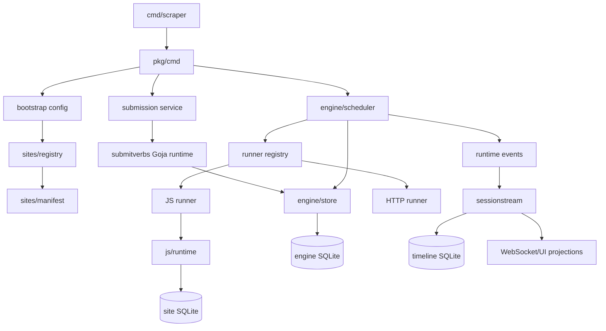
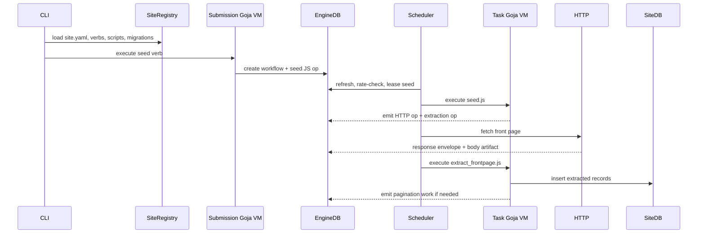
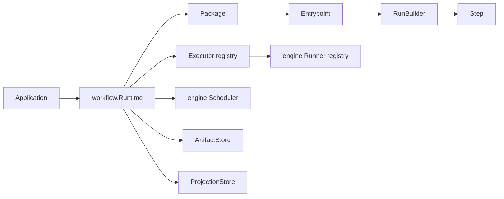
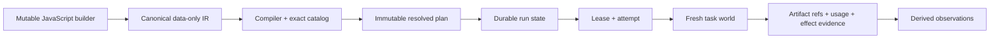
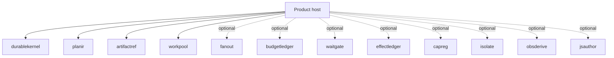

# Abstraction Fractals in Durable Workflow Systems

## Architectural Archaeology of `go-go-golems/scraper`

**A textbook-style deep dive into durable execution, JavaScript authoring, proof-carrying extensions, overengineering, and reusable architectural patterns**

**Research snapshot:** July 28, 2026  
**Main branch snapshot:** `803a28ef4e85eb2c12eea4b2ccc8ff3dd4c2dc27`  
**Workflow V3 branch snapshot:** pull request #10, head `202229464629e2b6d0e193ff7798b16770b3a270`  
**Documentary corpus:** `go-go-golems/go-go-parc`, including the scraper project map and linked design articles

---

## Abstract

`go-go-golems/scraper` is unusually valuable as an architectural specimen because it contains several complete answers to the same underlying question: how should a program describe, execute, resume, inspect, and govern long-running work?

The repository began as a site-oriented scraping system. It then acquired a reusable workflow façade over its engine. It was hardened for long-running resumable jobs. Finally, an open hard-cut branch introduced Workflow V3: a typed, JavaScript-authored, compiled, content-addressed, capability-constrained durable dataflow runtime with lazy maps, bounded reductions, budgets, approval gates, registry generations, process isolation, and canonical observations.

This history produces a codebase with striking self-similarity. At multiple scales one finds:

- a declaration;
- a registry;
- a normalized representation;
- validation;
- a runtime adapter;
- persistence;
- events or projections;
- a CLI or product shell;
- tests, fixtures, and documentation.

That recurrence can be dismissed as overengineering. Doing so would discard several genuinely strong ideas. It can also be admired wholesale. Doing so would miss substantial duplication, vocabulary drift, feature-union schemas, and lifecycle multiplication. The useful approach is to separate **productive abstraction fractals**, which repeat an invariant deliberately at multiple trust boundaries, from **accidental abstraction fractals**, which repeat the same meaning in multiple wrappers without purchasing a new guarantee.

This book reconstructs the repository’s architecture, traces representative execution paths, critiques its costs, names previously unnamed patterns, and proposes a tiered package architecture that preserves the best ideas without forcing every application to adopt the whole platform.

### Principal findings

1. **The repository is a lineage, not one architecture.** Main, the reusable workflow façade, and the open Workflow V3 hard cut solve related problems with incompatible vocabularies and trust models.
2. **The best complexity protects invariants.** Lease fencing, attempt identity, artifact integrity, bounded expansion, external-effect evidence, and derived observations buy concrete guarantees.
3. **The weakest complexity repeats lifecycle shells.** Mirror façades, registry cascades, manually repeated descriptors, event re-encoding, and nested product wiring multiply maintenance without always adding assurance.
4. **Workflow V3 is best understood as a proof system.** It binds author intent, implementation bytes, capability policy, data references, leases, effects, and observations into an auditable execution contract.
5. **The clean-slate RAG project demonstrates assurance compression.** Many guarantees can be retained as small packages without importing a general workflow runtime.
6. **A tiered architecture is preferable to one universal feature union.** Direct custody, durable jobs, typed dataflow, and governed execution should be selectable assurance profiles.
7. **LLM-shaped code should be mined, not merely accepted or rejected.** Redundant implementations expose latent patterns; the architectural task is to prove, name, compress, and govern them.

---

## Scope, method, and epistemic status

This is not a conventional code review. It is an exercise in **architectural archaeology**: reconstructing design intent from code, documentation, migrations, tests, and successive redesigns.

The analysis used five traces:

1. **The work trace:** how one unit of work moves from authoring to durable completion.
2. **The authority trace:** where code receives permission to read, write, call, emit, or decide.
3. **The identity trace:** how source, plans, implementations, attempts, artifacts, and effects are named.
4. **The failure trace:** what survives a crash, retry, stale worker, deployment change, or partial side effect.
5. **The observation trace:** how authoritative facts become operator views and experiment evidence.

The rendered `parc.yolo.scapegoat.dev` page was not fetchable from the analysis environment. The corresponding canonical Markdown file, `Research/KB/Projects/scraper.md`, and its linked articles were read directly from `go-go-golems/go-go-parc`.

The user’s hypothesis that the repository contains substantial LLM-generated code is plausible but not provable from the repository alone. This book therefore uses terms such as **generative signature**, **LLM-shaped architecture**, and **high-throughput abstraction growth** to describe observable properties, not to attribute authorship to particular lines.

Pull request #10 was open and unmerged at the research snapshot. Main and Workflow V3 must therefore be treated as distinct architectural generations, not as one simultaneously deployed system. [V-PR]

---

## How to read this book

Readers interested primarily in the repository should read Parts I and II. Readers interested in reusable patterns can begin with Part III. Readers deciding what to build should read Parts IV and V.

Each named pattern uses the following structure:

> **Context** — the recurring situation.  
> **Forces** — the competing requirements.  
> **Mechanism** — the architectural move.  
> **Benefits** — the guarantee purchased.  
> **Costs** — the surface area introduced.  
> **Use when** — evidence that justifies it.  
> **Avoid when** — signs that a smaller primitive is enough.

The source markers in brackets, such as `[M-README]` and `[V-COMPILER]`, refer to the pinned source catalogue in Appendix D.

## Contents

**Part I — The Repository as an Evolutionary Record**  
1. Why this repository matters  
2. Three systems in one lineage  
3. Generation A: the site-oriented engine  
4. Generation B: the semantic re-encoding façade  
5. Generation C: Workflow V3 as a proof system  
6. One work item across three generations  
7. The clean-slate control case

**Part II — A Theory of Abstraction Fractals**  
8. What is an abstraction fractal?  
9. Pattern language: identity and authority  
10. Pattern language: durability and effects  
11. Pattern language: scheduling and coordination  
12. Pattern language: architecture and product boundaries

**Part III — Design Axes and Architectural Diagnostics**  
13. The design space  
14. Metrics for architecture archaeology  
15. What is essential, and what is overengineered?

**Part IV — A Pragmatic Synthesis**  
16. Replace one universal platform with assurance profiles  
17. Proposed package catalog  
18. A worked design  
19. A refactoring roadmap

**Part V — Reverse-Engineering Generative Architecture**  
20. Treat generated architecture as a hypothesis field  
21. New architectural concepts derived from the case study  
22. Choosing an architecture  
23. Conclusions

**Appendices**  
A. Package maps  
B. Glossary  
C. Review exercises  
D. Pinned source catalogue  
E. Research limitations and confidence

---

# Part I — The Repository as an Evolutionary Record

## Chapter 1 — Why this repository matters

### 1.1 More than a scraper

The main README describes `scraper` as a durable workflow-driven scraping engine. Go owns persistence, scheduling, leases, retries, queue policy, runners, and product hosts. JavaScript owns most site-specific submission and execution behavior. Site manifests are loaded before the Cobra command tree is built, so runtime content changes the CLI itself. [M-README]

This sounds like a clear two-plane system:

```text
Go control plane
  persistence, scheduling, leases, retries, APIs

JavaScript behavior plane
  site verbs, extraction scripts, projections
```

The actual repository is richer. It contains at least four architectural ambitions:

1. a configurable scraping product;
2. a reusable durable workflow engine;
3. a JavaScript-hosting platform;
4. an evidence-producing research execution system.

Each ambition is defensible. Their interaction is the source of both the repository’s originality and its complexity.

### 1.2 The repository is a design-space search

A normal mature codebase tends to converge on one vocabulary. `scraper` instead records a rapid search through alternatives:

- **site-oriented operations** with dynamic graph emission;
- a **public workflow façade** over those operations;
- a hardened scheduler and store;
- a **compiled typed dataflow runtime** with exact implementation identity;
- a later clean-slate project that intentionally rejects the workflow platform for ordinary Go control flow.

This makes the repository useful in the same way a fossil bed is useful. Some structures are current adaptations. Some are transitional. Some are vestigial. Some are failed experiments whose failure reveals a design law.

### 1.3 The central question

The relevant question is not:

> Is the system overengineered?

It is:

> For each layer of structure, what assurance does it purchase, what recurring problem does it solve, and what is the smallest reusable form of that idea?

That question turns architectural excess into research material.

---

## Chapter 2 — Three systems in one lineage

### 2.1 Generation A: the site-oriented durable scraper

The main branch centers on these concepts:

- `Workflow`
- `OpSpec`
- `Dependency`
- `Lease`
- `OpResult`
- `Runner`
- `Site`
- `Verb`
- queue policy
- per-site SQLite projections

A site manifest packages JavaScript verbs, durable scripts, migrations, fixtures, queue policies, help content, and module configuration. The product loads those definitions before constructing the command tree. A verb submits an initial operation. Operations can dynamically emit descendants. The scheduler promotes runnable operations, enforces queue limits, leases work, executes runners, and commits results plus newly emitted operations. [M-MODEL] [M-SITE]

This is a **dynamic durable operation graph** whose authoring vocabulary is organized around websites.

### 2.2 Generation B: the reusable workflow façade

The `pkg/workflow` package rephrases the lower engine in a general workflow vocabulary:

- `Runtime`
- `Package`
- `Entrypoint`
- `RunBuilder`
- `Step`
- `Executor`
- `StepContext`
- `ArtifactStore`
- `ProjectionStore`
- operators and queues

The façade deliberately remains backed by the original engine. A package name is mapped into the lower engine’s `Site` field. A workflow `Executor` adapts to an engine `Runner`. A workflow registry wraps the runner registry. A `StepContext` accumulates data, emitted steps, records, and artifact references before the scheduler commits an `OpResult`. [M-WORKFLOW] [P-WORKFLOW-API]

This generation is a **semantic re-encoding façade**: valuable because it exposes a better public language, costly because the old language remains underneath.

### 2.3 Generation C: Workflow V3

Pull request #10 proposes a hard replacement rather than another compatibility layer. Its core sequence is:

```text
JavaScript authoring
  -> data-only WorkflowIR
  -> exact catalog resolution
  -> immutable WorkflowPlan
  -> durable run, node, and attempt state
  -> artifact-referenced task execution
  -> derived observations
```

The branch adds:

- typed and versioned task packages;
- digested source bundles;
- sealed worker registries and retained generations;
- exact implementation matching;
- content-addressed artifacts;
- fresh Goja runtimes and workspaces per attempt;
- resource-class dispatch;
- paged maps and bounded reductions;
- budgets and external-operation evidence;
- lease-free approval gates;
- optional restricted subprocess execution;
- a canonical observation contract.

It also removes the site architecture, old engine, API server, and web frontend. The proposed cut is large: 126 commits, 706 changed files, 54,384 additions, and 159,526 deletions. [V-PR]

This generation is a **workflow proof system**: execution is permitted only after intent, implementation, policy, and data references have been made explicit and bound together.

### 2.4 A downstream counterexample: `rag-ttc`

The `go-go-parc` corpus documents a later clean-slate RAG experiment project that treats the prior stack as evidence rather than a dependency. It deliberately excludes the JavaScript DSL, compiler, workflow runtime, scheduler service, plugin registry, and mandatory database. It keeps ordinary Go control flow, small domain packages, bounded execution, rate limits, budgets, atomic per-item caching, and an inspectable run directory. [P-RAG-CLEAN]

The contrast is crucial:

```text
Workflow V3 asks:
How can execution be made canonical, durable, governable, and portable?

rag-ttc asks:
What is the smallest set of safety and custody primitives needed
for this concrete research loop?
```

Neither question invalidates the other. Their difference defines the architecture’s design space.

---

## Chapter 3 — Generation A: the site-oriented engine

### 3.1 Package topology

A simplified main-branch package map is:



The diagram shows three distinct persistence concerns:

1. engine control state;
2. site-specific projection state;
3. timeline or hydration state for the UI.

That separation is legitimate. It also means one logical operation may be represented in three databases and at least two event schemas.

### 3.2 Bootstrap before command construction

The CLI cannot know its full command tree until it has loaded site manifests. To solve this, startup manually scans raw arguments for bootstrap flags, merges them with config and environment sources, loads site definitions, and only then builds Cobra commands. [M-BOOT]

This is clever because it produces commands such as:

```text
scraper site hackernews run seed
```

from data and scripts. It is also a coupling signal. Runtime content does not merely configure command behavior; it defines the command grammar. The consequences include:

- two phases of argument interpretation;
- special rules for bootstrap flags;
- command availability depending on external directories;
- tests that must distinguish bootstrap-time and normal command-time configuration;
- an implicit requirement that site discovery finish before product construction.

This is the first example of a pattern that will recur: **an extension acquires product-level authority**.

### 3.3 The durable operation model

The lower engine’s model is compact and strong. An operation contains:

- stable identity and workflow identity;
- site, kind, and queue;
- raw JSON input;
- retry policy and retry state;
- dependencies;
- metadata;
- timestamps.

Operation status distinguishes pending, ready, running, succeeded, failed, blocked, and canceled. Results can contain data, records, artifacts, and newly emitted operations. [M-MODEL]

This model supports dynamic expansion without requiring the whole graph to exist at submission time. A completed operation can atomically publish its result and its descendants.

That atomicity is one of the best ideas in the repository. It means:

```text
parent succeeded + children exist
```

is one durable fact, not two loosely coordinated actions.

### 3.4 Leasing and stale-worker fencing

The SQLite store leases ready operations inside a transaction. It checks queue concurrency and token-bucket state, selects the oldest eligible operation, consumes a rate token, writes a lease token and expiry, and marks the operation running. Completion and failure require the current, unexpired lease token. Heartbeats update only a matching live lease. [M-LEASE] [M-COMPLETE]

The key invariant is:

```text
A worker may compute without authority,
but it may not commit without proving current authority.
```

This distinction matters after:

- a lease expires;
- another worker reacquires the operation;
- the old worker finally returns;
- cancellation races with completion;
- process pauses exceed the lease duration.

The lease token is not merely a lock. It is a **commit capability**.

### 3.5 Dependency refresh as a database state machine

Runnable-state refresh performs several transitions:

1. recover expired running operations to ready;
2. delete expired leases;
3. repeatedly mark descendants blocked when required dependencies fail, block, or cancel;
4. reopen descendants if dependencies are repaired;
5. promote pending operations whose dependency conditions are satisfied.

The repeated blocking pass computes a fixed point so failure propagates through multiple dependency levels in one refresh. [M-OPSTORE]

This is a good example of **invariant materialization**. Rather than recalculating effective state on every query, the store maintains explicit statuses. That improves operator visibility and indexing, but every new status expands the transition matrix.

### 3.6 Queue policy inside lease acquisition

Queue policy includes maximum in-flight work and an optional rate limit. The store evaluates both inside the same transaction that selects and leases work. [M-LEASE]

This placement is important. A process-local semaphore would regulate only one worker process. A pre-lease rate check could race. By placing policy at the durable admission point, the system gives queue policy cross-process meaning.

The cost is that scheduling policy becomes part of persistence semantics. Changing queue behavior now touches store contracts, migrations, status reporting, tests, metrics, and documentation.

### 3.7 The Hacker News execution trace

A representative path crosses nearly every subsystem:



The site manifest supplies queue policy. The submission verb produces the first operation. The seed script emits an HTTP fetch and an extraction operation. The HTTP runner records a response and body artifact. The extraction script reads the fetch result, writes site-specific SQL, and may emit more work. [M-HN]

This path is flexible, but semantics are distributed across:

- YAML;
- a submission-time JavaScript runtime;
- execution-time JavaScript;
- generic Go runners;
- engine SQLite;
- site SQLite;
- runtime events;
- CLI-generated commands.

A developer changing “how Hacker News extraction works” must understand all of those boundaries.

### 3.8 Two JavaScript runtimes, two graph-authoring moments

The main branch uses one Goja host for submission verbs and another for durable operation scripts. Both can construct operations. Submission chooses the initial graph; task execution expands it later. [M-SUBMIT] [M-JS]

This yields a useful capability—dynamic graph generation—but also duplicates concepts:

| Concern | Submission runtime | Task runtime |
|---|---|---|
| Workflow identity | selected or generated | inherited, sometimes exposed |
| Operation construction | initial operations | descendant operations |
| Metadata | submission result | operation result |
| Validation | verb/catalog path | runner/runtime path |
| JavaScript host API | submit helpers | execution helpers |

The duplication is not exact, but it is structurally similar enough to require parallel documentation and tests.

### 3.9 Broad task authority

The task runtime exposes workflow and operation identity, input, logging, dependency reads, dynamic emission, record writes, artifact writes, and database handles. The runtime is fresh per operation, which limits memory leakage, but the host API grants substantial authority. [M-JS]

This is appropriate for trusted site scripts. It is not a safe general-purpose untrusted task model. Workflow V3 later replaces broad ambient authority with exact module aliases and artifact-bound inputs.

### 3.10 Results, artifacts, and storage pressure

Main stores operation results and artifacts transactionally in SQLite. The HTTP runner may preserve response metadata and response bodies. This makes debugging easy and completion atomic, but it also allows data-plane payloads to accumulate in the control database. [M-HTTP] [M-COMPLETE]

The V3 design article records a production-scale manifestation of this problem in a later RAG adapter: large source-bearing operation JSON expanded into thousands of operations, producing tens of gigabytes of database and WAL data. [P-V3]

The general lesson is:

> Durable control state and durable data custody are both necessary, but they do not need to occupy the same rows or the same database.

### 3.11 Observation multiplication

Scheduler events are translated into a runtime event schema, published through an event bus, consumed by a session hub, persisted into a hydration store, projected into timeline and UI forms, and fanned out over WebSockets. [M-EVENTS]

This is a well-motivated browser-reconstruction architecture. It is also a clear instance of **representation multiplication**:

```text
scheduler fact
  -> scheduler event
  -> runtime event
  -> bus message
  -> hydrated entity
  -> timeline projection
  -> UI projection
```

The diagnostic question is not whether this is “too many layers.” It is whether each representation has a distinct consumer, retention policy, or trust boundary. When two adjacent forms have no independent purpose, they should be collapsed.

### 3.12 Strengths of Generation A

The original engine gets several hard things right:

- transactional publication of results and descendants;
- lease-token fencing;
- cross-process queue admission;
- explicit dependency-derived statuses;
- deterministic SQLite-backed recovery;
- fresh script runtimes;
- site-specific behavior outside the Go engine;
- strong operator inspectability.

### 3.13 Costs of Generation A

Its principal costs are:

- the word `Site` carries extension, tenancy, queue, database, script, migration, help, and CLI meanings;
- product construction depends on external content discovery;
- two JavaScript host APIs author graph fragments at different times;
- engine, site projection, and UI timeline state can drift or require reconciliation;
- generic scripts possess broad authority;
- payloads can enter control-plane storage;
- every site package behaves like a miniature product plugin.

The architecture is not simply overbuilt. It has a strong durable kernel embedded inside an extension and product model that grew too many responsibilities.

---
## Chapter 4 — Generation B: the semantic re-encoding façade

### 4.1 Why the façade exists

The lower engine is capable but exposes implementation-oriented concepts. A user who wants to define a reusable workflow should not need to think first about sites, runner registration, engine operation records, or scheduler internals. `pkg/workflow` introduces a public language closer to the user’s intent. [P-WORKFLOW-API]

The façade’s object graph is roughly:



This is a legitimate API-design move: create a **semantic façade** whose vocabulary matches the problem the user thinks they are solving.

### 4.2 Mirror façade versus compressive façade

A façade earns its cost in one of two ways:

1. **Compression:** it eliminates or automates several lower-level decisions.
2. **Reframing:** it presents the same capabilities in a stable domain vocabulary.

`pkg/workflow` does both, but reframing dominates. Many public objects map nearly one-to-one onto engine objects:

| Workflow façade | Lower engine |
|---|---|
| Package | Site name or site-scoped namespace |
| Step | OpSpec |
| Executor | Runner |
| Run | Workflow |
| StepContext.Emit | OpResult.Emitted |
| queue policy | QueuePolicy |

This is a **mirror façade**: the new model reflects the old model rather than replacing it.

Mirror façades are not automatically bad. They are useful during migration and when the lower layer is intentionally private. Their danger is permanent dual vocabulary. Every feature must be named, validated, documented, and tested twice.

### 4.3 The `Package` to `Site` semantic leak

The runtime maps package names into the engine’s `Site` field. This is practical because it reuses proven storage and scheduling behavior. It also reveals that the lower model remains authoritative. [M-WORKFLOW]

A semantic leak has three costs:

- lower-layer constraints silently shape the public API;
- logs and database rows use a term that no longer matches user intent;
- future features must decide which vocabulary owns the concept.

A useful migration test is:

> Can the public layer express a valid concept that the lower vocabulary cannot name without lying?

If yes, the façade has outgrown adaptation and needs a new kernel model.

### 4.4 Registry over registry

The engine already has a runner registry. The workflow package adds an executor registry that adapts executors to runners. [M-EXECUTOR]

This is an example of a **registry cascade**:

```text
public executor name
  -> workflow executor registry
  -> runner adapter
  -> engine runner registry
  -> concrete implementation
```

Each registry can enforce a different contract, so the cascade may be justified. In this case the layers are close enough that a single generic implementation registry with typed adapters could likely replace both.

A registry should exist when it owns at least one of:

- discovery;
- identity;
- version selection;
- policy validation;
- lifecycle;
- concurrency or ownership.

A registry that only renames another registry is a candidate for collapse.

### 4.5 `StepContext` as a durable intention buffer

The strongest abstraction in `pkg/workflow` is `StepContext`. During execution, code accumulates intended effects:

- result data;
- records;
- artifacts;
- emitted steps;
- projection work.

The executor does not directly mutate engine state for each call. It returns a result envelope that the scheduler commits centrally. [M-CONTEXT]

This is a **durable intention buffer**:

```text
execute user logic
  -> accumulate intentions in memory
  -> validate envelope
  -> commit authoritative effects together
```

The pattern is broadly reusable. It gives user code convenient imperative methods while preserving a transactional kernel.

### 4.6 The transaction boundary is incomplete

The intention buffer is not fully transactional across all effects:

- external artifact files can be written before the engine result commits;
- arbitrary projection writes can occur outside the engine transaction;
- a crash can therefore leave orphan artifacts or projection state that does not correspond to committed engine state.

This is not necessarily incorrect. Many systems accept at-least-once side storage plus garbage collection. The problem is that the API looks transaction-like while its guarantees differ by effect type.

A robust effect API should classify effects explicitly:

```text
Class A: committed in the kernel transaction
Class B: staged before commit, finalized by commit marker
Class C: external effect with admission/completion evidence
Class D: derived projection, rebuildable from authority
```

The class should be visible in names and documentation.

### 4.7 Artifact storage before V3

The façade’s file artifact store writes named files and metadata outside the engine database. It improves payload separation but is not content-addressed and does not bind publication to engine completion. [M-ARTIFACT]

This creates three possible states:

```text
file absent, reference absent       normal before write
file present, reference absent      orphan after failed commit
file present, reference present     committed
```

The missing state—reference present but file absent—can arise from manual deletion or filesystem failure. A content-addressed store with integrity checking, introduced in V3, improves detection but still needs a publication protocol or garbage collection.

### 4.8 Hardening the lower engine

The July 2026 hardening work addresses real failure modes:

- text timestamp ordering is replaced or supplemented by sortable integer microseconds;
- lease ownership is verified at completion;
- heartbeats and cancellation are added;
- dependency blocking reaches a fixed point;
- worker execution becomes concurrent while SQLite writes remain serialized;
- idempotent run identity is derived from canonical input;
- observers run after commit and cannot corrupt authority;
- snapshots expose resumable progress. [P-HARDEN]

These changes illustrate a valuable principle:

> Reliability often comes from making hidden assumptions into explicit state, not from adding more abstraction layers.

The hardening work mostly strengthens the kernel rather than adding new public nouns.

### 4.9 A remaining scheduling limitation

The hardened scheduler can execute a leased batch concurrently, but it waits for the batch before beginning the next lease cycle. A slow task in one resource category can delay refilling a slot released by a fast task in another category. Workflow V3 replaces this with completion-driven refill. [M-SCHED] [V-DISPATCH]

This distinction is subtle:

```text
Batch concurrency:
lease N -> run N concurrently -> wait for all -> lease again

Work-conserving concurrency:
lease while capacity exists -> refill whenever any task completes
```

Both are concurrent. Only the second is continuously work-conserving.

### 4.10 The façade’s net value

Generation B is neither a failure nor a stable endpoint. It demonstrates three lessons:

1. A better public vocabulary can be valuable before a new engine exists.
2. An effect-buffer API is worth extracting independently.
3. A mirror façade should have an explicit expiration condition, or dual vocabulary will become permanent architecture.

---

## Chapter 5 — Generation C: Workflow V3 as a proof system

### 5.1 The architectural reset

Workflow V3 does not merely rename operations. It changes where authority lives.

In the main engine, JavaScript can emit operations and access host services during execution. In V3, JavaScript authoring runs before execution and produces a data-only representation. The compiler resolves exact task implementations and policies. Workers execute only the compiled plan with selected capabilities. [P-V3] [V-AUTHOR]

The central pipeline is:



Each step reduces ambiguity and, ideally, reduces authority.

### 5.2 Four representations with different jobs

V3 distinguishes:

1. **Authoring state** — mutable Go-backed JavaScript handles.
2. **Workflow IR** — data-only intent, still referring to logical task kinds and versions.
3. **Workflow plan** — exact implementation identities, policies, bindings, and digests.
4. **Run state** — mutable operational facts such as status, attempts, leases, outputs, gates, and budgets.

This is a **canonicalization ladder**. The representations are not arbitrary duplication if each answers a different question:

| Representation | Question answered |
|---|---|
| Builder | What is pleasant to author? |
| IR | What did the author mean? |
| Plan | What exactly is permitted to run? |
| Run state | What has happened so far? |

The ladder becomes wasteful when adjacent forms do not reduce ambiguity, authority, or mutability.

### 5.3 JavaScript as a constrained authoring language

The V3 Goja module stores Go-side typed references keyed by JavaScript object identity. Workflow values, sets, task descriptors, jobs, workflows, and plans are handles, not arbitrary JavaScript records. Builder methods construct an IR. Validation and compilation remain in Go. [V-AUTHOR]

This follows a broader pattern documented across the organization: **Go owns the handle; JavaScript describes intent**. Fluent builders are appropriate when nested structure, type safety, and composition justify them; thin functional APIs are better for flat operations. [P-GOJA]

The V3 authoring layer is stronger than a map-producing DSL because:

- values cannot be forged from plain objects;
- task inputs are checked against descriptor-defined ports;
- references retain schema identity;
- builder closure prevents mutation after definition;
- generated TypeScript can describe the API.

Its cost is a large host implementation that mirrors the IR grammar method by method.

### 5.4 Compiler validation as defense in depth

The compiler validates:

- exact schema version;
- sorted and unique budgets;
- unique node, map, reduction, and gate keys;
- exact task catalog resolution;
- input and output schema equality;
- acyclic dependencies;
- map expansion limits;
- reduction structure;
- isolation compatibility;
- module availability;
- budget maximums and approval gates. [V-COMPILER]

Some checks also occur in the authoring builder. This is intentional duplication across a trust boundary:

```text
Builder validation improves author experience.
Compiler validation protects the durable contract.
```

This is a **productive fractal**. The same invariant appears twice, but the two checks have different threat models.

### 5.5 A caveat about “canonical JSON”

The `CanonicalJSON` helper currently delegates to Go’s `json.Marshal`, then hashes the bytes. Go’s encoder provides deterministic map-key ordering for ordinary supported maps, making this useful inside the Go implementation. It is not, by name alone, a complete cross-language canonical JSON specification. [V-CANON]

If plans or identities must be reproduced outside Go, the contract should specify:

- number normalization;
- Unicode normalization, if any;
- escaping rules;
- duplicate-key rejection;
- treatment of negative zero and floating point;
- a named canonicalization standard or a custom byte-level specification.

The design idea is sound. The name currently promises more portability than the implementation explicitly defines.

### 5.6 Bundles and exact implementation identity

A task bundle contains:

- name, version, and ABI;
- task kinds and versions;
- entrypoint paths and exports;
- input and output schemas;
- required module aliases;
- resource class and retry policy;
- maximum budget and isolation policy;
- source files.

The bundle validates canonical paths and entrypoints, hashes every file, sorts the digest envelope, and derives a bundle digest. A task implementation identity includes kind, version, bundle digest, entrypoint, and ABI. [V-BUNDLE]

This is stronger than `kind + version`. It prevents a worker from silently running different bytes under the same logical name.

The pattern is **proof-carrying extension**:

> An extension arrives with enough immutable metadata for a host to prove exactly what implementation and authority it is activating.

### 5.7 Sealed registries and generation retention

A registry builder receives bundles, advertised module aliases, and isolation-executor digests. Sealing validates the complete set and derives a generation digest. A registry manager can atomically activate a candidate, retain draining generations while attempts still reference them, quarantine generations after repeated construction failures, and remove only drained generations with zero references. [V-REGISTRY] [V-REGMAN]

This solves a real deployment race:

```text
run compiled against generation A
worker deploys generation B
attempt still needs exact implementation from A
```

Retained generations allow A and B to coexist safely.

The cost is substantial deployment semantics inside the workflow runtime. For a single-process local tool, a process restart and immutable binary may be enough. For rolling multi-worker upgrades, generation management is justified.

### 5.8 Authority by alias

Task packages request module aliases such as:

- `fs:input`
- a specific `fetch:<policy>` alias
- `exec:allowlisted`
- a preconfigured database alias

The host chooses which aliases exist and how they are implemented. The sealed registry proves that the task’s requested aliases are advertised. The runtime constructs only those modules for the attempt. [V-MODULES]

This is **authority by alias**:

```text
import name == capability request
host registration == capability grant
compiled plan == grant record
```

It is more auditable than a generic `host` object containing every service.

Aliases must remain semantically precise. An alias named simply `fetch` that can reach arbitrary origins is not a useful capability boundary. `fetch:public-ttc` with a host-owned origin, timeout, response limit, redirect policy, and disabled credential sources is.

### 5.9 The attempt-local world

Each task attempt receives:

- a fresh temporary workspace;
- materialized artifact inputs;
- a fresh Goja runtime;
- the exact bundle source;
- selected module instances;
- a lease-scoped external-operation recorder;
- output and usage APIs;
- cancellation checkpoints.

The runtime is destroyed after the attempt. Cookbook tasks even test that a global load counter is one, proving no reuse across attempts. [V-TASK] [V-COOKBOOK]

This is the **attempt-local world** pattern. It reduces cross-attempt contamination and makes authority lease-scoped.

The pattern is strong even without subprocess isolation. Process isolation adds a second boundary for untrusted or resource-sensitive code.

### 5.10 Compact control, external data

V3 stores `ArtifactRef` records containing schema, digest, media type, size, and locator. The file artifact store hashes bytes, writes a temporary file, synchronizes it, renames it into a content-addressed object path, and verifies size and digest on read. [V-ARTIFACT]

This produces a clean split:

```text
control plane: identities, refs, status, leases, attempts, policy

data plane: source bytes, intermediate datasets, provider payloads
```

The store still writes an artifact before the database references it, so orphan objects remain possible. Content addressing makes orphans harmless and deduplicable, and a mark-and-sweep collector can remove unreferenced objects.

### 5.11 Durable schema as invariant materialization

The V3 SQLite schema contains dedicated tables for:

- runs and inputs;
- nodes and dependencies;
- attempts and leases;
- node outputs;
- maps, pages, and items;
- reductions, partitions, and consumers;
- gates, dependencies, and consumers;
- budget accounts, claims, and reservations;
- external-operation admissions, allocations, measures, completions, and counters;
- events and operational indexes. [V-SCHEMA]

This is an extreme but coherent form of **invariant materialization**. Each feature receives explicit durable state rather than being encoded in an opaque JSON blob.

Benefits include:

- queryable progress;
- enforceable uniqueness and foreign keys;
- recoverable state machines;
- bounded work selection;
- precise operator views;
- testable crash boundaries.

Costs include:

- migration volume;
- transition combinatorics;
- schema coupling to product features;
- pressure to make every concept a first-class subsystem;
- a high minimum complexity even for workflows that use only linear tasks.

### 5.12 Completion-driven, resource-class dispatch

The dispatcher repeatedly advances gates, maps, and reductions, then leases compatible work until no capacity remains. Each attempt runs in a goroutine. Completion wakes the loop immediately, allowing the released resource class to refill without waiting for unrelated tasks. Polling remains only for cross-process changes, deadlines, and lease expiry. [V-DISPATCH]

A test specifically proves that an HTTP slot is refilled while an unrelated slow task continues running. [V-DISPATCH-TEST]

This is **resource-class work conservation**. It is a reusable scheduling primitive independent of workflow authoring.

### 5.13 Paged deterministic fan-out

A V3 map does not eagerly duplicate the entire source set into the plan or a single transaction. It stores expansion state, reads an item manifest, materializes bounded pages, and limits how far execution may be materialized ahead. [V-SCHEMA] [V-ENGINE]

This is **paged deterministic fan-out**:

- stable item identity;
- bounded database writes;
- bounded scheduler lookahead;
- resumable page progress;
- no giant source-bearing operation blob.

It directly answers the production failure described in the V3 article.

### 5.14 Bounded fan-in trees

Reductions group members into partitions of fixed fan-in, materialize one level, execute reducer tasks, and repeat until one root remains or a maximum level is reached. [V-ENGINE]

This is a durable tree reduction rather than one unbounded aggregation task. It controls input size, exposes progress, and makes retries local to partitions.

### 5.15 Lease-free wait states

Approval gates have their own durable rows and versions. A gate can wait, expire, approve, or reject without holding a worker lease. Decision commands include an expected version, actor, authorized role, decision code, and optional decision artifact. [V-GATE]

This is **lease-free waiting**:

> Persist the wait as domain state; do not simulate waiting by keeping execution resources occupied.

The same pattern applies to callbacks, timers, external review, and asynchronous provider jobs.

### 5.16 Budgets as reservation and settlement

V3 budgets define accounts and dimensions such as requests, tokens, bytes, and cost microunits. Tasks declare maximum claims. Workflows request reservations within those maxima. The store reserves before execution and settles actual usage or applies conservative accounting after uncertain failure. [V-BUDGET] [V-SCHEMA]

This is more than a counter. It is a small accounting system with:

- policy identity;
- admission;
- reservation;
- usage evidence;
- settlement;
- exhaustion behavior;
- approval integration.

The machinery is justified when external cost is material or multiple workers compete for a shared finite budget. A local one-process experiment may need only a non-replenishing integer budget.

### 5.17 The external-operation evidence ledger

Trusted host modules can admit an external operation before it starts and finish it with bounded completion evidence. A descriptor pins operation kind, authority identity, counter schema, and maximum calls per attempt. Admissions record reservations and measures. Completions record outcome, elapsed time, accounting mode, and counters. Completion uses a secret key omitted from JSON and ordinary string formatting. [V-EFFECT]

This is a particularly original pattern:

**Stable external effect key + durable admission + bounded completion evidence**

It separates three questions:

1. Was the workflow authorized to attempt the effect?
2. Did the host admit a specific operation?
3. What evidence exists about its completion and cost?

It avoids storing arbitrary provider payloads or error text in control-plane evidence.

### 5.18 Derived observations, not a second authority

V3 observations are projected from terminal workflow facts and external-operation records. The contract defines a fixed metric and trace set, coverage counts, source digests, and an observation digest. [V-OBS]

The strong principle is:

> Observability may be durable, but it should remain derivable from authoritative execution facts.

The implementation’s fixed canonical metric set is also a coupling risk. Adding or deprecating one metric changes the contract identity. A core observation envelope plus versioned metric modules would preserve derivability with less global coupling.

### 5.19 Product shell recursion

Even after creating a reusable V3 kernel, the branch adds a product package that wires configuration, task packages, authoring, store, artifact root, registry manager, engine, dispatcher, service, HTTP, CLI, fixtures, and documentation. [V-PRODUCT]

This is necessary to ship something usable. It is also the recurring shape of the repository:

```text
new capability
  -> package
  -> registry
  -> config
  -> product wiring
  -> CLI/API
  -> fixtures
  -> docs
  -> observations
```

The structure is self-similar. This is the central abstraction fractal.

### 5.20 The hard cut

The branch chooses deletion over compatibility. That is often the correct response after a mirror façade and a replacement engine have both accumulated. The hard cut removes semantic ambiguity at the cost of a large review and migration event. [V-PR]

A hard cut is not simply aggressive cleanup. It is a **complexity reset mechanism**. It works only when:

- the replacement has a governing vertical slice;
- old data and workflows have an explicit disposition;
- users can identify the new source of truth;
- compatibility is not silently reintroduced through adapters.

---

## Chapter 6 — One work item across three generations

A comparative trace reveals what each generation adds.

### 6.1 Site engine

```text
verb -> initial OpSpec -> scheduler -> lease -> runner
     -> OpResult(data, artifacts, emitted ops) -> SQLite commit
```

Identity is operation-oriented. Code selection is by runner kind and site script path. Inputs can be raw JSON. Effects can include inline artifacts and direct projection writes.

### 6.2 Workflow façade

```text
entrypoint -> RunBuilder -> Step -> adapted OpSpec
executor -> StepContext intentions -> adapted OpResult -> engine commit
```

The execution semantics are mostly unchanged. The user vocabulary improves. A second registry and storage seam appear.

### 6.3 Workflow V3

```text
JS builder -> IR -> exact catalog -> plan digest -> run
resource lease -> attempt + registry generation -> fresh task world
artifact refs + usage + effect evidence -> fenced completion
```

V3 adds exact implementation identity, typed bindings, compact data references, attempt history, capability selection, policy compilation, and richer operational state.

### 6.4 Assurance delta

| Property | Site engine | Workflow façade | Workflow V3 |
|---|---:|---:|---:|
| Durable operation state | Yes | Yes | Yes |
| Lease-fenced commit | Yes after hardening | Inherited | Yes, attempt-scoped |
| Dynamic graph | Runtime emission | Runtime emission | Compiled nodes plus durable map/reduce expansion |
| Public domain vocabulary | Site/operation | Package/step | Workflow/task/dataflow |
| Exact implementation bytes | No | No | Yes |
| Typed data bindings | Convention/JSON | Partial | Compiler-enforced schemas |
| Payload outside control rows | Partial | External store optional | First-class artifact refs |
| Capability restriction | Broad trusted host | Broad trusted host | Exact module aliases |
| Append-only attempt history | Limited | Limited | First-class |
| Rolling implementation generations | No | No | Yes |
| Human wait state | Ad hoc | Ad hoc | First-class gate |
| Cost reservation and settlement | Queue rate only | Operator controls | First-class budget ledger |
| Canonical derived observations | Event/UI oriented | Inherited | First-class contract |

The table explains why V3 is large: it buys many assurances. It does not prove every application needs them simultaneously.

---

## Chapter 7 — The clean-slate control case

### 7.1 Why a counterexample is necessary

An architecture cannot be evaluated only against its own requirements. A highly structured system will always appear justified if every existing feature is treated as mandatory. The clean-slate `rag-ttc` project asks which requirements survive when the optimization target changes from platform completeness to hypothesis-to-evidence speed. [P-RAG-CLEAN]

### 7.2 What the reset deletes

The project intentionally removes:

- JavaScript experiment authoring;
- the RAG DSL;
- canonical graph IR;
- compilation and lowering;
- Workflow V3;
- Researchctl lifecycle;
- daemon and mandatory database;
- compatibility adapters.

An experiment is an ordinary Go program. Shared packages implement stable domain operations and safety primitives. The program owns sequencing. [P-RAG-CLEAN]

### 7.3 What the reset preserves

The reset keeps several ideas learned from the larger system:

- immutable content identity;
- explicit source lineage;
- deterministic ordering;
- bounded workers;
- process-local rate control;
- finite budgets;
- per-item cache identity;
- atomic cache publication;
- fail-closed corruption handling;
- incremental observations;
- terminal run status;
- inspectable artifacts and evidence.

This is architectural distillation: preserve guarantees, delete orchestration.

### 7.4 Custody without orchestration

The experiment package creates a run directory, writes configuration and inputs, appends observations, publishes artifacts, and records a terminal status. It does not know about RAG stages, workers, retries, or graphs. [P-RAG-CLEAN]

This is **custody without orchestration**:

```text
evidence package records what happened
program decides what to do
execution primitives bound expensive work
```

It is one of the most reusable alternatives to a workflow engine.

### 7.5 Per-item recovery without durable workflow state

The cached map primitive derives deterministic keys, resolves valid hits, coalesces duplicates, admits only misses through budget and rate controls, executes bounded work, and atomically stores each successful item. A late failure therefore preserves prior expensive results. [P-RAG-CLEAN]

This obtains an important workflow-like guarantee—resumption after partial failure—without persisting a graph, node state, leases, or attempts.

The lesson is:

> Recovery granularity should match the expensive or irreversible unit, not automatically the conceptual workflow stage.

### 7.6 The proportionality rule

The clean-slate report states a governing rule in substance:

```text
share stable operations and safety primitives;
leave experiment control flow local until repeated evidence proves a shared abstraction.
```

That rule should be placed beside V3’s assurance goals, not above them. Together they yield a proportional design principle:

> Buy the smallest assurance mechanism that protects the current irreversible cost, concurrency boundary, or trust boundary.

---
# Part II — A Theory of Abstraction Fractals

## Chapter 8 — What is an abstraction fractal?

### 8.1 Definition

An **abstraction fractal** is a codebase structure in which the same architectural motif recurs at multiple scales.

In `scraper`, the motif is:

```text
declare
  -> identify
  -> register
  -> validate
  -> adapt
  -> execute
  -> persist
  -> observe
  -> expose as product surface
```

It appears around sites, verbs, operations, runners, workflow packages, executors, task bundles, module aliases, registry generations, maps, reductions, gates, budgets, external operations, and observations.

The term “fractal” does not claim mathematical self-similarity. It highlights a practical phenomenon: zooming into one subsystem reveals a smaller version of the whole product lifecycle.

### 8.2 Why generative development produces fractals

High-throughput human or LLM-assisted development tends to produce abstraction fractals for understandable reasons:

1. **Local completeness is easy to optimize.** When adding a concept, it is natural to give it validation, configuration, storage, tests, observability, and documentation.
2. **Existing structure becomes a template.** A new subsystem copies the successful shape of older subsystems.
3. **Language models favor pattern continuation.** Given a repository with registries, builders, and managers, generated code is likely to extend those motifs consistently.
4. **Parallel correctness is safer than invasive simplification.** Adding a new wrapper or registry risks less immediate breakage than changing a shared kernel.
5. **Feature tickets reward visible closure.** A capability feels complete when it has a CLI, docs, fixtures, metrics, and tests, even if the kernel has become redundant.

The result can be remarkably coherent locally and disproportionately large globally.

### 8.3 Productive and accidental fractals

A repeated structure is **productive** when repetition enforces the same invariant against different failure modes or at different trust boundaries.

Examples:

- builder validation for author feedback plus compiler validation for durable safety;
- module advertisement at registry seal time plus exact module construction at attempt time;
- artifact digest recorded at write time plus verified at read time;
- lease checked at acquisition, heartbeat, and completion;
- source digest, IR digest, plan digest, and observation digest for different objects.

A repeated structure is **accidental** when adjacent layers restate the same meaning without adding a distinct guarantee.

Examples:

- workflow executor registry wrapping the engine runner registry;
- package name stored as site name;
- scheduler event translated into another event with nearly identical semantics before any consumer boundary;
- task identity repeated manually in bundle declarations and descriptor factories;
- configuration objects whose sole purpose is to copy fields into another configuration object.

### 8.4 The new-guarantee test

For every boundary, ask:

> What new guarantee becomes possible only because this representation or layer exists?

Good answers include:

- “The plan pins exact source bytes.”
- “The lease proof prevents stale completion.”
- “The event projection can be rebuilt from authority.”
- “The gate waits without consuming capacity.”
- “The artifact reference prevents payload duplication in control rows.”

Weak answers include:

- “It gives the same thing a nicer name.”
- “It keeps this package independent,” when no independent evolution exists.
- “We might need another implementation later.”
- “All other features have a registry.”

A nicer name can still justify a façade, but then the migration or compatibility role must be explicit.

### 8.5 Representation multiplication

A complex system needs multiple representations. The failure mode is not multiplicity itself; it is **unaccounted multiplicity**.

For one logical workflow, V3 may hold:

```text
source text
builder handles
IR
catalog entries
compiled plan
run rows
node rows
attempt rows
artifact refs
external-operation rows
events
observation projections
```

Each form should declare:

- owner;
- mutability;
- authority;
- derivation;
- retention;
- compatibility contract.

Without that declaration, representations become rival truths.

### 8.6 Lifecycle multiplication

A concept has **lifecycle surface** when it requires some combination of:

- configuration;
- registration;
- validation;
- persistence;
- migration;
- status;
- retry or recovery;
- API/CLI exposure;
- metrics;
- documentation;
- fixtures;
- compatibility.

The total cost of a feature is not its central algorithm. It is the algorithm multiplied by its lifecycle surfaces.

A map primitive may require 100 lines of expansion logic but thousands of lines across schema, projection, authoring, TypeScript, fixtures, tests, docs, and product commands.

### 8.7 Boundary amplification

A boundary between two models tends to generate:

- a translator;
- validation on both sides;
- error conversion;
- identity mapping;
- tests;
- documentation;
- instrumentation.

This is **boundary amplification**. Adding one model boundary often adds seven maintenance obligations.

Boundary count therefore matters more than package count. Ten packages sharing one model can be cheaper than four packages translating among four models.

### 8.8 Registry cascade

A registry is a runtime map with architectural status. It usually owns identity and discovery. A **registry cascade** occurs when multiple registries resolve successive views of the same implementation.

The repository contains or has contained registries for:

- sites;
- submit verbs;
- runners;
- workflow executors;
- Goja modules;
- V3 task bundles;
- sealed task implementations;
- registry generations;
- task module aliases;
- product task packages.

Some are necessary. The cascade becomes suspicious when registration of one extension requires coordinated entries in several maps.

### 8.9 Feature-union architecture

A **feature-union IR** is a universal representation containing optional fields for every supported execution feature.

V3’s plan can contain ordinary nodes, maps, reductions, gates, budgets, isolation policies, module lists, and several reference kinds. This is convenient for one compiler and one durable store. It creates combinatorial validation and makes the simplest path carry concepts it does not use.

An alternative is a small kernel plus feature-owned extension records or typed plan modules. The tradeoff is more interfaces and joins but less universal optionality.

### 8.10 Recursive product shell

A **recursive product shell** appears when a subsystem intended to be a library acquires its own:

- configuration;
- application object;
- server or CLI;
- operational endpoints;
- examples;
- docs;
- deployment lifecycle.

The V3 product package is sensible in isolation. The repository’s history shows the pattern repeating for each architectural generation. Product shells should be outer composition roots, not recursively nested inside every reusable layer.

### 8.11 Assurance as a budget

Every guarantee has a cost:

| Guarantee | Typical cost |
|---|---|
| stale-worker rejection | lease tokens, expiry, transactional checks |
| exact implementation reproducibility | bundles, digests, catalogs, retained generations |
| bounded external cost | accounts, reservations, settlement, usage evidence |
| human approval | gate state, authorization, versioned commands, artifacts |
| untrusted execution | subprocess protocol, limits, launchers, cleanup |
| lazy scale-out | expansion state, item identity, paging, finalization |
| canonical research evidence | source coverage, projection code, versioned contracts |

Architecture should treat these as items in an **assurance budget**. The question is not whether a guarantee is good. It is whether its expected risk reduction exceeds its ongoing lifecycle cost for the target deployment.

---

## Chapter 9 — Pattern language: identity and authority

### Pattern 1 — Canonicalization Ladder

**Context.** A pleasant authoring API is mutable and expressive, while durable execution requires stable data.

**Forces.** Author convenience conflicts with reproducibility, validation, hashing, and long-term storage.

**Mechanism.** Introduce a short sequence of representations, each reducing ambiguity:

```text
mutable authoring object
  -> data-only intent
  -> exact resolved plan
  -> mutable operational state
```

**Benefits.** Clear ownership, deterministic validation, replayable plans, and a stable boundary between authoring code and workers.

**Costs.** Translators, duplicated validation, schema versioning, representation drift, and debugging across layers.

**Use when.** Plans outlive the authoring process, run on different workers, require audit, or must be compared by identity.

**Avoid when.** The authoring program and execution are one local process and ordinary typed code is already inspectable.

**Scraper evidence.** V3’s builder, `WorkflowIR`, `WorkflowPlan`, and run state. [V-TYPES] [V-AUTHOR]

**Minimal form.** A typed `Spec` plus `Compile(Spec) Plan`; do not add a separate IR unless it removes host objects or unresolved names.

---

### Pattern 2 — Semantic Checksum Lattice

**Context.** A system needs to distinguish changes in source, intent, implementation, policy, data, and observations.

**Forces.** One global version is too coarse. Hashing everything into one identity makes benign changes invalidate unrelated objects.

**Mechanism.** Give each semantic object its own digest and record derivation edges:

```text
sourceDigest ----\
                  -> irDigest -> planDigest
catalogDigest ---/             \
bundleDigest -------------------+-> attempt evidence
policyDigest -------------------/
run facts -> observationDigest
```

**Benefits.** Precise cache invalidation, audit, reproducibility, and conflict diagnosis.

**Costs.** Digest proliferation, canonicalization contracts, migration semantics, and operator confusion.

**Use when.** Different object classes have different lifetimes and equivalence rules.

**Avoid when.** Digests are added only because every struct can be hashed.

**Scraper evidence.** IR, catalog, plan, bundle, registry generation, isolation policy, budget policy, external-operation descriptor, artifact, and observation digests. [V-TYPES] [V-BUNDLE] [V-EFFECT] [V-OBS]

**Minimal form.** Define an `Identity` document listing object name, canonicalization version, digest, and parent digests. Avoid free-floating hashes with undocumented meaning.

---

### Pattern 3 — Authority-Reducing Compilation

**Context.** Authoring code is powerful, but workers should execute only bounded intent.

**Forces.** Dynamic languages improve authoring; unrestricted runtime evaluation harms audit and security.

**Mechanism.** Allow expressive code only in an authoring phase. Compile it into data that contains fewer executable choices. Resolve logical names into exact implementations and policies before submission.

**Benefits.** Workers do not evaluate workflow-building code, plans are inspectable, and authority is fixed before durable execution.

**Costs.** Compiler complexity and reduced runtime dynamism.

**Use when.** Work runs remotely, later, or under a different trust boundary.

**Avoid when.** Runtime behavior genuinely depends on unpredictable data and a dynamic operation journal is simpler.

**Scraper evidence.** V3 executes workflow JavaScript only to produce IR and a compiled plan; task JavaScript cannot mutate the plan. [P-V3] [V-AUTHOR]

**Minimal form.** A configuration function returning an immutable typed `Plan`, with no worker-side authoring runtime.

---

### Pattern 4 — Authority by Alias

**Context.** Embedded code needs selected host capabilities without receiving a universal host object.

**Forces.** Fine-grained capabilities improve safety but can create verbose plumbing.

**Mechanism.** Treat import aliases as named capability grants. The host defines each alias with exact policy; the plan records requested aliases; the worker constructs only those aliases.

**Benefits.** Auditable least authority, policy-specific names, and testable capability sets.

**Costs.** Alias registry, naming discipline, module construction, and compatibility management.

**Use when.** Scripts are semi-trusted, plugins vary in authority, or host services carry credentials and network reach.

**Avoid when.** All code is trusted and a direct typed function call is clearer.

**Scraper evidence.** `fs:input`, allowlisted execution, policy-specific fetch, and preconfigured database modules. [V-MODULES]

**Minimal form.** A static map from alias to factory plus a per-task allowed alias list. Add digests only when workers and plans deploy independently.

---

### Pattern 5 — Proof-Carrying Extension

**Context.** Plugins or task packages must be activated safely and reproducibly.

**Forces.** A name is convenient but insufficient to prove source bytes, ABI, policy, or capability requirements.

**Mechanism.** Package an extension with a manifest, source digest, entrypoint, ABI, input/output schemas, requested capabilities, and policy maxima. Validate and seal the package before activation.

**Benefits.** Exact implementation identity, safe cache keys, deterministic rollout, and better diagnostics.

**Costs.** Packaging ceremony, duplicated declarations, code generation needs, and upgrade management.

**Use when.** Extensions deploy independently, executions must be reproducible, or workers may run multiple versions.

**Avoid when.** Extension code is statically linked into one binary and the binary version already provides sufficient identity.

**Scraper evidence.** V3 bundles and sealed registries. [V-BUNDLE] [V-REGISTRY]

**Minimal form.** Generate manifest and descriptors from one typed declaration. Never require a task name and port schema to be hand-copied into bundle, descriptor module, catalog, and TypeScript.

---

### Pattern 6 — Attempt-Local World

**Context.** Retried or concurrent tasks can contaminate one another through runtime globals, temporary files, or retained capabilities.

**Forces.** Runtime reuse improves throughput; isolation improves correctness and security.

**Mechanism.** Construct a fresh logical world per attempt: workspace, runtime, module instances, input materialization, output buffer, and cancellation scope.

**Benefits.** Retry independence, bounded cleanup, reduced covert state, and easier tests.

**Costs.** Startup overhead, temporary I/O, and runtime factory complexity.

**Use when.** User scripts are mutable, tasks may retry, or attempts run concurrently.

**Avoid when.** Work is a pure Go function over immutable values and runtime construction dominates execution.

**Scraper evidence.** Fresh Goja runtime and workspace per V3 attempt, with a fixture asserting no runtime reuse. [V-TASK] [V-COOKBOOK]

**Minimal form.** A fresh `AttemptContext` and scratch directory; process isolation is an optional stronger tier.

---

### Pattern 7 — Retained Implementation Generation

**Context.** Workers upgrade while old plans or attempts still reference previous implementations.

**Forces.** Immediate replacement simplifies deployment; exact reproducibility requires old code to remain available until no longer referenced.

**Mechanism.** Activate immutable registry generations atomically. Mark the previous generation draining. Reference-count generations acquired by attempts. Quarantine broken generations. Remove only drained, unreferenced generations.

**Benefits.** Safe rolling upgrades and exact execution continuity.

**Costs.** Memory or disk retention, generation lifecycle, quarantine policy, and operator tooling.

**Use when.** Workers roll independently and plans pin implementation identity.

**Avoid when.** Deployments stop all workers, drain work, and restart one immutable binary.

**Scraper evidence.** `RegistryManager`. [V-REGMAN]

**Minimal form.** An immutable binary version plus graceful drain may be enough. Do not build an in-process generation manager unless mixed-version execution is required.

---

## Chapter 10 — Pattern language: durability and effects

### Pattern 8 — Lease-Fenced Commit

**Context.** Work can outlive its lease or be duplicated after recovery.

**Forces.** At-least-once execution is practical; duplicate authoritative completion is not.

**Mechanism.** Lease acquisition returns an unguessable token or epoch. Heartbeat and completion must match the current token and remain within policy. The store verifies proof inside the completion transaction.

**Benefits.** Stale workers may waste computation but cannot overwrite current state.

**Costs.** Lease rows, expiry, heartbeat, transaction checks, and clock considerations.

**Use when.** Work is distributed, long-running, or recoverable after worker failure.

**Avoid when.** One process executes one task synchronously and no takeover exists.

**Scraper evidence.** Main hardening and V3 attempts. [M-LEASE] [M-COMPLETE] [P-HARDEN]

**Minimal API.**

```go
type LeaseProof struct {
    WorkID string
    Token  string
    Epoch  int64
}

Complete(ctx, proof, outcome) error
```

The store, not the worker, owns transition timestamps.

---

### Pattern 9 — Durable Intention Buffer

**Context.** User code wants an imperative API, but effects should commit atomically.

**Forces.** Direct side effects are convenient; central validation and atomicity require deferred publication.

**Mechanism.** Accumulate intended outputs and graph changes in memory. Return an envelope to a trusted commit boundary.

**Benefits.** Simple user code, centralized validation, and atomic publication of related facts.

**Costs.** Memory buffering, effect classification, and awkwardness for large streaming outputs.

**Use when.** Effects are small metadata records, graph emissions, or references.

**Avoid when.** Effects are large streams or external calls that cannot be rolled back.

**Scraper evidence.** Main `OpResult` and workflow `StepContext`. [M-MODEL] [M-CONTEXT]

**Minimal form.** Separate methods such as `Emit`, `OutputRef`, and `Record` from direct storage methods. The buffer should contain references, not large bytes.

---

### Pattern 10 — Invariant Materialization

**Context.** A derived condition is important enough to query, index, recover, or constrain transactionally.

**Forces.** Deriving state on read avoids synchronization; storing state improves operational control.

**Mechanism.** Give the invariant explicit durable representation: a status, row, version, reservation, or transition table.

**Benefits.** Queryable state, database constraints, bounded work selection, and crash recovery.

**Costs.** More state machines, migrations, and consistency obligations.

**Use when.** The invariant controls admission, ownership, money, security, or long-lived progress.

**Avoid when.** The value is cheap and safe to derive, or is merely a UI convenience.

**Scraper evidence.** Blocked operations, attempts, map pages, reduction partitions, gate versions, and budget reservations. [M-OPSTORE] [V-SCHEMA]

**Minimal form.** Materialize only invariants that participate in transactional decisions. Keep presentation summaries derived.

---

### Pattern 11 — Compact Control, External Data

**Context.** Workflows process large or sensitive payloads, while control state needs frequent transactional updates.

**Forces.** Inline data simplifies atomicity; it bloats databases, WAL files, indexes, backups, and privacy scope.

**Mechanism.** Persist immutable data in an artifact store. Put only validated references in control rows.

**Benefits.** Small control transactions, deduplication, independent retention, and reduced sensitive-data replication.

**Costs.** Two storage systems, orphan collection, integrity checks, and publication protocol.

**Use when.** Payloads are large, immutable, shared, or sensitive.

**Avoid when.** Values are tiny and transactional coupling is more important than storage separation.

**Scraper evidence.** V3 `ArtifactRef` and content-addressed file store, introduced after source-bearing control rows caused severe growth. [P-V3] [V-ARTIFACT]

**Minimal form.** Content-addressed objects plus `schema`, `digest`, `size`, and `mediaType`; add locators only when storage is not globally derived from digest.

---

### Pattern 12 — Staged Artifact Publication

**Context.** Artifact bytes must be written before a database transaction can reference them.

**Forces.** Filesystems and databases do not share a transaction.

**Mechanism.** Write immutable content under a temporary or content-addressed name, synchronize it, then commit the reference. Treat unreferenced objects as collectible. Optionally add a durable staging row and post-commit finalize step.

**Benefits.** Readers never observe partial final content; failed commits produce safe orphans rather than broken references.

**Costs.** Garbage collection and a two-system failure model.

**Use when.** Artifacts are immutable and content-addressed.

**Avoid when.** Callers expect mutable named files or strict cross-store atomic deletion.

**Scraper evidence.** V3 uses temp-write, sync, rename, and read-time verification. [V-ARTIFACT]

**Minimal form.** Prefer idempotent `Put` by digest and mark-and-sweep over complicated two-phase commit.

---

### Pattern 13 — Stable External Effect Key

**Context.** A task invokes a provider or tool whose side effect or cost may survive worker failure.

**Forces.** Retries are necessary; accidental duplicate effects or unaccounted cost are harmful.

**Mechanism.** Derive a stable operation key from semantic identity such as run, node, effect ordinal, kind, and correlation digest. Persist admission before invoking the provider. Persist bounded completion evidence afterward.

**Benefits.** Reconciliation, idempotency integration, cost evidence, and distinction between “never started,” “admitted,” and “completed.”

**Costs.** An effect ledger, provider adapters, completion security, and uncertain-outcome policy.

**Use when.** Effects are expensive, irreversible, externally billed, or asynchronously completed.

**Avoid when.** The operation is pure, local, and safely repeatable.

**Scraper evidence.** V3 external-operation descriptors, tickets, admissions, completions, and accounting modes. [V-EFFECT] [V-SCHEMA]

**Minimal form.**

```go
ticket := ledger.Begin(ctx, EffectSpec{Key: stableKey, Reserve: cost})
result, err := provider.Call(ctx, stableKey, request)
ledger.Finish(ctx, ticket, EvidenceFrom(result, err))
```

Keep provider payloads outside the ledger.

---

### Pattern 14 — Conservative Settlement

**Context.** A provider call may have incurred cost even when completion evidence is missing or invalid.

**Forces.** Releasing all reservation undercounts cost; charging arbitrary actuals invents evidence.

**Mechanism.** Reserve before work. On certain completion, settle actual usage. On uncertain outcome, settle a predefined conservative amount or retain reservation according to policy.

**Benefits.** Cost governance remains safe under crashes and ambiguous provider outcomes.

**Costs.** May overcount, requires explicit policy, and complicates reconciliation.

**Use when.** External billing or quota matters more than optimistic utilization.

**Avoid when.** Costs are negligible or provider operations are transactionally idempotent and queryable.

**Scraper evidence.** Budget reservations and external-operation accounting modes. [V-BUDGET] [V-EFFECT]

**Minimal form.** A budget primitive with `Reserve`, `SettleActual`, `SettleConservative`, and `Release`.

---

### Pattern 15 — Derived Observation Contract

**Context.** Operators and experiments need durable measurements without creating a second source of truth.

**Forces.** Precomputed observations are convenient; independent mutation causes divergence.

**Mechanism.** Define observations as a pure, versioned projection over authoritative events, attempts, artifacts, and effect evidence. Record coverage and source identity.

**Benefits.** Rebuildability, audit, explicit missingness, and reproducible analysis.

**Costs.** Projection code, source retention, contract versioning, and possible recomputation cost.

**Use when.** Measurements support scientific comparison, billing, or postmortems.

**Avoid when.** A transient dashboard counter is sufficient.

**Scraper evidence.** V3 canonical observations with metric boundaries, trace schemas, coverage, and digest. [V-OBS]

**Minimal form.** An envelope with projection version, source cursor/digest, coverage, and extensible metric records. Do not freeze every metric into one mandatory global set unless comparability requires it.

---
## Chapter 11 — Pattern language: scheduling and coordination

### Pattern 16 — Resource-Class Work Conservation

**Context.** Different tasks consume different constrained resources: network slots, CPUs, GPUs, browser processes, provider concurrency, or database sessions.

**Forces.** Global worker counts are simple but waste capacity and create head-of-line blocking.

**Mechanism.** Declare a resource class per task. Maintain capacity per class. Lease compatible work whenever a slot is free. Wake dispatch immediately on completion.

**Benefits.** Better utilization, explicit resource policy, and no batch barrier between unrelated classes.

**Costs.** Resource-aware lease queries, capacity snapshots, fairness policy, and more operator state.

**Use when.** Task durations and resource types vary materially.

**Avoid when.** All tasks are homogeneous and short.

**Scraper evidence.** V3 dispatcher and its work-conserving test. [V-DISPATCH] [V-DISPATCH-TEST]

**Minimal form.** A keyed semaphore pool plus completion channel for one process; move admission into the store only when multiple processes share capacity.

---

### Pattern 17 — Lease-Free Wait State

**Context.** Execution must pause for a human, timer, callback, external job, or policy decision.

**Forces.** Holding a worker or lease is easy but wastes capacity and complicates expiry.

**Mechanism.** Persist a versioned wait-state record. Release execution resources. Resume only through a validated command or external event.

**Benefits.** Long waits cost no worker capacity; decisions are auditable; retries do not duplicate the wait.

**Costs.** A separate state machine, authorization, timeout handling, and resume logic.

**Use when.** Waiting may exceed ordinary task duration or depends on another actor.

**Avoid when.** The “wait” is a short in-process synchronization point.

**Scraper evidence.** V3 approval gates. [V-GATE] [V-SCHEMA]

**Minimal form.** `Awaiting` row with version, deadline, command validator, and continuation key.

---

### Pattern 18 — Paged Deterministic Fan-Out

**Context.** One input set expands into many work items.

**Forces.** Eager expansion is simple but can create enormous transactions, rows, or duplicated input payloads. Fully lazy expansion can be nondeterministic or difficult to inspect.

**Mechanism.** Give the source set an immutable manifest and digest. Expand stable item identities in bounded pages. Persist expansion cursor and lookahead limits.

**Benefits.** Bounded control-plane growth, resumability, stable item identity, and predictable scheduler pressure.

**Costs.** Page state, finalization, item manifests, and chained expansion logic.

**Use when.** Fan-out can reach thousands or millions of items.

**Avoid when.** The set is small enough to enumerate in one transaction.

**Scraper evidence.** V3 maps, expansion pages, map items, and materialization-ahead policy. [V-SCHEMA] [V-ENGINE]

**Minimal form.** A generic cursor table plus deterministic `ItemKey(index, digest)`; do not add a full map DSL unless authoring needs it.

---

### Pattern 19 — Bounded Fan-In Tree

**Context.** Many outputs must be aggregated into one result.

**Forces.** One reducer is easy but may exceed input, memory, time, or retry limits.

**Mechanism.** Partition inputs into stable groups of bounded fan-in. Reduce each group. Repeat over levels until one root remains.

**Benefits.** Bounded task size, parallel aggregation, local retries, and visible progress.

**Costs.** Partition artifacts, level state, deterministic grouping rules, and intermediate storage.

**Use when.** Aggregation size is unbounded or reducers are expensive.

**Avoid when.** Inputs are modest and one typed function is clearer.

**Scraper evidence.** V3 reductions and partition materialization. [V-ENGINE] [V-SCHEMA]

**Minimal form.** A library function that produces a deterministic reduction plan can precede a durable engine feature.

---

### Pattern 20 — Fixed-Point Status Propagation

**Context.** One state transition affects descendants through a graph.

**Forces.** Recursive application code is expressive; set-based database updates are efficient but often advance only one level.

**Mechanism.** Reapply the transition until no rows change, or use a recursive query when supported and clear.

**Benefits.** A stable graph state after one maintenance cycle.

**Costs.** Potentially repeated database writes and a need to prove termination.

**Use when.** Status is materialized and dependencies can be many levels deep.

**Avoid when.** Effective status can be derived cheaply at read time.

**Scraper evidence.** Main’s repeated blocked-descendant transition. [M-OPSTORE]

**Minimal form.** Encapsulate fixed-point logic as a store operation and test multi-level graphs explicitly.

---

## Chapter 12 — Pattern language: architecture and product boundaries

### Pattern 21 — Semantic Re-encoding Façade

**Context.** A proven engine exposes the wrong vocabulary for a new audience.

**Forces.** Rewriting the engine is risky; exposing implementation nouns freezes the wrong API.

**Mechanism.** Build a public layer that translates domain concepts into the lower model.

**Benefits.** Better usability, migration path, and separation between public and internal APIs.

**Costs.** Dual vocabulary, adapters, duplicated registries, and semantic leaks.

**Use when.** The lower system is stable and the façade has a planned role: permanent compression or temporary migration.

**Avoid when.** The façade is one-to-one and no deprecation path exists.

**Scraper evidence.** `pkg/workflow` over `pkg/engine`. [M-WORKFLOW] [P-WORKFLOW-API]

**Minimal rule.** Every façade object should eliminate at least one lower-level choice, enforce one invariant, or have an explicit removal milestone.

---

### Pattern 22 — Recursive Product Shell

**Context.** A reusable subsystem must be demonstrated and operated.

**Forces.** Complete examples accelerate adoption; embedded product concerns make libraries hard to reuse.

**Mechanism.** Keep one outer composition root that supplies configuration, CLI/API, process lifecycle, and default packages. Inner packages expose narrow constructors and interfaces.

**Benefits.** Usability without contaminating the kernel.

**Costs when violated.** Nested application objects, duplicated configs, repeated service layers, and removal changes spanning hundreds of files.

**Scraper evidence.** Site product shell, workflow façade shell, V3 product package, and the large product hard cut. [M-ROOT] [V-PRODUCT] [V-PR]

**Minimal rule.** A reusable package may include examples and docs, but should not own a second application lifecycle unless it is intentionally a deployable service.

---

### Pattern 23 — Registry Cascade

**Context.** Multiple layers want independent extension points.

**Forces.** Local type safety favors layer-specific registries; global simplicity favors one implementation source of truth.

**Mechanism.** Either collapse registries around one typed descriptor or make each registry’s distinct responsibility explicit.

**Benefits.** When disciplined, separate discovery, policy, lifecycle, and instance construction.

**Costs.** Repeated names, adapters, activation order, inconsistent registration, and hard-to-trace resolution.

**Scraper evidence.** Sites, verbs, runners, executors, bundles, sealed registries, registry generations, module aliases, and product packages.

**Minimal rule.** Draw the complete resolution chain. If two adjacent registries share key, value lifetime, and policy, merge them.

---

### Pattern 24 — Single-Source Descriptor Generation

**Context.** The same task identity and schema appear in code, manifests, authoring modules, catalogs, plans, and TypeScript.

**Forces.** Explicit declarations are readable; repetition drifts.

**Mechanism.** Define the task once in a typed descriptor and generate or derive:

- bundle manifest entries;
- authoring factories;
- catalog entries;
- TypeScript declarations;
- fixture schemas;
- documentation tables.

**Benefits.** Less duplication and guaranteed parity.

**Costs.** Generator tooling and a carefully designed source schema.

**Use when.** Three or more surfaces repeat the same identity or port list.

**Avoid when.** Generation would obscure a tiny static API.

**Scraper evidence.** The cookbook package repeats logical task data across `Bundle`, `DescriptorModule`, authoring JavaScript, and task implementation. [V-COOKBOOK]

**Minimal form.** Ordinary Go values and functions may be enough; code generation is optional if all surfaces can derive at runtime.

---

### Pattern 25 — Hard Cut as Complexity Reset

**Context.** A replacement architecture and compatibility layer coexist, causing dual authority and permanent adaptation.

**Forces.** Gradual migration reduces immediate disruption; compatibility prevents deletion and keeps old semantics alive.

**Mechanism.** Choose a cut line, preserve or export required data, delete the old product surface, and make the new model the sole authority.

**Benefits.** Vocabulary convergence, deletion leverage, and simpler future reasoning.

**Costs.** Large review, migration risk, broken consumers, and temporary feature regression.

**Use when.** The old and new models cannot converge incrementally without indefinite duplication.

**Avoid when.** There are many external consumers with no migration path or the replacement lacks a complete vertical slice.

**Scraper evidence.** PR #10 removes the legacy engine, site model, API, and frontend. [V-PR]

**Minimal rule.** A hard cut must delete adapters, not merely stop documenting them.

---

### Pattern 26 — Custody Without Orchestration

**Context.** A program needs inspectable runs, artifacts, observations, and terminal status, but its control flow is still experimental or domain-specific.

**Forces.** Evidence must survive failure; a workflow engine would hide or rigidify the hypothesis.

**Mechanism.** Use a run-custody package that records inputs, artifacts, observations, and terminal state while ordinary code owns sequencing.

**Benefits.** Auditability with minimal abstraction and visible control flow.

**Costs.** The program must implement its own resumption and coordination where needed.

**Use when.** Local experiments, batch tools, data investigations, and rapidly changing pipelines.

**Avoid when.** Work must distribute across processes, survive host restarts at arbitrary nodes, or support operator intervention.

**Scraper evidence.** The clean-slate `rag-ttc` experiment package. [P-RAG-CLEAN]

---

### Pattern 27 — Hypothesis-Visible Control Flow

**Context.** The sequence itself expresses an experiment, policy, or business hypothesis.

**Forces.** A shared DSL removes repetition but can hide what is being varied and force premature common structure.

**Mechanism.** Keep scenario-specific sequence in ordinary typed code. Extract only repeated stable operations and safety controls.

**Benefits.** Readability, debugger support, low change cost, and explicit experiment factors.

**Costs.** Local repetition and less automatic visualization or remote scheduling.

**Use when.** Control flow changes frequently because it is the subject of study.

**Avoid when.** Many teams execute the same stable process and need centralized governance.

**Scraper evidence.** The `rag-ttc` governing rule. [P-RAG-CLEAN]

---

### Pattern 28 — Extracted Safety Primitive

**Context.** A platform contains useful guarantees, but adopting the platform is disproportionate.

**Forces.** Reimplementing safety is risky; importing orchestration couples unrelated domains.

**Mechanism.** Extract a narrow primitive such as:

- finite budget;
- token bucket;
- atomic per-item cache;
- lease-fenced transition;
- content-addressed artifact store;
- stable effect ledger;
- bounded ordered map.

**Benefits.** Reuse of hard-won correctness without control-flow capture.

**Costs.** Primitive composition remains the caller’s responsibility.

**Use when.** One guarantee recurs across projects but complete workflow semantics do not.

**Scraper evidence.** `rag-ttc` retains budgets, rate limits, caching, and custody while deleting the workflow platform. [P-RAG-CLEAN]

---

### Pattern 29 — Atlas-First API Design

**Context.** A large DSL or runtime is being designed before all semantics are known.

**Forces.** Abstract discussion misses edge cases; implementing every case first is expensive.

**Mechanism.** Write a broad cookbook or execution atlas of desired examples, then use it as a contract-discovery tool.

**Benefits.** Reveals grammar needs, composition pressure, and missing primitives.

**Costs.** The atlas may create speculative API commitments and documentation for unimplemented features.

**Use when.** The atlas is explicitly exploratory and examples are tagged by implementation status.

**Avoid when.** Documentation is treated as shipped contract before vertical slices exist.

**Scraper evidence.** The V3 article describes a large cookbook spanning many workflow classes while early implementation covered only initial slices. [P-V3]

**Minimal rule.** Mark every example as `implemented`, `prototype`, or `design target`; delete targets that fail to earn implementation.

---

### Pattern 30 — Fossil Field

**Context.** A configuration field once selected behavior that later became implicit or disappeared.

**Forces.** Removing fields may break manifests; retaining them preserves compatibility.

**Mechanism.** Either deprecate with a scheduled removal and validation warning, or remove in a hard cut. Do not silently accept a no-op indefinitely.

**Benefits.** Honest configuration and smaller cognitive load.

**Costs.** Migration work.

**Scraper evidence.** Main’s `default-registry` module declaration is accepted even though default modules are implicit and the declaration no longer changes behavior. [M-MODULES]

**Minimal rule.** Accepted configuration should either affect semantics or produce a deprecation diagnostic.

---
# Part III — Design Axes and Architectural Diagnostics

## Chapter 13 — The design space

Architectural debates become more useful when reframed as independent axes rather than binary camps. `scraper` explores many of these axes in one lineage.

### 13.1 Control-plane payload residency

```text
inline values ------------------------------------ artifact references
strong local atomicity                             compact transactions
simple reads                                       integrity and custody split
large DB/WAL/privacy scope                         orphan collection required
```

Main begins closer to inline storage. The workflow façade introduces an optional external store. V3 makes artifact references central.

**Decision rule:** inline small control values; externalize large, immutable, sensitive, or shared data.

### 13.2 Authoring convenience versus execution authority

```text
runtime scripting ------------------------------- precompiled data-only plan
maximum dynamism                                   maximum auditability
late decisions                                     early binding
broad host APIs                                    exact capabilities
```

Main task scripts can emit work dynamically and access broad host services. V3 moves graph authoring before execution and constrains task modules.

**Decision rule:** allow dynamic decisions at the latest point where their required information first becomes available—no later.

### 13.3 Representation count versus verifiability

```text
one model ---------------------------------------- many staged models
low translation cost                               explicit trust boundaries
implicit ambiguity                                 high validation and drift cost
```

**Decision rule:** add a representation only when it changes mutability, authority, binding time, or consumer contract.

### 13.4 Binding time

A decision can bind at:

- source-writing time;
- authoring-runtime time;
- compile time;
- submission time;
- lease time;
- attempt-runtime time;
- external-operation admission time.

V3 intentionally moves task implementation and policy binding earlier while leaving actual data and resource admission later.

**Decision rule:** bind identity and authority early; bind volatile capacity and external conditions late.

### 13.5 Implementation identity granularity

```text
kind -------------------------------- kind+version ---------------- exact source bundle
flexible                               conventional                  reproducible
weak drift detection                   moderate drift detection      deployment friction
```

**Decision rule:** exact source identity is warranted when results must be reproducible across deployments or when incompatible code under one version is a material risk.

### 13.6 Extension topology

Extensions can be composed through:

- direct function calls;
- interfaces;
- callbacks;
- manifests;
- registries;
- packages;
- compiled catalogs;
- remote service discovery.

Each step increases indirection and enables later binding.

**Decision rule:** choose the earliest, most static extension mechanism compatible with the deployment model.

### 13.7 Durability granularity

Possible durable units include:

- whole run;
- stage;
- node;
- attempt;
- external effect;
- item within a map;
- reduction partition;
- artifact publication.

`rag-ttc` persists successful expensive items without persisting a workflow graph. V3 persists nearly every listed unit.

**Decision rule:** persist at the smallest unit whose repetition would be expensive, unsafe, or analytically misleading.

### 13.8 Effect commit location

```text
inside user code -> result envelope -> kernel transaction -> external ledger
```

The farther right, the stronger the central guarantee and the more plumbing required.

**Decision rule:** authoritative control effects belong in the kernel transaction; irreversible external effects need admission and evidence, not fictional atomicity.

### 13.9 Scheduler wake model

```text
polling -> fixed cycles -> concurrent batch -> completion-driven refill
```

More reactive models improve utilization but increase coordination complexity.

**Decision rule:** use completion-driven refill when task durations vary or resources are heterogeneous; otherwise a bounded worker loop is enough.

### 13.10 Fairness scope

Fairness can be enforced per:

- goroutine pool;
- process;
- queue;
- site or tenant;
- resource class;
- database-wide scheduler;
- distributed cluster.

Main’s queue policy is durable per site and queue. V3 adds resource-class capacities and persisted dispatch counts.

**Decision rule:** put fairness at the narrowest scope shared by competing actors.

### 13.11 Retry identity

A retry may mean:

- rerun the same operation identity;
- create a new attempt under one node;
- create a new node;
- create a new run.

Main stores retry state on the operation. V3 makes attempts first-class append-only records.

**Decision rule:** if retry history affects cost, diagnosis, or implementation identity, model attempts explicitly.

### 13.12 Isolation tier

```text
trusted function
  -> fresh in-process runtime
  -> restricted subprocess
  -> container or VM
  -> remote service
```

**Decision rule:** isolation should be an assurance profile selected by threat model, not a universal baseline. Fresh attempt-local state is useful even when processes remain trusted.

### 13.13 Observation authority

```text
mutable counters ------------------------------ pure derived observations
fast and simple                                 reproducible and auditable
possible drift                                  projection cost
```

**Decision rule:** billing, scientific metrics, and postmortem evidence should be derived from durable facts; transient health gauges may remain mutable.

### 13.14 Dynamic graph authority

Dynamic work can be created by:

- authoring code before submission;
- a compiler from a known set;
- a durable map expander;
- arbitrary task code at runtime;
- an external event.

**Decision rule:** prefer specialized dynamic mechanisms such as paged maps over arbitrary runtime graph mutation when the shape is regular. Preserve arbitrary emission only when the domain truly requires irregular discovery.

### 13.15 Migration strategy

```text
compatibility adapter -> dual run -> data migration -> hard cut
```

**Decision rule:** adapters need a retirement criterion. Without one, migration architecture becomes permanent architecture.

### 13.16 Policy visibility

Policies can be:

- hidden defaults;
- runtime configuration;
- plan fields;
- digested immutable contracts;
- operator commands.

**Decision rule:** policies that affect cost, security, retries, or scientific interpretation should appear in inspectable configuration and evidence.

### 13.17 Hypothesis visibility versus declarative reuse

```text
ordinary code ---------------------------------- declarative plan
visible local sequence                            shared analysis and execution
local repetition                                  compiler/platform cost
```

**Decision rule:** keep control flow in code while it expresses a changing hypothesis. Promote only stable repeated structure into a plan language.

### 13.18 Operator surface versus kernel surface

A kernel needs transitions and snapshots. A product needs commands, HTTP, dashboards, docs, and deployment.

**Decision rule:** product surfaces may depend on the kernel; the kernel should not grow concepts solely because one current dashboard wants them.

---

## Chapter 14 — Metrics for architecture archaeology

The following metrics are heuristics, not targets. Their purpose is to make hidden architectural cost discussable.

### 14.1 Noun Duplication Ratio

Let:

```text
NDR = number of public architectural nouns / number of distinct semantic concepts
```

Examples of potentially duplicated noun pairs:

- Runner / Executor
- Site / Package namespace
- scheduler event / runtime event
- operation / step / node

A high ratio suggests semantic re-encoding. It is acceptable during migration; it is costly as a steady state.

### 14.2 Adapter Depth

```text
AD = maximum number of semantic translations between user intent and implementation
```

A V2 path can be:

```text
Step -> OpSpec -> Runner adapter -> Executor -> StepContext -> OpResult
```

A V3 path is longer in representations but each boundary buys more assurance:

```text
builder -> IR -> plan -> lease -> task request -> artifact result
```

Adapter depth should therefore be paired with the new-guarantee test.

### 14.3 Registry Count and Registration Fan-Out

```text
RC = number of runtime registries
RF = maximum number of registries one extension must touch
```

Registry count alone is weak. Registration fan-out is more diagnostic. A task package that must repeat identity in four registration surfaces is fragile even if each map is small.

### 14.4 Representation Count

```text
RepC = number of durable or serialized forms of one logical fact
```

For an operation status, count engine row, event, timeline entity, UI projection, observation metric, and export form.

Every representation should name its authority and derivation.

### 14.5 Lifecycle Surface Multiplier

For feature `f`:

```text
LSM(f) = count(config, registry, validation, persistence, migration,
               API, CLI, metrics, docs, fixtures, compatibility)
```

A high LSM is justified for a core security or money invariant. It is suspicious for a convenience feature.

### 14.6 Boundary Amplification Factor

For boundary `b`:

```text
BAF(b) = translators + duplicate validators + identity mappings
       + error conversions + dedicated tests + dedicated docs
```

This helps compare “one more layer” with the actual maintenance obligations it creates.

### 14.7 Authority Ambiguity Count

Count places where code can perform the same authoritative action:

- graph creation at submission and task runtime;
- artifact write through engine and external store;
- projection write directly and through events;
- implementation selection in package, registry, and worker.

Multiple authorities are more dangerous than multiple read models.

### 14.8 Proof Density

```text
PD = critical invariants with adversarial tests / declared critical invariants
```

V3 scores well qualitatively because it includes tests for:

- work-conserving resource refill;
- fresh runtimes;
- lease renewal;
- map and reduction recovery;
- gate behavior;
- budget accounting;
- isolation;
- observation derivation.

A large architecture with low proof density is ceremony. A large architecture with high proof density may be a justified assurance system.

### 14.9 Deletion Leverage

```text
DL(component) = files and concepts removable when component disappears
```

PR #10 demonstrates very high deletion leverage for the legacy product shell. Removing the old engine also removes API routes, services, frontend views, site packages, runtime events, development tooling, and documentation. [V-PR]

High deletion leverage means a component is either a valuable central platform or an expensive coupling hub. The distinction depends on how many consumers actually need it.

### 14.10 Optionality Tax

```text
OT(path) = concepts visible on the common path but unused by it
```

A linear V3 workflow still lives in a universe containing maps, reductions, gates, budgets, isolation, registry generations, external effects, and canonical observations.

Optionality tax can be reduced through assurance profiles, feature modules, or narrower public constructors.

### 14.11 Assurance-to-Surface Ratio

A qualitative metric:

```text
ASR = material risk reduced / lifecycle surface introduced
```

Examples:

- lease-fenced commit: high ASR;
- content-addressed artifact store: high ASR;
- second one-to-one executor registry: low ASR;
- registry generation manager: high ASR in rolling deployments, low ASR in one local process;
- global fixed metric contract: depends on cross-run comparability needs.

### 14.12 Concept Survival Rate

When a system is rewritten, track which concepts survive in the simpler successor.

The clean-slate RAG project preserves identity, budgets, rate limits, atomic recovery, and evidence custody. It deletes the workflow DSL, compiler, scheduler, registry, and database. [P-RAG-CLEAN]

Surviving concepts are strong candidates for extraction into independent packages.

### 14.13 Illustrative qualitative scorecard

| Area | Main site engine | Workflow façade | Workflow V3 | Clean-slate RAG |
|---|---|---|---|---|
| Vocabulary coherence | Medium | Low–medium | High internally | High |
| New guarantees per layer | Medium–high | Low–medium | High | High for chosen scope |
| Representation count | Medium | High | Very high | Low–medium |
| Authority clarity | Medium | Medium | High | High in one process |
| Lifecycle surface | High | Higher | Very high | Low |
| Distributed durability | High | High | Very high | Low |
| Reproducibility | Medium | Medium | Very high | High locally |
| Change proportionality | Medium | Low | Low for small features, high for governed platform features | High |
| Proof density | High in kernel | Inherited | Very high | High for local primitives |

The scorecard is deliberately non-numeric. Exact numbers would imply a precision the evidence does not support.

---

## Chapter 15 — What is essential, and what is overengineered?

### 15.1 Essential complexity

The following features address real distributed-systems or evidence-integrity problems and are broadly worth preserving.

#### Lease-token fencing

A stale worker must not commit after takeover. This is a kernel invariant with high assurance-to-surface ratio.

#### Append-only attempt identity

When retries affect cost, code version, or diagnosis, overwriting one node row loses material evidence.

#### Exact artifact integrity

Size and digest verification convert silent corruption into explicit failure.

#### Compact control-plane references

Large source and result bytes should not be copied into every operation row.

#### Work-conserving resource dispatch

Heterogeneous long-running tasks need immediate class-specific refill.

#### Stable external-effect evidence

Provider calls need durable admission and bounded completion evidence when cost or side effects matter.

#### Lease-free waiting

Human or external waits should not consume workers.

#### Paged fan-out and bounded reduction

Unbounded scale-out and scale-in need deterministic, resumable structure.

#### Derived observations

Scientific or billing evidence should be tied to authoritative facts and explicit coverage.

#### Fresh attempt-local execution

Script runtimes and workspaces should not leak mutable state across retries.

#### Adversarial invariant tests

The repository’s tests often target the exact race or failure the architecture claims to prevent. This is a major strength.

### 15.2 Overengineering in main and the façade

#### One concept, multiple vocabularies

`Site`, `Package`, namespace, and task package overlap. `Runner` and `Executor` overlap. `OpSpec`, `Step`, and later `PlanNode` describe related execution units.

The cost is not naming taste. It is conversion code and divided authority.

#### Site definitions are too broad

A site definition bundles:

- scripts;
- verbs;
- migrations;
- queue policy;
- modules;
- fixtures;
- help;
- CLI registration;
- per-site database ownership.

This makes a site a miniature product rather than a content package. Splitting `ContentPackage`, `CapabilityPolicy`, `ProjectionSchema`, and `ProductContribution` would make composition more explicit.

#### Runtime-generated CLI grammar

Pre-Cobra site loading is innovative but makes product grammar dependent on external content discovery. A stable command such as:

```text
scraper run <site> <verb>
```

could retain discoverability through dynamic completion and help while avoiding bootstrap argument parsing.

#### Parallel JavaScript host APIs

Submission and execution runtimes both author operations. A single typed submission plan plus a specialized durable expansion primitive would reduce duplication.

#### Broad ambient authority

Trusted scripts can access databases, dependency results, emission, artifacts, and identity through one host context. This is flexible but makes capability review difficult.

#### Transaction-like API with mixed guarantees

`StepContext` feels like one effect transaction, but external artifact writes and arbitrary projection writes have different atomicity. Effect classes should be explicit.

#### No-op configuration fossils

Accepted fields such as the no-op module declaration impose reading and compatibility cost without behavior.

### 15.3 Overengineering risks in Workflow V3

#### Universal feature union

The V3 type system and schema contain all workflow features in one architecture. This centralizes validation but exposes every user to the vocabulary of maps, reductions, gates, budgets, isolation, and effect evidence.

A modular plan format could keep the linear kernel smaller.

#### Registry and identity proliferation

Task packages, bundles, catalogs, sealed registries, registry generations, module registries, isolation executor digests, and product package sets are individually defensible. Together they form a high ceremony path from source file to function call.

The architecture needs one diagram and one generated descriptor source that explains the complete identity chain.

#### Manual repetition of task metadata

The cookbook task kind and version appear in the bundle manifest and descriptor factory, while schemas appear again in task code and authoring references. This should be generated or derived from one declaration.

#### “Canonical” contracts can become brittle

Exact global metric sets, strict ordering, and full digests improve comparability. They also make extension a versioning event. Canonical cores should be small; optional evidence should use namespaced modules.

#### Deployment machinery as baseline

Retained registry generations, quarantine thresholds, subprocess launchers, and isolation executor digests are strong features for rolling or multi-tenant deployments. They are optionality tax for a local CLI.

#### One table per feature

Dedicated tables produce excellent invariants. They also couple the store to a large product vocabulary. Features that do not affect lease admission or authoritative completion may be better represented in feature-owned tables behind extension interfaces.

#### Atlas-first speculation

A broad cookbook can reveal design needs, but implementing a generic engine against hypothetical examples risks optimizing for imagined reuse. The clean-slate reset is evidence that some anticipated RAG reuse did not justify the platform path.

#### Product shell dominance

PR #10’s very large file delta shows that product support can outweigh the core transition algorithms. Large deletion is beneficial, but it also indicates how recursively UI, services, docs, fixtures, and tooling attach to one architecture.

### 15.4 The most important distinction

The repository’s complexity falls into three classes:

| Class | Example | Treatment |
|---|---|---|
| Invariant complexity | lease fencing, budget settlement | preserve and isolate |
| Translation complexity | Executor to Runner, Package to Site | collapse or time-box |
| Product complexity | CLI, API, UI, docs, fixtures | keep at outer composition root |

Calling all three “overengineering” loses the ability to refactor intelligently.

### 15.5 A proportionality matrix

| Requirement | Smallest likely mechanism |
|---|---|
| Preserve expensive completed items after a late failure | atomic per-item cache |
| Resume a local linear batch after process crash | checkpoint file or run directory |
| Coordinate multiple worker processes | durable leases and fenced completion |
| Run heterogeneous resource classes efficiently | completion-driven keyed work pool |
| Reproduce exact code across rolling deployments | bundle digest + retained generation |
| Prevent scripts from reaching arbitrary services | capability aliases or process isolation |
| Bound provider spend | finite budget; reservation ledger only if concurrent/distributed |
| Wait for a person for days | durable lease-free gate |
| Expand millions of items | paged deterministic fan-out |
| Compare scientific runs | immutable inputs, explicit config, derived observations |

The matrix is the practical answer to the repository’s tension: use the row you need, not the entire column of platform machinery.

---
# Part IV — A Pragmatic Synthesis

## Chapter 16 — Replace one universal platform with assurance profiles

### 16.1 The kernel should have five nouns

A durable execution kernel can begin with five concepts:

```text
Plan
Run
Node
Attempt
ArtifactRef
```

Everything else should justify itself as a feature module.

- A **Plan** is immutable intent with stable identity.
- A **Run** is one execution of a plan with inputs.
- A **Node** is a durable unit with dependencies and an implementation key.
- An **Attempt** is one leased execution of a node.
- An **ArtifactRef** names immutable data outside control rows.

The kernel may also require small value objects—failure, lease proof, status—but it should not begin with maps, reductions, gates, budgets, isolation, JavaScript, or observations as universal concepts.

### 16.2 Assurance profiles

Instead of one all-inclusive runtime, define explicit profiles.

#### Profile 0 — Direct Program + Custody

Use ordinary Go control flow plus:

- run directory;
- immutable input digests;
- atomic artifact or cache writes;
- bounded workers;
- optional rate and budget controls;
- terminal status and observations.

Suitable for local research, data migration, one-off extraction, and hypothesis-driven pipelines.

#### Profile 1 — Durable Jobs

Add:

- run, node, and attempt rows;
- durable dependencies;
- lease-fenced commit;
- retries and cancellation;
- compact artifact refs;
- simple keyed worker capacities.

Suitable for multi-process batch execution and restartable services.

#### Profile 2 — Typed Dataflow

Add:

- data-only plan IR;
- schema-checked bindings;
- compiled implementation resolution;
- paged fan-out;
- bounded reduction;
- stable plan identity.

Suitable for reusable workflows whose graph and data contracts matter across teams.

#### Profile 3 — Governed Execution

Add selectively:

- sealed capability registry;
- exact source bundles;
- retained generations;
- distributed budgets;
- external-effect ledger;
- approval gates;
- restricted subprocesses;
- canonical observation exports.

Suitable for rolling deployments, costly providers, semi-trusted code, human governance, and audit-sensitive execution.

### 16.3 Profile declaration

A plan or application can declare required assurances:

```go
type AssuranceProfile struct {
    Durability      DurabilityLevel
    Implementation  ImplementationIdentity
    Effects         EffectEvidenceLevel
    Cost            CostControlLevel
    Isolation       IsolationLevel
    Expansion       ExpansionLevel
    Observation     ObservationLevel
}
```

The host then verifies that it supplies those modules. This makes optionality explicit rather than embedding every feature in one universal engine.

### 16.4 Profiles are not editions

Profiles should compose per application or task, not become four divergent products. The kernel remains one library. Feature packages implement narrow hooks.



### 16.5 Feature hooks, not feature-union fields

A universal `PlanNode` can become a bag of optional policies. An alternative is:

```go
type Node struct {
    Key       NodeKey
    Task      TaskIdentity
    Inputs    map[Port]ValueRef
    DependsOn []NodeKey
    Features  []FeatureSpec
}

type FeatureSpec interface {
    FeatureKind() string
    Validate(CompileContext) error
    CanonicalValue() any
}
```

The durable store should not accept arbitrary untyped feature JSON. Each installed feature owns:

- compile validation;
- durable schema or journal entries;
- admission hooks;
- completion hooks;
- operational projection.

This moves optional feature complexity out of the kernel while retaining strong contracts.

### 16.6 The feature admission interface

A practical kernel extension point is around leasing and completion:

```go
type AdmissionHook interface {
    Name() string
    Admit(ctx context.Context, tx Tx, candidate Candidate, now time.Time) (Decision, error)
}

type CompletionHook interface {
    Name() string
    BeforeComplete(ctx context.Context, tx Tx, attempt Attempt, outcome Outcome) error
    AfterCommit(ctx context.Context, committed CommittedOutcome)
}
```

Examples:

- budget reservations run during admission and settlement before completion;
- gate state blocks candidate admission without occupying a lease;
- registry generation acquisition attaches exact implementation proof;
- observations run after commit as pure projections.

Hooks must be deterministic, ordered, and inspectable. Avoid a generic event bus inside the transaction.

### 16.7 Keep dynamic graph features outside the linear kernel

A linear kernel needs only nodes and dependencies. Paged maps and reductions can be implemented by a `GraphExpander` that transactionally adds nodes under stable keys.

```go
type GraphExpander interface {
    Advance(ctx context.Context, tx Tx, run RunSnapshot, budget ExpansionBudget) (changed bool, err error)
}
```

This preserves V3’s strong fan-out semantics without forcing map-specific columns into every node row.

### 16.8 Make the simplest path visibly simple

A two-node linear workflow should require concepts proportional to two nodes:

```go
plan := planir.New("normalize-customers").
    Input("source", schema.JSONL("customer/v1")).
    Task("normalize", tasks.Normalize, bind.Input("source")).
    Task("validate", tasks.Validate, bind.Output("normalize", "dataset")).
    Output("dataset", bind.Output("validate", "dataset")).
    Compile(catalog)
```

Users should not need to understand registry generations, gate versions, reduction levels, or effect descriptors unless the plan uses them.

---

## Chapter 17 — Proposed package catalog

The following packages are conceptual extractions, not a claim that each should become a separate repository. They are designed to preserve scraper’s strongest ideas with lower coupling.

### 17.1 `artifactref`: immutable data custody

**Purpose.** Content-addressed immutable objects and verified references.

```go
type Ref struct {
    Schema    string
    Digest    string
    MediaType string
    Size      int64
    Locator   string
}

type Store interface {
    Put(ctx context.Context, schema, mediaType string, r io.Reader) (Ref, error)
    Open(ctx context.Context, ref Ref) (io.ReadCloser, error)
}
```

**Required guarantees.**

- bounded write size;
- atomic final publication;
- read-time size and digest verification;
- locator containment;
- idempotent put by content digest.

**Optional subpackages.**

- `artifactref/file`
- `artifactref/s3`
- `artifactref/gc`
- `artifactref/json`

**Innovation extracted.** Compact control / external data.

**What it should not know.** Runs, nodes, leases, JavaScript, budgets, or observations.

### 17.2 `leaseguard`: proof-carrying transitions

**Purpose.** A small contract for stale-worker rejection and cancellation epochs.

```go
type Proof struct {
    Subject     string
    Token       string
    CancelEpoch int64
    ExpiresAt   time.Time
}

type Guard interface {
    Acquire(ctx context.Context, subject, worker string, now time.Time, ttl time.Duration) (*Proof, error)
    Renew(ctx context.Context, proof Proof, now time.Time, ttl time.Duration) (*Proof, error)
    ValidateTx(ctx context.Context, tx Tx, proof Proof, now time.Time) error
}
```

**Required guarantees.**

- token equality checked in the same transaction as completion;
- expiry and cancellation checked against store-owned state;
- renewal cannot revive a replaced lease;
- stale completion has a distinct error.

**Innovation extracted.** Lease-fenced commit.

**What it should not know.** Task schemas, queues, artifacts, or provider usage.

### 17.3 `durablekernel`: minimal run/node/attempt engine

**Purpose.** Durable state transitions without authoring or product concerns.

```go
type Kernel interface {
    Submit(ctx context.Context, plan Plan, inputs map[string]artifactref.Ref) (RunID, error)
    Lease(ctx context.Context, caps WorkerCaps, now time.Time, ttl time.Duration) (*Lease, error)
    Complete(ctx context.Context, proof leaseguard.Proof, outcome Outcome) error
    Fail(ctx context.Context, proof leaseguard.Proof, failure Failure) error
    Cancel(ctx context.Context, run RunID, expectedEpoch int64) error
    Snapshot(ctx context.Context, run RunID) (Snapshot, error)
}
```

**Kernel-owned facts.**

- immutable plan identity;
- run status and cancellation epoch;
- node dependencies and readiness;
- attempts and leases;
- output references;
- failure classification;
- append-only transition events or audit rows.

**Not kernel-owned.**

- JavaScript source;
- task module construction;
- UI projections;
- domain databases;
- human-readable reports;
- provider payloads.

### 17.4 `planir`: normalized typed intent

**Purpose.** A language-neutral, data-only graph representation and compiler.

```go
type Spec struct {
    Name    string
    Inputs  []Input
    Nodes   []Node
    Outputs []Output
}

type Compiler interface {
    Compile(ctx context.Context, spec Spec, resolver Resolver) (Plan, Diagnostics, error)
}
```

**Required guarantees.**

- unique stable keys;
- acyclic required dependencies;
- exact port and schema compatibility;
- deterministic ordering;
- explicit canonicalization version;
- plan digest over resolved identities and policies.

**Design correction.** Use a named canonical byte specification rather than relying on an implementation helper whose semantics are inferred from `json.Marshal`.

**What it should not know.** Goja object identity or SQLite tables.

### 17.5 `taskdesc`: single-source task descriptors

**Purpose.** Remove repeated task identity and port declarations.

```go
var NormalizeCustomers = taskdesc.Define(
    taskdesc.Key("cookbook.linear.normalize-customers", "v1"),
    taskdesc.Input("source", "customer-jsonl-ref/v1"),
    taskdesc.Output("dataset", "normalized-customers-ref/v1"),
    taskdesc.Module("fs:input"),
    taskdesc.Resource("cpu.default"),
    taskdesc.Entry("execution/tasks.cjs", "normalizeCustomers"),
)
```

From one descriptor derive:

- bundle manifest;
- compiler catalog entry;
- JavaScript authoring factory;
- TypeScript declaration;
- runtime output validator;
- documentation;
- fixture skeleton.

**Innovation extracted.** Proof-carrying extension without manual identity repetition.

### 17.6 `capreg`: sealed capability and implementation registry

**Purpose.** Exact task resolution and optional generation retention.

Split it into two layers:

```text
capreg/seal       immutable bundle/catalog validation
capreg/generation optional rolling-upgrade retention
```

A local product can use only `seal`. A rolling worker fleet can add `generation`.

```go
type Sealed interface {
    Resolve(task TaskIdentity) (Implementation, error)
    Modules() []CapabilityAlias
    Digest() string
}
```

**Design correction.** Keep runtime module factories in a capability registry and task implementation identity in an implementation registry, but generate both from one package descriptor so activation cannot drift.

### 17.7 `attemptworld`: fresh execution scope

**Purpose.** Construct and clean one attempt’s workspace, runtime, inputs, modules, output buffer, and cancellation.

```go
type Factory interface {
    Open(ctx context.Context, req Request) (World, error)
}

type World interface {
    Run(ctx context.Context) (Result, error)
    Close() error
}
```

Implementations:

- `attemptworld/go` for direct Go tasks;
- `attemptworld/goja` for fresh in-process JavaScript;
- `attemptworld/subprocess` for restricted workers.

**Innovation extracted.** Attempt-local world as an independent execution pattern.

### 17.8 `intentbuf`: typed deferred effects

**Purpose.** A transactional user-facing output API.

```go
type Buffer interface {
    Output(port string, ref artifactref.Ref) error
    Emit(node planir.Node) error
    Record(kind string, value any) error
    Failure(f Failure) error
    Snapshot() Envelope
}
```

Effect classes should be explicit:

```go
type EffectClass int
const (
    KernelAtomic EffectClass = iota
    StagedArtifact
    ExternalEvidence
    DerivedProjection
)
```

**Design correction.** Do not expose arbitrary projection database handles through the same object that appears transactionally committed.

### 17.9 `effectledger`: external operation admission and evidence

**Purpose.** Generalize V3’s strongest novel external-effect model.

```go
type Descriptor struct {
    Kind            Kind
    AuthorityDigest string
    Counters        []CounterDescriptor
    MaxPerAttempt   int
    Digest          string
}

type Ledger interface {
    Begin(ctx context.Context, attempt AttemptID, spec Spec) (Ticket, error)
    Finish(ctx context.Context, ticket Ticket, completion Completion) error
    List(ctx context.Context, run RunID) ([]Operation, error)
}
```

**Required guarantees.**

- durable admission before effect;
- stable ordinal or semantic key;
- completion capability not leaked to logs;
- bounded closed counter vocabulary;
- explicit unknown outcome;
- provider payloads excluded from control evidence.

**Use outside workflows.** API clients, migration tools, experiment runners, payment orchestration, and background email delivery can use this package independently.

### 17.10 `budgetledger`: reservation and settlement

**Purpose.** Separate cost governance from workflow graph semantics.

```go
type Ledger interface {
    CreateAccount(ctx context.Context, id AccountID, limits Limits, policy PolicyRef) error
    Reserve(ctx context.Context, account AccountID, key ReservationKey, amounts Amounts) error
    Settle(ctx context.Context, key ReservationKey, actual Amounts) error
    SettleConservative(ctx context.Context, key ReservationKey) error
    Release(ctx context.Context, key ReservationKey) error
    Snapshot(ctx context.Context, account AccountID) (Snapshot, error)
}
```

Provide two implementations:

- `budgetledger/local` — in-memory or file-backed one-process budget;
- `budgetledger/sql` — transactional shared budget.

This directly reflects the clean-slate versus V3 distinction.

### 17.11 `workpool`: completion-driven keyed capacities

**Purpose.** Resource-class work conservation without workflow-specific concepts.

```go
type Pool[K comparable] struct { /* capacities and running counts */ }

func (p *Pool[K]) Run(
    ctx context.Context,
    next func(context.Context, FreeCapacity[K]) (*Job[K], error),
    execute func(context.Context, Job[K]) error,
) error
```

The local version uses semaphores and completion channels. A durable adapter converts free capacity into lease queries.

**Required guarantees.**

- refill on any completion;
- no unrelated batch barrier;
- bounded completion channel;
- explicit cancellation and drain behavior;
- observable active and blocked counts.

### 17.12 `waitgate`: durable command-resumed waits

**Purpose.** Human approval, callbacks, timers, and external job completion.

```go
type GateStore interface {
    Open(ctx context.Context, gate Gate) error
    Decide(ctx context.Context, cmd DecisionCommand) error
    ExpireDue(ctx context.Context, now time.Time) (int, error)
    Ready(ctx context.Context, run RunID) ([]Continuation, error)
}
```

**Design correction.** Model authorization as an injected validator or policy service. Do not make every workflow kernel understand organizational roles.

### 17.13 `fanout`: paged expansion

**Purpose.** Stable bounded map expansion over immutable manifests.

```go
type ManifestReader interface {
    Page(ctx context.Context, source artifactref.Ref, cursor Cursor, limit int) (Page, error)
}

type Expander interface {
    Advance(ctx context.Context, tx Tx, mapID MapID, maxAhead int) (bool, error)
}
```

This package owns item keys, page digests, expansion cursors, and final output manifests. It integrates with `durablekernel` through a narrow graph-addition transaction.

### 17.14 `reduceplan`: bounded reduction planning

**Purpose.** Deterministic partitioning and level progression.

Separate pure planning from durable execution:

```go
partitions := reduceplan.Partition(items, fanIn, level)
```

The durable adapter persists partition refs and child nodes. This makes the algorithm reusable in direct programs and workflow engines.

### 17.15 `obsderive`: pure evidence projection

**Purpose.** Versioned projection from authority into metrics, traces, and exports.

```go
type Projector interface {
    Version() string
    Project(ctx context.Context, source Source) (ObservationSet, error)
}
```

Use a small core envelope:

```go
type ObservationSet struct {
    ProjectionVersion string
    SourceIdentity    SourceIdentity
    Coverage          Coverage
    Metrics           []Metric
    Traces            []Trace
    Digest            string
}
```

Metric modules can be namespaced and independently versioned. A comparability profile may require a known set without making the base contract globally closed.

### 17.16 `runcustody`: evidence without scheduling

**Purpose.** Preserve the clean-slate pattern.

```go
type Run interface {
    WriteInput(name string, r io.Reader) (artifactref.Ref, error)
    WriteArtifact(path string, value any) error
    Observe(stream string, value any) error
    Complete(summary any) error
    Fail(failure any) error
}
```

This package should import neither `durablekernel` nor domain packages. A workflow product may use it for exports, but direct programs should be first-class consumers.

### 17.17 `jsauthor`: optional JavaScript frontend

**Purpose.** Make V3’s authoring ergonomics optional rather than kernel-defining.

```go
type Author interface {
    Evaluate(ctx context.Context, source []byte, catalog planir.Catalog) (planir.Spec, Diagnostics, error)
}
```

It owns:

- Goja runtime ownership;
- typed hidden handles;
- fluent builders;
- descriptor modules;
- TypeScript declarations;
- source diagnostics.

It does not own durable execution or task runtimes.

### 17.18 `producthost`: the only product shell

**Purpose.** Compose packages into a CLI, API, daemon, or local runner.

It owns:

- configuration and defaults;
- process lifecycle;
- dependency construction;
- command and route registration;
- health and operator endpoints;
- selected assurance profile;
- installed task packages.

No inner package should import it.

---
## Chapter 18 — A worked design: from task declaration to fenced completion

This chapter demonstrates how the proposed packages can preserve V3’s guarantees while reducing repeated declarations.

### 18.1 One task declaration

```go
var FetchFrontPage = taskdesc.Define(
    taskdesc.Key("scrape.http.fetch-front-page", "v1"),
    taskdesc.Input("request", "http-request/v1"),
    taskdesc.Output("response", "http-response-ref/v1"),
    taskdesc.Module("fetch:hackernews-public"),
    taskdesc.Resource("network.hackernews"),
    taskdesc.Retry(taskdesc.RetryPolicy{
        MaxAttempts: 4,
        Backoff:     taskdesc.Exponential(2*time.Second, time.Minute),
    }),
    taskdesc.BudgetMax("provider", budgetledger.Amounts{
        "requests": 1,
        "input_bytes": 1 << 20,
    }),
    taskdesc.Entry("tasks/http.cjs", "fetchFrontPage"),
)
```

From this value, the package derives:

```text
compiler catalog entry
bundle manifest entry
runtime validator
JavaScript factory
TypeScript signature
operator documentation
fixture contract
```

No second map restates the task key or ports.

### 18.2 Authoring remains replaceable

A Go author can build a plan directly:

```go
spec := planir.New("hn-frontpage").
    Input("request", "http-request/v1").
    Task("fetch", FetchFrontPage, planir.Bind{
        "request": planir.FromInput("request"),
    }).
    Output("response", planir.FromOutput("fetch", "response")).
    Spec()
```

A JavaScript author can use generated bindings:

```javascript
const workflow = require("workflow");
const hn = require("tasks:hackernews");

module.exports = workflow.define("hn-frontpage", p => {
  const request = p.input("request", {schema: "http-request/v1"});
  const fetched = p.task("fetch", hn.fetchFrontPage({request}));
  p.output("response", fetched.output("response"));
});
```

Both produce the same `planir.Spec`. The kernel does not know which frontend produced it.

### 18.3 Compilation

```go
plan, diagnostics, err := compiler.Compile(ctx, spec, catalog)
```

Compilation resolves:

- exact task implementation digest;
- effective retry policy;
- module alias policy digest;
- resource class;
- maximum budget;
- optional isolation profile;
- schema-compatible bindings.

The plan digest covers the canonical plan bytes and canonicalization version.

### 18.4 Submission

Large inputs are stored first:

```go
requestRef, err := artifacts.PutJSON(ctx, "http-request/v1", request)
runID, err := kernel.Submit(ctx, plan, map[string]artifactref.Ref{
    "request": requestRef,
})
```

The database stores the reference, not request bytes.

### 18.5 Admission

A worker advertises capacities and installed implementation generations:

```go
lease, err := kernel.Lease(ctx, WorkerCaps{
    Resources: map[string]int{"network.hackernews": 1},
    Registry:  registry.ActiveDigest(),
}, now, 30*time.Second)
```

Admission hooks:

1. check node readiness;
2. check resource capacity;
3. acquire exact implementation generation;
4. reserve budget;
5. create attempt and lease proof.

The order is explicit and tested.

### 18.6 Attempt execution

```go
world, err := worlds.Open(ctx, attemptworld.Request{
    Lease:          lease,
    Implementation: lease.Implementation,
    Inputs:         lease.Inputs,
    Capabilities:   lease.Capabilities,
})
result, runErr := world.Run(ctx)
```

The world materializes inputs and constructs only selected capabilities.

### 18.7 External effect

The fetch capability admits an operation:

```go
ticket, err := effects.Begin(ctx, lease.AttemptID, effectledger.Spec{
    Descriptor: fetchDescriptor.Digest,
    Key:        stableFetchKey(lease, requestRef),
    Reserve:    effectledger.Counters{"requests": 1},
    Measures:   effectledger.Counters{"input_bytes": requestRef.Size},
})
```

It then calls the provider and finishes evidence. The completion record excludes arbitrary response bytes and sensitive headers. The response body goes to `artifactref`.

### 18.8 Completion

The runtime produces an envelope of output references and usage. Completion verifies the lease proof in the same transaction, settles budget, records outputs, closes the attempt, and advances dependents.

```go
err = kernel.Complete(ctx, lease.Proof, durablekernel.Outcome{
    Outputs: result.Outputs,
    Usage:   result.Usage,
})
```

Post-commit hooks wake dispatch and update rebuildable projections.

### 18.9 Why this is smaller

The design retains:

- exact task identity;
- typed bindings;
- artifact references;
- lease-fenced commit;
- capability aliases;
- budget reservations;
- effect evidence;
- fresh attempt worlds;
- derived observations.

It reduces:

- hand-repeated descriptors;
- universal feature fields;
- mandatory generation management;
- kernel knowledge of JavaScript;
- product configuration inside runtime packages;
- ambiguous effect atomicity.

---

## Chapter 19 — A refactoring roadmap for `scraper`

The following roadmap is architectural, not a recommendation to rewrite an open branch immediately. It shows how to turn discovered patterns into maintainable boundaries.

### Phase 1 — Publish the concept graph

Create one short architecture document containing:

- authoritative nouns;
- representation derivation graph;
- registry resolution graph;
- effect classes;
- persistence ownership;
- current product composition.

For each noun, state:

```text
identity
owner
mutability
authority
retention
source of derivation
```

This prevents documentation volume from substituting for a shared model.

### Phase 2 — Freeze the five kernel nouns

Choose one public vocabulary for durable execution:

```text
Plan, Run, Node, Attempt, ArtifactRef
```

Mark `Site`, `Package`, `Step`, `OpSpec`, and other historical nouns as product- or migration-specific. New kernel features must use the frozen vocabulary.

### Phase 3 — Generate task surfaces from one descriptor

Replace repeated task keys, versions, schemas, modules, and entrypoints with `taskdesc` values. Add parity tests that compare:

- generated catalog;
- bundle manifest;
- TypeScript declarations;
- runtime export surface.

This is likely the highest-value low-risk simplification in V3.

### Phase 4 — Split baseline and rolling registry modes

Keep sealed exact registries in the baseline. Move activation, draining, reference counting, and quarantine into an optional generation manager.

A local CLI can build one sealed registry and never instantiate generation machinery.

### Phase 5 — Extract artifact custody

Stabilize `ArtifactRef` and store contracts independently. Add:

- canonical schema naming rules;
- stream-based writes;
- mark-and-sweep garbage collection;
- optional staged publication records;
- pluggable backends.

Use the package in both durable workflows and direct experiment programs.

### Phase 6 — Make effect classes explicit

Audit every operation that user code can perform and classify it:

| Effect | Class | Recovery rule |
|---|---|---|
| node output ref | kernel atomic | commit with attempt |
| child node creation | kernel atomic | commit with transition |
| artifact bytes | staged immutable | orphan GC |
| provider call | external evidence | admit, call, finish/reconcile |
| UI projection | derived | rebuild |
| domain DB mutation | external effect or dedicated transactional integration | explicit idempotency/evidence |

Remove generic database handles from the apparent kernel transaction unless the database participates through a defined effect adapter.

### Phase 7 — Modularize feature state

Keep core tables for runs, nodes, dependencies, attempts, leases, outputs, and audit events. Move maps, reductions, gates, budgets, and external operations into feature-owned migrations and stores.

Feature modules register:

- compiler validator;
- admission/completion hooks;
- maintenance action;
- operational projection;
- schema migration.

This preserves normalized durable state while limiting the feature union.

### Phase 8 — Separate direct execution from governed execution

Ship two composition examples from the same packages:

1. **Local runner:** one process, one sealed registry, direct Go or Goja tasks, file artifacts, local capacities.
2. **Governed runner:** rolling generations, SQL budgets, effect ledger, gates, restricted subprocesses, canonical observations.

The smaller example should be treated as a supported product, not a toy.

### Phase 9 — Keep product surfaces outside the kernel

CLI, HTTP service, Researchctl adapter, and any future web UI should depend on one service layer over the kernel. They should not introduce new authoritative status models.

Prefer:

```text
kernel snapshot -> view model
```

over:

```text
kernel event -> second event authority -> hydration authority -> view authority
```

Persist projections only when browser replay or query performance justifies them, and retain rebuild procedures.

### Phase 10 — Establish abstraction admission criteria

A new shared abstraction should require evidence of:

- at least two concrete consumers;
- stable repeated semantics;
- a named invariant or eliminated decision;
- a smaller common API than the callers it replaces;
- an explicit effect on the assurance profile;
- a deletion or simplification opportunity.

“Could be reusable” is not sufficient.

### Phase 11 — Maintain a complexity ledger

For every feature ticket, record:

```text
new nouns
new representations
new registries
new durable tables
new migrations
new product surfaces
new invariants and adversarial tests
old surfaces deleted
```

This makes lifecycle multiplication visible during design review.

### Phase 12 — Use hard cuts selectively

PR #10 correctly recognizes that permanent dual engines are worse than a deliberate cut. Future hard cuts should be smaller because package boundaries allow individual feature or product layers to be replaced without deleting the whole system.

A mature modular architecture should make the next reset remove one package and its composition, not 706 files.

---
# Part V — Reverse-Engineering Generative Architecture

## Chapter 20 — Treat generated architecture as a hypothesis field

### 20.1 The wrong review model

A common review posture treats generated code as either:

- disposable boilerplate to be rejected; or
- impressive completeness to be accepted.

Both postures are weak. High-volume generative code often contains a mixture of:

- copied repository conventions;
- locally correct but globally redundant structures;
- novel combinations of known mechanisms;
- unnamed abstractions;
- speculative generality;
- unusually comprehensive tests and documentation;
- latent simplifications that become visible only after several parallel implementations exist.

The better model is scientific:

> Generated architecture is a field of hypotheses. Test, classify, minimize, and name them.

### 20.2 Why excess can be informative

Traditional human development often suppresses alternatives because implementation is expensive. LLM-assisted development can cheaply produce several complete variants. That increases waste, but it also exposes the design space.

In `scraper`, the sequence from site engine to workflow façade to V3 to clean-slate RAG reveals contrasts that a single optimized implementation would hide:

- dynamic emission versus compiled plans;
- inline payloads versus artifact references;
- broad host authority versus capability aliases;
- batch concurrency versus work-conserving dispatch;
- whole-platform durability versus per-item recovery;
- canonical observation contracts versus run-directory evidence.

The excess is useful because it supplies controlled comparisons.

### 20.3 The architecture-mining protocol

#### Step 1 — Inventory nouns

Extract types, package names, database tables, CLI nouns, route nouns, and documentation headings.

Group synonyms and near-synonyms:

```text
OpSpec / Step / Node
Runner / Executor / Task implementation
Site / Package / Task package
Result / Output / Artifact / Projection
```

Do not merge them yet. Record where each is authoritative.

#### Step 2 — Draw derivation edges

For every representation, ask what creates it:

```text
verb -> OpSpec
RunBuilder -> Step -> OpSpec
builder object -> IR -> plan
attempt -> event -> observation
```

Label edges as:

- lossless translation;
- validation;
- resolution;
- authority reduction;
- projection;
- compatibility adaptation.

Lossless translations with no independent consumer are prime collapse candidates.

#### Step 3 — Trace one fact across the whole system

Choose a fact such as “task X succeeded” and find every representation:

- operation status;
- result row;
- attempt row;
- scheduler event;
- runtime event;
- timeline entity;
- metric;
- UI badge.

This exposes rival authorities and representation multiplication better than reading packages separately.

#### Step 4 — Trace one irreversible action

Choose a provider call, file publication, email, database mutation, or payment. Determine:

- when it is admitted;
- what identity it uses;
- what happens on retry;
- where completion is recorded;
- how unknown outcomes are represented;
- whether payload and evidence are separated.

This identifies the true durability boundary.

#### Step 5 — Identify new guarantees

For each layer, complete the sentence:

```text
Without this layer, the system cannot guarantee __________.
```

If the blank cannot be filled precisely, the layer may be convenience, migration, or accidental duplication.

#### Step 6 — Find the smallest counterexample

Build or inspect a system that solves a related problem without the abstraction. The `rag-ttc` reset is the decisive counterexample for `scraper`.

Ask which concepts survive. Those are likely fundamental.

#### Step 7 — Separate mechanism from product shell

For each feature, locate:

- central algorithm;
- state machine;
- registration;
- product wiring;
- operator view;
- documentation and fixtures.

The reusable package is usually the algorithm plus one narrow state contract, not the whole shell.

#### Step 8 — Name the recurring move

A useful pattern name should predict behavior. Compare:

- vague: “better task isolation”;
- useful: **attempt-local world**;
- vague: “robust storage”;
- useful: **compact control, external data**;
- vague: “event tracking”;
- useful: **stable external effect key**.

A good name allows a reviewer to ask whether the context and forces apply elsewhere.

#### Step 9 — Design the minimum package

Write an interface with the fewest domain nouns possible. If the proposed package still imports the original product model, extraction is incomplete.

#### Step 10 — Write adversarial tests before migration

For a durability pattern, test:

- stale completion;
- duplicate delivery;
- crash between stages;
- corrupted artifact;
- unknown external outcome;
- cancellation races;
- deployment replacement;
- partial projection failure.

The test suite is the proof that simplification preserved the idea rather than merely deleted code.

#### Step 11 — Delete one representation

A pattern-mining exercise should end with deletion. If no adapter, registry, field, table, or product surface can be removed, the conceptualization may not yet be useful.

### 20.4 The pattern extraction worksheet

```text
Observed structure:

Repeated at these scales:

Invariant or force:

Failure prevented:

New guarantee purchased:

Accidental surrounding shell:

Minimal mechanism:

Minimal interface:

When not to use:

Adversarial tests:

Deletion enabled:
```

### 20.5 Prompts for architecture mining

The following prompts are useful for an LLM reviewing another LLM-shaped codebase:

#### Authority prompt

> List every place that can create or mutate authoritative state. Distinguish commands, facts, projections, and caches. Identify actions with more than one authority.

#### Representation prompt

> Trace one domain fact through every serialized, persisted, event, API, and UI representation. For each boundary, state the new guarantee or consumer.

#### Registry prompt

> Draw the full implementation-resolution chain from user-visible name to executable function. Identify registries with identical keys, lifetimes, or policies.

#### Durability prompt

> For every external or irreversible effect, enumerate crash points and resulting states. Mark which states are detectable, recoverable, idempotent, or ambiguous.

#### Proportionality prompt

> Construct the smallest application that needs only 20 percent of the platform’s guarantees. Identify which concepts remain on its common path and propose an assurance profile that removes the rest.

#### Deletion prompt

> Select one abstraction and estimate deletion leverage: which adapters, schemas, docs, tests, routes, and UI surfaces disappear if it is removed?

### 20.6 LLMs as abstraction generators

LLMs are particularly capable at:

- completing lifecycle surfaces around a concept;
- generating parallel implementations;
- applying an invariant consistently across many files;
- creating exhaustive fixtures and documentation;
- combining mechanisms from different architectural traditions.

They are less naturally constrained by:

- organizational tolerance for concepts;
- long-term migration burden;
- the cost of explaining one more noun;
- proportion between current use and anticipated generality;
- deletion pressure.

Human architectural work therefore shifts from inventing every abstraction to **selecting, compressing, and governing abstractions**.

### 20.7 The minimization pass

A reliable generative workflow should include a dedicated minimization pass after functional completion:

1. collapse synonymous nouns;
2. remove registries that add no policy;
3. move product surfaces outward;
4. generate repeated descriptors;
5. split baseline and advanced assurance tiers;
6. remove speculative features without concrete consumers;
7. replace opaque blobs with explicit state only where transactions require it;
8. verify deletion with invariant tests.

The absence of this pass is one reason generated code can feel “fractal.” Generation expands locally; minimization must collapse globally.

---

## Chapter 21 — New architectural concepts derived from the case study

### 21.1 Assurance Compression

**Assurance compression** is the extraction of a large platform guarantee into the smallest independent primitive that preserves its failure semantics.

Examples:

- workflow resumption compressed into atomic per-item caching;
- distributed ownership compressed into lease-fenced commit;
- data-plane separation compressed into verified artifact references;
- provider governance compressed into effect admission and settlement;
- human workflow compressed into a versioned wait state.

The concept differs from ordinary refactoring. The target is not less code alone; it is the same assurance with fewer domain commitments.

### 21.2 Fractal Collapse

**Fractal collapse** is the removal of repeated lifecycle shells around adjacent abstractions.

A collapse may:

- merge registries;
- generate multiple descriptors from one source;
- replace an event translation chain with one projection;
- move several application objects into one composition root;
- delete a façade after its vocabulary becomes the kernel vocabulary.

The success criterion is reduced boundary amplification without reduced proof density.

### 21.3 Proof-Carrying Transition

A **proof-carrying transition** is a state change request that includes evidence of current authority and relevant policy identity.

A completion may carry:

- lease token;
- cancellation epoch;
- attempt number;
- registry generation;
- plan digest;
- usage evidence.

The store validates the proof transactionally. This generalizes lease-fenced commit beyond workers to approvals, deployments, and external effects.

### 21.4 Assurance Profile

An **assurance profile** is a declared set of guarantees required by an application or task, independently composable from the domain plan.

This concept addresses optionality tax. A workflow does not become “less real” because it omits process isolation or canonical observations. It selects a profile appropriate to its threats and costs.

### 21.5 Lifecycle Surface Multiplier

The **lifecycle surface multiplier** treats feature cost as the number of supporting surfaces the feature activates. It encourages teams to estimate architecture in more than core lines of code.

A design review should ask:

```text
Does this feature require a new table?
A new registry?
A new config section?
A new status?
A new API and CLI?
A new observation contract?
A migration story?
```

A “small” feature with eight yes answers is not small.

### 21.6 Boundary Amplification Budget

A project can set a **boundary amplification budget**: the maximum number of model translations permitted on the common path. New boundaries must replace an old boundary or demonstrate a distinct trust or ownership transition.

This is analogous to latency budgets. It makes conceptual indirection a managed resource.

### 21.7 Generative Redundancy as Search Scaffold

**Generative redundancy** can be intentionally tolerated during exploration. Multiple façades, plan forms, or execution models can reveal stable concepts. The key is to mark them as a **search scaffold** with an expiration date.

Without expiration, the scaffold becomes architecture.

### 21.8 Architecture as a proof/program spectrum

Systems lie on a spectrum:

```text
ordinary program -------------------------------- formal execution proof system
implicit control flow                              explicit plan
binary identity                                    bundle/catalog identity
local variables                                    durable normalized state
exceptions                                         closed failure taxonomy
logs                                               canonical observations
best-effort calls                                  admitted external effects
```

`rag-ttc` occupies the program side while preserving evidence primitives. Workflow V3 occupies the proof-system side. Good architecture selects a position intentionally.

### 21.9 Irreversibility-Centered Design

Traditional workflow design starts from stages. **Irreversibility-centered design** starts from what is costly or unsafe to repeat:

- provider charge;
- human decision;
- external mutation;
- large computation;
- data publication;
- loss of exact source identity.

Durability is then placed around those units. This often yields smaller architectures than persisting every conceptual stage.

### 21.10 Authority Gradient

An **authority gradient** orders representations from most expressive to most constrained:

```text
authoring code > data-only intent > resolved plan > lease-scoped attempt > output refs
```

A healthy pipeline moves down the gradient. A boundary that reintroduces broad authority—such as a generic host handle inside a supposedly constrained task—breaks the gradient.

### 21.11 Observation Closure

**Observation closure** is the condition that every published metric can be derived from retained authoritative facts with explicit coverage. It prevents dashboards and scientific reports from becoming independent truth systems.

V3 approaches observation closure. A smaller system can achieve it with run directories and append-only JSONL if source coverage remains explicit.

### 21.12 Policy Identity Without Policy Universality

A system can digest and audit a policy without making that policy a universal kernel feature. For example, a budget package can expose a policy digest attached to reservations while the run kernel treats the reservation as an admission hook.

This is **policy identity without policy universality**—a key technique for modular proof systems.

---

## Chapter 22 — Choosing an architecture

### 22.1 Decision table

| Situation | Recommended starting point |
|---|---|
| Local script, cheap repeatable work | ordinary code |
| Local experiment with expensive provider calls | direct code + custody + cache + rate + budget |
| Restartable single-host batch | run directory or lightweight checkpoint journal |
| Multiple worker processes sharing work | durable kernel + leaseguard |
| Stable reusable DAG across teams | typed plan IR + durable kernel |
| Very large fan-out | add paged fanout |
| Very large aggregation | add bounded reduction |
| Long human/external waits | add waitgate |
| External cost or side effects | add budgetledger and effectledger |
| Semi-trusted task code | add capability aliases and attempt-local worlds |
| Rolling worker upgrades with pinned code | add sealed bundles and retained generations |
| Scientific cross-run comparison | add immutable input identity and obsderive |
| Public multi-tenant workflow product | governed profile; likely most V3 mechanisms |

### 22.2 Questions before adding a DSL

1. Is the sequence stable across at least two real consumers?
2. Does analysis, visualization, remote execution, or policy compilation require data rather than code?
3. Can ordinary typed functions express the sequence clearly?
4. Will the DSL reduce authority or only change syntax?
5. Who owns versioning of the grammar and generated declarations?
6. What is the exit strategy if the DSL is wrong?

### 22.3 Questions before adding a registry

1. Is implementation selection late-bound?
2. Are multiple implementations active simultaneously?
3. Does the registry validate policy or lifecycle?
4. Could static linking or dependency injection suffice?
5. Does registration repeat data held elsewhere?
6. Can one typed descriptor generate the entry?

### 22.4 Questions before adding durable state

1. Does this state control admission, ownership, money, security, or recovery?
2. Is it expensive or impossible to derive?
3. Can it be rebuilt from retained facts?
4. What is the transition matrix?
5. What happens after a crash between each write?
6. Is a file, append-only journal, or cache sufficient?

### 22.5 Questions before adding exact digests

1. What semantic equivalence does the digest represent?
2. Which canonical byte contract is used?
3. Must another language reproduce it?
4. Which parent identities are included?
5. What changes intentionally invalidate it?
6. How are migrations or compatibility handled?

### 22.6 Questions before adding process isolation

1. Is code untrusted or merely buggy?
2. Which resources must be contained?
3. Is fresh in-process state sufficient?
4. What operating systems must be supported?
5. How are artifacts and capabilities passed across the boundary?
6. What is the failure taxonomy for launcher versus task failure?

### 22.7 The default rule

Start at the leftmost sufficient point on every axis. Move right only when a concrete failure, concurrency boundary, trust boundary, or irreversible cost demands it.

---

## Chapter 23 — Conclusions

`go-go-golems/scraper` is overengineered in a precise sense: multiple architectural generations and product shells coexist or follow one another, many concepts are re-encoded across layers, and V3 materializes a broad set of advanced guarantees into one universal product.

It is also underappreciated if viewed only through that criticism. The repository contains several strong and sometimes unusually explicit ideas:

- commit authority as a lease proof;
- mutable authoring compiled into authority-reducing representations;
- exact source and policy identity;
- capabilities granted through policy-specific aliases;
- fresh attempt-local worlds;
- compact control state over verified artifact references;
- completion-driven heterogeneous scheduling;
- deterministic paged fan-out and bounded fan-in;
- lease-free human waits;
- reservation and conservative settlement;
- a durable external-operation evidence ledger;
- observations derived with coverage from authority;
- hard cuts as deliberate complexity resets.

The clean-slate RAG project supplies the necessary correction: many applications need the guarantees without the orchestration. Atomic per-item recovery, explicit budgets, content identity, and evidence custody can often be extracted as small packages.

The broader lesson for LLM-assisted software design is not “generate less.” It is:

1. generate enough alternatives to reveal the design space;
2. trace authority, identity, failure, and observation across them;
3. name the recurring mechanisms;
4. measure boundary and lifecycle amplification;
5. preserve high-value invariants;
6. collapse mirror layers;
7. package assurances independently;
8. delete the search scaffold.

The next generation of architectural work may be less about inventing abstractions from nothing and more about **mining, proving, compressing, and governing abstractions produced at machine scale**.

---
# Appendices

## Appendix A — Package maps

### A.1 Main branch

| Package or area | Primary responsibility | Architectural role | Notable coupling |
|---|---|---|---|
| `cmd/scraper` | process entry | product shell | constructs dynamic root command |
| `pkg/cmd` | CLI, bootstrap, API/worker commands | composition root | must load sites before command tree |
| `pkg/engine/model` | workflows, operations, leases, results | durable kernel vocabulary | site-oriented naming |
| `pkg/engine/store` | store contracts | kernel boundary | completion includes lease proof |
| `pkg/engine/store/sqlite` | transactions, migrations, readiness, leases | durable authority | queue policy and graph status in DB |
| `pkg/engine/scheduler` | maintenance, leasing, execution, retry | runtime kernel | runner registry and observer surface |
| `pkg/engine/runner` | implementation dispatch | extension point | HTTP and JavaScript runners |
| `pkg/js/runtime` | Goja task host | behavior plane | broad host authority and DB access |
| `pkg/sites/manifest` | YAML discovery and validation | content/plugin packaging | module fossils and queue config |
| `pkg/sites/registry` | loaded site definitions | extension registry | scripts, verbs, migrations, CLI/help |
| `pkg/sites/submitverbs` | submission-time Goja host | initial graph authoring | parallels task-time emission |
| `pkg/services/submission` | submission application service | product service | catalog, host, metrics, events |
| `pkg/workflow` | reusable public workflow API | semantic façade | maps package/step/executor to site/op/runner |
| `pkg/runtimeevents` | event codecs and publication | observation transport | translates scheduler facts |
| `pkg/runtimeevents/sessionstream` | hydration, hub, projections | browser read model | second persistence and schema lifecycle |
| `pkg/api` / `web` | HTTP and operator UI | product shell | broad attachment to legacy vocabulary |
| `sites/*` | site packages | mini product plugins | YAML, JS, SQL, fixtures, help |

### A.2 Workflow V3 branch

| Package or area | Primary responsibility | Architectural role | Notable coupling |
|---|---|---|---|
| `pkg/workflowv3` | IR, plan, bundles, registry, artifacts, policies | core contracts | large feature-union vocabulary |
| `pkg/gojamodules/workflow` | JavaScript authoring DSL | optional frontend in principle | mirrors IR grammar and descriptors |
| `pkg/workflowv3sqlite` | normalized durable state | authority store | one state machine/table family per feature |
| `pkg/workflowv3runtime` | engine, dispatcher, task worlds, modules | runtime kernel | registry, artifacts, capabilities, isolation |
| `pkg/workflowv3observations` | canonical metrics and traces | derived evidence | fixed complete contract |
| `pkg/workflowv3product` | configuration and composition | product shell | wires all baseline components |
| `pkg/taskpackages/*` | task source, manifests, descriptors, examples | proof-carrying extensions | repeated task identity surfaces |
| `pkg/testfixtures/workflowv3*` | vertical-slice fixtures | executable specification | strong proof density |
| `cmd/workflowv3-*` | task workers and isolation launchers | governed execution product | process protocol and OS limits |
| `pkg/researchrunner` | experiment integration | product adapter | connects workflow evidence to research lifecycle |

### A.3 Recommended dependency direction

```text
producthost
  -> jsauthor
  -> taskdesc / capreg
  -> planir
  -> durablekernel
      -> leaseguard
      -> artifactref
      -> workpool
      -> optional feature hooks

optional feature hooks:
  fanout
  reduceplan
  budgetledger
  effectledger
  waitgate
  isolate
  obsderive

runcustody is independent and may be used by producthost or direct programs.
```

---

## Appendix B — Glossary

**Abstraction fractal**  
A recurring declare-register-validate-execute-persist-observe-product motif appearing at multiple codebase scales.

**Accidental fractal**  
Repeated structure that restates meaning without enforcing a distinct guarantee.

**Admission**  
The durable decision that work or an external effect is permitted to begin.

**Artifact reference**  
A compact record naming immutable data by schema, digest, media type, size, and location.

**Assurance budget**  
The lifecycle cost a system is willing to pay for reliability, security, governance, or reproducibility guarantees.

**Assurance compression**  
Preserving a platform guarantee in a smaller independent primitive.

**Assurance profile**  
An explicit set of guarantees selected for an application or task.

**Attempt**  
One leased execution of a durable node. Retries create additional attempts.

**Attempt-local world**  
A fresh runtime, workspace, inputs, capabilities, and output buffer scoped to one attempt.

**Authority**  
Permission to create or mutate facts that the system treats as canonical.

**Authority by alias**  
Granting host capabilities through exact import names selected and implemented by the host.

**Authority gradient**  
The intended reduction in executable freedom from authoring code through plan to lease-scoped execution.

**Boundary amplification**  
The translators, validators, identity mappings, errors, tests, and docs induced by a model boundary.

**Canonicalization ladder**  
A sequence from mutable authoring state to data-only intent, exact plan, and mutable run state.

**Capability**  
A bounded permission to access a host-owned resource or operation.

**Compact control, external data**  
Storing workflow control facts in the database while keeping large immutable payloads in artifact storage.

**Completion-driven refill**  
Dispatching new compatible work immediately whenever a running task releases capacity.

**Conservative settlement**  
Charging a predefined safe amount when an external operation’s actual cost is uncertain.

**Custody without orchestration**  
Recording inputs, artifacts, observations, and terminal state without owning control flow or scheduling.

**Derived observation**  
A metric or trace produced from authoritative retained facts rather than independently mutated.

**Durable intention buffer**  
An in-memory envelope of intended outputs and graph changes committed centrally after user logic returns.

**Effect ledger**  
Durable records of external operation admission and bounded completion evidence.

**Feature-union IR**  
One universal representation with optional structures for all supported features.

**Fossil field**  
A configuration field retained after its behavior has disappeared or become implicit.

**Fractal collapse**  
Removing repeated lifecycle shells and redundant adjacent representations while preserving invariants.

**Generation**  
An immutable sealed set of exact implementations and capabilities active together.

**Hard cut**  
A migration that deletes the old product surface and makes the replacement the sole authority.

**Hypothesis-visible control flow**  
Keeping experiment-specific sequence in ordinary code so the tested idea remains explicit.

**Invariant materialization**  
Persisting a condition as explicit status, row, reservation, or state machine because it controls decisions.

**Irreversibility-centered design**  
Placing durability around actions that are costly or unsafe to repeat rather than around every conceptual stage.

**Lease**  
Time-bounded authority for a worker to execute a durable unit.

**Lease-fenced commit**  
Requiring proof of the current lease inside the transaction that records completion.

**Lease-free wait state**  
A durable pause that consumes no worker or lease while awaiting a command or event.

**Lifecycle surface**  
The configuration, validation, storage, migration, API, CLI, metrics, docs, fixtures, and compatibility obligations of a concept.

**Mirror façade**  
A public layer that rephrases a lower model nearly one-to-one.

**Observation closure**  
The property that published observations can be reproduced from retained authority with explicit coverage.

**Optionality tax**  
Concepts a user must understand or carry even when a feature is unused.

**Paged deterministic fan-out**  
Expanding a stable item set in bounded durable pages with deterministic item identity.

**Proof-carrying extension**  
An extension packaged with immutable identity, source, ABI, schemas, capabilities, and policy sufficient for validation.

**Proof-carrying transition**  
A state-change command accompanied by current authority and policy evidence.

**Productive fractal**  
Repeated structure that defends the same invariant at distinct trust or lifecycle boundaries.

**Projection**  
A read model derived from authoritative facts.

**Recursive product shell**  
A subsystem that acquires its own complete configuration, service, CLI/API, operational, documentation, and deployment lifecycle.

**Registry cascade**  
A chain of registries resolving successive views of the same implementation.

**Representation multiplication**  
The growth of serialized or persisted forms for one logical fact.

**Resource class**  
A named constrained capacity required by a task.

**Semantic checksum lattice**  
Multiple related digests for source, intent, implementation, policy, data, and observations.

**Semantic re-encoding façade**  
A layer that presents lower capabilities in a different domain vocabulary.

**Stable external effect key**  
A deterministic identity used to reconcile retries and evidence for an external operation.

**Staged artifact publication**  
Writing immutable bytes safely before committing a durable reference, with orphan collection after failures.

---

## Appendix C — Review exercises

### Exercise 1 — Classify the duplication

For each pair, classify repetition as productive, accidental, or context-dependent:

1. builder validation and compiler validation;
2. executor registry and runner registry;
3. artifact digest at write and read;
4. bundle manifest and hand-written descriptor factory;
5. scheduler event and UI view model;
6. run status and terminal-status metric.

**Discussion sketch.** Items 1 and 3 are productive because they defend different boundaries. Item 2 is likely accidental. Item 4 should be generated. Items 5 and 6 depend on whether the latter is a pure projection with an independent consumer.

### Exercise 2 — Find the authority

Trace “workflow canceled” through command, database state, lease watcher, task context, event, observation, and UI. Mark which representations may cause behavior and which are read-only projections.

**Goal.** Detect whether an event or UI hydration row can accidentally become a second cancellation authority.

### Exercise 3 — Design a stale-worker test

Construct this schedule:

```text
worker A leases node
A pauses beyond expiry
worker B recovers and leases node
B completes
A resumes and attempts completion
```

Specify expected rows, errors, events, and artifact states.

**Goal.** Prove that computation and commit authority are separate.

### Exercise 4 — Minimize a budget system

Design three budget implementations:

1. one local process;
2. multiple worker processes sharing SQLite;
3. provider effects with uncertain completion.

Identify when reservation, settlement, and conservative accounting first become necessary.

### Exercise 5 — Collapse a registry cascade

Starting from:

```text
TaskPackage -> Bundle -> Catalog -> SealedRegistry
            -> RegistryManager -> TaskModuleRegistry
```

Draw the distinct responsibility of each. Merge any adjacent layers that share identity, lifecycle, and policy. Then show which surfaces can be generated from `taskdesc`.

### Exercise 6 — Canonicalization contract

Write a one-page canonical byte specification for `WorkflowPlan`. Address:

- map ordering;
- arrays;
- integers and floating point;
- timestamps;
- Unicode;
- omitted versus null fields;
- unknown fields;
- versioning.

**Goal.** Make a digest reproducible outside one Go implementation.

### Exercise 7 — Effect taxonomy

Classify the following:

- write output reference;
- write artifact bytes;
- insert into a domain database;
- call an LLM provider;
- append a log line;
- publish a WebSocket update;
- send an email;
- approve a gate.

For each, choose kernel atomic, staged immutable, external evidence, derived projection, or durable command.

### Exercise 8 — Proportional architecture

Design the smallest system for a nightly scraper that:

- fetches 100 pages;
- may restart after failure;
- must not exceed 500 requests;
- runs on one machine;
- has trusted code;
- needs an inspectable report.

Compare:

- direct Go + cache/custody;
- Profile 1 durable jobs;
- full V3.

Explain the assurance-to-surface ratio.

### Exercise 9 — Paged fan-out crash points

Enumerate crashes:

1. after reading a page but before inserting items;
2. after inserting some items;
3. after inserting all items but before advancing cursor;
4. after advancing cursor but before scheduling;
5. during final output-manifest publication.

Design unique keys and transactions so every case is idempotently recoverable.

### Exercise 10 — Hard-cut checklist

Given a mirror façade over a legacy engine, define deletion gates for:

- data export;
- CLI parity;
- observability parity;
- worker drain;
- documentation replacement;
- adapter removal;
- old dependency deletion.

### Exercise 11 — Measure one feature

Choose approval gates or canonical observations and estimate:

- lifecycle surface multiplier;
- boundary amplification factor;
- optionality tax;
- proof density;
- assurance-to-surface ratio in local versus multi-tenant deployment.

### Exercise 12 — Mine a new pattern

Use the worksheet in Chapter 20 on another LLM-shaped repository. The result must include a pattern name, smallest package API, adversarial tests, and at least one deletion enabled by the extraction.

---

## Appendix D — Pinned source catalogue

The source markers used throughout the text resolve to the following immutable snapshots. The V3 sources are from the open pull-request head, not main.

### `M-README`

Main README: product split, layout, bootstrap loading, examples, and current site set.  
[README](https://github.com/go-go-golems/scraper/blob/803a28ef4e85eb2c12eea4b2ccc8ff3dd4c2dc27/README.md)

### `M-ROOT`

Main CLI composition and dynamic site command registration.  
[root.go](https://github.com/go-go-golems/scraper/blob/803a28ef4e85eb2c12eea4b2ccc8ff3dd4c2dc27/pkg/cmd/root.go)

### `M-BOOT`

Pre-Cobra bootstrap argument scanning and configuration merge.  
[bootstrap.go](https://github.com/go-go-golems/scraper/blob/803a28ef4e85eb2c12eea4b2ccc8ff3dd4c2dc27/pkg/cmd/bootstrap.go) · [app_config.go](https://github.com/go-go-golems/scraper/blob/803a28ef4e85eb2c12eea4b2ccc8ff3dd4c2dc27/pkg/cmd/app_config.go)

### `M-MODEL`

Legacy workflow, operation, dependency, lease, retry, result, record, and artifact types.  
[types.go](https://github.com/go-go-golems/scraper/blob/803a28ef4e85eb2c12eea4b2ccc8ff3dd4c2dc27/pkg/engine/model/types.go)

### `M-SCHED`

Legacy scheduler, concurrent batch execution, heartbeats, retry classification, and observer handling.  
[scheduler.go](https://github.com/go-go-golems/scraper/blob/803a28ef4e85eb2c12eea4b2ccc8ff3dd4c2dc27/pkg/engine/scheduler/scheduler.go)

### `M-LEASE`

Transactional queue admission, lease acquisition, heartbeat, and current-lease validation.  
[lease_store.go](https://github.com/go-go-golems/scraper/blob/803a28ef4e85eb2c12eea4b2ccc8ff3dd4c2dc27/pkg/engine/store/sqlite/lease_store.go)

### `M-COMPLETE`

Lease-fenced completion/failure transactions, result publication, artifacts, and emitted descendants.  
[result_store.go](https://github.com/go-go-golems/scraper/blob/803a28ef4e85eb2c12eea4b2ccc8ff3dd4c2dc27/pkg/engine/store/sqlite/result_store.go)

### `M-OPSTORE`

Expired-lease recovery, fixed-point blocking, unblocking, and readiness promotion.  
[op_store.go](https://github.com/go-go-golems/scraper/blob/803a28ef4e85eb2c12eea4b2ccc8ff3dd4c2dc27/pkg/engine/store/sqlite/op_store.go)

### `M-HTTP`

Legacy HTTP runner and response/body persistence behavior.  
[http.go](https://github.com/go-go-golems/scraper/blob/803a28ef4e85eb2c12eea4b2ccc8ff3dd4c2dc27/pkg/engine/runner/http.go)

### `M-JS`

Legacy task Goja runtime and broad host APIs for dependency reads, emission, records, artifacts, and databases.  
[executor.go](https://github.com/go-go-golems/scraper/blob/803a28ef4e85eb2c12eea4b2ccc8ff3dd4c2dc27/pkg/js/runtime/executor.go)

### `M-SITE`

Site manifest and registry definitions that bundle scripts, verbs, migrations, modules, queues, fixtures, help, and CLI contribution.  
[manifest.go](https://github.com/go-go-golems/scraper/blob/803a28ef4e85eb2c12eea4b2ccc8ff3dd4c2dc27/pkg/sites/manifest/manifest.go) · [registry.go](https://github.com/go-go-golems/scraper/blob/803a28ef4e85eb2c12eea4b2ccc8ff3dd4c2dc27/pkg/sites/registry/registry.go)

### `M-MODULES`

Legacy manifest module declaration, including the now-implicit default registry behavior.  
[modules.go](https://github.com/go-go-golems/scraper/blob/803a28ef4e85eb2c12eea4b2ccc8ff3dd4c2dc27/pkg/sites/manifest/modules.go)

### `M-SUBMIT`

Submission-time Goja runtime and initial operation emission.  
[runtime.go](https://github.com/go-go-golems/scraper/blob/803a28ef4e85eb2c12eea4b2ccc8ff3dd4c2dc27/pkg/sites/submitverbs/runtime.go)

### `M-HN`

Representative Hacker News site manifest, submission verb, seed operation, and extraction script.  
[site.yaml](https://github.com/go-go-golems/scraper/blob/803a28ef4e85eb2c12eea4b2ccc8ff3dd4c2dc27/sites/hackernews/site.yaml) · [verb seed.js](https://github.com/go-go-golems/scraper/blob/803a28ef4e85eb2c12eea4b2ccc8ff3dd4c2dc27/sites/hackernews/verbs/seed.js) · [script seed.js](https://github.com/go-go-golems/scraper/blob/803a28ef4e85eb2c12eea4b2ccc8ff3dd4c2dc27/sites/hackernews/scripts/seed.js) · [extract_frontpage.js](https://github.com/go-go-golems/scraper/blob/803a28ef4e85eb2c12eea4b2ccc8ff3dd4c2dc27/sites/hackernews/scripts/extract_frontpage.js)

### `M-WORKFLOW`

Reusable workflow façade and its mapping onto the legacy engine.  
[runtime.go](https://github.com/go-go-golems/scraper/blob/803a28ef4e85eb2c12eea4b2ccc8ff3dd4c2dc27/pkg/workflow/runtime.go) · [package.go](https://github.com/go-go-golems/scraper/blob/803a28ef4e85eb2c12eea4b2ccc8ff3dd4c2dc27/pkg/workflow/package.go)

### `M-EXECUTOR`

Workflow executor abstraction and adapter to the lower runner registry.  
[executor.go](https://github.com/go-go-golems/scraper/blob/803a28ef4e85eb2c12eea4b2ccc8ff3dd4c2dc27/pkg/workflow/executor.go)

### `M-CONTEXT`

StepContext effect accumulation, external artifact write, projection access, and dynamic emission.  
[context.go](https://github.com/go-go-golems/scraper/blob/803a28ef4e85eb2c12eea4b2ccc8ff3dd4c2dc27/pkg/workflow/context.go)

### `M-ARTIFACT`

Legacy workflow file artifact store.  
[artifact_store.go](https://github.com/go-go-golems/scraper/blob/803a28ef4e85eb2c12eea4b2ccc8ff3dd4c2dc27/pkg/workflow/artifact_store.go)

### `M-EVENTS`

Scheduler-to-runtime event translation and sessionstream hydration/projection runtime.  
[scheduler_observer.go](https://github.com/go-go-golems/scraper/blob/803a28ef4e85eb2c12eea4b2ccc8ff3dd4c2dc27/pkg/runtimeevents/scheduler_observer.go) · [sessionstream/runtime.go](https://github.com/go-go-golems/scraper/blob/803a28ef4e85eb2c12eea4b2ccc8ff3dd4c2dc27/pkg/runtimeevents/sessionstream/runtime.go)

### `P-PROJECT-MAP`

Scraper project map in go-go-parc and its linked design corpus.  
[scraper.md](https://github.com/go-go-golems/go-go-parc/blob/b8ae0f7df21ad78ee4c3cfbfa349f911430d2f8c/Research/KB/Projects/scraper.md)

### `P-WORKFLOW-API`

Article on the public reusable workflow façade and its implementation lessons.  
[article](https://github.com/go-go-golems/go-go-parc/blob/b8ae0f7df21ad78ee4c3cfbfa349f911430d2f8c/Projects/2026/05/25/ARTICLE%20-%20Scraper%20Workflow%20API%20-%20Building%20a%20Public%20Reusable%20Durable%20Workflow%20Runtime.md)

### `P-HARDEN`

Article on time representation, lease ownership, heartbeat/cancellation, concurrency, identity, and post-commit observers.  
[article](https://github.com/go-go-golems/go-go-parc/blob/b8ae0f7df21ad78ee4c3cfbfa349f911430d2f8c/Projects/2026/07/20/ARTICLE%20-%20Hardening%20Scraper%20for%20Long-Running%20Resumable%20Workflows.md)

### `P-V3`

Workflow V3 design article, including the source-bearing control-plane failure and the staged implementation slices.  
[article](https://github.com/go-go-golems/go-go-parc/blob/b8ae0f7df21ad78ee4c3cfbfa349f911430d2f8c/Projects/2026/07/21/ARTICLE%20-%20Scraper%20Workflow%20V3%20-%20Compact%20Durable%20Dataflow%20and%20Typed%20JavaScript.md)

### `P-RAG-CLEAN`

Clean-slate RAG report that intentionally removes the workflow platform while preserving safety and evidence primitives.  
[report](https://github.com/go-go-golems/go-go-parc/blob/b8ae0f7df21ad78ee4c3cfbfa349f911430d2f8c/Projects/2026/07/25/PROJECT%20REPORT%20-%20rag-ttc%20-%20Clean-Slate%20RAG%20Experiments%20in%20Plain%20Go.md)

### `P-GOJA`

Cross-project Goja fluent-builder pattern survey and guidance on when a builder is or is not justified.  
[article](https://github.com/go-go-golems/go-go-parc/blob/b8ae0f7df21ad78ee4c3cfbfa349f911430d2f8c/Projects/2026/07/05/ARTICLE%20-%20Goja%20Fluent-Builder%20DSLs%20-%20Designing%20Typed%20Composable%20Grammars%20in%20Go%20for%20JavaScript.md)

### `V-PR`

Open pull request #10 metadata and hard-cut description.  
[pull request #10](https://github.com/go-go-golems/scraper/pull/10)

### `V-TYPES`

Workflow V3 IR, plan, task, run, node, attempt, map, reduction, gate, budget, and artifact types.  
[types.go](https://github.com/go-go-golems/scraper/blob/202229464629e2b6d0e193ff7798b16770b3a270/pkg/workflowv3/types.go)

### `V-CANON`

Workflow V3 JSON encoding, digest helper, strict decoding, and artifact-ref validation.  
[canonical.go](https://github.com/go-go-golems/scraper/blob/202229464629e2b6d0e193ff7798b16770b3a270/pkg/workflowv3/canonical.go)

### `V-COMPILER`

Fail-closed compilation and validation against an exact catalog.  
[compiler.go](https://github.com/go-go-golems/scraper/blob/202229464629e2b6d0e193ff7798b16770b3a270/pkg/workflowv3/compiler.go)

### `V-AUTHOR`

Go-backed Goja workflow authoring handles, builders, validation, compilation, and TypeScript declaration.  
[authoring.go](https://github.com/go-go-golems/scraper/blob/202229464629e2b6d0e193ff7798b16770b3a270/pkg/gojamodules/workflow/authoring.go)

### `V-BUNDLE`

Immutable source bundles and bundle digest construction.  
[bundle.go](https://github.com/go-go-golems/scraper/blob/202229464629e2b6d0e193ff7798b16770b3a270/pkg/workflowv3/bundle.go)

### `V-REGISTRY`

Sealed exact task registry, catalog generation, module advertisement, and implementation resolution.  
[registry.go](https://github.com/go-go-golems/scraper/blob/202229464629e2b6d0e193ff7798b16770b3a270/pkg/workflowv3/registry.go)

### `V-REGMAN`

Registry generation activation, draining, retention, acquisition, quarantine, and removal.  
[registry_manager.go](https://github.com/go-go-golems/scraper/blob/202229464629e2b6d0e193ff7798b16770b3a270/pkg/workflowv3runtime/registry_manager.go)

### `V-MODULES`

Attempt-scoped task module aliases and guarded filesystem, exec, fetch, and database capabilities.  
[modules.go](https://github.com/go-go-golems/scraper/blob/202229464629e2b6d0e193ff7798b16770b3a270/pkg/workflowv3runtime/modules.go)

### `V-TASK`

Fresh attempt workspace/runtime, typed artifact inputs and outputs, usage reporting, and task failure conversion.  
[task_runner.go](https://github.com/go-go-golems/scraper/blob/202229464629e2b6d0e193ff7798b16770b3a270/pkg/workflowv3runtime/task_runner.go)

### `V-ARTIFACT`

Content-addressed file artifact store with atomic publication and read-time integrity checking.  
[artifacts.go](https://github.com/go-go-golems/scraper/blob/202229464629e2b6d0e193ff7798b16770b3a270/pkg/workflowv3/artifacts.go)

### `V-SCHEMA`

Normalized Workflow V3 SQLite schema for runs, nodes, attempts, maps, reductions, gates, budgets, effects, outputs, and events.  
[schema.sql](https://github.com/go-go-golems/scraper/blob/202229464629e2b6d0e193ff7798b16770b3a270/pkg/workflowv3sqlite/schema.sql)

### `V-DISPATCH`

Completion-driven resource-class dispatcher.  
[dispatcher.go](https://github.com/go-go-golems/scraper/blob/202229464629e2b6d0e193ff7798b16770b3a270/pkg/workflowv3runtime/dispatcher.go)

### `V-DISPATCH-TEST`

Test proving resource-class refill while unrelated work remains active.  
[dispatcher_test.go](https://github.com/go-go-golems/scraper/blob/202229464629e2b6d0e193ff7798b16770b3a270/pkg/workflowv3runtime/dispatcher_test.go)

### `V-ENGINE`

Workflow V3 engine: submission, expansion, reductions, gates, attempts, registry acquisition, and execution.  
[engine.go](https://github.com/go-go-golems/scraper/blob/202229464629e2b6d0e193ff7798b16770b3a270/pkg/workflowv3runtime/engine.go)

### `V-GATE`

Approval-gate policy, optimistic versioned command, actor/role fields, and decision artifact.  
[gate.go](https://github.com/go-go-golems/scraper/blob/202229464629e2b6d0e193ff7798b16770b3a270/pkg/workflowv3/gate.go)

### `V-BUDGET`

Budget dimensions, claims, maxima, exhaustion policy, and checked cost calculation.  
[budget.go](https://github.com/go-go-golems/scraper/blob/202229464629e2b6d0e193ff7798b16770b3a270/pkg/workflowv3/budget.go)

### `V-EFFECT`

External-operation descriptors, tickets, admissions, completions, bounded counters, and export contract.  
[external_operation.go](https://github.com/go-go-golems/scraper/blob/202229464629e2b6d0e193ff7798b16770b3a270/pkg/workflowv3/external_operation.go)

### `V-OBS`

Canonical Workflow V3 metric/trace contract and digest validation.  
[contract.go](https://github.com/go-go-golems/scraper/blob/202229464629e2b6d0e193ff7798b16770b3a270/pkg/workflowv3observations/contract.go)

### `V-PRODUCT`

Workflow V3 product configuration and application composition.  
[application.go](https://github.com/go-go-golems/scraper/blob/202229464629e2b6d0e193ff7798b16770b3a270/pkg/workflowv3product/application.go)

### `V-COOKBOOK`

Representative task package, workflow authoring source, and task implementation showing repeated descriptors and fresh-runtime assertion.  
[package.go](https://github.com/go-go-golems/scraper/blob/202229464629e2b6d0e193ff7798b16770b3a270/pkg/taskpackages/cookbooklinear/package.go) · [workflow.js](https://github.com/go-go-golems/scraper/blob/202229464629e2b6d0e193ff7798b16770b3a270/pkg/taskpackages/cookbooklinear/workflow.js) · [tasks.cjs](https://github.com/go-go-golems/scraper/blob/202229464629e2b6d0e193ff7798b16770b3a270/pkg/taskpackages/cookbooklinear/tasks.cjs)

### Rendered project page

The user-supplied rendered entry point is <https://parc.yolo.scapegoat.dev/note/research/kb/projects/scraper>. The repository source used for stable inspection is listed as `P-PROJECT-MAP`.


## Appendix E — Research limitations and confidence

### E.1 What was inspected

The analysis examined representative files from every major main-branch path: bootstrap, command construction, manifests, site registry, submission runtime, engine model, SQLite lease and completion logic, scheduler, HTTP and JavaScript runners, workflow façade, artifacts, projections, runtime events, and a concrete Hacker News site.

For Workflow V3, it examined the pull-request metadata, README, types, canonicalization helper, compiler, JavaScript authoring module, bundles, sealed registry, generation manager, SQLite schema, engine, dispatcher, task runtime, capability modules, artifacts, budgets, gates, external-operation model, observations, product wiring, cookbook package, and invariant-oriented tests.

The documentary analysis covered the scraper project map, public workflow API article, hardening article, Workflow V3 article, Goja DSL survey, and clean-slate RAG report.

### E.2 What was not done

- The repository was not built or benchmarked in this environment.
- The entire 706-file V3 pull-request diff was not reviewed line by line.
- No production database or runtime trace was available for independent measurement.
- The rendered parc website could not be fetched; its repository sources were used.
- LLM authorship of specific code cannot be established from repository structure.

Consequently, claims about code behavior are based on static implementation, tests, and project documentation. Claims about architectural tendencies are reasoned interpretations and are labeled as such throughout.

### E.3 Confidence levels

**High confidence:** package boundaries, state models, lease fencing, content-addressed artifacts, dispatcher behavior, task capability construction, V3 schema, and documented project history.

**Moderate confidence:** the practical operational cost of registry generations, observation-contract rigidity, and which V3 features will remain after further development.

**Interpretive:** the terms abstraction fractal, recursive product shell, generative signature, and the proposed package decomposition. These are conceptual tools derived from the evidence, not names used by the repository itself.

### E.4 Recommended source reading order

1. `M-README` and `P-PROJECT-MAP`.
2. `M-MODEL`, `M-LEASE`, `M-COMPLETE`, and `M-SCHED`.
3. `M-HN`, `M-SUBMIT`, and `M-JS` for one concrete path.
4. `P-WORKFLOW-API`, then `M-WORKFLOW` and `M-CONTEXT`.
5. `P-HARDEN` and the SQLite store files.
6. `P-V3`, then `V-TYPES`, `V-COMPILER`, `V-SCHEMA`, `V-ENGINE`, and `V-TASK`.
7. `V-ARTIFACT`, `V-EFFECT`, `V-BUDGET`, `V-GATE`, and `V-OBS`.
8. `P-RAG-CLEAN` as the proportionality counterexample.

---

<!-- Reference-style links make source markers in the body clickable. -->
[M-README]: https://github.com/go-go-golems/scraper/blob/803a28ef4e85eb2c12eea4b2ccc8ff3dd4c2dc27/README.md
[M-ROOT]: https://github.com/go-go-golems/scraper/blob/803a28ef4e85eb2c12eea4b2ccc8ff3dd4c2dc27/pkg/cmd/root.go
[M-BOOT]: https://github.com/go-go-golems/scraper/blob/803a28ef4e85eb2c12eea4b2ccc8ff3dd4c2dc27/pkg/cmd/bootstrap.go
[M-MODEL]: https://github.com/go-go-golems/scraper/blob/803a28ef4e85eb2c12eea4b2ccc8ff3dd4c2dc27/pkg/engine/model/types.go
[M-SCHED]: https://github.com/go-go-golems/scraper/blob/803a28ef4e85eb2c12eea4b2ccc8ff3dd4c2dc27/pkg/engine/scheduler/scheduler.go
[M-LEASE]: https://github.com/go-go-golems/scraper/blob/803a28ef4e85eb2c12eea4b2ccc8ff3dd4c2dc27/pkg/engine/store/sqlite/lease_store.go
[M-COMPLETE]: https://github.com/go-go-golems/scraper/blob/803a28ef4e85eb2c12eea4b2ccc8ff3dd4c2dc27/pkg/engine/store/sqlite/result_store.go
[M-OPSTORE]: https://github.com/go-go-golems/scraper/blob/803a28ef4e85eb2c12eea4b2ccc8ff3dd4c2dc27/pkg/engine/store/sqlite/op_store.go
[M-HTTP]: https://github.com/go-go-golems/scraper/blob/803a28ef4e85eb2c12eea4b2ccc8ff3dd4c2dc27/pkg/engine/runner/http.go
[M-JS]: https://github.com/go-go-golems/scraper/blob/803a28ef4e85eb2c12eea4b2ccc8ff3dd4c2dc27/pkg/js/runtime/executor.go
[M-SITE]: https://github.com/go-go-golems/scraper/blob/803a28ef4e85eb2c12eea4b2ccc8ff3dd4c2dc27/pkg/sites/registry/registry.go
[M-MODULES]: https://github.com/go-go-golems/scraper/blob/803a28ef4e85eb2c12eea4b2ccc8ff3dd4c2dc27/pkg/sites/manifest/modules.go
[M-SUBMIT]: https://github.com/go-go-golems/scraper/blob/803a28ef4e85eb2c12eea4b2ccc8ff3dd4c2dc27/pkg/sites/submitverbs/runtime.go
[M-HN]: https://github.com/go-go-golems/scraper/blob/803a28ef4e85eb2c12eea4b2ccc8ff3dd4c2dc27/sites/hackernews/site.yaml
[M-WORKFLOW]: https://github.com/go-go-golems/scraper/blob/803a28ef4e85eb2c12eea4b2ccc8ff3dd4c2dc27/pkg/workflow/runtime.go
[M-EXECUTOR]: https://github.com/go-go-golems/scraper/blob/803a28ef4e85eb2c12eea4b2ccc8ff3dd4c2dc27/pkg/workflow/executor.go
[M-CONTEXT]: https://github.com/go-go-golems/scraper/blob/803a28ef4e85eb2c12eea4b2ccc8ff3dd4c2dc27/pkg/workflow/context.go
[M-ARTIFACT]: https://github.com/go-go-golems/scraper/blob/803a28ef4e85eb2c12eea4b2ccc8ff3dd4c2dc27/pkg/workflow/artifact_store.go
[M-EVENTS]: https://github.com/go-go-golems/scraper/blob/803a28ef4e85eb2c12eea4b2ccc8ff3dd4c2dc27/pkg/runtimeevents/sessionstream/runtime.go
[P-PROJECT-MAP]: https://github.com/go-go-golems/go-go-parc/blob/b8ae0f7df21ad78ee4c3cfbfa349f911430d2f8c/Research/KB/Projects/scraper.md
[P-WORKFLOW-API]: https://github.com/go-go-golems/go-go-parc/blob/b8ae0f7df21ad78ee4c3cfbfa349f911430d2f8c/Projects/2026/05/25/ARTICLE%20-%20Scraper%20Workflow%20API%20-%20Building%20a%20Public%20Reusable%20Durable%20Workflow%20Runtime.md
[P-HARDEN]: https://github.com/go-go-golems/go-go-parc/blob/b8ae0f7df21ad78ee4c3cfbfa349f911430d2f8c/Projects/2026/07/20/ARTICLE%20-%20Hardening%20Scraper%20for%20Long-Running%20Resumable%20Workflows.md
[P-V3]: https://github.com/go-go-golems/go-go-parc/blob/b8ae0f7df21ad78ee4c3cfbfa349f911430d2f8c/Projects/2026/07/21/ARTICLE%20-%20Scraper%20Workflow%20V3%20-%20Compact%20Durable%20Dataflow%20and%20Typed%20JavaScript.md
[P-RAG-CLEAN]: https://github.com/go-go-golems/go-go-parc/blob/b8ae0f7df21ad78ee4c3cfbfa349f911430d2f8c/Projects/2026/07/25/PROJECT%20REPORT%20-%20rag-ttc%20-%20Clean-Slate%20RAG%20Experiments%20in%20Plain%20Go.md
[P-GOJA]: https://github.com/go-go-golems/go-go-parc/blob/b8ae0f7df21ad78ee4c3cfbfa349f911430d2f8c/Projects/2026/07/05/ARTICLE%20-%20Goja%20Fluent-Builder%20DSLs%20-%20Designing%20Typed%20Composable%20Grammars%20in%20Go%20for%20JavaScript.md
[V-PR]: https://github.com/go-go-golems/scraper/pull/10
[V-TYPES]: https://github.com/go-go-golems/scraper/blob/202229464629e2b6d0e193ff7798b16770b3a270/pkg/workflowv3/types.go
[V-CANON]: https://github.com/go-go-golems/scraper/blob/202229464629e2b6d0e193ff7798b16770b3a270/pkg/workflowv3/canonical.go
[V-COMPILER]: https://github.com/go-go-golems/scraper/blob/202229464629e2b6d0e193ff7798b16770b3a270/pkg/workflowv3/compiler.go
[V-AUTHOR]: https://github.com/go-go-golems/scraper/blob/202229464629e2b6d0e193ff7798b16770b3a270/pkg/gojamodules/workflow/authoring.go
[V-BUNDLE]: https://github.com/go-go-golems/scraper/blob/202229464629e2b6d0e193ff7798b16770b3a270/pkg/workflowv3/bundle.go
[V-REGISTRY]: https://github.com/go-go-golems/scraper/blob/202229464629e2b6d0e193ff7798b16770b3a270/pkg/workflowv3/registry.go
[V-REGMAN]: https://github.com/go-go-golems/scraper/blob/202229464629e2b6d0e193ff7798b16770b3a270/pkg/workflowv3runtime/registry_manager.go
[V-MODULES]: https://github.com/go-go-golems/scraper/blob/202229464629e2b6d0e193ff7798b16770b3a270/pkg/workflowv3runtime/modules.go
[V-TASK]: https://github.com/go-go-golems/scraper/blob/202229464629e2b6d0e193ff7798b16770b3a270/pkg/workflowv3runtime/task_runner.go
[V-ARTIFACT]: https://github.com/go-go-golems/scraper/blob/202229464629e2b6d0e193ff7798b16770b3a270/pkg/workflowv3/artifacts.go
[V-SCHEMA]: https://github.com/go-go-golems/scraper/blob/202229464629e2b6d0e193ff7798b16770b3a270/pkg/workflowv3sqlite/schema.sql
[V-DISPATCH]: https://github.com/go-go-golems/scraper/blob/202229464629e2b6d0e193ff7798b16770b3a270/pkg/workflowv3runtime/dispatcher.go
[V-DISPATCH-TEST]: https://github.com/go-go-golems/scraper/blob/202229464629e2b6d0e193ff7798b16770b3a270/pkg/workflowv3runtime/dispatcher_test.go
[V-ENGINE]: https://github.com/go-go-golems/scraper/blob/202229464629e2b6d0e193ff7798b16770b3a270/pkg/workflowv3runtime/engine.go
[V-GATE]: https://github.com/go-go-golems/scraper/blob/202229464629e2b6d0e193ff7798b16770b3a270/pkg/workflowv3/gate.go
[V-BUDGET]: https://github.com/go-go-golems/scraper/blob/202229464629e2b6d0e193ff7798b16770b3a270/pkg/workflowv3/budget.go
[V-EFFECT]: https://github.com/go-go-golems/scraper/blob/202229464629e2b6d0e193ff7798b16770b3a270/pkg/workflowv3/external_operation.go
[V-OBS]: https://github.com/go-go-golems/scraper/blob/202229464629e2b6d0e193ff7798b16770b3a270/pkg/workflowv3observations/contract.go
[V-PRODUCT]: https://github.com/go-go-golems/scraper/blob/202229464629e2b6d0e193ff7798b16770b3a270/pkg/workflowv3product/application.go
[V-COOKBOOK]: https://github.com/go-go-golems/scraper/blob/202229464629e2b6d0e193ff7798b16770b3a270/pkg/taskpackages/cookbooklinear/package.go
