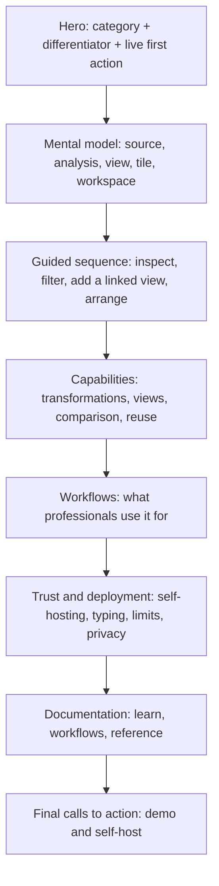

# DataDrop Workbench: Landing Page and Documentation Strategy

**Prepared:** 28 July 2026  
**Scope:** public landing page, guided product tour, web documentation, and documentation embedded inside workspaces  
**Primary recommendation:** keep the live workbench and state-aware tutorial infrastructure; replace the current messaging, teaching order, terminology, and information architecture.

---

## Contents

1. [Executive summary](#executive-summary)
2. [Research basis and product reading](#1-research-basis-and-product-reading)
3. [Diagnosis of the current landing page](#2-diagnosis-of-the-current-landing-page)
4. [Positioning and messaging foundation](#3-positioning-and-messaging-foundation)
5. [Recommended landing-page architecture](#4-recommended-landing-page-architecture)
6. [Full recommended landing-page copy draft](#5-full-recommended-landing-page-copy-draft)
7. [Redesigning the guided tour](#6-redesigning-the-guided-tour)
8. [Documentation strategy](#7-documentation-strategy)
9. [What to take from Wolfram documentation](#8-what-to-take-from-wolfram-documentation)
10. [Documentation inside the workbench](#9-documentation-inside-the-workbench)
11. [Documentation content model](#10-documentation-content-model)
12. [Documentation architecture and routing](#11-documentation-architecture-and-routing)
13. [Initial documentation inventory and priority](#12-initial-documentation-inventory-and-priority)
14. [Example documentation pages](#13-example-documentation-pages)
15. [Landing-page and documentation interaction design](#14-landing-page-and-documentation-interaction-design)
16. [Measurement and research plan](#15-measurement-and-research-plan)
17. [Implementation sequence](#16-implementation-sequence)
18. [Quality assurance and anti-rot system](#17-quality-assurance-and-anti-rot-system)
19. [Acceptance criteria](#18-acceptance-criteria)
20. [Product decisions that must be settled](#19-product-decisions-that-must-be-settled)
21. [Recommended immediate copy changes](#20-recommended-immediate-copy-changes)
22. [Final recommended page map](#21-final-recommended-page-map)
23. [Source audit](#22-source-audit)
24. [Condensed recommendation](#23-condensed-recommendation)

---

## Executive summary

DataDrop has a conventional product category and an unconventional interaction model.

The conventional part is easy to explain: it opens tabular datasets and event streams, lets people inspect and transform the data, and produces tables and charts. The unusual part is the reason to care: an analysis is not trapped in a single chart editor. It can be viewed simultaneously through linked tiles—chart, table, pipeline, field mappings, sources, comparisons, and other tools—arranged across workspaces. Visible items remain actionable, and an action can ask the user to choose another item elsewhere in the workspace. This makes a complicated analysis manageable without hiding its structure.

The current landing page makes the unusual part harder to understand than it needs to be. It starts with abstract product language, then teaches the implementation's conceptual vocabulary—objects, verbs, acceptance, grammar, modules—before the visitor has completed a useful task. It also places runtime internals and intellectual lineage in the main sales progression. The result is technically informed but commercially weak: a new visitor must decode the system before seeing why it is useful.

The redesign should follow one rule:

> **Give the visitor a useful result first. Name the underlying model after they have experienced it.**

The landing page should therefore progress through a single coherent analysis:

1. Open a sample dataset.
2. Act directly on a visible value or mark.
3. See the resulting filter appear as an explicit pipeline step.
4. Add a second linked view.
5. Rearrange the workspace without changing the analysis.
6. Branch, compare, save, or export the result.

This sequence teaches the product's distinctive model through consequences rather than through terminology. The full conceptual model and module catalogue then belong in documentation, where they can be presented with the depth and cross-linking of the Wolfram Language documentation system.

The documentation should use four connected page families:

- **Start and workflows** for completing real tasks.
- **Concepts** for explaining the mental model.
- **Reference** for every action, tile, transformation, visual mapping, source type, CLI command, and API endpoint.
- **Technical notes** for architecture, embedding, state ownership, security, limits, and extension development.

The strongest idea to adopt from Wolfram is not its visual style. It is its information model: every concept has a concise reference page, every page starts with the essential form, basic examples come before exhaustive detail, predictable sections cover scope and failure modes, and dense cross-links connect reference, guides, workflows, and technical notes. DataDrop can improve on this by making the examples actual isolated workbenches and by allowing those documentation examples to become normal workspaces.

The existing codebase already provides much of the required runtime:

- the hero and tutorial use the real `WorkbenchShell`, not screenshots;
- each embedded workbench has an isolated store and fixtures;
- lesson completion observes resulting application state rather than click paths;
- lessons, cheat sheets, briefs, and the module rack are normal tiles;
- the registry and tour tests already guard against undocumented applications.

The work is therefore primarily a content-system and curriculum redesign, plus a generalization of the existing tour infrastructure into a documentation runtime.

---

## 1. Research basis and product reading

This strategy is based on the following current sources:

- the [live landing page](https://datadrop.yolo.scapegoat.dev/);
- the [DataDrop repository](https://github.com/go-go-golems/go-go-datadrop);
- the current [landing-page copy](https://github.com/go-go-golems/go-go-datadrop/blob/main/ui/src/components/pages/MarketingPage/copy.ts) and [page composition](https://github.com/go-go-golems/go-go-datadrop/blob/main/ui/src/components/pages/MarketingPage/MarketingPage.tsx);
- the current [tutorial sequence](https://github.com/go-go-golems/go-go-datadrop/blob/main/ui/src/components/pages/TutorialBand/TutorialBand.tsx), including the [object/action lessons](https://github.com/go-go-golems/go-go-datadrop/blob/main/ui/src/tour/lessons/objects.tsx), [layout lessons](https://github.com/go-go-golems/go-go-datadrop/blob/main/ui/src/tour/lessons/layout.tsx), and [visual grammar lessons](https://github.com/go-go-golems/go-go-datadrop/blob/main/ui/src/tour/lessons/grammar.tsx);
- the [registered application list](https://github.com/go-go-golems/go-go-datadrop/blob/main/ui/src/apps/all.ts), [module catalogue](https://github.com/go-go-golems/go-go-datadrop/blob/main/ui/src/tour/modules.tsx), [tour content context](https://github.com/go-go-golems/go-go-datadrop/blob/main/ui/src/appkit/TourContent.tsx), and [executable tutorial design record](https://github.com/go-go-golems/go-go-datadrop/blob/main/ttmp/2026/07/26/DATADROP-7--landing-page-and-embedded-tutorial-workbenches-multi-instance-workbench-lesson-rail-and-the-module-rack/index.md);
- the product capabilities and constraints documented in the [README](https://github.com/go-go-golems/go-go-datadrop/blob/main/README.md);
- the [Wolfram Language Documentation Center](https://reference.wolfram.com/language/), the [`Dataset` reference page](https://reference.wolfram.com/language/ref/Dataset.html), the [`Manipulate` reference page](https://reference.wolfram.com/language/ref/Manipulate.html), the [Data Visualization guide](https://reference.wolfram.com/language/guide/DataVisualization.html), the [Build a Manipulate workflow](https://reference.wolfram.com/language/workflow/BuildAManipulate.html), and the [Introduction to Dynamic technical note](https://reference.wolfram.com/language/tutorial/IntroductionToDynamic.html).

### 1.1 Product category

At the highest level, DataDrop is a self-hostable data service and visual analysis workbench. The service accepts append-only event streams and versioned datasets; the workbench opens a stream or a committed dataset file as a typed table and supports visual analysis over a bounded window.

For landing-page purposes, the category sentence should be simpler:

> **DataDrop Workbench is an interactive visual workspace for exploring tabular datasets and event streams.**

That sentence should appear before any discussion of DuckDB, grammar of graphics, object presentation, provenance, or the action protocol.

### 1.2 The product's real differentiator

The strongest differentiator is not that DataDrop draws charts. Many products do that. It is not merely that transformations are visible. Several notebook and BI products do that as well.

The distinctive combination is:

1. **One analysis can have many simultaneous views.** A chart, result table, pipeline, and visual mapping can all refer to the same underlying analysis.
2. **The layout is independent from the analysis.** Tiles can be split, moved, replaced, closed, and arranged into workspaces without destroying the underlying analytical state.
3. **Visible items are actionable.** Fields, rows, marks, categories, steps, sources, charts, tiles, and workspaces can expose actions appropriate to their type.
4. **Actions can compose across the workspace.** An action can pause and ask the user to select a compatible field, chart, snapshot, or other item elsewhere.
5. **The reasoning remains inspectable.** Filters and other transformations become explicit, ordered steps rather than disappearing into an opaque chart configuration.
6. **Examples can be the actual product.** The existing embedded workbenches use the same shell and applications as the workbench itself, with isolated state and fixture-backed data.

A concise value proposition follows from those facts:

> **Build analyses from linked views, act directly on what you see, and keep every transformation visible.**

### 1.3 The mental model the product must teach

The product has several layers that are currently named too early and too technically. A professional user-facing model should be introduced in this order:

| Term | User-facing definition | Why it matters |
|---|---|---|
| **Source** | The dataset file or event stream being examined. | Establishes where the rows come from. |
| **Analysis** | A source plus its transformation steps and visual settings. | Gives the user one durable object to reason about. |
| **View** | A table, chart, pipeline, field-mapping editor, or other way to inspect an analysis. | Explains why several tiles can update together. |
| **Tile** | A movable frame containing a view or tool. | Explains the layout mechanics. |
| **Workspace** | An arrangement of tiles over the user's available analyses and tools. | Explains organization and presentation. |
| **Action** | An operation available from the item currently in focus. | Explains contextual menus without implementation language. |
| **Pipeline** | The ordered transformations applied to the source. | Makes the reasoning visible and editable. |
| **Snapshot** | A preserved analysis state for restoration or comparison. | Explains comparison without conflating it with a live analysis. |
| **Template** | A reusable workspace or tile arrangement. | Explains repeatable setups. |

The internal or advanced terms can still exist in developer documentation, but they should not lead onboarding:

| Current/internal term | Recommended public term |
|---|---|
| object | item, value, field, chart, step, or the exact object type |
| verb | action |
| accept / accepting | choose an input; select a field/chart/snapshot |
| presentation type | item type or object type |
| document / DOC strip | analysis; Analysis selector |
| world | session or shared workspace state |
| module | view or tool |
| encoding | visual mapping, with “encoding” introduced in advanced reference |
| geom | mark type, with “geometry” introduced in advanced reference |
| active document | current analysis |

The UI itself should eventually reflect this terminology. Copy alone cannot compensate for a title strip that says `DOC`, a banner that says an action is “accepting,” and a tutorial that calls ordinary menu operations “verbs.”

---

## 2. Diagnosis of the current landing page

### 2.1 What is already strong

The redesign should preserve several decisions.

#### The product is shown as a live product

The hero contains a real workbench instance rather than a screenshot or a bespoke simulation. This is unusually strong. It makes the product claim testable and allows the first interaction to prove the linked-view model.

#### Tutorial completion is outcome-based

The lesson machinery checks whether the application reached a target state, not whether a specific control was clicked. That permits alternative valid routes and substantially reduces tutorial rot. It is the right foundation for executable documentation.

#### Teaching content is part of the tiling system

Lessons, cheat sheets, module explanations, and the capstone brief are themselves tiles. That is a credible demonstration of the workspace model and a good basis for documentation embedded inside a user's workspace.

#### The tutorial has a capstone

The final brief asks for an outcome and checks a set of conditions rather than dictating a click path. That is the best part of the current learning design and should remain.

#### The implementation is honest about fixtures and isolation

The embedded examples do not depend on a user account or live server data. Each instance has isolated state. Public documentation should retain these properties.

### 2.2 Why the current copy fails

The current copy was explicitly adapted from a different prototype rather than written from DataDrop's present product model. That origin is visible in the result.

#### It does not establish the category quickly

The opening phrase “Browser-native visual analysis” is technically plausible but commercially weak. It does not tell a visitor whether the product is a BI tool, a notebook, a chart library, a data catalogue, a database client, or a dataset viewer.

The first sentence should say what the product is, what data it accepts, and what the user can do with it.

#### It asks the visitor to parse four abstractions immediately

The hero currently refers to chart, table, pipeline, encoding, live document, remapping, transforms, and branching before the visitor understands the central object. This is too much vocabulary before the first success.

#### It uses metaphor where concrete behavior would be stronger

Phrases about keeping a thread, editing from evidence, or branching without flattening are evocative but underspecified. Professional users respond better to exact outcomes:

- add a filter from a chart mark;
- see it appear in the pipeline;
- open a table over the same analysis;
- move or close a tile without losing the analysis;
- preserve a snapshot and compare it with another state.

#### It promotes implementation details too early

The hero chips and the dedicated runtime section emphasize a browser worker, SQL-shaped steps, caching behavior, and execution details. These are useful proof points for a technical audience, but only after the product value is clear. They should appear in a compact trust section and in architecture documentation, not as a primary navigation destination.

#### It puts intellectual lineage in the conversion path

The Genera, CLIM, and grammar-of-graphics lineage is interesting and legitimate. It belongs in an “Interaction model” technical note or an About page. It does not help a new visitor decide whether to continue the tour.

### 2.3 Why the current progression fails

The current tutorial order is approximately:

1. objects and verbs;
2. tiles, documents, and workspaces;
3. grammar of graphics;
4. modules;
5. a capstone brief.

This is the order an implementer might use to explain the system's architecture. It is not the order in which a new analyst experiences value.

The first section asks the user to understand typed objects, contextual verbs, a global argument-selection protocol, an inspector, a watchlist, and a trace transcript. None of these is the primary job the visitor came to perform. The second section then explains layout semantics. Only in the third section does the visitor build an analysis.

The order should be reversed:

1. complete a small analytical task;
2. observe that the chart, table, and pipeline are linked;
3. learn that tiles are views and analyses are the durable objects;
4. learn advanced cross-object actions;
5. browse the full module and reference system.

### 2.4 The page is too long for a first encounter

The current page embeds a hero workbench plus five large tutorial workbenches, with tutorial bodies designed around 720- and 820-pixel frames. This is appropriate for a dedicated learning page but excessive for a landing page. The visitor encounters a large amount of interface before seeing audience fit, common workflows, operational trust, documentation entry points, or deployment options.

Recommended split:

- **Landing page:** one hero instance and one compact guided sequence, no more than three or four objectives.
- **Guided tour:** a dedicated page with the complete curriculum and capstone.
- **Documentation:** topic-specific live examples embedded where they support the page.

The landing and tour can still share components and routes. They should not be forced into one enormous reading experience.

### 2.5 Missing information

The current page underexplains several questions a professional visitor will have:

- What exact source types can I open?
- Is this for static datasets, live streams, or both?
- What is saved: a chart, an analysis, a workspace, or all three?
- What does a workspace contain?
- How do two tiles become linked?
- What transformation operations exist?
- How does DataDrop handle field types and provenance?
- Are answers computed over the full dataset or a bounded window?
- What leaves the browser?
- Can I self-host it?
- How do I install it or connect my own data?
- Where is the task-oriented documentation?

A redesigned page should answer the first five before runtime details and the remaining questions in a concise trust/deployment section.

---

## 3. Positioning and messaging foundation

### 3.1 Recommended category statement

> **An interactive visual workspace for datasets and event streams.**

This is deliberately ordinary. The differentiator follows immediately after the category has been established.

### 3.2 Recommended one-sentence value proposition

> **Arrange linked tables, charts, pipelines, and field mappings around one analysis, then change it directly from any view.**

### 3.3 Recommended short description

> DataDrop Workbench opens a dataset or live event stream as a typed table. Build a visible transformation pipeline, map fields to a chart, and arrange the views you need in a workspace. Because the views refer to the same analysis, a change made from a chart, table, or pipeline is reflected everywhere.

### 3.4 Core messages, in priority order

1. **It is a visual analysis workspace.** Establish the category.
2. **Views stay linked to one analysis.** Explain the structural differentiator.
3. **Work directly from visible values and marks.** Explain contextual actions.
4. **Every transformation remains visible.** Explain inspectability and reversibility.
5. **Tiles and workspaces make complex analysis manageable.** Explain organization and presentation.
6. **It handles datasets and event streams.** Explain source breadth.
7. **It is self-hostable and explicit about limits.** Establish professional trust.
8. **The advanced interaction model is extensible.** Reserve for technical readers.

### 3.5 Primary audiences and jobs

The landing page should not invent detailed personas without customer evidence. It can safely orient around jobs:

| Job | What the user needs to do | DataDrop proof |
|---|---|---|
| Inspect an unfamiliar dataset | See rows, field types, distributions, and provenance before choosing a chart. | Source, table, inspector, and typed fields. |
| Explore a question iteratively | Filter, derive, summarize, sort, and limit without losing prior reasoning. | Visible, ordered pipeline. |
| Compare alternative analyses | Preserve states and inspect them side by side. | Snapshots/gallery, comparison, multiple analyses. |
| Build a working analytical layout | Keep the relevant result, table, pipeline, and controls visible together. | Tiles and workspaces. |
| Follow a changing source | Observe new stream events and know when coverage is incomplete. | Stream source and live behavior, with explicit gaps/limits. |
| Reuse or present a setup | Save, export, share, or apply a prepared workspace. | Workspaces, templates/bundles, links and exports where supported. |
| Operate a self-hosted data inbox | Collect data through HTTP/CLI and inspect it through the same service. | Single binary, streams, datasets, SQLite, open exports. |

### 3.6 Message discipline and claim audit

Every public claim should meet all four conditions:

1. It names a behavior a user can recognize.
2. The behavior exists in the current product.
3. A linked demo, documentation example, test, or source file can substantiate it.
4. The copy states important limits alongside the capability.

For example:

- Good: “Filters, derives, summaries, sorts, and limits appear as ordered steps.”
- Weak: “Keep computation visible.”
- Good: “The table and chart update together when they show the same analysis.”
- Weak: “Several useful views.”
- Good: “Source windows and result limits are shown when an answer is truncated.”
- Weak: “Enterprise-grade accuracy.”

### 3.7 Voice and style

The desired voice is technical, calm, and concrete.

#### Use

- exact nouns: dataset, event stream, field, filter, table, chart, pipeline, tile, workspace;
- direct verbs: open, inspect, filter, summarize, map, arrange, compare, save, export;
- short declarative headings;
- a sentence that says what changed after every interaction;
- explicit distinctions when concepts are easy to confuse;
- plain descriptions of constraints.

#### Avoid

- cute product voice;
- unexplained metaphors;
- slogans that omit the product category;
- internal architecture terms in the first two screenfuls;
- compressed symbolic notation in onboarding;
- references to research lineage in primary conversion copy;
- speculative runtime claims;
- “magic,” “effortless,” “revolutionary,” “seamless,” or similarly untestable language.

### 3.8 Example rewrites

| Abstract wording | Professional replacement |
|---|---|
| Explore data without losing the thread. | Build an analysis you can inspect from every side. |
| Edit from the evidence. | Add filters and mappings directly from chart marks, table values, and fields. |
| Keep computation visible. | Every transformation remains an ordered, editable pipeline step. |
| Branch without flattening. | Create another analysis or snapshot without changing the original. |
| Objects and verbs. | Work from the item on screen. |
| Accept: a command reaching out for its argument. | When an action needs a field or chart, select it anywhere in the workspace. |
| Workspaces are camera positions. | A workspace stores a layout; the underlying analyses remain available in every workspace. |
| The grammar. | Build a chart from transformed data, field mappings, and a mark type. |

---

## 4. Recommended landing-page architecture

### 4.1 Design principles

1. **One question, one narrative.** The interactive sections should use a single sample dataset and build toward one answer.
2. **One new concept per step.** Do not introduce tiles, analyses, actions, mappings, snapshots, and workspaces at once.
3. **Every paragraph must point to something visible.** The live workbench should demonstrate the sentence beside it.
4. **Show a consequence immediately.** A successful interaction should change at least two linked views or add an explicit pipeline step.
5. **Use the product's terms only after showing the behavior.** Experience first, definition second.
6. **Keep advanced depth available but off the main path.** Use expandable details and links to documentation.
7. **Separate evaluation from adoption.** “Explore the sample” and “Install/self-host” are distinct calls to action.
8. **Do not make right-click the only discoverable path.** Every contextual action should also have a visible Actions button and a keyboard path.

### 4.2 Recommended top-level navigation

**Left:** DataDrop wordmark, with “Workbench” as the product area if needed.  
**Links:** Product · How it works · Examples · Documentation · GitHub  
**Primary action:** Open the demo  
**Optional secondary action:** Install / Self-host

Remove “Runtime” from primary navigation. Runtime belongs under Documentation → Architecture or under a short trust section.

### 4.3 Recommended page sequence



### 4.4 Section 1 — Hero

#### Purpose

Establish the category, state the differentiator, and produce one visible success.

#### Layout

- Left: category, headline, description, calls to action, concise proof points.
- Right: a live workbench with a chart, a pipeline, and optionally a table.
- Above the workbench: one instruction, one progress indicator, reset control.
- Do not show a module rack, trace, watchlist, or account tools in the hero.

#### Interaction

Highlight one categorical mark or legend item. Give two equivalent paths:

- select the visible **Actions** control;
- right-click the item.

The user chooses **Keep only**. The result should be obvious:

- the chart updates;
- the table row count changes if visible;
- a filter step appears in the pipeline;
- a short success message explains that all views changed because they share one analysis.

#### Recommended hero copy

**Eyebrow**  
Visual analysis for datasets and event streams

**Headline**  
Build an analysis you can inspect from every side.

**Description**  
Open a dataset or live stream. Work with linked charts, tables, fields, and transformation steps, then arrange the views you need in a workspace. Change the analysis from any view and keep every step visible.

**Primary action**  
Explore the sample workspace

**Secondary action**  
Read the documentation

**Proof line**  
Self-hosted · typed data · visible transformations · open exports

**Demo instruction**  
Start here: open **Actions** on the highlighted station and choose **Keep only**.

**Success message**  
The filter was added to the pipeline. The chart and table changed because they are views of the same analysis.

#### Hero copy alternatives

**More outcome-oriented:**  
From raw rows to an explainable analysis.

**More interface-oriented:**  
One analysis. Every view you need.

**More concise:**  
See the data. See the steps.

The recommended headline is the first one because it signals both the multi-view interface and inspectability without relying on internal terminology.

### 4.5 Section 2 — Explain the mental model

#### Heading

One analysis, arranged as linked views.

#### Body

A chart is not the endpoint. It is one view of an analysis that also contains the source, transformation pipeline, field mappings, and current result. Put several views beside one another and they stay in sync. Move or close a tile and the analysis remains intact.

#### Four-part visual

1. **Source** — the dataset file or event stream.
2. **Analysis** — the source, transformations, and visual settings.
3. **Views** — chart, table, pipeline, field mappings, and tools.
4. **Workspace** — the arrangement of tiles.

Use a visual diagram in which several tiles point to one analysis. Avoid diagrams that imply the tiles copy data into one another.

#### Important distinction card

> **Tiles are views. Analyses contain the work.**  
> Closing a tile removes a view from the layout. It does not delete the analysis.

This is the clearest conceptual distinction in the current tutorial and should appear early, but in plain language and after the first successful interaction.

### 4.6 Section 3 — Compact guided sequence

#### Heading

Follow one analysis from question to result.

#### Intro

Use the sample weather readings to compare stations. Each step changes the live analysis and introduces one part of the workspace.

#### Recommended desktop pattern

Use a sticky 65% workbench on the right and a 35% step rail on the left. As the user advances, the same workbench remains in place. This reduces load, preserves continuity, and prevents five large isolated panels from dominating the page.

A separate instance per step remains acceptable for documentation pages where isolation is pedagogically useful. The public landing page should prefer continuity.

#### Step 1 — Inspect a field

**Heading:** Understand the data before choosing a chart.  
**Instruction:** Open the temperature field and inspect its type, range, and distribution.  
**Visible result:** The inspector shows the field summary and provenance.  
**Concept introduced:** fields are typed items, not merely text labels.

#### Step 2 — Filter from the result

**Heading:** Change the analysis from the chart.  
**Instruction:** Keep one station from a mark or legend item.  
**Visible result:** a filter appears in the pipeline and every linked view updates.  
**Concept introduced:** contextual actions edit the underlying analysis.

#### Step 3 — Build a summary

**Heading:** Keep the transformation visible.  
**Instruction:** Group by station and calculate mean temperature; map station and the summary to a bar chart.  
**Visible result:** the output schema changes, the chart changes, and the pipeline shows the aggregation.  
**Concept introduced:** transformed data and visual mappings are separate, inspectable parts.

Use ordinary language in the step rail. Advanced documentation can explain that this is a grammar-of-graphics composition.

#### Step 4 — Add and arrange a linked view

**Heading:** Put the result beside the rows that produced it.  
**Instruction:** Split a tile, open a table, and point it at the same analysis.  
**Visible result:** the table and chart show the same filtered summary. Moving or closing the tile does not change the analysis.  
**Concept introduced:** tiles are layout; analyses are state.

#### Completion panel

**Heading:** You built a multi-view analysis.  
**Body:** The source, transformations, table, and chart are still available as separate views of one analysis. Continue with comparison and snapshots in the guided tour, or open the sample as a normal workspace.

**Actions:**  
Open this workspace · Continue the guided tour · Read the concepts

### 4.7 Section 4 — Capabilities

#### Heading

Designed for exploratory work that must remain legible.

#### Capability cards

**Linked views**  
Open the chart, table, pipeline, and visual mappings together. A change to the analysis is reflected in every view that uses it.

**Visible transformations**  
Filter, derive, summarize, sort, and limit as ordered steps. Disable, reorder, inspect, or remove a step without reconstructing the analysis.

**Contextual actions**  
Work from a field, row, mark, category, step, source, chart, tile, or workspace. The available actions reflect the item being used.

**Flexible workspaces**  
Split, move, replace, and close tiles. Keep several layouts over the same set of analyses and tools.

**Comparison and preservation**  
Preserve analytical states and place alternatives side by side without turning them into screenshots.

**Datasets and streams**  
Inspect finite, versioned dataset files and bounded windows over append-only event streams.

**Exports and links**  
Export results and charts, and share a specification or workspace where the current product supports it. State the exact behavior and security properties beside each sharing mechanism.

### 4.8 Section 5 — Workflow fit

#### Heading

Use it to answer questions, not only to render charts.

#### Workflow examples

- **Inspect a new dataset:** review rows, field types, provenance, distributions, and missing values before choosing an analysis.
- **Build a filtered summary:** select from a chart or table, add explicit transformations, and keep the result beside the pipeline.
- **Compare two approaches:** preserve two states and inspect their source, steps, mappings, and output side by side.
- **Monitor a stream window:** follow recent events while retaining explicit coverage and gap information.
- **Prepare a reusable workspace:** arrange the relevant sources, analyses, and tools, then save or export the setup according to the implemented workspace model.

Each workflow card should link to a complete executable documentation page, not to generic marketing prose.

### 4.9 Section 6 — Trust, limits, and deployment

#### Heading

Clear about where the data comes from and what the result covers.

#### Body

DataDrop is self-hostable and serves the workbench from the same application as the data service. The server projects sources into typed tables, and the browser executes the visible analysis pipeline. Coverage limits and truncation are reported rather than hidden.

#### Proof points

**Typed at the source**  
Fields arrive with data types and provenance; components do not independently guess the same column differently.

**Explicit windows and caps**  
The interface identifies bounded source windows and reports truncated results. Do not imply whole-dataset analytics when the product is showing a capped result.

**Browser worker execution**  
The analytical pipeline runs through the product's browser-side query engine. Keep the exact implementation details in architecture documentation.

**Self-hosted service**  
The workbench, stream and dataset APIs, storage, authentication integration, and exports are part of the deployable DataDrop service.

**Open exits**  
Document CSV, JSON/JSONL, NDJSON, PNG, and other supported exports precisely. “Open” should always name the actual format.

This section should link to Security, Data limits, Architecture, and Deployment pages.

### 4.10 Section 7 — Documentation entry

#### Heading

Learn in the same interface you use for the work.

#### Body

Documentation examples run as isolated workbenches. Follow a workflow, inspect the completed state, or open the example as a normal workspace. Reference pages are available for every source, action, tile, transformation, visual mapping, command, and endpoint.

#### Entry cards

- Start with a dataset
- Understand analyses, tiles, and workspaces
- Build a transformation pipeline
- Create and arrange linked views
- Work with event streams
- Browse actions and tile reference
- Use the CLI and API
- Embed a workbench

### 4.11 Section 8 — Final call to action

#### Heading

Explore the sample, then connect your own data.

#### Primary action

Open the sample workspace

#### Secondary actions

Install DataDrop · Read the quickstart · View the source

Do not collapse evaluation and installation into one ambiguous “Get started” button.

---

## 5. Full recommended landing-page copy draft

The following is a coherent first draft. It is intended to be edited against the exact implemented behavior and product naming before publication.

### Header

**DataDrop Workbench**  
Overview · How it works · Workflows · Documentation · GitHub  
**Open workbench**

### Hero

**Visual analysis for datasets and event streams**

**Headline:** Build an analysis you can inspect from every side.

Open a dataset or live stream. Work with linked charts, tables, fields, and transformation steps, then arrange the views you need in a workspace. Change the analysis from any view and keep every step visible.

**Try the sample**  
Open workbench · Read the documentation

Self-hosted · typed data · visible transformations · open exports

**Start here:** Open **Actions** on the highlighted station and choose **Keep only**.

**After completion:** The filter was added to the pipeline. The chart and table changed because they are views of the same analysis.

### Mental model

**Section headline:** One analysis, arranged as linked views.

A chart is not the endpoint. It is one view of an analysis that also contains the source, transformation pipeline, field mappings, and current result. Put several views beside one another and they stay in sync. Move or close a tile and the analysis remains intact.

**Source**  
The dataset file or event stream.

**Analysis**  
The source, transformations, and visual settings.

**View**  
A chart, table, pipeline, mapping editor, or tool.

**Workspace**  
The arrangement of tiles around your work.

> **Tiles are views. Analyses contain the work.** Closing a tile changes the layout, not the analysis.

### Guided sequence

**Section headline:** Follow one analysis from question to result.

Use the sample weather readings to compare stations. Each step changes the live analysis and introduces one part of the workspace.

### 1. Inspect the field

Review the temperature field's type, range, and distribution before choosing a chart.

### 2. Filter from the chart

Keep one station from a mark or legend item. The filter appears as an explicit pipeline step and every linked view updates.

### 3. Build a summary

Group by station, calculate mean temperature, and map the result to a bar chart. The transformed schema and visual mapping remain visible beside the result.

### 4. Add a linked table

Split a tile and open a table over the same analysis. Move or close the tile without changing the analysis itself.

**You built a multi-view analysis.**  
Open it as a normal workspace, continue to comparison and snapshots, or read the concepts behind the interface.

### Capabilities

**Section headline:** Designed for exploratory work that must remain legible.

**Linked views**  
Keep the chart, table, pipeline, and visual mappings open together. Views that use the same analysis update together.

**Visible transformations**  
Filter, derive, summarize, sort, and limit as ordered steps. Disable, reorder, inspect, or remove them in place.

**Actions from the item on screen**  
Open the actions for a field, value, mark, category, step, source, chart, tile, or workspace. When an action needs another input, select it anywhere in the workspace.

**Flexible workspaces**  
Split, move, replace, and close tiles. Keep different layouts over the same analytical state.

**Comparison without screenshots**  
Preserve analytical states and inspect alternatives side by side.

**Datasets and streams**  
Work with finite, versioned dataset files and bounded windows over append-only event streams.

### Workflows

**Section headline:** Use it to answer questions, not only to render charts.

Inspect an unfamiliar dataset. Build a filtered summary. Compare two analytical states. Follow a stream window. Prepare a reusable workspace. Each workflow is documented as an executable example that can be opened in the workbench.

**Browse workflows**

### Trust and deployment

**Section headline:** Clear about where the data comes from and what the result covers.

DataDrop is self-hostable and serves the workbench with the data service. Sources arrive as typed tables with provenance. Analytical queries run through the browser-side engine, and bounded windows or truncated results are identified rather than presented as complete answers.

**Read about architecture and limits**  
**Install DataDrop**

### Documentation

**Section headline:** Learn in the same interface you use for the work.

Documentation examples are isolated instances of the actual workbench. Follow a workflow, reset it, inspect the completed state, or open the example as a normal workspace. Look up any source, action, tile, transformation, mapping, command, or endpoint in the reference.

Start with a dataset · Analyses and workspaces · Transformation pipelines · Visual mappings · Event streams · Action reference · CLI and API

### Final call to action

**Section headline:** Explore the sample, then connect your own data.

**Open the sample workspace**  
Install DataDrop · Read the quickstart · View the source

---
## 6. Redesigning the guided tour

The landing page should contain a compact demonstration. The full guided tour should remain a dedicated learning experience and can be substantially deeper.

### 6.1 Preserve the current tutorial mechanics

Keep the following implementation properties:

- every exercise uses the actual application components;
- each tutorial workbench has isolated state and fixture-backed data;
- completion is determined from the resulting state;
- a user can reach a valid outcome through an unanticipated route;
- reset discards the sandbox rather than trying to reverse every action;
- lesson and brief content can appear as normal tiles;
- exercises can restrict the available tools to those relevant to the lesson;
- anti-rot tests verify that content, app registrations, fixtures, and predicates remain aligned.

These are more valuable than the current lesson copy and should be treated as permanent infrastructure.

### 6.2 Replace the current conceptual order

The current sequence is architecture-first. The new sequence should be task-first.

| Current chapter | Problem | New location |
|---|---|---|
| Objects and verbs | Introduces internal abstractions, inspector, watchlist, trace, and argument selection before useful analysis. | Advanced interaction chapter and action reference. |
| Tiles, documents, workspaces | Important, but currently precedes the user's first meaningful analytical result. | Second or third chapter, after linked views have been experienced. |
| The grammar | Valuable but jargon-heavy for first contact. | Workflow chapter using ordinary language; formal grammar in a concept/technical note. |
| The modules | Reference material, not a guided narrative. | Documentation home and module reference. |
| The brief | Strong outcome-based assessment. | Keep as the capstone. |

### 6.3 Recommended tour curriculum

#### Chapter 1 — Filter a view

**Question:** How do the readings differ by station?  
**Starting workspace:** chart, compact table, compact pipeline, lesson tile.  
**Goals:**

1. Inspect the station or temperature field.
2. Keep one station from the chart or table.
3. Find the filter in the pipeline.
4. Disable and re-enable it.

**Concepts learned:** actions, linked views, visible transformations.

This chapter gives the visitor the product's central payoff in the first few interactions. It should not require the user to understand generic object types or the trace system.

#### Chapter 2 — Build a summary

**Question:** Which station has the highest average temperature?  
**Starting workspace:** source, table, pipeline, visual mapping, chart, lesson tile.  
**Goals:**

1. Group by station.
2. Calculate mean temperature.
3. Map station to the horizontal axis and the mean to the vertical axis.
4. Select bars as the mark type.
5. Inspect the changed output schema.

**Concepts learned:** ordered transformations, schema changes, field mappings, mark requirements.

Use “group and summarize,” “visual mapping,” and “mark type” in the lesson. Link to the formal grammar-of-graphics page for readers who want the model.

#### Chapter 3 — Arrange linked views

**Question:** How can I keep the evidence beside the result?  
**Starting workspace:** one analysis visible through a chart and pipeline.  
**Goals:**

1. Split a tile.
2. Open a table in the new tile.
3. Point it at the same analysis.
4. Move the tiles into a useful arrangement.
5. Close and reopen one view.

**Concepts learned:** analysis versus view, tile layout, safe rearrangement.

The explanatory statement should be direct:

> A tile contains a view. The analysis remains available when the view is moved or closed.

#### Chapter 4 — Compare and preserve

**Question:** How does the result change under another filter or summary?  
**Starting workspace:** one completed analysis plus gallery/snapshot and comparison tools.  
**Goals:**

1. Preserve the current state.
2. change the live analysis;
3. preserve the second state;
4. place both states in comparison;
5. restore one state into a live analysis or create a new analysis from it.

**Concepts learned:** live analysis versus snapshot, comparison, branching.

Do not use “branch” before explaining what is copied and what remains linked.

#### Chapter 5 — Compose actions across the workspace

**Question:** How can one tool use an item from another tile?  
**Starting workspace:** source, pipeline, visual mapping, watchlist or comparison, lesson tile.  
**Goals:**

1. Start an action that needs a field.
2. Select a compatible field in another tile.
3. cancel an in-progress selection;
4. repeat the action through a different route;
5. inspect what the action changed.

**Concepts learned:** cross-tile input selection, compatible item types, cancellation, contextual actions.

This is where the current “accept” protocol belongs. The public language should be “select the input this action needs.” The implementation and developer documentation can retain the protocol name.

#### Chapter 6 — Build a workspace from a brief

**Question:** Which stations are warmer, and how confident are you that the view covers the relevant data?  
**Starting workspace:** source and a brief tile, with the full relevant application set available.  
**Goals:**

- create a filtered or summarized analysis that answers the question;
- show a table and chart over the same analysis;
- keep the pipeline visible;
- preserve at least one comparison state;
- expose the source window or result coverage;
- arrange the workspace so another person can inspect the reasoning.

The state-based goal checker should permit any valid route. Hints should explain concepts or direct attention, not perform the task. A separate “Show one solution” action may be useful after completion or explicit abandonment, but it should load a completed workspace rather than replay a brittle sequence of clicks.

### 6.4 Move the module rack into reference

The module rack is valuable because it forces the project to describe every registered application and because its test prevents undocumented modules from shipping. It is not an effective fourth chapter in a narrative tour.

Convert it into:

- a **Tiles and tools** guide page;
- one generated reference page per registered application;
- a searchable module browser inside the documentation tile;
- context help from each tile's title bar;
- an optional advanced “Explore the workbench tools” lesson after the main tour.

### 6.5 Keep the trace and watchlist out of the first-run path

The trace and watchlist illustrate the interaction model, but they are secondary tools. Introducing them in the first chapter competes with the primary analysis workflow.

Recommended placement:

- **Watchlist:** advanced workflow, “Keep fields and states within reach.”
- **Inspector:** available in the first chapter, but described as an ordinary field/value inspection tool.
- **Trace:** debugging and audit technical note; optional advanced tour step.

### 6.6 Tutorial UX requirements

- Always show the current objective in one sentence.
- State what visible change will indicate success.
- Keep the lesson tile movable and closable.
- Provide **Reset chapter**, **Next hint**, **Open completed example**, and **Open as workspace**.
- Do not make a “Do it for me” button the default route. It encourages passive progress.
- When an automated demonstration is provided, mark the result as demonstrated rather than completed by the learner.
- Use no more than one prediction question per chapter, only where it reveals a core model distinction.
- Preserve progress within the tour session, but do not mix it with the user's durable analytical work unless explicitly saved.
- On small screens, open the workbench in a full-frame mode and show the objective as a compact overlay or bottom sheet.

---

## 7. Documentation strategy

### 7.1 Documentation goals

The documentation must serve four modes without making one page perform all four:

1. **I am new and need a useful first result.**
2. **I know the task but not the product steps.**
3. **I know the product and need an exact reference.**
4. **I need to understand or extend the architecture.**

A single linear manual will fail at least three of these modes. Use connected page families instead.

### 7.2 Proposed documentation information architecture

```text
Documentation
├── Start
│   ├── Quickstart: explore the sample dataset
│   ├── Connect your own data
│   ├── Build your first workspace
│   ├── Guided tour
│   └── Product vocabulary
├── Workflows
│   ├── Inspect an unfamiliar dataset
│   ├── Filter from a chart or table
│   ├── Build a grouped summary
│   ├── Create a multi-view analysis
│   ├── Compare two analytical states
│   ├── Follow an event stream
│   ├── Save and reuse a workspace
│   └── Export and share results
├── Concepts
│   ├── Sources, analyses, views, tiles, and workspaces
│   ├── Linked views
│   ├── Contextual actions
│   ├── Transformation pipelines
│   ├── Field types and provenance
│   ├── Visual mappings and mark types
│   ├── Live analyses and snapshots
│   ├── Coverage, windows, and truncation
│   └── Streams versus datasets
├── Reference
│   ├── Sources and source windows
│   ├── Actions
│   ├── Tiles and tools
│   ├── Transformations
│   ├── Visual mappings
│   ├── Mark types and scales
│   ├── Workspace operations
│   ├── Snapshots and comparison
│   ├── Templates and portable bundles
│   ├── Account tools
│   └── Keyboard and accessibility
├── DataDrop service
│   ├── Drops
│   ├── Streams and events
│   ├── Datasets and versions
│   ├── Schemas
│   ├── Materialization
│   ├── Authentication and tokens
│   ├── Storage and garbage collection
│   └── Limits and retention
├── CLI
│   ├── Installation and configuration
│   ├── Command overview
│   └── One page per command
├── HTTP API
│   ├── Authentication
│   ├── Streams
│   ├── Datasets
│   ├── Table projection
│   ├── Errors and exit/status codes
│   └── Examples
├── Operations
│   ├── Deployment
│   ├── OIDC configuration
│   ├── Backups
│   ├── Observability
│   ├── Security model
│   └── Upgrades
└── Developer
    ├── Embed a workbench
    ├── Application registry
    ├── Presentation/action protocol
    ├── State ownership
    ├── Window manager and workspaces
    ├── Component layers
    ├── Fixture-backed examples
    └── Contributing documentation
```

The current embedded architecture help pages belong under **Developer**, not in the first-run user path.

### 7.3 Four page families

#### A. Workflow pages

Workflow pages answer: “How do I accomplish this outcome?”

They should be concise and executable.

**Required structure:**

1. Title stated as an outcome.
2. One-sentence result.
3. Time/complexity label and prerequisites.
4. Starting state and sample data.
5. Live workbench with a brief or lesson tile.
6. Steps, each with the expected visible result.
7. Completed state.
8. Alternative routes.
9. Explanation of why the result works.
10. Common issues.
11. Related concepts, actions, and reference pages.
12. Open this example in a workspace.

Examples:

- Compare average temperature by station.
- Filter a stream to one device and inspect gaps.
- Build a table and chart over the same analysis.
- Preserve two states and compare their pipelines.

#### B. Concept pages

Concept pages answer: “What is this, and how does it relate to the rest of the system?”

**Required structure:**

1. One-sentence definition.
2. Why the concept exists.
3. Diagram or live minimal example.
4. Invariants and ownership.
5. Relationships to other concepts.
6. Common confusions and counterexamples.
7. Practical consequences.
8. Related workflows and reference pages.

Examples:

- Analysis versus tile.
- Linked views.
- Current analysis versus snapshot.
- Stream window versus complete dataset.

#### C. Reference pages

Reference pages answer: “Exactly what does this item do?”

There should be reference pages for:

- every action;
- every registered tile/tool;
- every transformation kind;
- every visual channel and mark type;
- every source type and source-window parameter;
- every workspace operation;
- every CLI command;
- every HTTP resource and endpoint.

Reference pages must be predictable. A user should be able to jump directly to **Basic example**, **Available on**, **Result**, **Possible issues**, or **History** on any page.

#### D. Technical notes

Technical notes answer: “How or why does the system work this way?”

They can use internal vocabulary and detailed architecture. They should not be required to complete ordinary workflows.

Examples:

- Why tiles do not own analytical state.
- How a visible pipeline becomes a browser query.
- How action descriptors and cross-item input selection work.
- How several isolated workbench instances can coexist on one page.
- Why source typing and provenance are server-owned.
- How bounded results and truncation propagate through the interface.

### 7.4 Documentation home

The documentation home should be a navigational surface, not an essay.

#### Recommended copy

**Documentation home title:** DataDrop documentation

Learn the workbench through complete workflows, or look up any source, action, tile, transformation, command, or endpoint.

**Search placeholder:**  
Search actions, tiles, workflows, CLI commands, and API resources

#### Primary cards

**Start with a dataset**  
Open the sample, inspect fields, add a filter, and build a chart.

**Understand the workspace**  
Learn how analyses, views, tiles, and workspaces relate.

**Build a pipeline**  
Filter, derive, summarize, sort, and limit as explicit steps.

**Create linked views**  
Place a table, chart, pipeline, and field mappings around one analysis.

**Work with event streams**  
Open a bounded window, follow new events, and understand coverage.

**Browse reference**  
Find exact behavior for every action, tile, transformation, command, and endpoint.

#### Secondary navigation

- Popular workflows
- Core concepts
- Tile and action reference
- CLI and API
- Deployment and operations
- Developer documentation
- Release history

#### Optional live element

Include one compact, isolated “Filter from a chart” example. Do not turn the documentation home into the full tour.

### 7.5 Shared page shell

Documentation pages can have the same visual and interactive shape as the landing page without becoming identical long-form pages.

#### Global shell

- product/documentation switcher;
- global search;
- version selector;
- breadcrumb;
- left topic navigation on wide screens;
- main content column;
- local table of contents and page actions on wide screens;
- previous/next links;
- related content block.

#### Page header

- page type label: Workflow, Concept, Action, Tile, Transform, CLI, API, Technical note;
- exact title;
- one-sentence summary;
- applicable version;
- prerequisites or “available on” summary;
- actions: Open example, Add to workspace, Copy link, View source.

#### Live example frame

Every frame should have:

- sample name;
- state label: Starting state / Your state / Completed state;
- reset;
- full-frame mode;
- open as workspace;
- coverage/sample-data disclosure;
- static fallback for non-JavaScript rendering;
- a stable direct link to the example and, where useful, a specific step.

#### Page footer

- See also;
- related workflows;
- related concepts;
- related reference;
- page history / introduced / changed;
- feedback with page and version context.

### 7.6 “Same shape” should mean shared rhythm, not forced bulk

Use the same compositional grammar across landing and docs:

1. orientation;
2. concise claim or definition;
3. live proof or example;
4. explanation;
5. progressively deeper detail;
6. related next steps.

Do not force every action reference page to contain a full-height workbench, marketing bands, or a capstone. A simple action may need a 320-pixel example and a compact contract table. A workflow may need a 720-pixel workbench. A technical note may need diagrams and code instead.

---
## 8. What to take from Wolfram documentation

Wolfram's documentation is useful here less as a visual reference than as an information architecture. It supports several modes of learning without pretending they are the same page:

- **reference pages** answer exactly what a function or option does;
- **workflow pages** lead from a starting state to a useful result;
- **guides** organize a field of related capabilities;
- **technical notes** explain models and architecture in depth;
- **live examples** are part of the explanation rather than decoration;
- **dense cross-linking** lets a reader move between task, concept, and exact reference.

That separation is particularly appropriate for DataDrop. A new user needs an outcome-first workflow. An experienced user needs the exact contract of an action or transformation. An administrator needs deployment and security details. A developer needs the object model and presentation protocol. One long tour cannot serve all four.

### 8.1 The core pattern to adopt

A Wolfram reference page typically begins with a terse definition, then expands through stable sections such as Basic Examples, Scope, Options, Applications, Properties & Relations, Possible Issues, See Also, Related Guides, Related Workflows, and History. A Wolfram workflow begins with an outcome and advances through small, cumulative steps. DataDrop should adopt both structures.

The important principle is **progressive disclosure with stable headings**. Readers learn what kind of answer each section contains. Search results can deep-link to a known section. Authors know where new material belongs. Automated checks can require sections that matter for a given page type.

### 8.2 Translation from Wolfram's model to DataDrop

| Wolfram documentation unit | DataDrop equivalent | Purpose |
|---|---|---|
| Symbol reference | Action, tile, transform, object type, CLI command, or endpoint reference | Exact contract and edge cases |
| Basic Examples | Small seeded workbench in a known starting state | First successful use |
| Scope | Applicable object types, source kinds, document states, and workspace contexts | Where the feature works |
| Options | Fields, operators, parameters, limits, and defaults | Configuration |
| Applications | Real analytical workflows | Why and when to use it |
| Properties & Relations | Interactions with documents, views, pipelines, snapshots, and other actions | System relationships |
| Possible Issues | Disabled actions, invalid mappings, missing fields, truncation, stale results, permissions | Failure modes |
| Neat Examples | Advanced compact patterns | Discovery after competence |
| See Also | Closely related actions or tiles | Lateral navigation |
| Related Guides | Topic guides such as “Transform data” | Broader learning |
| Related Workflows | End-to-end tasks | Outcome-based navigation |
| Technical note | Mental model or architecture note | Deep explanation |
| History | Introduced, changed, deprecated | Version confidence |

### 8.3 What not to copy

Do not imitate the density of a mature symbolic-language reference before there is enough content to justify it. Empty sections are worse than absent sections. “Neat Examples” should not appear merely because Wolfram has it. DataDrop should define required and optional sections per page type.

Do not make a live workbench mandatory on every page. A concise reference page can use a focused specimen or an annotated state diff. A workflow deserves the full workspace. An endpoint reference may need a request/response console instead.

Do not hide critical operating limits under a generic “Details” disclosure. Coverage, row budgets, source windows, permission requirements, and browser-runtime constraints affect the meaning of an answer. They should be visible beside the result and repeated under Possible Issues.

Do not reproduce notebook-specific conventions that have no DataDrop equivalent. The objective is not to resemble Mathematica. It is to adopt a proven division between **workflow, guide, reference, and technical explanation**, then make each one executable where DataDrop has a stronger medium.

### 8.4 DataDrop reference-page templates

#### Action reference

Use for verbs exposed by object menus, buttons, keyboard commands, or accept-mode prompts.

1. **Title:** exact UI label, such as `Keep only`.
2. **One-line contract:** what object it acts on and what state it changes.
3. **Forms:** every supported invocation route.
4. **Basic example:** one small live example, with before and after states.
5. **Applies to:** presentation types and required conditions.
6. **Arguments:** accepted object types, values, and selection behavior.
7. **Result:** exact document, world, or layout mutation.
8. **Availability:** why the action may be hidden or disabled.
9. **Properties and relations:** equivalent or inverse actions; generated pipeline step; active-document behavior.
10. **Possible issues:** stale objects, missing categories, invalid target, permissions, or reset behavior.
11. **See also:** related actions, concepts, workflows, and relevant tile references.
12. **History:** introduced and changed versions.

#### Tile reference

1. **Title and purpose.**
2. **Bound to:** one document, the active document, a workspace, an account, or the whole world.
3. **Shows:** data and state rendered by the tile.
4. **Emits:** object types that can be acted on.
5. **Accepts:** object types requested by commands in this tile.
6. **Primary actions:** visible controls and object-menu actions.
7. **Basic example:** open, point, act, observe.
8. **Relationship to nearby tiles:** especially commonly confused pairs.
9. **Persistence and duplication:** what survives closing, what is singleton, what can be duplicated.
10. **Possible issues:** no active document, unsupported source, stale result, insufficient room, unavailable account capability.
11. **See also and workflows.**
12. **History.**

#### Transform reference

1. **Title and concise relational meaning.**
2. **Input schema requirements.**
3. **Parameters and operators.**
4. **Output schema.**
5. **Basic example with input/output rows.**
6. **Order semantics.**
7. **Interaction routes:** add from pipeline, generate from a mark, generate from a row, duplicate or reorder.
8. **SQL or canonical representation:** for advanced inspection, not as the primary teaching language.
9. **Properties and relations:** equivalent actions and neighboring transforms.
10. **Possible issues:** type mismatch, missing values, invalid expression, truncation, or expensive result.
11. **See also, workflows, and history.**

#### Object-type reference

Use for field, source, document, chart snapshot, transform step, datum, category, geometry, channel, tile, workspace, and stage.

1. **Definition.**
2. **Where it appears.**
3. **How to recognize it.**
4. **Default action.**
5. **All actions:** generated from the descriptor registry.
6. **Accepted by:** actions that can request this type.
7. **Identity and lifetime.**
8. **Properties and relations.**
9. **Possible issues.**
10. **See also and history.**

#### CLI command reference

1. **Synopsis.**
2. **Purpose.**
3. **Arguments.**
4. **Flags**, grouped by domain rather than alphabetically where that is clearer.
5. **Output schema and supported formats.**
6. **Examples:** basic, script-safe, and failure cases.
7. **Exit codes.**
8. **Authentication and permissions.**
9. **Relationship to web UI and HTTP API.**
10. **Possible issues and troubleshooting.**
11. **See also and history.**

#### HTTP endpoint reference

1. **Method and path.**
2. **Purpose and authorization.**
3. **Path, query, and header parameters.**
4. **Request schema.**
5. **Success response schema.**
6. **Error responses.**
7. **Pagination, cursor, range, and row-budget semantics.**
8. **Idempotency and retry behavior where applicable.**
9. **Examples using `curl` and the typed client.**
10. **Related CLI command, UI workflow, and domain concepts.**
11. **History.**

### 8.5 DataDrop workflow-page template

A workflow should read like Wolfram's strongest task pages: each section changes one thing and immediately shows the result.

1. **Outcome title:** “Compare average temperature by station.”
2. **Result preview:** the completed chart and linked table.
3. **Starting point:** source, sample, permissions, and expected duration expressed as number of steps rather than minutes.
4. **Step 1 — open the source.**
5. **Step 2 — inspect the relevant fields.**
6. **Step 3 — add or generate transformations.**
7. **Step 4 — map the output.**
8. **Step 5 — arrange supporting evidence.**
9. **Step 6 — preserve or share the result.**
10. **What changed:** a compact state summary of source, pipeline, mapping, and layout.
11. **Variations:** alternate routes to the same result.
12. **Possible issues.**
13. **Related workflows, concepts, actions, and reference.**

Each step should provide three synchronized forms:

- a plain-language instruction;
- a live action in the embedded workspace;
- an inspectable representation of the resulting document state.

The third form is important. It teaches transfer: the reader sees not only where to click, but what the click means.

### 8.6 DataDrop guide-page template

A guide is a map, not a chapter.

**Example: Transform data**

- Start here: Build a filtered summary.
- Transformations: Filter, derive, summarize, sort, limit.
- Actions that create transformations: Keep only, exclude, sort by, group and summarize.
- Concepts: pipeline order, input and output schema, enabled state, active document.
- Advanced: expressions, performance, source windows, generated SQL.
- Troubleshooting: missing fields, invalid types, empty results, result caps.

Every linked item needs a one-sentence annotation. A wall of titles transfers the information-architecture problem to the reader.

### 8.7 Technical-note template

1. **Question or model being explained.**
2. **Summary.**
3. **Diagram.**
4. **Definitions.**
5. **Worked example.**
6. **Invariants and design consequences.**
7. **Failure modes.**
8. **Implementation notes**, clearly separated from user-facing behavior.
9. **Related concepts and reference.**
10. **History and source links.**

Existing pages such as the web UI object model, presentation protocol, and window-manager notes belong in this family. They should not be the entry point for ordinary product use.

---

## 9. Documentation inside the workbench

DataDrop can go beyond conventional documentation because the documentation can occupy the same tile system as the subject it explains. This should become a first-class product capability rather than remain limited to the tour.

### 9.1 The documentation tile

Add a general-purpose **Documentation** tile with four modes.

#### Browse mode

A searchable topic tree and recent/history list. This is the in-product equivalent of the documentation home.

#### Context mode

The tile follows the current focus and shows documentation for the object, action, tile, transform, error, or status under the pointer or keyboard focus.

Examples:

- focus a field chip: show the field object reference and its available actions;
- open a mark menu: show the action group and explain why each action applies;
- focus a filter step: show filter semantics, operators, input/output, and ordering;
- focus a tile title: show the tile reference, document binding, duplication, and layout actions;
- focus a truncation notice: show source-window and result-coverage documentation.

#### Pinned mode

The reader pins a page so it stops following focus. This is necessary for carrying out a multi-step task. The mode must be explicit in the tile header: `FOLLOWING` or `PINNED`.

#### Lesson/brief mode

The tile carries a workflow step list or an outcome-based brief. This generalizes the current Lessons and Brief tiles into documentation content rather than separate one-off applications.

### 9.2 Contextual entry points

Documentation must be reachable without knowing that documentation exists.

- **Tile title bar:** Help for this tile.
- **Object menu:** “About this object” and “Help with these actions.”
- **Action menu item:** a help affordance or keyboard-accessible description for the selected action.
- **Disabled action:** exact reason plus a link to the requirement.
- **Error or warning:** link to the corresponding Possible Issues section.
- **Pipeline step:** “Open transform reference.”
- **Source and coverage banners:** “How this window was selected.”
- **Command palette/search:** documentation results beside actions.
- **Keyboard:** `?` for context help; `Shift+F10` or the Menu key for the focused object's actions.

Right-click can remain efficient, but it cannot be the only discoverable route. A professional interface may use context menus heavily; it still needs a visible **Actions** affordance for touch, keyboard, first-run use, and accessibility.

### 9.3 Documentation pages as actionable objects

A documentation page should be able to present live objects, not merely screenshots or code-formatted names.

Examples:

- a field chip in a page can be inspected or accepted by a waiting command;
- an action reference can expose a `Try action` control that starts the real action against the page's sandbox;
- a transform example can expose its input schema, output schema, and step object;
- a workflow can insert its sample source or completed document into a chosen workspace;
- a tile-reference page can open that tile beside the documentation tile.

This is the product's presentation protocol used for learning. The documentation should not invent a second interaction grammar.

### 9.4 Open, add, and try semantics

Every live documentation example needs explicit commands with predictable scope.

| Command | Result |
|---|---|
| **Try here** | Operate in an isolated sandbox embedded in the page |
| **Open full frame** | Expand the same sandbox without changing state |
| **Open as workspace** | Create a temporary workspace in the current stage using the example bundle |
| **Add to current workspace** | Insert selected tiles/documents into the current workspace after a preview |
| **Copy example bundle** | Copy a portable, versioned bundle |
| **Reset example** | Restore the documented starting state |
| **Show completed state** | Load the canonical answer as a comparison, not overwrite the learner's state |

“Open as workspace” should be the default bridge from documentation to real work. “Add to current workspace” is more powerful and therefore needs a preview that names documents, tiles, and sources being added.

### 9.5 Sandboxes must be safe by default

Documentation should never mutate a user's live analysis merely because they clicked an example.

Default behavior:

- use committed fixtures or a server-provided public sample;
- create an isolated in-memory store;
- disable persistence unless the reader explicitly opens the example as a workspace;
- clearly label sample data;
- prevent account, token, upload, and destructive administrative applications from appearing in examples unless the page is specifically about them;
- let the reader reset in one action;
- never write to the user's template library without an explicit save command.

Pages about a user's own source may opt into a live-context mode, but they must state that context and show exactly which document will change.

### 9.6 State-based learning remains the correct mechanism

The current lesson system completes steps by inspecting resulting state rather than checking whether a particular button was pressed. Preserve that principle.

A documentation goal should describe an invariant such as:

- the active document has an enabled filter on `station`;
- a summarized quantitative field is mapped to `y`;
- one chart and one table tile show the same document;
- a snapshot exists and is pinned to comparison side A;
- a second workspace exists with a different layout over the same world.

This permits multiple valid routes and keeps tutorials aligned with the product's object/action model. It also creates an unusually strong anti-rot test: the goal predicate can be run against the seeded and completed examples in CI.

### 9.7 Context-following must not become distracting

A following documentation tile should update only on deliberate focus, menu opening, or explicit inspect/help action—not every incidental mouse movement. Use a short stability threshold for hover documentation, and never steal scroll position while the reader is working through a pinned section.

Recommended behavior:

- keyboard focus updates immediately;
- opening an object menu updates immediately;
- hover updates a compact preview after a short delay;
- clicking “Open documentation” pins the full page;
- a Back control returns through documentation history, independent of workspace undo;
- a small status line names the current context source.

### 9.8 Documentation should expose limitations where they matter

Coverage and provenance are part of the analytical result, not implementation trivia. In-product documentation should attach explanations directly to:

- source-window controls;
- truncation notices;
- stale-result labels;
- type provenance;
- unsupported geometry/mapping combinations;
- live-stream gaps;
- authentication and permission failures;
- unavailable applications in a stage or workspace.

The user should be able to move from a notice to the exact reference section without leaving the workbench.

### 9.9 Embedded documentation on small screens

Do not rely on side-by-side tiles as the only teaching layout.

On narrow screens:

- documentation opens as a full-height tile or sheet;
- the current step remains in a compact sticky strip;
- `Next required object` can focus or reveal the relevant tile without executing the action;
- docking lessons are deferred or shown in a full-frame desktop-oriented module;
- every drag operation has a menu or keyboard equivalent;
- the first successful workflow can be completed without drag-and-drop.

### 9.10 Recommended consolidation of current teaching applications

The current Lessons, Cheat, Brief, Modules, and fixed tutorial applications prove useful patterns, but they should converge into a smaller documentation runtime.

| Current application | Recommended destination |
|---|---|
| Lessons | Documentation tile, workflow mode |
| Cheat | Documentation tile, page summary or glossary panel |
| Brief | Documentation tile, challenge mode |
| Modules | Documentation guide plus live specimen mode |
| Tutorial 1–4 | Workflow and concept pages selected from the documentation index |
| About | Concept guide / design background, available in docs and in-product |

This does not require deleting the current components immediately. Introduce the common content model first, then render the old applications through it until the registry can be simplified.

---

## 10. Documentation content model

The current tour content is TypeScript containing `ReactNode` bodies and executable functions. That is suitable for proving the interaction, but it is not a sustainable authoring or publishing format. It prevents non-React authors from editing prose, complicates versioning, and makes it hard to render the same content on the web, in a documentation tile, in CLI help, and in static output.

### 10.1 Recommended source of truth

Use Markdown or MDX with structured frontmatter and a small set of validated documentation directives. Keep behavior in named registries rather than inline arbitrary code.

A page source should be readable as prose in the repository. The build compiles it into a typed document AST consumed by each renderer.

### 10.2 Example page frontmatter

```yaml
---
id: workflow.compare-average-by-station
title: Compare average temperature by station
summary: Filter a stream, summarize it by station, and keep the result beside its supporting rows.
type: workflow
status: stable
introduced: 0.5
last_verified: 0.5
products: [workbench]
audiences: [analyst, researcher]
requires:
  auth: none
  capabilities: [stream-read, transform, chart, workspace]
starting_example: weather-stations-v1
completed_example: weather-stations-average-v1
concepts: [analysis-document, pipeline, visual-mapping, linked-view, workspace]
actions: [inspect, keep-only, add-summary, map-field, split-tile]
see_also:
  - concept.analysis-documents-and-views
  - transform.summarize
  - tile.pipeline
  - action.keep-only
---
```

### 10.3 Example body

```md
# Compare average temperature by station

You will build a bar chart of mean temperature by station and keep the output table beside it.

:::example id="weather-stations-v1" view="result-preview" height="compact"
:::

## 1. Inspect the station field

Open the field's Actions menu and choose **Inspect**.

:::goal id="station-inspected"
inspected.type == "field" && inspected.name == "data.station"
:::

:::why
Inspection shows the field's type, provenance, distinct count, and missing values before you use it.
:::

## 2. Summarize by station

Add **Summarize**, choose `data.station` as the group, and calculate the mean of `data.temp_c`.

:::goal id="mean-by-station"
predicate: doc.hasAggregate(group="data.station", fn="mean", field="data.temp_c")
:::
```

The goal directive should reference a safe, named predicate language or registered predicate. It should not execute arbitrary expressions from content.

### 10.4 Core document AST

The compiled format needs blocks for:

- prose and standard Markdown;
- callouts: note, warning, limit, security, version;
- object links;
- action links;
- live presentations/chips;
- example frame;
- starting and completed bundle references;
- step and goal;
- prediction question;
- hint sequence;
- state diff;
- schema table;
- request/response example;
- static image or SVG fallback;
- related-content group;
- history entry.

A narrow block vocabulary is a feature. It keeps pages consistent and makes web, in-product, static, and CLI renderers feasible.

### 10.5 Separate content from executable behavior

Maintain registries such as:

```ts
interface ExampleDefinition {
  id: string;
  bundle: PortableWorkspaceBundle;
  fixtures: FixtureSetId;
  allowedApps: AppId[];
  capabilities: CapabilityId[];
  completedBundle?: PortableWorkspaceBundle;
}

interface GoalDefinition {
  id: string;
  describe: string;
  test(state: RootState): GoalResult;
}

interface DocActionDefinition {
  id: string;
  apply(environment: DocumentationEnvironment): Promise<void>;
}
```

The Markdown names `weather-stations-v1` or `mean-by-station`. TypeScript defines and tests those entries. This preserves executable examples without embedding application code in prose.

### 10.6 Portable workspace bundles are the natural example format

A documentation example should serialize the same conceptual units the product exposes:

- documents by content;
- workspace layout;
- tile applications and bindings;
- source references or fixture IDs;
- stage/workspace capability limits;
- optional tutorial state;
- content-format and product-version identifiers.

IDs generated in one runtime must not be treated as portable identity. Import should recreate runtime IDs while preserving shared references among tiles that point to the same document.

### 10.7 One source, several renderers

From one page source, generate:

1. **Full web documentation page** with navigation and live examples.
2. **In-workbench documentation tile** with context and workspace actions.
3. **Static HTML fallback** with screenshots/state diagrams and readable code.
4. **CLI help excerpt** for commands and core concepts.
5. **Search record** containing title, summary, headings, terms, aliases, actions, object types, errors, and version.
6. **Link metadata** for related-content graphs and context help.
7. **Test cases** for example seeds, goals, object links, and reference coverage.

The renderer may omit blocks that do not fit. The source should not fork into separate prose copies.

### 10.8 Generated reference should come from product registries

The repository already has registries for applications and presentation descriptors. Use them to generate or validate:

- every registered tile has a reference page;
- every presentation type has an object page;
- every verb/action has a reference entry;
- each action lists accepted object types and availability conditions;
- each tile lists emitted and accepted presentation types;
- singleton and duplicable properties remain accurate;
- every transform kind has a reference page;
- renamed UI labels fail documentation tests rather than silently drifting.

Generated metadata should supply factual tables; humans should write examples, applications, relationships, and failure explanations. Avoid generating unreadable pages from code comments alone.

### 10.9 Search model

Search should understand the product's vocabulary and the user's task.

Index fields:

- title and aliases;
- UI labels;
- object and action IDs;
- error and disabled-reason text;
- source types;
- tile names;
- transform operators;
- command and endpoint names;
- workflow outcomes;
- version and product area;
- common mistaken terms, such as “chart type,” “window,” “tab,” and “dashboard.”

Search results should label page type and offer context actions:

- `Workflow · Compare average temperature by station`;
- `Action · Keep only`;
- `Transform · Filter`;
- `Tile · Pipeline`;
- `Concept · Tiles are views; analyses are documents`;
- `Possible issue · Why is Keep only unavailable?`.

In the workbench, rank context matches first. On the web, rank exact UI labels and workflows above deep technical notes.

### 10.10 Versioning and history

Every page and example needs:

- stable ID independent of title;
- introduced version;
- last verified version;
- optional changed/deprecated/removed metadata;
- applicable product surfaces;
- content schema version;
- example bundle schema version;
- redirect aliases for renamed pages and UI terms.

A page should show the current version by default and allow older supported versions where behavior differs materially. Context help must request the version matching the running product.

### 10.11 Keep the documentation runtime lightweight

The current embedded CLI help experiment pulls a substantial dependency graph into the binary. That is an implementation warning: do not make the browser documentation depend on a terminal UI stack, spreadsheet library, or unrelated helper packages merely to render Markdown.

Recommended split:

- a small shared parser/schema package;
- precompiled documentation JSON embedded in the binary or served as hashed assets;
- separate web components for rich rendering;
- a minimal terminal renderer for CLI help;
- build-time link and schema validation;
- optional downloadable documentation bundles for offline use.

The product binary should carry content, not an entire authoring toolchain.

---

## 11. Documentation architecture and routing

### 11.1 URL model

Use stable, human-readable routes backed by immutable page IDs.

```text
/docs/
/docs/get-started/
/docs/workflows/compare-average-by-station/
/docs/concepts/analyses-tiles-and-workspaces/
/docs/actions/keep-only/
/docs/tiles/pipeline/
/docs/transforms/summarize/
/docs/cli/query/
/docs/api/get-drop-table/
/docs/technical-notes/presentation-protocol/
/docs/releases/0.5/
```

Anchors should be stable section IDs, not generated from mutable headings alone:

```text
/docs/actions/keep-only/#availability
/docs/actions/keep-only/#possible-issues
```

An in-product documentation tile should use the same page IDs and anchors even if it does not expose the URL directly.

### 11.2 Navigation model

Global navigation should answer three questions:

1. **What are you trying to do?** Workflows.
2. **What part of the system are you learning?** Guides and concepts.
3. **What exact thing do you need?** Reference.

Recommended left-navigation groups:

```text
Get started
  Tour the workbench
  Use a sample dataset
  Connect your own data
  Understand the interface

Workflows
  Inspect and clean data
  Filter and summarize
  Build charts
  Compare analyses
  Work with live streams
  Arrange and share workspaces

Concepts
  Sources and typed tables
  Analysis documents
  Pipelines
  Visual mappings
  Tiles and workspaces
  Objects and actions
  Coverage and provenance

Reference
  Actions
  Object types
  Tiles
  Transformations
  Geometry and channels
  CLI
  HTTP API

Operate DataDrop
  Install and run
  Authentication
  Accounts and access
  Storage and retention
  Backup and restore
  Security
  Troubleshooting

Develop and extend
  Architecture
  Presentation protocol
  Application registry
  Embedding workbenches
  Testing
  Contributing

Releases
```

### 11.3 Topic landing pages

Each navigation group should have a guide page rather than simply opening its first child. A topic landing page contains:

- one-paragraph orientation;
- recommended first workflow;
- a concept map;
- categorized annotated links;
- common questions;
- recent changes affecting that topic.

### 11.4 Breadcrumbs and relation graph

Breadcrumbs communicate taxonomy. “See also” communicates semantic relation. Keep both.

Example:

```text
Documentation › Reference › Actions › Keep only
```

Related graph:

- creates: Filter transform;
- acts on: Category, datum, row;
- changes: Active analysis document;
- visible in: Chart, table, legend;
- paired action: Exclude;
- used by workflows: Focus on one station, compare categories;
- possible issue: Field is quantitative; action unavailable.

This relation graph can power context help and search recommendations.

### 11.5 Page actions

Every documentation page should support the subset that makes sense:

- Copy link to section;
- Open live example;
- Open as workspace;
- Add example to workspace;
- View source;
- Report documentation issue;
- Select version;
- Print or export static page.

Do not put generic social-sharing controls ahead of task controls.

### 11.6 Static and no-JavaScript behavior

Documentation must remain legible when the live runtime cannot start.

For every example, precompute:

- starting screenshot or SVG;
- completed screenshot or SVG;
- source, pipeline, mapping, and layout summary;
- sample rows;
- instructions;
- limitation and coverage notes.

The live frame enhances the page. It must not be the only carrier of meaning.

### 11.7 Offline and self-hosted documentation

A self-hosted product should serve documentation matching the installed version without depending on an external domain. The same content can also be published centrally.

Recommended behavior:

- `/docs/` is served by the running instance;
- local docs default to that instance's version and enabled capabilities;
- links to unavailable features state why they are unavailable;
- an external canonical site can host all supported versions;
- page source and generated static assets are included in release artifacts;
- documentation search works locally with a prebuilt index;
- context help never sends user data, field names, or values to an external search service unless explicitly configured.

---
## 12. Initial documentation inventory and priority

The documentation should launch with enough connected material to support a complete first-run path. Publishing a large number of disconnected reference stubs will create the appearance of coverage without usability.

### 12.1 Priority 0 — required for the landing-page redesign

These pages should exist before the new landing page points visitors into documentation.

#### Getting started

1. **Tour the workbench** — one short, outcome-first guided workflow.
2. **Use the public sample** — open, filter, summarize, map, and arrange.
3. **Connect a source** — choose a stream or a versioned dataset file.
4. **Understand the result window** — source selection, row budget, truncation, and coverage.
5. **Save or share an analysis** — exact behavior for documents, snapshots, workspace templates, bundles, links, and exports.

#### Core concepts

1. **Analyses, tiles, and workspaces** — the essential model.
2. **Sources become typed tables** — streams and dataset files meet at a table with type provenance.
3. **Pipelines transform rows** — ordered steps and output schema.
4. **Visual mappings build charts** — fields, channels, geometry, and scales.
5. **Objects and actions** — context menus, default actions, accept mode, and active-document scope.
6. **Coverage and provenance** — what portion of the source is represented and how field types were established.
7. **Live data and sequence gaps** — what the live toggle guarantees and reports.

#### Core workflows

1. **Filter from a chart.**
2. **Build a grouped summary.**
3. **Create a time-series view.**
4. **Place a table beside a chart.**
5. **Compare two analyses.**
6. **Follow a live stream.**
7. **Export chart data and an image.**
8. **Create a reusable workspace template.**

#### Core tile reference

- Sources;
- Chart;
- Table;
- Pipeline;
- Encoding / visual mapping;
- Analyses / chart documents;
- Snapshots / gallery;
- Compare;
- Inspector;
- Watchlist;
- Trace;
- Launcher;
- Documentation.

#### Core transform reference

- Filter;
- Derive;
- Summarize / aggregate;
- Sort;
- Limit.

#### Core action reference

At minimum:

- Inspect;
- Load or use source;
- Map to channel;
- Clear channel;
- Keep only;
- Exclude;
- Add filter;
- Add derive;
- Add summary;
- Sort ascending / descending;
- Enable / disable step;
- Move step up / down;
- Remove step;
- Set active analysis;
- Snapshot;
- Restore snapshot;
- Pin to comparison A / B;
- Watch;
- Split tile;
- Close tile;
- Change tile application;
- Change tile document;
- Add workspace;
- Rename, duplicate, export, import, store, and load where implemented.

### 12.2 Priority 1 — operational confidence

#### Data and ingestion

- Drops, streams, events, datasets, versions, and blobs;
- publish a dataset version;
- import a dataset into a stream;
- schema modes and validation;
- time semantics: observed time versus received time;
- sequence cursors and replay;
- content addressing and deduplication;
- file formats and type handling.

#### Accounts and access

- sign in and sign up;
- API tokens;
- public read access;
- owner and capability model;
- session storage behavior in the UI;
- device authorization if exposed;
- account stage and upload workflow.

#### Deployment and operation

- install and start the binary;
- configure SQLite and blob storage;
- configure external URL and OIDC;
- reverse proxy and TLS;
- health checks;
- backup and restore;
- retention status and garbage collection;
- limits and sizing;
- logging and diagnostics;
- upgrade and rollback;
- security model.

#### CLI and API

- complete command reference;
- output formats and stable exit codes;
- authentication precedence;
- stream and dataset query examples;
- endpoint reference with schemas;
- SSE behavior;
- range requests and ETags;
- typed-table endpoints;
- permalink and export formats.

### 12.3 Priority 2 — advanced analysis and extension

- advanced derivation expressions;
- larger and denser visualizations;
- faceting and scale behavior;
- reference lines and coordinate systems as they are implemented;
- template and bundle internals;
- advanced comparison patterns;
- embedding multiple workbench instances;
- presentation descriptors and custom actions;
- registering a new tile application;
- authoring executable documentation;
- testing examples and goal predicates;
- architecture and decision records;
- performance tuning and browser compatibility.

### 12.4 Preserve and reclassify existing architecture documentation

The existing embedded pages for the object model, presentation protocol, window manager, store instances, component layers, and workbench embedding are valuable. Reclassify them under **Develop and extend → Technical notes**. Give each page:

- a user-facing abstract;
- a diagram;
- current source references;
- invariants rather than obsolete implementation listings;
- explicit audience and prerequisites;
- a history block;
- links to the user concepts that the architecture supports.

### 12.5 Glossary and terminology index

Create a glossary that includes preferred term, exact UI label, internal identifier where useful, aliases, and “not the same as” distinctions.

High-priority distinctions:

- analysis document vs tile;
- tile vs workspace;
- workspace vs stage;
- analysis document vs snapshot;
- pipeline vs trace;
- table tile vs source table;
- source window vs pipeline result;
- dataset vs dataset version vs file;
- stream time vs received time;
- field type vs type provenance;
- active analysis vs visible analysis;
- export vs snapshot vs template vs bundle vs permalink.

---

## 13. Example documentation pages

The following samples establish tone, level of detail, and page progression. They are illustrative content specifications, not assumptions that every named action already exists under exactly this label. Labels and availability tables should be generated or checked against the product registry.

### 13.1 Concept page: Analyses, tiles, and workspaces

#### Page header

**Concept**

**Proposed page title:** Analyses, tiles, and workspaces

An analysis holds the source, pipeline, visual mapping, and chart specification. Tiles are views of that analysis. Workspaces arrange tiles without owning the analysis itself.

**Prerequisite:** none  
**Related workflow:** Place a table beside a chart  
**Open example:** Two linked views of one analysis

#### Basic model

```text
World
├── Analysis α
│   ├── Source
│   ├── Pipeline
│   ├── Visual mapping
│   └── Snapshots
├── Analysis β
└── Workspaces
    ├── Explore
    │   ├── Chart tile  ─────► Analysis α
    │   ├── Table tile  ─────► Analysis α
    │   └── Pipeline tile ───► Analysis α
    └── Compare
        ├── Chart tile  ─────► Analysis α
        └── Chart tile  ─────► Analysis β
```

#### Basic example

The example opens a chart and table pointed at the same analysis. Use **Keep only** on a category in the chart. The chart redraws and the table changes because both tiles read the same pipeline result.

Then point the table at analysis β. The chart remains on α. The views were not linked to each other; they were linked only by their document binding.

#### Properties and relations

- Closing a tile removes a view, not the analysis.
- Splitting or moving a tile changes layout, not analytical state.
- A workspace is a saved arrangement over the shared world.
- A snapshot is an immutable copy of an analysis specification at one point in time.
- The active analysis is the default target of actions that do not originate from a document-bound view.
- A tile's document strip states which analysis it reads.

#### Possible issues

**I closed the chart and lost it.**  
Open a new Chart tile and point it at the same analysis. The source, pipeline, and mapping remain.

**Two tiles changed together unexpectedly.**  
Check their document strips. They are probably showing the same analysis.

**An action changed a different chart.**  
Check the action-menu header and the active-analysis indicator. Ambient actions target the active analysis unless a view supplies a more specific document context.

**A workspace looks empty after import.**  
The layout may refer to applications or capabilities unavailable in the current stage. The import preview should name every substitution or omission.

#### See also

- Workflow: Arrange linked views
- Concept: Active analysis and action scope
- Reference: Chart tile
- Reference: Table tile
- Reference: Workspace actions
- Technical note: World and layout state ownership

### 13.2 Action reference: Keep only

#### Page header

**Action**

**Proposed page title:** Keep only

Adds an enabled filter to the target analysis so rows matching the selected category remain.

#### Forms

```text
Category menu  → Keep only <field> = <value>
Chart mark menu → Keep only <categorical fields on this mark>
Table row menu  → Keep only <categorical values in this row>
```

The exact available forms depend on the object and the fields represented by it.

#### Basic example

Starting data contains readings from four stations. Right-click a `north` category and choose **Keep only station = north**.

**Before**

```text
Pipeline:  —
Rows:      2,000 of latest 2,000 source rows
Stations:  north, south, roof, lab
```

**After**

```text
Pipeline:  1. Filter data.station = "north"
Rows:      504 of latest 2,000 source rows
Stations:  north
```

The action does not hide marks only in the current chart. It writes a filter step into the analysis. Every tile showing that analysis updates.

#### Applies to

| Object | Available when | Result |
|---|---|---|
| Category | The category identifies a field and value | One equality filter |
| Chart mark | The mark carries one or more categorical values | Menu offers specific field/value filters |
| Table row | The row contains categorical values accepted by the action | Menu offers one or more filters |
| Quantitative cell | Normally unavailable | Use Add filter and choose an operator |

#### Result

Canonical effect:

```text
append enabled Filter(field, "=", value) to target analysis pipeline
```

The step appears at the point defined by the action contract, normally after existing steps unless a more specific insertion rule is documented.

#### Availability and disabled reasons

The menu should explain rather than silently omit where possible:

- **No categorical value on this object.** Use Add filter for a quantitative or temporal comparison.
- **No target analysis.** Make an analysis active or invoke the action from a document-bound tile.
- **Field no longer exists at this pipeline point.** Choose a field from the current output schema or move the step.
- **Read-only example.** Open the example as a workspace to modify it.

#### Properties and relations

- **Exclude** creates the inverse inequality filter.
- The generated step is the same Filter transform created in the Pipeline tile.
- Disabling the step restores the unfiltered result without deleting the rule.
- Moving the step may change its meaning because pipeline order is semantic.
- The action acts on the analysis, not on the rendering alone.

#### Possible issues

**The result is empty.**  
An earlier transform may have changed the field or removed the selected value. Inspect the pipeline input and output around the generated step.

**The row count is smaller than expected.**  
Check source coverage. The filter applies to the loaded source window, not necessarily the entire dataset or stream history.

**The action is absent for a number.**  
Keeping one exact measured value is rarely the intended operation. Add a filter and choose `<`, `≤`, `=`, `≥`, `>`, or a range as supported.

#### See also

- Exclude
- Add filter
- Filter transform
- Active analysis and action scope
- Filter from a chart
- Coverage and source windows

### 13.3 Tile reference: Pipeline

#### Page header

**Tile**

**Proposed page title:** Pipeline

Shows and edits the ordered transformations that produce one analysis's current table.

**Bound to:** one analysis document  
**Emits:** transform step, field, source  
**Accepts:** field for actions that request one

#### What the tile shows

```text
SOURCE  lab / readings
IN      time:t  station:n  temp_c:q

1  FILTER       station = "north"        enabled
2  DERIVE       temp_f = temp_c*9/5+32    enabled
3  SUMMARIZE    mean(temp_f) BY station   disabled

OUT     time:t  station:n  temp_c:q  temp_f:q
```

The input schema describes rows before the listed steps. The output schema describes rows after every enabled step in order.

#### Primary actions

- Add filter;
- add derived field;
- add summary;
- add sort;
- add limit;
- enable or disable a step;
- edit a step;
- move a step up or down;
- remove a step;
- inspect or watch a step;
- act on fields in the input or output schema.

#### Basic example

Add a summary grouped by station. Observe that the output schema changes from raw readings to one row per station. The table and chart update because they consume the same output.

#### Properties and relations

- Pipeline order is semantic.
- The Pipeline tile is not an event or undo history.
- The Trace tile records actions performed; the Pipeline tile records transformations that currently define the analysis.
- Actions from chart marks, legend categories, table rows, or field menus can create normal pipeline steps.
- Disabled steps remain in place and preserve configuration for comparison.
- A transform can change which fields later transforms and mappings may use.

#### Possible issues

**A mapping became invalid after adding a step.**  
The transform changed or removed a mapped field. Remap the output or disable/move the step.

**A step cannot move upward.**  
Its required field may not exist earlier in the pipeline, or it is already first. The disabled reason should state which requirement fails.

**The table shows fewer rows than the source count.**  
A pipeline result can be reduced by transformations and capped independently from the source window. Inspect both coverage indicators.

### 13.4 Workflow page: Compare average temperature by station

#### Outcome

Build a bar chart of mean temperature by station, keep the summarized rows beside it, and save the result for comparison.

#### Result preview

```text
Workspace: Station summary
┌───────────────────────────────┬─────────────────────┐
│ Chart: mean temperature       │ Table: 4 stations   │
│                               │                     │
│ lab    ███████████ 22.1       │ station  mean_temp  │
│ north  ██████████  21.4       │ lab      22.1       │
│ roof   █████████   20.8       │ north    21.4       │
│ south  ████████    19.9       │ roof     20.8       │
│                               │ south    19.9       │
└───────────────────────────────┴─────────────────────┘
Snapshot: “Mean temperature by station”
```

#### Starting point

- public weather-station sample;
- one analysis with raw readings;
- chart, table, pipeline, mapping, and documentation tiles;
- latest 2,000 rows selected;
- no account required for the sandbox.

#### Step 1 — inspect the grouping field

Open the actions for `station` and choose **Inspect**. Confirm that it is categorical and review its distinct values and missing-value count.

**Goal:** the Inspector shows the station field.

**Why:** a grouped summary needs a meaningful grouping field. Inspection makes that decision explicit.

#### Step 2 — add the summary

In the Pipeline tile choose **Add summary**. Select `station` as the group and `mean` of `temp_c` as the calculation.

**Goal:** the analysis contains an enabled aggregate grouped by station.

**Observe:** the output schema now contains `station` and a generated quantitative mean field.

#### Step 3 — map the result

Map `station` to x, the mean field to y, and choose bar geometry.

**Goal:** the analysis has a drawable bar specification with categorical x and quantitative y.

**Observe:** the visual mapping consumes the pipeline's output schema, not the raw source schema.

#### Step 4 — keep the evidence beside the chart

Split the chart tile and set the new tile to Table. Point both tiles at the same analysis.

**Goal:** one Chart tile and one Table tile show the summarized analysis.

#### Step 5 — preserve the state

Create a snapshot named `Mean temperature by station`.

**Goal:** an immutable snapshot exists with the current pipeline and mapping.

#### What changed

```text
Source     public/readings stream, latest 2,000 rows
Pipeline   summarize mean(temp_c) by station
Mapping    x=station, y=mean_temp_c, geom=bar
Layout     chart + table + pipeline + documentation
Preserved  snapshot “Mean temperature by station”
```

#### Variations

- facet raw readings by station instead of summarizing;
- calculate minimum, maximum, or count;
- filter the source window by time before summarizing;
- duplicate the analysis and compare alternate aggregations;
- follow the stream live, with coverage and sequence-gap notices visible.

#### Possible issues

- no values after a filter;
- summary field not available to mapping because the step is disabled;
- bar geometry invalid because x is still quantitative;
- result based on a bounded source window;
- station labels inferred as numbers because the source lacks an explicit schema.

### 13.5 Possible-issue page: Why is an action unavailable?

This page should be reachable from every disabled action reason.

**Proposed page title:** Why is an action unavailable?

An action is available only when its target object, analysis context, permissions, and product capability satisfy its contract. DataDrop should state the failed requirement at the point of use.

Diagnostic order:

1. **Object type:** does the selected item provide the required type and value?
2. **Document context:** is there a specific or active analysis to change?
3. **Pipeline scope:** does the field exist at the intended step?
4. **Type requirement:** is the field categorical, quantitative, or temporal as required?
5. **Permissions:** can this user read or change the relevant object?
6. **Stage/workspace capability:** is the application or action allowed here?
7. **Example mode:** is the current documentation example read-only?
8. **Version:** is the action available in this product version?

The page should show the actual reason passed by the UI, not a generic troubleshooting list alone.

---

## 14. Landing-page and documentation interaction design

### 14.1 Make the live demonstration legible before it is powerful

The live hero currently exposes several applications at once. For a first visit, reduce it to a deliberate composition:

- a chart large enough to target;
- a compact pipeline showing one or zero steps;
- a short instruction panel;
- an optional table revealed after the first action;
- no unrelated account, trace, watchlist, snapshot, template, or module controls.

Use a preselected category with a visible affordance so the reader can succeed without hunting for a tiny mark. A professional demo can be guided without becoming fake.

### 14.2 Teach the action model with visible affordances

For the first interaction, expose both routes:

```text
Select a station in the chart, then open Actions.
Right-click opens the same menu.
```

After success, the page may introduce the faster right-click route. This sequence teaches the model without making an undiscoverable gesture the entrance exam.

### 14.3 Narrate state change beside the interface

When the reader performs the first action, show a compact, factual state diff:

```text
Added to Analysis α
+ Filter: data.station = "north"

Updated views
• Chart: 504 rows
• Pipeline: 1 enabled step
• Table: 504 rows
```

This is more educational than confetti or a generic “Done.” It connects gesture to model.

### 14.4 Keep each embedded example scoped

Every example frame should declare:

- what question it answers;
- which applications are available;
- which source and row window it uses;
- whether it is isolated or connected to user data;
- whether state will persist;
- how to reset it.

The current ability to scope application lists per instance is useful. Use it as instructional editing: every visible application should serve the current lesson.

### 14.5 Use progressive expansion rather than repeated full workbenches

The landing page should not mount a full-height workbench for every claim. Recommended pattern:

1. hero: one live workbench;
2. mental-model section: lightweight animated or interactive state diagram;
3. guided sequence: reuse or progressively reconfigure one workbench where technically practical;
4. capability cards: static states with `Open live example`;
5. documentation entry: one compact specimen;
6. full tour: separate route or explicitly expanded band.

If isolation requires separate stores, lazy-mount later examples only when approached. Unmount or suspend examples that have not been touched after the reader leaves them, while preserving state if they return.

### 14.6 Preserve a professional visual hierarchy

Recommended content hierarchy:

- proportional or restrained display type for page-level headings;
- monospace primarily for object labels, code, data, and workbench chrome;
- sentence case for headings and controls;
- color used to encode object or product phase consistently, not to decorate every band;
- one primary action per section;
- diagrams and state summaries aligned to the same grid as prose;
- fewer framed marketing cards; use rules, columns, and annotated examples.

The workbench's dense, technical visual language is an asset inside the product. Extending that density to every marketing paragraph makes the page feel like an internal prototype rather than a professional product introduction.

### 14.7 Responsive behavior

- Hero becomes prose followed by the live example under 900 pixels.
- Instruction remains immediately above the example.
- The first workflow avoids drag, split, and precise resizing.
- Full-frame mode is prominent on touch devices.
- Documentation tile may replace rather than sit beside the workbench.
- A compact progress strip remains visible.
- Tables use horizontal scrolling with frozen field names or switch to field cards for very narrow layouts.
- Context menus have a touch-accessible Actions button.

### 14.8 Keyboard and assistive technology

Every operation taught in documentation needs a keyboard route.

Minimum requirements:

- logical focus order through tile chrome and content;
- keyboard-openable action menu;
- visible focus and selected-object state;
- action menu announces target type and label;
- accept mode announces requested type, acceptable targets, and cancellation key;
- no instruction depends only on color, pulsing, hover, or spatial position;
- drag operations have move/dock menu commands;
- splitter controls expose orientation and value;
- live chart marks have a navigable or alternate table representation;
- state changes use an appropriate live region without announcing every render;
- reduced-motion mode removes pulsing and smooth scrolling without hiding state.

### 14.9 Performance and loading

The landing page and documentation should preserve the immediacy of the product.

- Load marketing prose and a static hero fallback first.
- Initialize the hero workbench when it is visible or after the first content paint.
- Initialize DuckDB only when an example requires a query.
- Share immutable fixture bytes where safe, but keep workbench state isolated.
- Lazy-load later documentation examples.
- Cache precompiled example bundles and static state summaries.
- Avoid starting multiple workers merely because several examples are below the fold.
- Expose a clear loading state that names what is initializing.
- Continue showing the last valid result while a replacement query runs, with an explicit stale indicator.

### 14.10 Trust and privacy

The page should make three boundaries legible:

1. **Sample sandbox:** committed fixture data; no account; no persistence.
2. **Local workbench:** data queried against the configured DataDrop instance and transformed in the browser runtime as implemented.
3. **External documentation services:** search, analytics, issue reporting, or remote assets—each disclosed and configured not to receive data values by default.

Documentation analytics must never capture source names, field names, values, filters, query text, tokens, or portable bundles. Event properties should use stable page, example, action, and goal IDs only.

---
## 15. Measurement and research plan

The redesign should be evaluated on whether readers form the correct model and complete useful work, not on scroll depth alone.

### 15.1 Primary landing-page outcomes

Track anonymized events with stable IDs only.

| Outcome | Event sequence | What it tests |
|---|---|---|
| Understand the category | hero viewed → product summary expanded or documentation opened | Is the value proposition concrete enough to invite examination? |
| First successful interaction | example started → first goal satisfied | Can a visitor act without prior product knowledge? |
| Mental-model transfer | first action → state diff opened → linked view added | Do they understand that views share an analysis? |
| Continued learning | first goal → second chapter started | Does each success create motivation for the next step? |
| Product entry | sample completed → workbench opened | Does the page create qualified intent? |
| Documentation entry | concept/workflow/reference page opened | Can readers choose the right learning mode? |
| Account or deployment interest | own-data, install, or sign-up action selected | Does the page support the relevant adoption route? |

### 15.2 Tutorial metrics

For each chapter:

- chapter exposed;
- chapter intentionally started;
- each goal satisfied manually;
- each goal satisfied through “show me” or automation;
- hint count opened;
- reset;
- full-frame use;
- action-menu route used: visible button, right-click, keyboard;
- time between meaningful state changes;
- abandonment point;
- completion and next-chapter selection.

Do not treat automated completion as equal to manual completion. The current watched-state distinction is useful: retain separate signals for “the system demonstrated this” and “the reader produced this state.”

### 15.3 Documentation metrics

- search queries with no result, normalized locally where possible;
- search result selected by page type;
- context-help opens by object and action ID;
- disabled-reason help opens;
- `Open example`, `Open as workspace`, and `Add to workspace` use;
- example goal completion;
- page-to-page navigation path;
- repeated backtracking between a concept and reference;
- feedback category: unclear, inaccurate, incomplete, broken example, version mismatch;
- page/version pair at report time.

Never log the user's object label or value. Log `presentationType=field`, not `field=data.patient_id`; log `action=keep-only`, not the selected value.

### 15.4 Qualitative usability tasks

Test with professionals who have not seen the product. Give them the question, not a path.

#### Task A — form the model

> The chart and table currently change together. Make the table show a different analysis without changing the chart.

Success criteria:

- participant distinguishes tile from analysis;
- participant finds the document binding;
- participant can explain why the views previously changed together.

#### Task B — edit from evidence

> Keep one category using the result itself, then restore the full result without deleting your rule.

Success criteria:

- participant finds Actions without being told to right-click;
- participant observes the generated filter in the pipeline;
- participant disables the step;
- participant can state that the action changed the analysis, not only the chart.

#### Task C — build a valid summary

> Show average temperature for each station as bars.

Success criteria:

- participant inspects fields or uses type cues;
- participant adds a summary;
- participant maps the output fields;
- participant resolves a type mismatch from the explanation;
- participant notices source/result coverage.

#### Task D — arrange evidence

> Keep the summarized table beside the chart in a separate workspace without losing your current layout.

Success criteria:

- participant creates or switches workspace;
- participant uses split/change-application or a template;
- participant understands that the analytical world is shared.

#### Task E — find exact help

> Find out why “Keep only” is unavailable for this value and what action to use instead.

Success criteria:

- participant reaches the action's availability or Possible Issues section;
- the documentation displays the actual disabled reason;
- participant returns to work without losing state.

### 15.5 Copy-testing questions

After only the hero and first example, ask:

1. What does DataDrop do?
2. What is different about its interface?
3. What did your first action change?
4. What is a tile?
5. What would you open next to verify a chart?
6. What do you believe is saved or shared?
7. What part of the data does the result cover?

Answers should be scorable against a simple model. “It is some kind of data tool” is not sufficient. A strong answer resembles:

> It opens streams or dataset files as typed tables, lets me build an ordered transformation pipeline and chart mapping, and arranges multiple linked views of the same analysis in workspaces. Actions on marks or fields edit the underlying analysis. The current result may cover a bounded source window, which the interface reports.

### 15.6 Decision thresholds

Use thresholds as product gates, not vanity targets. Recommended examples:

- at least 80% of moderated participants complete the first action without being told to right-click;
- at least 70% can explain tile versus analysis after the linked-view chapter;
- at least 70% complete the first two tutorial chapters without automation;
- no critical task depends exclusively on hover, drag, or a pointer context menu;
- every no-result documentation search is reviewable without exposing user data;
- every public claim has an owner and evidence reference;
- broken seeded examples fail CI.

Exact quantitative targets should be adjusted after a baseline, but the measured concepts should not change.

---

## 16. Implementation sequence

The work can be delivered in independent, testable layers. Preserve the current interactive system while changing the narrative around it.

### Phase 0 — vocabulary and claim audit

**Outputs**

- final product naming hierarchy;
- approved terms for analysis, tile, workspace, stage, snapshot, source window, pipeline, and mapping;
- UI-label inventory linked to action, object, tile, and transform IDs;
- claim ledger with evidence and owner;
- list of current copy to delete, rewrite, or retain;
- analytics privacy contract.

**Exit conditions**

- one preferred term for every core concept;
- current landing claims classified as verified, qualified, planned, or removed;
- the first-run model can be stated in four sentences without internal framework terminology.

### Phase 1 — landing rewrite using current components

This phase changes sequence and copy before building the full documentation system.

**Outputs**

- new hero and positioning copy;
- simplified hero seed and application scope;
- visible Actions affordance in the live example;
- state-diff feedback after the first action;
- mental-model section;
- four-step guided sequence;
- capabilities, workflow fit, limits/trust, documentation entry, and final CTA sections;
- full tour moved behind an explicit entry rather than mounted as the default continuation;
- static fallbacks and responsive review.

**Exit conditions**

- first useful action succeeds without hidden gestures;
- landing page can be read as prose without framework terms;
- live example labels sample data, persistence, source window, and reset;
- page does not initialize every tutorial runtime on first load;
- all claims pass the ledger.

### Phase 2 — documentation shell and content schema

**Outputs**

- page frontmatter schema;
- typed documentation AST;
- Markdown/MDX compiler with validated directives;
- full web page renderer;
- in-workbench documentation renderer;
- static fallback renderer;
- search index format;
- route and version model;
- related-content graph;
- first example and goal registries.

**Exit conditions**

- one workflow renders on the web and inside a tile from the same source;
- page links, object links, action links, and version metadata validate in CI;
- no arbitrary executable content is loaded from Markdown;
- static output contains all essential instructions and result meaning.

### Phase 3 — core curriculum and generated reference

**Outputs**

- Priority 0 concepts and workflows;
- generated application, object-type, action, and transform metadata;
- human-written Basic Examples, Possible Issues, and relationships;
- docs home and topic guides;
- glossary and redirects;
- context-help mappings for core UI;
- registry/documentation parity tests.

**Exit conditions**

- no registered core application lacks a reference page;
- no public action lacks a contract and availability explanation;
- every first-run workflow links to exact reference;
- every reference page links back to at least one workflow or concept where appropriate;
- renamed labels fail tests until aliases and content are updated.

### Phase 4 — in-workspace documentation runtime

**Outputs**

- Documentation tile with browse, follow, pinned, workflow, and brief modes;
- context entry points in tile, object, action, error, and warning surfaces;
- `Try here`, `Open as workspace`, `Add to workspace`, reset, and completed-state comparison;
- portable example bundles;
- keyboard and touch action routes;
- live disabled-reason help;
- documentation history independent from analysis history.

**Exit conditions**

- a reader can complete a workflow without leaving the workbench;
- context follow never changes the user's analysis;
- importing an example previews every object and capability effect;
- documentation examples cannot write account data or templates implicitly;
- all instructional actions have keyboard alternatives.

### Phase 5 — operational, API, and developer coverage

**Outputs**

- complete CLI command reference;
- endpoint reference generated from schemas where practical;
- deployment, authentication, storage, backup, upgrade, and security guides;
- reclassified architecture technical notes;
- version selector and historical pages;
- offline documentation bundle;
- release-note integration.

**Exit conditions**

- installed documentation matches the running binary;
- command output, exit-code, and API examples are executable in CI;
- current operational limits and not-yet-implemented behavior are explicit;
- technical notes cite current source and distinguish interface contract from implementation.

### Phase 6 — optimization and editorial operations

**Outputs**

- search-quality review loop;
- documentation analytics dashboards using privacy-safe IDs;
- broken-link and stale-page reports;
- page ownership and review cadence;
- translation readiness where needed;
- visual regression coverage for examples;
- authoring guide and contribution workflow.

**Exit conditions**

- no-result searches feed a visible backlog;
- page owners receive version-change notifications;
- examples and screenshots are reproducible;
- contributors can add a workflow without writing page-renderer code.

---

## 17. Quality assurance and anti-rot system

Executable documentation creates stronger obligations than static prose. A broken example is a product defect.

### 17.1 Build-time validation

Fail the build for:

- duplicate page IDs or routes;
- missing title, summary, type, status, introduced version, or owner where required;
- unresolved page, section, object, action, tile, transform, command, endpoint, example, or goal references;
- related links to removed versions without redirects;
- example bundles with unsupported schema versions;
- example bundles that request unavailable applications without an explicit fallback;
- a registered core tile, action, object type, or transform with no reference entry;
- a documentation reference to an obsolete UI label without an alias;
- a required Possible Issues section missing from an action or transform with declared failure modes;
- headings that violate the page-type template;
- raw user-data placeholders in analytics metadata.

### 17.2 Example tests

For every executable example:

1. load the starting bundle into a fresh store;
2. resolve every fixture source;
3. run queries within declared caps;
4. render every seeded tile without an uncaught error;
5. assert the starting state does not already satisfy goals that require work;
6. apply the canonical completion route;
7. assert every goal succeeds;
8. load the completed bundle and assert the same goals;
9. reset and compare against the starting-state fingerprint;
10. render a static fallback from the same state.

Break each guard deliberately when it is introduced. The repository already benefits from this style of anti-rot testing in its tutorial and registry coverage.

### 17.3 Reference parity tests

- application registry IDs equal documented tile IDs, excluding explicitly internal applications;
- descriptor action IDs are represented in action reference;
- accepted and emitted presentation types match generated metadata;
- transform union equals transform reference IDs;
- CLI command tree equals command reference IDs;
- endpoint inventory equals endpoint reference IDs;
- UI labels and aliases remain unique enough for search;
- disabled reasons link to valid Possible Issues anchors.

### 17.4 Copy and claim tests

Automated tests cannot prove prose quality, but they can prevent known failures.

- claim IDs in landing copy must exist in the claim ledger;
- exact quantities such as row caps, application counts, transform lists, supported formats, and geometry lists should be injected from versioned constants or validated against them;
- “local,” “browser,” “never,” “always,” “complete,” and “real-time” claims require explicit evidence tags;
- sample instructions must reference objects present in the seeded fixture;
- every first-action instruction is exercised in a browser test using the exact UI label;
- removed or renamed sample fields fail fixture-reference validation.

### 17.5 Browser and accessibility tests

Test at minimum:

- current Chromium, Firefox, and WebKit-compatible browser targets;
- keyboard-only first workflow;
- touch viewport first workflow;
- reduced motion;
- high zoom and narrow layout;
- screen-reader landmark and menu semantics;
- context menu and visible Actions equivalence;
- focus restoration after dialogs and full-frame mode;
- no-JavaScript static documentation;
- slow worker initialization and query failure;
- offline local documentation after initial installation.

### 17.6 Editorial review checklist

Every page review asks:

1. Does the title describe an outcome or exact object?
2. Does the first paragraph answer what this is and why it matters?
3. Is the reader's starting state explicit?
4. Does each instruction name the visible UI object and the resulting state?
5. Are internal implementation terms avoided unless the page is technical?
6. Are limits and permissions placed beside the behavior they qualify?
7. Is there a route from workflow to reference and back?
8. Does the page explain a common confusion or failure?
9. Does the live example prove the claim made beside it?
10. Can the page still teach without JavaScript?
11. Is every term consistent with the glossary?
12. Is the page accurate for the selected version?

---

## 18. Acceptance criteria

### 18.1 Landing page

- [ ] The hero names the product category, core task, and differentiator in plain professional language.
- [ ] A visitor can complete one useful action without prior instruction about right-click.
- [ ] The result of that action is visible in the chart and pipeline and explained as a document change.
- [ ] The distinction among analysis, tile, and workspace is introduced before advanced interaction protocols.
- [ ] The default page does not require completing or scrolling through the full multi-workbench tour.
- [ ] The page includes workflows, limits, deployment posture, documentation routes, and a clear final action.
- [ ] Every technical claim is evidence-backed and versioned.
- [ ] The live sample declares its source, coverage, persistence, isolation, and reset behavior.
- [ ] First-run interaction works with mouse, touch, and keyboard.
- [ ] Static content remains useful if the workbench cannot initialize.

### 18.2 Documentation website

- [ ] Documentation is divided into workflows, concepts, reference, and technical notes.
- [ ] Search labels every result by page type and understands exact UI terms and aliases.
- [ ] Page templates have stable, predictable sections.
- [ ] Core workflows contain live examples and static fallbacks.
- [ ] Action and transform references document availability and possible issues.
- [ ] Every registered core tile, action, object type, and transform is covered or explicitly internal.
- [ ] Installed docs match the product version and work offline on a self-hosted instance.
- [ ] Pages provide deep links, history, and related-content navigation.
- [ ] Coverage and provenance are documented as result semantics, not hidden implementation details.

### 18.3 Embedded documentation

- [ ] Documentation can be opened as a normal tile.
- [ ] It supports browse, follow, pin, workflow, and brief behavior.
- [ ] Context help is reachable from tile chrome, object/action menus, disabled actions, warnings, and errors.
- [ ] Examples run in isolated stores by default.
- [ ] Opening or adding an example to a real workspace is explicit and previewed.
- [ ] Goals evaluate state, not click paths.
- [ ] Documentation follow mode does not thrash on incidental pointer movement.
- [ ] Every drag-based task has a non-drag alternative.
- [ ] Documentation navigation history is independent of analysis state and undo.
- [ ] No documentation telemetry includes user data or schema names.

### 18.4 Authoring and maintenance

- [ ] Prose lives in reviewable content files rather than inline page JSX.
- [ ] Executable behavior is referenced through typed registries.
- [ ] Links, IDs, bundles, goals, and reference parity validate in CI.
- [ ] Examples are reproducible and resettable.
- [ ] Exact product lists and limits are generated or tested against source constants.
- [ ] Page owners and last-verified versions are visible.
- [ ] Release changes trigger documentation review.

---

## 19. Product decisions that must be settled

The copy cannot become stable until these product semantics are explicit.

### 19.1 Product name: DataDrop, Data Lab, or both

The repository is `go-go-datadrop` and the server/CLI/domain model use DataDrop, while the landing page presents `DATA LAB`. A visitor should not have to infer whether these are separate products.

**Recommended hierarchy**

- **DataDrop** — product and platform name;
- **Workbench** — browser analysis interface;
- **DataDrop Workbench** — full public name when context is needed.

Retire `DATA LAB` unless it has a deliberate product-line role. If it remains, state the hierarchy everywhere:

> Data Lab is the visual workbench for DataDrop.

Do not alternate names as stylistic variants.

### 19.2 Analysis-document label

The current interface and tutorial use `DOC`, “document,” “chart document,” and “analysis.” `Document` is architecturally defensible but ambiguous to an analyst; `chart` is too narrow because the object also owns table and pipeline state.

**Recommendation:** present the object as **Analysis** in user-facing copy and use **analysis document** in concept/technical pages. Replace or supplement the `DOC` strip with `ANALYSIS` unless space or established use strongly argues otherwise.

### 19.3 Workspace and stage

A workspace is an arrangement over the shared analytical world. A stage is a higher-level product area or capability scope. New users do not need stage vocabulary during analysis.

**Recommendation:**

- teach Workspace in the first-run path;
- expose Stage only where users actually switch product areas or manage stage-level templates/capabilities;
- keep stage out of generic marketing copy;
- document the distinction in a concept page and exact stage reference.

### 19.4 Right-click and visible actions

The context menu is a strong expert interaction, not an adequate sole affordance.

**Recommendation:** every actionable presentation receives a visible-on-focus or persistent Actions control appropriate to density. Right-click, long press, keyboard menu, and Actions button all open the same action model.

### 19.5 Save and share vocabulary

The product has or is designing several preservation mechanisms. Their boundaries must be exact.

| Term | Recommended contract |
|---|---|
| Analysis | Live, editable source + pipeline + visual specification |
| Snapshot | Immutable saved specification at one point in time |
| Workspace | Live arrangement of tiles over analyses |
| Template | Named reusable tile/workspace/stage bundle stored in the library |
| Bundle | Portable serialized content for import/export |
| Permalink | URL representation of a documented subset of state |
| Export | External data or image file |

The landing page should not use “save,” “share,” or “branch” until it can name which mechanism performs the claim and what is preserved.

### 19.6 Public sample and anonymous behavior

Decide and document:

- which sample source is available without an account;
- whether it is served by the instance or embedded as fixtures;
- whether anonymous changes persist in local storage;
- whether anonymous workspaces can be exported;
- what happens when the visitor signs in;
- whether the sample has live behavior or is fixed;
- its row window and reset semantics.

The safest default is an isolated, memory-only fixture with explicit `Open workbench` or `Use my data` transitions.

### 19.7 Boundaries of browser-local processing

Current marketing copy makes browser-runtime claims. Document exactly:

- which source bytes reach the browser;
- which transformations execute in DuckDB-Wasm;
- which server projection and row caps occur first;
- which exports are generated client-side or server-side;
- whether any telemetry or remote service receives metadata;
- resource and compatibility limits.

Use “browser-local” only for the parts that are demonstrably browser-local. Avoid implying that a self-hosted server is absent from the workflow.

### 19.8 Mobile support level

Choose one of three explicit positions:

1. **Fully supported authoring:** all core layout and analysis tasks work on touch.
2. **Supported analysis, limited layout:** core transformations and charts work; complex arrangement is desktop-oriented.
3. **Read/review only:** mobile can inspect and operate saved views but not author full workspaces.

The current tutorial note implies partial support. Replace implication with a product contract.

---

## 20. Recommended immediate copy changes

These changes can improve the current page before the full structural work lands.

### Remove or demote

- “Browser-native visual analysis” as the primary category line;
- “Explore data without losing the thread” as the sole hero promise;
- framework references to Genera and CLIM from the main conversion path;
- runtime implementation as a top-level navigation destination;
- “Objects and verbs” as chapter one;
- the full module rack from the first-run narrative;
- unexplained chips such as `DuckDB-Wasm worker`, `visible SQL-shaped steps`, and `linked views` under the hero;
- claims such as “branch without flattening” until the exact preservation mechanism is named;
- a six-instance, multi-thousand-pixel tutorial as the default continuation of the landing page.

### Replace with

**Eyebrow**

> Interactive analysis workbench for streams and datasets

**Headline**

> Build an analysis you can inspect from every side.

**Lede**

> Open a stream or dataset, transform it through a visible pipeline, and arrange charts, tables, and controls as linked views in a workspace.

**Demo instruction**

> Select a station in the chart and open **Actions → Keep only**. The workbench adds a filter to the analysis, and every linked view updates.

**Primary action**

> Try the sample

**Secondary action**

> Open the workbench

**Supporting link**

> Read the 10-minute-equivalent quickstart — expressed on-page as “6 steps,” not a time promise.

### Replace the three current abstract cards

1. **Visible transformations**  
   Every filter, derived field, summary, sort, and limit remains an editable pipeline step.

2. **Linked views**  
   A chart, table, pipeline, and visual mapping can show the same analysis and update together.

3. **Flexible workspaces**  
   Split, move, resize, and repoint tiles to keep the evidence, controls, and result in the arrangement you need.

### Replace runtime navigation

Current:

```text
Product · Tutorial · Runtime · Open the workbench
```

Recommended:

```text
Overview · How it works · Workflows · Documentation · GitHub · Open workbench
```

Runtime detail belongs in documentation and a trust/architecture section, not in the primary landing navigation.

---

## 21. Final recommended page map

```text
HEADER
  DataDrop Workbench
  Overview · How it works · Workflows · Documentation · GitHub
  Open workbench

HERO
  Category + concrete value proposition
  Try sample / Open workbench
  One live, simplified workbench
  First useful action with visible Actions route

STATE CHANGE
  Exact diff: filter added, linked views updated

MENTAL MODEL
  Analysis = source + pipeline + visual mapping
  Tiles = views
  Workspace = arrangement

GUIDED SEQUENCE
  1 Inspect a field
  2 Filter from the result
  3 Build a summary
  4 Add and arrange a linked view
  Continue to guided tour

CAPABILITIES
  Sources and typed tables
  Visible transformations
  Visual composition
  Linked views
  Flexible workspaces
  Preserve and share, using exact contracts

WORKFLOWS
  Explore a dataset
  Monitor a stream
  Compare alternatives
  Review and communicate a result

TRUST AND LIMITS
  Self-hosting and open formats
  Type provenance
  Source and result coverage
  Browser/server execution boundary
  Authentication and sharing behavior

DOCUMENTATION
  Quickstart
  Workflows
  Concepts
  Reference
  Operate
  Develop

FINAL CTA
  Try the sample
  Open workbench
  Install / GitHub

FOOTER
  Version · Docs · GitHub · Security · Releases · License
```

This progression answers, in order:

1. What is this?
2. What can I do immediately?
3. What changed when I acted?
4. How should I think about the system?
5. Can I complete a real workflow?
6. Is it capable enough for my work?
7. Can I trust and operate it?
8. Where do I learn the exact details?
9. What should I do next?

---

## 22. Source audit

This strategy is based on the live landing page as inspected on 2026-07-28, the current repository implementation and design material, and official Wolfram documentation patterns.

### DataDrop implementation and product sources

- Live landing page: <https://datadrop.yolo.scapegoat.dev/>
- Repository: <https://github.com/go-go-golems/go-go-datadrop>
- Product and server overview: `README.md`
- Current landing copy: `ui/src/components/pages/MarketingPage/copy.ts`
- Current landing composition: `ui/src/components/pages/MarketingPage/MarketingPage.tsx`
- Current tutorial composition: `ui/src/components/pages/TutorialBand/TutorialBand.tsx`
- Objects/actions lessons: `ui/src/tour/lessons/objects.tsx`
- Tiles/documents/workspaces lessons: `ui/src/tour/lessons/layout.tsx`
- Grammar/pipeline/mapping lessons: `ui/src/tour/lessons/grammar.tsx`
- Application registry imports: `ui/src/apps/all.ts`
- Module descriptions and registry parity intent: `ui/src/tour/modules.tsx`
- Teaching-content context: `ui/src/appkit/TourContent.tsx`
- Lessons tile: `ui/src/apps/LessonsApp/LessonsApp.tsx`
- Brief tile: `ui/src/apps/BriefApp/BriefApp.tsx`
- Multi-instance tutorial design and completion model: `ttmp/2026/07/26/DATADROP-7--landing-page-and-embedded-tutorial-workbenches-multi-instance-workbench-lesson-rail-and-the-module-rack/index.md`
- Visualization-workbench architecture: `ttmp/2026/07/24/DATADROP-3--web-ui-grammar-of-graphics-visualization-workbench-for-datasets-and-streams/design/01-web-ui-visualization-workbench-intern-implementation-guide.md`

### Wolfram documentation references

- Dataset reference page and section structure: <https://reference.wolfram.com/language/ref/Dataset.html.en>
- Query reference and related workflows: <https://reference.wolfram.com/language/ref/Query.html.en>
- Build a Manipulate workflow: <https://reference.wolfram.com/language/workflow/BuildAManipulate.html>
- Build an interactive application: <https://reference.wolfram.com/language/howto/BuildAnInteractiveApplication.html>
- Getting started workflow guide: <https://reference.wolfram.com/language/workflowguide/GettingStartedWithWolframNotebooks.html>
- Notebook interfaces workflow guide: <https://reference.wolfram.com/language/workflowguide/NotebookInterfaces.html>

### Interpretation note

The repository contains active development, implemented behavior, design records, and some forward-looking material. This document distinguishes current behavior from recommendations where material. Before copy ships, exact capability, label, limit, and preservation claims should be revalidated against the release commit and deployed configuration.

---

## 23. Condensed recommendation

Keep the live workbench and executable lesson machinery. Replace the surrounding marketing narrative and the order in which concepts are taught.

The landing page should begin with a standard, credible category statement and one useful interaction. It should then explain the three-part model—analysis, tile, workspace—through the state change the reader just produced. Only after that should it introduce object menus, cross-tile argument selection, module breadth, snapshots, templates, and architecture.

The documentation should use Wolfram's separation of workflows, guides, exact reference, and technical notes, but exploit DataDrop's stronger medium: every important example can be the real workbench, every goal can be checked against resulting state, and documentation itself can occupy a tile inside the workspace.

The central editorial rule is:

> State the question, show the starting state, ask for one observable change, explain what changed in the analysis, and link to the exact reference.

That rule produces a landing page that persuades by proof, documentation that remains useful after onboarding, and an in-product learning system that is structurally tied to the software it explains.
