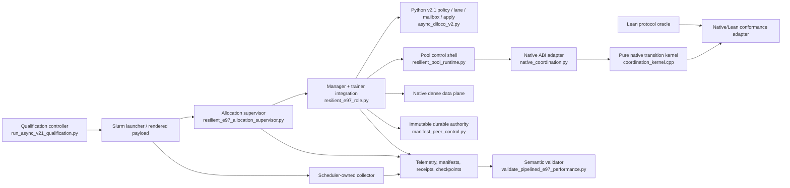
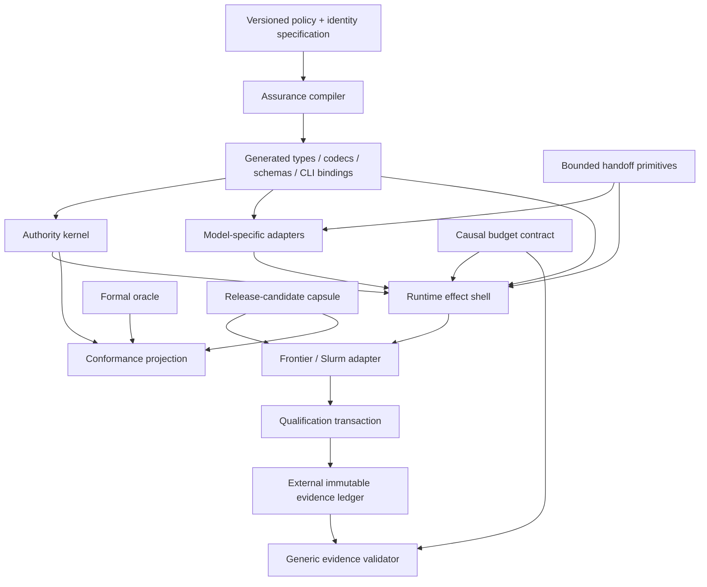

# Reverse-Engineering Fractal Assurance

## A deep architectural analysis of Emender’s resilient DiLoCo subsystem

**Repository:** `spinozans/emender`  
**Snapshot analyzed:** `main` at `76385074da8e22bfef0044c99fe0063d2f346edf`  
**Primary subsystem:** resilient / asynchronous DiLoCo on Frontier  
**Primary postmortem:** `docs/RESILIENT_DILOCO_FAILURE_CATALOG.md`  
**Analysis date:** 2026-07-29

---

## Executive assessment

The subsystem is overengineered, but not in the simple sense that it contains too many abstractions for an easy problem. The underlying problem is genuinely difficult: asynchronous distributed training, mutable model state, exact aggregation, node failure, scheduler fencing, bounded memory, immutable recovery, physical qualification, and expensive HPC feedback. Many of the invariants are legitimate.

The excess complexity comes from **how those invariants are represented and propagated**.

The codebase repeatedly solves the same assurance problem at every scale:

- a source tree receives an identity, digest, manifest, gate, receipt, and verdict;
- an allocation receives an identity, fence, claim, receipt chain, and recovery rule;
- a generation receives an identity, cohort, close rule, manifest, result, and commit receipt;
- a node apply receives an identity, candidate set, rendezvous, per-trainer receipts, and node marker;
- a trainer snapshot receives an identity, ownership transfer, capacity bound, release receipt, and causal telemetry;
- even a mailbox entry receives version identity, digest validation, visible/staging/held states, and release semantics.

This self-similarity is the defining architectural phenomenon. I call it **Fractal Assurance Architecture**: the same content-addressed, fail-closed state-machine pattern is recursively instantiated at source, job, allocation, generation, node, trainer, buffer, file, and test levels.

Fractal assurance is not inherently bad. In this repository it produced several strong ideas:

- a pure, typed native coordination kernel with explicit effects;
- immutable allocation and commit authority chains;
- bounded ownership transfer rather than unbounded queues;
- causal foreground/background timing contracts;
- permanent minimized fault traces;
- differential execution against a formal oracle;
- durable scheduler transactions that avoid duplicate expensive jobs.

The failure was a lack of **architectural compression**. Each incident added another local guard, schema, digest, status, receipt, validator rule, test fixture, or propagation path. Old semantic implementations were rarely deleted. As a result, the same facts became independently encoded in architecture documents, Python policy objects, command-line defaults, environment variables, role scripts, controller dictionaries, validators, C ABI types, C++ state, Lean types, and test fixtures.

The central diagnosis is therefore:

> The subsystem did not primarily fail because it lacked abstractions. It failed because locally useful abstractions accumulated without a mechanism that merged equivalent abstractions, retired superseded authorities, or generated boundary projections from one semantic source.

The best remediation is not a broad rewrite. It is to identify one small authority kernel, generate its projections, isolate qualification and evidence from execution, retire semantic shadows, and place hard limits on identity tunneling and duplicated policy.

---

## 1. Scope, method, and confidence

This is an architectural archaeology report, not a claim that every repository line was audited. The analysis focused on the current versions and historical evolution of the main resilient-training surfaces:

- `docs/RESILIENT_DILOCO_FAILURE_CATALOG.md`
- `docs/RESILIENT_DILOCO_COMPUTE_POOL.md`
- `docs/RESILIENT_DILOCO_GAP_MATRIX.md`
- `docs/ASYNC_V21_EXECUTION_SOURCE_IDENTITY.md`
- `ndm/async_diloco_v2.py`
- `ndm/resilient_pool_runtime.py`
- `ndm/native_coordination.py`
- `ndm/manifest_peer_control.py`
- `ndm/native_artifacts.py`
- `ndm/native_lean_conformance.py`
- `scripts/frontier/resilient_e97_role.py`
- `scripts/frontier/resilient_e97_allocation_supervisor.py`
- `scripts/frontier/run_async_v21_qualification.py`
- `scripts/frontier/validate_pipelined_e97_performance.py`
- `src/native_resilient_dataplane/src/coordination_kernel.hpp`
- representative tests and the relevant commit history.

Two historical comparisons are especially revealing:

1. From the first resilient-quorum implementation commit, `03cd39f8`, to the analyzed head, the branch advanced by **485 commits**.
2. From the v2.1 implementation commit, `8ffe2018`, to the analyzed head, it advanced by **127 commits**. Those 127 commits occurred between July 25 and July 29, 2026 and added or changed a large formal workspace, a trace schema, numerous qualification controllers and validators, many durable evidence files, and multiple production paths.

The repository explicitly uses an agent-oriented work system (`WG`) and maintains tool-specific agent instruction files. That supports the inference that coding agents materially shaped the codebase. It does **not** prove that any particular block was generated by an LLM. References to “LLM patterns” below mean structural signatures commonly produced by agentic additive development: duplicated explicitness, wrapper stacking, exhaustive boundary checks, prose-heavy local invariants, and incident-driven schema growth.

---

## 2. What the subsystem is trying to do

The core objective is reasonable and demanding:

- run a model over a fixed Slurm allocation without treating launched ranks as permanent membership;
- allow node managers and trainers to disappear and rejoin under new incarnations;
- let local K-step training continue while prior immutable contributions are aggregated in the background;
- aggregate using exact accepted-token weights;
- prevent stale, duplicate, corrupt, wrong-fence, or partial work from becoming authority;
- apply a result atomically to all eight trainers on a node;
- recover a newer allocation from an immutable checkpoint and receipt chain;
- use a persistent model-free native service and point-to-point transport rather than an all-rank collective;
- prove that foreground training does not secretly wait for network, aggregation, checkpoint, or result completion;
- retain immutable machine evidence tied to exact executable identity.

A compact conceptual model would be:

```text
scheduler fence
    -> allocation claim
    -> READY peer snapshot
    -> local immutable contributions
    -> deterministic close and aggregate
    -> immutable commit receipt
    -> complete node apply
    -> next READY generation
    -> checkpoint/recovery chain
```

That model is visible in the architecture documents and in the native coordination kernel. The problem is that the repository also contains many additional executable interpretations of it.

---

## 3. The current architecture

### 3.1 Runtime and assurance topology



The topology has one notably clean center: the native kernel. Most architectural mass sits in adapters and assurance machinery around it.

### 3.2 Concern distribution

The following matrix is approximate but captures the main issue: concerns do not form a clean dependency stack; they repeatedly reappear.

| Module | Policy constants | Protocol state | Model/optimizer | Concurrency | Filesystem | Scheduler | Evidence/telemetry | Identity attestation |
|---|---:|---:|---:|---:|---:|---:|---:|---:|
| `async_diloco_v2.py` | Yes | Yes | Yes | Yes | Yes | No | Yes | Yes |
| `resilient_e97_role.py` | Yes | Yes | Yes | Yes | Yes | Indirect | Yes | Yes |
| `resilient_pool_runtime.py` | Yes | Yes | No | Yes | Yes | No | Yes | Yes |
| `allocation_supervisor.py` | Yes | Partial | No | Yes | Yes | Yes | Yes | Yes |
| `run_async_v21_qualification.py` | Yes | Campaign state | No | No | Yes | Yes | Yes | Yes |
| `validate_pipelined_e97_performance.py` | Yes | Reconstructed | No | No | Yes | No | Yes | Yes |
| `native_coordination.py` | Minimal | Adapter only | No | Serialization lock | Trace only | No | Trace | ABI identity |
| native coordination kernel | Minimal | **Primary** | No | Pure | No | No | Effects/trace | Opaque keys/digests |
| Lean protocol | Yes | Formal oracle | No | Pure | No | No | Trace model | Formal identities |

The architecture documents say the native service is the coordination authority. The dependency graph does not fully enforce that statement because Python reference and validation layers still encode substantial protocol semantics.

---

## 4. The architecture’s complexity curve

### 4.1 Stage 1 — extending an existing asynchronous implementation

The first resilient-quorum commit, `03cd39f8`, extended the existing asynchronous DiLoCo implementation with additional modes and metadata:

- global and base generation fields;
- update identifiers;
- checkpoint-state identifiers;
- late, rejected, and missing update categories;
- staleness distributions;
- catch-up instructions;
- outcome maps by rank;
- compatibility defaults for older records.

This is the first important architectural choice: resilience entered as an **additive extension of an existing semantic object model**, rather than as a new small protocol kernel with adapters. The extension was understandable, but it made the existing module responsible for compatibility, metrics, recovery, and new coordination semantics simultaneously.

### 4.2 Stage 2 — architecture codification after implementation

The repository then introduced normative architecture documents and requirement matrices. The current system has four independent requirement namespaces:

- R01–R16;
- NDP01–NDP17;
- V21S01–V21S17;
- ISP01–ISP07.

That is **57 independently applicable numbered requirements**, plus a conformance checklist. The matrix explicitly says one namespace does not discharge another.

This improved auditability, but it also reveals that the architecture was being stabilized through prose after semantic surfaces had already multiplied. Once the documents became normative, implementation work had to mirror their vocabulary. Requirements became a second type system maintained manually beside the code type system.

### 4.3 Stage 3 — a native data plane was added without fully retiring reference paths

The project introduced a persistent native service, C ABI, libfabric transport, direct memfd handoff, and a model-free coordination layer. This was the correct direction.

However, the complete Python TCP/reference coordinator remained adjacent to the production native coordinator. `resilient_pool_runtime.py` contains both:

- `PoolControlServer`, which owns a full Python membership/generation/commit implementation for debug/reference use;
- `NativePoolControlServer`, which wraps the native authority but exposes nearly the same operation surface and retains substantial external state.

This creates a **reference-shadow architecture**. The reference implementation is useful for testing, but because it shares production modules and operation names, it becomes an alternate semantic center that must evolve with production.

### 4.4 Stage 4 — v2.1 introduced exact version identity and bounded asynchronous semantics

The v2.1 work added a valuable set of explicit concepts:

- distinct commit, applied-anchor, result, and speculative-window clocks;
- exact token weighting;
- one owned snapshot and one mutable interval;
- capacity-one result mailboxes;
- bounded all-eight apply;
- fail-closed policy and schema identities;
- exact source and native artifact identity.

The implementation commit was followed quickly by atomic-apply fixes, integration work, clean-launch binding, failed physical attempts, safe-boundary fixes, and a later pass.

The important structural point is that v2.1 did not replace v2.0 scaffolding. The module retains aliases such as `AsyncV2WorkerLane = AsyncV21WorkerLane`, while documents simultaneously state that v2.0 artifacts cannot cross a v2.1 boundary. The runtime identity is strict, but the import surface remains compatible. This is a subtle **boundary erosion**: semantic incompatibility is enforced at data boundaries but softened at code boundaries.

### 4.5 Stage 5 — physical qualification exposed late boundary defects

The failure catalog makes the feedback problem explicit. To reach a later fault-launch branch, an attempt could require:

1. exact-source build and attestation;
2. synthetic two-node native G2;
3. queue delay;
4. staging and verifying a 7.7 GB seed;
5. a full clean multi-generation job;
6. separate scheduler-owned collection;
7. final semantic validation.

Only then might it discover a one-line propagation defect, a 108-byte Unix socket path, an artifact-root collision, a missing scheduler account, or a stale default gate kind.

Fixing that small defect changed source identity. Exact-source policy then invalidated the expensive prefix.

This created an **inverted validation loop**:

```text
cheap defect
    hidden behind expensive prefix
        -> expensive attempt
        -> late discovery
        -> tiny source fix
        -> source identity changes
        -> repeat expensive prefix
```

### 4.6 Stage 6 — every incident produced another cross-layer invariant

The repeated failures generated legitimate fixes:

- explicit gate-kind propagation;
- shorter node-local control roots;
- durable collector registration ordering;
- immutable artifact namespace ownership;
- no-database production closure;
- exact source hashing;
- strict scheduler Partition/QOS evidence;
- catch-up receipts for closed generations;
- recovery-incarnation handling;
- all-eight apply receipts;
- causal phase timing;
- tail-stall rejection;
- change-scope certificates.

But each fix was generally encoded at several boundaries: controller, launcher, role, manager session, validator, tests, documentation, and evidence schema. The architecture gained an **assurance ratchet**: incidents could add mechanisms, but there was no mandatory process for merging or deleting equivalent mechanisms.

### 4.7 Stage 7 — formal conformance improved the kernel and expanded release scope

The Lean work introduced a pure protocol oracle, canonical trace schema, differential runner, permanent fault corpus, and mutation proof. Conceptually this is one of the strongest parts of the system.

Operationally, it was merged into the same release history as the physical runtime candidate. The failure catalog later records that the broad Lean/native integration changed protected runtime surfaces and made narrow clean-evidence reuse impossible. A scope certificate failed with 74 reuse-disallowed paths, 71 outside the allowlist, and six protected runtime-surface failures.

This is a classic case of **validation workstream coupling**: a tool intended to increase confidence widened the qualification surface of the system it was validating.

---

## 5. Why the coding session spiraled

The spiral was not random. It can be explained by five reinforcing loops.

### 5.1 Expensive and sparse feedback

Physical truth was available only through costly queued jobs. Cheap local tests could prove interfaces and pure protocol behavior, but not actual Frontier transport, process failure, GPU/model ownership, or timing.

Sparse feedback encourages speculative defensive design. When execution is expensive, an agent tends to add more checks before the next run. Every check feels cheap compared with another failed allocation. The result is a growing preflight system whose own complexity becomes a new source of failure.

### 5.2 Exact identity turned every fix into a requalification event

The project correctly resisted pretending that a nearby artifact passed. But its execution-source boundary initially included nearly every tracked byte outside three evidence directories. That made source identity broader than the actual executable closure.

The safety principle was sound:

> Evidence must bind the exact code and inputs that executed.

The implementation was too coarse:

> Almost every repository change is presumed to alter execution until a later scope certificate proves otherwise.

This increases **evidence invalidation radius**: a narrow change can invalidate a much larger body of evidence than the behavior it affects.

### 5.3 Additive local repair is the default behavior of coding agents

An LLM presented with a concrete failure usually optimizes for the local acceptance test. Typical additive repairs include:

- add one field;
- add one enum value or status string;
- add one manifest schema;
- add one digest;
- add one validator branch;
- thread one argument through every call;
- add one test named after the incident;
- preserve all old behavior for compatibility;
- explain the invariant in a long comment.

Each repair is locally defensible. Across dozens of incidents, the aggregate is not.

Humans have the same bias, but agents amplify it because they can produce large amounts of explicit code cheaply. Generation cost falls; coordination and comprehension cost do not.

### 5.4 Parallel agents concentrated conflicts in architectural gravity wells

Commit history shows repeated conflicts in the same files:

- `ndm/async_diloco_v2.py`;
- `ndm/async_diloco_real.py`;
- `scripts/frontier/resilient_e97_role.py`;
- `scripts/frontier/resilient_e97_allocation_supervisor.py`;
- `scripts/frontier/run_async_v21_qualification.py`;
- `scripts/frontier/validate_pipelined_e97_performance.py`;
- launcher and qualification tests;
- the architecture and gap-matrix documents.

That is evidence of a poor modularity boundary: independent tasks could not remain independent because they had to edit the same semantic centers.

Parallelism then generated merge fixes, integration tasks, and new evidence records. The work-management system became part of the architecture’s change surface.

### 5.5 Audit pressure created multiple “single” authorities

Several layers describe themselves as the sole or single authority within their scope:

- the architecture document is normative;
- the gap matrix is the normative requirement crosswalk;
- `async_diloco_v2.py` is described as the single Python control authority;
- the controller is the only qualification submission surface;
- the native kernel is the sole production decision function;
- Lean is the protocol/proof oracle;
- immutable receipts are restart authority;
- the validator is the semantic promotion authority.

These claims are individually scoped, but the scopes overlap. The system developed **plural singularities**: multiple components are singular authorities for projections of the same facts.

The boundaries are mostly documented rather than generated or mechanically enforced. Therefore every change must preserve a manually maintained authority graph.

---

## 6. The central architectural degradation

The mathematical core did not obviously degrade into chaos. In fact, the native coordination kernel became cleaner over time.

The degradation occurred in the **location of semantic gravity**.

A healthy architecture would make the small protocol kernel the place where coordination decisions live, with thin generated or typed adapters around it. Instead, substantial semantics remain distributed across:

- policy dataclasses;
- Python reference aggregation;
- worker-lane state;
- mailbox behavior;
- role-script branches;
- debug pool coordination;
- native pool effect execution;
- controller campaign dictionaries;
- semantic validator rules;
- C++ transition state;
- Lean state and trace projections;
- requirement matrices.

The core was improved, but the old semantic surfaces were not retired. The architecture became a **palimpsest**: each new authoritative layer was written over an older layer that remained legible and executable.

The most important degradation symptoms are:

1. **Policy facts have multiple owners.** The same constants appear in the policy object, role CLI defaults, role policy reconstruction, supervisor deadlines, controller parameters, validator constants, tests, docs, and native structures.
2. **Adapters contain policy.** Boundary code does not only translate representations; it revalidates, reconstructs, and sometimes reinterprets semantics.
3. **Validators reimplement runtime meaning.** The performance validator reconstructs causal windows and policy state from stage strings and exact constants.
4. **Reference code remains production-adjacent.** The Python coordinator and numerical/reference authorities are imported alongside production paths.
5. **Evidence is coupled to execution.** Evidence files and execution identity share a repository and historically invalidated each other.
6. **Orchestration files are larger than the protocol kernel.** The integration scripts became the real system.
7. **Cross-layer values are tunneled manually.** The gate-kind bug is the clearest example: one semantic value had to survive controller → launcher → renderer → role → manager attestation.
8. **Incident fixes are permanent architecture.** Job IDs, exact failure traces, task names, and narrow recovery cases appear throughout tests, comments, reports, and conformance corpora.

---

## 7. File-by-file deep dive

### 7.1 `ndm/async_diloco_v2.py`: a policy module that became a platform

The module’s opening claims that it is model- and transport-agnostic and is the Python metadata/control authority around the native service. Its contents include:

- immutable policy and schema constants;
- contribution and result identities;
- numerical reference aggregation;
- NumPy payloads;
- ScheduleFree-specific optimizer translation;
- Torch optimizer-state mutation helpers;
- a capacity-one mailbox with held and staging states;
- a continuous worker-lane state machine;
- a threaded descriptor service and bounded queue;
- a commit authority with membership and replay receipts;
- checkpoint filesystem I/O and restore;
- safe-boundary rendezvous logic;
- all-eight trainer apply markers and restart archival;
- telemetry objects;
- compatibility aliases for v2 names.

The current file extends beyond 2,200 lines.

This is a strong example of **semantic accretion**. Every class is individually understandable, but the module owns too many kinds of truth.

#### Specific patterns

**Reviewed-constant self-validation.** `AsyncV21Policy.__post_init__` compares every field to a literal reviewed value. This makes the dataclass look configurable while functionally acting as a singleton version descriptor. It would be clearer as an immutable generated constant plus a decoder that rejects other versions.

**Identity hyperobjects.** `ContributionIdentity` contains policy, schema, ABI, wire version, run, allocation, worker, incarnation, sequence, local window, base version, several digests, exact tokens, timestamps, endpoint identity, trainer-set identity, dtype, finite check, and shard roots. The completeness is valuable, but passing the entire object through every layer creates large validation surfaces.

**Miniature protocol objects.** The mailbox, worker lane, descriptor service, commit authority, rendezvous, and apply transaction each have their own states, identities, deadlines, duplicate handling, and terminal conditions. The same protocol design recurs inside one module.

**Model leakage.** ScheduleFree and Torch-specific mutation contradict the module’s broad policy/control role. Model adaptation deserves a separate adapter package.

**Persistence leakage.** Checkpoint serialization and filesystem publication sit beside pure aggregation and state transitions.

**Compatibility leakage.** v2 import aliases preserve code compatibility even while the data protocol insists on strict incompatibility. That creates two versioning philosophies in one module.

#### What is worth keeping

- exact identity types;
- bounded one-owned/one-mutable semantics;
- capacity-one latest result behavior;
- explicit stale/drop/defer outcomes;
- deterministic token-weighted reference aggregation;
- safe-boundary and all-eight apply state machines.

#### What should change

Split the module into at least five dependency-separated packages:

```text
protocol/v21_policy.py          immutable version descriptor and typed IDs
protocol/v21_reference_math.py  pure numerical oracle
model/schedulefree_rebase.py    optimizer-specific translation
runtime/bounded_handoff.py      mailbox and ownership cell
runtime/node_apply.py           rendezvous and all-eight transaction
```

No module in `protocol/` should import `torch`, `queue`, `threading`, `os`, or `pathlib`.

---

### 7.2 `scripts/frontier/resilient_e97_role.py`: the integration gravity well

This file extends past line 4,800 and implements both manager and trainer entry points. It contains or directly coordinates:

- import-time heartbeats;
- CLI and environment parsing;
- policy reconstruction;
- data-plane selection and attestation;
- allocation and generation fencing;
- resume compatibility;
- peer authority loading;
- topology and owner scheduling;
- native shard ranges;
- model/trainer execution;
- snapshot production;
- local memfd handoff;
- background transport and aggregation;
- checkpoint and result handling;
- catch-up and rejoin;
- candidate preparation;
- safe-boundary rendezvous;
- optimizer rebase and apply;
- node/trainer receipt publication;
- telemetry emission;
- fault injection;
- cleanup.

This is not merely a “god object.” It is an **Integration God Script**: the place where all otherwise separated abstractions must be made mutually consistent.

#### Policy reconstruction as a smell

The role parser exposes policy constants as arguments. `_async_v21_policy` then reconstructs a full dictionary from those arguments and compares it with the reviewed policy manifest. This is defensive, but it means the role independently knows the complete policy schema.

The controller, launcher, environment, parser defaults, reconstruction dictionary, policy object, and validator must all agree. This is exactly the type of repeated boundary contract that code generation should replace.

#### Control and data planes are mixed with the evidence plane

The role performs live runtime work and emits detailed evidence records. Telemetry is not a narrow observer; stage names and fields are later treated as semantic input by validators. Therefore adding, removing, or renaming a telemetry event can alter qualification behavior.

#### Manager and trainer share one executable surface

One parser and file serve multiple roles, test fixtures, control modes, native modes, and local modes. Conditional branches become the architecture. Phase-specific types cannot help because the program starts from a broad `argparse.Namespace` whose valid fields depend on many other fields and environment variables.

#### Refactoring direction

Create distinct process adapters:

```text
frontier/manager_main.py
frontier/trainer_main.py
frontier/native_service_main.py
frontier/common_identity.py
frontier/common_telemetry.py
frontier/recovery_adapter.py
frontier/apply_adapter.py
```

Generate the CLI and environment binding from one typed launch schema. Do not have role code reconstruct the policy; give it a validated `ExecutionContext` capability produced by the launcher.

---

### 7.3 `ndm/resilient_pool_runtime.py`: reference-shadow architecture

The module combines:

- stage SLO policy;
- endpoint identity and native endpoint decoding;
- a large pool configuration product type;
- a full Python TCP debug coordinator;
- a native coordinator shell;
- owner transfer and result-root coordination;
- pairwise route readiness;
- membership and recovery caches;
- commit and apply tracking.

The debug and native servers expose nearly parallel dispatch surfaces. That makes the reference path easy to compare with production, but also forces semantic duplication.

#### The conditional product-type problem

`PoolControlConfig` includes fields for:

- normal and scale closure;
- debug and native backends;
- initial and recovered authority;
- artifact bundles;
- commit receipts;
- apply receipts;
- policy, layout, code, and base digests;
- production/full-layout flags.

Its `__post_init__` is effectively a large Boolean formula describing legal modes. This is a **product type where a sum type is needed**.

Instead of one object with many conditionally meaningful fields, use explicit variants:

```python
DebugPoolConfig
TwoNodeQualificationConfig
ScalePoolConfig
RecoveredPoolConfig
```

or a sealed hierarchy containing shared identity plus phase-specific payloads.

#### Production still carries external state beside the authority

`NativePoolControlServer` says it owns no independently mutable membership, generation, commit, apply, or recovery authority. It nevertheless retains endpoints, leases, snapshots, opened times, accepted payloads, owner results, route readiness, commit records, and apply receipts. Much of that is legitimate effect-execution state, but the distinction between “external cache” and “semantic authority” is subtle and must be maintained by convention.

That distinction should be represented in types:

- `AuthoritativeState` returned only by the kernel;
- `EffectState` owned by the shell;
- `ObservationCache` explicitly disposable;
- no shared dictionaries that can accidentally substitute for authority.

---

### 7.4 `ndm/native_coordination.py` and the C++ kernel: the best compression point

`native_coordination.py` is comparatively disciplined. It:

- maps runtime values to fixed C ABI events;
- serializes one writer;
- invokes the persistent service;
- decodes typed results;
- writes canonical traces.

The C++ header defines a bounded set of:

- event kinds;
- dispositions;
- effect kinds;
- generation phases;
- state records;
- one total `step(state, event)` function.

This is the architectural center the rest of the system should orbit.

The key design is:

```text
Transition = step(AuthorityState, Event)
Transition = {
    new state,
    typed disposition,
    explicit effects,
    canonical trace,
    pre-state digest,
    post-state digest
}
```

This is an excellent implementation of an **Authority Kernel / Effect Shell** architecture.

The kernel is model-free, scheduler-free, filesystem-free, and network-free. It makes expected races total by returning dispositions rather than throwing process-level exceptions. It is small enough to compare with a formal model.

The primary missed opportunity was failing to use this kernel to delete more surrounding semantic code.

---

### 7.5 `ndm/manifest_peer_control.py`: narrow durable authority done well

This module is another relatively good boundary. It has a deliberately small durable role:

- publish an immutable scheduler-fence claim before model load;
- publish a content-attested commit receipt after verified checkpoint publication;
- recover only the receipt chain selected by the newest fence.

It avoids a mutable database, live lease rows, and heartbeat authority. Its no-replace publication and hash-linked receipts are reusable concepts.

Its main weakness is not internal design. It is that canonical JSON, digest validation, immutable publication, path confinement, and schema checking are implemented again here rather than supplied by a shared typed evidence library.

This is a candidate for extraction, not deletion.

---

### 7.6 `ndm/native_artifacts.py`: useful attestation with hardcoded qualification policy

The module records native build artifacts, hashes installed files, checks ABI values, scans for forbidden MPI symbols, validates G2 artifacts, and binds the exact source commit.

The useful generic core is:

- reproducible build manifest;
- artifact-set validation;
- source cleanliness and commit identity;
- binary hash verification;
- forbidden-symbol policy;
- bundle digest.

The overfitted part is `validate_g2_gate`, which hardcodes exact layout bytes, shard count, trainer count, node count, logical byte counts, provider, and fault metrics. Those values belong in a versioned gate specification generated from the same policy source used by the runner and validator.

---

### 7.7 `scripts/frontier/run_async_v21_qualification.py`: a qualification operating system

This file extends beyond 2,300 lines and describes itself as the only qualification and submission surface. It contains:

- policy and schema constants;
- source-tree hashing;
- evidence-only path policy;
- seed identity and exact byte size;
- tokenizer and data identities;
- hardcoded Frontier account, paths, QoS, walltimes, and signals;
- fault phase definitions;
- fault scenario lists;
- all four requirement namespaces;
- clean-gate parameters;
- systems-evidence field lists;
- manifest verification;
- source cleanliness checks;
- scheduler transaction state;
- collector construction;
- launch rendering;
- scale authorization;
- predecessor validation;
- closure evidence;
- submission.

It is effectively a bespoke workflow engine, policy engine, artifact verifier, scheduler adapter, state store, and security boundary.

#### Manifest-oriented programming

Behavior is represented through nested dictionaries with string schema identifiers and manually computed canonical digests. This style can be called **Manifest-Oriented Programming**.

Manifest-oriented programming is useful at trust boundaries. It becomes harmful when internal control flow is also expressed as loosely typed manifests. The result is a proliferation of string keys, schema constants, canonicalization functions, and runtime shape checks.

The controller should construct typed domain objects and serialize manifests only at durable or external boundaries.

#### Hardcoded environment as policy

Paths, account names, seed facts, data locations, QoS, and model parameters appear in code. Some must be pinned for qualification, but the pinning should occur in a signed/versioned qualification profile, not in the controller implementation.

#### Generic pattern hiding inside it

The durable ordering is excellent:

```text
hold payload
    -> durably record payload identity
    -> register afterany collector
    -> durably record collector identity
    -> release payload
```

This is a reusable **Qualification Transaction** or **Proof-Carrying Saga** for expensive external jobs.

---

### 7.8 `validate_pipelined_e97_performance.py`: the validator as a second runtime

The validator extends beyond 970 lines and independently hardcodes:

- policy identity;
- K=40;
- four lag limits;
- trainer count;
- warm-up and measured windows;
- idle, cadence, ownership, rendezvous, apply, foreground-gap, and correctness bounds;
- resident bytes;
- background stage names;
- required stage classes;
- causal phase names;
- permitted foreground stage names.

It recursively reads JSON/JSONL, reconstructs windows and causal intervals, computes percentiles, subtracts permitted foreground pauses, validates exact stage identity, and checks atomic commits.

This is more than validation. It is a **semantic shadow runtime**: a second implementation of the temporal meaning of the production system.

That has two consequences:

1. A production change can be correct but unrecognizable to the validator.
2. A validator bug can misclassify a production artifact because it reinterprets rather than verifies typed facts.

The strongest idea in the validator is worth preserving: it computes **negative-space telemetry**. Rather than trusting aggregate idle metrics, it subtracts causally permitted foreground intervals from raw gaps and rejects unattributed waiting. This should become a generic temporal-contract library.

---

### 7.9 `native_lean_conformance.py` and the formal workspace: authority projection

The conformance adapter executes one canonical trace against two authorities:

- a Lean protocol oracle;
- the actual persistent native service and production RPC/kernel call path.

It compares a shared, versioned authority view and stops at the first divergence. It also retains a permanent fault corpus and demonstrates that deliberate mutation is detected.

This is an unusually strong pattern. The important abstraction is not “prove the C++ code correct.” It is:

> Define the exact observable intersection of two implementations, project both into that view, and compare every transition.

I call this **Authority Projection**.

Authority projection is more pragmatic than requiring implementation equivalence. It acknowledges that the formal model and native runtime have different representations and capabilities. The shared view defines what agreement means.

The main architectural error was release coupling. The formal workspace, trace schema, conformance adapter, C++ kernel, docs, and physical candidate advanced together. Formal assurance should be able to validate a frozen runtime candidate without becoming part of its execution identity unless the runtime projection or kernel changes.

---

### 7.10 `resilient_e97_allocation_supervisor.py`: orchestration becoming protocol

The supervisor manages independent Slurm steps, node-local subprocesses, restart cohorts, CPU affinity, native admission tokens, heartbeats, fault injection, evidence retention, and durable generation selection.

Some of this is unavoidable platform adaptation. The architectural risk is that supervisor decisions participate in protocol semantics:

- all eight trainers form an atomic recovery cohort;
- deadline constants are repeated;
- incarnation identity is allocated here;
- evidence files mediate observations;
- restart policy can affect whether a failure consumes budget.

A scheduler/process supervisor should execute effects emitted by a protocol or recovery planner. It should not independently infer protocol transitions from a mixture of process exit, JSON heartbeats, files, and local counters.

---

### 7.11 Documentation and workflow: the compliance surface became code

`AGENTS.md` requires agents to load project guidance, use a work dispatcher, preserve worktree isolation, cite requirement IDs, and retain exact validation. It also documents prior agent failures such as grading missing evidence rather than performing runner tasks.

This is significant. The repository’s architecture is partly a response to the behavior of coding agents:

- requirements are repeated so agents cannot omit them;
- task validation sections must cite namespaces;
- source and evidence identities are made explicit so agents cannot claim nearby artifacts;
- durable state is retained because workers may be killed or redispatched;
- duplicated `AGENTS.md` and `CLAUDE.md` exist because different tools inspect different filenames.

The codebase therefore contains an **agent-compliance architecture** in addition to the product architecture.

This is a real new design problem. The mistake is handling it through textual duplication and repository-wide procedural rules instead of machine-readable project capabilities and generated instructions.

---

## 8. Fractal Assurance Architecture

### 8.1 Definition

A system exhibits Fractal Assurance Architecture when the same assurance structure recurs at multiple nested scales:

```text
identity
+ version/schema
+ fenced state
+ canonical encoding
+ digest
+ immutable publication
+ receipt
+ duplicate/conflict handling
+ recovery rule
+ telemetry
+ validator
```

The Emender subsystem has this structure at nearly every level.

### 8.2 The fractal map

| Scale | Identity | State transition | Evidence | Failure behavior |
|---|---|---|---|---|
| Repository source | execution-source digest | candidate changes | source manifest / scope certificate | requalify or reject reuse |
| Native build | source commit + bundle digest | build/install | build manifest + artifact hashes | reject launch |
| G2 gate | gate kind + bundle + provider | synthetic run | gate JSON | reject production path |
| Scheduler job | payload digest + job ID | held → released → terminal | scheduler rows + collector | do not duplicate; retain false verdict |
| Allocation | run + fence + incarnation | claim / recover | immutable allocation claim | stale fence no-op or reject |
| Peer | worker + incarnation + sequence | recover / READY / expire | native transition trace | typed stale/defer/fatal |
| Generation | run + fence + generation + attempt | open / contribute / close / commit | manifest + receipt | retry, catch up, or abort |
| Contribution | worker + sequence + window + digests | admit / duplicate / reject | contribution receipt | idempotent or conflict |
| Node apply | result + node incarnation | prepare / rendezvous / apply | eight trainer receipts + node marker | no READY after partial apply |
| Trainer lane | anchor + local window | finish / seal / release / apply | ownership and phase telemetry | skip, defer, or drop |
| Mailbox | result version + digest | visible / held / staging | high-water facts | backpressure or stale |
| File publication | schema + path + content | temp → no-replace final | file digest | preserve winner, reject conflict |

### 8.3 Why fractality is attractive to an LLM

This architecture is highly compositional in prose. Once an agent learns the local pattern—identity, digest, immutable record, receipt, fail closed—it can apply it to every new problem. The pattern produces code that looks rigorous and is easy to justify in a review.

The problem is that repetition is mistaken for composition. True composition would provide one generic mechanism instantiated with different domain types. Here, many layers hand-code their own canonicalization, digest fields, schemas, statuses, files, and validators.

### 8.4 Assurance homomorphism versus assurance duplication

The useful mathematical intuition is a homomorphism:

```text
protocol transition
    -> runtime event
    -> evidence event
    -> validator projection
    -> formal projection
```

Each projection should preserve selected semantics without reimplementing the transition.

The repository often uses duplication instead:

```text
policy implementation
policy reconstruction
policy validator
policy controller copy
policy documentation copy
formal policy copy
```

A future architecture should explicitly model **assurance homomorphisms**: generated or typed projections from one authority into runtime, evidence, documentation, and formal views.

---

## 9. Anti-pattern catalog

### 9.1 Authority fracture

**Symptom:** Several modules independently own overlapping interpretations of the same fact.

**Examples:** lag limits, policy IDs, trainer counts, deadlines, gate kind, accepted-token rules.

**Consequence:** A correct change requires synchronized edits across many files; a missed edit becomes a late physical failure.

**Replacement:** machine-readable authority graph plus generated projections.

---

### 9.2 Identity tunneling

**Symptom:** One semantic value is passed manually through many unrelated layers.

**Canonical example:** `required_gate` defaulted back to clean at successive controller, launcher, role, and manager boundaries.

**Consequence:** Every hop can silently substitute a default.

**Replacement:** pass a typed, signed `ExecutionContext` or capability containing the complete validated identity. Forbid rebuilding it downstream.

---

### 9.3 Semantic shadowing

**Symptom:** A validator, reference server, or adapter reimplements production meaning.

**Examples:** Python pool control versus native coordination; temporal validator versus runtime phases; Python commit authority versus native kernel.

**Consequence:** conformance requires N-way maintenance, and local tests may validate the shadow rather than production.

**Replacement:** shared event types and projections; keep reference implementations outside the production import closure.

---

### 9.4 Manifest-oriented programming

**Symptom:** Internal control flow is represented as dictionaries, schema strings, and canonical JSON.

**Consequence:** type errors become runtime branches; schema and business logic blur; refactoring becomes textual.

**Replacement:** typed objects internally, canonical manifests only at trust, process, or durability boundaries.

---

### 9.5 Product-type explosion

**Symptom:** One dataclass contains fields for many mutually exclusive modes and validates them with a large conditional expression.

**Example:** `PoolControlConfig`.

**Consequence:** illegal states are representable, tests multiply combinatorially, and callers cannot know which fields matter.

**Replacement:** sealed variants or phase-specific constructors.

---

### 9.6 Reference-shadow architecture

**Symptom:** A complete debug/reference implementation remains adjacent to production and exposes the same interface.

**Consequence:** both evolve, both attract tests, and the reference path can accidentally become a de facto authority.

**Replacement:** isolate the reference implementation in a test package. Test production through the real adapter with a local provider.

---

### 9.7 Validator as second runtime

**Symptom:** The validator reconstructs phase semantics and state from logs.

**Consequence:** telemetry strings become hidden APIs and validation can drift from execution.

**Replacement:** runtime emits typed facts signed by causal IDs; validator evaluates declarative constraints over those facts.

---

### 9.8 Evidence-plane collapse

**Symptom:** source, generated evidence, run records, task state, and qualification reports coexist in one repository and identity regime.

**Consequence:** evidence can make source dirty; logging and documentation changes can invalidate execution; artifact ownership collides.

**Replacement:** separate evidence store and explicit immutable references from source commits.

---

### 9.9 Compatibility alias erosion

**Symptom:** strict runtime version boundaries coexist with permissive code aliases.

**Consequence:** code can accidentally treat incompatible concepts as renamed equivalents.

**Replacement:** migration adapters with expiration dates, not permanent aliases.

---

### 9.10 Exception-state duality

**Symptom:** some expected protocol outcomes are typed dispositions while adjacent layers use exceptions and string matching.

**Consequence:** the same race can be treated as recoverable in one layer and fatal in another.

**Replacement:** a closed result algebra for all expected outcomes; exceptions only for programmer error or corrupted authority.

---

### 9.11 Path-as-protocol

**Symptom:** filesystem paths, directory names, stage files, and glob patterns encode lifecycle and ownership.

**Examples:** Unix-socket path length, artifact-root collision, evidence directory races, per-trainer marker filenames.

**Consequence:** platform limits and observer behavior become protocol behavior.

**Replacement:** explicit artifact namespace service and opaque path allocation; typed events rather than directory discovery.

---

### 9.12 Incident-shaped architecture

**Symptom:** job IDs and failure-specific narratives become durable test and design anchors.

**Consequence:** the system remembers every incident but may fail to generalize or minimize the underlying state transition.

**Replacement:** retain job provenance in a fault corpus, but reduce each incident to the minimal protocol trace and generic invariant.

---

### 9.13 Fail-closed developmental liveness collapse

**Symptom:** every uncertain condition rejects progress, even in local development and qualification planning.

**Consequence:** safety increases, but iteration can halt because the system cannot distinguish “not authorized for promotion” from “not executable for diagnosis.”

**Replacement:** explicit trust levels:

```text
reference
local diagnostic
synthetic integration
physical qualification
promotion
```

A lower trust level may execute while being structurally unable to emit a higher-level pass.

---

### 9.14 Release-scope entanglement

**Symptom:** formal proofs, runtime repairs, documentation, and physical-candidate changes advance together.

**Consequence:** assurance work invalidates evidence for the runtime it is intended to assure.

**Replacement:** frozen runtime capsule plus independent assurance projections.

---

## 10. Strong and potentially novel patterns worth extracting

The repository should not be treated only as a cautionary tale. It contains several abstractions that are useful beyond distributed training.

### 10.1 Authority Kernel / Effect Shell

**Definition:** A pure total transition function owns semantic state. It emits typed dispositions and explicit effects. An outer shell performs network, storage, scheduling, timers, and process actions.

```python
@dataclass(frozen=True)
class Transition[S, D, E]:
    state: S
    disposition: D
    effects: tuple[E, ...]
    pre_digest: Digest
    post_digest: Digest


def step(state: State, event: Event) -> Transition:
    ...
```

**Why it is useful:**

- deterministic replay;
- formal modeling;
- differential testing;
- easier race semantics;
- clear authority boundary;
- runtime effects remain testable.

**Rule:** the shell may cache observations but may not infer an authoritative transition omitted by the kernel.

---

### 10.2 Authority Projection

**Definition:** Two implementations with different internal representations are compared through a deliberately smaller shared authoritative view.

```text
Lean state ──project──┐
                      ├── common authority view ── compare
Native state ─project─┘
```

**Why it is useful:** full implementation equivalence is often impossible or irrelevant. A projection states exactly what must agree.

**Applications:**

- formal model versus production runtime;
- old versus new storage engine;
- CPU reference versus GPU kernel;
- distributed implementation versus single-process model;
- database migration validation.

**Rule:** adapters may translate representation, not calculate the expected result.

---

### 10.3 Evidence-Carrying Transition

**Definition:** Every authoritative transition produces enough canonical evidence to replay or verify its identity without turning logs into authority.

```text
state + event
    -> state' + disposition + effects
    -> canonical transition receipt
```

The evidence should contain:

- event identity;
- pre/post state digests;
- typed disposition;
- effect identities;
- schema/version;
- no raw mutable state unless required.

This is lighter than full event sourcing and stronger than ordinary logging.

---

### 10.4 Bounded Ownership Cell

The one-owned/one-mutable snapshot and capacity-one mailbox suggest a reusable concurrency primitive.

**State machine:**

```text
Mutable
  -> Sealed
  -> Owned(background)
  -> Released(outcome)

Result slot:
Empty -> Visible -> Held -> Empty
                  \-> Staging -> Visible after release
```

**Properties:**

- fixed memory bound;
- explicit ownership transfer;
- no producer wait after `OWNED`;
- typed skip/defer/backpressure outcomes;
- idempotent release;
- high-water telemetry.

This could be a small package usable for snapshots, GPU transfers, video frames, durable batches, and asynchronous compilation.

---

### 10.5 Causal Pause Budget

The repository’s strongest performance idea is that “background” is not established by thread names or averages. It must be proven with causally linked phase intervals.

A **Causal Pause Budget** declares:

- which phase may block foreground;
- the causal work identity;
- maximum and p99 bounds;
- whether waiting is permitted;
- which phase owns the elapsed time;
- how unattributed time is calculated.

Example contract:

```yaml
phase: snapshot_admission
causal_key: contribution_id
class: foreground-permitted
maximum: 1s
p99: 1s

phase: result_wait
causal_key: result_id
class: background-only
foreground_component: 0s
```

This is reusable for UI responsiveness, media pipelines, storage compaction, online inference, and background indexing.

---

### 10.6 Negative-Space Telemetry

**Definition:** Measure unexplained delay by subtracting the union of explicitly permitted intervals from raw elapsed gaps.

```text
unattributed_gap
    = raw_gap
    - union(permitted_foreground_intervals)
```

This is more robust than trusting self-reported “idle fraction.” It detects hidden synchronization and tail stalls.

---

### 10.7 Qualification Transaction

The scheduler workflow is a generic durable saga for expensive jobs:

```text
Planned
  -> PayloadHeld
  -> PayloadRecorded
  -> CollectorRegistered
  -> CollectorRecorded
  -> PayloadReleased
  -> Running
  -> Terminal
  -> Collected
  -> Verdict
  -> Retired
```

Each transition has an idempotency key and immutable receipt. A crash can reconcile external scheduler state before retrying.

This pattern is useful for:

- HPC jobs;
- cloud training runs;
- costly data migrations;
- hardware qualification;
- external compliance scans;
- long-running scientific experiments.

---

### 10.8 Requalification Firewall

The later change-scope certificate points toward a more general pattern.

**Definition:** A machine-derived boundary that determines whether a change intersects a protected execution closure and therefore invalidates prior evidence.

A strong implementation should use positive dependency closure:

```text
rendered payload
+ imported modules
+ native source/build inputs
+ config/schema inputs
+ model/data/tokenizer/seed identities
= protected execution closure
```

It should not hash the entire repository and then maintain a growing negative exclusion list.

The output is a typed decision:

```text
Reusable(previous evidence, unchanged protected closure)
Requalify(changed surfaces...)
Unknown(unresolved dependency; fail closed)
```

---

### 10.9 Failure Fossil Corpus

The permanent native/Lean traces are a valuable pattern.

**Definition:** A grow-only set of minimized canonical traces derived from real failures, each with:

- stable incident identity;
- source provenance;
- minimized event sequence;
- expected dispositions and state digest;
- replay command;
- mutation that must be detected.

The corpus is a **protocol fossil record**. It preserves historical failure knowledge without embedding incident-specific branches into production code.

---

### 10.10 Exclusive Artifact Namespace

The artifact-root ownership failure led to a useful rule: controller, batch, and collector should have separate, versioned, exclusive namespaces and no-replace publication.

A generic package should allocate opaque artifact roots by producer and content identity, making accidental `mkdir` or monitor writes impossible in another producer’s final namespace.

---

### 10.11 Release-Candidate Capsule

**Definition:** A frozen package containing exactly the runtime execution closure and external identities needed for physical qualification. Formal tools, reports, and unrelated repository changes can validate the capsule without changing it.

A capsule contains:

- executable source closure digest;
- native bundle and ABI;
- rendered launch payload;
- model/config/data/tokenizer/seed identities;
- policy version;
- validator contract version;
- immutable artifact namespace.

It is a better unit of qualification than “current repository main.”

---

### 10.12 Assurance Compiler

The most important abstraction to extract is an **Assurance Compiler**.

One canonical protocol/qualification specification should generate or validate:

- language-specific policy constants;
- typed event and identity definitions;
- CLI and environment bindings;
- C ABI constants or compatibility assertions;
- JSON schemas;
- canonical codecs;
- validator constraints;
- telemetry field declarations;
- requirement crosswalk tables;
- formal-model input declarations;
- documentation tables.

Illustrative specification:

```yaml
policy: async-decoupled-v2.1-simple
facts:
  k_local_steps:
    type: u32
    value: 40
    owner: protocol
  max_commit_lag:
    type: u8
    value: 2
    owner: protocol
  q_min:
    type: u16
    value: 2
    scope: two-node-qualification
  apply_timeout:
    type: duration
    value: 60s
    owner: node-apply

projections:
  - python-types
  - c-header-assertions
  - json-schema
  - cli-bindings
  - telemetry-contract
  - validator-rules
  - docs-table
```

The compiler should not generate the transition algorithm. It should generate **boundary projections of authoritative facts**, eliminating manual drift.

---

## 11. Architectural design axes

The repository can be understood through a set of design axes. These are useful for other systems because they expose where complexity is being spent.

| Axis | Current tendency | Alternative | Recommended balance |
|---|---|---|---|
| Authority placement | Multiple scoped authorities | One monolithic authority | One kernel per semantic domain; generated projections |
| Identity granularity | Nearly every tracked byte | Loose semantic versions | Exact execution closure, not repository closure |
| Failure handling | Fail closed at most boundaries | Best-effort continuation | Fail closed for authority; typed lower-trust diagnostics elsewhere |
| Reference implementation | Production-adjacent full shadow | No reference | Small oracle outside production closure |
| Configuration | Large dictionaries and flags | Hardcoded implementation | Versioned typed profiles |
| Validation | Reconstruct semantics from logs | Trust runtime claims | Typed evidence plus independent constraint evaluation |
| Persistence | Immutable JSON files everywhere | Mutable database | Small immutable authority ledger; separate observational store |
| Formal methods | Coupled to runtime release | Entirely separate | Independent projection over frozen capsule |
| Temporal behavior | Stage strings and ad hoc timers | Global barrier | Causal phase algebra with typed budgets |
| Compatibility | Aliases plus strict data rejection | Breaking rewrite | Explicit migration adapters with expiry |
| Scale policy | Exact predecessor and evidence chain | Jump directly to target | Sequential physical gates, but driven by capsule identity |
| Agent guidance | Repeated prose and file conventions | No constraints | Machine-readable capabilities generating tool-specific guides |
| Artifact location | Source repository as ledger | Ephemeral logs | External content-addressed evidence store with source references |
| State representation | Giant conditional product types | Many unrelated objects | Sealed phase/state variants |
| Change control | Hash everything | Human judgment only | Dependency-derived requalification firewall |

---

## 12. A pragmatic package decomposition

The following packages are conceptual. The names are placeholders; the boundaries matter more than branding.

### 12.1 `authority-kernel`

**Owns:** pure state, events, dispositions, effects, invariants, state digest.  
**Must not own:** files, threads, sockets, scheduler, model tensors, environment variables.

Minimal surface:

```python
State
Event
Disposition
Effect
Transition
step(state, event) -> Transition
invariant(state) -> Result
```

The existing C++ coordination kernel is close to this package.

---

### 12.2 `identity-contracts`

**Owns:** typed identities, canonical codecs, domain-separated digests, version negotiation, capability envelopes.

```python
ExecutionIdentity
AllocationIdentity
GenerationIdentity
ContributionIdentity
ResultIdentity
EvidenceRef[T]
```

It should provide one implementation of:

- digest parsing;
- canonical encoding;
- bounded strings;
- schema envelopes;
- no-zero/nonzero digest rules;
- typed content references.

It should replace the repeated `_canonical`, `_digest`, `_require_digest`, and `_load_json` families.

---

### 12.3 `bounded-handoff`

**Owns:** generic single-slot ownership and latest-value cells.

```python
OwnershipCell[T]
LatestCell[T]
Lease[T]
HandoffOutcome
CapacityOutcome
```

No model policy, checkpoint code, or network code belongs here.

---

### 12.4 `causal-budget`

**Owns:** typed phase events, causal IDs, permitted blocking classes, interval union, maximum/p99 rules, negative-space delay.

```python
PhaseSpec
PhaseSpan
CausalTrace
BudgetVerdict
validate(trace, contract)
```

Runtime and validator should import the same contract schema. Runtime emits facts; validator does not infer facts from arbitrary stage names.

---

### 12.5 `qualification-transaction`

**Owns:** durable idempotent workflow for held jobs, collectors, release, reconciliation, terminal collection, and verdict retention.

Platform adapters implement:

```python
Scheduler.submit_held
Scheduler.register_dependency
Scheduler.release
Scheduler.observe
Collector.collect
```

The core saga remains scheduler-neutral.

---

### 12.6 `scope-firewall`

**Owns:** protected execution closure, semantic surface declarations, source-diff classification, evidence reuse decisions.

Inputs:

- build graph;
- import graph;
- rendered payload;
- native build manifest;
- policy/config schema;
- external immutable inputs.

Outputs:

```python
ReuseAllowed
RequalificationRequired(changed_surfaces)
UnknownSurface(path)
```

---

### 12.7 `conformance-projection`

**Owns:** shared view definitions and differential runners.

```python
Projection[ImplementationState, SharedView]
TraceRunner
FirstDivergence
MutationProbe
```

Formal, reference, and production implementations can plug into it without sharing internal representation.

---

### 12.8 `fault-fossil`

**Owns:** canonical minimized traces, provenance, replay, mutation checks, corpus manifests.

It should store minimized events, not full scheduler logs or rank-by-rank raw telemetry.

---

### 12.9 `artifact-namespace`

**Owns:** producer-scoped roots, content-addressed names, no-replace publication, idempotent reopen, and conflict diagnostics.

```python
namespace = ArtifactNamespace.open(
    campaign=campaign_id,
    producer=Producer.BATCH,
    identity=payload_digest,
)
namespace.publish_once(name, bytes)
```

---

## 13. Proposed target architecture



### Dependency rules

1. `protocol` imports no runtime or platform package.
2. model adapters may import protocol types and framework libraries, but not scheduler code.
3. runtime shells execute effects; they do not calculate protocol decisions.
4. platform adapters translate scheduler/process observations into typed events.
5. qualification consumes a frozen release capsule; it does not discover policy from the repository at runtime.
6. validators consume typed evidence and a versioned contract.
7. formal conformance operates on the kernel/capsule projection and does not alter the capsule.
8. evidence is stored outside the execution source tree.

---

## 14. Concrete refactoring map

### 14.1 Split `async_diloco_v2.py`

| Current content | Destination |
|---|---|
| Policy constants and IDs | generated `protocol/v21.py` |
| Contribution/result types | `protocol/identity.py` |
| Reference aggregation | `reference/v21_math.py` |
| ScheduleFree translation | `model/schedulefree_adapter.py` |
| Mailbox and ownership | `runtime/bounded_handoff.py` |
| Worker lane | `model/async_lane.py` |
| Descriptor thread | `runtime/background_service.py` |
| Commit reference authority | test/reference package only |
| Checkpoint reference | test/reference package only |
| Safe-boundary rendezvous | `runtime/node_apply.py` |
| File-based apply markers | durable effect adapter |

### 14.2 Split `resilient_e97_role.py`

- make manager and trainer separate executables;
- pass one validated `ExecutionContext` object rather than dozens of flags;
- move topology/sharding to native or a pure topology package;
- move telemetry emission to typed event helpers;
- move recovery and apply into explicit effect executors;
- remove control/reference fixture branches from production entry points.

### 14.3 Retire the production-adjacent Python coordinator

- keep a small pure reference model for local tests;
- place it under `tests/reference/` or a separate package;
- do not import it in production role modules;
- test the real native kernel through a local provider instead.

### 14.4 Replace `PoolControlConfig`

Use explicit variants:

```python
@dataclass(frozen=True)
class CommonPoolIdentity: ...

@dataclass(frozen=True)
class TwoNodeQualification: ...

@dataclass(frozen=True)
class ScaleQualification: ...

@dataclass(frozen=True)
class RecoveredAuthority: ...
```

The constructor should make illegal combinations unrepresentable.

### 14.5 Convert controller dictionaries into typed plans

```python
QualificationPlan = CleanPlan | FaultPlan | ScalePlan
FaultPhase = Baseline | Rejoin | FreshRecovery
```

Serialize only when writing a durable payload. Keep platform-specific paths in a signed profile loaded by the controller.

### 14.6 Replace the bespoke validator with declarative contracts

Runtime emits:

```text
PhaseStarted
PhaseFinished
OwnershipTransferred
ResultPublished
ApplyCommitted
WindowStarted
WindowFinished
```

Each event carries a typed causal key and execution identity. The generic validator evaluates a versioned temporal contract.

### 14.7 Move evidence out of Git

Store immutable evidence in a content-addressed external ledger. Commit only small references or curated summaries:

```json
{
  "schema": "qualification-reference-v1",
  "artifact": "sha256:...",
  "campaign": "...",
  "verdict": false,
  "source_capsule": "sha256:..."
}
```

This prevents logs and reports from participating in source dirtiness or merge conflict.

### 14.8 Freeze formal and runtime workstreams independently

- runtime candidate receives a capsule identity;
- formal work targets that capsule’s kernel projection;
- a formal change alone does not change runtime identity;
- a changed shared projection or kernel does require a new capsule and qualification.

---

## 15. Migration sequence without a dangerous rewrite

A broad rewrite would repeat the same failure mode. The migration should be incremental and deletion-driven.

### Phase 0 — freeze semantics

- select one known source as the behavioral baseline;
- retain all existing tests and fault traces;
- prohibit new public schemas unless required by an observed missing fact.

### Phase 1 — establish a fact ownership registry

Create a machine-readable table for every cross-layer fact:

```text
fact                      owner                   projections
policy.max_commit_lag     protocol.PolicyV21      CLI, C ABI assertion, validator, docs
apply.timeout             node_apply.Contract     runtime timer, validator, docs
required_gate             qualification.GateKind  launcher, role capability
```

Any fact with more than one hand-authored owner is a refactoring target.

### Phase 2 — centralize identity and canonicalization

Extract canonical JSON, digest validation, schema envelopes, bounded strings, and immutable references. Replace local helpers one module at a time.

### Phase 3 — generate policy projections

Generate role defaults, controller constraints, validator constraints, and documentation from the policy spec. Delete reconstructed policy dictionaries.

### Phase 4 — isolate the native authority path

Move the Python reference coordinator outside production imports. Make production role code depend only on the native adapter and typed effects.

### Phase 5 — split process roles

Separate manager, trainer, and apply executors. Preserve the same rendered payload and physical behavior.

### Phase 6 — introduce release capsules and the scope firewall

Qualify a capsule instead of repository main. Prove equivalence with the old source digest before changing reuse policy.

### Phase 7 — replace validator semantics with causal contracts

Dual-run the old validator and new generic contract engine on all retained artifacts. Retire old logic only after agreement or explained corrections.

### Phase 8 — externalize evidence

Move bulk run artifacts and conformance outputs to an immutable evidence store. Keep stable references and summaries in Git.

Each phase should delete code. A phase that only adds another layer is not complete.

---

## 16. Metrics for detecting this pattern in future projects

Traditional line count is insufficient. The following architectural metrics would have detected the spiral earlier.

### 16.1 Authority count per fact

For a semantic fact `f`:

```text
A(f) = number of independently hand-authored locations that define or validate f
```

Examples include `max_commit_lag`, `apply_timeout`, `required_gate`, and trainer count.

Target: `A(f) = 1` plus generated projections.

### 16.2 Identity tunnel length

```text
H(f) = number of process/module boundaries a value crosses before use
```

A high `H` is acceptable only when the value is carried inside one immutable typed context. Manual reserialization at each hop is a defect risk.

### 16.3 Semantic mirror ratio

```text
M = semantic checks in validators/reference implementations
    ------------------------------------------------------
    semantic checks in the authoritative kernel
```

A high ratio indicates semantic shadows. Validator checks should mostly concern evidence completeness and projection consistency, not duplicate transition logic.

### 16.4 Evidence invalidation radius

```text
R(change) = amount of prior evidence invalidated by one change
```

Track which protected surfaces changed, not only whether the repository hash changed.

### 16.5 Change amplification

```text
CA(feature) = number of modules, schemas, tests, docs, and launch surfaces
              touched by one semantic change
```

A policy constant requiring edits in seven locations is an architecture defect even when all tests pass.

### 16.6 Concern density

```text
D(module) = count of independent architectural concerns owned by the module
```

A role script that owns model execution, policy, topology, recovery, transport, telemetry, and persistence has excessive density regardless of line count.

### 16.7 Assurance compression ratio

```text
ACR = number of verified external obligations
      ---------------------------------------
      number of hand-authored semantic sources
```

High assurance should come from a high compression ratio: many generated checks and projections from few authoritative sources. The current repository often increases assurance by increasing both numerator and denominator.

### 16.8 Deletion balance

For every incident fix, record:

```text
new public types
new schemas
new persistent fields
new branches
removed equivalents
```

A long sequence with zero removals predicts architectural sediment.

---

## 17. Working effectively with LLM-generated abstractions

The repository suggests a better development process for agentic coding.

### 17.1 Use an expansion pass and a compression pass

LLMs are excellent at the expansion pass:

- enumerate failure modes;
- make hidden assumptions explicit;
- create adversarial tests;
- generate typed outcomes;
- construct fault traces;
- add observability.

They are less reliable at voluntarily deleting their own scaffolding. Make compression a separate required task with a different objective:

- identify duplicate authorities;
- merge equivalent state machines;
- replace repeated checks with generated projections;
- reduce public types;
- delete compatibility aliases;
- shrink change fanout.

A feature is not complete until both passes finish.

### 17.2 Require an abstraction budget

Before adding a new abstraction, the agent must answer:

1. Which existing branch, type, or module will this remove?
2. What fact does it uniquely own?
3. Which layers are forbidden from reimplementing that fact?
4. How will downstream projections be generated?
5. What is the retirement plan if it is transitional?

No deletion or ownership answer means the abstraction is probably additive sediment.

### 17.3 Enforce “one fact, one authority”

Prompts and code review should explicitly ask the agent to list every location that currently defines the changed fact. The task should modify the owner and regenerate projections, not patch each location manually.

### 17.4 Apply the two-hop rule

A semantic value manually passed through more than two boundaries must be wrapped in a typed immutable capability or generated context.

This would have prevented gate-kind propagation failures.

### 17.5 Separate incident capture from product repair

For every failure:

1. preserve raw evidence externally;
2. minimize it to a canonical fault trace;
3. identify the violated generic invariant;
4. change the smallest authority kernel or adapter;
5. add the minimized trace to the fossil corpus;
6. delete incident-specific production logic.

### 17.6 Give agents explicit non-goals

Useful examples:

- do not add a schema unless a process or durability boundary requires it;
- do not add a compatibility alias;
- do not duplicate a policy constant;
- do not use a dictionary where a closed union is available;
- do not add a validator branch that recomputes a runtime decision;
- do not make reports part of execution identity;
- do not touch the physical candidate while changing formal tooling.

### 17.7 Assign a “semantic compressor” agent

In multi-agent work, one role should own architectural compression and have veto power over:

- new authority surfaces;
- duplicated schemas;
- expanded public APIs;
- cross-layer argument propagation;
- release-scope coupling.

This is analogous to a database schema owner or compiler IR owner.

### 17.8 Review diffs by semantic fanout, not only correctness

A change can be correct and still harmful if it touches controller, launcher, role, runtime, validator, docs, and tests for one small fact. Review should ask why the fanout exists.

---

## 18. What to keep, compress, and retire

| Category | Keep | Compress / generate | Retire or isolate |
|---|---|---|---|
| Coordination | pure native total transition kernel | ABI/event projections | duplicate Python production semantics |
| Identity | exact fenced identities | codecs, digest checks, schema envelopes | hand-authored copies in every module |
| Recovery | immutable claim/receipt chain | publication primitives | mutable/latest authority and path discovery |
| Async runtime | bounded ownership and atomic apply | reusable handoff package | model logic inside policy module |
| Telemetry | causal IDs and every-event timing | contract-generated phase definitions | validator inference from string stage names |
| Qualification | durable held-job/collector saga | generic scheduler-neutral transaction | monolithic controller dictionaries |
| Formal methods | authority projection and fault corpus | shared view generation | coupling formal source to frozen runtime identity |
| Evidence | immutable false and pass verdicts | external content-addressed ledger | tracked bulk run artifacts in source tree |
| Compatibility | explicit migrations | generated version adapters | permanent v2 aliases |
| Requirements | rigorous traceability | generated crosswalk from specs/tests | four manually mirrored semantic taxonomies |

---

## 19. A concise causal model

The system’s complexity can be summarized as a recurrence:

```text
C(n+1) = C(n)
         + incident guard
         + identity field
         + propagation path
         + manifest/schema
         + validator rule
         + regression fixture
         + documentation obligation
         - retired equivalent mechanisms
```

In this development sequence, the subtraction term was usually near zero.

The expensive physical prefix increased the perceived value of every new preflight check. Exact-source invalidation increased the cost of every code change. Coding agents made additive checks cheap. Parallel work increased merge pressure in a few giant files. Formalization added another projection before old projections were retired.

The result was not arbitrary “complexity madness.” It was a rational local response to incentives that produced an irrational global architecture.

---

## 20. Final conclusions

### 20.1 The overengineering is real

The subsystem contains too many independently maintained representations of the same semantics. Its largest files are integration, qualification, and validation surfaces rather than the protocol kernel. Many local abstractions reproduce identity, digest, receipt, and fail-closed machinery at another scale.

### 20.2 The core ideas are not disposable

Fencing, idempotence, immutable receipts, bounded queues, atomic apply, exact token accounting, causal timing, durable collectors, and permanent fault traces are appropriate for this problem.

Simplification must not mean weakening those invariants. It must mean expressing them through fewer semantic authorities.

### 20.3 The native kernel reveals the intended architecture

The typed total transition kernel is the system’s best abstraction. It provides the compression point around which the rest of the code can be reorganized.

### 20.4 The most important new concept is assurance architecture

Modern systems increasingly require proof-like operational evidence: exact source, artifact provenance, runtime identity, causal timing, failure traces, and promotion gates. These concerns deserve first-class architecture and reusable packages.

The repository demonstrates both the need and the danger. Without a generic assurance layer, each product object grows its own miniature attestation protocol.

### 20.5 LLM output is valuable architectural raw material

Coding agents can generate combinations of event sourcing, content addressing, sagas, state machines, formal projections, and causal telemetry that do not yet have standard names. Reverse engineering that output is useful.

The correct workflow is not to accept the generated architecture unchanged. It is:

```text
expand hidden invariants
    -> observe recurring structure
    -> name the structure
    -> define one reusable abstraction
    -> generate projections
    -> delete the repetitions
```

Emender’s resilient DiLoCo subsystem is a particularly rich example. Its excess complexity contains the beginnings of several useful patterns: Authority Kernels, Authority Projections, Bounded Ownership Cells, Causal Pause Budgets, Qualification Transactions, Requalification Firewalls, Failure Fossil Corpora, and an Assurance Compiler.

The practical lesson is precise:

> As code generation becomes cheaper, architecture must optimize less for producing explicit machinery and more for compressing many assurances into a small number of authoritative mechanisms.

---

## Appendix A — Repository evidence map

| Evidence | Snapshot / commit | Architectural use in this report |
|---|---|---|
| `docs/RESILIENT_DILOCO_FAILURE_CATALOG.md` | file SHA `e64b5050...` | incident chronology, inverted feedback loop, physical failures, simplified direction |
| `docs/RESILIENT_DILOCO_COMPUTE_POOL.md` | file SHA `73ef4b69...` | normative architecture, ownership, recovery, overlap contract, native binding |
| `docs/RESILIENT_DILOCO_GAP_MATRIX.md` | file SHA `1186bfb7...` | 57 requirement IDs, partial/present gaps, retained reference paths |
| `docs/ASYNC_V21_EXECUTION_SOURCE_IDENTITY.md` | file SHA `15980c63...` | repository-wide execution identity and durable scheduler transaction |
| `ndm/async_diloco_v2.py` | file SHA `5776ab6e...` | policy monolith, lane, mailbox, reference authority, apply transaction |
| `scripts/frontier/resilient_e97_role.py` | file SHA `93aa146d...` | integration gravity well and identity reconstruction |
| `ndm/resilient_pool_runtime.py` | file SHA `82b58c97...` | debug/native shadow coordinators and conditional product configuration |
| `ndm/native_coordination.py` | file SHA `fccb74a8...` | narrow production ABI adapter |
| `src/native_resilient_dataplane/src/coordination_kernel.hpp` | file SHA `77a3ee07...` | total authority kernel design |
| `ndm/manifest_peer_control.py` | file SHA `cc27a867...` | immutable allocation/commit authority chain |
| `ndm/native_artifacts.py` | file SHA `85c34062...` | build and G2 attestation |
| `scripts/frontier/run_async_v21_qualification.py` | file SHA `83de87c1...` | qualification operating system and manifest-oriented programming |
| `scripts/frontier/validate_pipelined_e97_performance.py` | file SHA `ba6cc45a...` | semantic-shadow validator and negative-space timing |
| `ndm/native_lean_conformance.py` | file SHA `4f8c0bbe...` | authority projection and differential trace checking |
| `scripts/frontier/resilient_e97_allocation_supervisor.py` | file SHA `66991c8f...` | process/scheduler orchestration and recovery cohorts |
| first resilient feature | commit `03cd39f8...` | initial additive extension strategy |
| v2.1 implementation | commit `8ffe2018...` | start of rapid v2.1 expansion |
| native/Lean conformance merge | commit `9523afde...` | formal/runtime workstream coupling |
| artifact-root fix | commit `c9ba89a6...` | evidence namespace failure and repair |
| analyzed head | commit `76385074...` | current direct-scale policy state |

## Appendix B — Suggested architecture-review questions

1. Which component is the sole owner of each semantic fact?
2. Which facts are independently hardcoded in more than one language or module?
3. Which adapters translate representation, and which secretly recalculate policy?
4. Which logs are observations, and which are consumed as authority?
5. Can a lower-trust diagnostic path execute without becoming promotion evidence?
6. Does a reference implementation share the production import closure?
7. Is a configuration object representing a product of options or a sum of states?
8. How many boundaries does each identity value cross?
9. What prior evidence is invalidated by this change, and why?
10. Does every new schema correspond to a real trust, process, or durability boundary?
11. What existing mechanism will be deleted by the new abstraction?
12. Can the validator consume typed facts instead of reconstructing runtime semantics?
13. Can formal assurance target a frozen release capsule without modifying it?
14. Are incident artifacts minimized into generic fault traces?
15. Has the compression pass removed at least as much semantic duplication as the implementation pass added?
