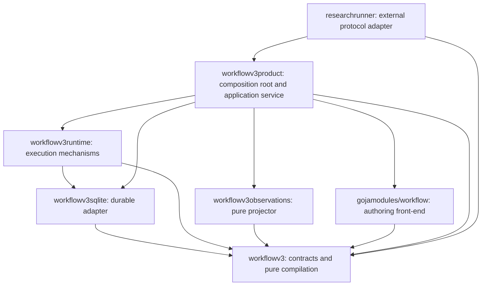
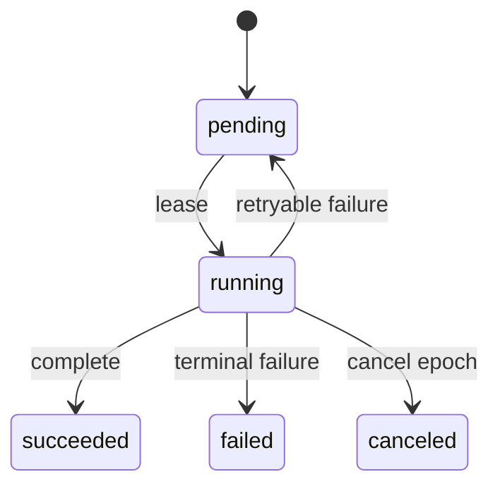
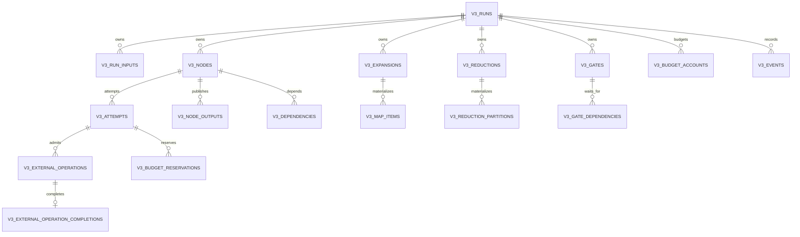
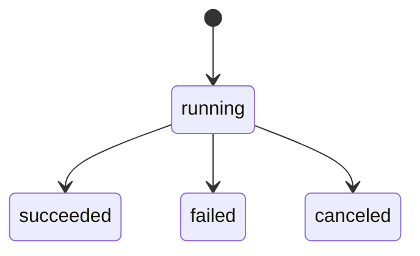
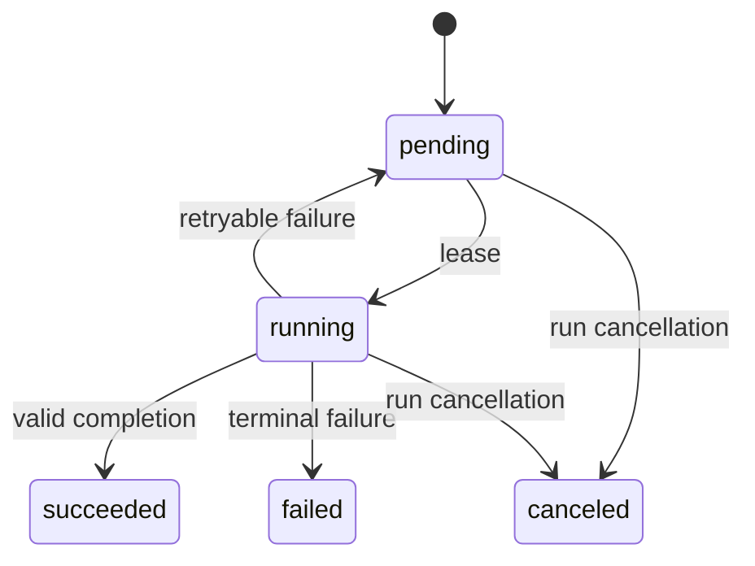
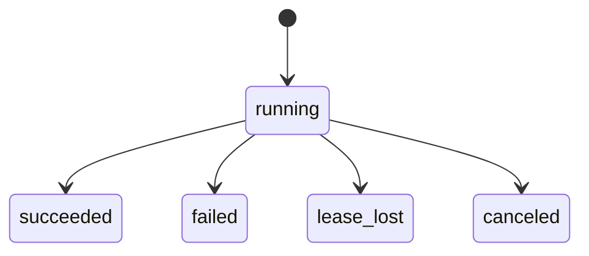
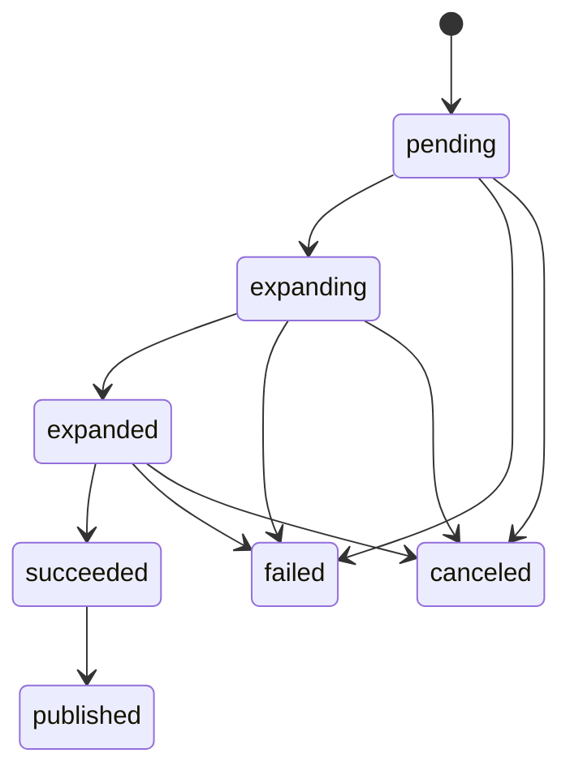
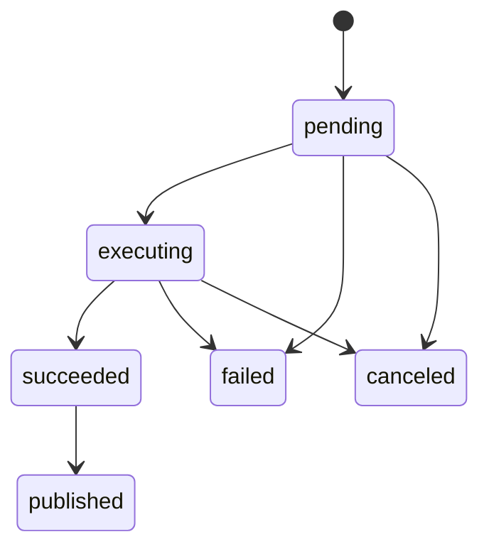
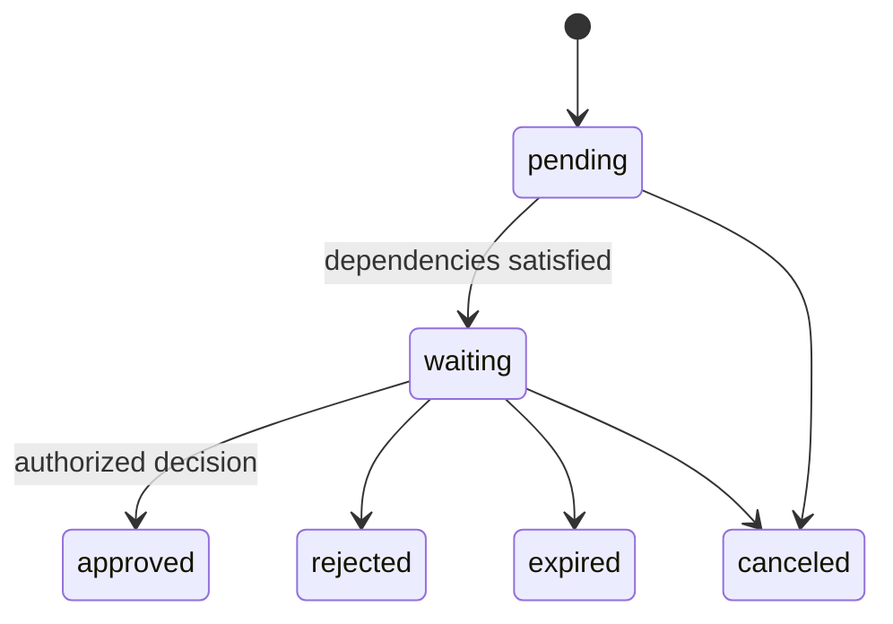
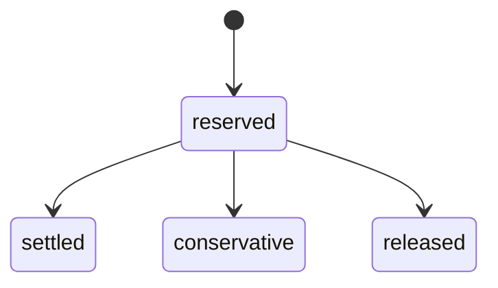

# Durable Boundaries

## Modular Software, Abstraction, and Reliable Execution in Scraper Workflow V3

**A codebase-centered textbook and course guide**

Source studied: [`wesen/scraper`, branch `task/benchmark-cpu-inference`](https://github.com/wesen/scraper/tree/task/benchmark-cpu-inference)  
Reference commit: `202229464629e2b6d0e193ff7798b16770b3a270`  
Primary scope: `pkg/workflowv3`, `pkg/workflowv3runtime`, `pkg/workflowv3sqlite`, `pkg/workflowv3product`, `pkg/workflowv3observations`, `pkg/gojamodules/workflow`, and `pkg/researchrunner`

---

## Preface

Workflow engines force software architecture to become concrete. A vague boundary eventually becomes a corrupted database row. An implicit retry eventually becomes a duplicated side effect. An ambient capability eventually leaks a credential. A poorly chosen identity eventually causes the wrong computation to be reused. A scheduler that looks reasonable in a unit test eventually leaves expensive hardware idle.

That makes the Workflow V3 codebase an unusually productive object of study. It contains compiler structure, content addressing, state machines, leases, fencing, capability security, transactional accounting, bounded dataflow, process isolation, derived projections, and adapter boundaries in one compact system. These mechanisms are not unique to workflow engines. The same patterns recur in build systems, package managers, distributed databases, job schedulers, payment systems, deployment controllers, scientific pipelines, and secure plugin hosts.

This book does not present the code as a perfect final product. It treats it as a serious architectural laboratory. Some mechanisms are excellent. Some are specialized. Some are more elaborate than most applications need. Some expose design gaps that become visible only because the rest of the system is rigorous. The purpose is to learn how to recognize, combine, constrain, and sometimes reject such patterns.

The central question throughout is:

> What information, authority, and state must cross this boundary—and what must not?

The most reusable lesson is not a particular type or database schema. It is the practice of turning hidden assumptions into explicit, versioned contracts.

---

## How this book was produced

The analysis combined four methods:

1. **Path-by-path architectural reading.** Core packages, design documents, schemas, tests, and integration boundaries were read as one system rather than as isolated files.
2. **API extraction.** Public types, interfaces, constructors, validators, compilers, stores, projectors, and execution methods were collected into a declaration corpus.
3. **Custom Go AST analysis.** Dependency-free tools built with `go/parser`, `go/ast`, `go/token`, and `go/printer` classified declarations, method sets, package edges, constructor/validator/compiler conventions, concurrency constructs, and effectful call families.
4. **Durable-state analysis.** A custom schema scanner extracted state vocabularies, foreign-key relationships, authority-bearing columns, and reviewed transition graphs from the Workflow V3 SQLite schema.

The AST declaration corpus contained 150 types, 134 structs, 13 interfaces, 56 package functions, and 112 methods across eight architectural packages and normalized control-flow extracts. Those counts describe the analyzed course corpus, not every file in the repository. The tools and generated reports are reproduced in the appendices and companion bundle.

Code quotations are intentionally short. Most examples use exact public signatures or reduced control-flow forms so the architectural mechanism remains visible.

---

## Intended audience

This text is suitable for:

- senior undergraduate or graduate courses in software architecture;
- engineers learning Go beyond ordinary HTTP services;
- researchers building durable experiment infrastructure;
- designers of schedulers, plugin systems, build tools, and data pipelines;
- teams reviewing whether a sophisticated mechanism is justified.

Readers should know basic Go syntax, interfaces, goroutines, SQL transactions, and JSON. Prior experience with workflow systems is useful but not required.

---

## Learning objectives

By the end of the course, a reader should be able to:

- separate authoring syntax, normalized intent, executable policy, and runtime occurrence;
- design stable identities that compose rather than overwrite one another;
- use leases and fencing to prevent stale workers from publishing;
- distinguish retries from logical work and infrastructure failures from domain failures;
- build work-conserving dispatch with bounded fan-out;
- model budgets and external effects as durable ledgers;
- use capabilities rather than ambient authority;
- derive projections without creating a second mutable truth;
- reason about coverage, missing evidence, and claims that cannot be reconstructed;
- recognize when content addressing, isolation, generations, or approval gates are useful;
- recognize when those same mechanisms become unnecessary ceremony.

---

# Table of Contents

## Part I — Reading the system

1. [Why a workflow engine is a course in abstraction](#chapter-1--why-a-workflow-engine-is-a-course-in-abstraction)
2. [The failure that shaped Workflow V3](#chapter-2--the-failure-that-shaped-workflow-v3)
3. [Package boundaries and dependency direction](#chapter-3--package-boundaries-and-dependency-direction)
4. [From authoring program to durable occurrence](#chapter-4--from-authoring-program-to-durable-occurrence)
5. [Four planes: control, data, authority, and evidence](#chapter-5--four-planes-control-data-authority-and-evidence)

## Part II — The immutable core

6. [Canonical values and digest identities](#chapter-6--canonical-values-and-digest-identities)
7. [Artifact references and content-addressed custody](#chapter-7--artifact-references-and-content-addressed-custody)
8. [Task specifications as executable contracts](#chapter-8--task-specifications-as-executable-contracts)
9. [Bundles and exact implementation identity](#chapter-9--bundles-and-exact-implementation-identity)
10. [Catalogs, registries, and sealed generations](#chapter-10--catalogs-registries-and-sealed-generations)
11. [Validation, compilation, and effective policy](#chapter-11--validation-compilation-and-effective-policy)
12. [The JavaScript DSL as a compiler front-end](#chapter-12--the-javascript-dsl-as-a-compiler-front-end)

## Part III — The durable runtime

13. [Run, node, attempt, and lease](#chapter-13--run-node-attempt-and-lease)
14. [Transactions as semantic boundaries](#chapter-14--transactions-as-semantic-boundaries)
15. [Fencing tokens and cancellation epochs](#chapter-15--fencing-tokens-and-cancellation-epochs)
16. [Work-conserving dispatch](#chapter-16--work-conserving-dispatch)
17. [Failure taxonomy and retry debt](#chapter-17--failure-taxonomy-and-retry-debt)
18. [Rolling registry generations](#chapter-18--rolling-registry-generations)
19. [Lazy maps and deterministic fan-out](#chapter-19--lazy-maps-and-deterministic-fan-out)
20. [Bounded reduction trees](#chapter-20--bounded-reduction-trees)
21. [Durable approval gates](#chapter-21--durable-approval-gates)
22. [Transactional budgets](#chapter-22--transactional-budgets)
23. [External-operation evidence ledger](#chapter-23--external-operation-evidence-ledger)
24. [Publication and stale-worker defense](#chapter-24--publication-and-stale-worker-defense)

## Part IV — Capability and isolation architecture

25. [Capability-selected modules](#chapter-25--capability-selected-modules)
26. [Trusted and restricted execution classes](#chapter-26--trusted-and-restricted-execution-classes)
27. [Bubblewrap, cgroups, and exact executor identity](#chapter-27--bubblewrap-cgroups-and-exact-executor-identity)
28. [Parent-side validation of child output](#chapter-28--parent-side-validation-of-child-output)
29. [Privacy by structural exclusion](#chapter-29--privacy-by-structural-exclusion)

## Part V — Evidence, observation, and integration

30. [Derived projections instead of duplicate truth](#chapter-30--derived-projections-instead-of-duplicate-truth)
31. [Coverage and epistemic honesty](#chapter-31--coverage-and-epistemic-honesty)
32. [Interval algebra and critical paths](#chapter-32--interval-algebra-and-critical-paths)
33. [The Researchctl bridge as an anti-corruption layer](#chapter-33--the-researchctl-bridge-as-an-anti-corruption-layer)
34. [The product package as composition root](#chapter-34--the-product-package-as-composition-root)

## Part VI — A reusable pattern language

35. [Functional core, imperative shell](#chapter-35--functional-core-imperative-shell)
36. [Ports and adapters](#chapter-36--ports-and-adapters)
37. [Compiler pipelines and intermediate representations](#chapter-37--compiler-pipelines-and-intermediate-representations)
38. [Content addressing and identity composition](#chapter-38--content-addressing-and-identity-composition)
39. [State machines, typestate, and temporal invariants](#chapter-39--state-machines-typestate-and-temporal-invariants)
40. [Object capabilities and ambient authority](#chapter-40--object-capabilities-and-ambient-authority)
41. [Idempotency, fencing, and the exactly-once illusion](#chapter-41--idempotency-fencing-and-the-exactly-once-illusion)
42. [Boundedness, backpressure, and work conservation](#chapter-42--boundedness-backpressure-and-work-conservation)
43. [Transactional event logs and CQRS-like projections](#chapter-43--transactional-event-logs-and-cqrs-like-projections)
44. [Generational hot swap and quarantine](#chapter-44--generational-hot-swap-and-quarantine)
45. [Versioned contracts and hard-cut migrations](#chapter-45--versioned-contracts-and-hard-cut-migrations)
46. [When architecture becomes ceremony](#chapter-46--when-architecture-becomes-ceremony)

## Part VII — Applying the architecture to RAG research

47. [A RAG pipeline as artifacts and activities](#chapter-47--a-rag-pipeline-as-artifacts-and-activities)
48. [Mapping RAG execution onto Workflow V3](#chapter-48--mapping-rag-execution-onto-workflow-v3)
49. [Where the current executor falls short for experiments](#chapter-49--where-the-current-executor-falls-short-for-experiments)
50. [A cleaner language-neutral executor contract](#chapter-50--a-cleaner-language-neutral-executor-contract)

## Part VIII — Laboratory exercises

51. [Lab: build a Go AST architecture scanner](#chapter-51--lab-build-a-go-ast-architecture-scanner)
52. [Lab: replace the artifact store behind its port](#chapter-52--lab-replace-the-artifact-store-behind-its-port)
53. [Lab: write a second compiler front-end](#chapter-53--lab-write-a-second-compiler-front-end)
54. [Lab: derive durable state machines from SQL and Go](#chapter-54--lab-derive-durable-state-machines-from-sql-and-go)
55. [Lab: prove stale-worker fencing](#chapter-55--lab-prove-stale-worker-fencing)
56. [Lab: test a work-conserving dispatcher](#chapter-56--lab-test-a-work-conserving-dispatcher)
57. [Lab: implement a lazy map and bounded reduction](#chapter-57--lab-implement-a-lazy-map-and-bounded-reduction)
58. [Lab: transactional budgets and external effects](#chapter-58--lab-transactional-budgets-and-external-effects)
59. [Lab: build a restricted process adapter](#chapter-59--lab-build-a-restricted-process-adapter)
60. [Lab: derive and verify terminal evidence](#chapter-60--lab-derive-and-verify-terminal-evidence)

## Appendices

- [Appendix A: API signature atlas](#appendix-a--api-signature-atlas)
- [Appendix B: Durable state atlas](#appendix-b--durable-state-atlas)
- [Appendix C: Static-analysis methodology and custom tools](#appendix-c--static-analysis-methodology-and-custom-tools)
- [Appendix D: Pattern review checklist](#appendix-d--pattern-review-checklist)
- [Appendix E: Glossary](#appendix-e--glossary)
- [Appendix F: Review and examination questions](#appendix-f--review-and-examination-questions)

---

# Part I — Reading the system

# Chapter 1 — Why a workflow engine is a course in abstraction

A modular system is not merely one with many packages. Modularity is the ability to change one decision without reopening every other decision. An abstraction is not merely an interface. It is a boundary that preserves a useful invariant while hiding choices that callers should not control.

Workflow engines put those definitions under pressure. Consider a task that transforms a corpus. A superficial API might be:

```go
func RunTask(input []byte) ([]byte, error)
```

That signature hides almost everything that matters in a durable system:

- Which implementation ran?
- Was the input immutable?
- Where did the output go?
- What happens if the process dies after producing the output but before acknowledging it?
- What happens if another worker takes over?
- Which retry policy applies?
- Does the task have network access?
- Which credentials can it use?
- How much memory, time, and provider budget may it consume?
- Can a stale worker publish after cancellation?
- Which facts are stored for later evidence?

Workflow V3 answers by introducing more structure, not by adding optional arguments to `RunTask`. Its core vocabulary includes `WorkflowIR`, `WorkflowPlan`, `TaskSpec`, `ImplementationIdentity`, `ArtifactRef`, `RunID`, `NodeKey`, `Attempt`, `Lease`, `BudgetClaim`, `PlanIsolation`, and `ExternalOperationDescriptor`.

At first glance this appears elaborate. The educational question is whether each type removes ambiguity at a genuine boundary.

A useful test is the **counterfactual change test**:

> If this policy changes, which types and packages must change?

Examples:

- Changing the JavaScript syntax should affect the authoring front-end, not SQLite.
- Changing SQLite to PostgreSQL should affect a store adapter, not workflow identity.
- Adding a container executor should implement an execution port, not alter the scientific plan format.
- Adding an RAG task should extend a domain package, not teach the generic scheduler what retrieval means.
- Changing observation rendering should not mutate historical attempts.

The package graph mostly honors this test. The `workflowv3` package defines compact contracts. Runtime and persistence depend on those contracts. `workflowv3product` assembles concrete pieces. `researchrunner` translates an external protocol into product operations. This is a recognizable inward-dependency architecture.

The codebase also demonstrates a second meaning of abstraction: **negative capability**. A good boundary often defines what a component cannot do.

A plan cannot choose the database path. A task cannot choose an arbitrary executable. A restricted child cannot open workflow SQLite. JavaScript cannot forge a `ValueRef` from a string. A stale lease cannot publish. An observation projector cannot read secret-bearing event bodies. The absence of authority is part of the API.

## The course lens

Each chapter studies three layers:

1. **Mechanism:** What does the code do?
2. **Pattern:** What recurring strategy does it instantiate?
3. **Judgment:** When is that strategy appropriate, and when is it overbuilt?

For example, a sealed registry is mechanically a set of exact implementations and module aliases with a digest. The pattern is immutable generation-based configuration. The judgment is that this is valuable when workers roll independently, but unnecessary in a single-process command with no hot replacement.

This three-layer lens prevents pattern worship. A pattern is not automatically good because it has a name. It earns its place by eliminating a class of failure at acceptable cost.

## A first architectural invariant

The most important invariant in Workflow V3 is:

> Durable control state contains compact identities and references; large or sensitive payloads remain outside it.

That invariant drives artifact references, bundles, maps, reductions, privacy, observations, and the Researchctl bridge. It is the thread that connects the entire book.

## Review questions

1. Why is a package boundary weaker than an authority boundary?
2. Which hidden decisions are present in `func RunTask([]byte) ([]byte, error)`?
3. Give an example where introducing a new type reduces rather than increases conceptual complexity.
4. Apply the counterfactual change test to a workflow engine you know.

---

# Chapter 2 — The failure that shaped Workflow V3

Architectures become easier to understand when we know the failure they were designed to prevent. Workflow V3 was not conceived as an abstract exercise. Its design document records two concrete defects in the preceding executor.

## Failure one: payloads entered the control plane

The earlier system accepted arbitrary JSON as workflow and operation input. A RAG preparation workload accidentally repeated a source-bearing plan across roughly 1,807 operations. The design document reports approximately 14.67 GB of operation input JSON and SQLite/WAL files around 20 GB each.

The immediate symptom was storage explosion. The deeper defect was architectural:

> The system had no enforceable distinction between control metadata and data-plane payload.

If an API accepts arbitrary JSON, documentation that says “please store only references” is not a boundary. The type permits the violation. The storage layer faithfully persists the mistake.

Workflow V3 reverses the default. Durable rows store:

- schema identifiers;
- content digests;
- media types;
- byte sizes;
- bounded locators;
- exact plan and implementation identities;
- attempt state;
- redacted failures;
- resource and budget accounting.

Payload bytes live in an artifact store. A typed `ArtifactRef` crosses the control boundary:

```go
type ArtifactRef struct {
    Schema    string `json:"schema"`
    Digest    string `json:"digest"`
    MediaType string `json:"mediaType"`
    Size      int64  `json:"size"`
    Locator   string `json:"locator"`
}
```

This is a **reference architecture** in the literal sense: components exchange evidence-bearing references rather than copying values into every layer.

## Failure two: fixed-cycle scheduling

The earlier scheduler leased a batch, started the batch, and waited for every operation in that batch before leasing more. If two generation requests took 35 seconds and an embedding request took 2 seconds, the embedding slot remained idle after 2 seconds until the generation requests completed.

The barrier looked roughly like this:

```text
lease [generation-1, generation-2, embedding-1]
start all three
embedding-1 finishes ------ slot remains idle
generation-1 finishes ----- slot remains idle
generation-2 finishes ----- cycle ends
next lease cycle begins
```

The bug was not a missing optimization. It was a mismatch between the scheduler abstraction and heterogeneous work. A batch barrier implicitly assumed similar task duration and one undifferentiated resource pool.

Workflow V3 introduces a continuously refilling dispatcher and named resource classes. A completion wakes the scheduler; an available `embedding.local` slot does not wait for a `generation.remote` slot.

The normalized control shape is:

```go
for {
    for {
        lease, err := leaseNextCompatibleWork()
        if lease == nil {
            break
        }
        go execute(lease)
    }

    select {
    case completion := <-completions:
        handle(completion)
    case <-poll.C:
        // Cross-process work, retry deadlines, and expired leases.
    case <-ctx.Done():
        return ctx.Err()
    }
}
```

This is the **work-conserving scheduler** pattern: when compatible work exists and compatible capacity is free, the scheduler should not intentionally leave the capacity idle.

## Failure-driven architecture

Both failures produced general rules:

| Incident | General rule |
|---|---|
| Source text duplicated into SQLite | Make control/data separation structural and typed |
| Fast tasks wait behind slow batch members | Refill resources continuously; avoid global cycle barriers |
| One worker count for heterogeneous work | Model capacities by resource class |
| Mutable final result overwrote retries | Store attempts append-only |
| Raw error messages controlled retry | Use closed failure classes and codes |
| Large fan-out materialized eagerly | Expand lazily with explicit backpressure |

Good architecture documents should preserve this causal chain. Without it, future maintainers see only complexity and are tempted to remove constraints whose purpose is no longer visible.

## A reusable practice: architecture incident records

For each nontrivial mechanism, record:

1. the observed failure;
2. the violated invariant;
3. alternatives considered;
4. the selected constraint;
5. tests that prove the constraint;
6. conditions under which the mechanism can be simplified.

This transforms architecture from folklore into reviewable evidence.

## Review questions

1. Why did arbitrary JSON make the storage incident a design defect rather than merely caller error?
2. Distinguish a batch scheduler from a work-conserving scheduler.
3. What is the simplest workload in which a cycle barrier becomes visibly inefficient?
4. Name one constraint that should be removed if the system becomes single-process and single-resource-class.

---

# Chapter 3 — Package boundaries and dependency direction

The AST dependency scan reveals a deliberate shape:



The graph is not perfectly “clean architecture” in a doctrinal sense. Runtime directly uses the concrete SQLite package rather than depending exclusively on a store interface. Nevertheless, the central dependency direction is clear: generic value contracts do not import product composition or RAG semantics.

## `pkg/workflowv3`: the stable center

This package owns:

- IR and executable plan types;
- task identities and policies;
- artifact references and the artifact-store port;
- bundle and registry contracts;
- validation and compilation;
- map, reduction, gate, isolation, budget, failure, and external-operation value models.

It is mostly a **functional core**. Values enter, are validated, normalized, hashed, or compiled, and values leave.

Representative signatures:

```go
func ValidateIR(ir WorkflowIR, catalog *Catalog) error
func Compile(ir WorkflowIR, catalog *Catalog) (WorkflowPlan, error)
func Digest(value any) (string, error)

type ArtifactStore interface {
    Put(context.Context, string, string, []byte) (ArtifactRef, error)
    Open(context.Context, ArtifactRef) (io.ReadCloser, error)
}
```

## `pkg/workflowv3sqlite`: durable authority

This package owns transitions that must be atomic:

- run creation;
- dependency and node materialization;
- lease admission;
- attempt creation;
- resource and budget reservation;
- completion or failure;
- map and reduction progress;
- gate decisions;
- cancellation epochs;
- operational snapshots.

Its conceptual interface is larger than a repository CRUD interface because it protects temporal invariants. `LeaseNextWithResources` is not “read next row, then update it.” It is an atomic authority-grant operation.

## `pkg/workflowv3runtime`: mechanisms

Runtime coordinates the store, artifact port, task registry, modules, and isolation executor. It does not decide scientific meaning. It knows how to:

- expand a map page;
- form reduction partitions;
- acquire and execute leases;
- construct task runtimes;
- renew leases;
- classify infrastructure failures;
- run a work-conserving dispatcher.

## `pkg/workflowv3observations`: retrospective truth

The projector reads one stable snapshot and derives metrics, traces, coverage, critical-path information, and artifact lineage. It is intentionally not another mutable store.

```go
type Source interface {
    ObservationSnapshot(
        context.Context,
        workflowv3.RunID,
    ) (SourceSnapshot, error)
}

func Project(
    context.Context,
    Source,
    workflowv3.RunID,
    ProjectOptions,
) (ObservationSet, error)
```

This is an excellent example of defining an interface at the consumer boundary. The projector asks for exactly the snapshot it needs.

## `pkg/workflowv3product`: composition and use cases

The product package selects concrete implementations and exposes application-level operations:

```go
type Application struct {
    Config     Config
    Authoring  *AuthoringEnvironment
    Store      *workflowv3sqlite.Store
    Artifacts  *workflowv3.FileArtifactStore
    Registry   *workflowv3runtime.RegistryManager
    Engine     *workflowv3runtime.Engine
    Dispatcher *workflowv3runtime.Dispatcher
}
```

This struct is intentionally concrete. A composition root is allowed to know implementations. Its job is to assemble policy, not to become a reusable domain core.

## `pkg/researchrunner`: anti-corruption at the edge

The Researchctl bridge duplicates external protocol types rather than importing Researchctl Go packages. It translates between two ownership models:

```text
Researchctl run / attempt
        |
        | lineage
        v
Workflow run / node / task attempt / external operation
```

That duplication is not automatically bad. At a process boundary, owning a local copy of the wire contract can prevent a dependency from smuggling internal semantics across the boundary.

## Package-design questions

When reviewing a package graph, ask:

- Which package contains the stable nouns?
- Which package owns time and mutation?
- Which package owns external authority?
- Which package is allowed to choose implementations?
- Which package translates another system’s language?
- Are dependency arrows aligned with those answers?

## Review questions

1. Why is a composition root expected to be concrete?
2. Which interface in this chapter is defined by its consumer?
3. What would improve if runtime depended on a store port rather than directly on `workflowv3sqlite.Store`?
4. When is duplicating wire types preferable to sharing an internal package?

---

# Chapter 4 — From authoring program to durable occurrence

Workflow V3 separates four representations that are often collapsed into one object.

```text
JavaScript authoring program
        |
        v
WorkflowIR: normalized intent
        |
        v
WorkflowPlan: host-resolved executable policy
        |
        v
Durable run: occurrence state and evidence
```

This separation is a compiler architecture.

## Representation 1: authoring program

The JavaScript file is a convenient syntax for constructing symbolic values. It may use loops, helper functions, and domain descriptor modules. Its callbacks execute during authoring. They are not persisted as runtime continuations.

That distinction prevents a durable engine from depending on replaying arbitrary JavaScript to recover state.

## Representation 2: `WorkflowIR`

The IR contains normalized intent:

```go
type WorkflowIR struct {
    Schema     string
    Name       string
    Inputs     []IRInput
    SetInputs  []IRSetInput
    Budgets    []BudgetAccount
    Nodes      []IRNode
    Maps       []IRMap
    Reductions []IRReduce
    Gates      []IRGate
    Outputs    []IROutput
    SetOutputs []IRSetOutput
}
```

An `IRNode` refers to a logical `TaskKey`:

```go
type TaskKey struct {
    Kind    string
    Version string
}
```

The author says, in effect, “use task kind `rag.embed` version `v2`.” The author does not choose bundle bytes, worker registry generation, database path, or secrets.

## Representation 3: `WorkflowPlan`

Compilation resolves logical tasks against a host catalog. Each node receives an exact implementation identity:

```go
type ImplementationIdentity struct {
    TaskKey
    BundleDigest string
    Entrypoint   string
    ABI          string
}
```

The plan also pins:

- catalog digest;
- input/output schemas;
- declared capability modules;
- resource class;
- retry policy;
- requested and effective budget claim;
- requested and effective isolation policy;
- policy and executor digests.

This is analogous to dependency resolution. A source manifest says `library X, version constraint Y`; a lock file records the exact artifact selected. `WorkflowIR` resembles the manifest. `WorkflowPlan` resembles the lock file.

## Representation 4: durable occurrence

A run is not the plan. It is one occurrence of the plan with bound input artifact references. It accumulates:

- node states;
- attempts;
- lease tokens;
- cancellation epoch;
- output references;
- external operations;
- budget reservations;
- gates and decisions;
- events and timestamps.

The plan is prospective provenance: what should execute. The run is retrospective provenance: what actually occurred.

## Why the distinction matters

Suppose a task package rolls from bundle digest A to B.

- Existing plan pinned to A remains interpretable.
- A worker generation containing A may drain.
- New authoring may compile to B.
- A plan requiring A must not silently run B.

If authoring, plan, and run were one mutable object, “update the task” would rewrite historical meaning.

## The resolved-policy pattern

Many systems benefit from storing both requested and effective policy:

```go
type PlanIsolation struct {
    Requested      IsolationPolicy
    Effective      IsolationPolicy
    PolicyDigest   string
    ExecutorDigest string
}
```

The requester expresses a preference. The host applies ceilings and capabilities. The effective value is what execution must obey. Both are preserved for audit.

This pattern generalizes to:

- resource limits;
- security policy;
- provider selection;
- storage class;
- retry policy;
- deployment placement;
- cost budgets.

## Review questions

1. Compare `WorkflowIR` and `WorkflowPlan` to a package manifest and lock file.
2. Why should authoring callbacks not be replayed during recovery?
3. Give another domain where requested and effective policy should both be stored.
4. Which representation should be content-addressed, and why?

---

# Chapter 5 — Four planes: control, data, authority, and evidence

A two-plane distinction between control and data is useful but insufficient for Workflow V3. The code becomes clearer when divided into four planes.

## Control plane

The control plane answers:

- What logical work exists?
- Which dependencies are satisfied?
- What state is each node in?
- When may a retry occur?
- Which resource class is required?
- Which budget and gate policies apply?

Typical control values are small and queryable: IDs, states, ordinals, deadlines, counters, policy digests, and artifact references.

## Data plane

The data plane contains the bytes being transformed:

- source documents;
- normalized records;
- embeddings;
- index shards;
- result tables;
- manifests;
- model outputs.

Data-plane payload belongs in an artifact store or domain-owned system, not repeated in scheduler rows.

## Authority plane

Authority answers a different question:

> Who is allowed to perform or publish this action now?

Authority-bearing values include:

- lease token;
- cancellation epoch;
- completion key;
- registry generation reference;
- gate version;
- required operator role;
- capability module selection;
- executor digest.

These values may be small, but they are not ordinary metadata. Leaking or ignoring them changes who can mutate the system.

A striking example is the attempt type:

```go
type Attempt struct {
    RunID              RunID
    NodeKey            NodeKey
    Number             int
    Status             string
    LeaseToken         string `json:"-"`
    CancelEpoch        int64
    RegistryGeneration string
    // ...
}
```

The JSON omission on `LeaseToken` expresses an authority boundary: ordinary serialization should not turn a completion capability into evidence or a log field.

## Evidence plane

The evidence plane answers:

- What happened?
- Which implementation and policy were in force?
- What was observed about attempts and external operations?
- Which outputs were published?
- Which facts can be reconstructed exactly?
- Where is coverage incomplete?

Evidence includes immutable attempt outcomes, digests, timing boundaries, failure class/code, external operation admission/completion, and derived observation sets.

## Why authority and evidence must differ

A lease token proves current permission. It should not be retained in a public report. A lease digest or attempt identity may be evidence, but the capability itself is secret.

Similarly, a provider response body may be data; provider timing and usage counters are evidence; the credential used to call the provider is authority. Treating all three as “metadata” produces leaks and confusion.

## A boundary matrix

| Value | Control | Data | Authority | Evidence |
|---|:---:|:---:|:---:|:---:|
| Node status | ✓ | | | ✓ |
| Artifact bytes | | ✓ | | |
| Artifact digest | ✓ | | | ✓ |
| Lease token | | | ✓ | |
| Cancellation epoch | ✓ | | ✓ | ✓ |
| Provider credential | | | ✓ | |
| Provider request body | | ✓ | | policy-dependent |
| Usage counters | ✓ | | | ✓ |
| Failure class/code | ✓ | | | ✓ |
| Raw failure text | | possible data | possible secret | usually excluded |

## General design rule

Every API field should have a plane. If a field belongs to more than one plane, define which representation crosses each boundary. For example:

- raw artifact bytes remain in the data plane;
- `ArtifactRef` crosses the control plane;
- digest and lineage enter the evidence plane;
- write capability remains with the artifact-store authority.

## Review questions

1. Why is a lease token not merely control metadata?
2. Classify an OAuth access token, request ID, response body, latency, and model name across the four planes.
3. What security bug results from serializing authority into evidence?
4. Find a field in one of your systems whose plane is ambiguous.

---

# Part II — The immutable core

# Chapter 6 — Canonical values and digest identities

Workflow V3 uses digests as names for plans, catalogs, bundles, policies, artifacts, registry generations, external-operation descriptors, and observation sets. A digest is not just a checksum added after the fact. It participates in equality, compatibility, resolution, and authorization.

The central functions are intentionally small:

```go
func CanonicalJSON(value any) ([]byte, error)
func Digest(value any) (string, error)
```

Conceptually:

```text
value
  -> deterministic serialization
  -> SHA-256
  -> "sha256:" + hexadecimal digest
```

## Identity by value

A conventional database ID says, “this row is object 317.” A content digest says, “this identity denotes these exact bytes or this exact canonical value.”

That difference matters when components communicate across time and process boundaries. A worker can verify that the plan it received is the plan the submitter compiled without consulting a mutable name service.

Examples in Workflow V3 include:

- `WorkflowPlan.Digest` identifies the compiled plan.
- `WorkflowPlan.CatalogDigest` identifies the set of task contracts used to compile it.
- `ImplementationIdentity.BundleDigest` identifies task source bytes.
- `PlanIsolation.PolicyDigest` identifies the effective isolation contract.
- `PlanIsolation.ExecutorDigest` identifies the restricted executor toolchain.
- `ExternalOperationDescriptor.Digest` identifies the side-effect authority and counter vocabulary.
- `ObservationSet.SourceDigest` identifies the authoritative snapshot used for derivation.

## Identity layers should not collapse

A common mistake is to create one giant “run hash” and use it for every purpose. Workflow V3 instead keeps identities at different layers:

```text
IR digest
  -> catalog digest
  -> plan digest
      -> run ID
          -> node key
              -> attempt number
                  -> artifact digest
```

The digest of a plan is not the ID of a run. Several runs may execute the same plan. An attempt is not a new plan. An artifact digest is not a node key. This composition lets the system ask precise questions.

## Canonicalization caveat

The implementation’s `CanonicalJSON` uses Go’s `encoding/json`. For structs and maps with string keys, current Go encoding provides stable field and key ordering, which is often adequate inside one Go-owned contract. It is not, however, a language-independent canonical JSON standard in the same sense as RFC 8785 JCS.

This distinction should be explicit. If Java, Python, and Go must independently compute the same digest from semantically equivalent JSON, adopt a formal canonicalization profile. If only Go produces canonical contract bytes and other languages treat them as opaque, Go-owned encoding may be sufficient.

The lesson is:

> “Deterministic in this implementation” and “canonical across implementations” are different promises.

## Digest envelopes

Bundles demonstrate an important pattern. The bundle digest is not computed over an arbitrary map directly. The code constructs a normalized envelope containing:

- cloned and sorted manifest;
- sorted file paths;
- digest and size of each file.

This makes the identity explainable and avoids depending on map iteration or archive byte layout.

A generalized envelope looks like:

```go
type DigestFile struct {
    Path   string
    Digest string
    Size   int
}

type DigestEnvelope struct {
    Manifest Manifest
    Files    []DigestFile
}
```

The envelope is often more stable than hashing a ZIP or tar archive, whose metadata may vary.

## Domain separation

A further improvement would prefix hashes by type and version before hashing:

```text
SHA256("workflow-plan/v3\x00" || canonicalPlan)
SHA256("task-bundle/v1\x00" || canonicalBundleEnvelope)
```

Domain separation prevents identical byte sequences from being confused across semantic namespaces. The string prefix in the stored digest is not enough if raw digests are compared outside their type context.

## When to use content-derived identity

Use it when:

- values cross trust or process boundaries;
- exact reproduction matters;
- immutable caching is useful;
- names may be reused while contents change;
- historical plans must remain resolvable.

Avoid using it as the only identity when:

- human continuity matters independently of content;
- objects have an amendment history;
- access control is attached to a logical resource;
- equivalent representations should be considered equal but canonicalization is unavailable.

The usual solution is dual identity: a stable logical ID plus an immutable revision digest.

## Review questions

1. Why are plan digest and run ID separate?
2. What would break if bundle identity were only `name@version`?
3. When is Go’s JSON determinism insufficient?
4. Design a digest envelope for a containerized Python task.

---

# Chapter 7 — Artifact references and content-addressed custody

The `ArtifactRef` is one of the smallest and most consequential types in the system:

```go
type ArtifactRef struct {
    Schema    string `json:"schema"`
    Digest    string `json:"digest"`
    MediaType string `json:"mediaType"`
    Size      int64  `json:"size"`
    Locator   string `json:"locator"`
}
```

It combines five different contracts.

## `Schema`: logical meaning

Media type answers how bytes are encoded. Schema answers what the bytes mean.

Two files may both be `application/json`, while one is a chunk manifest and another is an external-operation ledger. Conflating media type with logical schema forces every consumer to inspect payloads before deciding whether it is compatible.

## `Digest`: immutable identity

The digest makes the reference verifiable. A locator alone is a mutable address. A digest alone is an identity without retrieval information. Together they support locate-then-verify.

## `Size`: boundedness and early rejection

Size is not redundant metadata. It supports:

- admission limits;
- memory planning;
- truncation detection;
- staging policy;
- protocol bounds;
- denial-of-service resistance.

A consumer can reject an impossible artifact before allocating or downloading it.

## `Locator`: storage-specific retrieval

The locator is deliberately not the primary identity. In the local store it resembles `objects/<sha256>`. A future S3 or OCI adapter could use a different locator while preserving digest, schema, media type, and size.

This is a **location transparency** pattern with an important qualification: the locator remains part of the reference because the current store port does not provide lookup by digest alone.

## The artifact-store port

```go
type ArtifactStore interface {
    Put(
        context.Context,
        string, // schema
        string, // media type
        []byte,
    ) (ArtifactRef, error)

    Open(
        context.Context,
        ArtifactRef,
    ) (io.ReadCloser, error)
}
```

The interface is minimal. `Put` returns the authoritative identity. `Open` verifies the reference before returning bytes.

The file implementation follows a useful publication protocol:

1. validate schema and media type;
2. enforce maximum bytes;
3. compute digest;
4. derive the object path;
5. return immediately if the object already exists;
6. write a temporary file;
7. `Sync` the temporary file;
8. close it;
9. atomically rename it into place;
10. return the immutable reference.

On read it verifies size and digest again.

This is not merely file I/O. It is a tiny content-addressed storage transaction.

## Data integrity versus durability

`temporary.Sync()` improves file-content durability, but a maximally careful filesystem protocol may also sync the containing directory after rename. The exact requirement depends on the filesystem and crash model.

A course exercise should distinguish:

- process-level atomic visibility;
- machine-crash durability;
- cross-filesystem behavior;
- network-store consistency;
- replica durability.

“Atomic rename” is not a universal storage theorem.

## The current scalability limit

The port accepts `[]byte`, and the local implementation reads complete artifacts into memory. That makes the abstraction convenient for small JSON and manifests but unsuitable for large embeddings, indexes, checkpoints, or corpus shards.

A scalable successor might use:

```go
type ArtifactWriter interface {
    Commit(ctx context.Context) (ArtifactRef, error)
    Abort(ctx context.Context) error
    io.WriteCloser
}

type ArtifactStore interface {
    Create(ctx context.Context, meta ArtifactMeta) (ArtifactWriter, error)
    Open(ctx context.Context, ref ArtifactRef) (io.ReadCloser, error)
    Stat(ctx context.Context, ref ArtifactRef) error
}
```

For directories or sharded datasets, use tree manifests rather than one enormous byte slice.

## The custody principle

Artifact storage is not only a cache. In a reproducible workflow it is custody: the system promises that a named output can be retrieved and verified later.

That promise requires lifecycle policy:

- retention;
- garbage collection by reachability;
- replication;
- access control;
- encryption;
- audit;
- legal deletion where required.

Workflow V3 has the identity mechanics. A production research platform would need the lifecycle mechanics as well.

## Review questions

1. Why are schema and media type separate?
2. What does size protect against that digest does not?
3. Which crash guarantees does temporary-write-plus-rename provide?
4. Redesign `ArtifactStore` for a 200 GB vector index.

---

# Chapter 8 — Task specifications as executable contracts

A task in Workflow V3 is not just a function name. `TaskSpec` binds code identity, data contracts, capabilities, resource policy, retry policy, budget ceilings, and isolation ceilings.

```go
type TaskSpec struct {
    Identity                ImplementationIdentity
    Inputs                  map[string]string
    Outputs                 map[string]string
    Modules                 []string
    ResourceClass           string
    Retry                   RetryPolicy
    BudgetMaximum           *BudgetClaim
    IsolationMaximum        IsolationPolicy
    IsolationExecutorDigest string
}
```

This type illustrates **contract aggregation**: several concerns that must agree at execution time are compiled into one immutable task description.

## Ports rather than arbitrary arguments

Inputs and outputs are named schema-bearing ports:

```go
Inputs  map[string]string
Outputs map[string]string
```

A node binds each required input port to a `ValueRef`. Compilation verifies that the source schema equals the task’s expected schema.

This resembles a typed dataflow language. Types are represented as versioned schema strings rather than Go types because plans cross process and language boundaries.

## Capabilities are declared

`Modules []string` lists the runtime capabilities a task requires, such as `fs:input` or a provider-specific module. The task cannot dynamically request arbitrary modules during execution.

The declaration serves several purposes:

- preflight compatibility;
- least privilege;
- registry identity;
- audit;
- isolation-class enforcement.

A task requiring broad execution capability is forced into restricted subprocess isolation.

## Resource class is a compatibility label

`ResourceClass` is not merely a queue name. It is a predicate over worker capacity. A worker configured with `embedding.local=1` can admit one compatible task; a CPU slot cannot silently substitute unless policy says so.

A more elaborate system might replace strings with structured requirements:

```go
type Resources struct {
    CPU      MilliCPU
    Memory   Bytes
    GPU      *GPURequest
    Disk     Bytes
    Network  NetworkClass
    Placement map[string]string
}
```

The string class is simpler and sufficient when resource combinations are curated by operators.

## Retry is part of task semantics

```go
type RetryPolicy struct {
    MaxAttempts   int
    BackoffMillis int64
}
```

Including retry in the compiled task contract prevents workers from inventing their own behavior. It also lets the store decide eligibility and count retry debt durably.

However, a single fixed backoff is limited. Production systems often need exponential backoff, jitter, retryable failure classes, and total elapsed limits. Each added option should remain a closed, validated policy—not arbitrary callback code.

## Maximum versus request

`BudgetMaximum` and `IsolationMaximum` express host-side ceilings attached to the implementation. A plan may request less, but not more. This is an important inversion: untrusted authoring cannot raise its own privilege.

The compiler combines requested and maximum policies to produce effective policies. Execution then verifies the plan against the registered implementation again.

## Contract cohesion

Does `TaskSpec` contain too much? A useful cohesion test is:

> Must these fields agree before a worker may safely execute the task?

For the listed fields, the answer is mostly yes. Code bytes, ABI, ports, capabilities, isolation, and retry all affect compatibility. Splitting them into independently mutable tables would create invalid combinations.

The concern is evolution. A large contract needs clear versioning and defaults. Adding a field that affects identity must change digest semantics deliberately.

## Review questions

1. Why use schema strings instead of Go generic types?
2. Which `TaskSpec` fields affect worker compatibility?
3. Should retry policy belong to task implementation, workflow node, or both?
4. Design a structured replacement for `ResourceClass` without making scheduling unbounded.

---

# Chapter 9 — Bundles and exact implementation identity

Logical task names are not sufficient for reproducible execution. `kind=rag.embed, version=v2` can still refer to different source bytes in two binaries or deployments. Workflow V3 adds exact implementation identity:

```go
type ImplementationIdentity struct {
    TaskKey
    BundleDigest string
    Entrypoint   string
    ABI          string
}
```

## The bundle as a code artifact

A bundle contains:

- a manifest;
- one or more source files;
- task declarations;
- entrypoints in `path#export` form;
- ports;
- module requirements;
- retry and resource policy;
- maximum budget and isolation policy.

The constructor validates canonical file paths, entrypoint existence, task uniqueness, ABI, and task contracts before computing the digest.

```go
func NewBundle(
    manifest BundleManifest,
    files map[string][]byte,
) (*Bundle, error)
```

The important pattern is **build the immutable unit before registration**. A registry never receives loose source bytes plus separate metadata that may drift. It receives a validated `Bundle`.

## Entrypoint is part of identity

Two tasks can use the same bundle bytes but different exports. Therefore `BundleDigest` alone does not identify executable behavior. `Entrypoint` and `ABI` remain part of `ImplementationIdentity`.

This is analogous to a container image plus command. The image digest identifies a filesystem, not the exact entrypoint invocation.

## ABI as an explicit compatibility boundary

```go
const TaskABI = "scraper-js-task/v1"
```

The ABI names the contract between task source and runtime host. It may cover:

- input representation;
- output writer API;
- failure reporting;
- cancellation checkpoints;
- available built-in module semantics.

Pinning ABI prevents “same source, different host calling convention” from being treated as compatible.

## Exact identity and reproducibility

Exact implementation identity provides strong evidence about the JavaScript bundle. It does not by itself identify every trusted Go module behind a module alias. That is an important gap: a module alias can retain the same name while its Go implementation changes.

A generalized implementation identity should include:

```text
bundle digest
+ entrypoint
+ task ABI
+ host module implementation digests
+ runtime engine digest/version
+ environment or container digest
+ relevant native library identities
```

The required granularity depends on the reproducibility promise. Security compatibility and scientific reproducibility may require different fields.

## Names for humans, digests for machines

The bundle still has `Name` and `Version`. Human-readable names support communication and policy. Digests support exact matching. Neither replaces the other.

A useful display string is:

```text
rag-tasks@2.1.0
sha256:4e2...
execution/embed.cjs#embed
scraper-js-task/v1
```

The UI should show both, rather than forcing users to choose between readability and precision.

## Review questions

1. Why is `name@version` insufficient?
2. Why does an entrypoint remain outside the bundle digest identity?
3. What does an ABI protect?
4. Which host components are not fully captured by the current identity?

---

# Chapter 10 — Catalogs, registries, and sealed generations

Workflow V3 distinguishes a **catalog** from a **registry**.

- The catalog describes task contracts available for compilation.
- The registry resolves exact implementations for execution.

That distinction separates planning knowledge from executable authority.

## Catalog

```go
type Catalog struct {
    // map[TaskKey]TaskSpec
}

func NewCatalog(specs ...TaskSpec) (*Catalog, error)
func (c *Catalog) Lookup(key TaskKey) (TaskSpec, bool)
func (c *Catalog) Specs() []TaskSpec
func (c *Catalog) Digest() (string, error)
```

The catalog is normalized and digestible. Compilation uses it to resolve a logical `TaskKey` into a `TaskSpec`.

## Registry builder

```go
func NewRegistryBuilder() *RegistryBuilder
func (b *RegistryBuilder) AdvertiseModules(...string) error
func (b *RegistryBuilder) AdvertiseIsolationExecutor(
    class string,
    digest string,
) error
func (b *RegistryBuilder) AddBundle(*Bundle) error
func (b *RegistryBuilder) Seal() (*SealedRegistry, error)
```

The builder accumulates implementations, module aliases, and isolation executors. `Seal` validates the complete set and computes a generation digest.

This is the **mutable builder, immutable product** pattern. Mutation is confined to construction. The runtime receives a sealed generation.

## Resolver port

```go
type RegistryResolver interface {
    ResolveNode(PlanNode) (RegisteredTask, error)
    AcquireNode(PlanNode) (
        RegisteredTask,
        string, // generation
        func(), // release
        error,
    )
    ModuleAliases() []string
    Catalog() (*Catalog, error)
}
```

`AcquireNode` returns a release function because a rolling registry manager may retain a draining generation while attempts still reference it. This is reference-counted generation lifetime.

## Exact resolution

Resolution compares:

- implementation identity;
- resource class;
- retry policy;
- isolation policy;
- module list;
- advertised module aliases.

A task with matching kind/version but different bundle bytes is not compatible. A plan with altered modules is not compatible. A required restricted executor digest must be available.

This is a **closed-world execution** model. Workers advertise a finite, exact set of things they can do.

## Rolling generations

The runtime can activate a new sealed registry generation while the old one drains. Newly admitted work uses the new generation. Existing leases retain the exact generation acquired before the attempt was persisted.

The pattern resembles:

- read-copy-update;
- immutable configuration snapshots;
- deployment revisions;
- generation-based plugin reload;
- epoch-based resource reclamation.

A broken candidate can fail self-test or accumulate runtime-construction failures and be quarantined without consuming domain task retry debt.

## When this is justified

Generations are valuable when:

- workers are long-lived;
- code rolls without stopping all work;
- attempts may outlive configuration changes;
- exact historical implementation matters;
- multiple versions must coexist briefly.

They are excessive when:

- every command starts a fresh process;
- tasks cannot overlap deployment;
- a full restart is cheap and acceptable;
- there is no hot activation requirement.

## A subtle identity gap

The generation digest includes module aliases, not necessarily the bytes or configuration behind each alias. To make generations fully reproducible, each module factory should contribute an identity:

```go
type TaskModuleFactory struct {
    Alias          string
    IdentityDigest string
    // ...
}
```

The registry generation would then bind names to exact host implementations.

## Review questions

1. Distinguish catalog knowledge from registry authority.
2. Why does `AcquireNode` return a release function?
3. What class of deployment race do immutable generations prevent?
4. When would a process restart be simpler than generation management?

---

# Chapter 11 — Validation, compilation, and effective policy

`ValidateIR` is large because it enforces cross-object invariants before execution. This is not field validation alone. It verifies a graph and a policy composition.

Representative checks include:

- schema version;
- unique names and keys;
- known tasks;
- complete input bindings;
- exact schema compatibility;
- valid and acyclic dependencies;
- valid map source and one map-item binding;
- valid map bounds;
- one output for map/reducer tasks;
- homogeneous reduction output schema;
- valid gates and no dependency cycles through gates;
- known budget accounts and dedicated approval gates;
- isolation requests within implementation ceilings;
- at least one workflow output.

## Closed-world validation

The compiler receives an explicit `Catalog`. It does not resolve unknown tasks at runtime. This gives compilation enough knowledge to reject invalid combinations.

```go
func ValidateIR(ir WorkflowIR, catalog *Catalog) error
func Compile(ir WorkflowIR, catalog *Catalog) (WorkflowPlan, error)
```

The sequence is:

```text
validate intent against catalog
compute IR digest
compute catalog digest
resolve each task
compile budget request against maximum
compile isolation request against maximum and executor
copy normalized bindings and schemas
compute policy digests
compute plan digest
```

## Why compile policy

Suppose a task allows at most 4 GB memory. A workflow requests 8 GB. The runtime should not discover the conflict after leasing. Compilation fails.

Suppose a task allows at most 4 GB and the workflow requests 2 GB. The plan records:

```go
type PlanIsolation struct {
    Requested IsolationPolicy // 2 GB
    Effective IsolationPolicy // 2 GB after host ceiling
    PolicyDigest string
    ExecutorDigest string
}
```

Suppose no request is provided. The implementation maximum or default becomes effective. The plan still records the result.

This is **policy normalization**: convert optional, layered, human-facing policy into one explicit executable value.

## Avoiding runtime configuration ambiguity

If runtime recomputed effective policy from current host configuration, an old plan could change meaning. Compilation therefore pins the decision, and execution revalidates that the current registry supports it.

The plan is not permission by itself. It is a signed-like statement of what should be permitted. The current host still checks that it can honor the statement.

## Validation as user experience

Large validators can produce poor errors if they return only the first string. The current code returns descriptive errors, but a course-quality evolution would introduce structured diagnostics:

```go
type Diagnostic struct {
    Code     string
    Path     string
    Severity string
    Message  string
    Hint     string
}
```

A compiler can accumulate independent diagnostics while stopping where later checks would be unsafe.

## Validation layers

Separate:

1. **shape validation** — required fields, ranges, syntax;
2. **referential validation** — names and references exist;
3. **graph validation** — cycles and reachability;
4. **capability validation** — implementation and modules exist;
5. **policy compilation** — requests fit ceilings;
6. **identity validation** — embedded digests match canonical values.

This layering makes tests and error messages clearer.

## Review questions

1. Which checks require the catalog and cannot be done from IR alone?
2. Why pin effective policy rather than recompute it at execution time?
3. Distinguish invalid shape from invalid capability.
4. Design a structured diagnostic for a schema-mismatched binding.

---

# Chapter 12 — The JavaScript DSL as a compiler front-end

Workflow V3’s JavaScript API is descriptor-only. It does not execute tasks during authoring. It creates symbolic handles that the Go host recognizes.

A simplified workflow looks like:

```javascript
const workflow = require("workflow")
const tasks = require("rag-tasks")

const definition = workflow.define("prepare", plan => {
  const corpus = plan.input("corpus", {
    schema: "rag/corpus/v1"
  })

  const chunks = plan.task(
    "chunk",
    tasks.chunk({ corpus })
  )

  plan.output("chunks", chunks.output("chunks"))
})

module.exports = workflow.compile(definition)
```

## Symbolic values, not user-forged references

The Go authoring state maintains maps from Goja object identity to `ValueRef`, `SetRef`, task invocation, job key, IR, and plan.

A JavaScript object becomes a valid workflow value only because the host created it and stored it in the side table. A caller cannot pass:

```javascript
{ source: "node-output", nodeKey: "admin", ... }
```

and have it accepted as an authority-bearing internal reference.

This is the **opaque handle** pattern. The object’s visible properties are not the source of authority; host-side association is.

## Immediate callbacks

Callbacks such as `plan.map(name, set, item => ...)` execute once during authoring with a symbolic item handle. The callback is not serialized and replayed for each runtime item.

The callback describes a template:

```text
for each item in this set,
materialize a node using this task descriptor and these symbolic bindings
```

This is safer and more deterministic than persisting arbitrary closures.

## Go owns semantics

The JavaScript layer delegates validation and compilation to Go:

```go
type AuthoringResult struct {
    IR   workflowv3.WorkflowIR
    Plan workflowv3.WorkflowPlan
}

func Author(
    ctx context.Context,
    source string,
    catalog *workflowv3.Catalog,
    modules ...DescriptorModule,
) (AuthoringResult, error)
```

JavaScript is syntax. Go owns the schema, normalized representation, identity, and policies.

## Generated TypeScript declarations

The module provides a TypeScript declaration string. This improves editor feedback for `ValueRef<T>`, `SetRef<T>`, builders, budget dimensions, and isolation policy.

The type parameters are advisory because runtime schema compatibility is expressed by strings and host-side handles. Still, editor types reduce authoring mistakes.

## Strengths of the pattern

- expressive loops and helpers;
- pure authoring;
- no runtime closure replay;
- no direct database or artifact authority;
- opaque symbolic references;
- one canonical Go IR;
- language front-end can be replaced later.

## Weaknesses in the current product

The workflow appears dynamically extensible, but task packages are primarily compiled Go composition objects containing embedded CommonJS files and module factories. A scientist cannot ordinarily point the engine at an arbitrary Python script or OCI image.

The DSL is therefore modular for workflow composition but not fully modular for task installation.

A future design should preserve the IR/compiler boundary while allowing other front-ends:

- YAML/JSON;
- Python builders;
- CWL;
- generated plans from a RAG compiler;
- direct Go construction.

The canonical plan must remain language-neutral.

## Review questions

1. Why does host-side object identity matter?
2. What is gained by executing map callbacks only during authoring?
3. Which semantics belong in JavaScript, and which belong in Go?
4. Design a Python front-end that emits the same IR without changing runtime.

---
# Part III — Durable runtime: authority over time

# Chapter 13 — Run, node, attempt, and lease

The central runtime lesson in Workflow V3 is that **logical work and permission to perform that work are different things**.

A workflow plan names logical nodes. A durable run instantiates those nodes. Attempts record individual execution episodes. Leases grant temporary authority to one worker. These concepts are deliberately separate:

```text
WorkflowPlan
    |
    v
Run
    |
    +-- Node A
    |      +-- Attempt 1 -- lease L1 -- failed
    |      +-- Attempt 2 -- lease L2 -- succeeded
    |
    +-- Node B
           +-- Attempt 1 -- lease L3 -- succeeded
```

The core signatures expose the distinction:

```go
type RunID string
type NodeKey string

type Attempt struct {
    RunID                   RunID
    NodeKey                 NodeKey
    Number                  int
    Status                  string
    LeaseToken              string `json:"-"`
    CancelEpoch             int64
    RegistryGeneration      string
    ResourceClass           string
    IsolationClass          string
    IsolationPolicyDigest   string
    IsolationExecutorDigest string
    StartedAt               time.Time
    FinishedAt              time.Time
    Failure                 *Failure
}

type Lease struct {
    RunID              RunID
    NodeKey            NodeKey
    Attempt            int
    FailureCount       int
    Token              string
    CancelEpoch        int64
    ExpiresAt          time.Time
    PlanNode           PlanNode
    RegisteredTask     RegisteredTask
    RegistryGeneration string
    ReleaseGeneration  func()
}
```

A `NodeKey` identifies the logical work within one run. An `Attempt.Number` identifies an execution history entry for that node. A lease token identifies one temporary authority grant. The same node may have multiple attempts, but only the current valid lease may publish.

## Why a mutable `node.status` is not enough

A simplistic executor stores only:

```text
node.status = running | succeeded | failed
```

That representation loses the history needed to answer:

- How many times did the task execute?
- Did a worker die while holding authority?
- Which implementation generation ran each attempt?
- Which failure triggered a retry?
- Was an output published by the attempt that currently owned the node?
- Did cancellation occur before or after publication?

Workflow V3 retains a mutable operational summary on the node because schedulers need efficient readiness queries, but it also records append-only attempts. This is a pragmatic combination:

```text
node row       current projection for scheduling
attempt rows   historical execution evidence
```

This is an example of a broader pattern: **mutable coordination state plus immutable occurrence history**.

## Run identity versus plan identity

A plan digest says which executable definition a run instantiates. A run ID says which occurrence is being executed.

```go
type RunSnapshot struct {
    RunID      RunID
    Status     string
    PlanDigest string
    Outputs    map[string]ArtifactRef
    Attempts   []Attempt
}
```

Two runs may use the same plan and inputs but still be distinct occurrences. This distinction is essential in scientific work, billing, audits, retries across a control-plane boundary, and investigations of nondeterministic systems.

Do not use the plan digest as the run ID. Doing so collapses a reusable definition into an occurrence and makes it impossible to represent repeated executions cleanly.

## Lease as a temporal capability

A lease is not merely a row lock. It is a capability with three dimensions:

1. **Object scope** — one `(run_id, node_key)`.
2. **Identity** — one unguessable token and attempt number.
3. **Time** — one expiration instant.

A completion operation must prove all three. If any dimension no longer matches, publication must fail.

This is stricter than “the worker once acquired the job.” Distributed systems cannot safely rely on historical authority. Authority must be valid **at the moment of effect**.

## General pattern

Use the four-level model whenever execution may retry, move between workers, outlive a process, or be canceled:

```text
definition -> occurrence -> attempt -> authority grant
```

Examples include:

- CI jobs;
- build systems;
- distributed crawlers;
- data pipelines;
- payment processing;
- model training;
- batch inference;
- laboratory automation.

## Review questions

1. Why is an attempt not the same thing as a node?
2. Which facts belong on the node row, and which belong on the attempt row?
3. Why must a lease contain a token as well as an expiration time?
4. How would you represent an operator-requested rerun after a successful node?

---

# Chapter 14 — Transactions as semantic boundaries

Workflow V3 uses SQLite transactions not merely for database consistency but to define **indivisible domain actions**.

Consider leasing a node. The operation conceptually performs all of the following:

```text
check run is active
check node is ready
check dependencies
check retry deadline
check implementation availability
check resource capacity
check budget capacity
reserve budget
increment attempt number
create attempt row
install lease token and expiry
mark node running
record event
```

If these actions were separate commits, every intermediate state would become observable. A crash after budget reservation but before attempt creation would leak capacity. A crash after marking the node running but before installing a token would create work nobody could complete. Two workers could race past independent checks.

The correct abstraction is one transactional method:

```go
func (s *Store) LeaseNextWithResources(
    ctx context.Context,
    registry workflowv3.RegistryResolver,
    capacities map[string]int,
    now time.Time,
    duration time.Duration,
) (*workflowv3.Lease, error)
```

The transaction is the semantic boundary for **admission**.

## Completion is another semantic boundary

A successful task completion must atomically:

- verify the lease token;
- verify the cancellation epoch;
- validate outputs;
- settle budget usage;
- publish output references;
- mark the attempt succeeded;
- mark the node succeeded;
- release the lease;
- enable downstream work;
- possibly close the run;
- append operational evidence.

The runtime exposes the intent in a single call:

```go
func (e *Engine) ExecuteLease(
    ctx context.Context,
    lease workflowv3.Lease,
) error
```

and ultimately commits through store operations such as:

```go
CompleteWithUsage(
    ctx context.Context,
    lease workflowv3.Lease,
    outputs map[string]workflowv3.ArtifactRef,
    usage []workflowv3.BudgetAmount,
    now time.Time,
) error
```

The exact store signature may evolve, but the design rule should not: **publication and authority validation belong in the same transaction**.

## Why “check, then act” is unsafe

This sequence is broken:

```go
if store.LeaseValid(ctx, lease) {
    store.WriteOutputs(ctx, outputs)
    store.MarkSucceeded(ctx, lease)
}
```

Another process can cancel the run or supersede the lease between the check and the writes.

The safe form is:

```go
err := store.Complete(ctx, lease, outputs)
```

where `Complete` verifies current authority and mutates durable state in one transaction.

This is the database equivalent of compare-and-swap.

## Transactional outbox thinking

Workflow V3 stores bounded events in the same durable database. This resembles the transactional outbox pattern:

```text
state transition + event record
            one transaction
```

A separate process or HTTP stream may later project those events. It does not need to trust an in-memory callback that could be lost after commit.

The crucial point is not that every system must use an outbox table. The point is that **observable claims about a transition should be committed with that transition**.

## SQLite as a concurrency primitive

The store opens SQLite with foreign keys, WAL mode, full synchronous writes, a busy timeout, and immediate transaction locking. Those settings encode a particular deployment assumption:

- a small number of cooperating local processes;
- one durable filesystem;
- strong transaction semantics;
- moderate write concurrency;
- no network partition between database clients and storage.

SQLite is an excellent fit for this envelope. It is not a transparent substitute for a multi-region database.

A port to PostgreSQL would preserve domain transactions but change:

- lock acquisition;
- candidate selection, perhaps with `FOR UPDATE SKIP LOCKED`;
- transaction isolation assumptions;
- connection pooling;
- clock ownership;
- failure and retry behavior.

The domain service should therefore express transactions in methods, not expose SQL fragments to upper layers.

## Transaction design heuristic

A transaction should usually correspond to one sentence in the domain language:

- “admit one attempt”;
- “complete this attempt”;
- “cancel this run”;
- “approve this gate”;
- “reserve this budget”;
- “publish this map manifest.”

A transaction that mixes several unrelated sentences is too broad. A sentence split across several transactions is often too weak.

## Review questions

1. List the invariants that must be atomic during lease admission.
2. Why must output publication and lease validation share a transaction?
3. In what sense is an SQLite transaction part of the domain model?
4. Which assumptions would fail if the database were placed on an unreliable network filesystem?

---

# Chapter 15 — Fencing tokens and cancellation epochs

Retries create a classic distributed-systems danger: a worker can continue running after the scheduler has decided that its authority is gone.

Suppose attempt 1 receives lease token `L1`. The worker pauses because of a long garbage-collection stop. Its lease expires. Attempt 2 receives token `L2`, completes, and publishes. Then attempt 1 wakes up and tries to publish stale output.

Without fencing, the last writer wins even though it is the wrong writer.

## Token fencing

Workflow V3 associates each lease with a token. Completion predicates include that token:

```text
UPDATE node
SET status = 'succeeded', ...
WHERE run_id = ?
  AND node_key = ?
  AND lease_token = ?
  AND lease_expires_at >= ?
```

The precise SQL may differ, but the invariant is:

> A worker can publish only while durable state still names its token as current.

A lock says “someone holds this.” A fencing token says “this exact holder is the latest authorized holder.”

## Cancellation epochs

Cancellation introduces another race. A token alone is insufficient when the same lease row can remain present while the run is canceled.

Workflow V3 maintains a monotonically increasing cancellation epoch. The lease records the epoch it observed when admitted:

```go
type Attempt struct {
    // ...
    CancelEpoch int64
}

type Lease struct {
    // ...
    CancelEpoch int64
}
```

Cancellation increments the run’s durable epoch and fences attempts admitted under earlier epochs. Completion verifies both token and epoch.

```text
lease token matches
AND lease epoch == current run epoch
AND run is still active
```

This is a versioned capability.

## Why process cancellation is secondary

The runtime also cancels a Go context and, for restricted processes, kills the cgroup. Those mechanisms conserve resources and reduce latency, but they are not the final correctness defense.

Signals may be delayed. Processes may ignore them. A worker can be partitioned from the control process. A remote provider operation may already be in flight.

Durable fencing is authoritative because it controls publication. Process cancellation is cooperative cleanup.

The hierarchy is:

```text
1. durable fencing prevents invalid commit
2. context cancellation asks code to stop
3. process/cgroup termination enforces local cleanup
4. reconciliation accounts for ambiguous external effects
```

## The exactly-once illusion

Fencing can guarantee exactly-once **publication into the workflow store** under the assumed database model. It cannot guarantee that external side effects occurred exactly once.

A task may:

1. charge a credit card;
2. lose its lease before recording completion;
3. retry;
4. charge again.

External systems require their own idempotency keys, transactional boundaries, or operation ledgers. Workflow V3’s external-operation mechanism records admission and completion but cannot retroactively make arbitrary providers exactly-once.

## General version-counter pattern

Cancellation epochs are one instance of a broad pattern:

```text
resource has version V
client acts under observed version V
mutation succeeds only if current version is still V
```

The same strategy appears in:

- optimistic concurrency control;
- Kubernetes resource versions;
- ETags and conditional HTTP updates;
- gate decision versions;
- budget-account versions;
- registry generations;
- cache generation numbers.

## Review questions

1. Construct a stale-worker timeline that token fencing prevents.
2. Why does signaling a process not prove that it stopped?
3. What additional mechanism is required for an idempotent external database write?
4. Compare cancellation epochs with optimistic locking versions.

---

# Chapter 16 — Work-conserving dispatch

A scheduler is work-conserving when it does not leave compatible capacity idle while eligible work exists.

The older scraper scheduler launched a fixed batch and waited for the entire batch before admitting more work. That creates a barrier:

```text
capacity = 3

start:  long-A   long-B   short-C
finish:                    short-C
idle:                       slot remains unused
finish:  long-A
idle:     second slot remains unused
finish:           long-B
next scheduling cycle finally begins
```

Workflow V3 replaces that cycle with a continuously refilling dispatcher.

## Dispatcher signature

```go
type Dispatcher struct {
    Engine       *Engine
    Capacities   map[string]int
    PollInterval time.Duration
    OnStarted    func(workflowv3.Lease)
}

func (d *Dispatcher) DispatchOnce(
    ctx context.Context,
) (*workflowv3.Lease, error)

func (d *Dispatcher) Run(ctx context.Context) error
```

`DispatchOnce` is intentionally deterministic and narrow: one transactional lease attempt, no execution. `Run` is the concurrent orchestration loop.

This separation is a useful testing pattern:

```text
small deterministic primitive + concurrent production loop
```

## Resource classes

Capacity is keyed by resource class:

```go
Capacities map[string]int
```

Examples might be:

```text
cpu.default = 8
provider.generation = 16
provider.embedding = 4
gpu.a100 = 2
io.public-http = 32
```

A resource class is not a complete resource request. It is a named compatibility pool. The scheduler atomically counts running nodes in each pool before leasing another.

The gain is isolation between heterogeneous bottlenecks. A long generation call no longer blocks a free embedding slot merely because both are “workers.”

## Refill loop

The dispatch loop repeatedly performs control-plane advancement and admission:

```go
for {
    maintainGates()
    expandOneMapPage()
    finalizeOneMap()
    advanceOneReduction()
    lease := dispatchOnce()

    if lease != nil {
        go execute(lease)
        continue
    }

    select {
    case completion := <-completions:
        // refill immediately
    case <-poll.C:
        // notice retries, new runs, or other processes
    case <-ctx.Done():
        return
    }
}
```

Two wakeup mechanisms coexist:

- completion notifications provide low-latency local refill;
- polling notices changes committed by other processes and future retry deadlines.

This hybrid is simpler than a distributed notification system while preserving cross-process durability.

## Fairness

Work conservation does not imply fairness. A scheduler that always picks the oldest globally eligible node may let one run monopolize capacity. Workflow V3 scopes dispatch counters by `(run_id, resource_class)` and uses durable ordering to distribute leases.

Fairness is a policy, not a side effect of goroutines. It must be represented in the candidate query or an explicit admission layer.

Possible policies include:

- round robin by run;
- weighted fair sharing;
- priority classes;
- deadlines;
- quotas per tenant;
- dominant-resource fairness.

Each policy changes starvation and throughput properties. It should therefore be named and tested.

## Backpressure is scheduler input

Map expansion and budget gates can make work ineligible even when dependencies are complete. The dispatcher does not guess why a node is blocked. The store derives bounded reasons such as:

```text
dependency
retry-backoff
resource-capacity
implementation-unavailable
map-backpressure
budget:<account>:<dimension>
gate-waiting
```

Blocked reasons are not merely UI labels. They are an observability form of the scheduler’s predicates.

## Review questions

1. Why did the fixed-batch scheduler waste capacity?
2. What is gained by keeping `DispatchOnce` free of task execution?
3. Describe a starvation scenario in a work-conserving scheduler.
4. Why is polling retained even though local completions send notifications?

---

# Chapter 17 — Failure taxonomy and retry debt

A retry policy is meaningful only if failures are classified consistently.

Workflow V3 uses a closed structure:

```go
type Failure struct {
    Class     string `json:"class"`
    Code      string `json:"code"`
    Retryable bool   `json:"retryable"`
    Message   string `json:"message"`
}
```

The important fields are class, code, and retryability. The message is deliberately bounded and often replaced by sanitized text.

## Stable codes versus message matching

This is fragile:

```go
if strings.Contains(err.Error(), "timeout") {
    retry()
}
```

It couples policy to human prose, localization, library changes, wrapped errors, and secret-bearing provider responses.

The robust form translates errors at the boundary:

```go
Failure{
    Class:     "provider",
    Code:      "RATE_LIMITED",
    Retryable: true,
}
```

The task or adapter owns translation from local error details into the closed workflow vocabulary.

## Domain failure versus infrastructure failure

Workflow V3 distinguishes failures that consume task retry debt from failures constructing the execution environment.

Examples of domain or task failures:

- invalid input data;
- provider rate limit;
- process exit;
- output validation failure;
- resource limit exceeded.

Examples of infrastructure failures:

- registry generation cannot construct a runtime;
- required isolation executor unavailable;
- host module factory fails before task code runs;
- operation recorder cannot be created.

Repeated infrastructure construction failures can quarantine a registry generation without spending the task’s semantic `MaxAttempts`.

This is a subtle but important abstraction:

> Retry budgets belong to the layer responsible for the failure.

A malformed deployment should not make the scientific task appear to have failed three times.

## Retry debt

The plan carries:

```go
type RetryPolicy struct {
    MaxAttempts   int
    BackoffMillis int64
}
```

A retryable task failure:

1. closes the current attempt as failed;
2. increments failure count;
3. computes a durable `ready_at` deadline;
4. returns the node to pending;
5. later creates a fresh attempt and lease.

The original attempt is never mutated into the retry.

Backoff time must be durable. A process-local timer would be lost on restart.

## Ambiguous failure

Some failures occur after an external effect may have happened but before completion evidence was recorded. They cannot safely be labeled “nothing happened.”

Workflow V3’s budget logic charges conservative reservations for ambiguous cases such as lease loss or in-flight cancellation. This is an example of a general rule:

> When evidence is incomplete, account according to the worst state allowed by policy rather than inventing a favorable state.

## Failure composition

A layered system should preserve where translation occurs:

```text
provider SDK error
    |
    v
RAG provider adapter
    -> domain failure code
    |
    v
workflow task boundary
    -> workflow Failure
    |
    v
Researchctl bridge
    -> research attempt classification
```

Each layer removes detail and stabilizes semantics for the next. This is an anti-corruption chain.

## Review questions

1. Why should an error message not decide retry policy?
2. Which failures should consume semantic task retry debt?
3. How should an ambiguous provider call be accounted for?
4. Design a failure vocabulary for a model-training task.

---

# Chapter 18 — Rolling registry generations

Long-running executors need to update task implementations without invalidating work already in flight.

Workflow V3 models the executable registry as a sealed generation. A manager can activate a new generation while retaining the old one for attempts that already acquired it.

```text
generation A: active

activate B

generation A: draining, references = 3
generation B: active,   references = 0

new leases use B
existing A leases finish with A

references(A) reaches 0
A may be removed
```

## Why a global mutable registry is unsafe

Suppose a lease resolves `normalize@v1` to bundle A, then the process replaces that registry entry with bundle B before execution begins. The plan and attempt now claim one implementation while code executes another.

Acquisition must bind an attempt to a generation:

```go
type RegistryResolver interface {
    ResolveNode(PlanNode) (RegisteredTask, error)
    AcquireNode(PlanNode) (
        RegisteredTask,
        string, // generation
        func(), // release
        error,
    )
    ModuleAliases() []string
    Catalog() (*Catalog, error)
}
```

The returned release function is a scoped reference. The attempt records the generation.

## Immutable snapshot plus mutable pointer

This mechanism combines two patterns:

- each generation is immutable;
- one small pointer identifies the active generation.

Updates are atomic at the pointer level, not performed by mutating hundreds of registry entries in place.

The same pattern appears in:

- routing tables;
- certificate sets;
- feature-flag snapshots;
- compiled configuration;
- search indexes;
- plugin catalogs;
- model deployments.

## Candidate validation and quarantine

A new generation should not become active merely because it parsed. It may need:

- catalog validation;
- module compatibility checks;
- isolation-executor availability;
- self-tests;
- runtime-construction probes.

If repeated construction failures occur after activation, Workflow V3 can quarantine the generation and project affected nodes as `implementation-unavailable`.

Quarantine is different from task failure. It says the deployment cannot provide a valid executor, not that the input produced a legitimate failing result.

## Limits of generation identity

The registry generation includes exact task implementation identities, declared module aliases, and restricted isolation executor digests. The current design does not fully identify the implementation behind every trusted host module alias.

A stronger contract would assign each module factory an identity:

```go
type ModuleIdentity struct {
    Alias              string
    ImplementationHash string
    ConfigHash         string
    ABI                string
}
```

Then the generation digest would cover module implementation and configuration rather than only names.

## Review questions

1. Why can’t an in-flight lease simply use “the latest” registry?
2. What does the generation release function protect?
3. How does quarantine differ from a retryable task failure?
4. Extend the registry identity to include trusted host modules.

---
# Chapter 19 — Lazy maps and deterministic fan-out

Large dataflow systems often discover cardinality only after reading an input manifest. Materializing every child node at submission time can make the control database scale with the full data payload before any work begins.

Workflow V3 represents a set as an immutable ordered manifest:

```go
type ItemManifest struct {
    Schema     string         `json:"schema"`
    ItemSchema string         `json:"itemSchema"`
    Items      []ManifestItem `json:"items"`
}

type ManifestItem struct {
    Key   string      `json:"key"`
    Value ArtifactRef `json:"value"`
}
```

The manifest is data-plane content in the artifact store. The database stores compact references and expansion progress.

## Symbolic map in the plan

```go
type IRMap struct {
    Key       string
    Source    SetRef
    ItemTask  TaskKey
    Bindings  map[string]ValueRef
    Policy    MapPolicy
    Budget    *BudgetClaim
    Isolation *IsolationPolicy
}

type MapPolicy struct {
    PageSize             int
    MaxItems             int
    MaxMaterializedAhead int
}
```

The plan says, “for each item in this typed set, instantiate this exact task.” It does not contain one static node per item.

## Stable child identity

A child node key is derived from:

```text
map key
+ source manifest digest
+ canonical item key
```

Conceptually:

```go
func MapChildNodeKey(
    mapKey string,
    sourceDigest string,
    itemKey string,
) (NodeKey, error)
```

This makes child identity independent of:

- page size;
- restart count;
- worker count;
- completion order;
- timing of expansion.

The key is not merely an auto-incremented row ID. It is a deterministic statement about logical membership.

## Paged materialization

The engine advances one page at a time:

```go
func (e *Engine) ExpandOne(ctx context.Context) (bool, error)
```

A durable expansion row records:

- source artifact reference;
- page size;
- maximum items;
- next cursor;
- materialized count;
- terminal count;
- publication state.

Each page insertion is transactional. On restart, the engine resumes from the durable cursor. It does not rerun an authoring callback.

## Materialized-ahead backpressure

Without a bound, a fast expander can insert millions of pending children while workers process only a few hundred. This shifts the bottleneck into the database and increases recovery and inspection cost.

`MaxMaterializedAhead` limits:

```text
materialized children - terminal children
```

When the backlog reaches the bound, expansion pauses. As children terminate, the expander admits another page.

This is producer-consumer backpressure expressed through durable counts.

## Ordered publication

Children may complete in any order. The final set output is ordered by canonical item key, not completion time. This prevents runtime interleaving from changing downstream identity.

The run does not consider the map complete until a validated output manifest is durably published. An empty map publishes an explicit empty manifest rather than silently omitting output.

## When lazy maps are appropriate

Use them when:

- cardinality is known from an immutable manifest;
- each item has a stable key;
- item work is homogeneous;
- outputs can be represented as a set manifest;
- fan-out may be large;
- partial progress must survive restart.

Avoid using a map as a universal dynamic-work escape hatch. If child topology depends on arbitrary runtime code, identity and boundedness become difficult to prove.

## Review questions

1. Why is the source manifest digest part of child identity?
2. What failure occurs when all children are inserted eagerly?
3. Why must publication order ignore completion order?
4. How would you add per-item priority without changing child identity?

---

# Chapter 20 — Bounded reduction trees

A reduction combines a set into one result. A naive reducer reads every member in one task:

```text
reduce(all 1,000,000 embeddings)
```

That creates unbounded memory, request, and failure domains. Workflow V3 compiles reductions as bounded homogeneous trees.

```go
type ReducePolicy struct {
    FanIn     int `json:"fanIn"`
    MaxLevels int `json:"maxLevels"`
}

type IRReduce struct {
    Key           string
    Source        SetRef
    PartitionTask TaskKey
    Bindings      map[string]ValueRef
    Policy        ReducePolicy
    Budget        *BudgetClaim
    Isolation     *IsolationPolicy
}
```

## Tree construction

With fan-in 8, 257 leaves become:

```text
level 0: 33 partitions
level 1:  5 partitions
level 2:  1 root
```

Each partition is itself an immutable artifact describing an ordered member slice. Partition identity includes:

- source digest;
- reduction key;
- level;
- ordinal;
- fan-in;
- ordered member keys and digests.

The task consumes one partition artifact and produces one artifact with the same logical item schema. The outputs form the next level.

## Algebraic requirements

A reduction tree changes grouping. Correctness requires the operation to be compatible with hierarchical composition.

For a binary operation `⊕`, the strongest useful property is associativity:

```text
(a ⊕ b) ⊕ c = a ⊕ (b ⊕ c)
```

If order can vary, commutativity is also needed:

```text
a ⊕ b = b ⊕ a
```

Workflow V3 preserves a deterministic member order, reducing the need for commutativity, but floating-point operations may still vary with grouping. A numerical reducer must define its reproducibility class and tolerance.

Examples:

- integer counts are associative within overflow bounds;
- concatenation is associative but order-sensitive;
- floating-point sum is not mathematically associative in machine arithmetic;
- model merging may not be meaningfully associative at all.

The workflow engine can bound and identify the tree. It cannot make an invalid algebra valid.

## Durable levels

Completed partitions persist. Restart does not rebuild successful lower levels. The engine creates the next level only when the current level is terminal and valid.

```go
func (e *Engine) ReduceOne(ctx context.Context) (bool, error)
```

Special cases are explicit:

- empty source: fail validation;
- one item: publish it as the identity root;
- too many levels: fail with a closed configuration code.

## Reduction as a reusable architecture pattern

Bounded trees appear in:

- aggregation;
- checksums and Merkle trees;
- model-gradient reduction;
- index merging;
- report assembly;
- log compaction;
- distributed joins;
- hierarchical summarization.

The pattern trades latency and extra intermediate artifacts for bounded resource use, restartability, and parallelism.

## Review questions

1. Which algebraic properties does a tree reduction require?
2. Why include ordered member digests in partition identity?
3. What does `MaxLevels` protect against?
4. Design a stable floating-point mean reducer with explicit error bounds.

---

# Chapter 21 — Durable approval gates

Some workflows must wait for human or external authorization. Keeping a worker, goroutine, lease, or transaction open during that wait is a category error.

Workflow V3 models approval as durable control state:

```go
type GatePolicy struct {
    DecisionSchema string
    OnReject       string
    OnExpire       string
    TimeoutMillis  int64
    RequiredRole   string
}

type IRGate struct {
    Key       NodeKey
    DependsOn []NodeKey
    Policy    GatePolicy
}
```

## Lease-free waiting

A gate progresses:

```text
pending -> waiting -> approved
                   -> rejected
                   -> expired
                   -> canceled
```

While waiting, it owns no:

- task attempt;
- lease;
- runtime;
- resource slot;
- budget reservation;
- process.

The only durable cost is state and timestamps. Unrelated work remains schedulable.

## Decision as an artifact

Approval may publish a typed immutable decision artifact. Downstream nodes can consume the artifact through a symbolic `gate-output` reference.

This is stronger than a Boolean flag. A decision can carry bounded structured data:

```json
{
  "schemaVersion": "model-release-decision/v1",
  "approvedModel": "sha256:...",
  "scope": "staging",
  "reviewTicket": "SEC-1842"
}
```

The artifact becomes part of downstream provenance.

## Versioned commands

A decision command verifies:

- run and gate identity;
- current gate version;
- gate status;
- role authorization;
- deadline;
- decision code;
- decision artifact schema and identity.

Identical retries can be idempotent. Conflicting retries fail. This prevents two operators or network retries from silently overwriting a decision.

The API concept is:

```go
ApproveGate(
    ctx context.Context,
    runID RunID,
    gate NodeKey,
    expectedVersion int64,
    actor Actor,
    decision ArtifactRef,
) error
```

## Gate versus task

A gate is not a special long-running task. Tasks are executable work admitted by workers. Gates are policy state changed by authorized operators.

Keeping the distinction prevents task code from granting itself approval authority.

## Limits

The current design deliberately rejects branch cancellation semantics until explicit branch boundaries exist. `OnReject` and `OnExpire` primarily fail the run.

This is conservative. “Cancel branch” is not well-defined in an arbitrary DAG: which descendants belong exclusively to that branch, which artifacts remain valid, and which joins can continue?

A feature should be withheld when its semantics cannot be stated precisely.

## Review questions

1. Why should a gate not hold a worker lease?
2. What is gained by representing a decision as an artifact?
3. How does an expected version make retries safe?
4. Define the graph semantics required for safe branch cancellation.

---

# Chapter 22 — Transactional budgets

Resource limits answer “how many tasks may run?” Budgets answer “how much total scarce quantity may this run consume?”

Workflow V3 treats budgets as durable accounts with integer dimensions:

```go
type BudgetAmount struct {
    Dimension string
    Units     int64
}

type BudgetAccount struct {
    Account      string
    Limits       []BudgetAmount
    PolicyDigest string
}

type BudgetClaim struct {
    Account      string
    Reserve      []BudgetAmount
    OnExhausted  string
    ApprovalGate NodeKey
}
```

Typical dimensions include:

```text
requests
input_tokens
output_tokens
embedding_tokens
input_bytes
output_bytes
cost_microunits
```

Integer units avoid floating-point accounting ambiguity. Currency is represented in fixed microunits, not binary floats.

## Reserve before effect

Admission reserves the maximum expected amount in the same transaction that creates the attempt and lease.

```text
limit = 100 requests
used = 70
reserved = 20
remaining = 10

new claim asks for 15 -> reject/block/approval
```

Two workers racing for the final capacity cannot both win because account checking and reservation occur under one transactional lock.

## Settle after effect

On completion:

```text
reserved 20
actual usage 13

used += 13
reserved -= 20
remaining increases by 7
```

On ambiguous failure, policy may conservatively settle the full reservation. On preparation failure before the effect begins, the reservation can be released.

The distinction among `actual`, `conservative`, and `released` is evidence, not implementation trivia.

## Exhaustion policies

A claim chooses one closed response:

- `fail-run` — record a budget failure;
- `block` — leave the node pending with a budget reason;
- `require-approval` — activate a durable gate and wait for an authorized account increase.

The workflow script cannot directly raise host budget. The operator applies a versioned compare-and-swap update to the account.

## Budgets as admission control

The budget pattern generalizes beyond money:

- API quota;
- privacy budget;
- carbon budget;
- experiment sample allowance;
- total bytes read;
- model-token allowance;
- number of human reviews;
- laboratory consumables.

The invariant is that a unit must be reserved before admitting the effect that can consume it.

## Limitations

A per-run budget does not provide organization-wide quota. A complete service might require hierarchical accounts:

```text
organization
  -> project
      -> study
          -> run
              -> task
```

Distributed account ownership may require a separate transactional service. Do not pretend that independent SQLite files enforce a global budget.

## Review questions

1. Why reserve maximum usage before task execution?
2. Why use integer microunits for cost?
3. What is the correct settlement for a lease-lost provider call?
4. Design hierarchical budget semantics for several concurrent studies.

---

# Chapter 23 — External-operation evidence ledger

A task attempt may contain several external effects: HTTP calls, LLM generations, embedding requests, database writes, robot commands, or instrument operations. Attempt-level timing is too coarse to explain their behavior.

Workflow V3 introduces a separate admitted-operation ledger.

```go
type ExternalOperationDescriptor struct {
    Kind            ExternalOperationKind
    AuthorityDigest string
    Counters        []ExternalOperationCounterDescriptor
    MaxPerAttempt   int
    Digest          string
}

type ExternalOperationSpec struct {
    DescriptorDigest  string
    CorrelationDigest string
    Reservation       []ExternalOperationCounter
    Measures          []ExternalOperationCounter
}

type ExternalOperationCompletion struct {
    ProviderStartedAt time.Time
    ElapsedMicros     int64
    Outcome           string
    Failure           *ExternalOperationFailure
    AccountingMode    string
    Counters          []ExternalOperationCounter
}
```

## Admission before effect

A trusted host module calls:

```go
type ExternalOperationRecorder interface {
    BeginExternalOperation(
        context.Context,
        ExternalOperationSpec,
    ) (ExternalOperationTicket, error)

    FinishExternalOperation(
        context.Context,
        ExternalOperationTicket,
        ExternalOperationCompletion,
    ) error
}
```

`Begin` creates a durable admission record and returns a completion capability. Only then should the provider call begin.

This ordering prevents successful external calls from becoming completely invisible merely because the worker crashed before writing any row.

## Capability-shaped completion

The ticket includes a completion key omitted from JSON and ordinary string formatting:

```go
type ExternalOperationTicket struct {
    OperationID   string `json:"operationId"`
    CompletionKey string `json:"-"`
}
```

Completion must present this capability. The key is stored only as a digest in durable state. This prevents ordinary task output from forging completion for another operation.

## Closed counters

The ledger intentionally supports bounded integer counters rather than arbitrary metadata. Descriptors define names, units, and roles:

- reservation;
- usage;
- measure.

A provider adapter may report tokens and cost without persisting prompts, responses, headers, or arbitrary error text.

This is a privacy-oriented schema design: observability is useful because its vocabulary is constrained.

## Incomplete operations are evidence

An admitted operation with no completion is not discarded. It records uncertainty:

```text
operation admitted
provider effect may or may not have completed
worker produced no terminal observation
```

Derived metrics report completion and accounting coverage. They do not quietly treat incomplete operations as zero-time failures.

## Idempotency is still external

The operation ledger does not itself deduplicate a provider effect. A database or provider call should also receive a stable idempotency key derived from the logical operation when supported.

The ledger answers “what authority was admitted and what evidence was recorded.” The provider answers “did this idempotency key already take effect?”

## Review questions

1. Why must admission be durable before the provider call begins?
2. What does the completion capability protect?
3. Why exclude arbitrary provider response metadata from the ledger?
4. How would you combine this ledger with a provider idempotency key?

---

# Chapter 24 — Publication and stale-worker defense

A task’s output becomes authoritative only after the host validates and publishes it under current authority.

This principle is especially visible in restricted subprocess execution. The child writes candidate files into a private output directory and returns references. It cannot write directly to the authoritative artifact store or workflow database.

```text
child process
    |
    | writes candidate files
    v
private output directory
    |
    | parent validates
    v
artifact store
    |
    | store transaction verifies lease and publishes refs
    v
workflow state
```

## Candidate versus artifact

A candidate file is untrusted data. An `ArtifactRef` in authoritative state is a verified claim.

Parent-side publication checks:

- exactly the declared ports exist;
- output schemas match;
- cardinality is bounded;
- total bytes are bounded;
- files are regular, not symlinks;
- locators remain inside the staging root;
- hard-link count is safe;
- sizes match;
- digests match;
- the lease token and cancellation epoch remain current.

The child cannot turn its own metadata into truth.

## Why validate twice

The child worker may validate while writing, and the parent validates again before publication. This is not necessarily redundant.

The child’s validation improves local error messages and avoids wasted work. The parent’s validation crosses a trust boundary and protects the authoritative store.

Validation responsibility is determined by authority, not by avoiding duplicate CPU cycles.

## Publication is a commit protocol

A useful mental model is a two-phase publication protocol:

```text
prepare:
  task computes candidate outputs

commit:
  host verifies candidates
  host stores content
  store transaction verifies authority
  store records output references
```

This is not a distributed two-phase commit protocol in the formal database sense, but the prepare/commit distinction is valuable.

A crash before commit leaves unreferenced temporary files that cleanup can remove. A crash after content storage but before reference publication may leave an unreferenced content-addressed object; garbage collection can reclaim it later. Neither case falsely marks the node succeeded.

## Artifact store and control store consistency

The artifact store and SQLite database are separate authorities. There is no atomic transaction spanning both.

The design orders operations so that failure is safe:

1. write immutable content to CAS;
2. obtain digest reference;
3. transactionally publish reference if lease remains current.

If step 3 fails, content is orphaned but not falsely reachable. This is preferable to publishing a reference before the bytes exist.

The general strategy is:

> Make side effects immutable first, then atomically attach reachability.

This is common in Git object storage, package registries, image repositories, and immutable blob systems.

## Review questions

1. Why is a child-produced `ArtifactRef` not automatically authoritative?
2. Why publish content before the database reference?
3. What cleanup is required for orphaned CAS objects?
4. Compare candidate publication with a database transaction and with Git object creation.

---
# Part IV — Capabilities, isolation, and trust boundaries

# Chapter 25 — Capability-selected modules

Traditional application runtimes expose a large ambient environment: filesystem, network, process spawning, environment variables, credentials, database clients, clocks, and global configuration. A task can use whatever happens to be present.

Workflow V3 instead constructs a fresh runtime from an explicit module set.

```go
type TaskModuleContext struct {
    Context            context.Context
    Request            TaskRequest
    Workspace          string
    ExternalOperations workflowv3.ExternalOperationRecorder
}

type TaskModuleFactory struct {
    Alias      string
    Validate   func() error
    Operations []workflowv3.ExternalOperationDescriptor
    Build      func(TaskModuleContext) (
        engine.RuntimeModuleRegistrar,
        error,
    )
}

type TaskModuleRegistry struct {
    // immutable alias -> factory mapping
}
```

A task specification declares module aliases:

```go
type TaskSpec struct {
    // ...
    Modules []string `json:"modules,omitempty"`
}
```

At execution time the host resolves exactly those aliases. Unlisted modules are unavailable.

## Object-capability interpretation

A capability is an unforgeable reference that grants authority to perform a specific operation. The module pattern approximates object-capability design:

```text
having fs:input       -> authority to read bound inputs
having fetch:public   -> authority to issue policy-bounded public HTTP
having db:sync        -> authority to use one preconfigured database handle
having exec:allowlisted -> authority to run fixed tool IDs
```

The task does not discover these powers from environment variables or global singletons. It receives only what the plan and host policy jointly permit.

## Host policy, not plan authority

The plan may request a declared alias, but it cannot define what the alias means. The host selects the actual module factory and validates its policy.

For example, a public-fetch module owns:

- allowed origins;
- response-size limit;
- timeout;
- redirect behavior;
- credential policy;
- HTTP transport.

The script cannot change those settings merely by passing an options object.

This is a two-key policy pattern:

```text
plan declares need
AND
host supplies bounded capability
```

Neither side alone creates authority.

## Fresh runtime per attempt

Each trusted task attempt receives a fresh Goja runtime and CommonJS module cache. This prevents accidental mutable state from one task contaminating another.

Freshness costs construction time, but it improves:

- failure isolation;
- reproducibility;
- testability;
- secret boundaries;
- cancellation ownership;
- registry-generation correctness.

Long-lived pools are possible, but they require a stronger reset contract than “we hope task code cleaned up.”

## Capability granularity

Capabilities should be narrow enough to audit but not so fine-grained that every operation becomes unmanageable.

Too broad:

```text
network
filesystem
shell
cloud
```

Better:

```text
fetch:public-docs
objectstore:study-inputs-readonly
provider:embedding-profile-a
database:results-upsert
exec:tokenizer-v3
```

The correct granularity corresponds to a meaningful policy and evidence boundary.

## Missing identity dimension

The current registry generation fully identifies task bundles and restricted executor bytes, but ordinary trusted module aliases do not necessarily include implementation and configuration digests.

A reusable module contract should expose:

```go
type TaskModuleFactory interface {
    Alias() string
    Identity() ModuleIdentity
    ValidateHost() error
    ExternalOperations() []ExternalOperationDescriptor
    Build(TaskModuleContext) (RuntimeModuleRegistrar, error)
}
```

`ModuleIdentity` should include code, configuration, ABI, and external authority identity.

## Review questions

1. What ambient authority is removed by module selection?
2. Why can a plan request but not define `fetch:public`?
3. When is a fresh runtime preferable to a pool?
4. Design capability aliases for an embedding task.

---

# Chapter 26 — Trusted and restricted execution classes

Not all task code belongs in the same trust domain. Workflow V3 currently distinguishes:

```go
const (
    IsolationInProcessTrusted     = "in-process.trusted"
    IsolationSubprocessRestricted = "subprocess.restricted"
)
```

The isolation policy carries bounds:

```go
type IsolationPolicy struct {
    Class            string
    WallTimeMillis   int64
    CPUTimeMillis    int64
    MemoryBytes      int64
    MaxProcesses     int64
    MaxOutputBytes   int64
    MaxOutputFiles   int
    MaxProtocolBytes int64
}
```

## Trusted in-process execution

Trusted JavaScript runs inside the scraper process with selected native modules. It benefits from:

- low startup overhead;
- direct Go module adapters;
- simple artifact-store access through host APIs;
- easy cancellation;
- rich typed integration.

It also shares the host process’s:

- address space;
- runtime;
- file descriptors;
- crash fate;
- CPU scheduler;
- dependency closure.

“Trusted” is therefore a real security classification, not a performance hint.

## Restricted subprocess execution

Restricted tasks execute through a static worker process under Bubblewrap namespaces and cgroup v2 limits. They receive bounded request and response protocols and staged files.

They do not receive:

- the workflow SQLite database;
- authoritative artifact-store credentials;
- arbitrary host filesystem access;
- inherited environment;
- unrestricted network;
- caller-selected executable paths;
- a shell command string.

The restricted class converts a task from “code linked into my application” to “a protocol-speaking component in a sandbox.”

## Requested versus effective policy

The compiled plan records:

```go
type PlanIsolation struct {
    Requested      IsolationPolicy
    Effective      IsolationPolicy
    PolicyDigest   string
    ExecutorDigest string
}
```

The task package declares a maximum. The workflow may request a policy within that envelope. Compilation chooses the more restrictive effective value for each bound.

This creates an audit trail:

```text
scientist requested 8 GiB
package maximum is 4 GiB
effective policy is 4 GiB
```

Silently using host defaults would make the run difficult to explain.

## Isolation class is part of implementation compatibility

A task requiring process spawning cannot be downgraded to trusted in-process execution merely because a worker lacks Bubblewrap. The compiler and registry reject class mismatch.

Similarly, the restricted executor digest is pinned. A worker offering another sandbox implementation is not assumed equivalent.

This is a general principle:

> Security semantics are part of execution identity.

## More than two classes

A mature executor might support:

```text
in-process.trusted
subprocess.restricted
container.oci
batch.slurm
pod.kubernetes
vm.microvm
remote.managed-provider
```

Each class should define:

- identity;
- resource model;
- filesystem model;
- network model;
- secret delivery;
- cancellation behavior;
- artifact staging;
- logs;
- failure vocabulary;
- reproducibility class.

A single `executor: string` field is insufficient unless those semantics are versioned elsewhere.

## Review questions

1. Why is trusted in-process code a security classification?
2. What does requested/effective policy reveal?
3. Why is the executor digest part of plan identity?
4. Define the contract for an OCI-container isolation class.

---

# Chapter 27 — Bubblewrap, cgroups, and exact executor identity

The restricted executor combines several Linux mechanisms. No single mechanism provides the whole boundary.

```go
type BubblewrapExecutor struct {
    WorkerExecutable     string
    BubblewrapExecutable string
    LauncherExecutable   string
    ScratchRoot          string
    Tools                map[string]string
}

func (e *BubblewrapExecutor) Identity() (string, error)
func (e *BubblewrapExecutor) Supports(digest string) error
func (e *BubblewrapExecutor) Validate() error
func (e *BubblewrapExecutor) Execute(
    context.Context,
    TaskRequest,
    workflowv3.PlanIsolation,
) (TaskResult, error)
```

## Namespace isolation

Bubblewrap unshares user, PID, IPC, UTS, cgroup, and network namespaces. The child sees a deliberately constructed mount tree:

```text
/worker    read-only static worker
/bundle    read-only task bundle
/inputs    read-only staged artifacts
/outputs   writable candidate output store
/tools     read-only fixed executables
/tmp       tmpfs
/proc      sandbox process view
/dev       bounded device view
```

The environment is cleared, then only stable values such as `LANG=C.UTF-8` and a non-useful `PATH` are set.

This is **positive construction**: build the allowed world, rather than start with the host world and try to blacklist dangerous paths.

## Cgroup resource control

Namespaces restrict visibility and authority. Cgroups restrict consumption:

- memory;
- process count;
- CPU accounting;
- group-wide termination.

A static launcher joins the cgroup before Bubblewrap forks so descendants are born under the resource boundary. Cancellation uses `cgroup.kill`, avoiding the problem of tracking an arbitrary process tree from user space.

## Static helper binaries

The tests build the worker and launcher with `CGO_ENABLED=0` and check that the ELF binaries have no dynamic interpreter. The goal is to avoid hidden dependencies on host dynamic libraries that are absent or mutable inside the sandbox.

This illustrates an underappreciated principle:

> Deployment closure is part of isolation correctness.

A sandbox profile that mounts “whatever libraries the executable needs” has a much broader and less stable dependency surface.

## Exact executor identity

The executor digest covers:

```text
request protocol version
response protocol version
worker executable digest
launcher executable digest
Bubblewrap executable digest
allowlisted tool digests
```

Conceptually:

```go
Digest(struct {
    Protocol   string
    Worker     string
    Launcher   string
    Bubblewrap string
    Tools      []ToolIdentity
})
```

The plan and registry both pin that digest. At execution, the host recomputes and compares it.

The digest identifies the mechanism, not merely the policy. Two executors implementing the same requested memory limit may differ in namespace setup, process handling, or output validation.

## Portability tradeoff

This design is strong on a suitable Linux host with user namespaces, Bubblewrap, delegated cgroup v2, and static binaries. It is not portable to every laptop, macOS, Windows, shared HPC environment, or locked-down container host.

A portable architecture keeps `IsolatedTaskExecutor` as a port and treats Bubblewrap as one adapter. The plan must record which adapter actually executed.

## Review questions

1. What does a namespace protect that a cgroup does not?
2. Why must the launcher join the cgroup before child creation?
3. Which bytes are included in executor identity, and why?
4. What would a macOS-compatible adapter need to guarantee?

---

# Chapter 28 — Parent-side validation of child output

The restricted child sends a bounded response describing candidate outputs. The parent treats that response as a claim to verify.

```go
type IsolatedTaskExecutor interface {
    Execute(
        context.Context,
        TaskRequest,
        workflowv3.PlanIsolation,
    ) (TaskResult, error)
    Supports(string) error
    Validate() error
}
```

The child protocol includes run, node, attempt, task identity, isolation-policy digest, output references, usage, and optional failure. The response must be canonical and identity-matched.

## Protocol validation layers

The parent checks:

1. frame size;
2. strict JSON shape;
3. canonical representation;
4. response schema version;
5. run/node/attempt identity;
6. task implementation identity;
7. isolation policy digest;
8. success/failure shape;
9. declared port set;
10. candidate files and digests.

Each layer rejects a different ambiguity.

## Why canonical response bytes matter

The executor compares parsed-and-remarshaled response bytes with the original response. This prevents several textual encodings from being treated as the same signed or hashed protocol object.

Within the Go-only contract this is deterministic, but the broader caveat remains: Go `json.Marshal` is not a formal cross-language canonical JSON standard. A language-neutral worker protocol should adopt an explicit canonicalization specification or avoid requiring exact JSON byte equivalence.

## Output-tree validation

Before reading any candidate, the parent walks the output directory and rejects:

- symlinks;
- non-regular files;
- excess file count;
- excess total bytes.

For each declared candidate it also checks locator confinement, hard-link count, exact size, and digest.

This prevents attacks such as:

- `../../host-file` traversal;
- symlink replacement;
- hard-linking a mounted input;
- undeclared extra outputs;
- decompression-style output explosion;
- metadata lying about content.

## Parent-only authority

The child has enough authority to compute. The parent has authority to publish. Splitting these powers limits the consequences of compromised task code.

This is the **broker pattern**:

```text
untrusted component requests effect
trusted broker validates policy
trusted broker performs authoritative effect
```

The same strategy applies to:

- database writes;
- provider calls;
- object-store publication;
- secret retrieval;
- network access;
- signing;
- deployment.

## Review questions

1. Why check both response identity and file content?
2. What attack does hard-link-count validation address?
3. Why should the child not receive artifact-store authority?
4. Design a brokered secret-access protocol.

---

# Chapter 29 — Privacy by structural exclusion

Many observability systems attempt to collect everything and redact secrets later. Workflow V3 often takes the opposite approach: sensitive categories are absent from durable schemas.

The canonical observation snapshot excludes:

- task input bodies;
- provider request and response bodies;
- arbitrary failure text;
- lease and completion capabilities;
- credentials and environment values;
- artifact locators;
- raw event payloads.

It retains bounded identifiers, digests, counters, timestamps, classes, codes, schemas, sizes, and coverage.

## Schema as privacy policy

A row with no `prompt_text` column cannot accidentally persist a prompt through an ordinary insert. A closed counter descriptor cannot suddenly contain an authorization header.

This is stronger than relying on each caller to remember a redaction function.

Privacy properties become reviewable in type signatures:

```go
type ExternalOperationFailure struct {
    Class string
    Code  string
}

type ArtifactSource struct {
    Name      string
    Schema    string
    Digest    string
    MediaType string
    SizeBytes int64
}
```

## Bounded event vocabulary

Operational events exist, but they should carry closed, bounded payloads. Free-form task logs belong in separately classified artifacts with retention and access policies, not in the scheduler’s core database.

This separates:

```text
control evidence   small, durable, broadly queryable
scientific data    artifact store, domain schema
logs               diagnostic artifacts, controlled retention
secrets            never persisted as values
```

## The diagnostic tradeoff

Structural exclusion protects privacy but can make failures difficult to investigate. A closed code such as `PROVIDER_REQUEST_FAILED` may not reveal whether the endpoint returned malformed JSON, a quota error, or a model-policy rejection.

The answer is not necessarily to put raw errors back into every row. Better options include:

- sanitized log artifacts;
- encrypted restricted diagnostics;
- local ephemeral logs;
- provider request IDs;
- bounded error-detail enums;
- access-controlled debugging mode;
- retention-limited incident bundles.

Privacy and operability require separate channels, not one compromise string.

## Data minimization as modularity

A component that stores fewer categories of data has fewer responsibilities:

- fewer schemas;
- fewer access-control cases;
- fewer retention rules;
- fewer breach consequences;
- fewer downstream dependencies on incidental payloads.

Data minimization is therefore also an abstraction technique.

## Review questions

1. Why is absence of a field stronger than redacting its value?
2. Which diagnostic information can safely remain in the control database?
3. Design a restricted diagnostic-artifact policy.
4. How does data minimization improve modularity?

---

# Part V — Evidence, projections, and integration boundaries

# Chapter 30 — Derived projections instead of duplicate truth

Operational systems need counters, dashboards, summaries, and scientific observations. A common mistake is to update each aggregate during every state transition and then treat those aggregates as another authority.

Workflow V3 derives terminal observations from authoritative source rows:

```go
type Source interface {
    ObservationSnapshot(
        context.Context,
        workflowv3.RunID,
    ) (SourceSnapshot, error)
}

func Project(
    ctx context.Context,
    source Source,
    runID workflowv3.RunID,
    options ProjectOptions,
) (ObservationSet, error)
```

The SQLite adapter reads one stable read transaction containing the run, plan, nodes, dependencies, attempts, external operations, and named artifacts. The pure projector then validates, canonicalizes, derives metrics and traces, and computes a digest.

## One authority, many views

```text
SQLite occurrence records
    |
    +--> operator snapshot
    +--> run detail view
    +--> terminal observation set
    +--> Researchctl export
    +--> metrics endpoint
```

Each view may be cached, but it is reproducible from source and labeled with source identity.

This reduces write-path complexity. Task completion does not need to update twenty independent counters correctly.

## Projection identity

The observation set records:

```go
type ObservationSet struct {
    SchemaVersion     string
    DerivationVersion string
    PrivacyClass      string
    RunID             RunID
    RunStatus         string
    PlanDigest        string
    EventSequence     int64
    SourceDigest      string
    Metrics           []Metric
    Traces            []Trace
    Coverage          Coverage
    ArtifactLineage   []ArtifactLineage
    Digest            string
}
```

The `DerivationVersion` identifies the projector semantics. `SourceDigest` identifies the exact normalized source snapshot. `Digest` identifies the resulting observation set.

A new projector version can coexist without rewriting historical source rows.

## CQRS-like, not dogmatic CQRS

The architecture resembles Command Query Responsibility Segregation:

- transactional methods change authoritative state;
- read models project that state for consumers.

But it does not require separate databases, event sourcing, or a framework. The useful lesson is narrower:

> Write models should preserve invariants; read models should optimize explanation.

## Running versus terminal projections

Operator snapshots may change while a run executes. Canonical scientific observations require a terminal run so the source digest and result do not silently change later.

This distinction prevents a monitoring view from being mistaken for a frozen research artifact.

## Review questions

1. Why avoid incrementally persisting every aggregate?
2. What does `DerivationVersion` allow?
3. How does a terminal observation differ from an operator snapshot?
4. When would materializing a projection become necessary?

---

# Chapter 31 — Coverage and epistemic honesty

A derived metric is meaningful only over the source facts that actually exist. Workflow V3 records coverage rather than filling missing boundaries with guesses.

```go
type CountCoverage struct {
    Observed int
    Total    int
}

type Coverage struct {
    Attempts       CountCoverage
    QueueWaits     CountCoverage
    Operations     CountCoverage
    Accounting     CountCoverage
    CriticalPath   CountCoverage
    TerminalSource bool
}
```

## Known and unknown queue waits

For some attempts, the store can reconstruct a precise eligibility instant:

- a static root node admitted with the run;
- a retry with a durable `ready_at` deadline;
- a node enabled by a recorded dependency completion.

For other dynamic nodes, the current schema may not retain the exact materialization or gate boundary required for a precise queue-wait measure.

The projector reports:

```text
queueWaits.observed = 870
queueWaits.total    = 1000
```

It does not assign zero to the missing 130.

## Unknown is not zero

This rule applies broadly:

- missing cost is not free;
- missing latency is not instantaneous;
- missing measurement is not a negative result;
- incomplete provider operation is not a clean failure;
- absent critical-path edge is not proof of no dependency.

Systems often bias metrics by treating absent evidence as the most convenient value.

## Boundary identifiers

Metrics carry a versioned boundary string:

```go
type Metric struct {
    Name      string
    Scope     string
    ValueKind string
    Value     json.RawMessage
    Unit      string
    Boundary  string
    Metadata  json.RawMessage
}
```

Examples:

```text
run-admission-to-terminal-record/v1
all-durable-attempts/v1
all-admitted-external-operations/v1
known-eligibility-to-attempt-start/v1
terminal-named-output-references/v1
```

A name such as `workflow.elapsed` is otherwise ambiguous: Does it begin at submission, first lease, first task start, or provider start? The boundary is part of metric semantics.

## Exact ratios

Coverage ratios retain integer numerator and denominator rather than only a floating projection:

```go
type Ratio struct {
    Numerator   int64
    Denominator int64
}
```

This preserves exact meaning and avoids displaying rounded values as source truth.

## Epistemic types

A more general API could make coverage impossible to ignore:

```go
type Estimate[T any] struct {
    Value      T
    Coverage   CountCoverage
    Method     string
    Assumptions []string
}
```

The goal is to represent not only a value, but why the system is entitled to claim it.

## Review questions

1. Why is missing queue-wait evidence not equivalent to zero?
2. What ambiguity does a boundary identifier remove?
3. Why retain rational numerator and denominator?
4. Design a coverage type for partially observed GPU utilization.

---

# Chapter 32 — Interval algebra and critical paths

Concurrent workflows require interval reasoning. Summing durations alone can greatly exceed wall time because operations overlap.

Workflow V3 distinguishes at least:

```text
elapsed_sum    sum of each operation duration
elapsed_union  total time covered by one or more operation intervals
peak_active    maximum concurrent intervals
coverage       union intersected with run interval / run elapsed
```

## Interval union

Given half-open intervals:

```text
A = [0, 10)
B = [5, 12)
C = [20, 25)
```

The sum is:

```text
10 + 7 + 5 = 22
```

The union is:

```text
[0,12) + [20,25) = 12 + 5 = 17
```

The difference, 5, is overlap.

A standard algorithm:

1. sort intervals by start, then end;
2. initialize current interval;
3. merge while next start is not after current end;
4. accumulate closed current intervals;
5. sweep endpoints separately for peak concurrency.

These algorithms are small but encode semantic choices such as half-open boundaries and treatment of zero-length intervals.

## Critical path

For a static DAG with known task intervals, the critical path is the longest dependency-weighted path. It approximates the minimum possible completion time under infinite compatible resources given the observed durations.

A dynamic map or reduction complicates the graph. If durable records lack exact orchestration dependencies, the projector marks those regions uncovered rather than inventing edges.

This is another case where algorithmic sophistication must not exceed source evidence.

## Control-plane versus provider intervals

Attempt intervals and provider-operation intervals answer different questions:

```text
attempt interval:
  lease admission -> terminal attempt record

provider interval:
  provider-reported/request-start -> observed completion
```

Attempt time includes preparation, local work, retries inside adapters, serialization, and publication. Provider time isolates admitted external effects.

Both are useful. Substituting one for the other creates misleading performance conclusions.

## Determinism in projections

The projector sorts source records before hashing and emitting traces. Concurrent completion order does not determine output order.

A deterministic projection requires:

- stable input snapshot;
- defined sorting;
- defined interval conventions;
- versioned algorithm;
- bounded trace truncation;
- explicit coverage.

## Review questions

1. Compute sum, union, and peak activity for a sample interval set.
2. Why use half-open intervals?
3. What source facts are necessary for a valid critical path?
4. Distinguish provider elapsed time from attempt elapsed time.

---

# Chapter 33 — The Researchctl bridge as an anti-corruption layer

Workflow V3 and Researchctl model different lifecycles.

```text
Researchctl:
  scientific specification -> run -> attempt -> observations

Workflow V3:
  execution plan -> workflow run -> node -> task attempt -> external operation
```

The bridge translates without collapsing them:

```text
one Researchctl attempt
        |
        | lineage
        v
one Workflow V3 run
```

Task retries stay inside the workflow run. A crash of the outer runner may cause Researchctl to create another attempt and therefore another workflow run.

## Anti-corruption layer

The `researchrunner` package redefines the external wire types instead of importing Researchctl’s internal Go packages. It validates:

- process protocol version;
- domain and schema version;
- workflow plan digest;
- task catalog digest;
- package identities;
- input bindings;
- observation policy.

This is an anti-corruption layer: it prevents one bounded context’s internal model from becoming the other’s implementation dependency.

```go
type WorkflowExecution struct {
    SchemaVersion string
    Plan          workflowv3.WorkflowPlan
    InputBindings map[string]InputBinding
    TaskCatalog   TaskCatalog
    Observation   ObservationPolicy
}
```

## Host authority remains outside the plan

The generated execution config does not contain:

- workflow database path;
- artifact-root path;
- executable path;
- secret values;
- worker capacity.

Those are supplied by the runner host. The scientific specification may identify required execution semantics, but it does not choose privileged host locations.

## Lineage event

The bridge emits an early lineage event connecting:

- Researchctl specification ID;
- research run ID;
- research attempt ID;
- workflow run ID;
- plan digest;
- registry generation.

Early emission matters because the runner may crash later. The subordinate database remains evidence and the outer ledger knows which execution was submitted.

## Current transport limitation

Terminal workflow outputs are read fully into memory and copied as byte-bearing JSON frames. The default export bound is small relative to RAG corpora, embedding sets, and indexes.

A cleaner cross-system contract would transfer verified artifact references plus a portable execution manifest. Byte copying should be optional for small artifacts.

## Exactly-once adoption is deferred

The bridge deliberately does not reconnect a new Researchctl attempt to an earlier workflow run after a runner crash. Adoption would require a versioned protocol proving:

- ownership;
- plan/input identity;
- terminal status;
- output verification;
- whether the earlier result was already accepted;
- race behavior between adopters.

Refusing to guess is a valid architectural decision.

## Review questions

1. Why are task retries inside a workflow attempt rather than Researchctl replicates?
2. What makes the bridge an anti-corruption layer?
3. Which host settings must stay outside the scientific plan?
4. Specify a safe terminal-run adoption protocol.

---

# Chapter 34 — The product package as composition root

The lower packages define contracts and mechanisms. `workflowv3product` decides which concrete pieces form the runnable application.

```go
type Application struct {
    Config     Config
    Authoring  *AuthoringEnvironment
    Store      *workflowv3sqlite.Store
    Artifacts  *workflowv3.FileArtifactStore
    Registry   *workflowv3runtime.RegistryManager
    Engine     *workflowv3runtime.Engine
    Dispatcher *workflowv3runtime.Dispatcher
}

func Open(
    ctx context.Context,
    config Config,
    available ...TaskPackage,
) (*Application, error)
```

This is the **composition root**.

## Why composition belongs at the edge

The core `workflowv3` package does not decide:

- SQLite path;
- filesystem artifact root;
- selected task packages;
- worker capacities;
- poll interval;
- HTTP server;
- CLI flags.

Those decisions belong where the application is assembled.

A composition root may depend on many concrete packages. Inner domain packages should not depend back on it.

## Task package plugin seam

```go
type TaskPackage interface {
    Name() string
    Version() string
    Bundle() (*workflowv3.Bundle, error)
    DescriptorModules() []workflowmodule.DescriptorModule
    RequiredModules() []string
}
```

A package contributes:

- executable bundle;
- authoring descriptors;
- required capability aliases;
- optionally trusted host module factories.

The composition root validates duplicates and builds one catalog, registry, authoring environment, and module registry.

## Static versus dynamic modularity

The interface looks plugin-oriented, but available task packages are generally linked into the Go binary. `--task-package` selects from that compiled set.

This is **static modularity**:

- clear internal extension boundary;
- compile-time dependency closure;
- easy exact bundle generation;
- no arbitrary plugin loading.

It is not a user-installable task ecosystem.

For a scientific executor, a cleaner product seam might load language-neutral task packages from OCI images or signed directories while retaining a small set of trusted host adapters.

## Application service methods

The product layer exposes use cases:

```go
func (a *Application) Submit(...)(Submission, error)
func (a *Application) Show(...)(RunView, error)
func (a *Application) ListRuns(...)([]RunSummary, error)
func (a *Application) Cancel(...)(RunView, error)
func (a *Application) Observations(...)(ObservationSet, error)
func (a *Application) RunWorker(ctx context.Context) error
func (a *Application) RunUntilTerminal(...)(RunView, error)
```

These methods prevent CLI and HTTP handlers from assembling engine details repeatedly.

## Product boundary as a design test

A useful question for every inner package is:

> Could this package be reused in a different product composition without importing CLI, HTTP, or concrete configuration code?

If not, infrastructure decisions may have leaked inward.

## Review questions

1. What makes `Open` a composition-root function?
2. Why may the product package depend on concrete adapters?
3. Distinguish static modularity from dynamic plugin installation.
4. Redesign `TaskPackage` for OCI-delivered Python tasks.

---
# Part VI — A reusable pattern language

# Chapter 35 — Functional core, imperative shell

One of the clearest architectural patterns in Workflow V3 is the separation between pure transformations and effectful orchestration.

## Functional core

The core includes operations such as:

```go
func ValidateIR(ir WorkflowIR, catalog *Catalog) error
func Compile(ir WorkflowIR, catalog *Catalog) (WorkflowPlan, error)
func Digest(value any) (string, error)
func ValidateItemManifest(manifest ItemManifest) error
func MapChildNodeKey(mapKey, sourceDigest, itemKey string) (NodeKey, error)
func ProjectSnapshot(source SourceSnapshot, options ProjectOptions) (ObservationSet, error)
```

These functions accept values and return values or errors. They do not acquire leases, create processes, call providers, or mutate SQLite.

Their tests can enumerate edge cases deterministically.

## Imperative shell

The shell coordinates effects:

```go
func (e *Engine) RunOne(ctx context.Context) (bool, error)
func (e *Engine) ExecuteLease(ctx context.Context, lease Lease) error
func (d *Dispatcher) Run(ctx context.Context) error
func (s *Store) CreateRun(... ) error
func (a *Application) RunWorker(ctx context.Context) error
```

It deals with:

- clocks;
- transactions;
- files;
- processes;
- cancellation;
- goroutines;
- external operations.

## Why this boundary works

Pure code is easier to:

- reason about;
- fuzz;
- hash;
- replay;
- compare across implementations;
- use in CLI `validate` and `explain` commands;
- embed in another host.

Effectful code remains necessary, but it calls a small pure core rather than containing all semantics inline.

## A practical refactoring test

When reading an effectful function, ask:

1. Which part decides what should happen?
2. Which part performs it?
3. Can the decision become a pure function over a snapshot?
4. Can the effect become a narrow command?

For example, scheduler eligibility can be conceptually separated:

```go
type CandidateFacts struct {
    DependenciesReady bool
    RetryDue          bool
    CapacityAvailable bool
    BudgetAvailable   bool
    ImplementationOK  bool
}

type AdmissionDecision struct {
    Eligible bool
    Blocked  []Reason
}

func DecideAdmission(f CandidateFacts) AdmissionDecision
```

The database query may still optimize this logic, but a pure model improves tests and documentation.

## Limits

Do not force every SQL invariant through an in-memory functional model. The database is the concurrency authority; duplicating complex predicates in Go can create divergence.

The useful target is:

```text
pure semantic specification
+ transactional implementation
+ conformance tests between them
```

## Pattern card

**Name:** Functional core, imperative shell  
**Use when:** a system combines deterministic rules with I/O and concurrency.  
**Benefits:** testability, replay, stable identities, simpler reasoning.  
**Risks:** duplicated validation; oversized “pure” models that ignore database realities.  
**Workflow V3 examples:** compiler, manifest identity, observation projector versus engine, store, dispatcher.

## Review questions

1. Classify four Workflow V3 functions as core or shell.
2. Why can’t lease admission be only an in-memory pure function?
3. Extract a pure decision from an effectful routine of your choice.

---

# Chapter 36 — Ports and adapters

Ports and adapters architecture separates domain-facing contracts from environment-specific implementations.

Workflow V3 has several explicit ports:

```go
type ArtifactStore interface {
    Put(context.Context, string, string, []byte) (ArtifactRef, error)
    Open(context.Context, ArtifactRef) (io.ReadCloser, error)
}

type RegistryResolver interface {
    ResolveNode(PlanNode) (RegisteredTask, error)
    AcquireNode(PlanNode) (RegisteredTask, string, func(), error)
    ModuleAliases() []string
    Catalog() (*Catalog, error)
}

type IsolatedTaskExecutor interface {
    Execute(context.Context, TaskRequest, PlanIsolation) (TaskResult, error)
    Supports(string) error
    Validate() error
}

type Source interface {
    ObservationSnapshot(context.Context, RunID) (SourceSnapshot, error)
}
```

Adapters include:

```text
FileArtifactStore        ArtifactStore
SealedRegistry           RegistryResolver
RegistryManager          RegistryResolver
BubblewrapExecutor       IsolatedTaskExecutor
workflowv3sqlite.Store   observations.Source
```

## Consumer-owned interfaces

A strong Go practice is to define a small interface near the consumer rather than force providers to implement a giant universal interface.

`workflowv3observations.Source` asks for exactly one snapshot method. The SQLite store can implement it without making the observation package know SQL.

The interface is shaped by the projection use case, not by everything the store can do.

## Architectural dependency inversion

```text
high-level policy -> interface <- concrete adapter
```

The runtime depends on `ArtifactStore`, not on `FileArtifactStore`. Restricted execution depends on `IsolatedTaskExecutor`, not directly on Bubblewrap.

The concrete product still chooses defaults at the composition root.

## Where the architecture is less ported

`workflowv3runtime.Engine` directly contains `*workflowv3sqlite.Store`, so persistence is not abstracted as fully as artifacts or isolation.

This may be appropriate for a compact local product. A generic executor kernel would likely introduce focused ports:

```go
type RunStore interface { ... }
type LeaseStore interface { ... }
type ExpansionStore interface { ... }
type BudgetStore interface { ... }
```

But one enormous `WorkflowStore` interface would be worse. Segregate by consumer and transaction boundary.

## Testing benefit

Ports enable:

- in-memory fakes for pure runtime tests;
- fault-injecting artifact stores;
- alternate isolated executors;
- snapshot fixtures for observation tests;
- registry stubs for availability cases.

A fake should preserve relevant invariants. A simplistic map fake can hide transactional races that only SQLite integration tests reveal.

## Pattern card

**Name:** Ports and adapters  
**Use when:** domain logic must run against multiple environments or isolate external systems.  
**Benefits:** replaceability, focused tests, dependency inversion.  
**Risks:** interface inflation, lowest-common-denominator APIs, fake confidence.  
**Workflow V3 examples:** artifacts, registries, isolation, projections; partial opportunity around persistence.

## Review questions

1. Why is `Source` defined by the observation consumer?
2. When should an interface remain concrete?
3. Split persistence into consumer-focused ports without creating a god interface.

---

# Chapter 37 — Compiler pipelines and intermediate representations

Workflow V3 treats workflow authoring as compilation rather than runtime interpretation.

```text
JavaScript source
    -> symbolic builder objects
    -> WorkflowIR
    -> validation
    -> host-policy compilation
    -> WorkflowPlan
    -> durable run
```

## Why use an IR

An intermediate representation decouples syntax from execution semantics.

The JavaScript DSL can change without changing the runtime, provided it emits the same IR. A Python or YAML front-end can be added later. The compiler can normalize shortcuts and validate the closed graph before persistence.

The IR is descriptive:

```go
type WorkflowIR struct {
    Schema     string
    Name       string
    Inputs     []IRInput
    SetInputs  []IRSetInput
    Budgets    []BudgetAccount
    Nodes      []IRNode
    Maps       []IRMap
    Reductions []IRReduce
    Gates      []IRGate
    Outputs    []IROutput
    SetOutputs []IRSetOutput
}
```

The plan resolves environment-dependent policy:

```go
type WorkflowPlan struct {
    Schema        string
    Name          string
    IRDigest      string
    CatalogDigest string
    Nodes         []PlanNode
    Maps          []PlanMap
    Reductions    []PlanReduce
    Gates         []PlanGate
    Digest        string
}
```

## Prospective versus executable representation

The IR says what the author requested. The plan says what exact implementation and effective policy the host accepted.

Keeping both digests permits an audit:

```text
IR digest identifies author intent
plan digest identifies executable resolution
```

A compiler that overwrites the request loses this comparison.

## Compiler passes

A scalable compiler can expose explicit passes:

```go
type Pass interface {
    Name() string
    Apply(context.Context, *CompileState) error
}
```

Possible passes:

1. syntax and shape validation;
2. identifier normalization;
3. reference resolution;
4. schema compatibility;
5. cycle detection;
6. task catalog resolution;
7. policy clamping;
8. capability validation;
9. budget validation;
10. identity calculation;
11. plan finalization.

Workflow V3 implements these mostly in ordinary functions rather than a pass framework. That is often preferable until pass composition becomes genuinely necessary.

## Explainability

Compiler architecture enables commands such as:

```text
workflow validate
workflow explain
workflow compile
```

An explain command should show not only final values but resolution reasons:

```text
requested memory: 8 GiB
package ceiling: 4 GiB
host availability: 2 workers
effective memory: 4 GiB
```

A compiler is also a user-interface engine.

## Pattern card

**Name:** Compiler pipeline with IR  
**Use when:** authoring syntax is flexible but runtime semantics must be closed, validated, and portable.  
**Benefits:** language neutrality, validation, reproducibility, explainability.  
**Risks:** schema proliferation, opaque errors, too many representations.  
**Workflow V3 examples:** JS builder, `WorkflowIR`, `WorkflowPlan`, digests.

## Review questions

1. Why not execute the JavaScript workflow directly after restart?
2. Which facts belong in IR and which in plan?
3. Design an explain record for policy resolution.

---

# Chapter 38 — Content addressing and identity composition

Content addressing identifies values by a digest of their canonical representation.

Workflow V3 uses it for:

- artifacts;
- bundles;
- catalogs;
- IR;
- plans;
- policies;
- registry generations;
- external-operation descriptors;
- observation snapshots;
- derived observation sets;
- restricted executors.

## Identity composition

A strong identity is built from the identities of its dependencies:

```text
bundle digest
  = digest(manifest + file digests)

catalog digest
  = digest(sorted task specs)

plan digest
  = digest(IR digest + catalog digest + resolved policies + graph)

executor digest
  = digest(protocol + worker + launcher + sandbox + tools)

observation digest
  = digest(source digest + derivation version + metrics + traces)
```

This forms a Merkle-like dependency structure. A change deep in the executable closure propagates upward.

## Semantic versus physical identity

An artifact reference includes both digest and locator:

```text
digest   semantic content identity
locator  physical retrieval hint
```

The same content may move between stores without changing digest. A locator should not normally enter scientific identity unless location affects semantics.

## Identity should include all behaviorally relevant inputs

Missing identity dimensions cause unsound reuse. Examples:

- module alias included, module implementation omitted;
- model alias included, resolved provider model omitted;
- script digest included, Python environment omitted;
- input data digest included, locale omitted;
- container tag included, image digest omitted.

A useful checklist:

```text
code
configuration
data
runtime/dependencies
capabilities
external authorities
hardware compatibility
randomness
protocol semantics
```

## Over-identification

Including irrelevant occurrence data prevents useful reuse:

- timestamp;
- run ID;
- output directory;
- queue position;
- human display name;
- retry attempt number.

Identity design asks which differences may alter valid output, not which fields happen to be available.

## Pattern card

**Name:** Content-derived identity composition  
**Use when:** values are immutable and exact dependency tracking matters.  
**Benefits:** deduplication, verification, cache keys, provenance.  
**Risks:** missing inputs create false equality; excess inputs destroy reuse; canonicalization becomes a protocol.  
**Workflow V3 examples:** artifacts, plans, bundles, registries, observations.

## Review questions

1. Distinguish semantic identity from storage location.
2. Find one missing and one excessive candidate identity field.
3. Design a fingerprint for a Python embedding step.

---

# Chapter 39 — State machines, typestate, and temporal invariants

The Workflow V3 database contains several explicit state machines:

```text
run:       running -> succeeded | failed | canceled
node:      pending -> running -> succeeded | failed | pending(retry) | canceled
attempt:   running -> succeeded | failed | lease_lost | canceled
map:       pending -> expanding -> expanded -> succeeded -> published
reduction: pending -> executing -> succeeded -> published
 gate:      pending -> waiting -> approved | rejected | expired | canceled
reservation: reserved -> settled | conservative | released
```

A state field is useful only when transitions are constrained.

## Temporal invariants

Examples:

- a succeeded node has all declared outputs;
- a running node has a current lease;
- an attempt number never decreases;
- a terminal attempt cannot publish again;
- a published map has an output manifest;
- a waiting gate has a request time and perhaps expiry;
- used plus reserved budget never exceeds limit;
- a canceled run cannot return to running;
- a stale cancellation epoch cannot complete.

These properties involve time and history, not just struct shape.

## Typestate in APIs

Go types could encode more states:

```go
type CandidateOutput struct { ... }
type VerifiedOutput struct { ... }
type PublishedOutput struct { ... }
```

Functions then make transitions explicit:

```go
func VerifyCandidate(CandidateOutput) (VerifiedOutput, error)
func Publish(context.Context, Lease, VerifiedOutput) (PublishedOutput, error)
```

Workflow V3 often uses runtime validation and database status strings instead. This is pragmatic across persistence boundaries, but local APIs can still use typestate wrappers to prevent misuse.

## Invalid states in SQL

SQL checks and foreign keys prevent some invalid combinations. More complex temporal invariants require transactional methods and tests.

Do not scatter direct SQL writes across packages. Every extra mutation path becomes another transition implementation to audit.

## State diagrams as executable documentation

A course exercise should derive transition tables from methods and tests, then compare them with SQL status constraints. A mismatch reveals either missing documentation or an impossible/stuck state.

## Pattern card

**Name:** Explicit durable state machine  
**Use when:** objects have lifecycle rules, retries, cancellation, or asynchronous actors.  
**Benefits:** explainability, recovery, validation, testing.  
**Risks:** state explosion, hidden transitions, status strings without invariants.  
**Workflow V3 examples:** run, node, attempt, map, reduction, gate, budget reservation.

## Review questions

1. Give three temporal invariants not expressible by a struct alone.
2. Which transitions should SQL constraints forbid?
3. Introduce typestate into candidate output publication.

---

# Chapter 40 — Object capabilities and ambient authority

Ambient authority exists when code can perform an effect because the process environment happens to provide access, not because the caller explicitly granted it.

Examples:

```text
os.Getenv("AWS_SECRET_ACCESS_KEY")
os.Open("/etc/passwd")
http.Get(anyURL)
exec.Command(userString)
sql.Open(userDSN)
```

Object-capability design replaces ambient discovery with explicit possession.

## Capability properties

A useful capability is:

- unforgeable within the language/runtime boundary;
- specific to an authority;
- passable to code that needs it;
- revocable or time-bounded when required;
- auditable;
- not serializable as ordinary public data when it grants live power.

Workflow V3 examples include:

- lease token;
- external-operation completion ticket;
- gate operator service;
- selected host modules;
- preconfigured database handle;
- allowlisted tool IDs;
- context cancellation.

## Data is not authority

An `ArtifactRef` is data describing content. It does not by itself grant access unless paired with an artifact-store capability.

A provider profile ID is data. A configured provider client with credentials is authority.

A gate decision artifact is evidence. The operator API capability is authority to approve.

Keeping this distinction prevents serialized plans from smuggling host power.

## Capabilities and testability

Explicit authority can be replaced in tests:

```go
recorder := &FakeExternalOperationRecorder{}
store := NewMemoryArtifactStore()
clock := NewFakeClock()
```

Ambient global access is harder to substitute and easier to leak between tests.

## Revocation

Capabilities can be revocable by indirection:

```text
lease token valid only while store row matches
operator token valid only while server policy accepts it
registry generation valid while acquired reference remains
context valid until canceled
```

A raw file descriptor or database handle may be difficult to revoke once handed to untrusted code. This motivates brokered operations instead of direct broad handles.

## Pattern card

**Name:** Object capability / explicit authority  
**Use when:** plugins, scripts, workers, or services must receive limited powers.  
**Benefits:** least privilege, auditability, substitution, confinement.  
**Risks:** capability plumbing, accidental delegation, overly broad brokers.  
**Workflow V3 examples:** modules, leases, tickets, gates, parent publication.

## Review questions

1. Classify several Workflow V3 values as data, evidence, or authority.
2. Why is a preconfigured database module safer than a caller-supplied DSN?
3. Design a revocable object-store write capability.

---
# Chapter 41 — Idempotency, fencing, and the exactly-once illusion

Reliable systems often advertise “exactly once,” but that phrase hides several distinct claims.

## Four different guarantees

1. **At-most-once admission** — do not intentionally start the same occurrence twice.
2. **At-least-once execution** — retry until success, possibly running more than once.
3. **Exactly-once publication** — only one authorized result becomes durable.
4. **Exactly-once external effect** — the real-world effect occurs once.

Workflow V3 is strongest at exactly-once publication under its database assumptions. Leases, tokens, epochs, immutable attempts, and transactional completion prevent stale duplicate results from becoming authoritative.

External effects remain harder.

## Idempotency key pattern

A stable idempotency key represents one logical effect:

```text
sha256(run ID + node key + operation kind + logical ordinal)
```

The target system records the key in the same transaction as the effect. A retry with the same key returns the prior outcome instead of repeating the effect.

The database synchronization fixture uses a stable operation key derived from `(run_id, node_key)` so a post-commit worker crash does not duplicate the logical write.

## Fencing and idempotency solve different races

Fencing prevents an old executor from publishing after supersession. Idempotency prevents repeated requests from duplicating a target effect.

A robust task may need both:

```text
provider/database idempotency key
+ workflow lease fencing
```

Fencing alone cannot undo a duplicate payment. Idempotency alone cannot stop a stale worker from overwriting workflow state.

## Deduplication window

Some providers retain idempotency keys only for a limited period. That retention window becomes part of the execution contract. Retrying after the window may no longer be safe.

The workflow should record:

- idempotency-key derivation version;
- target authority identity;
- retention assumptions;
- operation admission time;
- provider response identity.

## Reconciliation

When outcome is ambiguous, a reconciliation task may query the external system by idempotency key or correlation digest before retrying.

```text
unknown operation
    |
    v
reconcile target
    +-- found succeeded -> record completion
    +-- found failed    -> retry according to policy
    +-- still unknown   -> require operator decision
```

Reconciliation is often safer than blind retry.

## Pattern card

**Name:** Idempotent effect plus fenced publication  
**Use when:** work may retry across crashes and performs external effects.  
**Benefits:** duplicate suppression, safe recovery, clear authority.  
**Risks:** target lacks idempotency support; key scope errors; finite retention windows.  
**Workflow V3 examples:** database sync, lease tokens, cancellation epochs, external-operation ledger.

## Review questions

1. Which form of “exactly once” does lease fencing provide?
2. Why does a database write need its own idempotency key?
3. Design reconciliation for an ambiguous embedding-provider request.

---

# Chapter 42 — Boundedness, backpressure, and work conservation

Workflow V3 repeatedly converts unbounded possibilities into explicit limits:

- maximum artifact bytes;
- maximum protocol bytes;
- maximum output files;
- maximum processes;
- maximum map items;
- map page size;
- maximum materialized-ahead backlog;
- reduction fan-in and levels;
- maximum external operations per attempt;
- bounded event and trace projections;
- resource-class capacities;
- budget limits.

This is not incidental defensive programming. **Boundedness is an architectural property.**

## Why every queue needs a bound or a pressure signal

An unbounded producer-consumer pipeline moves failure into memory, disk, database size, latency, or operator visibility.

```text
producer rate > consumer rate
             for long enough
             -> unbounded accumulation
```

A system must choose among:

- block producer;
- reject work;
- spill to bounded durable storage;
- shed load;
- increase capacity;
- degrade quality;
- require approval.

“Keep appending” is not a sustainable policy.

## Layered bounds

Bounds should exist at multiple layers:

```text
protocol frame
artifact object
attempt output total
map cardinality
run budget
worker capacity
service quota
```

A 64 MiB frame limit does not protect a run from producing a million 32 MiB artifacts. A run budget does not protect one process from a memory spike. Each bound addresses a different failure mode.

## Backpressure versus throttling

- **Throttling** controls rate, often per time unit.
- **Capacity** controls simultaneous work.
- **Backpressure** propagates downstream saturation upstream.
- **Budgeting** controls cumulative consumption.

Workflow V3 has capacity, map backpressure, and cumulative budgets. A full service might add token-bucket rate limits at provider boundaries.

## Work conservation with bounds

Work conservation says: use available compatible capacity. Backpressure says: do not create more eligible work than bounded downstream capacity can absorb.

These principles complement each other:

```text
inside the safe envelope -> keep resources busy
at the envelope boundary -> stop admission
```

## Pattern card

**Name:** Bounded dataflow with explicit backpressure  
**Use when:** cardinality, payload size, concurrency, or external cost can grow.  
**Benefits:** predictable failure, stable recovery, controlled storage.  
**Risks:** arbitrary defaults, hidden truncation, deadlocks among coupled bounds.  
**Workflow V3 examples:** map policy, reductions, budgets, artifact limits, dispatcher capacity.

## Review questions

1. Name three independent bounds required for a large RAG embedding job.
2. Distinguish capacity, rate limit, backpressure, and budget.
3. Construct a deadlock involving a budget gate and map backpressure, then repair it.

---

# Chapter 43 — Transactional event logs and CQRS-like projections

Workflow V3 keeps bounded operational events in the same SQLite database as control state:

```go
type OperationalEvent struct {
    Sequence  int64
    RunID     RunID
    NodeKey   NodeKey
    Type      string
    DataJSON  string
    CreatedAt time.Time
}
```

The event sequence supports incremental consumers. A snapshot reports a high-water sequence, after which a client can read later events.

## Snapshot plus tail

```text
read snapshot at sequence S
then consume events where sequence > S
```

This avoids replaying all historical events to build an initial view and avoids a race between snapshot and streaming when both derive from the same authority.

## Not full event sourcing

The workflow database stores current rows and attempts directly. Events are not the only source from which state must be rebuilt.

This is a pragmatic hybrid:

```text
relational state is authoritative
bounded events describe transitions and wake consumers
projections derive richer views
```

The term “event sourcing” should not be used merely because an events table exists.

## Event payload discipline

Events are useful only when their schemas are stable and bounded. A generic `map[string]any` can become a secret-bearing duplicate database.

A stronger design would define versioned payload types:

```go
type NodeStartedV1 struct {
    Attempt int
    ResourceClass string
}

type EventEnvelope struct {
    Type    string
    Version int
    Payload json.RawMessage
}
```

Unknown event versions can then be skipped or rejected explicitly.

## CQRS-like read models

The operator API reads `RunView`, `OperationalSnapshot`, queue projections, and observations rather than exposing normalized tables directly.

Commands call application methods that enforce invariants. Queries consume read models tailored to explanation.

This is CQRS-like because command and query models differ, but it avoids a separate infrastructure stack.

## Pattern card

**Name:** Transactional state plus event tail plus projections  
**Use when:** consumers need live updates and explanatory read models without making events the sole authority.  
**Benefits:** durable wakeups, snapshot/tail handoff, simple local operations.  
**Risks:** duplicate semantics between rows and events; payload drift; unbounded logs.  
**Workflow V3 examples:** `v3_events`, operator snapshots, `runs follow`.

## Review questions

1. Why is Workflow V3 not fully event-sourced?
2. Explain the snapshot-plus-tail race and its solution.
3. Design versioned payloads for node completion events.

---

# Chapter 44 — Generational hot swap and quarantine

Rolling registry generations illustrate a more general update strategy for long-lived systems.

## Copy-on-write configuration

Instead of mutating a live object graph:

1. build a complete candidate snapshot;
2. validate it in isolation;
3. assign it a content identity;
4. atomically make it active;
5. let old references drain;
6. retire when unreferenced.

This resembles copy-on-write data structures and read-copy-update techniques.

## Reference retention

An acquired lease increments or otherwise retains the selected generation. Completion releases it.

This makes lifecycle explicit:

```text
active -> draining -> removable
               \
                -> quarantined
```

A generation cannot be removed merely because it is no longer active. In-flight work still depends on its exact bytes and module set.

## Quarantine as fault containment

Quarantine separates a bad deployment from bad inputs. It prevents repeated construction failures from consuming every task’s retry budget.

A similar mechanism can apply to:

- unhealthy model versions;
- broken database adapters;
- invalid provider credentials;
- corrupted container images;
- faulty feature-flag snapshots;
- incompatible schema registries.

## Health is generation-scoped

Health metrics should include generation identity. “Worker failure rate 20%” is less actionable than “generation G17 runtime construction fails 100%, while G16 drains normally.”

## Pattern card

**Name:** Immutable generations with atomic activation and quarantine  
**Use when:** live systems update implementation sets while work remains in flight.  
**Benefits:** exact execution, rollback, fault isolation, no in-place mutation.  
**Risks:** retained-resource leaks, generation proliferation, hard migration of stateful components.  
**Workflow V3 examples:** registry manager and acquired generation references.

## Review questions

1. Why is “latest version” insufficient for in-flight work?
2. What condition permits generation removal?
3. Apply the pattern to an online vector-index deployment.

---

# Chapter 45 — Versioned contracts and hard-cut migrations

Workflow V3 uses explicit schema and protocol identifiers:

```text
scraper-workflow-ir/v3
scraper-workflow-plan/v3
scraper-js-task/v1
scraper-workflow-item-manifest/v1
scraper-workflow-observations/v1
scraper-workflow-execution/v2
researchctl-runner-stdio/v1
```

Versions make incompatibility visible.

## Hard cut versus compatibility layer

The project deliberately removed the older engine after downstream cutover rather than making V3 silently accept V2 raw operation graphs.

A hard cut is appropriate when:

- old semantics are unsafe or ambiguous;
- compatibility would preserve the defect;
- the migration population is controlled;
- exact failure is better than silent reinterpretation;
- test and rollout gates exist.

A compatibility layer is appropriate when:

- consumers cannot migrate atomically;
- semantics can be mapped without loss;
- deprecation can be bounded;
- telemetry can identify remaining use.

Neither strategy is universally superior.

## Version the semantic boundary

A version should change when consumers must interpret the object differently, not for every implementation refactor.

Examples requiring a new version:

- change in identity calculation;
- field meaning changes;
- new default that changes execution;
- altered retry semantics;
- different artifact lineage boundary;
- changed security authority.

Adding an optional display label may not require a new schema version if old consumers can safely ignore it.

## Migration artifacts

A trustworthy migration records:

- source version;
- target version;
- tool identity;
- input digest;
- output digest;
- warnings or lossy fields;
- operator;
- time;
- validation result.

Offline migration is often safer than runtime compatibility because the converted object can be inspected and frozen before execution.

## Pattern card

**Name:** Explicit versioned contract with deliberate migration policy  
**Use when:** data or protocols outlive processes and cross package/repository boundaries.  
**Benefits:** safe rejection, auditability, controlled evolution.  
**Risks:** version explosion, permanent compatibility code, migration burden.  
**Workflow V3 examples:** IR, plan, ABI, observations, Researchctl domain config.

## Review questions

1. Which kinds of changes require a schema-version increase?
2. Why was silent V2 interpretation dangerous?
3. Design an auditable V3-to-V4 migration record.

---

# Chapter 46 — When architecture becomes ceremony

Workflow V3 contains strong patterns, but strong patterns can become cargo cults.

A two-step file transform does not automatically need:

- a JavaScript compiler front-end;
- task bundles;
- catalog digests;
- registry generations;
- leases;
- approval gates;
- transactional budgets;
- Bubblewrap;
- an external-operation ledger;
- canonical observation projection;
- an anti-corruption bridge.

Architecture is justified by forces, not by elegance.

## Complexity budget

Every abstraction has costs:

- concepts users must learn;
- source files;
- validation errors;
- migrations;
- tests;
- operational states;
- failure modes;
- identity dimensions;
- debugging indirection.

A design review should state which concrete risk pays for each mechanism.

| Mechanism | Force that can justify it |
|---|---|
| Leases and fencing | multiple workers, crashes, retries |
| CAS artifacts | large immutable outputs, verification, reuse |
| Registry generations | hot implementation updates |
| Budget ledger | paid or scarce external operations |
| Approval gates | human authorization in durable workflow |
| Bubblewrap/cgroups | untrusted or semi-trusted task code |
| Lazy map | large data-dependent fan-out |
| Reduction tree | unbounded aggregate inputs |
| Canonical projection | reproducible derived evidence |

If the force is absent, defer the mechanism.

## Abstraction leakage tests

An abstraction is suspect when users must understand its implementation details for routine work.

Examples:

- scientist must know Go package registration to add a Python task;
- user must size JSON frame limits to export an index;
- workflow author must know SQLite polling behavior;
- analysis consumer must reconstruct intermediate lineage from database internals.

These indicate product-level abstractions that do not match the user’s domain.

## Local optimum versus system optimum

The executor may be internally coherent yet fit poorly inside a research platform. For example, per-attempt private artifact roots simplify isolation but prevent cross-study cache reuse. The local mechanism is correct; the system architecture is inefficient.

Evaluate patterns at their integration boundary.

## Simplification strategies

- keep one canonical data representation;
- move optional mechanisms behind profiles;
- provide simple task adapters before custom DSLs;
- use defaults that remain explicit in compiled plans;
- separate expert operational controls from scientist-facing commands;
- collapse abstractions that never vary independently;
- delete compatibility layers after migration;
- generate repetitive adapters and documentation.

## Pattern card

**Name:** Complexity-budget review  
**Use when:** a system accumulates reliability and extensibility mechanisms.  
**Benefits:** prevents overengineering, aligns abstractions with users.  
**Risks:** premature simplification can remove necessary invariants.  
**Workflow V3 lesson:** retain the durable kernel; reconsider the static JavaScript/task-package product surface and per-attempt integration topology.

## Review questions

1. Choose three Workflow V3 mechanisms and state their justifying forces.
2. Identify one abstraction leak for a machine-learning scientist.
3. Simplify the product for a single-user local workflow without weakening artifact verification.

---
# Part VII — Applying the architecture to a RAG research program

# Chapter 47 — A RAG pipeline as artifacts and activities

A retrieval-augmented generation pipeline is easiest to reason about as a derivation graph rather than a monolithic configuration object.

```text
corpus snapshot
    |
    v
parsed documents
    |
    v
chunks
    +--------------------+
    |                    |
    v                    v
summaries         synthetic questions
    |                    |
    +---------+----------+
              v
       enriched chunks
        /           \
       v             v
lexical index    embeddings
                     |
                     v
                vector index
        \           /
         v         v
         retrieval
             |
             v
          reranking
             |
             v
       context packing
             |
             v
        answer generation
             |
             v
          evaluation
```

Each arrow is an activity. Each box is a typed artifact.

## Typed artifact vocabulary

A domain package might define:

```text
rag/corpus-snapshot/v1
rag/document-set/v1
rag/chunk-set/v1
rag/chunk-summary-set/v1
rag/synthetic-question-set/v1
rag/enriched-chunk-set/v1
rag/embedding-shard/v1
rag/embedding-manifest/v1
rag/lexical-index/v1
rag/vector-index/v1
rag/retrieval-results/v1
rag/rerank-results/v1
rag/context-set/v1
rag/answer-set/v1
rag/evaluation-table/v1
```

These are logical schemas, not file extensions. A chunk set may be Parquet, Arrow, JSONL, or a directory tree, provided its artifact contract identifies format and schema precisely.

## Activities as task contracts

A chunking task might have:

```go
type ChunkTaskConfig struct {
    Method        string
    TargetTokens  int
    OverlapTokens int
    BoundaryMode  string
    Tokenizer     string
}

// Conceptual task contract:
// input:  rag/document-set/v1
// output: rag/chunk-set/v1
```

An embedding activity consumes a chunk or enrichment artifact and produces sharded vectors plus a manifest. An index activity consumes those vectors and emits a portable index artifact or snapshot.

The workflow engine should not understand “chunk overlap” or “HNSW efConstruction.” The RAG compiler validates those domain semantics and emits generic task nodes and typed artifacts.

## Parameters at the correct activity

Do not place every RAG factor in every node’s identity.

Changing answer temperature should not invalidate chunking. Changing vector search `efSearch` should not rebuild embeddings. Changing chunk size should invalidate all downstream representations.

Each activity fingerprint includes only behaviorally relevant parameters:

```text
chunk fingerprint:
  corpus digest
  parser identity
  chunker code/environment
  chunk parameters
  tokenizer identity

embedding fingerprint:
  chunk artifact digest
  embedding model identity
  normalization policy
  batch semantics that affect result

query fingerprint:
  index digests
  query set digest
  retrieval parameters
  fusion/rerank configuration
```

This localizes reuse.

## Materialization graph versus run graph

The same chunk artifact may support many experiment cases. The scientific run graph records that each case used it. The materialization graph records that it was computed once.

```text
materialization M-chunks
   ^           ^           ^
   | reused by | reused by | reused by
case A run   case B run   case C run
```

The current per-workflow-run model can express the first computation but not global reuse naturally. A research executor needs a cross-run materialization store.

## Review questions

1. Draw artifact and activity types for a hybrid retrieval pipeline.
2. Which parameters invalidate embeddings but not chunks?
3. Why separate materialization identity from scientific run occurrence?

---

# Chapter 48 — Mapping RAG execution onto Workflow V3

The existing Workflow V3 mechanisms map well to several RAG phases.

## Preparation fan-out

A corpus snapshot can be represented as an item manifest of documents or batches. Lazy maps can process bounded pages:

```text
document manifest
  -> map parse
  -> map chunk
  -> map summarize
  -> map synthesize questions
```

Stable document and chunk keys are critical. They should derive from source identity and semantic position rather than completion order.

## Bounded reductions

Reductions can merge:

- chunk manifests;
- lexical-index shards;
- vector-index shards;
- aggregate statistics;
- evaluation tables.

The reducer must be associative under its declared order and output schema.

## Resource classes

RAG execution is heterogeneous:

```text
cpu.parse
cpu.chunk
provider.summarize
provider.embed
gpu.local-embed
cpu.lexical-index
gpu.vector-index
provider.answer
provider.judge
```

Work-conserving class capacity avoids making short CPU transforms wait behind slow provider calls.

## Budgets and external operations

Provider calls fit the external-operation ledger:

```text
kind: rag.embedding-request@v1
counters:
  requests
  embedding_tokens
  cost_microunits
  input_bytes
measures:
  item_count
  vector_count
```

Budget claims reserve upper bounds before calls. Completion settles actual token or cost usage when the provider reports it.

## Gates

Durable gates can protect:

- paid full-corpus preparation after calibration;
- holdout evaluation access;
- release of a high-cost model profile;
- publication of evaluation artifacts;
- human review of a generated benchmark set.

The decision artifact records what was authorized.

## Isolation

Pure transformations can run as restricted local tasks. Provider adapters may remain trusted host modules because they need managed credentials and operation-recording authority.

A useful split:

```text
restricted task:
  parse, chunk, convert, merge, evaluate deterministic files

trusted broker/module:
  call LLM, embeddings, reranker, managed database, object store
```

The untrusted task prepares a bounded request artifact. The broker performs the effect under host policy and returns a verified artifact.

## Deterministic evidence

The canonical observations layer can report:

- workflow elapsed;
- retries;
- provider interval union;
- peak active operations;
- accounting coverage;
- failure codes;
- terminal output lineage.

RAG-specific projectors can additionally derive domain metrics from named evaluation artifacts without placing those metrics into the generic executor core.

## Review questions

1. Which RAG activities fit lazy maps and which fit reductions?
2. Design resource classes for local and hosted embedding models.
3. Where should provider credentials live?
4. Which gates protect scientific validity rather than only cost?

---

# Chapter 49 — Where the current executor falls short for experiments

The executor kernel is strong, but a research platform imposes requirements beyond one durable workflow occurrence.

## No global materialization cache

The reviewed design identifies plans, bundles, inputs, and outputs but does not provide a global table keyed by complete step execution fingerprint.

A RAG matrix may repeat preparation thousands of times unless the domain layer manually externalizes and rebinds shared artifacts.

A needed contract is:

```go
type ExecutionFingerprint string

type MaterializationRecord struct {
    Fingerprint       ExecutionFingerprint
    ProducerStepRunID string
    Outputs           map[string]ArtifactRef
    Environment       EnvironmentIdentity
    Compatibility     CompatibilityClass
    VerifiedAt        time.Time
}

type MaterializationStore interface {
    Lookup(context.Context, ExecutionFingerprint) (*MaterializationRecord, error)
    Publish(context.Context, StepLease, MaterializationRecord) error
}
```

A cache hit still creates a step-run occurrence linked to the prior materialization.

## Artifact interface is byte-oriented

```go
Put(context.Context, string, string, []byte)
```

forces whole-object memory representation. RAG indexes and embeddings need streaming, multipart, tree, and remote references:

```go
type ArtifactWriter interface {
    io.WriteCloser
    Commit(context.Context) (ArtifactRef, error)
    Abort(context.Context) error
}

type ArtifactStore interface {
    Create(context.Context, ArtifactDescriptor) (ArtifactWriter, error)
    Open(context.Context, ArtifactRef) (io.ReadCloser, error)
    ImportPath(context.Context, LocalPathDescriptor) (ArtifactRef, error)
    Materialize(context.Context, ArtifactRef, string) error
}
```

Directory artifacts need manifests rather than tarballs hidden behind a scalar ref.

## Static task installation

A machine-learning scientist should not need to rebuild the Go binary to add a Python chunker. Task installation should support:

- OCI image digest;
- Python environment lock plus entrypoint;
- executable bundle digest;
- CWL/Snakemake/Nextflow adapter;
- signed package manifest.

Trusted host modules remain compiled and tightly controlled, but ordinary computation becomes language-neutral.

## Incomplete environment identity

The workflow plan pins task bundles and some executors, but a full scientific fingerprint also needs:

- container or lockfile digest;
- native libraries;
- host kernel/driver compatibility;
- GPU identity where relevant;
- locale and timezone;
- random seeds and RNG versions;
- provider/model resolution;
- module implementation/configuration digests.

## Per-attempt private workflow stores

The Researchctl bridge creates a dedicated subordinate database and artifact root per outer attempt. This isolates evidence but prevents shared scheduling and reuse.

A better topology is one executor service or project-scoped store with separate workflow run identities and access policies. Researchctl should link to runs, not spawn an isolated executor universe for each one.

## Partial provenance export

Researchctl receives terminal named outputs and canonical operational observations. Intermediate artifact lineage remains mostly inside the workflow database.

A terminal execution manifest should include every step occurrence and edge:

```go
type ExecutionManifest struct {
    Plan             PlanIdentity
    Run              RunIdentity
    Steps            []StepRunRecord
    Attempts         []AttemptRecord
    ArtifactEdges    []ArtifactDerivation
    ExternalEffects  []OperationSummary
    Environment      []EnvironmentRecord
    CacheDecisions   []CacheDecision
    Logs             []ArtifactRef
    TerminalOutputs  map[string]ArtifactRef
    Digest           string
}
```

Large intermediate bytes need not be copied, but their identities and derivation edges must be portable.

## Review questions

1. Why can’t per-run CAS alone provide experiment-wide reuse?
2. Redesign the artifact API for a 200 GiB vector index.
3. Which task types should remain trusted host modules?
4. What must a terminal execution manifest contain?

---

# Chapter 50 — A cleaner language-neutral executor contract

The strongest future architecture keeps the Workflow V3 runtime patterns while replacing the narrow product surface.

## Canonical plan

```go
type ExecutionPlan struct {
    SchemaVersion string
    PlanID        string
    Inputs        []PlanInput
    Steps         []StepSpec
    Outputs       []PlanOutput
    Policies      PlanPolicies
    Digest        string
}

type StepSpec struct {
    Key          string
    Implementation ImplementationSpec
    Inputs       map[string]ValueRef
    Outputs      map[string]ArtifactContract
    Parameters   json.RawMessage
    Resources    ResourceRequest
    Retry        RetryPolicy
    Budget       *BudgetClaim
    Capabilities []CapabilityRequest
    Cache        CachePolicy
    Isolation    IsolationRequest
}
```

## Implementation spec

```go
type ImplementationSpec struct {
    Kind string // process, oci, python-lock, cwl, trusted-module

    SourceDigest      string
    Entrypoint        []string
    EnvironmentDigest string
    ImageDigest       string
    ABI               string
}
```

Only fields relevant to the selected kind are present and strictly validated.

## Executor service

```go
type Executor interface {
    Submit(context.Context, ExecutionPlan, InputBindings) (RunHandle, error)
    GetRun(context.Context, RunID) (RunView, error)
    Follow(context.Context, RunID, Cursor) (EventStream, error)
    Cancel(context.Context, RunID, ExpectedVersion) error
    ExportManifest(context.Context, RunID) (ExecutionManifest, error)
}
```

Worker backends implement step execution, not the scientific experiment model.

## Step workspace

```text
attempt/
  request.json
  inputs/
  work/
  outputs/
  result.json
  logs/
  telemetry/
```

Ordinary scripts read files and write files. An SDK is optional.

## Shared materializations

Before leasing a step:

```text
compute execution fingerprint
lookup compatible verified materialization
    hit  -> create cache-materialized step occurrence
    miss -> execute and publish materialization
```

The cache policy is explicit and evidence-preserving.

## Boundary with Researchctl

Researchctl owns:

- protocol and study;
- case assignments and replicates;
- scientific run occurrence;
- evidence and decisions.

The executor owns:

- step DAG execution;
- task attempts;
- resources;
- artifacts;
- external effects;
- materialization cache;
- execution manifest.

The bridge becomes:

```text
Researchctl assignment
    -> submit ExecutionPlan
    -> record executor RunID
    -> await terminal
    -> import ExecutionManifest
    -> attach terminal scientific observations
```

No duplicate scheduler, no inline artifact transport, and no loss of intermediate provenance.

## Review questions

1. Which Workflow V3 mechanisms survive unchanged in this executor?
2. What belongs in `ImplementationSpec` for a Python task?
3. How does a cache hit remain visible as an occurrence?
4. Draw the new Researchctl/executor trust boundary.

---
# Part VIII — Course laboratories

The laboratories are designed for a local checkout of the reviewed branch. They emphasize extracting architecture from code rather than merely reading prose. Each lab asks students to produce a small artifact that can be reviewed independently.

# Chapter 51 — Lab: build a Go AST architecture scanner

## Objective

Build a dependency-free tool using `go/parser`, `go/ast`, `go/token`, `go/types`, and `go/importer` to inventory:

- packages;
- exported types;
- interfaces and methods;
- constructors;
- validators and compilers;
- imports between Workflow V3 packages;
- goroutines, channels, `select`, `defer`, and transaction calls.

## Minimal scanner skeleton

```go
package main

import (
    "flag"
    "fmt"
    "go/ast"
    "go/parser"
    "go/token"
    "os"
    "path/filepath"
    "sort"
    "strings"
)

type PackageReport struct {
    Path       string
    Files      int
    Types      []string
    Interfaces []string
    Functions  []string
    Methods    []string
    Imports    []string
    Goroutines int
    Selects    int
    Defers     int
}

func main() {
    flag.Parse()
    if flag.NArg() != 1 {
        fmt.Fprintln(os.Stderr, "usage: archscan <repo-root>")
        os.Exit(2)
    }
    reports, err := Scan(flag.Arg(0))
    if err != nil {
        panic(err)
    }
    EmitMarkdown(os.Stdout, reports)
}
```

## Walking source files

Restrict the first pass to:

```text
pkg/workflowv3
pkg/gojamodules/workflow
pkg/workflowv3sqlite
pkg/workflowv3runtime
pkg/workflowv3observations
pkg/workflowv3product
pkg/researchrunner
```

Skip `_test.go` initially, then add a test pass later.

```go
fset := token.NewFileSet()
file, err := parser.ParseFile(
    fset,
    path,
    nil,
    parser.ParseComments|parser.SkipObjectResolution,
)
```

For each declaration:

```go
switch decl := decl.(type) {
case *ast.GenDecl:
    // type, const, var, import
case *ast.FuncDecl:
    // function or method
}
```

## Formatting signatures

Use `go/printer` to render declaration fragments. Avoid inventing signatures from identifier names.

```go
func nodeString(fset *token.FileSet, node any) string {
    var b strings.Builder
    _ = printer.Fprint(&b, fset, node)
    return b.String()
}
```

Normalize bodies out of function declarations so the report contains API signatures rather than entire implementations.

## Classifying functions

Start with naming heuristics:

```text
New*, Open*, Build*       constructor/composition
Validate*, Check*         validator
Compile*, Normalize*      compiler/normalizer
Resolve*, Lookup*         resolver
Project*, Snapshot*       projection/query
Run*, Execute*, Dispatch* execution loop
Begin*, Finish*, Complete* lifecycle transition
```

Then verify categories manually. Heuristics are discovery aids, not architectural truth.

## Control-flow inventory

Use `ast.Inspect` on function bodies:

```go
ast.Inspect(fn.Body, func(n ast.Node) bool {
    switch n.(type) {
    case *ast.GoStmt:
        report.Goroutines++
    case *ast.SelectStmt:
        report.Selects++
    case *ast.DeferStmt:
        report.Defers++
    case *ast.SendStmt:
        report.Sends++
    }
    return true
})
```

Also count calls named:

```text
BeginTx
Commit
Rollback
ExecContext
QueryContext
WithCancel
WithTimeout
NewTicker
```

## Expected findings

A curated declaration/control-flow scan of the core used for this book found approximately:

```text
8 source groups/packages
150 named types
134 structs
13 interfaces
56 package functions
112 methods
317 exported symbols
```

Counts vary with branch changes and file selection. The architectural shape matters more than the exact number.

Expected dependency direction:

```text
workflowv3 <- sqlite
workflowv3 <- runtime
workflowv3 <- observations
workflowv3 <- JS authoring

sqlite + runtime + observations + authoring
        -> workflowv3product

workflowv3product + workflowv3 + observations
        -> researchrunner
```

## Deliverable

Generate `architecture-atlas.md` containing:

1. package table;
2. dependency edges;
3. interface table;
4. constructor and compiler table;
5. concurrency/effect hotspots;
6. three observations about modularity.

## Extension

Use `go/types` to test syntactic interface satisfaction. For each named concrete type and interface, call `types.Implements` on both value and pointer method sets.

Expected relationships include:

```text
*FileArtifactStore implements ArtifactStore
*SealedRegistry implements RegistryResolver
*RegistryManager implements RegistryResolver
*BubblewrapExecutor implements IsolatedTaskExecutor
*workflowv3sqlite.Store implements workflowv3observations.Source
```

---

# Chapter 52 — Lab: replace the artifact store behind its port

## Objective

Implement an in-memory artifact store and a streaming filesystem store. Compare what the interface permits and what it prevents.

## In-memory adapter

```go
type MemoryStore struct {
    mu      sync.RWMutex
    objects map[string][]byte
}

func (m *MemoryStore) Put(
    ctx context.Context,
    schema string,
    mediaType string,
    body []byte,
) (workflowv3.ArtifactRef, error)

func (m *MemoryStore) Open(
    ctx context.Context,
    ref workflowv3.ArtifactRef,
) (io.ReadCloser, error)
```

Requirements:

- copy input and output byte slices;
- verify digest and size on `Open`;
- reject context cancellation;
- deduplicate by digest;
- preserve logical schema and media type in the returned reference.

## Fault injection

Add modes:

```go
type FaultMode int

const (
    NoFault FaultMode = iota
    CorruptOnRead
    FailAfterWrite
    ReturnWrongSize
)
```

Use these to test parent publication and observation verification.

## Streaming redesign

Propose and implement:

```go
type ArtifactDescriptor struct {
    Schema       string
    MediaType    string
    ExpectedSize *int64
}

type ArtifactWriter interface {
    io.WriteCloser
    Commit(context.Context) (ArtifactRef, error)
    Abort(context.Context) error
}

type StreamingArtifactStore interface {
    Create(context.Context, ArtifactDescriptor) (ArtifactWriter, error)
    Open(context.Context, ArtifactRef) (io.ReadCloser, error)
}
```

Discuss:

- temporary naming;
- hash-as-you-write;
- atomic rename;
- aborted uploads;
- concurrent identical writes;
- unknown size;
- remote multipart uploads;
- tree artifacts.

## Deliverable

A design note answering:

1. Which code changes when the adapter changes?
2. Which semantics were missing from the original port?
3. Should schema/media type be content identity or reference metadata?
4. How would garbage collection discover reachable artifacts?

---

# Chapter 53 — Lab: write a second compiler front-end

## Objective

Generate a valid `WorkflowIR` without JavaScript.

Choose YAML or Python. For YAML:

```yaml
schema: scraper-workflow-ir/v3
name: normalize-customers
inputs:
  - name: source
    schema: customer-jsonl-ref/v1
nodes:
  - key: normalize
    task:
      kind: cookbook.linear.normalize-customers
      version: v1
    bindings:
      source:
        source: input
        name: source
        schema: customer-jsonl-ref/v1
outputs:
  - name: dataset
    value:
      source: node-output
      nodeKey: normalize
      port: dataset
      schema: normalized-customers-ref/v1
```

## Requirements

- strict unknown-field rejection;
- conversion to `workflowv3.WorkflowIR`;
- call the existing `ValidateIR` and `Compile`;
- produce byte-equivalent plan JSON for a shared fixture;
- preserve the same IR and plan digests;
- surface source-location-aware errors where possible.

## Lesson

If the runtime or persistence layer changes to support the new front-end, the IR boundary is not sufficiently real.

## Extension: source maps

Add a map from IR paths to authoring source locations:

```go
type SourceLocation struct {
    File   string
    Line   int
    Column int
}

type CompileDiagnostic struct {
    Code     string
    Message  string
    IRPath   string
    Location *SourceLocation
}
```

The source map is authoring metadata, not part of executable semantic identity unless policy says otherwise.

## Deliverable

- alternate front-end;
- golden test comparing plans;
- short essay: “What the IR successfully hides, and what it leaks.”

---

# Chapter 54 — Lab: derive durable state machines from SQL and Go

## Objective

Write `statescan`, a custom analyzer that combines:

- SQL `CHECK(status IN (...))` constraints;
- update statements assigning status;
- Go string constants used as statuses;
- store method names;
- tests that assert transitions.

## SQL extraction

A lightweight scanner can identify table blocks and status checks with a parser or carefully bounded regular expressions. For production tooling, use a SQL parser.

Output:

```text
v3_runs: running, succeeded, failed, canceled
v3_nodes: pending, running, succeeded, failed, canceled
v3_attempts: running, succeeded, failed, lease_lost, canceled
v3_gates: pending, waiting, approved, rejected, expired, canceled
...
```

## Go AST extraction

Find basic literals assigned to `status` in SQL strings and struct literals. Record the surrounding function.

Example report:

```text
Store.Cancel:
  running -> canceled

Store.CompleteWithUsage:
  attempt running -> succeeded
  node running -> succeeded

Store.Fail:
  attempt running -> failed
  node running -> pending | failed
```

## Transition graph

Emit Mermaid:



## Invariant review

For each state, answer:

- required associated columns;
- forbidden associated columns;
- legal predecessor states;
- terminal or nonterminal;
- idempotent commands;
- recovery command.

A curated scan for this book identified seven primary state machines and sixteen important foreign-key edges in the selected schema.

## Deliverable

`durable-state-atlas.md` with diagrams and at least five invariants not enforced by SQL alone.

---

# Chapter 55 — Lab: prove stale-worker fencing

## Objective

Construct a deterministic race showing that an expired or canceled lease cannot publish.

## Test timeline

```text
t0 submit run
 t1 worker A leases node, token A, epoch 0
 t2 A pauses
 t3 lease expires
 t4 worker B leases node, token B, epoch 0
 t5 B completes and publishes output B
 t6 A attempts completion with token A
```

Expected result:

```text
A completion returns ErrStaleCompletion
node output remains B
attempt A is lease_lost or failed according to reconciliation
```

## Cancellation variant

```text
t0 A leases token A, epoch 0
 t1 operator cancels run -> epoch 1
 t2 A tries completion with epoch 0
```

Expected result: no publication.

## Techniques

- fake clock injected into engine/store calls;
- very short lease duration;
- barriers/channels rather than `time.Sleep`;
- separate SQLite connections to exercise real concurrency;
- artifact bodies containing unique canaries;
- final queries of node outputs and attempts.

## Model assertion

Write the property:

```text
For every published node output,
there exists exactly one succeeded attempt whose token and cancellation epoch
were current at the publication transaction.
```

## Extension

Use a property-testing loop that generates sequences of:

```text
lease, renew, expire, cancel, complete, fail, retry
```

and compares the store against a small reference state machine.

## Deliverable

A deterministic integration test and a one-page explanation of why process cancellation alone would not pass the property.

---
# Chapter 56 — Lab: test a work-conserving dispatcher

## Objective

Demonstrate that completion in one resource class immediately refills compatible capacity without waiting for unrelated work.

## Fixture

Create tasks:

```text
provider.slow    sleeps until released
cpu.short        completes immediately
```

Capacities:

```go
map[string]int{
    "provider.generation": 2,
    "cpu.default":        1,
}
```

Submit enough nodes to keep both classes busy.

## Instrumentation

Use `Dispatcher.OnStarted`:

```go
started := make(chan workflowv3.Lease, 32)

dispatcher.OnStarted = func(l workflowv3.Lease) {
    started <- l
}
```

Control task completion through channels. Do not rely on wall-clock sleeps.

## Assertions

1. Two provider tasks and one CPU task start.
2. CPU task completes while provider tasks remain blocked.
3. The next CPU task starts before either provider task completes.
4. Provider capacity never exceeds two.
5. CPU capacity never exceeds one.
6. No eligible CPU slot remains idle after a completion notification.

## Fairness extension

Submit two runs with many CPU nodes. Measure the prefix of dispatch order and assert a bounded skew between runs.

Discuss why exact interleaving should not be part of scientific output identity even though starvation bounds are part of scheduler policy.

## Deliverable

- deterministic dispatcher test;
- event timeline diagram;
- note comparing work conservation, fairness, and deterministic scheduling.

---

# Chapter 57 — Lab: implement a lazy map and bounded reduction

## Objective

Process 10,000 small artifacts without inserting 10,000 child rows at submission and without reading all outputs into one reducer.

## Map stage

Create an item manifest with stable keys:

```text
item-000000
item-000001
...
item-009999
```

Configure:

```go
MapPolicy{
    PageSize:             128,
    MaxItems:             10_000,
    MaxMaterializedAhead: 256,
}
```

At intervals, close and reopen the store and worker. Verify:

- cursor resumes;
- child keys remain identical;
- no duplicate children;
- backlog never exceeds policy, allowing small transactional overshoot only if explicitly designed;
- final manifest order is stable.

## Reduction stage

Count or sum values with:

```go
ReducePolicy{
    FanIn:     16,
    MaxLevels: 8,
}
```

Verify root digest is unchanged across capacities 1, 4, and 16.

## Failure injection

Make one map item malformed and ensure:

- its attempt fails with a typed code;
- retry follows policy;
- unrelated run progresses;
- reduction does not publish a false root;
- restart preserves the failure history.

## Analysis questions

1. Which identities depend on page size?
2. Which identities depend on fan-in?
3. Is the reducer associative under machine arithmetic?
4. What happens if source manifest order changes but keys and values do not?

## Deliverable

A benchmark table containing peak node rows, database bytes, artifact bytes, elapsed time, and root digest for several capacities and policies.

---

# Chapter 58 — Lab: transactional budgets and external effects

## Objective

Model a paid provider task with request and token budgets, then exercise success, failure, lease loss, and approval.

## Descriptor

```go
descriptor, err := workflowv3.NewExternalOperationDescriptor(
    workflowv3.ExternalOperationDescriptor{
        Kind: workflowv3.ExternalOperationKind{
            Name: "rag.embedding-request",
            Version: "v1",
        },
        AuthorityDigest: providerProfileDigest,
        Counters: []workflowv3.ExternalOperationCounterDescriptor{
            {
                Name: "embedding_tokens",
                Unit: "tokens",
                Roles: []workflowv3.ExternalOperationCounterRole{
                    workflowv3.ExternalOperationCounterReservation,
                    workflowv3.ExternalOperationCounterUsage,
                },
            },
            {
                Name: "requests",
                Unit: "requests",
                Roles: []workflowv3.ExternalOperationCounterRole{
                    workflowv3.ExternalOperationCounterReservation,
                    workflowv3.ExternalOperationCounterUsage,
                },
            },
        },
        MaxPerAttempt: 4,
    },
)
```

## Cases

1. Reserve 1,000 tokens, use 850: settle actual and release 150.
2. Fail before operation admission: release full attempt reservation.
3. Admit operation, lose lease, no completion: settle conservatively.
4. Two workers race for the final request unit: one wins.
5. Exhaustion policy `block`: node remains pending.
6. Exhaustion policy `require-approval`: gate waits without a lease.
7. Operator increases limit with expected version: node becomes eligible.

## Invariants

```text
used >= 0
reserved >= 0
used + reserved <= limit
one reservation row per attempt and dimension
settled reservation never returns to reserved
completion counters conform to descriptor
```

## Deliverable

A transaction timeline for each case and a failure matrix explaining which usage is actual, conservative, or released.

---

# Chapter 59 — Lab: build a restricted process adapter

## Objective

Implement a small `IsolatedTaskExecutor` adapter for an OCI runtime, a fake sandbox, or another platform. Preserve the contract rather than merely launching a process.

## Required identity

Define a digest over:

```text
request/response protocol
runtime executable
runtime configuration
base image digest
helper binary digest
mounted tool digests
network policy version
```

## Required behavior

- clear environment;
- stage read-only inputs;
- provide writable private outputs;
- enforce wall time;
- enforce at least one resource limit;
- bound protocol stdout/stderr;
- cancel process tree;
- validate response identity;
- validate output files parent-side;
- publish only through the authoritative artifact store.

## Fault tests

- malformed response;
- oversized response;
- wrong run ID;
- undeclared output;
- symlink output;
- path traversal;
- output digest mismatch;
- memory or time limit;
- process ignores graceful cancellation;
- executable bytes change after plan compilation.

## Deliverable

An adapter conformance table comparing your executor with `BubblewrapExecutor` across identity, filesystem, network, resources, cancellation, and portability.

---

# Chapter 60 — Lab: derive and verify terminal evidence

## Objective

Build an independent observation projector or verify the existing one against a fixture snapshot.

## Input snapshot

Include:

- two static nodes;
- one map item;
- one retry;
- one lease loss;
- overlapping external operations;
- one incomplete operation;
- two terminal artifacts;
- incomplete queue eligibility evidence for the dynamic node.

## Derivations

Compute:

```text
run elapsed
attempt count
retry count
failed/canceled/lease-lost counts
attempt peak active
operation elapsed sum
operation elapsed union
operation peak active
operation completion coverage
accounting coverage
artifact lineage
critical path for covered static nodes
```

## Determinism checks

Shuffle source slices repeatedly. The observation digest and serialized canonical result must remain unchanged.

Change one source timestamp by one microsecond. The source and observation digests must change.

Change only input slice order. Digests must not change after canonical sorting.

## Coverage checks

Assert the dynamic node’s unknown queue wait is not assigned zero and the critical-path coverage reports the missing boundary.

## Deliverable

- projector tests;
- hand-calculated interval worksheet;
- explanation of source digest, derivation version, and result digest.

---
# Appendix A — API signature atlas

This appendix is a course-oriented map of the reviewed public and architectural signatures. It is not a substitute for `go doc`; it groups APIs by role.

## A.1 Canonical contracts: `pkg/workflowv3`

### Identity and artifacts

```go
type RunID string
type NodeKey string

type ArtifactRef struct {
    Schema    string
    Digest    string
    MediaType string
    Size      int64
    Locator   string
}

type ArtifactStore interface {
    Put(context.Context, string, string, []byte) (ArtifactRef, error)
    Open(context.Context, ArtifactRef) (io.ReadCloser, error)
}

type FileArtifactStore struct { /* private fields */ }

func NewFileArtifactStore(root string, maxBytes int64) (*FileArtifactStore, error)
func (s *FileArtifactStore) Put(context.Context, string, string, []byte) (ArtifactRef, error)
func (s *FileArtifactStore) PutJSON(context.Context, string, any) (ArtifactRef, error)
func (s *FileArtifactStore) Open(context.Context, ArtifactRef) (io.ReadCloser, error)
func ReadArtifact(context.Context, ArtifactStore, ArtifactRef) ([]byte, error)
func ValidateArtifactRef(ArtifactRef) error
```

### Canonicalization

```go
func CanonicalJSON(value any) ([]byte, error)
func Digest(value any) (string, error)
func StrictDecode(data []byte, target any) error
```

### Tasks and implementations

```go
type TaskKey struct {
    Kind    string
    Version string
}

type ImplementationIdentity struct {
    TaskKey
    BundleDigest string
    Entrypoint   string
    ABI          string
}

type RetryPolicy struct {
    MaxAttempts   int
    BackoffMillis int64
}

type TaskSpec struct {
    Identity                ImplementationIdentity
    Inputs                  map[string]string
    Outputs                 map[string]string
    Modules                 []string
    ResourceClass           string
    Retry                   RetryPolicy
    BudgetMaximum           *BudgetClaim
    IsolationMaximum        IsolationPolicy
    IsolationExecutorDigest string
}
```

### IR and plan

```go
type WorkflowIR struct {
    Schema     string
    Name       string
    Inputs     []IRInput
    SetInputs  []IRSetInput
    Budgets    []BudgetAccount
    Nodes      []IRNode
    Maps       []IRMap
    Reductions []IRReduce
    Gates      []IRGate
    Outputs    []IROutput
    SetOutputs []IRSetOutput
}

type WorkflowPlan struct {
    Schema        string
    Name          string
    IRDigest      string
    CatalogDigest string
    Inputs        []IRInput
    SetInputs     []IRSetInput
    Budgets       []BudgetAccount
    Nodes         []PlanNode
    Maps          []PlanMap
    Reductions    []PlanReduce
    Gates         []PlanGate
    Outputs       []IROutput
    SetOutputs    []IRSetOutput
    Digest        string
}

func ValidateIR(WorkflowIR, *Catalog) error
func Compile(WorkflowIR, *Catalog) (WorkflowPlan, error)
```

### Value references

```go
type ValueRef struct {
    Source    string
    Name      string
    NodeKey   NodeKey
    MapKey    string
    ReduceKey string
    GateKey   NodeKey
    Port      string
    Schema    string
}

type SetRef struct {
    Source         string
    Name           string
    MapKey         string
    ItemSchema     string
    ManifestSchema string
}
```

### Maps and reductions

```go
type MapPolicy struct {
    PageSize             int
    MaxItems             int
    MaxMaterializedAhead int
}

type ReducePolicy struct {
    FanIn     int
    MaxLevels int
}

type ItemManifest struct {
    Schema     string
    ItemSchema string
    Items      []ManifestItem
}

type ManifestItem struct {
    Key   string
    Value ArtifactRef
}

func NewItemManifest(string, []ManifestItem) (ItemManifest, error)
func ValidateItemManifest(ItemManifest) error
func EncodeItemManifest(ItemManifest) ([]byte, error)
func DecodeItemManifest([]byte) (ItemManifest, error)
func MapChildNodeKey(string, string, string) (NodeKey, error)
```

### Gates

```go
type GatePolicy struct {
    DecisionSchema string
    OnReject       string
    OnExpire       string
    TimeoutMillis  int64
    RequiredRole   string
}

type PlanGate struct {
    Key              NodeKey
    DependsOn        []NodeKey
    Policy           GatePolicy
    PolicyDigest     string
    BudgetActivation bool
}
```

### Budgets

```go
type BudgetAmount struct {
    Dimension string
    Units     int64
}

type BudgetAccount struct {
    Account      string
    Limits       []BudgetAmount
    PolicyDigest string
}

type BudgetClaim struct {
    Account      string
    Reserve      []BudgetAmount
    OnExhausted  string
    ApprovalGate NodeKey
}
```

### Isolation

```go
type IsolationPolicy struct {
    Class            string
    WallTimeMillis   int64
    CPUTimeMillis    int64
    MemoryBytes      int64
    MaxProcesses     int64
    MaxOutputBytes   int64
    MaxOutputFiles   int
    MaxProtocolBytes int64
}

type PlanIsolation struct {
    Requested      IsolationPolicy
    Effective      IsolationPolicy
    PolicyDigest   string
    ExecutorDigest string
}

func TrustedIsolationPolicy() IsolationPolicy
func ValidateIsolationPolicy(IsolationPolicy) error
func CompileIsolation(*IsolationPolicy, IsolationPolicy, ...string) (PlanIsolation, error)
func ValidatePlanIsolation(*PlanIsolation, IsolationPolicy) error
func EffectivePlanIsolation(*PlanIsolation) PlanIsolation
```

### Bundles, catalogs, and registries

```go
type BundleTask struct {
    TaskKey
    Entrypoint       string
    Inputs           map[string]string
    Outputs          map[string]string
    Modules          []string
    ResourceClass    string
    Retry            RetryPolicy
    BudgetMaximum    *BudgetClaim
    IsolationMaximum *IsolationPolicy
}

type BundleManifest struct {
    Name    string
    Version string
    ABI     string
    Tasks   []BundleTask
}

func NewBundle(BundleManifest, map[string][]byte) (*Bundle, error)
func (b *Bundle) Digest() string
func (b *Bundle) Manifest() BundleManifest
func (b *Bundle) TaskSpecs() []TaskSpec
func (b *Bundle) Files() map[string][]byte

type Catalog struct { /* private */ }
func NewCatalog(...TaskSpec) (*Catalog, error)
func (c *Catalog) Lookup(TaskKey) (TaskSpec, bool)
func (c *Catalog) Specs() []TaskSpec
func (c *Catalog) Digest() (string, error)

type RegistryResolver interface {
    ResolveNode(PlanNode) (RegisteredTask, error)
    AcquireNode(PlanNode) (RegisteredTask, string, func(), error)
    ModuleAliases() []string
    Catalog() (*Catalog, error)
}

func NewRegistryBuilder() *RegistryBuilder
func (b *RegistryBuilder) AdvertiseModules(...string) error
func (b *RegistryBuilder) AdvertiseIsolationExecutor(string, string) error
func (b *RegistryBuilder) AddBundle(*Bundle) error
func (b *RegistryBuilder) Seal() (*SealedRegistry, error)
```

### Attempts, leases, failures

```go
type Failure struct {
    Class     string
    Code      string
    Retryable bool
    Message   string
}

type Attempt struct { /* see Chapter 13 */ }
type Lease struct { /* see Chapter 13 */ }
type RunSnapshot struct { /* see Chapter 13 */ }
```

### External operations

```go
type ExternalOperationRecorder interface {
    BeginExternalOperation(context.Context, ExternalOperationSpec) (ExternalOperationTicket, error)
    FinishExternalOperation(context.Context, ExternalOperationTicket, ExternalOperationCompletion) error
}

func NewExternalOperationDescriptor(ExternalOperationDescriptor) (ExternalOperationDescriptor, error)
func ValidateExternalOperationDescriptor(ExternalOperationDescriptor) error
func ValidateExternalOperationSpec(ExternalOperationDescriptor, ExternalOperationSpec) error
func ValidateExternalOperationCompletion(ExternalOperationDescriptor, ExternalOperationCompletion) error
```

## A.2 Authoring: `pkg/gojamodules/workflow`

```go
type DescriptorModule struct {
    Name      string
    Factories map[string]workflowv3.TaskKey
}

type AuthoringResult struct {
    IR   workflowv3.WorkflowIR
    Plan workflowv3.WorkflowPlan
}

func Author(
    context.Context,
    string,
    *workflowv3.Catalog,
    ...DescriptorModule,
) (AuthoringResult, error)

func TypeScript() string
```

JavaScript surface:

```ts
workflow.define(name, build)
workflow.toIR(workflow)
workflow.validate(workflow)
workflow.digest(workflow)
workflow.compile(workflow)

plan.input(name, { schema })
plan.inputSet(name, { itemSchema, manifestSchema })
plan.task(key, descriptor, configure?)
plan.map(key, set, item => descriptor, configure?)
plan.reduce(key, set, partition => descriptor, configure?)
plan.gate(key, policy, configure?)
plan.output(name, value)
plan.outputSet(name, set)
```

## A.3 Runtime: `pkg/workflowv3runtime`

```go
type Engine struct {
    Store                       *workflowv3sqlite.Store
    Registry                    workflowv3.RegistryResolver
    Artifacts                   workflowv3.ArtifactStore
    Modules                     *TaskModuleRegistry
    Isolation                   IsolatedTaskExecutor
    LeaseDuration               time.Duration
    RegistryQuarantineThreshold int
    Now                         func() time.Time
}

func (e *Engine) Submit(context.Context, RunID, WorkflowPlan, map[string]ArtifactRef) error
func (e *Engine) ExpandOne(context.Context) (bool, error)
func (e *Engine) FinalizeOneMap(context.Context) (bool, error)
func (e *Engine) ReduceOne(context.Context) (bool, error)
func (e *Engine) MaintainGates(context.Context) (bool, error)
func (e *Engine) RunOne(context.Context) (bool, error)
func (e *Engine) ExecuteLease(context.Context, Lease) error
func (e *Engine) RunUntilIdle(context.Context) error
func (e *Engine) Snapshot(context.Context, RunID) (RunSnapshot, error)
```

```go
type Dispatcher struct {
    Engine       *Engine
    Capacities   map[string]int
    PollInterval time.Duration
    OnStarted    func(workflowv3.Lease)
}

func (d *Dispatcher) DispatchOnce(context.Context) (*workflowv3.Lease, error)
func (d *Dispatcher) Run(context.Context) error
func (d *Dispatcher) OperationalSnapshot(context.Context, *RunID) (OperationalSnapshot, error)
func (d *Dispatcher) QueueSnapshot(context.Context) (QueueSnapshot, error)
```

```go
type TaskModuleFactory struct { /* see Chapter 25 */ }
type TaskModuleRegistry struct { /* private */ }
func NewTaskModuleRegistry(...TaskModuleFactory) (*TaskModuleRegistry, error)
func FSInputModule() TaskModuleFactory
func AllowlistedExecModule(map[string]string) TaskModuleFactory
func FetchModule(string, fetch.Policy, *http.Client) TaskModuleFactory
func DatabaseModule(string, database.QueryExecer) TaskModuleFactory
```

```go
type IsolatedTaskExecutor interface { /* see Chapter 26 */ }
type BubblewrapExecutor struct { /* see Chapter 27 */ }
```

## A.4 Persistence: `pkg/workflowv3sqlite`

Representative signatures:

```go
func Open(context.Context, string) (*Store, error)
func (s *Store) Close() error
func (s *Store) CreateRun(context.Context, RunID, WorkflowPlan, map[string]ArtifactRef, time.Time) error
func (s *Store) LeaseNext(context.Context, RegistryResolver, time.Time, time.Duration) (*Lease, error)
func (s *Store) LeaseNextWithResources(context.Context, RegistryResolver, map[string]int, time.Time, time.Duration) (*Lease, error)
func (s *Store) RenewLease(context.Context, Lease, time.Time, time.Time) (bool, error)
func (s *Store) LeaseValid(context.Context, Lease, time.Time) (bool, error)
func (s *Store) Cancel(context.Context, RunID, time.Time) error
func (s *Store) Snapshot(context.Context, RunID) (RunSnapshot, error)
func (s *Store) ObservationSnapshot(context.Context, RunID) (workflowv3observations.SourceSnapshot, error)
```

The store also provides focused methods for expansion, reduction, gates, budgets, external operations, operational projections, and attempt completion.

## A.5 Observations: `pkg/workflowv3observations`

```go
type Source interface {
    ObservationSnapshot(context.Context, workflowv3.RunID) (SourceSnapshot, error)
}

type ProjectOptions struct {
    MaxCriticalPathEntries int
}

func DefaultProjectOptions() ProjectOptions
func Project(context.Context, Source, RunID, ProjectOptions) (ObservationSet, error)
func ProjectSnapshot(SourceSnapshot, ProjectOptions) (ObservationSet, error)
func Validate(ObservationSet) error
```

## A.6 Product: `pkg/workflowv3product`

```go
type TaskPackage interface {
    Name() string
    Version() string
    Bundle() (*workflowv3.Bundle, error)
    DescriptorModules() []workflowmodule.DescriptorModule
    RequiredModules() []string
}

type Config struct {
    DatabasePath     string
    ArtifactRoot     string
    TaskPackages     []string
    LeaseDuration    time.Duration
    PollInterval     time.Duration
    Capacities       map[string]int
    MaxArtifactBytes int64
}

func DefaultConfig() Config
func Open(context.Context, Config, ...TaskPackage) (*Application, error)
```

## A.7 Research bridge: `pkg/researchrunner`

```go
type DomainProjector interface {
    Project(context.Context, DomainProjectionInput) (DomainProjection, error)
}

type Config struct {
    StateRoot             string
    ArtifactRoot          string
    TaskPackages          []string
    Capacities            map[string]int
    LeaseDuration         time.Duration
    PollInterval          time.Duration
    CancellationTimeout   time.Duration
    MaxRequestBytes       int64
    MaxExportBytes        int64
    AvailableTaskPackages []workflowv3product.TaskPackage
    DomainProjector       DomainProjector
}

func DefaultConfig() Config
func Run(context.Context, io.Reader, io.Writer, Config) error
func BuildExecution(WorkflowPlan, *PackageSet, map[string]InputBinding, ObservationPolicy) (WorkflowExecution, error)
```

---
# Appendix B — Durable state atlas

The following atlas summarizes the principal durable entities. Names reflect the reviewed SQLite schema.

## B.1 Relationship overview



The scanner used for this book identified at least sixteen important foreign-key edges among the selected workflow tables. The exact count depends on whether auxiliary indexes and cross-table constraints are included.

## B.2 Run

Identity:

```text
run_id
```

Important fields:

```text
plan_digest
plan_json
status
cancel_epoch
dispatch_count
created_at
updated_at
```

State machine:



Invariants:

- plan digest matches canonical plan JSON;
- terminal status never returns to running;
- cancellation epoch is monotone;
- success requires all declared terminal outputs;
- terminal timestamps do not precede creation.

## B.3 Node

Identity:

```text
(run_id, node_key)
```

Important fields:

```text
task identity
bindings
input/output schemas
modules
resource class
retry policy
budget policy
isolation policy
status
attempt_count
failure_count
ready_at
lease token/epoch/expiry
```

State machine:



Invariants:

- running node has current lease fields;
- succeeded node has outputs satisfying declared ports;
- retry returns to pending with durable deadline;
- attempt count equals or exceeds number of persisted attempts according to migration semantics;
- node implementation matches plan identity.

## B.4 Attempt

Identity:

```text
(run_id, node_key, attempt_no)
```

State machine:



Evidence:

```text
lease token
cancel epoch
registry generation
resource class
isolation class/policy/executor
start/finish time
failure class/code/retryability
```

The token is a capability and should not appear in public exports.

## B.5 Map expansion

Identity:

```text
(run_id, map_key)
```

State machine:



Durable progress:

```text
source artifact ref
page size
max items
max materialized ahead
next index
materialized count
terminal count
output manifest ref
```

## B.6 Reduction

Identity:

```text
(run_id, reduce_key)
```

State machine:



Partition identity:

```text
(run_id, reduce_key, level, ordinal)
```

## B.7 Gate

Identity:

```text
(run_id, gate_key)
```

State machine:



Authority fields:

```text
version
required role
policy digest
request/expiry/decision times
actor ID
decision artifact ref
```

## B.8 Budget account and reservation

Account identity:

```text
(run_id, account, dimension)
```

Core invariant:

```text
used_units + reserved_units <= limit_units
```

Reservation identity:

```text
(run_id, node_key, attempt_no, dimension)
```

State machine:



## B.9 External operation

Admission identity:

```text
operation_id
```

Uniqueness within attempt:

```text
(run_id, node_key, attempt_no, ordinal)
```

Lifecycle:

```text
admitted row exists
    |
    +-- no completion: incomplete/ambiguous
    |
    +-- immutable completion: succeeded, failed, canceled, timed-out, unknown
```

A completion row stores the digest of the completion claim and accounting mode. The secret completion key itself is not exported.

## B.10 Event

Identity/order:

```text
sequence AUTOINCREMENT
```

Events provide a durable tail and high-water mark. They do not replace the normalized authority rows.

## B.11 Authority-column inventory

The custom state scan highlighted these authority/version columns:

```text
lease_token
lease_cancel_epoch
lease_expires_at
cancel_epoch
gate.version
budget_account.version
registry_generation
policy_digest
isolation_policy_digest
isolation_executor_digest
completion_key_digest
```

Whenever one of these values is checked, ask:

1. Who creates it?
2. Who may present it?
3. Is it secret, public identity, or evidence?
4. Is it monotone, random, or content-derived?
5. Which transaction verifies it?
6. What stale actor does it fence?

---

# Appendix C — Static-analysis methodology and custom tools

## C.1 Scope

The architecture analysis for this textbook used a curated core-source corpus from the reviewed branch, centered on:

```text
pkg/workflowv3
pkg/gojamodules/workflow
pkg/workflowv3sqlite
pkg/workflowv3runtime
pkg/workflowv3observations
pkg/workflowv3product
pkg/researchrunner
cmd/scraper
```

The tools intentionally rely on the Go standard library where possible. This makes them easy to run in a course environment and forces students to understand the AST rather than a framework API.

## C.2 AST passes

The scanner performs these passes:

1. package and file inventory;
2. declaration extraction;
3. signature rendering with `go/printer`;
4. interface and method-set inventory;
5. import-edge classification;
6. naming-based role classification;
7. control-flow node counting;
8. effect-call detection;
9. optional `go/types` interface satisfaction;
10. Markdown/JSON report generation.

## C.3 Effect families

Calls are classified into families:

```text
transaction:
  BeginTx, Commit, Rollback, ExecContext

concurrency:
  go statements, select, channels, WaitGroup, Mutex

time/cancellation:
  WithCancel, WithTimeout, NewTicker, After

filesystem/process:
  OpenFile, ReadFile, WriteFile, Rename, CommandContext

network:
  Do, RoundTrip, ListenAndServe

cryptographic identity:
  sha256.Sum256, Digest, CanonicalJSON

serialization:
  Marshal, Unmarshal, Decode, Encode
```

The report does not claim that a call name proves an architectural role. It identifies review hotspots.

## C.4 Interface-satisfaction analysis

After loading package types, the analyzer tests:

```go
types.Implements(concrete, iface)
types.Implements(types.NewPointer(concrete), iface)
```

This finds implicit Go implementations without a registration list.

Be aware of build tags and platform files. The Bubblewrap/cgroup code has Linux-specific implementations. Run the analyzer under the target build context or report excluded files.

## C.5 Call-graph and SSA extension

For deeper analysis, use `golang.org/x/tools/go/packages` and `go/ssa` in a separate advanced tool:

```go
cfg := &packages.Config{
    Mode: packages.NeedName |
          packages.NeedFiles |
          packages.NeedCompiledGoFiles |
          packages.NeedImports |
          packages.NeedDeps |
          packages.NeedTypes |
          packages.NeedTypesInfo |
          packages.NeedSyntax,
    Dir: repoRoot,
}

pkgs, err := packages.Load(cfg, "./pkg/workflowv3...")
prog, ssaPkgs := ssautil.AllPackages(pkgs, ssa.InstantiateGenerics)
prog.Build()
```

Useful SSA questions:

- Which functions transitively call `BeginTx`?
- Which runtime paths reach `ArtifactStore.Put`?
- Which code paths spawn goroutines?
- Which methods can call `exec.CommandContext`?
- Which functions translate an error into `workflowv3.Failure`?
- Which packages can reach a secret-bearing module factory?

Call graphs are conservative or incomplete depending on reflection, interfaces, and dynamic JavaScript. Treat them as navigational aids.

## C.6 SQL scan

The SQL tool extracts:

- table names;
- primary keys;
- foreign keys;
- `CHECK` enumerations;
- authority/version columns;
- status-update statements from Go string literals.

It merges these with a reviewed transition manifest because status values alone do not reveal legal edges.

## C.7 Findings used in this book

The curated scan recorded approximately:

```text
8 source groups/packages
150 named types
134 structs
13 interfaces
56 package functions
112 methods
317 exported symbols
```

A focused control-flow extract contained:

```text
2 explicit goroutine launches
3 select statements
11 defer statements
```

Those small concurrency counts in the curated extract do not imply that the full repository has only those constructs. The point was to isolate representative runtime loops and transaction scopes.

The state analysis identified:

```text
15 key tables
7 primary durable state machines
16 important foreign-key edges
```

## C.8 Reproducibility

The companion archive contains:

```text
cmd/archscan
cmd/statescan
reports/architecture-atlas.md
reports/state-atlas.md
README.md
```

Run tools against a checkout:

```bash
go run ./cmd/archscan \
  --root /path/to/scraper \
  --include 'pkg/workflowv3*,pkg/gojamodules/workflow,pkg/researchrunner' \
  > reports/architecture-atlas.md

go run ./cmd/statescan \
  --schema /path/to/scraper/pkg/workflowv3sqlite/schema.sql \
  --root /path/to/scraper/pkg/workflowv3sqlite \
  > reports/state-atlas.md
```

Generated counts can change as the branch evolves. Preserve the commit SHA with every report.

---
# Appendix D — Pattern review checklist

Use this checklist when designing a modular executor, plugin runtime, durable workflow, or research dataflow.

## D.1 Definitions and occurrences

- Is the reusable definition separate from each execution occurrence?
- Is a retry separate from the logical work item?
- Are scientific replicates separate from technical attempts?
- Is temporary worker authority represented explicitly?
- Can two occurrences use the same definition without identity collision?

## D.2 Identity

- Which objects are content-addressed?
- Is canonicalization specified and versioned?
- Does identity include all behaviorally relevant code, data, environment, capabilities, and randomness?
- Does identity exclude occurrence-only metadata?
- Are human names separated from machine identity?
- Can storage location change without changing semantic identity?

## D.3 Compilation

- Is authoring separate from execution?
- Is there a language-neutral IR?
- Are requested and effective policies both retained?
- Are catalog and implementation resolution explicit?
- Can users explain why the compiler selected each effective value?
- Are unknown fields rejected at durable boundaries?

## D.4 Capabilities

- What ambient authority does task code inherit?
- Can plans choose host paths or secrets?
- Are network, filesystem, process, database, and provider powers separately represented?
- Does a capability have a stable identity?
- Is revocation enforced durably where necessary?
- Can untrusted code publish directly into authoritative state?

## D.5 Durability and state

- Are lifecycles documented as state machines?
- Which transitions are transactional?
- Which fields fence stale actors?
- Are attempt histories append-only?
- Are retry deadlines durable?
- Can restart reconstruct every active and blocked state?
- Are mutable projections distinguishable from immutable evidence?

## D.6 Scheduling

- Is dispatch work-conserving?
- Are heterogeneous resources represented separately?
- What fairness or priority policy applies?
- Can one run monopolize capacity?
- How are cross-process changes noticed?
- Are blocked reasons derived from scheduler predicates?
- Are admission, resource reservation, and attempt creation atomic?

## D.7 Dataflow

- Are large payloads outside the control database?
- Are fan-out and reduction bounded?
- Are item keys stable?
- Is output order independent of completion order?
- Does backpressure propagate?
- Can completed pages/partitions survive restart?
- Are empty and singleton sets specified explicitly?

## D.8 Effects and budgets

- Is an external effect admitted before it begins?
- Does the target support an idempotency key?
- How are ambiguous outcomes represented?
- Are budget units fixed integers?
- Are reservation and settlement atomic with lifecycle changes?
- Does infrastructure failure consume domain retry debt?
- Can operators approve an increase without editing storage manually?

## D.9 Isolation

- Is task trust class explicit?
- Is the executor mechanism part of identity?
- Are code, inputs, outputs, tools, and environment separately mounted or delivered?
- Are process trees canceled reliably?
- Are output files verified by the parent?
- Are protocol and artifact sizes bounded?
- What platforms support the profile?

## D.10 Evidence

- Is derived evidence reproducible from one stable source snapshot?
- Is the derivation algorithm versioned?
- Are missing boundaries reported as coverage rather than guessed?
- Are metric units, sample units, and timing boundaries explicit?
- Can a consumer distinguish monitoring data from terminal evidence?
- Are intermediate artifact derivation edges exportable?

## D.11 Product fit

- Can a target user add ordinary tasks without rebuilding the host?
- Are expert operational controls hidden from routine scientific use?
- Does each abstraction have a concrete justifying force?
- Is there one canonical source of truth for each concept?
- Are compatibility layers temporary and observable?
- Can the system export portable provenance rather than requiring its own database forever?

---

# Appendix E — Glossary

**Admission**  
The transactional decision that a unit of work may begin, including resource, budget, implementation, and policy checks.

**Ambient authority**  
Power available implicitly from the process environment rather than explicitly passed as a capability.

**Anti-corruption layer**  
An adapter that translates between bounded contexts while preventing either side’s internal model from leaking into the other.

**Artifact**  
Immutable or versioned data produced or consumed by an activity. In Workflow V3 it is usually represented by schema, digest, media type, size, and locator.

**Artifact custody**  
The responsibility for storing, verifying, locating, and retaining artifact content and identity.

**Attempt**  
One operational execution episode for a logical node. Retries create new attempts.

**Backpressure**  
A signal or bound that prevents an upstream producer from indefinitely outpacing downstream consumers.

**Blocked reason**  
A bounded explanation of why otherwise pending work is not currently eligible.

**Budget account**  
A durable cumulative limit over integer dimensions such as requests, tokens, bytes, or cost microunits.

**Bundle**  
A content-identified task package consisting of a manifest and exact source files.

**Cancellation epoch**  
A monotone run version that invalidates leases admitted before cancellation or supersession.

**Canonical representation**  
A deterministic byte encoding of a semantic value used for hashing, signing, or equality.

**Capability**  
An unforgeable or controlled reference granting authority to perform an operation.

**Catalog**  
A set of available task specifications keyed by logical kind and version.

**Composition root**  
The application boundary where concrete adapters, configuration, and services are assembled.

**Content addressing**  
Identifying content by a digest of its bytes or canonical representation.

**Control plane**  
State and operations that coordinate execution: plans, nodes, leases, attempts, retries, gates, and budgets.

**Data plane**  
The potentially large scientific or operational payloads flowing through artifacts and external systems.

**Derivation version**  
The identity of an algorithm that projects authoritative source records into metrics, traces, or reports.

**Descriptor module**  
A JavaScript authoring module exposing task factories that create symbolic task descriptors rather than executing work.

**Effective policy**  
The policy actually compiled after reconciling author request, package ceilings, and host authority.

**Evidence plane**  
Immutable or reproducible records describing what happened and what was produced.

**Execution fingerprint**  
A content-derived identity covering all behaviorally relevant inputs to one step execution.

**External operation**  
An admitted side effect outside the workflow process, such as a provider call, HTTP request, or database write.

**Fencing token**  
A token or version checked at commit time to reject stale actors.

**Functional core**  
Pure deterministic logic separated from effectful orchestration.

**Gate**  
A durable lease-free decision point requiring authorized approval, rejection, expiry, or cancellation.

**Generation**  
An immutable snapshot of a registry or configuration set activated atomically and retained while referenced.

**Hard cut**  
A migration strategy that rejects old semantics after a controlled cutover rather than retaining compatibility indefinitely.

**Idempotency key**  
A stable key allowing a target system to recognize repeated requests for the same logical effect.

**Imperative shell**  
The effectful layer coordinating files, processes, transactions, clocks, and networks around a pure core.

**Intermediate representation (IR)**  
A language-neutral semantic form between authoring syntax and executable plan.

**Lease**  
A time-bounded capability granting one worker authority over one logical node attempt.

**Locator**  
A storage-specific hint used to retrieve artifact content; not necessarily part of semantic content identity.

**Manifest**  
A typed artifact listing an ordered or keyed collection of artifact references.

**Materialization**  
A verified set of outputs produced for one execution fingerprint and potentially reusable by later occurrences.

**Node**  
One logical work item in a workflow run.

**Observation**  
A derived or recorded metric, trace, event, or artifact about an execution.

**Occurrence**  
One concrete run of a reusable definition.

**Operator projection**  
A mutable read model optimized for inspecting active execution state.

**Plan**  
A compiled executable workflow with exact task identities and effective policies.

**Port**  
An interface expressing what the core requires from an external capability or adapter.

**Prospective provenance**  
What was intended: workflow, plan, policy, inputs, and design.

**Publication**  
The authoritative attachment of verified outputs to workflow state under current lease and cancellation authority.

**Quarantine**  
Removal of a broken implementation generation from admission without misclassifying each affected task as a domain failure.

**Registry**  
A set of exact executable task implementations and capability aliases available to workers.

**Replicate**  
An independent scientific observation under the same treatment, not a technical retry.

**Requested policy**  
The author’s desired resource, budget, or isolation setting before host resolution.

**Resource class**  
A named compatibility pool whose capacity bounds concurrent leases.

**Retrospective provenance**  
What actually happened: occurrences, attempts, environments, effects, artifacts, and outcomes.

**Retry debt**  
The finite number of semantic task failures allowed by a retry policy.

**Run**  
A durable occurrence of one compiled workflow plan.

**Sealed registry**  
An immutable registry snapshot with a content-derived generation identity.

**Source digest**  
The digest of the exact normalized source snapshot consumed by a projection.

**State machine**  
A set of states, legal transitions, commands, and invariants over an object’s lifecycle.

**Step run**  
A retrospective occurrence of one plan step, including cache decision and attempts.

**Terminal evidence**  
A frozen projection over a terminal run, distinguished from changing monitoring state.

**Typestate**  
Encoding lifecycle state in types so APIs accept only values valid for a transition.

**Work conservation**  
The property that compatible capacity is not left idle while eligible work exists.

---

# Appendix F — Review and examination questions

## F.1 Short-answer questions

1. Explain why a plan digest cannot replace a run ID.
2. Distinguish a node, attempt, and lease.
3. What race does a fencing token prevent?
4. Why does cancellation require a durable epoch in addition to context cancellation?
5. What is the difference between content identity and artifact location?
6. Why does the plan retain requested and effective isolation policies?
7. What makes JavaScript a compiler front-end rather than the runtime state?
8. Why must map child identity exclude page size?
9. Which properties must a tree reducer satisfy?
10. Why should a gate wait without a lease?
11. Distinguish resource capacity from cumulative budget.
12. What evidence does an incomplete external operation provide?
13. Why is parent-side output validation required?
14. How does structural exclusion support privacy?
15. Why require terminal state for canonical observations?
16. What is the purpose of a derivation version?
17. Why report queue-wait coverage?
18. Distinguish interval sum from interval union.
19. What is an anti-corruption layer?
20. Why is `workflowv3product.Open` a composition-root operation?

## F.2 Design questions

1. Design a task identity for a Python process using a Conda lockfile and native CUDA libraries.
2. Extend the artifact store to support directory trees and remote multipart uploads.
3. Design a cache record that enables cross-study reuse without erasing new occurrences.
4. Add a GPU resource model with model, memory, count, and topology requirements.
5. Specify an exactly-once adoption protocol for an outer controller reconnecting to a workflow run.
6. Design a trusted provider capability that exposes embeddings without revealing credentials to task code.
7. Add a hierarchical organization/project/run budget while preserving transactional admission.
8. Define branch-cancellation semantics for gates in a DAG with joins.
9. Design a portable execution manifest suitable for Workflow Run RO-Crate export.
10. Replace the static Go task-package model with signed OCI-delivered components.

## F.3 Code-reading questions

1. Locate every implementation of `RegistryResolver`. What state does each add beyond `SealedRegistry`?
2. Trace a task from `plan.task(...)` through IR, compilation, SQLite insertion, lease acquisition, runtime execution, and output publication.
3. Trace a retryable `TaskFailureError` through budget settlement and node state.
4. Identify all points where an artifact digest is verified rather than merely copied.
5. Find every place a context cancellation can terminate execution. Which one is authoritative for correctness?
6. Compare the trusted and restricted task paths in `Engine.ExecuteLease`.
7. Trace one external operation from descriptor construction to canonical observation metric.
8. Find where dynamic map children receive dependencies. Which dependency facts are absent from the terminal critical-path projection?
9. Identify where free-form failure messages are removed or replaced.
10. Determine which module implementation changes would and would not alter registry generation identity.

## F.4 Essay prompts

1. **“A workflow engine is a database with opinions about time.”** Defend or reject this statement using Workflow V3.
2. Compare Workflow V3’s leases and cancellation epochs with Kubernetes object versions and controller reconciliation.
3. Analyze whether the JavaScript DSL improves or harms modularity for machine-learning scientists.
4. Explain why reproducibility requires both prospective and retrospective provenance.
5. Discuss the tension between privacy-safe observability and useful diagnostics.
6. Evaluate the decision to use SQLite as the durable scheduler authority.
7. Explain how content-addressed identity can both enable and break cache reuse.
8. Argue for or against keeping budgets and approval gates in a generic executor kernel.
9. Compare static task packages with container-based task installation.
10. Propose a smaller Workflow V3 profile for local single-user research while preserving its most valuable invariants.

## F.5 Capstone project

Design and implement a minimal research executor that retains these Workflow V3 lessons:

- canonical language-neutral plan;
- typed artifact references;
- content-addressed streaming store;
- run/node/attempt/lease model;
- transactional admission and completion;
- stale-worker fencing;
- process task adapter;
- resource-class capacity;
- retryable typed failures;
- terminal execution manifest;
- deterministic evidence projection.

Do not initially implement:

- dynamic maps;
- reduction trees;
- approval gates;
- budgets;
- rolling registries;
- JavaScript authoring;
- HTTP API;
- distributed workers.

Add each omitted mechanism only after writing the concrete force and acceptance test that justify it. The project is evaluated as much on what it refuses to add as on what it implements.

---

# Closing perspective

Workflow V3 is valuable as a teaching codebase because it is neither a toy nor a settled industry framework. It contains real responses to concrete failures: oversized control data, idle scheduler capacity, hidden retries, stale workers, secret-bearing observability, paid provider effects, dynamic fan-out, and unsafe task execution.

Its best lessons are not the names of its packages. They are recurring moves:

```text
separate definition from occurrence
separate logical work from temporary authority
compile intent into an exact executable plan
move payloads out of control state
identify immutable values by content
make transitions transactional
fence stale actors at commit time
bound every growing dimension
derive evidence from one authority
represent unknown coverage honestly
grant power through explicit capabilities
validate untrusted output at the authority boundary
keep composition at the edge
apply complexity only where a force justifies it
```

Those moves apply far beyond workflow engines. They are tools for designing modular systems whose abstractions continue to mean what they claim under concurrency, failure, change, and reuse.
