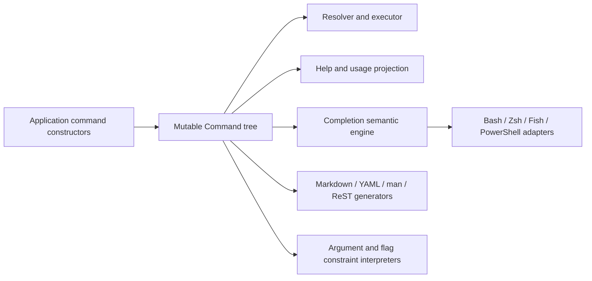

# Architecture Garden — Cobra

Cobra is best understood not merely as a flag parser, but as a mutable command-language model with several interpreters. A single `Command` tree carries syntax, descriptions, flags, constraints, lifecycle hooks, execution callbacks, I/O policy, and parent-child structure. Dispatch, help, completion, and generated documentation are then derived from that tree.

This study records the architectural laws that make that arrangement reusable. It is pinned to commit [`adbc8813901bba65827259daa8e22ff94ec1f30e`](https://github.com/spf13/cobra/commit/adbc8813901bba65827259daa8e22ff94ec1f30e) on `main`, dated 2026-07-11. The repository was inspected remotely; no claim is made about a local worktree.

> [!summary]
> - The architectural center is an executable command tree that also acts as the schema for help, completion, and documentation.
> - Command execution is a staged interpreter: resolve, parse, handle control flags, validate, run hooks and action, then render errors according to host policy.
> - Hierarchical scope is explicit: persistent flags merge downward, local flags shadow inherited names, and templates, I/O, and error policy use nearest-ancestor lookup.
> - Relational flag constraints are declared once and interpreted by both runtime validation and completion.
> - Shell completion is a machine protocol over a hidden command, not shell-specific duplication of command semantics.
> - Framework-supplied help and completion capabilities are injected late and yield to application-defined replacements.
> - The strongest liabilities are mutable shared state, package-global policy switches, stringly typed annotations, and projection methods that mutate the model they inspect.

- [[Research/Software Architecture Garden/cobra/Index of Design Patterns|Index of Design Patterns]] — back-of-the-book index, glossary, failure-mode index, and notation table.
- [[Research/Software Architecture Garden/cobra/Index of Design Patterns - Rationale|Index rationale]] — why each indexed term was selected or redirected.
- [[Research/Software Architecture Garden/cobra/Evidence Ledger|Evidence Ledger]] — claim-by-claim source and test evidence.
- [`scripts/validate_index_links.py`](scripts/validate_index_links.py) — validates local Markdown and Obsidian links.

## Using this bundle

Place the extracted `cobra/` directory at `Research/Software Architecture Garden/cobra/` in the target vault. The Obsidian links are intentionally vault-rooted to that location. From the bundle root, run `python scripts/validate_index_links.py`; a successful run checks every local file and heading target, duplicate index headings, and redirect termination. `manifest.json` records the pinned source snapshot and SHA-256 digest of each delivered file.

## 1. Scope and provenance

The evidence order is runtime code and public interfaces first, tests second, generated artifacts third, and comments/history only where they clarify a compatibility or failure boundary. The primary files are: The study is static: tests were read as behavioral specifications, not executed in this environment.

| Area | Evidence |
|---|---|
| Command model, resolution, execution, hierarchy, I/O, help | [`command.go`](https://github.com/spf13/cobra/blob/adbc8813901bba65827259daa8e22ff94ec1f30e/command.go#L45-L2070) |
| Package-level policy and compatibility helpers | [`cobra.go`](https://github.com/spf13/cobra/blob/adbc8813901bba65827259daa8e22ff94ec1f30e/cobra.go#L25-L240) |
| Positional validation algebra | [`args.go`](https://github.com/spf13/cobra/blob/adbc8813901bba65827259daa8e22ff94ec1f30e/args.go#L20-L145) |
| Relational flag constraints | [`flag_groups.go`](https://github.com/spf13/cobra/blob/adbc8813901bba65827259daa8e22ff94ec1f30e/flag_groups.go#L20-L285) |
| Completion protocol and semantic engine | [`completions.go`](https://github.com/spf13/cobra/blob/adbc8813901bba65827259daa8e22ff94ec1f30e/completions.go#L20-L1050) |
| Flag completion annotations | [`shell_completions.go`](https://github.com/spf13/cobra/blob/adbc8813901bba65827259daa8e22ff94ec1f30e/shell_completions.go#L20-L125) |
| Markdown and YAML projections | [`doc/md_docs.go`](https://github.com/spf13/cobra/blob/adbc8813901bba65827259daa8e22ff94ec1f30e/doc/md_docs.go#L20-L145), [`doc/yaml_docs.go`](https://github.com/spf13/cobra/blob/adbc8813901bba65827259daa8e22ff94ec1f30e/doc/yaml_docs.go#L20-L165) |
| Behavioral contracts | [`command_test.go`](https://github.com/spf13/cobra/blob/adbc8813901bba65827259daa8e22ff94ec1f30e/command_test.go), [`completions_test.go`](https://github.com/spf13/cobra/blob/adbc8813901bba65827259daa8e22ff94ec1f30e/completions_test.go), [`flag_groups_test.go`](https://github.com/spf13/cobra/blob/adbc8813901bba65827259daa8e22ff94ec1f30e/flag_groups_test.go) |

This Garden does not claim that every Cobra implementation detail is an ecosystem pattern. Each design entry separates:

1. the invariant worth preserving;
2. Cobra's concrete mechanism;
3. the mechanism's local maturity;
4. the evidence needed before treating it as broader guidance.

## 2. Repository map

Cobra has a deliberately shallow package structure. Most runtime semantics live in the root `cobra` package, while documentation generators occupy `doc`.

```text
cobra/
├── command.go                 central model, tree operations, dispatch, execution, help
├── cobra.go                   package policy switches, template functions, init/finalize hooks
├── args.go                    positional validator functions and combinators
├── flag_groups.go             relational constraints and completion enforcement
├── shell_completions.go       flag annotations shared with completion
├── completions.go             hidden protocol command and shell-neutral completion engine
├── active_help.go             protocol-marked contextual help
├── *_completions*.go          shell adapters and script generators
├── doc/
│   ├── md_docs.go             Markdown projection
│   ├── yaml_docs.go           structured YAML projection
│   ├── man_docs.go            man-page projection
│   └── rest_docs.go           reStructuredText projection
└── *_test.go                  protocol, ordering, inheritance, and regression contracts
```

The package depends on `pflag` for flag sets. Cobra's own contribution is the hierarchy, staged interpretation, projections, lifecycle, and compatibility envelope around those sets.

## 3. Architectural center: one executable model, several interpreters

The `Command` object is simultaneously:

- a node in a composite tree;
- a declaration of user-visible syntax and prose;
- a container for local and persistent flags;
- a registry of validators and lifecycle callbacks;
- a dispatch target;
- a source model for help, completion, and documentation;
- an inherited environment for descendants.



The core consistency law is:

> A capability visible through execution, help, completion, or generated documentation should be derived from the same command node and effective flag environment.

This reduces schema duplication but does not eliminate semantic drift. A `RunE` callback can accept behavior that its `Use`, `Args`, examples, or completion metadata do not describe. The tree is authoritative only for semantics actually represented in the model.

See [[Research/Software Architecture Garden/cobra/designs/01 - Executable Command Tree as a Multi-Projection Model|Executable Command Tree as a Multi-Projection Model]].

## 4. Execution model

At root execution, Cobra normalizes to the root command, installs relevant defaults, resolves the selected node, propagates context, and executes the selected node's staged pipeline.

```mermaid
sequenceDiagram
    participant H as Host
    participant R as Root Command
    participant C as Selected Command
    participant A as Action

    H->>R: ExecuteC(args, context)
    R->>R: inject relevant help/completion capabilities
    R->>R: Find(args) or Traverse(args)
    R->>C: selected command + remaining tokens
    C->>C: initialize help/version flags
    C->>C: parse flags
    alt help or version
        C-->>H: render control result
    else runnable invocation
        C->>C: positional validation
        C->>C: persistent and local pre-hooks
        C->>C: required-flag and flag-group validation
        C->>A: Run / RunE
        A-->>C: success or error
        opt success
            C->>C: local and persistent post-hooks
        end
        C-->>H: error value; optional framework rendering
    end
```

Two details are easy to miss:

- `TraverseChildren` changes parsing from “resolve, then parse the selected command's effective flags” to “parse each parent's flags while descending.”
- Required-flag and relational flag-group checks occur after pre-run hooks. Pre-run code therefore must not assume that every invocation-level guard has already passed.

The action law is still strong: `Run` or `RunE` is not called until the selected command is runnable and all built-in argument and flag guards have succeeded. See [[Research/Software Architecture Garden/cobra/designs/02 - Resolve Parse Guard Run as a Staged CLI Interpreter|Resolve–Parse–Guard–Run as a Staged CLI Interpreter]] and [[Research/Software Architecture Garden/cobra/designs/05 - Composable Validation Policies|Composable Validation Policies]].

## 5. Hierarchical configuration and lifecycle

Cobra uses more than one inheritance operator.

| Property | Inheritance rule | Local override |
|---|---|---|
| Persistent flags | union of ancestor declarations | local flag with the same name shadows inherited flag |
| Usage/help/version functions and templates | nearest non-empty ancestor | first local definition wins |
| I/O readers and writers | nearest configured ancestor | local stream wins |
| Error prefix and flag error function | nearest configured ancestor | local policy wins |
| Context | root context copied to selected command when absent | an already-set child context is retained |
| Persistent hooks | nearest hook by default, or all ancestors under traversal policy | local pre/post hooks remain node-local |

A useful abstraction is a lexical environment. Let `L(c)` be local declarations, `P(c)` persistent declarations, and `Anc(c)` the root-to-parent chain. The effective flag environment is a left-biased overlay:

```text
EffectiveFlags(c) = L(c) ⊕ P(c) ⊕ P(parent(c)) ⊕ ... ⊕ P(root(c))
```

where the first declaration of a name wins. Templates and streams instead use nearest-ancestor lookup, not set union.

See [[Research/Software Architecture Garden/cobra/designs/03 - Scoped Inheritance with Local Shadowing|Scoped Inheritance with Local Shadowing]] and [[Research/Software Architecture Garden/cobra/designs/04 - Ordered Ancestral Lifecycle Interceptors|Ordered Ancestral Lifecycle Interceptors]].

## 6. Completion as a semantic protocol

Completion is not generated by asking each shell to rediscover the command tree. Shell scripts invoke the hidden `__complete` or `__completeNoDesc` command. Cobra resolves the partial command line, applies flag and argument semantics, and emits:

```text
candidate [TAB description] NEWLINE
candidate [TAB description] NEWLINE
...
":" directive-integer NEWLINE
```

The last directive is a bitmask such as “do not add a space,” “do not fall back to file completion,” “filter by extension,” or “preserve order.” Stdout is protocol data. Diagnostics are routed to stderr or a debug file.

The semantic engine also reuses constraint annotations. For example, a mutually exclusive flag becomes unavailable to completion after another member is present, while an unsatisfied one-required group is prioritized. This is stronger than consistent prose: the same declaration drives prevention and recovery.

See [[Research/Software Architecture Garden/cobra/designs/06 - Constraint Metadata Shared by Validation and Completion|Constraint Metadata Shared by Validation and Completion]] and [[Research/Software Architecture Garden/cobra/designs/07 - Completion as a Stable Side-Channel Protocol|Completion as a Stable Side-Channel Protocol]].

## 7. Help and documentation projections

Default usage and help render directly from command methods, effective flags, aliases, examples, groups, availability, and parent paths. The `doc` package repeats the same traversal for Markdown, YAML, man pages, and reStructuredText.

A projection is valid only if it respects the same availability and inheritance rules as execution. Cobra largely achieves this by calling the same command methods, but projection-time initialization and mutation remain important:

- documentation generators initialize default help before reading the tree;
- `Commands()` may sort children lazily;
- effective flag methods merge and cache inherited sets;
- completion may temporarily add or remove synthetic commands.

This makes the command tree closer to a mutable compiler IR than an immutable schema value. See [[Research/Software Architecture Garden/cobra/designs/01 - Executable Command Tree as a Multi-Projection Model|Executable Command Tree as a Multi-Projection Model]] and [[Research/Software Architecture Garden/cobra/designs/08 - Late-Bound Synthetic Capabilities with User Override|Late-Bound Synthetic Capabilities with User Override]].

## 8. Process and presentation boundary

`SetArgs`, `SetIn`, `SetOut`, `SetErr`, `ExecuteContext`, and error-returning `Execute` methods make the command environment injectable. Tests can run the same command tree against buffers and explicit argument slices without owning the process.

`SilenceErrors` and `SilenceUsage` decide whether Cobra renders a returned error and usage. The outer program still decides the exit code. This is the correct default boundary for a library. The package also contains convenience exceptions such as `CheckErr`, and the YAML generator contains an internal `os.Exit` path; those should remain at process edges rather than become the model for reusable code.

See [[Research/Software Architecture Garden/cobra/designs/09 - Host-Owned Error Rendering and Injectable I-O|Host-Owned Error Rendering and Injectable I/O]].

## 9. Pattern maturity assessment

The entries are marked `candidate` because this Garden studies one implementation. Within Cobra, each is supported by runtime code and tests and is therefore **established locally**. Cross-project reuse remains a **candidate ecosystem pattern** until independent implementations protect the same law.

| No. | Pattern | Maturity | Protected idea |
|---:|---|---|---|
| 01 | [[Research/Software Architecture Garden/cobra/designs/01 - Executable Command Tree as a Multi-Projection Model|Executable Command Tree as a Multi-Projection Model]] | Established locally; candidate ecosystem pattern | One mutable `Command` tree is the authoritative model for dispatch, help, completion, and generated documentation. |
| 02 | [[Research/Software Architecture Garden/cobra/designs/02 - Resolve Parse Guard Run as a Staged CLI Interpreter|Resolve–Parse–Guard–Run as a Staged CLI Interpreter]] | Established locally; candidate ecosystem pattern | Cobra resolves a command, parses its effective flags, handles control flags, validates arguments and relational constraints, and only then invokes the command action. |
| 03 | [[Research/Software Architecture Garden/cobra/designs/03 - Scoped Inheritance with Local Shadowing|Scoped Inheritance with Local Shadowing]] | Established locally; candidate ecosystem pattern | A command’s effective environment combines local flags with persistent flags from its ancestors, while local declarations shadow inherited names. |
| 04 | [[Research/Software Architecture Garden/cobra/designs/04 - Ordered Ancestral Lifecycle Interceptors|Ordered Ancestral Lifecycle Interceptors]] | Established locally; candidate ecosystem pattern | Persistent hooks wrap descendant actions, with pre-hooks ordered toward the leaf and post-hooks ordered back toward the root when traversal is enabled. |
| 05 | [[Research/Software Architecture Garden/cobra/designs/05 - Composable Validation Policies|Composable Validation Policies]] | Established locally; candidate ecosystem pattern | Positional argument rules are first-class functions, with factories for cardinality and membership and `MatchAll` for ordered conjunction. |
| 06 | [[Research/Software Architecture Garden/cobra/designs/06 - Constraint Metadata Shared by Validation and Completion|Constraint Metadata Shared by Validation and Completion]] | Established locally; candidate ecosystem pattern | Required, one-of, all-or-none, mutually exclusive, filename, and directory constraints are attached to flag metadata. |
| 07 | [[Research/Software Architecture Garden/cobra/designs/07 - Completion as a Stable Side-Channel Protocol|Completion as a Stable Side-Channel Protocol]] | Established locally; candidate ecosystem pattern | Shell scripts invoke a hidden command that emits candidate lines followed by a final directive bitmask. |
| 08 | [[Research/Software Architecture Garden/cobra/designs/08 - Late-Bound Synthetic Capabilities with User Override|Late-Bound Synthetic Capabilities with User Override]] | Established locally; candidate ecosystem pattern | Help flags, version flags, help commands, completion commands, and the hidden completion endpoint are synthesized near execution or projection time. |
| 09 | [[Research/Software Architecture Garden/cobra/designs/09 - Host-Owned Error Rendering and Injectable I-O|Host-Owned Error Rendering and Injectable I/O]] | Established locally; candidate ecosystem pattern | Arguments, context, stdin, stdout, and stderr can be supplied through the command object, and `Execute` returns an error. |
| 10 | [[Research/Software Architecture Garden/cobra/designs/10 - Conservative Recovery without Ambiguous Dispatch|Conservative Recovery without Ambiguous Dispatch]] | Established locally; candidate ecosystem pattern | Exact names and aliases dispatch commands; typo similarity normally produces suggestions rather than execution. |
| 11 | [[Research/Software Architecture Garden/cobra/designs/11 - Compatibility without Semantic Forks|Compatibility without Semantic Forks]] | Established locally; candidate ecosystem pattern | Command aliases, deprecated APIs, and legacy helpers delegate into the current command or validator semantics instead of maintaining separate implementations. |

## 10. Failure modes, debt, and open correctness obligations

### 10.1 Mutable model and in-process reuse

Execution, help, completion, flag merging, sorting, and default injection all mutate parts of the command graph. Normal CLI use creates one process per invocation, which limits the consequences. Long-lived embedding, concurrent execution, or repeated completion against one tree requires a stricter ownership model. No thread-safety guarantee for the command graph should be inferred from the mutex protecting the separate flag-completion function registry.

### 10.2 Package-global policy

Prefix matching, command sorting, case sensitivity, hook traversal, initializers, finalizers, and template functions are package-global. They are compatibility-friendly but couple otherwise independent command trees in one process. Parallel tests and multi-tenant embeddings must serialize or isolate policy changes.

### 10.3 Stringly typed constraint annotations

Flag relationships are encoded through annotation keys and space-joined flag-name groups. This is effective inside one package, but it lacks compile-time shape checking, a versioned schema, and immutable projection semantics.

### 10.4 Pre-hook side effects before all guards

Positional validation occurs before pre-hooks, but required-flag and flag-group validation occurs after them. A pre-hook that opens a transaction, writes state, or acquires an external lease can run for an invocation that later fails a relational guard.

### 10.5 Projection-time mutation and cache invalidation

`AddCommand`, `RemoveCommand`, inherited flag merging, command sorting, help initialization, and completion enforcement maintain derived state. New mutation paths must invalidate or recompute every affected cache. Completion's hiding or marking of flags is safe under the usual short-lived-process model but deserves scrutiny in repeated in-process calls.

### 10.6 Unversioned completion wire format

The completion output grammar is treated as stable through comments and tests, but it carries no explicit protocol version. A future incompatible directive or escaping change would have to coordinate library and generated shell scripts through convention.

### 10.7 Documentation filename collisions

The documentation generators flatten command paths into filenames. Their own comments note collisions involving hyphenated command names. A reusable generator should use an injective path encoding or manifest rather than relying on punctuation replacement.

### 10.8 Metadata drift

No framework can derive accurate help or completion from semantics hidden only inside callbacks. Review must compare `Use`, `Args`, flags, examples, completion functions, and runtime behavior as one contract.

## 11. Candidate ecosystem guidance

1. Model a command surface once, then interpret it for execution and every user/tooling projection.
2. Keep resolution, parsing, control handling, validation, action, and rendering as explicit phases with contract tests.
3. Define inheritance per property: mergeable sets, nearest overrides, and propagated context are different operations.
4. Treat lifecycle ordering as API, including which failures suppress post-hooks.
5. Express validators as pure, composable policies with deterministic messages.
6. Store semantic constraints in typed metadata and give each projection an interpreter over the same declaration.
7. Keep completion logic shell-neutral and expose a small, versioned machine protocol to adapters.
8. Finalize framework defaults idempotently and let explicit application definitions win.
9. Return errors and inject I/O in the library; own exit status and terminal presentation at the host boundary.
10. Offer fuzzy recovery as advice, not an implicit side-effecting dispatch rule.
11. Preserve compatibility by delegation into one canonical path, with tests and an explicit removal horizon.

## 12. Evidence and references

- Source snapshot: [`adbc8813901bba65827259daa8e22ff94ec1f30e`](https://github.com/spf13/cobra/commit/adbc8813901bba65827259daa8e22ff94ec1f30e)
- Core model and execution: [`command.go`](https://github.com/spf13/cobra/blob/adbc8813901bba65827259daa8e22ff94ec1f30e/command.go)
- Validation: [`args.go`](https://github.com/spf13/cobra/blob/adbc8813901bba65827259daa8e22ff94ec1f30e/args.go), [`flag_groups.go`](https://github.com/spf13/cobra/blob/adbc8813901bba65827259daa8e22ff94ec1f30e/flag_groups.go)
- Completion: [`completions.go`](https://github.com/spf13/cobra/blob/adbc8813901bba65827259daa8e22ff94ec1f30e/completions.go), [`shell_completions.go`](https://github.com/spf13/cobra/blob/adbc8813901bba65827259daa8e22ff94ec1f30e/shell_completions.go)
- Projections: [`doc/md_docs.go`](https://github.com/spf13/cobra/blob/adbc8813901bba65827259daa8e22ff94ec1f30e/doc/md_docs.go), [`doc/yaml_docs.go`](https://github.com/spf13/cobra/blob/adbc8813901bba65827259daa8e22ff94ec1f30e/doc/yaml_docs.go)
- Tests: [`command_test.go`](https://github.com/spf13/cobra/blob/adbc8813901bba65827259daa8e22ff94ec1f30e/command_test.go), [`completions_test.go`](https://github.com/spf13/cobra/blob/adbc8813901bba65827259daa8e22ff94ec1f30e/completions_test.go), [`flag_groups_test.go`](https://github.com/spf13/cobra/blob/adbc8813901bba65827259daa8e22ff94ec1f30e/flag_groups_test.go)
- Internal claim mapping: [[Research/Software Architecture Garden/cobra/Evidence Ledger|Evidence Ledger]]
